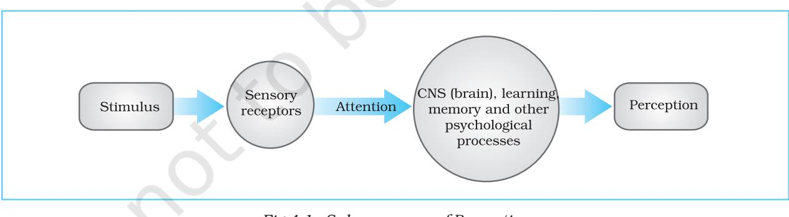
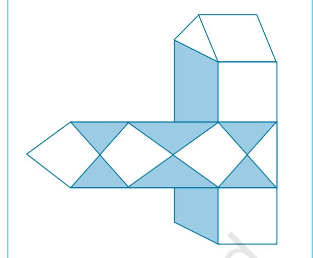
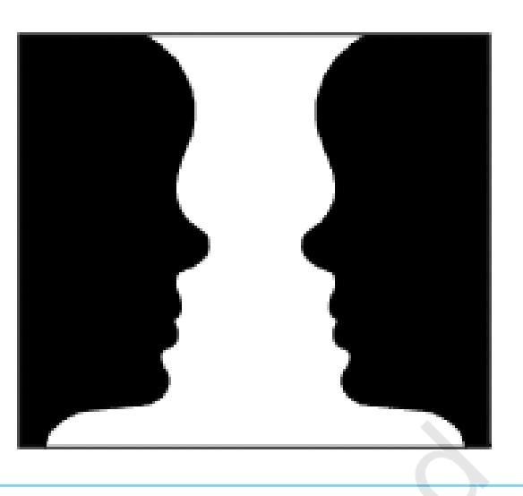
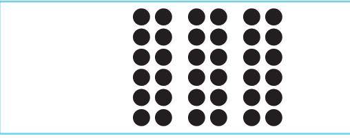
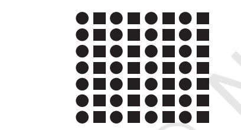
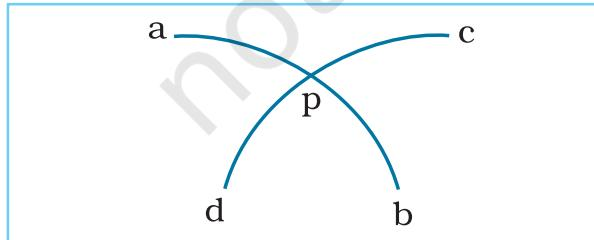
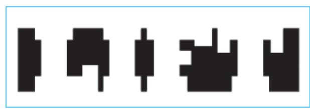
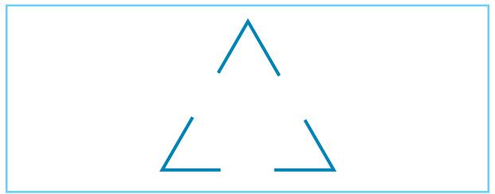
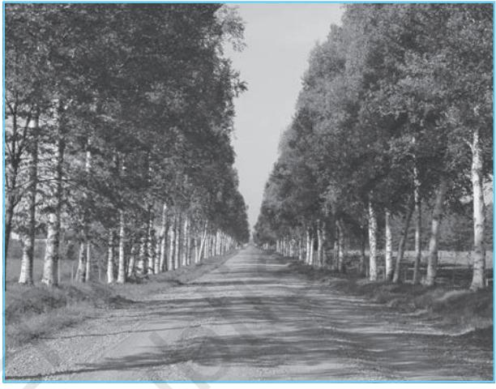

Chapter4

# Sensory, Attentional and ttentional andttentional and Perceptual Processes Sensory Sensory, Attentional and ttentional andttentional and Perceptual Processes

# After reading this chapter, you would be able to

- understand the nature of sensory processes,
- explain the processes and types of attention,
- analyse the problems of form and space perception,
- examine the role of socio-cultural factors in perception, and
- reflect on sensory, attentional and perceptual processes in everyday life.

# Contents

**Introduction Knowing the World Nature and Varieties of Stimulus Sense Modalities Attentional Processes** Selective Attention *Divided Attention* (Box 4.1) Sustained Attention *Span of Attention* (Box 4.2) *Attention Deficit Hyperactivity Disorder* (Box 4.3) **Perceptual Processes** Processing Approaches in Perception **The Perceiver Principles of Perceptual Organisation Perception of Space, Depth, and Distance** Monocular Cues and Binocular Cues **Perceptual Constancies Illusions Socio-Cultural Influences on Perception Key Terms**

**Summary Review Questions Project Ideas**

*The quality of life is determined by its activities.*

Psychology 60

– Aristotle

# Introduction

*While some of our receptors are clearly observable (for example, eyes or ears), others lie inside our body, and are not observable without the help of electrical or mechanical devices. This chapter will introduce you to various receptors that collect a variety of information from the external and internal worlds. You will also know some important things about attention, which helps us to notice and register the information that our sense organs carry to us. Different types of attention will be described along with the factors that influence them. At the end, we will discuss the process of perception that allows us to understand the world in a meaningful way. You will also have an opportunity to know how we are sometimes deceived by certain types of stimuli such as figures and pictures.*

## **KNOWING THE WORLD**

The world in which we live is full of variety of objects, people, and events. Look at the room you are sitting in. You will find so many things around. Just to mention a few, you may see your table, your chair, your books, your bag, your watch, pictures on the wall and many other things. Their sizes, shapes, and colours are also different. If you move to other rooms of your house, you will notice several other new things (e.g., pots and pans, almirah, TV). If you go beyond your house, you will find still many more things that you generally know about (trees, animals, buildings). Such experiences are very common in our day-today life. We hardly have to make any efforts to know them.

If someone asks you, "How can you say that these various things exist in your room, or house, or in the outside environment?", you will most probably answer that you see or experience them all around you. In doing so, you are trying to tell the person that the knowledge about various objects becomes possible with the help of our sense organs (e.g., eyes, ears). These organs collect information not only from the external world, but also from our own body. The information collected by our sense organs forms the basis of all our knowledge. The sense organs register several

kinds of information about various objects. However, in order to be registered, the objects and their qualities (e.g., size, shape, colour) must be able to draw our attention. The registered information must also be sent to the brain that constructs some meaning out of them. Thus, our knowledge of the world around us depends on three basic processes, called sensation, attention, and perception. These processes are highly interrelated; hence, they are often considered as different elements of the same process, called cognition.

# **NATURE AND VARIETIES OF STIMULUS**

The external environment that surrounds us contains a wide variety of stimuli. Some of them can be seen (e.g., a house), while some can be heard only (e.g., music). There are several others that we can smell (e.g., fragrance of a flower) or taste (e.g., sweets). There are still others that we can experience by touching (e.g., softness of a cloth). All these stimuli provide us with various kinds of information. We have very specialised sense organs to deal with these different stimuli. As human beings we are bestowed with a set of seven sense organs. These sense organs are also known as sensory receptors or information gathering systems, because they receive or gather information from a variety of sources. Five of these sense

organs collect information from the external world. These are eyes, ears, nose, tongue, and skin. While our eyes are primarily responsible for vision, ears for hearing, nose for smell, and tongue for taste, skin is responsible for the experiences of touch, warmth, cold, and pain. Specialised receptors of warmth, cold, and pain are found inside our skin. Besides these five external sense organs, we have also got two deep senses. They are called kinesthetic and vestibular systems. They provide us with important information about our body position and movement of body parts related to each other. With these seven sense organs, we register ten different variety of stimuli. For example, you may notice whether a light is bright or dim, whether it is yellow, red or green, and so on. With sound you may notice whether it is loud or faint, whether it is melodious or distracting, and so on. These different qualities of stimuli are also registered by our sense organs.

### **SENSE MODALITIES**

Our sense organs provide us with first-hand information about our external or internal world. The initial experience of a stimulus or an object registered by a particular sense organ is called sensation. It is a process through which we detect and encode a variety of physical stimuli. Sensation also refers to immediate basic experiences of stimulus attributes, such as "hard", "warm", "loud", and "blue", which result from appropriate stimulation of a sensory organ. Different sense organs deal with different forms of stimuli and serve different purposes. Each sense organ is highly specialised for dealing with a particular kind of information. Hence, each one of them is known as a sense modality.

# **Functional Limitations of Sense Organs**

Before we move on to a discussion of sense organs, it is important to note that our sense organs function with certain limitations. For example, our eyes cannot see things which are very dim or very bright. Similarly our ears cannot hear very faint or very loud sounds. The same is true for other sense organs also. As human beings, we function within a limited range of stimulation. For being noticed by a sensory receptor, a stimulus has to be of an optimal intensity or magnitude. The relationship between stimuli and the sensations they evoke has been studied in a discipline, called **psychophysics**.

In order to be noticed a stimulus has to carry a minimum value or weight. The minimum value of a stimulus required to activate a given sensory system is called **absolute threshold** or **absolute limen** (AL). For example, if you add a granule of sugar to a glass of water, you may not experience any sweetness in that water. Addition of a second granule to water may also not make it taste sweet. But if you go on adding sugar granules one after another, there will come a point when you will say that the water is now sweet. The minimum number of sugar granules required to say that the water is sweet will be the AL of sweetness.

It may be noted at this point that the AL is not a fixed point; instead it varies considerably across individuals and situations depending on the people's organic conditions and their motivational states. Hence, we have to assess it on the basis of a number of trials. The number of sugar granules that may produce the experience of "sweetness" in water on 50 per cent of occasions will be called the AL of sweetness. If you add more number of sugar granules, the chances are greater that the water will be reported more often as sweet than plain.

As it is not possible for us to notice all stimuli, it is also not possible to differentiate between all stimuli. In order to notice two stimuli as different from each other, there has to be some minimum difference between the value of those stimuli. The smallest difference in the value of two stimuli that is necessary to notice them as different is called **difference threshold** or **difference limen** (DL). To understand it, we may continue with our "sugar water" experiment. As we have seen,

Psychology 62

the plain water is experienced as sweet after the addition of certain number of sugar granules. Let us remember this sweetness. The next question is: how many sugar granules will be needed in the water in order to experience its sweetness as different from the previous sweetness. Go on adding sugar granules one after another tasting the water each time. After addition of a few granules, you will notice at a point that the water is now sweeter than the previous one. The number of sugar granules added to the water to generate an experience of sweetness that is different from the previous sweetness on 50 per cent of the occasions will be called the DL of sweetness. Thus, difference threshold is the minimum amount of change in a physical stimulus that is capable of producing a sensation difference on 50 per cent of the trials.

You may realise by now that understanding of sensations is not possible without understanding the AL and DL of different types of stimuli (for example, visual, auditory), but that is not enough. Sensory processes do not depend only on the stimulus characteristics. Sense organs and the neural pathways connecting them to various brain centers also play a vital role in this process. A sense organ receives the stimulus and encodes it as an electrical impulse. For being noticed this electrical impulse must reach the higher brain centers. Any structural or functional defect or damage in the receptor organ, its neural pathway, or the concerned brain area may lead to a partial or complete loss of sensation.

# Activity ActivityActivity 4.1

*Vision and hearing are generally believed to be the two most highly prized senses. What would your life be if you lost any one of your senses? Which sense would you find more traumatic to lose? Why? Think and write down.*

*What if you could magically improve the performance of one of your senses, which sense would you choose to improve? Why? Could you improve the performance of this one sense without magic? Think and write down.*

*Discuss with your teacher.*

#### **ATTENTIONAL PROCESSES**

In the previous section we have discussed some sensory modalities that help us in collecting information from the external world and also from our internal system. A large number of stimuli impinge upon our sense organs simultaneously, but we do not notice all of them at the same time. Only a selected few of them are noticed. For example, when you enter your classroom you encounter several things in it, such as doors, walls, windows, paintings on walls, tables, chairs, students, schoolbags, water bottles, and so on, but you selectively focus only on one or two of them at one time. *The process through which certain stimuli are selected from a group of others is generally referred to as attention.*

At this point it may be noted that besides selection, attention also refers to several other properties like alertness, concentration, and search. Alertness refers to an individual's readiness to deal with stimuli that appear before her/him. While participating in a race in your school, you might have seen the participants on the starting line in an alert state waiting for the whistle to blow in order to run. Concentration refers to focusing of awareness on certain specific objects while excluding others for the moment. For example, in the classroom, a student concentrates on the teacher's lecture and ignores all sorts of noises coming from different corners of the school. In search an observer looks for some specified subset of objects among a set of objects. For example, when you go to fetch your younger sister and brother from the school, you just look for them among innumerable boys and girls. All these activities require some kind of effort on the part of people. Attention in this sense refers to "effort allocation".

Attention has a focus as well as a fringe. When the field of awareness is centered on a particular object or event, it is called focus or the focal point of attention. On the contrary, when the objects or events are away from the center of awareness and one is only vaguely aware of them, they are said to be at the fringe of attention.

Chapter 4 • *Sensory, Attentional and Perceptual Processes* 63

Attention has been classified in a number of ways. A process-oriented view divides it into two types, namely **selective** and **sustained**. We will briefly discuss the main features of these types of attention. Sometimes we can also attend to two different things at the same time. When this happens, it is called **divided attention**. Box 4.1 describes when and how the division of attention is possible.

### **Selective Attention**

Selective attention is concerned mainly with the selection of a limited number of stimuli or objects from a large number of stimuli. We have already indicated that our perceptual system has a limited capacity to receive and process information. This means that it can deal only with a few stimuli at a given moment of time. The question is, which of those stimuli will get selected and processed? Psychologists have identified a number of factors that determine the selection of stimuli.

### *Factors Affecting Selective Attention*

Several factors influence selective attention. These generally relate to the characteristics of stimuli and the characteristics of individuals. They are generally classified as "external" and "internal" factors.

**External factors** are related to the features of stimuli. Other things held constant, the size, intensity, and motion of stimuli appear to be important determinants of attention. Large, bright, and moving stimuli easily catch our attention. Stimuli, which are novel and moderately complex, also easily get into our focus. Studies indicate that human photographs are more likely to be attended to than the photographs of inanimate objects. Similarly, rhythmic auditory stimuli are more readily attended to than verbal narrations. Sudden and intense stimuli have a wonderful capacity to draw attention.

**Internal factors** lie within the individual. These may be divided into two main categories, viz. motivational factors and cognitive factors. **Motivational factors** relate to our biological or social needs. When we are hungry, we notice even a faint smell of food. A student taking an examination is likely to focus on a teacher's instructions more than other students. **Cognitive factors** include factors like interest, attitude, and preparatory set. Objects or events, which appear interesting, are readily attended by individuals. Similarly we pay quick attention to certain objects or events to which we are favourably disposed. Preparatory set generates a mental state to act in a certain way and readiness of the individual to respond to one kind of stimuli and not to others.

### *Theories of Selective Attention*

A number of theories have been developed to explain the process of selective attention. We will briefly discuss three of these theories.

**Filter theory** was developed by Broadbent (1956). According to this theory, many stimuli

# Box 4.1 Divided Attention

*In day-to-day life we attend to several things at the same time. You must have seen people driving a car and talking to a friend, or attending to phone calls on a mobile set, or putting on sunglasses, or listening to music. If we watch them closely, we will notice that they are still allocating more effort to driving than to other activities, even though some attention is given to other activities. It indicates that on certain occasions attention can be allocated to more than one thing at the same* *time. However, this becomes possible only with highly practiced activities, because they become almost automatic and require less attention to perform than new or slightly practiced activities.*

**Automatic processing** *has three main characteristics; (i) It occurs without intention, (ii) It takes place unconsciously, and (iii) It involves very little (or no) thought processes (e.g., we can read words or tie our shoelaces without giving any thought to these activities).*

Psychology 64

simultaneously enter our receptors creating a kind of "bottleneck" situation. Moving through the short-term memory system, they enter the selective filter, which allows only one stimulus to pass through for higher levels of processing. Other stimuli are screened out at that moment of time. Thus, we become aware of only that stimulus, which gets access through the selective filter.

**Filter-attenuation theory** was developed by Triesman (1962) by modifying Broadbent's theory. This theory proposes that the stimuli not getting access to the selective filter at a given moment of time are not completely blocked. The filter only attenuates (weakens) their strength. Thus some stimuli manage to escape through the selective filter to reach higher levels of processing. It is indicated that personally relevant stimuli (e.g., one's name in a collective dinner) can be noticed even at a very low level of sound. Such stimuli, even though fairly weak, may also generate response occasionally by slipping through the selective filter.

**Multimode theory** was developed by Johnston and Heinz (1978). This theory believes that attention is a flexible system that allows selection of a stimulus over others at three stages. At stage one the sensory representations (e.g., visual images) of stimuli are constructed; at stage two the semantic representations (e.g., names of objects) are constructed; and at stage three the sensory and semantic representations enter the consciousness. It is also suggested that more processing requires more mental effort. When the messages are selected on the basis of stage one processing (early selection), less mental effort is required than when the selection is based on stage three processing (late selection).

#### **Sustained Attention**

While selective attention is mainly concerned with the selection of stimuli, sustained attention is concerned with concentration. It refers to our ability to maintain attention on an object or event for longer durations. It is also known as "vigilance". Sometimes people have to concentrate on a particular task for many hours. Air traffic controllers and radar readers provide us with good examples of this phenomenon. They have to constantly watch and monitor signals on screens. The occurrence of signals in such situations is usually unpredictable, and errors in detecting signals may be fatal. Hence, a great deal of vigilance is required in those situations.

#### *Factors Influencing Sustained Attention*

Several factors can facilitate or inhibit an individual's performance on tasks of sustained attention. **Sensory modality** is one of them. Performance is found to be superior when the stimuli (called signals) are auditory than when they are visual. **Clarity of stimuli** is another

# Box 4.2 Span of Attention

*Our attention has a limited capacity to receive stimuli. The number of objects one can attend to at a brief exposure (i.e. a fraction of a second) is called "span of attention" or "perceptual span". More specifically, the span of attention refers to the amount of information an observer can grasp from a complex array of stimuli at a single momentary exposure. This can be determined by the use of an instrument, called "tachistoscope". On the basis of several experiments, Miller has reported that our* *span of attention varies within the limit of seven plus or minus two. This is popularly known as the "magic number". It means that at a time, people can attend to a set of five to seven numbers, which can be extended to nine or more under exceptional conditions. That is perhaps the reason why motorbikes or cars are given a number plate that contains only four digit numbers with some alphabets. In case of violation of driving rules a traffic police can easily read and note these numbers along with the alphabets.*

factor. Intense and long lasting stimuli facilitate sustained attention and result in better performance. **Temporal uncertainty** is a third factor. When stimuli appear at regular intervals of time they are attended better than when they appear at irregular intervals. **Spatial uncertainty** is a fourth factor. Stimuli that appear at a fixed place are readily attended, whereas those that appear at random locations are difficult to attend.

Attention has several practical implications. The number of objects one can readily attend to in a single glance is used to design the number plates of motorbikes and cars so that the traffic police can easily notice them in the case of traffic rule violations (Box 4.2). A number of children fail to perform well in school simply due to the problem of attention. Box 4.3 presents some interesting information about a disorder of attention.

#### **PERCEPTUAL PROCESSES**

In the previous section we have examined that the stimulation of sensory organs leads us to experience something such as, a flash of light or a sound, or a smell. This elementary experience, called sensation, does not provide us with any understanding of the stimulus that stimulated the sense organ. For example, it does not inform us about the source of the light, sound or fragrance. In order to make sense out of the raw material provided by the sensory system, we process it further. In doing

# Box 4.3 Attention Deficit Hyperactivity Disorder (ADHD)

*This is a very common behavioural disorder found among children of the primary school age. It is characterised by impulsivity, excessive motor activity, and an inability to attend. The disorder is more prevalent among boys than among girls. If not managed properly, the attention difficulties may persist into adolescence or adult years. Difficulty in sustaining attention is the central feature of this disorder, which gets reflected in several other domains of the child. For example, such children are highly distractible; they do not follow instructions, have difficulty in getting along with parents, and are negatively viewed by their peers. They do poorly in school, and show difficulties in reading or learning basic subjects in schools in spite of the fact that there is no deficit in their intelligence.*

*Studies generally do not provide evidence for a biological basis of the disorder, whereas some relationship of the disorder with dietary factors, particularly food colouring, has been documented. On the other hand, social-psychological factors (e.g., home environment, family pathology) have been* *found to account for ADHD more reliably than other factors. Currently ADHD is considered to have multiple causes and effects.*

*Disagreement remains over the most effective method of treatment of ADHD. A drug, called Ritalin, is widely used, which decreases children's over-activity and distractibility, and at the same time increases their attention and ability to concentrate. However, it does not "cure" the problem, and often also results in such negative side-effects as the suppression in normal growth of height and weight. On the other hand, behavioural management programmes, featuring positive reinforcement and structuring learning materials and tasks in such a way that minimises errors and maximises immediate feedback and success, have been found quite useful. Successful modification of ADHD is claimed with cognitive behavioural training programme in which rewards for desired behaviours are combined with training in the use of verbal selfinstructions (stop, think, and then do). With this procedure, the ADHD children learn to shift their attention less frequently and to behave reflectively a learning that is relatively stable over time.*

so, we give meaning to stimuli by using our learning, memory, motivation, emotions, and other psychological processes. *The process by which we recognise, interpret or give meaning to the information provided by sense organs is called perception.* In interpreting stimuli or events, individuals often construct them in their own ways. Thus perception is not merely an interpretation of objects or events of the external or internal world as they exist, instead it is also a construction of those objects and events from one's own point of view.

The process of meaning-making involves certain sub-processes. These are shown in Fig.4.1.

#### **Processing Approaches in Perception**

How do we identify an object? Do we identify a dog because we have first recognised its furry coat, its four legs, its eyes, ears, and so on, or do we recognise these different parts because we have first identified a dog? The idea that recognition process begins from the parts, which serve as the basis for the recognition of the whole is known as **bottom-up processing**. The notion that recognition process begins from the whole, which leads to identification of its various components is known as **topdown processing**. The bottom-up approach lays emphasis on the features of stimuli in perception, and considers perception as a process of mental construction. The top-down approach lays emphasis on the perceiver, and considers perception as a process of recognition or identification of stimuli. Studies show that in perception both the processes interact with each other to provide us with an understanding of the world.

#### **THE PERCEIVER**

Human beings are not just mechanical and passive recipients of stimuli from the external world. They are creative beings, and try to understand the external world in their own ways. In this process their motivations and expectations, cultural knowledge, past experiences, and memories as well as values, beliefs, and attitudes play an important role in giving meaning to the external world. Some of these factors are described here.

# **Motivation**

The needs and desires of a perceiver strongly influence her/his perception. People want to fulfil their needs and desires through various means. One way to do this is to perceive objects in a picture as something that will satisfy their need. Experiments were conducted to examine the influence of hunger on perception. When hungry persons were shown ambiguous pictures, they were found to perceive them as pictures of food objects more often than satiated (non-hungry) persons.

*Fig.4.1 : Sub-processes of Perception*

Chapter 4 • *Sensory, Attentional and Perceptual Processes* 67

#### **Expectations or Perceptual Sets**

The expectations about what we might perceive in a given situation also influence our perception. This phenomenon of perceptual familiarisation or perceptual generalisation reflects a strong tendency to see what we expect to see even when the results do not accurately reflect external reality. For example, if your milkman delivers you milk daily at about 5.30 A.M., any knocking at the door around that time is likely to be perceived as the presence of the milkman even if it is someone else.

# Activity ActivityActivity 4.2

*To demonstrate expectancy tell your friend to close her eyes. Write 12, 13, 14, 15 on the board. Ask her to open her eyes for 5 seconds, look at the board, and note down what she saw. Repeat replacing only the 12, 14, 15 with A, C, D viz. 'A 13 C D'. Ask her again to note down what she saw. Most people write down B in place of 13.*

# **Cognitive Styles**

Cognitive style refers to a consistent way of dealing with our environment. It significantly affects the way we perceive the environment. There are several cognitive styles that people use in perceiving their environment. One most extensively used in studies is the "field dependent and field independent" cognitive style. Field dependent people perceive the external world in its totality, i.e. in a global or holistic manner. On the other hand, field independent people perceive the external world by breaking it into smaller units, i.e. in an analytic or differentiated manner.

Look at Fig.4.2. Can you find out the triangle hidden in the picture? How much time do you take to locate it? Try to find out the time other students of your class take to locate the triangle. Those who can do it quickly will be called "field independent"; those who take long time will be called "field dependent".

*Fig.4.2 : An Item to test the 'Field Dependent' and 'Field Independent' Cognitive Style*

## **Cultural Background and Experiences**

Different experiences and learning opportunities available to people in different cultural settings also influence their perception. People coming from a pictureless environment fail to recognise objects in pictures. Hudson studied the perception of pictures by African subjects, and noted several difficulties. Many of them were unable to identify objects depicted in pictures (e.g., antelope, spear). They also failed to perceive distance in pictures, and interpreted pictures incorrectly. Eskimos have been found to make fine distinction among a variety of snow that we may be unable to notice. Some aboriginal groups of Siberian region have been found to differentiate among dozens of skin colours of reindeers, which we would not be able to do.

These studies indicate that the perceiver plays a key role in the process of perception. People process and interpret stimuli in their own ways depending on their personal, social and cultural conditions. Due to these factors our perceptions are not only finely tuned, but also modified.

#### **PRINCIPLES OF PERCEPTUAL ORGANISATION**

Our visual field is a collection of different elements, such as points, lines, and colours. However, we perceive these elements as organised wholes or complete objects. For example, we see a bicycle as a complete object, not as a collection of different parts (e.g., saddle, wheel, handle). The process of organising visual field into meaningful wholes is known as **form perception**.

You may wonder how different parts of an objects are organised into a meaningful whole. You may also ask if there are certain factors that facilitate or inhibit this process of organisation.

Several scholars have tried to answer such questions, but the most widely accepted answer has been given by a group of researchers, called **Gestalt psychologists**. Prominent among them are Köhler, Koffka, and Wertheimer. Gestalt means a regular figure or a form. According to Gestalt psychologists, we perceive different stimuli not as discrete elements, but as an organised "whole" that carries a definite form. They believe that the form of an object lies in its whole, which is different from the sum of their parts. For example, a flower pot with a bunch of flowers is a whole. If the flowers are removed, the flower pot still remains a whole. It is the configuration of the flower pot that has changed. Flower pot with flowers is one configuration; without flowers it is another configuration.

The Gestalt psychologists also indicate that our cerebral processes are always oriented towards the perception of a **good figure** or **pragnanz**. That is the reason why we perceive everything in an organised form. The most primitive organisation takes place in the form of **figure-ground segregation**. When we look at a surface, certain aspects of the surface clearly stand out as separate entities, whereas others do not. For example, when we see words on a page, or a painting on a wall, or birds flying in the sky, the words, the painting, and the birds stand out from the background, and are perceived as figures, while the page, wall,

*Fig.4.3 : Rubin's Vase*

and sky stay behind the figure and are perceived as background.

To test this experience, look at the Fig.4.3 given below. You will see either the white part of the figure, which looks like a vase (flower pot), or the black part of the figure, which looks like two faces.

We distinguish figure from the ground on the basis of the following characteristics:

- 1. Figure has a definite form, while the background is relatively formless.
- 2. Figure is more organised as compared to its background.
- 3. Figure has a clear contour (outline), while the background is contourless.
- 4. Figure stands out from the background, while the background stays behind the figure.
- 5. Figure appears more clear, limited, and relatively nearer, while the background appears relatively unclear, unlimited, and away from us.

The discussion presented above indicates that human beings perceive the world in organised wholes rather than in discrete parts. The Gestalt psychologists have given us several laws to explain how and why different stimuli in our visual field are organised into meaningful whole objects. Let us look at some of these principles.

# **The Principle of Proximity**

Objects that are close together in space or time are perceived as belonging together or as a group. For example, Fig.4.4 does not look like a square pattern of dots, but as a series of columns of dots. Similarly, Fig.4.4 also looks like a group of dots together in rows.

*Fig.4.4 : Proximity*

# **The Principle of Similarity**

Objects that are similar to one another and have similar characteristics are perceived as a group. In Fig.4.5 the little circles and squares are evenly spaced both horizontally and vertically so that the proximity does not come into play. Instead, we tend to see alternating columns of circles and squares.

*Fig.4.5 : Similarity*

# **The Principle of Continuity**

This principle states that we tend to perceive objects as belonging together if they appear to form a continuous pattern. For instance, we are more likely to identify two lines *a-b* and *cd* crossing than to identify four lines meeting at the center *p*.

*Fig.4.6 : Continuity*

Psychology 70

# **The Principle of Smallness**

According to this principle, smaller areas tend to be seen as figures against a larger background. In Fig.4.7 we are more likely to see a black cross rather than a white cross within the circle because of this principle.

*Fig.4.7 : Smallness*

# **The Principle of Symmetry**

This principle suggests that symmetrical areas tend to be seen as figures against asymmetrical backgrounds. For example, in Fig.4.8 the black areas are seen as figures (as they have symmetrical properties) against their white asymmetrical background.

*Fig.4.8 : Symmetry*

# **The Principle of Surroundedness**

According to this principle, the areas surrounded by others tend to be perceived as figures. For example, the image in Fig.4.9 looks like five figures against the white background rather than the word 'LIFT'.

*Fig.4.9 : Surroundedness*

# **The Principle of Closure**

We tend to fill the gaps in stimulation and perceive the objects as whole rather than their separate parts. For example, in Fig.4.10 the small angles are seen as a triangle due to our tendency to fill the gaps in the object provided by our sensory input.

*Fig.4.10 : Closure*

# **PERCEPTION OF SPACE, DEPTH, AND DISTANCE**

The visual field or surface in which things exist, move or can be placed is called space. The space in which we live is organised in three dimensions. We perceive not only the spatial attributes (e.g., size, shape, direction) of various objects, but also the distance between the objects found in this space. While the images of objects projected on to our retina are flat and two dimensional (left, right, up, down), we still perceive three dimensions in the space. Why does it happen so? It occurs due to our ability to transfer a two dimensional retinal vision into a three dimensional perception. The process of viewing the world in three dimensions is called distance or depth perception.

Depth perception is important in our daily life. For example, when we drive, we use depth to assess the distance of an approaching automobile, or when we decide to call a person walking down the street, we determine the loudness with which to call.

In perceiving depth, we depend on two main sources of information, called cues. One is called binocular cues because they require both eyes. Another is called monocular cues, because they allow us to perceive depth with just one eye. A number of such cues are used to change a two dimensional image into a three dimensional perception.

#### **Monocular Cues (Psychological Cues)**

Monocular cues of depth perception are effective when the objects are viewed with only one eye. These cues are often used by artists to induce depth in two dimensional paintings. Hence, they are also known as pictorial cues. Some important monocular cues that help us in judging the distance and depth in two dimensional surfaces are described below. You will find some of them applied in Fig.4.11.

*Fig.4.11 : Monocular Cues*

*The above picture will help you to understand some monocular cues: Interposition and relative size (see the trees). Which other cues can you locate in the picture?*

*Relative Size* : The size of retinal image allows us to judge distance based on our past and present experience with similar objects. As the objects get away, the retinal image becomes smaller and smaller. We tend to perceive an object farther away when it appears small, and closer when it appears bigger.

*Interposition or Overlapping* : These cues occur when some portion of the object is covered by another object. The overlapped object is considered farther away, whereas the object that covers it appears nearer.

*Linear Perspective* : This reflects a phenomenon by which distant objects appear to be closer together than the nearer objects. For example, parallel lines, such as rail tracks, appear to converge with increasing distance with a

Chapter 4 • *Sensory, Attentional and Perceptual Processes* 71

vanishing point at the horizon. The more the lines converge, the farther away they appear.

*Aerial Perspective* : The air contains microscopic particles of dust and moisture that make distant objects look hazy or blurry. This effect is called aerial perspective. For example, distant mountains appear blue due to the scattering of blue light in the atmosphere, whereas the same mountains are perceived to be closer when the atmosphere is clear.

*Light and Shade* : In the light some parts of the object get highlighted, whereas some parts become darker. Highlights and shadows provide us with information about an object's distance.

*Relative Height* : Larger objects are perceived as being closer to the viewer and smaller objects as being farther away. When we expect two objects to be the same size and they are not, the larger of the two will appear closer and the smaller will appear farther away.

*Texture Gradient* : It represents a phenomenon by which the visual field having more density of elements is seen farther away. In the Fig.4.12 the density of stones increases as we look farther away.

*Fig.4.12 : Texture Gradient*

*Motion Parallax* : It is a kinetic monocular cue, and hence not considered as a pictorial cue. It occurs when objects at different distances move at a different relative speed. The distant objects appear to move slowly than the objects that are close. The rate of an object's movement provides a cue to its distance. For example,

Psychology 72

when we travel in a bus, closer objects move "against" the direction of the bus, whereas the farther objects move "with" the direction of the bus.

# **Binocular Cues (Physiological Cues)**

Some important cues to depth perception in three dimensional space are provided by both the eyes. Three of them have particularly been found to be interesting.

*Retinal or Binocular Disparity* : Retinal disparity occurs because the two eyes have different locations in our head. They are separated from each other horizontally by a distance of about 6.5 centimeters. Because of this distance, the image formed on the retina of each eye of the same object is slightly different. This difference between the two images is called retinal disparity. The brain interprets a large retinal disparity to mean a close object and a small retinal disparity to mean a distant object, as the disparity is less for distant objects and more for the near objects.

*Convergence* : When we see a nearby object our eyes converge inward in order to bring the image on the fovea of each eye. A group of muscles send messages to the brain regarding the degree to which eyes are turning inward, and these messages are interpreted as cues to the perception of depth. The degree of convergence decreases as the object moves further away from the observer. You can experience convergence by holding a finger in front of your nose and slowly bringing it closer. The more your eyes turn inward or converge, the nearer the object appears in space.

*Accommodation* : Accommodation refers to a process by which we focus the image on the retina with the help of ciliary muscle. These muscles change the thickness of the lens of the eye. If the object gets away (more than 2 meters), the muscle is relaxed. As the object moves nearer, the muscle contracts and the thickness of the lens increases. The signal about the degree of contraction of the muscle is sent to the brain, which provides the cue for distance.

# Activity ActivityActivity 4.3

*Hold a pencil in front of you. Close your right eye and focus on the pencil. Now open the right eye and close the left eye. Keep doing it simultaneously with both the eyes. The pencil will appear to move from side to side in front of your face.*

# **PERCEPTUAL CONSTANCIES**

The sensory information that we receive from our environment constantly changes as we move around. Yet we form a stable perception of an object seen from any position and in any intensity of light. Perception of the objects as relatively stable in spite of changes in the stimulation of sensory receptors is called perceptual constancy. Here we will examine three types of perceptual constancies that we commonly experience in our visual domain.

# **Size Constancy**

The size of an image on our retina changes with the change in the distance of the object from the eye. The further away it is, the smaller is the image. On the other hand, our experience shows that within limits the object appears to be about the same size irrespective of its distance. For example, when you approach your friend from a distance, your perception of the friend's size does not change much despite the fact that the retinal image (image on retina) becomes larger. This tendency for the perceived size of objects to remain relatively unchanged with changes in their distance from the observer and the size of the retinal image is called size constancy.

# **Shape Constancy**

In our perceptions the shapes of familiar objects remain unchanged despite changes in the pattern of retinal image resulting from differences in their orientation. For example, a dinner plate looks the same shape whether the image that it casts on the retina is a circle, or an ellipse, or roughly a short line (if the plate is viewed from the edge). It is also called form constancy.

# **Brightness Constancy**

Visual objects not only appear constant in their shape and size, they also appear constant in their degree of whiteness, greyness, or blackness even though the amount of physical energy reflected from them changes considerably. In other words, our experience of brightness does not change in spite of the changes in the amount of reflected light reaching our eyes. The tendency to maintain apparent brightness constant under different amount of illumination is called brightness constancy. For example, surface of a paper which appears white in the sunlight, is still perceived as white in the room light. Similarly, coal that looks black in the sun also looks black in room light.

# **ILLUSIONS**

Our perceptions are not always veridical. Sometime we fail to interpret the sensory information correctly. This results in a mismatch between the physical stimuli and its perception. These misperceptions resulting from misinterpretation of information received by our sensory organs are generally known as illusions. These are experienced more or less by all of us. They result from an external stimulus situation and generate the same kind of experience in each individual. That is why illusions are also called "primitive organisations". Although illusions can be experienced by the stimulation of any of our senses, psychologists have studied them more commonly in the visual than in other sense modalities.

Some perceptual illusions are universal and found in all individuals. For example, the rail tracks appear to be converging to all of us. These illusions are called universal illusions or permanent illusions as they do not change with experience or practice. Some other illusions seem to vary from individual to individual; these are called personal illusions.

In this section, we will describe some important visual illusions.

# **Geometrical Illusions**

In Fig.4.13 the Muller-Lyer illusion has been shown. All of us perceive line A as shorter than line B, although both the lines are equal. This illusion is experienced even by children. There

*Fig.4.13 : Muller-Lyer Illusion*

are some studies that suggest that even animals experience this illusion more or less like us. Besides Muller-Lyer illusion, several other visual illusions are experienced by human beings (also birds and animals). In Fig.4.14 you can see the illusion of vertical and horizontal lines. Although both the lines are equal, we perceive the vertical line as longer than the horizontal line.

*Fig.4.14 : Vertical-Horizontal Illusion*

# **Apparent Movement Illusion**

This illusion is experienced when some motionless pictures are projected one after another at an appropriate rate. This illusion is referred to as "**phi-phenomenon**". When we see moving pictures in a cinema show, we are influenced by this kind of illusion. The succession of flickering electrical lights also generate this illusion. This phenomenon can be experimentally studied with the help of an instrument by presenting two or more lights in a succession. For the experience of this illusion, Wertheimer had reported the presence of appropriate level of brightness, size, spatial gap, and temporal contiguity of different lights to be important. In the absence of these, the

Psychology 74

light points will not appear as moving. They will appear either as one point, or as different points appearing one after another, without any experience of motion.

Experience of illusions indicates that people do not always perceive the world as it is; instead they engage in its construction, sometimes based on the features of stimuli and sometimes based on their experiences in a given environment. This point will be further made clear in the section that follows now.

# **SOCIO-CULTURAL INFLUENCES ON PERCEPTION**

Several psychologists have studied the processes of perception in different sociocultural settings. The questions they try to answer through these studies are: Does perceptual organisation of people living in different cultural settings take place in an uniform manner? Are the perceptual processes universal, or they vary across different cultural settings? Because we know, people living in different parts of the world look different, many psychologists hold the view that their ways of perceiving the world must be different in some respects. Let us examine some studies relating to perception of illusion figures and other pictorial materials.

You are already familiar with Muller-Lyer and Vertical-Horizontal illusion figures. Psychologists have used these figures with several groups of people living in Europe, Africa, and many other places. Segall, Campbell, and Herskovits carried out the most extensive study of illusion susceptibility by comparing samples from remote African villages and Western urban settings. It was found that African subjects showed greater susceptibility to horizontal-vertical illusion, whereas Western subjects showed greater susceptibility to Muller-Lyer illusion. Similar findings have been reported in other studies also. Living in dense forests the African subjects regularly experienced verticality (e.g., long trees) and developed a tendency to overestimate it. The Westerners, who lived in an environment characterised by right angles, developed a tendency to underestimate the length of lines characterised by enclosure (e.g., arrowhead). This conclusion has been confirmed in several studies. It suggests that the habits of perception are learnt differently in different cultural settings.

In some studies people living in different cultural settings have been given pictures for identification of objects and interpretation of depth or other events represented in them. Hudson did a seminal study in Africa, and found that people, who had never seen pictures, had great difficulty in recognising objects depicted in them and in interpreting depth cues (e.g., superimposition). It was indicated that informal instruction in home and habitual exposure to pictures were necessary to sustain the skill of pictorial depth perception. Sinha and Mishra have carried out several studies on pictorial perception using a variety of pictures with people from diverse cultural settings, such as hunters and gatherers living in forests, agriculturists living in villages, and people employed and living in cities. Their studies indicate that interpretation of pictures is strongly related to cultural experiences of people. While people in general can recognise familiar objects in pictures, those less exposed to pictures have difficulty in the interpretation of actions or events depicted in them.

# Key Terms

*Absolute threshold, Binocular cues, Bottomup processing, Depth perception, Difference threshold, Divided attention, Figure-ground segregation, Filter theory, Filter-attenuation theory, Gestalt, Monocular cues, Perceptual constancies, Phi-phenomenon, Selective attention, Sustained attention, Top-down processing, Visual illusions.*

# Summary

- *Knowledge of our internal and external world becomes possible with the help of senses. Five of them are external senses, and two are internal senses. The sense organs receive various stimuli and send them in the form of neural impulses to specialised areas of brain for interpretation.*
- *Attention is a process through which we select certain information by filtering out many others that appear to be irrelevant at a given moment of time. Activation, concentration, and search are important properties of attention.*
- *Selective and sustained attention are two major types of attention. Divided attention is evident in the case of highly practiced tasks in which there is much automaticity of information processing.*
- *The span of attention is the magical number of seven plus and minus two.*
- *Perception refers to the processes of interpretation and informed construction of the information received from sensory organs. Human beings perceive their world in terms of their motivations, expectations, cognitive styles, and cultural background.*
- *Form perception refers to the perception of a visual field set off from rest of the field by visible contours. The most primitive form of organisation takes place in the form of figure-ground segregation.*
- *Gestalt psychologists have identified several principles that determine our perceptual organisations.*
- *The image of an object projected on to the retina is two dimensional. Three dimensional perception is a psychological process that depends on correct utilisation of certain monocular and binocular cues.*
- *Perceptual constancies refer to invariance of our perceptions of an object seen from any position and in any intensity of light. There is good evidence for size, shape, and brightness constancies.*

- *Illusions are the examples of nonveridical perceptions. They refer to misperceptions resulting from misinterpretation of information received by our sensory organs. Some illusions are universal, while others are more personal and culture-specific.*
- *Socio-cultural factors play an important role in our perceptions by generating differential familiarity with and salience of stimuli as well as certain habits of perceptual inference among people.*

# Review Questions

- 1. Explain the functional limitations of sense organs.
- 2. Define attention. Explain its properties.
- 3. State the determinants of selective attention. How does selective attention differ from sustained attention?
- 4. What is the main proposition of Gestalt psychologists with respect to perception of the visual field?
- 5. How does perception of space take place?
- 6. What are the monocular cues of depth perception? Explain the role of binocular cues in the perception of depth?
- 7. Why do illusions occur?
- 8. How do socio-cultural factors influence our perceptions?

# Project Ideasroject Ideas roject Ideas

- 1. Collect ten advertisements from magazines. Analyse the content and message being conveyed in each advertisement. Comment on the use of various attentional and perceptual factors to promote the given product.
- 2. Give a toy model of a horse/elephant to visually challenged and sighted children. Let the visually challenged children feel by touching the toy model for some time. Ask the children to describe the model. Show the same toy model to sighted children. Compare their descriptions and find out their similarities and differences.

Take another toy model (e.g., a parrot) and give it to a few visually challenged children to have a feel of it by touching. Then give a sheet of paper and a pencil and ask them to draw the parrot on the sheet. Show the same parrot to sighted children for some time, remove the parrot from their sight, and ask to draw the parrot on a sheet of paper.

Compare the drawings of the visually challenged and sighted children and examine their similarities and differences.

