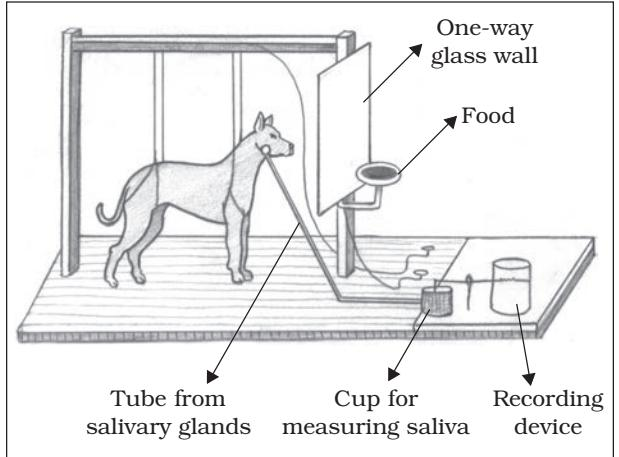
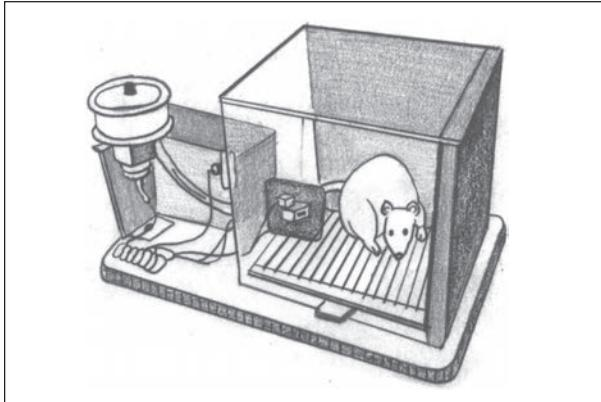
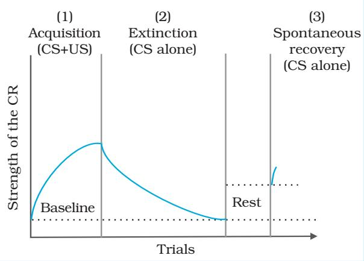

# Learning LearningLearning

# Chapter5 After reading this chapter, you would be able to

- describe the nature of learning,
- explain different forms or types of learning and the procedures used in such types of learning,
- understand various psychological processes that occur during learning and influence its course, and
- explain the determinants of learning.

## Contents

**Introduction Nature of Learning Paradigms of Learning Classical Conditioning** Determinants of Classical Conditioning **Operant/Instrumental Conditioning** Determinants of Operant Conditioning *Classical and Operant Conditioning : Differences* (Box 5.1) Key Learning Processes *Learned Helplessness* (Box 5.2) **Observational Learning Cognitive Learning Verbal Learning Skill Learning Factors Facilitating Learning Learning Disabilities**

*Learning preserves errors of the past as well as its wisdom.*

**Key Terms Summary Review Questions Project Ideas**

– A.N. Whitehead

# Introduction

*At the time of birth every human baby is equipped with the capacity to make a limited number of responses. These responses occur reflexively whenever appropriate stimuli are present in the environment. As the child grows and matures, s/he becomes capable of making diverse types of responses. These include identifying the images of some persons as one's mother, father or grandfather, using a spoon when eating food, and learning how to identify alphabets, to write, and to combine them into words. S/he also observes others doing things in specific environmental conditions, and imitates them. Learning names of objects such as book, orange, mango, cow, boy, and girl, and retaining them is another important task. One also learns to drive a scooter or a car, to communicate with others effectively, and to interact with others. It is all due to learning that a person becomes hard working or indolent, socially knowledgeable, skilled, and professionally competent. Each individual manages her or his life and solves all kinds of problems because of the capacity to learn and adapt. This chapter focuses on the various aspects of learning. First, learning is defined and characterised as a psychological process. Second, an account is presented that explains how one learns. A number of learning methods that account for simple to complex types of learning are described. In the third section, some empirical phenomena, that occur in the course of learning, are explained. In the fourth section, different factors that determine the speed and extent of learning are described including different learning disabilities.*

#### **NATURE OF LEARNING**

As indicated above learning is a key process in human behaviour. It refers to a spectrum of changes that take place as a result of one's experience. Learning may be defined as "*any relatively permanent change in behaviour or behavioural potential produced by experience*". One must remember that some behavioural changes occur due to the use of drugs, or fatigue. Such changes are temporary. They are not considered learning. *Changes due to practice and experience, which are relatively permanent, are illustrative of learning.*

#### *Features of Learning*

The process of learning has certain distinctive characteristics. *The first feature is that learning*

*always involves some kinds of experience.* We experience an event occurring in a certain sequence on a number of occasions. If an event happens then it may be followed by certain other events. For example, one learns that if the bell rings in the hostel after sunset, then dinner is ready to be served. Repeated experience of satisfaction after doing something in a specified manner leads to the formation of habit. Sometimes a single experience can lead to learning. A child strikes a matchstick on the side of a matchbox, and gets her/his fingers burnt. Such an experience makes the child learn to be careful in handling the matchbox in future.

*Behavioural changes that occur due to learning are relatively permanent*. They must be distinguished from the behavioural changes that are neither permanent nor learned. For

Psychology 78

example, changes in behaviour often occur due to the effects of fatigue, habituation, and drugs. Suppose you are reading your textbook of psychology for sometime or you are trying to learn how to drive a motor car, a time comes when you will feel tired. You stop reading or driving. This is a behavioural change due to fatigue, and is temporary. It is not considered learning.

Let us take another case of change in one's behaviour. Suppose in the vicinity of your residence a marriage is being performed. It generates a lot of noise, which continues till late night. In the beginning, the noise distracts you from whatever you are doing. You feel disturbed. While the noise continues, you make some *orienting reflexes*. These reflexes become weaker and weaker, and eventually become undetectable. This is also one kind of behavioural change. This change is due to continuous exposure to stimuli. It is called *habituation*. It is not due to learning. You must have noticed that people who are on sedatives or drugs or alcohol, their behaviour changes as it affects physiological functions. Such changes are temporary in nature and disappear, as the effect wears out.

Learning involves a sequence of psychological events. This will become clear if we were to describe a typical learning experiment. Suppose psychologists are interested in understanding how a list of words is learned. They will go through the following sequence : (i) do a pre-test to know how much the person knows before learning, (ii) present the list of words to be remembered for a fixed time, (iii) during this time the list of words is processed towards acquiring new knowledge, (iv) after processing is complete, new knowledge is acquired (this is LEARNING), and (v) after some time elapses, the processed information is recalled by the person. By comparing the number of words which a person now knows as compared to what s/he knew in the pre-test, one infers that learning did take place.

Thus, *learning is an inferred process* and is different from **performance**. Performance is a person's observed behaviour or response

or action. Let us understand what is meant by the term inference. Suppose you are asked by your teacher to memorise a poem. You read that poem a number of times. Then you say that you have learned the poem. You are asked to recite the poem and you are able to recite it. The recitation of the poem by you is your per formance. On the basis of your performance, the teacher infers that you have learned the poem.

#### **PARADIGMS OF LEARNING**

Learning takes place in many ways. There are some methods that are used in acquisition of simple responses while other methods are used in the acquisition of complex responses. In this section you will learn about all these methods. The simplest kind of learning is called **conditioning**. Two types of conditioning have been identified. The first one is called **classical conditioning**, and the second **instrumental/operant conditioning**. In addition, we have **observational learning**, **cognitive learning**, **verbal learning**, and **skill learning**.

#### **CLASSICAL CONDITIONING**

This type of learning was first investigated by Ivan P. Pavlov. He was primarily interested in the physiology of digestion. During his studies he noticed that dogs, on whom he was doing his experiments, started secreting saliva as soon as they saw the empty plate in which food was served. As you must be aware, saliva secretion is a reflexive response to food or something in the mouth. Pavlov designed an experiment to understand this process in detail in which dogs were used once again. In the first phase, a dog was placed in a box and harnessed. The dog was left in the box for some time. This was repeated a number of times on different days. In the meantime, a simple surgery was conducted, and one end of a tube was inserted in the dog's jaw and the other end of the tube was put in a measuring glass. The experimental setup is illustrated in Figure 5.1.

In the second phase of the experiment, the dog was kept hungry and placed in harness with one end of the tube ending in the jaw and the other end in the glass jar. A bell was

*Fig.5.1 : A Dog in Pavlovian Harness for Conditioning*

sounded and immediately thereafter food (meat powder) was served to the dog. The dog was allowed to eat it. For the next few days, everytime the meat powder was presented, it was preceded by the sound of a bell. After a number of such trials, a test trial was introduced in which everything was the same as the previous trials except that no food followed the sounding of the bell. The dog still salivated to the sound of the bell, expecting presentation of the meat powder as the sound of bell had come to be connected with it. This association between the bell and food resulted in acquisition of a new response by the dog, i.e. salivation to the sound of the bell. This has been termed as conditioning. You may have noticed that all dogs salivate when they are presented with food. Food is thus an **Unconditioned Stimulus (US)** and salivation which follows it, an **Unconditioned Response (UR)**. After conditioning, salivation started to occur in the presence of the sound of the bell. The bell becomes a **Conditioned Stimulus (CS)** and saliva secretion a **Conditioned Response (CR)**. This kind of conditioning is called **classical conditioning**. The procedure is illustrated in Table 5.1. It is obvious that the learning situation in classical conditioning is one of **S–S learning** in which one stimulus (e.g., sound of bell) becomes a signal for another stimulus (e.g., food). Here *one stimulus signifies the possible occurrence of another stimulus*.

Examples of classical conditioning abound in everyday life. Imagine you have just finished your lunch and you are feeling satisfied. Then you see some sweet dish served on the adjoining table. This signals its taste in your mouth, and triggers the secretion of saliva. You feel like eating it. This is a conditioned response (CR). Let us take another example. In the early stages of childhood, one is naturally afraid of any loud noise. Suppose a small child catches an inflated balloon which bursts in her/his hands making a loud noise. The child becomes afraid. Now the next time s/he is made to hold a balloon, it becomes a signal or cue for noise and elicits fear response. This happens because of contiguous presentation of balloon as a conditioned stimulus (CS) and loud noise as an unconditioned stimulus (US).

#### **Determinants of Classical Conditioning**

How quickly and strongly acquisition of a response occurs in classical conditioning depends on several factors. Some of the major

| Table 5.1 | Relationship of Stages of Conditioning and Operations |  |
| --- | --- | --- |
| Stages of Conditioning | Nature of Stimulus | Nature of Response |
| Before | Food (US) | Salivation (UR) |
|  | Sound of the Bell | Alertness (No Specific Response) |
| During | Sound of the Bell (CS) + Food (US) | Salivation (UR) |
| After | Sound of the Bell (CS) | Salivation (CR) |

Psychology 80

factors influencing learning a CR are described below:

1. *Time Relations between Stimuli* : The classical conditioning procedures, discussed below, are basically of four types based on the time relations between the onset of conditioned stimulus (CS) and unconditioned stimulus (US). The first three are called **forward conditioning** procedures, and the fourth one is called **backward conditioning** procedure. The basic experimental arrangements of these procedures are as follows:

- a) When the CS and US are presented together, it is called **simultaneous conditioning**.
- b) In **delayed conditioning**, the onset of CS precedes the onset of US. The CS ends before the end of the US.
- c) In **trace conditioning**, the onset and end of the CS precedes the onset of US with some time gap between the two.
- d) In **backward conditioning**, the US precedes the onset of CS.

It is now well established that delayed conditioning procedure is the most effective way of acquiring a CR. Simultaneous and trace conditioning procedures do lead to acquisition of a CR, but they require greater number of acquisition trials in comparison to the delayed conditioning procedure. It may be noted that the acquisition of response under backward conditioning procedure is very rare.

2. *Type of Unconditioned Stimuli* : The unconditioned stimuli used in studies of classical conditioning are basically of two types, i.e. **appetitive** and **aversive**. Appetitive unconditioned stimuli automatically elicits approach responses, such as eating, drinking, caressing, etc. These responses give satisfaction and pleasure. On the other hand, aversive US, such as noise, bitter taste, electric shock, painful injections, etc. are painful, harmful, and elicit avoidance and escape responses. It has been found that appetitive classical conditioning is slower and requires greater number of acquisition trials, but aversive classical conditioning is established in one, two or three trials depending on the intensity of the aversive US.

3. *Intensity of Conditioned Stimuli* : This influences the course of both appetitive and aversive classical conditioning. More intense conditioned stimuli are more effective in accelerating the acquisition of conditioned responses. It means that the more intense the conditioned stimulus, the fewer are the number of acquisition trials needed for conditioning.

#### Activity ActivityActivity 5.1

*In order to understand and explain conditioning, you may carry out the following exercise. Take a few pieces of mango pickle on a plate and show it to the students in the classroom. Ask them what they experienced in their mouth? Most of your classmates are likely to report*

#### **OPERANT/INSTRUMENTAL CONDITIONING**

*some salivation in their mouth.*

This type of conditioning was first investigated by B.F. Skinner. Skinner studied occurrence of voluntary responses when an organism operates on the environment. He called them **operants**. *Operants are those behaviours or responses, which are emitted by animals and human beings voluntarily and are under their control.* The term operant is used because the organism operates on the environment. Conditioning of operant behaviour is called **operant conditioning**.

Skinner conducted his studies on rats and pigeons in specially made boxes, called the **Skinner Box**. A hungry rat (one at a time) is placed in the chamber, which was so built that the rat could move inside but could not come out. In the chamber there was a lever, which was connected to a food container kept on the top of the chamber (see Figure 5.2). When the lever is pressed, a food pellet drops on the plate placed close to the lever. While moving around and pawing the walls (exploratory behaviour), the hungry rat accidentally presses the lever and a food pellet drops on the plate. The hungry rat eats it. In the next trial, after a while the exploratory behaviour again starts. As the number of trials increases, the rat takes

lesser and lesser time to press the lever for food. Conditioning is complete when the rat presses the lever immediately after it is placed in the chamber. It is obvious that *lever pressing is an operant response and getting food is its consequence.*

*Fig.5.2 : Skinner Box*

In the above situation the response is instrumental in getting the food. That is why, this type of learning is also called **instrumental conditioning**. Examples of instrumental conditioning abound in our everyday life. Children who want to have some sweets in the absence of their mother learn to locate the jar in which mother hides the sweets for safekeeping and eat it. Children learn to be polite and say 'please' to get favours from their parents and others. One learns to operate mechanical gadgets such as radio, camera, T.V., etc. based on the principle of instrumental conditioning. As a matter of fact human beings learn short cuts to attain desired goals or ends through instrumental conditioning.

#### **Determinants of Operant Conditioning**

You have noted that *operant or instrumental conditioning is a form of learning in which behaviour is learned, maintained or changed through its consequences*. Such consequences are called **reinforcers**. *A reinforcer is defined as any stimulus or event, which increases the probability of the occurrence of a (desired) response*. A reinforcer has numerous features, which affect the course and strength of a response. They include its *types* – positive or negative, *number or frequency, quality* – superior or inferior, and *schedule* – continuous or intermittent (partial). All these features influence the course of operant conditioning. Another factor that influences this type of learning is the *nature of the response or behaviour* that is to be conditioned. The *interval or length of time* that lapses between occurrence of response and reinforcement also influences operant learning. Let us examine some of these factors in detail.

#### *Types of Reinforcement*

Reinforcement may be positive or negative. Positive reinforcement involves stimuli that have pleasant consequences. They strengthen and maintain the responses that have caused them to occur. Positive reinforcers satisfy needs, which include food, water, medals, praise, money, status, information, etc. Negative reinforcers involve unpleasant and painful stimuli. *Responses that lead organisms to get rid of painful stimuli or avoid and escape from them provide negative reinforcement*. Thus, negative reinforcement leads to learning of avoidance and escape responses. For instance, one learns to put on woollen clothes, burn firewood or use electric heaters to avoid the unpleasant cold weather. One learns to move away from dangerous stimuli because they provide negative reinforcement. It may be noted that negative reinforcement is not punishment. Use of punishment reduces or suppresses the response while a negative reinforcer increases the probability of avoidance or escape response. For instance, drivers and co-drivers wear their seat belts to avoid getting injured in case of an accident or to avoid being fined by the traffic police.

It should be understood that no punishment suppresses a response permanently. Mild and delayed punishment has no effect. The stronger the punishment, the more lasting is the suppression effect but it is not permanent.

Sometimes punishment has no effect irrespective of its intensity. On the contrary, the punished person may develop dislike and

Psychology 82

hatred for the punishing agent or the person who administers the punishment.

#### *Number of Reinforcement and other Features*

It refers to the number of trials on which an organism has been reinforced or rewarded. Amount of reinforcement means how much of reinforcing stimulus (food or water or intensity of pain causing agent) one receives on each trial. Quality of reinforcement refers to the kind of reinforcer. Chickpeas or pieces of bread are of inferior quality as compared with raisins or pieces of cake as reinforcer. The course of operant conditioning is usually accelerated to an extent as the number, amount, and quality of reinforcement increases.

#### *Schedules of Reinforcement*

A reinforcement schedule is the arrangement of the delivery of reinforcement during conditioning trials. Each schedule of reinforcement influences the course of conditioning in its own way; and thus conditioned responses occur with differential characteristics. The organism being subjected to operant conditioning may be given reinforcement in every acquisition trial or in some trials it is given and in others it is omitted. Thus, the reinforcement may be *continuous* or *intermittent*. When a desired response is reinforced every time it occurs we call it **continuous reinforcement**. In contrast, in intermittent schedules responses are sometimes reinforced, sometimes not. It is known as **partial reinforcement** and has been found to produce greater **resistance to extinction** – than is found with continuous reinforcement.

#### *Delayed Reinforcement*

The effectiveness of reinforcement is dramatically altered by delay in the occurrence of reinforcement. It is found that *delay in the delivery of reinforcement leads to poorer level of performance*. It can be easily shown by asking children which reward they will prefer for doing some chore. Smaller rewards immediately after doing the chore will be preferred rather than a big one after a long gap.

#### **Key Learning Processes**

When learning takes place, be it classical or operant conditioning, it involves the occurrence of certain processes. These include

- *1. In classical conditioning, the responses are under the control of some stimulus because they are reflexes, automatically elicited by the appropriate stimuli. Such stimuli are selected as US and responses elicited by them as UR. Thus Pavlovian conditioning, in which US elicits responses, is often called respondent conditioning.*
*In instrumental conditioning, responses are under the control of the organism and are voluntary responses or 'operants'. Thus, in the two forms of conditioning different types of responses are conditioned.*

- *2. In classical conditioning the CS and US are well-defined, but in operant conditioning CS is not defined. It can be inferred but is not directly known.*
- *3. In classical conditioning, the experimenter controls the occurrence of US, while in operant conditioning the occurrence of the reinforcer is under the control of the organism that is learning. Thus, for US in classical conditioning the organism remains passive, while in operant conditioning the subject has to be active in order to be reinforced.*
- *4. In the two forms of conditioning, the technical terms used to characterise the experimental proceedings are different. Moreover what is called reinforcer in operant conditioning is called US in classical conditioning. An US has two functions. In the beginning it elicits the response and also reinforces the response to be associated and elicited later on by the CS.*

### Box 5.2 Learned Helplessness

*It is an interesting phenomenon, which is a result of an interaction between the two forms of conditioning. Learned helplessness underlies psychological cases of depression. Seligman and Maier demonstrated this phenomenon in a study on dogs. First, they subjected dogs to sound (CS) and electric shock (US) using classical conditioning procedure. The animal had no scope to escape or avoid the shock. This pairing was repeated a number of times. Then the dogs were subjected to shock in an operant conditioning procedure. The dogs could escape the shock by pressing their heads against the wall. After having experienced inescapable shock in the Pavlovian contingency, the dog failed to escape or avoid shock in the operant conditioning procedure. The dog just*

**reinforcement**, **extinction** or non-occurrence of learned response, **generalisation** of learning to other stimuli under some specifiable conditions, **discrimination** between reinforcing and non-reinforcing stimuli, and **spontaneous recovery**.

#### *Reinforcement*

Reinforcement is the operation of administering a reinforcer by the experimenter. Reinforcers are stimuli that increase the rate or probability of the responses that precede. We have noted that reinforced responses increase in rate, while non-reinforced responses decrease in rate. A positive reinforcer increases the rate of response that precedes its presentation. Negative reinforcers increase the rate of the response that precedes their removal or termination. The reinforcers may be primary or secondary. A **primary reinforcer** is biologically important since it determines the organism's survival (e.g., food for a hungry organism). A secondary reinforcer is one which has acquired characteristics of the reinforcer because of the organism's experience with the environment. We frequently use money, praise, and grades as reinforcers. They are called **secondary reinforcers**. Systematic use of reinforcers can *suffered the shock through, and did not attempt to escape. This behaviour of the dog was called learned helplessness.*

*This phenomenon has been shown to be operative in humans also. It has been found that continuous failure in a set of tasks shows the occurrence of learned helplessness. In an experimental study, the subjects are initially given failure experience irrespective of their performance. In the second phase the subjects are given a task. Learned helplessness is often measured in terms of the subject's ability and persistence before they give up the task. Continuous failure leads to little persistence and poor performance. This shows helplessness. There are numerous studies that demonstrate that persistent depression is often caused by learned helplessness.*

lead to the desired response. Such a response is shaped by reinforcing successive approximations to the desired response.

#### *Extinction*

Extinction means disappearance of a learned response due to removal of reinforcement from the situation in which the response used to occur. If the occurrence of CS-CR is not followed by the US in classical conditioning, or lever pressing is no more followed by food pellets in the Skinner box, the learned behaviour will gradually be weakened and ultimately disappear.

Learning shows **resistance to extinction**. It means that even though the learned response is now not reinforced, it would continue to occur for sometime. However, with increasing number of trials without reinforcement, the response strength gradually diminishes and ultimately it stops occurring. How long a learned response shows resistance to extinction depends on a number of factors. It has been found that with increasing number of reinforced trials resistance to extinction increases and learned response reaches its highest level. At this level performance gets stabilised. After that the number of trials do not make a difference in

Psychology 84

the response strength. Resistance to extinction increases with increasing number of reinforcements during acquisition trials, beyond that any increase in number of reinforcement reduces the resistance to extinction. Studies have also indicated that as the amount of reinforcement (number of food pellets) increases during the acquisition trials, resistance to extinction decreases.

If the reinforcement is delayed during acquisition trials, the resistance to extinction increases. Reinforcement in every acquisition trial makes the learned response to be less resistant to extinction. In contrast, intermittent or partial reinforcement during acquisition trials makes a learned response more resistant to extinction.

#### *Generalisation and Discrimination*

The processes of **generalisation** and **discrimination** occur in all kinds of learning. However, they have been extensively investigated in the context of conditioning. Suppose an organism is conditioned to elicit a CR (saliva secretion or any other reflexive response) on presentation of a CS (light or sound of bell). After conditioning is established, and another stimulus similar to the CS (e.g., ringing of telephone) is presented, the organism makes the conditioned response to it. *This phenomenon of responding similarly to similar stimuli is known as generalisation.* Again, suppose a child has learned the location of a jar of a certain size and shape in which sweets are kept. Even when the child's mother is not around, the child finds the jar and obtains the sweets. This is a learned operant. Now the sweets are kept in another jar of a different size and shape and at a different location in the kitchen. In the absence of the mother the child locates the jar and obtains the sweets. This is also an example of generalisation. *When a learned response occurs or is elicited by a new stimulus, it is called generalisation.*

Another process, which is complimentary to generalisation, is called discrimination. *Generalisation is due to similarity while discrimination is a response due to difference.*

For example, suppose a child is conditioned to be afraid of a person with a long moustache and wearing black clothes. In subsequent situation, when s/he meets another person dressed in black clothes with a beard, the child shows signs of fear. The child's fear is generalised. S/he meets another stranger who is wearing grey clothes and is clean-shaven. The child shows no fear. This is an example of discrimination. Occurrence of generalisation means failure of discrimination. Discriminative response depends on the discrimination capacity or discrimination learning of the organism.

#### *Spontaneous Recovery*

Spontaneous recovery occurs after a learned response is extinguished. Suppose an organism has learned to make a response for getting reinforcement, then the response is extinguished and some time lapses. A question now may be asked, whether the response is completely extinguished, and will not occur if the CS is presented. It has been demonstrated that after lapse of considerable time, the learned or CR recovers and occurs to the CS. The amount of spontaneous recovery depends on the duration of the time lapsed after the extinction session. The longer the duration of time lapsed, the greater is the recovery of learned response. Such a recovery occurs spontaneously. Fig.5.3 shows the phenomenon of spontaneous recovery.

*Fig.5.3 : Phenomenon of Spontaneous Recovery*

#### **OBSERVATIONAL LEARNING**

The next form of learning takes place by observing others. Earlier this form of learning was called **imitation**. Bandura and his colleagues in a series of experimental studies investigated observational learning in detail. In this kind of learning, human beings learn social behaviours, therefore, it is sometimes called **social learning**. In many situations individuals do not know how to behave. They observe others and emulate their behaviour. This form of learning is called **modeling**.

Examples of observational learning abound in our social life. Fashion designers employ tall, pretty, and gracious young girls and tall, smart, and well-built young boys for popularising clothes of different designs and fabrics. People observe them on televised fashion shows and advertisements in magazines and newspapers. They imitate these models. Observing superiors and likeable persons and then emulating their behaviour in a novel social situation is a common experience.

In order to understand the nature of observational learning we may refer to the studies conducted by Bandura. In one of his well-known experimental study, Bandura showed a film of five minutes duration to children. The film shows that in a large room there are numerous toys including a large sized 'Bobo' doll. Now a grown-up boy enters the room and looks around. The boy starts showing aggressive behaviour towards the toys in general and the bobo doll in particular. He hits the doll, throws it on the floor, kicking it and sitting on it. This film has three versions. In one version a group of children see the boy (model) being rewarded and praised by an adult for being aggressive to the doll. In the second version another group of children see the boy being punished for his aggressive behaviour. In the third version the third group of children are not shown the boy being either rewarded or punished.

After viewing a specific version of the film all the three groups of children were placed in an experimental room in which similar toys were placed around. The children were allowed to play with the toys. These groups were secretly observed and their behaviours noted. It was found that those children who saw aggressive behaviour being rewarded were most aggressive; children who had seen the aggressive model being punished were least aggressive. Thus, *in observational learning observers acquire knowledge by observing the model's behaviour, but performance is influenced by model's behaviour being rewarded or punished.*

You must have noticed that children observe adults' behaviours, at home and during social ceremonies and functions. They enact adults in their plays and games. For instance, young children play games of marriage ceremonies, birthday parties, thief and policeman, house keeping, etc. Actually they enact in their games what they observe in society, on television, and read in books.

Children learn most of the social behaviours by observing and emulating adults. The way to put on clothes, dress one's hair, and conduct oneself in society are learned through observing others. It has also been shown that children learn and develop various personality characteristics through observational learning. Aggressiveness, prosocial behaviour, courtesy, politeness, diligence, and indolence are acquired by this method of learning.

#### Activity ActivityActivity 5.2

*You can have first-hand experience of observational learning by doing the following exercise.*

*Collect four or five school going children and demonstrate how to make a boat out of a sheet of paper. Do it two or three times and ask the children to observe carefully. After having shown how to fold the paper in different ways for a number of times, give them sheets of paper and ask them to make a toy boat.*

*Most children will be able to do it somewhat successfully.*

Psychology 86

#### **COGNITIVE LEARNING**

Some psychologists view learning in terms of cognitive processes that underlie it. They have developed approaches that focus on such processes that occur during learning rather than concentrating solely on S-R and S-S connections, as we have seen in the case of classical and operant conditioning. Thus, in cognitive learning, there is a change in what the learner *knows* rather than what s/he *does*. This form of learning shows up in *insight learning* and *latent learning*.

#### **Insight Learning**

Kohler demonstrated a model of learning which could not be readily explained by conditioning. He performed a series of experiments with chimpanzees that involved solving complex problems. Kohler placed chimpanzees in an enclosed play area where food was kept out of their reach. Tools such as poles and boxes were placed in the enclosure. The chimpanzees rapidly learned how to use a box to stand on or a pole to move the food in their direction. In this experiment, learning did not occur as a result of trial and error and reinforcement, but came about in sudden flashes of insight. The chimpanzees would roam about the enclosure for some time and then suddenly would stand on a box, grab a pole and strike a banana, which was out of normal reach above the enclosure. The chimpanzee exhibited what Kohler called *insight learning* – the process by which the solution to a problem suddenly becomes clear.

In a normal experiment on insight learning, a problem is presented, followed by a period of time when no apparent progress is made and finally a solution suddenly emerges. In insight learning, sudden solution is the rule. Once the solution has appeared, it can be repeated immediately the next time the problem is confronted. Thus, it is clear that what is learned is not a specific set of conditioned associations between stimuli and responses but a cognitive relationship between a means and an end. As a result, insight learning can be generalised to other similar problem situations.

#### **Latent Learning**

Another type of cognitive learning is known as *latent learning*. In latent learning, a new behaviour is learned but not demonstrated until reinforcement is provided for displaying it. Tolman made an early contribution to the concept of latent learning. To have an idea of latent learning, we may briefly understand his experiment. Tolman put two groups of rats in a maze and gave them an opportunity to explore. In one group, rats found food at the end of the maze and soon learned to make their way rapidly through the maze. On the other hand, rats in the second group were not rewarded and showed no apparent signs of learning. But later, when these rats were reinforced, they ran through the maze as efficiently as the rewarded group.

Tolman contended that the unrewarded rats had learned the layout of the maze early in their explorations. They just never displayed their latent learning until the reinforcement was provided. Instead, the rats developed a **cognitive map** of the maze, i.e. a mental representation of the spatial locations and directions, which they needed to reach their goal.

#### **VERBAL LEARNING**

Verbal learning is different from conditioning and is limited to human beings. Human beings, as you must have observed, acquire knowledge about objects, events, and their features largely in terms of words. Words then come to be associated with one another. Psychologists have developed a number of methods to study this kind of learning in a laboratory setting. Each method is used to investigate specific questions about learning of some kind of verbal material. In the study of verbal learning, psychologists use a variety of materials including nonsense syllables, familiar words, unfamiliar words (see Table 5.2 for sample items), sentences, and paragraphs.

| Table 5.2 | Sample Lists of Items used in Verbal Learning Experiments |  |
| --- | --- | --- |
| Nonsense syllables | Unfamiliar words | Familiar words |
| YOL | ZILCH | BOAT |
| RUV | PLUMB | NOSE |
| TOJ | VERVE | KNOW |
| LIN | BLOUT | GOAL |
| LUF | THILL | BOWL |
| GOW | SCOFF | LOAD |
| NOK | TENOR | FEET |
| RIC | WRACK | MEET |
| NEZ | BOUGH | TENT |
| TAM | MALVE | FOAM |
| SUK | PATTER | TALE |
| KOZ | MANSE | JOKE |
| GUD | KYDRA | MALE |
| MUP | BORGE | BALM |
| KUG | DEVEN | SOLE |

#### **Methods used in Studying Verbal Learning**

1. *Paired-Associates Learning* : This method is similar to S-S conditioning and S-R learning. It is used in learning some foreign language equivalents of mother tongue words. First, a list of paired-associates is prepared. The first word of the pair is used as the stimulus, and the second word as the response. Members of each pair may be from the same language or two different languages. A list of such words is given in Table 5.3.

The first members of the pairs (stimulus term) are nonsense syllables (consonantvowel-consonant), and the second are English nouns (response term). The learner is first shown both the stimulus-response pairs together, and is instructed to remember and recall the response after the presentation of each stimulus term. After that a learning trial begins. One by one the stimulus words are presented and the participant tries to give the correct response term. In case of failure, s/he is shown the response word. In one trial all the stimulus terms are shown. Trials continue until the participant gives all the response words without a single error. The total number of trials taken to reach the criterion becomes the measure of paired-associates learning.

2. *Serial Learning* : This method of verbal learning is used to find out how participants learn the lists of verbal items, and what processes are involved in it. First, lists of verbal items, i.e. nonsense syllables, most familiar or least familiar words, interrelated words, etc. are prepared. The participant is presented the entire list and is required to produce the items in the same serial order as in the list. In the first trial,

| Table 5.3 |  |  | Examples of Stimulus – Response Pairs used in Paired-Associates Learning |  |  |
| --- | --- | --- | --- | --- | --- |
| Stimulus - Response |  |  |  | Stimulus - Response |  |
| GEN | – | LOOT | LUR | – | ROOF |
| BEM | – | TIME | RUL | – | GOLD |
| DIV | – | LAMP | VAK | – | HILL |
| WUF | – | DEER | KER | – | NAME |
| JIT | – | LION | HOZ | – | GOAT |
| DAX | – | COAL | MUW | – | BULL |

Psychology 88

the first item of the list is shown, and the participant has to produce the second item. If s/he fails to do so within the prescribed time, the experimenter presents the second item. Now this item becomes the stimulus and the participant has to produce the third item that is the response word. If s/he fails, the experimenter gives the correct item, which becomes the stimulus item for the fourth word. This procedure is called **serial anticipation method**. Learning trials continue until the participant correctly anticipates all the items in the given order.

3. *Free Recall* : In this method, participants are presented a list of words, which they read and speak out. Each word is shown at a fixed rate of exposure duration. Immediately after the presentation of the list, the participants are required to recall the words in any order they can. Words in the list may be interrelated or unrelated. More than ten words are included in the list. The presentation order of words varies from trial to trial. This method is used to study how participants organise words for storage in memory. Studies indicate that the items placed in the beginning or end of the lists are easier to recall than those placed in the middle, which are more difficult to recall.

#### **Determinants of Verbal Learning**

Verbal learning has been subjected to the most extensive experimental investigations. These studies have indicated that the course of verbal learning is influenced by a number of factors. The most important determinants are the different features of the verbal material to be learned. They include *length of the list to be learned* and *meaningfulness of the material*. Meaningfulness of material is measured in several ways. The number of associations elicited in a fixed time, familiarity of the material and frequency of usage, relations among the words in the list, and sequential dependence of each word of the list on the preceding words, are used for assessing meaningfulness. Lists of nonsense syllables are available with different levels of associations. The nonsense syllables should be selected from a list containing the same association value. On the basis of research findings, the following generalisations have been made.

Learning time increases with increase in length of the list, occurrence of words with low association values or lack of relations among the items in the list. The more time it takes to learn the list, stronger will be the learning. In this respect psychologists have found that the *total time principle* operates. This principle states that a fixed amount of time is necessary to learn a fixed amount of material, regardless of the number of trials into which that time is divided. *The more time it takes to learn, the stronger becomes the learning*.

If participants are not restricted to the serial learning method and are allowed to give free recall, verbal learning becomes organisational. It implies that in free recall participants recall the words not in their order of presentation, but in a new order or sequence. Bousfield first demonstrated this experimentally. He made a list of 60 words that consisted of 15 words drawn from each of the four semantic categories, i.e. names, animals, professions, and vegetables. These words were presented to participants one by one in random order. The participants were required to make free recall of the words. However, they recalled the words of each category together. He called it **category clustering**. It is worth noting that, though, the words were presented randomly the participants organised them category-wise in recall. Here category clustering occurred because of the nature of the list. It has also been demonstrated that free recall is always organised subjectively. Subjective organisation shows that the participants organise words or items in their individual ways and recall accordingly.

Verbal learning is usually intentional but a person may learn some features of the words unintentionally or incidentally. In this kind of learning, participants notice features such as whether two or more words rhyme, start with identical letters, have same vowels, etc. Thus, verbal learning is both intentional as well as incidental.

#### Activity ActivityActivity 5.3

*Take the following words and write them on separate cards, and ask the participants to read them aloud one by one. After completion of two readings, ask them to write down the words in any order : book, law, bread, shirt, coat, paper, pencil, biscuit, pen, life, history, rice, curd, shoes, sociology, sweet, pond, potato, ice-cream, muffler, and prose. After the presentation, ask them to write down the words they read, without bothering about the order of presentation.*

*Analyse your data to see whether recalled words show any organisation.*

#### **SKILL LEARNING**

#### **Nature of Skills**

A skill is defined as the ability to perform some complex task smoothly and efficiently. Car driving, airplane piloting, ship navigating, shorthand writing, and writing and reading are examples of skills. Such skills are learned by practice and exercise. *A skill consists of a chain of perceptual motor responses or as a sequence of S-R associations.*

#### **Phases of Skill Acquisition**

Skill learning passes through several qualitatively different phases. With each successive attempt at learning a skill, one's performance becomes smoother and less effort demanding. In other words, it becomes more spontaneous or automatic. It has also been shown that in each phase the performance improves. In transition from one phase to the next, when the level of performance stands still, it is called performance plateau. Once the next phase begins, performance starts improving and its level starts going up.

One of the most influential accounts of the phases of skill acquisition is presented by Fitts. According to him, skill learning passes through three phases, viz. **cognitive**, **associative** and **autonomous**. Each phase or stage of skill learning involves different types of mental processes. In the cognitive phase of skill learning, the learner has to understand and memorise the instructions, and also understand how the task has to be performed. In this phase, every outside cue, instructional demand, and one's response outcome have to be kept alive in consciousness.

The second phase is associative. In this phase, different sensory inputs or stimuli are linked with appropriate responses. As the practice increases, errors decrease, performance improves and time taken is also reduced. With continued practice, errorless performance begins, though, the learner has to be attentive to all the sensory inputs and maintain concentration on the task. Then the third phase, i.e. autonomous phase, begins. In this phase, two important changes take place in performance: the **attentional demands** of the associative phase decrease, and interference created by external factors reduces. Finally, skilled performance attains **automaticity** with minimal demands on conscious effort.

Transitions from one phase to the other clearly show that practice is the only means of skill learning. One has to keep on exercising and practicing. As the practice increases, improvement rate gradually increases; and automaticity of errorless performance becomes the hallmark of skill. That is why it is said that 'practice makes a man perfect'.

#### **FACTORS FACILITATING LEARNING**

In the preceding section we examined the specific determinants of learning, such as contiguous presentation of CS and US in classical conditioning; number, amount, and delay of reinforcement in operant conditioning; status and attractiveness of models in observational learning; procedure in verbal learning; and the nature of rules and perceptual features of objects and events in concept learning. Now, we shall discuss some general determinants of learning. This discussion is not exhaustive. Rather it deals with some salient factors only which are found very important.

Psychology 90

#### **Continuous vs Partial Reinforcement**

In experiments on learning the experimenter can arrange to deliver reinforcement according to a specific schedule. In the context of learning, two kinds of schedules namely **continuous** and **partial** have been found very important. In continuous reinforcement the participant is given reinforcement after each target response. This kind of schedule of reinforcement produces a high rate of responding. However, once the reinforcement is withheld, response rates decrease very quickly, and the responses acquired under this schedule tend to extinguish. Since organism is getting reinforcement on each trial, the effectiveness of that reinforcer is reduced. In such schedules where reinforcement is not continuous, some responses are not reinforced. Hence, they are called partial or intermittent reinforcement. There are several ways in which one might reinforce responses according to an intermittent schedule. It has been found that partial reinforcement schedules often produce very high rates of responding, particularly when responses are reinforced according to ratio. In this kind of schedule, an organism often makes several responses that are not reinforced. Therefore, it becomes difficult to tell when a reinforcement has been discontinued completely and when it has merely been delayed. When reinforcement is continuous it is easier to tell when it has been discontinued. This kind of difference has been found crucial for extinction. It has been found that *extinction of a response is more difficult following partial reinforcement than following continuous reinforcement*. The fact that the responses acquired under partial reinforcement are highly resistant to extinction is called **partial reinforcement effect**.

#### **Motivation**

All living organisms have survival needs and human beings, in addition, have growth needs. Motivation is a mental as well as a physiological state, which arouses an organism to act for fulfilling the current need. In other words, motivation energises an organism to act vigorously for attaining some goal. Such acts persist until the goal is attained and the need is satisfied. Motivation is a prerequisite for learning. Why does a child forage in the kitchen when the mother is not in the house? S/he does so because s/he needs sweets to eat for which s/he is trying to locate the jar in which sweets are kept. During the course of foraging the child learns the location of the jar. A hungry rat is placed in a box. The animal forages in the box for food. Incidentally it presses a lever and food drops in the box. With repeated experience of such activity, the animal learns to press the lever immediately after the animal is placed there.

Have you ever asked yourself why you are studying psychology and other subjects in Class XI? You are doing so to pass with good marks or grades in your final examination. The more motivated you are, the more hard work you do for learning. Your motivation for learning something arises from two sources. You learn many things because you enjoy them (intrinsic motivation) or they provide you the means for attaining some other goal (extrinsic motivation).

#### **Preparedness for Learning**

The members of different species are very different from one another in their sensory capacities and response abilities. The mechanisms necessary for establishing associations, such as S-S or S-R, also vary from species to species. It can be said that species have biological constraints on their learning capacities. The kinds of S-S or S-R learning an organism can easily acquire depends on the associative mechanism it is genetically endowed with or prepared for. A particular kind of associative learning is easy for apes or human beings but may be extremely difficult and sometimes impossible for cats and rats. It implies that one can learn only those associations for which one is genetically prepared.

The concept of preparedness may be best understood as a continuum or dimension, on one end of which are those learning tasks or associations which are easy for the members of some species, and on the other end are those learning tasks for which those members are not prepared at all and cannot learn them. In the middle of the continuum fall those tasks and associations for which the members are neither prepared nor unprepared. They can learn such tasks, but only with great difficulty and persistence.

#### **LEARNING DISABILITIES**

You must have heard, observed or read that thousands of children get enrolled for education in schools. Some of them, however, find the demands of educational process too difficult to meet, and they drop out. Such students are called "drop-outs". The reasons for this are numerous, such as sensory impairment, intellectual disability, social and emotional disturbance, poor economic conditions of the family, cultural beliefs and norms or other environmental influences. Apart from these conditions, there is another source of obstacle in the continuance of education that is called learning disabilities. It makes school learning, i.e. acquisition of knowledge and skills too difficult to grapple with. Such children also fail to move forward in their learning activities.

**Learning disability** is a general term. It refers to a heterogeneous group of disorders manifested in terms of difficulty in the acquisition of learning, reading, writing, speaking, reasoning, and mathematical activities. The sources of such disorders are inherent in the child. It is presumed that these difficulties originate from problems with the functioning of the central nervous system. It may occur in conjunction with physical handicaps, sensory impairment, intellectual disability or without them.

It must be noted that learning disabilities may be observed as a distinct handicapping condition in children of average to superior intelligence, adequate sensory motor systems, and adequate learning opportunities. If it is not remedied, it may continue throughout life and affect self-esteem, vocation, social relations, and daily living activities.

#### **Symptoms of Learning Disabilities**

There are many symptoms of learning disabilities. They become manifest in different combinations in children who suffer from this disorder irrespective of their intelligence, motivation, and hard work for learning.

- 1. Difficulties in writing letters, words and phrases, reading out text, and speaking appear quite frequently. Quite often they have listening problems, although they may not have auditory defects. Such children are very different from others in developing learning strategies and plans.
- 2. Learning-disabled children have disorders of attention. They get easily distracted and cannot sustain attention on one point for long. More often than not, attentional deficiency leads to hyperactivity, i.e. they are always moving, doing different things, trying to manipulate things incessantly.
- 3. Poor space orientation and inadequate sense of time are common symptoms. Such children do not get easily oriented to new surroundings and get lost. They lack a sense of time and are late or sometimes too early in their routine work. They also show confusion in direction and misjudge right, left, up and down.
- 4. Learning-disabled children have poor motor coordination and poor manual dexterity. This is evident in their lack of balance, inability to sharpen pencil, handle doorknobs, difficulty in learning to ride a bicycle, etc.
- 5. These children fail to understand and follow oral directions for doing things.
- 6. They misjudge relationships as to which classmates are friendly and which ones are indifferent. They fail to learn and understand body language.
- 7. Learning-disabled children usually show perceptual disorders. These may include

Psychology 92

visual, auditory, tactual, and kinesthetic misperception. They fail to differentiate a call-bell from the ring of the telephone. It is not that they do not have sensory acuity. They simply fail to use it in performance.

- 8. Fairly large number of learning-disabled children have **dyslexia**. They quite often fail to copy letters and words; for example, they fail to distinguish between *b* and *d*, *p* and *q*, *P* and *9*, *was* and *saw*, *unclear* and *nuclear,* etc. They fail to organise verbal materials.
It must be noted that learning disabilities are not incurable. Remedial teaching methods go a long way in helping them to learn and become like other students. Educational psychologists have developed appropriate techniques for correcting most of the symptoms related to learning disabilities.

## Key Terms

*Associative learning, Biofeedback, Cognitive map, Conditioned response, Conditioned stimulus, Conditioning, Discrimination, Dyslexia, Extinction, Free recall, Generalisation, Insight, Learning disabilities, Mental set, Modeling, Negative reinforcement, Operant or instrumental conditioning, Positive reinforcement, Punishment, Reinforcement, Serial learning, Spontaneous recovery, Unconditioned response, Unconditioned stimulus, Verbal learning*

# Summary

- *• Learning is any relatively permanent change in behaviour or behavioural potential produced by experience or practice. It is an inferred process and differs from performance which is the observed behaviour/response/action.*
- *• The main types of learning are: classical and operant conditioning, observational learning, cognitive learning, verbal learning, and skill learning.*
- *• Pavlov first investigated classical conditioning in the course of studies on digestion in dogs. In this kind of learning an organism comes to associate stimuli. A neutral stimulus (CS) that signals an unconditioned stimulus (US) begins to produce a response (CR) that anticipates and prepares the organism for US.*
- *• Skinner first investigated operant or instrumental conditioning (OC). An operant is any response voluntarily emitted by an organism. OC is a type of learning in which response is strengthened if followed by reinforcement. A reinforcer can be any event that increases the frequency of preceding response. Thus, the consequence of a response is crucial. The rate of OC is influenced by the type, number, schedule, and delay of reinforcement.*
- *• Observational learning is also known as imitation, modeling and social learning. We acquire knowledge by observing a model's behaviour. The performance depends on whether the model's behaviour is rewarded or punished.*
- *• In verbal learning words get associated with one another on the basis of structural, phonetic, and semantic similarity and contrast. They are often organised in clusters. In experimental studies, paired-associates learning, serial learning, and free recall methods are used. Meaningfulness of material, and subjective organisation influence learning. It may be incidental also.*
- *• Skill refers to the ability to carry out complex tasks smoothly and efficiently. They are learned by practice and exercise. The skilled performance is the organisation of S-R chain into large response patterns. It passes through cognitive, associative, and autonomous phases.*
- *• Factors facilitating learning include motivation and preparedness of the organism.*
- *• Learning disabilities (e.g., reading, writing) restrict learning in people. They are hyperactive, lack sense of time, and eye-hand coordination, etc.*

#### Review Questions

- 1. What is learning? What are its distinguishing features?
- 2. How does classical conditioning demonstrate learning by association?
- 3. Define operant conditioning. Discuss the factors that influence the course of operant conditioning.
- 4. A good role model is very important for a growing up child. Discuss the kind of learning that supports it.
- 5. Explain the procedures for studying verbal learning.
- 6. What is a skill? What are the stages through which skill learning develops?
- 7. How can you distinguish between generalisation and discrimination?
- 8. Why is motivation a prerequisite for learning?
- 9. What does the notion of preparedness for learning mean?
- 10. Explain the different forms of cognitive learning?
- 11. How can we identify students with learning disabilities?

#### Project Ideasroject Ideas roject Ideas

How do your parents reinforce you for behaving in the ways they think are good for you? Select five different instances. Compare these with the reinforcement employed by teachers in the classroom and relate them to the concepts taught in the class.

