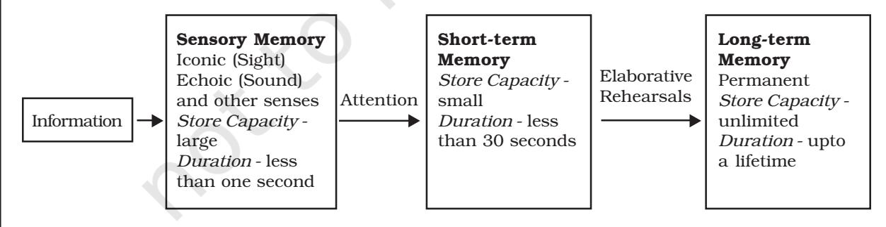
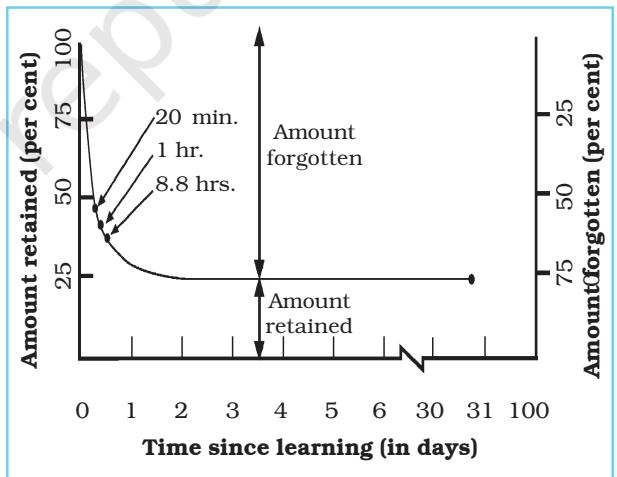

# Human Memory Human MemoryHuman Memory

# Chapter6 After reading this chapter, you would be able to

- understand the nature of memory,
- distinguish between different types of memory,
- understand the nature and causes of forgetting, and
- learn the strategies for improving memory.

# Contents

#### **Introduction**

#### **Nature of Memory**

**Information Processing Approach : The Stage Model Memory Systems : Sensory, Short-term and Long-term Memories** *Working Memory* (Box 6.1)

# **Levels of Processing**

# **Types of Long-term Memory**

Declarative and Procedural; Episodic and Semantic *Long-term Memory Classification* (Box 6.2) *Methods of Memory Measurement* (Box 6.3)

#### **Nature and Causes of Forgetting**

Forgetting due to Trace Decay, Interference and Retrieval Failure *Repressed Memories* (Box 6.4)

#### **Enhancing Memory**

Mnemonics using Images and Organisation

**Key Terms Summary Review Questions Project Ideas**

– Friedrich Nietzsche

*The advantage of bad memory is that one enjoys several times, the same good things for the first time.*

# Introduction

*All of us are aware of the tricks that memory plays on us throughout our lives. Have you ever felt embarrassed because you could not remember the name of a known person you were talking to? Or anxious and helpless because everything you memorised well the previous day before taking your examination has suddenly become unavailable? Or felt excited because you can now flawlessly recite lines of a famous poem you had learnt as a child? Memory indeed is a very fascinating yet intriguing human faculty. It functions to preserve our sense of who we are, maintains our interpersonal relationships and helps us in solving problems and taking decisions. Since memory is central to almost all cognitive processes such as perception, thinking and problem solving, psychologists have attempted to understand the manner in which any information is committed to memory, the mechanisms through which it is retained over a period of time, the reasons why it is lost from memory, and the techniques which can lead to memory improvement. In this chapter, we shall examine all these aspects of memory and understand various theories which explain the mechanisms of memory.*

*The history of psychological research on memory spans over hundred years. The first systematic exploration of memory is credited to Hermann Ebbinghaus, a German psychologist of late nineteenth century (1885). He carried out many experiments on himself and found that we do not forget the learned material at an even pace or completely. Initially the rate of forgetting is faster but eventually it stabilises. There are other psychologists who have influenced memory research in a major way. We shall review their contributions in this chapter at appropriate places.*

#### **NATURE OF MEMORY**

Memory refers to retaining and recalling information over a period of time, depending upon the nature of cognitive task you are required to perform. It might be necessary to hold an information for a few seconds. For example, you use your memory to retain an unfamiliar telephone number till you have reached the telephone instrument to dial, or for many years you still remember the techniques of addition and subtraction which you perhaps learned during your early schooling. Memory is conceptualised as a process consisting of three independent, though interrelated stages. These are **encoding**, **storage**, and **retrieval**. Any information received by us necessarily goes through these stages.

(a) *Encoding* is the first stage which refers to a process by which information is recorded and registered for the first time so that it becomes usable by our memory system. Whenever an external stimulus impinges on our sensory organs, it generates neural impulses. These are received in different areas of our brain for further processing. In encoding, incoming information is received and some meaning is

Psychology 96

derived. It is then represented in a way so that it can be processed further.

(b) *Storage* is the second stage of memory. Information which was encoded must also be stored so that it can be put to use later. Storage, therefore, refers to the process through which information is retained and held over a period of time.

(c) *Retrieval* is the third stage of memory. Information can be used only when one is able to recover it from her/his memory. Retrieval refers to bringing the stored information to her/ his awareness so that it can be used for performing various cognitive tasks such as problem solving or decision-making. It may be interesting to note that memory failure can occur at any of these stages. You may fail to recall an information because you did not encode it properly, or the storage was weak so you could not access or retrieve it when required.

#### **INFORMATION PROCESSING APPROACH : THE STAGE MODEL**

Initially, it was thought that memory is the capacity to store all information that we acquire through learning and experience. It was seen as a vast storehouse where all information that we knew was kept so that we could retrieve and use it as and when needed. But with the advent of the computer, human memory came to be seen as a system that processes information in the same way as a computer does. Both register, store, and manipulate large amount of information and act on the basis of the outcome of such manipulations. If you have worked on a computer then you would know that it has a temporary memory (random access memory or RAM) and a permanent memory (e.g., a hard disk). Based on the programme commands, the computer manipulates the contents of its memories and displays the output on the screen. In the same way, human beings too register information, store and manipulate the stored information depending on the task that they need to perform. For example, when you are required to solve a mathematical problem, the memory relating to mathematical operations, such as division or subtraction are carried out, activated and put to use, and receive the output (the problem solution). This analogy led to the development of the first model of memory, which was proposed by Atkinson and Shiffrin in 1968. It is known as **Stage Model**.

#### **MEMORY SYSTEMS : SENSORY, SHORT-TERM AND LONG-TERM MEMORIES**

According to the Stage Model, there are three memory systems : the **Sensory Memory**, the **Short-term Memory** and the **Long-term Memory**. Each of these systems have different features and perform different functions with respect to the sensory inputs (see Fig.6.1). Let us examine what these systems are:

*Fig.6.1 : The Stage Model of Memory*

#### **Sensory Memory**

The incoming information first enters the *sensory memory*. Sensory memory has a large capacity. However, it is of very short duration, i.e. less than a second. It is a memory system that registers information from each of the senses with reasonable accuracy. Often this system is referred to as sensory memories or sensory registers because information from all the senses are registered here as exact replica of the stimulus. If you have experienced visual after-images (the trail of light that stays after the bulb is switched off) or when you hear reverberations of a sound when the sound has ceased, then you are familiar with iconic (visual) or echoic (auditory) sensory registers.

#### **Short-term Memory**

You will perhaps agree that we do not attend to all the information that impinge on our senses. Information that is attended to enters the second memory store called the *short-term memory* (abbreviated as STM), which holds small amount of information for a brief period of time (usually for 30 seconds or less). Atkinson and Shiffrin propose that information in STM is primarily encoded acoustically, i.e. in terms of sound and unless rehearsed continuously, it may get lost from the STM in less than 30 seconds. Note that the STM is fragile but not as fragile as sensory registers where the information decays automatically in less than a second.

#### **Long-term Memory**

Materials that survive the capacity and duration limitations of the STM finally enter the *long-term memory* (abbreviated as LTM) which has a vast capacity. It is a permanent storehouse of all information that may be as recent as what you ate for breakfast yesterday to as distant as how you celebrated your sixth birthday. It has been shown that once any information enters the long-term memory store it is never forgotten because it gets encoded semantically, i.e. in terms of the meaning that any information carries. What you experience as forgetting is in fact retrieval failure; for various reasons you cannot retrieve the stored information. You will read about retrieval related forgetting later in this chapter.

So far we have only discussed the structural features of the stage model. Questions which still remain to be addressed are how does information travel from one store to another and by what mechanisms it continues to stay in any particular memory store. Let us examine the answers to these questions.

How does information travel from one store to another? As an answer to this question, Atkinson and Shiffrin propose the notion of **control processes** which function to monitor the flow of information through various

# Box 6.1 Working Memory

*In recent years, psychologists have suggested that the short-term memory is not unitary, rather it may consist of many components. This multicomponent view of short-term memory was first proposed by Baddeley (1986) who suggested that the short-term memory is not a passive storehouse but rather a work bench that holds a wide variety of memory materials that are constantly handled, manipulated and transformed as people perform various cognitive tasks. This work bench is called the working memory. The first component of the working memory is the phonological loop which* *holds a limited number of sounds and unless rehearsed they decay within 2 seconds. The second component visuospatial sketchpad stores visual and spatial information and like phonological loop the capacity of the sketchpad too is limited. The third component, which Baddeley calls the Central Executive, organises information from phonological loop, visuospatial sketchpad as well as from the long-term memory. Like a true executive, it allocates attentional resources to be distributed to various information needed to perform a given cognitive operation and monitors, plans, and controls behaviour.*

Psychology 98

memory stores. As suggested earlier, all informations which our senses receive are not registered; if that be the case, imagine the kind of pressure that our memory system will have to cope with. Only that information which is attended to enters the STM from sensory registers and in that sense, *selective attention,* as you have already read in Chapter 5, is the first control process that decides what will travel from sensory registers to STM. Sense impressions, which do not receive attention, fade away quickly. The STM then sets into motion another control process of **maintenance rehearsal** to retain the information for as much time as required. As the name suggests, these kinds of rehearsals simply maintain information through repetition and when such repetitions discontinue the information is lost. Another control process, which operates in STM to expand its capacity, is **Chunking**. Through chunking it is possible to expand the capacity of STM which is otherwise 7+2. For example, if you are told to remember a string of digits such as 194719492004 (note that the number exceeds the capacity of STM), you may create the chunks as 1947, 1949, and 2004 and remember them as the year when India became independent, the year when the Indian Constitution was adopted, and the year when the tsunami hit the coastal regions of India and South East Asian countries.

From the STM, information enters the longterm memory through **elaborative rehearsals**. As against maintenance rehearsals, which are carried through silent or vocal repetition, this rehearsal attempts to connect the 'to be retained information' to the already existing information in long-term memory. For example, the task of remembering the meaning of the word 'humanity' will be easier if the meanings of concepts such as 'compassion', 'truth' and 'benevolence' are already in place. The number of associations you can create around the new information will determine its permanence. In elaborative rehearsals one attempts to analyse the information in terms of various associations it arouses. It involves organisation of the incoming information in as many ways as possible. You can expand the information in some kind of logical framework, link it to similar memories or else can create a mental image. Figure 6.1, that presents the stage model of memory, also depicts the arrows to show the manner in which information travels from one stage to another.

Experiments, which were carried out to test the stage model of memory, have produced mixed results. While some experiments unequivocally show that the STM and LTM are indeed two separate memory stores, other evidences have questioned their distinctiveness. For example, earlier it was shown that in the STM information is encoded acoustically, while in LTM it is encoded semantically, but later experimental evidences show that information can also be encoded semantically in STM and acoustically in LTM.

## Activity Activity Activity 6.1

- *I. Try to remember the following list of digits (individual digits)*
 *1 9 2 5 4 9 8 1 1 2 1*

*Now try to memorise them in the following groups:*

 *1 9 25 49 81 121*

*Finally memorise them in the following manner:*

 *12 32 52 72 92 112 What difference do you observe?*

- *II. Read out the lists given below in a row at the speed of one digit per second to your friend and ask her/him to repeat all the digits in the same order:*

| List | Digits |
| --- | --- |
| 1 (6 digits) | 2-6-3-8-3-4 |
| 2 (7 digits) | 7-4-8-2-4-1-2 |
| 3 (8 digits) | 4-3-7-2-9-0-3-6 |
| 4 (10 digits) | 9-2-4-1-7-8-2-6-5-3 |
| 5 (12 digits) | 8-2-5-4-7-4-7-7-3-9-1-6 |

*Remember that your friend will recall the digits as soon as you finish the list. Note how many digits are recalled. The memory score of your friend will be the number of digits correctly recalled by her/him. Discuss your findings with your classmates and teacher.*

Shallice and Warrington in the year 1970 had cited the case of a man known as KF who met with an accident and damaged a portion of the left side of his cerebral hemisphere. Subsequently, it was found that his long-term memory was intact but the short-term memory was seriously affected. The stage model suggests that information are committed to the long-term memory via STM and if KF's STM was affected, how can his long-term memory be normal? Several other studies have also shown that memory processes are similar irrespective of whether any information is retained for a few seconds or for many years and that memory can be adequately understood without positing separate memory stores. All these evidences led to the development of another conceptualisation about memory which is discussed below as the second model of memory.

#### **LEVELS OF PROCESSING**

The levels of processing view was proposed by Craik and Lockhart in 1972. This view suggests that the processing of any new information relates to the manner in which it is perceived, analysed, and understood which in turn determines the extent to which it will eventually be retained. Although this view has undergone many revisions since then, yet its basic idea remains the same. Let us examine this view in greater detail.

Craik and Lockhart proposed that it is possible to analyse the incoming information at more than one level. One may analyse it in terms of its physical or structural features. For example, one might attend only to the shape of letters in a word say *cat* - inspite of whether the word is written in capital or small letters or the colour of the ink in which it is written. This is the first and the shallowest level of processing. At an intermediate level one might consider and attend to the phonetic sounds that are attached to the letters and therefore the structural features are transformed into at least one meaningful word say, a word *cat* that has three specific letters. Analysing information at these two levels produces memory that is fragile and is likely to decay rather quickly. However, there is a third and the deepest level at which information can be processed. In order to ensure that the information is retained for a longer period, it is important that it gets analysed and understood in terms of its meaning. For instance, you may think of cat as an animal that has furs, has four legs, a tail, and is a mammal. You can also invoke an image of a cat and connect that image with your experiences. To sum up, analysing information in terms of its structural and phonetic features amounts to shallower processing while encoding it in terms of the meaning it carries (the semantic encoding) is the deepest processing level that leads to memory that resists forgetting considerably.

Understanding memory as an outcome of the manner in which information is encoded initially has an important implication for learning. This view of memory will help you realise that while you are learning a new lesson, you must focus on elaborating the meaning of its contents in as much detail as possible and must not depend on rote memorisation. Attempt this and you will soon realise that understanding the meaning of information and reflecting on how it relates to other facts, concepts, and your life experiences is a sure way to long-term retention**.**

#### **TYPES OF LONG-TERM MEMORY**

As you have read in Box 6.1, the short-term memory is now seen as consisting of more than one component (working memory). In the same way it is suggested that long-term memory too is not unitary because it contains a wide variety of information. In view of this, contemporary formulations envisage longterm memory as consisting of various types. For instance, one major classification within the LTM is that of **Declarative** and **Procedural** (sometimes called nondeclarative) memories. All information pertaining to facts, names, dates, such as a rickshaw has three wheels or that India became independent on August 15

Psychology 100

1947 or a frog is an amphibian or you and your friend share the same name, are part of declarative memory. Procedural memory, on the other hand, refers to memories relating to procedures for accomplishing various tasks and skills such as how to ride a bicycle, how to make tea or play basketball. Facts retained in the declarative memory are amenable to verbal descriptions while contents of procedural memory cannot be described easily. For example, when asked you can describe how the game of cricket is played but if someone asks you how do you ride a bicycle, you may find it difficult to narrate.

Tulving has proposed yet another classification and has suggested that the declarative memory can either be **Episodic** or **Semantic**.

**Episodic memory** contains biographical details of our lives. Memories relating to our personal life experiences constitute the episodic memory and it is for this reason that its contents are generally emotional in nature. How did you feel when you stood first in your class? Or how angry was your friend and what did s/he say when you did not fulfil a promise? If such incidents did actually happen in your life, you perhaps will be able to answer these questions with reasonable accuracy. Although such experiences are hard to forget, yet it is equally true that many events take place continuously in our lives and that we do not remember all of them. Besides, there are painful and unpleasant experiences which are not remembered in as much detail as pleasant life experiences.

Box 6.2 Long-term Memory Classification

*The study of memory is a fascinating field and researchers have reported many new phenomena. The following phenomena show the complex and dynamic nature of human memory.*

**Flashbulb Memories** *: These are memories of events that are very arousing or surprising. Such memories are very detailed. They are like a photo taken with an advanced model camera. You can push the button, and after one minute you have a recreation of the scene. You can look at the photograph whenever you want. Flashbulb memories are like images frozen in memory and tied to particular places, dates, and times. Perhaps, people put in greater effort in the formation of these memories, and highlighting details might lead to deeper levels of processing as well as offer more cues for retrieval.*

**Autobiographical Memory** *: These are personal memories. They are not distributed evenly throughout our lives. Some periods in our lives produce more memories than others. For instance, no memories are reported pertaining to early childhood particularly during the first 4 to 5 years. This is called* **childhood amnesia***. There is a dramatic increase in the frequency of memories just after early adulthood, i.e. in the twenties. Perhaps emotionality, novelty, and importance of* *events contribute to it. During old age, the most recent years of life are likely to be well remembered. However, before this, around 30 years of age, decline in certain kinds of memory starts.*

**Implicit Memory** *: Recent studies have indicated that many of the memories remain outside the conscious awareness of a person. Implicit memory is a kind of memory that a person is not aware of. It is a memory that is retrieved automatically. One interesting example of implicit memory comes from the experience of typing. If someone knows typing that means s/he also knows the particular letters on the keyboard. But many typists cannot correctly label blank keys in a drawing of a keyboard. Implicit memories lie outside the boundaries of awareness. In other words, we are not conscious of the fact that a memory or record of a given experience exists. Nevertheless, implicit memories do influence our behaviour. This kind of memory was found in patients suffering from brain injuries. They were presented a list of common words. A few minutes later the patient was asked to recall words from the list. No memory was shown for the words. However, if s/he was prompted to say a word that begins with these letters and two letters are given, the patient was able to recall words. Implicit memories are also observed in people with normal memories.*

**Semantic memory**, on the other hand, is the memory of general awareness and knowledge. All concepts, ideas and rules of logic are stored in semantic memory. For instance, it is because of semantic memory that we remember the meaning of say 'non-violence' or remember that 2+6=8 or the STD code of New Delhi is 011 or that the word *'elaphant'* is misspelt. Unlike episodic memory this kind of memory is not dated; you perhaps will not be able to tell when you learnt the meaning of nonviolence or on which date you came to know that Bangalore is the capital of Karnataka. Since the contents of semantic memory relate to facts and ideas of general awareness and knowledge, it is affect-neutral and not susceptible to forgetting. See Box 7.2 for various other classifications of long-term memory.

## Activity Activity Activity 6.2

- *1. Think about your early school days. Write down two separate events that occurred during those days, and which you remember vividly. Use separate sheets for writing about each event.*
- *2. Think of the first month in Class XI. Write down two separate events that occurred during the month, and which you remember vividly. Use separate sheets for each event.*

*Compare these in terms of length, felt emotions, and coherence.*

## Activity Activity Activity 6.3

*Write the sentences given below on separate cards. Invite some junior students to play this game with you. Seat her/him across a table in front of you. Tell her/him "In this game you will be shown some cards one by one at a steady pace, you have to read the question written on each card and answer it in yes or no".*

*Note down the answers.*

| 1. | Is the word written in capital letters? | BELT |
| --- | --- | --- |
| 2. | Does the word rhyme with the word crew? | grew |
| 3. | Does the word fit in the following sentence? |  |
|  | "____________ study in school". | Students |
| 4. | Does the word rhyme with the word gold? | mood |
| 5. | Is the word written in capital letters? | bread |
| 6. | Does the word fit in the following sentence? |  |
|  | "The son of my uncle is my ____________." | cousin |
| 7. | Does the word fit in the following sentence? |  |
|  | My _________ is a vegetable. | home |
| 8. | Does the word fit in the following sentence? |  |
|  | "__________ is a piece of furniture". | Potato |
| 9. | Is the word written in capital letters? | TABLE |
| 10. | Does the word rhyme with the word wears? | bears |
| 11. | Is the word written in capital letters? | marks |
| 12. | Does the word rhyme with the word clear? | five |
| 13. | Does the word fit in the following sentence? |  |
|  | "Children like to play __________ ." | games |
| 14. | Does the word fit in the following sentence? |  |
|  | "People usually meet __________ in the bucket." | friends |
| 15. | Does the word fit in the following sentence? |  |
|  | "My class room is filled with ________." | shirts |
| 16. | Does the word fit in the following sentence? |  |
|  | "My mother gives me enough pocket __________." | money |

*After completing the task of reading the cards, ask the students to recall the words about which the questions were asked. Note down the words recalled. Count the number of words recalled in the structural, phonological, and semantic types of processing required by the question. Discuss results with your teacher.*

Psychology 102

# Box 6.3 Methods of Memory Measurement easurementeasurement

*There are many ways in which memory is measured experimentally. Since there are many kinds of memories, any method appropriate for studying one type of memory may not be suited for studying another. The major methods which are used for memory measurement are being presented here :*

- *a) Free Recall and Recognition (for measuring facts/episodes related memory) : In free recall method, participants are presented with some words which they are asked to memorise and after some time they are asked to recall them in any order. The more they are able to recall, the better their memory is. In recognition, instead of being asked to generate items, participants see the items that they had memorised along with distracter items (those that they had not seen) and their task is to recognise which one of those they had learnt. The greater the number of recognition of 'old items', better is the memory.*
- *b) Sentence Verification Task (for measuring semantic memory) : As you have already read,*

#### **NATURE AND CAUSES OF FORGETTING**

Each one of us has experienced forgetting and its consequences almost routinely. Why do we forget? Is it because the information we commit to our long-term memory is somehow lost? Is it because we did not memorise it well enough? Is it because we did not encode the information correctly or is it because during storage, it got distorted or misplaced? Many theories have been forwarded to explain forgetting and now you will read about those that seem plausible and have received considerable attention.

The first systematic attempt to understand the nature of forgetting was made by Hermann Ebbinghaus, who memorised lists of nonsense syllables (CVC trigrams such as NOK or SEP etc.) and then measured the number of trials he took to relearn the same list at varying time intervals. He observed that the course of forgetting follows a certain pattern which you can see in Figure 6.2.

*semantic memory is not amenable to any forgetting because it embodies general knowledge that we all possess. In sentence verification task, the participants are asked to indicate whether the given sentences are true or false. Faster the participants respond, better retained is the information needed to verify those sentences (see Activity 7.3 for use of this task in measurement of semantic knowledge).*

- *c) Priming (for measuring information we cannot report verbally) : We store many kinds of information that we can't report verbally - for instance, information necessary to ride a bicycle or play a sitar. Besides, we also store information that we are not aware of, which is described as implicit memory. In priming method, participants are shown a list of words, such as garden, playground, house, etc. and then they are shown parts of these words like gar, pla, ho, along with parts of other words they had not seen. Participants complete parts of seen words more quickly than parts of words they had not seen. When asked, they are often unaware of this and report that they have only guessed.*

*Fig.6.2 : Ebbinghaus's Curve of Forgetting*

As the figure indicates, the rate of forgetting is maximum in the first nine hours, particularly during the first hour. After that the rate slows down and not much is forgotten even after many days. Although Ebbinghaus's experiments constituted initial explorations

and were not very sophisticated yet they have influenced memory research in many important ways. It is now upheld, almost unanimously, that there is always a sharp drop in memory and thereafter the decline is very gradual. Let us now examine the main theories, which have been advanced to explain forgetting.

#### **Forgetting due to Trace Decay**

Trace decay (also called disuse theory) is the earliest theory of forgetting. The assumption here is that memory leads to modification in the central nervous system, which is akin to physical changes in the brain called *memory traces*. When these memory traces are not used for a long time, they simply fade away and become unavailable. This theory has been proved inadequate on several grounds. If forgetting takes place because memory traces decay due to disuse, then people who go to sleep after memorising should forget more compared to those who remain awake, simply because there is no way in which memory traces can be put to use during sleep. Results, however, show just the opposite. Those who remain awake after memorising (waking condition) show greater forgetting than those who sleep (sleeping condition).

Because trace decay theory did not explain forgetting adequately, it was soon replaced by another theory of forgetting which suggested that new information that enters the long-term memory interferes with the recall of earlier memories and therefore, interference is the main cause of forgetting.

#### **Forgetting due to Interference**

If forgetting is not due to trace decay then why does it take place? A theory of forgetting that has perhaps been the most influential one is the interference theory which suggests that forgetting is due to interference between various information that the memory store contains. This theory assumes that learning and memorising involve forming of associations between items and once acquired, these associations remain intact in the memory. People keep acquiring numerous such associations and each of these rests independently without any mutual conflict. However, interference comes about at a time of retrieval when these various sets of associations compete with each other for retrieval. This interference process will become clearer with a simple exercise. Request your friend to learn two separate lists of nonsense syllables (list A and list B) one after the other and after a while ask her/him to recall the nonsense syllables of list A. If while trying to recall the items of list A, s/he recalls some of the items of list B, it is because of the association formed while learning list B are interfering with the earlier association which were formed while learning list A.

There are atleast two kinds of interferences that may result in forgetting. Interference can be *proactive* (forward moving) which means what you have learnt earlier interferes with the recall of your subsequent learning or *retroactive* (backward moving) which refers to difficulty in recalling what you have learnt earlier because of learning a new material. In other words, in proactive interference, past

| Table 6.1 | Experimental Designs for Retroactive and Proactive Interference e r e n c e |  |  |
| --- | --- | --- | --- |
| Retroactive Interference | Phase 1 | Phase 2 | Testing Phase |
| Experimental participant/group | Learns A | Learns B | Recalls A |
| Control participant/group | Learns A | Rests | Recalls A |
| Proactive Interference |  |  |  |
| Experimental participant/group | Learns A | Learns B | Recalls B |
| Control participant/group | Rests | Learns B | Recalls B |

Psychology 104

Box 6.4 Repressed Memories

*Some individuals undergo experiences that are traumatic. A traumatic experience emotionally hurts a person. Sigmund Freud posited that such experiences are repressed into the unconscious and are not available for retrieval from memory. It is a kind of repression — painful, threatening, and embarrassing memories are held out of consciousness.*

*In some persons, traumatic experiences may give rise to psychological amnesia. Some individuals experience crisis, and are utterly incapable of coping with such events. They close their eyes, ears and mind to such harsh realities of life, and take mental flight from them. It results*

*in highly generalised amnesia. One of the results of such flights is the emergence of a disorder known as 'fugue state'. Persons who become victims of such a state assume a new identity, name, address, etc. They have two personalities and one knows nothing about the other.*

*Forgetfulness or loss of memory under stress and high anxiety is not uncommon. Many hard working and ambitious students aspire for high scores in final examinations and to achieve such ends they put in long hours in studies. But when they receive the question paper, they become extremely nervous and forget everything they had prepared well.*

learning interferes with the recall of later learning while in retroactive interference the later learning interferes with the recall of past learning. For example, if you know English and you find it difficult to learn French, it is because of proactive interference and if, on the other hand, you cannot recall English equivalents of French words that you are currently memorising, then it is an example of retroactive interference. A typical experimental design that is used to demonstrate proactive and retroactive interference has been presented in Table 6.1.

#### **Forgetting due to Retrieval Failure**

Forgetting can occur not only because the memory traces have decayed over time (as suggested by the disuse theory) or because independent sets of stored associations compete at the time of recall (as suggested by the interference theory) but also because at the time of recall, either the retrieval cues are absent or they are inappropriate. Retrieval cues are aids which help us in recovering information stored in the memory. This view was advanced by Tulving and his associates who carried out several experiments to show that contents of memory may become inaccessible either due to absence or inappropriateness of retrieval cues that are available/employed at the time of recall.

Let us understand this with the help of an example. Suppose you have memorised a list of meaningful words like hut, wasp, cottage, gold, bronze, ant, etc. in which words belonged to six categories (like places of living, names of insects, types of metal, etc.). If after a while you are asked to recall those you may recall a couple of them but if during the second recall attempt, you are also provided with category names, then you may find that your recall is near total. Category names in this example act as retrieval cues. Besides category names, the physical context in which you learn also provides effective retrieval cues.

#### **ENHANCING MEMORY**

All of us desire to possess an excellent memory system that is robust and dependable. Who, after all, likes to face situations of memory failures that lead to so much of anxiety and embarrassment? After learning about various memory related processes, you certainly would like to know how your memory can be improved. There are a number of strategies for improving memory called **mnemonics** (pronounced ni-mo-nicks) to help you improve your memory. Some of these mnemonics involve use of images whereas others emphasise self-induced organisation of learned information. You will now read about mnemonics and some suggestions given for memory improvement.

# Activity Activity Activity 6.4

*Given below are two lists of words. First memorise the list in such a way that you are able to recall the words without any error. Now you take up the second list and memorise it to the criterion of correct recall error. Forget about the list and read something else for an hour. Now recall the words in the first list and write them down. Note the total number of words correctly recalled and the number of words incorrectly recalled.*

| List 1 |  |  |
| --- | --- | --- |
| Goat | Sheep | Leopard |
| Jackal | Monkey | Camel |
| Mule | Deer | Squirrel |
| Horse | Cheetah | Wolf |
| Snake | Rabbit | Parrot |
| List 2 |  |  |
| Pig | Elephant | Donkey |
| Pigeon | Cobra | Tiger |
| Mynah | Lion | Calf |
| Bears | Fox | Crow |
| Buffalo | Mouse |  |

*Get the cooperation of one of your friends and request her/him to memorise the words of List 1 to the criterion as stated above. Request her/him to sing a song and have a cup of tea with you. Keep her/him engaged in some conversation for an hour or so. Then request her/him to write down the words s/he had memorised earlier.*

*Compare your recall with the one made by your friend.*

#### **Mnemonics using Images**

Mnemonics using images require that you create vivid and interacting images of and around the material you wish to remember. The two prominent mnemonic devices, which make interesting use of images, are the *keyword method* and the *method of loci*.

(a) *The Keyword Method* : Suppose you want to learn words of any foreign language. In keyword method, an English word (the assumption here is that you know English language) that sounds similar to the word of a foreign language is identified. This English word will function as the keyword. For example, if you want to remember the Spanish word for duck which is *'Pato',* you may choose 'pot' as the keyword and then evoke images of keyword and the target word (the Spanish word you want to remember) and imagine them as interacting. You might, in this case, imagine a duck in a pot full of water. This method of learning words of a foreign language is much superior compared to any kind of rote memorisation.

(b) *The Method of Loci* : In order to use the method of loci, items you want to remember are placed as objects arranged in a physical space in the form of visual images. This method is particularly helpful in remembering items in a serial order. It requires that you first visualise objects/places that you know well in a specific sequence, imagine the objects you want to remember and associate them one by one to the physical locations. For example, suppose you want to remember bread, eggs, tomatoes, and soap on your way to the market, you may visualise a loaf of bread and eggs placed in your kitchen, tomatoes kept on a table and soap in the bathroom. When you enter the market all you need to do is to take a mental walk along the route from your kitchen to the bathroom recalling all the items of your shopping list in a sequence.

#### **Mnemonics using Organisation**

Organisation refers to imposing certain order on the material you want to remember.

Psychology 106

Mnemonics of this kind are helpful because of the framework you create while organisation makes the retrieval task fairly easy.

(a) *Chunking* : While describing the features of short-term memory, we noted how chunking can increase the capacity of short-term memory. In chunking, several smaller units are combined to form large chunks. For creating chunks, it is important to discover some organisation principles, which can link smaller units. Therefore, apart from being a control mechanism to increase the capacity of shortterm memory, chunking can be used to improve memory as well.

(b) *First Letter Technique* : In order to employ the first letter technique, you need to pick up the first letter of each word you want to remember and arrange them to form another word or a sentence. For example, colours of a rainbow are remembered in this way (VIBGYOR- that stands for Violet, Indigo, Blue, Green, Yellow, Orange and Red).

Mnemonic strategies for memory enhancement are too simplistic and perhaps underestimate complexities of memory tasks and difficulties people experience while memorising. In place of mnemonics, a more comprehensive approach to memory improvement has been suggested by many psychologists. In such an approach, emphasis is laid on applying knowledge about memory processes to the task of memory improvement. Let us examine some of these suggestions.

#### It is suggested that one must :

(a) *Engage in Deep Level Processing* : If you want to memorise any information well, engage in deep level processing. Craik and Lockhart have demonstrated that processing information in terms of meaning that they convey leads to better memory as compared to attending to their surface features. Deep processing would involve asking as many questions related to the information as possible, considering its meaning and examining its relationships to the facts you already know. In this way, the new information will become a part of your existing knowledge framework and the chances that it will be remembered are increased.

(b) *Minimise Interference* : Interference, as we have read, is a major cause of forgetting and therefore you should try to avoid it as much as possible. You know that maximum interference is caused when very similar materials are learned in a sequence. Avoid this. Arrange your study in such a way that you do not learn similar subjects one after the other. Instead, pick up some other subject unrelated to the previous one. If that is not possible, distribute your learning/practice. This means giving yourself intermittent rest periods while studying to minimise interference.

(c) *Give Yourself enough Retrieval Cues* : While you learn something, think of retrieval cues inherent in your study material. Identify them and link parts of the study material to these cues. Cues will be easier to remember compared to the entire content and the links you have created between cues and the content will facilitate the retrieval process.

Thomas and Robinson have developed another strategy to help students in remembering more which they called the methods of PQRST. This acronym stands for Preview, Question, Read, Self-recitation, and Test. Preview refers to giving a cursory look at the chapter and familiarising oneself with its contents. Question means raising questions and seeking answers from the lesson. Now start reading and look for answers of questions you had raised. After reading try to rewrite what you have read and at the end test how much you have been able to understand.

At the end, a note of caution must be sounded. There is no one method that can solve all problems related to retention and bring about an overnight memory improvement. In order to improve your memory, you need to attend to a wide variety of factors which affect your memory such as your health status, your interest and motivation, your familiarity with the subject matter and so on. In addition, you must learn to use strategies for memory improvement depending upon the nature of memory tasks you are required to accomplish.

# Key Terms

*Chunking, Control process, Echoic memory, Encoding, Episodic memory, Elaborative rehearsals, Fugue state, Information processing approach, Maintenance rehearsals, Memory making, Mnemonics, Semantic memory, Serial reproduction, Working memory*

# Summary

- *• Memory is seen as consisting of three interrelated processes of encoding, storage and retrieval.*
- *• While encoding is registering the incoming information in a way that it becomes compatible to the memory system, storage and retrieval refers to holding the information over a period of time and bringing the information back to one's awareness, respectively.*
- *• The Stage Model of Memory compares memory processes with the working of a computer and suggests that incoming information is processed through three distinct stages of sensory memory, short-term memory and long-term memory.*
- *• Levels of processing view of memory contends that the information can be encoded at any of the three levels, namely, the structural, the phonetic and the semantic. If an information is analysed and encoded semantically, which is the deepest level of processing, then it leads to better retention.*
- *• Long-term memory has been classified in many ways. One major classification is that of declarative and procedural memory and another is that of episodic and semantic memory.*
- *• Forgetting refers to loss of stored information over a period of time. After a material is learnt, there is a sharp drop in its memory and then the decline is very gradual.*
- *• Forgetting has been explained as resulting from trace decay and interference. It may also be caused due to absence of appropriate cues at the time of retrieval.*
- *• Mnemonics are strategies for improving memory. While some mnemonics use images, other emphasise organisation of the learnt material.*

# Review Questions

- 1. What is the meaning of the terms 'encoding', 'storage' and 'retrieval'?
- 2. How is information processed through sensory, short-term and long-term memory systems?
- 3. How are maintenance rehearsals different from elaborative rehearsals?
- 4. Differenciate between declarative and procedural memories?
- 5. Why does forgetting take place?
- 6. How is retrieval related forgetting different from forgetting due to interference?
- 7. Define mnemonics? Suggest a plan to improve your own memory.

# Project Idearoject Idea roject Idea

Recall and write down an event of your life that you remember very clearly. Also request others (those who were participants of that event such as your brother/sister, parents or other relatives/friends) to do the same. Compare the two recalled versions and look for discrepancies and similarities. Try to reason why there are similarities and discrepancies.

Psychology 108

