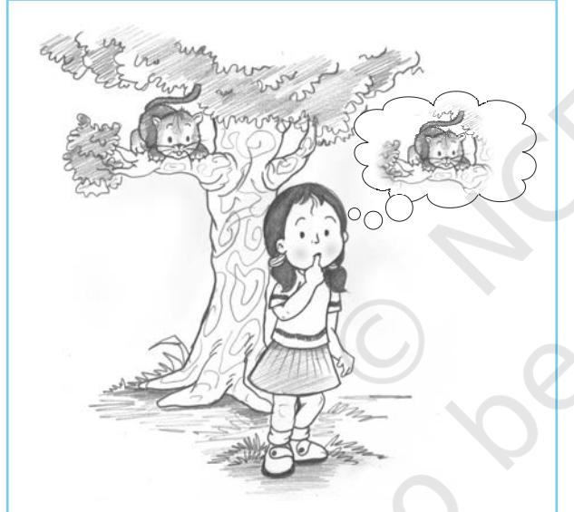
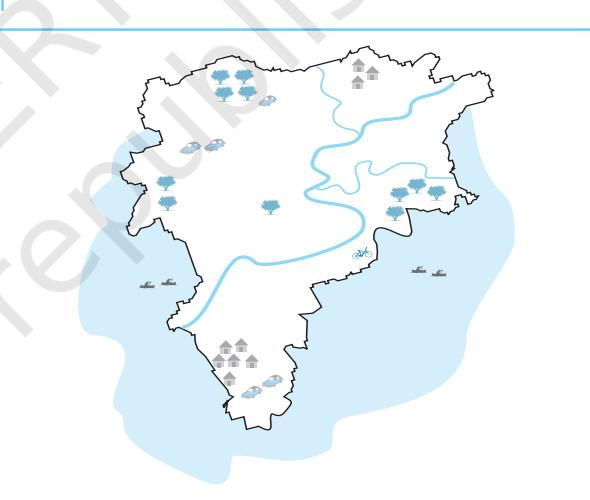
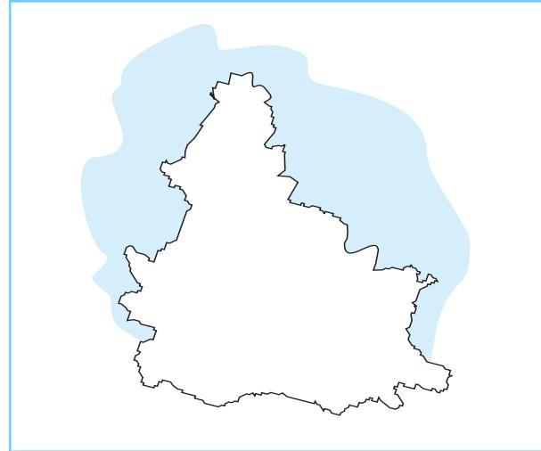
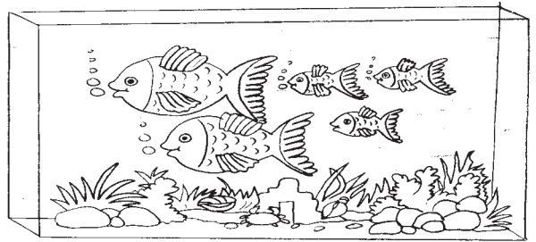
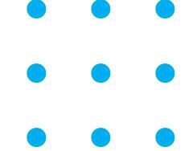
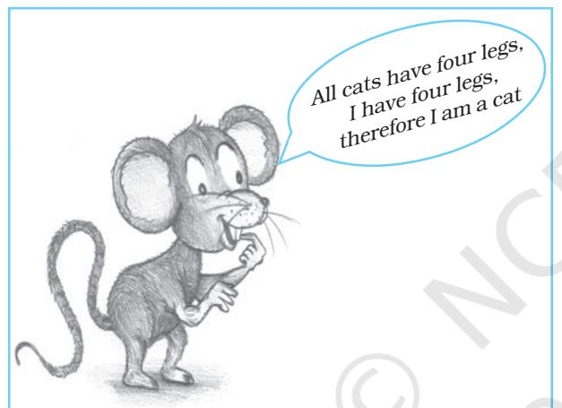
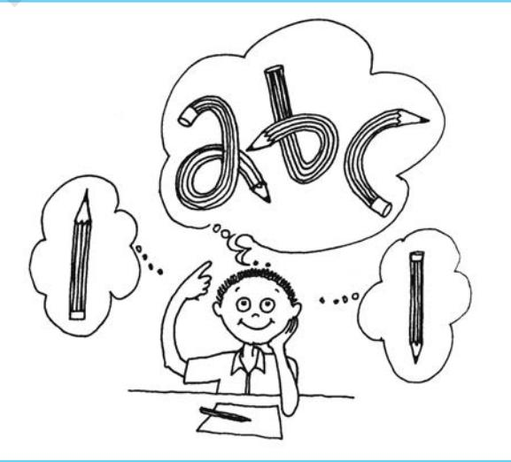
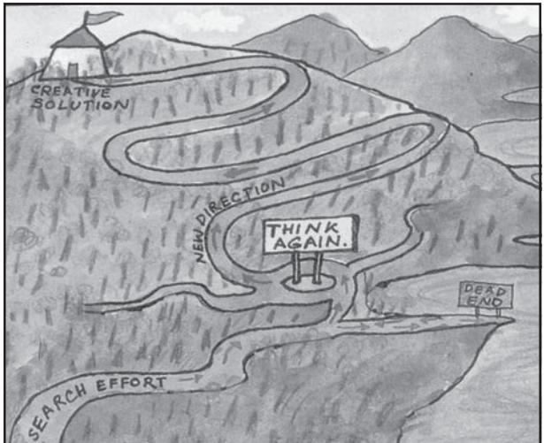
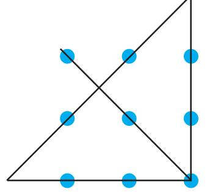
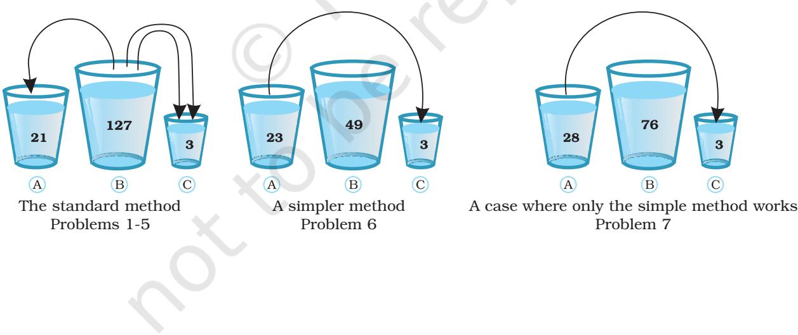

# ThinkingThinking Thinking

# Chapter7 After reading this chapter, you would be able to

- describe the nature of thinking and reasoning,
- demonstrate an understanding of some cognitive processes involved in problem solving and decision-making,
- understand the nature and process of creative thinking and learn ways of enhancing it,
- understand the relationship between language and thought, and
- describe the process of language development and its use.

## Contents

*But whatever the process, the result is wonderful, gradually from naming an object we advance step-by-step until we have traversed the vast difference between our first stammered syllable and the sweep of thought in a line of Shakespeare.*

**Introduction Nature of Thinking** Building Blocks of Thought *Culture and Thinking* (Box 7.1) **The Processes of Thinking Problem Solving Reasoning Decision-making Nature and Process of Creative Thinking** Nature of Creative Thinking *Lateral Thinking* (Box 7.2) Process of Creative Thinking Strategies for Creative Thinking **Thought and Language Development of Language and Language Use**  *Bilingualism and Multilingualism* (Box 7.3) **Key Terms**

**Summary Review QuestionsProject Ideas**

– Helen Keller

# Introduction

*Think for a moment: how many times and in what ways you are using the word 'think' in your day-to-day conversations. Sometimes probably, you use it as a synonym to remember (I can't think of her name), pay attention (think about it ) or convey uncertainty (I think today my friend will visit me). 'Think' has a wide range of meanings which cover a number of psychological processes. However, in psychology, thinking is a core subject area with an independent existence and a meaning of its own. In this chapter, we will discuss thinking as a mental activity directed at solving a problem, making inferences, judging certain facts, and deciding and choosing between options. Further, the nature and characteristics of creative thinking, what it involves and how it can be developed will also be discussed. Have you ever seen a small child building a tower with blocks or sand? The child would build a tower, dismantle it, make another one and so on and so forth. While doing this, the child sometimes talks to herself or himself. The speech would primarily include the steps s/he is following or want to follow ("not this", "a little small", "a tree at the back"), evaluation of the design ("nice"). You also might have experienced talking to yourself while solving a problem. Why do we talk while we think? What is the relationship between language and thought? In this chapter, we shall also be discussing the development of language and the relationship between language and thought. Before starting our discussion on thinking, it is necessary to discuss thinking as the base of human cognition.*

#### **NATURE OF THINKING**

Thinking is the base of all cognitive activities or processes and is unique to human beings. It involves manipulation and analysis of information received from the environment. For example, while seeing a painting, you are not simply focusing on the colour of the painting or the lines and strokes, rather you are going beyond the given text in interpreting its meaning and you are trying to relate the information to your existing knowledge. Understanding of the painting involves creation of new meaning that is added to your knowledge. Thinking, therefore, is a higher mental process through which we manipulate and analyse the acquired or existing information. Such manipulation and analysis occur by means of abstracting, reasoning, imagining, problem solving, judging, and decision-making.

Thinking is mostly organised and goal directed. All day-to-day activities, ranging from cooking to solving a math problem have a goal. One desires to reach the goal by planning, recalling the steps that one has already followed in the past if the task is familiar or inferring strategies if the task is new.

Thinking is an internal mental process, which can be inferred from overt behaviour. If you see a chess player engrossed in thinking for several minutes before making a move, you cannot observe what he is thinking. You can simply infer what he was thinking or what strategies he was trying to evaluate, from his next move.

#### **Building Blocks of Thought**

We already know that thinking relies on knowledge we already possess. Such knowledge is represented either in the form of mental images or words. People usually

Psychology 110

think by means of mental images or words. Suppose you are travelling by road to reach a place, which you had visited long back. You would try to use the visual representation of the street and other places. On the other hand, when you want to buy a storybook your choice would depend upon your knowledge about different authors, themes, etc. Here, your thinking is based on words or concepts. We shall first discuss mental image and then move on to concepts as the base of human thought.

#### *Mental Image*

Suppose, I ask you to imagine a cat sitting on a tree with its tail slightly raised and curved. You would most likely try to form a visual image of the whole situation, something similar to what the girl in the picture is doing (Fig.7.1). Or think of another

*Fig.7.1 : The Girl forming a Mental Image*

situation where you are asked to imagine yourself standing in front of the Taj Mahal and describe what you see. While doing this you are actually forming a visual image of the event. You are probably trying to see through your mind's eye, just like the way you would see a picture. Why is it useful to draw a map while giving directions to someone? Try to remember your earlier

experience in reading a map, remembering the different places and subsequently locating them in a physical map in your examination. In doing this, you were mostly forming and using mental images. An **image** is a **mental representation** of a sensory experience; it can be used to think about things, places, and events. You can try out Activity 7.1, which demonstrates how images are formed.

#### ActivityActivity Activity 7.1

*Give a map, like the following in Fig.7.2a, to your friend to observe for 2 minutes and tell her/him that later on s/he will be asked to locate the marked places in a blank map. Then present a map, like the one in Fig.7.2b, with no indications of the different places. Ask your friend to locate the places s/he has seen in the first map. Then ask how s/he was able to locate the places. S/he will probably be able to tell you the way s/he formed an image of the whole situation.*

*Fig.7.2a : A Map Showing Places*

#### *Concepts*

Whenever we come across an object or event familiar or unfamiliar, we try to identify the object or event by extracting its characteristics, matching it with the already existing category of objects and events. For example, when we see an apple, we categorise it as fruit, when we see a table we categorise it as furniture, when we see a dog we categorise it as an

*Fig.7.2b : A Blank Map Up Side Down*

animal, and so on. When we see a new object, we try to look for its characteristics, match them with characteristics of an existing category, and if matching is perfect we give it the name of that category. For example, while walking on the road you come across an unfamiliar quadruped of a very small size, with a face like a dog, wagging its tail and barking at strangers. You would no doubt identify it as a dog and probably think that it is of a new breed, which you have never seen before. You

Box 7.1 Culture and Thinking

*Our beliefs, values, and social practices influence the way we think. In a study conducted on American and Asian students, pictures like the following (underwater scene) were used. The subjects were asked to have a look at the scene for a brief period and then were asked to describe what they saw. The American students focussed on the biggest, brightest, and most outstanding features (for example, "the large fish swimming to the right"). In contrast, the Japanese students focussed on the background (for example, "the bottom was rocky" or "the water was green"). Based on these kinds of findings, researchers concluded that Americans usually analyse each* would also conclude that it would bite strangers. A concept thus, is a mental representation of a category. It refers to a class of objects, ideas or events that share common properties.

Why do we need to form concepts? Concept formation helps us in organising our knowledge so that whenever we need to access our knowledge, we can do it with less time and effort. It is something similar to what we do to organise our things at home. Children who are very systematic and organised, put their things such as books, note books, pen, pencil, and other accessories in specific places in their cupboard, so that in the morning, they don't have to struggle to find a particular book or the geometry box. In the library too you have seen books organised as per subject areas and labelled so that you would be able to find them quickly with less effort. Thus, for making our thought process quick and efficient, we form concepts and categorise objects and events.

#### **THE PROCESSES OF THINKING**

So far we have been discussing what we mean by thinking and what is the nature of thinking.

*object separately which is called "analytical thinking". Asian people (Japanese, Chinese, Koreans) think more about the relationship between objects and backgrounds, which is called "holistic thinking".*

We also learnt that thinking uses mental images and concepts as the base. Now we will discuss how thinking proceeds in a particular area: problem solving.

#### **PROBLEM SOLVING**

How do we proceed while repairing a broken cycle, or planning a summer tour or patching up a broken friendship? In some cases the solution is reached quickly as in repair of a bicycle based on immediately available cues whereas others are more complex and require time and effort. Problem solving is thinking that is goal-directed. Almost all our day-to-day activities are directed towards a goal. Here it is important to know that problems are not always in the form of obstacles or hurdles that one faces. It could be any simple activity that you perform to reach a defined goal, for example, preparing a quick snack for your

friend who has just arrived at your place. In problem solving there is an initial state (i.e. the problem) and there is an end state (the goal). These two anchors are connected by means of several steps or mental operations. Table 7.1 would clarify your understanding of various steps through which one solves a problem.

You can try out the problems given in Activity 7.2 with your friends and observe how they are approaching the problem. You can ask them the steps they follow while solving these problems.

#### **Obstacles to Solving Problems**

Two major obstacles to solving a problem are mental set and lack of motivation.

#### *Mental Set*

Mental set is a tendency of a person to solve problems by following already tried mental operations or steps. Prior success with a

#### Table 7.1 Mental Operations Involved in Solving a Problem

|  |  | Let us look at the problem of organising a play in school on the occasion of Teachers' Day. |
| --- | --- | --- |
|  | Problem solving would involve the following sequence. |  |
|  | Mental operation | Nature of problem |
| 1. | Identify the problem | A week is left for teachers' day and you are given |
|  |  | the task of organising a play. |
| 2. | Represent the problem | Organising a play would involve identification of |
|  |  | an appropriate theme, screening of actors, |
|  |  | actresses, arranging money, etc. |
| 3. | Plan the solution: | Search and survey various available themes for |
|  | Set sub-goals | a play, and consult teachers and friends who have |
|  |  | the expertise. The play to be decided, based on |
|  |  | such considerations as cost, duration, suitability |
|  |  | for the occasion, etc. |
| 4. | Evaluate all solutions (plays) | Collect all the information/stage rehearsal. |
| 5. | Select one solution and execute it | Compare and verify the various options to get the |
|  |  | best solution (the play). |
| 6. | Evaluate the outcome | If the play (solution) is appreciated, think about |
|  |  | the steps you have followed for future reference |
|  |  | for yourself as well as for your friends. |
| 7. | Rethink and redefine problems | After this special occasion you can still think about |
|  | and solutions | ways to plan a better play in future. |

#### Activity ActivityActivity 7.2

#### **Problem 1**

*Anagrams : Rearrange the letters to form a word. (You can also construct some similar words)*

> *NAGMARA BOLMPER SLEVO STGNIH TOLUSONI*

#### **Problem 2**

*Joining dots : Without lifting your pencil from the paper, connect all nine dots by drawing four straight lines.*

#### **Problem 3**

*Try out the 'water in three bottles' activity with your friend.*

*There are three bottles, A, B, and C. Bottle A can hold 21 ml., B can hold 127 ml., and C can hold 3 ml. The task for your friend is to get 100 ml of water with the help of these three bottles. There are six more problems like this. These seven problems are given below.*

| Problems | The required |  | The capacity of the |  |
| --- | --- | --- | --- | --- |
|  | quantity |  | bottles in ml. |  |
|  |  | A | B | C |
| 1. | 100 | 21 | 127 | 3 |
| 2. | 99 | 14 | 163 | 25 |
| 3. | 5 | 18 | 43 | 10 |
| 4. | 21 | 9 | 42 | 6 |
| 5. | 31 | 20 | 59 | 4 |
| 6. | 20 | 23 | 49 | 3 |
| 7. | 25 | 28 | 76 | 3 |
|  | (Answers are given at the end of the chapter) |  |  |  |

particular strategy would sometimes help in solving a new problem. However, this tendency also creates a mental rigidity that obstructs the problem solver to think of any new rules or strategies. Thus, while in some situations mental set can enhance the quality and speed of problem solving, in other situations it hinders problem solving. You might have

Psychology 114

experienced this while solving mathematical problems. After completing a couple of questions, you form an idea of the steps that are required to solve these questions and subsequently you go on following the same steps, until a point where you fail. At this point you may experience difficulty in avoiding the already used steps. Those steps would interfere in your thought for new strategies. However, in day-to-day activities we often rely on past experiences with similar or related problems.

Like mental set, **functional fixedness** in problem solving occurs when people fail to solve a problem because they are fixed on a thing's usual function. If you have ever used a hardbound book to hammer a nail, then you have overcome functional fixedness.

#### *Lack of Motivation*

People might be great at solving problems, but all their skills and talents are of no use if they are not motivated. Sometimes people give up easily when they encounter a problem or failure in implementing the first step. Therefore, there is a need to persist in their effort to find a solution.

#### **REASONING**

If you find a person desperately running on the railway platform, you could infer a number of things such as: he is running to catch the train which is about to leave, he wants to see off his friend sitting in the train which is about to leave, he has left his bag in the train and wants to get in before the train leaves the station. To figure out why this person is running, you could use different kinds of reasoning, deductive or inductive.

#### **Deductive and Inductive Reasoning**

Since your previous experience indicates that people run on the platform to catch a train, you would conclude that this person is getting late and is running to catch the train.

The kind of reasoning that begins with an assumption is called *deductive reasoning*. Thus deductive reasoning begins with making a general assumption that you know or believe to be true and then drawing specific conclusion based on this assumption. In other words, it is reasoning from general to particular. Your general assumption is that people run on the railway platform only when they are getting late for the train. The man is running on the platform. Therefore, he is getting late for the train. One mistake that you are making (and generally people do commit such mistakes in deductive reasoning) is that you (they) assume but do not always know if the basic statement or assumption is true. If the base information is not true, i.e. people also run on the platform for other reasons then your conclusion would be invalid or wrong. Look at the mouse in Fig.7.3.

*Fig.7.3 : Is the mouse making a True and Valid Conclusion?*

Another way to figure out why the man is running on the platform is to use inductive reasoning. Sometimes you would analyse other possible reasons and observe what the man is actually doing and then draw a conclusion about his behaviour. Reasoning, that is based on specific facts and observation, is called inductive reasoning. Inductive reasoning is drawing a general conclusion based on particular observation. In the earlier example, you observed the other person's subsequent action or actions such as: entering into the train compartment and returning with a bag. Based on your observation you would conclude that the person had left his bag in the train. One mistake you would probably make here is jumping to a conclusion without knowing all possible facts.

From the above discussion we can conclude that reasoning is the process of gathering and analysing information to arrive at conclusions. In this sense, reasoning is also a form of problem solving. The goal is to determine what conclusion can be drawn from certain given information.

Most cases of scientific reasoning are inductive in nature. Scientists and even lay persons consider a number of instances and try to determine what general rule covers them all. Think of yourself using your knowledge of problem solving steps discussed earlier in planning for a play, or conducting a project. Your inductive reasoning is being applied here.

*Analogy* is another form of reasoning which involves four parts, A is to B as C is to D with the relation between the first two parts being the same as the relation between the last two. For example, water is to fish as air is to human; white is to snow as black is to coal. Analogies can be helpful in solving problems. They help us in identifying and visualising the salient attributes of an object or event, which would otherwise go unnoticed.

#### **DECISION-MAKING**

Inductive and deductive reasonings allow us to make judgments. In **judgment** we draw conclusions, form opinions, evaluate events, objects, based on knowledge and available evidences. Consider this example, the man is very talkative, likes to mix with people, can convince others with ease — he would be most suitable for a salesperson's job. Our judgment of this person is based on the specific characteristics of an expert salesperson. Here we will discuss how we make decisions and judgments.

Sometimes judgments are automatic and require no conscious effort by the person and occur as a matter of habit, for example,

applying brakes on seeing the red light. However, evaluating a novel or a literary text requires reference to your past knowledge and experience. Judging the beauty of a painting would involve your personal preferences. Thus our judgments are not independent of our beliefs and attitudes. We also make changes in our judgments based on newly acquired information. Consider this example. A new teacher joins the school, students make onthe-spot judgment of the teacher as being very strict. However, in subsequent classes, they closely interact with the teacher and make changes in their evaluation. Now they judge the teacher to be extremely studentfriendly.

Many of the problems you solve each day require you to make decisions. What to wear for the party? What to eat for dinner? What to say to your friend? The answer to all these lies in picking or choosing one of several choices. In decision-making, we sometimes choose among options based on choices of personal significance. Judgment and decision-making are interrelated processes. In decision-making the problem before us is to choose among alternatives by evaluating the cost and benefit associated with each alternative. For example, when you have the option to choose between psychology and economics as subjects in Class XI, your decision would be based upon your interest, future prospects, availability of books, efficiency of teachers, etc. You could evaluate them by talking to seniors and faculty members and attending a few classes, etc. Decision-making differs from other types of problem solving. In decision-making we already know the various solutions or choices and one has to be selected. Suppose your friend is a very good player of badminton. S/ he is getting an opportunity to play at the state level. At the same time the final examination is approaching and s/he needs to study hard for it. S/he will have to choose between two options, practising for badminton or studying for the final examination. In this situation her/his decision will be based upon evaluation of all possible outcomes.

You would observe that people differ in their priorities and therefore their decisions will differ. In real life situations we take quick decisions and therefore, it is not possible always to evaluate every situation thoroughly and exhaustively.

#### **NATURE AND PROCESS OF CREATIVE THINKING**

You might have wondered at times how some one for the first time, thought of acts like planting a seed, or devising a wheel, or decorating the walls of caves with drawings, etc. Perhaps not satisfied with the old ways of carrying out day-to-day activities, such persons thought of something original. There are countless others whose creativity has led to the present day scientific and technological progress that we now enjoy. Music, painting, poetry, and other forms of art that give us pleasure and joy, are all products of creative thinking.

You might have heard about A.D. Karve, a botanist from our country, who got the UK's top energy award for devising a smokeless *'Chullah'.* He converted dry, useless sugarcane leaves into clean fuel. You might have also heard of Class XI student Ashish Panwar, who won a bronze medal for assembling a five feet tall robot at the First International Robotics Olympiad held at Glasgow. These are only a few examples of creativity. Try to think of some other examples of creativity in different fields.

It is important to remember that creative thinking is not always expressed in extraordinary work. One does not have to be a scientist or an artist to be a creative thinker. Everyone has the potential to be creative. Creative thinking can be applied in almost any area of human activity at different levels. It could be reflected in activities like writing, teaching, cooking, enacting roles, story telling, conversation, dialogues, asking questions, playing games, trying to solve day-to-day problems, organising activities, helping others resolve conflicts, and so on. This concept of 'Everyday Creativity', which is reflected in one's way of perceiving thinking and problem solving, is different from the 'special talent creativity' seen in outstanding creative achievements.

Psychology 116

#### **Nature of Creative Thinking**

Creative thinking is distinguished from other types of thinking by the fact that it involves the production of novel and original ideas or solutions to problems. Sometimes, creative thinking is understood just as a new way of thinking or thinking differently. However, it is important to know that, besides novelty, originality is also an important characteristic of creative thinking. Every year new models of household appliances, tape-recorders, cars, scooters, and television sets produced may not be original unless unique features are added to these products. Creative thinking thus refers to originality and uniqueness of ideas or solutions that did not previously exist. Creative thinking is also generally characterised by what Bruner calls "effective surprise". If the product or idea is unusual, the response of most who experience it is one of instant surprise or of being startled.

Another important criterion that characterises creative thinking is its appropriateness in a particular context. Simply thinking of being different without any purpose, doing things in one's own ways, being non-conformist, indulging in fantasy without any purpose or coming out with a bizarre idea, is at times mistaken for creative thinking. Researchers tend to agree that thinking is said to be creative when it is *reality-oriented, appropriate, constructive,* and *socially desirable*.

J.P. Guilford, a pioneer in creativity research, proposed two types of thinking: **convergent** and **divergent**. Convergent thinking refers to thinking that is required to solve problems which have only one correct answer. The mind converges to the correct solution. To illustrate, look at the question given below. It is based on a number series, where you have to find the next number. Only one right answer is expected.

#### *Q. 3,6,9….. what will come next? Ans. 12.*

Now you try to think of certain questions for which there is no one right answer but many answers. A few such questions are given below:

- *What are the various uses of cloth?*
- *What improvements will you suggest in a chair so that it becomes more comfortable and aesthetically pleasing?*
- *What will happen if examinations are abolished in schools?*

Answers to the above questions require divergent thinking which is an open-ended thinking where the individual can think of different answers to the questions or problems in terms of her/his experiences. Such kind of thinking helps in producing novel and original ideas.

Divergent thinking abilities generally include fluency, flexibility, originality, and elaboration.

- **Fluency** is the ability to produce many ideas for a given task or a problem. The more ideas a person produces, the higher his fluency ability. For example, more the number of uses of a paper cup, more would be the fluency.
- **Flexibility** indicates variety in thinking. It may be thinking of different uses of an object, or different interpretation of a picture, story or different ways of solving a problem. In case of uses of a paper cup, for example, one may give an idea to use it as a container or to draw a circle, etc.

*Fig.7.4 : Thinking Divergently*

Chapter 7 • *Thinking* 117

#### Box 7.2 Lateral Thinking

*Edward de Bono has used the term 'lateral thinking' to what Guilford termed as divergent thinking. He makes a distinction between vertical thinking and lateral thinking. Vertical thinking involves mental operations that move in a straight line back and forth between lower and higher level concepts whereas lateral thinking involves looking for alternative ways of defining and interpreting problems. He states "vertical (logical) thinking digs the same hole deeper, i.e. thinking deeper in the same direction; lateral thinking is concerned with digging a hole in another place". De Bono suggests that lateral thinking can help make mental leaps and is likely to create a number of ways of thinking. De Bono developed* *the 'Six thinking hats' technique to stimulate different modes of thinking. One can put on or take off these hats according to the type of thinking required to be used. White hat means gathering information, facts, figures, and filling gaps in information. Red hat covers expression of feelings, and emotions on the subject. Black hat represents judgment, caution and logic. Yellow hat covers thinking on what will work and why it will be beneficial. Green hat is for creativity, alternatives and changes. Blue hat represents thinking about the process and not the ideas as such. The 'six thinking hats' reflect different perspectives from which an issue or problem is viewed. The technique can be used individually as well as in groups.*

- **Originality** is the ability to produce ideas that are rare or unusual by seeing new relationships, combining old ideas with new ones, looking at things from different perspectives etc. Research has shown that fluency and flexibility are the necessary conditions for originality. The more and varied ideas one produces, the greater the likelihood of original ideas.
- *•* **Elaboration** is the ability that enables a person to go into details and workout implications of new ideas.

Divergent thinking abilities facilitate generation of a variety of ideas which may not seem to be related. For example, what are the common ideas for enhancing food production? The likely answers would be related to quality of seeds, fertilizers, irrigation, and so on. If someone thinks of cultivation in a desert for extracting protein from weeds, it would be a remote idea. The association here is between 'food production' and 'desert' or 'weeds'. Ordinarily, we do not associate these together. But, if we let our mind free to seek new and remote associations, a number of combination of ideas may arise out of which one or two may turn out to be original. You must remember that both convergent and divergent thinking are important for creative thinking. Divergent thinking is essential in generating a wide range of ideas. Convergent thinking is important to identify the most useful or appropriate idea.

#### Activity ActivityActivity 7.3

*Frame five different kinds of questions requiring divergent thinking on issues and problems related to traffic management/pollution/corruption/ illiteracy/poverty. Share and discuss in the class.*

#### **Process of Creative Thinking**

In recent years, more and more attention has been given to the way the human mind operates. Research has made it clear that thinking of new and unusual ideas involve more than a flash of insight. There are stages before and after the new ideas come.

The starting point in creative process is the need to think or bring out something new which initiates the effort. Not everyone experiences this need, as one can be happy and contented, in carrying out routine work. The need for search of new ideas and solutions arises from sensing problems and gaps in information. The process of creative thinking begins with the **preparation** stage that

Psychology 118

*Fig.7.5 : The Creative Process*

requires one to understand the task or problem in hand, analyse the problem, and become aware of the background facts and related information. The process evokes curiosity and excitement to think more and more in different directions. The person tries to look at the task or problem from different angles and viewpoints. Here, divergent thinking abilities discussed earlier play their role to help one extend in new directions.

Coming back to the process, when the person is trying to generate alternative ideas and trying to view the problem or task from an unusual perspective, there may be a feeling of getting stuck. One may even get disgusted with failure and may leave the problem or the task for sometime. This is the stage of **incubation**. Research shows that creative ideas may not occur immediately during incubation when the individual is not consciously thinking about the problem but seeking relaxation from conscious effort. They may occur or strike when a person is doing something else, for example, going to sleep, waking up, taking a bath or just walking along. Followed by incubation is the stage of **illumination** - the 'Aha'! or 'I have found it' experience, the moment we normally associate with emergence of creative ideas. There usually is, a feeling of excitement, even satisfaction, of having found a creative idea. Last is the stage of **verification** when the worth or appropriateness of ideas or

solutions are tested and judged. Here, convergent thinking plays its role in selecting the appropriate idea or solution that works.

#### **Strategies for Creative Thinking**

Research on characteristics of creative people has revealed that there are certain attitudes, dispositions, and skills which facilitate creative thinking. Here are some strategies to help you enhance your creative thinking abilities and skills:

- Become more aware and sensitive to be able to notice and respond to feelings, sights, sounds, textures around you. Spot problems, missing information, anomalies, gaps, deficiencies, and so on. Try to notice contradictions and incompleteness in situations that others may not do. For this, cultivate the habit of wider reading, exposure to a variety of information, and develop the art of asking questions, pondering over the mysteries of situations and objects.
- Generate as many ideas, responses, solutions or suggestions on a given task or situation to increase your flow of thoughts. Try deliberately to look for multiple angles of a task and situation to increase flexibility in your thinking. It could be, for example, thinking of alternative arrangements of furniture in a room to generate more space, different ways of conversing with people, looking for costs and benefits of a course of study or career, looking for ways of dealing with an angry friend, helping others, etc.
- Osborn's **Brainstorming** technique can be used to increase fluency and flexibility of ideas to open-ended situations. Brainstorming is based on the principle that producing ideas should be kept separate from the evaluation of their worth. The basic assumption is to let the minds think freely and the tendency to put judgment on the worth of ideas may be postponed, i.e. imagination should be given priority over judgment till all the ideas are exhausted. This helps in increasing the fluency of ideas and piling up alternatives. Brainstorming can be practised by playing

Chapter 7 • *Thinking* 119

brainstorming games with family members and friends keeping its principles in mind. Use of checklists and questions often provide a new twist for ideas like, What other changes? What else? In how many ways could it be done? What could be the other uses of this object? and so on.

#### **THOUGHT AND LANGUAGE**

Till now, we have discussed the nature and meaning of thinking and how thinking is based on images and concepts. We have also discussed the various processes of thought. Throughout the discussion did you feel that words or language are essential to express what we think? This section examines the relationship between language and thought: that language determines thought, that thought determines language, and that thought and language have different origins. Let us examine these three viewpoints in some detail.

#### **Language as Determinant of Thought**

In Hindi and other Indian languages we use a number of different words for various kinship relationships. We have different terms for mother's brother, father's elder brother, father's younger brother, mother's sister's husband, father's sister's husband, and so on. An English person uses just one word *uncle* to describe all these kinship relationships. In the English language there are dozens of words for colours whereas some tribal languages have only two to four colour terms. Do such differences matter for how we think? Does an Indian child find it easier to think about and differentiate between various kinship relationships compared to her English-speaking counterpart? Does our thinking process depend on how we describe it in our language?

Benjamin Lee Whorf was of the view that language determines the contents of thought. This view is known as **linguistic relativity hypothesis**. In its strong version, this hypothesis holds what and how individuals can possibly think is determined by the language and linguistic categories they use **(linguistic determinism)**. Experimental evidence, however, maintains that it is possible to have the same level or quality of thoughts in all languages depending upon the availability of linguistic categories and structures. Some thoughts may be easier in one language compared to another.

#### **Thought as Determinant of Language**

The noted Swiss psychologist, Jean Piaget believed that thought not only determines language, but also precedes it. Piaget argued that children form an internal representation of the world through thinking. For example, when children see something and later copy it (a process called imitation), thinking does take place, which does not involve language. A child's observation of other's behaviour and imitation of the same behaviour, no doubt involves thinking but not language. Language is just one of the vehicles of thinking. As actions become internalised, language may affect children's range of symbolic thinking but is not necessary for the origins of thought. Piaget believed that though language can be taught to children, understanding of the words require knowledge of the underlying concepts (i.e. thinking). Thus, thought is basic, and necessary if language is to be understood.

#### **Different Origins of Language and Thought**

The Russian psychologist, Lev Vyogotsky, argued that thoughts and language develop in a child separately until about two years of age, when they merge. Before two years thought is preverbal and is experienced more in action (Piaget's sensory motor stage). The child's utterances are more automatic reflexes - crying when uncomfortable - than thought-based. Around two years of age, the child expresses thought verbally and her/his speech reflects rationality. Now children are able to manipulate thoughts using soundless speech. He believed that during this period the development of language and thinking become interdependent; the development of conceptual thinking depends upon the quality of inner

Psychology 120

speech and vice versa. Thought is used without language when the vehicle of thinking is nonverbal such as visual or movement-related. Language is used without thought when expressing feelings or exchanging pleasantries, for example "Good morning! How are you?" "Very well, I am fine". When the two functions overlap, they can be used together to produce verbal thought and rational speech.

#### **DEVELOPMENT OF LANGUAGE AND LANGUAGE USE**

#### **Meaning and Nature of Language**

In the previous section we discussed the relationship between language and thought. In this section, we will examine how human beings acquire and use language in different age groups. Think for a moment: what would have happened if you did not have a language to express whatever you wanted to say? In the absence of language you will not be able to communicate your ideas and feelings, nor will you have the opportunity to know or have access to what others think and feel. As a child when you first started saying "ma..ma..ma.", it not only gave you tremendous boost to continue repeating this activity but also was a great moment of joy for your parents and other care-givers. Slowly you learnt to say 'ma' and 'papa' and sometime later combined two or more words to communicate your needs, feelings, and thoughts. You learnt words appropriate for situations and also learnt the rules of putting these words in sentences. Initially you learnt to communicate in the language being used at home (usually the mother-tongue), went to school and learnt the formal language of instruction (in many cases this language is different from the mothertongue), and were promoted to higher grades and learnt other languages. If you look back, you will realise that your journey from crying and saying "ma..ma..ma" to the attainment of mastery in not one but many languages, has been a fascinating one. In this section we shall be discussing the salient features of language acquisition.

You have been using language all your life. Now try to define accurately what it is that you have been using. Language *consists of a system of symbols organised by means of certain rules that we use to communicate with each other.* You will notice that language has three basic characteristics: (a) *the presence of symbols*, (b) *a set of rules* to organise these symbols, and (c) *communication*. Here we shall be discussing these three characteristics of language.

The first characteristic of language is that it involves *symbols.* Symbols represent something or someone else, for example, the place where you live is called 'home', the place where you study is called 'school', the thing that you eat is called 'food'. Words like home, school, food, and numerous other words do not in themselves carry any meaning. When these words are associated with some objects/ events they attain meaning and we begin recognising those objects/events, etc. with particular words (symbols). We use symbols while thinking.

The second characteristic of language is that it involves *rules*. While combining two or more words we usually follow a definite and accepted order of presenting these words. For example, one would most likely say "I am going to school" and not "school am going I".

The third characteristic of language is that it is used *for communicating one's thought, ideas, intentions, and feelings to others*. On many occasions we communicate through the use of our body parts, called gestures or postures. This type of communication is called non-verbal communication. Some people who cannot use oral speech, like the ones with severe hearing and speech problems, communicate through signs. Sign language is also a form of language.

#### **Development of Language**

Language is a complex system and unique to human beings. Psychologists have tried to teach sign language, use of symbols to

chimpanzees, dolphins, parrots, etc. But it is observed that, human language is more complex, creative, and spontaneous than the system of communication other animals can learn. There is also a great deal *of regularity* with which children all over the world seem to be learning the language or languages to which they are exposed. When you compare individual children, you find that they differ a great deal in the rate of their language development as well as in how they go about it. But when you take a general view of children's acquisition of language all over the world you find some *predictable pattern* in which children proceed from almost no use of language to the point of becoming competent language users. Language develops through some of the stages discussed below.

Newborn babies and young infants make a variety of sounds, which gradually get modified to resemble words. The first sound produced by babies is *crying.* Initial crying is undifferentiated and similar across various situations. Gradually, the pattern of crying varies in its pitch and intensity to signify different states such as hunger, pain, and sleepiness, etc. These differentiated crying sounds gradually become more meaningful *cooing sounds* (like 'aaa', 'uuu', etc.) usually to express happiness.

At around six months of age children enter the *babbling* stage. Babbling involves prolonged repetition of a variety of consonants and vowel sounds (for example, da—, aa—, ba—). By about nine months of age these sounds get elaborated to strings of some sound combinations, such as 'dadadadadada' into repetitive patterns called *echolalia*. While the early babblings are random or accidental in nature, the later babblings seem to be imitative of adult voices. Children show some understanding of a few words by the time they are six months old. Around the first birthday (the exact age varies from child to child) most children enter the *one-word-stage*. Their first word usually contains one syllable – *ma or da,* for instance. Gradually they move to one or more words which are combined to form whole sentences or phrases. So they are called *holophrases.* When they are 18 to 20 months of age, children enter a *two-word stage* and begin to use two words together. The two-word stage exemplifies *telegraphic speech*. Like telegrams (got admission, send money) it contains mostly nouns and verbs. Close to their third birthday, i.e. beyond two-and-a-half years, children's language development gets focused on rules of the language they hear.

How is language acquired? You must be wondering: "How do we learn to speak?" As with many other topics in psychology, the question of whether a behaviour develops as a result of inherited characteristics (nature) or from the effects of learning (nurture) has been raised with regard to language. Most psychologists accept that both nature and nurture are important in language acquisition.

#### Box 7.3 Bilingualism and Multilingualism

*Bilingualism refers to attaining proficiency in communicating through any two languages. Learning of more than two languages is referred to as multilingualism. The term mother tongue has been variously defined as one's native language, the language spoken by the individual from the cradle; language ordinarily used at home; language spoken by the mother; etc. However, generally the mother tongue is viewed as a language with which one identifies at the* *emotional level. It is possible for individuals to have multiple mother tongues. The Indian social context is characterised by grass root multilingualism which makes bi/multilingualism a characteristic at the levels of individual as well as society. Most Indians use more than one language to communicate in various domains of their daily life activities. Thus, multilingualism is a way of life in India. Studies reveal that bilingualism/ multilingualism facilitates cognitive, linguistic, and academic competence of children.*

Psychology 122

Behaviourist B.F. Skinner believed we learn language the same way as animals learn to pick keys or press bars (refer to Chapter 6 on Learning). Language development, for the behaviourists follow the learning principles, such as association (the sight of bottle with the word 'bottle'), imitation (adults use of word "bottle"), and reinforcement (smiles and hugs when the child says something right). There is also evidence that children produce sounds that are appropriate to a language of the parent or care-giver and are reinforced for having done so. The principle of shaping leads to successive approximation of the desired responses so that the child eventually speaks as well as the adult. Regional differences in pronunciation and phrasing illustrate how different patterns are reinforced in different areas.

Linguist Noam Chomsky put forth the innate proposition of development of language. For him the *rate at which children acquire words and grammar* without being taught can not be explained only by learning principles. Children also *create all sorts of sentences* they have never heard and, therefore, could not be imitating. Children throughout the world seem to have a *critical period* — a period when learning must occur if it is to occur successfully — for learning language. Children across the world also go through the same stages of language development. Chomsky believes language development is just like physical maturation- given adequate care, it "just happens to the child". Children are born with "universal grammar". They readily learn the grammar of whatever language they hear.

Skinner's emphasis on learning explains why infants acquire the language they hear and how they add new words to their vocabularies. Chomsky's emphasis on our built-in readiness to learn grammar helps explain why children acquire language so readily without direct teaching.

#### **Language Use**

As we have discussed earlier, language use involves knowing socially appropriate ways of communication. Knowledge of vocabulary and syntax of a language does not ensure proper use of language to achieve the purpose of communication in a variety of social situations. When we use language we have various pragmatic intentions such as requesting, asking, thanking, demanding, etc. In order to effectively serve these social goals, language use must be pragmatically correct or contextually appropriate besides being grammatical and meaningful. Children often have difficulty with choice of appropriate utterances for politeness or for requests and their use of language conveys a demand or a command instead of a polite request. When children are engaged in conversations, they also have difficulty in taking turns in speaking and listening like adults.

### Key Terms

*Bilingualism, Brainstorming, Concepts, Convergent thinking, Creativity, Decisionmaking, Deductive reasoning, Divergent thinking, Functional fixedness, Illumination, Images, Incubation, Inductive reasoning, Judgment, Language, Mental representation, Mental set, Multilingualism, Problem solving, Reasoning, Remote association, Syntax, Thinking*

## Summary

- *Thinking is a complex mental process through which we manipulate information (either acquired or stored). It is an internal process that can be inferred from behaviour. Thinking involves mental representations that are either mental images or concepts.*
- *Complex thought processes are problem solving, reasoning, decision-making, judgment, and creative thinking.*
- *Problem solving is thinking directed towards the solution of a specific problem.*
- *Mental set, functional fixedness, lack of motivation and persistence are some of the hindrances for effective problem solving.*
- *Reasoning, like problem solving, is goal directed, involves inference and can be either deductive or inductive.*
- *In making judgment, we draw conclusions, form opinions, make evaluations about objects or events.*
- *In decision-making one must choose among several available alternatives.*
- *Judgment and decision-making are interrelated processes.*
- *Creative thinking involves the production of something new and original it may be an idea, object or solution to a problem.*
- *• Developing creative thinking requires overcoming blocks to creative expression and using strategies to enhance creative thinking skills and abilities.*
- *Language is distinctly human. It consists of symbols, organised on the basis of certain rules to communicate intentions, feelings, motives, and desires among human beings.*
- *Major development in language occurs during the first two to three years of age.*
- *Language and thought are intricately related.*

#### Review Questions

- 1. Explain the nature of thinking.
- 2. What is a concept? Explain the role of concept in the thinking process.
- 3. Identify obstacles that one may encounter in problem solving.
- 4. How does reasoning help in solving problems?
- 5. Are judgment and decision-making interrelated processes? Explain.
- 6. Why is divergent thinking important in creative thinking process?
- 7. How can creative thinking be enhanced?
- 8. Does thinking take place without language? Discuss.
- 9. How is language acquired in human beings?

#### Project Idearoject Idea roject Idea

Observe children of 1 year, 2 years, and 3 years old over a period of one week. Record the speech and note how the child is learning words and how many words the child has learnt over this period.

Answers to problems in Activity 7.2

**Problem 1** : ANAGRAM, PROBLEM, SOLVE, INSIGHT, SOLUTION.

**Problem 2** :

#### **Problem 3** :

The solution for this problem is fill bottle B (127 ml) completely and then pour out water in bottle A (21 ml) to fill it completely. Now 106 ml is left in bottle B (127ml–21ml). Next pour enough water out of B to fill up C (3 ml), and then empty the bottle C by pouring out all the water from C. Now there is 103 ml of water in B and C is empty. Then again pour water from B to fill up C. Now you will be left with 100 ml of water in B.

In case of the first 5 problems, the desired amount can be reached by the sequence B–A–2C. However, the 6th and 7th problems are critical. In the 6th problem, the desired amount of water is 20 ml and the capacity of the three bottles are: A can hold 23 ml, B can hold 49 ml and C can hold 3 ml. Observe how the participant is solving this problem. Most likely he would successfully solve the problem by following the already tried sequence {49–23–(2 X 3)} without even thinking or trying a simpler and quick method of pouring water from A to C. If your friend is following this procedure then you can conclude that solving the 5 problems has formed a mental set in her/his mind. The 7th problem requires a direct solution of pouring water from A to C. But the mental set is so powerful that many would fail to think of any other steps, other than the already tried one.

