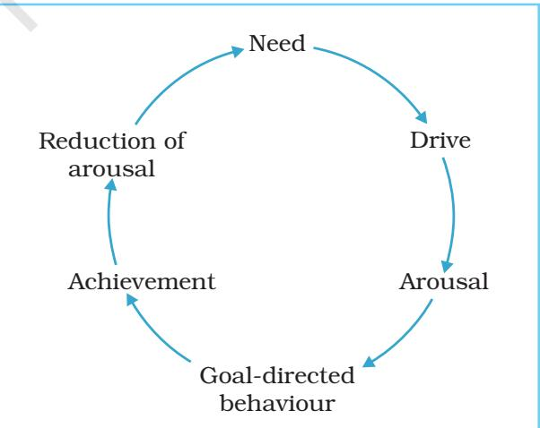
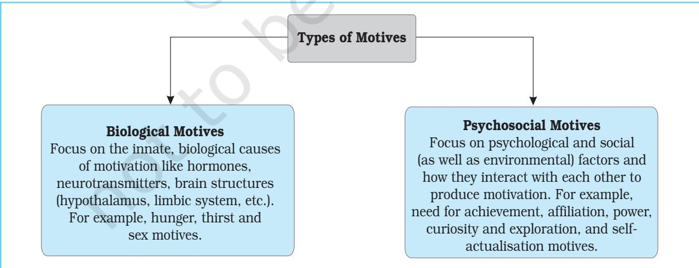
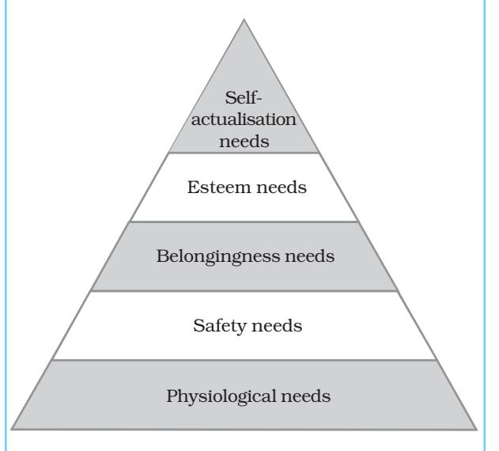
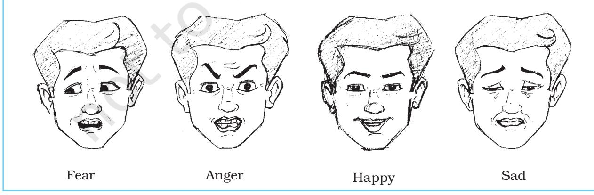

### **Motivation and Emotion Motivation and Emotion**

# Chapter8 After reading this chapter, you would be able to

- understand the nature of human motivation,
- describe the nature of some important motives,
- describe the nature of emotional expression,
- understand the relationship between culture and emotion, and
- know how to manage your own emotions.

# Contents

Introduction Nature of Motivation Types of Motives Biological Motives Psychosocial Motives Maslow's Hierarchy of Needs Nature of Emotions Expression of Emotions Culture and Emotional Expression Culture and Emotional Labeling Managing Negative Emotions *Post-Traumatic Stress Disorder* (Box 8.1) *Management of Examination Anxiety* (Box 8.2) Enhancing Positive Emotions

*Key Terms Summary Review Questions Project Ideas*

*Emotion has taught mankind to reason.*

Psychology 126

– Marquis de Vauvenargues

# Introduction

*Sunita, a girl from a little known town, puts in 10-12 hours of hard work everyday in order to get through the various engineering entrance examinations. Hemant, a physically challenged boy, wants to take part in an expedition and trains himself extensively in a mountaineering institute. Aman saves money from his scholarship so that he can buy a gift for his mother. These are just a few examples, which indicate the role motivation plays in human behaviour. Each of these behaviours are caused by an underlying motive. Behaviour is goal-driven. Goal-seeking behaviour tends to persist until the goal is achieved. For achieving their goals people plan and undertake different activities. How is Sunita going to feel if after all the hard work she has put in, she does not succeed or Aman's scholarship money gets stolen. Sunita, perhaps, will be sad and Aman angry. This chapter will help you to understand the basic concepts of motivation and emotion, and related developments in these two areas. The basic emotions, their biological bases, overt expressions, cultural influences, their relationship with motivation, and some techniques to help you manage your emotions better will also be dealt with.*

#### NATURE OF MOTIVATION

The concept of motivation focuses on explaining what "moves" behaviour. In fact, the term motivation is derived from the Latin word *'movere'*, referring to movement of activity. Most of our everyday explanation of behaviour is given in terms of motives. Why do you come to the school or college? There may be any number of reasons for this behaviour, such as you want to learn or to make friends, you need a diploma or degree to get a good job, you want to make your parents happy, and so on. Some combination of these reasons and/or others would explain why you choose to go in for higher education. Motives also help in making predictions about behaviour. A person will work hard in school, in sports, in business, in music, and in many other situations, if s/he has a very strong need for achievement. Hence, motives are the general states that enable us to make predictions about behaviour in many different situations. In other words, motivation is one of the determinants of behaviour. Instincts, drives, needs, goals, and incentives come under the broad cluster of motivation.

#### The Motivational Cycle

Psychologists now use the concept of need to describe the motivational properties of behaviour. *A need is lack or deficit of some necessity.* The condition of need leads to drive.

*Fig.8.1 : The Motivational Cycle*

Chapter 8 • *Motivation and Emotion* 127

A drive is a state of tension or arousal produced by a need. It energises random activity. When one of the random activities leads to a goal, it reduces the drive, and the organism stops being active. The organism returns to a balanced state. Thus, the cycle of motivational events can be presented as shown in Fig.8.1.

Are there different types of motives? Are there any biological bases explaining different kinds of motives? What happens if your motive remains unfulfilled? These are some of the questions we will discuss in the following sections.

#### TYPES OF MOTIVES

Basically, there are two types of motives : biological and psychosocial. Biological motives are also known as physiological motives as they are guided mostly by the physiological mechanisms of the body. Psychosocial motives, on the other hand, are primarily learned from the individual's interactions with the various environmental factors.

However, both types of motives are interdependent on each other. That is, in some kind of situations the biological factors may trigger a motive whereas in some other situations, the psychosocial factors may trigger the motive. Hence, you should keep in mind that no motive is absolutely biological or psychosocial *per se*, rather they are aroused in the individual with varying combinations.

#### Biological Motives

The biological or physiological approach to explain motivation is the earliest attempt to understand causes of behaviour. Most of the theories, which developed later, carry traces of the influence of the biological approach. The approach adhering to the concept of adaptive act holds that organisms have needs (internal physiological imbalances) that produce drive, which stimulates behaviour leading to certain actions towards achieving certain goals, which reduce the drive. The earliest explanations of motivation relied on the concept of instinct. The term *instinct* denotes inborn patterns of behaviour that are biologically determined rather than learned. Some common human instincts include curiosity, flight, repulsion, reproduction, parental care, etc. Instincts are innate tendencies found in all members of a species that direct behaviour in predictable ways. The term instinct most approximately refers to *an urge to do something*. Instinct has an *"impetus"* which drives the organism to do something to reduce that impetus. Some of the basic biological needs explained by this approach are hunger, thirst, and sex, which are essential for the sustenance of the individual.

*Fig.8.2 : Types of Motives*

Psychology 128

#### *Hunger*

When someone is hungry, the need for food dominates everything else. It motivates people to obtain and consume food. Of course we must eat to live. But, what makes you feel hungry? Studies have indicated that many events inside and outside the body may trigger hunger or inhibit it. The stimuli for hunger include stomach contractions, which signify that the stomach is empty, a low concentration of glucose in the blood, a low level of protein and the amount of fats stored in the body. The liver also responds to the lack of bodily fuel by sending nerve impulses to the brain. The aroma, taste or appearance of food may also result in a desire to eat. It may be noted that none of these alone gives you the feeling that you are hungry. All in combination act with external factors (such as taste, colour, by observing others eating, and the smell of food, etc.) to help you understand that you are hungry. Thus, it can be said that our food intake is regulated by a complex feedingsatiety system located in the hypothalamus, liver, and other parts of the body as well as the external cues available in the environment.

#### *Thirst*

What would happen to you, if you were deprived of water for a long time? What makes you feel thirsty? When we are deprived of water for a period of several hours, the mouth and throat become dry, which leads to dehydration of body tissues. Drinking water is necessary to wet a dry mouth. But a dry mouth does not always result in water drinking behaviour. In fact processes within the body itself control thirst and drinking of water. Water must get into the tissues sufficiently to remove the dryness of mouth and throat.

Motivation to drink water is mainly triggered by the conditions of the body: loss of water from cells and reduction of blood volume. When water is lost by bodily fluids, water leaves the interior of the cells. The anterior hypothalamus contains nerve cells called 'osmoreceptors', which generate nerve impulses in case of cell dehydration.

One of the most powerful drives in both animals and human beings is the sex drive. Motivation to engage in sexual activity is a very strong factor influencing human behaviour. However, sex is far more than a biological motive. It is different from other primary motives (hunger, thirst) in many ways like, (a) sexual activity is not necessary for an individual's survival; (b) homeostasis (the tendency of the organism as a whole to maintain constancy or to attempt to restore equilibrium if constancy is disturbed) is not the goal of sexual activity; and (c) sex drive develops with age, etc. In case of lower animals, it depends on many physiological conditions; in case of human beings, the sex drive is very closely regulated biologically, sometimes it is very difficult to classify sex purely as a biological drive.

#### Psychosocial Motives

Social motives are mostly learned or acquired. Social groups such as family, neighbourhood, friends, and relatives do contribute a lot in acquiring social motives. These are complex forms of motives mainly resulting from the individual's interaction with her/his social environment.

#### *Need for Affiliation*

Most of us need company or friend or want to maintain some form of relationship with others. Nobody likes to remain alone all the time. As soon as people see some kinds of similarities among themselves or they like each other, they form a group. Formation of group or collectivity is an important feature of human life. Often people try desperately to get close to other people, to seek their help, and to become members of their group. Seeking other human beings and wanting to be close to them both physically and psychologically is called affiliation. It involves motivation for social contact. Need for affiliation is aroused when individuals feel threatened or helpless and also when they are happy. People high on this need are motivated to seek the company of others

and to maintain friendly relationships with other people.

#### *Need for Power*

Need for power is an ability of a person to produce intended effects on the behaviour and emotions of another person. The various goals of power motivation are to influence, control, persuade, lead, and charm others and most importantly to enhance one's own reputation in the eyes of other people.

David McClelland (1975) described four general ways of expression of the power motive. First, people do things to gain feeling of power and strength from sources outside themselves by reading stories about sports stars or attaching themselves to a popular figure. Second, power can also be felt from sources within us and may be expressed by building up the body and mastering urges and impulses. Third, people do things as individuals to have an impact on others. For example, a person argues, or competes with another individual in order to have an impact or influence on that person. Fourth, people do things as members of organisations to have an impact on others as in the case of the leader of a political party; the individual may use the party apparatus to influence others. However, for any individual, one of these ways of expressing power motivation may dominate, but with age and life experiences, it varies.

#### *Need for Achievement*

You might have observed some students work very hard and compete with others for good marks/grades in the examination, as good marks/grades will create opportunities for higher studies and better job prospects. It is the achievement motivation, which refers to the desire of a person to meet standards of excellence. Need for achievement, also known as n-Ach, energises and directs behaviour as well as influences the perception of situations.

During the formative years of social development, children acquire achievement motivation. The sources from which they learn it, include parents, other role models, and

socio-cultural influences. Persons high in achievement motivation tend to prefer tasks that are moderately difficult and challenging. They have stronger-than-average desire for feedback on their performance, that is to know how they are doing, so that they can adjust their goals to meet the challenge.

#### *Curiosity and Exploration*

Often people engage in activities without a clear goal or purpose but they derive some kind of pleasure out of it. It is a motivational tendency to act without any specific identifiable goal. The tendency to seek for a novel experience, gain pleasure by obtaining information, etc. are signs of curiosity. Hence, curiosity describes behaviour whose primary motive appears to remain in the activities themselves.

What will happen if the sky falls on us? Questions of this kind (What will happen if…) stimulate intellectuals to find answers. Studies show that this curiosity behaviour is not only limited to human beings, animals too show the same kind of behaviour. We are driven to explore the environment by our curiosity and our need for sensory stimulation. The need for varied types of sensory stimulations is closely related to curiosity. It is the basic motive, and exploration and curiosity are the expressions of it.

Our ignorance about a number of things around us becomes a powerful motivator to explore the world. We get easily bored with repetitive experiences. So we look for something new.

In the case of infants and small children, this motive is very dominant. They get satisfaction from being allowed to explore, which is reflected in their smiling and babbling. Children become easily distressed, when the motive to explore is discouraged, as you have read in Chapter 3.

#### MASLOW'S HIERARCHY OF NEEDS

There are various views on human motivation, the most popular among these is given by Abraham H. Maslow (1968; 1970). He

Psychology 130

attempted to portray a picture of human behaviour by arranging the various needs in a hierarchy. His viewpoint about motivation is very popular because of its theoretical and applied value which is popularly known as the "Theory of Self-actualisation" (see Fig.8.3).

Maslow's model can be conceptualised as a pyramid in which the bottom of this hierarchy represents basic physiological or biological needs which are basic to survival such as hunger, thirst, etc. Only when these needs are met, the need to be free from threatened danger arises. This refers to the safety needs of physical and psychological nature. Next comes the need to seek out other people, to love and to be loved. After these needs are fulfilled, the individual strives for esteem, i.e. the need to develop a sense of selfworth. The next higher need in the hierarchy reflects an individual's motive towards the fullest development of potential, i.e. selfactualisation. A self-actualised person is selfaware, socially responsive, creative, spontaneous, open to novelty, and challenge. S/he also has a sense of humour and capacity for deep interpersonal relationships.

Lower level needs (physiological) in the hierarchy dominate as long as they are unsatisfied. Once they are adequately satisfied, the higher needs occupy the individual's attention and effort. However, it must be noted that very few people reach the highest level because most people are concerned more with the lower level needs.

#### ActivityActivity Activity 8.1

*Actual actions sometimes contradict the hierarchy of needs. Soldiers, police officers, and fire personnels have been known to protect others by facing very endangering situations, seemingly in direct contradiction to the prominence of safety needs.*

*Why does it happen? Discuss it in your group and then with your teacher.*

#### NATURE OF EMOTIONS

*'Swati is very happy. Her examination result has been declared today and she has topped the class. She is feeling euphoric. However, her friend Pranoy is feeling sad, as he has not done well. Among her friends some are feeling jealous of Swati's achievement. Jeevan who has not performed up to his expectation is angry with himself; he feels unhappy that his parents would be very disappointed'.*

Joy, sorrow, hope, love, excitement, anger, hate, and many such feelings are experienced in the course of the day by all of us. The term emotion is often considered synonymous with the terms 'feeling' and 'mood'. Feeling denotes the pleasure or pain dimension of emotion, which usually involves bodily functions. Mood is an affective state of long duration but of lesser intensity than emotion. Both these terms are narrower than the concept of emotion. Emotions are a complex pattern of arousal, subjective feeling, and cognitive interpretation. Emotions, as we experience them, move us internally, and this process involves physiological as well as psychological reactions.

Emotion is a subjective feeling and the experience of emotions varies from person to person. In psychology, attempts have been made to identify basic emotions. It has been noted that at least six emotions are experienced

and recognised everywhere. These are: anger, disgust, fear, happiness, sadness, and surprise. Izard has proposed a set of ten basic emotions, i.e. joy, surprise, anger, disgust, contempt, fear, shame, guilt, interest, and excitement with combinations of them resulting in other emotional blends. According to Plutchik, there are eight basic or primary emotions. All other emotions result from various mixtures of these basic emotions. He arranged these emotions in four pairs of opposites, i.e. joy-sadness, acceptance-disgust, fear-anger, and surpriseanticipation.

Emotions vary in their intensity (high, low) and quality (happiness, sadness, fear). Subjective factors and situational contexts influence the experience of emotions. These factors are gender, personality, and psychopathology of certain kinds. Evidence indicates that women experience all the emotions except anger more intensely than men. Men are prone to experience high intensity and frequency of anger. This gender difference has been attributed to the social roles attached to men (competitiveness) and women (affiliation and caring).

#### EXPRESSION OF EMOTIONS

Do you get to know that your friend is happy or sad or indifferent? Does s/he understand your feelings? Emotion is an internal experience not directly observable by others. Emotions are inferred from verbal and nonverbal expressions. These verbal and nonverbal expressions act as the channels of communication and enable an individual to express one's emotions and to understand the feelings of others.

#### Culture and Emotional Expression

The verbal channel of communication is composed of spoken words as well as other vocal features of speech like pitch and loudness of the voice. These non-verbal aspects of the voice and temporal characteristics of speech are called 'paralanguage'. Other non-verbal channels include facial expression, kinetic (gesture, posture, movement of the body) and proximal (physical distance during face-to-face interaction) behaviours. Facial expression is the most common channel of emotional communication. The amount and kind of information conveyed by the face is easy to comprehend as the face is exposed to the full view of others (see Fig.8.4). Facial expressions can convey the intensity as well as the pleasantness or unpleasantness of the individual's emotional state. Facial expressions play an important role in our everyday lives. There has been some research evidence supporting Darwin's view that facial expressions for basic emotions (joy, fear, anger, disgust, sadness, and surprise) are inborn and universal.

Bodily movements further facilitate the communication of emotions. Can you feel the difference between your body movements when

*Fig.8.4 : Sketches of Facial Expressions of Emotions*

Psychology 132

you feel angry and movements when you feel shy? Theatre and drama provide an excellent opportunity to understand the impact of body movements in communicating emotions. The roles of gestures and proximal behaviours are also significant. You must have seen how in Indian classical dances like *Bharatanatyam, Odissi, Kuchipudi, Kathak* and others, emotions are expressed with the help of movements of eyes, legs, and fingers. The dancers are trained rigorously in the grammar of body movement and non-verbal communication to express joy, sorrow, love, anger, and various other forms of emotional states.

The processes involved in emotions have been known to be influenced by culture. Cultural differences have also been found in the gaze behaviour. It has been observed that the Latin Americans and the Southern Europeans direct their gaze to the eyes of the interactant. Asians, in particular, Indians and Pakistanis, prefer a peripheral gaze (looking away from the conversational partner) during an interaction.

#### Culture and Emotional Labeling

Basic emotions also vary in the extent of elaboration and categorical labels. The Tahitian language includes 46 labels for the English word *anger*. When asked to label freely, the North American subjects produced 40 different responses for the facial expression of anger and 81 different responses for the facial expression

of contempt. The Japanese produced varied emotional labels for facial expressions of happiness (10 labels), anger (8 labels), and disgust (6 labels). Ancient Chinese literature cites seven emotions, namely, joy, anger, sadness, fear, love, dislike, and liking. Ancient Indian literature identifies eight such emotions, namely, love, mirth*,* energy*,* wonder*,* anger, grief*,* disgust, and fear. In Western literature, certain emotions like happiness, sadness, fear, anger, and disgust are uniformly treated as basic to human beings. Emotions like surprise, contempt, shame, and guilt are not accepted as basic to all.

In brief, it might be said that there are certain basic emotions that are expressed and understood by all despite their cultural and ethnic differences, and there are certain others that are specific to a particular culture.

#### MANAGING NEGATIVE EMOTIONS

Try living a day in which you do not feel any emotion. You would realise that it is difficult even to imagine a life without emotions. Emotions are a part of our daily life and existence. They form the very fabric of our life and interpersonal relations.

Effective emotion management is the key to effective social functioning in modern times. The following tips might prove useful to you for achieving the desired balance of emotions :

#### Box 8.1 Post -Traumatic Stress Disorder

*A disaster produces serious disruption of the functioning of human society, resulting in widespread material or environmental loss, which cannot be dealt with immediately with the existing resources. Disaster may be natural (like earthquake/cyclone/tsunami) or man-made (like war). The trauma an individual experiences during a disaster may range from mere perception of such an event to actually encountering it, which may be life threatening.* *Either of these conditions may lead to development of post-traumatic stress disorder (PTSD), where the person tends to re-experience the event through flashbacks and get overwhelming thoughts about the event even after a substantial period of time. This condition makes a person emotionally disturbed and the person fails to adopt an appropriate coping strategy in regular activities. Emotions manifest in uniquely recognisable patterns with maladaptive behaviour (like depression) and autonomic arousal.*

- Enhance self-awareness : Be aware of your own emotions and feelings. Try to gain insight into the 'how' and 'why' of your feelings.
- Appraise the situation objectively : It has been proposed that emotion is preceded by evaluation of the event. If the event is experienced as disturbing, your sympathetic nervous system is activated and you feel stressed. If you do not experience the event as disturbing, then there is no stress. Hence, it is you who decides whether to feel sad and anxious or happy and relaxed.
- Do some self-monitoring : This involves constant or periodic evaluation of your past accomplishments, emotional and physical states, real and vicarious experiences. A positive appraisal would enhance your faith in yourself and lead to enhanced feeling of wellness and contentment.
- Engage in self-modeling : Be the ideal for yourself. Repeatedly observe the best parts of your past performance and use them as an inspiration and motivation to perform better in the future.
- Perceptual reorganisation and cognitive restructuring : Try viewing the events

#### Box 8.2 Management of Examination Anxiety

*For most of us an approaching examination brings about a feeling of a churning stomach and anxiety. In fact, any situation which involves performing a task and the awareness of being evaluated for the performance is an anxietyprovoking situation for most people. A certain level of anxiety is definitely essential as it motivates and pushes us to put up our best performance but a high level of anxiety becomes an impediment in optimum performance and achievement. An anxious individual is highly aroused physiologically and emotionally, and hence is not able to perform to the best of her/ his abilities.*

*An examination is a potentially stress provoking situation and like other stressful situations coping involves two strategies, i.e. Monitoring or taking effective action, and Blunting or avoiding the situation.*

*Monitoring involves taking effective and direct action to deal with the stressful situation. The following strategies can be used for monitoring :*

- *• Prepare well : Prepare well for the examination and prepare well in advance. Give yourself ample time. Familiarise yourself with the pattern of question papers and frequently asked questions. This gives you a sense of predictability and control and reduces the stress potential of the examination.*
- *• Have a rehearsal : Make yourself go through a mock examination. Ask your friend to test your knowledge. You can also rehearse mentally in your mind. Visualise yourself taking the examination completely relaxed and*

*confident and then passing with flying colours.*

- *• Inoculation : Inoculate yourself against stress. Exposure through rehearsals and roleplaying prepares you physically and mentally to face the examination situation better and with confidence.*
- *• Positive thinking : Have faith in yourself. Structure your thoughts with systematically listing the thoughts that worry you and then rationally dealing with them one by one. Emphasise on your strengths. Suggest to yourself to be positive and enthusiastic.*
- *• Seek support : Do not hesitate to ask for help from your friends, parents, teachers or seniors. Talking about a stressful situation to a close person makes one feel light and helps gain insight. The situation may not be as bad as it seems.*

*On the other hand, blunting strategies involve avoiding the stressful situation. True, avoidance is neither desirable nor possible in an examination situation, but the following techniques may prove useful:*

- *• Relaxation : Learn to relax. Relaxation techniques help you calm your nerves and give you an opportunity to reframe your thoughts. There are many different relaxation techniques. In general, this involves sitting or lying down in a comfortable posture in a quiet place, relaxing your muscles, reducing the external stimulation as well as minimising the flow of thoughts and focusing.*
- *• Exercise : A stressful situation overactivates the sympathetic nervous system. Exercise helps in channelising the excess energy generated by this. A brief period of light exercise or active sport will help you concentrate better on your studies.*

Psychology 134

differently and visualise the other side of the coin. Restructure your thoughts to enhance positive and reassuring feelings and eliminate negative thoughts.

- Be creative : Find and develop an interest or a hobby. Engage in an activity that interests and amuses you.
- Develop and nurture good relationships : Choose your friends carefully. In the company of happy and cheerful friends you will feel happy in general.
- Have empathy : Try understanding other's feelings too. Make your relationships meaningful and valuable. Seek as well as provide support mutually.
- Participate in community service : Help yourself by helping others. By doing community service (for example, helping an intellectually challenged child learn an adaptive skill), you will gain important insights about your own difficulties.

#### Managing your Anger

Anger is a negative emotion. It carries the mind away or in other words, the person looses

#### Activity ActivityActivity 8.2

*Think of an intense emotional experience you have gone through recently and explain the sequence of events. How did you deal with it? Share it with your class.*

control on behavioural functions during the state of anger. The major source of anger is the frustration of motives. However, anger is not a reflex, rather it is a result of our thinking. Neither is it automatic nor uncontrollable and caused by others but it is a self-induced choice that the individual makes. Anger is a result of your thinking and hence is controllable by your own thoughts only. Certain key points in anger management are as follows:

- Recognise the power of your thoughts.
- Realise you alone can control it.
- Do not engage in 'self-talk that burns'. Do

not magnify negative feelings.

- Do not ascribe intentions and ulterior motives to others.
- Resist having irrational beliefs about people and events.
- Try to find constructive ways of expressing your anger. Have control on the degree and duration of anger that you choose to express.
- Look inward not outward for anger control.
- Give yourself time to change. It takes time and effort to change a habit.

#### ENHANCING POSITIVE EMOTIONS

Our emotions have a purpose. They help us adapt to the ever-changing environment and are important for our survival and well-being. Negative emotions like fear, anger or disgust prepare us mentally and physically for taking immediate action towards the stimulus that is threatening. For example, if there was no fear we would have caught a poisonous snake in our hand. Though negative emotions protect us in such situations but excessive or inappropriate use of these emotions can become life threatening to us, as it can harm our immune system and have serious consequences for our health.

Positive emotions such as hope, joy, optimism, contentment, and gratitude energise us and enhance our sense of emotional wellbeing. When we experience positive affect, we display a greater preference for a large variety of actions and ideas. We can think of more possibilities and options to solve whatever problems we face and thus, we become proactive.

Psychologists have found that people, who were shown films depicting joy and contentment, came up with more ideas regarding things they would like to do as compared to those who were shown films evoking anger and fear. Positive emotions give us a greater ability to cope with adverse circumstances and quickly return to a normal state. They help us set up long-term plans and goals, and form new relationships. Various

ways of enhancing positive emotions are given below:

- Personality traits of optimism, hopefulness, happiness and a positive selfregard.
- Finding positive meaning in dire circumstances.
- Having quality connections with others, and supportive network of close relationships.
- Being engaged in work and gaining mastery.
- A faith that embodies social support, purpose and hope, leading a life of purpose.

- Positive interpretations of most daily events.
## Key Terms

*Anxiety, Arousal, Basic emotions, Biological needs (hunger, thirst, sex), Esteem needs, Examination anxiety, Expression of emotions, Hierarchy of needs, Motivation, Motives, Need, Power motive, Psychosocial motives, Self-actualisation, Self-esteem*

# Summary

- *The process of persistent behaviour directed towards a specific goal, which results from certain driving forces, is called motivation.*
- *There are two types of motivation, namely, biological, and psychosocial motivation.*
- *Biological motivation focuses on the innate, biological causes of motivation like hormones, neurotransmitters, brain structures (hypothalamus, limbic system), etc. Examples of biological motivation are hunger, thirst, and sex.*
- *Psychosocial motivation explains motives resulting mainly from the interaction of the individual with his social environment. Examples of psychosocial motives are need for affiliation, need for achievement, curiosity and exploration, and the need for power.*
- *Maslow arranged various human needs in an ascending hierarchical order, beginning with the most basic physiological needs, and then safety needs, love and belongingness needs, esteem needs, and finally on the top of the hierarchy is the need for self-actualisation.*
- *Emotion is a complex pattern of arousal that involves physiological activation, conscious awareness of feeling, and a specific cognitive label that describes the process.*
- *Certain emotions are basic like joy, anger, sorrow, surprise, fear, etc. Other emotions are experienced as a result of combination of these emotions.*
- *Culture strongly influences the expression and interpretation of emotions.*
- *Emotion is expressed through verbal and non-verbal channels.*
- *It is important to manage emotions effectively in order to ensure physical and psychological well-being.*

#### Review Questions

- 1. Explain the concept of motivation.
- 2. What are the biological bases of hunger and thirst needs?
- 3. How do the needs for achievement, affiliation, and power influence the behaviour of adolescents? Explain with examples.
- 4. What is the basic idea behind Maslow's hierarchy of needs? Explain with suitable examples.
- 5. How does culture influence the expression of emotions?
- 6. Why is it important to manage negative emotions? Suggest ways to manage negative emotions.

#### Project Ideasroject Ideas roject Ideas

- 1. Using Maslow's hierarchy of needs, analyse what kind of motivational forces might have motivated the great mathematician S.A. Ramanujan and the great shehnai Maestro Ustad Bismillah Khan (Bharat Ratna) to perform exceptionally in their respective fields. Now place yourself and five more known people in terms of need satisfaction. Reflect and discuss.
- 2. In many households, family members do not eat without bathing first and practise religious fasts. How have different social practices influenced your expression of hunger and thirst? Conduct a survey on five people from different backgrounds and prepare a report.

