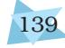

- **Absolute threshold:** The minimum intensity necessary for a stimulus to be detected.
- **Achievement need/motive:** Need to succeed, to perform better than others, to excel, to take challenging tasks which demonstrate person's ability.
- **Adolescence:** The developmental period of transition from childhood to early adulthood, starting at approximately 11 to 12 years of age and ending at 18 to 20 years of age.
- **Aerial perspective:** A monocular cue to depth perception consisting of the relative clearness of objects under varying atmospheric conditions. Nearer objects are usually clearer in detail and colour whereas farther objects are less distinct.
- **Animism:** A facet of preoperational thought; the belief that inanimate objects have "lifelike" qualities and are capable of action.
- **Anxiety:** A general feeling of apprehension or dread accompanied by predictable physiological changes.
- **Arousal:** A physiological state of the body.
- **Artificial intelligence (AI):** The field concerned with creating machines (e.g., computers) that can perform complex tasks formerly considered to require human intelligence.
- **Associative learning:** Learning that certain events occur together. The events may be two stimuli (as in classical conditioning) or a response and its consequences (as in operant conditioning).
- **Attachment:** A close emotional bond between the infant and the parents or caregiver.
- **Attribution:** Inference about an individual's internal state based on the perception of external factors (cues).
- **Authoritative parenting:** A parenting style in which parents encourage children to be independent but still place limits and control on their actions.
- **Basic emotions:** Feeling states common to the human species from which other feeling states are derived.
- **Behaviour genetics:** The study of the power and limits of genetic and environmental influences on behaviour.
- **Behaviour:** Any covert or overt action/reaction a person or animal does that can be observed in some way.
- **Behaviourism:** A school of thought that emphasises objectivity, observable behavioural responses, learning, and environmental determinants.
- **Bilingualism:** The acquisition of two languages that use different speech sounds, vocabularies, and grammatical rules.
- **Binocular cues:** Depth cues, such as retinal disparity and convergence, that depend on the use of two eyes.
- **Biofeedback:** A procedure that permits individuals to monitor their own physiological processes (e.g., heart rate, blood pressure), which they are normally unaware of, to learn to control them.
- **Bottom-up processing:** In form perception, progression from individual elements to the whole.
- **Brainstorming:** A problem-solving strategy in which an individual or a group collects all possible ideas and evaluates them only after all items have been collected.
- **Case study:** A technique in which one person is studied in depth.
- **Cell:** The most fundamental unit of a living organism.
- **Centration:** The focusing or centring of attention on one characteristic to the exclusion of all others.
- **Cephalocaudal pattern:** The sequence in which the greatest growth occurs at the top-the headwith physical growth in size, weight, and feature differentiation gradually working from top to bottom.
- **Chronological age:** The number of years that have elapsed since a person's birth; what is usually meant by "age".
- **Chunking:** A group of familiar stimuli stored as a single unit.
- **Classical conditioning:** A type of learning in which an organism learns to associate stimuli. The main feature is that the originally neutral conditioned stimulus (CS), through repeated pairing with the unconditioned stimulus (US), acquires the response originally given to the US.
- **Closure:** Organisational process leading to perception of incomplete figures as wholes.

Psychology 138

- **Cognition:** All the mental activities associated with knowing; namely, perceiving, thinking, and remembering, etc. These are associated with processing, understanding, and communicating information.
- **Cognitive approach:** The view that emphasises human thought and all the processes of knowing as central to the study of psychology.
- **Cognitive learning:** Learning that involves reorganisation of one's perceptions, knowledge, and ideas.
- **Cognitive map:** A mental representation of the layout of one's environment. For example, after exploring a maze, rats act as if they have learned a cognitive map of it.
- **Cognitive processes:** Processes involving the individual's thought, intelligence, and language.
- **Colour constancy:** The tendency to perceive a well-known object as being a single colour, even if its actual colour is modified by changes in illumination.
- **Concept:** A general category of ideas, objects, people, or experiences whose members share certain properties.
- **Concrete operational stage:** The third Piagetian stage, lasting approximately from 7 to 11 years of age. In this stage, children can perform logical operations, and reasoning on concrete examples but cannot deal with abstract things.
- **Conditioned response (CR):** In classical conditioning, the learned or acquired response to a conditioned stimulus (CS).
- **Conditioned stimulus (CS):** A neutral stimulus that, through repeated association with an unconditioned stimulus, becomes capable of eliciting a conditioned response (CR).
- **Conditioning:** A systematic procedure through which new responses are learned to stimuli.
- **Confidentiality:** Researchers are responsible for keeping all of the data they collect completely anonymous.
- **Confounding:** A term used to describe the operation of variables in an experiment that confuse the interpretation of the data. If the independent variable is confounded with an uncontrolled relevant variable, the experimenter cannot separate the effects of the two variables on the dependent measure.
- **Consciousness:** Awareness of the general condition of one's mind, awareness of particular mental contents, or self-awareness.
- **Conservation:** A belief in the permanence of certain attributes of objects or situations in spite of superficial changes.
- **Content analysis:** A procedure for analysing the themes in qualitative data by determining the frequency of specific ideas, concepts, or terms and their relationship.
- **Control group:** Subjects in a study who do not receive the special treatment given to the experimental group.
- **Control processes:** Mechanisms which govern transfer of information from one system of storage to another.
- **Convergent thinking:** Thinking that is directed toward one correct solution to a problem.
- **Correlational research:** Research with the goal of describing the strength of the relationship between two or more events or characteristics or variables.
- **Creativity:** The ability to think in novel and unusual ways and to come up with unique solutions to problems.
- **Culture:** The widely shared customs, beliefs, values, norms, institutions, and other products of a community that are transmitted socially across generations.
- **Data:** Qualitative and quantitative information related to mental processes and behaviour, gathered from individuals.
- **Debriefing:** The procedure for informing a participant of the actual intent of an experiment after its successful completion. It is specially required if the participant was seriously misled during the conduct of experiment.
- **Decision-making:** The process of evaluating alternatives and making choices among them.
- **Deductive reasoning:** Reaching a conclusion by accepting the premises of an argument and then following the formal logical rules.
- **Deoxyribonucleic acid (DNA):** The genetic material of the cell, located in the nucleus.
- **Dependent variable:** The factor that is measured in an experiment; it changes because of the manipulation of the independent variable.
- **Depth perception:** The perception of the distance of an object from the observer or the distance from front to back of a solid object.
- **Development:** It is the pattern of progressive, orderly, and predictable changes that begin at conception and continue throughout life.
- **Difference threshold:** The minimum difference between a pair of stimuli that can be perceived.

*Glossary* 139

- **Discrimination:** In classical conditioning, the ability to distinguish between a conditioned stimulus and other stimuli that do not signal an unconditioned stimulus. In operant conditioning, responding differently to stimuli that signal a behaviour will be reinforced or will not be reinforced.
- **Divergent thinking:** Thinking that meets the criteria of originality, inventiveness, and flexibility. It calls for thinking in different directions, searching for a variety of answers to questions that can have several answers and is characteristic of creativity.
- **Divided attention:** The process by which attention is split between two or more sets of stimuli.
- **Dyslexia:** A general term referring to difficulty in reading.
- **Echoic memory:** A momentary sensory memory of auditory stimuli; if attention is elsewhere, sounds and words can still be recalled within 3 or 4 seconds.
- **Egocentrism:** A salient feature of preoperational thought, which refers to the inability to distinguish between one's own perspective and someone else's perspective.
- **Elaborative rehearsals:** The linking of new information in short-term memory to familiar material stored in long-term memory.
- **Emotion:** Complex pattern of changes in response to situation perceived as personally significant, including physiological arousal, feelings, thoughts, and behaviours.
- **Encoding:** The process of recording information into the memory system for the first time.
- **Environment:** The aggregate of external conditions – physical, biological, social and cultural that influence the functions of the organism.
- **Episodic memory:** LTM component that stores autobiographic information coded for reference to a timeframe for past occurrences.
- **Esteem needs:** In Maslow's theory, needs for prestige, success, and self-respect. They can be fulfilled after belongingness and love needs are satisfied.
- **Evolution:** The theory proposed by Charles Darwin that over time organisms originate and change in response to adaptational demands of their unique environments.
- **Experiment:** A series of observations conducted under controlled conditions to investigate the causal relationship between selected variables.
- **Experimental group:** The subjects in study who receive some special treatment in regard to the independent variable.
- **Explicit memory:** Memory of facts and experiences that one can consciously know and "declare" (also called declarative memory).
- **Extinction:** The diminishing of a conditioned response; occurs in classical conditioning when an unconditioned stimulus (US) does not follow a conditioned stimulus (CS); occurs in operant conditioning when a response is no longer reinforced.
- **Feedback:** Information regarding performance on a learning task; also called knowledge of results.
- **Field experiment:** An experiment carried out in a natural "real world" setting in which variables are manipulated in some manner and observed for their reactions.
- **Fine motor skills:** Motor skills that involve more finely tuned movements, such as finger dexterity.
- **Formal operational stage:** The fourth Piagetian stage in which the individuals move beyond the world of actual or concrete experiences and think in abstract and more logical terms.
- **Free recall:** In memory experiments, retrieval of stored items in any order by the participant.
- **Fugue state:** Amnesia accompanied by actual physical flight — the person may wander away for several hours or move to another area and establish a new life.
- **Functional fixedness:** The tendency to think of things only in terms of their usual functions, an impediment to problem solving.
- **Functionalism:** The school of psychology that emphasised the utilitarian, adaptive functions of the human mind or consciousness.
- **Gender:** The social dimension of being male or female.
- **Gender identity:** The sense of being male or female, which most children acquire by the time, they are 3 years old.
- **Gender role:** A set of expectations that prescribe how females and males should think, act and feel.
- **Generalisation:** The tendency, once a response has been conditioned, for stimuli similar to the conditioned stimulus to evoke similar responses.
- **Genes:** The units of hereditary information, short chromosome segments composed of DNA. Genes act as blueprints for cells to reproduce themselves and manufacture the proteins that maintain life.

Psychology 140

- **Gestalt:** An organised whole, Gestalt psychologists emphasise our tendency to integrate pieces of information into meaningful wholes.
- **Gestalt psychology:** A branch of psychology in which behaviour is viewed as an integrated whole, greater than the sum of its parts.
- **Grammar:** Is the set of rules indicating how the elements of language may be combined to make intelligible sentences.
- **Gross motor skills:** Motor skills that involve large muscle activities, such as walking.
- **Group test:** A test administered to several people at one time by a single tester.
- **Heredity:** The biological transmission of traits from parents to offspring.
- **Hierarchy of needs:** Maslow's pyramid represents motivational needs in a hierarchy. The more basic needs, such as physiological and safety needs, are at the bottom followed by the higher-level needs, such as love, and esteem, and self-actualisation at the top. To move up the hierarchy, a person must have the basic physiological needs met first.
- **Homeostasis:** The physiological tendency to maintain an internal, bodily state of balance in terms of food, water, air, sleep, and temperature.
- **Homo sapiens:** The scientific nomenclature of modern human beings.
- **Hormones:** Chemical substances secreted by glands into the bloodstream.
- **Humanistic psychology:** The approach to psychology that emphasises the person, or the self, and personal growth and development.
- **Hypothesis:** A tentative statement of the relationship between variables as answer to the research question**.**
- **Identification:** The process of associating one's self closely with other persons and assuming their characteristics or views.
- **Identity vs role confusion:** Erikson's psychosocial developmental stage in which adolescents are faced with conflicts as who they are, what they are all about, and where they are going in life, resolution to these leads to identity formation.
- **Illumination:** A stage in the creative process. The idea, solution, or new relationship emerges and all the facts fall into place.
- **Incidental learning:** Learning that is not deliberate, or intentional and which is acquired as a result of some other possibly unrelated, activity.
- **Incubation:** A stage in the creative process. The progress is not apparent at conscious level, the unconscious mind may work on any idea or solution.
- **Independent variable:** The event or situation manipulated by an experimenter to see if it will have a predicted effect on some other event or situation.
- **Individual test:** A test which can be administered to only one person at a time. The Stanford-Binet and the Wechsler intelligence tests are examples of individual tests.
- **Inductive reasoning:** The logical process by which general principles are inferred from particular instances.
- **Infancy:** The developmental period extending from birth to 24 months.
- **Information-processing approach:** An approach concerned with how individuals process information about their world, how information enters our minds, how it is stored and transformed, and how it is retrieved to perform problem solving and reasoning.
- **Informed consent:** Agreement to an experimental or therapeutic procedure on the basis of the subject's or patient's understanding of its nature and possible risks.
- **Initiative vs guilt:** Erikson's stage of development in which pre-school children face a widening social world and are faced with the challenge of developing purposeful behaviour to cope with challenges, failure to which leads to development of guilt and shame.
- **Insight:** The ability to deal effectively with novel situations.
- **Instinct:** A complex universal behaviour that is rigidly patterned throughout a species and is unlearned.
- **Integrity vs despair:** Erikson's eighth and last developmental stage during which individuals look back to evaluate what they have done with their lives, satisfaction leads to sense of integrity and dissatisfaction to despair.
- **Interference:** In learning theory, the activities of the learner, either before, after, or during the learning process interfere with learned material, that cause forgetting.
- **Interposition:** A depth perception cue based on the principle that if one object seems to be covering another, it will be perceived as being closer.
- **Interview:** A face-to-face dialogue for the purpose of obtaining information, establishing a

diagnosis, assessing interpersonal behaviour and personality characteristics, or counselling the individual.

- **Intrinsic motivation:** The internal desire to be competent and to do something for its own sake.
- **Introspection:** The process of looking inward to one's feelings and conscious experience.
- **Judgment:** Process of forming opinions, reaching conclusions, and making evaluations based on available material; the product of the evaluation process.
- **Juvenile delinquency:** A variety of adolescent behaviours ranging from socially unacceptable behaviour to status offenses (such as running away) to criminal offenses (such as theft).
- **Language:** A set of symbols that convey meaning, and rules for combining those symbols, that can be used to generate an infinite variety of messages.
- **Law of proximity:** Grouping law that asserts that nearest stimuli are grouped together.
- **Law of similarity:** Grouping law that asserts that stimuli are grouped together on the basis of common elements.
- **Learning disabilities:** Children with learning disabilities (1) are of normal intelligence or above, (2) have difficulties in several academic areas but usually do not show deficits in others, and (3) are not suffering from some other conditions or disorders that could explain their learning problems.
- **Learning:** A relatively permanent change in an organism's behaviour due to experience.
- **Linear perspective:** A monocular cue for perceiving distance; we perceive the converging of what we know to be parallel lines as indicating increasing distance.
- **Maintenance rehearsal:** Active repetition of information to enhance subsequent access to it.
- **Maturation:** The orderly sequence of changes dictated by each person's genetic blueprint.
- **Memes:** Are the DNA of human society, influencing every aspect of mind, behaviour and culture.

**Menarche:** The first occurrence of menstruation.

**Mental representation:** A mental model of a stimulus or category of stimuli.

- **Mental set:** Tendency to respond to a new problem/situation in the manner used for a previous one.
- **Metacognition:** Knowledge and understanding of one's own mental processes.
- **Mind:** Mind is a concept, which refers to unique set of individual's sensations, perceptions, memories, thoughts, dreams, motives and emotional feelings.
- **Mnemonics:** Strategies or techniques that use familiar associations in storing new information to be more easily retrieved.
- **Modeling:** In social learning theory, the process by which a child learns social and cognitive behaviours by observing and imitating others.
- **Monocular cues:** Visual cues from one eye only.
- **Moral development:** Development with respect to rules and conventions about what people should do in their interaction with other people/situations.
- **Morphemes:** The smallest units of meaning in a language.
- **Motivation:** A need or desire that energises and directs behaviour.
- **Motives:** The factors that direct and energise behaviour.
- **Motor development:** The progression of muscular coordination required for physical activities.
- **Natural selection:** The evolutionary process that favors individuals of a species that is best adapted to survive and reproduce.
- **Need:** Physiological (internal) or environmental (external) imbalance or deficit that gives rise to a drive.
- **Negative correlation:** Relationship between two variables in which as one variable goes up, the other goes down.
- **Negative reinforcer:** An unpleasant stimulus whose removal leads to an increase in the probability that a preceding response will occur again in the future.
- **Neuro psychology:** It is the scientific study of behaviour and mental processes as function of brain activity and the nervous system.
- **Neurotic disorder:** A psychological disorder that is usually distressing but that allows one to think rationally and function socially. Freud saw the neurotic disorders as ways of dealing with anxiety.
- **Norm:** Standard or value, based on measurements of a large group of people, used in interpreting scores on psychological tests; in social psychology, the group standard for approved behaviour.
- **Null hypothesis:** A prediction that an experiment will find no difference between conditions or no relationship between variables.

Psychology 142

- **Object permanence:** Understanding that objects and events continue to exist even when they cannot directly be seen, heard, or touched.
- **Observation:** The intentional examination and recording of an object or process as it occurs.
- **Operant conditioning:** A form of learning in which voluntary responses come to be controlled by their consequences.
- **Operationism:** The viewpoint that each concept must take its meaning as a single observable and measurable operation.
- **Operations:** Internalised sets of actions that allow the child to do mentally what was done physically before.
- **Paradigm:** A model or a way of approaching or studying a set of phenomena.
- **Peers:** Children of about same age or the maturity level.
- **Perception:** Processes that organise sensory information and interpret it in terms of its environmental origins.
- **Perceptual constancy:** The ability, in perception, to draw similar inferences about the world from different patterns of sensory activity (e.g., a person seen from many different angles is still perceived as the same person).
- **Performance tests:** Tests that do not involve language.
- **Phenotype:** Observable features by which individuals are recognised.
- **Phi phenomenon:** The illusion of movement created by presenting visual stimuli in rapid succession.
- **Phonemes:** Smallest meaningful units of sound in a language.
- **Physiological psychology:** A scientific study of human and animal behaviour based on the relationship of physiological processes like those of nervous system, hormones, sensory organs and the behavioural parameters.
- **Positive reinforcement**: A stimulus or event which, when its onset is made contingent on a particular response, increases the likelihood of that response.
- **Power motive:** The desire to influence others, to be in charge, and to have status and prestige.
- **Prediction:** One element of the scientific process of describing the relationship between antecedent variables and consequent events. Prediction works forward in time, beginning with measuring the antecedent variables and

then anticipating the measures of the consequent events.

- **Prenatal period:** The time from conception to birth.
- **Pre-operational stage:** The second Piagetian stage in which children begin to represent world with words, images, and drawings but cannot perform operations in logical manner.
- **Primary sex characteristics:** The sexual structures necessary for reproduction.
- **Problem solving:** Behaviour that is at an advanced stage of thinking; it can be divided into four stages: incubation, illumination, preparation, and verification.
- **Proximity principle:** The Gestalt principle, which states that objects or stimuli that are close together will be perceived as a unity. Also called law of proximity.
- **Proximodistal trend:** The center -outward direction of motor development.
- **Psychoanalysis :** A method of psychotherapy in which the therapist attempts to bring repressed unconscious material into conscious.
- **Psychological motives:** Personal and interpersonal motives that lead people to strive for such ends as power, self-esteem, affiliation, and intimacy with other people.
- **Psychological test:** A standardised measure of a sample of a person's behavior.
- **Psychophysics:** Study of the relationship between mental processes and the physical world.
- **Puberty:** A period of rapid skeletal and sexual maturation that occurs mainly in early adolescence.
- **Punishment:** The application of an unpleasant, or noxious, stimulus for the purpose of suppressing behaviour.
- **Randomisation:** A procedure by which a variable may be selected, assigned, or scheduled, in a completely unbiased manner. Randomisation involves the use of the table of random numbers so that no predictable sequence can be established.
- **Reasoning:** Realistic thinking process that draws a conclusion from a set of facts.
- **Reinforcement:** An event following a response that strengthens the tendency to make that response.
- **Reliability:** A statement about the degree of consistency of a measurement technique. Reliable techniques yield similar measures upon repeated measurement under similar

*Glossary* 143

conditions.

- **Retrieval cues:** Available internal or external stimuli that help in recovering information from storage in memory system.
- **Retroactive interference:** Memory process in which newly learned information prevents retrieval of previously stored, similar material.
- **Schema:** A cognitive structure; a network of associations that organises and guides an individual's perceptions.
- **Script:** A memory representation of procedural knowledge (e.g., eating in a restaurant).
- **Secondary sex characteristics:** Physical features that are associated with gender but that are not directly involved in reproduction.
- **Selective attention:** The focusing of conscious awareness on a particular stimulus.
- **Self:** The individual's perception or awareness of herself or himself - of her or his body, abilities, personality traits, and ways of doing things.
- **Self-actualisation:** It is a state of self-fulfillment in which people realise their highest potential in their own unique way.
- **Self-esteem:** The global evaluative dimension of the self.
- **Semantic memory:** LTM component that stores memory for basic meanings of words and concepts.
- **Sensation:** Experience of a physical stimulation.
- **Sensorimotor stage:** The first Piagetian stage in which infants construct an understanding of the world by coordinating sensory experiences with physical and motor actions.
- **Sensory memory:** Initial process that preserves brief impressions of stimuli, also called sensory register.
- **Serial learning:** The learning of a sequence of responses in the precise order of their presentation.
- **Sex hormones:** Substances secreted by the gonads for reproductive functions and determination of secondary sex characteristics, e.g. estrogen in the female and testosterone in the male.
- **Shape constancy:** The knowledge that even when an object is viewed from a different angle, its shape remains the same.
- **Similarity:** The Gestalt principle, which states that objects or stimuli that are similar in shape, size or intensity, etc. are perceived as a unit.
- **Size constancy:** A tendency to perceive familiar objects as being the same size even when they cast a different sized image on the retina because of one's distance from them.
- **Sociobiology:** The systematic study of the biological basis for social behaviour.
- **Sociology:** Study of people in groups; the group rather than the individual is the unit of study.
- **Species:** A biological classification of different living organisms.
- **Spontaneous recovery:** In classical conditioning, the reappearance of an extinguished response after a period of nonexposure to the conditioned stimulus.
- **Standardisation:** A method of establishing norms or standards and uniform procedures for a test by administering it to a large group of representative individuals.
- **Stimulus:** Any well-defined element in the environment affecting the organism, which may lead to an overt or a covert response.
- **Structuralism:** Associated with Wilhelm Wundt, the approach to psychology that seeks to understand the structure and operation of consciousness, or the human mind.
- **Survey:** A research method utilising written questionnaires or personal interviews to obtain data of a given population.
- **Syntax:** Refers to the rules for combining words to form acceptable phrases and sentences.
- **Temperament:** An individual's behavioural style and characteristic way of responding.
- **Texture gradient:** Distance cues based on the fact that objects lose definition and detail the farther away they are.
- **Thinking:** The mental, or cognitive, rearrangement or manipulation of both information from the environment and of symbols stored in long-term memory. Language, symbols, concepts and images are used, and thinking is said to mediate, or go between, stimuli and responses.
- **Top-down processing:** In form perception, a progression from the whole to the elements.
- **Trace decay theory:** The idea that learned material leaves in the brain a trace or impression, which eventually disappears unless it is practiced and used.
- **Traumatic experience:** A injury, either physical or psychological; psychological traumas include emotional shocks that have a more or less permanent effect on the personality, such

Psychology 144

as rejection, divorce, combat, experience, civilian catastrophes, etc.

- **Trust vs mistrust:** Erikson's first psychosocial stage; development of a sense of trust requires a feeling of physical comfort and a minimal amount of fear and apprehension about future.
- **Unconditioned response (UR):** The unlearned or involuntary response to an unconditioned stimulus.
- **Unconditioned stimulus (US):** A stimulus that normally produces an involuntary measurable response.
- **Unobtrusive measures:** Observation and measurement procedures specifically selected not to interfere with the natural behaviour or enter the conscious awareness of the subject.
- **Validity:** The ability of a test to measure what it was designed to measure.
- **Variable:** Any measurable conditions, events, characteristics, or behaviours that are controlled or observed in a study.
- **Verbal learning:** The process of learning to respond verbally to verbal stimuli, which may include symbols, nonsense syllables, and lists or words.
- **Verbal test:** Test in which a subject's ability to understand and use words and concepts is important in making the required responses.
- **Visual illusions:** Physical stimuli that consistently produce errors in perception.
- **Word associations:** Personality assessment techniques in which individual generates responses triggered by common words.
- **Working memory:** Memory processes that preserve recently perceived events or experiences, also called short-term memory.

*Glossary* 145

**For developing further understanding on the topics, you may like to read the following books :**

- **Baron, R.A.** (2001/Indian reprint 2002). *Psychology* (5th ed.). Allyn & Bacon.
- **Das, J.P.** (1998). *The Working Mind : An Introduction to Psychology.* Sage Publications.
- **Davis, S.F., & Palladino, J.H.** (1997). *Psychology.* Prentice Hall, Inc.
- **Gerow, J.R.** (1997). *Psychology : An Introduction.* Addison Wesley Longman, Inc.
- **Gleitman, H.** (1996). *Basic Psychology*. W.W. Norton & Company.
- **Khandwalla, P.N.** (1984). *Fourth Eye : Excellence through Creativity.* A.H. Wheeler and Co.
- **Malim, T., & Birch, A.** (1998). *Introductory Psychology.* Macmillan Press Ltd.
- **Morgan, C.T., King, R.A., Weisz, J.R., & Schopler, J.** (1986). *Introduction to Psychology* (7th ed.). McGraw-Hill Book Company.
- **Weiten, W.** (2001). *Psychology : Themes and Variations.* Wadsworth.
- **Zimbardo, P.G., & Weber, A.L.** (1997). *Psychology*. New York: Longman.
- **Zimbardo, P.G.** (1985). *Psychology and Life.* Harper Collins Publishers.

## **SOURCE BOOKS**

- **Dash, U.N., Mohanty, P.K., Mohanty, S.C., Pattanaik, L.K., Nanda, G.K., Misra, G., & Kar, C.** (2004). *Psychology - Part I.* Orissa State Bureau of Textbook Preparation and Production. Pustak Bhawan, Bhubaneswar.
- **Gleitman, H., Fridlund, A.J., & Reisberg, D.** (2004). *Basic Psychology* (5th ed.). W.W. Norton & Company.
- **Mandal, M.K.** (2004). *Emotion : Basic Issues and Current Trends.* Affiliated East-West Press.
- **Santrock, J.W.** (1999). *Life-Span Development* (7th ed.)*.* Boston: McGraw-Hill College.

Psychology 146

## **NOTES**

*Glossary* 147

## **NOTES**

Psychology 148

