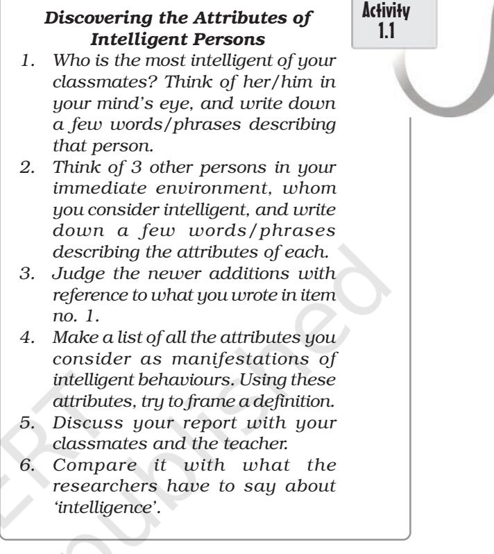
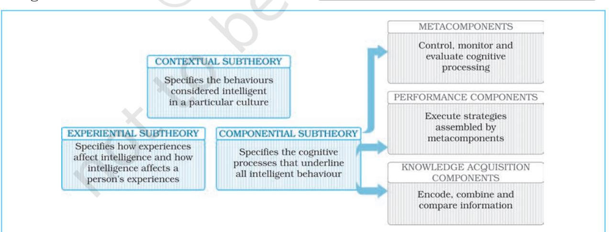
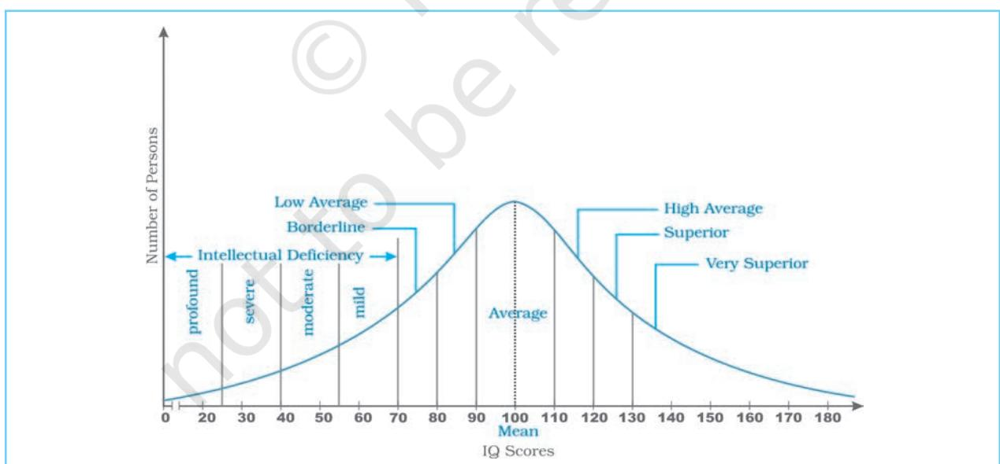
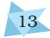
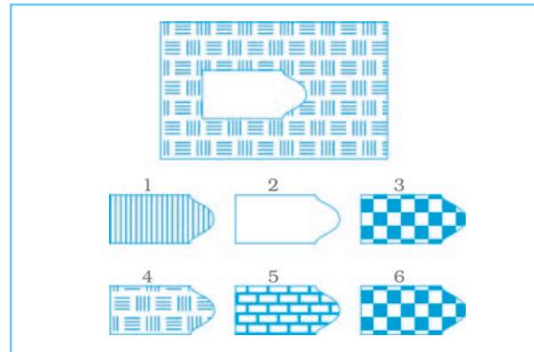
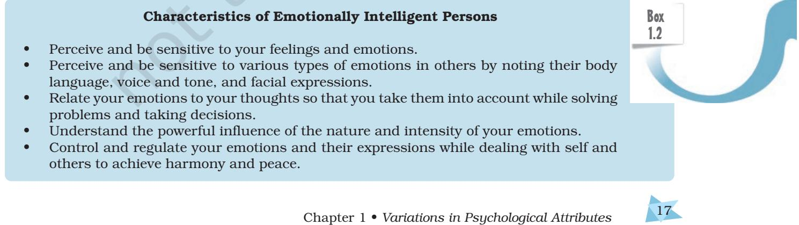

# VARIATIONS IN PSYCHOLOGICAL ATTRIBUTES TRIBUTESTRIBUTES

# After reading this chapter, you would be able to:

- understand psychological attributes on which people differ from each other,
- learn about different methods that are used to assess psychological attributes,
- explain what constitutes intelligent behaviour,
- learn how psychologists assess intelligence to identify mentally challenged and gifted individuals,
- understand how intelligence has different meaning in different cultures, and
- understand the difference between intelligence and aptitude.

#### Introduction

# Individual Differences in Human Functioning Assessment of Psychological Attributes Intelligence

#### Theories of Intelligence

- Theory of Multiple Intelligences Triarchic Theory of Intelligence Planning, Attention-arousal, and Simultaneous successive Model of Intelligence
# CONTENTS

#### Individual Differences in Intelligence

- Variations of Intelligence
- *Some Misuses of Intelligence Tests* (Box 1.1)

#### Culture and Intelligence Emotional Intelligence

*Characteristics of Emotionally Intelligent Persons* (Box 1.2)

#### Special Abilities

Aptitude : Nature and Measurement Creativity

Key Terms Summary Review Questions Project Ideas Weblinks Pedagogical Hints

Chapter 1 • *Variations in Psychological Attributes* 1

Introduction

*If you observe your friends, classmates or relatives, you will find how they differ from each other in the manner they perceive, learn, and think, as also in their performance on various tasks. Such individual differences can be noticed in every walk of life. That people differ from one another is obvious. In Class XI, you have learnt about psychological principles that are applied to understand human behaviour. We also need to know how people differ, what brings about these differences, and how such differences can be assessed. You will recall how one of the main concerns of modern psychology has been the study of individual differences from the time of Galton. This chapter will introduce you to some of the fundamentals of individual differences.*

*One of the most popular psychological attributes which has been of interest to psychologists is Intelligence. People differ from each other in their ability to understand complex ideas, adapt to environment, learn from experience, engage in various forms of reasoning, and to overcome obstacles. In this chapter, you will study the nature of intelligence, changing definitions of intelligence, cultural differences in intelligence, range and variations in the intellectual competencies of people, and the nature of special abilities or aptitudes.*

#### INDIVIDUAL DIFFERENCES IN HUMAN FUNCTIONING

Individual variations are common within and across all species. Variations add colour and beauty to nature. For a moment, think of a world around you where each and every object is of the same colour, say red or blue or green. How would the world appear to you? Certainly not a beautiful one! Would you prefer to live in such a world? In all likelihood, your answer will be 'no'. Like objects, people too possess different combinations of traits.

Variability is a fact of nature, and individuals are no exception to this. They vary in terms of physical characteristics, such as height, weight, strength, hair colour, and so on. They also vary along psychological dimensions. They may be intelligent or dull, dominant or submissive, creative or not so creative, outgoing or withdrawn, etc. The list of variations can be endless. Different traits can exist in varying degrees in an individual. In this sense, each one of us is unique as s/he exemplifies a typical combination of various traits. The question which you may like to pose is how and why people differ. This, in fact, is the subject matter of the study of individual differences. For psychologists, *individual differences refer to distinctiveness and variations among people's characteristics and behaviour patterns.*

While many psychologists believe that our behaviours are influenced by our personal traits, some others hold the view that our behaviours are influenced more by situational factors. This latter view is known as situationism, which states that situations and circumstances in which one is placed influence one's behaviour. A person, who is generally aggressive, may behave in a submissive manner in the presence of her/his top boss. Sometimes, the situational influences are so powerful that individuals with differing personality traits respond to them in almost the same ways. *The situationist perspective views human behaviour relatively more as a result of influence of external factors.*

Psychology 2

# ASSESSMENT OF PSYCHOLOGICAL ATTRIBUTES

Psychological attributes are involved in very simple phenomena like in time taken to react to a stimulus, i.e. reaction time, and also in highly global concepts like happiness. It is difficult to count and specify the number of psychological attributes that can be assessed. Assessment is the first step in understanding a psychological attribute. Assessment refers to the measurement of psychological attributes of individuals and their evaluation, often using multiple methods in terms of certain standards of comparison. Any attribute will be said to exist in a person only if it can be measured by using scientific procedures. For example, when we say, "Harish is dominant", we are referring to the degree of 'dominance' in Harish. This statement is based on our own assessment of 'dominance' in him. Our assessment may be *informal* or *formal*. Formal assessment is objective, standardised, and organised. On the other hand, informal assessment varies from case to case and from one assessor to another and, therefore, is open to subjective interpretations. Psychologists are trained in making formal assessment of psychological attributes.

Once assessment is done, we can use this information to predict how Harish will probably behave in future. We may predict that Harish, if given a chance to lead a team, will most likely be an authoritarian leader. If the predicted consequence is not what we want, we may want to intervene to effect a change in Harish's behaviour. The attribute chosen for assessment depends upon our purpose. In order to help a weak student perform well in examinations, we may assess her/his intellectual strengths and weaknesses. If a person fails to adjust with members of her/his family and neighbourhood, we may consider assessing her/his personality characteristics. For a poorly motivated person, we may assess her/his interests and preferences. *Psychological assessment uses systematic testing procedures to evaluate abilities, behaviours, and personal qualities of individuals.*

# Some Domains of Psychological Attributes

Psychological attributes are not linear or unidimensional. They are complex and expressed in terms of dimensions. A line is a mere aggregate of many points. A point occupies no space. But think of a box. It occupies space. It can be described only in terms of its three dimensions, i.e. length, width, and height. Similar is the case with psychological attributes. They are usually multi-dimensional. If you want to have a complete assessment of a person, you will need to assess how s/he functions in various domains or areas, such as cognitive, emotional, social, etc.

We will discuss in this chapter some important attributes that are of interest to psychologists. These attributes are categorised on the basis of varieties of tests used in psychological literature.

- 1. Intelligence is *the global capacity to understand the world, think rationally, and use available resources effectively when faced with challenges.* Intelligence tests provide a global measure of a person's general cognitive competence including the ability to profit from schooling. Generally, students having low intelligence are not likely to do so well in school-related examinations, but their success in life is not associated only with their intelligence test scores.
- 2. Aptitude refers to *an individual's underlying potential for acquiring skills.* Aptitude tests are used to predict what an individual will be able to do if given

proper environment and training. A person with high mechanical aptitude can profit from appropriate training and can do well as an engineer. Similarly, a person having high language aptitude can be trained to be a good writer.

- 3. Interest is *an individual's preference for engaging in one or more specific activities relative to others.* Assessment of interests of students may help to decide what subjects or courses they can pursue comfortably and with pleasure. Knowledge of interests helps us in making choices that promote life satisfaction and performance on jobs.
- 4. Personality refers to *relatively enduring characteristics of a person that make her or him distinct from others.* Personality tests try to assess an individual's unique characteristics, e.g. whether one is dominant or submissive, outgoing or withdrawn, moody or emotionally stable, etc. Personality assessment helps us to explain an individual's behaviour and predict how she/he will behave in future.
- 5. Values are *enduring beliefs about an ideal mode of behaviour.* A person having a value sets a standard for guiding her/his actions in life and also for judging others. In value assessment, we try to determine the dominant values of a person (e.g., political, religious, social or economic).

### Assessment Methods

Several methods are used for psychological assessment. You have learnt about some of these methods in Class XI. Let us recall their key features.

- Psychological Test is *an objective and standardised measure of an individual's mental and/or behavioural characteristics.* Objective tests have been developed to measure all the dimensions of psychological attributes (e.g., intelligence, aptitude, etc.) described above. These tests are widely
used for the purposes of clinical diagnosis, guidance, personnel selection, placement, and training. Besides objective tests, psychologists have also developed certain projective tests, especially for the assessment of personality. You will learn about them in Chapter 2.

- Interview involves *seeking information from a person on a one-to-one basis.* You may see it being used when a counsellor interacts with a client, a salesperson makes a door-to-door survey regarding the usefulness of a particular product, an employer selects employees for her/his organisation, or a journalist interviews important people on issues of national and international importance.
- Case Study is *an in-depth study of the individual in terms of her/his psychological attributes, psychological history in the context of her/his psychosocial and physical environment.* Case studies are widely used by clinical psychologists. Case analyses of the lives of great people can also be highly illuminating for those willing to learn from their life experiences. Case studies are based on data generated by different methods, e.g. interview, observation, questionnaire, psychological tests, etc.
- Observation involves *employing systematic, organised, and objective procedures to record behavioural phenomena occurring naturally in real time.* Certain phenomena such as mother-child interactions can be easily studied through observation. The major problems with observational methods are that the observer has little control over the situation and the reports may suffer from subjective interpretations of the observer.
- Self-Report is a method in which *a person provides factual information about herself/himself and/or opinions,*

Psychology 4

*beliefs, etc. that s/he holds.* Such information may be obtained by using an interview schedule or a questionnaire, a psychological test, or a personal diary.

#### INTELLIGENCE

Intelligence is a key construct employed to know how individuals differ from one another. It also provides an understanding of how people adapt their behaviour according to the environment they live in. In this section, you will read about intelligence in its various forms.

Psychological notion of intelligence is quite different from the common sensical notion of intelligence. If you watch an intelligent person, you are likely to see in her/him attributes like mental alertness, ready wit, quickness in learning, and ability to understand relationships. The *Oxford Dictionary* explains intelligence as the power of perceiving, learning, understanding, and knowing. Early intelligence theorists also used these attributes in defining intelligence. Alfred Binet was one of the first psychologists who worked on intelligence. He defined intelligence as *the ability to judge well, understand well, and reason well.* Wechsler, whose intelligence tests are most widely used, understood intelligence in terms of its functionality, i.e. its value for adaptation to environment. He defined it as *the global and aggregate capacity of an individual to think rationally, act purposefully, and to deal effectively with her/his environment.* Other psychologists, such as Gardner and Sternberg have suggested that an intelligent individual not only adapts to the environment, but also actively modifies or shapes it. You will be able to understand the concept of intelligence and how it has evolved, when

we discuss some important theories of intelligence.

#### THEORIES OF INTELLIGENCE

Psychologists have proposed several theories of intelligence. Theories can be broadly classified as either representing a psychometric/structural approach or an information-processing approach.

The psychometric approach considers intelligence as an aggregate of abilities. It expresses the individual's performance in terms of a single index of cognitive abilities. On the other hand, the informationprocessing approach describes the processes people use in intellectual reasoning and problem solving. The major focus of this approach is on how an intelligent person acts. Rather than focusing on structure of intelligence or its underlying dimensions, information-

processing approaches emphasise studying cognitive functions underlying intelligent behaviour. We will discuss some representative theories of these approaches.

We mentioned above that Alfred Binet was the first psychologist who tried to formalise the concept of intelligence in terms of mental operations. Prior to him, we find the notion of intelligence described in general ways in various philosophical treatises available in different cultural traditions. Binet's theory of intelligence was rather simple as it arose from his interest in differentiating more intelligent from less intelligent individuals. He, therefore, conceptualised intelligence as consisting of one similar set of abilities which can be used for solving any or every problem in an individual's environment. His theory of intelligence is called Uni or one factor theory of intelligence. This theory came to be disputed when psychologists started analysing data of individuals, which was collected using Binet's test.

In 1927, Charles Spearman proposed a two-factor theory of intelligence employing a statistical method called factor analysis. He showed that intelligence consisted of a general factor (g-factor) and some specific factors (s-factors). The g-factor includes mental operations which are primary and common to all performances. In addition to the g-factor, he said that there are also many specific abilities. These are contained in what he called the s-factor. Excellent singers, architects, scientists, and athletes may be high on g-factor, but in addition to this, they have specific abilities which allow them to excel in their respective domains. Spearman's theory was followed by Louis Thurstone's theory. He proposed the theory of primary mental abilities. It states that intelligence consists of seven primary abilities, each of which is relatively

independent of the others. These primary abilities are: (i) Verbal Comprehension (grasping meaning of words, concepts, and ideas), (ii) Numerical Abilities (speed and accuracy in numerical and computational skills), (iii) Spatial Relations (visualising patterns and forms), (iv) Perceptual Speed (speed in perceiving details), (v) Word Fluency (using words fluently and flexibly), (vi) Memory (accuracy in recalling information), and (vii) Inductive Reasoning (deriving general rules from presented facts).

Arthur Jensen proposed a hierarchical model of intelligence consisting of abilities operating at two levels, called Level I and Level II. *Level I is the associative learning in which output is more or less similar to the input* (e.g., rote learning and memory). *Level II, called cognitive competence, involves higher-order skills as they transform the input to produce an effective output.*

J.P. Guilford proposed the structureof-intellect model which classifies intellectual traits among three dimensions: *operations, contents,* and *products*. Operations are what the respondent does. These include cognition, memory recording, memory retention, divergent production, convergent production, and evaluation. Contents refer to the nature of materials or information on which intellectual operations are performed. These include visual, auditory, symbolic (e.g., letters, numbers), semantic (e.g., words) and behavioural (e.g., information about people's behaviour, attitudes, needs, etc.). Products refer to the form in which information is processed by the respondent. Products are classified into units, classes, relations, systems, transformations, and implications. Since this classification (Guilford, 1988) includes 6´5´6 categories, therefore, the model has 180 cells. Each cell is expected to have at least one factor or ability; some cells may have more than

Psychology 6

one factor. Each factor is described in terms of all three dimensions.

The above mentioned theories are representations of psychometric approach to understand intelligent behaviour.

#### Theory of Multiple Intelligences

Howard Gardner proposed the theory of multiple intelligences. According to him, intelligence is not a single entity; rather distinct types of intelligences exist. Each of these intelligences are independent of each other. This means that, if a person exhibits one type of intelligence, it does not necessarily indicate being high or low on other types of intelligences. Gardner also put forth that different types of intelligences interact and work together to find a solution to a problem. Gardner studied extremely talented persons, who had shown exceptional abilities in their respective areas, and described eight types of intelligence. These are as follows:

Linguistic (an ability to produce and use language) : It is the capacity to use language fluently and flexibly to express one's thinking and understand others. Persons high on this intelligence are 'word-smart', i.e. they are sensitive to different shades of word meanings, are articulate, and can create linguistic images in their mind. Poets and writers are very strong in this component of intelligence.

Logical-Mathematical (an ability to think logically and critically, and solve problems) : Persons high on this type of intelligence can think logically and critically. They engage in abstract reasoning, and can manipulate symbols to solve mathematical problems. Scientists and Nobel Prize winners are likely to be strong in this component.

Spatial (an ability to form visual images and patterns) : It refers to the abilities involved in forming, using, and transforming mental images. The person high on this intelligence can easily represent the spatial world in the mind. Pilots, sailors, sculptors, painters, architects, interior decorators, and surgeons are likely to have highly developed spatial intelligence.

Musical (an ability to produce and manipulate musical rhythms and patterns) : It is the capacity to produce, create and manipulate musical patterns. Persons high on this intelligence are very sensitive to sounds and vibrations, and in creating new patterns of sounds.

Bodily-Kinaesthetic (an ability to use whole or portions of the body flexibly and creatively) : This consists of the use of the whole body or portions of it for display or construction of products and problem solving. Athletes, dancers, actors, sportspersons, gymnasts, and surgeons are likely to have such kind of intelligence.

Interpersonal (an ability to understand to subtle aspects of others' behaviours) : This is the ability to understand the motives, feelings and behaviours of other people so as to bond into a comfortable relationship with others. Psychologists, counsellors, politicians, social workers, and religious leaders are likely to possess high interpersonal intelligence.

Intrapersonal (an ability to understand of one's own feelings, motives, and desires): This refers to the knowledge of one's internal strengths and limitations and using that knowledge to effectively relate to others. Persons high on this ability have finer sensibilities regarding their identity, human existence, and meaning of life. Philosophers and spiritual leaders present examples of this type of intelligence.

Naturalistic (an ability to identify the features of the natural world) : This involves complete awareness of our relationship with the natural world. It is useful in recognising the beauty of different species of flora and fauna, and making subtle discriminations in the natural world. Hunters, farmers, tourists,

botanists, zoologists, and bird watchers possess more of naturalistic intelligence.

# Triarchic Theory of Intelligence

Robert Sternberg (1985) proposed the triarchic theory of intelligence. Sternberg views intelligence as "*the ability to adapt, to shape and select environment to accomplish one's goals and those of one's society and culture*". According to this theory, there are three basic types of intelligence: Componential, Experiential, and Contextual. The elements of the triarchic theory of intelligence are shown in Figure 1.1.

Componential Intelligence : Componential or analytical intelligence is the analysis of information to solve problems. Persons high on this ability think analytically and critically and succeed in schools. This intelligence has three components, each serving a different function. First is the knowledge acquisition component, which is responsible for learning and acquisition of the ways of doing things. The second is the meta or a higher order component, which involves planning concerning what to do and how to do. The third is the performance component, which involves actually doing things.

Experiential Intelligence: Experiential or creative intelligence is involved in using past experiences creatively to solve novel problems. It is reflected in creative performance. Persons high on this aspect integrate different experiences in an original way to make new discoveries and inventions. They quickly find out which information is crucial in a given situation.

Activity

# 1.2 *On the 'Practical' Track*

*You have just been admitted into a school/college. You will take three examinations during the entire year. You sincerely want to receive high marks in the course. How likely are you to engage in each of the following actions? Rank the following courses of action. Match your answer with that of your classmates.*

- *• Attend classes regularly.*
- *• Create study groups with your friends for weekly discussions.*
- *• Take detailed notes in the class.*
- *• Join a tutorial/coaching centre.*
- *• Prepare written notes for each chapter.*
- *• Read the textbook chapters thoroughly.*
- *• Solve the questions of the last three years.*

*Talk to your teacher after the class.*

*Fig.1.1 : Elements of Triarchic Theory of Intelligence*

Psychology 8

Contextual Intelligence : Contextual or practical intelligence involves the ability to deal with environmental demands encountered on a daily basis. It may be called *'street smartness'* or *'business sense'*. Persons high on this aspect easily adapt to their present environment or select a more favourable environment than the existing one, or modify the environment to fit their needs. Therefore, they turn out to be successful in life.

Sternberg's triarchic theory of intelligence represents the informationprocessing approach to understand intelligence.

#### Planning, Attention-arousal, and Simultaneous-successive (PASS) Model of Intelligence

This model has been developed by J.P. Das, Jack Naglieri, and Kirby (1994). According to this model, intellectual activity involves the interdependent functioning of three neurological systems, called the functional units of brain. These units are responsible for arousal/attention, coding or processing, and planning respectively.

Arousal/Attention : State of arousal is basic to any behaviour as it helps us in attending to stimuli. Arousal and attention enable a person to process information. An optimal level of arousal focuses our attention to the relevant aspects of a problem. Too much or too little arousal would interfere with attention. For instance, when you are told by your teacher about a test which s/he plans to hold, it would arouse you to attend to the specific chapters. Arousal forces you to focus your attention on reading, learning and revising the contents of the chapters.

Simultaneous and Successive Processing : You can integrate the information into your knowledge system either simultaneously or successively. Simultaneous processing takes place when you perceive the relations among various concepts and integrate them into a meaningful pattern for comprehension. For example, in Raven's Progressive Matrices (RPM) Test, a design is presented from which a part has been removed. You are required to choose one of the six options that best completes the design. Simultaneous processing helps you in grasping the meaning and relationship between the given abstract figures. Successive processing takes place when you remember all the information serially so that the recall of one leads to the recall of another. Learning of digits, alphabets, multiplication tables, etc. are examples of successive processing.

Planning : This is an essential feature of intelligence. After the information is attended to and processed, planning is activated. It allows us to think of the possible courses of action, implement them to reach a target, and evaluate their effectiveness. If a plan does not work, it is modified to suit the requirements of the task or situation. For example, to take the test scheduled by your teacher, you would have to set goals, plan a time schedule of study, get clarifications in case of problems and if you are not able to tackle the chapters assigned for the test, you may have to think of other ways (e.g., give more time, study with a friend, etc.) to meet your goals.

These PASS processes operate on a knowledge base developed either formally (by reading, writing, and experimenting) or informally from the environment. These processes are interactive and dynamic in nature; yet each has its own distinctive functions. Das and Naglieri have also developed a battery of tests, known as the Cognitive Assessment System (CAS). It consists of verbal as well as non-verbal tasks that measure basic cognitive functions presumed to be independent of schooling. The battery of tests is meant for individuals between 5 and 18 years of age.

The results of assessment can be used to remedy cognitive deficits of children with learning problems.

This model represents the informationprocessing approach to intelligence.

#### INDIVIDUAL DIFFERENCES IN INTELLIGENCE

Why are some people more intelligent than others? Is it due to their heredity, or is it due to the influence of environmental factors? You have already read about the influence of these factors in the development of an individual in Class XI.

# Intelligence: Interplay of Nature and Nurture

The evidence for hereditary influences on intelligence comes mainly from studies on twins and adopted children. The intelligence of identical twins reared together correlate almost 0.90. Twins separated early in childhood also show considerable similarity in their intellectual, personality and behavioural characteristics. The intelligence of identical twins reared in different environments correlate 0.72, those of fraternal twins reared together correlate almost 0.60, and those of brothers and sisters reared together correlate about 0.50, while siblings reared apart correlate about 0.25. Another line of evidence comes from the studies of adopted children, which show that children's intelligence is more similar to their biological rather than adoptive parents.

With respect to the role of environment, studies have reported that as children grow in age, their intelligence level tends to move closer to that of their adoptive parents. Children from disadvantaged homes adopted into families with higher socioeconomic status exhibit a large increase in their intelligence scores. There is evidence that environmental deprivation lowers

Psychology 10

intelligence while rich nutrition, good family background, and quality schooling increases intelligence. There is a general consensus among psychologists that intelligence is a product of complex interaction of heredity *(nature)* and environment *(nurture)*. Heredity can best be viewed as something that sets a range within which an individual's development is actually shaped by the support and opportunities of the environment.

#### *Assessment of Intelligence*

In 1905, Alfred Binet and Theodore Simon, made the first successful attempt to formally measure intelligence. In 1908, when the scale was revised, they gave the concept of Mental Age (MA), which is a measure of a person's intellectual development relative to people of her/his age group. A mental age of 5 means that a child's performance on an intelligence test equals the average performance level of a group of 5-year olds. Chronological Age (CA) is the biological age from birth. A bright child's MA is more than her/his CA; for a dull child, MA is below the CA. Retardation was defined by Binet and Simon as being two mental age years below the chronological age.

In 1912, William Stern, a German psychologist, devised the concept of Intelligence Quotient (IQ). IQ refers to *mental age divided by chronological age, and multiplied by 100*.

$$\mathrm{I}{\mit\mathrm{Q}}\ =\ \ \frac{\mathrm{MA}}{\mathrm{CA}}\ \ \times\ 100$$

The number 100 is used as a multiplier to avoid the decimal point. When the MA equals the CA, the IQ equals 100. If MA is more than the CA, IQ is more than 100. IQ becomes less than 100 when the MA is less than the CA. For example, a 10-year-old child with a mental age of 12 would have an IQ of 120 (12/10 ´ 100),

| Activity | 'Intelligent' Numbers |
| --- | --- |
| 1.3 | (Computing IQ) |
| • | Find out the IQ of a 14-year-old |
|  | child with a mental age of 16. |
| • | Find out the mental age of a 12- |
|  | year-old child with an IQ of 90. |

whereas the same child with an MA of 7 would have an IQ of 70 (7/10 ´ 100). The average IQ in the population is 100, irrespective of age.

IQ scores are distributed in the population in such a way that the scores of most people tend to fall in the middle range of the distribution. Only a few people have either very high or very low scores. The frequency distribution for the IQ scores tends to approximate a bellshaped curve, called the normal curve. This type of distribution is symmetrical around the central value, called the mean. The distribution of IQ scores in the form of a normal distribution is shown in Figure 1.2.

The mean IQ score in a population is 100. People with IQ scores in the range of 90–110 have normal intelligence. Those with IQ below 70 are suspected to have 'intellectual disability', while persons with IQ above 130 are considered to have exceptional talents. The IQ score of a person can be interpreted by referring to Table 1.1.

|
|  |

| IQ Range | Descriptive Label | Per cent in the Population |
| --- | --- | --- |
| Above 130 Very superior |  | 2.2 |
| 120 – 130 | Superior | 6.7 |
| 110 – 119 | High average | 16.1 |
| 90 – 109 | Average | 50.0 |
| 80 – 89 | Low average | 16.1 |
| 70 – 79 | Borderline | 6.7 |
| Below 70 | Intellectually disabled | 2.2 |

All persons do not have the same intellectual capacity; some are exceptionally bright and some are below average. One practical use of intelligence test is to identify persons at the extremes of intellectual functioning. If you refer to Table 1.1, you will notice that about 2 per cent of the population have IQ above 130,

*Fig.1.2 : Normal Curve Pattern Showing Distribution of IQ Scores in the Population*

Chapter 1 • *Variations in Psychological Attributes* 11

and a similar percentage have IQ below 70. The persons in the first group are called intellectually gifted; those in the second group are termed intellectually disabled. These two groups deviate considerably from the normal population in respect of their cognitive, emotional, and motivational characteristics.

# Variations of Intelligence

### *Intellectual Deficiency*

On the one hand are the gifted and creative persons we discussed briefly earlier. On the other hand, there are children who face enormous difficulty in learning even very simple skills. Those children who show intellectual deficiency are termed as 'intellectually disabled'. As a group, there is wide variation among the intellectually disabled. The American Association on Mental Deficiency (AAMD) views intellectual disability as "*significantly sub-average general intellectual functioning existing concurrently with deficits in adaptive behaviour and manifested during the developmental period*". This definition points to three basic features. First, in order to be judged as intellectually disabled, a person must show *significantly sub-average intellectual functioning*. Persons having IQs below 70 are judged to have sub-average intelligence. The second relates to *deficits in adaptive behaviour*. Adaptive behaviour refers to a person's capacity to be independent and deal effectively with one's environment. The third feature is that the deficits must be observed *during the developmental period,* that is between 0 and 18 years of age.

Individuals who are categorised as having intellectual disability show significant variation in their abilities, ranging from those who can be taught to work and function with special attention, to those who cannot be trained and require institutional care throughout their lives. You have learnt earlier that the mean IQ score in the population is 100. These figures are used to understand the categories of intellectually disabled. The different levels of intellectual disability are: mild (IQs 55 to approximately 70), moderate (IQs 35–40 to approximately 50– 55), severe (IQs 20–25 to approximately 35–40), and profound (IQs below 20–25). Although the development of people with mild disability is typically slower than that of their peers, they can function quite independently, hold jobs and families. As the level of disability increases, the difficulties are strongly marked. The people with moderate disability lag behind their peers in language and motor skills. They can be trained in self-care skills, and simple social and communication skills. They need to have moderate degree of supervision in everyday tasks. Individuals with profound and severe disability are incapable of managing life and need constant care for their entire lives. You will read more about the characteristics of the intellectually disabled in Chapter 4.

## *Intellectual Giftedness*

Intellectually gifted individuals show higher performance because of their outstanding potentialities. The study of gifted individuals began in 1925, when Lewis Terman followed the lives of about 1500 children with IQs of 130 and above to examine how intelligence was related to occupational success and life adjustment. Although the terms 'talent' and 'giftedness' are often used inter changeably, they mean different things. Giftedness is exceptional general ability shown in superior performance in a wide variety of areas. Talent is a narrower term and refers to remarkable ability in a

Psychology 12

specific field (e.g., spiritual, social, aesthetic, etc.). The highly talented are sometimes called 'prodigies'.

It has been suggested by psychologists that giftedness from the teachers' point of view depends on a combination of high ability, high creativity, and high commitment.

Gifted children show early signs of intellectual superiority. Even during infancy and early childhood, they show larger attention span, good recognition memory, preference for novelty, sensitivity to environmental changes, and early appearance of language skills. To equate giftedness with brilliant academic performance is not correct. Athletes who show superior psychomotor ability are also gifted. Each gifted student possesses different strengths, personalities and characteristics. Some important characteristics of gifted children are :

- Advanced logical thinking, questioning and problem solving behaviour.
- High speed in processing information.
- Superior generalisation and discrimination ability.
- Advanced level of original and creative thinking.
- High level of intrinsic motivation and self-esteem.
- Independent and non-conformist thinking.
- Preference for solitary academic activities for long periods.

Performance on intelligence tests is not the only measure for identifying the gifted. Many other sources of information, such as teachers' judgment, school achievement record, parents' interviews, peer and selfratings, etc. can be used in combination with intellectual assessment. To reach their full potential, gifted children require special attention and different educational programmes beyond those provided to normal children in regular classrooms.

These may include life enrichment programmes that can sharpen children's skills in productive thinking, planning, decision-making, and communication.

## Types of Intelligence Tests

Intelligence tests are of several types. On the basis of their administration procedure, they can be categorised as individual or group tests. They can also be classified as either verbal or performance tests on the basis of the nature of items used. Depending upon the extent to which an intelligence test favours one culture over another, it can be judged as either culturefair or culture-biased. You can choose a test depending on the purpose of your use.

#### *Individual or Group Tests*

An individual intelligence test is one which can be administered to one person at a time. A group intelligence test can be administered to several persons simultaneously. Individual tests require the test administrator to establish a rapport with the subject and be sensitive to her/his feelings, moods and expressions during the testing session. Group tests, however, do not allow an opportunity to be familiar with the subjects' feelings. Individual tests allow people to answer orally or in a written form or manipulate objects as per the tester's instructions. Group tests generally seek written answers usually in a multiple-choice format.

#### *Verbal, Non-Verbal, or Performance Tests*

An intelligence test may be fully verbal, fully non-verbal or fully performancebased, or it may consist of a mixture of items from each category. Verbal tests require subjects to give verbal responses either orally or in a written form. Therefore, verbal tests can be administered only to literate people. The non-verbal tests use

pictures or illustrations as test items. Raven's Progressive Matrices (RPM) Test is an example of a non-verbal test. In this test, the subject examines an incomplete pattern and chooses a figure from the alternatives that will complete the pattern. A specimen item from RPM is given in Figure 1.3.

*Fig.1.3 : An Item from Raven's Progressive Matrices Test*

Performance tests require subjects to manipulate objects and other materials to perform a task. Written language is not necessary for answering the items. For example, Kohs' Block Design Test contains a number of wooden blocks. The subject is asked to arrange the blocks within a time period to produce a given design. A major advantage of performance tests is that they can be easily administered to persons from different cultures.

#### *Culture-Fair or Culture-Biased Tests*

Intelligence tests can be culture-fair or culture-biased. Many intelligence tests show a bias to the culture in which they are developed. Tests developed in America and Europe represent an urban and middle class cultural ethos. Hence, educated middle class white subjects generally perform well on those tests. The items do not respect the cultural perspectives of Asia and Africa. The norms for these tests are also drawn from western cultural groups. You may be already familiar with the concept of norms discussed in Class XI.

It is nearly impossible to design a test that can be applied equally meaningfully in all cultures. Psychologists have tried to develop tests that are culture-fair or culturally appropriate, i.e. one that does not discriminate against individuals belonging to different cultures. In such tests, items are constructed in a manner that they

#### Some Misuses of Intelligence Tests

You might have learnt by now that intelligence tests serve many useful purposes such as selection, counselling, guidance, self-analysis, and diagnosis. Unless used by a trained investigator, they may be misused either intentionally or unintentionally. Some of the illeffects of intelligence testing by naive testers are:

- Poor performance on a test may attach a stigma to children and thereby adversely affect their performance and self-respect.
- The tests may invite discriminating practices from parents, teachers and elders in the society.
- Administering a test biased in favour of the middle class and higher class populations may underestimate the IQ of children coming from disadvantaged sections of the society.
- Intelligence tests do not capture creative potentialities and practical side of intelligence, and they also do not relate much to success in life. Intelligence can be a potential factor for achievement in various spheres of life.

It is suggested that one should guard against erroneous practices associated with intelligence tests and take the help of trained psychologists to analyse an individual's strengths and weaknesses.

Psychology 14

assess experiences common to all cultures or have questions in which language usage is not required. Non-verbal and performance tests help reduce the cultural bias usually associated with verbal tests.

#### *Intelligence Testing in India*

S.M. Mohsin made a pioneering attempt in constructing an intelligence test in Hindi (NCERT) has documented Indian tests. Critical reviews of Indian tests are published in the form of handbooks. NLEPT has brought out the handbooks in the area of intelligence, aptitude, personality, attitudes, and interests. Table 1.2 lists some tests developed in India. Among these, Bhatia's Battery of Performance Tests is quite popular.

#### Table 1.2 : Some Tests Developed in India

|  | Verbal |  | Performance |
| --- | --- | --- | --- |
| • | CIE Verbal Group Test of Intelligence by | • | CIE Non-verbal Group Test of Intelligence |
|  | Uday Shankar | • | Bhatia's Battery of Performance Tests |
| • | Group Test of General Mental Ability by | • | Draw-a-Man Test by Pramila Pathak |
|  | S. Jalota | • | Adaptation of Wechsler Adult Performance |
| • | Group Test of Intelligence by Prayag Mehta |  | Intelligence Scale by R. Ramalingaswamy |
| • | The Bihar Test of Intelligence by S.M. Mohsin |  |  |
| • | Group Test of Intelligence by Bureau of |  |  |
|  | Psychology, Allahabad |  |  |
| • | Indian Adaptation of Stanford-Binet Test |  |  |
|  | (Third Edition) by S.K. Kulshrestha |  |  |
| • | Test of General Mental Ability (Hindi) by |  |  |
|  | M.C. Joshi. |  |  |

in the 1930s. C.H. Rice attempted to standardise Binet's test in Urdu and Punjabi. At about the same time, Mahalanobis attempted to standardise Binet's test in Bengali. Attempts were also made by Indian researchers to develop Indian norms for some western tests including RPM, WAIS, Alexander's Passalong, Cube Construction, and Kohs' Block Design. Long and Mehta prepared a Mental Measurement Handbook listing out 103 tests of intelligence in India that were available in various languages. Since then, a number of tests have either been developed or adapted from western cultures. The National Library of Educational and Psychological Tests (NLEPT) at the National Council of Educational Research and Training

# CULTURE AND INTELLIGENCE

A major characteristic of intelligence is that it helps individuals to adapt to their environment. The cultural environment provides a context for intelligence to develop. Vygotsky, a Russian psychologist, has argued that culture provides a social context in which people live, grow, and understand the world around them. For example, in less technologically developed societies, social and emotional skills in relating to people are valued, while in technologically advanced societies, personal achievement founded on abilities of reasoning and judgment is considered to represent intelligence.

From your previous reading you know that *culture is a collective system*

*of customs, beliefs, attitudes, and achievements in art and literature*. A person's intelligence is likely to be tuned by these cultural parameters. Many theorists have regarded intelligence as attributes specific to the person without regard to their cultural background. The unique features of culture now find some representation in theories of intelligence. Sternberg's notion of contextual or practical intelligence implies that intelligence is a product of culture. Vygotsky also believed that cultures, like individuals, have a life of their own; they grow and change, and in the process specify what will be the end-product of successful intellectual development. According to him, while elementary mental functions (e.g., crying, attending to mother's voice, sensitivity to smells, walking, and running) are universal, the manner in which higher mental functions such as problem solving and thinking operate are largely culture-produced.

Technologically advanced societies adopt child rearing practices that foster skills of generalisation and abstraction, speed, minimal moves, and mental manipulation among children. These societies promote a type of behaviour, which can be called technological intelligence. In these societies, persons are well-versed in skills of attention, observation, analysis, performance, speed, and achievement orientation. Intelligence tests developed in western cultures look precisely for these skills in an individual.

Technological intelligence is not so valued in many Asian and African societies. The qualities and skills regarded as intelligent actions in non-western cultures are sharply different, though the boundaries are gradually vanishing under the influence of western cultures. In addition to cognitive competence that is very specific to the individual, the nonwestern cultures look for skills to relate to others in the society. Some non-western societies value self-reflection and collectivistic orientation as opposed to personal achievement and individualistic orientation.

# Intelligence in the Indian Tradition

Contrary to technological intelligence, intelligence in the Indian tradition can be termed as integral intelligence, which gives emphasis on connectivity with the social and world environment. Indian thinkers view intelligence from a holistic perspective where equal attention is paid to cognitive and non-cognitive processes as well as their integration.

The Sanskrit word *'buddhi'* which is often used to represent intelligence is far more pervasive in scope than the western concept of intelligence. *Buddhi,* according to J.P. Das, includes such skills as mental effort, determined action, feelings, and opinions along with cognitive competence such as knowledge, discrimination, and understanding. Among other things, *buddhi* is the knowledge of one's own self based on conscience, will and desire. Thus, the notion of *buddhi* has affective and motivational components besides a strong cognitive component. Unlike the western views, which primarily focus on cognitive parameters, the following competencies are identified as facets of intelligence in the Indian tradition :

- Cognitive capacity (sensitivity to context, understanding, discrimination, problem solving, and effective communication).
- Social competence (respect for social order, commitment to elders, the young and the needy, concern about others, recognising others' perspectives).
- Emotional competence (selfregulation and self-monitoring of emotions, honesty, politeness, good conduct, and self-evaluation).

Psychology 16

- Entrepreneurial competence (commitment, persistence, patience, hard work, vigilance, and goal-directed behaviours).
## EMOTIONAL INTELLIGENCE

The notion of emotional intelligence broadens the concept of intelligence beyond the intellectual sphere/domain and considers that intelligence includes emotions. You may note that it builds on the concept of intelligence in the Indian tradition. Emotional intelligence is a set of skills that underlie accurate appraisal, expression, and regulation of emotions. It is the feeling side of intelligence. A good IQ and scholastic record is not enough to be successful in life. You may find many people who are academically talented, but are unsuccessful in their own life. They experience problems in family, workplace and interpersonal relationships. What do they lack? Some psychologists believe that the source of their difficulty may be a lack of emotional intelligence. This concept was first introduced by Salovey and Mayer who considered emotional intelligence as "*the ability to monitor one's own and other's emotions, to discriminate among them, and to use the information to guide one's thinking and actions*". Emotional Quotient (EQ) is used to express emotional intelligence in the same way as IQ is used to express intelligence.

In simple terms, emotional intelligence refers to the ability to process emotional information accurately and efficiently. To know the characteristics of persons who are high on emotional intelligence, read Box 1.2.

Emotional intelligence is receiving increasing attention of educators for dealing with students who are affected by stresses and challenges of the outside world. Programmes aimed at improving students' emotional intelligence have beneficial effects on their academic achievement. They encourage cooperative behaviour and reduce their antisocial activities. These programmes are very useful in preparing students to face the challenges of life outside the classroom.

#### SPECIAL ABILITIES

#### Aptitude : Nature and Measurement

By now you have learnt enough about intelligence. You may recall that intelligence tests assess a general mental ability. Aptitude refers to special abilities in a particular field of activity. *It is a combination of characteristics that indicates an individual's capacity to acquire some specific knowledge or skill after training*. We assess aptitude with the help of selected tests. The knowledge of aptitude can help us to predict an individual's future performance.

While assessing intelligence, psychologists often found that people with similar intelligence differed widely in acquiring certain knowledge or skills. You

may observe in your class that there are certain areas in which some intelligent students do not do well. When you have a problem in mathematics, you may turn to Aman for help, and with similar difficulties in literature you may consult Avinash. You may request Shabnam to sing for your annual function, and may turn to John when facing a problem with your bike. These specific skills and abilities are called aptitudes. With proper training these abilities can be considerably enhanced.

In order to be successful in a particular field, a person must have both aptitude and interest. Interest is a preference for a particular activity; aptitude is the potentiality to perform that activity. A person may be interested in a particular job or activity, but may not have the aptitude for it. Similarly, a person may have the potentiality for performing a job, but may not be interested in doing that. In both cases, the outcome will not be satisfactory. A student with high mechanical aptitude and strong interest in engineering is more likely to be a successful mechanical engineer.

Aptitude tests are available in two forms: independent *(specialised)* aptitude tests and multiple *(generalised)* aptitude tests. Clerical Aptitude, Mechanical Aptitude, Numerical Aptitude, and Typing Aptitude are independent aptitude tests. Multiple Aptitude Tests exist in the form of test batteries, which measure aptitude in several separate but homogeneous areas. Differential Aptitude Tests (DAT), the General Aptitude Tests Battery (GATB), and the Armed Services Vocational Aptitude Battery (ASVAB) are well-known aptitude test batteries. Among these, DAT is most commonly used in educational settings. It consists of 8 independent subtests: (i) Verbal Reasoning, (ii) Numerical Reasoning, (iii) Abstract Reasoning, (iv) Clerical Speed and Accuracy, (v) Mechanical Reasoning, (vi) Space Relations, (vii) Spelling, and (viii) Language Usage. J.M. Ojha has developed an Indian adaptation of DAT. Several other aptitude tests have been developed in India for measuring scientific, scholastic, literary, clerical, and teaching aptitudes.

#### CREATIVITY

In the foregoing sections, you have read that there are variations in psychological attributes like intelligence, aptitude, personality and so on. Here, you will learn that there are differences in the potential for creativity across individuals and the manner in which creativity is expressed. Some are highly creative and others are not so creative. Some may express creativity in writing, still others in dance, music, poetry, science and so on. Manifestations of creativity can be observed in a novel solution to a problem, an invention, composition of a poem, painting, new chemical process, an innovation in law, a breakthrough in preventing a disease and the like. Despite differences, one common element among these is the production of something new and unique.

We generally think of creativity in terms of creative persons like Tagore, Einstein, C.V. Raman, Ramanujan etc. who have made outstanding contributions in different spheres. In recent years, our understanding of creativity has broadened. Creativity is not just limited to a selected few — the artist, the scientist, the poet or the inventor. An ordinary individual who is engaged in simple occupations like pottery, carpentry, cooking, etc. can also be creative. However, it has been said that they are not working at the same level of creativity as an eminent scientist or a writer. Hence, we can say that individuals vary in terms of the level and the areas in which they exhibit creativity and that all may not be operating at the same level.

Psychology 18

Einstein's theory of relativity is an example of the highest level of creativity which implies bringing out altogether new ideas, facts, theory, or a product. Another level of creativity is working on what has already been established earlier by way of modifications, by putting things in new perspectives or to new use.

Research literature suggests that children begin to develop their imagination during the early years of childhood but they express creativity mostly through physical activities and in non-verbal ways. When language and intellectual functions are fully developed and store of knowledge is adequately available, creativity is expressed through verbal modes too. Those who are outstanding in their creativity may give an indication about the direction in which their creativity lies through their self-chosen activities. In some cases, however, opportunities need to be provided before they can manifest their hidden potential for creativity.

How do we explain variations in the potential for creativity? As in the case of other mental and physical characteristics, such variations can be attributed to the complex interaction of heredity and environment. There is no disagreement that creativity is determined by both heredity and environment. Limits of the creative potential are set by heredity, environmental factors stimulate the development of creativity. How much of the creative potential can be realised, when and in what specific form and direction is largely determined by environmental factors such as motivation, commitment, family support, peer influences, training opportunities, etc. Although no amount of training can transform an average person to the level of Tagore, Shakespeare, etc. but it is also true that every individual can raise her/his level of creative potential beyond its present level. In this context,

you have already read in Class XI about strategies to enhance creativity.

### Creativity and Intelligence

One important debate in understanding the variations in creativity has been the relationship of creativity with intelligence.

Let us take an example of two students in a class. Sunita is regarded by her teachers as an excellent student. She does her work on time, scores the highest grades in her class, listens to instructions with care, grasps quickly, reproduces accurately but she rarely comes out with ideas which are her own. Rita is another student who is just average in her studies and has not achieved high grades consistently. She prefers to learn on her own. She improvises new ways of helping her mother at home and comes up with new ways of doing her work and assignments. The former is considered to be more intelligent and the latter as more creative. Thus, a person who has the ability to learn faster and reproduce accurately may be considered intelligent more than creative unless s/he devises new ways of learning and doing.

Terman, in the 1920s, found that persons with high IQ were not necessarily creative. At the same time, creative ideas could come from persons who did not have a very high IQ. Other researches have shown that not even one of those identified as gifted, followed up throughout their adult life, had become well-known for creativity in some field. Researchers have also found that both high and low level of creativity can be found in highly intelligent children and also children of average intelligence. The same person, thus, can be creative as well as intelligent but it is not necessary that intelligent ones, in the conventional sense, must be creative. Intelligence, therefore, by itself does not ensure creativity.

Researchers have found that the relationship between creativity and intelligence is positive. All creative acts require some minimum ability to acquire knowledge and capacity to comprehend, retain, and retrieve. Creative writers, for example, need facility in dealing with language. The artist must understand the effect that will be produced by a particular technique of painting, a scientist must be able to reason and so on. Hence, a certain level of intelligence is required for creativity but beyond that intelligence does not correlate well with creativity. It can be concluded that creativity can take many forms and blends. Some may have more of intellectual attributes, others may have more of attributes associated with creativity. But, what are the attributes of a creative person? You may like to discuss the attributes which are common to all kinds of creative persons.

Creativity tests came into existence to assess variations in terms of the potential for creativity in contrast to intelligence.

A general feature of most of the creativity tests is that they are open-ended. They permit the person to think of different answers to the questions or problems in terms of her/his experiences, whatever these may have been. These help the individual to go in different directions. There are no specified answers to questions or problems in creativity tests. Therefore, there is freedom to use one's imagination and express it in original ways. Creativity tests involve divergent thinking and assess such abilities as ability to produce a variety of ideas, i.e. ideas which are off-the-beaten track, ability to see new relationships between seemingly unrelated things, ability to guess causes and consequences, ability to put things in a new context, etc. This is contrary to the tests of intelligence which mostly involve convergent thinking. In tests of intelligence, the person has to think of the right solution to the problem and the focus is on assessing abilities such as memory, logical reasoning, accuracy, perceptual ability, and clear thinking. There is little scope for the expression of spontaneity, originality, and imagination.

Since expressions of creativity are varied, tests have been developed using different stimuli like words, figures, action, and sounds. These tests measure general creative thinking abilities like ability to think of a variety of ideas on a given topic/ situation, alternative ways of looking at things, problems or situations, to guess causes and consequences, to think of unusual ideas to improve and to use common objects, ask unusual questions and so on. A few investigators have also developed tests of creativity in different areas such as literary creativity, scientific creativity, mathematical creativity, etc. Some of the famous psychologists who have developed creativity tests are Guilford, Torrance, Khatena, Wallach and Kogan, Paramesh, Baqer Mehdi, and Passi. Each test has a standardised procedure, a complete set of manual, and interpretation guide. These can be used only after extensive training in administration and interpretation of test scores.

#### Key Terms

Aptitude, Aptitude tests, Case study, Cognitive assessment system, Componential intelligence, Contextual intelligence, Creativity, Emotional intelligence, Culture-fair test, Experiential intelligence, g-factor, Individual differences, Intellectual giftedness, Intellectual disability, Intelligence, Intelligence tests, Intelligence quotient (IQ), Interest, Interview, Mental age (MA), Observational method, Planning, Psychological test, Simultaneous processing, Situationism, Successive processing, Values.

Psychology 20

- *• Individuals vary in their physical and psychological characteristics. Individual differences refer to distinctiveness and variations in people's characteristics and behaviour patterns.*
- *• A wide variety of personal attributes such as intelligence, aptitude, interests, personality, and values can be assessed. Psychologists assess these attributes through psychological tests, interviews, case studies, observations, and self-reports.*
- *• The term 'intelligence' refers to an individual's capacity to understand the world, think rationally, and use resources effectively to meet the demands of life. Intellectual development is the product of a complex interplay of hereditary factors (nature), and environmental conditions (nurture).*
- *• The psychometric approaches to intelligence lay emphasis on studying intelligence as a constellation of abilities, expressed in quantitative terms such as IQ. The more recent theories representing information-processing approaches, e.g. Sternberg's triarchic theory and Das's PASS model describe the processes underlying intelligent behaviour. Howard Gardner suggests that there are eight different kinds of intelligence.*
- *• Intelligence is assessed with the help of specially designed tests. Intelligence tests may be of verbal or performance type; can be administered individually or in groups; and may be culturally-biased or culturally-fair. At the two extremes of intelligence are the intellectually deficient persons and the intellectually gifted.*
- *• Culture provides a context for intellectual development. Western culture promotes 'technological intelligence' based on skills of analysis, performance, speed, and achievement orientation. In contrast, non-western cultures value self-reflection, social and emotional competence as signs of intelligent behaviour. Indian culture promotes 'integral intelligence' that emphasises connectivity with people and the larger social world.*
- *• Emotional intelligence involves the ability to perceive and manage one's and other's feelings and emotions; to motivate oneself and restrain one's impulses; and to handle interpersonal relationships effectively.*
- *• Aptitude refers to an individual's potential for acquiring some specific skills. Aptitude tests predict what an individual will be able to do given proper training and environment.*
- *• Creativity is the ability to produce ideas, objects, or problem solutions that are novel, appropriate and useful. Certain level of intelligence is necessary to be creative, but a high level of intelligence, however, does not ensure that a person would certainly be creative.*

#### Review Questions

- 1. How do psychologists characterise and define intelligence?
- 2. To what extent is our intelligence the result of heredity (nature) and environment (nurture)? Discuss.
- 3. Explain briefly the multiple intelligences identified by Gardner.
- 4. How does the triarchic theory help us to understand intelligence?
- 5. "Any intellectual activity involves the independent functioning of three neurological systems". Explain with reference to PASS model.
- 6. Are there cultural differences in the conceptualisation of intelligence?
- 7. What is IQ? How do psychologists classify people on the basis of their IQ scores?
- 8. How can you differentiate between verbal and performance tests of intelligence?
- 9. All persons do not have the same intellectual capacity. How do individuals vary in their intellectual ability? Explain.
- 10. Which of the two, IQ or EQ, do you think would be more related to success in life and why?
- 11. How is 'aptitude' different from 'interest' and 'intelligence'? How is aptitude measured?
- 12. How is creativity related to intelligence?

#### Project Ideas

- 1. Observe and interview 5 persons in your neighbourhood in order to see how they differ from each other in terms of certain psychological attributes. Cover all the five domains. Prepare a psychological profile of each person and compare.
- 2. Select 5 vocations and gather information about the nature of work done by people in these vocations. Also analyse these vocations in terms of the types of psychological attributes required for successful performance. Write a report.

# Weblinks

http://www.indiana.edu/~intell/anastasi.shtml http://www.chiron.valdosta.edu/whuitt/col/cogsys/intell.html http://www.humandimensions.org/emotion.htm http://www.emotionaliq.com/Gdefault.htm http://edweb.gsn.org/edref.mi.intro.html http://www.talentsmart.com http://www.kent.ac.uk/career/psychotests.com

# Pedagogical Hints

- 1. To introduce the topic, teacher can initiate discussion on psychological constructs such as intelligence, personality, aptitude, values, etc. This would serve to point out the difficulty in arriving at one single, universal explanation of these constructs.
- 2. Teacher should draw from the experiences of the students to introduce the different psychological attributes discussed in the chapter.
- 3. Some sample items of various tests (to be collected by the teacher) can be given to students to generate their interest.
- 4. Encourage students to complete the activities and also to design activities on their own either individually or in groups. Initiate discussion in the class on observations made by students on completion of the activities.
- 5. Students should be encouraged to relate the concepts to their real-life experiences.

