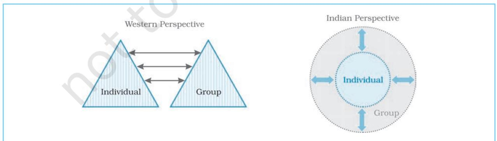
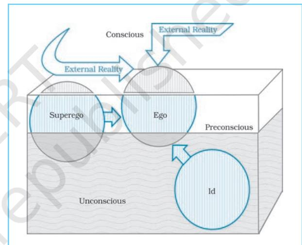
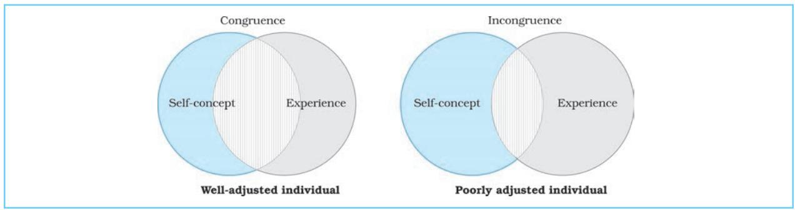
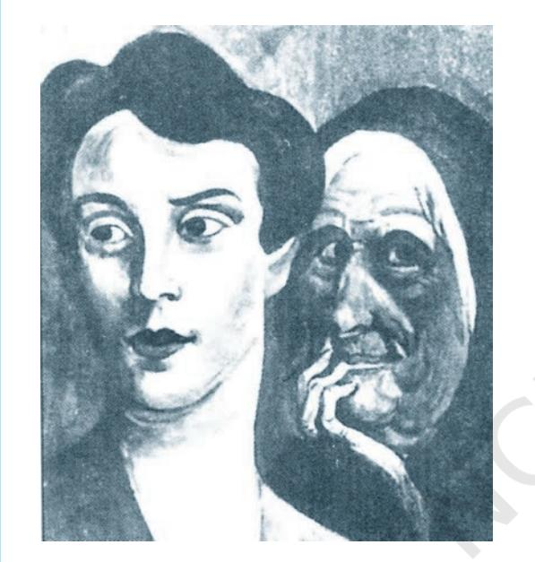
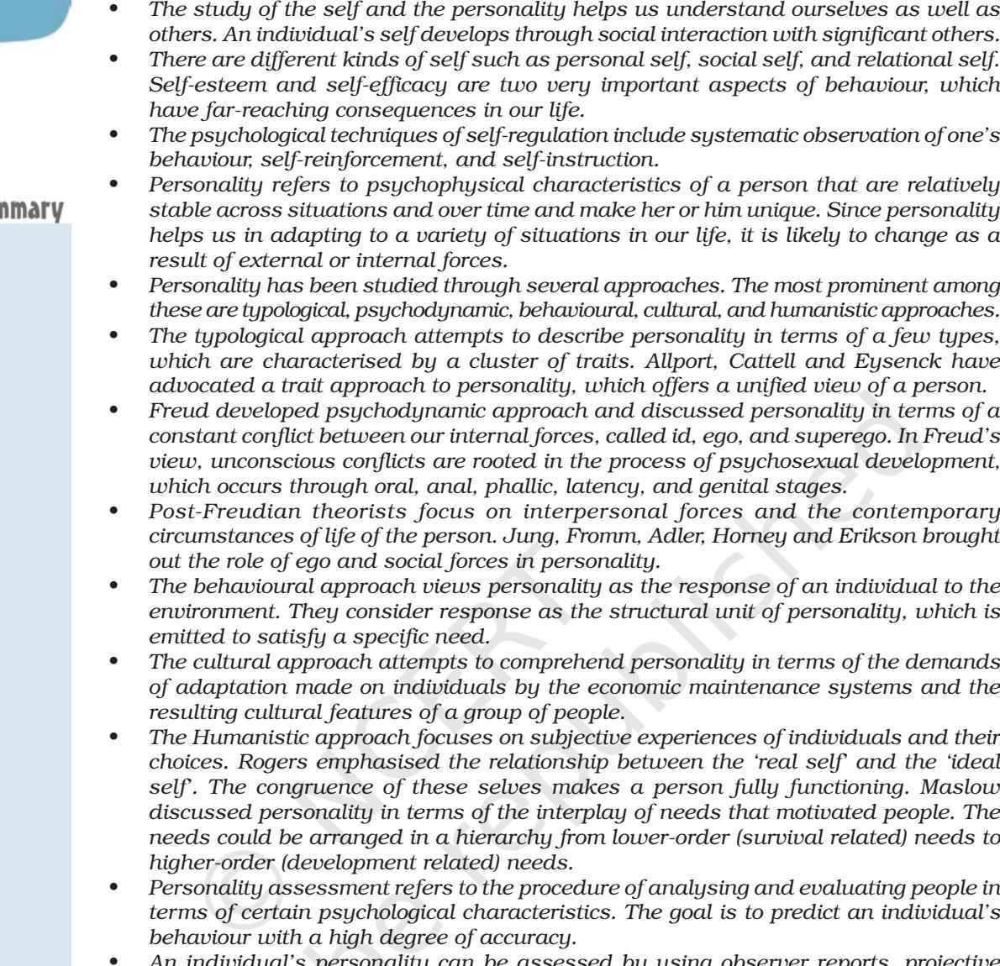

# SELF AND PERSONALITY

## After reading this chapter, you would be able to:

- describe the concept of self and learn some ways for self-regulation of behaviour,
- explain the concept of personality,

CONTENTS

- differentiate between various approaches to the study of personality,
- develop insight into the development of a healthy personality, and
- describe some techniques for personality assessment.

#### Introduction Self and Personality Concept of Self Cognitive and Behavioural Aspects of Self Self-esteem, Self-efficacy and Self-regulation Culture and Self Concept of Personality *Personality-related Terms* (Box 2.1) Major Approaches to the Study of Personality Type Approaches Trait Approaches *Five-Factor Model of Personality* (Box 2.2) Psychodynamic Approach Behavioural Approach Cultural Approach Humanistic Approach *Who is a Healthy Person?* (Box 2.3) Assessment of Personality Self-report Measures Projective Techniques Behavioural Analysis Key Terms Summary Review Questions Project Ideas Weblinks Pedagogical Hints

Chapter 2 • *Self and Personality* 23

*Quite often you must have found yourself engaged in knowing and evaluating your own behaviour and that of others. You must have noticed how you react and behave in certain situations in a manner different from others? You may have also often asked questions about your relationships with others. To find an answer to some of these questions, psychologists use the notion of self. Similarly when we ask questions such as why people are different, how they make different meaning of events, and how they feel and react differently in similar situations (i.e. questions relating to variations in behaviour), the notion of personality comes into play. Both these concepts, i.e. self and personality are intimately related. Self, in fact, lies at the core of personality.*

*The study of self and personality helps us understand not only who we are, but also our uniqueness as well as our similarities with others. By understanding self and personality, we can understand our own as well as others' behaviour in diverse settings. Several thinkers have analysed the structure and function of self and personality. As a result, we have different theoretical perspectives on self and personality today. This chapter will introduce you to some basic aspects of self and personality. You will also learn some important theoretical approaches to self and personality, and certain methods of personality assessment.*

#### SELF AND PERSONALITY

Introduction

Self and personality refer to the characteristic ways in which we define our existence. They also refer to the ways in which our experiences are organised and show up in our behaviour. From common observation we know that different people hold different ideas about themselves. These ideas represent the self of a person. We also know that different people behave in different ways in a given situation, but the behaviour of a particular person from one situation to another generally remains fairly stable. Such a relatively stable pattern of behaviour represents the "personality" of that person. Thus, different persons seem to possess different personalities. These personalities are reflected in the diverse behaviour of persons.

#### CONCEPT OF SELF

From your childhood days, you may have spent considerable time thinking about who you are, and how you are different from others. By now, you already may have developed some ideas about yourself, although you may not be aware of it. Let us try to have some preliminary notion of our self (i.e. who are we?) by completing Activity 2.1.

How easy was it for you to complete these sentences? How much time did you take? Perhaps it was not as easy as you may have thought at first. While working on it, you were describing your 'self'. You are aware of your 'self' in the same way as you are aware of various objects in your surrounding environment, such as a chair or a table in your room. A newly born child has no idea of its self. As a child grows

Psychology 24

older, the idea of self emerges and its formation begins. Parents, friends, teachers and other significant persons play a vital role in shaping a child's ideas about self. Our interaction with other people, our experiences, and the meaning we give to them, serve as the basis of our self. The structure of self is modifiable in the light of our own experiences and the experiences we have of other people. This you will notice if you exchange the list you completed under Activity 2.1 with your other friends.

| Activity 2.1 | Understanding the Self |
| --- | --- |
|  | Please complete the following sentences |
|  | starting with "I am". |
|  | Time Now |
|  | I am |
|  | I am |
|  | I am |
|  | I am |
|  | I am |
|  | I am |
|  | I am |
|  | I am |
|  | I am |
|  | I am |
|  | Time when you finished |

Notice what they have done. You will find that they have produced a fairly long list of attributes about how they identify themselves. The attributes they have used for identification tell us about their personal as well as social or cultural identities. Personal identity refers to those attributes of a person that make her/him different from others. When a person describes herself/himself by telling her/his name (e.g., I am Sanjana or Karim), or her/ his qualities or characteristics (e.g., I am honest or hardworking person), or her/his potentialities or capabilities (e.g., I am a singer or dancer), or her/his beliefs (e.g., I am a believer in God or destiny), s/he is

disclosing her/his personal identity. Social identity refers to those aspects of a person that link her/him to a social or cultural group or are derived from it. When someone says that s/he is a Hindu or a Muslim, a Brahmin or an *adivasi* or a North Indian or a South Indian, or something like these, s/he is trying to indicate her/his social identity. These descriptions characterise the way people mentally represent themselves as a person. Thus, *self refers to the totality of an individual's conscious experiences, ideas, thoughts and feelings with regard to herself or himself*. These experiences and ideas define the existence of an individual both at the personal and at social levels.

## Self as Subject and Self as Object

If you return to your friends' descriptions in Activity 2.1, you will find that they have described themselves either as an entity that does something (e.g., I am a dancer) or as an entity on which something is done (e.g., I am one who easily gets hurt). In the former case, the self is described as a *'subject'* (who does something); in the latter case, the self is described as an *'object'* (which gets affected).

This means that self can be understood as a subject as well as an object. When you say, "I know who I am", the self is being described as a 'knower' as well as something that can be 'known'. As a subject (actor) the self actively engages in the process of knowing itself. As an object (consequence) the self gets observed and comes to be known. This dual status of self should always be kept in mind.

## Kinds of Self

There are several kinds of self. They get formed as a result of our interactions with our physical and socio-cultural environments. The first elements of self may be noticed when a newborn child cries

for milk when it is hungry. Although, this cry is based on reflex, this later on leads to development of awareness that 'I am hungry'. This biological self in the context of socio-cultural environment modifies itself. While you may feel hungry for a chocolate, an Eskimo may not.

A distinction is made between 'personal' and 'social' self. The personal self leads to an orientation in which one feels primarily concerned with oneself. We have talked above how our biological needs lead to the development of a 'biological self'. But, soon a child's psychological and social needs in the context of her/his environment lead other components of personal self to emerge. Emphasis comes to be laid on those aspects of life that relate only to the concerned person, such as personal freedom, personal responsibility, personal achievement, or personal comforts. The social self emerges in relation with others and emphasises such aspects of life as cooperation, unity, affiliation, sacrifice, support or sharing. This self values family and social relationships. Hence, it is also referred to as familial or relational self.

## COGNITIVE AND BEHAVIOURAL ASPECTS OF SELF

Psychologists from all parts of the world have shown interest in the study of self. These studies have brought out many aspects of our behaviour related to self. As indicated earlier, all of us carry within us a sense of who we are and what makes us different from everyone else. We cling to our personal and social identities and feel safe in the knowledge that it remains stable in our lifetime.

The way we perceive ourselves and the ideas we hold about our competencies and attributes is also called self-concept. At a very general level, this view of oneself is, overall, either positive or negative. At a more specific level, a person may have a very positive view of her/his athletic bravery, but a negative view of her/his academic talents. At an even more specific level, one may have a positive self-concept about one's reading ability but a negative one about one's mathematical skills. Finding out an individual's self-concept is not easy. The most frequently used method involves asking the person about herself/ himself.

#### Self-esteem

Self-esteem is an important aspect of our self. *As persons we always make some judgment about our own value or worth.* This value judgment of a person about herself/himself is called self-esteem. Some people have high self-esteem, whereas others may have low self-esteem. In order to assess self-esteem we present a variety of statements to a person, and ask her/ him to indicate the extent to which those statements are true for her or him. For example, we may ask a child to indicate the extent to which statements such as "I am good at homework", or "I am the one usually chosen for the games", or "I am highly liked by my peers", are true of her/ him. If a child reports these statements to be true for her/him, her/his self-esteem will be high in comparison to someone who says "no".

Studies indicate that by the age of 6 to 7 years, children seem to have formed selfesteem at least in four areas: *academic competence, social competence, physical/ athletic competence,* and *physical appearance,* which become more refined with age. Our capacity to view ourselves in terms of stable dispositions permits us to combine separate self-evaluations into a general psychological image of ourselves. This is known as an overall sense of selfesteem.

Self-esteem shows a strong relationship with our everyday behaviour. For example,

Psychology 26

children with high academic self-esteem perform better in schools than those with low academic self-esteem, and children with high social self-esteem are more liked by their peers than those with low social self-esteem. On the other hand, children with low self-esteem in all areas are often found to display anxiety, depression, and increasing antisocial behaviour. Studies have shown that warm and positive parenting helps in the development of high self-esteem among children as it allows them to know that they are accepted as competent and worthwhile. Children, whose parents help or make decisions for them even when they do not need assistance, often suffer from low self-esteem.

## Self-efficacy

Self-efficacy is another important aspect of our self. People differ in the extent to which they believe they themselves control their life outcomes or the outcomes are controlled by luck or fate or other situational factors, e.g. passing an examination. A person who believes that s/he has the ability or behaviours required by a particular situation demonstrates high self-efficacy.

The notion of self-efficacy is based on Bandura's social learning theory. Bandura's initial studies showed that children and adults learned behaviour by observing and imitating others. People's expectations of mastery or achievement and their convictions about their own effectiveness also determine the types of behaviour in which they would engage, as also the amount of risk they would undertake. A strong sense of self-efficacy allows people to select, influence, and even construct the circumstances of their own life. People with a strong sense of selfefficacy also feel less fearful.

Self-efficacy can be developed. People with high self-efficacy have been found to stop smoking the moment they decide to do so. Our society, our parents and our own positive experiences can help in the development of a strong sense of selfefficacy by presenting positive models during the formative years of children.

## Self-regulation

Self-regulation refers to *our ability to organise and monitor our own behaviour.* People, who are able to change their behaviour according to the demands of the external environment, are high on selfmonitoring.

Many situations of life require resistance to situational pressures and control over ourselves. This becomes possible through what is commonly known as 'will power'. As human beings we can control our behaviour the way we want. We often decide to delay or defer the satisfaction of certain needs. Learning to delay or defer the gratification of needs is called self-control. Self-control plays a key role in the fulfilment of long-term goals. Indian cultural tradition provides us with certain effective mechanisms (e.g., fasting in *vrata* or *roza* and nonattachment with worldly things) for developing self-control.

A number of psychological *techniques of self-control* have also been suggested. Observation of own behaviour is one of them. This provides us with necessary information that may be used to change, modify, or strengthen certain aspects of self. Self-instruction is another important technique. We often instruct ourselves to do something and behave the way we want to. Such instructions are quite effective in self-regulation. Self-reinforcement is the third technique. This involves rewarding behaviours that have pleasant outcomes. For example, you may go to see a movie with friends, if you have done well in an examination. These techniques have been

tried out and found quite effective with respect to self-regulation and self-control.

#### CULTURE AND SELF

Several aspects of self seem to be linked to the characteristic features of the culture in which an individual lives. Analysis of self carried out in the Indian cultural context reveals a number of important features that are distinct from those found in the Western cultural context.

The most important distinction between the Indian and the Western views is the way the boundary is drawn between the self and the other. In the Western view, this boundary appears to be relatively fixed. The Indian view of self, on the other hand, is characterised by the shifting nature of this boundary. Thus, our self at one moment of time expands to fuse with the cosmos or include the others. But at the next moment, it seems to be completely withdrawn from it and focused fully on individual self (e.g., our personal needs or goals). The Western view seems to hold clear dichotomies between self and other, man and nature, subjective and objective. The Indian view does not make such clear dichotomies. Figure 2.1 illustrates this relationship.

In the Western culture, the self and the group exist as two different entities with clearly defined boundaries. Individual members of the group maintain their individuality. In the Indian culture, the self is generally not separated from one's own group; rather both remain in a state of harmonious co-existence. In the Western culture, on the other hand, they often remain at a distance. That is why many Western cultures are characterised as *individualistic*, whereas many Asian cultures are characterised as *collectivistic*.

## CONCEPT OF PERSONALITY

The term 'personality' often appears in our day-to-day discussion. The literal meaning of personality is derived from the Latin word persona, the mask used by actors in the Roman theatre for changing their facial make-up. After putting on the mask, audience expected the person to perform a role in a particular manner. It did not, however, mean that the person enacting the given role necessarily possessed those qualities.

For a layperson, personality generally refers to the physical or external appearance of an individual. For example, when we find someone 'good-looking', we often assume that the person also has a charming personality. This notion of personality is based on superficial impressions, which may not be correct.

In psychological terms, personality *refers to our characteristic ways of*

*Fig.2.1 : Self and Group Boundaries in Western and Indian Cultural Perspectives*

Psychology 28

*responding to individuals and situations.* People can easily describe the way in which they respond to various situations. Certain catchwords (e.g., shy, sensitive, quiet, concerned, warm, etc.) are often used to describe personalities. These words refer to different components of personality. In this sense, personality refers to unique and relatively stable qualities that characterise an individual's behaviour across different situations over a period of time.

If you watch closely, you will find that people do show variations in their behaviour. One is not always cautious or impulsive, shy or friendly. Personality characterises individuals as they appear in most circumstances. Consistency in behaviour, thought and emotion of an individual across situations and across time periods characterises her/his personality. For example, an honest person is more likely to remain honest irrespective of time or situation. However, situational variations in behaviour do occur as they help individuals in adapting to their environmental circumstances.

In brief, personality is characterised by the following features:

- 1. It has both physical and psychological components.
- 2. Its expression in terms of behaviour is fairly unique in a given individual.
- 3. Its main features do not easily change with time.
- 4. It is dynamic in the sense that some of its features may change due to internal

or external situational demands. Thus, personality is adaptive to situations.

Once we are able to characterise someone's personality, we can predict how that person will probably behave in a variety of circumstances. An understanding of personality allows us to deal with people in realistic and acceptable ways. For example, if you find a child who does not like orders, the most effective way to deal with that child will be not to give orders, but to present a set of acceptable alternatives from which the child may choose. Similarly, a child who has feelings of inferiority needs to be treated differently from a child who is self-confident.

Several other terms are used to refer to behavioural characteristics of individuals. Quite often they are used as synonyms of personality. Some of these terms are given in Box 2.1 along with their defining features. You may read them carefully to appreciate how they are different from the notion of personality.

## MAJOR APPROACHES TO THE STUDY OF PERSONALITY

Psychologists interested in the study of personality, try to answer certain questions about the nature and origin of individual differences in personality. You may have observed that two children in the same family develop dramatically different personalities. Not only they look physically

| Personality-related Terms Box |
| --- |
| 2.1 |
| Temperament: Biologically based characteristic way of reacting. |
| Trait: Stable, persistent and specific way of behaving. |
| Disposition: Tendency of a person to react to a given situation in a particular way. |
| Character: The overall pattern of regularly occurring behaviour. |
| Habit: Over learned modes of behaving. |
| Values: Goals and ideals that are considered important and worthwhile to achieve. |
| 29 Chapter 2 • Self and Personality |

different, but they also behave differently in different situations. These observations often generate curiosity and force us to ask: "Why is it that some people react differently in a given situation than others do? Why is it that some people enjoy adventurous activities, while others like reading, watching television or playing cards? Are these differences stable all through one's life, or are they just shortlived and situation-specific?"

A number of approaches and theories have been developed to understand and explain behavioural differences among individuals, and behavioural consistencies within an individual. These theories are based on different models of human behaviour. Each throws light on some, but not all, aspects of personality.

Psychologists distinguish between type and trait approaches to personality. The type approaches attempts to comprehend human personality by examining certain broad patterns in the observed behavioural characteristics of individuals. Each behavioural pattern refers to one type in which individuals are placed in terms of the similarity of their behavioural characteristics with that pattern. In contrast, the trait approach focuses on the specific psychological attributes along which individuals tend to differ in consistent and stable ways. For example, one person may be less shy, whereas another may be more; or one person may be less friendly, whereas another may be more. Here "shyness" and "friendliness" represent traits along which individuals can be rated in terms of the degree of presence or absence of the concerned behavioural quality or a trait. The interactional approach holds that situational characteristics play an important role in determining our behaviour. People may behave as dependent or independent not because of their internal personality trait, but because

of external rewards or threats available in a particular situation. The crosssituational consistency of traits is found to be quite low. The compelling influence of situations can be noted by observing people's behaviour in places like a market, a courtroom, or a place of worship.

#### Type Approaches

As we explained above, personality types are used to represent and communicate a set of expected behaviours based on similarities. Efforts to categorise people into personality types have been made since ancient times. The Greek physician Hippocrates had proposed a typology of personality based on fluid or humour. He classified people into four types (i.e., *sanguine, phlegmatic, melancholic* and *choleric*); each characterised by specific behavioural features.

In India also, *Charak Samhita,* a famous treatise on *Ayurveda,* classifies people into the categories of *vata, pitta* and *kapha* on the basis of three humoural elements called *tridosha*. Each refers to a type of temperament, called *prakriti* (basic nature) of a person. Apart from this, there is also a typology of personality based on the *trigunas*, i.e. *sattva*, *rajas*, and *tamas*. *Sattva guna* includes attributes like cleanliness, truthfulness, dutifulness, detachment, discipline, etc. *Rajas guna* includes intensive activity, desire for sense gratification, dissatisfaction, envy for others, and a materialistic mentality, etc. *Tamas guna* characterises anger, arrogance, depression, laziness, feeling of helplessness, etc. All the three *gunas* are present in each and every person in different degrees. The dominance of one or the other *guna* may lead to a particular type of behaviour.

Within psychology, the personality types given by Sheldon are fairly wellknown. Using body build and temperament as the main basis, Sheldon proposed the

Psychology 30

Endomorphic, Mesomorphic, and Ectomorphic typology. The endomorphs are fat, soft and round. By temperament they are relaxed and sociable. The mesomorphs have strong musculature, are rectangular with a strong body build. They are energetic and courageous. The ectomorphs are thin, long and fragile in body build. They are brainy, artistic and introvert.

Let us remember that these body typologies are simple, and have limited use in predicting behaviour of individuals. They are more like stereotypes which people hold.

Jung has proposed another important typology by grouping people into *introverts* and *extraverts.* This is widely recognised. According to this typology, introverts are people who prefer to be alone, tend to avoid others, withdraw themselves in the face of emotional conflicts, and are shy. Extraverts, on the other hand, are sociable, outgoing, drawn to occupations that allow dealing directly with people, and react to stress by trying to lose themselves among people and social activity.

In recent years, Friedman and Rosenman have classified individuals into Type-A and Type-B personalities. The two researchers were trying to identify psychosocial risk factors when they discovered these types. People characterised by Type-A *personality* seem to possess high motivation, lack patience, feel short of time, be in a great hurry, and feel like being always burdened with work. Such people find it difficult to slow down and relax. People with Type-A personality are more susceptible to problems like hypertension and coronary heart disease (CHD). The risk of developing CHD with Type-A personality is sometimes even greater than the risks caused by high blood pressure, high cholesterol levels, or smoking. Opposite to this is the Type-B *personality,* which can be understood as *the absence of Type-A traits.* This typology has been further extended. Morris has suggested a Type-C *personality*, which is prone to cancer. Individuals characterised by this personality are cooperative, unassertive and patient. They suppress their negative emotions (e.g., anger), and show compliance to authority. More recently, a Type-D *personality* has been suggested, which is characterised by proneness to depression.

Personality typologies are usually very appealing, but are too simplistic. Human behaviour is highly complex and variable. Assigning people to a particular personality type is difficult. People do not fit into such simple categorisation schemes so neatly.

## Trait Approaches

These theories are mainly concerned with the description or characterisation of basic components of personality. They try to discover the 'building blocks' of personality. Human beings display a wide range of variations in psychological attributes, yet it is possible to club them into smaller number of personality traits. Trait approach is very similar to our common experience in everyday life. For example, when we come to know that a person is *sociable*, we assume that s/he will not only be cooperative, friendly and helping, but also engage in behaviours that involve other social components. Thus, trait approach attempts to identify primary characteristics of people. A trait is considered as a relatively enduring attribute or quality on which one individual differs from another. They include a range of possible behaviours that are activated according to the demands of the situation.

To summarise, (a) traits are relatively stable over time, (b) they are generally consistent across situations, and (c) their strengths and combinations vary across

individuals leading to individual differences in personality.

A number of psychologists have used traits to formulate their theories of personality. We will discuss some important theories.

## *Allport's Trait Theory*

Gordon Allport is considered the pioneer of trait approach. He proposed that individuals possess a number of traits, which are dynamic in nature. They determine behaviour in such a manner that an individual approaches different situations with similar plans. The traits integrate stimuli and responses which otherwise look dissimilar. Allport argued that the words people use to describe themselves and others provide a basis for understanding human personality. He analysed the words of English language to look for traits which describe a person. Allport, based on this, categorised traits into *cardinal, central,* and *secondary*. Cardinal traits are highly generalised dispositions. They indicate the goal around which a person's entire life seems to revolve. Mahatma Gandhi's non-violence and Hitler's Nazism are examples of cardinal traits. Such traits often get associated with the name of the person so strongly that they derive such identities as the 'Gandhian' or 'Hitlerian' trait. Less pervasive in effect, but still quite generalised dispositions, are called central traits. These traits (e.g., warm, sincere, diligent, etc.) are often used in writing a testimonial or job recommendation for a person. The least generalised characteristics of a person are called secondary traits. Traits such as 'likes mangoes' or 'prefers ethnic clothes' are examples of secondary traits.

While Allport acknowledged the influence of situations on behaviour, he held that the way a person reacts to given

situations depends on her/his traits, although people sharing the same traits might express them in different ways. Allport considered traits more like intervening variables that occur between the stimulus situation and response of the person. This meant that any variation in traits would elicit a different response to the same situation.

## *Cattell: Personality Factors*

Raymond Cattell believed that there is a common structure on which people differ from each other. This structure could be determined empirically. He tried to identify the primary traits from a huge array of descriptive adjectives found in language. He applied a statistical technique, called factor analysis, to discover the common structures. He found 16 primary or source traits. The source traits are stable, and are considered as the building blocks of personality. Besides these, there are also a number of surface traits that result out of the interaction of source traits. Cattell described the source traits in terms of opposing tendencies. He developed a test, called Sixteen Personality Factor Questionnaire (16PF), for the assessment of personality. This test is widely used by psychologists.

## *Eysenck's Theory*

H.J. Eysenck proposed that personality could be reduced into two broad dimensions. These are biologically and genetically based. Each dimension subsumes a number of specific traits. These dimensions are:

- (1) *Neuroticism vs. emotional stability* : It refers to the degree to which people have control over their feelings. At one extreme of the dimension, we find people who are neurotic. They are anxious, moody, touchy, restless and quickly lose control. At the other

Psychology 32

#### Five-Factor Model of Personality

The controversy regarding the number of basic personality traits has taken an interesting turn in recent years. Paul Costa and Robert McCrae have examined all possible personality traits. The findings indicate a set of five factors. They are often called Big Five Factors. These factors include:

- 1. *Openness to experience* : Those who score high on this factor are imaginative, curious, open to new ideas, and interested in cultural pursuits. In contrast, those who score low are rigid.
- 2. *Extraversion* : It characterises people who are socially active, assertive, outgoing, talkative, and fun loving. On its opposite are people who are shy.
- 3. *Agreeableness* : This factor characterises people who are helpful, co-operative, friendly, caring, and nurturing. On the opposite are people who are hostile and self-centered.
- 4. *Neuroticism* : People who score high on this factor are emotionally unstable, anxious, worried, fearful, distressed, irritable and hypertensive. On the opposite side are people who are well adjusted.
- 5. *Conscientiousness* : Those who score high on this factor are achievement-oriented, dependable, responsible, prudent, hardworking and self-controlled. On the opposite are people who are impulsive.

This five factor model represents an important theoretical development in the field of personality. It has been found useful in understanding the personality profile of people across cultures. While it is consistent with the analysis of personality traits found in different languages, it is also supported by the studies of personality carried out through different methods. Hence, it is now considered to be the most promising empirical approach to the study of personality.

extreme lie people who are calm, eventempered, reliable and remain under control.

- (2) *Extraversion vs. introversion* : It refers to the degree to which people are socially outgoing or socially withdrawn. At one extreme are those who are active, gregarious, impulsive and thrillseeking. At the other extreme are people who are passive, quiet, cautious and reserved.
In a later work Eysenck proposed a third dimension, called *Psychoticism vs. Sociability,* which is considered to interact

Activity 2.2

*If you were asked to change one aspect of your personality, what would you like to change and why? If not, why? Which aspect of your personality would you never want to change? Write a paragraph. Discuss with a friend.*

with the other two dimensions mentioned above. A person who scores high on psychoticism dimension tends to be hostile, egocentric, and antisocial. Eysenck Personality Questionnaire is the test which is used for studying these dimensions of personality.

The trait approach is very popular and many advances in this respect are taking place. These are beyond the scope of your present studies. A new formulation has also been advanced that provides a novel scheme of organising traits. This new formulation is given in Box 2.2.

#### Psychodynamic Approach

This is a highly popular approach to studying personality. This view owes largely to the contributions of Sigmund Freud. He was a physician, and developed this theory in the course of his clinical practice. Early in his career he used

hypnosis to treat people with physical and emotional problems. He noted that many of his patients needed to talk about their problems, and having talked about them, they often felt better. Freud used *free association* (a method in which a person is asked to openly share all the thoughts, feelings and ideas that come to her/his mind), *dream analysis,* and *analysis of errors* to understand the internal functioning of the mind.

#### *Levels of Consciousness*

Freud's theory considers the sources and consequences of emotional conflicts and the way people deal with these. In doing so, it visualises the human mind in terms of three levels of consciousness. The first level is conscious, which includes the thoughts, feelings and actions of which people are aware. The second level is preconscious, which includes mental activity of which people may become aware only if they attend to it closely. The third level is unconscious, which includes mental activity that people are unaware of.

According to Freud, the unconscious is a reservoir of instinctive or animal drives. It also stores all ideas and wishes that are concealed from conscious awareness, perhaps, because they lead to psychological conflicts. Most of these arise from sexual desires which cannot be expressed openly and therefore are repressed. People constantly struggle to find either some socially acceptable ways to express unconscious impulses, or to keep those impulses away from being expressed. Unsuccessful resolution of conflicts results in abnormal behaviour. Analysis of forgetting, mispronunciations, jokes and dreams provide us with a means to approach the unconscious. Freud developed a therapeutic procedure, called psychoanalysis. The basic goal of psychoanalytic therapy is to bring the repressed unconscious materials to consciousness, thereby helping people to live in a more self-aware and integrated manner.

#### *Structure of Personality*

According to Freud's theory, the primary structural elements of personality are three, i.e. id, ego, and superego*.* They reside in the unconscious as forces, and they can be inferred from the ways people behave (see Fig. 2.2). Let us remember that id, ego and superego are concepts, not real physical structures. We will discuss these terms in some detail.

*Fig.2.2 : Structure of Personality in Freudian Theory*

*Id* : It is the source of a person's instinctual energy. It deals with immediate gratification of primitive needs, sexual desires and aggressive impulses. It works on the pleasure principle, which assumes that people seek pleasure and try to avoid pain. Freud considered much of a person's instinctual energy to be sexual, and the rest as aggressive. Id does not care for moral values, society, or other individuals.

*Ego* : It grows out of id, and seeks to satisfy an individual's instinctual needs in

Psychology 34

accordance with reality. It works by the reality principle, and often directs the id towards more appropriate ways of behaving. For example, the id of a boy, who wants an ice-cream cone, tells him to grab the cone and eat it. His ego tells him that if he grabs the cone without asking, he may be punished. Working on the reality principle, the boy knows that the best way to achieve gratification is to ask for permission to eat the cone. Thus, while the id is demanding, unrealistic and works according to pleasure principle, the ego is patient, reasonable, and works by the reality principle.

*Superego* : The best way to characterise the superego is to think of it as the moral branch of mental functioning. The superego tells the id and the ego whether gratification in a particular instance is ethical. It helps control the id by internalising the parental authority through the process of socialisation. For example, if a boy sees and wants an icecream cone and asks his mother for it, his superego will indicate that his behaviour is morally correct. This approach towards obtaining the ice-cream will not create guilt, fear or anxiety in the boy.

Thus, in terms of individual functioning Freud thought of the unconscious as being composed of three competing forces. In some people, the id is stronger than the superego; in others, it is the superego. The relative strength of the id, ego and superego determines each person's stability. Freud also assumed that id is energised by two instinctual forces, called life instinct and death instinct. He paid less attention to the death instinct and focused more on the life (or sexual) instinct. The instinctual life force that energises the id is called libido. It works on the pleasure principle, and seeks immediate gratification.

#### *Ego Defence Mechanisms*

According to Freud, much of human behaviour reflects an attempt to deal with or escape from anxiety. Thus, how the ego deals with anxiety largely determines how people behave. Freud believed that people avoid anxiety mainly by developing defence mechanisms that try to defend the ego against the awareness of the instinctual needs. Thus, defence mechanism is a way of reducing anxiety by distorting reality. Although some defence against anxiety is normal and adaptive, people who use these mechanisms to such an extent that reality is truly distorted develop various forms of maladjustment.

Freud has described many different kinds of defence mechanisms. The most important is repression, in which anxietyprovoking behaviours or thoughts are totally dismissed by the unconscious. When people repress a feeling or desire, they become totally unaware of that wish or desire. Thus, when a person says, "I do not know why I did that", some repressed feeling or desire is expressing itself.

Other major defence mechanisms are projection, denial, reaction formation and rationalisation. In projection, people attribute their own traits to others. Thus, a person who has strong aggressive tendencies may see other people as acting in an excessively aggressive way towards her/him. In denial, a person totally refuses to accept reality. Thus, someone suffering from HIV/AIDS may altogether deny her/ his illness. In reaction formation, a person defends against anxiety by adopting behaviours opposite to her/his true feelings. A person with strong sexual urges, who channels her/his energy into religious fervour, presents a classical example of reaction formation. In rationalisation, a person tries to make unreasonable feelings or behaviour seem reasonable and acceptable. For example, when a student

buys a set of new pens after doing poorly in an examination, s/he may try to rationalise her/his behaviour by asserting, "I will do much better with these pens".

People who use defence mechanisms are often unaware of doing so. Each defence mechanism is a way for the ego to deal with the uncomfortable feelings produced by anxiety. However, Freud's ideas about the role of defence mechanisms have been questioned. For example, his claim that projection reduces anxiety and stress has not found support in several studies.

## *Stages of Personality Development*

Freud claims that the core aspects of personality are established early, remain stable throughout life, and can be changed only with great difficulty. He proposed a five-stage theory of personality (also called *psychosexual*) development. Problems encountered at any stage may arrest development, and have long-term effect on a person's life. A brief description of these stages is given here.

*Oral Stage* : A newborn's instincts are focused on the mouth. This is the infant's primary pleasure seeking centre. It is through the mouth that the baby obtains food that reduces hunger. The infant achieves oral gratification through feeding, thumb sucking, biting and babbling. It is during these early months that people's basic feelings about the world are established. Thus, for Freud, an adult who considers the world a bitter place probably had difficulty during the oral stage of development.

*Anal Stage* : It is found that around ages two and three the child learns to respond to some of the demands of the society. One of the principal demands made by parents is that the child learns to control the bodily functions of urination and defecation. Most

children at this age experience pleasure in moving their bowels. The anal area of the body becomes the focus of certain pleasurable feelings. This stage establishes the basis for conflict between the id and the ego, and between the desire for babyish pleasure and demand for adult, controlled behaviour.

*Phallic Stage* : This stage focuses on the genitals. At around ages four and five children begin to realise the differences between males and females. They become aware of sexuality and the sexual relationship between their parents. During this stage, the male child experiences the Oedipus Complex, which involves love for the mother, hostility towards the father, and the consequent fear of punishment or castration by the father (*Oedipus was a Greek king who unknowingly killed his father and then married his mother*). A major developmental achievement of this stage is the resolution of the Oedipus complex. This takes place by accepting his father's relationship with his mother, and modelling his own behaviour after his father.

For girls, the Oedipus complex (called the Electra Complex *after Electra, a Greek character, who induced her brother to kill their mother*) follows a slightly different course. By attaching her love to the father a girl tries to symbolically marry him and raise a family. When she realises that this is unlikely, she begins to identify with her mother and copy her behaviour as a means of getting (or, sharing in) her father's affection. The critical component in resolving the Oedipus complex is the development of identification with the same sex parents. In other words, boys give up sexual feelings for their mothers and begin to see their fathers as role models rather than as rivals; girls give up their sexual desires for their father and identify with their mother.

Psychology 36

*Latency Stage* : This stage lasts from about seven years until puberty. During this period, the child continues to grow physically, but sexual urges are relatively inactive. Much of a child's energy is channelled into social or achievementrelated activities.

*Genital Stage* : During this stage, the person attains maturity in psychosexual development. The sexuality, fears and repressed feelings of earlier stages are once again exhibited. People learn to deal with members of the opposite sex in a socially and sexually mature way. However, if the journey towards this stage is marked by excessive stress or over-indulgence, it may cause fixation to an earlier stage of development.

Freud's theory also postulates that as children proceed from one stage to another stage of development, they seem to adjust their view of the world. Failure of a child to pass successfully through a stage leads to fixation to that stage. In this situation, the child's development gets arrested at an earlier stage. For example, a child who does not pass successfully through the phallic stage fails to resolve the Oedipal complex and may still feel hostile toward the parent of the same sex. This failure may have serious consequences for the child's life. Such a boy may come to consider that men are generally hostile, and may wish to relate to females in a dependable relationship. Regression is also a likely outcome in such situations. It takes a person back to an earlier stage. Regression occurs when a person's resolution of problems at any stage of development is less than adequate. In this situation, people display behaviours typical of a less mature stage of development.

#### Post-Freudian Approaches

A number of theorists further developed their ideas following Freud. Some had worked with him and then moved on to develop their own versions of the psychoanalytic theory. These theorists have been called *neo-analytic*, or *post-Freudian* in order to differentiate their work from Freud's. These theories are characterised by less prominent roles to sexual and aggressive tendencies of the id and expansion of the concept of ego. The human qualities of creativity, competence, and problem solving abilities are emphasised. Some of these theories are briefly described here.

#### *Carl Jung : Aims and Aspirations*

Jung worked with Freud in his early stages of career, but later on he broke away from Freud. Jung saw human beings guided as much by aims and aspirations as by sex and aggression. He developed his own theory of personality, called analytical psychology. The basic assumption of his theory is that personality consists of competing forces and structures within the individual (that must be balanced) rather than between the individual and the demands of society, or between the individual and reality.

Jung claimed that there was a collective unconscious consisting of archetypes or primordial images. These are not individually acquired, but are inherited. The God or the Mother Earth is a good example of archetypes. They are found in myths, dreams and arts of all mankind. Jung held that the self strives for unity and oneness. It is an archetype that is expressed in many ways. He devoted much of his efforts to the study of such expressions in various traditions. According to him, for achieving unity and wholeness, a person must become increasingly aware of the wisdom available in one's personal and collective unconscious, and must learn to live in harmony with it.

#### *Karen Horney : Optimism*

Horney was another disciple of Freud who developed a theory that deviated from basic Freudian principles. She adopted a more optimistic view of human life with emphasis on human growth and selfactualisation.

Horney's major contribution lies in her challenge to Freud's treatment of women as inferior. According to her, each sex has attributes to be admired by the other, and neither sex can be viewed as superior or inferior. She countered that women were more likely to be affected by social and cultural factors than by biological factors. She argued that psychological disorders were caused by disturbed interpersonal relationship during childhood. When parents' behaviour toward a child is indifferent, discouraging, and erratic, the child feels insecure and a feeling called basic anxiety results. Deep resentment toward parents or basic hostility occurs due to this anxiety. By showing excessive dominance or indifference, or by providing too much or too little approval, parents can generate among children feelings of isolation and helplessness which interfere with their healthy development.

## *Alfred Adler : Lifestyle and Social Interest*

Adler's theory is known as individual psychology. His basic assumption is that human behaviour is purposeful and goaldirected. Each one of us has the capacity to choose and create. Our personal goals are the sources of our motivation. The goals that provide us with security and help us in overcoming the feelings of inadequacy are important in our personality development. In Adler's view, every individual suffers from the feelings of inadequacy and guilt, i.e. inferiority complex, which arise from childhood. Overcoming this complex is essential for optimal personality development.

#### *Erich Fromm : The Human Concerns*

In contrast to Freud's biological orientation, Fromm developed his theory from a social orientation. He viewed human beings as basically social beings who could be understood in terms of their relationship with others. He argued that psychological qualities such as growth and realisation of potentials resulted from a desire for freedom, and striving for justice and truth.

Fromm holds that character traits (personality) develop from our experiences with other individuals. While culture is shaped by the mode of existence of a given society, people's dominant character traits in a given society work as forces in shaping the social processes and the culture itself. His work recognises the value of positive qualities, such as tenderness and love in personality development.

## *Erik Erikson : Search for Identity*

Erikson's theory lays stress on rational, conscious ego processes in personality development. In his theory, development is viewed as a lifelong process, and ego identity is granted a central place in this process. His concept of identity crisis of adolescent age has drawn considerable attention. Erikson argues that young people must generate for themselves a central perspective and a direction that can give them a meaningful sense of unity and purpose.

Psychodynamic theories face strong criticisms from many quarters. The major criticisms are as follows:

- (1) The theories are largely based on case studies; they lack a rigorous scientific basis.
- (2) They use small and atypical individuals as samples for advancing generalisations.
- (3) The concepts are not properly defined, and it is difficult to submit them to scientific testing.

Psychology 38

- (4) Freud has used males as the prototype of all human personality development. He overlooked female experiences and perspectives.
## Behavioural Approach

This approach does not give importance to the internal dynamics of behaviour. The behaviourists believe in data, which they feel are definable, observable, and measurable. Thus, they focus on learning of stimulus-response connections and their reinforcement. According to them, personality can be best understood as the response of an individual to the environment. They see the development simply as a change in response characteristics, i.e. a person learns new behaviours in response to new environments and stimuli.

For most behaviourists, the structural unit of personality is the response. Each response is a behaviour, which is emitted to satisfy a specific need. As you know, all of us eat because of hunger, but we are also very choosy about foods. For example, children do not like eating many of the vegetables (e.g., spinach, pumpkin, gourds, etc.), but gradually they learn to eat them. Why do they do so? According to the behavioural approach, children may initially learn to eat such vegetables in anticipation of appreciation (reinforcement) from their parents. Later on they may eventually learn to eat vegetables not only because their parents are pleased with this behaviour, but also because they acquire the taste of those vegetables, and find them good. Thus, the core tendency that organises behaviour is the reduction of biological or social needs that energise behaviour. This is accomplished through responses (behaviours) that are reinforced.

From your study in Class XI, you may recall that there are several different learning principles that involve the use of stimuli, responses, and reinforcement in different ways. The theories of *classical conditioning* (Pavlov), *instrumental conditioning* (Skinner), and *observational learning* (Bandura) are well-known to you. These theories view learning and maintenance of behaviour from different angles. The principles of these theories have been widely used in developing personality theories. For example, observational learning theory considers thought processes extremely important in learning, but these find almost no place in classical or instrumental conditioning theories. Observational learning theory also emphasises social learning (based on observation and imitation of others) and self-regulation, which again is missed out in other theories.

*Observe and note your behaviour characteristics and those of your friends that have been imbibed from popular youth icons.*

## Cultural Approach

This approach attempts to understand personality in relation to the features of ecological and cultural environment. It proposes that a group's 'economic maintenance system' plays a vital role in the origin of cultural and behavioural variations. The climatic conditions, the nature of terrain of the habitat and the availability of food (*flora* and *fauna*) in it determine not only people's economic activities, but also their settlement patterns, social structures, division of labour, and other features such as childrearing practices. Taken together these elements constitute a child's overall learning environment. People's skills, abilities, behavioural styles, and value priorities are viewed as strongly linked to

Activity 2.3

these features. Rituals, ceremonies, religious practices, arts, recreational activities, games and play are the means through which people's personality gets projected in a culture. People develop various personality (behavioural) qualities in an attempt to adapt to the ecological and cultural features of a group's life. Thus, the cultural approach considers personality as an adaptation of individuals or groups to the demands of their ecology and culture.

Let us try to understand these aspects with a concrete example. As you know, a good proportion of the world's population, even today, lives in forests and mountainous regions with hunting and gathering (economic activities) as their primary means of livelihood. The Birhor (a tribal group) of Jharkhand represent such a population. Most of them live a nomadic life, which requires constant movement in small bands from one forest to another in search of games and other forest products (e.g., fruits, roots, mushrooms, honey, etc.). In the Birhor society, children from an early age are allowed enormous freedom to move into forests and learn hunting and gathering skills. Their child socialisation practices are also aimed at making children independent (do many things without help from elders), autonomous (take several decisions for themselves), and achievement-oriented (accept risks and challenges such as those involved in hunting) from an early age of life.

In agricultural societies, children are socialised to be obedient to elders, nurturant to youngsters, and responsible to their duties. Since these behavioural qualities make people more functional in agricultural societies, they become dominant features of people's personality in contrast to independence, autonomy and achievement, which are more functional (and thus highly valued) in hunting-gathering societies. Because of different economic pursuits and cultural demands, children in huntinggathering and agricultural societies develop and display different personality patterns.

## Humanistic Approach

The humanistic theories are mainly developed in response to Freud's theory. Carl Rogers and Abraham Maslow have particularly contributed to the development of humanistic perspective on personality. We will briefly examine their theories.

The most important idea proposed by Rogers is that of a fully functioning person. He believes that fulfilment is the motivating force for personality development. People try to express their capabilities, potentials and talents to the fullest extent possible. There is an inborn tendency among persons that directs them to actualise their inherited nature.

Rogers makes two basic assumptions about human behaviour. One is that behaviour is goal-directed and worthwhile. The second is that people (who are innately good) will almost always choose adaptive, self-actualising behaviour.

Rogers' theory grew out of his experiences of listening to patients in his clinic. He noted that self was an important element in the experience of his clients. Thus, his theory is structured around the concept of self. The theory assumes that people are constantly engaged in the process of actualising their true self.

Rogers suggests that each person also has a concept of ideal self. An ideal self is the self that a person would like to be. When there is a correspondence between the real self and ideal self, a person is generally happy. Discrepancy between the real self and ideal self often results in unhappiness and dissatisfaction. Rogers' basic principle is that people have a tendency to maximise self-concept through self-actualisation. In this process, the self grows, expands and becomes more social.

Psychology 40

*Fig.2.3 : Pattern of Adjustment and Self-concept*

Rogers views personality development as a continuous process. It involves learning to evaluate oneself and mastering the process of selfactualisation. He recognises the role of social influences in the development of self-concept. When social conditions are positive, the self-concept and self-esteem are high. In contrast, when the conditions are negative, the self-concept and selfesteem are low. People with high selfconcept and self-esteem are generally flexible and open to new experiences, so that they can continue to grow and selfactualise.

This situation warrants that an atmosphere of unconditional positive regard must be created in order to ensure enhancement of people's self-concept. The client-centred therapy that Rogers developed basically attempts to create this condition.

You are already familiar with the hierarchy of needs propounded by Maslow from your study of motivation in Class XI. Maslow has given a detailed account of psychologically healthy people in terms of their attainment of self-actualisation, a state in which people have reached their own fullest potential. Maslow had an optimistic and positive view of man who has the potentialities for love, joy and to do creative work. Human beings are considered free to shape their lives and to self-actualise. Self-actualisation becomes possible by analysing the motivations that govern our life. We know that biological, security, and belongingness needs (called *survival needs*) are commonly found among animals and human beings. Thus, an individual's sole concern with the satisfaction of these needs reduces her/ him to the level of animals. The real journey of human life begins with the pursuit of self-esteem and selfactualisation needs. The humanistic approach emphasises the significance of positive aspects of life (see Box 2.3).

#### Who is a Healthy Person?

The humanistic theorists have indicated that healthy personality lies in not mere adjustment to society. It involves a quest to know oneself deeply and to be true to one's own feelings without disguise, and to be oneself in the here-and-now. According to them, the healthy people share the following characteristics :

- 1. They become aware of themselves, their feelings, and their limits; accept themselves, and what they make of their lives as their own responsibility; have 'the courage to be'.
- 2. They experience the "here-and-now"; are not trapped.
- 3. They do not live in the past or dwell in the future through anxious expectations and distorted defences.

Chapter 2 • *Self and Personality* 41

Box 2.3

#### ASSESSMENT OF PERSONALITY

To know, understand and describe people is a task in which everybody is involved in day-to-day life. When we meet new people, we often try to understand them and even predict what they may do before we interact with them. In our personal lives, we rely on our past experiences, observations, conversations and information obtained from other persons. This approach to understanding others may be influenced by a number of factors that may colour our judgement and reduce objectivity. Hence, we need to organise our efforts more formally to analyse personalities. A formal effort aimed at understanding personality of an individual is termed as personality assessment.

Assessment refers to the procedures used to evaluate or differentiate people on the basis of certain characteristics. The goal of assessment is to understand and predict behaviour with minimum error and maximum accuracy. In assessment, we try to study what a person generally does, or how s/he behaves, in a given situation. Besides promoting our understanding, assessment is also useful for diagnosis, training, placement, counselling, and other purposes.

Psychologists have tried to assess personality in various ways. The most commonly used techniques are Psychometric Tests, Self-Report Measures, Projective Techniques, and Behavioural Analysis. These techniques are rooted in different theoretical orientations; hence they throw light on different aspects of personality. You have read about psychometric tests in the previous chapter. We will discuss the other methods.

#### Self-report Measures

It was Allport who suggested that the best method to assess a person is by asking

Psychology 42

her/him about herself/himself. This led to the use of self-report measures. These are fairly structured measures, often based on theory, that require subjects to give verbal responses using some kind of rating scale. The method requires the subject to objectively report her/his own feelings with respect to various items. The responses are accepted at their face value. They are scored in quantitative terms and interpreted on the basis of norms developed for the test. Some of the wellknown self-report measures are briefly described below.

#### *The Minnesota Multiphasic Personality Inventory (MMPI)*

This inventory is widely used as a test in personality assessment. Hathaway and McKinley developed this test as a helping tool for psychiatric diagnosis, but the test has been found very effective in identifying varieties of psychopathology. Its revised version is available as MMPI-2. It consists of 567 statements. The subject has to judge each statement as 'true' or 'false' for her/ him. The test is divided into 10 subscales, which seek to diagnose hypochondriasis, depression, hysteria, psychopathic deviate, masculinity-femininity, paranoia, psychasthenia, schizophrenia, mania and social introversion. In India, Mallick and Joshi have developed the Jodhpur Multiphasic Personality Inventory (JMPI) along the lines of MMPI.

#### *Eysenck Personality Questionnaire (EPQ)*

Developed by Eysenck this test initially assessed two dimensions of personality, called introverted-extraverted and emotionally stable-emotionally unstable. These dimensions are characterised by 32 personality traits. Later on, Eysenck added a third dimension, called psychoticism. It is linked to psychopathology that represents a lack of feeling for others, a

tough manner of interacting with people, and a tendency to defy social conventions. A person scoring high on this dimension tends to be hostile, egocentric, and antisocial. This test is also widely used.

#### *Sixteen Personality Factor Questionnaire (16 PF)*

This test was developed by Cattell. On the basis of his studies, he identified a large set of personality descriptors, which were subjected to factor analysis to identify the basic personality structure. You will learn about this statistical technique later. The test provides with declarative statements, and the subject responds to a specific situation by choosing from a set of given alternatives. The test can be used with high school level students as well as with adults. It has been found extremely useful in career guidance, vocational exploration, and occupational testing.

Apart from the few popular tests which use self-report technique which have been described above, there are several others that try to assess specific dimensions of personality (e.g., authoritarianism, locus of control, optimism, etc.). As you proceed further with your study of psychology, you will come to know more about them.

The self-report measures suffer from a number of problems. Social desirability is one of them. It is a tendency on the part of the respondent to endorse items in a socially desirable manner. Acquiescence is another one. It is a tendency of the subject to agree with items/questions irrespective of their contents. It often appears in the form of saying 'yes' to items. These tendencies render the assessment of personality less reliable.

It is also necessary to sound a note of caution at this stage. Remember that psychological testing and understanding personality requires great skill and training. Unless you have acquired these to an optimum level under careful supervision of an expert, you should not venture into testing and interpreting the personality of your friends who do not study psychology.

#### Projective Techniques

The techniques of personality assessment described so far are known as direct techniques, because they tend to rely on information directly obtained from the person who clearly knows that her/his personality is being assessed. In these situations, people generally become selfconscious and hesitate to share their private feelings, thoughts, and motivations. When they do so, they often do it in a socially desirable manner.

The psychoanalytic theory tells us that a large part of human behaviour is governed by unconscious motives. Direct methods of personality assessment cannot uncover the unconscious part of our behaviour. Hence, they fail to provide us with a real picture of an individual's personality. These problems can be overcome by using indirect methods of assessment. Projective techniques fall in this category.

Projective techniques were developed to assess unconscious motives and feelings. These techniques are based on the assumption that a less structured or unstructured stimulus or situation will allow the individual to project her/his feelings, desires and needs on to that situation. These projections are interpreted by experts. A variety of projective techniques have been developed; they use various kinds of stimulus materials and situations for assessing personality. Some of them require reporting associations with stimuli (e.g., words, inkblots), some involve story writing around pictures, some require sentence completions, some require expression through drawings, and some

require choice of stimuli from a large set of stimuli.

While the nature of stimuli and responses in these techniques vary enormously, all of them do share the following features:

- (1) The stimuli are relatively or fully unstructured and poorly defined.
- (2) The person being assessed is usually not told about the purpose of assessment and the method of scoring and interpretation.
- (3) The person is informed that there are no correct or incorrect responses.
- (4) Each response is considered to reveal a significant aspect of personality.
- (5) Scoring and interpretation are lengthy and sometimes subjective.

Projective techniques are different from the psychometric tests in many ways. They cannot be scored in any objective manner. They generally require qualitative analyses for which a rigorous training is needed. In the following pages, some of the wellknown projective techniques are briefly discussed.

#### *The Rorschach Inkblot Test*

This test was developed by Hermann Rorschach. The test consists of 10 inkblots. Five of them are in black and white, two with some red ink, and the remaining three in some pastel colours. The blots are symmetrical in design with a specific shape or form. Each blot is printed in the centre of a white cardboard of about 7"´10" size. The blots were originally made by dropping ink on a piece of paper and then folding the paper in half (hence called *inkblot test*). The cards are administered individually in two phases. In the first phase, called performance proper, the subjects are shown the cards and are asked to tell what they see in each of them. In the second phase, called inquiry, a detailed report of the response

is prepared by asking the subject to tell where, how, and on what basis was a particular response made. Fine judgment is necessary to place the subject's responses in a meaningful context. The use and interpretation of this test requires extensive training. Computer techniques too have been developed for analysis of data. An example of the Rorschach Inkblot is given in Figure 2.4.

*Fig.2.4 : An Example of the Rorschach Inkblot*

## *The Thematic Apperception Test (TAT)*

This test was developed by Morgan and Murray. It is a little more structured than the Inkblot test. The test consists of 30 black and white picture cards and one blank card. Each picture card depicts one or more people in a variety of situations. Each picture is printed on a card. Some cards are used with adult males or females. Others are used with boys or girls. Still others are used in some combinations. Twenty cards are appropriate for a subject, although a lesser number of cards (even five) have also been successfully used.

The cards are presented one at a time. The subject is asked to tell a story describing the situation presented in the

Psychology 44

picture: What led up to the situation, what is happening at the moment, what will happen in the future, and what the characters are feeling and thinking? A standard procedure is available for scoring TAT responses. The test has been modified for children and for the aged. Uma Chaudhury's Indian adaptation of TAT is also available. An example of a TAT card is given in Figure 2.5.

*Fig.2.5 : An Illustration Showing the Drawing of a Card of TAT*

## *Rosenzweig's Picture-Frustration Study (P-F Study)*

This test was developed by Rosenzweig to assess how people express aggression in the face of a frustrating situation. The test presents with the help of cartoon like pictures a series of situations in which one person frustrates another, or calls attention to a frustrating condition. The subject is asked to tell what the other (frustrated) person will say or do. The analysis of responses is based on the type and direction of aggression. An attempt is made to examine whether the focus is on the frustrating object, or on protection of the frustrated person, or on constructive solution of the problem. The direction of aggression may be towards the environment, towards oneself, or it may be tuned off in an attempt to gloss over or evade the situation. Pareek has adapted this test for use with the Indian population.

#### *Sentence Completion Test*

This test makes use of a number of incomplete sentences. The starting part of the sentence is first presented and the subject has to provide an ending to the sentence. It is held that the type of endings used by the subjects reflect their attitudes, motivation and conflicts. The test provides subjects with several opportunities to reveal their underlying unconscious motivations. A few sample items of a sentence completion test are given below.

- 1. My father——————————————.
- 2. My greatest fear is —————————.
- 3. The best thing about my mother is —————————.
- 4. I am proud of ————————————

————————.

#### *Draw-a-Person Test*

It is a simple test in which the subject is asked to draw a person on a sheet of paper. A pencil and eraser is provided to facilitate drawing. After the completion of the drawing, the subject is generally asked to draw the figure of an opposite sex person. Finally, the subject is asked to make a story about the person as if s/he was a character in a novel or play. Some examples of interpretations are as follows: (1) Omission of facial features

- suggests that the person tries to evade a highly conflict-ridden interpersonal relationship.

- (2) Graphic emphasis on the neck suggests lack of control over impulses.
- (3) Disproportionately large head suggests organic brain disease and preoccupation with headaches.

The analysis of personality with the help of projective techniques appears fairly interesting. It helps us to understand unconscious motives, deep-rooted conflicts, and emotional complexes of an individual. However, the interpretation of the responses requires sophisticated skills and specialised training. There are problems associated with the reliability of scoring and validity of interpretations. But, the practitioners have found these techniques quite useful.

## Behavioural Analysis

A person's behaviour in a variety of situations can provide us with meaningful information about her/his personality. Observation of behaviour serves as the basis of behavioural analysis. An observer's report may contain data obtained from interview, observation, ratings, nomination, and situational tests. We will examine these different procedures in some detail.

#### *Interview*

Interview is a commonly used method for assessing personality. This involves talking to the person being assessed and asking specific questions. Diagnostic interviewing generally involves in-depth interviewing which seeks to go beyond the replies given by the person. Interviews may be structured or unstructured depending on the purpose or goals of assessment.

In unstructured interviews, the interviewer seeks to develop an impression about a person by asking a number of questions. The way a person presents her/ himself and answers the questions carries enough potential to reveal her/his personality. The structured interviews address very specific questions and follow a set procedure. This is often done to make objective comparison of persons being interviewed. Use of rating scales may further enhance the objectivity of evaluations.

## *Observation*

Behavioural observation is another method which is very commonly used for the assessment of personality. Although all of us watch people and form impressions about their personality, use of observation for personality assessment is a sophisticated procedure that cannot be carried out by untrained people. It requires careful training of the observer, and a fairly detailed guideline about analysis of behaviours in order to assess the personality of a given person. For example, a clinical psychologist may like to observe her/his client's interaction with family members and home visitors. With carefully designed observation, the clinical psychologist may gain considerable insight into a client's personality.

In spite of their frequent and widespread use, observation and interview methods are characterised by the following limitations:

- (1) Professional training required for collection of useful data through these methods is quite demanding and timeconsuming.
- (2) Maturity of the psychologist is a precondition for obtaining valid data through these techniques.
- (3) Mere presence of the observer may contaminate the results. As a stranger, the observer may influence the behaviour of the person being observed and thus not obtain good data.

Psychology 46

#### *Behavioural Ratings*

Behavioural ratings are frequently used for assessment of personality in educational and industrial settings. Behavioural ratings are generally taken from people who know the assessee intimately and have interacted with her/him over a period of time or have had a chance to observe her/him. They attempt to put individuals into certain categories in terms of their behavioural qualities. The categories may involve different numbers or descriptive terms. It has been found that use of numbers or general descriptive adjectives in rating scales always creates confusion for the rater. In order to use ratings effectively, the traits should be clearly defined in terms of carefully stated behavioural anchors.

The method of rating suffers from the following major limitations:

- (1) Raters often display certain biases that colour their judgments of different traits. For example, most of us are greatly influenced by a single favourable or unfavourable trait. This often forms the basis of a rater's overall judgment of a person. This tendency is known as the halo effect.
- (2) Raters have a tendency to place individuals either in the middle of the scale (called middle category bias) by avoiding extreme positions, or in the extreme positions (called extreme response bias) by avoiding middle categories on the scale.

These tendencies can be overcome by providing raters with appropriate training or by developing such scales in which the response bias is likely to be small.

#### *Nomination*

This method is often used in obtaining peer assessment. It can be used with persons who have been in long-term interaction and who know each other very well. In using nomination, each person is asked to choose one or more persons of the group with whom s/he would like to work, study, play or participate in any other activity. The person may also be asked to specify the reason for her/his choices. Nominations thus received may be analysed to understand the personality and behavioural qualities of the person. This technique has been found to be highly dependable, although it may also be affected by personal biases.

## *Situational Tests*

A variety of situational tests have been devised for the assessment of personality. The most commonly used test of this kind is the situational stress test. It provides us with information about how a person behaves under stressful situations. The test requires a person to perform a given task with other persons who are instructed to be non-cooperative and interfering. The test involves a kind of role playing. The person is instructed to play a role for which s/he is observed. A verbal report is also obtained on what s/he was asked to do. The situation may be realistic one, or it may be created through a video play.

## Key Terms

Anal stage, Archetypes, Cardinal traits, Central traits, Client-centred therapy, Collective unconscious, Defence mechanisms, Ego, Extraversion, Humanistic approach, Id, Ideal self, Inferiority complex, Introversion, Latency period, Libido, Metaneeds, Oedipus complex, Personal identity, Phallic stage, Projective techniques, Psychodynamic approach, Projection, Rationalisation, Reaction formation, Regression, Repression, Self-efficacy, Self-esteem, Self-regulation, Social identity, Superego, Trait approach, Type approach, Unconscious.

- *• An individual's personality can be assessed by using observer reports, projective techniques, and self-report measures. Observer reports include interview, observation, ratings, nomination and situational tests. Rorschach Inkblot Test, and Thematic Apperception Test are widely used projective tests of personality. Self-report measures attempt to assess personality by using fairly structured tests.*
## Review Questions

- 1. What is self? How does the Indian notion of self differ from the Western notion?
- 2. What is meant by delay of gratification? Why is it considered important for adult development?
- 3. How do you define personality? What are the main approaches to the study of personality?
- 4. What is trait approach to personality? How does it differ from type approach?
- 5. How does Freud explain the structure of personality?
- 6. How would Horney's explanation of depression be different from that of Alfred Adler?

Psychology 48

- 7. What is the main proposition of humanistic approach to personality? What did Maslow mean by self-actualisation?
- 8. Discuss the main observational methods used in personality assessment. What problems do we face in using these methods?
- 9. What is meant by structured personality tests? Which are the two most widely used structured personality tests?
- 10. Explain how projective techniques assess personality. Which projective tests of personality are widely used by psychologists?
- 11. Arihant wants to become a singer even though he belongs to a family of doctors. Though his family members claim to love him but strongly disapprove his choice of career. Using Carl Rogers' terminology, describe the attitudes shown by Arihant's family.
- Project Ideas 1. We all have some notions about our ideal selves, i.e. and what we would like to be? Take time to imagine that you have achieved your ideal self. With this notion of your ideal self, express your attitudes towards these categories : (a) school, (b) friends, (c) family, and (d) money. Write a paragraph on each describing your ideal attitudes. Next write all these categories on four sheets of paper and ask your two friends and two family members to write about what they perceive to be your real attitudes towards these categories. These four persons will describe your real self as they see you. Compare your ideal descriptions with others' real descriptions in detail. Are they very similar or dissimilar? Prepare a report on this.
	- 2. Select five persons whom you most admire, either from real life or from history. Collect information about their contributions in their respective fields and identify the characteristics in their personality that have impressed you. Do you find any similarities? Prepare a comparative report.

# Weblinks

www.ship.edu/~cgboeree/perscontents.html en.wikipedia.org/wiki/projective_test

## Pedagogical Hints

- 1. To make students understand the concept of self, certain activities could be organised, such as a student may be asked to tell about herself/himself.
- 2. Prepare flow charts/diagrams to explain the concepts. Help students to prepare charts/diagrams related to concepts given in the chapter.
- 3. Emphasise the importance of various personality assessment techniques in different spheres of life.
- 4. Sample items of various tests of personality could be shown to generate interest among students. They could be asked to compare the test items included in different measures of personality.

