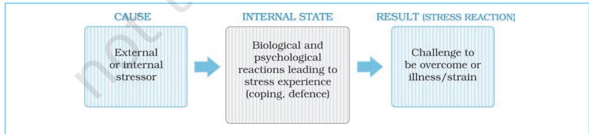
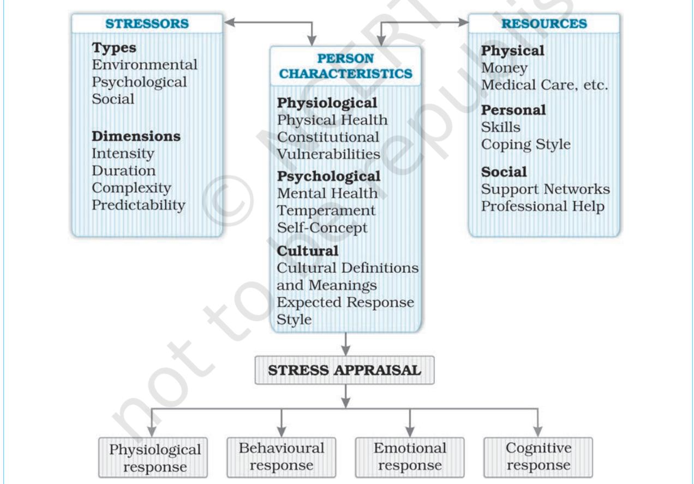
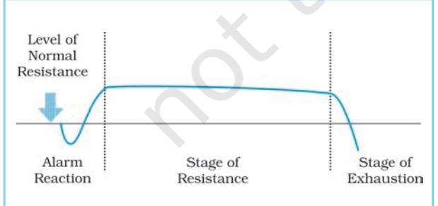
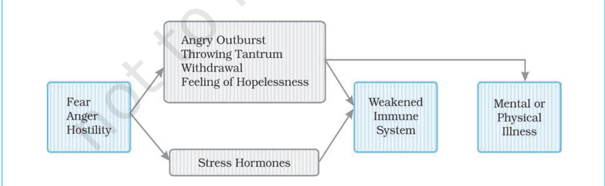
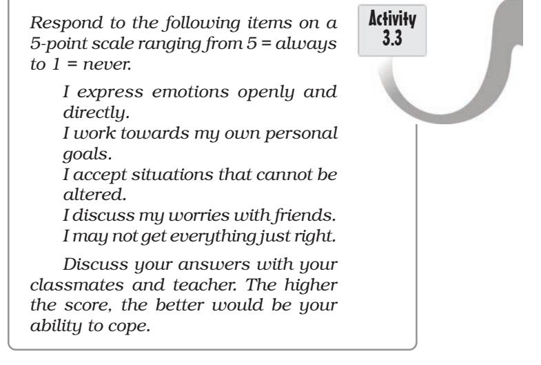

# MEETING LIFE CHALLENGES

## After reading this chapter, you would be able to:

- understand the nature, types and sources of stress as life challenges,
- examine the effects of stress on psychological functioning,
- learn ways to cope with stress,

Psychology 50

CONTENTS

- know about the life skills that help people to stay healthy, and
- understand the factors that promote positive health and well-being.

#### Introduction

Nature, Types and Sources of Stress *A Measure of Stressful Life Events* (Box 3.1) Effects of Stress on Psychological Functioning and Health *Examination Anxiety* (Box 3.2) Stress and Health General Adaptation Syndrome Stress and Immune System Lifestyle Coping with Stress Stress Management Techniques Promoting Positive Health and Well-being Life Skills *Resilience and Health* (Box 3.3)

Key Terms Summary Review Questions Project Ideas Weblinks Pedagogical Hints *Raj has been studying for his final examination which is going to take place tomorrow morning. He studies till 1 a.m. in the night. Unable to concentrate any more, he sets the alarm for 6 a.m. and tries to go off to sleep. As he is very tense, he keeps tossing and turning in bed. Images flash through his mind of not being able to secure the marks he needs to opt for the subjects of his choice. He blames himself for fooling around with his friends and not preparing thoroughly for the examination. In the morning he wakes up with a heavy head, misses breakfast, and barely makes it in time to school for his examination. He opens the question paper, his heart pounding, hands clammy with sweat and then he feels his mind has gone completely blank.*

*Some of you may have lived through an experience such as Raj's. The challenge posed by examinations is common to all students. You are perhaps, already thinking about a career. What if you are denied this choice? Will you give up? Life poses challenges all the time. Think of a child who loses her/his parents at a young age with no one to take care of her/him; a young woman who loses her husband in a car accident; parents who bring up children who are physically or mentally challenged; young girls/boys who have to spend long nights in call centres and then catch up on their sleep during the day time. Look around yourself and you will find that life is a big challenge. All of us try to meet these challenges in our own way. Some of us succeed while others succumb to such life stresses. Life challenges are not necessarily stressful. Much depends on how a challenge is viewed. A number 11 batsman in a cricket team will view facing a fast bowler's delivery differently than would an opening batsman, who will look forward to such a challenge. It is said that one's best comes out when one is challenged. We will like to consider in this chapter how a life condition turns into a challenge or a cause of stress. Further, we will also see how people respond to various life challenges as well as stressful situations.*

#### NATURE, TYPES AND SOURCES OF STRESS

Introduction

While waiting to cross the road on a busy Monday morning, you may be temporarily stressed. But, because you are alert, vigilant and aware of the danger, you are able to cross the road safely. Faced with any challenge, we put in additional efforts and mobilise all our resources and the support system to meet the challenge. All the challenges, problems, and difficult circumstances put us to stress. Thus, if handled properly, stress increases the

probability of one's survival. Stress is like electricity. It gives energy, increases human arousal and affects performance. However, if the electric current is too high, it can fuse bulbs, damage appliances, etc. High stress too can produce unpleasant effects and cause our performance to deteriorate. Conversely, too little stress may cause one to feel somewhat listless and low on motivation which may lead us to perform slowly and less efficiently. It is important to remember that not all stress is inherently bad or destructive. 'Eustress'

is the term used to describe the level of stress that is good for you and is one of a person's best assets for achieving peak performance and managing minor crisis. Eustress, however, has the potential of turning into 'distress'. It is this latter manifestation of stress that causes our body's wear and tear. Thus, stress can be described as the pattern of responses an organism makes to stimulus event that disturbs the equilibrium and exceeds a person's ability to cope.

# Nature of Stress

The word stress has its origin in the Latin words 'strictus', meaning tight or narrow and 'stringere', the verb meaning to tighten. These root words reflect the internal feelings of tightness and constriction of the muscles and breathing reported by many people under stress. Stress is often explained in terms of characteristics of the environment that are disruptive to the individual. Stressors are events that cause our body to give the stress response. Such events include noise, crowding, a bad relationship, or the daily commuting to school or office. The reaction to external stressors is called 'strain' (see Fig.3.1).

Stress has come to be associated with both the causes as well as effects. However, this view of stress can cause confusion. Hans Selye, the father of modern stress research, defined stress as "the nonspecific response of the body to any

demand" that is, regardless of the cause of the threat, the individual will respond with the same physiological pattern of reactions. Many researchers do not agree with this definition as they feel that the stress response is not nearly as general and nonspecific as Selye suggests. Different stressors may produce somewhat different patterns of stress reaction, and different individuals may have different characteristic modes of response. You may recall the case of an opening batsman mentioned earlier. Each one of us will see the situation through our own eyes and it is our perception of the demands, and our ability to meet them, which will determine whether we are feeling 'stressed' or not.

Stress is not a factor that resides in the individual or the environment, instead it is embedded in an ongoing process that involves individuals transacting with their social and cultural environments, making appraisals of those encounters and attempting to cope with the issues that arise. Stress is a dynamic mental/cognitive state. It is a disruption in homeostasis or an imbalance that gives rise to a requirement for resolution of that imbalance or restoration of homeostasis.

The perception of stress is dependent upon the individual's cognitive appraisal of events and the resources available to deal with them. The stress process, based on the cognitive theory of stress propounded by Lazarus and his colleagues, is described in Figure 3.2. An individual's response to a stressful situation largely depends upon

*Fig.3.1 : Psychological Meaning of Stress*

Psychology 52

the perceived events and how they are interpreted or appraised. Lazarus has distinguished between two types of appraisal, i.e. primary and secondary. Primary appraisal refers to the perception of a new or changing environment as positive, neutral or negative in its consequences. Negative events are appraised for their possible harm, threat or challenge. Harm is the assessment of the damage that has already been done by an event. Threat is the assessment of possible future damage that may be brought about by the event. Challenge appraisals are associated with more confident expectations of the ability to cope with the stressful event, the potential to overcome and even profit from the event. When we perceive an event as stressful, we

are likely to make a secondary appraisal, which is the assessment of one's coping abilities and resources and whether they will be sufficient to meet the harm, threat or challenge of the event. These resources may be mental, physical, personal or social. If one thinks one has a positive attitude, health, skills and social support to deal with the crises s/he will feel less stressed. This two-level appraisal process determines not only our cognitive and behavioural responses but also our emotional and physiological responses to external events.

These appraisals are very subjective and will depend on many factors. One factor is the past experience of dealing with such a stressful condition. If one has handled similar situations very

*Fig.3.2 : A General Model of the Stress Process*

Chapter 3 • *Meeting Life Challenges* 53

successfully in the past, they would be less threatening for her/him. Another factor is whether the stressful event is perceived as controllable, i.e. whether one has mastery or control over a situation. A person who believes that s/he can control the onset of a negative situation, or its adverse consequences, will experience less amount of stress than those who have no such sense of personal control. For example, a sense of self-confidence or efficacy can determine whether the person is likely to appraise the situation as a threat or a challenge. Thus, the experience and outcome of a stressor may vary from individual to individual. Stress, includes all those environmental and personal events, which challenge or threaten the well-being of a person. These stressors can be external, such as environmental (noise, air pollution), social (break-up with a friend, loneliness) or psychological (conflict, frustration) within the individual.

Very often, these stressors result in a variety of stress reactions, which may be physiological, behavioural, emotional, and cognitive (see Fig.3.2). At the physiological level, arousal plays a key role in stressrelated behaviours. The hypothalamus initiates action along two pathways. The first pathway involves the autonomic nervous system. The adrenal gland releases large amount of catecholamines (epinephrine and norepinephrine) into the blood stream. This leads to physiological changes seen in fight-or-flight response. The second pathway involves the pituitary gland, which secretes the corticosteroid (cortisol) which provides energy. The emotional reactions to experience of stress include negative emotions such as fear, anxiety, embarrassment, anger, depression or even denial. The behavioural responses are virtually limitless, depending on the nature of the stressful event. Confrontative action against the stressor (fight) or withdrawal from the threatening event

(flight) are two general categories of behavioural responses. Cognitive responses include beliefs about the harm or threat an event poses and beliefs about its causes or controllability. These include responses such as inability to concentrate, and intrusive, repetitive or morbid thoughts.

As indicated in Figure 3.2, the stresses which people experience also vary in terms of intensity (low intensity vs. high intensity), duration (short-term vs. longterm), complexity ( less complex vs. more complex) and predictability (unexpected vs. predictable). The outcome of stress depends on the position of a particular stressful experience along these dimensions. Usually more intense, prolonged or chronic, complex and unanticipated stresses have more negative consequences than have less intense, short-term, less complex and expected stresses. An individual's experiences of stress depend on the physiological strength of that person. Thus, individuals with poor physical health and weak constitution would be more vulnerable than would be those who enjoy good health and strong constitution.

Psychological characteristics like mental health, temperament, and selfconcept are relevant to the experience of stress. The cultural context in which we live determines the meaning of any event and defines the nature of response that is expected under various conditions. Finally, the stress experience will be determined by the resources of the person, such as money, social skills, coping style, support networks, etc. All these factors determine the appraisal of a given stressful situation.

# Signs and Symptoms of Stress

The way we respond to stress varies depending upon our personality, early upbringing and life experiences. Everyone has their own pattern of stress response.

Psychology 54

So the warning signs may vary, as may their intensity. Some of us know our pattern of stress response and can gauge the depth of the problem by the nature and severity of our own symptoms or changes in behaviour. These symptoms of stress can be physical, emotional and behavioural. Any of the symptoms can indicate a degree of stress which, if left unresolved, might have serious implications.

#### Activity 3.1

*Read the following signs of stress :*

*Lack of concentration, Memory loss, Poor decision-making, Inconsistency, Irregular attendance and timekeeping, Low self-esteem, Poor long-term planning, Frantic bursts of energy, Extreme mood swings, Emotional outbursts, Worry, Anxiety, Fear, Depression, Difficulties with sleep, Difficulties with eating, Misuse of drugs, Physical illness, e.g. stomach upset, headache, backache, etc.*

*Tick those applicable to you and then discuss in groups of two or three students in class. Can you reduce some of them? Discuss how? Consult your teacher.*

# Types of Stress

The three major types of stress, viz. physical and environmental, psychological, and social are listed in Figure 3.2. It is important to understand that all these types of stress are interrelated.

# *Physical and Environmental Stress*

Physical stresses are demands that change the state of our body. We feel strained when we overexert ourselves physically, lack a nutritious diet, suffer an injury, or fail to get enough sleep. Environmental stresses are aspects of our surroundings that are often unavoidable such as air pollution, crowding, noise, heat of the summer, winter cold, etc. Another group of environmental stresses are catastrophic events or disasters such as fire, earthquake, floods, etc.

## *Psychological Stress*

These are stresses that we generate ourselves in our minds. These are personal and unique to the person experiencing them and are internal sources of stress. We worry about problems, feel anxiety, or become depressed. These are not only symptoms of stress, but they cause further stress for us. Some of the important sources of psychological stress are frustration, conflicts, internal and social pressures, etc.

Frustration results from the blocking of needs and motives by something or someone that hinders us from achieving a desired goal. There could be a number of causes of frustration such as social discrimination, interpersonal hurt, low grades in school, etc. Conflicts may occur between two or more incompatible needs or motives, e.g. whether to study dance or psychology. You may want to continue studies or take up a job. There may be a conflict of values when you are pressurised to take any action that may be against the values held by you. Internal pressures stem from beliefs based upon expectations from inside us to ourselves such as, 'I must do everything perfectly'. Such expectations can only lead to disappointment. Many of us drive ourselves ruthlessly towards achieving unrealistically high standards in achieving our goals. Social pressures may be brought about from people who make excessive demands on us. This can cause even greater pressure when we have to work with them. Also, there are people with whom we face interpersonal difficulties, 'a personality clash' of sorts.

#### *Social Stress*

These are induced externally and result from our interaction with other people. Social events like death or illness in the family, strained relationships, trouble with neighbours are some examples of social stresses. These social stresses vary widely from person to person. Attending parties may be stressful for a person who likes to spend quiet evenings at home while an outgoing person may find staying at home in the evenings stressful.

#### Sources of Stress

Box 3.1

A wide range of events and conditions can generate stress. Among the most important of these are major stressful life events, such as death of a loved one or personal injury, the annoying frequent hassles of everyday life and traumatic events that affect our lives.

#### *Life Events*

Changes, both big and small, sudden and gradual affect our life from the moment we are born. We learn to cope with small, everyday changes but major life events can be stressful, because they disturb our routine and cause upheaval. If several of these life events that are planned (e.g. moving into a new house) or unpredicted (e.g. break-up of a long-term relationship) occur within a short period of time, we find it difficult to cope with them and will be more prone to the symptoms of stress.

#### A Measure of Stressful Life Events

Holmes and Rahe developed a life event measure of stress. A measure of stressful life events based on the above scale known as the Presumptive Stressful Life Events Scale has been developed for the Indian population by Singh, Kaur and Kaur. It is a self-rating questionnaire made up of fifty-one life changes, which a person may have experienced. Each of these life events is assigned a numerical value in terms of their severity. For example, the death of one's spouse is assigned 95, personal illness or injury 56, failure in examination 43, appearing for examination or interview 43, change in sleeping habits 33, as the mean stress score. Both positive and negative events are taken, believing that both kinds of changes cause stress. The respondent's stress score is the weighted sum of all the items/life change events in the past one year checked by her/him.

Some sample items of the measure are :

| Life Events | Mean Stress Score |
| --- | --- |
| Death of a close family member | 66 |
| Unexpected accident or trauma | 53 |
| Illness of a family member | 52 |
| Break-up with friend | 47 |
| Appearing for examinations | 43 |
| Change in eating habits | 27 |

The mean number of stressful life events experienced over a period of one year without producing overt physical or mental illness is approximately two. However, the correlations between life events and susceptibility to any particular illness is low, indicating a weak association between life events and stress. It has been argued as to whether life events have caused some stress-related illness or whether stress caused the life events and illness. The impact of most life events varies from person to person. Factors such as age at which the event was first experienced, frequency of occurrence, duration of the stressful event and social support must be studied in evaluating the relationship between stressful life events and the subsequent illness episode.

Psychology 56

### *Hassles*

These are the personal stresses we endure as individuals, due to the happenings in our daily life, such as noisy surroundings, commuting, quarrelsome neighbours, electricity and water shortage, traffic snarls, and so on. Attending to various emergencies are daily hassles experienced by a housewife. There are some jobs in which daily hassles are very frequent. These daily hassles may sometimes have devastating consequences for the individual who is often the one coping alone with them as others may not even be aware of them as outsiders. The more stress people report as a result of daily hassles, the poorer is their psychological well-being.

## *Traumatic Events*

These include being involved in a variety of extreme events such as a fire, train or road accident, robbery, earthquake, tsunami, etc. The effects of these events may occur after some lapse of time and sometimes persist as symptoms of anxiety, flashbacks, dreams and intrusive thoughts, etc. Severe trauma can also strain relationships. Professional help will be needed to cope with them especially if they persist for many months after the event is over.

Activity 3.2

*Identify the stressful events, which you and two of your classmates have experienced in the past one year. List the stressful events and rank them from 1 to 5 that have had negative impact in your day-to-day functioning. Then select those that are common to all three of you. Find out how much ability, skill, and family support your friends and you have in order to deal with each of these stresses.*

*Discuss these results with your teacher.*

# EFFECTS OF STRESS ON PSYCHOLOGICAL FUNCTIONING AND HEALTH

What are the effects of stress? Many of the effects are physiological in nature, however, other changes also occur inside stressed individuals. There are four major effects of stress associated with the stressed state, viz. emotional, physiological, cognitive, and behavioural.

Emotional Effects : Those who suffer from stress are far more likely to experience mood swings, and show erratic behaviour that may alienate them from family and friends. In some cases this can start a vicious circle of decreasing confidence, leading to more serious emotional problems. Some examples are feelings of anxiety and depression, increased physical tension, increased psychological tension and mood swings. Box 3.2 presents the phenomenon of 'Examination Anxiety'.

Physiological Effects : When the human body is placed under physical or psychological stress, it increases the production of certain hormones, such as adrenaline and cortisol. These hormones produce marked changes in heart rate, blood pressure levels, metabolism and physical activity. Although, this physical reaction will help us to function more effectively when we are under pressure for short periods of time, it can be extremely damaging to the body in the long-term effects. Examples of physiological effects are release of epinephrine and nor epinephrine, slowing down of the digestive system, expansion of air passages in the lungs, increased heart rate, and constriction of blood vessels.

Cognitive Effects : If pressures due to stress continue, one may suffer from mental overload. This suffering from high level of stress can rapidly cause individuals to lose their ability to make sound

decisions. Faulty decisions made at home, in career, or at workplace may lead to arguments, failure, financial loss or even loss of job. Cognitive effects of stress are poor concentration, and reduced shortterm memory capacity.

Behavioural Effects : Stress affects our behaviour in the form of eating less nutritional food, increasing intake of stimulants such as caffeine, excessive consumption of cigarettes, alcohol and other drugs such as tranquillisers etc. Tranquillisers can be addictive and have side effects such as loss of concentration, poor coordination, and dizziness. Some of the typical behavioural effects of stress seen are disrupted sleep patterns, increased absenteeism, and reduced work performance.

#### Stress and Health

You must have often observed that many of your friends (may be including yourself as well!) fall sick during the examination time. They suffer from stomach upsets, body aches, nausea, diarrhoea and fever etc. You must have also noticed that people who are unhappy in their personal lives fall sick more often than those who are happy and enjoy life. Chronic daily stress can divert an individual's attention from caring for herself or himself. When stress is prolonged, it affects physical health and impairs psychological functioning. People experience exhaustion and attitudinal problems when the stress due to demands from the environment and constraints are too high and little support is available from family and friends. The physical

#### Examination Anxiety

Examination anxiety is a fairly common phenomenon that involves feelings of tension or uneasiness that occur before, during, or after an examination. Many people experience feelings of anxiety around examinations and find it helpful in some ways, as it can be motivating and create the pressure that is needed to stay focused on one's performance. Examination nerves, worry, or fear of failure are normal for even the most talented student. However, stress of formal examination results in such high degrees of anxiety in some students that they are unable to perform at a level which matches the potential they have shown in less stressful classroom situations. Examination stress has been characterised as "evaluative apprehension" or "evaluative stress" and produces debilitating behavioural, cognitive, and physiological effects no different from those produced by any other stressor. High stress can interfere with the student's preparation, concentration, and performance. Examination stress can cause test anxiety which adversely affects test performance. Persons who are high in test anxiety tend to perceive evaluative situations as personally threatening; in test situations, they are often tense, apprehensive, nervous, and emotionally aroused. Moreover, the negative self-centred cognitions which they experience distract their attention and interfere with concentration during examinations. High test anxious students respond to examination stress with intense emotional reactions, negative thoughts about themselves, feelings of inadequacy, helplessness, and loss of status and esteem that impair their performance. Generally, the high test anxious person instead of plunging into a task plunges inward, that is, either neglects or misinterprets informational cues that may be readily available to her/him, or experiences attentional blocks. While preparing for examinations, one must spend enough time for study, overview and weigh one's strengths and weaknesses, discuss difficulties with teachers and classmates, plan a revision timetable, condense notes, space out revision periods, and most importantly on the examination day concentrate on staying calm.

Box 3.2

Psychology 58

exhaustion is seen in the signs of chronic fatigue, weakness and low energy. The mental exhaustion appears in the form of irritability, anxiety, feelings of helplessness and hopelessness. This state of physical, emotional and psychological exhaustion is known as burnout.

There is also convincing evidence to show that stress can produce changes in the immune system and increase the chances of someone becoming ill. Stress has been implicated in the development of cardiovascular disorders, high blood pressure, as well as psychosomatic disorders including ulcers, asthma, allergies and headaches.

Researchers estimate that stress plays an important role in fifty to seventy per cent of all physical illnesses. Studies also reveal that sixty per cent of medical visits are primarily for stress-related symptoms.

# General Adaptation Syndrome

What happens to the body when stress is prolonged? Selye studied this issue by subjecting animals to a variety of stressors such as high temperature, X-rays and insulin injections, in the laboratory over a long period of time. He also observed patients with various injuries and illnesses in hospitals. Selye noticed a similar pattern of bodily response in all of them. He called this pattern the *General Adaptation Syndrome* (GAS). According to him, GAS involves three stages: alarm reaction, resistance, and exhaustion (see Fig.3.3).

- 1. *Alarm reaction stage* : The presence of a noxious stimulus or stressor leads to activation of the adrenalpituitary-cortex system. This triggers the release of hormones producing the stress response. Now the individual is ready for fight or flight.
- 2. *Resistance stage* : If stress is prolonged, the resistance stage begins. The parasympathetic nervous system calls for more cautious use of the body's resources. The organism makes efforts to cope with the threat, as through confrontation.
- 3. *Exhaustion stage* : Continued exposure to the same stressor or additional stressors drains the body of its resources and leads to the third stage of exhaustion. The physiological systems involved in alarm reaction and resistance become ineffective and susceptibility to stress-related diseases such as high blood pressure becomes more likely.

Selye's model has been criticised for assigning a very limited role to psychological factors in stress. Researchers have reported that the psychological appraisal of events is important for the determination of stress. How people respond to stress is substantially influenced by their perceptions, personalities and biological constitutions.

#### Stress and the Immune System

Stress can cause illness by impairing the workings of the immune system. The immune system guards the body against attackers, both from within and outside. Psychoneuroimmunology focuses on the links between the mind, the brain and the immune system. It studies the effects of stress on the immune system. How does the immune system work? The white blood cells (leucocytes) within the immune *Fig.3.3 : The General Adaptation Syndrome* system identify and destroy foreign bodies

(antigens) such as viruses. It also leads to the production of antibodies. There are several kinds of white blood cells or leucocytes within the immune system, including T cells, B cells and natural killer cells. T cells destroy invaders, and T-helper cells increase immunological activity. It is these T-helper cells that are attacked by the Human Immuno Deficiency Virus (HIV), the virus causing Acquired Immuno Deficiency Syndrome (AIDS). B cells produce antibodies. Natural killer cells are involved in the fight against both viruses and tumours.

Stress can affect natural killer cell cytotoxicity, which is of major importance in the defence against various infections and cancer. Reduced levels of natural killer cell cytotoxicity have been found in people who are highly stressed, including students facing important examinations, bereaved persons, and those who are severely depressed. Studies reveal that immune functioning is better in individuals receiving social support. Also, changes in the immune system will have more effect on health among those whose immune systems are already weakened. Figure 3.4 depicts this sequence comprising negative emotions, release of stress hormones which lead to weakening of the immune system, thereby affecting mental and physical health.

Psychological stress is accompanied by negative emotions and associated behaviours, including depression, hostility, anger and aggression. Negative emotion states are of particular concern to the study of effects of stress on health. The incidence of psychological disorders, such as panic attacks and obsessive behaviour increases with the build up of long-term stress. Worries can reach such a level that they surface as a frightening, painful physical sensation, which can be mistaken for a heart attack. People under prolonged stress are more prone to irrational fears, mood swings and phobias, and may experience fits of depression, anger and irritability. These negative emotions appear to be related to the function of the immune system. Our ability to interpret our world and to invest that interpretation with personal meaning and emotion have a powerful and direct effect on the body. Negative moods have been associated with poorer health outcomes. Feelings of hopelessness are related to worsening of disease, increased risk of injury and death due to various causes.

# Lifestyle

Stress can lead to unhealthy lifestyle or health damaging behaviour. Lifestyle is the overall pattern of decisions and behaviours that determine a person's health and

*Fig.3.4 : Relation of Stress with Illness*

Psychology 60

quality of life. Stressed individuals may be more likely to expose themselves to pathogens, which are agents causing physical illness. People who are stressed have poor nutritional habits, sleep less and are likely to engage in other health risking behaviours like smoking and alcohol abuse. Such health impairing behaviours develop gradually and are accompanied by pleasant experiences temporarily. However, we tend to ignore their long-term damaging effects and underestimate the risk they pose to our lives.

Studies have revealed that health promoting behaviour like balanced diet, regular exercise, family support, etc. play an important role in good health. Adhering to a lifestyle that includes balanced low fat diet, regular exercise and continued activity along with positive thinking enhances health and longevity. The modern lifestyle of excesses in eating, drinking and the so called fast-paced good life has led to violation of basic principles of health in some of us, as to what we eat, think or do with our lives.

#### COPING WITH STRESS

In recent years the conviction has grown that it is how we cope with stress and not the stress one experiences that influences our psychological well-being, social functioning and health. Coping is a dynamic situation-specific reaction to stress. It is a set of concrete responses to stressful situations or events that are intended to resolve the problem and reduce stress. The way we cope with stress often depends on rigid deep-seated beliefs, based on experience, e.g. when caught in a traffic jam we feel angry, because we believe that the traffic 'should' move faster. To manage stress we often need to reassess the way we think and learn coping strategies. People who cope poorly with stress have an

impaired immune response and diminished activity of natural killer cells.

Individuals show consistent individual differences in the coping strategies they use to handle stressful situations. These can include both overt and covert activities. The three coping strategies given by Endler and Parker are:

Task-oriented Strategy : This involves obtaining information about the stressful situation and about alternative courses of action and their probable outcome; it also involves deciding priorities and acting so as to deal directly with the stressful situation. For example, schedule my time better, or think about how I have solved similar problems.

Emotion-oriented Strategy : This can involve efforts to maintain hope and to control one's emotions; it can also involve venting feelings of anger and frustration, or deciding that nothing can be done to change things. For example, tell myself that it is not really happening to me, or worry about what I am going to do.

Avoidance-oriented Strategy : This involves denying or minimising the seriousness of the situation; it also involves conscious suppression of stressful thoughts and their replacement by self-

protective thoughts. Examples of this are watching TV, phone up a friend, or try to be with other people.

Lazarus and Folkman has conceptualised coping as a dynamic process rather than an individual trait. Coping refers to constantly changing cognitive and behavioural efforts to master, reduce or tolerate the internal or external demands that are created by the stressful transaction. Coping serves to allow the individual to manage or alter a problem and regulate the emotional response to that problem. According to them coping responses can be divided into two types of responses, problem-focused and emotionfocused. Problem-focused strategies attack the problem itself, with behaviours designed to gain information, to alter the event, and to alter belief and commitments. They increase the person's awareness, level of knowledge, and range of behavioural and cognitive coping options. They can act to reduce the threat value of the event. For example "I made a plan of action and followed it". Emotion-focused strategies call for psychological changes designed primarily to limit the degree of emotional disruption caused by an event, with minimal effort to alter the event itself. For example "I did some things to let it out of my system". While both problem-focused and emotion-focused coping are necessary when facing stressful situations, research suggests that people generally tend to use the former more often than the latter.

### Stress Management Techniques

Stress is a silent killer. It is estimated to play a significant role in physical illness and disease. Hypertension, heart disease, ulcers, diabetes and even cancer are linked to stress. Due to lifestyle changes stress is on the increase. Therefore, schools, other institutions, offices and communities are concerned about knowing techniques to

*Which of the following coping behaviours are problem-focused? Why?*

Activity 3.4

- *• Discussing your problem with a friend.*
- *• Feeling sorry for failing in an examination.*
- *• Finding fault with classmates for poor marks in tests.*
- *• Hiding examination results from parents.*
- *• Blaming friends for bad habits.*
- *• Reading essential books for the annual examination.*
- *• Making efforts to improve one's performance after a setback.*
- *• Missing school when assignments not completed. Discuss the answers with your*

*classmates and teacher.*

manage stress. Some of these techniques are:

Relaxation Techniques : It is an active skill that reduces symptoms of stress and decreases the incidence of illnesses such as high blood pressure and heart disease. Usually relaxation starts from the lower part of the body and progresses up to the facial muscles in such a way that the whole body is relaxed. Deep breathing is used along with muscle relaxation to calm the mind and relax the body.

Meditation Procedures : The yogic method of meditation consists of a sequence of learned techniques for refocusing of attention that brings about an altered state of consciousness. It involves such a thorough concentration that the meditator becomes unaware of any outside stimulation and reaches a different state of consciousness.

Biofeedback : It is a procedure to monitor and reduce the physiological aspects of stress by providing feedback about current physiological activity and is often accompanied by relaxation training.

Psychology 62

Biofeedback training involves three stages : developing an awareness of the particular physiological response, e.g. heart rate, learning ways of controlling that physiological response in quiet conditions; and transferring that control into the conditions of everyday life.

Creative Visualisation : It is an effective technique for dealing with stress. Creative visualisation is a subjective experience that uses imagery and imagination. Before visualising one must set oneself a realistic goal, as it helps build confidence. It is easier to visualise if one's mind is quiet, body relaxed and eyes are closed. This reduces the risk of interference from unbidden thoughts and provides the creative energy needed for turning an imagined scene into reality.

Cognitive Behavioural Techniques : These techniques aim to inoculate people against stress. Stress inoculation training is one effective method developed by Meichenbaum. The essence of this approach is to replace negative and irrational thoughts with positive and rational ones. There are three main phases in this : assessment, stress reduction techniques, and application and followthrough. Assessment involves discussing the nature of the problem and seeing it from the viewpoint of the person/client. Stress reduction involves learning the techniques of reducing stress such as relaxation and self-instruction.

Exercise : Exercise can provide an active outlet for the physiological arousal experienced in response to stress. Regular exercise improves the efficiency of the heart, enhances the function of the lungs, maintains good circulation, lowers blood pressure, reduces fat in the blood and improves the body's immune system. Swimming, walking, running, cycling, skipping, etc. help to reduce stress. One must practice these exercises at least four

times a week for 30 minutes at a time. Each session must have a warm-up, exercise and cool down phases.

# PROMOTING POSITIVE HEALTH AND WELL-BEING

It is unlikely that we will go through life without some experience of personal crises causing acute pressure for a while. Many people sail through and rebuild their lives very positively. They are likely to have constructive attitudes and also have lots of emotional and social support of various kinds available to them. When we find ways of managing these pressures and can use the energy to create something positive out of the situation, then we will have learned to survive healthily and this will leave us more stress fit for future crises. It is like being immunised against the dangers of unhealthy stress.

Stress Resistant Personality : Recent studies by Kobasa have shown that people with high levels of stress but low levels of illness share three characteristics, which are referred to as the personality traits of hardiness. It consists of *'the three Cs',* i.e. *commitment, control,* and *challenge*. Hardiness is a set of beliefs about oneself, the world, and how they interact. It takes shape as a sense of personal commitment to what you are doing, a sense of control over your life, and a feeling of challenge. Stress resistant personalities have control which is a sense of purpose and direction in life; commitment to work, family, hobbies and social life; and challenge, that is, they see changes in life as normal and positive rather than as a threat.

Everyone does not have these characteristics, many of us have to relearn specific life skills in areas such as rational thinking, and assertiveness to equip ourselves better to cope with the demands of everyday life, etc.

# Life Skills

Life skills are abilities for adaptive and positive behaviour that enable individuals to deal effectively with the demands and challenges of everyday life. Our ability to cope depends on how well we are prepared to deal with and counterbalance everyday demands, and keep equilibrium in our lives. These life skills can be learned and even improved upon. Assertiveness, time management, rational thinking, improving relationships, self-care, and overcoming unhelpful habits such as perfectionism, procrastination, etc. are some life skills that will help to meet the challenges of life.

Assertiveness : Assertiveness is a behaviour or skill that helps to communicate, clearly and confidently, our feelings, needs, wants, and thoughts. It is the ability to say no to a request, to state an opinion without being self-conscious, or to express emotions such as love, anger, etc. openly. If you are assertive, you feel confident, and have high self-esteem and a solid sense of your own identity.

Time Management : The way you spend your time determines the quality of your life. Learning how to plan time and delegate can help to relieve the pressure. The major way to reduce time stress is to change one's perception of time. The central principle of time management is to spend your time doing the things that you value, or that help you to achieve your goals. It depends on being realistic about what you know and that you must do it within a certain time period, knowing what you want to do, and organising your life to achieve a balance between the two.

Rational Thinking : Many stress-related problems occur as a result of distorted thinking. The way you think and the way you feel are closely connected. When we are stressed, we have an inbuilt selective bias to attend to negative thoughts and

images from the past, which affect our perception of the present and the future. Some of the principles of rational thinking are: challenging your distorted thinking and irrational beliefs, driving out potentially intrusive negative anxiety-provoking thoughts, and making positive statements.

Improving Relationships : The key to a sound lasting relationship is communication. This consists of three essential skills: listening to what the other person is saying, expressing how you feel and what you think, and accepting the other person's opinions and feelings, even if they are different from your own. It also requires us to avoid misplaced jealousy and sulking behaviour.

Self-care : If we keep ourselves healthy, fit and relaxed, we are better prepared physically and emotionally to tackle the stresses of everyday life. Our breathing patterns reflect our state of mind and emotions. When we are stressed or anxious, we tend towards rapid and shallow breathing from high in the chest, with frequent sighs. The most relaxed breathing is slow, stomach-centred breathing from the diaphragm, i.e. a dome like muscle between the chest and the abdominal cavity. Environmental stresses like noise, pollution, space, light, colour, etc. can all exert an influence on our mood. These have a noticeable effect on our ability to cope with stress, and well-being.

Overcoming Unhelpful Habits : Unhelpful habits such as perfectionism, avoidance, procrastination, etc. are strategies that help to cope in the short-term but which make one more vulnerable to stress. Perfectionists are persons who have to get everything just right. They have difficulty in varying standards according to factors such as time available, consequences of not being able to stop work, and the effort needed. They are more likely to feel tense

Psychology 64

and find it difficult to relax, are critical of self and others, and may become inclined to avoid challenges. Avoidance is to put the issue under the carpet and refuse to accept or face it. Procrastination means putting off what we know we need to do. We all are guilty of saying "I will do it later". People who procrastinate are deliberately avoiding confronting their fears of failure or rejection.

Various factors have been identified which facilitate the development of positive health. Health is a state of complete physical, mental, social and spiritual well-being, and not merely the absence of disease or infirmity. Positive health comprises the following constructs: "a healthy body; high quality of personal relationships; a sense of purpose in life; self-regard, mastery of life's tasks; and resilience to stress, trauma, and change". Box 3.3 presents the relationship between resilience and health. Specifically, factors that act as stress buffers and facilitate positive health are diet, exercise, positive attitude, positive thinking, and social support.

Diet : A balanced diet can lift one's mood, give more energy, feed muscles, improve circulation, prevent illness, strengthen the immune system and make one feel better to cope with stresses of life. The key to healthy living is to eat three main meals a day, and eat a varied well-balanced diet. How much nutrition one needs depends on one's activity level, genetic make-up, climate, and health history. What people eat, and how much do they weigh involve behavioural processes. Some people are able to maintain a healthy diet and weight while others become obese. When we are stressed, we seek 'comfort foods' which are high in fats, salt and sugar.

Exercise : A large number of studies confirm a consistently positive relationship between physical fitness and health. Also, of all the measures an individual can take to improve health, exercise is the lifestyle change with the widest popular approval. Regular exercise plays an important role in managing weight and stress, and is shown to have a positive effect on reducing

#### Resilience and Health

In recent years, there has been a lot of research in understanding resilience in children and adolescents. Resilience is a dynamic developmental process referring to the maintenance of positive adjustment under challenging life conditions. It has been described as the capacity to 'bounce back' in the face of stress and adversity. Resilience has been conceptualised as reflecting feelings of self-worth and self-confidence, autonomy and self-reliance, finding positive role models, seeking a confidant, cognitive skills such as problem solving, creativity, resourcefulness, and flexibility and a belief that one's life has purpose and meaning. Resilient individuals are able to overcome the effects of trauma, stress and adversity and learn to live psychologically healthy and meaningful lives.

Resilience has recently been defined in terms of three resources: I HAVE (social and interpersonal strengths), i.e. 'people around me I trust and who love me no matter what', I AM (inner strengths), i.e. 'respectful of myself and others', and I CAN ( interpersonal and problem solving skills), i.e. 'find ways to solve problems I face'. For a child to be resilient, s/he needs to have more than one of these strengths. For example, children may have plenty of self-esteem (I am), but may lack anyone whom they can turn to for support (I have), and do not have the capacity to solve problems (I can), will not be resilient. Outcomes of longitudinal studies of children provide evidence that in spite of extreme vulnerabilities related to poverty and other social disadvantages, many individuals develop into capable and caring adults.

Chapter 3 • *Meeting Life Challenges* 65

Box 3.3

tension, anxiety and depression. Physical exercises that are essential for good health are stretching exercises such as *yogic asanas* and aerobic exercises such as jogging, swimming, cycling, etc. Whereas stretching exercises have a calming effect, aerobic exercises increase the arousal level of the body. The health benefits of exercise work as a stress buffer. Studies suggest that fitness permits individuals to maintain general mental and physical wellbeing even in the face of negative life events.

Positive Attitude : Positive health and well-being can be realised by having a positive attitude. Some of the factors leading to a positive attitude are: having a fairly accurate perception of reality; a sense of purpose in life and responsibility; acceptance and tolerance for different viewpoints of others; and taking credit for success and accepting blame for failure. Finally, being open to new ideas and having a sense of humour with the ability to laugh at oneself help us to remain centred, and see things in a proper perspective.

Positive Thinking : The power of positive thinking has been increasingly recognised in reducing and coping with stress. Optimism, which is the inclination to expect favourable life outcomes, has been linked to psychological and physical wellbeing. People differ in the manner in which they cope. For example, optimists tend to assume that adversity can be handled successfully whereas pessimists anticipate disasters. Optimists use more problemfocused coping strategies, and seek advice and help from others. Pessimists ignore the problem or source of stress, and use strategies such as giving up the goal with which stress is interfering or denying that stress exists.

Social Support : Social support is defined as the existence and availability of people on whom we can rely upon, people who let us know that they care about, value, and love us. Someone who believes that s/he belongs to a social network of communication and mutual obligation experiences social support. *Perceived support*, i.e. the quality of social support is positively related to health and wellbeing, whereas *social network*, i.e. the quantity of social support is unrelated to well-being, because it is very timeconsuming and demanding to maintain a large social network. Studies have revealed that women exposed to life event stresses, who had a close friend, were less likely to be depressed and had lesser medical complications during pregnancy. Social support can help to provide protection against stress. People with high levels of social support from family and friends may experience less stress when they confront a stressful experience, and they may cope with it more successfully.

Social support may be in the form of tangible support or assistance involving material aid, such as money, goods, services, etc. For example, a child gives notes to her/his friend, since s/he was absent from school due to sickness. Family and friends also provide informational support about stressful events. For example, a student facing a stressful event such as a difficult board examination, if provided information by a friend who has faced a similar one, would not only be able to identify the exact procedures involved, but also it would facilitate in determining what resources and coping strategies could be useful to successfully pass the examination. During times of stress, one may experience sadness, anxiety, and loss of self-esteem. Supportive friends and family provide emotional support by

Psychology 66

reassuring the individual that she/he is loved, valued, and cared for. Research has demonstrated that social support effectively reduces psychological distress such as depression or anxiety, during times of stress. There is growing evidence that social support is positively related to psychological well-being. Generally, social support leads to mental health benefits for both the giver and the receiver.

*Identify a child in your neighbourhood who had undergone some major stress in life such as a serious accident or been through a recent traumatic experience like a robbery, fire, etc. Talk to the child and family. Can you identify some factors that have helped her/him to cope and overcome the trauma? Do you see any similar factors in your own life? Discuss with your teacher.*

Activity 3.5

#### Key Terms

Alarm reaction, Appraisal, Coping, Exhaustion, General adaptation syndrome, Hardiness, Homeostasis, Life skills, Optimism, Positive health, Psychoneuroimmunology, Resilience, Social support, Stress, Stressors.

- *Stress is a part of life. Stress is neither a stimulus nor a response but an ongoing transactional process between the individual and the environment.*
- *There are three major types of stresses, physical and environmental, psychological and social. Sources of stress are life events, everyday hassles, traumatic events. The response to stress is emotional, physiological, cognitive and behavioural.*
- *Coping is a dynamic situation-specific individual reaction to stress. There are three main types of coping, task-oriented, emotion-oriented, and avoidance-oriented coping. Coping responses may be problem-focused or emotion-focused. Problem-focused coping focuses to alter the environment and acts to reduce the threat value of the event. Emotion-focused coping are strategies for changing emotions and aim to limit the degree of emotional disruption caused by the event.*
- *It is essential to have a healthy lifestyle for handling stress and effective coping. Assertiveness, time management, rational thinking, improving relationships, selfcare, and overcoming unhelpful habits are life skills that help us to meet life's challenges.*
- *Positive health and well-being come through balanced diet, exercise, positive attitude, positive optimistic thinking, and social support. There is also a need for overall harmonious conditions in society. We must avoid taking unhealthy escape routes of smoking, alcohol, drugs and other harmful behaviours.*

#### Review Questions

- 1. Explain the concept of stress. Give examples from daily life.
- 2. State the symptoms and sources of stress.
- 3. Describe the GAS model and illustrate the relevance of this model with the help of an example.
- 4. Enumerate the different ways of coping with stress.
- 5. Explain the effect of stress on psychological functioning.
- 6. Describe how life skills can help meet life's challenges.
- 7. Discuss the factors that lead to positive health and well-being.
- 8. How does stress affect the immune system?

Chapter 3 • *Meeting Life Challenges* 67

- 9. Give an example of a life event which is likely to be stressful. Suggest reasons why it is likely to cause different degrees of stress to the person experiencing it.
- 10. Given what you know about coping strategies, what suggestions would you give to your friends to avoid stress in their everyday lives.
- 11. Reflect on the environmental factors that have (a) a positive impact on the being, and (b) a negative effect.
- 12. We know that certain lifestyle factors can cause stress and may lead to diseases like cancer and coronary heart disease, yet we are unable to change our behaviour. Explain why?
- 1. Record the stresses in the lives of 5–10 teenagers. Are these different for girls and boys? Find out the ways by which they cope with them.
	- 2. Discuss with your parents and grandparents the unique stressors they face in their lives and how they cope with them.

Project Ideas

# Weblinks

http://www.nlm.nih.gov/medlineplus/stress.html http://www.teachhealth.com http://www.lifepositive.com/stress.html

- 1. It is important to make students realise that stress is an integral part of life. They must, therefore, be encouraged to recognise the signs of stress in themselves and in others.
- 2. Students could brainstorm for possible ways of dealing with different types of stressors.
- 3. Drawing examples from students' lives, they need to be made to understand the harmful effects of stress on physical and mental health.
- 4. Students should be encouraged to search for literature in newspapers, magazines, Internet, etc. suggesting ways of dealing with stress. This could be followed by discussion in the classroom.

Psychology 68

