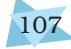
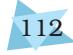
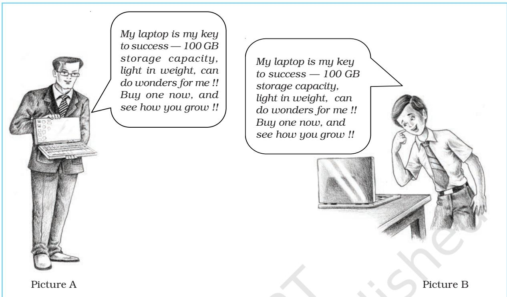
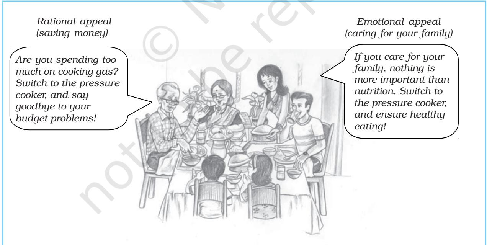
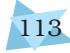
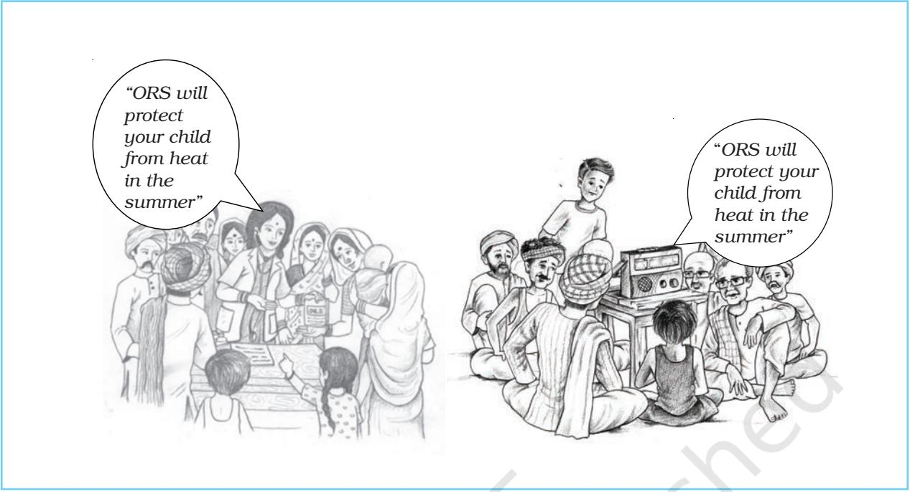

# ATTITUDE AND SOCIAL COGNITION

# After reading this chapter, you would be able to:

understand what are attitudes, how they are formed and changed.

# Introduction Explaining Social Behaviour Nature and Components of Attitudes

*A 'Green Environment' : The A-B-C Components of an Attitude* (Box 6.1)

# Attitude Formation and Change

Prejudice and Discrimination Strategies for Handling Prejudice

Attitude Formation Attitude Change *Telling a Lie for Twenty Dollars* (Box 6.2) Attitude-Behaviour Relationship

CONTENTS

Psychology 104

Key Terms

Summary Review Questions Project Ideas Weblinks Pedagogical Hints Introduction

*Social psychology is that branch of psychology which investigates how the behaviour of individuals is affected by others and the social environment. All of us form attitudes, or ways of thinking about specific topics and people. Many of these social behaviours seem to be simple. Yet, explaining the processes that lie behind these behaviours is a complex matter. This chapter will describe the basic ideas related to attitudes, as explained by social psychologists.*

# EXPLAINING SOCIAL BEHAVIOUR

Social behaviour is a necessary part of human life, and being social means much more than merely being in the company of others. You may recall from what you studied in Class XI that social psychology deals with all behaviour that takes place in the actual, imagined, or implied presence of others. Social psychologists examine various forms of social behaviour, and try to explain their basis. Because of social influences, people form views, or attitudes about people, and about different issues in life, that exist in the form of behavioural tendencies. In order to understand completely how the social context influences the individual, it is necessary to study both social-cognitive processes and social behaviour. Social psychologists have shown that one must go beyond common sense and folk wisdom in order to explain how people observe and make sense of their own and others' diverse behaviours.

# NATURE AND COMPONENTS OF ATTITUDES

For a few minutes quietly do the following mental exercise. Today, how many times did you tell yourself : "In my opinion…" or "Others may say so and so, but I feel…"?

What you fill in the blanks are called *opinions*. Now continue the exercise : how important are these opinions to you? The topics of some of these opinions may be only moderately important to you; they are simply ways of thinking, and it does not matter much to you that others agree or disagree with your views. On the other hand, you may find that some other topics are extremely important to you. If someone opposes or challenges your views about these topics, you get emotional. You may have made some of these views part of your behaviour. In other words, if your views are not merely thoughts, but also have emotional and action components, then these views are more than 'opinions'; they are examples of attitudes.

All definitions of attitudes agree that an attitude is a state of the mind, a set of views, or thoughts, regarding some topic (called the 'attitude object'), which have an evaluative feature (positive, negative or neutral quality). It is accompanied by an emotional component, and a tendency to act in a particular way with regard to the attitude object. The thought component is referred to as the cognitive aspect, the emotional component is known as the affective aspect, and the tendency to act is called the behavioural (or conative) aspect. Taken together, these three aspects have been referred to as the A-B-C components (Affective-Behavioural-Cognitive components) of attitude. Note that attitudes are themselves not

behaviour, but they represent a tendency to behave or act in certain ways. They are part of cognition, along with an emotional component, and cannot be observed from outside. Box 6.1 presents an example of an attitude towards the environment, showing the relationship between the three components.

Attitudes have to be distinguished from two other closely related concepts, namely, beliefs and values. Beliefs refer to the cognitive component of attitudes, and form the ground on which attitudes stand, such as belief in God, or belief in democracy as a political ideology. Values are attitudes or beliefs that contain a 'should' or 'ought' aspect, such as moral or ethical values. One example of a value is the idea that one should work hard, or that one should always be honest, because honesty is the best policy. Values are formed when a particular belief or attitude becomes an inseparable part of the person's outlook on life. Consequently, values are difficult to change.

What is the purpose served by an attitude? We find that attitudes provide a background that makes it easier for a person to decide how to act in new situations. For example, our attitude towards foreigners may indirectly provide a mental 'layout' or 'blueprint' for the way in which we should behave whenever we meet one.

In addition to the affective, cognitive and behavioural components, attitudes also have other properties. Four significant features of attitudes are : Valence (positivity or negativity), Extremeness, Simplicity or Complexity (multiplexity)*,* and Centrality.

Valence (positivity or negativity) : The valence of an attitude tells us whether an attitude is positive or negative towards the attitude object. Suppose an attitude (say, towards nuclear research) has to be expressed on a 5-point scale, ranging from 1 (Very bad), 2 (Bad), 3 (Neutral — neither good nor bad), and 4 (Good), to 5 (Very good). If an individual rates her/his view towards nuclear research as 4 or 5, this is clearly a positive attitude. This means that the person likes the idea of nuclear research and thinks it is something good. On the other hand, if the rating is 1 or 2, the attitude is negative. This means that the person dislikes the idea of nuclear research, and thinks it is something bad. We also allow for neutral attitudes. In this

# Box

# 6.1 A 'Green Environment' : The A-B-C Components of an Attitude

Suppose a group of people in your neighbourhood start a tree plantation campaign as part of a 'green environment' movement. Based on sufficient information about the environment, your view towards a 'green environment' is positive (cognitive or 'C' component, along with the evaluative aspect). You feel very happy when you see greenery. You feel sad and angry when you see trees being cut down. These aspects reflect the affective (emotional), or 'A' component of the same attitude. Now suppose you also actively participate in the tree plantation campaign. This shows the behavioural or 'B' component of your attitudes towards a 'green environment'. In general, we expect all three components to be consistent with each other, that is, in the same direction. However, such consistency may not necessarily be found in all situations. For example, it is quite possible that the cognitive aspect of your 'green environment' attitude is very strong, but the affective and behavioural components may be relatively weaker. Or, the cognitive and affective components may be strong and positive, but the behavioural component may be neutral. Therefore, predicting one component on the basis of the other two may not always give us the correct picture about an attitude.

example, a neutral attitude towards nuclear research would be shown by a rating of 3 on the same scale. A neutral attitude would have neither positive nor negative valence.

Extremeness : The extremeness of an attitude indicates how positive or negative an attitude is. Taking the nuclear research example given above, a rating of 1 is as extreme as a rating of 5 : they are only in the opposite directions (valence). Ratings of 2 and 4 are less extreme. A neutral attitude, of course, is lowest on extremeness.

Simplicity or Complexity (multiplexity) : This feature refers to how many attitudes there are within a broader attitude. Think of an attitude as a family containing several 'member' attitudes. In case of various topics, such as health and world peace, people hold many attitudes instead of single attitude. An attitude *system* is said to be 'simple' if it contains only one or a few attitudes, and 'complex' if it is made up of many attitudes. Consider the example of attitude towards health and well-being. This attitude system is likely to consist of several 'member' attitudes, such as one's concept of physical and mental health, views about happiness and well-being, and beliefs about how one should achieve health and happiness. By contrast, the attitude towards a particular person is likely to consist of mainly one attitude. The multiple member-attitudes within an attitude system should not be confused with the three components described earlier. Each member attitude that belongs to an attitude system also has A-B-C components.

Centrality : This refers to the role of a particular attitude in the attitude system. An attitude with greater centrality would influence the other attitudes in the system much more than non-central (or peripheral) attitudes would. For example, in the attitude towards world peace, a negative attitude towards high military expenditure may be present as a core or central attitude that influences all other attitudes in the multiple attitude system.

# ATTITUDE FORMATION AND CHANGE

# Attitude Formation

One important question that psychologists are interested in answering is : how are attitudes formed? Like many other thoughts and concepts that develop and become part of our cognitive system, attitudes towards different topics, things and people also are formed as we interact with others. However, there are specific conditions that lead to the formation of specific attitudes.

In general, attitudes are *learned* through one's own experiences, and through interaction with others. There are a few research studies that show some sort of inborn aspect of attitudes, but such genetic factors influence attitudes only indirectly, along with learning. Therefore, most social psychologists have focused on the conditions which lead to the learning of attitudes.

# *Process of Attitude Formation*

The processes and conditions of learning may be different, resulting in varying attitudes among people.

- *Learning attitudes by association :* You might have seen that students often develop a liking for a particular subject because of the teacher. This is because they see many positive qualities in that teacher; these positive qualities get linked to the subject that s/he teaches, and ultimately get expressed in the form of liking for the subject. In other words, a positive attitude towards the subject is learned through the positive association between a teacher and a student.

- *Learning attitudes by being rewarded or punished :* If an individual is praised for showing a particular attitude, chances are high that s/he will develop that attitude further. For example, if a teenager does *yogasanas* regularly, and gets the honour of being 'Miss Good Health' in her school, she may develop a positive attitude towards *yoga* and health in general. Similarly, if a child constantly falls ill because s/he eats junk food instead of proper meals, then the child is likely to develop a negative attitude towards junk food, and also a positive attitude towards eating healthy food.
- *Learning attitudes through modelling (observing others) :* Often it is not through association, or through reward and punishment, that we learn attitudes. Instead, we learn them by observing others being rewarded or punished for expressing thoughts, or showing behaviour of a particular kind towards the attitude object. For example, children may form a respectful attitude towards elders, by observing that their parents show respect for elders, and are appreciated for it.
- *Learning attitudes through group or cultural norms :* Very often, we learn attitudes through the *norms* of our group or culture. Norms are unwritten rules about behaviour that everyone is supposed to show under specific circumstances. Over time, these norms may become part of our social cognition, in the form of attitudes. Learning attitudes through group or cultural norms may actually be an example of all three forms of learning described above — learning through association, reward or punishment, and modelling. For example, offering money, sweets, fruit and flowers in a place of worship is a normative behaviour in some religions.

When individuals see that such behaviour is shown by others, is expected and socially approved, they may ultimately develop a positive attitude towards such behaviour and the associated feelings of devotion.

- *Learning through exposure to information :* Many attitudes are learned in a social context, but not necessarily in the physical presence of others. Today, with the huge amount of information that is being provided through various media, both positive and negative attitudes are being formed. By reading the biographies of selfactualised persons, an individual may develop a positive attitude towards hard work and other aspects as the means of achieving success in life.
# *Factors that Influence Attitude Formation*

The following factors provide the context for the learning of attitudes through the processes described above.

- 1. *Family and School Environment :* Particularly in the early years of life, parents and other family members play a significant role in shaping attitude formation. Later, the school environment becomes an important background for attitude formation. Learning of attitudes within the family and school usually takes place by association, through rewards and punishments, and through modelling.
- 2. *Reference Groups :* Reference groups indicate to an individual the norms regarding acceptable behaviour and ways of thinking. Thus, they reflect learning of attitudes through group or cultural norms. Attitudes towards various topics, such as political, religious and social groups, occupations, national and other issues are often developed through reference

Psychology 108

groups. Their influence is noticeable especially during the beginning of adolescence, at which time it is important for the individual to feel that s/he belongs to a group. Therefore, the role of reference groups in attitude formation may also be a case of learning through reward and punishment.

- 3. *Personal Experiences :* Many attitudes are formed, not in the family environment or through reference groups, but through direct personal experiences which bring about a drastic change in our attitude towards people and our own life. Here is a real-life example. A driver in the army went through a personal experience that transformed his life. On one mission, he narrowly escaped death although all his companions got killed. Wondering about the purpose of his own life, he gave up his job in the army, returned to his native village in Maharashtra, and worked actively as a community leader. Through a purely personal experience this individual evolved a strong positive attitude towards community upliftment. His efforts completely changed the face of his village.
- 4. *Media-related Influences :* Technological advances in recent times have made audio-visual media and the Internet very powerful sources of information that lead to attitude formation and change. In addition, school level textbooks also influence attitude formation. These sources first strengthen the cognitive and affective components of attitudes, and subsequently may also affect the behavioural component. The media can exert both good and bad influences on attitudes. On one hand, the media and Internet make people better informed than other modes of communication. On the other hand, there may be no check on the nature of information being

gathered, and therefore no control over the attitudes that are being formed, or the direction of change in the existing attitudes. The media can be used to create consumerist attitudes where none existed, and can also be harnessed to create positive attitudes to facilitate social harmony.

# Attitude Change

During the process of attitude formation, and also after this process, attitudes may be changed and modified through various influences. Some attitudes change more than others do. Attitudes that are still in the formative stage, and are more like opinions, are much more likely to change compared to attitudes that have become firmly established, and have become a part of the individual's values. From a practical point of view, bringing about a change in people's attitudes is of interest to community leaders, politicians, producers of consumer goods, advertisers, and others. Unless we find out how attitudes change, and what conditions account for such change, it would not be possible to take steps to bring about attitude change.

# *Process of Attitude Change*

Three major concepts that draw attention to some important processes in attitude change are described below :

(a) The concept of balance, proposed by Fritz Heider is sometimes described in the form of the 'P-O-X*'* triangle, which represents the relationships between three aspects or components of the attitude. P is the person whose attitude is being studied, O is another person, and X is the topic towards which the attitude is being studied (attitude object). It is also possible that all three are persons.

The basic idea is that an attitude changes if there is a state of imbalance between the P-O attitude, O-X attitude,

and P-X attitude. This is because imbalance is logically uncomfortable. Therefore, the attitude changes in the direction of balance.

Imbalance is found when (i) all three sides of the P-O-X triangle are negative, or (ii) two sides are positive, and one side is negative. Balance is found when (i) all three sides are positive, or (ii) two sides are negative, and one side is positive.

Consider the example of dowry as an attitude topic (X). Suppose a person (P) has a positive attitude towards dowry (P-X positive). P is planning to get his son married to the daughter of some person (O) who has a negative attitude towards dowry (O-X negative). What would be the nature of the P-O attitude, and how would it determine balance or imbalance in the situation? If O initially has a positive attitude towards P, the situation would be unbalanced. P-X is positive, O-P is positive, but O-X is negative. That is, there are two positives and one negative in the triangle. This is a situation of imbalance. One of the three attitudes will therefore have to change. This change could take place in the P-X relationship (P starts disliking dowry as a custom), or in the O-X relationship (O starts liking dowry as a custom), or in the O-P relationship (O starts disliking P). In short, an attitude change will have to take place so that there will be three positive relationships, or two negative and one positive relationship, in the triangle.

(b) The concept of cognitive dissonance was proposed by Leon Festinger. It emphasises the cognitive component. Here the basic idea is that the cognitive components of an attitude must be 'consonant' (opposite of 'dissonant'), i.e., they should be logically in line with each other. If an individual finds that two cognitions in an attitude are dissonant, then one of them will be changed in the direction of consonance. For example, think about the following ideas ('cognitions') :

> Cognition I : *Pan masala causes mouth cancer which is fatal.*

Cognition II : *I eat pan masala.* Holding these two ideas or cognitions will make any individual feel that something is 'out of tune', or dissonant, in the attitude towards *pan masala*. Therefore, one of these ideas will have to be changed, so that consonance can be attained. In the example given above, in order to remove or reduce the dissonance, I will stop eating *pan masala* (change Cognition II). This would be the healthy, logical and sensible way of reducing dissonance.

Festinger and Carlsmith, two social psychologists, conducted an experiment that showed how cognitive dissonance works (see Box 6.2).

Both balance and cognitive dissonance are examples of cognitive consistency*.* Cognitive consistency means that two components, aspects or elements of the attitude, or attitude system, must be in the same direction. Each element should logically fall in line with other elements. If this does not happen, then the person experiences a kind of mental discomfort, i.e. the sense that 'something is not quite right' in the attitude system. In such a state, some aspect in the attitude system changes in the direction of consistency, because our cognitive system requires logical consistency.

(c) The two-step concept was proposed by S.M. Mohsin, an Indian psychologist. According to him, attitude change takes place in the form of two steps. In the first step, the target of change identifies with the source. The 'target' is the person whose attitude is to be changed. The 'source' is the person through whose influence the change is to take place. Identification means that the target has liking and regard for the source. S/he puts herself/

Psychology 110

himself in the place of the target, and tries to feel like her/him. The source must also have a positive attitude towards the target, and the regard and attraction becomes mutual. In the second step, the source herself/himself shows an attitude change, by actually changing her/him behaviour towards the attitude object. Observing the source's changed attitude and behaviour, the target also shows an attitude change through behaviour. This is a kind of imitation or observational learning.

Consider the following example of twostep attitude change. Preeti reads in the newspapers that a particular soft drink that she enjoys is extremely harmful. But Preeti sees that her favourite sportsperson has been advertising the same soft drink. She has identified herself with the sportsperson, and would like to imitate her/him. Now, suppose the sportsperson wishes to change people's attitude towards this soft drink from positive to negative. The

sportsperson must first show positive feelings for her/his fans, and then actually change her/his own habit of consuming that soft drink (Step I) — perhaps by substituting it with a health drink. If the sportsperson actually changes her/his behaviour, it is very likely that now Preeti will also change her attitude and behaviour, and stop consuming the harmful soft drink (Step II).

### *Factors that Influence Attitude Change*

Whether attitudes will change, and if so, to what extent, is a question that puzzles many psychologists. However, most of them agree upon the following major factors that influence attitude change :

• *Characteristics of the existing attitude* : All four properties of attitudes mentioned earlier, namely, valence (positivity or negativity), extremeness, simplicity or complexity (multiplexity), and centrality or significance of the attitude, determine

#### Telling a Lie for Twenty Dollars

After participating in a very boring experiment, a group of students were asked to tell another group of students waiting outside that the experiment was very interesting. For telling this lie to the waiting students, half of the first group of students was paid $ 1, and the other half were paid $ 20. After some weeks, the participants of the boring experiment were asked to recall the experiment, and to say how interesting they had found that experiment to be. The responses showed that the $ 1 group described the experiment as more interesting than the $ 20 group. The explanation was : the $ 1 students changed their attitude towards the experiment because they experienced cognitive dissonance.

In the $ 1 group,

The initial cognitions would be : The changed cognitions would be: (Dissonant cognitions) (Dissonance reduced) *was interesting"; interesting" ;*

*"The experiment was very boring" ; "The experiment was actually interesting" ;* "*I told the waiting students that it "I told the waiting students that it was "I told a lie for only $ 1." "I would not have told a lie for only $ 1."*

The $ 20 group did not experience cognitive dissonance. So, they did not change their attitude towards the experiment, and rated it as very boring.

The cognitions in the $ 20 (No dissonance) group would be :

*"The experiment was very boring";*

*"I told the waiting students that it was interesting";*

*"I told a lie because I was paid $ 20."*

Chapter 6 • *Attitude and Social Cognition* 111

Box 6.2 attitude change. In general, positive attitudes are easier to change than negative attitudes are. Extreme attitudes, and central attitudes are more difficult to change than the less extreme, and peripheral (less significant) attitudes are. Simple attitudes are easier to change than multiple attitudes are.

In addition, one must also consider the *direction* and *extent* of attitude change. An attitude change may be congruent — it may change in the same direction as the existing attitude (for example, a positive attitude may become more positive, or a negative attitude may become more negative). For instance, suppose a person has a somewhat positive attitude towards empowerment of women. Reading about a successful woman may make this attitude more positive. This would be a congruent change. On the other hand, an attitude change may be incongruent it may change in a direction opposite to the existing attitude (for example, a positive attitude becomes less positive, or negative, or a negative attitude becomes less negative, or positive). In the example just given, after reading about successful women, a person may think that women might soon become too powerful, and neglect their family responsibilities. This may make the person's existing positive attitude towards empowerment of women, less positive, or even negative. If this happens, then it would be a case of incongruent change. It has been found that, in general, congruent changes are easier to bring about than are the incongruent changes in attitudes.

Moreover, an attitude may change in the direction of the information that is presented, or in a direction opposite to that of the information presented. Posters describing the importance of brushing one's teeth would strengthen a positive attitude towards dental care. But if people are shown frightening pictures of dental cavities, they may not believe the pictures, and may become less positive about dental care. Research has found that fear sometimes works well in convincing people but if a message generates too much fear, it turns off the receiver and has little persuasive effect.

• *Source characteristics :* Source credibility and attractiveness are two features that affect attitude change. Attitudes are more likely to change when the message comes from a highly credible source rather than from a low-credible source. For example, adults who are planning to buy a laptop are more convinced by a computer engineer who points out the special features of a particular brand of laptop, than they would be by a schoolchild who might give the same information. But, if the buyers are themselves schoolchildren, they may be convinced more by another schoolchild advertising a laptop than they would be by a professional giving the same information (see Figure 6.1). In the case of some products such as cars, sales may increase if they are publicised, not necessarily by experts, but by popular public figures.

• *Message characteristics :* The message is the information that is presented in order to bring about an attitude change. Attitudes will change when the amount of information that is given about the topic is just enough, neither too much nor too little. Whether the message contains a rational or an emotional appeal, also makes a difference. For example, an advertisement for cooking food in a pressure cooker may point out that this saves fuel such as cooking gas (LPG) and is economical (rational appeal). Alternatively, the advertisement may say that pressure-cooking preserves nutrition, and that if one cares for the family, nutrition would be a major concern (emotional appeal) (see Figure 6.2).

Psychology 112

*Fig.6.1 : Which Picture will Make You More Eager to Buy a Laptop – Picture A, or Picture B ? Why?*

The motives activated by the message also determine attitude change. For example, drinking milk may be said to

make a person healthy and good-looking, or more energetic and more successful at one's job.

*Fig.6.2 : Rational and Emotional Appeals*

Chapter 6 • *Attitude and Social Cognition* 113

*Fig.6.3 : Face-to-face Interaction versus Media Transmission. Which one works better? Why?*

Finally, the mode of spreading the message plays a significant role. Face-to-face transmission of the message is usually more effective than indirect transmission, as for instance, through letters and pamphlets, or even through mass media. For example, a positive attitude towards Oral Rehydration Salts (ORS) for young children is more effectively created if community social workers and doctors spread the message by talking to people directly, than by only describing the benefits of ORS on the radio (see Figure 6.3). These days transmission through visual media such as television and the Internet are similar to face-toface interaction, but not a substitute for the latter.

• *Target characteristics :* Qualities of the target, such as persuasibility, strong prejudices, self-esteem, and intelligence influence the likelihood and extent of attitude change. People, who have a more open and flexible personality, change more easily. Advertisers benefit most from such people. People with strong prejudices are less prone to any attitude change than those who do not hold strong prejudices. Persons who have a low self-esteem, and do not have sufficient confidence in themselves, change their attitudes more easily than those who are high on selfesteem. More intelligent people may change their attitudes less easily than those with lower intelligence. However, sometimes more intelligent persons change their attitudes more willingly than less intelligent ones, because they base their attitude on more information and thinking.

# Attitude-Behaviour Relationship

We usually expect behaviour to follow logically from attitudes. However, an individual's attitudes may not always be exhibited through behaviour. Likewise, one's actual behaviour may be contrary to one's attitude towards a particular topic.

Psychology 114

 Psychologists have found that there would be consistency between attitudes and behaviour when :

- the attitude is strong, and occupies a central place in the attitude system,
- the person is aware of her/his attitude,
- there is very little or no external pressure for the person to behave in a particular way. For example, when there is no group pressure to follow a particular norm,
- the person's behaviour is not being watched or evaluated by others, and
- the person thinks that the behaviour would have a positive consequence, and therefore, intends to engage in that behaviour.

*Cut out an advertisement from a newspaper or magazine, that contains something special and catches your attention. Write down the following details about that advertisement, and present it to your class. • The topic of the advertisement (for example, whether the advertisement is about a consumer product, some food, a company, a health matter, a national theme, etc.). • Good and bad consequences of the advertisement. • Whether it contains an emotional* Activity 6.1

- *appeal or a rational appeal. • Whether it contains a popular figure : an expert source, or a well-liked person.*
In the days when Americans were said to be prejudiced against the Chinese, Richard LaPiere, an American social psychologist, conducted the following study. He asked a Chinese couple to travel across the United States, and stay in different hotels. Only once during these occasions they were refused service by one of the hotels. Sometime later, LaPiere sent out questionnaires to managers of hotels and tourist homes in the same areas where the Chinese couple had travelled, asking them if they would give accommodation to Chinese guests. A very large percentage said that they would *not* do so. This response showed a negative attitude towards the Chinese, which was inconsistent with the positive behaviour that was actually shown towards the travelling Chinese couple. Thus, attitudes may not always predict actual pattern of one's behaviour.

Sometimes it is behaviour that decides the attitude. In the experiment by Festinger and Carlsmith (see Box 6.2), students who got only one dollar for telling others that the experiment was interesting, discovered that they liked the experiment. That is, on the basis of their behaviour (telling others that the experiment was interesting, for only a small amount of money), they concluded that their attitude towards the experiment was positive ("I would not have told a lie for this small amount of money, which means that the experiment was actually interesting").

# PREJUDICE AND DISCRIMINATION

Prejudices are examples of attitudes towards a particular group. They are usually negative, and in many cases, may be based on stereotypes (the cognitive component) about the specific group. As will be discussed below in the section on social cognition, a stereotype is a cluster of ideas regarding the characteristics of a specific group. All members belonging to this group are assumed to possess these characteristics. Often, stereotypes consist of undesirable characteristics about the target group, and they lead to negative attitudes or prejudices towards members of specific groups. The cognitive component of prejudice is frequently

accompanied by dislike or hatred, the affective component. Prejudice may also get translated into discrimination, the behavioural component, whereby people behave in a less positive way towards a particular target group compared to another group which they favour. History contains numerous examples of discrimination based on race and social class or caste. The genocide committed by the Nazis in Germany against Jewish people is an extreme example of how prejudice can lead to hatred, discrimination and mass killing of innocent people.

Prejudices can exist without being shown in the form of discrimination. Similarly, discrimination can be shown without prejudice. Yet, the two go together very often. Wherever prejudice and discrimination exist, conflicts are very likely to arise between groups within the same society. Our own society has witnessed many deplorable instances of discrimination, with and without prejudice, based on gender, religion, community, caste, physical handicap, and illnesses such as AIDS. Moreover, in many cases discriminatory behaviour can be curbed by law. But, the cognitive and emotional components of prejudice are more difficult to change.

Social psychologists have shown that prejudice has one or more of the following sources :

- *Learning :* Like other attitudes, prejudices can also be learned through association, reward and punishment, observing others, group or cultural norms and exposure to information that encourages prejudice. The family, reference groups, personal experiences and the media may play a role in the learning of prejudices (see section on 'Attitude Formation and Change'). People who learn prejudiced attitudes may develop a 'prejudiced personality',
and show low adjusting capacity, anxiety, and feelings of hostility against the outgroup.

- *A strong social identity and ingroup bias :* Individuals who have a strong sense of social identity and have a very positive attitude towards their own group boost this attitude by holding negative attitudes towards other groups. These are shown as prejudices.
- *Scapegoating :* This is a phenomenon by which the majority group places the blame on a minority outgroup for its own social, economic or political problems. The minority is too weak or too small in number to defend itself against such accusations. Scapegoating is a groupbased way of expressing frustration, and it often results in negative attitudes or prejudice against the weaker group.
- *Kernel of truth concept* : Sometimes people may continue to hold stereotypes because they think that, after all, there must be some truth, or 'kernel of truth' in what everyone says about the other group. Even a few examples are sufficient to support the 'kernel of truth' idea.
- *Self-fulfilling prophecy :* In some cases, the group that is the target of prejudice is itself responsible for continuing the prejudice. The target group may behave in ways that justify the prejudice, that is, confirm the negative expectations. For example, if the target group is described as 'dependent' and therefore unable to make progress, the members of this target group may actually behave in a way that proves this description to be true. In this way, they strengthen the existing prejudice.

# STRATEGIES FOR HANDLING PREJUDICE

Knowing about the causes or sources would be the first step in handling

Psychology 116

prejudice. Thus, the strategies for handling prejudice would be effective if they aim at :

- (a) minimising opportunities for learning prejudices,
- (b) changing such attitudes,
- (c) de-emphasising a narrow social identity based on the ingroup, and
- (d) discouraging the tendency towards self-fulfilling prophecy among the victims of prejudice. These goals can be accomplished through :
- *Education and information dissemination*, for correcting stereotypes related to specific target groups, and tackling the problem of a strong ingroup bias.
- *Increasing intergroup contact* allows for direct communication, removal of

mistrust between the groups, and even discovery of positive qualities in the outgroup. However, these strategies are successful only if :

- the two groups meet in a cooperative rather than competitive context,
- close interactions between the groups helps them to know each other better, and
- the two groups are not different in power or status.
- *Highlighting individual identity rather than group identity*, thus weakening the importance of group (both ingroup and outgroup) as a basis of evaluating the other person*.* More details about social identity and intergroup conflict have been presented in the next chapter on Social Influence and Group Processes.

# Key Terms

Attitudes, Balance, Beliefs, Centrality of attitude, Cognitive consistency, Cognitive dissonance, Congruent attitude change, Discrimination, Extremeness of attitude, Identification, Incongruent attitude change, Kernel of truth, Persuasibility, Prejudice, Scapegoating, Self-fulfilling prophecy, Simplicity or complexity (multiplexity) of attitude, Valence of attitude, Values.

- *Human beings have a need to interact with and relate to others, and to explain their own as well as others' behaviour.*
- *People develop attitudes, or thoughts and behavioural tendencies, through learning processes, family and school influences, reference groups and the media. Attitudes have an affective, cognitive and behavioural component, and can be understood in terms of valence, extremeness, simplicity or complexity (multiplexity) and centrality.*
- *Attitude change takes according to the balance concept, cognitive consonance and the two-step concept. Attitude change is affected by characteristics of the source, the target, and the message. Negative attitudes (prejudices) towards a group often create conflicts within a society, and are expressed through discrimination, but there are practical strategies for handling prejudice.*

# Review Questions

- 1. Define attitude. Discuss the components of an attitude.
- 2. Are attitudes learnt? Explain how?
- 3. What are the factors that influence the formation of an attitude?
- 4. Is behaviour always a reflection of one's attitude? Explain with a relevant example.
- 5. Differentiate between prejudice and stereotype.
- 6. Prejudice can exist without discrimination and vice versa. Comment.
- 7. Your friend eats too much junk food, how would you be able to bring about a change in her/his attitude towards food?

# Project Ideas

#### 1. *Attitudes Towards and Awareness of Waste Management : A Survey*

The problem of household garbage (domestic waste) is common in most Indian cities. The concern for a clean environment is increasing, but we do not know to what extent citizens know how to dispose of the garbage that collects in their household. Along with some of your classmates, conduct a survey in your own colony to find out what people do about household garbage. Each student may visit two houses in their colony, and ask the heads of the household the following questions. Their answers must be written down.

- 1. What do you do with old newspapers, magazines, tins, and bottles ?
- 2. What do you do with plastic packets, and other plastic objects (for example, toys, containers etc.)?
- 3. How do you dispose of kitchen waste (e.g., vegetable and fruit peels, used tea leaves or tea-bags, left-over food that cannot be eaten etc.)?
- 4. How do you dispose of other used objects that contain chemical substances (e.g. torch cells, used or damaged CDs, cassettes, insecticide and pesticide containers etc.)?
- 5. Do you put all the garbage collected in your house everyday in the same place, or do you put different kinds of garbage in separate dustbins/waste-baskets?
- 6. What happens to the garbage that is collected from your house and neighbourhood and where is it taken?
- 7. What is the meaning of 'recycling'?
- 8. What can you do (personally) to make your colony/neighbourhood more clean?

Compare the responses collected by all the students, and see what kind of attitudes and awareness people show about waste management at the household level.

#### 2. *Interpersonal Judgment Exercise*

The following exercise will help you to see how well you and your best friend know each other.

For each quality listed below, give ratings for yourself (Column 1) and for your best friend in your class (Column 2). Also ask your friend to do the same kind of rating, for himself/herself (Column 1) and for you (Column 2). Use the following rating scale :

| 1 | 2 | 3 | 4 | 5 |
| --- | --- | --- | --- | --- |
| Very low | Low | Neither low | High | Very high |
| on the quality |  | nor high |  | on the quality |

After you and your friend have completed the ratings, copy Column 2 ratings from your friend's sheet on your sheet, under Column 3. Compare Column 3 ratings with

Column 1 ratings in the case of each quality. Ask your friend to do the same task – that is, copy Column 2 ratings from your sheet on her/his sheet, under Column 3, and compare these ratings with her/his Column 1 ratings. Enter Column 3 minus Column 1 under Column 4.

| Column 1 | Column 2 | Column 3 | Column 4 |
| --- | --- | --- | --- |
| You rate | You rate | Rating of you | Column 3 |
| yourself | your friend | by your friend | minus Column 1 |

Friendly Tense Sincere Pleasant Open to new ideas

Examine the following. Are there any zeros in Column 4? On which quality is the difference greatest? On which quality is the difference smallest (other than zero)? In general, have you given yourself a higher or lower rating than what your friend has given you? Has your friend given herself/himself a higher or lower rating than what you have given your friend? The sign of the difference (plus or minus) should be noted only to see the direction of the difference.

The closer the ratings between Column 1 and Column 3 for both of you, the better you know each other. You can also compare your Column 1 with your friend's Column 1. The more similar these two ratings are, the greater the similarity between you and your friend.

# Weblinks

http://tip.psychology.org/attitude.html

# Pedagogical Hints

- 1. In the topic of attitudes, students should be made to understand the distinction between attitudes as such (with the A-B-C components) on one hand, and behaviour related to the attitude, on the other.
- 2. To explain attitude change, students may be encouraged to think of reallife examples of attitude change, for instance, attempts made by advertisers to promote their products through media. Then discuss whether these attempts to change attitude are actually successful or not.

Chapter 6 • *Attitude and Social Cognition* 119

