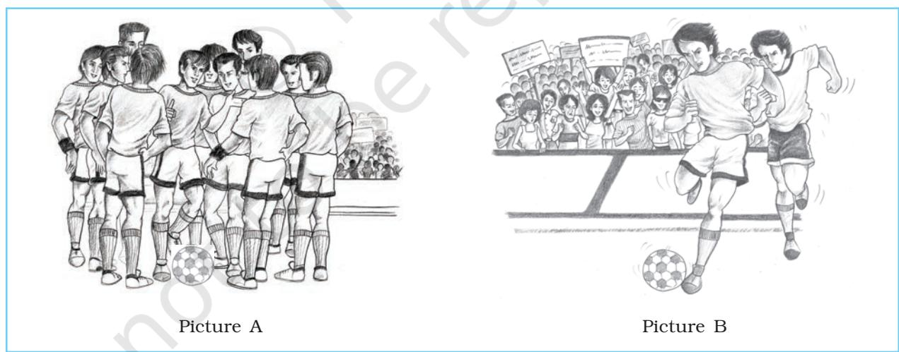

# SOCIAL INFLUENCE AND GROUP PROCESSES

- understand the nature and types of groups and know how they are formed, and
- examine the influence of group on individual behaviour.

# CONTENTS

Psychology 120

Introduction Nature and Formation of Groups *Groupthink* (Box 7.1) Type of Groups *The Minimal Group Paradigm Experiments* (Box 7.2) Influence of Group on Individual Behaviour Social Loafing Group Polarisation

Key Terms Summary Review Questions Project Ideas Weblinks Pedagogical Hints *Think about your day-to-day life and the various social interactions you have. In the morning, before going to school, you interact with your family members; in school, you discuss topics and issues with your teachers and classmates; and after school you phone up, visit or play with your friends. In each of these instances, you are part of a group which not only provides you the needed support and comfort but also facilitates your growth and development as an individual. Have you ever been away to a place where you were without your family, school, and friends? How did you feel? Did you feel there was something vital missing in your life?*

 *Our lives are influenced by the nature of group membership we have. It is, therefore, important to be part of groups which would influence us positively and help us in becoming good citizens. In this chapter, we shall try to understand what groups are and how they influence our behaviour. At this point, it is also important to acknowledge that not only do others influence us, but we, as individuals, are also capable of changing others and the society.*

#### NATURE AND FORMATION OF GROUPS

#### What is a Group?

The preceding introduction illustrates the importance of groups in our lives. One question that comes to mind is: "How are groups (e.g., your family, class, and the group with which you play) different from other collections of people?" For example, people who have assembled to watch a cricket match or your school function are at one place, but are not interdependent on each other. They do not have defined roles, status and expectations from each other. In the case of your family, class, and the group with which you play, you will realise that there is mutual interdependence, each member has roles, there are status differentials, and there are expectations from each other. Thus, your family, class and playgroup are examples of groups and are different from other collections of people.

*A group may be defined as an organised system of two or more individuals, who are interacting and interdependent, who have common motives, have a set of role relationships among its members, and have norms that regulate the behaviour of its members.*

 Groups have the following salient characteristics :

- A social unit consisting of two or more individuals who perceive themselves as belonging to the group. This characteristic of the group helps in distinguishing one group from the other and gives the group its unique identity.
- A collection of individuals who have common motives and goals. Groups function either working towards a given goal, or away from certain threats facing the group.
- A collection of individuals who are interdependent, i.e. what one is doing may have consequences for others.

Introduction

Suppose one of the fielders in a cricket team drops an important catch during a match — this will have consequence for the entire team.

- Individuals who are trying to satisfy a need through their joint association also influence each other.
- A gathering of individuals who interact with one another either directly or indirectly.
- A collection of individuals whose interactions are structured by a set of roles and norms. This means that the group members perform the same functions every time the group meets and the group members adhere to group norms. Norms tell us how we ought to behave in the group and specify the behaviours expected from group members.

Groups can be differentiated from other collections of people. For example, a crowd is also a collection of people who may be present at a place/situation by chance. Suppose you are going on the road and an accident takes place. Soon a large number of people tend to collect. This is an example of a crowd. There is neither any structure nor feeling of belongingness in a crowd. Behaviour of people in crowds is irrational and there is no interdependence among members.

Teams are special kinds of groups. Members of teams often have complementary skills and are committed to a common goal or purpose. Members are mutually accountable for their activities. In teams, there is a positive synergy attained through the coordinated efforts of the members. The main differences between groups and teams are:

- In groups, performance is dependent on contributions of individual members. In teams, both individual contributions and teamwork matter.
- In groups, the leader or whoever is heading the group holds responsibility for the work. However in teams, although there is a leader, members hold themselves responsible.

*Fig.7.1 : Look at these Two Pictures*

*Picture A shows a football team — a group in which members interact with one another, have roles and goals. Picture B depicts an audience watching the football match — a mere collection of people who by some coincidence (may be their interest in football) happened to be in the same place at the same time.*

Psychology 122

An audience is also a collection of people who have assembled for a special purpose, may be to watch a cricket match or a movie. Audiences are generally passive but sometimes they go into a frenzy and become mobs. In mobs, there is a definite sense of purpose. There is polarisation in attention, and actions of persons are in a common direction. Mob behaviour is characterised by homogeneity of thought and behaviour as well as impulsivity.

# Why Do People Join Groups?

All of you are members of your family, class and groups with which you interact or play. Similarly, other people are also members of a number of groups at any given time. Different groups satisfy different needs, and therefore, we are simultaneously members of different groups. This sometimes creates pressures for us because there may be competing demands and expectations. Most often we are able to handle these competing demands and expectations. People join groups because these groups satisfy a range of needs. In general, people join groups for the following reasons :

- Security : When we are alone, we feel insecure. Groups reduce this insecurity. Being with people gives a sense of comfort, and protection. As a result, people feel stronger, and are less vulnerable to threats.
- Status : When we are members of a group that is perceived to be important by others, we feel recognised and experience a sense of power. Suppose your school wins in an inter institutional debate competition, you feel proud and think that you are better than others.
- Self-esteem : Groups provide feelings of self-worth and establish a positive social identity. Being a member of prestigious groups enhances one's self-concept.
- Satisfaction of one's psychological and social needs : Groups satisfy one's social and psychological needs such as sense of belongingness, giving and receiving attention, love, and power through a group.
- Goal achievement : Groups help in achieving such goals which cannot be attained individually. There is power in the majority.
- Provide knowledge and information : Group membership provides knowledge and information and thus broadens our view. As individuals, we may not have all the required information. Groups supplement this information and knowledge.

# Group Formation

In this section, we will see how groups are formed. Basic to group formation is some contact and some form of interaction between people. This interaction is facilitated by the following conditions:

- Proximity : Just think about your group of friends. Would you have been friends if you were not living in the same colony, or going to the same school, or may be playing in the same playground? Probably your answer would be 'No'. Repeated interactions with the same set of individuals give us a chance to know them, and their interests and attitudes. Common interests, attitudes, and background are important determinants of your liking for your group members.
- Similarity : Being exposed to someone over a period of time makes us assess our similarities and paves the way for formation of groups. Why do we like people who are similar? Psychologists have given several explanations for this. One explanation is that people prefer consistency and like relationships that are consistent. When two people are

similar, there is consistency and they start liking each other. For example, you like playing football and another person in your class also loves playing football; there is a matching of your interests. There are higher chances that you may become friends. Another explanation given by psychologists is that when we meet similar people, they reinforce and validate our opinions and values, we feel we are right and thus we start liking them. Suppose you are of the opinion that too much watching of television is not good, because it shows too much violence. You meet someone who also has similar views. This validates your opinion, and you start liking the person who was instrumental in validating your opinion.

- Common motives and goals : When people have common motives or goals, they get together and form a group which may facilitate their goal attainment. Suppose you want to teach children in a slum area who are unable to go to school. You cannot do this alone because you have your own studies and homework. You, therefore, form a group of like-minded friends and start teaching these children. So you have been able to achieve what you could not have done alone.
### *Stages of Group Formation*

Remember that, like everything else in life, groups develop. You do not become a group member the moment you come together. Groups usually go through different stages of *formation*, *conflict*, *stabilisation*, *performance,* and *dismissal*. Tuckman suggested that groups pass through five developmental sequences. These are: forming, storming, norming, performing and adjourning.

- When group members first meet, there is a great deal of uncertainty about the
group, the goal, and how it is to be achieved. People try to know each other and assess whether they will fit in. There is excitement as well as apprehensions. This stage is called the forming stage.

- Often, after this stage, there is a stage of intragroup conflict which is referred to as storming. In this stage, there is conflict among members about how the target of the group is to be achieved, who is to control the group and its resources, and who is to perform what task. When this stage is complete, some sort of hierarchy of leadership in the group develops and a clear vision as to how to achieve the group goal.
- The storming stage is followed by another stage known as norming. Group members by this time develop norms related to group behaviour. This leads to development of a positive group identity.
- The fourth stage is performing. By this time, the structure of the group has evolved and is accepted by group members. The group moves towards achieving the group goal. For some groups, this may be the last stage of group development.
- However, for some groups, for example, in the case of an organising committee

Activity 7.1

#### *Identifying Stages of Group Formation*

*Select 10 members from your class randomly and form a committee to plan an open house. See how they go ahead. Give them full autonomy to do all the planning. Other members of the class observe them as they function.*

*Do you see any of these stages emerging? Which were those? What was the order of stages? Which stages were skipped?*

*Discuss in the class.*

Psychology 124

for a school function, there may be another stage known as adjourning stage. In this stage, once the function is over, the group may be disbanded.

However, it must be stated that all groups do not always proceed from one stage to the next in such a systematic manner. Sometimes several stages go on simultaneously, while in other instances groups may go back and forth through the various stages or they may just skip some of the stages.

During the process of group formation, groups also develop a structure. We should remember that group structure develops as members interact. Over time this interaction shows regularities in distribution of task to be performed, responsibilities assigned to members, and the prestige or relative status of members.

Box

Four important elements of group structure are :

- Roles are socially defined expectations that individuals in a given situation are expected to fulfil. Roles refer to the typical behaviour that depicts a person in a given social context. You have the role of a son or a daughter and with this role, there are certain *role expectations*, i.e. including the behaviour expected of someone in a particular role. As a daughter or a son, you are expected to respect elders, listen to them, and be responsible towards your studies.
- Norms are expected standards of behaviour and beliefs established, agreed upon, and enforced by group members. They may be considered as a group's 'unspoken rules'. In your family, there are norms that guide the behaviour of family members. These

#### 7.1 Groupthink

Generally teamwork in groups leads to beneficial results. However, Irving Janis has suggested that cohesion can interfere with effective leadership and can lead to disastrous decisions. Janis discovered a process known as "groupthink" in which a group allows its concerns for unanimity. They, in fact, "override the motivation to realistically appraise courses of action". It results in the tendency of decision makers to make irrational and uncritical decisions. Groupthink is characterised by the appearance of consensus or unanimous agreement within a group. Each member believes that all members agree upon a particular decision or a policy. No one expresses dissenting opinion because each person believes it would undermine the cohesion of the group and s/he would be unpopular. Studies have shown that such a group has an exaggerated sense of its own power to control events, and tends to ignore or minimise cues from the real world that suggest danger to its plan. In order to preserve the group's internal harmony and collective well-being, it becomes increasingly out-of-touch with reality. Groupthink is likely to occur in socially homogenous, cohesive groups that are isolated from outsiders, that have no tradition of considering alternatives, and that face a decision with high costs or failures. Examples of several group decisions at the international level can be cited as illustrations of groupthink phenomenon. These decisions turned out to be major fiascos. The Vietnam War is an example. From 1964 to 1967, President Lyndon Johnson and his advisors in the U.S. escalated the Vietnam War thinking that this would bring North Vietnam to the peace table. The escalation decisions were made despite warnings. The grossly miscalculated move resulted in the loss of 56,000 American and more than one million Vietnamese lives and created huge budget deficits. Some ways to counteract or prevent groupthink are: (i) encouraging and rewarding critical thinking and even disagreement among group members, (ii) encouraging groups to present alternative courses of action, (iii) inviting outside experts to evaluate the group's decisions, and (iv) encouraging members to seek feedback from trusted others.

norms represent shared ways of viewing the world.

- Status refers to the relative social position given to group members by others. This relative position or status may be either *ascribed* (given may be because of one's seniority) or *achieved* (the person has achieved status because of expertise or hard work). By being members of the group, we enjoy the status associated with that group. All of us, therefore, strive to be members of such groups which are high in status or are viewed favourably by others. Even within a group, different members have different prestige and status. For example, the captain of a cricket team has a higher status compared to the other members, although all are equally important for the team's success.
- Cohesiveness refers to togetherness, binding, or mutual attraction among group members. As the group becomes more cohesive, group members start to think, feel and act as a social unit, and less like isolated individuals. Members of a highly cohesive group have a greater desire to remain in the group in comparison to those who belong to low cohesive groups. Cohesiveness refers to the team spirit or 'we feeling' or a sense of belongingness to the group. It is difficult to leave a cohesive group or to gain membership of a group which is highly cohesive. Extreme cohesiveness however, may sometimes not be in a group's interest. Psychologists have identified the phenomenon of groupthink (see Box 7.1) which is a consequence of extreme cohesiveness.

#### TYPE OF GROUPS

Groups differ in many respects; some have a large number of members (e.g., a country), some are small (e.g., a family),

Psychology 126

some are short-lived (e.g., a committee), some remain together for many years (e.g., religious groups), some are highly organised (e.g., army, police, etc.), and others are informally organised (e.g., spectators of a match). People may belong to different types of group. Major types of groups are enumerated below :

- primary and secondary groups
- formal and informal groups
- ingroup and outgroup.

#### Primary and Secondary Groups

A major difference between primary and secondary groups is that primary groups are pre-existing formations which are usually given to the individual whereas secondary groups are those which the individual joins by choice. Thus, family, caste, and religion are primary groups whereas membership of a political party is an example of a secondary group. In a primary group, there is a face-to-face interaction, members have close physical proximity, and they share warm emotional bonds. Primary groups are central to individual's functioning and have a very major role in developing values and ideals of the individual during the early stages of development. In contrast, secondary groups are those where relationships among members are more impersonal, indirect, and less frequent. In the primary group, boundaries are less permeable, i.e. members do not have the option to choose its membership as compared to secondary groups where it is easy to leave and join another group.

#### Formal and Informal Groups

These groups differ in the degree to which the functions of the group are stated explicitly and formally. The functions of a formal group are explicitly stated as in the case of an office organisation. The roles to be performed by group members are stated

in an explicit manner. The formal and informal groups differ on the basis of structure. The formation of formal groups is based on some specific rules or laws and members have definite roles. There are a set of norms which help in establishing order. A university is an example of a formal group. On the other hand, the formation of informal groups is not based on rules or laws and there is close relationship among members.

#### Ingroup and Outgroup

Box

Just as individuals compare themselves with others in terms of similarities and differences with respect to what they have and what others have, individuals also compare the group they belong to with groups of which they are not a member. The term 'ingroup' refers to one's own group, and 'outgroup' refers to another group. For ingroup members, we use the word 'we' while for outgroup members, the word 'they' is used. By using the words they and we, one is categorising people as similar or different. It has been found that persons in the ingroup are generally supposed to be similar, are viewed favourably, and have desirable traits. Members of the outgroup are viewed differently and are often perceived negatively in comparison to the ingroup members. Perceptions of ingroup and outgroup affect our social lives. These differences can be easily understood by studying Tajfel's experiments given in Box 7.2.

Although it is common to make these categorisations, it should be appreciated that these categories are not real and are created by us. In some cultures, plurality is celebrated as has been the case in India. We have a unique composite culture which is reflected not only in the lives we live, but also in our art, architecture, and music.

#### *Ingroup and Outgroup Distinctions*

*Think of any interinstitutional competition held in the near past. Ask your friends to write a paragraph about your school and its students, and about another school and students of that school. Ask the class and list the behaviour and characteristics of your schoolmates, and students of the other school on the board. Observe the differences and discuss in the class. Do you also see similarities? If yes, discuss them too.*

#### 7.2 The Minimal Group Paradigm Experiments

Tajfel and his colleagues were interested in knowing the minimal conditions for intergroup behaviour. 'Minimal group paradigm' was developed to answer this question. British schoolboys expressed their preference for paintings by two artists — Vassily Kandinsky and Paul Klee. Children were told that it was an experiment on decision-making. They knew the groups in which they were grouped (*Kandinsky group* and *Klee group*). The identity of other group members was hidden using code numbers. The children then distributed money between recipients only by code number and group membership.

Sample distribution matrix : Ingroup member — 7 8 9 10 11 12 13 14 15 16 17 18 19 Outgroup member — 1 3 5 7 9 11 13 15 17 19 21 23 25

You will agree that these groups were created on a flimsy criterion (i.e. preference for paintings by two artists) which had no past history or future. Yet, results showed that children favoured their own group.

Chapter 7 • *Social Influence and Group Processes*

Activity 7.2

# INFLUENCE OF GROUP ON INDIVIDUAL BEHAVIOUR

We have seen that groups are powerful as they are able to influence the behaviour of individuals. What is the nature of this influence? What impact does the presence of others have on our performance? We will discuss two situations : (i) an individual performing an activity alone in the presence of others (social facilitation), and (ii) an individual performing an activity along with the others as part of a larger group (social loafing).

# Social Loafing

Social facilitation research suggests that presence of others leads to arousal and can motivate individuals to enhance their performance if they are already good at solving something. This enhancement occurs when a person's efforts are individually evaluated. What would happen if efforts of an individual in a group are pooled so that you look at the performance of the group as a whole? Do you know what often happens? It has been found that individuals work less hard in a group than they do when performing alone. This points to a phenomenon referred to as *'social loafing'*. Social loafing is a reduction in individual effort when working on a collective task, i.e. one in which outputs are pooled with those of other group members. An example of such a task is the game of tug-of-war. It is not possible for you to identify how much force each member of the team has been exerting. Such situations give opportunities to group members to relax and become a free rider. This phenomenon has been demonstrated in many experiments by Latane and his associates who asked group of male students to clap or cheer as loudly as possible as they *(experimenters)* were interested in knowing how much noise people make in social settings. They varied the group size; individuals were either alone, or in groups of two, four and six. The results of the study showed that although the total amount of noise rose up, as size increased, the amount of noise produced by each participant dropped. In other words, each participant put in less effort as the group size increased. Why does social loafing occur? The explanations offered are:

- Group members feel less responsible for the overall task being performed and therefore exert less effort.
- Motivation of members decreases because they realise that their contributions will not be evaluated on individual basis.
- The performance of the group is not to be compared with other groups.
- There is an improper coordination (or no coordination) among members.
- Belonging to the same group is not important for members. It is only an aggregate of individuals.

Social loafing may be reduced by:

- Making the efforts of each person identifiable.
- Increasing the pressure to work hard (making group members committed to successful task performance).
- Increasing the apparent importance or value of a task.
- Making people feel that their individual contribution is important.
- Strengthening group cohesiveness which increases the motivation for successful group outcome.

## Group Polarisation

We all know that important decisions are taken by groups and not by individuals alone. For example, a decision is to be

Psychology 128

taken whether a school has to be established in a village. Such a decision has to be a group decision. We have also seen that when groups take decisions, there is a fear that the phenomenon of groupthink may sometimes occur (see Box 7.1). Groups show another tendency referred to as '*group polarisation'*. It has been found that groups are more likely to take extreme decisions than individuals alone. Suppose there is an employee who has been caught taking bribe or engaging in some other unethical act. Her/his colleagues are asked to decide on what punishment s/ he should be given. They may let her/ him go scot-free or decide to terminate her/his services instead of imposing a punishment which may be commensurate with the unethical act s/ he had engaged in. Whatever the initial position in the group, this position becomes much stronger as a result of discussions in the group. This strengthening of the group's initial position as a result of group interaction and discussion is referred to as group polarisation. This may sometimes have dangerous repercussions as groups may take extreme positions, i.e. from very weak to very strong decisions.

Why does group polarisation occur? Let us take an example whether capital punishment should be there. Suppose you favour capital punishment for heinous crimes, what would happen if you were interacting with and discussing this issue with like-minded people? After this interaction, your views may become stronger. This firm conviction is because of the following three reasons:

- In the company of like-minded people, you are likely to hear newer arguments favouring your viewpoints. This will make you more favourable towards capital punishment.
- When you find others also favouring capital punishment, you feel that this view is validated by the public. This is a sort of bandwagon effect.
- When you find people having similar views, you are likely to perceive them as ingroup. You start identifying with the group, begin showing conformity, and as a consequence your views become strengthened.

#### *Assessing Polarisation*

*Give the class a short, 5-item attitude scale developed by your teacher to assess attitudes towards capital punishment. Based on their responses, divide the class into two groups, i.e. those pro-capital punishment and those anti-capital punishment. Now seat these groups into two different rooms and ask them to discuss a recent case in which death sentence has been given by the court. See how the discussion proceeds in the two groups. After the discussion, re-administer the attitude scale to the group members. Examine if, in both groups, positions have hardened in comparison to their initial position as a result of group discussion.*

#### Key Terms

Cohesiveness, Conflict, Goal achievement, Group, Group formation, Groupthink, Identity, Ingroup, Interdependence, Norms, Proximity, Roles, Social influence, Social loafing, Status, Structure.

Chapter 7 • *Social Influence and Group Processes*

Activity 7.3

- *Groups are different from other collections of people. Mutual interdependence, roles, status, and expectations are the main characteristics of groups.*
- *Groups are organised systems of two or more individuals.*
- *People join groups because they provide security, status, self-esteem, satisfaction of one's psychological and social needs, goal achievement, and knowledge and information.*
- *Proximity, similarity, and common motives and goals facilitate group formation.*
- *Generally, group work leads to beneficial results. However, sometimes in cohesive and homogeneous groups, the phenomenon of groupthink may occur.*
- *Groups are of different types, i.e. primary and secondary, formal and informal, and ingroup and outgroup.*
- *Groups influence individual behaviour. Social facilitation and social loafing are two important influences of groups.*

#### Review Questions

- 1. Compare and contrast formal and informal groups, and ingroups and outgroups.
- 2. Are you a member of a certain group? Discuss what motivated you to join that group.
- 3. How does Tuckman's stage model help you to understand the formation of groups?
- 4. How do groups influence our behaviour?
- 5. How can you reduce social loafing in groups? Think of any two incidents of social loafing in school. How did you overcome it?

- Idea 1. Identify any Test series in cricket which India played recently. Collect the newspapers of that period. Evaluate the reviews of the matches and comments made by Indian and rival commentators. Do you see any difference between the comments?

# Weblinks

http://www.mapnp.org/library/grp_skill/theory/theory.htm http://www.socialpsychology.org/social.htm

Psychology 130

#### Pedagogical Hints

- 1. In the topic of nature and formation of groups, students should be made to understand the importance of groups in real-life. Here, it needs to be emphasised that they should be careful in choosing groups. Teachers can ask a few students how they have become members of different groups, and what do they get from membership in these groups.
- 2. For explaining social loafing, simple experiments can be conducted in the class by asking students to perform some activities in groups and then asking them about their contributions in the activities undertaken. Learning experience for students should be on ways to avoid social loafing.

