*"Facts are not science — as the dictionary is not literature." Martin H. Fischer*


C onsider the following situations of daily life and think what happens when –

- n milk is left at room temperature during summers.
- n an iron tawa/pan/nail is left exposed to humid atmosphere.
- n grapes get fermented.
- n food is cooked.
- n food gets digested in our body.
- n we respire.

In all the above situations, the nature and the identity of the initial substance have somewhat changed. We have already learnt about physical and chemical changes of matter in our previous classes. Whenever a chemical change occurs, we can say that a chemical reaction has taken place.

You may perhaps be wondering as to what is actually meant by a chemical reaction. How do we come to know that a chemical reaction has taken place? Let us perform some activities to find the answer to these questions.

## Activity 1.1

CAUTION: This Activity needs the teacher's assistance. It would be better if students wear suitable eyeglasses.

- n Clean a magnesium ribbon about 3-4 cm long by rubbing it with sandpaper.
- n Hold it with a pair of tongs. Burn it using a spirit lamp or burner and collect the ash so formed in a watch-glass as shown in Fig. 1.1. Burn the magnesium ribbon keeping it away as far as possible from your eyes.
- n What do you observe?

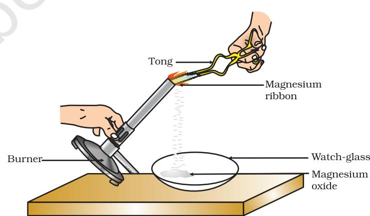

#### *Figure 1.1 Burning of a magnesium ribbon in air and collection of magnesium oxide in a watch-glass*

You must have observed that magnesium ribbon burns with a dazzling white flame and changes into a white powder. This powder is magnesium oxide. It is formed due to the reaction between magnesium and oxygen present in the air.

#### Activity 1.2

- n Take lead nitrate solution in a test tube.
- n Add potassium iodide solution to this.
- n What do you observe?

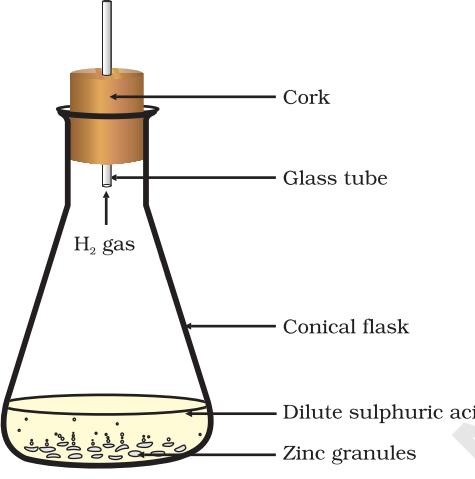

## Activity 1.3

- n Take a few zinc granules in a conical flask or a test tube.
- n Add dilute hydrochloric acid or sulphuric acid to this (Fig. 1.2).
	- CAUTION: Handle the acid with care.
- n Do you observe anything happening around the zinc granules?
- n Touch the conical flask or test tube. Is there any change in its temperature?

From the above three activities, we can say that any of the following observations helps us to determine whether a chemical reaction has taken place –

- n change in state
- n change in colour
- n evolution of a gas
- n change in temperature.

As we observe the changes around us, we can see that there is a large variety of chemical reactions taking place around us. We will study about the various types of chemical reactions and their symbolic representation in this Chapter.

## 1.1 CHEMICAL EQUATIONS

Activity 1.1 can be described as – when a magnesium ribbon is burnt in oxygen, it gets converted to magnesium oxide. This description of a chemical reaction in a sentence form is quite long. It can be written in a shorter form. The simplest way to do this is to write it in the form of a word-equation.

The word-equation for the above reaction would be –

  
  
**Magnesium + Oxygen $\rightarrow$ Magnesium oxide (1.1) (Reactants) (Product)**

The substances that undergo chemical change in the reaction (1.1), magnesium and oxygen, are the reactants. The new substance is magnesium oxide, formed during the reaction, as a product.

A word-equation shows change of reactants to products through an arrow placed between them. The reactants are written on the left-hand side (LHS) with a plus sign (+) between them. Similarly, products are written on the right-hand side (RHS) with a plus sign (+) between them. The arrowhead points towards the products, and shows the direction of the reaction.

#### *Figure 1.2*

*Formation of hydrogen gas by the action of dilute sulphuric acid on zinc*

#### 1.1.1 Writing a Chemical Equation

Is there any other shorter way for representing chemical equations? Chemical equations can be made more concise and useful if we use chemical formulae instead of words. A chemical equation represents a chemical reaction. If you recall formulae of magnesium, oxygen and magnesium oxide, the above word-equation can be written as –

$\rm Mg+O_{2}\ \rightarrow\ MgO$

Count and compare the number of atoms of each element on the LHS and RHS of the arrow. Is the number of atoms of each element the same on both the sides? If yes, then the equation is balanced. If not, then the equation is unbalanced because the mass is not the same on both sides of the equation. Such a chemical equation is a skeletal chemical equation for a reaction. Equation (1.2) is a skeletal chemical equation for the burning of magnesium in air.

#### 1.1.2 Balanced Chemical Equations

Recall the law of conservation of mass that you studied in Class IX; mass can neither be created nor destroyed in a chemical reaction. That is, the total mass of the elements present in the products of a chemical reaction has to be equal to the total mass of the elements present in the reactants.

In other words, the number of atoms of each element remains the same, before and after a chemical reaction. Hence, we need to balance a skeletal chemical equation. Is the chemical Eq. (1.2) balanced? Let us learn about balancing a chemical equation step by step.

The word-equation for Activity 1.3 may be represented as –

```
Zinc + Sulphuric acid → Zinc sulphate + Hydrogen
```
The above word-equation may be represented by the following chemical equation –

#### Zn + H2 SO4 → ZnSO4 + H2

Let us examine the number of atoms of different elements on both sides of the arrow.

| Element | Number of atoms in reactants (LHS) | Number of atoms in products (RHS) |
| --- | --- | --- |
| Zn | 1 | 1 |
| H | 2 | 2 |
| S | 1 | 1 |
| O | 4 | 4 |

As the number of atoms of each element is the same on both sides of the arrow, Eq. (1.3) is a balanced chemical equation.

Let us try to balance the following chemical equation –

Fe + H2O → Fe3O4 + H2

(1.4)

(1.3)

Step I: To balance a chemical equation, first draw boxes around each formula. Do not change anything inside the boxes while balancing the equation.

$$\begin{array}{c}\mbox{Fe}\ +\ \mbox{H}_{2}\mbox{O}\ \rightarrow\ \mbox{Fe}_{3}\mbox{O}_{4}\ +\ \mbox{H}_{2}\end{array}\tag{1.5}$$

Step II: List the number of atoms of different elements present in the unbalanced equation (1.5).

| Element | Number of atoms | Number of atoms |
| --- | --- | --- |
|  | in reactants (LHS) | in products (RHS) |
| Fe | 1 | 3 |
| H | 2 | 2 |
| O | 1 | 4 |

Step III: It is often convenient to start balancing with the compound that contains the maximum number of atoms. It may be a reactant or a product. In that compound, select the element which has the maximum number of atoms. Using these criteria, we select Fe3O4 and the element oxygen in it. There are four oxygen atoms on the RHS and only one on the LHS.

To balance the oxygen atoms –

| Atoms of |  | In reactants | In products |
| --- | --- | --- | --- |
| oxygen |  |  |  |
| (i) | Initial | 1 (in H2O) | ) 4 (in Fe3O4 |
| (ii) | To balance | 1×4 | 4 |

To equalise the number of atoms, it must be remembered that we cannot alter the formulae of the compounds or elements involved in the reactions. For example, to balance oxygen atoms we can put coefficient '4' as 4 H2O and not H2O4 or (H2O)4 . Now the partly balanced equation becomes –

$$\begin{array}{r l}{\mathbf{Fe}}&{{}+\mathbf{\nabla}4\left[\mathbf{H}_{2}\mathbf{O}\right]\to\left[\mathbf{Fe}_{3}\mathbf{O}_{4}\right]+\left[\mathbf{H}_{2}\right]}\end{array}$$

#### (1.6) (partly balanced equation)

Step IV: Fe and H atoms are still not balanced. Pick any of these elements to proceed further. Let us balance hydrogen atoms in the partly balanced equation.

To equalise the number of H atoms, make the number of molecules of hydrogen as four on the RHS.

| Atoms of |  | In reactants | In products |
| --- | --- | --- | --- |
| hydrogen |  |  |  |
| (i) | Initial | 8 (in 4 H2O) | ) 2 (in H2 |
| (ii) | To balance | 8 | 2 × 4 |

+ 4 H2

The equation would be –

Fe + 4 H2O → Fe3O4

Step V: Examine the above equation and pick up the third element which is not balanced. You find that only one element is left to be balanced, that is, iron.

|  | Atoms of | In reactants | In products |
| --- | --- | --- | --- |
|  | iron |  |  |
| (i) | Initial | 1 (in Fe) | 3 (in Fe3O4 ) |
| (ii) | To balance | 1×3 | 3 |

To equalise Fe, we take three atoms of Fe on the LHS.

* [3]Fe + 4 [H${}_{2}$O] $\rightarrow$[Fe${}_{3}$O] + 4 [H${}_{2}$]

Step VI: Finally, to check the correctness of the balanced equation, we count atoms of each element on both sides of the equation.

> 3Fe + 4H2O → Fe3O4 + 4H2

(1.9) (balanced equation)

The numbers of atoms of elements on both sides of Eq. (1.9) are equal. This equation is now balanced. This method of balancing chemical equations is called hit-and-trial method as we make trials to balance the equation by using the smallest whole number coefficient.

Step VII: *Writing Symbols of Physical States* Carefully examine the above balanced Eq. (1.9). Does this equation tell us anything about the physical state of each reactant and product? No information has been given in this equation about their physical states.

To make a chemical equation more informative, the physical states of the reactants and products are mentioned along with their chemical formulae. The gaseous, liquid, aqueous and solid states of reactants and products are represented by the notations (g), (l), (aq) and (s), respectively. The word aqueous (aq) is written if the reactant or product is present as a solution in water.

The balanced Eq. (1.9) becomes

  
  
**3Fe(s) + 4H${}_{2}$O(g) - Fe${}_{3}$O${}_{4}$(s) + 4H${}_{2}$(g)**

(g) (1.10)

Note that the symbol (g) is used with H2O to indicate that in this reaction water is used in the form of steam.

Usually physical states are not included in a chemical equation unless it is necessary to specify them.

Sometimes the reaction conditions, such as temperature, pressure, catalyst, etc., for the reaction are indicated above and/or below the arrow in the equation. For example –

CO(g) + 2H2(g) 340 atm CH2OH(l) (1.11)

6CO (aq) 12H O(l) 2 + 2 C H O (aq) 6O 6 12 6 + Sunlight Chlorophyll → 2 2 (aq) 6H O(l) + (1.12) (Glucose)

Using these steps, can you balance Eq. (1.2) given in the text earlier?

# QUESTIONS

1. Why should a magnesium ribbon be cleaned before burning in air?

- 2. Write the balanced equation for the following chemical reactions.
	- (i) Hydrogen + Chlorine → Hydrogen chloride
	- (ii) Barium chloride + Aluminium sulphate → Barium sulphate + Aluminium chloride
	- (iii) Sodium + Water → Sodium hydroxide + Hydrogen
- 3. Write a balanced chemical equation with state symbols for the following reactions.
	- (i) Solutions of barium chloride and sodium sulphate in water react to give insoluble barium sulphate and the solution of sodium chloride.
	- (ii) Sodium hydroxide solution (in water) reacts with hydrochloric acid solution (in water) to produce sodium chloride solution and water.

## 1.2 TYPES OF CHEMICAL REACTIONS

We have learnt in Class IX that during a chemical reaction atoms of one element do not change into those of another element. Nor do atoms disappear from the mixture or appear from elsewhere. Actually, chemical reactions involve the breaking and making of bonds between atoms to produce new substances. You will study about types of bonds formed between atoms in Chapters 3 and 4.

1.2.1 Combination Reaction

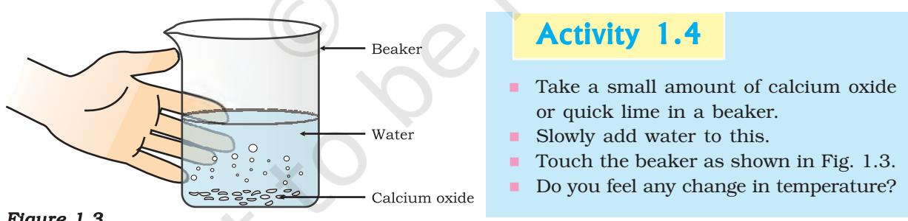

#### *Figure 1.3*

*Formation of slaked lime by the reaction of calcium oxide with water*

Calcium oxide reacts vigorously with water to produce slaked lime (calcium hydroxide) releasing a large amount of heat.

CaO(s) + H${}_{2}$O(l) $\rightarrow$ Ca(OH)${}_{2}$(aq) + Heat (1.13) (Quick lime) (Slaked lime)

In this reaction, calcium oxide and water combine to form a single product, calcium hydroxide. Such a reaction in which a single product is formed from two or more reactants is known as a combination reaction.

?

A solution of slaked lime produced by the reaction 1.13 is used for whitewashing walls. Calcium hydroxide reacts slowly with the carbon dioxide in air to form a thin layer of calcium carbonate on the walls. Calcium carbonate is formed after two to three days of whitewashing and gives a shiny finish to the walls. It is interesting to note that the chemical formula for marble is also CaCO3 .

| Ca(OH)2 | (g) | (aq) + CO2 |  | CaCO3 |  |  | (1.14) |
| --- | --- | --- | --- | --- | --- | --- | --- |
| (Calcium |  |  |  | (Calcium |  |  |  |
| hydroxide) |  |  |  | carbonate) |  |  |  |
|  |  |  | → |  |  |  |  |
|  |  |  |  |  | (s) |  |  |
|  |  |  |  |  |  | + H2O(l) |  |

Let us discuss some more examples of combination reactions.

- (i) Burning of coal
C(s) + O2 (g) → CO2

(g) (1.15)

- (ii) Formation of water from H2 (g) and O2 (g)
2H2 (g) + O2 (g) → 2H2O(l) (1.16)

In simple language we can say that when two or more substances (elements or compounds) combine to form a single product, the reactions are called combination reactions.

In Activity 1.4, we also observed that a large amount of heat is evolved. This makes the reaction mixture warm. Reactions in which heat is released along with the formation of products are called exothermic chemical reactions.

Other examples of exothermic reactions are –

- (i) Burning of natural gas
CH4 (g) + 2O2 (g) → CO2 (g) + 2H2O (g) (1.17)

- (ii) Do you know that respiration is an exothermic process?
We all know that we need energy to stay alive. We get this energy from the food we eat. During digestion, food is broken down into simpler substances. For example, rice, potatoes and bread contain carbohydrates. These carbohydrates are broken down to form glucose. This glucose combines with oxygen in the cells of our body and provides energy. The special name of this reaction is respiration, the process of which you will study in Chapter 6.

$\rm C_{6}H_{12}O_{6}(aq)+6O_{2}(aq)\to6CO_{2}(aq)+6H_{2}O(l)+energy$ (1.18)

- (iii) The decomposition of vegetable matter into compost is also an example of an exothermic reaction.
Identify the type of the reaction taking place in Activity 1.1, where heat is given out along with the formation of a single product.


#### *Figure 1.4*

*Correct way of heating the boiling tube containing crystals of ferrous sulphate and of smelling the odour*

Have you noticed that the green colour of the ferrous sulphate crystals has changed? You can also smell the characteristic odour of burning sulphur.

#### 2FeSO4 (s) → Heat Fe2O3 (s) + SO2 (g) + SO3 (g) (1.19) (Ferrous sulphate) (Ferric oxide)

In this reaction you can observe that a single reactant breaks down to give simpler products. This is a decomposition reaction. Ferrous sulphate crystals (FeSO4 . 7H2O) lose water when heated and the colour of the crystals changes. It then decomposes to ferric oxide (Fe2O3 ), sulphur dioxide (SO2 ) and sulphur trioxide (SO3 ). Ferric oxide is a solid, while SO2 and SO3 are gases.

Decomposition of calcium carbonate to calcium oxide and carbon dioxide on heating is an important decomposition reaction used in various industries. Calcium oxide is called lime or quick lime. It has many uses – one is in the manufacture of cement. When a decomposition reaction is carried out by heating, it is called thermal decomposition.

  
  
**CaCO${}_{3}$(s)** **Heat** **CaO(s) + CO${}_{2}$(g)** **(1.20)** **(Limestonel.** **(Quick lime)**

Another example of a thermal decomposition reaction is given in Activity 1.6.

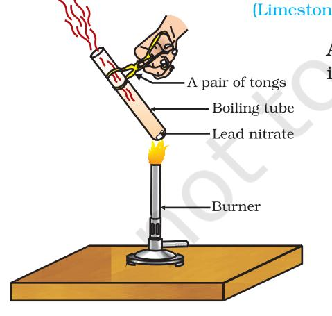

*Figure 1.5 Heating of lead nitrate and emission of nitrogen dioxide*

#### Activity 1.6

- n Take about 2 g lead nitrate powder in a boiling tube.
- n Hold the boiling tube with a pair of tongs and heat it over a flame, as shown in Fig. 1.5.
- n What do you observe? Note down the change, if any.

You will observe the emission of brown fumes. These fumes are of nitrogen dioxide (NO2 ). The reaction that takes place is –

| 2Pb(NO3 2 | ) | (s) | Heat  → | 2PbO(s) | + | 4NO2 | (g) + O2 |  |
| --- | --- | --- | --- | --- | --- | --- | --- | --- |
| (Lead nitrate) |  |  |  | (Lead oxide) |  | (Nitrogen |  | (Oxygen) |

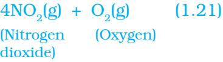

Let us perform some more decomposition reactions as given in Activities 1.7 and 1.8.

## Activity 1.7

- n Take a plastic mug. Drill two holes at its base and fit rubber stoppers in these holes. Insert carbon electrodes in these rubber stoppers as shown in Fig. 1.6.
- n Connect these electrodes to a 6 volt battery.
- n Fill the mug with water such that the electrodes are immersed. Add a few drops of dilute sulphuric acid to the water.
- n Take two test tubes filled with water and invert them over the two carbon electrodes.
- n Switch on the current and leave the apparatus undisturbed for some time.
- n You will observe the formation of bubbles at both the electrodes. These bubbles displace water in the test tubes.
- n Is the volume of the gas collected the same in both the test tubes?
- n Once the test tubes are filled with the respective gases, remove them carefully.
- n Test these gases one by one by bringing a burning candle close to the mouth of the test tubes.

CAUTION: This step must be performed carefully by the teacher.

- n What happens in each case?
- n Which gas is present in each test tube?

## Activity 1.8

- n Take about 2 g silver chloride in a china dish.
- n What is its colour?
- n Place this china dish in sunlight for some time (Fig. 1.7).
- n Observe the colour of the silver chloride after some time.

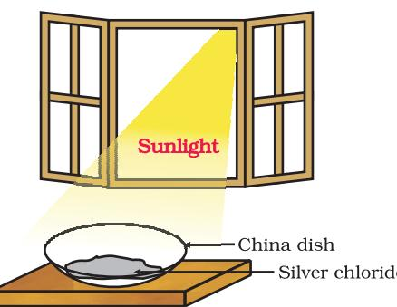

You will see that white silver chloride turns grey in sunlight. This is due to the decomposition of silver chloride into silver and chlorine by light.

*Figure 1.7 Silver chloride turns grey in sunlight to form silver metal*

```
2AgCl(s) Sunlight  →  2Ag(s) + Cl2
```
(g) (1.22)

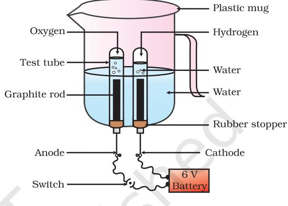

*Figure 1.6 Electrolysis of water*

Silver bromide also behaves in the same way.

2AgBr(s) Sunlight → 2Ag(s) + Br2 (g) (1.23)

The above reactions are used in black and white photography. What form of energy is causing these decomposition reactions?

We have seen that the decomposition reactions require energy either in the form of heat, light or electricity for breaking down the reactants. Reactions in which energy is absorbed are known as endothermic reactions.

#### *Carry out the following Activity*

Take about 2 g barium hydroxide in a test tube. Add 1 g of ammonium chloride and mix with the help of a glass rod. Touch the bottom of the test tube with your palm. What do you feel? Is this an exothermic or endothermic reaction?

# **QUESTIONS**

- 1. A solution of a substance 'X' is used for whitewashing.
	- (i) Name the substance 'X' and write its formula.
	- (ii) Write the reaction of the substance 'X' named in (i) above with water.
- 2. Why is the amount of gas collected in one of the test tubes in Activity 1.7 double of the amount collected in the other? Name this gas.

1.2.3 Displacement Reaction

*Figure 1.8 (a) Iron nails dipped in copper sulphate solution*

## Activity 1.9

- n Take three iron nails and clean them by rubbing with sand paper.
- n Take two test tubes marked as (A) and (B). In each test tube, take about 10 mL copper sulphate solution.
- n Tie two iron nails with a thread and immerse them carefully in the copper sulphate solution in test tube B for about 20 minutes [Fig. 1.8 (a)]. Keep one iron nail aside for comparison.
- n After 20 minutes, take out the iron nails from the copper sulphate solution.
- n Compare the intensity of the blue colour of copper sulphate solutions in test tubes (A) and (B) [Fig. 1.8 (b)].
- n Also, compare the colour of the iron nails dipped in the copper sulphate solution with the one kept aside [Fig. 1.8 (b)].

?

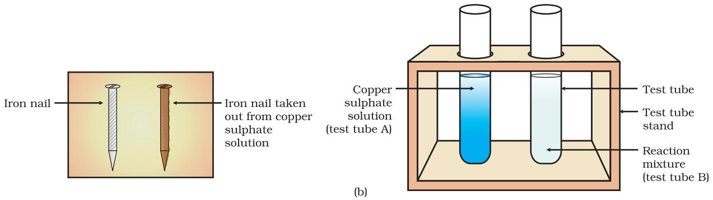

*Figure 1.8 (b) Iron nails and copper sulphate solutions compared before and after the experiment*

Why does the iron nail become brownish in colour and the blue colour of copper sulphate solution fades?

The following chemical reaction takes place in this Activity–

Fe(s) + CuSO4 (aq) → FeSO4 (aq) + Cu(s) (1.24) (Copper sulphate) (Iron sulphate)

In this reaction, iron has displaced or removed another element, copper, from copper sulphate solution. This reaction is known as displacement reaction.

Other examples of displacement reactions are

| Zn(s) + CuSO4 | (aq) → | ZnSO4 | (aq) + | Cu(s) | (1.25) |
| --- | --- | --- | --- | --- | --- |
| (Copper sulphate) |  |  | (Zinc sulphate) |  |  |
| Pb(s) + CuCl2 | (aq) → | PbCl2 | (aq) + | Cu(s) | (1.26) |
| (Copper chloride) |  | (Lead chloride) |  |  |  |

Zinc and lead are more reactive elements than copper. They displace copper from its compounds.

#### 1.2.4 Double Displacement Reaction

sulphate) chloride) sulphate) chloride)

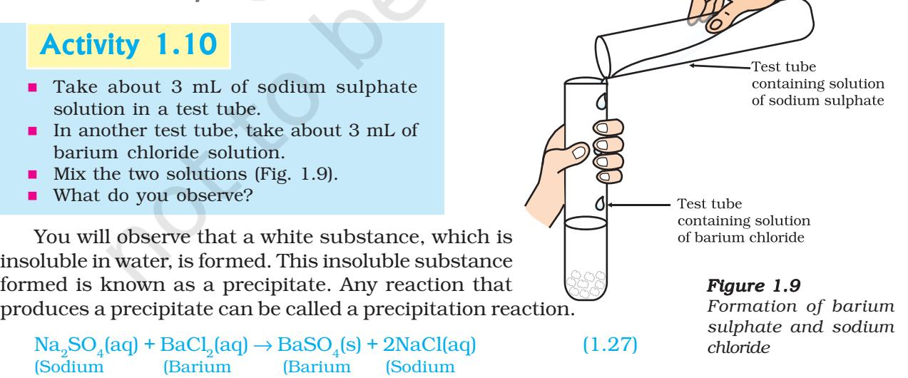

Chemical Reactions and Equations 11

What causes this? The white precipitate of BaSO4 is formed by the reaction of 2– SO4 and Ba2+. The other product formed is sodium chloride which remains in the solution. Such reactions in which there is an exchange of ions between the reactants are called double displacement reactions.

*Recall Activity 1.2*, where you have mixed the solutions of lead(II) nitrate and potassium iodide.

- (i) What was the colour of the precipitate formed? Can you name the compound precipitated?
- (ii) Write the balanced chemical equation for this reaction.
- (iii) Is this also a double displacement reaction?

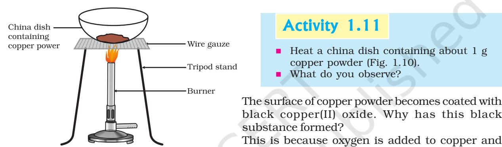

1.2.5 Oxidation and Reduction

*Figure 1.10*

*Oxidation of copper to copper oxide*

#### 2Cu + O2 → Heat 2CuO (1.28)

If hydrogen gas is passed over this heated material (CuO), the black coating on the surface turns brown as the reverse reaction takes place and copper is obtained.

copper oxide is formed.

#### CuO +H Cu+H O 2 2 → Heat (1.29)

If a substance gains oxygen during a reaction, it is said to be oxidised. If a substance loses oxygen during a reaction, it is said to be reduced.

During this reaction (1.29), the copper(II) oxide is losing oxygen and is being reduced. The hydrogen is gaining oxygen and is being oxidised. In other words, one reactant gets oxidised while the other gets reduced during a reaction. Such reactions are called oxidation-reduction reactions or redox reactions.

  
  
\begin{tabular}{c c} \hline \multicolumn{2}{c}{Oxidation} \\ \hline $\mathrm{CuO}+\mathrm{H_{2}}$ & Heat \\ \hline $\mathrm{CuO}+\mathrm{H_{2}}$ & $\mathrm{Cu}+\mathrm{H_{2}O}$ \\ \hline $\mathrm{Reduction}$ & \\ \hline \end{tabular}  
  

Some other examples of redox reactions are:

${\rm ZnO}+{\rm C}\ \rightarrow\ {\rm Zn}+{\rm CO}$ (1.31)

${\rm MnO}_{2}+4{\rm HCl}\rightarrow{\rm MnCl}_{2}+2{\rm H}_{2}{\rm O}+{\rm Cl}_{2}$ (1.32)

In reaction (1.31) carbon is oxidised to CO and ZnO is reduced to Zn. In reaction (1.32) HCl is oxidised to Cl2 whereas MnO2 is reduced to MnCl2 .

From the above examples we can say that if a substance gains oxygen or loses hydrogen during a reaction, it is oxidised. If a substance loses oxygen or gains hydrogen during a reaction, it is reduced.

*Recall Activity 1.1*, where a magnesium ribbon burns with a dazzling flame in air (oxygen) and changes into a white substance, magnesium oxide. Is magnesium being oxidised or reduced in this reaction?

## 1.3 HAVE YOU OBSERVED THE EFFECTS OF OXIDATION REACTIONS IN EVERYDAY LIFE? Y LIFE?

## 1.3.1 Corrosion

You must have observed that iron articles are shiny when new, but get coated with a reddish brown powder when left for some time. This process is commonly known as rusting of iron. Some other metals also get tarnished in this manner. Have you noticed the colour of the coating formed on copper and silver? When a metal is attacked by substances around it such as moisture, acids, etc., it is said to corrode and this process is called corrosion. The black coating on silver and the green coating on copper are other examples of corrosion.

Corrosion causes damage to car bodies, bridges, iron railings, ships and to all objects made of metals, specially those of iron. Corrosion of iron is a serious problem. Every year an enormous amount of money is spent to replace damaged iron. You will learn more about corrosion in Chapter 3.

### 1.3.2 Rancidity

Have you ever tasted or smelt the fat/oil containing food materials left for a long time?

When fats and oils are oxidised, they become rancid and their smell and taste change. Usually substances which prevent oxidation (antioxidants) are added to foods containing fats and oil. Keeping food in air tight containers helps to slow down oxidation. Do you know that chips manufacturers usually flush bags of chips with gas such as nitrogen to prevent the chips from getting oxidised ?

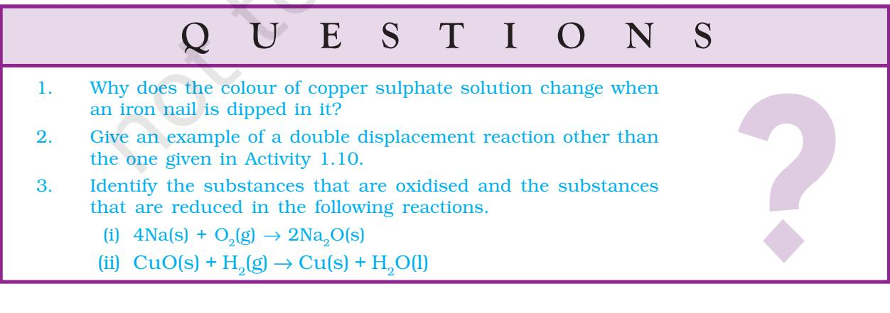

# What you have learnt

- n A complete chemical equation represents the reactants, products and their physical states symbolically.
- n A chemical equation is balanced so that the numbers of atoms of each type involved in a chemical reaction are the same on the reactant and product sides of the equation. Equations must always be balanced.
- n In a combination reaction two or more substances combine to form a new single substance.
- n Decomposition reactions are opposite to combination reactions. In a decomposition reaction, a single substance decomposes to give two or more substances.
- n Reactions in which heat is given out along with the products are called exothermic reactions.
- n Reactions in which energy is absorbed are known as endothermic reactions.
- n When an element displaces another element from its compound, a displacement reaction occurs.
- n Two different atoms or groups of atoms (ions) are exchanged in double displacement reactions.
- n Precipitation reactions produce insoluble salts.
- n Reactions also involve the gain or loss of oxygen or hydrogen by substances. Oxidation is the gain of oxygen or loss of hydrogen. Reduction is the loss of oxygen or gain of hydrogen.

# EXERCISES

- 1. Which of the statements about the reaction below are incorrect? 2PbO(s) + C(s) → 2Pb(s) + CO2 (g)
	- (a) Lead is getting reduced.
	- (b) Carbon dioxide is getting oxidised.
	- (c) Carbon is getting oxidised.
	- (d) Lead oxide is getting reduced.
		- (i) (a) and (b)
		- (ii) (a) and (c)
		- (iii) (a), (b) and (c)
		- (iv) all
- 2. Fe2O3 + 2Al → Al2O3 + 2Fe

The above reaction is an example of a

- (a) combination reaction.
- (b) double displacement reaction.
- (c) decomposition reaction.
- (d) displacement reaction.
- 3. What happens when dilute hydrochloric acid is added to iron fillings? Tick the correct answer.
	- (a) Hydrogen gas and iron chloride are produced.
	- (b) Chlorine gas and iron hydroxide are produced.
	- (c) No reaction takes place.
	- (d) Iron salt and water are produced.
- 4. What is a balanced chemical equation? Why should chemical equations be balanced?
- 5. Translate the following statements into chemical equations and then balance them.
	- (a) Hydrogen gas combines with nitrogen to form ammonia.
	- (b) Hydrogen sulphide gas burns in air to give water and sulpur dioxide.
	- (c) Barium chloride reacts with aluminium sulphate to give aluminium chloride and a precipitate of barium sulphate.
	- (d) Potassium metal reacts with water to give potassium hydroxide and hydrogen gas.
- 6. Balance the following chemical equations.
	- (a) HNO3 +Ca(OH)2 → Ca(NO3 ) 2 + H2O
	- (b) NaOH + H2SO4 → Na2SO4 + H2O
	- (c) NaCl + AgNO3 → AgCl + NaNO3
	- (d) BaCl2 + H2 SO4 → BaSO4 + HCl
- 7. Write the balanced chemical equations for the following reactions.
	- (a) Calcium hydroxide + Carbon dioxide → Calcium carbonate + Water
	- (b) Zinc + Silver nitrate → Zinc nitrate + Silver
	- (c) Aluminium + Copper chloride → Aluminium chloride + Copper
	- (d) Barium chloride + Potassium sulphate → Barium sulphate + Potassium chloride
- 8. Write the balanced chemical equation for the following and identify the type of reaction in each case.
	- (a) Potassium bromide(aq) + Barium iodide(aq) → Potassium iodide(aq) + Barium bromide(s)
	- (b) Zinc carbonate(s) → Zinc oxide(s) + Carbon dioxide(g)
	- (c) Hydrogen(g) + Chlorine(g) → Hydrogen chloride(g)
	- (d) Magnesium(s) + Hydrochloric acid(aq) → Magnesium chloride(aq) + Hydrogen(g)
- 9. What does one mean by exothermic and endothermic reactions? Give examples.
- 10. Why is respiration considered an exothermic reaction? Explain.
- 11. Why are decomposition reactions called the opposite of combination reactions? Write equations for these reactions.
- 12. Write one equation each for decomposition reactions where energy is supplied in the form of heat, light or electricity.
- 13. What is the difference between displacement and double displacement reactions? Write equations for these reactions.
- 14. In the refining of silver, the recovery of silver from silver nitrate solution involved displacement by copper metal. Write down the reaction involved.
- 15. What do you mean by a precipitation reaction? Explain by giving examples.
- 16. Explain the following in terms of gain or loss of oxygen with two examples each.
	- (a) Oxidation
	- (b) Reduction
- 17. A shiny brown coloured element 'X' on heating in air becomes black in colour. Name the element 'X' and the black coloured compound formed.
- 18. Why do we apply paint on iron articles?
- 19. Oil and fat containing food items are flushed with nitrogen. Why?
- 20. Explain the following terms with one example each.
	- (a) Corrosion
	- (b) Rancidity

# Group Activity

Perform the following activity.

- n Take four beakers and label them as A, B, C and D.
- n Put 25 mL of water in A, B and C beakers and copper sulphate solution in beaker D.
- n Measure and record the temperature of each liquid contained in the beakers above.
- n Add two spatulas of potassium sulphate, ammonium nitrate, anhydrous copper sulphate and fine iron fillings to beakers A, B, C and D respectively and stir.
- n Finally measure and record the temperature of each of the mixture above.

Find out which reactions are exothermic and which ones are endothermic in nature.

