# The Human Eye and the Colourful World CHAPTER10

Y ou have studied in the previous chapter about refraction of light by lenses. You also studied the nature, position and relative size of images formed by lenses. How can these ideas help us in the study of the human eye? The human eye uses light and enables us to see objects around us. It has a lens in its structure. What is the function of the lens in a human eye? How do the lenses used in spectacles correct defects of vision? Let us consider these questions in this chapter.

We have learnt in the previous chapter about light and some of its properties. In this chapter, we shall use these ideas to study some of the optical phenomena in nature. We shall also discuss about rainbow formation, splitting of white light and blue colour of the sky.

#### 10.1 THE HUMAN EYE

The human eye is one of the most valuable and sensitive sense organs. It enables us to see the wonderful world and the colours around us. On closing the eyes, we can identify objects to some extent by their smell, taste, sound they make or by touch. It is, however, impossible to identify colours while closing the eyes. Thus, of all the sense organs, the human eye is the most significant one as it enables us to see the beautiful, colourful world around us.

The human eye is like a camera. Its lens system forms an image on a light-sensitive screen called the retina. Light enters the eye through a thin membrane called the cornea. It forms the transparent bulge on the front surface of the eyeball as shown in Fig. 10.1. The eyeball is approximately spherical in shape with a diameter of about 2.3 cm. Most of the refraction for the light rays entering the eye occurs at the outer surface of the cornea. The crystalline lens merely provides the finer adjustment of focal length required to focus

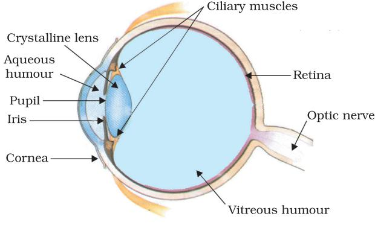

objects at different distances on the retina. We find a structure called *iris* behind the cornea. Iris is a dark muscular diaphragm that controls the size of the pupil. The pupil regulates and controls the amount of light

*Figure 10.1 The human eye* entering the eye. The eye lens forms an inverted real image of the object on the retina. The retina is a delicate membrane having enormous number of light-sensitive cells. The light-sensitive cells get activated upon illumination and generate electrical signals. These signals are sent to the brain via the optic nerves. The brain interprets these signals, and finally, processes the information so that we perceive objects as they are.

#### 10.1.1 Power of Accommodation

The eye lens is composed of a fibrous, jelly-like material. Its curvature can be modified to some extent by the ciliary muscles. The change in the curvature of the eye lens can thus change its focal length. When the muscles are relaxed, the lens becomes thin. Thus, its focal length increases. This enables us to see distant objects clearly. When you are looking at objects closer to the eye, the ciliary muscles contract. This increases the curvature of the eye lens. The eye lens then becomes thicker. Consequently, the focal length of the eye lens decreases. This enables us to see nearby objects clearly.

The ability of the eye lens to adjust its focal length is called accommodation. However, the focal length of the eye lens cannot be decreased below a certain minimum limit. Try to read a printed page by holding it very close to your eyes. You may see the image being blurred or feel strain in the eye. To see an object comfortably and distinctly, you must hold it at about 25 cm from the eyes. The minimum distance, at which objects can be seen most distinctly without strain, is called the least distance of distinct vision. It is also called the near point of the eye. For a young adult with normal vision, the near point is about 25 cm. The farthest point upto which the eye can see objects clearly is called the far point of the eye. It is infinity for a normal eye. You may note here a normal eye can see objects clearly that are between 25 cm and infinity.

Sometimes, the crystalline lens of people at old age becomes milky and cloudy. This condition is called cataract. This causes partial or complete loss of vision. It is possible to restore vision through a cataract surgery.

## 10.2 DEFECTS OF VISION AND THEIR CORRECTION

Sometimes, the eye may gradually lose its power of accommodation. In such conditions, the person cannot see the objects distinctly and comfortably. The vision becomes blurred due to the refractive defects of the eye.

There are mainly three common refractive defects of vision. These are (i) myopia or near -sightedness, (ii) Hypermetropia or far sightedness, and (iii) Presbyopia. These defects can be corrected by the use of suitable spherical lenses. We discuss below these defects and their correction.

#### (a) Myopia

Myopia is also known as near sightedness. A person with myopia can see nearby objects clearly but cannot see distant objects distinctly. A person with this defect has the far point nearer than infinity. Such a person may see clearly upto a distance of a few metres. In a myopic eye, the image of a distant object is formed in front of the retina [Fig. 10.2 (b)] and not at the retina itself. This defect may arise due to (i) excessive curvature of the eye lens, or (ii) elongation of the eyeball. This defect can be corrected by using a concave lens of suitable power. This is illustrated in Fig. 10.2 (c). A concave lens of suitable power will bring the image back on to the retina and thus the defect is corrected.

Hypermetropia is also known as far-sightedness. A person with hypermetropia can see distant objects clearly but cannot see nearby objects distinctly. The near point, for the person, is farther away from the normal near point (25 cm). Such a person has to keep a reading material much beyond 25 cm from the eye for comfortable reading. This is because the light rays from a closeby object are focussed at a point behind the retina as shown in Fig. 10.3 (b). This defect arises either because (i) the focal length of the eye lens is too long, or (ii) the eyeball has become too small. This defect can be corrected by using a convex lens of appropriate power. This is illustrated in Fig. 10.3 (c). Eye-glasses with converging lenses provide the additional focussing power required for forming the image on the retina.

#### (c) Presbyopia

The power of accommodation of the eye usually decreases with ageing. For most people, the near point gradually recedes away. They find it difficult to see nearby objects comfortably and distinctly without corrective eye-glasses. This defect is called Presbyopia. It arises due to the gradual

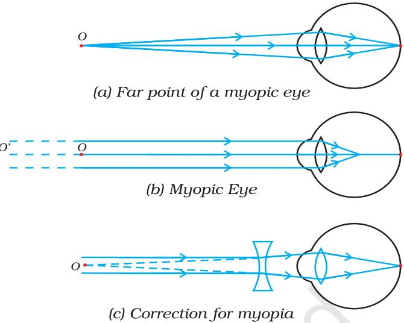

#### *Figure 10.2*

*(a), (b) The myopic eye, and (c) correction for myopia with a concave lens*

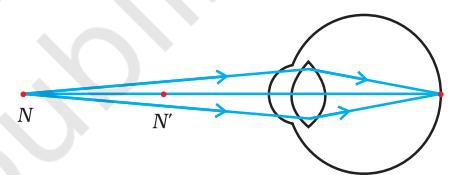

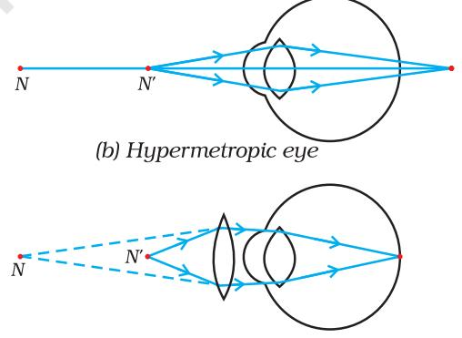

#### *Figure 10.3*

*(a), (b) The hypermetropic eye, and (c) correction for hypermetropia*

- *N = Near point of a hypermetropic eye.*
- *N' = Near point of a normal eye.*

weakening of the ciliary muscles and diminishing flexibility of the eye lens. Sometimes, a person may suffer from both myopia and hypermetropia. Such people often require bi-focal lenses. A common type of bi-focal lenses consists of both concave and convex lenses. The upper portion consists of a concave lens. It facilitates distant vision. The lower part is a convex lens. It facilitates near vision.

 These days, it is possible to correct the refractive defects with contact lenses or through surgical interventions.

# QUESTIONS

- 1. What is meant by power of accommodation of the eye?
- 2. A person with a myopic eye cannot see objects beyond 1.2 m distinctly. What should be the type of the corrective lens used to restore proper vision?
- 3. What is the far point and near point of the human eye with normal vision?
- 4. A student has difficulty reading the blackboard while sitting in the last row. What could be the defect the child is suffering from? How can it be corrected?

#### Think it over

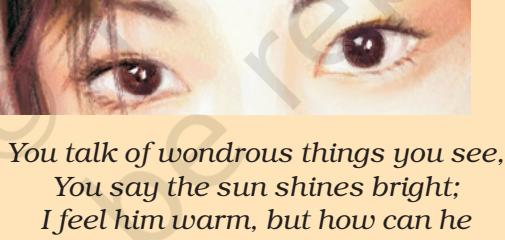

*Or make it day or night*?

– C. CIBBER

?

Do you know that our eyes can live even after our death? By donating our eyes after we die, we can light the life of a blind person.

About 35 million people in the developing world are blind and most of them can be cured. About 4.5 million people with corneal blindness can be cured through corneal transplantation of donated eyes. Out of these 4.5 million, 60% are children below the age of 12. So, if we have got the gift of vision, why not pass it on to somebody who does not have it? What do we have to keep in mind when eyes have to be donated?

- n Eye donors can belong to any age group or sex. People who use spectacles, or those operated for cataract, can still donate the eyes. People who are diabetic, have hypertension, asthma patients and those without communicable diseases can also donate eyes.
- n Eyes must be removed within 4-6 hours after death. Inform the nearest eye bank immediately.
- n The eye bank team will remove the eyes at the home of the deceased or at a hospital.
- n Eye removal takes only 10-15 minutes. It is a simple process and does not lead to any disfigurement.
- n Persons who were infected with or died because of AIDS, Hepatitis B or C, rabies, acute leukaemia, tetanus, cholera, meningitis or encephalitis cannot donate eyes. An eye bank collects, evaluates and distributes the donated eyes. All eyes donated are evaluated using strict medical standards. Those donated eyes found unsuitable for

transplantation are used for valuable research and medical education. The identities of both the donor and the recipient remain confidential.

One pair of eyes gives vision to up to FOUR CORNEAL BLIND PEOPLE.

# 10.3 REFRACTION OF LIGHT THROUGH A PRISM

You have learnt how light gets refracted through a rectangular glass slab. For parallel refracting surfaces, as in a glass slab, the emergent ray is parallel to the incident ray. However, it is slightly displaced laterally. How would light get refracted through a transparent prism? Consider a triangular glass prism. It has two triangular bases and three rectangular lateral surfaces. These surfaces are inclined to each other. The angle between its two lateral faces is called the angle of the prism. Let us now do an activity to study the refraction of light through a triangular glass prism.

# Activity 10.1

- n Fix a sheet of white paper on a drawing board using drawing pins.
- n Place a glass prism on it in such a way that it rests on its triangular base. Trace the outline of the prism using a pencil.
- n Draw a straight line PE inclined to one of the refracting surfaces, say AB, of the prism.
- n Fix two pins, say at points P and Q, on the line PE as shown in Fig. 10.4.
- n Look for the images of the pins, fixed at P and Q, through the other face AC.
- n Fix two more pins, at points R and S, such that the pins at R and S and the images of the pins at P and Q lie on the same straight line.
- n Remove the pins and the glass prism.
- n The line PE meets the boundary of the prism at point E (see Fig. 10.4). Similarly, join and produce the points R and S. Let these lines meet the boundary of the prism at E and F, respectively. Join E and F.
- n Draw perpendiculars to the refracting surfaces AB and AC of the prism at points E and F, respectively.
- n Mark the angle of incidence (∠i), the angle of refraction (∠r) and the angle of emergence (∠e) as shown in Fig. 10.4.

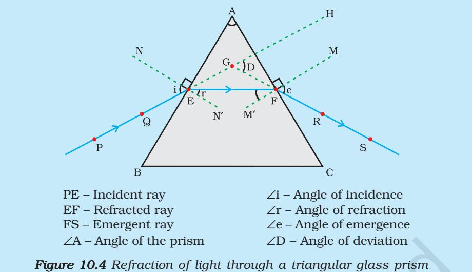

Here PE is the incident ray, EF is the refracted ray and FS is the emergent ray. You may note that a ray of light is entering from air to glass at the first surface AB. The light ray on refraction has bent towards the normal. At the second surface AC, the light ray has entered from glass to air. Hence it has bent away from normal. Compare the angle of incidence and the angle of refraction at each refracting surface of the prism. Is this similar to the kind of bending that occurs in a glass slab? The peculiar shape of the prism makes the emergent ray bend at an angle to the direction of the incident ray. This angle is called the angle of deviation. In this case ∠D is the angle of deviation. Mark the angle of deviation in the above activity and measure it.

# 10.4 DISPERSION OF WHITE LIGHT BY A GLASS PRISM ASS PRISMASS PRISM

You must have seen and appreciated the spectacular colours in a rainbow. How could the white light of the Sun give us various colours of the rainbow? Before we take up this question, we shall first go back to the refraction of light through a prism. The inclined refracting surfaces of a glass prism show exciting phenomenon. Let us find it out through an activity.

# Activity 10.2

- n Take a thick sheet of cardboard and make a small hole or narrow slit in its middle.
- n Allow sunlight to fall on the narrow slit. This gives a narrow beam of white light.
- n Now, take a glass prism and allow the light from the slit to fall on one of its faces as shown in Fig. 10.5.
- n Turn the prism slowly until the light that comes out of it appears on a nearby screen.
- n What do you observe? You will find a beautiful band of colours. Why does this happen?

The prism has probably split the incident white light into a band of colours. Note the colours that appear at the two ends of the colour band. What is the sequence of colours that you see on the screen? The various colours seen are Violet, Indigo, Blue, Green, Yellow, Orange and Red, as shown in Fig. 10.5. The acronym VIBGYOR will help you to remember the sequence of colours. The band of the coloured components of a light beam is called its spectrum. You might not be able to see all the colours separately.

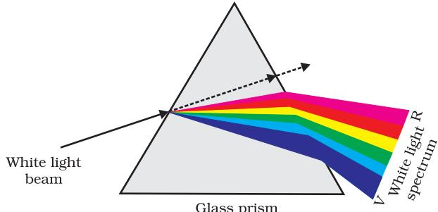

*Figure 10.5 Dispersion of white light by the glass prism*

Yet something makes each colour distinct from the other. The splitting of light into its component colours is called dispersion.

You have seen that white light is dispersed into its seven-colour components by a prism. Why do we get these colours? Different colours of light bend through different angles with respect to the incident ray, as they pass through a prism. The red light bends the least while the violet the most. Thus the rays of each colour emerge along different paths and thus become distinct. It is the band of distinct colours that we see in a spectrum.

Isaac Newton was the first to use a glass prism to obtain the spectrum of sunlight. He tried to split the colours of the spectrum of white light further by using another similar prism. However, he could not get any more colours. He then placed a second identical prism in an inverted position with respect to the first prism, as shown in Fig. 10.6. This allowed all the colours of the spectrum to pass through the second prism. He found a beam of white light emerging from the other side of the second prism. This observation gave Newton the idea that the sunlight is made up of seven colours.

Any light that gives a spectrum similar to that of sunlight is often referred to as white light.

A rainbow is a natural spectrum appearing in the sky after a rain shower (Fig. 10.7). It is caused by dispersion of sunlight by tiny water droplets, present in the atmosphere. A rainbow is always formed in a direction opposite to that of the Sun. The water droplets act like small prisms. They refract and disperse the incident sunlight, then reflect it internally, and finally refract it again when it comes out of the raindrop (Fig. 10.8). Due to the dispersion of light and internal reflection, different colours reach the observer's eye.

You can also see a rainbow on a sunny day when you look at the sky through a waterfall or through a water fountain, with the Sun behind you.

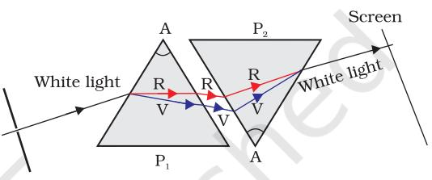

*Figure 10.6 Recombination of the spectrum of white light*

*Figure 10.7 Rainbow in the sky*

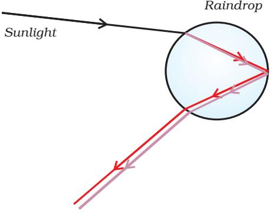

*Figure 10.8 Rainbow formation*

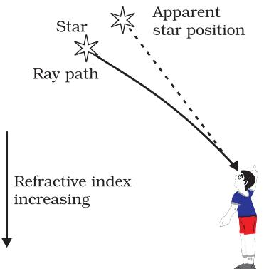

*Figure 10.9 Apparent star position due to atmospheric refraction*

### 10.5 ATMOSPHERIC REFRACTION

You might have observed the apparent random wavering or flickering of objects seen through a turbulent stream of hot air rising above a fire or a radiator. The air just above the fire becomes hotter than the air further up. The hotter air is lighter (less dense) than the cooler air above it, and has a refractive index slightly less than that of the cooler air. Since the physical conditions of the refracting medium (air) are not stationary, the apparent position of the object, as seen through the hot air, fluctuates. This wavering is thus an effect of atmospheric refraction (refraction of light by the earth's atmosphere) on a small scale in our local environment. The twinkling of stars is a similar phenomenon on a much larger scale. Let us see how we can explain it.

#### Twinkling of stars

The twinkling of a star is due to atmospheric refraction of starlight. The starlight, on entering the earth's atmosphere, undergoes refraction continuously before it reaches the earth. The atmospheric refraction occurs in a medium of gradually changing refractive index. Since the atmosphere bends starlight towards the normal, the apparent position of the star is slightly different from its actual position. The star appears slightly higher (above) than its actual position when viewed near the horizon (Fig. 10.9). Further, this apparent position of the star is not stationary, but keeps on changing slightly, since the physical conditions of the earth's atmosphere are not stationary, as was the case in the previous paragraph. Since the stars are very distant, they approximate point-sized sources of light. As the path of rays of light coming from the star goes on varying slightly, the apparent position of the star fluctuates and the amount of starlight entering the eye flickers – the star sometimes appears brighter, and at some other time, fainter, which is the twinkling effect.

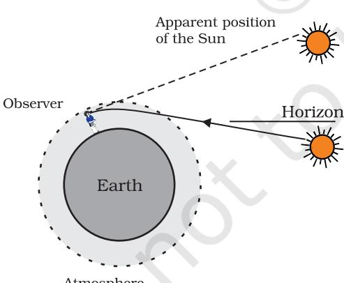

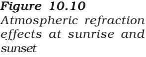

Why don't the planets twinkle? The planets are much closer to the earth, and are thus seen as extended sources. If we consider a planet as a collection of a large number of point-sized sources of light, the total variation in the amount of light entering our eye from all the individual point-sized sources will average out to zero, thereby nullifying the twinkling effect.

#### Advance sunrise and delayed sunset

The Sun is visible to us about 2 minutes before the actual sunrise, and about 2 minutes after the actual sunset because of atmospheric refraction. By actual sunrise, we mean the actual crossing of the horizon by the Sun. Fig. 10.10 shows the actual and apparent positions of the Sun with respect to the horizon. The time difference between actual sunset and the apparent sunset is about 2 minutes. The apparent flattening of the Sun's disc at sunrise and sunset is also due to the same phenomenon.

## 10.6 SCATTERING OF LIGHT

The interplay of light with objects around us gives rise to several spectacular phenomena in nature. The blue colour of the sky, colour of water in deep sea, the reddening of the sun at sunrise and the sunset are some of the wonderful phenomena we are familiar with. In the previous class, you have learnt about the scattering of light by colloidal particles. The path of a beam of light passing through a true solution is not visible. However, its path becomes visible through a colloidal solution where the size of the particles is relatively larger.

#### 10.6.1 Tyndall Effect

The earth's atmosphere is a heterogeneous mixture of minute particles. These particles include smoke, tiny water droplets, suspended particles of dust and molecules of air. When a beam of light strikes such fine particles, the path of the beam becomes visible. The light reaches us, after being reflected diffusely by these particles. The phenomenon of scattering of light by the colloidal particles gives rise to Tyndall effect which you have studied in Class IX. This phenomenon is seen when a fine beam of sunlight enters a smoke-filled room through a small hole. Thus, scattering of light makes the particles visible. Tyndall effect can also be observed when sunlight passes through a canopy of a dense forest. Here, tiny water droplets in the mist scatter light.

The colour of the scattered light depends on the size of the scattering particles. Very fine particles scatter mainly blue light while particles of larger size scatter light of longer wavelengths. If the size of the scattering particles is large enough, then, the scattered light may even appear white.

#### 10.6.2 Why is the colour of the clear Sky Blue?

The molecules of air and other fine particles in the atmosphere have size smaller than the wavelength of visible light. These are more effective in scattering light of shorter wavelengths at the blue end than light of longer wavelengths at the red end. The red light has a wavelength about 1.8 times greater than blue light. Thus, when sunlight passes through the atmosphere, the fine particles in air scatter the blue colour (shorter wavelengths) more strongly than red. The scattered blue light enters our eyes. If the earth had no atmosphere, there would not have been any scattering. Then, the sky would have looked dark. The sky appears dark to passengers flying at very high altitudes, as scattering is not prominent at such heights.

You might have observed that 'danger' signal lights are red in colour. Do you know why? The red is least scattered by fog or smoke. Therefore, it can be seen in the same colour at a distance.

# What you have learnt

- n The ability of the eye to focus on both near and distant objects, by adjusting its focal length, is called the accommodation of the eye.
- n The smallest distance, at which the eye can see objects clearly without strain, is called the near point of the eye or the least distance of distinct vision. For a young adult with normal vision, it is about 25 cm.
- n The common refractive defects of vision include myopia, hypermetropia and presbyopia. Myopia (short-sightedness – the image of distant objects is focussed before the retina) is corrected by using a concave lens of suitable power. Hypermetropia (far-sightedness – the image of nearby objects is focussed beyond the retina) is corrected by using a convex lens of suitable power. The eye loses its power of accommodation at old age.
- n The splitting of white light into its component colours is called dispersion.
- n Scattering of light causes the blue colour of sky.

# EXERCISES

- 1. The human eye can focus on objects at different distances by adjusting the focal length of the eye lens. This is due to
	- (a) presbyopia. (b) accommodation.
	- (c) near-sightedness. (d) far-sightedness.
- 2. The human eye forms the image of an object at its
	- (a) cornea. (b) iris. (c) pupil. (d) retina.
- 3. The least distance of distinct vision for a young adult with normal vision is about (a) 25 m. (b) 2.5 cm. (c) 25 cm. (d) 2.5 m.
- 4. The change in focal length of an eye lens is caused by the action of the
	- (a) pupil. (b) retina. (c) ciliary muscles. (d) iris.
- 5. A person needs a lens of power –5.5 dioptres for correcting his distant vision. For correcting his near vision he needs a lens of power +1.5 dioptre. What is the focal length of the lens required for correcting (i) distant vision, and (ii) near vision?
- 6. The far point of a myopic person is 80 cm in front of the eye. What is the nature and power of the lens required to correct the problem?
- 7. Make a diagram to show how hypermetropia is corrected. The near point of a hypermetropic eye is 1 m. What is the power of the lens required to correct this defect? Assume that the near point of the normal eye is 25 cm.
- 8. Why is a normal eye not able to see clearly the objects placed closer than 25 cm?
- 9. What happens to the image distance in the eye when we increase the distance of an object from the eye?
- 10. Why do stars twinkle?
- 11. Explain why the planets do not twinkle.
- 12. Why does the sky appear dark instead of blue to an astronaut?

