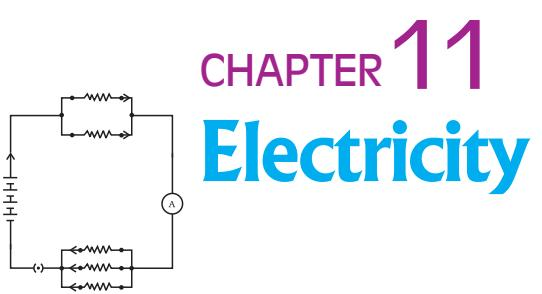

E lectricity has an important place in modern society. It is a controllable and convenient form of energy for a variety of uses in homes, schools, hospitals, industries and so on. What constitutes electricity? How does it flow in an electric circuit? What are the factors that control or regulate the current through an electric circuit? In this Chapter, we shall attempt to answer such questions. We shall also discuss the heating effect of electric current and its applications.

## 11.1 ELECTRIC CURRENT AND CIRCUIT

We are familiar with air current and water current. We know that flowing water constitute water current in rivers. Similarly, if the electric charge flows through a conductor (for example, through a metallic wire), we say that there is an electric current in the conductor. In a torch, we know that the cells (or a battery, when placed in proper order) provide flow of charges or an electric current through the torch bulb to glow. We have also seen that the torch gives light only when its switch is *on*. What does a switch do? A switch makes a conducting link between the cell and the bulb. A continuous and closed path of an electric current is called an electric circuit. Now, if the circuit is broken anywhere (or the switch of the torch is turned *off*), the current stops flowing and the bulb does not glow.

How do we express electric current? Electric current is expressed by the amount of charge flowing through a particular area in unit time. In other words, it is the rate of flow of electric charges. In circuits using metallic wires, electrons constitute the flow of charges. However, electrons were not known at the time when the phenomenon of electricity was first observed. So, electric current was considered to be the flow of positive charges and the direction of flow of positive charges was taken to be the direction of electric current. Conventionally, in an electric circuit the direction of electric current is taken as opposite to the direction of the flow of electrons, which are negative charges.

If a net charge *Q,* flows across any cross-section of a conductor in time *t*, then the current *I,* through the cross-section is

$I=\frac{Q}{t}$ (11.1)

The SI unit of electric charge is coulomb (C), which is equivalent to the charge contained in nearly 6 × 1018 electrons. (We know that an electron possesses a negative charge of 1.6 × 10–19 C.) The electric current is expressed by a unit called ampere (A), named after the French scientist, Andre-Marie Ampere (1775–1836). One ampere is constituted by the flow of one coulomb of charge per second, that is, 1 A = 1 C/1 s. Small quantities of current are expressed in milliampere

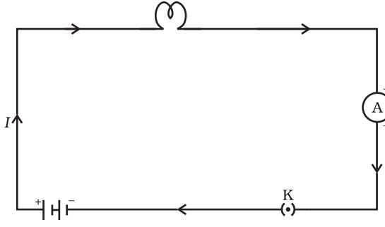

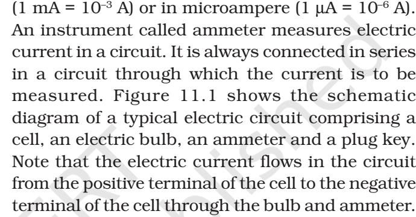

*Figure 11.1*

*A schematic diagram of an electric circuit comprising – cell, electric bulb, ammeter and plug key*

#### Example 11.1

A current of 0.5 A is drawn by a filament of an electric bulb for 10 minutes. Find the amount of electric charge that flows through the circuit.

#### Solution

We are given, *I* = 0.5 A; *t* = 10 min = 600 s. From Eq. (11.1), we have *Q* = *It* = 0.5 A × 600 s = 300 C

  
$\begin{array}{|ccccccccccccc|}\hline&&&&&&\mathbf{O}&\mathbf{U}&\mathbf{E}&\mathbf{S}&\mathbf{T}&\mathbf{I}&\mathbf{O}&\mathbf{N}&\mathbf{S}\\ &&&&&&&&&&\\ \hline&&&&&&&&&&\\ 1.&\text{What does an electric circuit mean?}&&&&&\\ 2.&\text{Define the unit of current.}&&&&&\\ 3.&\text{Calculate the number of electrons constituting one coulomb of charge.}&&\\ &&&&&&\diamondsuit&\\ \hline&&&&&&\\ &&&&&&\\ \hline\end{array}$

## 11.2 ELECTRIC POTENTIAL AND POTENTIAL DIFFERENCE

What makes the electric charge to flow? Let us consider the analogy of flow of water. Charges do not flow in a copper wire by themselves, just as water in a perfectly horizontal tube does not flow. If one end of the tube is connected to a tank of water kept at a higher level, such that there is a pressure difference between the two ends of the tube, water flows out of the other end of the tube. For flow of charges in a conducting metallic wire, the gravity, of course, has no role to play; the electrons move only if there is a difference of electric pressure – called the *potential difference* – along the conductor. This difference of potential may be produced by a battery, consisting of one or more electric cells. The chemical action within a cell generates the potential difference across the terminals of the cell, even when no current is drawn from it. When the cell is connected to a conducting circuit element, the potential difference sets the charges in motion in the conductor and produces an electric current. In order to maintain the current in a given electric circuit, the cell has to expend its chemical energy stored in it.

We define the electric potential difference between two points in an electric circuit carrying some current as the work done to move a unit charge from one point to the other –

Potential difference (*V*) between two points = Work done (*W*)/Charge (*Q*) *V = W/Q* (11.2)

The SI unit of electric potential difference is volt (V), named after Alessandro Volta (1745 –1827), an Italian physicist. One volt is the potential difference between two points in a current carrying conductor when 1 joule of work is done to move a charge of 1 coulomb from one point to the other.

> Therefore, 1 volt = 1 joule 1 coulomb

#### (11.3)

#### 1 V = 1 J C–1

The potential difference is measured by means of an instrument called the voltmeter. The voltmeter is always connected in parallel across the points between which the potential difference is to be measured.

#### Example 11.2

How much work is done in moving a charge of 2 C across two points having a potential difference 12 V?

#### Solution

The amount of charge *Q,* that flows between two points at potential difference *V* (= 12 V) is 2 C. Thus, the amount of work *W,* done in moving the charge [from Eq. (11.2)] is

| W | = | VQ |
| --- | --- | --- |
|  | = | 12 V × 2 C |
|  | = | 24 J. |

# QUESTIONS

- 1. Name a device that helps to maintain a potential difference across a conductor.
- 2. What is meant by saying that the potential difference between two points is 1 V?
- 3. How much energy is given to each coulomb of charge passing through a 6 V battery?

### 11.3 CIRCUIT DIAGRAM

We know that an electric circuit, as shown in Fig. 11.1, comprises a cell (or a battery), a plug key, electrical component(s), and connecting wires. It is often convenient to draw a schematic diagram, in which different components of the circuit are represented by the symbols conveniently used. Conventional symbols used to represent some of the most commonly used electrical components are given in Table 11.1.

Table 11.1 Symbols of some commonly used components in circuit diagrams

| Sl. No. | Components | Symbols |
| --- | --- | --- |
| 1 | An electric cell |  |
| 2 | A battery or a combination of cells |  |
| 3 | Plug key or switch (open) |  |
| 4 | Plug key or switch (closed) |  |
| 5 | A wire joint |  |
| 6 | Wires crossing without joining |  |

?

| 7 | Electric bulb | or |  |
| --- | --- | --- | --- |
| 8 | A resistor of resistance R |  |  |
| 9 | Variable resistance or rheostat |  | or |
| 10 | Ammeter |  |  |
| 11 | Voltmeter |  |  |

## 11.4 OHM'S LAW

Is there a relationship between the potential difference across a conductor and the current through it? Let us explore with an Activity.

## Activity 11.1

- n Set up a circuit as shown in Fig. 11.2, consisting of a nichrome wire XY of length, say 0.5 m, an ammeter, a voltmeter and four cells of 1.5 V each. (Nichrome is an alloy of nickel, chromium, manganese, and iron metals.)
- n First use only one cell as the source in the circuit. Note the reading in the ammeter *I,* for the current and reading of the voltmeter *V* for the potential difference across the nichrome wire XY in the circuit. Tabulate them in the Table given.

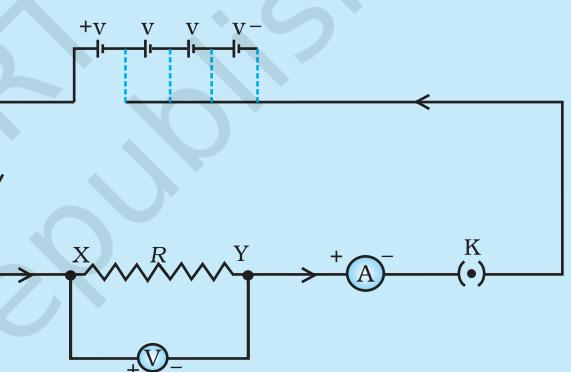

*Figure 11.2 Electric circuit for studying Ohm's law*

- n Next connect two cells in the circuit and note the respective readings of the ammeter and voltmeter for the values of current through the nichrome wire and potential difference across the nichrome wire.
- n Repeat the above steps using three cells and then four cells in the circuit separately.
- n Calculate the ratio of *V* to *I* for each pair of potential difference *V* and current *I*.

| S. | Number of cells | Current through | Potential difference | V/I |
| --- | --- | --- | --- | --- |
| No. | used in the | the nichrome | across the | (volt/ampere) |
|  | circuit | wire, I | nichrome |  |
|  | (ampere) | wire, V (volt) |  |  |
| 1 | 1 |  |  |  |
| 2 | 2 |  |  |  |
| 3 | 3 |  |  |  |
| 4 | 4 |  |  |  |

- n Plot a graph between *V* and *I*, and observe the nature of the graph.
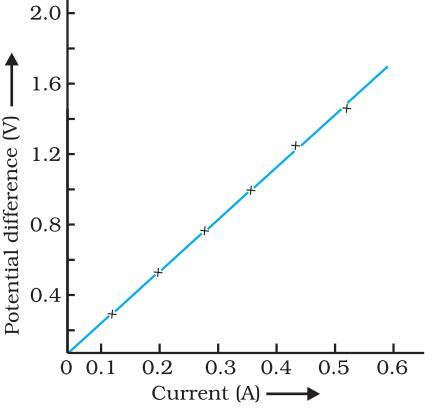

*V–I graph for a nichrome wire. A straight line plot shows that as the current through a wire increases, the potential difference across the wire increases linearly – this is Ohm's law.*

In this Activity, you will find that approximately the same value for *V/I* is obtained in each case. Thus the *V–I* graph is a straight line that passes through the origin of the graph, as shown in Fig. 11.3. Thus, *V/I* is a constant ratio.

In 1827, a German physicist Georg Simon Ohm (1787–1854) found out the relationship between the current *I,* flowing in a metallic wire and the potential difference across its terminals. The potential difference, *V*, across the ends of a given metallic wire in an electric circuit is directly proportional to the current flowing through it, provided its temperature remains the same. This is called Ohm's law. In other words –

|  | V ∝ | I |  | (11.4) |
| --- | --- | --- | --- | --- |
| or | V/I | = | constant |  |
|  |  | = | R |  |
| or | V | = | IR | (11.5) |

In Eq. (11.4), *R* is a constant for the given metallic wire

at a given temperature and is called its resistance. It is the property of a conductor to resist the flow of charges through it. Its SI unit is ohm, represented by the Greek letter Ω. According to Ohm's law,

*R = V/I* (11.6)

If the potential difference across the two ends of a conductor is 1 V and the current through it is 1 A, then the resistance *R,* of the conductor

is 1 $\Omega$. That is, 1 ohm = 1 volt 1 ampere

Also from Eq. (11.5) we get

## *I = V/R* (11.7)

#### It is obvious from Eq. (11.7) that the current through a resistor is inversely proportional to its resistance. If the resistance is doubled the current gets halved. In many practical cases it is necessary to increase or decrease the current in an electric circuit. A component used to regulate current without changing the voltage source is called variable resistance. In an electric circuit, a device called rheostat is often used to change the resistance in the circuit. We will now study about electrical resistance of a conductor with the help of following Activity.

## Activity 11.2

- n Take a nichrome wire, a torch bulb, a 10 W bulb and an ammeter (0 5 A range), a plug key and some connecting wires.
- n Set up the circuit by connecting four dry cells of 1.5 V each in series with the ammeter leaving a gap XY in the circuit, as shown in Fig. 11.4.

#### *Figure 11.4*

- n Complete the circuit by connecting the nichrome wire in the gap XY. Plug the key. Note down the ammeter reading. Take out the key from the plug. [Note: *Always take out the key from the plug after measuring the current through the circuit.*]
- n Replace the nichrome wire with the torch bulb in the circuit and find the current through it by measuring the reading of the ammeter.
- n Now repeat the above step with the 10 W bulb in the gap XY.
- n Are the ammeter readings different for different components connected in the gap XY? What do the above observations indicate?
- n You may repeat this Activity by keeping any material component in the gap. Observe the ammeter readings in each case. Analyse the observations.

In this Activity we observe that the current is different for different components. Why do they differ? Certain components offer an easy path for the flow of electric current while the others resist the flow. We know that motion of electrons in an electric circuit constitutes an electric current. The electrons, however, are not completely free to move within a conductor. They are restrained by the attraction of the atoms among which they move. Thus, motion of electrons through a conductor is retarded by its resistance. A component of a given size that offers a low resistance is a good conductor. A conductor having some appreciable resistance is called a resistor. A component of identical size that offers a higher resistance is a poor conductor. An insulator of the same size offers even higher resistance.

## 11.5 FACTORS ON WHICH THE RESISTANCE OF A CONDUCTOR DEPENDS

### Activity 11.3

- n Complete an electric circuit consisting of a cell, an ammeter, a nichrome wire of length *l* [say, marked (1)] and a plug key, as shown in Fig. 11.5.
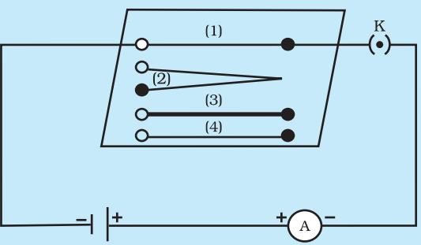

*Figure 11.5 Electric circuit to study the factors on which the resistance of conducting wires depends*

- n Now, plug the key. Note the current in the ammeter.
- n Replace the nichrome wire by another nichrome wire of same thickness but twice the length, that is 2*l* [marked (2) in the Fig. 11.5].
- n Note the ammeter reading.
- n Now replace the wire by a thicker nichrome wire, of the same length *l* [marked (3)]. A thicker wire has a larger cross-sectional area. Again note down the current through the circuit.
- n Instead of taking a nichrome wire, connect a copper wire [marked (4) in Fig. 11.5] in the circuit. Let the wire be of the same length and same area of cross-section as that of the first nichrome wire [marked (1)]. Note the value of the current.
- n Notice the difference in the current in all cases.
- n Does the current depend on the length of the conductor?
- n Does the current depend on the area of cross-section of the wire used?

It is observed that the ammeter reading decreases to one-half when the length of the wire is doubled. The ammeter reading is increased when a thicker wire of the same material and of the same length is used in the circuit. A change in ammeter reading is observed when a wire of different material of the same length and the same area of cross-section is used. On applying Ohm's law [Eqs. (11.5) – (11.7)], we observe that the resistance of the conductor depends (i) on its length, (ii) on its area of cross-section, and (iii) on the nature of its material. Precise measurements have shown that resistance of a uniform metallic conductor is directly proportional to its length (*l*) and inversely proportional to the area of cross-section (*A*). That is,

$R\propto1$ and $R\propto1/A$ (11.8)

Combining Eqs. (11.8) and (11.9) we get

#### *R* ∝ *l A* or, *R* = ρ *l A* (11.10)

where ρ (rho) is a constant of proportionality and is called the electrical resistivity of the material of the conductor. The SI unit of resistivity is Ω m. It is a characteristic property of the material. The metals and alloys have very low resistivity in the range of 10–8 Ω m to 10–6 Ω m. They are good conductors of electricity. Insulators like rubber and glass have resistivity of the order of 1012 to 1017 Ω m. Both the resistance and resistivity of a material vary with temperature.

Table 11.2 reveals that the resistivity of an alloy is generally higher than that of its constituent metals. Alloys do not oxidise (burn) readily at high temperatures. For this reason, they are commonly used in electrical heating devices, like electric iron, toasters etc. Tungsten is used almost exclusively for filaments of electric bulbs, whereas copper and aluminium are generally used for electrical transmission lines.

|  | Material | Resistivity (Ω m) |
| --- | --- | --- |
| Conductors | Silver | 1.60 × 10–8 |
|  | Copper | 1.62 × 10–8 |
|  | Aluminium | 2.63 × 10–8 |
|  | Tungsten | 5.20 × 10–8 |
|  | Nickel | 6.84 × 10–8 |
|  | Iron | 10.0 × 10–8 |
|  | Chromium | 12.9 × 10–8 |
|  | Mercury | 94.0 × 10–8 |
|  | Manganese | 1.84 × 10–6 |
| Alloys | Constantan | 49 × 10–6 |
|  | (alloy of Cu and Ni) |  |
|  | Manganin | 44 × 10–6 |
|  | (alloy of Cu, Mn and Ni) |  |
|  | Nichrome | 100 × 10–6 |
|  | (alloy of Ni, Cr, Mn and Fe) |  |
| Insulators | Glass | 1010 – 1014 |
|  | Hard rubber | 1013 – 1016 |
|  | Ebonite | 1015 – 1017 |
|  | Diamond | 1012 - 1013 |
|  | Paper (dry) | 1012 |

Table 11.2 Electrical resistivity* of some substances at 20°C

* *You need not memorise these values. You can use these values for solving numerical problems.*

### Example 11.3

- (a) How much current will an electric bulb draw from a 220 V source, if the resistance of the bulb filament is 1200 Ω? (b) How much current will an electric heater coil draw from a 220 V source, if the resistance of the heater coil is 100 Ω?
### Solution

- (a) We are given *V* = 220 V; *R* = 1200 Ω.
From Eq. (12.6), we have the current *I* = 220 V/1200 Ω = 0.18 A. (b) We are given, *V* = 220 V, *R* = 100 Ω.

From Eq. (11.6), we have the current *I* = 220 V/100 Ω = 2.2 A. Note the difference of current drawn by an electric bulb and electric heater from the same 220 V source!

#### Example 11.4

The potential difference between the terminals of an electric heater is 60 V when it draws a current of 4 A from the source. What current will the heater draw if the potential difference is increased to 120 V? Solution

We are given, potential difference *V* = 60 V, current *I* = 4 A.

According to Ohm's law, $\ R=\frac{V}{I}=\frac{60\ \mathrm{V}}{4\ \mathrm{A}}=15\ \Omega$ . 

When the potential difference is increased to 120 V the current is given by

$$\mathrm{current}={\frac{V}{R}}={\frac{120\ \mathrm{V}}{15\ \Omega}}=8\ \mathrm{A}\ .$$

The current through the heater becomes 8 A.

#### Example 11.5

Resistance of a metal wire of length 1 m is 26 Ω at 20°C. If the diameter of the wire is 0.3 mm, what will be the resistivity of the metal at that temperature? Using Table 11.2, predict the material of the wire.

#### Solution

We are given the resistance *R* of the wire = 26 Ω, the diameter *d* = 0.3 mm = 3 × 10-4 m, and the length *l* of the wire = 1 m.

Therefore, from Eq. (11.10), the resistivity of the given metallic wire is

$$\begin{array}{r l}{\rho}&{{}=\ (R A/l)\ =\ (R r d e^{2}/4l)}\end{array}$$

Substitution of values in this gives

* [16] A. A. K.  
  

The resistivity of the metal at 20°C is 1.84 × 10–6 Ω m. From Table 11.2, we see that this is the resistivity of manganese.

#### Example 11.6

A wire of given material having length *l* and area of cross-section *A* has a resistance of 4 Ω. What would be the resistance of another wire of the same material having length *l*/2 and area of cross-section 2*A*?

#### Solution

For first wire

$$R_{_{l}}\ =\ \rho\ \ \frac{l}{A}\ =4\Omega$$

Now for second wire

  
$ R_2$ = $ \rho\ \frac{l/2}{2A}\quad$ = $ \frac{1}{4}\quad\rho\ \frac{l}{A}$  
  
$ \begin{array}{ccc}.\\ R_2\\ \end{array}$ = $ \begin{array}{ccc}\dfrac{1}{4}&R_1\\ \end{array}$  
  
$ R_2$= $ 1\Omega$  
  
The persistence of the reservoir.  

The resistance of the new wire is 1Ω.

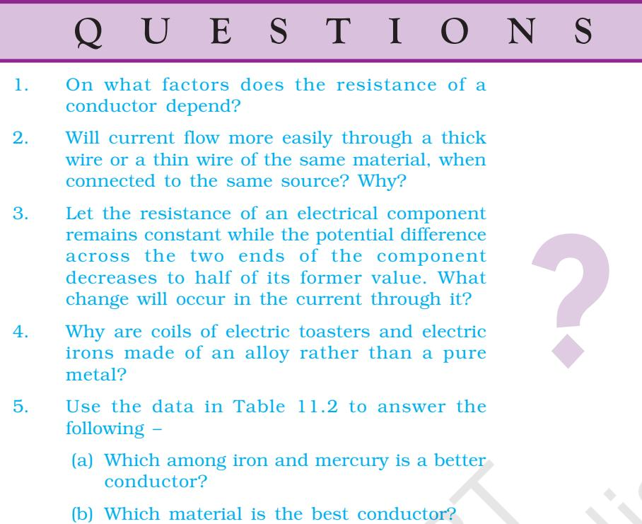

## 11.6 RESISTANCE OF A SYSTEM OF RESISTORS

In preceding sections, we learnt about some simple electric circuits. We have noticed how the current through a conductor depends upon its resistance and the potential difference across its ends. In various electrical gadgets, we often use resistors in various combinations. We now therefore intend to see how Ohm's law can be applied to combinations of resistors.

There are two methods of joining the resistors together. Figure 11.6 shows an electric circuit in which three resistors having resistances *R1* , *R2* and *R3* , respectively, are joined end to end. Here the resistors are said to be connected in series.

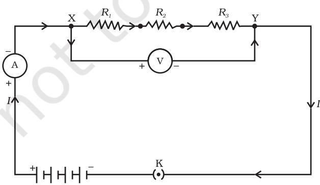

*Figure 11.6 Resistors in series*

Figure 11.7 shows a combination of resistors in which three resistors are connected together between points X and Y. Here, the resistors are said to be connected in parallel.

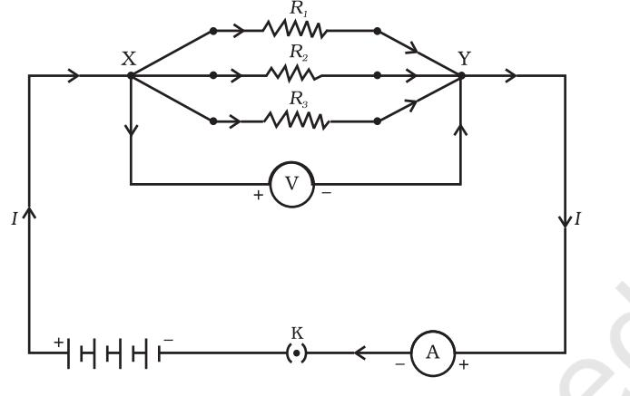

*Figure 11.7 Resistors in parallel*

### 11.6.1 Resistors in Series

What happens to the value of current when a number of resistors are connected in series in a circuit? What would be their equivalent resistance? Let us try to understand these with the help of the following activities.

## Activity 11.4

- n Join three resistors of different values in series. Connect them with a battery, an ammeter and a plug key, as shown in Fig. 11.6. You may use the resistors of values like 1 Ω, 2 Ω, 3 Ω etc., and a battery of 6 V for performing this Activity.
- n Plug the key. Note the ammeter reading.
- n Change the position of ammeter to anywhere in between the resistors. Note the ammeter reading each time.
- n Do you find any change in the value of current through the ammeter?

You will observe that the value of the current in the ammeter is the same, independent of its position in the electric circuit. It means that in a series combination of resistors the current is the same in every part of the circuit or the same current through each resistor.

### Activity 11.5

- n In Activity 11.4, insert a voltmeter across the ends X and Y of the series combination of three resistors, as shown in Fig. 11.6.
- n Plug the key in the circuit and note the voltmeter reading. It gives the potential difference across the series combination of resistors. Let it be *V*. Now measure the potential difference across the two terminals of the battery. Compare the two values.
- n Take out the plug key and disconnect the voltmeter. Now insert the voltmeter across the ends X and P of the first resistor, as shown in Fig. 11.8.

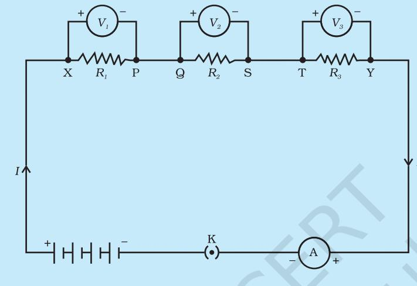

*Figure 11.8*

- n Plug the key and measure the potential difference across the first resistor. Let it be *V1* .
- n Similarly, measure the potential difference across the other two resistors, separately. Let these values be *V2* and *V3* , respectively.
- n Deduce a relationship between *V*, *V1* , *V2* and *V3* .

You will observe that the potential difference *V* is equal to the sum of potential differences *V1* , *V2* , and *V3* . That is the total potential difference across a combination of resistors in series is equal to the sum of potential difference across the individual resistors. That is,

$$V=V_{1}+V_{2}\ +V_{3}$$

(11.11)

In the electric circuit shown in Fig. 11.8, let *I* be the current through the circuit. The current through each resistor is also *I*. It is possible to replace the three resistors joined in series by an equivalent single resistor of resistance *R*, such that the potential difference *V* across it, and the current *I* through the circuit remains the same. Applying the Ohm's law to the entire circuit, we have

$V=I\,R$ (11.12)

On applying Ohm's law to the three resistors separately, we further have

| V1 |  | I R1 |  | [11.13(a)] | = |
| --- | --- | --- | --- | --- | --- |
| V2 |  | I R2 |  | [11.13(b)] | = |
| and V3 I R3 |  |  |  | [11.13(c)] | = |
| From Eq. (11.11), |  |  |  |  |  |
| I R = I R1 or |  | + I R2 | + I R3 |  |  |
| Rs | = R1 | +R2 | + R3 | (11.14) |  |

We can conclude that when several resistors are joined in series, the resistance of the combination *Rs* equals the sum of their individual resistances, *R1 , R2 , R3 ,* and is thus greater than any individual resistance.

#### Example 11.7

An electric lamp, whose resistance is 20 Ω, and a conductor of 4 Ω resistance are connected to a 6 V battery (Fig. 11.9). Calculate (a) the total resistance of the circuit, (b) the current through the circuit, and (c) the potential difference across the electric lamp and conductor.

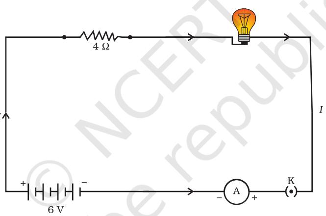

*Figure 11.9 An electric lamp connected in series with a resistor of 4* Ω *to a 6* V *battery*

### Solution

The resistance of electric lamp, *R1* = 20 Ω, The resistance of the conductor connected in series, *R2* = 4 Ω. Then the total resistance in the circuit

$$\begin{array}{r l}{R}&{{}=\ R_{i}+R_{2}}\end{array}$$

$$R_{_\mathrm{s}}\ =\ 20\ \Omega\ +\ 4\ \Omega\ =\ 24\ \Omega.$$

The total potential difference across the two terminals of the battery *V* = 6 V.

Now by Ohm's law, the current through the circuit is given by

- *I* = *V*/*R*s
	- *=* 6 V/24 Ω
	- = 0.25 A.

Applying Ohm's law to the electric lamp and conductor separately, we get potential difference across the electric lamp,

*V1* = 20 Ω × 0.25 A = 5 V; and,

that across the conductor, *V2* = 4 Ω × 0.25 A = 1 V.

Suppose that we like to replace the series combination of electric lamp and conductor by a single and equivalent resistor. Its resistance must be such that a potential difference of 6 V across the battery terminals will cause a current of 0.25 A in the circuit. The resistance *R* of this equivalent resistor would be

$$\begin{array}{l l l}{{R}}&{{=}}&{{V/I}}\\ {{}}&{{=}}&{{6\,\mathrm{V}/\,0.25\,\mathrm{A}}}\\ {{}}&{{=}}&{{24\,\Omega.}}\end{array}$$

This is the total resistance of the series circuit; it is equal to the sum of the two resistances.

## 11.6.2 Resistors in Parallel

Now, let us consider the arrangement of three resistors joined in parallel with a combination of cells (or a battery), as shown in Fig.11.7.

## Activity 11.6

- n Make a parallel combination, XY, of three resistors having resistances *R1* , *R2* , and *R3* , respectively. Connect it with a battery, a plug key and an ammeter, as shown in Fig. 11.10. Also connect a voltmeter in parallel with the combination of resistors.
- n Plug the key and note the ammeter reading. Let the current be *I*. Also take the voltmeter reading. It gives the potential difference *V,* across the combination. The potential difference across each resistor is also *V*. This can be checked by connecting the voltmeter across each individual resistor (see Fig. 11.11). *Figure 11.10*

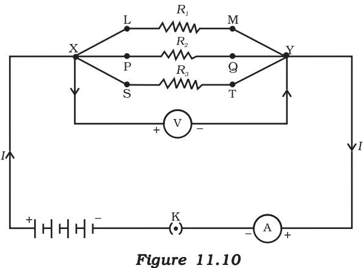

- n Take out the plug from the key. Remove the ammeter and voltmeter from the circuit. Insert the ammeter in series with the resistor *R1 ,* as shown in Fig. 11.11. Note the ammeter reading, *I 1* .

*Figure 11.11*

- n Similarly, measure the currents through *R2* and *R3* . Let these be *I 2* and *I 3* , respectively. What is the relationship between *I*, *I* 1 , *I* 2 and *I* 3 ?
It is observed that the total current *I*, is equal to the sum of the separate currents through each branch of the combination.

$I=I_{1}+I_{2}+I_{3}$

Let *Rp* be the equivalent resistance of the parallel combination of resistors. By applying Ohm's law to the parallel combination of resistors, we have

$I=V/R_{p}$ (11.16)

On applying Ohm's law to each resistor, we have

 *+ V/R3*

*I 1 = V /R1* ; *I 2 = V /R2* ; and *I 3 = V /R3*

 *+ V/R2*

From Eqs. (11.15) to (11.17), we have  *= V/R1*

 *V/Rp*

or

$1/R_{p}=1/R_{1}+1/R_{2}+1/R_{3}$ (11.18)

Thus, we may conclude that the reciprocal of the equivalent resistance of a group of resistances joined in parallel is equal to the sum of the reciprocals of the individual resistances.

#### Example 11.8

In the circuit diagram given in Fig. 11.10, suppose the resistors *R1* , *R2* and *R3* have the values 5 Ω, 10 Ω, 30 Ω, respectively, which have been connected to a battery of 12 V. Calculate (a) the current through each resistor, (b) the total current in the circuit, and (c) the total circuit resistance.

#### Solution

*R1* = 5 Ω, *R2* = 10 Ω, and *R3* = 30 Ω.

Potential difference across the battery, *V* = 12 V.

This is also the potential difference across each of the individual resistor; therefore, to calculate the current in the resistors, we use Ohm's law.

The current *I 1* , through *R1 = V/ R1 I 1 =* 12 V/5 Ω = 2.4 A. (11.17)

The current *I 2* , through *R2 = V/ R2 I 2 =* 12 V/10 Ω = 1.2 A. The current *I 3* , through *R3 = V/R3 I 3 =* 12 V/30 Ω = 0.4 A. The total current in the circuit, *I* = *I 1* + *I2* + *I3* = (2.4 + 1.2 + 0.4) A = 4 A The total resistance *Rp* , is given by [Eq. (11.18)]

1 1 1 1 1 *Rp* 5 10 30 3 = + + =

Thus, *Rp* = 3 Ω.

#### Example 11.9

If in Fig. 11.12, *R1* = 10 Ω, *R2 =* 40 Ω, *R3 =* 30 Ω, *R4 =* 20 Ω, *R5 =* 60 Ω, and a 12 V battery is connected to the arrangement. Calculate (a) the total resistance in the circuit, and (b) the total current flowing in the circuit.

#### Solution

Suppose we replace the parallel resistors *R1* and *R2* by an equivalent resistor of resistance, *R*′. Similarly we replace the parallel resistors *R3* , *R4* and *R5* by an equivalent single resistor of resistance *R*″. Then using Eq. (11.18), we have 1/ *R*′ = 1/10 + 1/40 = 5/40; that is *R*′ = 8 Ω. Similarly, 1/ *R*″ = 1/30 + 1/20 + 1/60 = 6/60; that is, *R*″ = 10 Ω. Thus, the total resistance, *R = R*′ *+ R*″ = 18 Ω. To calculate the current, we use Ohm's law, and get

 *I = V/R =* 12 V/18 Ω = 0.67 A.

We have seen that in a series circuit the current is constant throughout the electric circuit. Thus it is obviously impracticable to connect an electric bulb and an electric heater in series, because they need currents of widely different values to operate properly (see Example 11.3). Another major disadvantage of a series circuit is that when one component fails the circuit is broken and none of the components works. If you have used 'fairy lights' to decorate buildings on festivals, on marriage celebrations etc., you might have seen the electrician spending lot of time in trouble-locating and replacing the 'dead' bulb – each has to be tested to find which has fused or gone. On the other hand, a parallel circuit divides the current through the electrical gadgets. The total resistance in a parallel circuit is decreased as per Eq. (11.18). This is helpful particularly when each gadget has different resistance and requires different current to operate properly.

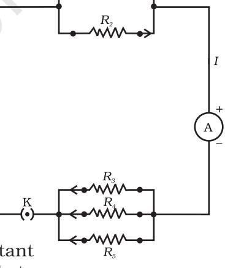

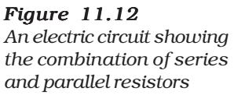

## QUESTIONS

- 1. Judge the equivalent resistance when the following are connected in parallel – (a) 1 Ω and 106 Ω, (b) 1 Ω and 103 Ω, and 106 Ω.
- 2. An electric lamp of 100 Ω, a toaster of resistance 50 Ω, and a water filter of resistance 500 Ω are connected in parallel to a 220 V source. What is the resistance of an electric iron connected to the same source that takes as much current as all three appliances, and what is the current through it?
- 3. What are the advantages of connecting electrical devices in parallel with the battery instead of connecting them in series?
- 4. How can three resistors of resistances 2 Ω, 3 Ω, and 6 Ω be connected to give a total resistance of (a) 4 Ω, (b) 1 Ω?
- 5. What is (a) the highest, (b) the lowest total resistance that can be secured by combinations of four coils of resistance 4 Ω, 8 Ω, 12 Ω, 24 Ω?

### 11.7 HEA11.7 HEA 11.7 HEATING EFFECT OF ELECTRIC CURRENT

We know that a battery or a cell is a source of electrical energy. The chemical reaction within the cell generates the potential difference between its two terminals that sets the electrons in motion to flow the current through a resistor or a system of resistors connected to the battery. We have also seen, in Section 11.2, that to maintain the current, the source has to keep expending its energy. Where does this energy go? A part of the source energy in maintaining the current may be consumed into useful work (like in rotating the blades of an electric fan). Rest of the source energy may be expended in heat to raise the temperature of gadget. We often observe this in our everyday life. For example, an electric fan becomes warm if used continuously for longer time etc. On the other hand, if the electric circuit is purely resistive, that is, a configuration of resistors only connected to a battery; the source energy continually gets dissipated entirely in the form of heat. This is known as the heating effect of electric current. This effect is utilised in devices such as electric heater, electric iron etc.

Consider a current *I* flowing through a resistor of resistance *R*. Let the potential difference across it be *V* (Fig. 11.13). Let *t* be the time during which a charge *Q* flows across. The work done in moving the charge *Q* through a potential difference *V* is *VQ*. Therefore, the source must supply energy equal to *VQ* in time *t.* Hence the power input to the circuit by the source is

#### P V VI= Q t = (11.19)

Or the energy supplied to the circuit by the source in time *t* is *P* × *t*, that is, *VIt.* What happens to this energy expended by the source? This energy gets dissipated in the resistor as heat. Thus for a steady current *I*, the amount of heat *H* produced in time *t* is

*H = VIt* (11.20)

?

Applying Ohm's law [Eq. (11.5)], we get

#### *H = I2*

 *Rt* (11.21)

This is known as Joule's law of heating. The law implies that heat produced in a resistor is (i) directly proportional to the square of current for a given resistance, (ii) directly proportional to resistance for a given current, and (iii) directly proportional to the time for which the current flows through the resistor. In practical situations, when an electric appliance is connected to a known voltage source, Eq. (11.21) is used after calculating the current through it, using the relation *I = V/R*.

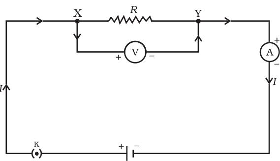

#### Example 11.10

An electric iron consumes energy at a rate of 840 W when heating is at the maximum rate and 360 W when the heating is at the minimum. The voltage is 220 V. What are the current and the resistance in each case?

#### Solution

From Eq. (11.19), we know that the power input is *P = V I*

Thus the current *I = P/V*

- (a) When heating is at the maximum rate, *I =* 840 W/220 V = 3.82 A; and the resistance of the electric iron is *R = V/I* = 220 V/3.82 A = 57.60 Ω.
- (b) When heating is at the minimum rate, *I =* 360 W/220 V = 1.64 A; and the resistance of the electric iron is *R = V/I* = 220 V/1.64 A = 134.15 Ω.

#### Example 11.11

100 J of heat is produced each second in a 4 Ω resistance. Find the potential difference across the resistor.

#### Solution

*H* = 100 J, *R* = 4 Ω, *t* = 1 s, *V* = ? From Eq. (11.21) we have the current through the resistor as *I =* √(*H/Rt*) = √[100 J/(4 Ω × 1 s)] = 5 A Thus the potential difference across the resistor, *V* [from Eq. (11.5)] is *V* = *IR*

- = 5 A × 4 Ω
- = 20 V.

## QUESTIONS

- 1. Why does the cord of an electric heater not glow while the heating element does?
- 2. Compute the heat generated while transferring 96000 coulomb of charge in one hour through a potential difference of 50 V.
- 3. An electric iron of resistance 20 Ω takes a current of 5 A. Calculate the heat developed in 30 s.

## 11.7.1 Practical Applications of Heating Effect of Electric Current

The generation of heat in a conductor is an inevitable consequence of electric current. In many cases, it is undesirable as it converts useful electrical energy into heat. In electric circuits, the unavoidable heating can increase the temperature of the components and alter their properties. However, heating effect of electric current has many useful applications. The electric laundry iron, electric toaster, electric oven, electric kettle and electric heater are some of the familiar devices based on Joule's heating.

The electric heating is also used to produce light, as in an electric bulb. Here, the filament must retain as much of the heat generated as is possible, so that it gets very hot and emits light. It must not melt at such high temperature. A strong metal with high melting point such as tungsten (melting point 3380°C) is used for making bulb filaments. The filament should be thermally isolated as much as possible, using insulating support, etc. The bulbs are usually filled with chemically inactive nitrogen and argon gases to prolong the life of filament. Most of the power consumed by the filament appears as heat, but a small part of it is in the form of light radiated.

Another common application of Joule's heating is the fuse used in electric circuits. It protects circuits and appliances by stopping the flow of any unduly high electric current. The fuse is placed in series with the device. It consists of a piece of wire made of a metal or an alloy of appropriate melting point, for example aluminium, copper, iron, lead etc. If a current larger than the specified value flows through the circuit, the temperature of the fuse wire increases. This melts the fuse wire and breaks the circuit. The fuse wire is usually encased in a cartridge of porcelain or similar material with metal ends. The fuses used for domestic purposes are rated as 1 A, 2 A, 3 A, 5 A, 10 A, etc. For an electric iron which consumes 1 kW electric power when operated at 220 V, a current of (1000/220) A, that is, 4.54 A will flow in the circuit. In this case, a 5 A fuse must be used.

?

## 11.8 ELECTRIC POWER

You have studied in your earlier Class that the rate of doing work is power. This is also the rate of consumption of energy.

Equation (11.21) gives the rate at which electric energy is dissipated or consumed in an electric circuit. This is also termed as electric power. The power *P* is given by

$P=V$  
  
Or $P=P\!R=V^{2}/R$

The SI unit of electric power is watt (W). It is the power consumed by a device that carries 1 A of current when operated at a potential difference of 1 V. Thus,

1 W = 1 volt × 1 ampere = 1 V A (11.23)

The unit 'watt' is very small. Therefore, in actual practice we use a much larger unit called 'kilowatt'. It is equal to 1000 watts. Since electrical energy is the product of power and time, the unit of electric energy is, therefore, watt hour (W h). One watt hour is the energy consumed when 1 watt of power is used for 1 hour. The commercial unit of electric energy is kilowatt hour (kW h), commonly known as 'unit'.

1 kW h = 1000 watt × 3600 second

- = 3.6 × 106 watt second
- = 3.6 × 106 joule (J)

Many people think that electrons are consumed in an electric circuit. This is wrong! We pay the electricity board or electric company to provide energy to move electrons through the electric gadgets like electric bulb, fan and engines. We pay for the energy that we use.

#### Example 11.12

An electric bulb is connected to a 220 V generator. The current is 0.50 A. What is the power of the bulb?

#### Solution

- *P = VI*
	- = 220 V × 0.50 A
	- = 110 J/s
	- = 110 W.

#### Example 11.13

An electric refrigerator rated 400 W operates 8 hour/day. What is the cost of the energy to operate it for 30 days at Rs 3.00 per kW h?

### Solution

The total energy consumed by the refrigerator in 30 days would be 400 W × 8.0 hour/day × 30 days = 96000 W h

$$=96{\mathrm{~kW~h}}$$

Thus the cost of energy to operate the refrigerator for 30 days is 96 kW h × Rs 3.00 per kW h = Rs 288.00

## QUESTIONS

1. What determines the rate at which energy is delivered by a current?

- 2. An electric motor takes 5 A from a 220 V line. Determine the power of the motor and the energy consumed in 2 h.
## What you have learnt

- n A stream of electrons moving through a conductor constitutes an electric current. Conventionally, the direction of current is taken opposite to the direction of flow of electrons.
- n The SI unit of electric current is ampere.
- n To set the electrons in motion in an electric circuit, we use a cell or a battery. A cell generates a potential difference across its terminals. It is measured in volts (V).
- n Resistance is a property that resists the flow of electrons in a conductor. It controls the magnitude of the current. The SI unit of resistance is ohm (Ω).
- n Ohm's law: The potential difference across the ends of a resistor is directly proportional to the current through it, provided its temperature remains the same.
- n The resistance of a conductor depends directly on its length, inversely on its area of cross-section, and also on the material of the conductor.
- n The equivalent resistance of several resistors in series is equal to the sum of their individual resistances.
- n A set of resistors connected in parallel has an equivalent resistance *Rp* given by

$${\frac{1}{R_{p}}}={\frac{1}{R_{1}}}+{\frac{1}{R_{2}}}+{\frac{1}{R_{3}}}+\ldots$$

- n The electrical energy dissipated in a resistor is given by *W = V* × *I* × *t*
- n The unit of power is watt (W). One watt of power is consumed when 1 A of current flows at a potential difference of 1 V.
- n The commercial unit of electrical energy is kilowatt hour (kWh). 1 kW h = 3,600,000 J = 3.6 × 106 J.

?

# EXERCISES

- 1. A piece of wire of resistance *R* is cut into five equal parts. These parts are then connected in parallel. If the equivalent resistance of this combination is *R*′, then the ratio *R/R*′ is – (a) 1/25 (b) 1/5 (c) 5 (d) 25 2. Which of the following terms does not represent electrical power in a circuit? (a) *I 2R* (b) *IR2* (c) *VI* (d) *V 2/R* 3. An electric bulb is rated 220 V and 100 W. When it is operated on 110 V, the power consumed will be – (a) 100 W (b) 75 W (c) 50 W (d) 25 W 4. Two conducting wires of the same material and of equal lengths and equal diameters are first connected in series and then parallel in a circuit across the same potential difference. The ratio of heat produced in series and parallel combinations would be – (a) 1:2 (b) 2:1 (c) 1:4 (d) 4:1 5. How is a voltmeter connected in the circuit to measure the potential difference between two points? 6. A copper wire has diameter 0.5 mm and resistivity of 1.6 × 10–8 Ω m. What will be
- the length of this wire to make its resistance 10 Ω? How much does the resistance change if the diameter is doubled?
- 7. The values of current *I* flowing in a given resistor for the corresponding values of potential difference *V* across the resistor are given below –

| I (amperes) | 0.5 | 1.0 | 2.0 | 3.0 | 4.0 |
| --- | --- | --- | --- | --- | --- |
| V (volts) | 1.6 | 3.4 | 6.7 | 10.2 | 13.2 |

Plot a graph between *V* and *I* and calculate the resistance of that resistor.

- 8. When a 12 V battery is connected across an unknown resistor, there is a current of 2.5 mA in the circuit. Find the value of the resistance of the resistor.
- 9. A battery of 9 V is connected in series with resistors of 0.2 Ω, 0.3 Ω, 0.4 Ω , 0.5 Ω and 12 Ω, respectively. How much current would flow through the 12 Ω resistor?
- 10. How many 176 Ω resistors (in parallel) are required to carry 5 A on a 220 V line?
- 11. Show how you would connect three resistors, each of resistance 6 Ω, so that the combination has a resistance of (i) 9 Ω, (ii) 4 Ω.
- 12. Several electric bulbs designed to be used on a 220 V electric supply line, are rated 10 W. How many lamps can be connected in parallel with each other across the two wires of 220 V line if the maximum allowable current is 5 A?
- 13. A hot plate of an electric oven connected to a 220 V line has two resistance coils A and B, each of 24 Ω resistance, which may be used separately, in series, or in parallel. What are the currents in the three cases?
- 14. Compare the power used in the 2 Ω resistor in each of the following circuits: (i) a 6 V battery in series with 1 Ω and 2 Ω resistors, and (ii) a 4 V battery in parallel with 12 Ω and 2 Ω resistors.
- 15. Two lamps, one rated 100 W at 220 V, and the other 60 W at 220 V, are connected in parallel to electric mains supply. What current is drawn from the line if the supply voltage is 220 V?
- 16. Which uses more energy, a 250 W TV set in 1 hr, or a 1200 W toaster in 10 minutes?
- 17. An electric heater of resistance 44 Ω draws 5 A from the service mains for 2 hours. Calculate the rate at which heat is developed in the heater.
- 18. Explain the following.
	- (a) Why is the tungsten used almost exclusively for filament of electric lamps?
	- (b) Why are the conductors of electric heating devices, such as bread-toasters and electric irons, made of an alloy rather than a pure metal?
	- (c) Why is the series arrangement not used for domestic circuits?
	- (d) How does the resistance of a wire vary with its area of cross-section?
	- (e) Why are copper and aluminium wires usually employed for electricity transmission?

