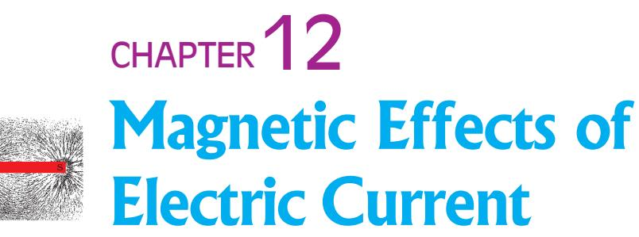

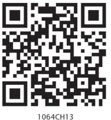

I n the previous Chapter on 'Electricity' we learnt about the heating effects of electric current. What could be the other effects of electric current? We know that an electric current-carrying wire behaves like a magnet. Let us perform the following Activity to reinforce it.

# Activity 12.1

- n Take a straight thick copper wire and place it between the points X and Y in an electric circuit, as shown in Fig. 12.1. The wire XY is kept perpendicular to the plane of paper.
- n Horizontally place a small compass near to this copper wire. See the position of its needle.
- n Pass the current through the circuit by inserting the key into the plug.
- n Observe the change in the position of the compass needle.

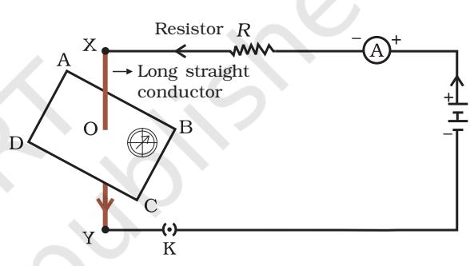

We see that the needle is deflected. What does it mean? It means that the electric current through the copper wire has produced a magnetic effect. Thus we can say that electricity and magnetism are linked to each other. Then, what about the reverse possibility of an electric effect of moving magnets? In this Chapter we will study magnetic fields and such electromagnetic effects. We shall also study about electromagnets which involve the magnetic effect of electric current.

## Hans Christian Oersted (1777–1851)

Hans Christian Oersted, one of the leading scientists of the 19th century, played a crucial role in understanding *electromagnetism*. In 1820 he accidentally discovered that a compass needle got deflected when an electric current passed through a metallic wire placed nearby. Through this observation Oersted showed that electricity and magnetism were related phenomena. His research later created technologies such as the radio, television and fiber optics. The unit of magnetic field strength is named the oersted in his honor.

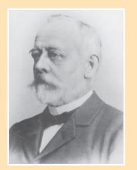

# 12.1 MAGNETIC FIELD AND FIELD LINES

We are familiar with the fact that a compass needle gets deflected when brought near a bar magnet. A compass needle is, in fact, a small bar magnet. The ends of the compass needle point approximately towards north and south directions. The end pointing towards north is called *north seeking* or north pole. The other end that points towards south is called *south seeking* or south pole. Through various activities we have observed that like poles repel, while unlike poles of magnets attract each other.

- n Fix a sheet of white paper on a drawing board using some adhesive material.
- n Place a bar magnet in the centre of it.
- n Sprinkle some iron filings uniformly around the bar magnet (Fig. 12.2). A salt-sprinkler may be used for this purpose.
- n Now tap the board gently.
- n What do you observe? *Figure 12.2*

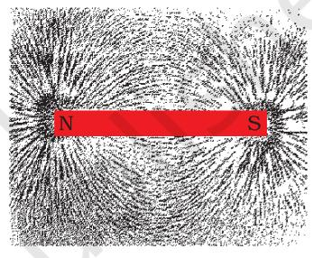

*Iron filings near the bar magnet align themselves along the field lines.*

The iron filings arrange themselves in a pattern as shown Fig. 12.2. Why do the iron filings arrange in such a pattern? What does this pattern demonstrate? The magnet exerts its influence in the region surrounding it. Therefore the iron filings experience a force. The force thus exerted makes iron filings to arrange in a pattern. The region surrounding a magnet, in which the force of the magnet can be detected, is said to have a magnetic field. The lines along which the iron filings align themselves represent magnetic field lines.

Are there other ways of obtaining magnetic field lines around a bar magnet? Yes, you can yourself draw the field lines of a bar magnet.

# Activity 12.3

- n Take a small compass and a bar magnet.
- n Place the magnet on a sheet of white paper fixed on a drawing board, using some adhesive material.
- n Mark the boundary of the magnet.
- n Place the compass near the north pole of the magnet. How does it behave? The south pole of the needle points towards the north pole of the magnet. The north pole of the compass is directed away from the north pole of the magnet.
- n Mark the position of two ends of the needle.
- n Now move the needle to a new position such that its south pole occupies the position previously occupied by its north pole.
- n In this way, proceed step by step till you reach the south pole of the magnet as shown in Fig. 12.3.
- n Join the points marked on the paper by a smooth curve. This curve represents a field line.
- n Repeat the above procedure and draw as many lines as you can. You will get a pattern shown in Fig. 12.4. These lines represent the magnetic field around the magnet. These are known as magnetic field lines.
- n Observe the deflection in the compass needle as you move it along a field line. The deflection increases as the needle is moved towards the poles.

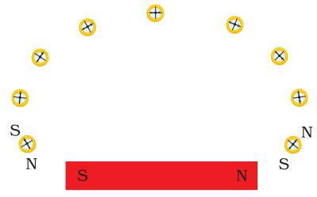

*Figure 12.3*

*Drawing a magnetic field line with the help of a compass needle*

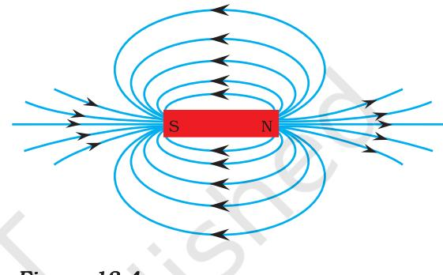

Magnetic field is a quantity that has both direction and magnitude. The direction of the magnetic field is taken to be the direction in which a north pole of the compass needle moves inside it. Therefore it is taken by convention that the field lines emerge from north pole and merge at the south pole (note the arrows marked on the field lines in Fig. 12.4). Inside the magnet, the direction of field lines is from its south pole to its north pole. Thus the magnetic field lines are closed curves.

The relative strength of the magnetic field is shown by the degree of closeness of the field lines. The field is stronger, that is, the force acting on the pole of another magnet placed is greater where the field lines are crowded (see Fig. 12.4).

No two field-lines are found to cross each other. If they did, it would mean that at the point of intersection, the compass needle would point towards two directions, which is not possible.

# 12.2 MAGNETIC FIELD DUE TO A CURRENT-CARRYING ARRYING CONDUCTOR

In Activity 12.1, we have seen that an electric current through a metallic conductor produces a magnetic field around it. In order to find the direction of the field produced let us repeat the activity in the following way –

# Activity 12.4

- n Take a long straight copper wire, two or three cells of 1.5 V each, and a plug key. Connect all of them in series as shown in Fig. 12.5 (a).
- n Place the straight wire parallel to and over a compass needle.
- n Plug the key in the circuit.
- n Observe the direction of deflection of the north pole of the needle. If the current flows from north to south, as shown in Fig. 12.5 (a), the north pole of the compass needle would move towards the east.
- n Replace the cell connections in the circuit as shown in Fig. 12.5 (b). This would result in the change of the direction of current through the copper wire, that is, from south to north.
- n Observe the change in the direction of deflection of the needle. You will see that now the needle moves in opposite direction, that is, towards the west [Fig. 12.5 (b)]. It means that the direction of magnetic field produced by the electric current is also reversed.

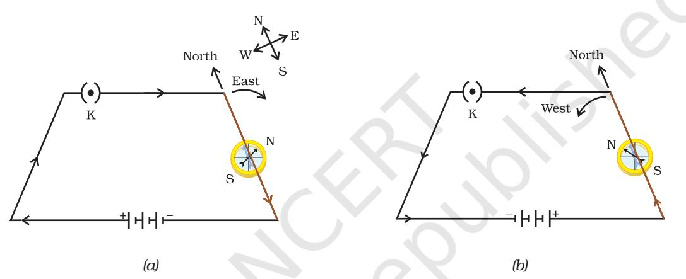

*Figure 12.5 A simple electric circuit in which a straight copper wire is placed parallel to and over a compass needle. The deflection in the needle becomes opposite when the direction of the current is reversed.*

# 12.2.1 Magnetic Field due to a Current through a Straight Conductor

What determines the pattern of the magnetic field generated by a current through a conductor? Does the pattern depend on the shape of the conductor? We shall investigate this with an activity.

We shall first consider the pattern of the magnetic field around a straight conductor carrying current.

# Activity 12.5

- n Take a battery (12 V), a variable resistance (or a rheostat), an ammeter (0–5 A), a plug key, connecting wires and a long straight thick copper wire.
- n Insert the thick wire through the centre, normal to the plane of a rectangular cardboard. Take care that the cardboard is fixed and does not slide up or down.
- n Connect the copper wire vertically between the points X and Y, as shown in Fig. 12.6 (a), in series with the battery, a plug and key.
- n Sprinkle some iron filings uniformly on the cardboard. (You may use a salt sprinkler for this purpose.)
- n Keep the variable of the rheostat at a fixed position and note the current through the ammeter.
- n Close the key so that a current flows through the wire. Ensure that the copper wire placed between the points X and Y remains vertically straight.
- n Gently tap the cardboard a few times. Observe the pattern of the iron filings. You would find that the iron filings align themselves showing a pattern of concentric circles around the copper wire (Fig. 12.6).
- n What do these concentric circles represent? They represent the magnetic field lines.
- n How can the direction of the magnetic field be found? Place a compass at a point (say P) over a circle. Observe the direction of the needle. The direction of the north pole of the compass needle would give the direction of the field lines produced by the electric current through the straight wire at point P. Show the direction by an arrow.
- n Does the direction of magnetic field lines get reversed if the direction of current through the straight copper wire is reversed? Check it.

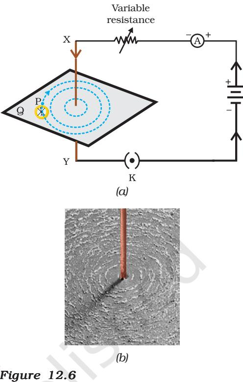

*(a) A pattern of concentric circles indicating the field lines of a magnetic field around a straight conducting wire. The arrows in the circles show the direction of the field lines. (b) A close up of the pattern obtained.*

What happens to the deflection of the compass needle placed at a given point if the current in the copper wire is changed? To see this, vary the current in the wire. We find that the deflection in the needle also changes. In fact, if the current is increased, the deflection also increases. It indicates that the magnitude of the magnetic field produced at a given point increases as the current through the wire increases.

What happens to the deflection of the needle if the compass is moved away from the copper wire but the current through the wire remains the same? To see this, now place the compass at a farther point from the conducting wire (say at point Q). What change do you observe? We see that the deflection in the needle decreases. Thus the magnetic field produced by a given current in the conductor decreases as the distance from it increases. From Fig. 12.6, it can be noticed that the concentric circles representing the magnetic field around a current-carrying straight wire become larger and larger as we move away from it.

## 12.2.2 Right-Hand Thumb Rule

A convenient way of finding the direction of magnetic field associated with a current-carrying conductor is given in Fig. 12.7.

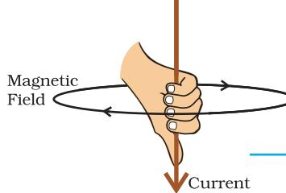

*Figure 12.7 Right-hand thumb rule*

Imagine that you are holding a current-carrying straight conductor in your right hand such that the thumb points towards the direction of current. Then your fingers will wrap around the conductor in the direction of the field lines of the magnetic field, as shown in Fig. 12.7. This is known as the right-hand thumb rule*.

### Example 12.1

A current through a horizontal power line flows in east to west direction. What is the direction of magnetic field at a point directly below it and at a point directly above it?

## Solution

The current is in the east-west direction. Applying the right-hand thumb rule, we get that the magnetic field (at any point below or above the wire) turns clockwise in a plane perpendicular to the wire, when viewed from the east end, and anti-clockwise, when viewed from the west end.

- 3. Why don't two magnetic field lines intersect each other?
# 12.2.3 Magnetic Field due to a Current through a Circular Loop

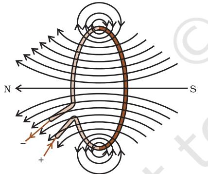

*Figure 12.8 Magnetic field lines of the field produced by a current-carrying circular loop*

We have so far observed the pattern of the magnetic field lines produced around a current-carrying straight wire. Suppose this straight wire is bent in the form of a circular loop and a current is passed through it. How would the magnetic field lines look like? We know that the magnetic field produced by a current-carrying straight wire depends inversely on the distance from it. Similarly at every point of a current-carrying circular loop, the concentric circles representing the magnetic field around it would become larger and larger as we move away from the wire (Fig. 12.8). By the time we reach at the centre of the circular loop, the arcs of these *big* circles would appear as straight lines. Every point on the wire carrying current would give rise to the magnetic field appearing as straight lines at the center of the loop. By applying the right hand rule, it is easy to check that every section of the wire contributes to the magnetic field lines in the same direction within the loop.

* <i>This rule is also called Maxwell's corkscrew rule. If we consider ourselves driving a *corkscrew in the direction of the current, then the direction of the rotation of corkscrew is the direction of the magnetic field.*

We know that the magnetic field produced by a current-carrying wire at a given point depends directly on the current passing through it. Therefore, if there is a circular coil having n turns, the field produced is n times as large as that produced by a single turn. This is because the current in each circular turn has the same direction, and the field due to each turn then just adds up.

# Activity 12.6

- n Take a rectangular cardboard having two holes. Insert a circular coil having large number of turns through them, normal to the plane of the cardboard.
- n Connect the ends of the coil in series with a battery, a key and a rheostat, as shown in Fig. 12.9.
- n Sprinkle iron filings uniformly on the cardboard.
- n Plug the key.
- n Tap the cardboard gently a few times. Note the pattern of the iron filings that emerges on the cardboard.

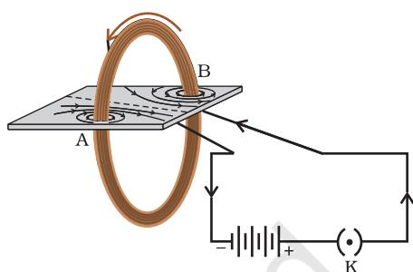

*Figure 12.9 Magnetic field produced by a currentcarrying circular coil.*

# 12.2.4 Magnetic Field due to a Current in a Solenoid

A coil of many circular turns of insulated copper wire wrapped closely in the shape of a cylinder is called a solenoid. The pattern of the magnetic field lines around a current-carrying solenoid is shown in Fig. 12.10. Compare the pattern of the field with the magnetic field around a bar magnet (Fig. 12.4). Do they look similar? Yes, they are similar. In fact, one end of the solenoid behaves as a magnetic north pole, while the other behaves as the south pole. The field lines inside the solenoid are in the form of parallel straight lines. This indicates that the magnetic field is the same at all points inside the solenoid. That is, the field is uniform inside the solenoid.

A strong magnetic field produced inside a solenoid can be used to magnetise a piece of magnetic material, like soft iron, when placed inside the coil (Fig. 12.11). The magnet so formed is called an electromagnet.

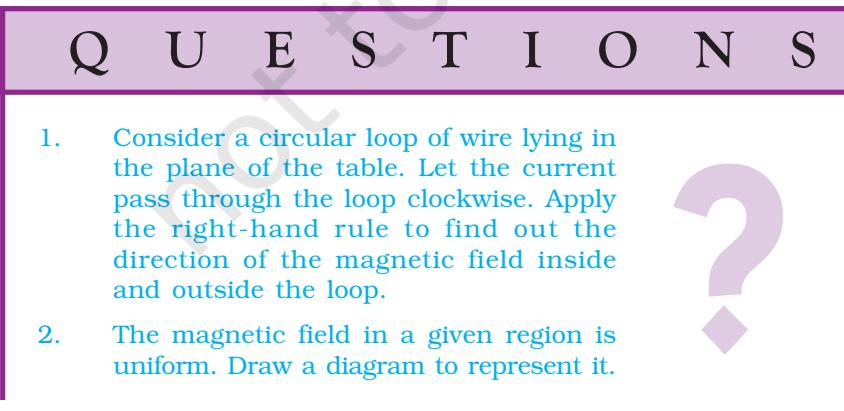

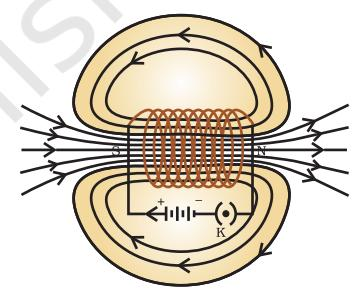

*Figure 12.10 Field lines of the magnetic field through and around a current carrying solenoid.*

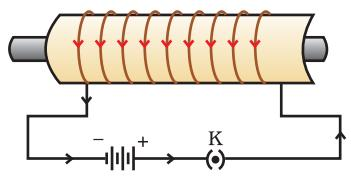

*Figure 12.11 A current-carrying solenoid coil is used to magnetise steel rod inside it – an electromagnet.*

3. Choose the correct option.

The magnetic field inside a long straight solenoid-carrying current

- (a) is zero.
- (b) decreases as we move towards its end.
- (c) increases as we move towards its end.
- (d) is the same at all points.

# 12.3 FORCE ON A CURRENT-CARRYING CONDUCTOR IN A MAGNETIC FIELD

We have learnt that an electric current flowing through a conductor produces a magnetic field. The field so produced exerts a force on a magnet placed in the vicinity of the conductor. French scientist Andre Marie Ampere (1775–1836) suggested that the magnet must also exert an equal and opposite force on the current-carrying conductor. The force due to a magnetic field acting on a current-carrying conductor can be demonstrated through the following activity.

# Activity 12.7

- n Take a small aluminium rod AB (of about 5 cm). Using two connecting wires suspend it horizontally from a stand, as shown in Fig. 12.12.
- n Place a strong horse-shoe magnet in such a way that the rod lies between the two poles with the magnetic field directed upwards. For this put the north pole of the magnet vertically below and south pole vertically above the aluminium rod (Fig. 12.12).
- n Connect the aluminium rod in series with a battery, a key and a rheostat.
- n Now pass a current through the aluminium rod from end B to end A.
- n What do you observe? It is observed that the rod is displaced towards the left. You will notice that the rod gets displaced.
- n Reverse the direction of current flowing through the rod and observe the direction of its displacement. It is now towards the right. Why does the rod get displaced?

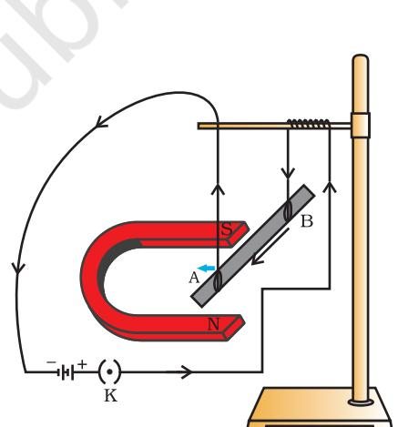

The displacement of the rod in the above activity suggests that a force is exerted on the current-carrying aluminium rod when it is placed in a magnetic field. It also suggests that the direction of force is also reversed when the direction of current through the conductor is reversed. Now change the direction of field to vertically downwards by interchanging the two poles of the magnet. It is once again observed that

the direction of force acting on the current-carrying rod gets reversed. It shows that the direction of the force on the conductor depends upon the direction of current and the direction of the magnetic field. Experiments have shown that the displacement of the rod is largest (or the magnitude of the force is the highest) when the direction of current is at right angles to the direction of the magnetic field. In such a condition we can use a simple rule to find the direction of the force on the conductor.

In Activity 12.7, we considered the direction of the current and that of the magnetic field perpendicular to each other and found that the force is perpendicular to both of them. The three directions can be illustrated through a simple rule, called Fleming's left-hand rule. According to this rule, stretch the thumb, forefinger and middle finger of your left hand such that they are mutually perpendicular (Fig. 12.13). If the first finger points in the direction of magnetic field and the second finger in the direction of current, then the thumb will point in the direction of motion or the force acting on the conductor.

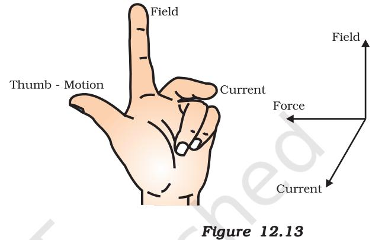

*Figure 12.14*

Devices that use current-carrying conductors and magnetic fields include electric motor, electric generator, loudspeakers, microphones and measuring instruments.

## Example 12.2

An electron enters a magnetic field at right angles to it, as shown in Fig. 12.14. The direction of force acting on the electron will be

- (a) to the right.
- (b) to the left.
- (c) out of the page.
- (d) into the page.

## Solution

Answer is option (d). The direction of force is perpendicular to the direction of magnetic field and current as given by Fleming's left hand rule. Recall that the direction of current is taken opposite to the direction of motion of electrons. The force is therefore directed into the page.

- 2. In Activity 12.7, how do we think the displacement of rod AB will be affected if (i) current in rod AB is increased; (ii) a stronger horse-shoe magnet is used; and (iii) length of the rod AB is increased?
- 3. A positively-charged particle (alpha-particle) projected towards west is deflected towards north by a magnetic field. The direction of magnetic field is
	- (a) towards south (b) towards east
	- (c) downward (d) upward

#### Magnetism in medicine

More to Know!

An electric current always produces a magnetic field. Even weak ion currents that travel along the nerve cells in our body produce magnetic fields. When we touch something, our nerves carry an electric impulse to the muscles we need to use. This impulse produces a temporary magnetic field. These fields are very weak and are about one-billionth of the earth's magnetic field. Two main organs in the human body where the magnetic field produced is significant, are the heart and the brain. The magnetic field inside the body forms the basis of obtaining the images of different body parts. This is done using a technique called Magnetic Resonance Imaging (MRI). Analysis of these images helps in medical diagnosis. Magnetism has, thus, got important uses in medicine.

# 12.4 DOMESTIC ELECTRIC CIRCUITS

In our homes, we receive supply of electric power through a main supply (also called mains), either supported through overhead electric poles or by underground cables. One of the wires in this supply, usually with red insulation cover, is called live wire (or positive). Another wire, with black insulation, is called neutral wire (or negative). In our country, the potential difference between the two is 220 V.

At the meter-board in the house, these wires pass into an electricity meter through a main fuse. Through the main switch they are connected to the line wires in the house. These wires supply electricity to separate circuits within the house. Often, two separate circuits are used, one of 15 A current rating for appliances with higher power ratings such as geysers, air coolers, etc. The other circuit is of 5 A current rating for bulbs, fans, etc. The earth wire, which has insulation of green colour, is usually connected to a metal plate deep in the earth near the house. This is used as a safety measure, especially for those appliances that have a metallic body, for example, electric press, toaster, table fan, refrigerator, etc. The metallic body is connected to the earth wire, which provides a low-resistance conducting path for the current. Thus, it ensures that any leakage of current to the metallic body of the appliance keeps its potential to that of the earth, and the user may not get a severe electric shock.

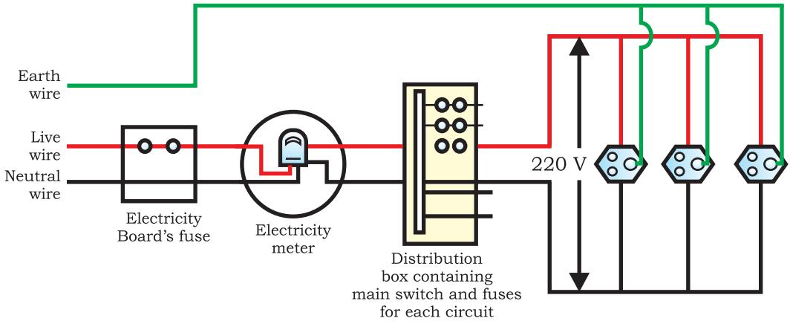

*Figure 12.15 A schematic diagram of one of the common domestic circuits*

Figure 12.15 gives a schematic diagram of one of the common domestic circuits. In each separate circuit, different appliances can be connected across the live and neutral wires. Each appliance has a separate switch to 'ON'/'OFF' the flow of current through it. In order that each appliance has equal potential difference, they are connected parallel to each other.

Electric fuse is an important component of all domestic circuits. We have already studied the principle and working of a fuse in the previous chapter (see Section 11.7). A fuse in a circuit prevents damage to the appliances and the circuit due to overloading. Overloading can occur when the live wire and the neutral wire come into direct contact. (This occurs when the insulation of wires is damaged or there is a fault in the appliance.) In such a situation, the current in the circuit abruptly increases. This is called short-circuiting. The use of an electric fuse prevents the electric circuit and the appliance from a possible damage by stopping the flow of unduly high electric current. The Joule heating that takes place in the fuse melts it to break the electric circuit. Overloading can also occur due to an accidental hike in the supply voltage. Sometimes overloading is caused by connecting too many appliances to a single socket.

# What you have learnt

- n A compass needle is a small magnet. Its one end, which points towards north, is called a north pole, and the other end, which points towards south, is called a south pole.
- n A magnetic field exists in the region surrounding a magnet, in which the force of the magnet can be detected.
- n Field lines are used to represent a magnetic field. A field line is the path along which a hypothetical free north pole would tend to move. The direction of the magnetic field at a point is given by the direction that a north pole placed at that point would take. Field lines are shown closer together where the magnetic field is greater.
- n A metallic wire carrying an electric current has associated with it a magnetic field. The field lines about the wire consist of a series of concentric circles whose direction is given by the right-hand rule.
- n The pattern of the magnetic field around a conductor due to an electric current flowing through it depends on the shape of the conductor. The magnetic field of a solenoid carrying a current is similar to that of a bar magnet.
- n An electromagnet consists of a core of soft iron wrapped around with a coil of insulated copper wire.
- n A current-carrying conductor when placed in a magnetic field experiences a force. If the direction of the field and that of the current are mutually perpendicular to each other, then the force acting on the conductor will be perpendicular to both and will be given by Fleming's left-hand rule.
- n In our houses we receive AC electric power of 220 V with a frequency of 50 Hz. One of the wires in this supply is with red insulation, called live wire. The other one is of black insulation, which is a neutral wire. The potential difference between the two is 220 V. The third is the earth wire that has green insulation and this is connected to a metallic body deep inside earth. It is used as a safety measure to ensure that any leakage of current to a metallic body does not give any severe shock to a user.
- n Fuse is the most important safety device, used for protecting the circuits due to short-circuiting or overloading of the circuits.

# EXERCISES

- 1. Which of the following correctly describes the magnetic field near a long straight wire?
	- (a) The field consists of straight lines perpendicular to the wire.
	- (b) The field consists of straight lines parallel to the wire.
	- (c) The field consists of radial lines originating from the wire.
	- (d) The field consists of concentric circles centred on the wire.
- 2. At the time of short circuit, the current in the circuit
	- (a) reduces substantially.
	- (b) does not change.
	- (c) increases heavily.
	- (d) vary continuously.
- 3. State whether the following statements are true or false.
	- (a) The field at the centre of a long circular coil carrying current will be parallel straight lines.
	- (b) A wire with a green insulation is usually the live wire of an electric supply.
- 4. List two methods of producing magnetic fields.
- 5. When is the force experienced by a current–carrying conductor placed in a magnetic field largest?
- 6. Imagine that you are sitting in a chamber with your back to one wall. An electron beam, moving horizontally from back wall towards the front wall, is deflected by a strong magnetic field to your right side. What is the direction of magnetic field?
- 7. State the rule to determine the direction of a (i) magnetic field produced around a straight conductor-carrying current, (ii) force experienced by a current-carrying straight conductor placed in a magnetic field which is perpendicular to it, and (iii) current induced in a coil due to its rotation in a magnetic field.
- 8. When does an electric short circuit occur?
- 9. What is the function of an earth wire? Why is it necessary to earth metallic appliances?

