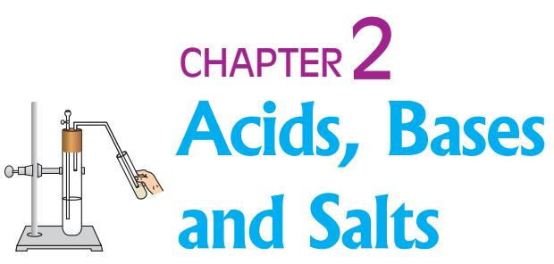
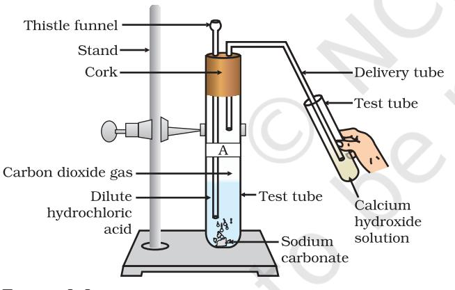
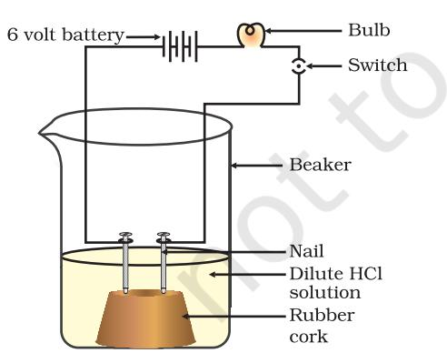
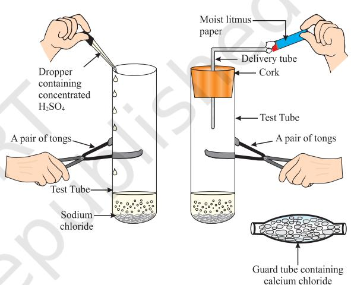
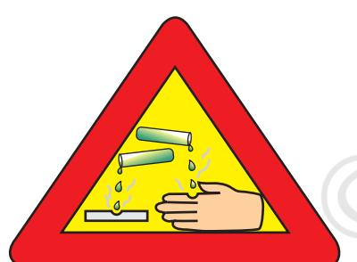
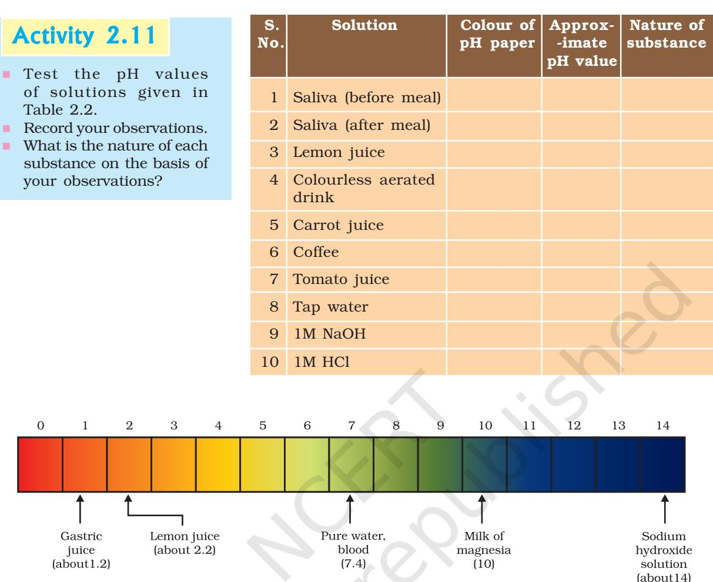
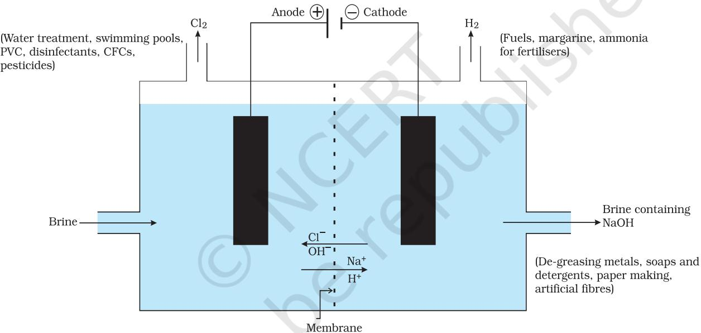
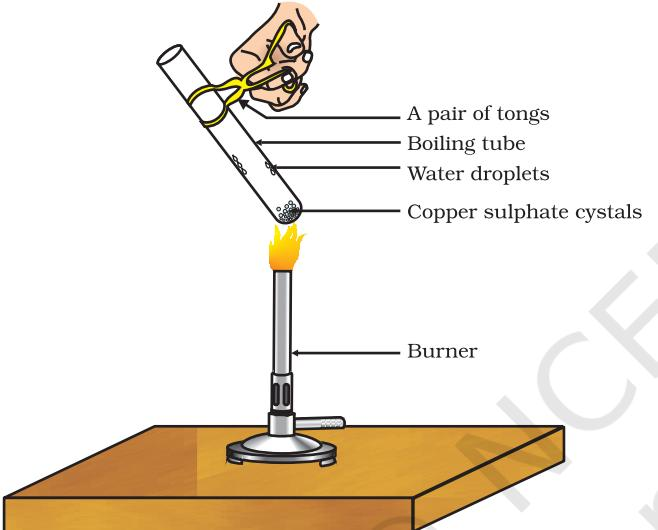
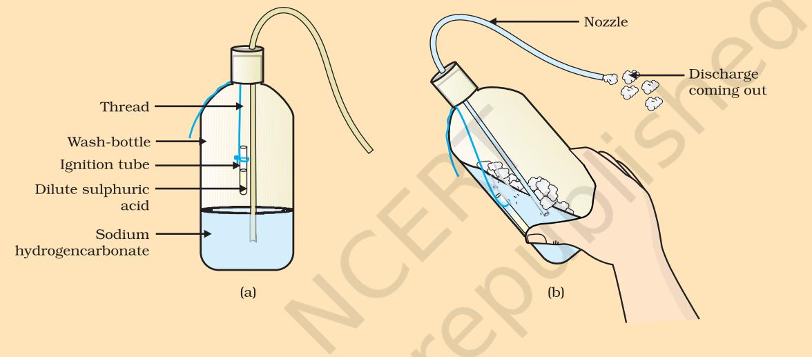

Y ou have learnt in your previous classes that the sour and bitter tastes of food are due to acids and bases, respectively, present in them. If someone in the family is suffering from a problem of acidity after overeating, which of the following would you suggest as a remedy– lemon juice, vinegar or baking soda solution?

- n Which property did you think of while choosing the remedy? Surely you must have used your knowledge about the ability of acids and bases to nullify each other's effect.
- n Recall how we tested sour and bitter substances without tasting them.

You already know that acids are sour in taste and change the colour of blue litmus to red, whereas, bases are bitter and change the colour of the red litmus to blue. Litmus is a natural indicator, turmeric is another such indicator. Have you noticed that a stain of curry on a white cloth becomes reddish-brown when soap, which is basic in nature, is scrubbed on it? It turns yellow again when the cloth is washed with plenty of water. You can also use synthetic indicators such as methyl orange and phenolphthalein to test for acids and bases.

In this Chapter, we will study the reactions of acids and bases, how acids and bases cancel out each other's effects and many more interesting things that we use and see in our day-to-day life.

Litmus solution is a purple dye, which is extracted from lichen, a plant belonging to the division Thallophyta, and is commonly used as an indicator. When the litmus solution is neither acidic nor basic, its colour is purple. There are many other natural materials like red cabbage leaves, turmeric, coloured petals of some flowers such as *Hydrangea*, *Petunia* and *Geranium*, which indicate the presence of acid or base in a solution. These are called acid-base indicators or sometimes simply indicators.

# QUESTION

- 1. You have been provided with three test tubes. One of them contains distilled water and the other two contain an acidic solution and a basic solution, respectively. If you are given only red litmus paper, how will you identify the contents of each test tube?
## 2.1 UNDERST UNDERSTANDING THE CHEMICAL PROPERTIES OF ACIDS AND BASES

- 2.1.1 Acids and Bases in the Laboratory
## Activity 2.1

- n Collect the following solutions from the science laboratory– hydrochloric acid (HCl), sulphuric acid (H2SO4 ), nitric acid (HNO3 ), acetic acid (CH3COOH), sodium hydroxide (NaOH), calcium hydroxide [Ca(OH)2 ], potassium hydroxide (KOH), magnesium hydroxide [Mg(OH)2 ], and ammonium hydroxide (NH4OH).
- n Put a drop of each of the above solutions on a watch-glass one by one and test with a drop of the indicators shown in Table 2.1.
- n What change in colour did you observe with red litmus, blue litmus, phenolphthalein and methyl orange solutions for each of the solutions taken?
- n Tabulate your observations in Table 2.1.

### Table 2.1


These indicators tell us whether a substance is acidic or basic by change in colour. There are some substances whose odour changes in acidic or basic media. These are called olfactory indicators. Let us try out some of these indicators.

## Activity 2.2

- n Take some finely chopped onions in a plastic bag along with some strips of clean cloth. Tie up the bag tightly and leave overnight in the fridge. The cloth strips can now be used to test for acids and bases.
- n Take two of these cloth strips and check their odour.
- n Keep them on a clean surface and put a few drops of dilute HCl solution on one strip and a few drops of dilute NaOH solution on the other.

?

- n Rinse both cloth strips with water and again check their odour.
- n Note your observations.
- n Now take some dilute vanilla essence and clove oil and check their odour.
- n Take some dilute HCl solution in one test tube and dilute NaOH solution in another. Add a few drops of dilute vanilla essence to both test tubes and shake well. Check the odour once again and record changes in odour, if any.
- n Similarly, test the change in the odour of clove oil with dilute HCl and dilute NaOH solutions and record your observations.

Which of these – vanilla, onion and clove, can be used as olfactory indicators on the basis of your observations?

Let us do some more activities to understand the chemical properties of acids and bases.

- 2.1.2 How do Acids and Bases React with Metals?
## Activity 2.3

CAUTION: This activity needs the teacher's assistance.

- n Set the apparatus as shown in Fig. 2.1.
- n Take about 5 mL of dilute sulphuric acid in a test tube and add a few pieces of zinc granules to it.
- n What do you observe on the surface of zinc granules?
- n Pass the gas being evolved through the soap solution.
- n Why are bubbles formed in the soap solution?
- n Take a burning candle near a gas filled bubble.
- n What do you observe?
- n Repeat this Activity with some more acids like HCl, HNO3 and CH3COOH.
- n Are the observations in all the cases the same or different?


*Figure 2.1 Reaction of zinc granules with dilute sulphuric acid and testing hydrogen gas by burning*

Note that the metal in the above reactions displaces hydrogen atoms from the acids as hydrogen gas and forms a compound called a salt. Thus, the reaction of a metal with an acid can be summarised as –

Acid + Metal → Salt + Hydrogen gas

Can you now write the equations for the reactions you have observed?

## Activity 2.4

- n Place a few pieces of granulated zinc metal in a test tube.
- n Add 2 mL of sodium hydroxide solution and warm the contents of the test tube.
- n Repeat the rest of the steps as in Activity 2.3 and record your observations.

The reaction that takes place can be written as follows.

2NaOH(aq) + Zn(s) → Na2ZnO2 (s) + H2 (g) (Sodium zincate)

You find again that hydrogen is formed in the reaction. However, such reactions are not possible with all metals.

2.1.3 How do Metal Carbonates and Metal Hydrogencarbonates React with Acids?



#### *Figure 2.2*

*Passing carbon dioxide gas through calcium hydroxide solution*

## Activity 2.5

- n Take two test tubes, label them as A and B.
- n Take about 0.5 g of sodium carbonate (Na2CO3 ) in test tube A and about 0.5 g of sodium hydrogencarbonate (NaHCO3 ) in test tube B.
- n Add about 2 mL of dilute HCl to both the test tubes.
- n What do you observe?
- n Pass the gas produced in each case through lime water (calcium hydroxide solution) as shown in Fig. 2.2 and record your observations.

The reactions occurring in the above Activity are written as –

Test tube A: Na CO HCl(aq) Cl(aq) H O(l) + CO 2 3 2 2 (s) + 2 → 2Na + (g) Test tube B: NaHCO HCl(aq) Cl(aq) H O(l) + CO 3 2 2 (s) Na + → + (g) On passing the carbon dioxide gas evolved through lime water,

> Ca(OH) CO H O(l) 2 2 2 (aq) (g) CaCO s + → 3 ( ) + (Lime water) (White precipitate)

On passing excess carbon dioxide the following reaction takes place:

CaCO s 3 Ca(HCO aq 3 ( )+ H O(l)+ CO (g) → ) ( ) 2 2 2 (Soluble in water)

Limestone, chalk and marble are different forms of calcium carbonate. All metal carbonates and hydrogencarbonates react with acids to give a corresponding salt, carbon dioxide and water.

Thus, the reaction can be summarised as –

Metal carbonate/Metal hydrogencarbonate + Acid → Salt + Carbon dioxide + Water

### 2.1.4 How do Acids and Bases React with each other?

Activity 2.6

- n Take about 2 mL of dilute NaOH solution in a test tube and add two drops of phenolphthalein solution.
- n What is the colour of the solution?
- n Add dilute HCl solution to the above solution drop by drop.
- n Is there any colour change for the reaction mixture?
- n Why did the colour of phenolphthalein change after the addition of an acid?
- n Now add a few drops of NaOH to the above mixture.
- n Does the pink colour of phenolphthalein reappear?
- n Why do you think this has happened?

In the above Activity, we have observed that the effect of a base is nullified by an acid and vice-versa. The reaction taking place is written as –

NaOH(aq) + HCl(aq) → NaCl(aq) + H2O(l)

The reaction between an acid and a base to give a salt and water is known as a neutralisation reaction. In general, a neutralisation reaction can be written as –

Base + Acid → Salt + Water

### 2.1.5 Reaction of Metallic Oxides with Acids

## Activity 2.7

- n Take a small amount of copper oxide in a beaker and add dilute hydrochloric acid slowly while stirring.
- n Note the colour of the solution. What has happened to the copper oxide?

You will notice that the colour of the solution becomes blue-green and the copper oxide dissolves. The blue-green colour of the solution is due to the formation of copper(II) chloride in the reaction. The general reaction between a metal oxide and an acid can be written as –

Metal oxide + Acid → Salt + Water

Now write and balance the equation for the above reaction. Since metallic oxides react with acids to give salts and water, similar to the reaction of a base with an acid, metallic oxides are said to be basic oxides.

## 2.1.6 Reaction of a Non-metallic Oxide with Base

You saw the reaction between carbon dioxide and calcium hydroxide (lime water) in Activity 2.5. Calcium hydroxide, which is a base, reacts with carbon dioxide to produce a salt and water. Since this is similar to the reaction between a base and an acid, we can conclude that nonmetallic oxides are acidic in nature.

# QUESTIONS

- 1. Why should curd and sour substances not be kept in brass and copper vessels?
- 2. Which gas is usually liberated when an acid reacts with a metal? Illustrate with an example. How will you test for the presence of this gas?
- 3. Metal compound A reacts with dilute hydrochloric acid to produce effervescence. The gas evolved extinguishes a burning candle. Write a balanced chemical equation for the reaction if one of the compounds formed is calcium chloride.

## 2.2 WHAT DO ALL ACIDS AND ALL BASES HAVE IN COMMON?

In Section 2.1 we have seen that all acids have similar chemical properties. What leads to this similarity in properties? We saw in Activity 2.3 that all acids generate hydrogen gas on reacting with metals, so hydrogen seems to be common to all acids. Let us perform an Activity to investigate whether all compounds containing hydrogen are acidic.



*Figure 2.3 Acid solution in water conducts electricity*

## Activity 2.8

- n Take solutions of glucose, alcohol, hydrochloric acid, sulphuric acid, etc.
- n Fix two nails on a cork, and place the cork in a 100 mL beaker.
- n Connect the nails to the two terminals of a 6 volt battery through a bulb and a switch, as shown in Fig. 2.3.
- n Now pour some dilute HCl in the beaker and switch on the current.
- n Repeat with dilute sulphuric acid.
- n What do you observe?
- n Repeat the experiment separately with glucose and alcohol solutions. What do you observe now?
- n Does the bulb glow in all cases?

?

The bulb will start glowing in the case of acids, as shown in Fig. 2.3. But you will observe that glucose and alcohol solutions do not conduct electricity. Glowing of the bulb indicates that there is a flow of electric current through the solution. The electric current is carried through the acidic solution by ions.

Acids contain H+ ion as cation and anion such as Cl – in HCl, NO3 – in HNO3 , SO2– 4 in H2 SO4 , CH3COO– in CH3COOH. Since the cation present in acids is H+ , this suggests that acids produce hydrogen ions, H+ (aq), in solution, which are responsible for their acidic properties.

Repeat the same Activity using alkalis such as sodium hydroxide, calcium hydroxide, etc. What can you conclude from the results of this Activity?

### 2.2.1 What Happens to an Acid or a Base in a Water Solution?

Do acids produce ions only in aqueous solution? Let us test this.

## Activity 2.9

- n Take about 1g solid NaCl in a clean and dry test tube and set up the apparatus as shown in Fig. 2.4.
- n Add some concentrated sulphuric acid to the test tube.
- n What do you observe? Is there a gas coming out of the delivery tube?
- n Test the gas evolved successively with dry and wet blue litmus paper.
- n In which case does the litmus paper change colour?
- n On the basis of the above Activity, what do you infer about the acidic character of: (i) dry HCl gas
	-



(ii) HCl solution? *Figure 2.4 Preparation of* HCl *gas*

Note to teachers: If the climate is very humid, you will have to pass the gas produced through a guard tube (drying tube) containing calcium chloride to dry the gas.

This experiment suggests that hydrogen ions in HCl are produced in the presence of water. The separation of H+ ion from HCl molecules cannot occur in the absence of water.

#### HCl + H2O → H3O+ + Cl–

Hydrogen ions cannot exist alone, but they exist after combining with water molecules. Thus hydrogen ions must always be shown as H+ (aq) or hydronium ion (H3O+ ).

#### H+ + H2O → H3O+

We have seen that acids give H3O+ or H+ (aq) ion in water. Let us see what happens when a base is dissolved in water.

> NaOH(s) → H O2 Na+ (aq) + OH– (aq)

KOH(s) K (aq)+OH (aq) → H O2 + –

#### Mg(OH)2 (s) → H O2 Mg2+(aq)+2OH– (aq)

Bases generate hydroxide (OH– ) ions in water. Bases which are soluble in water are called alkalis.

All bases do not dissolve in water. An alkali is a base that dissolves in water. They are soapy to touch, bitter and corrosive. Never taste or touch them as they may cause harm. Which of the bases in the Table 2.1 are alkalis?

> Now as we have identified that all acids generate H+ (aq) and all bases generate OH– (aq), we can view the neutralisation reaction as follows –

> > Acid + Base → Salt + Water

H X + M OH → MX + HOH

H+ (aq) + OH – (aq) → H2O(l)

Let us see what is involved when water is mixed with an acid or a base.



Do You

Know?

*Warning sign displayed on containers containing concentrated acids and*

## Activity 2.10

- n Take 10 mL water in a beaker.
- n Add a few drops of concentrated H2SO4 to it and swirl the beaker slowly.
- n Touch the base of the beaker.
- n Is there a change in temperature?
- n Is this an exothermic or endothermic process?
- n Repeat the above Activity with sodium hydroxide pellets and record your observations. *Figure 2.5*

*bases* The process of dissolving an acid or a base in water is a highly exothermic one. Care must be taken while mixing concentrated nitric acid or sulphuric acid with water. The acid must always be added slowly to water with constant stirring. If water is added to a concentrated acid, the heat generated may cause the mixture to splash out and cause burns. The glass container may also break due to excessive local heating. Look out for the warning sign (shown in Fig. 2.5) on the can of concentrated sulphuric acid and on the bottle of sodium hydroxide pellets.

> Mixing an acid or base with water results in decrease in the concentration of ions (H3O+/OH– ) per unit volume. Such a process is called dilution and the acid or the base is said to be diluted.

# QUESTIONS

- 1. Why do HCl, HNO3 , etc., show acidic characters in aqueous solutions while solutions of compounds like alcohol and glucose do not show acidic character?
- 2. Why does an aqueous solution of an acid conduct electricity?
- 3. Why does dry HCl gas not change the colour of the dry litmus paper?
- 4. While diluting an acid, why is it recommended that the acid should be added to water and not water to the acid?
- 5. How is the concentration of hydronium ions (H3O+ ) affected when a solution of an acid is diluted?
- 6. How is the concentration of hydroxide ions (OH – ) affected when excess base is dissolved in a solution of sodium hydroxide?

## 2.3 HOW STRONG ARE ACID OR BASE SOLUTIONS?

We know how acid-base indicators can be used to distinguish between an acid and a base. We have also learnt in the previous section about dilution and decrease in concentration of H+ or OH– ions in solutions. Can we quantitatively find the amount of these ions present in a solution? Can we judge how strong a given acid or base is?

We can do this by making use of a universal indicator, which is a mixture of several indicators. The universal indicator shows different colours at different concentrations of hydrogen ions in a solution.

A scale for measuring hydrogen ion concentration in a solution, called pH scale has been developed. The p in pH stands for '*potenz*' in German, meaning power. On the pH scale we can measure pH generally from 0 (very acidic) to 14 (very alkaline). pH should be thought of simply as a number which indicates the acidic or basic nature of a solution. Higher the hydronium ion concentration, lower is the pH value.

The pH of a neutral solution is 7. Values less than 7 on the pH scale represent an acidic solution. As the pH value increases from 7 to 14, it represents an increase in OH– ion concentration in the solution, that is, increase in the strength of alkali (Fig. 2.6). Generally paper impregnated with the universal indicator is used for measuring pH.


?



*Figure 2.7* pH *of some common substances shown on a* pH *paper (colours are only a rough guide)*

The strength of acids and bases depends on the number of H+ ions and OH– ions produced, respectively. If we take hydrochloric acid and acetic acid of the same concentration, say one molar, then these produce different amounts of hydrogen ions. Acids that give rise to more H+ ions are said to be strong acids, and acids that give less H+ ions are said to be weak acids. Can you now say what weak and strong bases are?

## 2.3.1 Importance of pH in Everyday Lifeyday Life yday Life

### Are plants and animals pH sensitive?

Our body works within the pH range of 7.0 to 7.8. Living organisms can survive only in a narrow range of pH change. When pH of rain water is less than 5.6, it is called acid rain. When acid rain flows into the rivers, it lowers the pH of the river water. The survival of aquatic life in such rivers becomes difficult.

#### Acids in other planets The atmosphere of venus is made up of thick white and yellowish clouds of sulphuric acid. Do you think life can exist on this planet? Do You Know?

### What is the pH of the soil in your backyard?

Plants require a specific pH range for their healthy growth. To find out the pH required for the healthy growth of a plant, you can collect the soil from various places and check the pH in the manner described below in Activity 2.12. Also, you can note down which plants are growing in the region from which you have collected the soil.

## Activity 2.12

- n Put about 2 g soil in a test tube and add 5 mL water to it.
- n Shake the contents of the test tube.
- n Filter the contents and collect the filtrate in a test tube.
- n Check the pH of this filtrate with the help of universal indicator paper.
- n What can you conclude about the ideal soil pH for the growth of plants in your region?

#### pH in our digestive system

It is very interesting to note that our stomach produces hydrochloric acid. It helps in the digestion of food without harming the stomach. During indigestion the stomach produces too much acid and this causes pain and irritation. To get rid of this pain, people use bases called antacids. One such remedy must have been suggested by you at the beginning of this Chapter. These antacids neutralise the excess acid. Magnesium hydroxide (Milk of magnesia), a mild base, is often used for this purpose.

#### pH change as the cause of tooth decay

Tooth decay starts when the pH of the mouth is lower than 5.5. Tooth enamel, made up of calcium hydroxyapatite (a crystalline form of calcium phosphate) is the hardest substance in the body. It does not dissolve in water, but is corroded when the pH in the mouth is below 5.5. Bacteria present in the mouth produce acids by degradation of sugar and food particles remaining in the mouth after eating. The best way to prevent this is to clean the mouth after eating food. Using toothpastes, which are generally basic, for cleaning the teeth can neutralise the excess acid and prevent tooth decay.

#### Self defence by animals and plants through chemical warfare

Have you ever been stung by a honey-bee? Bee-sting leaves an acid which causes pain and irritation. Use of a mild base like baking soda on the stung area gives relief. Stinging hair of nettle leaves inject methanoic acid causing burning pain.

#### Nature provides neutralisation options

Nettle is a herbaceous plant which grows in the wild. Its leaves have stinging hair, which cause painful stings when touched accidentally. This is due to the methanoic acid secreted by them. A traditional remedy is rubbing the area with the leaf of the dock plant, which often grows beside the nettle in the wild. Can you guess the nature of the dock plant? So next time you know what to look out for if you accidentally touch a nettle plant while trekking. Are you aware of any other effective traditional remedies for such stings?

### Table 2.3 Some naturally occurring acids

Do You Know?

| Natural source | Acid | Natural source | Acid |
| --- | --- | --- | --- |
| Vinegar | Acetic acid | Sour milk (Curd) | Lactic acid |
| Orange | Citric acid | Lemon | Citric acid |
| Tamarind | Tartaric acid | Ant sting | Methanoic acid |
| Tomato | Oxalic acid | Nettle sting | Methanoic acid |

# QUESTIONS

- 1. You have two solutions, A and B. The pH of solution A is 6 and pH of solution B is 8. Which solution has more hydrogen ion concentration? Which of this is acidic and which one is basic?
- 2. What effect does the concentration of H+ (aq) ions have on the nature of the solution?
- 3. Do basic solutions also have H+ (aq) ions? If yes, then why are these basic?
- 4. Under what soil condition do you think a farmer would treat the soil of his fields with quick lime (calcium oxide) or slaked lime (calcium hydroxide) or chalk (calcium carbonate)?

## 2.4 MORE ABOUT SALTS

In the previous sections we have seen the formation of salts during various reactions. Let us understand more about their preparation, properties and uses.

2.4.1 Family of Salts

## Activity 2.13

- n Write the chemical formulae of the salts given below. Potassium sulphate, sodium sulphate, calcium sulphate, magnesium sulphate, copper sulphate, sodium chloride, sodium nitrate, sodium carbonate and ammonium chloride.
?

- n Identify the acids and bases from which the above salts may be obtained.
- n Salts having the same positive or negative radicals are said to belong to a family. For example, NaCl and Na2SO4 belong to the family of sodium salts. Similarly, NaCl and KCl belong to the family of chloride salts. How many families can you identify among the salts given in this Activity?

## 2.4.2 pH of Salts

## Activity 2.14

- n Collect the following salt samples sodium chloride, potassium nitrate, aluminium chloride, zinc sulphate, copper sulphate, sodium acetate, sodium carbonate and sodium hydrogencarbonate (some other salts available can also be taken).
- n Check their solubility in water (use distilled water only).
- n Check the action of these solutions on litmus and find the pH using a pH paper.
- n Which of the salts are acidic, basic or neutral?
- n Identify the acid or base used to form the salt.
- n Report your observations in Table 2.4.

Salts of a strong acid and a strong base are neutral with pH value of 7. On the other hand, salts of a strong acid and weak base are acidic with pH value less than 7 and those of a strong base and weak acid are basic in nature, with pH value more than 7.

## 2.4.3 Chemicals from Common Salt

By now you have learnt that the salt formed by the combination of hydrochloric acid and sodium hydroxide solution is called sodium chloride. This is the salt that you use in food. You must have observed in the above Activity that it is a neutral salt.

Seawater contains many salts dissolved in it. Sodium chloride is separated from these salts. Deposits of solid salt are also found in several parts of the world. These large crystals are often brown due to impurities. This is called rock salt. Beds of rock salt were formed when seas of bygone ages dried up. Rock salt is mined like coal.


You must have heard about Mahatma Gandhi's *Dandi March*. Did you know that sodium chloride was such an important symbol in our struggle for freedom?

Acids, Bases and Salts 29

| Table 2.4 |  |  |  |
| --- | --- | --- | --- |
| Salt | pH | Acid used | Base used |

#### Common salt — A raw material for chemicals

The common salt thus obtained is an important raw material for various materials of daily use, such as sodium hydroxide, baking soda, washing soda, bleaching powder and many more. Let us see how one substance is used for making all these different substances.

#### Sodium hydroxide

When electricity is passed through an aqueous solution of sodium chloride (called brine), it decomposes to form sodium hydroxide. The process is called the chlor-alkali process because of the products formed– chlor for chlorine and alkali for sodium hydroxide.

#### 2NaCl(aq) + 2H2O(l) → 2NaOH(aq) + Cl2 (g) + H2 (g)

Chlorine gas is given off at the anode, and hydrogen gas at the cathode. Sodium hydroxide solution is formed near the cathode. The three products produced in this process are all useful. Figure 2.8 shows the different uses of these products.



*Figure 2.8 Important products from the chlor-alkali process*

#### Bleaching powder

You have already come to know that chlorine is produced during the electrolysis of aqueous sodium chloride (brine). This chlorine gas is used for the manufacture of bleaching powder. Bleaching powder is produced by the action of chlorine on dry slaked lime [Ca(OH)2 ]. Bleaching powder is represented as CaOCl2 , though the actual composition is quite complex.

> Ca(OH)2 + Cl2 → CaOCl2 + H2O

#### Bleaching powder is used –

- (i) for bleaching cotton and linen in the textile industry, for bleaching wood pulp in paper factories and for bleaching washed clothes in laundry;
- (ii) as an oxidising agent in many chemical industries; and
- (iii) to make drinking water free from germs.

#### Baking soda

The baking soda is commonly used in the kitchen for making tasty crispy pakoras, etc. Sometimes it is added for faster cooking. The chemical name of the compound is sodium hydrogencarbonate (NaHCO3 ). It is produced using sodium chloride as one of the raw materials.

> NaCl + H O + CO + NH NH Cl + NaHCO 2 2 3 → 4 3 (Ammonium (Sodium chloride) hydrogencarbonate)

Did you check the pH of sodium hydrogencarbonate in Activity 2.14? Can you correlate why it can be used to neutralise an acid? It is a mild non-corrosive basic salt. The following reaction takes place when it is heated during cooking –

> 2NaHCO3 Na CO + H O+CO 2 3 2 2 → Heat (Sodium (Sodium hydrogencarbonate) carbonate)

Sodium hydrogencarbonate has got various uses in the household.

#### Uses of Baking soda

- (i) For making baking powder, which is a mixture of baking soda (sodium hydrogencarbonate) and a mild edible acid such as tartaric acid. When baking powder is heated or mixed in water, the following reaction takes place –
NaHCO3 + H+ → CO2 + H2O + Sodium salt of acid (From any acid)

Carbon dioxide produced during the reaction can cause bread or cake to rise making them soft and spongy.

- (ii) Sodium hydrogencarbonate is also an ingredient in antacids. Being alkaline, it neutralises excess acid in the stomach and provides relief.
- (iii) It is also used in soda-acid fire extinguishers.

#### Washing soda

Another chemical that can be obtained from sodium chloride is Na2CO3 .10H2O (washing soda). You have seen above that sodium carbonate can be obtained by heating baking soda; recrystallisation of sodium carbonate gives washing soda. It is also a basic salt.

```
Na CO H O Na CO H O
Sodium
carbonate
  2 3 + → 10 2 2 3 10 2
                     .
(
      )
```
What does 10H2O signify? Does it make Na2CO3 wet? We will address this question in the next section.

Sodium carbonate and sodium hydrogencarbonate are useful chemicals for many industrial processes as well.

#### Uses of washing soda

- (i) Sodium carbonate (washing soda) is used in glass, soap and paper industries.
- (ii) It is used in the manufacture of sodium compounds such as borax.
- (iii) Sodium carbonate can be used as a cleaning agent for domestic purposes.
- (iv) It is used for removing permanent hardness of water.

### 2.4.4 Are the Crystals of Salts really Dry?



## Activity 2.15

- n Heat a few crystals of copper sulphate in a dry boiling tube.
- n What is the colour of the copper sulphate after heating?
- n Do you notice water droplets in the boiling tube? Where have these come from?
- n Add 2-3 drops of water on the sample of copper sulphate obtained after heating.
- n What do you observe? Is the blue colour of copper sulphate restored?

*Figure 2.9 Removing water of crystallisation*

Copper sulphate crystals which seem to be dry contain water of crystallisation. When we heat the crystals, this water is removed and the salt turns white.

If you moisten the crystals again with water, you will find that blue colour of the crystals reappears.

Water of crystallisation is the fixed number of water molecules present in one formula unit of a salt. Five water molecules are present in one formula unit of copper sulphate. Chemical formula for hydrated copper sulphate is Cu SO4 . 5H2O. Now you would be able to answer the question whether the molecule of Na2CO3 .10H2O is wet.

One other salt, which possesses water of crystallisation is gypsum. It has two water molecules as water of cyrstallisation. It has the chemical formula CaSO4 .2H2O. Let us look into the use of this salt.

#### Plaster of Paris

On heating gypsum at 373 K, it loses water molecules and becomes

calcium sulphate hemihydrate ( 4 2 1 CaSO . H O 2 ). This is called Plaster of Paris, the substance which doctors use as plaster for supporting fractured bones in the right position. Plaster of Paris is a white powder and on mixing with water, it changes to gypsum once again giving a hard solid mass.

$$\mathbf{\frac{CaSO_{4}\cdot\frac{1}{2}\ H_{2}O+1\frac{1}{2}H_{2}O\to CaSO_{4}\cdot2H_{2}O}{(Pl a s t e r o f\ P a r i s)}}$$

Note that only half a water molecule is shown to be attached as water of crystallisation. How can you get half a water molecule? It is written in this form because two formula units of CaSO4 share one molecule of water. Plaster of Paris is used for making toys, materials for decoration and for making surfaces smooth. Try to find out why is calcium sulphate hemihydrate called 'Plaster of Paris' ?

# QUESTIONS

- 1. What is the common name of the compound CaOCl2 ?
- 2. Name the substance which on treatment with chlorine yields bleaching powder.
- 3. Name the sodium compound which is used for softening hard water.
- 4. What will happen if a solution of sodium hydrocarbonate is heated? Give the equation of the reaction involved.
- 5. Write an equation to show the reaction between Plaster of Paris and water.

# What you have learnt

- n Acid-base indicators are dyes or mixtures of dyes which are used to indicate the presence of acids and bases.
- n Acidic nature of a substance is due to the formation of H+ (aq) ions in solution. Formation of OH– (aq) ions in solution is responsible for the basic nature of a substance.
- n When an acid reacts with a metal, hydrogen gas is evolved and a corresponding salt is formed.
- n When a base reacts with a metal, along with the evolution of hydrogen gas a salt is formed which has a negative ion composed of the metal and oxygen.
- n When an acid reacts with a metal carbonate or metal hydrogencarbonate, it gives the corresponding salt, carbon dioxide gas and water.
- n Acidic and basic solutions in water conduct electricity because they produce hydrogen and hydroxide ions respectively.

?

- n The strength of an acid or an alkali can be tested by using a scale called the pH scale (0-14) which gives the measure of hydrogen ion concentration in a solution.
- n A neutral solution has a pH of exactly 7, while an acidic solution has a pH less than 7 and a basic solution a pH more than 7.
- n Living beings carry out their metabolic activities within an optimal pH range.
- n Mixing concentrated acids or bases with water is a highly exothermic process.
- n Acids and bases neutralise each other to form corresponding salts and water.
- n Water of crystallisation is the fixed number of water molecules present in one formula unit of a salt.
- n Salts have various uses in everyday life and in industries.

# EXERCISES

- 1. A solution turns red litmus blue, its pH is likely to be
	- (a) 1 (b) 4 (c) 5 (d) 10
- 2. A solution reacts with crushed egg-shells to give a gas that turns lime-water milky. The solution contains
	- (a) NaCl (b) HCl (c) LiCl (d) KCl

3. 10 mL of a solution of NaOH is found to be completely neutralised by 8 mL of a given solution of HCl. If we take 20 mL of the same solution of NaOH, the amount HCl solution (the same solution as before) required to neutralise it will be

- (a) 4 mL (b) 8 mL (c) 12 mL (d) 16 mL
- 4. Which one of the following types of medicines is used for treating indigestion?
	- (a) Antibiotic
	- (b) Analgesic
	- (c) Antacid
	- (d) Antiseptic
- 5. Write word equations and then balanced equations for the reaction taking place when –
	- (a) dilute sulphuric acid reacts with zinc granules.
	- (b) dilute hydrochloric acid reacts with magnesium ribbon.
	- (c) dilute sulphuric acid reacts with aluminium powder.
	- (d) dilute hydrochloric acid reacts with iron filings.
- 6. Compounds such as alcohols and glucose also contain hydrogen but are not categorised as acids. Describe an Activity to prove it.
- 7. Why does distilled water not conduct electricity, whereas rain water does?
- 8. Why do acids not show acidic behaviour in the absence of water?
- 9. Five solutions A,B,C,D and E when tested with universal indicator showed pH as 4,1,11,7 and 9, respectively. Which solution is
	- (a) neutral?
	- (b) strongly alkaline?
	- (c) strongly acidic?
	- (d) weakly acidic?
	- (e) weakly alkaline?
	- Arrange the pH in increasing order of hydrogen-ion concentration.
- 10. Equal lengths of magnesium ribbons are taken in test tubes A and B. Hydrochloric acid (HCl) is added to test tube A, while acetic acid (CH3COOH) is added to test tube B. Amount and concentration taken for both the acids are same. In which test tube will the fizzing occur more vigorously and why?
- 11. Fresh milk has a pH of 6. How do you think the pH will change as it turns into curd? Explain your answer.
- 12. A milkman adds a very small amount of baking soda to fresh milk.
	- (a) Why does he shift the pH of the fresh milk from 6 to slightly alkaline?
	- (b) Why does this milk take a long time to set as curd?
- 13. Plaster of Paris should be stored in a moisture-proof container. Explain why?
- 14. What is a neutralisation reaction? Give two examples.
- 15. Give two important uses of washing soda and baking soda.

# Group Activity

### (I) Prepare your own indicator

- n Crush beetroot in a mortar.
- n Add sufficient water to obtain the extract.
- n Filter the extract by the procedure learnt by you in earlier classes.
- n Collect the filtrate to test the substances you may have tasted earlier.
- n Arrange four test tubes in a test tube stand and label them as A,B,C and D. Pour 2 mL each of lemon juice solution, soda-water, vinegar and baking soda solution in them respectively.
- n Put 2-3 drops of the beetroot extract in each test tube and note the colour change if any. Write your observation in a Table.
- n You can prepare indicators by using other natural materials like extracts of red cabbage leaves, coloured petals of some flowers such as *Petunia*, *Hydrangea* and *Geranium*.

#### (II) Preparing a soda-acid fire extinguisher

The reaction of acids with metal hydrogencarbonates is used in the fire extinguishers which produce carbon dioxide.

- n Take 20 mL of sodium hydrogencarbonate (NaHCO3 ) solution in a wash-bottle.
- n Suspend an ignition tube containing dilute sulphuric acid in the wash-bottle (Fig. 2.10).
- n Close the mouth of the wash-bottle.
- n Tilt the wash-bottle so that the acid from the ignition tube mixes with the sodium hydrogencarbonate solution below.
- n You will notice discharge coming out of the nozzle.
- n Direct this discharge on a burning candle. What happens?



*Figure 2.10 (a) Ignition tube containing dilute sulphuric acid suspended in a wash-bottle containing sodium hydrogencarbonate, (b) Discharge coming out of the nozzle*

