I n Class IX you have learnt about various elements. You have seen that elements can be classified as metals or non-metals on the basis of their properties.

- n Think of some uses of metals and non-metals in your daily life.
- n What properties did you think of while categorising elements as metals or non-metals?

n How are these properties related to the uses of these elements? Let us look at some of these properties in detail.

# 3.1 PHYSICAL PROPERTIES

# 3.1.1 Metals

The easiest way to start grouping substances is by comparing their physical properties. Let us study this with the help of the following activities. For performing Activities 3.1 to 3.6, collect the samples of following metals – iron, copper, aluminium, magnesium, sodium, lead, zinc and any other metal that is easily available.

# Activity 3.1

- n Take samples of iron, copper, aluminium and magnesium. Note the appearance of each sample.
- n Clean the surface of each sample by rubbing them with sand paper and note their appearance again.

Metals, in their pure state, have a shining surface. This property is called metallic lustre.

# Activity 3.2

- n Take small pieces of iron, copper, aluminium, and magnesium. Try to cut these metals with a sharp knife and note your observations.
- n Hold a piece of sodium metal with a pair of tongs. CAUTION: Always handle sodium metal with care. Dry it by pressing between the folds of a filter paper.
- n Put it on a watch-glass and try to cut it with a knife.
- n What do you observe?

You will find that metals are generally hard. The hardness varies from metal to metal.

# Activity 3.3

- n Take pieces of iron, zinc, lead and copper.
- n Place any one metal on a block of iron and strike it four or five times with a hammer. What do you observe?
- n Repeat with other metals.
- n Record the change in the shape of these metals.

You will find that some metals can be beaten into thin sheets. This property is called malleability. Did you know that gold and silver are the most malleable metals?

## Activity 3.4

- n List the metals whose wires you have seen in daily life.
The ability of metals to be drawn into thin wires is called ductility. Gold is the most ductile metal. You will be surprised to know that a wire of about 2 km length can be drawn from one gram of gold.

It is because of their malleability and ductility that metals can be given different shapes according to our needs.

Can you name some metals that are used for making cooking vessels? Do you know why these metals are used for making vessels? Let us do the following Activity to find out the answer.

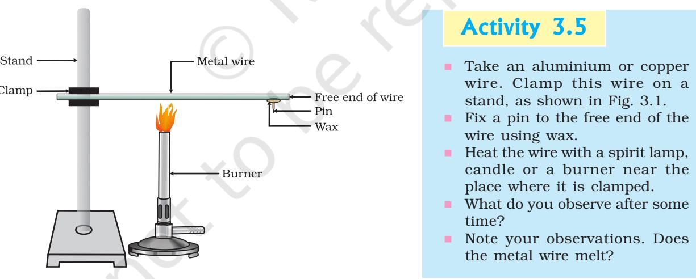

### *Figure 3.1 Metals are good conductors of heat.*

The above activity shows that metals are good conductors of heat and have high melting points. The best conductors of heat are silver and copper. Lead and mercury are comparatively poor conductors of heat.

Do metals also conduct electricity? Let us find out.

# Activity 3.6

- n Set up an electric circuit as shown in Fig. 3.2.
- n Place the metal to be tested in the circuit
- between terminals A and B as shown.
- n Does the bulb glow? What does this indicate?

You must have seen that the wires that carry current in your homes have a coating of polyvinylchloride (PVC) or a rubber-like material. Why are electric wires coated with such substances?

What happens when metals strike a hard surface? Do they produce a sound? The metals that produce a sound on striking a hard surface are said to be sonorous. Can you now say why school bells are made of metals?

# 3.1.2 Non-metals

In the previous Class you have learnt that there are very few non-metals as compared to metals. Some of the examples of non-metals are carbon, sulphur, iodine, oxygen, hydrogen, etc. The non-metals are either solids or gases except bromine which is a liquid.

Do non-metals also have physical properties similar to that of metals? Let us find out.

# Activity 3.7

- n Collect samples of carbon (coal or graphite), sulphur and iodine.
- n Carry out the Activities 3.1 to 3.4 and 3.6 with these non-metals and record your observations.

Compile your observations regarding metals and non-metals in Table 3.1.

### Table 3.1

| Element | Symbol | Type of | Hardness | Malleability | Ductility | Conducts | Sonority |
| --- | --- | --- | --- | --- | --- | --- | --- |
|  |  | surface |  |  |  | Electricity |  |

On the bases of the observations recorded in Table 3.1, discuss the general physical properties of metals and non-metals in the class. You must have concluded that we cannot group elements according to their physical properties alone, as there are many exceptions. For example –

- (i) All metals except mercury exist as solids at room temperature. In Activity 3.5, you have observed that metals have high melting
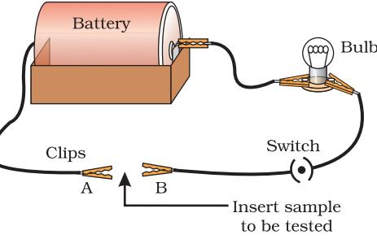

*Figure 3.2 Metals are good conductors of electricity.*

points but gallium and caesium have very low melting points. These two metals will melt if you keep them on your palm.

- (ii) Iodine is a non-metal but it is lustrous.
- (iii) Carbon is a non-metal that can exist in different forms. Each form is called an allotrope. Diamond, an allotrope of carbon, is the hardest natural substance known and has a very high melting and boiling point. Graphite, another allotrope of carbon, is a conductor of electricity.
- (iv) Alkali metals (lithium, sodium, potassium) are so soft that they can be cut with a knife. They have low densities and low melting points.

Elements can be more clearly classified as metals and non-metals on the basis of their chemical properties.

# Activity 3.8

- n Take a magnesium ribbon and some sulphur powder.
- n Burn the magnesium ribbon. Collect the ashes formed and dissolve them in water.
- n Test the resultant solution with both red and blue litmus paper.
- n Is the product formed on burning magnesium acidic or basic?
- n Now burn sulphur powder. Place a test tube over the burning sulphur to collect the fumes produced.
- n Add some water to the above test tube and shake.
- n Test this solution with blue and red litmus paper.
- n Is the product formed on burning sulphur acidic or basic?
- n Can you write equations for these reactions?

 Most non-metals produce acidic oxides when dissolve in water. On the other hand, most metals, give rise to basic oxides. You will be learning more about these metal oxides in the next section.


## 3.2 CHEMICAL PROPERTIES OF METALS

We will learn about the chemical properties of metals in the following Sections 3.2.1 to 3.2.4. For this, collect the samples of following metals – aluminium, copper, iron, lead, magnesium, zinc and sodium.

# 3.2.1 What happens when Metals are burnt in Air?

You have seen in Activity 3.8 that magnesium burns in air with a dazzling white flame. Do all metals react in the same manner? Let us check by performing the following Activity.

# Activity 3.9

CAUTION: The following activity needs the teacher's assistance. It would be better if students wear eye protection.

- n Hold any of the samples taken above with a pair of tongs and try burning over a flame. Repeat with the other metal samples.
- n Collect the product if formed.
- n Let the products and the metal surface cool down.
- n Which metals burn easily?
- n What flame colour did you observe when the metal burnt?
- n How does the metal surface appear after burning?
- n Arrange the metals in the decreasing order of their reactivity towards oxygen.
- n Are the products soluble in water?

Almost all metals combine with oxygen to form metal oxides.

```
Metal + Oxygen → Metal oxide
```
 For example, when copper is heated in air, it combines with oxygen to form copper(II) oxide, a black oxide.

> 2Cu + O2 → 2CuO (Copper) (Copper(II) oxide)

Similarly, aluminium forms aluminium oxide.

4Al + 3O2 → 2Al2O3 (Aluminium) (Aluminium oxide)

Recall from Chapter 2, how copper oxide reacts with hydrochloric acid. We have learnt that metal oxides are basic in nature. But some metal oxides, such as aluminium oxide, zinc oxide show both acidic as well as basic behaviour. Such metal oxides which react with both acids as well as bases to produce salts and water are known as amphoteric oxides. Aluminium oxide reacts in the following manner with acids and bases –

Al2O3 + 6HCl → 2AlCl3 + 3H2O Al2O3 + 2NaOH → 2NaAlO2 + H2O (Sodium aluminate)

 Most metal oxides are insoluble in water but some of these dissolve in water to form alkalis. Sodium oxide and potassium oxide dissolve in water to produce alkalis as follows –

Na2O(s) + H2O(l) → 2NaOH(aq) K2O(s) + H2O(l) → 2KOH(aq)

We have observed in Activity 3.9 that all metals do not react with oxygen at the same rate. Different metals show different reactivities towards oxygen. Metals such as potassium and sodium react so vigorously that they catch fire if kept in the open. Hence, to protect them and to prevent accidental fires, they are kept immersed in kerosene oil. At ordinary temperature, the surfaces of metals such as magnesium, aluminium, zinc, lead, etc., are covered with a thin layer of oxide. The protective oxide layer prevents the metal from further oxidation. Iron does not burn on heating but iron filings burn vigorously when sprinkled in the flame of the burner. Copper does not burn, but the hot metal is coated with a black coloured layer of copper(II) oxide. Silver and gold do not react with oxygen even at high temperatures.

Anodising is a process of forming a thick oxide layer of aluminium. Aluminium develops a thin oxide layer when exposed to air. This aluminium oxide coat makes it resistant to further corrosion. The resistance can be improved further by making the oxide layer thicker. During anodising, a clean aluminium article is made the anode and is electrolysed with dilute sulphuric acid. The oxygen gas evolved at the anode reacts with aluminium to make a thicker protective oxide layer. This oxide layer can be dyed easily to give aluminium articles an attractive finish.

> After performing Activity 3.9, you must have observed that sodium is the most reactive of the samples of metals taken here. The reaction of magnesium is less vigorous implying that it is not as reactive as sodium. But burning in oxygen does not help us to decide about the reactivity of zinc, iron, copper or lead. Let us see some more reactions to arrive at a conclusion about the order of reactivity of these metals.

## 3.2.2 What happens when Metals react with Water?

# Activity 3.10

CAUTION: This Activity needs the teacher's assistance.

- n Collect the samples of the same metals as in Activity 3.9.
- n Put small pieces of the samples separately in beakers half-filled with cold water.
- n Which metals reacted with cold water? Arrange them in the increasing order of their reactivity with cold water.
- n Did any metal produce fire on water?
- n Does any metal start floating after some time?
- n Put the metals that did not react with cold water in beakers half-filled with hot water.
- n For the metals that did not react with hot water, arrange the apparatus as shown in Fig. 3.3 and observe their reaction with steam.
- n Which metals did not react even with steam?
- n Arrange the metals in the decreasing order of reactivity with water.

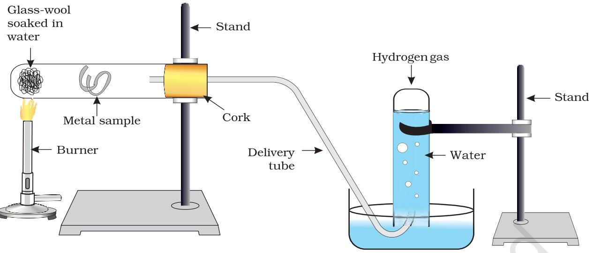

*Figure 3.3 Action of steam on a metal*

Metals react with water and produce a metal oxide and hydrogen gas. Metal oxides that are soluble in water dissolve in it to further form metal hydroxide. But all metals do not react with water.

```
Metal + Water → Metal oxide + Hydrogen
Metal oxide + Water → Metal hydroxide
```
Metals like potassium and sodium react violently with cold water. In case of sodium and potassium, the reaction is so violent and exothermic that the evolved hydrogen immediately catches fire.

```
2K(s) + 2H2O(l) → 2KOH(aq) + H2
                                  (g) + heat energy
2Na(s) + 2H2O(l) → 2NaOH(aq) + H2
                                  (g) + heat energy
```
The reaction of calcium with water is less violent. The heat evolved is not sufficient for the hydrogen to catch fire.

```
Ca(s) + 2H2O(l) → Ca(OH)2
                            (aq) + H2
                                     (g)
```
Calcium starts floating because the bubbles of hydrogen gas formed stick to the surface of the metal.

Magnesium does not react with cold water. It reacts with hot water to form magnesium hydroxide and hydrogen. It also starts floating due to the bubbles of hydrogen gas sticking to its surface.

Metals like aluminium, iron and zinc do not react either with cold or hot water. But they react with steam to form the metal oxide and hydrogen.

> 2Al(s) + 3H2O(g) → Al2O3 (s) + 3H2 (g) 3Fe(s) + 4H2O(g) → Fe3O4 (s) + 4H2 (g)

Metals such as lead, copper, silver and gold do not react with water at all.

## 3.2.3 What happens when Metals react with Acids?

You have already learnt that metals react with acids to give a salt and hydrogen gas.

### Metal + Dilute acid → Salt + Hydrogen

But do all metals react in the same manner? Let us find out.

# Activity 3.11

- n Collect all the metal samples except sodium and potassium again. If the samples are tarnished, rub them clean with sand paper. CAUTION: Do not take sodium and potassium as they react vigorously even with cold water.
- n Put the samples separately in test tubes containing dilute hydrochloric acid.
- n Suspend thermometers in the test tubes, so that their bulbs are dipped in the acid.
- n Observe the rate of formation of bubbles carefully.
- n Which metals reacted vigorously with dilute hydrochloric acid?
- n With which metal did you record the highest temperature?
- n Arrange the metals in the decreasing order of reactivity with dilute acids.

Write equations for the reactions of magnesium, aluminium, zinc and iron with dilute hydrochloric acid.

Hydrogen gas is not evolved when a metal reacts with nitric acid. It is because HNO3 is a strong oxidising agent. It oxidises the H2 produced to water and itself gets reduced to any of the nitrogen oxides (N2O, NO, NO2 ). But magnesium (Mg) and manganese (Mn) react with very dilute HNO3 to evolve H2 gas.

You must have observed in Activity 3.11, that the rate of formation of bubbles was the fastest in the case of magnesium. The reaction was also the most exothermic in this case. The reactivity decreases in the order Mg > Al > Zn > Fe. In the case of copper, no bubbles were seen and the temperature also remained unchanged. This shows that copper does not react with dilute HCl.

*Aqua regia,* (Latin for 'royal water') is a freshly prepared mixture of concentrated hydrochloric acid and concentrated nitric acid in the ratio of 3:1. It can dissolve gold, even though neither of these acids can do so alone. *Aqua regia* is a highly corrosive, fuming liquid. It is one of the few reagents that is able to dissolve gold and platinum.

> 3.2.4 How do Metals react with Solutions of other Metal Salts?

# Activity 3.12

- n Take a clean wire of copper and an iron nail.
- n Put the copper wire in a solution of iron sulphate and the iron nail in a solution of copper sulphate taken in test tubes (Fig. 3.4).
- n Record your observations after 20 minutes.
- n In which test tube did you find that a reaction has occurred?
- n On what basis can you say that a reaction has actually taken place?
- n Can you correlate your observations for the Activities 3.9, 3.10 and 3.11?
- n Write a balanced chemical equation for the reaction that has taken place.
- n Name the type of reaction.

Reactive metals can displace less reactive metals from their compounds in solution or molten form.

We have seen in the previous sections that all metals are not equally reactive. We checked the reactivity of various metals with oxygen, water and acids. But all metals do not react with these reagents. So we were not able to put all the metal samples we had collected in decreasing order of their reactivity. Displacement reactions studied in Chapter 1 give better evidence about the reactivity of metals. It is simple and easy if metal A displaces metal B from its solution, it is more reactive than B.

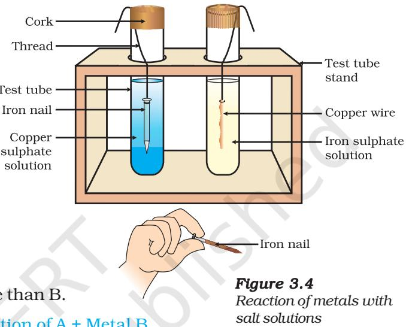

Metal A + Salt solution of B → Salt solution of A + Metal B

Which metal, copper or iron, is more reactive according to your observations in Activity 3.12?

# 3.2.5 The Reactivity Series

The reactivity series is a list of metals arranged in the order of their decreasing activities. After performing displacement experiments (Activities 1.9 and 3.12), the following series, (Table 3.2) known as the reactivity or activity series has been developed.

Table 3.2 Activity series : Relative reactivities of metals

| K | Potassium | Most reactive |
| --- | --- | --- |
| Na | Sodium |  |
| Ca | Calcium |  |
| Mg | Magnesium |  |
| Al | Aluminium |  |
| Zn | Zinc | Reactivity decreases |
| Fe | Iron |  |
| Pb | Lead |  |
| [H] | [Hydrogen] |  |
| Cu | Copper |  |
| Hg | Mercury |  |
| Ag | Silver |  |
| Au | Gold | Least reactive |

# QUESTIONS

- 1. Why is sodium kept immersed in kerosene oil?
- 2. Write equations for the reactions of
	- (i) iron with steam
	- (ii) calcium and potassium with water
- 3. Samples of four metals A, B, C and D were taken and added to the following solution one by one. The results obtained have been tabulated as follows.

| 1. |  | Why is sodium kept immersed in kerosene oil? |  |  |  |
| --- | --- | --- | --- | --- | --- |
| 2. | Write equations for the reactions of |  |  |  |  |
|  | (i) (ii) | iron with steam |  |  | ? |
|  |  | calcium and potassium with water |  |  |  |
| 3. | Samples of four metals A, B, C and D were taken and added to the following solution one by one. The results obtained have been tabulated |  |  |  |  |
|  | as follows. |  |  |  |  |
|  | Metal | Iron(II) sulphate | Copper(II) sulphate | Zinc sulphate | Silver nitrate |
|  | A | No reaction | Displacement |  |  |
|  | B | Displacement |  | No reaction |  |
|  | C | No reaction | No reaction | No reaction | Displacement |
| D |  | No reaction | No reaction | No reaction | No reaction |

Use the Table above to answer the following questions about metals A, B, C and D.

- (i) Which is the most reactive metal?
- (ii) What would you observe if B is added to a solution of Copper(II) sulphate?
- (iii) Arrange the metals A, B, C and D in the order of decreasing reactivity.
- 4. Which gas is produced when dilute hydrochloric acid is added to a reactive metal? Write the chemical reaction when iron reacts with dilute H2SO4 .
- 5. What would you observe when zinc is added to a solution of iron(II) sulphate? Write the chemical reaction that takes place.

# 3.3 HOW DO METALS AND NON-METALS REA ALS REACT?

In the above activities, you saw the reactions of metals with a number of reagents. Why do metals react in this manner? Let us recall what we learnt about the electronic configuration of elements in Class IX. We learnt that noble gases, which have a completely filled valence shell, show little chemical activity. We, therefore, explain the reactivity of elements as a tendency to attain a completely filled valence shell.

Let us have a look at the electronic configuration of noble gases and some metals and non-metals.

We can see from Table 3.3 that a sodium atom has one electron in its outermost shell. If it loses the electron from its M shell then its L shell now becomes the outermost shell and that has a stable octet. The nucleus of this atom still has 11 protons but the number of electrons has become 10, so there is a net positive charge giving us a sodium cation Na+ . On the other hand chlorine has seven electrons in its outermost shell

| Type of | Element | Atomic |  | Number of |  |  |
| --- | --- | --- | --- | --- | --- | --- |
| element |  | number |  |  | electrons in shells |  |
|  |  |  | K | L | M | N |
| Noble gases | Helium (He) | 2 | 2 |  |  |  |
|  | Neon (Ne) | 10 | 2 | 8 |  |  |
|  | Argon (Ar) | 18 | 2 | 8 | 8 |  |
| Metals | Sodium (Na) | 11 | 2 | 8 | 1 |  |
|  | Magnesium (Mg) | 12 | 2 | 8 | 2 |  |
|  | Aluminium (Al) | 13 | 2 | 8 | 3 |  |
|  | Potassium (K) | 19 | 2 | 8 | 8 | 1 |
|  | Calcium (Ca) | 20 | 2 | 8 | 8 | 2 |
| Non-metals | Nitrogen (N) | 7 | 2 | 5 |  |  |
|  | Oxygen (O) | 8 | 2 | 6 |  |  |
|  | Fluorine (F) | 9 | 2 | 7 |  |  |
|  | Phosphorus (P) | 15 | 2 | 8 | 5 |  |
|  | Sulphur (S) | 16 | 2 | 8 | 6 |  |
|  | Chlorine (Cl) | 17 | 2 | 8 | 7 |  |

Table 3.3 Electronic configurations of some elements

and it requires one more electron to complete its octet. If sodium and chlorine were to react, the electron lost by sodium could be taken up by chlorine. After gaining an electron, the chlorine atom gets a unit negative charge, because its nucleus has 17 protons and there are 18 electrons in its K, L and M shells. This gives us a chloride anion C1– . So both these elements can have a give-and-take relation between them as follows (Fig. 3.5).

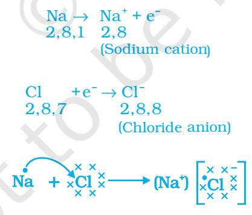

*Figure 3.5 Formation of sodium chloride*

Sodium and chloride ions, being oppositely charged, attract each other and are held by strong electrostatic forces of attraction to exist as sodium chloride (NaCl). It should be noted that sodium chloride does not exist as molecules but aggregates of oppositely charged ions.

Let us see the formation of one more ionic compound, magnesium chloride (Fig. 3.6).

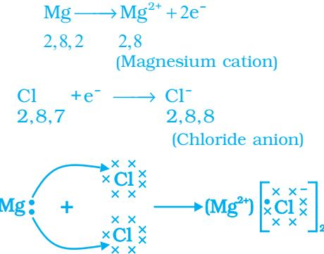

*Figure 3.6 Formation of magnesium chloride*

The compounds formed in this manner by the transfer of electrons from a metal to a non-metal are known as ionic compounds or electrovalent compounds. Can you name the cation and anion present in MgCl2 ?

# 3.3.1 Properties of Ionic Compounds

To learn about the properties of ionic compounds, let us perform the following Activity:

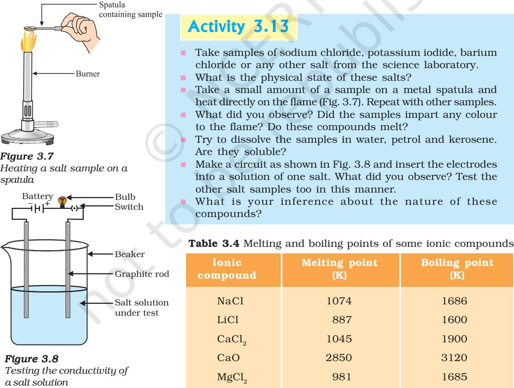

You may have observed the following general properties for ionic compounds—

- (i) *Physical nature*: Ionic compounds are solids and are somewhat hard because of the strong force of attraction between the positive and negative ions. These compounds are generally brittle and break into pieces when pressure is applied.
- (ii) *Melting and Boiling points*: Ionic compounds have high melting and boiling points (see Table 3.4). This is because a considerable amount of energy is required to break the strong inter-ionic attraction.
- (iii) *Solubility*: Electrovalent compounds are generally soluble in water and insoluble in solvents such as kerosene, petrol, etc.
- (iv) *Conduction of Electricity*: The conduction of electricity through a solution involves the movement of charged particles. A solution of an ionic compound in water contains ions, which move to the opposite electrodes when electricity is passed through the solution. Ionic compounds in the solid state do not conduct electricity because movement of ions in the solid is not possible due to their rigid structure. But ionic compounds conduct electricity in the molten state. This is possible in the molten state since the elecrostatic forces of attraction between the oppositely charged ions are overcome due to the heat. Thus, the ions move freely and conduct electricity.

# QUESTIONS

- 1. (i) Write the electron-dot structures for sodium, oxygen and magnesium.
	- (ii) Show the formation of Na2O and MgO by the transfer of electrons.
	- (iii) What are the ions present in these compounds?
- 2. Why do ionic compounds have high melting points?

# 3.4 OCCURRENCE OF METALS

The earth's crust is the major source of metals. Seawater also contains some soluble salts such as sodium chloride, magnesium chloride, etc. The elements or compounds, which occur naturally in the earth's crust, are known as minerals. At some places, minerals contain a very high percentage of a particular metal and the metal can be profitably extracted from it. These minerals are called ores.

# 3.4.1 Extraction of Metals

You have learnt about the reactivity series of metals. Having this knowledge, you can easily understand how a metal is extracted from its ore. Some metals are found in the earth's crust in the free state. Some are found in the form of their compounds. The metals at the bottom of the activity series are the least reactive. They are often found in a free ?

K Na Ca Mg Al Zn Fe Pb Cu Ag Au Reduction using carbon Found in native state Electrolysis


*Activity series and related metallurgy*

state. For example, gold, silver, platinum and copper are found in the free state. Copper and silver are also found in the combined state as their sulphide or oxide ores. The metals at the top of the activity series (K, Na, Ca, Mg and Al) are so reactive that they are never found in nature as free elements. The metals in the middle of the activity series (Zn, Fe, Pb, etc.) are moderately reactive. They are found in the earth's crust mainly as oxides, sulphides or carbonates. You will find that the ores of many metals are oxides. This is because oxygen is a very reactive element and is very abundant on the earth.

Thus on the basis of reactivity, we can group the metals into the following three categories (Fig. 3.9) – (i) Metals of low reactivity; (ii) Metals of medium reactivity; (iii) Metals of high reactivity. Different techniques are to be used for obtaining the metals falling in each category.

Several steps are involved in the extraction of pure metal from ores. A summary of these steps is given in Fig.3.10. Each step is explained in detail in the following sections.

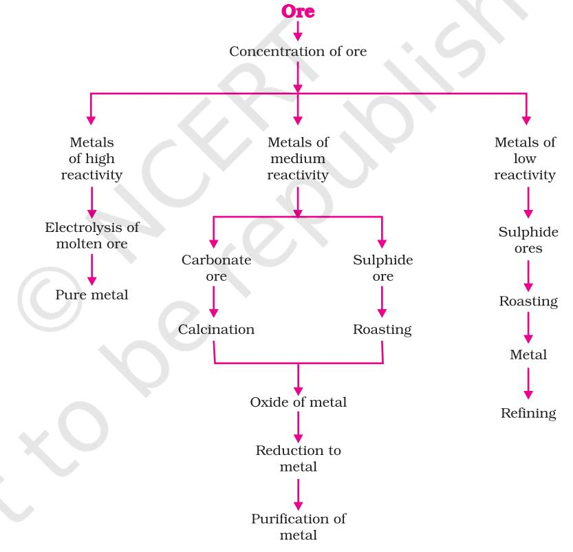

*Figure 3.10 Steps involved in the extraction of metals from ores*

# 3.4.2 Enrichment of Ores

Ores mined from the earth are usually contaminated with large amounts of impurities such as soil, sand, etc., called gangue. The impurities must be removed from the ore prior to the extraction of the metal. The processes used for removing the gangue from the ore are based on the differences between the physical or chemical properties of the gangue and the ore. Different separation techniques are accordingly employed.

# 3.4.3 Extracting Metals Low in the Activity Series

Metals low in the activity series are very unreactive. The oxides of these metals can be reduced to metals by heating alone. For example, cinnabar (HgS) is an ore of mercury. When it is heated in air, it is first converted into mercuric oxide (HgO). Mercuric oxide is then reduced to mercury on further heating.

# 2HgS(s) + 3O (g) 2HgO(s) + 2SO (g) 2 2 Heat→

2HgO(s) 2Hg(l) + O (g) 2 Heat→

Similarly, copper which is found as Cu2 S in nature can be obtained from its ore by just heating in air.

> 2Cu S + 3O (g) 2Cu O(s) + 2SO (g) 2Cu O + Cu S 2 2 2 2 2 2 Heat Heat → → 6Cu(s) + SO (g) 2

# 3.4.4 Extracting Metals in the Middle of the Activity Series

The metals in the middle of the activity series such as iron, zinc, lead, copper, are moderately reactive. These are usually present as sulphides or carbonates in nature. It is easier to obtain a metal from its oxide, as compared to its sulphides and carbonates. Therefore, prior to reduction, the metal sulphides and carbonates must be converted into metal oxides. The sulphide ores are converted into oxides by heating strongly in the presence of excess air. This process is known as roasting. The carbonate ores are changed into oxides by heating strongly in limited air. This process is known as calcination. The chemical reaction that takes place during roasting and calcination of zinc ores can be shown as follows –

Roasting

```
2ZnS(s) + 3O (g) 2ZnO(s) + 2SO (g) 2 2  →Heat
```
Calcination

# ZnCO (s) ZnO(s) + CO (g) 3 2 Heat→

The metal oxides are then reduced to the corresponding metals by using suitable reducing agents such as carbon. For example, when zinc oxide is heated with carbon, it is reduced to metallic zinc.

## ZnO(s) + C(s) → Zn(s) + CO(g)

You are already familiar with the process of oxidation and reduction explained in the first Chapter. Obtaining metals from their compounds is also a reduction process.

Besides using carbon (coke) to reduce metal oxides to metals, sometimes displacement reactions can also be used. The highly reactive metals such as sodium, calcium, aluminium, etc., are used as reducing agents because they can displace metals of lower reactivity from their compounds. For example, when manganese dioxide is heated with aluminium powder, the following reaction takes place –

### 3MnO2 (s) + 4Al(s) → 3Mn(l) + 2Al2O3 (s) + Heat

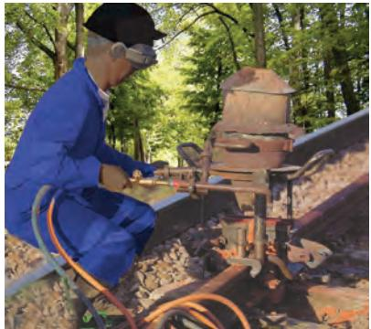

*Figure 3.11 Thermit process for joining railway tracks*

Can you identify the substances that are getting oxidised and reduced?

These displacement reactions are highly exothermic. The amount of heat evolved is so large that the metals are produced in the molten state. In fact, the reaction of iron(III) oxide (Fe2O3 ) with aluminium is used to join railway tracks or cracked machine parts. This reaction is known as the thermit reaction.

Fe2O3 (s) + 2Al(s) → 2Fe(l) + Al2O3 (s) + Heat

# 3.4.5 Extracting Metals towards the Top of the Activity Series

The metals high up in the reactivity series are very reactive. They cannot be obtained from their compounds by heating with carbon. For example, carbon cannot reduce the oxides of sodium, magnesium, calcium, aluminium, etc., to the respective metals. This is because these metals have more affinity for oxygen than carbon. These metals are obtained by electrolytic reduction. For example, sodium, magnesium and calcium are obtained by the electrolysis of their molten chlorides. The metals are deposited at the cathode (the negatively charged electrode), whereas, chlorine is liberated at the anode (the positively charged electrode). The reactions are –

### At cathode Na+ + e– → Na At anode 2Cl– → Cl2 + 2e–

Similarly, aluminium is obtained by the electrolytic reduction of aluminium oxide.

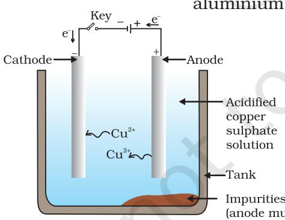

# 3.4.6 Refining of Metals

The metals produced by various reduction processes described above are not very pure. They contain impurities, which must be removed to obtain pure metals. The most widely used method for refining impure metals is electrolytic refining.

*Electrolytic Refining:* Many metals, such as copper, zinc, tin, nickel, silver, gold, etc., are refined electrolytically. In this process, the impure metal is made the anode and a thin strip of pure metal is made the cathode. A solution of the metal salt is used as an electrolyte. The apparatus is set up as shown in Fig. 3.12. On passing the current through the electrolyte, the pure metal from the anode dissolves into the electrolyte. An equivalent amount of pure

### *Figure 3.12*

*Electrolytic refining of copper. The electrolyte is a solution of acidified copper sulphate. The anode is impure copper, whereas, the cathode is a strip of pure copper. On passing electric current, pure copper is deposited on the cathode.*

metal from the electrolyte is deposited on the cathode. The soluble impurities go into the solution, whereas, the insoluble impurities settle down at the bottom of the anode and are known as anode mud.


# 3.5 CORROSION

You have learnt the following about corrosion in Chapter 1 –

- n Silver articles become black after some time when exposed to air. This is because it reacts with sulphur in the air to form a coating of silver sulphide.
- n Copper reacts with moist carbon dioxide in the air and slowly loses its shiny brown surface and gains a green coat. This green substance is basic copper carbonate.
- n Iron when exposed to moist air for a long time acquires a coating of a brown flaky substance called rust. Let us find out the conditions under which iron rusts.

# Activity 3.14

- n Take three test tubes and place clean iron nails in each of them.
- n Label these test tubes A, B and C. Pour some water in test tube A and cork it.
- n Pour boiled distilled water in test tube B, add about 1 mL of oil and cork it. The oil will float on water and prevent the air from dissolving in the water.
- n Put some anhydrous calcium chloride in test tube C and cork it. Anhydrous calcium chloride will absorb the moisture, if any, from the air. Leave these test tubes for a few days and then observe (Fig. 3.13).

You will observe that iron nails rust in test tube A, but they do not rust in test tubes B and C. In the test tube A, the nails are exposed to both air and water. In the test tube B, the nails are exposed to only water, and the nails in test tube C are exposed to dry air. What does this tell us about the conditions under which iron articles rust?

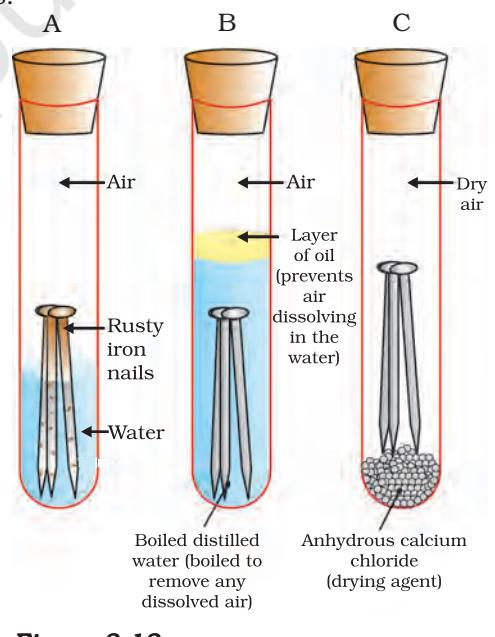

### *Figure 3.13*

*Investigating the conditions under which iron rusts. In tube A, both air and water are present. In tube B, there is no air dissolved in the water. In tube C, the air is dry.*

# 3.5.1 Prevention of Corrosion

The rusting of iron can be prevented by painting, oiling, greasing, galvanising, chrome plating, anodising or making alloys.

Galvanisation is a method of protecting steel and iron from rusting by coating them with a thin layer of zinc. The galvanised article is protected against rusting even if the zinc coating is broken. Can you reason this out?

Alloying is a very good method of improving the properties of a metal. We can get the desired properties by this method. For example, iron is the most widely used metal. But it is never used in its pure state. This is because pure iron is very soft and stretches easily when hot. But, if it is mixed with a small amount of carbon (about 0.05 %), it becomes hard and strong. When iron is mixed with nickel and chromium, we get stainless steel, which is hard and does not rust. Thus, if iron is mixed with some other substance, its properties change. In fact, the properties of any metal can be changed if it is mixed with some other substance. The substance added may be a metal or a non-metal. An alloy is a homogeneous mixture of two or more metals, or a metal and a nonmetal. It is prepared by first melting the primary metal, and then, dissolving the other elements in it in definite proportions. It is then cooled to room temperature.

Pure gold, known as 24 carat gold, is very soft. It is, therefore, not suitable for making jewellery. It is alloyed with either silver or copper to make it hard. Generally, in India, 22 carat gold is used for making ornaments. It means that 22 parts of pure gold is alloyed with 2 parts of either copper or silver.

> If one of the metals is mercury, then the alloy is known as an amalgam. The electrical conductivity and melting point of an alloy is less than that of pure metals. For example, brass, an alloy of copper and zinc (Cu and Zn), and bronze, an alloy of copper and tin (Cu and Sn), are not good conductors of electricity whereas copper is used for making electrical circuits. Solder, an alloy of lead and tin (Pb and Sn), has a low melting point and is used for welding electrical wires together.

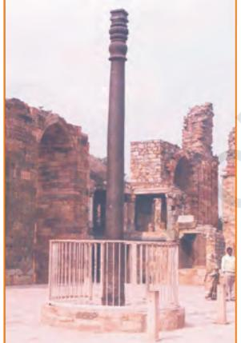

More to Know!

*Iron pillar at Delhi*

### The wonder of ancient Indian metallurgy

The iron pillar near the Qutub Minar in Delhi was built more than 1600 years ago by the iron workers of India. They had developed a process which prevented iron from rusting. For its quality of rust resistance it has been examined by scientists from all parts of the world. The iron pillar is 8 m high and weighs 6 tonnes (6000 kg).

Do You Know?

|  | Q | U | E | S | T | I | O | N | S |  |
| --- | --- | --- | --- | --- | --- | --- | --- | --- | --- | --- |
| 1. | Metallic oxides of zinc, magnesium and copper were heated with the |  |  |  |  |  |  |  |  |  |
|  | following metals. |  |  |  |  |  |  |  |  |  |
|  | Metal Magnesium |  | Zinc |  |  |  | Copper |  |  |  |
|  | Zinc oxide |  |  |  |  |  |  |  |  |  |
|  | Magnesium oxide |  |  |  |  |  |  |  |  | ? |
|  | Copper oxide |  |  |  |  |  |  |  |  |  |
|  | In which cases will you find displacement reactions taking place? |  |  |  |  |  |  |  |  |  |
| 2. | Which metals do not corrode easily? |  |  |  |  |  |  |  |  |  |
| 3. | What are alloys? |  |  |  |  |  |  |  |  |  |

# What you have learnt

- n Elements can be classified as metals and non-metals.
- n Metals are lustrous, malleable, ductile and are good conductors of heat and electricity. They are solids at room temperature, except mercury which is a liquid.
- n Metals can form positive ions by losing electrons to non-metals.
- n Metals combine with oxygen to form basic oxides. Aluminium oxide and zinc oxide show the properties of both basic as well as acidic oxides. These oxides are known as amphoteric oxides.
- n Different metals have different reactivities with water and dilute acids.
- n A list of common metals arranged in order of their decreasing reactivity is known as an activity series.
- n Metals above hydrogen in the Activity series can displace hydrogen from dilute acids.
- n A more reactive metal displaces a less reactive metal from its salt solution.
- n Metals occur in nature as free elements or in the form of their compounds.
- n The extraction of metals from their ores and then refining them for use is known as metallurgy.
- n An alloy is a homogeneous mixture of two or more metals, or a metal and a non-metal.
- n The surface of some metals, such as iron, is corroded when they are exposed to moist air for a long period of time. This phenomenon is known as corrosion.
- n Non-metals have properties opposite to that of metals. They are neither malleable nor ductile. They are bad conductors of heat and electricity, except for graphite, which conducts electricity.
- n Non-metals form negatively charged ions by gaining electrons when reacting with metals.
- n Non-metals form oxides which are either acidic or neutral.
- n Non-metals do not displace hydrogen from dilute acids. They react with hydrogen to form hydrides.

# EXERCISES

- 1. Which of the following pairs will give displacement reactions?
	- (a) NaCl solution and copper metal
	- (b) MgCl2 solution and aluminium metal
	- (c) FeSO4 solution and silver metal
	- (d) AgNO3 solution and copper metal.
- 2. Which of the following methods is suitable for preventing an iron frying pan from rusting?
	- (a) Applying grease
	- (b) Applying paint
	- (c) Applying a coating of zinc
	- (d) All of the above.
- 3. An element reacts with oxygen to give a compound with a high melting point. This compound is also soluble in water. The element is likely to be
	- (a) calcium
	- (b) carbon
	- (c) silicon
	- (d) iron.
- 4. Food cans are coated with tin and not with zinc because
	- (a) zinc is costlier than tin.
	- (b) zinc has a higher melting point than tin.
	- (c) zinc is more reactive than tin.
	- (d) zinc is less reactive than tin.
- 5. You are given a hammer, a battery, a bulb, wires and a switch.
	- (a) How could you use them to distinguish between samples of metals and non-metals?
	- (b) Assess the usefulness of these tests in distinguishing between metals and non-metals.
- 6. What are amphoteric oxides? Give two examples of amphoteric oxides.
- 7. Name two metals which will displace hydrogen from dilute acids, and two metals which will not.
- 8. In the electrolytic refining of a metal M, what would you take as the anode, the cathode and the electrolyte?
- 9. Pratyush took sulphur powder on a spatula and heated it. He collected the gas evolved by inverting a test tube over it, as shown in figure below.
	- (a) What will be the action of gas on
		- (i) dry litmus paper? (ii) moist litmus paper?
	- (b) Write a balanced chemical equation for the reaction taking place.
- 10. State two ways to prevent the rusting of iron.
- 11. What type of oxides are formed when non-metals combine with oxygen?
- 12. Give reasons
	- (a) Platinum, gold and silver are used to make jewellery.
	- (b) Sodium, potassium and lithium are stored under oil.
	- (c) Aluminium is a highly reactive metal, yet it is used to make utensils for cooking.
	- (d) Carbonate and sulphide ores are usually converted into oxides during the process of extraction.

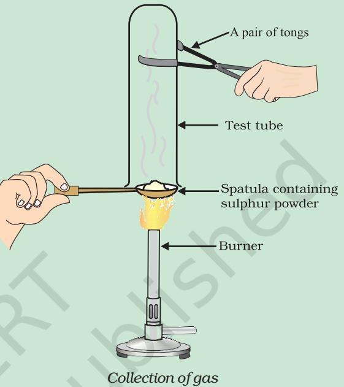

- 13. You must have seen tarnished copper vessels being cleaned with lemon or tamarind juice. Explain why these sour substances are effective in cleaning the vessels.
- 14. Differentiate between metal and non-metal on the basis of their chemical properties.
- 15. A man went door to door posing as a goldsmith. He promised to bring back the glitter of old and dull gold ornaments. An unsuspecting lady gave a set of gold bangles to him which he dipped in a particular solution. The bangles sparkled like new but their weight was reduced drastically. The lady was upset but after a futile argument the man beat a hasty retreat. Can you play the detective to find out the nature of the solution he had used?
- 16. Give reasons why copper is used to make hot water tanks and not steel (an alloy of iron).

