I n the last Chapter, we came to know many compounds of importance to us. In this Chapter we will study about some more interesting compounds and their properties. Also, we shall be learning about carbon, an element which is of immense significance to us in both its elemental form and in the combined form.

- n Make a list of ten things you have used or consumed since the morning.
- n Compile this list with the lists made by your classmates and then sort the items into the adjacent Table.
- n If there are items which are made up of more than one material, put them into both the relevant columns of the table.

| Activity 4.1 | Things made | Things made | Others |
| --- | --- | --- | --- |
|  | of metal | of glass/clay |  |
| n Make a list of ten things you have used |  |  |  |
| or consumed since the morning. |  |  |  |
| n Compile this list with the lists made by |  |  |  |
| your classmates and then sort the items |  |  |  |
| into the adjacent Table. |  |  |  |
| n If there are items which are made up of |  |  |  |
| more than one material, put them into |  |  |  |
| both the relevant columns of the table. |  |  |  |

Look at the items that come in the last column of the above table filled by you – your teacher will be able to tell you that most of them are made up of compounds of carbon. Can you think of a method to test this? What would be the product if a compound containing carbon is burnt? Do you know of any test to confirm this?

Food, clothes, medicines, books, or many of the things that you listed are all based on this versatile element carbon. In addition, all living structures are carbon based. The amount of carbon present in the earth's crust and in the atmosphere is quite meagre. The earth's crust has only 0.02% carbon in the form of minerals (like carbonates, hydrogencarbonates, coal and petroleum) and the atmosphere has 0.03% of carbon dioxide. In spite of this small amount of carbon available in nature, the importance of carbon seems to be immense. In this Chapter, we will know about the properties of carbon which make carbon so important to us.

#### 4.1 BONDING IN CARBON – THE COVALENT BOND

In the previous Chapter, we have studied the properties of ionic compounds. We saw that ionic compounds have high melting and boiling points and conduct electricity in solution or in the molten state. We also

58 Science

saw how the nature of bonding in ionic compounds explains these properties. Let us now study the properties of some carbon compounds.

Most carbon compounds are poor conductors of electricity as we

have seen in Chapter 2. From the data given in Table 4.1 on the boiling and melting points of the carbon compounds, we find that these compounds have low melting and boiling points as compared to ionic compounds (Chapter 3). We can conclude that the forces of attraction between the molecules are not very strong. Since these compounds are largely non-conductors of electricity, we can conclude that the bonding in these compounds does not give rise to any ions.

| Compound | Melting point (K) | Boiling point (K) |
| --- | --- | --- |
| Acetic acid (CH3COOH) | 290 | 391 |
| Chloroform (CHCl3 ) | 209 | 334 |
| Ethanol (CH3CH2OH) | 156 | 351 |
| Methane (CH4 ) | 90 | 111 |

Table 4.1 Melting points and boiling points of some compounds of carbon

In Class IX, we learnt about the combining capacity of various elements and how it depends on the number of valence electrons. Let us now look at the electronic configuration of carbon. The atomic number of carbon is 6. What would be the distribution of electrons in various shells of carbon? How many valence electrons will carbon have?

We know that the reactivity of elements is explained as their tendency to attain a completely filled outer shell, that is, attain noble gas configuration. Elements forming ionic compounds achieve this by either gaining or losing electrons from the outermost shell. In the case of carbon, it has four electrons in its outermost shell and needs to gain or lose four electrons to attain noble gas configuration. If it were to gain or lose electrons –

- (i) It could gain four electrons forming C4– anion. But it would be difficult for the nucleus with six protons to hold on to ten electrons, that is, four extra electrons.
- (ii) It could lose four electrons forming C4+ cation. But it would require a large amount of energy to remove four electrons leaving behind a carbon cation with six protons in its nucleus holding on to just two electrons.

Carbon overcomes this problem by sharing its valence electrons with other atoms of carbon or with atoms of other elements. Not just carbon, but many other elements form molecules by sharing electrons in this manner. The shared electrons 'belong' to the outermost shells of both the atoms and lead to both atoms attaining the noble gas configuration. Before going on to compounds of carbon, let us look at some simple molecules formed by the sharing of valence electrons.

The simplest molecule formed in this manner is that of hydrogen. As you have learnt earlier, the atomic number of hydrogen is 1. Hence hydrogen has one electron in its K shell and it requires one more electron to fill the K shell. So two hydrogen atoms share their electrons to form a molecule of hydrogen, H2 . This allows each hydrogen atom to attain the

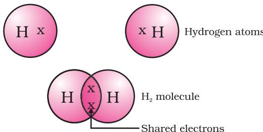

*Figure 4.1 A molecule of hydrogen*

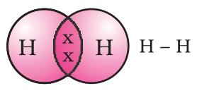

*Figure 4.2 Single bond between two hydrogen atoms*

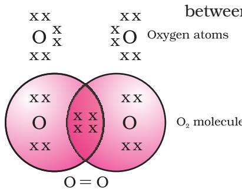

*Figure 4.3 Double bond between two oxygen atoms*

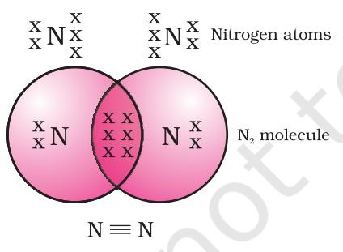

*Figure 4.4 Triple bond between two nitrogen atoms*

electronic configuration of the nearest noble gas, helium, which has two electrons in its K shell. We can depict this using dots or crosses to represent valence electrons (Fig. 4.1).

The shared pair of electrons is said to constitute a single covalent bond between the two hydrogen atoms. A single covalent bond is also represented by a line between the two atoms, as shown in Fig. 4.2.

The atomic number of chlorine is 17. What would be its electronic configuration and its valency? Chlorine forms a diatomic molecule, Cl2 . Can you draw the electron dot structure for this molecule? Note that only the valence shell electrons need to be depicted.

In the case of oxygen, we see the formation of a double bond between two oxygen atoms. This is because an atom of oxygen has six electrons in its L shell (the atomic number of oxygen is eight) and it requires two more electrons to complete its octet. So each atom of oxygen shares two electrons with another atom of oxygen to give us the structure shown in Fig. 4.3. The two electrons contributed by each oxygen atom give rise to two shared pairs of electrons. This is said to constitute a double bond between the two atoms.

> Can you now depict a molecule of water showing the nature of bonding between one oxygen atom and two hydrogen atoms? Does the molecule have single bonds or double bonds?

> What would happen in the case of a diatomic molecule of nitrogen? Nitrogen has the atomic number 7. What would be its electronic configuration and its combining capacity? In order to attain an octet, each nitrogen atom in a molecule of nitrogen contributes three electrons giving rise to three shared pairs of electrons. This is said to constitute a triple bond between the two atoms. The electron dot structure of N2 and its triple bond can be depicted as in Fig. 4.4.

> A molecule of ammonia has the formula NH3 . Can you draw the electron dot structure for this molecule showing how all four atoms achieve noble gas configuration? Will the molecule have single, double or triple bonds?

> Let us now take a look at methane, which is a compound of carbon. Methane is widely used as a fuel and is a major component of bio-gas and Compressed Natural Gas (CNG). It is also one of the simplest compounds formed by carbon. Methane has a formula CH4 . Hydrogen, as you know, has a valency of 1. Carbon is tetravalent because it has four valence electrons. In order to achieve noble gas configuration, carbon shares these electrons with four atoms of hydrogen as shown in Fig. 4.5.

Such bonds which are formed by the sharing of an electron pair between two atoms are known as covalent bonds. Covalently bonded molecules are seen to have strong bonds within the molecule, but intermolecular forces are weak. This gives rise to the low melting and boiling points of these compounds. Since the electrons are shared between atoms and no charged particles are formed, such covalent compounds are generally poor conductors of electricity.

# Allotropes of carbon

The element carbon occurs in different forms in nature with widely varying physical properties. Both diamond and graphite are formed by carbon atoms, the difference lies in the manner in which the carbon atoms are bonded to one another. In diamond, each carbon atom is bonded to four other carbon atoms forming a rigid three-dimensional structure. In graphite, each carbon atom is bonded to three other carbon atoms in the same plane giving a hexagonal array. One of these bonds is a double-bond, and thus the valency of carbon is satisfied. Graphite structure is formed by the hexagonal arrays being placed in layers one above the other.

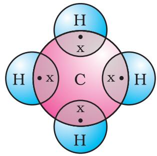

*Figure 4.5 Electron dot structure for methane*

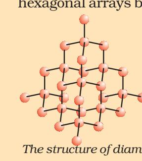

More to Know!


*Buckminsterfullerene*

These two different structures result in diamond and graphite having very different physical properties even though their chemical properties are the same. Diamond is the hardest substance known while graphite is smooth and slippery. Graphite is also a very good conductor of electricity unlike other non-metals that you studied in the previous Chapter.

Diamonds can be synthesised by subjecting pure carbon to very high pressure and temperature. These synthetic diamonds are small but are otherwise indistinguishable from natural diamonds.

Fullerenes form another class of carbon allotropes. The first one to be identified was C-60 which has carbon atoms arranged in the shape of a football. Since this looked like the geodesic dome designed by the US architect Buckminster Fuller, the molecule was named fullerene.

# QUESTIONS

- 1. What would be the electron dot structure of carbon dioxide which has the formula CO2 ?
- 2. What would be the electron dot structure of a molecule of sulphur which is made up of eight atoms of sulphur? (Hint – The eight atoms of sulphur are joined together in the form of a ring.)

?

#### 4.2 VERSATILE NATURE OF CARBON

We have seen the formation of covalent bonds by the sharing of electrons in various elements and compounds. We have also seen the structure of a simple carbon compound, methane. In the beginning of the Chapter, we saw how many things we use contain carbon. In fact, we ourselves are made up of carbon compounds. The numbers of carbon compounds whose formulae are known to chemists was recently estimated to be in millions! This outnumbers by a large margin the compounds formed by all the other elements put together. Why is it that this property is seen in carbon and no other element? The nature of the covalent bond enables carbon to form a large number of compounds. Two factors noticed in the case of carbon are –

- (i) Carbon has the unique ability to form bonds with other atoms of carbon, giving rise to large molecules. This property is called catenation. These compounds may have long chains of carbon, branched chains of carbon or even carbon atoms arranged in rings. In addition, carbon atoms may be linked by single, double or triple bonds. Compounds of carbon, which are linked by only single bonds between the carbon atoms are called saturated compounds. Compounds of carbon having double or triple bonds between their carbon atoms are called unsaturated compounds.
No other element exhibits the property of catenation to the extent seen in carbon compounds. Silicon forms compounds with hydrogen which have chains of upto seven or eight atoms, but these compounds are very reactive. The carbon-carbon bond is very strong and hence stable. This gives us the large number of compounds with many carbon atoms linked to each other.

- (ii) Since carbon has a valency of four, it is capable of bonding with four other atoms of carbon or atoms of some other mono-valent element. Compounds of carbon are formed with oxygen, hydrogen, nitrogen, sulphur, chlorine and many other elements giving rise to compounds with specific properties which depend on the elements other than carbon present in the molecule.
Again the bonds that carbon forms with most other elements are very strong making these compounds exceptionally stable. One reason for the formation of strong bonds by carbon is its small size. This enables the nucleus to hold on to the shared pairs of electrons strongly. The bonds formed by elements having bigger atoms are much weaker.

#### Organic compounds

The two characteristic features seen in carbon, that is, tetravalency and catenation, put together give rise to a large number of compounds. Many have the same non-carbon atom or group of atoms attached to different carbon chains. These compounds were initially extracted from natural substances and it was thought that these carbon compounds or organic compounds could only be formed within a living system. That is, it was postulated that a 'vital force' was necessary for their synthesis. Friedrich Wöhler disproved this in 1828 by preparing urea from ammonium cyanate. But carbon compounds, except for carbides, oxides of carbon, carbonate and hydrogencarbonate salts continue to be studied under organic chemistry.

#### 4.2.1 Saturated and Unsaturated Carbon Compounds

We have already seen the structure of methane. Another compound formed between carbon and hydrogen is ethane with a formula of C2H6 .

In order to arrive at the structure of simple carbon compounds, the first step is to link the carbon atoms together with a single bond (Fig. 4.6a) and then use the hydrogen atoms to satisfy the remaining valencies of carbon (Fig. 4.6b). For example, the structure of ethane is arrived in the following steps –

#### C—C Step 1


Three valencies of each carbon atom remain unsatisfied, so each is bonded to three hydrogen atoms giving:


The electron dot structure of ethane is shown in Fig. 4.6(c).

Can you draw the structure of propane, which has the molecular formula C3H8 in a similar manner? You will see that the valencies of all the atoms are satisfied by single bonds between them. Such carbon compounds are called saturated compounds. These compounds are normally not very reactive.

However, another compound of carbon and hydrogen has the formula C2H4 and is called ethene. How can this molecule be depicted? We follow the same step-wise approach as above.

Carbon-carbon atoms linked together with a single bond (Step 1).

We see that one valency per carbon atom remains unsatisfied (Step 2). This can be satisfied only if there is a double bond between the two carbons (Step 3).

*Figure 4.6 (c) Electron dot structure of ethane*

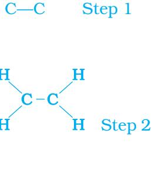

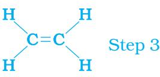

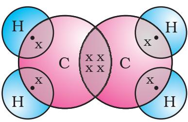


The electron dot structure for ethene is given in Fig. 4.7. Yet another compound of hydrogen and carbon has the formula C2H2 and is called ethyne. Can you draw the electron dot structure for ethyne? How many bonds are necessary between the two carbon atoms in order to satisfy their valencies? Such compounds of carbon having double or triple bonds between the carbon atoms are known as unsaturated carbon compounds and they are more reactive than the saturated carbon compounds.

### 4.2.2 Chains, Branches and Rings

In the earlier section, we mentioned the carbon compounds methane, ethane and propane, containing respectively 1, 2 and 3 carbon atoms. Such 'chains' of carbon atoms can contain many more carbon atoms. The names and structures of six of these are given in Table 4.2.

Table 4.2 Formulae and structures of saturated compounds of carbon and hydrogen

| No. of C atoms | Name | Formula | Structure |
| --- | --- | --- | --- |
| 1 | Methane | CH4 |  |
| 2 | Ethane | C2H6 |  |
| 3 | Propane | C3H8 |  |
| 4 | Butane | C4H10 |  |
| 5 | Pentane | C5H12 |  |
| 6 | Hexane | C6H14 |  |

But, let us take another look at butane. If we make the carbon 'skeleton' with four carbon atoms, we see that two different possible 'skeletons' are –

```
C—C—C—C
```
*Figure 4.8 (a) Two possible carbon-skeletons*

Filling the remaining valencies with hydrogen gives us –


*Figure 4.8 (b) Complete molecules for two structures with formula* C4H10

We see that both these structures have the same formula C4H10. Such compounds with identical molecular formula but different structures are called structural isomers.

In addition to straight and branched carbon chains, some compounds have carbon atoms arranged in the form of a ring. For example, cyclohexane has the formula C6H12 and the following structure –


*Figure 4.9 Structure of cyclohexane (a) carbon skeleton (b) complete molecule*

Can you draw the electron dot structure for cyclohexane? Straight chain, branched chain and cyclic carbon compounds, all may be saturated or unsaturated. For example, benzene, C6H6 , has the following structure –

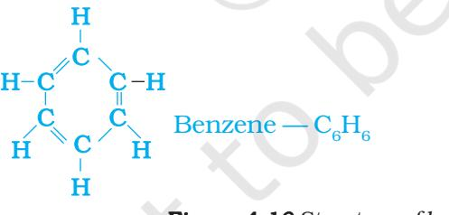

*Figure 4.10 Structure of benzene*

All these carbon compounds which contain only carbon and hydrogen are called hydrocarbons. Among these, the saturated hydrocarbons are called alkanes. The unsaturated hydrocarbons which contain one or more double bonds are called alkenes. Those containing one or more triple bonds are called alkynes.

#### 4.2.3 Will you be my Friend?

Carbon seems to be a very friendly element. So far we have been looking at compounds containing carbon and hydrogen only. But carbon also forms bonds with other elements such as halogens, oxygen, nitrogen and sulphur. In a hydrocarbon chain, one or more hydrogens can be replaced by these elements, such that the valency of carbon remains satisfied. In such compounds, the element replacing hydrogen is referred to as a heteroatom. These heteroatoms are also present in some groups as given in Table 4.3.

Table 4.3 Some functional groups in carbon compounds

| Hetero | Class of Class of Class of | Formula of |
| --- | --- | --- |
| atom | compounds | functional group |
| Cl/Br | Halo- (Chloro/bromo) | —Cl, —Br |
|  | alkane | (substitutes for hydrogen atom) |
| Oxygen | 1. Alcohol | —OH |
|  | 2. Aldehyde |  |
|  | 3. Ketone |  |
|  | 4. Carboxylic acid |  |

These heteroatoms and the group containing these confer specific properties to the compound, regardless of the length and nature of the carbon chain and hence are called functional groups. Some important functional groups are given in the Table 4.3. Free valency or valencies of the group are shown by the single line. The functional group is attached to the carbon chain through this valency by replacing one hydrogen atom or atoms.

#### 4.2.4 Homologous Series

You have seen that carbon atoms can be linked together to form chains of varying lengths. These chains can be branched also. In addition, hydrogen atom or other atoms on these carbon chains can be replaced by any of the functional groups that we saw above. The presence of a functional group such as alcohol decides the properties of the carbon compound, regardless of the length of the carbon chain. For example, the chemical properties of CH3OH, C2H5OH, C3H7OH and C4H9OH are all very similar. Hence, such a series of compounds in which the same functional group substitutes for hydrogen in a carbon chain is called a homologous series.

Let us look at the homologous series that we saw earlier in Table 4.2. If we look at the formulae of successive compounds, say –

| CH4 | and C2H6 | — these differ by a –CH2 | - unit |
| --- | --- | --- | --- |
| C2H6 | and C3H8 | — these differ by a –CH2 | - unit |

What is the difference between the next pair – propane and butane (C4H10)?

Can you find out the difference in molecular masses between these pairs (the atomic mass of carbon is 12 u and the atomic mass of hydrogen is 1 u)?

Similarly, take the homologous series for alkenes. The first member of the series is ethene which we have already come across in Section 4.2.1. What is the formula for ethene? The succeeding members have the formula C3H6 , C4H8 and C5H10. Do these also differ by a –CH2 – unit? Do you see any relation between the number of carbon and hydrogen atoms in these compounds? The general formula for alkenes can be written as CnH2n, where n = 2, 3, 4. Can you similarly generate the general formula for alkanes and alkynes?

As the molecular mass increases in any homologous series, a gradation in physical properties is seen. This is because the melting and boiling points increase with increasing molecular mass. Other physical properties such as solubility in a particular solvent also show a similar gradation. But the chemical properties, which are determined solely by the functional group, remain similar in a homologous series.

#### Activity 4.2

- n Calculate the difference in the formulae and molecular masses for (a) CH3OH and C2H5OH (b) C2H5OH and C3H7OH, and (c) C3H7OH and C4H9OH.
- n Is there any similarity in these three?
- n Arrange these alcohols in the order of increasing carbon atoms to get a family. Can we call this family a homologous series?
- n Generate the homologous series for compounds containing up to four carbons for the other functional groups given in Table 4.3.

#### 4.2.5 Nomenclature of Carbon Compounds

The names of compounds in a homologous series are based on the name of the basic carbon chain modified by a "prefix" "phrase before" or "suffix" "phrase after" indicating the nature of the functional group. For example, the names of the alcohols taken in Activity 4.2 are methanol, ethanol, propanol and butanol.

Naming a carbon compound can be done by the following method –

- (i) Identify the number of carbon atoms in the compound. A compound having three carbon atoms would have the name propane.
- (ii) In case a functional group is present, it is indicated in the name of the compound with either a prefix or a suffix (as given in Table 4.4).
- (iii) If the name of the functional group is to be given as a suffix, and the suffix of the functional group begins with a vowel a, e, i, o, u, then the name of the carbon chain is modified by deleting the final 'e' and adding the appropriate suffix. For example, a three-carbon chain with a ketone group would be named in the following manner – Propane – 'e' = propan + 'one' = propanone.
- (iv) If the carbon chain is unsaturated, then the final 'ane' in the name of the carbon chain is substituted by 'ene' or 'yne' as given in Table 4.4. For example, a three-carbon chain with a double bond would be called propene and if it has a triple bond, it would be called propyne.

| Table 4.4 Nomenclature of organic compounds |
| --- |

| Class of compounds | Prefix/Suffix | Example |  |
| --- | --- | --- | --- |
| 1. Halo alkane | Prefix-chloro, bromo, etc. |  | Chloropropane |
|  |  |  | Bromopropane |
| 2. Alcohol | Suffix - ol |  | Propanol |
| 3. Aldehyde | Suffix - al |  | Propanal |
| 4. Ketone | Suffix - one |  | Propanone |
| 5. Carboxylic acid | Suffix - oic acid |  | Propanoic acid |
| 6. Alkenes | Suffix - ene |  | Propene |
| 7. Alkynes | Suffix - yne |  | Propyne |

# QUESTIONS

- 1. How many structural isomers can you draw for pentane?
- 2. What are the two properties of carbon which lead to the huge number of carbon compounds we see around us?
- 3. What will be the formula and electron dot structure of cyclopentane?


(i) Ethanoic acid (ii) Bromopentane*

(iii) Butanone (iv) Hexanal.

*Are structural isomers possible for bromopentane?

5. How would you name the following compounds?

(i) CH3—CH2—Br (ii) (iii)

### 4.3 CHEMICAL PROPERTIES OF CARBON COMPOUNDS

In this section we will be studying about some of the chemical properties of carbon compounds. Since most of the fuels we use are either carbon or its compounds, we shall first study combustion.

### 4.3.1 Combustion

Carbon, in all its allotropic forms, burns in oxygen to give carbon dioxide along with the release of heat and light. Most carbon compounds also release a large amount of heat and light on burning. These are the oxidation reactions that you learnt about in the first Chapter –

```
(i) C + O2 → CO2
                  + heat and light
```
- (ii) CH4 + O2 → CO2 + H2O + heat and light
- (iii) CH3CH2OH + O2 → CO2 + H2O + heat and light

Balance the latter two reactions like you learnt in the first Chapter.

### Activity 4.3

CAUTION: This Activity needs the teacher's assistance.

- n Take some carbon compounds (naphthalene, camphor, alcohol) one by one on a spatula and burn them.
- n Observe the nature of the flame and note whether smoke is produced.
- n Place a metal plate above the flame. Is there a deposition on the plate in case of any of the compounds?

Saturated hydrocarbons will generally give a clean flame while unsaturated carbon compounds will give a yellow flame with lots of black smoke. This results in a sooty deposit on the metal plate in Activity 4.3. However, limiting the supply of air results in incomplete combustion of even saturated hydrocarbons giving a sooty flame. The gas/kerosene stove used at home has inlets for air so that a sufficiently oxygen-rich

### Activity 4.4

- n Light a bunsen burner and adjust the air hole at the base to get different types of flames/presence of smoke.
?

- n When do you get a yellow, sooty flame?
- n When do you get a blue flame?

mixture is burnt to give a clean blue flame. If you observe the bottoms of cooking vessels getting blackened, it means that the air holes are blocked and fuel is getting wasted. Fuels such as coal and petroleum have some amount of nitrogen and sulphur in them. Their combustion results in the formation of oxides of sulphur and nitrogen which are major pollutants in the environment.

#### Why do substances burn with or without a flame?

Have you ever observed either a coal or a wood fire? If not, the next time you get a chance, take close note of what happens when the wood or coal starts to burn. You have seen above that a candle or the LPG in the gas stove burns with a flame. However, you will observe the coal or charcoal in an 'angithi' sometimes just glows red and gives out heat without a flame. This is because a flame is only produced when gaseous substances burn. When wood or charcoal is ignited, the volatile substances present vapourise and burn with a flame in the beginning.

A luminous flame is seen when the atoms of the gaseous substance are heated and start to glow. The colour produced by each element is a characteristic property of that element. Try and heat a copper wire in the flame of a gas stove and observe its colour. You have seen that incomplete combustion gives soot which is carbon. On this basis, what will you attribute the yellow colour of a candle flame to?

# Formation of coal and petroleum

Coal and petroleum have been formed from biomass which has been subjected to various biological and geological processes. Coal is the remains of trees, ferns, and other plants that lived millions of years ago. These were crushed into the earth, perhaps by earthquakes or volcanic eruptions. They were pressed down by layers of earth and rock. They slowly decayed into coal. Oil and gas are the remains of millions of tiny plants and animals that lived in the sea. When they died, their bodies sank to the sea bed and were covered by silt. Bacteria attacked the dead remains, turning them into oil and gas under the high pressures they were being subjected to. Meanwhile, the silt was slowly compressed into rock. The oil and gas seeped into the porous parts of the rock, and got trapped like water in a sponge. Can you guess why coal and petroleum are called fossil fuels?

4.3.2 Oxidation

### Activity 4.5

- n Take about 3 mL of ethanol in a test tube and warm it gently in a water bath.
- n Add a 5% solution of alkaline potassium permanganate drop by drop to this solution.
- n Does the colour of potassium permanganate persist when it is added initially?
- n Why does the colour of potassium permanganate not disappear when excess is added?

You have learnt about oxidation reactions in the first Chapter. Carbon compounds can be easily oxidised on combustion. In addition to this complete oxidation, we have reactions in which alcohols are converted to carboxylic acids –

More to Know!

We see that some substances are capable of adding oxygen to others. These substances are known as oxidising agents.

Alkaline potassium permanganate or acidified potassium dichromate are oxidising alcohols to acids, that is, adding oxygen to the starting material. Hence they are known as oxidising agents.

#### 4.3.3 Addition Reaction

Unsaturated hydrocarbons add hydrogen in the presence of catalysts such as palladium or nickel to give saturated hydrocarbons. Catalysts are substances that cause a reaction to occur or proceed at a different rate without the reaction itself being affected. This reaction is commonly used in the hydrogenation of vegetable oils using a nickel catalyst. Vegetable oils generally have long unsaturated carbon chains while animal fats have saturated carbon chains.


You must have seen advertisements stating that some vegetable oils are 'healthy'. Animal fats generally contain saturated fatty acids which are said to be harmful for health. Oils containing unsaturated fatty acids should be chosen for cooking.

#### 4.3.4 Substitution Reaction

Saturated hydrocarbons are fairly unreactive and are inert in the presence of most reagents. However, in the presence of sunlight, chlorine is added to hydrocarbons in a very fast reaction. Chlorine can replace the hydrogen atoms one by one. It is called a substitution reaction because one type of atom or a group of atoms takes the place of another. A number of products are usually formed with the higher homologues of alkanes.

> CH4 + Cl2 → CH3Cl + HCl (in the presence of sunlight)


#### 4.4 SOME IMPORTANT CARBON COMPOUNDS – ETHANOL AND ETHANOIC ACID

Many carbon compounds are invaluable to us. But here we shall study the properties of two commercially important compounds – ethanol and ethanoic acid.

#### 4.4.1 Properties of Ethanol

Ethanol is a liquid at room temperature (refer to Table 4.1 for the melting and boiling points of ethanol). Ethanol is commonly called alcohol and is the active ingredient of all alcoholic drinks. In addition, because it is a good solvent, it is also used in medicines such as tincture iodine, cough syrups, and many tonics. Ethanol is also soluble in water in all proportions. Consumption of small quantities of dilute ethanol causes drunkenness. Even though this practice is condemned, it is a socially widespread practice. However, intake of even a small quantity of pure ethanol (called absolute alcohol) can be lethal. Also, long-term consumption of alcohol leads to many health problems.

#### *Reactions of Ethanol*

(i) Reaction with sodium –

### Activity 4.6

Teacher's demonstration –

- n Drop a small piece of sodium, about the size of a couple of grains of rice, into ethanol (absolute alcohol).
- n What do you observe?
- n How will you test the gas evolved?

#### 2Na + 2CH3CH2OH → 2CH3CH2O–Na+ + H2 (Sodium ethoxide)

Alcohols react with sodium leading to the evolution of hydrogen. With ethanol, the other product is sodium ethoxide. Can you recall which other substances produce hydrogen on reacting with metals?

- (ii) Reaction to give unsaturated hydrocarbon: Heating ethanol at 443 K with excess concentrated sulphuric acid results in the dehydration of ethanol to give ethene –
#### CH CH OH 3 2 CH = CH + H O 2 2 2 Hot Conc. H SO 2 4 − →

The concentrated sulphuric acid can be regarded as a dehydrating agent which removes water from ethanol.

#### How do alcohols affect living beings?

Do You Know?

When large quantities of ethanol are consumed, it tends to slow metabolic processes and to depress the central nervous system. This results in lack of coordination, mental confusion, drowsiness, lowering of the normal inhibitions, and finally stupor. The individual may feel relaxed without realising that his sense of judgement, sense of timing, and muscular coordination have been seriously impaired.

Unlike ethanol, intake of methanol in very small quantities can cause death. Methanol is oxidised to methanal in the liver. Methanal reacts rapidly with the components of cells. It coagulates the protoplasm, in much the same way an egg is coagulated by cooking. Methanol also affects the optic nerve, causing blindness.

Ethanol is an important industrial solvent. To prevent the misuse of ethanol produced for industrial use, it is made unfit for drinking by adding poisonous substances like methanol to it. Dyes are also added to colour the alcohol blue so that it can be identified easily. This is called denatured alcohol.

#### Alcohol as a fuel

Sugarcane plants are one of the most efficient convertors of sunlight into chemical energy. Sugarcane juice can be used to prepare molasses which is fermented to give alcohol (ethanol). Some countries now use alcohol as an additive in petrol since it is a cleaner fuel which gives rise to only carbon dioxide and water on burning in sufficient air (oxygen).

#### 4.4.2 Properties of Ethanoic Acid

Ethanoic acid is commonly called acetic acid and belongs to a group of acids called carboxylic acids. 5-8% solution of acetic acid in water is called vinegar and is used widely as a preservative in pickles. The melting point of pure ethanoic acid is 290 K and hence it often freezes during winter in cold climates. This gave rise to its name glacial acetic acid.

The group of organic compounds called carboxylic acids are obviously characterised by their acidic nature. However, unlike mineral acids like HCl, which are completely ionised, carboxylic acids are weak acids.

### Activity 4.8

- n Take 1 mL ethanol (absolute alcohol) and 1 mL glacial acetic acid along with a few drops of concentrated sulphuric acid in a test tube.
- n Warm in a water-bath for at least five minutes as shown in Fig. 4.11.
- n Pour into a beaker containing 20-50 mL of water and smell the resulting mixture.

#### Reactions of ethanoic acid:

- (i) Esterification reaction: Esters are most commonly formed by reaction of an acid and an alcohol. Ethanoic acid reacts with absolute ethanol in the presence of an acid catalyst to give an ester –
#### CH COOH CH CH OH CH C C CH CH H O 3 3 2 3 2 3 2 Acid O − + − − − − − + 11 O

#### (E thanoic acid) (Ethanol) (Ester)

Generally, esters are sweet-smelling substances. These are used in making perfumes and as flavouring agents. On treating with sodium hydroxide, which is an alkali, the ester is converted back to alcohol and sodium salt of carboxylic acid. This reaction is known as saponification because it is used in the preparation of soap. Soaps are sodium or potassium salts of long chain carboxylic acid.

### Activity 4.7

- n Compare the pH of dilute acetic acid and dilute hydrochloric acid using both litmus paper and universal indicator.
- n Are both acids indicated by the litmus test?
- n Does the universal indicator show them as equally strong acids?

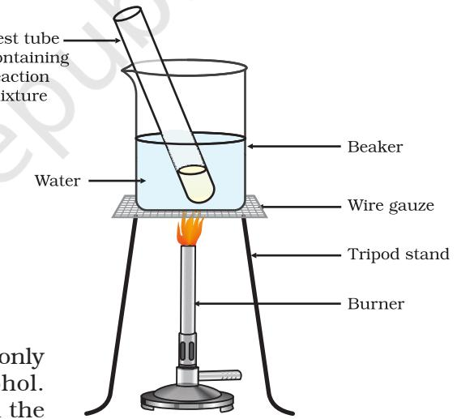

Figure 4.11 Formation of ester

#### CH COOC H C H OH+CH COONa 3 2 5 2 5 3 NaOH

- (ii) *Reaction with a base:* Like mineral acids, ethanoic acid reacts with a base such as sodium hydroxide to give a salt (sodium ethanoate or commonly called sodium acetate) and water:
#### NaOH + CH3COOH → CH3COONa + H2O

#### How does ethanoic acid react with carbonates and hydrogencarbonates?

Let us perform an activity to find out.

### Activity 4.9

- n Set up the apparatus as shown in Chapter 2, Activity 2.5.
- n Take a spatula full of sodium carbonate in a test tube and add 2 mL of dilute ethanoic acid.
- n What do you observe?
- n Pass the gas produced through freshly prepared lime-water. What do you observe?
- n Can the gas produced by the reaction between ethanoic acid and sodium carbonate be identified by this test?
- n Repeat this Activity with sodium hydrogencarbonate instead of sodium carbonate.
	- (iii) *Reaction with carbonates and hydrogencarbonates*: Ethanoic acid reacts with carbonates and hydrogencarbonates to give rise to a salt, carbon dioxide and water. The salt produced is commonly called sodium acetate.

#### 2CH3COOH + Na2CO3 → 2CH3COONa + H2O + CO2

CH3COOH + NaHCO3 → CH3COONa + H2O + CO2


- 1. How would you distinguish experimentally between an alcohol and a carboxylic acid?
- 2. What are oxidising agents?

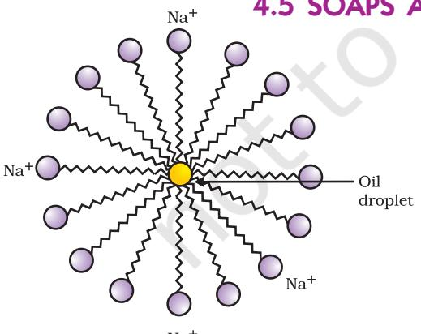


#### 4.5 SOAPS AND DETERGENTS

### Activity 4.10

- n Take about 10 mL of water each in two test tubes.
- n Add a drop of oil (cooking oil) to both the test tubes and label them as A and B.
- n To test tube B, add a few drops of soap solution.
- n Now shake both the test tubes vigourously for the same period of time.
- n Can you see the oil and water layers separately in both the test tubes immediately after you stop shaking them?
- n Leave the test tubes undisturbed for some time and observe. Does the oil layer separate out? In which test tube does this happen first?

?

This activity demonstrates the effect of soap in cleaning. Most dirt is oily in nature and as you know, oil does not dissolve in water. The molecules of soap are sodium or potassium salts of long-chain carboxylic acids. The ionic-end of soap interacts with water while the carbon chain interacts with oil. The soap molecules, thus form structures called micelles (see Fig. 4.12) where one end of the molecules is towards the oil droplet while the ionic-end faces outside. This forms an emulsion in water. The soap micelle thus helps in pulling out the dirt in water and we can wash our clothes clean (Fig. 4.13).

Can you draw the structure of the micelle that would be formed if you dissolve soap in a hydrocarbon?

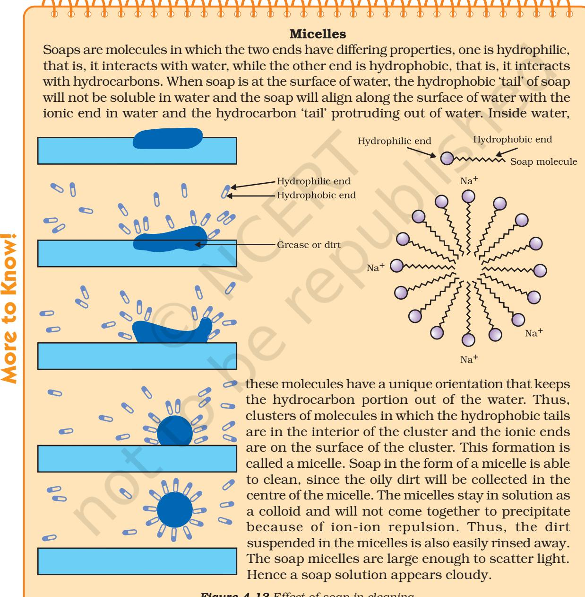

### Activity 4.11

- n Take about 10 mL of distilled water (or rain water) and 10 mL of hard water (from a tubewell or hand-pump) in separate test tubes.
- n Add a couple of drops of soap solution to both.
- n Shake the test tubes vigorously for an equal period of time and observe the amount of foam formed.
- n In which test tube do you get more foam?
- n In which test tube do you observe a white curdy precipitate? *Note for the teacher* : If hard water is not available in your locality, prepare some hard water by dissolving hydrogencarbonates/ sulphates/chlorides of calcium or magnesium in water.

### Activity 4.12

- n Take two test tubes with about 10 mL of hard water in each.
- n Add five drops of soap solution to one and five drops of detergent solution to the other.
- n Shake both test tubes for the same period.
- n Do both test tubes have the same amount of foam?
- n In which test tube is a curdy solid formed?

Have you ever observed while bathing that foam is formed with difficulty and an insoluble substance (scum) remains after washing with water? This is caused by the reaction of soap with the calcium and magnesium salts, which cause the hardness of water. Hence you need to use a larger amount of soap. This problem is overcome by using another class of compounds called detergents as cleansing agents. Detergents are generally sodium salts of sulphonic acids or ammonium salts with chlorides or bromides ions, etc. Both have long hydrocarbon chain. The charged ends of these compounds do not form insoluble precipitates with the calcium and magnesium ions in hard water. Thus, they remain effective in hard water. Detergents are usually used to make shampoos and products for cleaning clothes.

## QUESTIONS

1. Would you be able to check if water is hard by using a detergent?

- 2. People use a variety of methods to wash clothes. Usually after adding the soap, they 'beat' the clothes on a stone, or beat it with a paddle, scrub with a brush or the mixture is agitated in a washing machine. Why is agitation necessary to get clean clothes?
?

# What you have learnt

- n Carbon is a versatile element that forms the basis for all living organisms and many of the things we use.
- n This large variety of compounds is formed by carbon because of its tetravalency and the property of catenation that it exhibits.
- n Covalent bonds are formed by the sharing of electrons between two atoms so that both can achieve a completely filled outermost shell.
- n Carbon forms covalent bonds with itself and other elements such as hydrogen, oxygen, sulphur, nitrogen and chlorine.
- n Carbon also forms compounds containing double and triple bonds between carbon atoms. These carbon chains may be in the form of straight chains, branched chains or rings.
- n The ability of carbon to form chains gives rise to a homologous series of compounds in which the same functional group is attached to carbon chains of different lengths.
- n The functional groups such as alcohols, aldehydes, ketones and carboxylic acids bestow characteristic properties to the carbon compounds that contain them.
- n Carbon and its compounds are some of our major sources of fuels.
- n Ethanol and ethanoic acid are carbon compounds of importance in our daily lives.
- n The action of soaps and detergents is based on the presence of both hydrophobic and hydrophilic groups in the molecule and this helps to emulsify the oily dirt and hence its removal.

# EXERCISES

- 1. Ethane, with the molecular formula C2H6 has
	- (a) 6 covalent bonds.
	- (b) 7 covalent bonds.
	- (c) 8 covalent bonds.
	- (d) 9 covalent bonds.
- 2. Butanone is a four-carbon compound with the functional group
	- (a) carboxylic acid.
	- (b) aldehyde.
	- (c) ketone.
	- (d) alcohol.
- 3. While cooking, if the bottom of the vessel is getting blackened on the outside, it means that
	- (a) the food is not cooked completely.
	- (b) the fuel is not burning completely.
	- (c) the fuel is wet.
	- (d) the fuel is burning completely.
- 4. Explain the nature of the covalent bond using the bond formation in CH3Cl.
- 5. Draw the electron dot structures for
	- (a) ethanoic acid.
	- (b) H2 S.
	- (c) propanone.
	- (d) F2 .
- 6. What is an homologous series? Explain with an example.
- 7. How can ethanol and ethanoic acid be differentiated on the basis of their physical and chemical properties?
- 8. Why does micelle formation take place when soap is added to water? Will a micelle be formed in other solvents such as ethanol also?
- 9. Why are carbon and its compounds used as fuels for most applications?
- 10. Explain the formation of scum when hard water is treated with soap.
- 11. What change will you observe if you test soap with litmus paper (red and blue)?
- 12. What is hydrogenation? What is its industrial application?
- 13. Which of the following hydrocarbons undergo addition reactions: C2H6 , C3H8 , C3H6 , C2H2 and CH4 .
- 14. Give a test that can be used to differentiate between saturated and unsaturated hydrocarbons.
- 15. Explain the mechanism of the cleaning action of soaps.

# Group Activity

- I Use molecular model kits to make models of the compounds you have learnt in this Chapter.
- II n Take about 20 mL of castor oil/cotton seed oil/linseed oil/soyabean oil in a beaker. Add 30 mL of 20 % sodium hydroxide solution. Heat the mixture with continuous stirring for a few minutes till the mixture thickens. Add 5-10 g of common salt to this. Stir the mixture well and allow it to cool.
	- n You can cut out the soap in fancy shapes. You can also add perfume to the soap before it sets.

