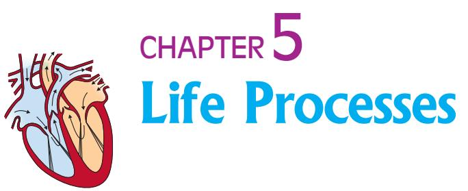

H ow do we tell the difference between what is alive and what is not alive? If we see a dog running, or a cow chewing cud, or a man shouting loudly on the street, we know that these are living beings. What if the dog or the cow or the man were asleep? We would still think that they were alive, but how did we know that? We see them breathing, and we know that they are alive. What about plants? How do we know that they are alive? We see them green, some of us will say. But what about plants that have leaves of colours other than green? They grow over time, so we know that they are alive, some will say. In other words, we tend to think of some sort of movement, either growth-related or not, as common evidence for being alive. But a plant that is not visibly growing is still alive, and some animals can breathe without visible movement. So using visible movement as the defining characteristic of life is not enough.

Movements over very small scales will be invisible to the naked eye – movements of molecules, for example. Is this invisible molecular movement necessary for life? If we ask this question to professional biologists, they will say yes. In fact, viruses do not show any molecular movement in them (until they infect some cell), and that is partly why there is a controversy about whether they are truly alive or not.

Why are molecular movements needed for life? We have seen in earlier classes that living organisms are well-organised structures; they can have tissues, tissues have cells, cells have smaller components in them, and so on. Because of the effects of the environment, this organised, ordered nature of living structures is very likely to keep breaking down over time. If order breaks down, the organism will no longer be alive. So living creatures must keep repairing and maintaining their structures. Since all these structures are made up of molecules, they must move molecules around all the time.

What are the maintenance processes in living organisms? Let us explore.

# 5.1 WHA 5.1 WHAT ARE LIFE PROCESSES?

The maintenance functions of living organisms must go on even when they are not doing anything particular. Even when we are just sitting in class, even if we are just asleep, this maintenance job has to go on. The processes which together perform this maintenance job are life processes.

Since these maintenance processes are needed to prevent damage and break-down, energy is needed for them. This energy comes from outside the body of the individual organism. So there must be a process to transfer a source of energy from outside the body of the organism, which we call food, to the inside, a process we commonly call nutrition. If the body size of the organisms is to grow, additional raw material will also be needed from outside. Since life on earth depends on carbonbased molecules, most of these food sources are also carbon-based. Depending on the complexity of these carbon sources, different organisms can then use different kinds of nutritional processes.

The outside sources of energy could be quite varied, since the environment is not under the control of the individual organism. These sources of energy, therefore, need to be broken down or built up in the body, and must be finally converted to a uniform source of energy that can be used for the various molecular movements needed for maintaining living structures, as well as to the kind of molecules the body needs to grow. For this, a series of chemical reactions in the body are necessary. Oxidising-reducing reactions are some of the most common chemical means to break-down molecules. For this, many organisms use oxygen sourced from outside the body. The process of acquiring oxygen from outside the body, and to use it in the process of break-down of food sources for cellular needs, is what we call respiration.

In the case of a single-celled organism, no specific organs for taking in food, exchange of gases or removal of wastes may be needed because the entire surface of the organism is in contact with the environment. But what happens when the body size of the organism increases and the body design becomes more complex? In multi-cellular organisms, all the cells may not be in direct contact with the surrounding environment. Thus, simple diffusion will not meet the requirements of all the cells.

We have seen previously how, in multi-cellular organisms, various body parts have specialised in the functions they perform. We are familiar with the idea of these specialised tissues, and with their organisation in the body of the organism. It is therefore not surprising that the uptake of food and of oxygen will also be the function of specialised tissues. However, this poses a problem, since the food and oxygen are now taken up at one place in the body of the organisms, while all parts of the body need them. This situation creates a need for a transportation system for carrying food and oxygen from one place to another in the body.

When chemical reactions use the carbon source and the oxygen for energy generation, they create by-products that are not only useless for the cells of the body, but could even be harmful. These waste byproducts are therefore needed to be removed from the body and discarded outside by a process called excretion. Again, if the basic rules for body design in multi-cellular organisms are followed, a specialised tissue for excretion will be developed, which means that the transportation system will need to transport waste away from cells to this excretory tissue.

Let us consider these various processes, so essential to maintain life, one by one.

# QUESTIONS

- 1. Why is diffusion insufficient to meet the oxygen requirements of multicellular organisms like humans?
- 2. What criteria do we use to decide whether something is alive?
- 3. What are outside raw materials used for by an organism?
- 4. What processes would you consider essential for maintaining life?

# 5.2 NUTRITION

When we walk or ride a bicycle, we are using up energy. Even when we are not doing any apparent activity, energy is needed to maintain a state of order in our body. We also need materials from outside in order to grow, develop, synthesise protein and other substances needed in the body. This source of energy and materials is the food we eat.

### How do living things get their food?

The general requirement for energy and materials is common in all organisms, but it is fulfilled in different ways. Some organisms use simple food material obtained from inorganic sources in the form of carbon dioxide and water. These organisms, the autotrophs, include green plants and some bacteria. Other organisms utilise complex substances. These complex substances have to be broken down into simpler ones before they can be used for the upkeep and growth of the body. To achieve this, organisms use bio-catalysts called enzymes. Thus, the heterotrophs survival depends directly or indirectly on autotrophs. Heterotrophic organisms include animals and fungi.

# 5.2.1 Autotrophic Nutrition

Carbon and energy requirements of the autotrophic organism are fulfilled by photosynthesis. It is the process by which autotrophs take in substances from the outside and convert them into stored forms of energy. This material is taken in the form of carbon dioxide and water which is converted into carbohydrates in the presence of sunlight and chlorophyll. Carbohydrates are utilised for providing energy to the plant. We will study how this takes place in the next section. The carbohydrates which are not used immediately are stored in the form of starch, which serves as the internal energy reserve to be used as and when required by the plant. A somewhat similar situation is seen in us where some of the energy derived from the food we eat is stored in our body in the form of glycogen.

?

Let us now see what actually happens during the process of photosynthesis. The following events occur during this process –

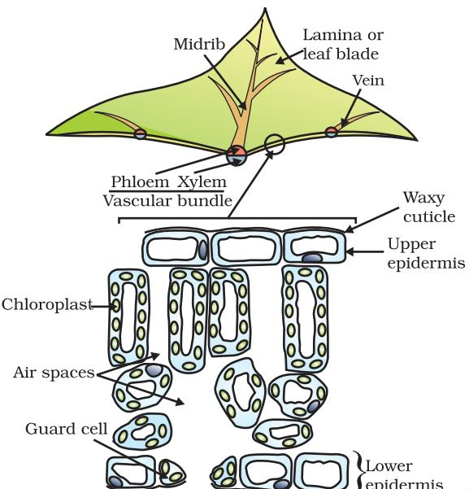

*Figure 5.1 Cross-section of a leaf*

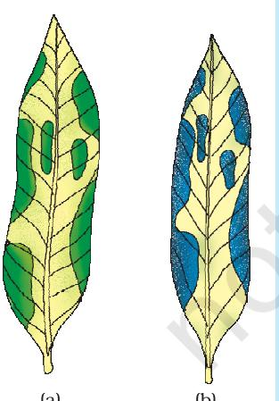

*Figure 5.2 Variegated leaf (a) before and (b) after starch test*

- (i) Absorption of light energy by chlorophyll.
- (ii) Conversion of light energy to chemical energy and splitting of water molecules into hydrogen and oxygen.
- (iii) Reduction of carbon dioxide to carbohydrates.

These steps need not take place one after the other immediately. For example, desert plants take up carbon dioxide at night and prepare an intermediate which is acted upon by the energy absorbed by the chlorophyll during the day.

Let us see how each of the components of the above reaction are necessary for photosynthesis.

If you carefully observe a cross-section of a leaf under the microscope (shown in Fig. 5.1), you will notice that some cells contain green dots. These green dots are cell organelles called chloroplasts which contain chlorophyll. Let us do an activity which demonstrates that chlorophyll is essential for photosynthesis.

# Activity 5.1

- n Take a potted plant with variegated leaves for example, money plant or crotons.
- n Keep the plant in a dark room for three days so that all the starch gets used up.
- n Now keep the plant in sunlight for about six hours.
- n Pluck a leaf from the plant. Mark the green areas in it and trace them on a sheet of paper.
- n Dip the leaf in boiling water for a few minutes.
- n After this, immerse it in a beaker containing alcohol.
- n Carefully place the above beaker in a water-bath and heat till the alcohol begins to boil.
- n What happens to the colour of the leaf? What is the colour of the solution?
- n Now dip the leaf in a dilute solution of iodine for a few minutes.
- n Take out the leaf and rinse off the iodine solution.
- n Observe the colour of the leaf and compare this with the tracing of the leaf done in the beginning (Fig. 5.2).
- n What can you conclude about the presence of starch in various areas of the leaf?

Now, let us study how the plant obtains carbon dioxide. In Class IX, we had talked about stomata (Fig. 5.3) which are tiny pores present on the surface of the leaves. Massive amounts of gaseous exchange takes place in the leaves through these pores for the purpose of photosynthesis. But it is important to note here that exchange of gases occurs across the surface of stems, roots and leaves as well. Since large amounts of water can also be lost through these stomata, the plant closes these pores when it does not

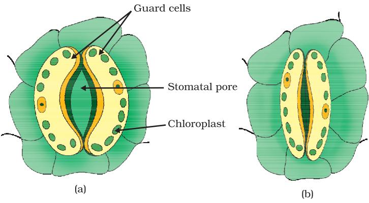

*Figure 5.3 (a) Open and (b) closed stomatal pore*

need carbon dioxide for photosynthesis. The opening and closing of the pore is a function of the guard cells. The guard cells swell when water flows into them, causing the stomatal pore to open. Similarly the pore closes if the guard cells shrink.

# Activity 5.2

- n Take two healthy potted plants which are nearly the same size.
- n Keep them in a dark room for three days.
- n Now place each plant on separate glass plates. Place a watch-glass containing potassium hydroxide by the side of one of the plants. The potassium hydroxide is used to absorb carbon dioxide.
- n Cover both plants with separate bell-jars as shown in Fig. 5.4.
- n Use vaseline to seal the bottom of the jars to the glass plates so that the set-up is air-tight.
- n Keep the plants in sunlight for about two hours.
- n Pluck a leaf from each plant and check for the presence of starch as in the above activity.
- n Do both the leaves show the presence of the same amount of starch?
- n What can you conclude from this activity?

Based on the two activities performed above, can we design an experiment to demonstrate that sunlight is essential for photosynthesis?

So far, we have talked about how autotrophs meet their energy requirements. But they also need other raw materials for building their body. Water used in photosynthesis is taken up from the soil by the roots in terrestrial plants. Other materials like nitrogen, phosphorus, iron and magnesium are taken up from the soil. Nitrogen is an essential element used in the synthesis of proteins and other compounds. This is

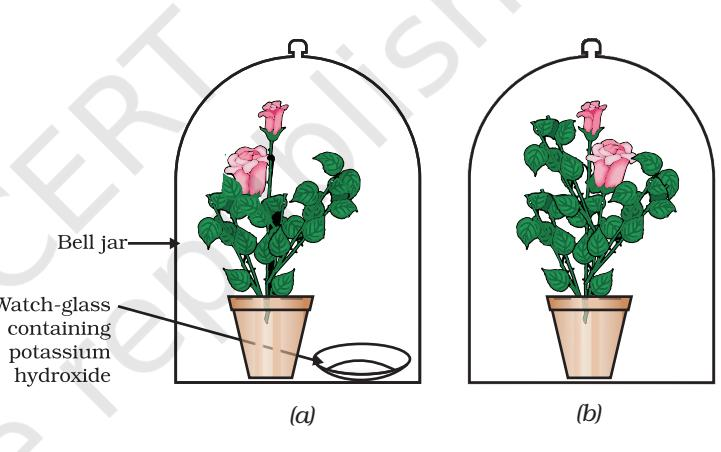

Figure 5.4 *Experimental set-up (a) with potassium hydroxide (b) without potassium hydroxide*

taken up in the form of inorganic nitrates or nitrites. Or it is taken up as organic compounds which have been prepared by bacteria from atmospheric nitrogen.

## 5.2.2 Heterotrophic Nutrition

Each organism is adapted to its environment. The form of nutrition differs depending on the type and availability of food material as well as how it is obtained by the organism. For example, whether the food source is stationary (such as grass) or mobile (such as a deer), would allow for differences in how the food is accessed and what is the nutritive apparatus used by a cow and a lion. There is a range of strategies by which the food is taken in and used by the organism. Some organisms break-down the food material outside the body and then absorb it. Examples are fungi like bread moulds, yeast and mushrooms. Others take in whole material and break it down inside their bodies. What can be taken in and broken down depends on the body design and functioning. Some other organisms derive nutrition from plants or animals without killing them. This parasitic nutritive strategy is used by a wide variety of organisms like cuscuta (amar-bel), ticks, lice, leeches and tape-worms.

# 5.2.3 How do Organisms obtain their Nutrition?

Since the food and the way it is obtained differ, the digestive system is

different in various organisms. In single-celled organisms, the food may be taken in by the entire surface. But as the complexity of the organism increases, different parts become specialised to perform different functions. For example, *Amoeba* takes in food using temporary finger-like extensions of the cell surface which fuse over the food particle forming a food-vacuole (Fig. 5.5). Inside the foodvacuole, complex substances are broken down into simpler ones which then diffuse into the cytoplasm. The remaining undigested material is moved to the surface of the cell and thrown out. In *Paramoecium*, which is also a unicellular organism, the cell has a definite shape and food is taken in at a specific spot. Food is moved to this spot by the movement of cilia which cover the entire surface

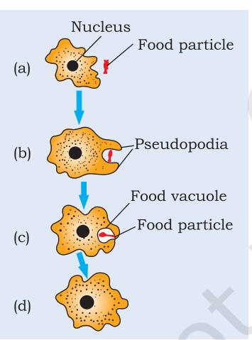

*Figure 5.5 Nutrition in Amoeba*

# 5.2.4 Nutrition in Human Beings

of the cell.

The alimentary canal is basically a long tube extending from the mouth to the anus. In Fig. 5.6, we can see that the tube has different parts. Various regions are specialised to perform different functions. What happens to the food once it enters our body? We shall discuss this process here.

# Activity 5.3

- n Take 1 mL starch solution (1%) in two test tubes (A and B).
- n Add 1 mL saliva to test tube A and leave both test tubes undisturbed for 20-30 minutes.
- n Now add a few drops of dilute iodine solution to the test tubes.
- n In which test tube do you observe a colour change?
- n What does this indicate about the presence or absence of starch in the two test tubes?
- n What does this tell us about the action of saliva on starch?

We eat various types of food which has to pass through the same digestive tract. Naturally the food has to be processed to generate particles which are small and of the same texture. This is achieved by crushing the food with our teeth. Since the lining of the canal is soft, the food is also wetted to make its passage smooth. When we eat something we like, our mouth 'waters'. This is actually not only water, but a fluid called saliva secreted by the salivary glands. Another aspect of the food we ingest is its complex nature. If it is to be absorbed from the alimentary canal, it has to be broken into smaller molecules. This is done with the

help of biological catalysts called enzymes. The saliva contains an enzyme called salivary amylase that breaks down starch which is a complex molecule to give simple sugar. The food is mixed thoroughly with saliva and moved around the mouth while chewing by the muscular tongue.

It is necessary to move the food in a regulated manner along the digestive tube so that it can be processed properly in each part. The lining of canal has muscles that contract rhythmically in order to push the food forward. These peristaltic movements occur all along the gut.

From the mouth, the food is taken to the stomach through the food-pipe or oesophagus. The stomach is a large organ which expands when food enters it. The muscular walls of the stomach help in mixing the food thoroughly with more digestive juices.

The digestion in stomach is taken

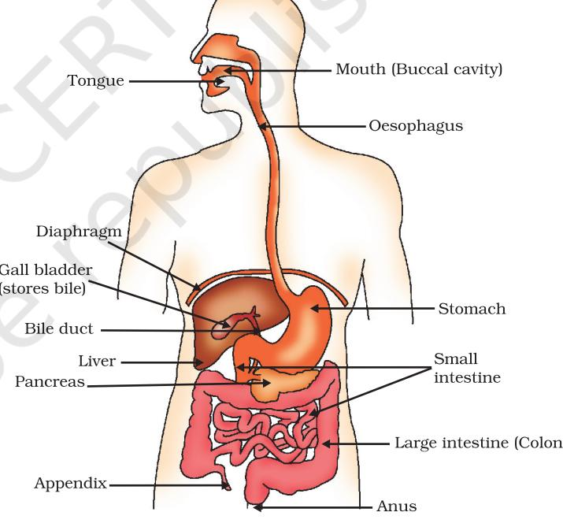

*Figure 5.6 Human alimentary canal*

care of by the gastric glands present in the wall of the stomach. These release hydrochloric acid, a protein digesting enzyme called pepsin, and mucus. The hydrochloric acid creates an acidic medium which facilitates the action of the enzyme pepsin. What other function do you think is served by the acid? The mucus protects the inner lining of the stomach from the action of the acid under normal conditions. We

have often heard adults complaining about 'acidity'. Can this be related to what has been discussed above?

The exit of food from the stomach is regulated by a sphincter muscle which releases it in small amounts into the small intestine. From the stomach, the food now enters the small intestine. This is the longest part of the alimentary canal which is fitted into a compact space because of extensive coiling. The length of the small intestine differs in various animals depending on the food they eat. Herbivores eating grass need a longer small intestine to allow the cellulose to be digested. Meat is easier to digest, hence carnivores like tigers have a shorter small intestine.

The small intestine is the site of the complete digestion of carbohydrates, proteins and fats. It receives the secretions of the liver and pancreas for this purpose. The food coming from the stomach is acidic and has to be made alkaline for the pancreatic enzymes to act. Bile juice from the liver accomplishes this in addition to acting on fats. Fats are present in the intestine in the form of large globules which makes it difficult for enzymes to act on them. Bile salts break them down into smaller globules increasing the efficiency of enzyme action. This is similar to the emulsifying action of soaps on dirt that we have learnt about in Chapter 4. The pancreas secretes pancreatic juice which contains enzymes like trypsin for digesting proteins and lipase for breaking down emulsified fats. The walls of the small intestine contain glands which secrete intestinal juice. The enzymes present in it finally convert the proteins to amino acids, complex carbohydrates into glucose and fats into fatty acids and glycerol.

Digested food is taken up by the walls of the intestine. The inner lining of the small intestine has numerous finger-like projections called villi which increase the surface area for absorption. The villi are richly supplied with blood vessels which take the absorbed food to each and every cell of the body, where it is utilised for obtaining energy, building up new tissues and the repair of old tissues.

The unabsorbed food is sent into the large intestine where its wall absorb more water from this material. The rest of the material is removed from the body via the anus. The exit of this waste material is regulated by the anal sphincter.

# More to Know!

# Dental caries

Dental caries or tooth decay causes gradual softening of enamel and dentine. It begins when bacteria acting on sugars produce acids that softens or demineralises the enamel. Masses of bacterial cells together with food particles stick to the teeth to form dental plaque. Saliva cannot reach the tooth surface to neutralise the acid as plaque covers the teeth. Brushing the teeth after eating removes the plaque before the bacteria produce acids. If untreated, microorganisms may invade the pulp, causing inflammation and infection.

# QUESTIONS

- 1. What are the differences between autotrophic nutrition and heterotrophic nutrition?
- 2. Where do plants get each of the raw materials required for photosynthesis?
- 3. What is the role of the acid in our stomach?
- 4. What is the function of digestive enzymes?
- 5. How is the small intestine designed to absorb digested food?

# 5.3 RESPIRATION

# Activity 5.4

- n Take some freshly prepared lime water in a test tube.
- n Blow air through this lime water.
- n Note how long it takes for the lime water to turn milky.
- n Use a syringe or *pichkari* to pass air through some fresh lime water taken in another test tube (Fig. 5.7).
- n Note how long it takes for this lime water to turn milky.
- n What does this tell us about the amount of carbon dioxide in the air that we breathe out?

?

#### *Figure 5.7*

*(a) Air being passed into lime water with a pichkari/ syringe, (b) air being exhaled into lime water*

# Activity 5.5

- n Take some fruit juice or sugar solution and add some yeast to this. Take this mixture in a test tube fitted with a one-holed cork.
- n Fit the cork with a bent glass tube. Dip the free end of the glass tube into a test tube containing freshly prepared lime water.
- n What change is observed in the lime water and how long does it take for this change to occur?
- n What does this tell us about the products of fermentation?

We have discussed nutrition in organisms in the last section. The food material taken in during the process of nutrition is used in cells to provide energy for various life processes. Diverse organisms do this in different ways – some use oxygen to break-down glucose completely into carbon dioxide and water, some use other pathways that do not involve oxygen (Fig. 5.8). In all cases, the first step is the break-down of glucose, a six-carbon molecule, into a three-carbon molecule called pyruvate. This process takes place in the cytoplasm. Further, the pyruvate may be converted into ethanol and carbon dioxide. This process takes place in yeast during fermentation. Since this process takes place in the absence of air (oxygen), it is called anaerobic respiration. Breakdown of pyruvate using oxygen takes place in the mitochondria. This process breaks up the three-carbon pyruvate molecule to give three molecules of carbon dioxide. The other product is water. Since this process takes place in the presence of air (oxygen), it is called aerobic respiration. The release of energy in this aerobic process is a lot greater than in the anaerobic process. Sometimes, when there is a lack of oxygen in our muscle cells, another pathway for the break-down of pyruvate is taken. Here the pyruvate is converted into lactic acid which is also a three-carbon molecule. This build-up of lactic acid in our muscles during sudden activity causes cramps.

*Figure 5.8 Break-down of glucose by various pathways*

The energy released during cellular respiration is immediately used to synthesise a molecule called ATP which is used to fuel all other activities in the cell. In these processes, ATP is broken down giving rise to a fixed amount of energy which can drive the endothermic reactions taking place in the cell.

# ATP

ATP is the energy currency for most cellular processes. The energy released during the process of respiration is used to make an ATP molecule from ADP and inorganic phosphate.

Endothermic processes in the cell then use this ATP to drive the reactions. When the terminal phosphate linkage in ATP is broken using water, the energy equivalent to 30.5 kJ/mol is released.

Think of how a battery can provide energy for many different kinds of uses. It can be used to obtain mechanical energy, light energy, electrical energy and so on. Similarly, ATP can be used in the cells for the contraction of muscles, protein synthesis, conduction of nervous impulses and many other activities.

> Since the aerobic respiration pathway depends on oxygen, aerobic organisms need to ensure that there is sufficient intake of oxygen. We have seen that plants exchange gases through stomata, and the large inter-cellular spaces ensure that all cells are in contact with air. Carbon dioxide and oxygen are exchanged by diffusion here. They can go into

cells, or away from them and out into the air. The direction of diffusion depends upon the environmental conditions and the requirements of the plant. At night, when there is no photosynthesis occurring, CO2 elimination is the major exchange activity going on. During the day, CO2 generated during respiration is used up for photosynthesis, hence there is no CO2 release. Instead, oxygen release is the major event at this time.

Animals have evolved different organs for the uptake of oxygen from the environment and for getting rid of the carbon dioxide produced. Terrestrial animals can breathe the oxygen in the atmosphere, but animals that live in water need to use the oxygen dissolved in water.

# Activity 5.6

- n Observe fish in an aquarium. They open and close their mouths and the gill-slits (or the operculum which covers the gill-slits) behind their eyes also open and close. Are the timings of the opening and closing of the mouth and gill-slits coordinated in some manner?
- n Count the number of times the fish opens and closes its mouth in a minute.
- n Compare this to the number of times you breathe in and out in a minute.

Since the amount of dissolved oxygen is fairly low compared to the amount of oxygen in the air, the rate of breathing in aquatic organisms is much faster than that seen in terrestrial organisms. Fishes take in water through their mouths and force it past the gills where the dissolved oxygen is taken up by blood.

Terrestrial organisms use the oxygen in the atmosphere for respiration. This oxygen is absorbed by different organs in different animals. All these organs have a structure that increases the surface area which is in contact with the oxygen-rich atmosphere. Since the exchange of oxygen and carbon dioxide has to take place across this surface, this surface is very fine and delicate. In order to protect this surface, it is usually placed within the body, so there have to be passages that will take air to this area. In addition, there is a mechanism for moving the air in and out of this area where the oxygen is absorbed.

In human beings (Fig. 5.9), air is taken into the body through the nostrils. The air passing through the nostrils is filtered by fine hairs that line the passage. The passage is also lined with mucus which helps in this process. From here, the air passes through the throat and into the lungs. Rings of cartilage are present in the throat. These ensure that the air-passage does not collapse.

# More to Know!

Using tobacco directly or any product of tobacco in the form of cigar, cigarettes, *bidis*, *hookah*, *gutkha*, etc., is harmful. Use of tobacco most commonly affects the tongue, lungs, heart and liver. Smokeless tobacco is also a major risk factor for heart attacks, strokes, pulmonary diseases and several forms of cancers. There is a high incidence of oral cancer in India due to the chewing of tobacco in the form of *gutkha*. Stay healthy; just say NO to tobacco and its products!

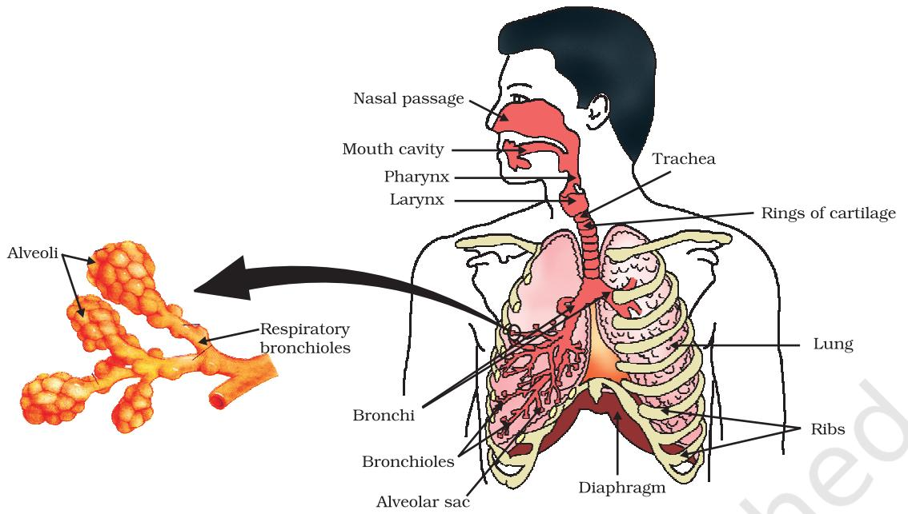

*Figure 5.9 Human respiratory system*

# Do You Know?

Smoking is injurious to health.

Lung cancer is one of common causes of deaths in the world. The upper part of respiratory tract is provided with small hair -like structures called cilia. These cilia help to remove germs, dust and other harmful particles from inhaled air. Smoking destroys these hair due to which germs, dust, smoke and other harmful chemicals enter lungs and cause infection, cough and even lung cancer.

Within the lungs, the passage divides into smaller and smaller tubes which finally terminate in balloon-like structures which are called alveoli (singular–alveolus). The alveoli provide a surface where the exchange of gases can take place. The walls of the alveoli contain an extensive network of blood-vessels. As we have seen in earlier years, when we breathe in, we lift our ribs and flatten our diaphragm, and the chest cavity becomes larger as a result. Because of this, air is sucked into the lungs and fills the expanded alveoli. The blood brings carbon dioxide from the rest of the body for release into the alveoli, and the oxygen in the alveolar air is taken up by blood in the alveolar blood vessels to be transported to all the cells in the body. During the breathing cycle, when air is taken in and let out, the lungs always contain a residual volume of air so that there is sufficient time for oxygen to be absorbed and for the carbon dioxide to be released.

When the body size of animals is large, the diffusion pressure alone cannot take care of oxygen delivery to all parts of the body. Instead, respiratory pigments take up oxygen from the air in the lungs and carry it to tissues which are deficient in oxygen before releasing it. In human beings, the respiratory pigment is haemoglobin which has a very high affinity for oxygen. This pigment is present in the red blood corpuscles. Carbon dioxide is more soluble in water than oxygen is and hence is mostly transported in the dissolved form in our blood.

Do You Know?

- n If the alveolar surface were spread out, it would cover about 80 m2 . How much do you think the surface area of your body is? Consider how efficient exchange of gases becomes because of the large surface available for the exchange to take place.
- n If diffusion were to move oxygen in our body, it is estimated that it would take 3 years for a molecule of oxygen to get to our toes from our lungs. Aren't you glad that we have haemoglobin?

# QUESTIONS

- 1. What advantage over an aquatic organism does a terrestrial organism have with regard to obtaining oxygen for respiration?
- 2. What are the different ways in which glucose is oxidised to provide energy in various organisms?
- 3. How is oxygen and carbon dioxide transported in human beings?
- 4. How are the lungs designed in human beings to maximise the area for exchange of gases?

# 5.4 TRANSPORT ANSPORTATION

5.4.1 Transportation in Human Beings

# Activity 5.7

- n Visit a health centre in your locality and find out what is the normal range of haemoglobin content in human beings.
- n Is it the same for children and adults?
- n Is there any difference in the haemoglobin levels for men and women?
- n Visit a veterinary clinic in your locality. Find out what is the normal range of haemoglobin content in an animal like the buffalo or cow.
- n Is this content different in calves, male and female animals?
- n Compare the difference seen in male and female human beings and animals.
- n How would the difference, if any, be explained?

We have seen in previous sections that blood transports food, oxygen and waste materials in our bodies. In Class IX, we learnt about blood being a fluid connective tissue. Blood consists of a fluid medium called plasma in which the cells are suspended. Plasma transports food, carbon dioxide and nitrogenous wastes in dissolved form. Oxygen is carried by the red blood corpuscles. Many other substances like salts, are also transported by the blood. We thus need a pumping organ to push blood around the body, a network of tubes to reach all the tissues and a system in place to ensure that this network can be repaired if damaged.

?

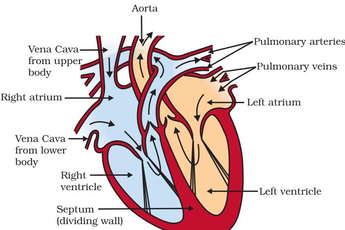

#### *Figure 5.10*

*Schematic sectional view of the human heart*

#### Our pump — the heart

The heart is a muscular organ which is as big as our fist (Fig. 5.10). Because both oxygen and carbon dioxide have to be transported by the blood, the heart has different chambers to prevent the oxygen-rich blood from mixing with the blood containing carbon dioxide. The carbon dioxide-rich blood has to reach the lungs for the carbon dioxide to be removed, and the oxygenated blood from the lungs has to be brought back to the heart. This oxygen-rich blood is then pumped to the rest of the body.

We can follow this process step by step (Fig. 5.11). Oxygen-rich blood from the lungs comes to the thin-walled upper

chamber of the heart on the left, the left atrium. The left atrium relaxes when it is collecting this blood. It then contracts, while the next chamber, the left ventricle, relaxes, so that the blood is transferred to it. When the muscular left ventricle contracts in its turn, the blood is pumped out to the body. De-oxygenated blood comes from the body to the upper chamber on the right, the right atrium, as it relaxes. As the right atrium contracts, the corresponding lower chamber, the right ventricle, dilates. This transfers blood to the right ventricle, which in turn pumps it to the lungs for oxygenation. Since ventricles have to pump blood into various organs, they have thicker muscular walls than the atria do. Valves ensure that blood does not flow backwards when the atria or ventricles contract.

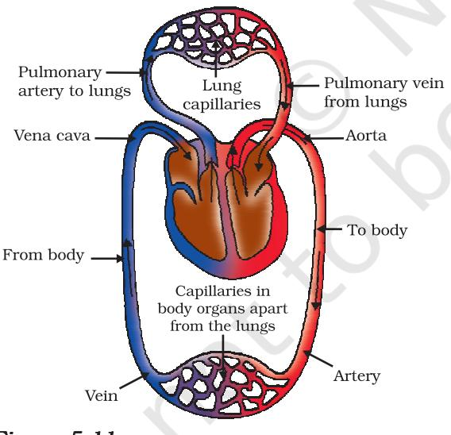

*Figure 5.11*

*Schematic representation of transport and exchange of oxygen and carbon dioxide*

#### Oxygen enters the blood in the lungs

The separation of the right side and the left side of the heart is useful to keep oxygenated and deoxygenated blood from mixing. Such separation allows a highly efficient supply of oxygen to the body. This is useful in animals that have high energy needs, such as birds and mammals, which constantly use energy to maintain their body temperature. In animals that do not use energy for this purpose, the body temperature depends on the temperature in the environment. Such animals, like amphibians or many reptiles have three-chambered hearts, and tolerate some mixing of the oxygenated and de-oxygenated blood streams. Fishes, on the other hand, have only two chambers to their hearts, and the blood is pumped to the gills, is oxygenated there, and passes directly to the rest of the body. Thus, blood goes only once through the heart in the fish during one cycle of

passage through the body. On the other hand, it goes through the heart twice during each cycle in other vertebrates. This is known as double circulation.

#### Blood pressure

The force that blood exerts against the wall of a vessel is called blood pressure. This pressure is much greater in arteries than in veins. The pressure of blood inside the artery during ventricular systole (contraction) is called systolic pressure and pressure in artery during ventricular diastole (relaxation) is called diastolic pressure. The normal systolic pressure is about 120 mm of Hg and diastolic pressure is 80 mm of Hg.

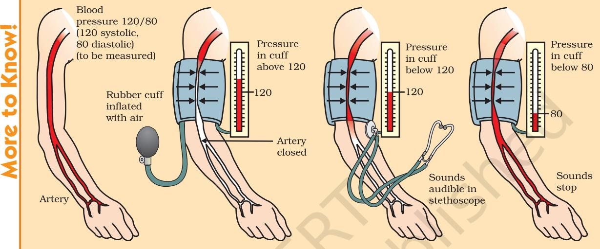

Blood pressure is measured with an instrument called sphygmomanometer. High blood pressure is also called hypertension and is caused by the constriction of arterioles, which results in increased resistance to blood flow. It can lead to the rupture of an artery and internal bleeding.

#### The tubes – blood vessels

Arteries are the vessels which carry blood away from the heart to various organs of the body. Since the blood emerges from the heart under high pressure, the arteries have thick, elastic walls. Veins collect the blood from different organs and bring it back to the heart. They do not need thick walls because the blood is no longer under pressure, instead they have valves that ensure that the blood flows only in one direction.

On reaching an organ or tissue, the artery divides into smaller and smaller vessels to bring the blood in contact with all the individual cells. The smallest vessels have walls which are one-cell thick and are called capillaries. Exchange of material between the blood and surrounding cells takes place across this thin wall. The capillaries then join together to form veins that convey the blood away from the organ or tissue.

#### Maintenance by platelets

What happens if this system of tubes develops a leak? Think about situations when we are injured and start bleeding. Naturally the loss of blood from the system has to be minimised. In addition, leakage would lead to a loss of pressure which would reduce the efficiency of the

pumping system. To avoid this, the blood has platelet cells which circulate around the body and plug these leaks by helping to clot the blood at these points of injury.

#### Lymph

There is another type of fluid also involved in transportation. This is called lymph or tissue fluid. Through the pores present in the walls of capillaries some amount of plasma, proteins and blood cells escape into intercellular spaces in the tissues to form the tissue fluid or lymph. It is similar to the plasma of blood but colourless and contains less protein. Lymph drains into lymphatic capillaries from the intercellular spaces, which join to form large lymph vessels that finally open into larger veins. Lymph carries digested and absorbed fat from intestine and drains excess fluid from extra cellular space back into the blood.

## 5.4.2 Transportation in Plants

We have discussed earlier how plants take in simple compounds such as CO2 and photosynthesise energy stored in their chlorophyll-containing organs, namely leaves. The other kinds of raw materials needed for building plant bodies will also have to be taken up separately. For plants, the soil is the nearest and richest source of raw materials like nitrogen, phosphorus and other minerals. The absorption of these substances therefore occurs through the part in contact with the soil, namely roots. If the distances between soil-contacting organs and chlorophyllcontaining organs are small, energy and raw materials can easily diffuse to all parts of the plant body. But if these distances become large because of changes in plant body design, diffusion processes will not be sufficient to provide raw material in leaves and energy in roots. A proper system of transportation is therefore essential in such situations.

Energy needs differ between different body designs. Plants do not move, and plant bodies have a large proportion of dead cells in many tissues. As a result, plants have low energy needs, and can use relatively slow transport systems. The distances over which transport systems have to operate, however, can be very large in plants such as very tall trees.

Plant transport systems will move energy stores from leaves and raw materials from roots. These two pathways are constructed as independently organised conducting tubes. One, the xylem moves water and minerals obtained from the soil. The other, phloem transports products of photosynthesis from the leaves where they are synthesised to other parts of the plant. We have studied the structure of these tissues in detail in Class IX.

#### Transport of water

In xylem tissue, vessels and tracheids of the roots, stems and leaves are interconnected to form a continuous system of water-conducting channels reaching all parts of the plant. At the roots, cells in contact with the soil actively take up ions. This creates a difference in the concentration of these ions between the root and the soil. Water, therefore, moves into the root from the soil to eliminate this difference. This means that there is steady movement of water into root xylem, creating a column of water that is steadily pushed upwards.

However, this pressure by itself is unlikely to be enough to move water over the heights that we commonly see in plants. Plants use another strategy to move water in the xylem upwards to the highest points of the plant body.

# Activity 5.8

- n Take two small pots of approximately the same size and having the same amount of soil. One should have a plant in it. Place a stick of the same height as the plant in the other pot.
- n Cover the soil in both pots with a plastic sheet so that moisture cannot escape by evaporation.
- n Cover both sets, one with the plant and the other with the stick, with plastic sheets and place in bright sunlight for half an hour.
- n Do you observe any difference in the two cases?

Provided that the plant has an adequate supply of water, the water which is lost through the stomata is replaced by water from the xylem vessels in the leaf. In fact, evaporation of water molecules from the cells of a leaf creates a suction which pulls water from the xylem cells of roots. The loss of water in the form of vapour from the aerial parts of the plant is known as transpiration.

Thus, transpiration helps in the absorption and upward movement of water and minerals dissolved in it from roots to the leaves. It also helps in temperature regulation. The effect of root pressure in transport of water is more important at night. During the day when the stomata are open, the transpiration pull becomes the major driving force in the movement of water in the xylem.

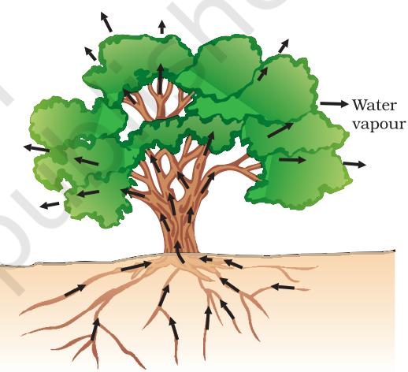

*Figure 5.12 Movement of water during transpiration in a tree*

#### Transport of food and other substances

So far we have discussed the transport of water and minerals in plants. Now let us consider how the products of metabolic processes, particularly photosynthesis, are moved from leaves, where they are formed, to other parts of the plant. This transport of soluble products of photosynthesis is called translocation and it occurs in the part of the vascular tissue known as phloem. Besides the products of photosynthesis, the phloem transports amino acids and other substances. These substances are especially delivered to the storage organs of roots, fruits and seeds and to growing organs. The translocation of food and other substances takes place in the sieve tubes with the help of adjacent companion cells both in upward and downward directions.

Unlike transport in xylem which can be largely explained by simple physical forces, the translocation in phloem is achieved by utilising energy. Material like sucrose is transferred into phloem tissue using energy from ATP. This increases the osmotic pressure of the tissue causing water to move into it. This pressure moves the material in the phloem to tissues which have less pressure. This allows the phloem to move material according to the plant's needs. For example, in the spring, sugar stored in root or stem tissue would be transported to the buds which need energy to grow.

# QUESTIONS

- 1. What are the components of the transport system in human beings? What are the functions of these components?
- 2. Why is it necessary to separate oxygenated and deoxygenated blood in mammals and birds?
- 3. What are the components of the transport system in highly organised plants?
- 4. How are water and minerals transported in plants?
- 5. How is food transported in plants?

# 5.5 EXCRETION CRETION

We have already discussed how organisms get rid of gaseous wastes generated during photosynthesis or respiration. Other metabolic activities generate nitrogenous materials which need to be removed. The biological process involved in the removal of these harmful metabolic wastes from the body is called excretion. Different organisms use varied strategies to do this. Many unicellular organisms remove these wastes by simple

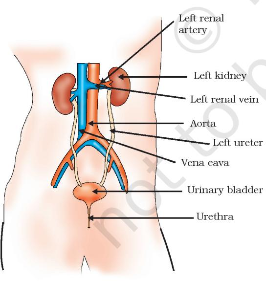

Figure 5.13 *Excretory system in human beings*

diffusion from the body surface into the surrounding water. As we have seen in other processes, complex multi-cellular organisms use specialised organs to perform the same function.

## 5.5.1 Excretion in Human Beings

The excretory system of human beings (Fig. 5.13) includes a pair of kidneys, a pair of ureters, a urinary bladder and a urethra. Kidneys are located in the abdomen, one on either side of the backbone. Urine produced in the kidneys passes through the ureters into the urinary bladder where it is stored until it is released through the urethra.

How is urine produced? The purpose of making urine is to filter out waste products from the blood. Just as CO2 is removed from the blood in the lungs, nitrogenous waste such as urea or uric acid are removed from blood in the kidneys. It is then no surprise that the basic filtration unit in the kidneys,

?

like in the lungs, is a cluster of very thin-walled blood capillaries. Each capillary cluster in the kidney is associated with the cup-shaped end of a coiled tube called Bowman's capsule that collects the filtrate (Fig. 5.14). Each kidney has large numbers of these filtration units called nephrons packed close together. Some substances in the initial filtrate, such as glucose, amino acids, salts and a major amount of water, are selectively re-absorbed as the urine flows along the tube. The amount of water re-absorbed depends on how much excess water there is in the body, and on how much of dissolved waste there is to be excreted. The urine forming in each kidney eventually enters a long tube, the ureter, which connects the kidneys with the urinary bladder. Urine is stored in the urinary bladder until the pressure of the expanded bladder leads to the urge to pass it out through the urethra. The bladder is muscular, so it is under nervous control, as we have discussed elsewhere. As a result, we can usually control the urge to urinate.

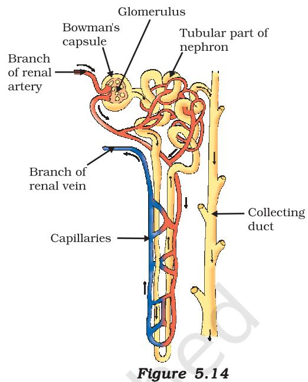

# *Structure of a nephron*

#### Artificial kidney (Hemodialysis)

Kidneys are vital organs for survival. Several factors like infections, injury or restricted blood flow to kidneys reduce the activity of kidneys. This leads to accumulation of poisonous wastes in the body, which can even lead to death. In case of kidney failure, an artificial kidney can be used. An artificial kidney is a device to remove nitrogenous waste products from the blood through *dialysis.*

Artificial kidneys contain a number of tubes with a semi-permeable lining, suspended

More to Know!

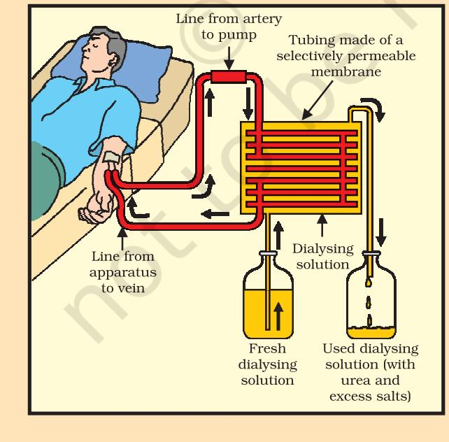

in a tank filled with dialysing fluid. This fluid has the same osmotic pressure as blood, except that it is devoid of nitrogenous wastes. The patient's blood is passed through these tubes. During this passage, the waste products from the blood pass into dialysing fluid by diffusion. The purified blood is pumped back into the patient. This is similar to the function of the kidney, but it is different since there is no reabsorption involved. Normally, in a healthy adult, the initial filtrate in the kidneys is about 180 L daily. However, the volume actually excreted is only a litre or two a day, because the remaining filtrate is reabsorbed in the kidney tubules.

#### Think it over!

#### Organ donation

Organ donation is a generous act of donating an organ to a person who suffers from non-function of organ(s). Donation of an organ may be done by the consent of the donor and his/her family. Anyone regardless of age or gender can become an organ and tissue donor. Organ transplants can save or transform the life of a person. Transplantation is required because recipient's organ has been damaged or has failed by disease or injury. In organ transplantation the organ is surgically removed from one person (organ donor) and transplanted to another person (the recipient). Common transplantations include corneas, kidneys, heart, liver, pancreas, lungs, intestines and bone marrow. Most organ and tissue donations occur just after the donor has died or when the doctor declares a person brain dead. But some organs such as kidney, part of a liver, lung, etc., and tissues can be donated while the donor is alive.

# 5.5.2 Excretion in Plants

Plants use completely different strategies for excretion than those of animals. Oxygen itself can be thought of as a waste product generated during photosynthesis! We have discussed earlier how plants deal with oxygen as well as CO2 . They can get rid of excess water by transpiration. For other wastes, plants use the fact that many of their tissues consist of dead cells, and that they can even lose some parts such as leaves. Many plant waste products are stored in cellular vacuoles. Waste products may be stored in leaves that fall off. Other waste products are stored as resins and gums, especially in old xylem. Plants also excrete some waste substances into the soil around them.

# QUESTIONS

- 1. Describe the structure and functioning of nephrons.
- 2. What are the methods used by plants to get rid of excretory products?
- 3. How is the amount of urine produced regulated?

# What you have learnt

- n Movement of various types can be taken as an indication of life.
- n Maintenance of life requires processes like nutrition, respiration, transport of materials within the body and excretion of waste products.
- n Autotrophic nutrition involves the intake of simple inorganic materials from the environment and using an external energy source like the Sun to synthesise complex high-energy organic material.
- n Heterotrophic nutrition involves the intake of complex material prepared by other organisms.
- n In human beings, the food eaten is broken down by various steps along the alimentary canal and the digested food is absorbed in the small intestine to be sent to all cells in the body.

?

- n During the process of respiration, organic compounds such as glucose are broken down to provide energy in the form of ATP. ATP is used to provide energy for other reactions in the cell.
- n Respiration may be aerobic or anaerobic. Aerobic respiration makes more energy available to the organism.
- n In human beings, the transport of materials such as oxygen, carbon dioxide, food and excretory products is a function of the circulatory system. The circulatory system consists of the heart, blood and blood vessels.
- n In highly differentiated plants, transport of water, minerals, food and other materials is a function of the vascular tissue which consists of xylem and phloem.
- n In human beings, excretory products in the form of soluble nitrogen compounds are removed by the nephrons in the kidneys.
- n Plants use a variety of techniques to get rid of waste material. For example, waste material may be stored in the cell-vacuoles or as gum and resin, removed in the falling leaves, or excreted into the surrounding soil.

# EXERCISES

- 1. The kidneys in human beings are a part of the system for
	- (a) nutrition. (c) excretion.
	- (b) respiration. (d) transportation.
- 2. The xylem in plants are responsible for
	- (a) transport of water. (c) transport of amino acids.
		- (b) transport of food. (d) transport of oxygen.
- 3. The autotrophic mode of nutrition requires
	- (a) carbon dioxide and water. (c) sunlight.
	- (b) chlorophyll. (d) all of the above.
		-
- 4. The breakdown of pyruvate to give carbon dioxide, water and energy takes place in
	- (a) cytoplasm. (c) chloroplast.
		-
	- (b) mitochondria. (d) nucleus.
- 5. How are fats digested in our bodies? Where does this process take place?
- 6. What is the role of saliva in the digestion of food?
- 7. What are the necessary conditions for autotrophic nutrition and what are its byproducts?
- 8. What are the differences between aerobic and anaerobic respiration? Name some organisms that use the anaerobic mode of respiration.
- 9. How are the alveoli designed to maximise the exchange of gases?
- 10. What would be the consequences of a deficiency of haemoglobin in our bodies?
- 11. Describe double circulation of blood in human beings. Why is it necessary?
- 12. What are the differences between the transport of materials in xylem and phloem?
- 13. Compare the functioning of alveoli in the lungs and nephrons in the kidneys with respect to their structure and functioning.

