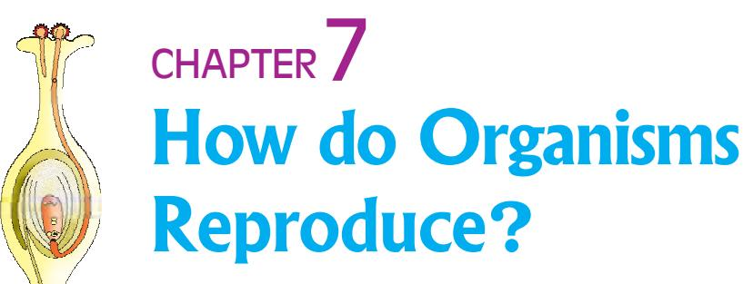

B efore we discuss the mechanisms by which organisms reproduce, let us ask a more basic question – why do organisms reproduce? After all, reproduction is not necessary to maintain the life of an individual organism, unlike the essential life processes such as nutrition, respiration, or excretion. On the other hand, if an individual organism is going to create more individuals, a lot of its energy will be spent in the process. So why should an individual organism waste energy on a process it does not need to stay alive? It would be interesting to discuss the possible answers in the classroom!

Whatever the answer to this question, it is obvious that we notice organisms because they reproduce. If there were to be only one, nonreproducing member of a particular kind, it is doubtful that we would have noticed its existence. It is the large numbers of organisms belonging to a single species that bring them to our notice. How do we know that two different individual organisms belong to the same species? Usually, we say this because they look similar to each other. Thus, reproducing organisms create new individuals that look very much like themselves.

#### 7.1 DO ORGANISMS CREATE EXACT COPIES OF THEMSEL THEMSELVES?

Organisms look similar because their body designs are similar. If body designs are to be similar, the blueprints for these designs should be similar. Thus, reproduction at its most basic level will involve making copies of the blueprints of body design. In Class IX, we learnt that the chromosomes in the nucleus of a cell contain information for inheritance of features from parents to next generation in the form of DNA (Deoxyribo Nucleic Acid) molecules. The DNA in the cell nucleus is the information source for making proteins. If the information is changed, different proteins will be made. Different proteins will eventually lead to altered body designs.

Therefore, a basic event in reproduction is the creation of a DNA copy. Cells use chemical reactions to build copies of their DNA. This creates two copies of the DNA in a reproducing cell, and they will need to be separated from each other. However, keeping one copy of DNA in the original cell and simply pushing the other one out would not work, because the copy pushed out would not have any organised cellular structure for maintaining life processes. Therefore, DNA copying is accompanied by the creation of an additional cellular apparatus, and then the DNA copies separate, each with its own cellular apparatus. Effectively, a cell divides to give rise to two cells.

These two cells are of course similar, but are they likely to be absolutely identical? The answer to this question will depend on how accurately the copying reactions involved occur. No bio-chemical reaction is absolutely reliable. Therefore, it is only to be expected that the process of copying the DNA will have some variations each time. As a result, the DNA copies generated will be similar, but may not be identical to the original. Some of these variations might be so drastic that the new DNA copy cannot work with the cellular apparatus it inherits. Such a newborn cell will simply die. On the other hand, there could still be many other variations in the DNA copies that would not lead to such a drastic outcome. Thus, the surviving cells are similar to, but subtly different from each other. This inbuilt tendency for variation during reproduction is the basis for evolution, as we will discuss in the next chapter.

#### 7.1.1 The Importance of Variation

Populations of organisms fill well-defined places, or niches, in the ecosystem, using their ability to reproduce. The consistency of DNA copying during reproduction is important for the maintenance of body design features that allow the organism to use that particular niche. Reproduction is therefore linked to the stability of populations of species.

However, niches can change because of reasons beyond the control of the organisms. Temperatures on earth can go up or down, water levels can vary, or there could be meteorite hits, to think of a few examples. If a population of reproducing organisms were suited to a particular niche and if the niche were drastically altered, the population could be wiped out. However, if some variations were to be present in a few individuals in these populations, there would be some chance for them to survive. Thus, if there were a population of bacteria living in temperate waters, and if the water temperature were to be increased by global warming, most of these bacteria would die, but the few variants resistant to heat would survive and grow further. Variation is thus useful for the survival of species over time.

## QUESTIONS

- 1. What is the importance of DNA copying in reproduction?
- 2. Why is variation beneficial to the species but not necessarily for the individual?

?

#### 7.2 MODES OF REPRODUCTION USED BY SINGLE ORGANISMS

#### Activity 7.1

- n Dissolve about 10 gm of sugar in 100 mL of water.
- n Take 20 mL of this solution in a test tube and add a pinch of yeast granules to it.
- n Put a cotton plug on the mouth of the test tube and keep it in a warm place.
- n After 1 or 2 hours, put a small drop of yeast culture from the test tube on a slide and cover it with a coverslip.
- n Observe the slide under a microscope.

### Activity 7.2

- n Wet a slice of bread, and keep it in a cool, moist and dark place.
- n Observe the surface of the slice with a magnifying glass.
- n Record your observations for a week.

Compare and contrast the ways in which yeast grows in the first case, and how mould grows in the second.

Having discussed the context in which reproductive processes work, let us now examine how different organisms actually reproduce. The modes by which various organisms reproduce depend on the body design of the organisms.

#### 7.2.1 Fission

For unicellular organisms, cell division, or fission, leads to the creation of new individuals. Many different patterns of fission have been observed. Many bacteria and protozoa simply split into two equal halves during cell division. In organisms such as *Amoeba*, the splitting of the two cells during division can take place in any plane.

#### Activity 7.3

- n Observe a permanent slide of *Amoeba* under a microscope.
- n Similarly observe another permanent slide of *Amoeba* showing binary fission.
- n Now, compare the observations of both the slides.

However, some unicellular organisms show somewhat more organisation of their bodies, such as is seen in *Leishmania* (which cause *kala-azar*), which have a whip-like structure at one end of the cell. In such

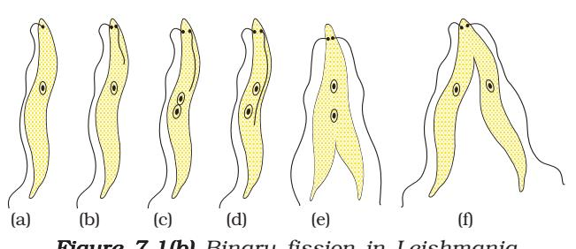

*Figure 7.1(a) Binary fission in Amoeba*

*Figure 7.1(b) Binary fission in Leishmania*

organisms, binary fission occurs in a definite orientation in relation to

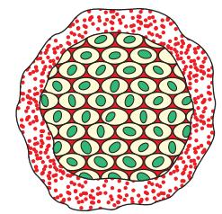

*Figure 7.2 Multiple fission in Plasmodium* Activity 7.4

these structures. Other single-celled organisms, such as the malarial parasite, *Plasmodium*, divide into many daughter cells simultaneously by multiple fission.

Yeast, on the other hand, can put out small buds that separate and grow further, as we saw in Activity 7.1.

#### 7.2.2 Fragmentation

- n Collect water from a lake or pond that appears dark green and contains filamentous structures.
- n Put one or two filaments on a slide.
- n Put a drop of glycerine on these filaments and cover it with a coverslip.
- n Observe the slide under a microscope.
- n Can you identify different tissues in the *Spirogyra* filaments?

In multi-cellular organisms with relatively simple body organisation, simple reproductive methods can still work. *Spirogyra*, for example, simply breaks up into smaller pieces upon maturation. These pieces or fragments grow into new individuals. Can we work out the reason for this, based on what we saw in Activity 7.4?

This is not true for all multi-cellular organisms. They cannot simply divide cell-by-cell. The reason is that many multi-cellular organisms, as we have seen, are not simply a random collection of cells. Specialised cells are organised as tissues, and tissues are organised into organs, which then have to be placed at definite positions in the body. In such a carefully organised situation, cell-by-cell division would be impractical. Multi-cellular organisms, therefore, need to use more complex ways of reproduction.

A basic strategy used in multi-cellular organisms is that different cell types perform different specialised functions. Following this general pattern, reproduction in such organisms is also the function of a specific cell type. How is reproduction to be achieved from a single cell type, if the organism itself consists of many cell types? The answer is that there must be a single cell type in the organism that is capable of growing, proliferating and making other cell types under the right circumstances.

#### 7.2.3 Regeneration

Many fully differentiated organisms have the ability to give rise to new individual organisms from their body parts. That is, if the individual is somehow cut or broken up into many pieces, many of these pieces grow into separate individuals. For example, simple animals like *Hydra* and *Planaria* can be cut into any number of pieces and each piece grows into a complete organism. This is known as regeneration (see Fig. 7.3). Regeneration is carried out by specialised cells. These cells proliferate and make large numbers of cells. From this mass of cells, different cells undergo changes to become various cell types and tissues. These changes

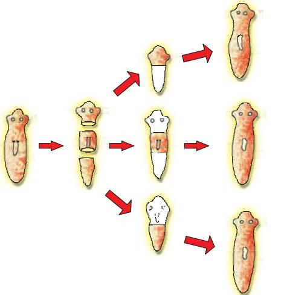

*Figure 7.3 Regeneration in Planaria*

to repeated cell division at one specific site (Fig. 7.4). These buds develop into tiny individuals and when fully mature, detach from the parent body and become new independent individuals.

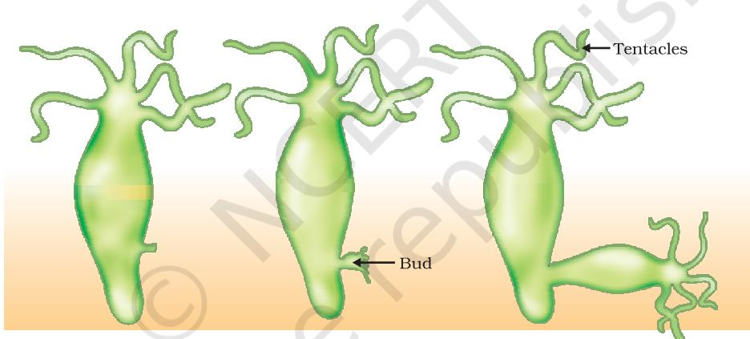

take place in an organised sequence referred to as development. However, regeneration is not the same as reproduction, since most organisms would not normally depend on being cut up to be able to reproduce.

Organisms such as *Hydra* use regenerative cells for reproduction in the process of budding. In *Hydra*, a bud develops as an outgrowth due

7.2.4 Budding

*Figure 7.4 Budding in Hydra*

#### 7.2.5 Vegetative Propagation

There are many plants in which parts like the root, stem and leaves develop into new plants under appropriate conditions. Unlike in most animals, plants can indeed use such a mode for reproduction. This property of vegetative propagation is used in methods such as layering or grafting to grow many plants like sugarcane, roses, or grapes for agricultural purposes. Plants raised by vegetative propagation can bear flowers and fruits earlier than those produced from seeds. Such methods also make possible the propagation of plants such as banana, orange, rose and jasmine that have lost the capacity to produce seeds. Another advantage of vegetative propagation is that all plants produced are genetically similar enough to the parent plant to have all its characteristics.

## Activity 7.5

- n Take a potato and observe its surface. Can notches be seen?
- n Cut the potato into small pieces such that some pieces contain a notch or bud and some do not.
- n Spread some cotton on a tray and wet it. Place the potato pieces on this cotton. Note where the pieces with the buds are placed.
- n Observe changes taking place in these potato pieces over the next few days. Make sure that the cotton is kept moistened.
- n Which are the potato pieces that give rise to fresh green shoots and roots?

Similarly buds produced in the notches along the leaf margin of *Bryophyllum* fall on the soil and develop into new plants (Fig. 7.5).

#### Activity 7.6

- n Select a money-plant.
- n Cut some pieces such that they contain at least one leaf.
- n Cut out some other portions between two leaves.
- n Dip one end of all the pieces in water and observe over the next few days.
- n Which ones grow and give rise to fresh leaves?
- n What can you conclude from your observations?

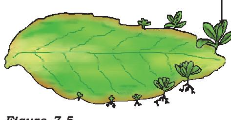

*Figure 7.5 Leaf of Bryophyllum with buds*

## Tissue culture

In tissue culture, new plants are grown by removing tissue or separating cells from the growing tip of a plant. The cells are then placed in an artificial medium where they divide rapidly to form a small group of cells or callus. The callus is transferred to another medium containing hormones for growth and differentiation. The plantlets are then placed in the soil so that they can grow into mature plants. Using tissue culture, many plants can be grown from one parent in disease-free conditions. This technique is commonly used for ornamental plants.

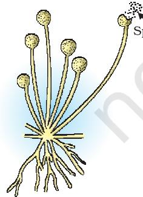

*Figure 7.6 Spore formation in Rhizopus*

#### 7.2.6 Spore Formation

Even in many simple multi-cellular organisms, specific reproductive parts can be identified. The thread-like structures that developed on the bread in Activity 7.2 above are the hyphae of the bread mould (*Rhizopus*). They are not reproductive parts. On the other hand, the tiny blob-on-a-stick structures are involved in reproduction. The blobs are sporangia, which contain cells, or spores, that can eventually develop into new *Rhizopus* individuals (Fig. 7.6). The spores are covered by thick walls that protect them until they come into contact with another moist surface and can begin to grow.

All the modes of reproduction that we have discussed so far allow new generations to be created from a single individual. This is known as asexual reproduction.

## QUESTIONS

- 1. How does binary fission differ from multiple fission?
- 2. How will an organism be benefited if it reproduces through spores?
- 3. Can you think of reasons why more complex organisms cannot give rise to new individuals through regeneration?
- 4. Why is vegetative propagation practised for growing some types of plants?
- 5. Why is DNA copying an essential part of the process of reproduction?

#### 7.3 SEXUAL REPRODUCTION

We are also familiar with modes of reproduction that depend on the involvement of two individuals before a new generation can be created. Bulls alone cannot produce new calves, nor can hens alone produce new chicks. In such cases, both sexes, males and females, are needed to produce new generations. What is the significance of this sexual mode of reproduction? Are there any limitations of the asexual mode of reproduction, which we have been discussing above?

#### 7.3.1 Why the Sexual Mode of Reproduction?

The creation of two new cells from one involves copying of the DNA as well as of the cellular apparatus. The DNA copying mechanism, as we have noted, cannot be absolutely accurate, and the resultant errors are a source of variations in populations of organisms. Every individual organism cannot be protected by variations, but in a population, variations are useful for ensuring the survival of the species. It would therefore make sense if organisms came up with reproductive modes that allowed more and more variation to be generated.

While DNA-copying mechanisms are not absolutely accurate, they are precise enough to make the generation of variation a fairly slow process. If the DNA copying mechanisms were to be less accurate, many of the resultant DNA copies would not be able to work with the cellular apparatus, and would die. So how can the process of making variants be speeded up? Each new variation is made in a DNA copy that already has variations accumulated from previous generations. Thus, two different individuals in a population would have quite different patterns of accumulated variations. Since all of these variations are in living individuals, it is assured that they do not have any really bad effects. Combining variations from two or more individuals would thus create new combinations of variants. Each combination would be novel, since it would involve two different individuals. The sexual mode of ?

reproduction incorporates such a process of combining DNA from two different individuals during reproduction.

But this creates a major difficulty. If each new generation is to be the combination of the DNA copies from two pre-existing individuals, then each new generation will end up having twice the amount of DNA that the previous generation had. This is likely to mess up the control of the cellular apparatus by the DNA. How many ways can we think of for solving this difficulty?

We have seen earlier that as organisms become more complex, the specialisation of tissue increases. One solution that many multi-cellular organisms have found for the problem mentioned above is to have special lineages of cells in specialised organs in which only half the number of chromosomes and half the amount of DNA as compared to the nonreproductive body cells. This is achieved by a process of cell division called meiosis. Thus, when these germ-cells from two individuals combine during sexual reproduction to form a new individual, it results in reestablishment of the number of chromosomes and the DNA content in the new generation.

If the zygote is to grow and develop into an organism which has highly specialised tissues and organs, then it has to have sufficient stores of energy for doing this. In very simple organisms, it is seen that the two germ-cells are not very different from one another, or may even be similar. But as the body designs become more complex, the germ-cells also specialise. One germ-cell is large and contains the food-stores while the other is smaller and likely to be motile. Conventionally, the motile germcell is called the male gamete and the germ-cell containing the stored food is called the female gamete. We shall see in the next few sections how the need to create these two different types of gametes give rise to differences in the male and female reproductive organs and, in some cases, differences in the bodies of the male and female organisms.

#### 7.3.2 Sexual Reproduction in Flowering Plants

The reproductive parts of angiosperms are located in the flower. You have already studied the different parts of a flower – sepals, petals,

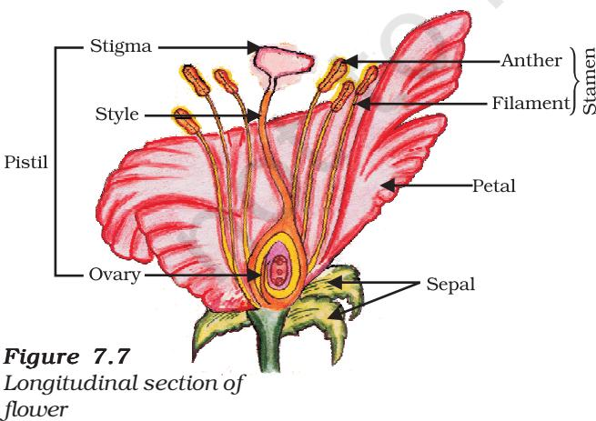

stamens and pistil. Stamens and pistil are the reproductive parts of a flower which contain the germ-cells. What possible functions could the petals and sepals serve?

The flower may be unisexual (papaya, watermelon) when it contains either stamens or pistil or bisexual (*Hibiscus*, mustard) when it contains both stamens and pistil. Stamen is the male reproductive part and it produces pollen grains that are yellowish in colour. You must have seen this yellowish powder that often sticks to our hands if we touch the stamen of a flower. Pistil is present in the centre of a flower and is the female reproductive part. It is made of three parts.

The swollen bottom part is the ovary, middle elongated part is the style and the terminal part which may be sticky is the stigma. The ovary contains ovules and each ovule has an egg cell. The male germ-cell produced by pollen grain fuses with the female gamete present in the ovule. This fusion of the germ-cells or fertilisation gives us the zygote which is capable of growing into a new plant.

Thus the pollen needs to be transferred from the stamen to the stigma. If this transfer of pollen occurs in the same flower, it is referred to as self-pollination. On the other hand, if the pollen is transferred from one flower to another, it is known as crosspollination. This transfer of pollen from one flower to another is achieved by agents like wind, water or animals.

After the pollen lands on a suitable stigma, it has to reach the female germ-cells which are in the ovary. For this, a tube grows out of the pollen grain and travels through the style to reach the ovary.

After fertilisation, the zygote divides several times to form an embryo within the ovule. The ovule develops a tough coat and is gradually converted into a seed. The ovary grows rapidly and ripens to form a fruit. Meanwhile, the petals, sepals, stamens, style and stigma may shrivel and fall off. Have you ever observed any flower part still persisting in the fruit? Try and work out the advantages of seed-formation for the plant. The seed contains the future plant or embryo which develops into a seedling under appropriate conditions. This process is known as germination.

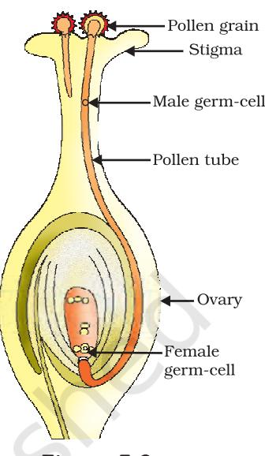

*Figure 7.8 Germination of pollen on stigma*

#### Activity 7.7

- n Soak a few seeds of Bengal gram (*chana*) and keep them overnight.
- n Drain the excess water and cover the seeds with a wet cloth and leave them for a day. Make sure that the seeds do not become dry.
- n Cut open the seeds carefully and observe the different parts.
- n Compare your observations with the Fig. 7.9 and see if you can identify all the parts.

#### 7.3.3 Reproduction in Human Beings

So far, we have been discussing the variety of modes that different species use for reproduction. Let us now look at the species that we are most interested in, namely, humans. Humans use a sexual mode of reproduction. How does this process work?

Let us begin at an apparently unrelated point. All of us know that our bodies change as we become older. You have learnt changes that take place in your body earlier in Class VIII also. We notice that our height has increased continuously from early age till now. We acquire teeth, we even lose the old, so-called milk teeth and acquire new ones.

*Figure 7.9 Germination*

All of these are changes that can be grouped under the general process of growth, in which the body becomes larger. But in early teenage years, a whole new set of changes occurs that cannot be explained simply as body enlargement. Instead, the appearance of the body changes. Proportions change, new features appear, and so do new sensations.

Some of these changes are common to both boys and girls. We begin to notice thick hair growing in new parts of the body such as armpits and the genital area between the thighs, which can also become darker in colour. Thinner hair can also appear on legs and arms, as well as on the face. The skin frequently becomes oily and we might begin to develop pimples. We begin to be conscious and aware of both our own bodies and those of others in new ways.

On the other hand, there are also changes taking place that are different between boys and girls. In girls, breast size begins to increase, with darkening of the skin of the nipples at the tips of the breasts. Also, girls begin to menstruate at around this time. Boys begin to have new thick hair growth on the face and their voices begin to crack. Further, the penis occasionally begins to become enlarged and erect, either in daydreams or at night.

All of these changes take place slowly, over a period of months and years. They do not happen all at the same time in one person, nor do they happen at an exact age. In some people, they happen early and quickly, while in others, they can happen slowly. Also, each change does not become complete quickly either. So, for example, thick hair on the face in boys appears as a few scattered hairs first, and only slowly does the growth begin to become uniform. Even so, all these changes show differences between people. Just as we have differently shaped noses or fingers, so also we have different patterns of hair growth, or size and shape of breast or penis. All of these changes are aspects of the sexual maturation of the body.

Why does the body show sexual maturation at this age? We have talked about the need for specialised cell types in multi-cellular bodies to carry out specialised functions. The creation of germ-cells to participate in sexual reproduction is another specialised function, and we have seen that plants develop special cell and tissue types to create them. Human beings also develop special tissues for this purpose. However, while the body of the individual organism is growing to its adult size, the resources of the body are mainly directed at achieving this growth. While that is happening, the maturation of the reproductive tissue is not likely to be a major priority. Thus, as the rate of general body growth begins to slow down, reproductive tissues begin to mature. This period during adolescence is called puberty.

So how do all the changes that we have talked about link to the reproductive process? We must remember that the sexual mode of reproduction means that germ-cells from two individuals have to join together. This can happen by the external release of germ-cells from the bodies of individuals, as happens in flowering plants. Or it can happen by two individuals joining their bodies together for internal transfer of germ-cells for fusion, as happens in many animals. If animals are to participate in this process of mating, their state of sexual maturity must be identifiable by other individuals. Many changes during puberty, such as new hair-growth patterns, are signals that sexual maturation is taking place.

On the other hand, the actual transfer of germ-cells between two people needs special organs for the sexual act, such as the penis when it is capable of becoming erect. In mammals such as humans, the baby is carried in the mother's body for a long period, and will be breast-fed later. The female reproductive organs and breasts will need to mature to accommodate these possibilities. Let us look at the systems involved in the process of sexual reproduction.

#### 7.3.3 (a) Male Reproductive System

The male reproductive system (Fig. 7.10) consists of portions which produce the germ-cells and other portions that deliver the germ-cells to the site of fertilisation.

The formation of germ-cells or sperms takes place in the testes. These are located outside the abdominal cavity in scrotum because sperm formation requires a lower temperature than the normal body temperature. We have discussed the role of the testes in the secretion of the hormone, testosterone, in the previous chapter. In addition to regulating the formation of sperms, testosterone brings about changes in appearance seen in boys at the time of puberty.

The sperms formed are delivered through the vas deferens which unites with a tube coming from the urinary bladder. The urethra thus forms a common passage for both the sperms and urine. Along the path of the vas deferens, glands like the prostate and the seminal vesicles add their secretions so that the sperms are now in a fluid which makes their transport easier and this fluid also provides nutrition. The sperms are tiny bodies that consist of mainly genetic material and a long tail that helps them to move towards the female germ-cell.

#### 7.3.3 (b) Female Reproductive System

The female germ-cells or eggs are made in the ovaries. They are also responsible for the production of some hormones. Look at Fig. 7.11 and identify the various organs in the female reproductive system.

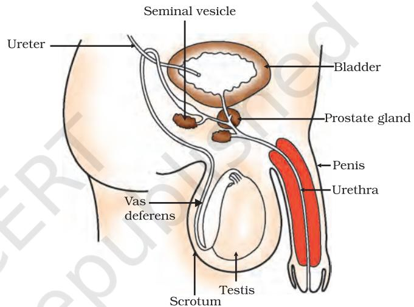

*Figure 7.10 Human–male reproductive system*

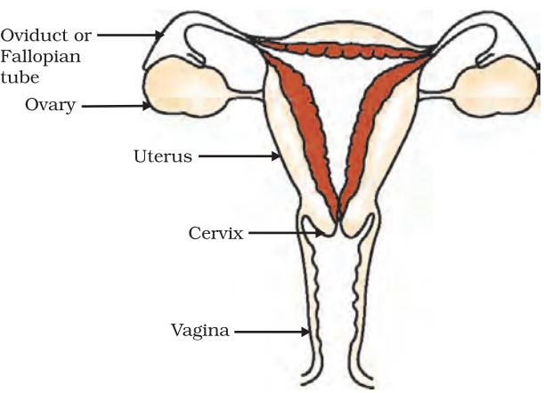

*Figure 7.11 Human –female reproductive system*

When a girl is born, the ovaries already contain thousands of immature eggs. On reaching puberty, some of these start maturing. One egg is produced every month by one of the ovaries. The egg is carried from the ovary to the womb through a thin oviduct or fallopian tube. The two oviducts unite into an elastic bag-like structure known as the uterus. The uterus opens into the vagina through the cervix.

The sperms enter through the vaginal passage during sexual intercourse. They travel upwards and reach the oviduct where they may encounter the egg. The fertilised egg (zygote) starts dividing and form a ball of cells or embryo. The embryo is implanted in the lining of the uterus where they continue to grow and develop organs to become foetus. We have seen in earlier sections that the mother's body is designed to undertake the development of the child. Hence the uterus prepares itself every month to receive and nurture the growing embryo. The lining thickens and is richly supplied with blood to nourish the growing embryo.

The embryo gets nutrition from the mother's blood with the help of a special tissue called placenta. This is a disc which is embedded in the uterine wall. It contains villi on the embryo's side of the tissue. On the mother's side are blood spaces, which surround the villi. This provides a large surface area for glucose and oxygen to pass from the mother to the embryo. The developing embryo will also generate waste substances which can be removed by transferring them into the mother's blood through the placenta. The development of the child inside the mother's body takes approximately nine months. The child is born as a result of rhythmic contractions of the muscles in the uterus.

#### 7.3.3 (c) What happens when the Egg is not Fertilised?

If the egg is not fertilised, it lives for about one day. Since the ovary releases one egg every month, the uterus also prepares itself every month to receive a fertilised egg. Thus its lining becomes thick and spongy. This would be required for nourishing the embryo if fertilisation had taken place. Now, however, this lining is not needed any longer. So, the lining slowly breaks and comes out through the vagina as blood and mucous. This cycle takes place roughly every month and is known as menstruation. It usually lasts for about two to eight days.

#### 7.3.3 (d) Reproductive Health

As we have seen, the process of sexual maturation is gradual, and takes place while general body growth is still going on. Therefore, some degree of sexual maturation does not necessarily mean that the body or the mind is ready for sexual acts or for having and bringing up children. How do we decide if the body or the mind is ready for this major responsibility? All of us are under many different kinds of pressures about these issues. There can be pressure from our friends for participating in many activities, whether we really want to or not. There can be pressure from families to get married and start having children. There can be pressure from government agencies to avoid having children. In this situation, making choices can become very difficult.

We must also consider the possible health consequences of having sex. We have discussed in Class IX that diseases can be transmitted from person to person in a variety of ways. Since the sexual act is a very intimate connection of bodies, it is not surprising that many diseases can be sexually transmitted. These include bacterial infections such as gonorrhoea and syphilis, and viral infections such as warts and HIV-AIDS. Is it possible to prevent the transmission of such diseases during the sexual act? Using a covering, called a condom, for the penis during sex helps to prevent transmission of many of these infections to some extent.

The sexual act always has the potential to lead to pregnancy. Pregnancy will make major demands on the body and the mind of the woman, and if she is not ready for it, her health will be adversely affected. Therefore, many ways have been devised to avoid pregnancy. These contraceptive methods fall in a number of categories. One category is the creation of a mechanical barrier so that sperm does not reach the egg. Condoms on the penis or similar coverings worn in the vagina can serve this purpose. Another category of contraceptives acts by changing the hormonal balance of the body so that eggs are not released and fertilisation cannot occur. These drugs commonly need to be taken orally as pills. However, since they change hormonal balances, they can cause side-effects too. Other contraceptive devices such as the loop or the copper-T are placed in the uterus to prevent pregnancy. Again, they can cause side effects due to irritation of the uterus. If the vas deferens in the male is blocked, sperm transfer will be prevented. If the fallopian tube in the female is blocked, the egg will not be able to reach the uterus. In both cases fertilisation will not take place. Surgical methods can be used to create such blocks. While surgical methods are safe in the long run, surgery itself can cause infections and other problems if not performed properly. Surgery can also be used for removal of unwanted pregnancies. These may be misused by people who do not want a particular child, as happens in illegal sex-selective abortion of female foetuses. For a healthy society, the female-male sex ratio must be maintained. Because of reckless female foeticides, child sex ratio is declining at an alarming rate in some sections of our society, although prenatal sex determination has been prohibited by law.

We have noted earlier that reproduction is the process by which organisms increase their populations. The rates of birth and death in a given population will determine its size. The size of the human population is a cause for concern for many people. This is because an expanding population makes it harder to improve everybody's standard of living. However, if inequality in society is the main reason for poor standards of living for many people, the size of the population is relatively unimportant. If we look around us, what can we identify as the most important reason(s) for poor living standards?

## QUESTIONS

- 1. How is the process of pollination different from fertilisation?
- 2. What is the role of the seminal vesicles and the prostate gland?
- 3. What are the changes seen in girls at the time of puberty?
- 4. How does the embryo get nourishment inside the mother's body?
- 5. If a woman is using a copper -T, will it help in protecting her from sexually transmitted diseases?

## What you have learnt

- n Reproduction, unlike other life processes, is not essential to maintain the life of an individual organism.
- n Reproduction involves creation of a DNA copy and additional cellular apparatus by the cell involved in the process.
- n Various organisms use different modes of reproduction depending on their body design.
- n In fission, many bacteria and protozoa simply divide into two or more daughter cells.
- n Organisms such as hydra can regenerate if they are broken into pieces. They can also give out buds which mature into new individuals.
- n Roots, stems and leaves of some plants develop into new plants through vegetative propagation.
- n These are examples of asexual reproduction where new generations are created from a single individual.
- n Sexual reproduction involves two individuals for the creation of a new individual.
- n DNA copying mechanisms creates variations which are useful for ensuring the survival of the species. Modes of sexual reproduction allow for greater variation to be generated.
- n Reproduction in flowering plants involves transfer of pollen grains from the anther to the stigma which is referred to as pollination. This is followed by fertilisation.
- n Changes in the body at puberty, such as increase in breast size in girls and new facial hair growth in boys, are signs of sexual maturation.
- n The male reproductive system in human beings consists of testes which produce sperms, vas deferens, seminal vesicles, prostate gland, urethra and penis.
- n The female reproductive system in human beings consists of ovaries, fallopian tubes, uterus and vagina.
- n Sexual reproduction in human beings involves the introduction of sperm in the vagina of the female. Fertilisation occurs in the fallopian tube.
- n Contraception to avoid pregnancy can be achieved by the use of condoms, oral pills, copper-T and other methods.

?

# EXERCISES

- 1. Asexual reproduction takes place through budding in
	- (a) *Amoeba.*
	- (b) Yeast.
	- (c) *Plasmodium.*
	- (d) *Leishmania.*
- 2. Which of the following is not a part of the female reproductive system in human beings?
	- (a) Ovary
	- (b) Uterus
	- (c) Vas deferens
	- (d) Fallopian tube
- 3. The anther contains
	- (a) sepals.
	- (b) ovules.
	- (c) pistil.
	- (d) pollen grains.
- 4. What are the advantages of sexual reproduction over asexual reproduction?
- 5. What are the functions performed by the testis in human beings?
- 6. Why does menstruation occur?
- 7. Draw a labelled diagram of the longitudinal section of a flower.
- 8. What are the different methods of contraception?
- 9. How are the modes for reproduction different in unicellular and multicellular organisms?
- 10. How does reproduction help in providing stability to populations of species?
- 11. What could be the reasons for adopting contraceptive methods?

