CROP ROP PRODUCTION RODUCTION AND AND MANAGEMENT ANAGEMENT

P aheli and Boojho went to their uncle's house during the summer vacation. Their uncle is a farmer. One day they saw some tools like *khurpi*, sickle, shovel, plough, etc., in the field.

I want to know where and how we use these tools.

You have learnt that all living organisms require food. Plants can make their food themselves. Can you recall how green plants synthesise their own food? Animals including humans can not make their own food. So, where do animals get their food from?

But, first of all why do we have to eat food?

You already know that energy from the food is utilised by organisms for carrying out their various body functions, such as digestion, respiration and excretion. We get our food from plants, or animals, or both.

In order to provide food for a large population— regular production, proper management and distribution is necessary.

# 1.1 Agricultural Practices

Till 10,000 B.C.E. people were nomadic. They were wandering in groups from place to place in search of food and shelter. They ate raw fruits and vegetables and started hunting animals for food. Later, they could cultivate land and produce rice, wheat and other food crops. Thus, was born 'Agriculture'.

When plants of the same kind are cultivated at one place on a large scale, it is called a crop. For example, crop of wheat means that all the plants grown in a field are that of wheat.

You already know that crops are of different types like cereals, vegetables and fruits. These can be classified on the basis of the season in which they grow.

India is a vast country. The climatic conditions like temperature, humidity and rainfall vary from one region to another. Accordingly, there is a rich variety of crops grown in different parts of the country. Despite this diversity, two broad cropping patterns can be identified. These are:

(i) Kharif Crops : The crops which are sown in the rainy season are called kharif crops. The rainy season in India is generally from June to September. Paddy, maize, soyabean, groundnut and cotton are kharif crops.

(ii) Rabi Crops : The crops grown in the winter season (October to March) are called rabi crops. Examples of rabi crops are wheat, gram, pea, mustard and linseed.

Besides these, pulses and vegetables are grown during summer at many places.

# 1.2 Basic Practices of Crop Production

Why paddy can not be grown in the winter season?

Paddy requires a lot of water. Therefore, it is grown only in the rainy season.

Cultivation of crops involves several activities undertaken by farmers over a period of time. You may find that these activities are similar to those carried out by a gardener or even by you when you grow ornamental plants in your house. These activities or tasks are referred to as agricultural practices which are listed below:

- (i) Preparation of soil
- (ii) Sowing
- (iii) Adding manure and fertilisers
- (iv) Irrigation
- (v) Protecting from weeds
- (vi) Harvesting
- (vii) Storage

# 1.3 Preparation of Soil

The preparation of soil is the first step before growing a crop. One of the most important tasks in agriculture is to turn the soil and loosen it. This allows the roots to penetrate deep into the soil. The loose soil allows the roots to breathe easily even when they go deep into the soil. Why does the loosening of soil allow the roots to breathe easily?

The loosened soil helps in the growth of earthworms and microbes present in the soil. These organisms are friends of the farmer since they further turn and loosen the soil and add humus to it. But why the soil needs to be turned and loosened?

You have learnt in the previous classes that soil contains minerals, water, air and some living organisms. In addition, dead plants and animals get decomposed by soil organisms. In this way, various nutrients in the dead organisms are released back into the soil. These nutrients are again absorbed by plants.

Since only a few centimetres of the top layer of soil supports plant growth, turning and loosening of soil brings the nutrient-rich soil to the top so that plants can use these nutrients. Thus, turning and loosening of soil is very important for cultivation of crops.

The process of loosening and turning of the soil is called tilling or ploughing. This is done by using a plough. Ploughs are made of wood or iron. If the soil is very dry, it may need watering before ploughing. The ploughed field may have big clumps of soil called crumbs. It is necessary to break these crumbs. Levelling the field is beneficial for sowing as well as for irrigation. Levelling of soil is done with the help of a leveller.

Sometimes, manure is added to the soil before tilling. This helps in proper mixing of manure with soil. The soil is moistened before sowing.

## Agricultural Implements

Before sowing the seeds, it is necessary to break soil clumps to get better yield. This is done with the help of various tools. The main tools used for this purpose are the plough, hoe and cultivator.

Plough : This is being used since ancient times for tilling the soil, adding fertilisers to the crop, removing the weeds and turning the soil. This is made of wood and is drawn by a pair of bulls or other animals (horses and camels). It contains a strong triangular iron strip called ploughshare. The main part of the plough is a long log of wood which is called a ploughshaft. There is a handle at one end of the shaft. The other end is attached to a beam which is placed on the bulls' necks. One pair of bulls and a man can easily operate the plough [Fig. 1.1 (a)].

The indigenous wooden plough is increasingly being replaced by iron ploughs nowadays.

Hoe : It is a simple tool which is used for removing weeds and for loosening the soil. It has a long rod of wood or iron. A strong, broad and bent plate of iron is fixed to one of its ends and

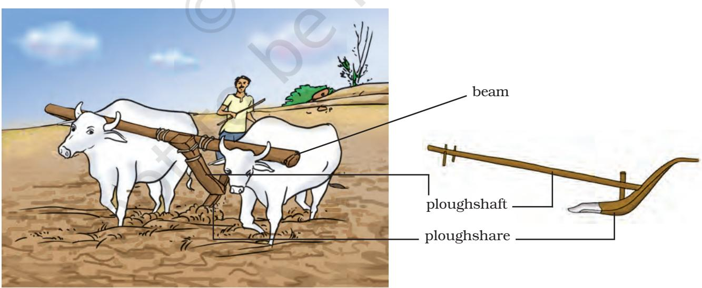

*Fig. 1.1 (a) : The plough*

CROP PRODUCTION AND MANAGEMENT 3

works like a blade. It is pulled by animals [Fig. 1.1 (b)].

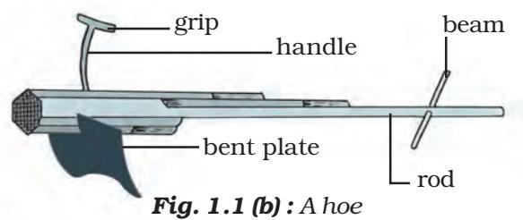

Cultivator : Nowadays ploughing is done by tractor-driven cultivator. The use of cultivator saves labour and time. [Fig. 1.1 (c)].

*Fig. 1.1 (c) : Cultivator driven by a tractor*

# 1.4 Sowing

Sowing is an important part of crop production. Before sowing, good quality, clean and healthy seeds of a good variety—are selected. Farmers prefer to use seeds which give high yield.

## Selection of Seeds

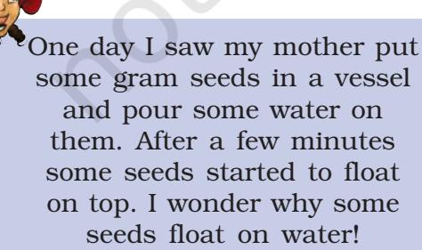

# Activity 1.1

Take a beaker and fill half of it with water. Put a handful of wheat seeds and stir well. Wait for some time.

Are there seeds which float on water? Would those be lighter or heavier than those which sink? Why would they be lighter? Damaged seeds become hollow and are thus lighter. Therefore, they float on water.

This is a good method for separating good, healthy seeds from the damaged ones.

Before sowing, one of the important tasks is to know about the tools used for sowing seeds [Fig. 1.2 (a), (b)].

Traditional tool : The tool used traditionally for sowing seeds is shaped like a funnel [Fig. 1.2 (a)]. The seeds are filled into the funnel, passed down through two or three pipes having sharp ends. These ends pierce into the soil and place seeds there.

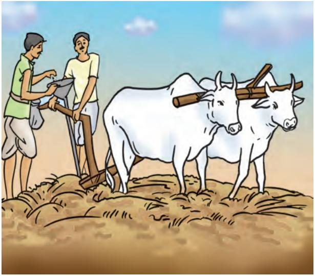

*Fig. 1.2 (a) : Traditional method of sowing*

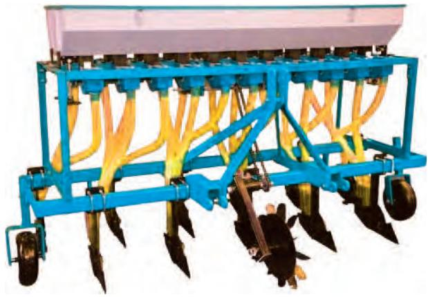

**Fig. 1.2 (b) :** *A seed drill*

**Seed drill :** Nowadays the seed drill [Fig. 1.2 (b)] is used for sowing with the help of tractors. This sows the seeds uniformly at equal distance and depth. It ensures that seeds get covered by the soil after sowing. This protects seeds from being eaten by birds. Sowing by using a seed drill saves time and labour.

> There is a nursery near my school. I found that little plants were kept in small bags. Why are they kept like this?

Seeds of a few plants such as paddy are first grown in a nursery. When they grow into seedlings, they are transplanted to the field manually. Some forest plants and flowering plants are also grown in the nursery.

Appropriate distance between the seeds is necessary to avoid overcrowding of plants. This allows plants to get

**CROP PRODUCTION AND MANAGEMENT 5**

sufficient sunlight, nutrients and water from the soil. At times a few plants may have to be removed to prevent overcrowding.

# **1.5 Adding Manure and Fertilisers**

The substances which are added to the soil in the form of nutrients for the healthy growth of plants are called **manure** and **fertilisers**.

I saw a healthy crop growing in a farm. In the neighbouring farm, the plants were weak. Why do some plants grow better than others?

Soil supplies mineral nutrients to the crop plants. These nutrients are essential for the growth of plants. In certain areas, farmers grow crop after crop in the same field. The field is never left uncultivated or fallow. Imagine what happens to the nutrients?

Continuous cultivation of crops makes the soil poor in nutrients. Therefore, farmers have to add manure to the fields to replenish the soil with nutrients. This process is called manuring. Improper or insufficient manuring results in weak plants.

Manure is an organic substance obtained from the decomposition of plant or animal wastes. Farmers dump plant and animal waste in pits at open places and allow it to decompose. The decomposition is caused by some microorganisms. The decomposed matter is used as organic manure. You have already learnt about vermicomposting in Class VI.

# Activity 1.2

Take *moong* or gram seeds and germinate them. Select three equal sized seedlings. Take three empty glasses or similar vessels. Mark them A, B and C. To glass A add little amount of soil mixed with a little cow dung manure. In glass B put the same amount of soil mixed with a little urea. Take the same amount of soil in glass C without adding anything [Fig. 1.3(a)]. Now pour the same amount of water in each glass and plant the seedlings in them. Keep them in a safe place and water them daily. After 7 to 10 days observe their growth [Fig. 1.3(b)].

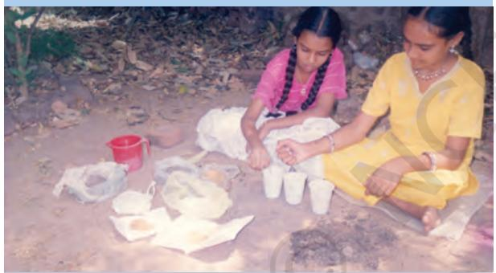

*Fig. 1.3 (a) : Preparation of the experiment*

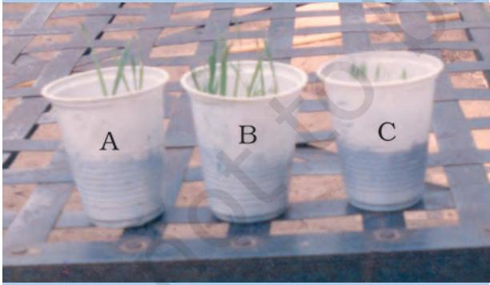

*Fig. 1.3 (b) : Growing seedlings with manure and fertiliser*

Did plants in all the glasses grow at the same pace? Which glass showed better growth of plants? In which glass was the growth fastest?

Fertilisers are chemicals which are rich in a particular nutrient. How are they different from manure? Fertilisers are produced in factories. Some examples of fertilisers are— urea, ammonium sulphate, super phosphate, potash, NPK (Nitrogen, Phosphorus, Potassium).

The use of fertilisers has helped farmers to get better yield of crops such as wheat, paddy and maize. But excessive use of fertilisers has made the soil less fertile. Fertilisers have also become a source of water pollution. Therefore, in order to maintain the fertility of the soil, we have to substitute fertilisers with organic manure or leave the field uncultivated (fallow) in between two crops.

The use of manure improves soil texture as well as its water retaining capacity. It replenishes the soil with nutrients.

Another method of replenishing the soil with nutrients is through crop rotation. This can be done by growing different crops alternately. Earlier, farmers in northern India used to grow legumes as fodder in one season and wheat in the next season. This helped in the replenishment of the soil with nitrogen. Farmers are being encouraged to adopt this practice.

In the previous classes, you have learnt about *Rhizobium* bacteria. These are present in the nodules of roots of leguminous plants. They fix atmospheric nitrogen.

| S. No. | Fertiliser | Manure |
| --- | --- | --- |
| 1. | Fertiliser is a man-made inorganic salt. | Manure is a natural substance obtained by the decomposition of cattle dung and plant residues. |
| 2. | Fertiliser is prepared in factories. | Manure can be prepared in the fields. |
| 3. | Fertiliser does not provide any humus to the soil. | Manure provides a lot of humus to the soil. |
| 4. | Fertilisers are very rich in plant nutrients like nitrogen, | Manure is relatively less rich in plant nutrients. |
|  | phosphorus and potassium. |  |

| Table 1.1 : Differences between Fertiliser and Manure |
| --- |

Table 1.1 gives the differences between a fertiliser and manure.

Advantages of Manure : The organic manure is considered better than fertilisers. This is because

- l it enhances the water holding capacity of the soil.
- l it makes the soil porous due to which exchange of gases becomes easy.
- l it increases the number of friendly microbes.
- l it improves the texture of the soil.

# 1.6 Irrigation

All living beings need water to live. Water is important for proper growth and development. Water is absorbed by the plant roots. Along with water, minerals and fertilisers are also absorbed. Plants contain nearly 90% water. Water is essential because germination of seeds does not take place under dry conditions. Nutrients dissolved in water are transported to each part of the plant. Water also protects the crop from both frost and hot air currents. To maintain the moisture of the soil for healthy crop growth, fields have to be watered regularly.

The supply of water to crops at regular intervals is called irrigation. The time and frequency of irrigation varies from crop to crop, soil to soil and season to season. In summer, the frequency of watering is higher. Why is it so? Could it be due to the increased rate of evaporation of water from the soil and the leaves?

> I am very careful this year about watering the plants. Last summer my plants dried up and died.

Sources of irrigation : The sources of water for irrigation are— wells, tubewells, ponds, lakes, rivers, dams and canals.

CROP PRODUCTION AND MANAGEMENT 7

*Fig. 1.4 (a) : Moat*

## Traditional Methods of Irrigation

The water available in wells, lakes and canals is lifted up by different methods in different regions, for taking it to the fields.

Cattle or human labour is used in these methods. So these methods are cheaper, but less efficient. The various traditional ways are:

(i) moat (pulley-system) (ii) chain pump

- 
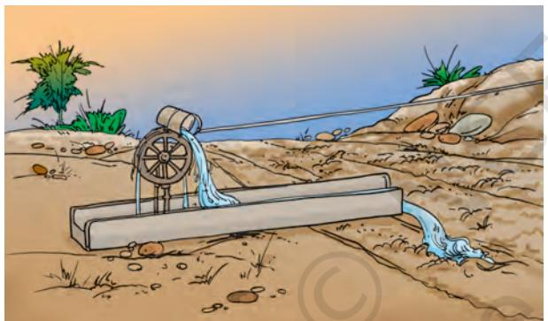

*Fig. 1.4 (b) : Chain pump*

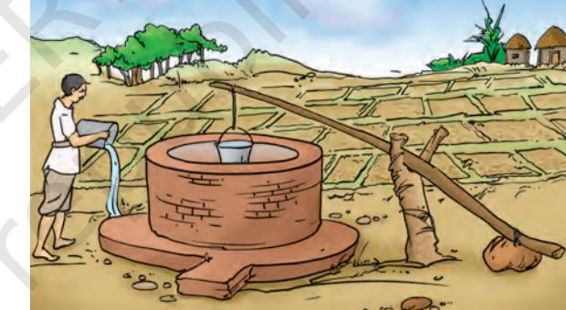

*Fig. 1.4 (c) : Dhekli*

(iii) *dhekli,* and

- (iv) *rahat* (Lever system) [Figs. 1.4 (a)- (d)].
Pumps are commonly used for lifting water. Diesel, biogas, electricity and solar energy is used to run these pumps.

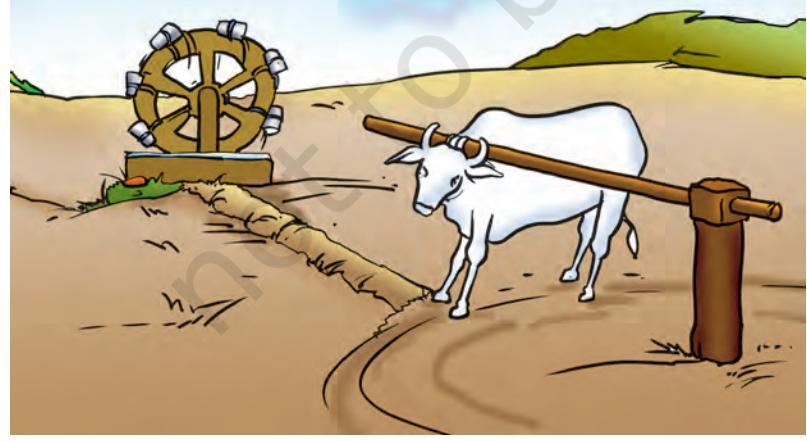

*Fig. 1.4 (d) : Rahat*

## Modern Methods of Irrigation

Modern methods of irrigation help us to use water economically. The main methods used are as follows:

(i) Sprinkler System: This system is more useful on the uneven land where sufficient water is not available. The perpendicular pipes, having rotating nozzles on top, are joined to the main pipeline at regular intervals. When water is allowed to flow

through the main pipe under pressure with the help of a pump, it escapes from the rotating nozzles. It gets sprinkled on the crop as if it is raining. Sprinkler is very useful for lawns, coffee plantation and several other crops [Fig. 1.5 (a)].

*Fig. 1.5 (a) : Sprinkler system*

(ii) Drip system : In this system, the water falls drop by drop directly near the roots. So it is called drip system. It is the best technique for watering fruit plants, gardens and trees [Fig. 1.5(b)]. Water is not wasted at all. It is a boon in regions where availability of water is poor.

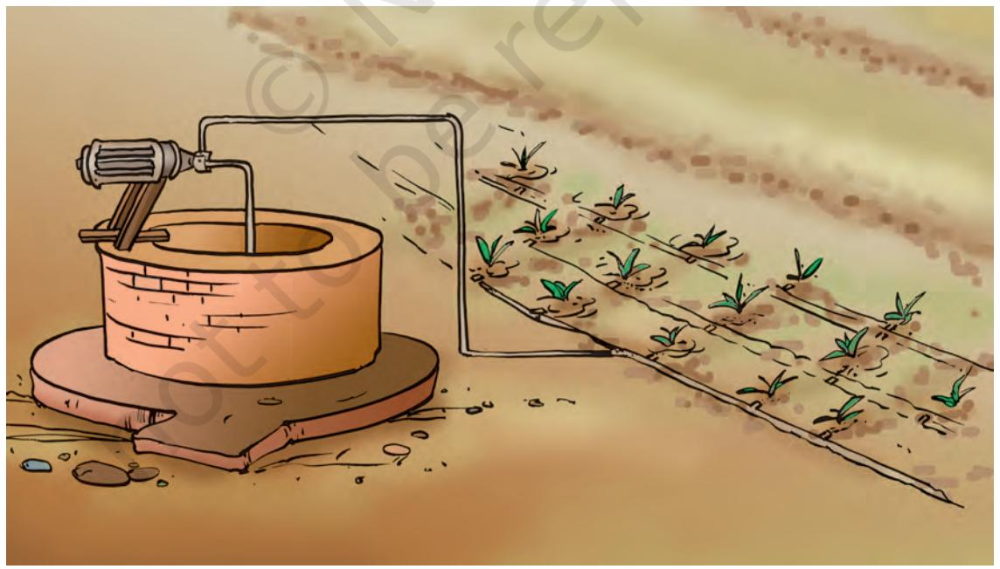

*Fig. 1.5 (b) : Drip System*

CROP PRODUCTION AND MANAGEMENT 9

## 1.7 Protection from Weeds

Boojho and Paheli went to a nearby wheat field and saw that there were some other plants in the field, growing along with wheat plants.

In a field many other undesirable plants may grow naturally along with the crop. These undesirable plants are called weeds.

The removal of weeds is called weeding. Weeding is necessary since weeds compete with the crop plants for water, nutrients, space and light. Thus, they affect the growth of the crop. Some weeds interfere even in harvesting and may be poisonous for animals and human beings.

Farmers adopt many ways to remove weeds and control their growth. Tilling before sowing of crops helps in uprooting and killing of weeds, which may then dry up and get mixed with the soil. The best time for the removal of weeds is before they produce flowers and seeds. The manual removal includes physical removal of weeds by uprooting or cutting them close to the ground, from time to time. This is done with the help of a *khurpi*. A seed drill [Fig. 1.2(b)] is also used to uproot weeds.

Weeds are also controlled by using certain chemicals, called weedicides, like 2,4-D. These are sprayed in the fields to kill the weeds. They do not damage the crops. The weedicides are diluted with water to the extent required and sprayed in the fields with a sprayer. (Fig. 1.6).

*Fig. 1.6 : Spraying weedicide*

Do weedicides have any effect on the person handling the weedicide sprayer?

As already mentioned, the weedicides are sprayed during the vegetative growth of weeds before flowering and seed formation. Spraying of weedicides may affect the health of farmers. So they should use these chemicals very carefully. They should cover their nose and mouth with a piece of cloth during spraying of these chemicals.

## 1.8 Harvesting

Harvesting of a crop is an important task. The cutting of crop after it is mature is called harvesting. In harvesting, crops are pulled out or cut close to the ground. It usually takes 3 to 4 months for a cereal crop to mature.

Harvesting in our country is either done manually by sickle (Fig. 1.7) or by a machine called harvester. In the harvested crop, the grain seeds need to be separated

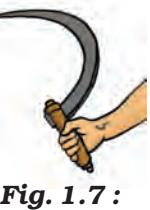

from the chaff. This process is called threshing. This is carried out with the help of a machine called 'combine' which is in fact a harvester as well as a thresher (Fig. 1.8).

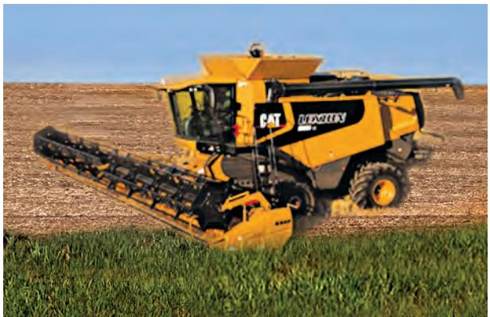

After harvesting, sometimes stubs are left in the field, which are burnt by farmers. Paheli is worried. She knows that it causes pollution. It may also catch fire and damage the crops lying in the fields.

Farmers with small holdings of land do the separation of grain and chaff by winnowing (Fig. 1.9). You have already studied this in Class VI.

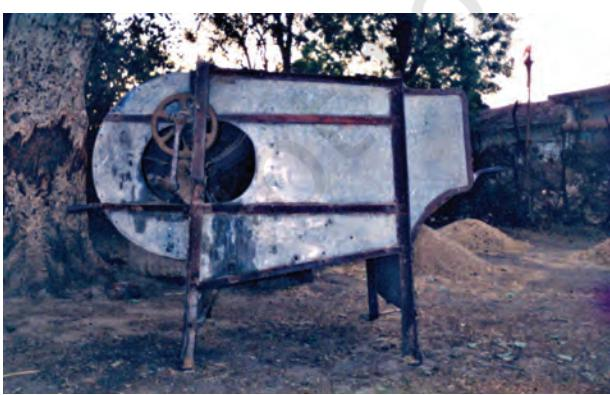

CROP PRODUCTION AND MANAGEMENT 11 *Fig. 1.9 : Winnowing machine*

## Harvest Festivals

After three or four months of hard work there comes the day of the harvest. The sight of golden fields of standing crop, laden with grain, fills the hearts of farmers with joy and a sense of well -being. The efforts of the past season have borne fruit and it is time to relax and enjoy a little. The period of harvest is, thus, of great joy and happiness in all parts of India. Men and women celebrate it with great enthusiasm. Special festivals associated with the harvest season are Pongal, Baisakhi, Holi, Diwali, Nabanya and Bihu.

# 1.9 Storage

Storage of produce is an important task. If the harvested grains are to be kept for longer time, they should be safe from moisture, insects, rats and microorganisms. Harvested grains have more moisture. If freshly harvested grains (seeds) are stored without drying, they may get spoilt or attacked by organisms, making them unfit for use or for germination. Hence, before storing them, the grains are properly dried in the sun to reduce the moisture in them. This prevents the attack by insect pests, bacteria and fungi.

> I saw my mother putting some dried neem leaves in an iron drum containing wheat. I wonder why?

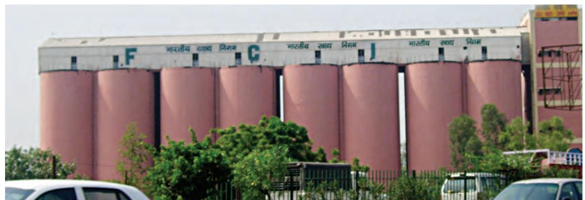

*Fig. 1.10 (b) : Storage of grains in gunny bags in granaries*

Farmers store grains in jute bags or metallic bins. However, large scale storage of grains is done in silos and granaries to protect them from pests like rats and insects [Fig. 1.10 (a) and (b)].

Dried neem leaves are used for storing food grains at home. For storing large quantities of grains in big godowns, specific chemical treatments are required to protect them from pests and microorganisms.

# 1.10Food from Animals *Fig. 1.10 (a) : Silos for storage of grains*

# Activity 1.3

Make the following Table in your note book and complete it.

| S.No. | Food | Sources |
| --- | --- | --- |
| 1. | Milk | Cow, Buffalo, She |
|  |  | goat, She-camel . . . |
| 2. |  |  |
| 3. |  |  |
| 4. |  |  |

After completing this Table, you must have seen that, like plants, animals also provide us with different kinds of food. Many people living in the coastal areas consume fish as a major part of their diet. In the previous classes you have learnt about the food that we obtain from plants. We have just seen that the process of crop production involves a number of steps like selection of seeds, sowing, etc. Similarly, animals reared at home or in farms, have to be provided with proper food, shelter and care. When this is done on a large scale, it is called animal husbandry.

Fish is good for health. We get cod liver oil from fish which is rich in vitamin D.

## KEYWORDS

AGRICULTURAL PRACTICES

ANIMAL HUSBANDRY

CROP FERTILISER

GRANARIES

HARVESTING

IRRIGATION

KHARIF

MANURE

PLOUGH

RABI

SEEDS

SILO

SOWING

STORAGE

THRESHING

WEEDS

WEEDICIDE

WINNOWING

# Exercises

### WHAT YOU HAVE LEARNT

- Ü In order to provide food to our growing population, we need to adopt certain agricultural practices.
- Ü Same kind of plants cultivated at a place constitute a crop.
- Ü In India, crops can be broadly categorised into two types based on seasons - rabi and kharif crops.
- Ü It is necessary to prepare soil by tilling and levelling. Ploughs and levellers are used for this purpose.
- Ü Sowing of seeds at appropriate depths and distances gives good yield. Good variety of seeds are sown after selection of healthy seeds. Sowing is done by seed drills.
- Ü Soil needs replenishment and enrichment through the use of organic manure and fertilisers. Use of chemical fertilisers has increased tremendously with the introduction of new crop varieties.
- Ü Supply of water to crops at appropriate intervals is called irrigation.
- Ü Weeding involves removal of unwanted and uncultivated plants called weeds.
- Ü Harvesting is the cutting of the mature crop manually or by machines.
- Ü Separation of the grains from the chaff is called threshing.
- Ü Proper storage of grains is necessary to protect them from pests and microorganisms.
- Ü Food is also obtained from animals for which animals are reared. This is called animal husbandry.
- 1. Select the correct word from the following list and fill in the blanks. float, water, crop, nutrients, preparation
	- (a) The same kind of plants grown and cultivated on a large scale at a place is called _____________.
	- (b) The first step before growing crops is _____________ of the soil.

CROP PRODUCTION AND MANAGEMENT 13

- (c) Damaged seeds would _____________ on top of water.
- (d) For growing a crop, sufficient sunlight and _____________ and _____________ from the soil are essential.

E X E R C I S E S

#### 2. Match items in column A with those in column B.

### A B

- (i) Kharif crops (a) Food for cattle
- (ii) Rabi crops (b) Urea and super phosphate
- (iii) Chemical fertilisers (c) Animal excreta, cow dung urine and plant waste
- (iv) Organic manure (d) Wheat, gram, pea
	- (e) Paddy and maize
- 3. Give two examples of each.
	- (a) *Kharif* crop
	- (b) *Rabi* crop
- 4. Write a paragraph in your own words on each of the following.
	- (a) Preparation of soil (b) Sowing
	- (c) Weeding (d) Threshing
- 5. Explain how fertilisers are different from manure.
- 6. What is irrigation? Describe two methods of irrigation which conserve water.
- 7. If wheat is sown in the *kharif* season, what would happen? Discuss.
- 8. Explain how soil gets affected by the continuous plantation of crops in a field.
- 9. What are weeds? How can we control them?
- 10. Arrange the following boxes in proper order to make a flow chart of sugarcane crop production.

14 SCIENCE

- 11. Complete the following word puzzle with the help of clues given below.
#### Down

- 1. Providing water to the crops.
- 2. Keeping crop grains for a long time under proper conditions.
- 5. Certain plants of the same kind grown on a large scale.

#### Across

- 3. A machine used for cutting the matured crop.
- 4. A *rabi* crop that is also one of the pulses.
- 6. A process of separating the grain from chaff.

# Extended Learning — Activities and Projects

- 1. Sow some seeds in the soil and arrange to water them by drip irrigation. Observe daily.
	- (i) Do you think it can save water?
	- (ii) Note the changes in the seed.
- 2. Collect different types of seeds and put them in small bags. Label them.
- 3. Collect pictures of some other agricultural machines and paste them in a file. Write their names and uses.
- 4. Project Work

Visit a farm, nursery or a garden nearby. Gather information about

- (i) importance of seed selection.
- (ii) method of irrigation.

- (iii) effect of extreme cold and extreme hot weather on the plants.
- (iv) effect of continuous rain on the plants.
- (v) fertilisers/manure used.

## An Example for Field Trip Work Himanshu and his friends were very anxious and curious to go to Thikri village. They went to Shri Jiwan Patel's farmhouse. They had taken bags to collect some seeds and other things. Himanshu : Sir *namaskar*, I am Himanshu. Here are my friends Mohan, David and Sabiha. We want some information about crops. Please guide us. Shri Patel : *Namaskar* and welcome all of you. What are your queries? Sabiha : When did you start this work and what are the main crops that you grow? Shri Patel : About 75 years ago, my grandfather started this work. The main crops that we grow are wheat, gram, soyabean and *moong*. David : Sir, can you tell us the difference between traditional and modern agricultural practices? Shri Patel : Earlier we used traditional tools like sickle, bullock plough, trowel, etc., and depended on rain water for irrigation. But now we use modern methods of irrigation. We use implements like tractors, cultivators, seed drill and harvester. We get good quality seeds. We carry out soil testing and use manure and fertilisers. New information about agriculture is obtained through radio, T.V. and other sources. As a result we are able to get good crops on a large scale. This year we got 9 to 11 quintals of gram crop/acre and 20 to 25 quintals of wheat/acre. In my opinion awareness of new technology is important for better crop yield. Mohan : Sabiha, come here and see some earthworms. Are they helpful to the farmers? Sabiha : Oh Mohan! we learnt about it in Class VI. Shri Patel : Earthworms turn the soil and loosen it for proper aeration, so they help the farmer. David : Can we have some seeds of the crops you grow here? [They put some seeds, fertilisers and soil sample in the bags.] Himanshu : Sir, we are thankful to you for making this visit pleasant and for providing useful information.

