H ow do you come to know that a 'period' is over in your school? You come to know easily that someone is at your door when he knocks or you hear the sound of the doorbell. Most of the time you can make out that someone is approaching you by just hearing the foot steps.

You might have played a game called hide and seek. In this game a person is blind-folded and has to catch the remaining players. How is the blindfolded person able to guess which player is closest to her?

Sound plays an important role in our lives. It helps us to communicate with one another. We hear a variety of sounds in our surroundings.

Make a list of sounds you hear in your surroundings.

In the music room of your school you hear the sounds produced by musical instruments like flute, *tabla*, harmonium, etc. (Fig. 10.1).

How is sound produced? How does it travel from one place to another? How do we hear sound? Why are some sounds louder than others? We shall discuss such questions in this chapter.

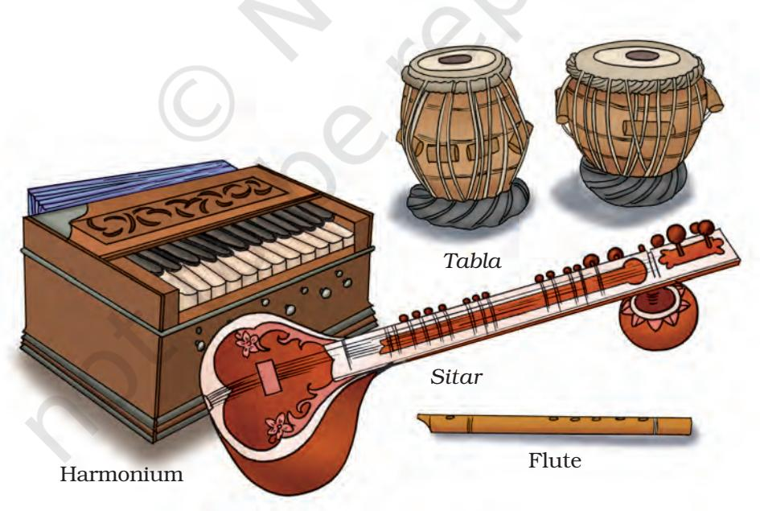

*Fig. 10.1 : Some musical instruments*

### 10.1 Sound is Produced by a Vibrating Body

Touch the school bell when not in use. What do you feel? Again touch it when producing sound. Can you feel it vibrating?

## Activity 10.1

Take a metal plate (or a pan). Hang it at a convenient place in such a way that it does not touch any wall. Now strike it with a stick (Fig.10.2). Do you hear a sound? Touch the plate or pan gently with your finger. Do you feel the vibrations?

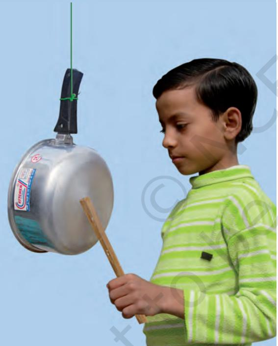

*Fig. 10.2 : Striking a pan*

Again strike the plate with the stick and hold it tightly with your hands immediately after striking. Do you still hear the sound? Touch the plate after it stops producing sound. Can you feel the vibrations now?

# Activity 10.2

Take a rubber band. Put it around the longer side of a pencil box (Fig. 10.3). Insert two pencils between the box and the stretched rubber. Now, pluck the rubber band somewhere in the middle. Do you hear any sound? Does the band vibrate?

As you learnt in Class VII the to and fro or back and forth motion of an object is called vibration. When a tightly stretched band is plucked, it vibrates and produces sound. When it stops vibrating, it does not produce any sound.

# Activity 10.3

Take a metal dish. Pour water in it. Strike it at its edge with a spoon (Fig. 13.4). Do you hear a sound? Again strike the dish and then touch it. Can you feel the dish vibrating? Strike the dish again. Look at the surface of water. Do you see any waves there? Now hold the dish. What change do you observe on the surface of water? Can you explain the change? Is there a hint to connect sound with the vibrations of a body?

We see that a vibrating object produces sound. In some cases, the vibrations are easily visible to us. But in most cases, their amplitude is so small that we cannot see them. However, we can feel them.

### **Activity 10.4**

Take a hollow coconut shell and make a musical instrument *ektara*. You can also make it with the help of an earthen pot (Fig. 10.5). Play this instrument and identify its vibrating part.

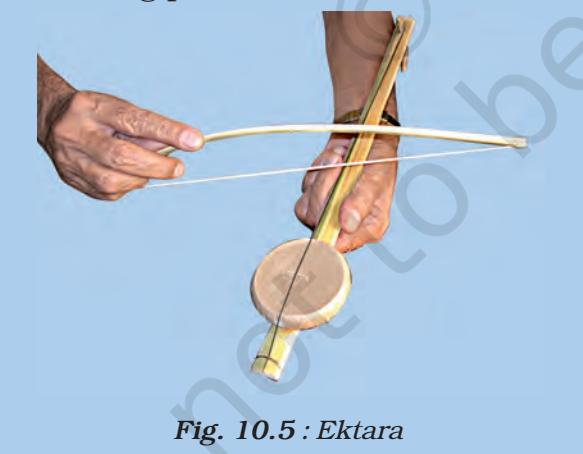

Make a list of familiar musical instruments and identify their vibrating parts. A few examples are given in Table 10.1. Complete rest of the Table.

| Table 10.1 : Musical Instruments and |
| --- |
| their Vibrating Parts |

| S.No. | Musical | Vibrating Part |
| --- | --- | --- |
|  | Instrument | Producing Sound |
| 1. | Veena | Stretched string |
| 2. | Tabla | Stretched |
|  |  | membrane |
| 3. |  |  |
| 4. |  |  |
| 5. |  |  |
| 6. |  |  |
| 7. |  |  |

Many of you might have seen the *manjira* (cymbals), the *ghatam*, and the *noot* (mudpots) and the *kartal*. These musical instruments are commonly used in many parts of our country. These instruments are simply beaten or struck (Fig. 10.6). Can you name a few other musical instruments of this type?

You too can make a musical instrument.

*Ghatam*

**SOUND 125**

## Activity 10.5

Take 6-8 bowls or tumblers. Fill them with water up to different levels, increasing gradually from one end to the other. Now take a pencil and strike the bowls gently. Strike all of them in succession. You will hear pleasant sounds. This is your *jaltrang* (Fig.10.7).

When we pluck the string of an instrument, like the sitar, the sound that we hear is not only that of the string. The whole instrument is forced to vibrate, and it is the sound of the vibration of the instrument that we hear. Similarly, when we strike the membrane of a *mridangam*, the sound that we hear is not only that of the membrane but of the whole body of the instrument.

### 10.2 Sound Produced by Humans

Speak loudly for a while or sing a song, or buzz like a bee. Put your hand on your throat as shown in Fig. 10.8. Do you feel any vibrations?

In humans, the sound is produced by the voice box or the larynx. Put your fingers on the throat and find a hard bump that seems to move when you swallow. This part of the body is known as the voice box. It is at the upper end of the windpipe. Two vocal cords, are stretched across the voice box or larynx in such a way that it leaves a narrow slit between them for the passage of air (Fig.10.8).

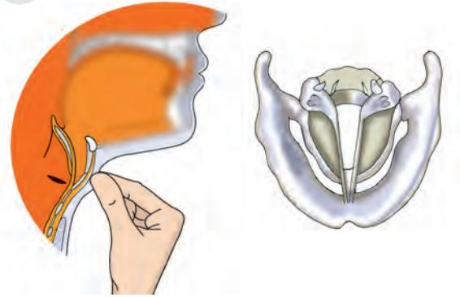

*Fig.10.8 : Voice box in humans*

When the lungs force air through the slit, the vocal cords vibrate, producing sound. Muscles attached to the vocal cords can make the cords tight or loose. When the vocal cords are tight and thin, the type or quality of voice is different from that when they are loose and thick. Let us see how the vocal cords function.

### Activity 10.6

Take two rubber strips of the same size. Place these two pieces one above the other and stretch them tight. Now blow air through the gap between them [Fig. 10.9(a)]. As the air blows through the stretched rubber strips, a sound is produced. You can also take a piece of paper with a narrow slit and hold it between your fingers as shown in Fig. 10.9 (b). Now blow through the slit and listen to the sound. Our vocal cords produce sound in a similar manner.

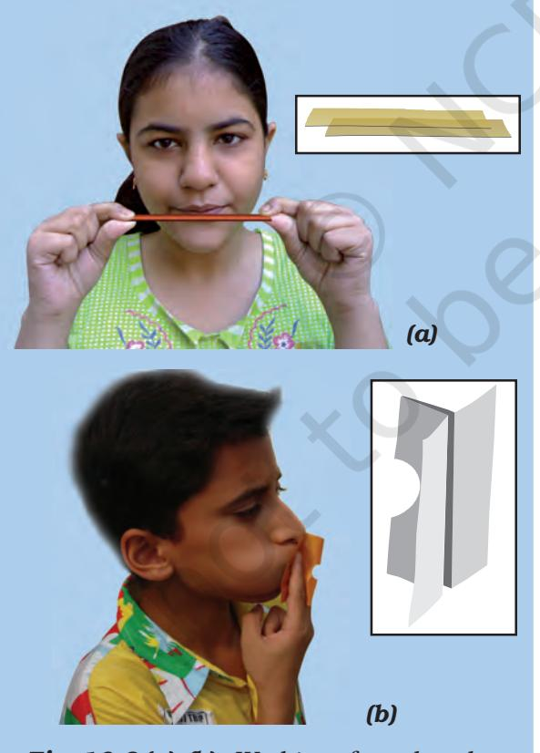

*Fig. 10.9 (a), (b) : Working of vocal cords*

The vocal cords in men are about 20 mm long. In women these are about 15mm long. Children have very short vocal cords. This is the reason why the voices of men, women and children are different.

### 10.3 Sound Needs a Medium for Propagation

When you call up your friend who is standing at a distance, your friend is able to hear your voice. How does the sound propagate or travel to her?

## Activity 10.7

Take a metal or glass tumbler. Make sure that it is dry. Place a cell phone in it. *(Remember that the cell phone must not be kept in water.)* Ask your friend to give a ring on this cell phone from another cell phone. Listen to the ring carefully.

Now, surround the rim of the tumbler with your hands (Fig. 10.10). Put your mouth on the

*Fig. 10.10 : Sound needs a medium to travel*

SOUND 127

opening between your hands. Indicate to your friend to give a ring again. Listen to the ring while sucking air from the tumbler.

Does the sound become fainter as you suck air?

Remove the tumbler from your mouth. Does the sound become loud again?

Can you think of an explanation? Is it possible that the decreasing amount of air in the tumbler had something to do with decreasing loudness of the ring?

Indeed, if you had been able to suck all the air in the tumbler, you will not listen any sound. Actually, sound needs a medium to travel. When air has been removed completely from a vessel, it is said that there is a vacuum in the vessel. The sound cannot travel through a vacuum.

Does sound travel in liquids? Let us find out.

### Activity 10.8

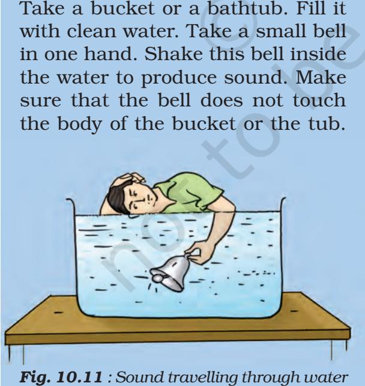

Place your ear gently on the water surface (Fig. 10.11). *(Be careful : the water should not enter in your ear.)* Can you hear the sound of the bell? Does it indicate that sound can travel through liquids?

Let us find out if sound can travel through solids also.

# Activity 10.9

Take a metre scale or a long metal rod and hold its one end to your ear. Ask your friend to gently scratch or tap at the other end of the scale (Fig. 10.12).

*Fig. 10.12 : Sound travelling through a metre scale*

Can you hear the sound of the scratching? Ask your friends around you if they were able to hear the same sound?

You can also perform the above activity by placing your ear at one end of a long wooden or metallic table and asking your friend to gently scratch the other end of the table (Fig. 10.13).

*Fig. 10.13 : Sound can travel through solids*

We find that sound can travel through wood or metal. In fact, sound can travel through any solid. You can perform interesting activities to show that sound can also travel through strings. Have you ever made a toy telephone (Fig. 10.14). Can you say that sound can travel through strings?

*Fig. 10.14 : A toy telephone*

We have learnt so far that vibrating objects produce sound and it is carried in all directions in a medium. The medium could be a gas, a liquid or a solid. How do we hear it? *Fig. 10.15 : Understanding action of an eardrum*

## 10.4 We Hear Sound through Our Ears

The shape of the outer part of the ear is like a funnel. When sound enters it, it travels down a canal at the end of which there is a thin stretched membrane. It is called the eardrum. It performs an important function. To understand what the eardrum does, let us build a tin-can model of the eardrum.

### Activity 10.10

Take a plastic or tin-can. Cut its ends. Stretch a piece of rubber balloon across one end of the can and fasten it with a rubber band. Put four or five grains of dry cereal on the stretched rubber. Now ask your friend to speak "Hurrey, Hurrey" from the open end (Fig.10.15). Observe what happens to the grain. Why do the grains jump up and down?

SOUND 129

The eardrum is like a stretched rubber sheet. Sound vibrations make the eardrum vibrate (Fig. 10.16). The eardrum sends vibrations to the inner ear. From there, the signal goes to the brain. That is how we hear.

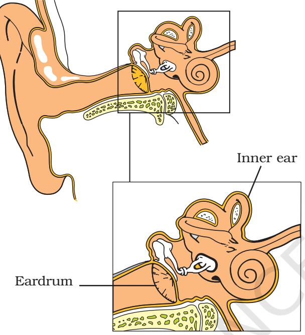

*Fig. 10.16 : Human ear*

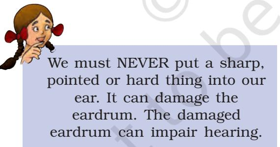

### 10.5 Amplitude, Time Period and Frequency of a Vibration

We have learnt that the to and fro motion of an object is known as vibration. This motion is also called oscillatory motion. You have already learnt in earlier classes about the oscillatory motion and its time period.

The number of oscillations per second is called the frequency of oscillation. Frequency is expressed in hertz. Its symbol is Hz. A frequency of 1 Hz is one oscillation per second. If an object oscillates 20 times in one second, what would be its frequency?

You can recognise many familiar sounds without seeing the objects producing them. How is it possible? These sounds must be different to enable you to recognise them. Have you ever thought what factors make them different? Amplitude and frequency are two important properties of any sound. Can we differentiate sounds on the basis of their amplitudes and frequencies?

### Loudness and Pitch

## Activity 10.11

Take a metallic tumbler and a tablespoon. Strike the tablespoon gently at the brim of the tumbler.

*Fig. 10.17 : Thermocol ball touching the vibrating glass tumbler*

Hear the sound produced. Now bang the spoon on the tumbler and hear the sound produced again. Is the sound louder when the tumbler is struck hard?

Now suspend a small thermocol ball touching the rim of the tumbler (Fig. 10.17). Vibrate the tumbler by striking it. See how far the ball is displaced. The displacement of the ball is a measure of the amplitude of vibration of the tumbler.

Now, strike the tumbler gently and then a little harder. Compare the amplitudes of vibrations of the tumbler in the two cases. In which case is the amplitude larger?

Loudness of sound is proportional to the square of the amplitude of the vibration producing the sound. For example, if the amplitude becomes twice, the loudness increases by a factor of 4. The loudness is expressed in a unit called decibel (dB). The following table gives some idea of the loudness of sound coming from various sources.

| Normal breathing | 10 dB |
| --- | --- |
| Soft whisper (at 5m) | 30 dB |
| Normal conversation | 60 dB |
| Busy traffic | 70 dB |
| Average factory | 80 dB |

Above 80 dB the noise becomes physically painful.

The loudness of sound depends on its amplitude. When the amplitude of vibration is large, the sound produced is loud. When the amplitude is small, the sound produced is feeble.

Compare the sound of a baby with that of an adult. Is there any difference? Even if two sounds are equally loud, they differ in some way. Let us see how.

The frequency determines the shrillness or pitch of a sound. If the frequency of vibration is higher we say that the sound is shrill and has a higher pitch. If the frequency of vibration is lower, we say that the sound has a lower pitch. For example, a drum vibrates with a low frequency. Therefore, it produces

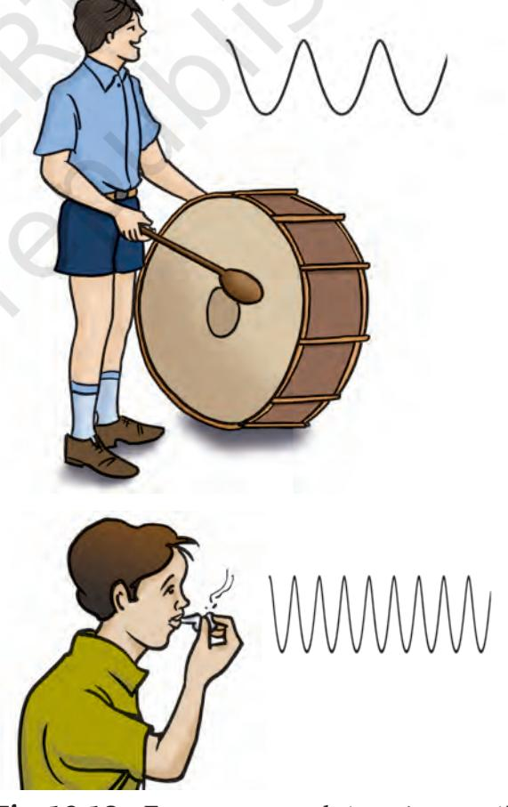

*Fig. 10.18 : Frequency determines the pitch of a sound*

SOUND 131

a low-pitched sound. On the other hand, a whistle has a high frequency and therefore, produces a sound of higher pitch (Fig. 10.18). A bird makes a high-pitched sound whereas a lion makes a low-pitched roar. However, the roar of a lion is very loud while the sound of the bird is quite feeble.

Every day you hear the voices of children and adults. Do you find any difference in their voices? Can you say that the frequency of the voice of a child is higher than that of an adult? Usually the voice of a woman has a higher frequency than that of a man.

### 10.6 Audible and Inaudible Sounds

We know that we need a vibrating body for the production of sound. Can we hear the sound of all vibrating bodies?

The fact is that sounds of frequencies less than about 20 vibrations per second (20 Hz) cannot be detected by the human ear. Such sounds are called inaudible. On the higher side, sounds of frequencies higher than about 20,000 vibrations per second (20 kHz) are also not audible to the human ear. Thus, for human ear, the range of audible frequencies is roughly from 20 to 20,000 Hz.

Some animals can hear sounds of frequencies higher than 20,000 Hz. Dogs have this ability. The police use high frequency whistles which dogs can hear but humans cannot.

The ultrasound equipment, familiar to us for investigating and tracking many medical problems, works at frequencies higher than 20,000 Hz.

### 10.7 Noise and Music

We hear different types of sounds around us. Is the sound always pleasing? Does a sound sometimes cause discomfort to you? Some sounds are pleasant to the ear, whereas some are not.

Suppose construction work is going on in your neighbourhood. Are the sounds coming from the construction site pleasing? Do you enjoy the sounds produced by horns of buses and trucks? Such unpleasant sounds are called noise. In a classroom, if all the students speak together, what would the sound produced be called?

On the other hand you enjoy sounds from musical instruments. Musical sound is one which is pleasing to the ear. Sound produced by a harmonium is a musical sound. The string of a sitar also gives out a musical sound. But, if a musical sound becomes too loud, would it remain melodious?

### 10.8 Noise Pollution

You already know about air pollution. Presence of unwanted gases and particles in air is called air pollution. Similarly, presence of excessive or unwanted sounds in the environment is called noise pollution. Can you list some sources of noise pollution? Major causes of noise pollution are sounds of vehicles, explosions including bursting of crackers, machines, loudspeakers etc. What sources in the home may lead to noise? Television and transistor radio at high volumes, some kitchen appliances, desert coolers, air conditioners, all contribute to noise pollution.

### What are the Harms of Noise Pollution?

Do you know that presence of excessive noise in the surroundings may cause many health related problems. Lack of sleep, hypertension (high bloodpressure), anxiety and many more health disorders may be caused by noise pollution. A person who is exposed to a loud sound continuously may get temporary or even permanent impairment of hearing.

#### Measures to Limit Noise Pollution

To control noise, we must control the sources of noise. How can this be achieved? For this, silencing devices must be installed in air craft engines, transport vehicles, industrial machines and home appliances.

How can the noise pollution be controlled in a residential area?

All noisy operations must be conducted away from any residential area. Noise producing industries should be set up away from such areas. Use of automobile horns should be minimised. TV and music systems should be run at low volumes. Trees must be planted along the roads and around buildings to cut down on the sounds reaching the residents, thus reducing the harmful effects of noise pollution.

#### Hearing Impairment

Total hearing impairment, which is rare, is usually from birth itself. Partial disability is generally the result of a disease, injury or age. Children with impaired hearing need special care. By learning sign language, such children can communicate effectively. Because speech develops as the direct result of hearing, a child with a hearing loss may have defective speech also. Technological devices for the hearing-impaired have made it possible for such persons to improve their quality of life. Society can do much to improve the living environment for the hearing-impaired and help them live normal lives.

#### KEYWORDS

AMPLITUDE

EARDRUM

FREQUENCY

hertz (Hz)

LARYNX

LOUDNESS

NOISE

OSCILLATION

PITCH

TIME PERIOD

VIBRATION

VOICE BOX

WIND PIPE

#### WHAT YOU HAVE LEARNT

- ‹ Sound is produced by vibrating objects.
- ‹ In human beings, the vibration of the vocal cords produces sound.
- ‹ Sound travels through a medium (gas, liquid or solid). It cannot travel in vacuum.
- ‹ The eardrum senses the vibrations of sound, It sends the signals to the brain. This process is called hearing.
- ‹ The number of oscillations or vibrations per second is called the frequency of oscillation.
- ‹ The frequency is expressed in hertz (Hz)
- ‹ Larger the amplitude of vibration, the louder is the sound.
- ‹ Higher the frequency of vibration, the higher is the pitch, and shriller is the sound.
- ‹ Unpleasant sounds are called noise.
- ‹ Excessive or unwanted sounds lead to noise pollution. Noise pollution may pose health problems for human beings.
- ‹ Attempts should be made to minimise noise pollution.
- ‹ Plantation on the roadside and elsewhere can reduce noise pollution.

### Exercises

- 1. Choose the correct answer. Sound can travel through (a) gases only (b) solids only (c) liquids only (d) solids, liquids and gases. 2. Voice of which of the following is likely to have minimum frequency? (a) Baby girl (b) Baby boy (c) A man (d) A woman
- 3. In the following statements, tick 'T' against those which are true, and 'F' against those which are false.
	- (a) Sound cannot travel in vacuum. (T/F)
	- (b) The number of oscillations per second of a vibrating object is called its time period. (T/F)
	- (c) If the amplitude of vibration is large, sound is feeble. (T/F)
	- (d) For human ears, the audible range is 20 Hz to 20,000 Hz. (T/F)
	- (e) The lower the frequency of vibration, the higher is the pitch. (T/F)
	- (f) Unwanted or unpleasant sound is termed as music. (T/F)
	- (g) Noise pollution may cause partial hearing impairment. (T/F)
- 4. Fill in the blanks with suitable words.
	- (a) Time taken by an object to complete one oscillation is called __________.
	- (b) Loudness is determined by the __________ of vibration.
	- (c) The unit of frequency is __________
	- (d) Unwanted sound is called __________ .
	- (e) Shrillness of a sound is determined by the __________ of vibration.
- 5. A pendulum oscillates 40 times in 4 seconds. Find its time period and frequency.
- 6. The sound from a mosquito is produced when it vibrates its wings at an average rate of 500 vibrations per second. What is the time period of the vibration?
- 7. Identify the part which vibrates to produce sound in the following instruments.
	- (a) *Dholak* (b) *Sitar* (c) Flute
- 8. What is the difference between noise and music? Can music become noise sometimes?
- 9. List sources of noise pollution in your surroundings.
- 10. Explain in what way noise pollution is harmful to human.
- 11. Your parents are going to buy a house. They have been offered one on the roadside and another three lanes away from the roadside. Which house would you suggest your parents should buy? Explain your answer.
- 12. Sketch larynx and explain its function in your own words.
- 13. Lightning and thunder take place in the sky at the same time and at the same distance from us. Lightning is seen earlier and thunder is heard later. Can you explain why?

### Extended Learning — Activities and Projects

- 1. Visit the music room of your school. You may also visit musicians in your locality. Make a list of musical instruments. Note down the parts of these instruments that vibrate to produce sound.
- 2. If you play a musical instrument, bring it to the class and demonstrate how you play it.
- 3. Prepare a list of famous Indian musicians and the instruments they play.
- 4. Take a long thread. Place your hands over your ears and get some one to place this thread round your head and hands. Ask her to make the thread taut and hold its ends in one hand. Now ask her to draw her finger and thumb tightly along the thread (Fig. 10.19). Can you hear a rolling sound like that of a thunder? Now repeat the activity while another friend stands near both of you. Can he hear any sound?

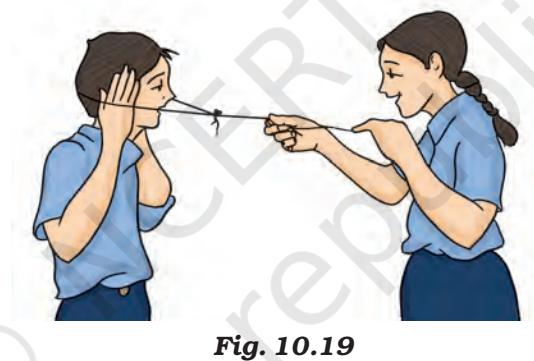

- 5. Make two toy telephones. Use them as shown in Fig. 10.20. Make sure that the two strings are taut and touch each other. Let one of you speak. Can the remaining three persons hear? See how many more friends you can engage in this way. Explain your observations.
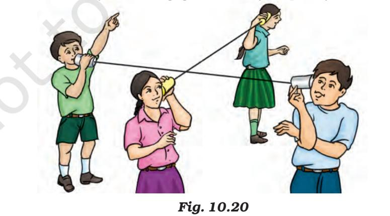

- 6. Identify the sources of noise pollution in your locality. Discuss with your parents, friends and neighbours. Suggest how to control noise pollution. Prepare a brief report and present it in the class.
You can read more on the related topics on the following websites:

- l www.physicsclassroom.com/Class/sound/soundtoc.html
- l health.howstuffworks.com/hearing.htm

### Did You Know?

Golconda fort, near Hyderabad, is one of the most magnificient forts in India. It is famous for many engineering and architectural marvels. One of the marvels is the water supply system. But, perhaps, more astonishing is a dome near the entrance to the fort. A hand-clap at a particular point under the dome reverberates and can be heard at the highest point of the fort, about a kilometre away. This was devised as a warning system. If a guard saw a suspicious movement outside the fort, he clapped at the particular point under the dome, and the army inside the fort was alerted to the danger of the approaching enemy.

