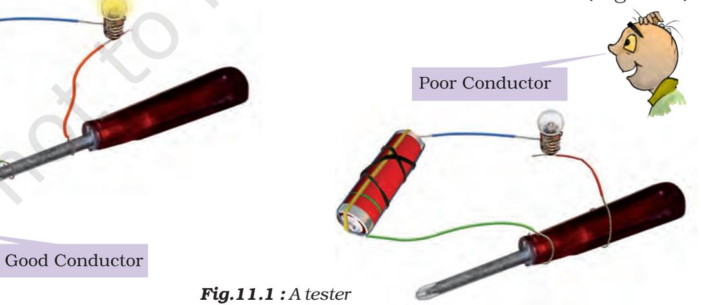
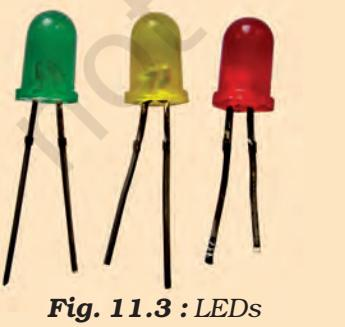
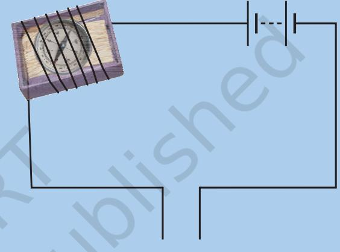
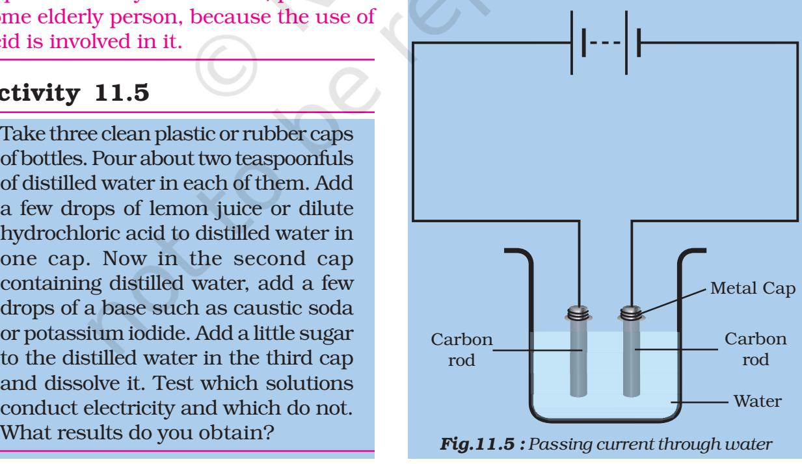
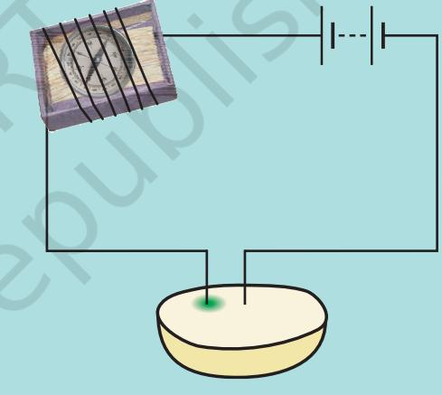
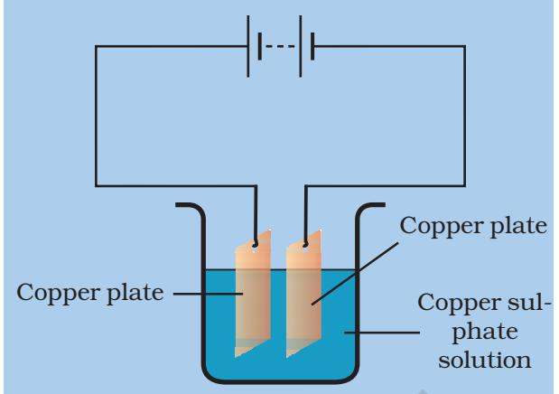
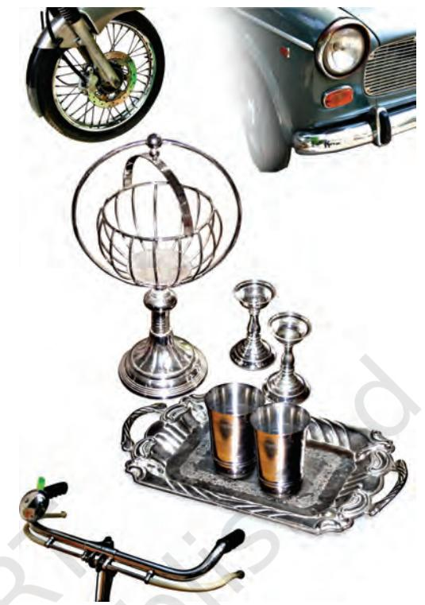
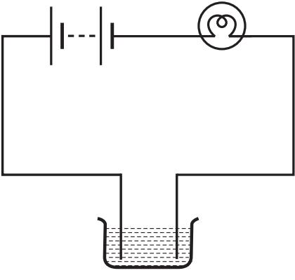
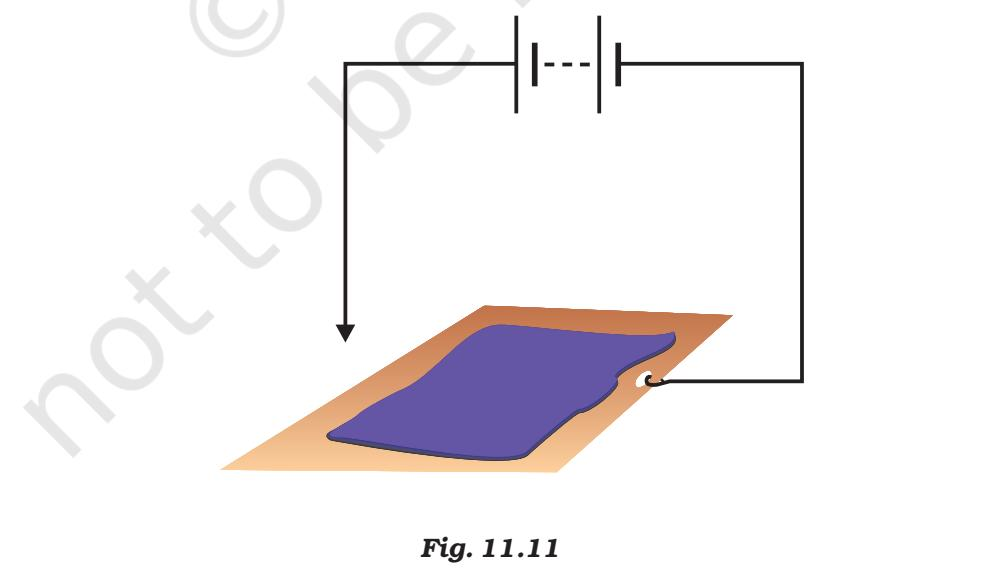

Y our elders might have cautioned you against touching an electrical appliance with wet hands. But do you know why it is dangerous to touch an electrical appliance with wet hands?

We have learnt earlier that the materials, which allow electric current to pass through them, are good conductors of electricity. On the other hand, materials, which do not allow electric current to pass through them easily, are poor conductors of electricity.

In Class VI, we made a tester to test whether a particular material allows the electric current to pass through it or not. Do you recall how the tester helped us in deciding that?

We found that metals such as copper and aluminium conduct electricity whereas materials such as rubber, plastic and wood do not conduct electricity. However, so far we have used our tester to test materials which were in solid state. But what about liquids? Do liquids also conduct electricity? Let us find out.

> Paheli and Boojho want to remind you that one should not experiment with the electric supply from the mains or a generator or an inverter. Use only electric cells for all the activities suggested here.

# 11.1 Do Liquids Conduct Electricity?

To test whether a liquid allows electric current to pass through it or not, we can use the same tester (Fig.11.1).

However, replace the cell by a battery. Also, before using the tester we should check whether it is working or not.

### Activity 11.1

Join the free ends of the tester together for a moment. This completes the circuit of the tester and the bulb should glow. However, if the bulb does not glow, it means that the tester is not working. Can you think of the possible reasons? Is it possible that the connections are loose? Or, the bulb is fused? Or, your cells are used up? Check that all the connections are tight. If they are, then replace the bulb with another bulb. Now test if the tester is working or not. If it is still not working then replace the cells with fresh cells.

Now that our tester is working, let us use it to test the various liquids.

*(Caution: While checking your tester, do not join its free ends for more than a few seconds. Otherwise the cells of the battery will drain very quickly.)*

#### Activity 11.2

Collect a few small plastic or rubber caps of discarded bottles and clean them. Pour one teaspoon of lemon juice or vinegar in one cap. Bring your tester over this cap and let the ends of the tester dip into lemon juice or vinegar as shown in Fig.11.2. Take care that the ends are not more than 1 cm apart but at the same time do not touch each other. Does the bulb of the tester glow? Does lemon juice or vinegar conduct electricity? How would you classify lemon juice or vinegar— a good conductor or a poor conductor?

When the liquid between the two ends of the tester allows the electric current to pass, the circuit of the tester becomes complete. The current flows in the circuit and the bulb glows. When the liquid does not allow the electric current to pass, the circuit of the tester is not complete and the bulb does not glow.

In some situations even though the liquid is conducting, the bulb may not glow. It may have happened in Activity 11.2. What can be the reason?

Do you remember why the bulb glows when the electric current passes through it? Due to the heating effect of current, the filament of the bulb gets heated to a high temperature and it starts glowing. However, if the current through a circuit is too weak, the filament does not get heated

CHEMICAL EFFECTS OF ELECTRIC CURRENT 139

sufficiently and it does not glow. And why is the current in the circuit weak? Well, though a material may conduct electricity, it may not conduct it as easily as a metal. As a result, the circuit of the tester may be complete and yet the current through it may be too weak to make the bulb glow. Can we make another tester which can detect a weak current?

We can use another effect of an electric current to make another kind of tester. Do you recall that electric current produces a magnetic effect? What happens to a compass needle kept nearby when current flows in a wire? Even if the current is small, the deflection of the magnetic needle can be seen. Can we make a tester using the magnetic effect of currents? Let us find out in Activity 11.3.

You may use an LED (Fig. 11.3) in place of the electric bulb in the tester of Fig. 11.2. LED glows even when a weak electric current flows through it.

There are two wires (called leads) attached to an LED. One lead is slightly longer than the other. Remember that while connecting to a circuit, the longer lead is always connected to the positive terminal of the battery and the shorter lead is connected to the negative terminal of the battery.

# Activity 11.3

Take the tray from inside a discarded matchbox. Wrap an electric wire a few times around the tray. Place a small compass needle inside it. Now connect one free end of the wire to the terminal of a battery. Leave the other end free. Take another piece of wire and connect it to the other terminal of the battery (Fig. 11.4).

*Fig 11.4 : Another tester*

Join the free ends of two wires momentarily. The compass needle should show deflection. Your tester with two free ends of the wire is ready.

Now repeat Activity 11.2 using this tester. Do you find a deflection in the compass needle the moment you dip the free ends of the tester in lemon juice?

Take out the ends of the tester from the lemon juice, dip them in water and then wipe them dry. Repeat the activity with other liquids such as tap water, vegetable oil, milk, honey. *(Remember to wash and wipe dry the ends of tester after testing each liquid).* In each case observe whether the magnetic needle shows deflection or not. Record your observations in Table 11.1.

| S.No. | Material | Compass Needle Shows Deflection Yes/No | Good Conductor/ Poor Conductor |
| --- | --- | --- | --- |
| 1. | Lemon juice | Yes | Good Conductor |
| 2. | Vinegar |  |  |
| 3. | Tap Water |  |  |
| 4. | Vegetable oil |  |  |
| 5. | Milk |  |  |
| 6. | Honey |  |  |
| 7. |  |  |  |
| 8. |  |  |  |
| 9. |  |  |  |
| 10. |  |  |  |

Table 11.1 : Good/Poor Conducting Liquids

From Table 11.1, we find that some liquids are good conductors of electricity and some are poor conductors.

> When the free ends of the tester do not touch each other, there is an air gap between them. Paheli knows that air is a poor conductor of electricity. But she has also read that during lightning, an electric current passes through air. She wonders if air is indeed a poor conductor under all conditions. This makes Boojho ask whether other materials classified as poor conductors also allow electricity to pass under certain conditions.

Actually, under certain conditions most materials can conduct. That is why it is preferable to classify materials as good conductors and poor conductors instead of classifying as conductors and insulators.

We have tested the conduction of electricity through tap water. Let us now test the conduction of electricity through distilled water.

# Activity 11.4

Take about two teaspoonfuls of distilled water in a clean and dry plastic or rubber cap of a bottle. *(You may obtain distilled water from your school science lab. You may also get distilled water from a medical store or a doctor or a nurse)*. Use the tester to test whether distilled water conducts electricity or not. What do you find? Does distilled water conduct electricity? Now dissolve a pinch of common salt in distilled water. Again test. What do you conclude this time?

When salt is dissolved in distilled water, we obtain salt solution. This is a conductor of electricity.

The water that we get from sources such as taps, hand pumps, wells and ponds is not pure. It may contain

CHEMICAL EFFECTS OF ELECTRIC CURRENT 141

several salts dissolved in it. Small amounts of mineral salts are naturally present in it. This water is thus a good conductor of electricity. On the other hand, distilled water is free of salts and is a poor conductor.

> Small amounts of mineral salts present naturally in water are beneficial for human health. However, these salts make water a good conductor. So, we should never handle electrical appliances with wet hands or while standing on a wet floor.

We have found that common salt, when dissolved in distilled water, makes it a good conductor. What are the other substances which, when dissolved in distilled water, make it conducting? Let us find out.

Caution: Do the next activity under the supervision of your teacher/parent or some elderly person, because the use of acid is involved in it.

### Activity 11.5

Take three clean plastic or rubber caps of bottles. Pour about two teaspoonfuls of distilled water in each of them. Add a few drops of lemon juice or dilute hydrochloric acid to distilled water in one cap. Now in the second cap containing distilled water, add a few drops of a base such as caustic soda or potassium iodide. Add a little sugar to the distilled water in the third cap and dissolve it. Test which solutions conduct electricity and which do not.

Most liquids that conduct electricity are solutions of acids, bases and salts.

When an electric current flows through a conducting solution, does it produce an effect on the solution?

# 11.2 Chemical Effects of Electric Current

In Class VII, we have learnt some effects of electric current. Can you list these effects? What effect does the current produce when it flows through a conducting solution? Let us find out.

# Activity 11.6

Take out carbon rods carefully from two discarded cells. Clean their metal caps with sand paper. Wrap copper wires around the metal caps of the carbon rods and join them to a battery (Fig. 11.5). We call these two rods electrodes. (*Instead of*

*carbon rods, you may take two iron nails about 6 cm long .*) Pour a cupful of water in a glass/plastic bowl. Add a teaspoonful of salt or a few drops of lemon juice to water to make it more conducting. Now immerse the electrodes in this solution. Make sure that the metal caps of the carbon rods are outside the water. Wait for 3-4 minutes. Observe the electrodes carefully. Do you notice any gas bubbles near the electrodes? Can we call the change taking place in the solution a chemical change? Recall the definition of a chemical change that you learnt in Class VII.

In 1800, a British chemist, William Nicholson (1753–1815), had shown

that if electrodes were immersed in water, and a current was passed, bubbles of oxygen and hydrogen were produced. Oxygen bubbles formed on the electrode

connected to the positive terminal of the battery and hydrogen bubbles formed on the other electrode.

The passage of an electric current through a conducting solution causes chemical reactions. As a result, bubbles of a gas may be formed on the electrodes. Deposits of metal may be seen on electrodes. Changes of colour of solutions may occur. The reaction would depend on what solution and electrodes are used. These are some of the chemical effects of the electric current.

Boojho decided to test whether some fruits and vegetables also conduct electricity or not. He cut

a potato into two halves and inserted the copper wires of a tester into it. Just then his mother called him and he forgot to take out the wires of the tester inserted into the potato. When he came back after half an hour, he noticed that there was a greenish blue spot on the potato around one wire whereas there was no such spot around the other wire (Fig. 11.6).

*Fig. 11.6 : Testing potato*

He was surprised with this observation and along with Paheli repeated this activity many times. They found that it was always the wire connected to the positive terminal, which had a greenish blue spot around it. They felt that this discovery was very useful because it could be used for identifying the positive terminal of a cell or a battery concealed in a box. They decided to report their finding to a children's magazine.

Remember that Boojho set out to test whether potato conducted

CHEMICAL EFFECTS OF ELECTRIC CURRENT 143

electricity or not. What he found was that current produced a chemical effect in the potato. To him this was very exciting. In fact, this is how science sometimes works. You are looking for something and you discover something else. Many important discoveries have been made in this manner.

# 11.3 Electroplating

You know that a brand new bicycle has shiny handlebar and wheel rims. However, if these are accidentally scratched, the shiny coating comes off revealing a not so shiny surface beneath. You might have also seen women using ornaments, which appear to be made of gold. However, with repeated use, the gold coating wears off, revealing silver or some other metal beneath.

In both these cases, a metal has a coating of another metal. Do you wonder how a layer of one metal can be deposited on top of another? Well, let us try doing it ourselves.

### Activity 11.7

We will need copper sulphate and two copper plates of size around 10 cm × 4 cm. Take 250 mL of distilled water in a clean and dry beaker. Dissolve two teaspoonfuls of copper sulphate in it. Add a few drops of dilute sulphuric acid to copper sulphate solution to make it more conducting. Clean copper plates with sand paper. Now rinse them with water and dry them. Connect the copper plates to the terminals of a battery and immerse them in copper sulphate solution (Fig. 11.7).

#### *Fig.11.7 : A simple circuit showing electroplating*

Allow the current to pass for about 15 minutes. Now remove the electrodes from the solution and look at them carefully. Do you find any difference in any one of them? Do you find a coating over it? What colour is the coating? Note down the terminal of the battery with which this electrode is connected.

> After doing the electroplating activity, Paheli interchanged the electrodes and repeated the activity. What do you think she would observe this time?

When electric current is passed through the copper sulphate solution, copper sulphate dissociates into copper and sulphate. The free copper gets drawn to the electrode connected to the negative terminal of the battery and gets deposited on it. But what about the loss of copper from the solution?

From the other electrode, a copper plate, an equal amount of copper gets dissolved in the solution. Thus, the loss of copper from the solution is restored and the process continues. This means that copper gets transferred from one electrode to the other.

> Boojho could get only one copper plate. So he performed Activity 11.7 by connecting a carbon rod in place of the copper plate which was connected to the negative terminal of the battery. He succeeded in obtaining a coating of copper on carbon rod.

The process of depositing a layer of any desired metal on another material by means of electricity is called electroplating. It is one of the most common applications of chemical effects of electric current.

Electroplating is a very useful process. It is widely used in industry for coating metal objects with a thin layer of a different metal (Fig.11.8). The layer of metal deposited has some desired property, which the metal of the object lacks. For example, chromium plating is done on many objects such as car parts, bath taps, kitchen gas burners, bicycle handlebars, wheel rims and many others.

Chromium has a shiny appearance. It does not corrode. It resists scratches. However, chromium is expensive and it may not be economical to make the whole object out of chromium. So the object is made from a cheaper metal and only a coating of chromium over it is deposited. Jewellery makers electroplate

*Fig. 11.8 : Some electroplated objects*

silver and gold on less expensive metals. These ornaments have the appearance of silver or gold but are much less expensive.

Tin cans, used for storing food, are made by electroplating tin onto iron. Tin is less reactive than iron. Thus, food does not come into contact with iron and is protected from getting spoilt.

Iron is used in bridges and automobiles to provide strength. However, iron tends to corrode and rust. So, a coating of zinc is deposited on iron to protect it from corrosion and formation of rust.

In the electroplating factories the disposal of the used conducting solution is a major concern. It is a polluting waste and there are specific disposal guidelines to protect the environment.

CHEMICAL EFFECTS OF ELECTRIC CURRENT 145

# KEYWORDS ELECTRODE ELECTROPLATING GOOD CONDUCTOR LED POOR CONDUCTOR

#### WHAT YOU HAVE LEARNT

- ‹ Some liquids are good conductors of electricity and some are poor conductors.
- ‹ Most liquids that conduct electricity are solutions of acids, bases and salts.
- ‹ The passage of an electric current through a conducting liquid causes chemical reactions. The resulting effects are called chemical effects of currents.
- ‹ The process of depositing a layer of any desired metal on another material, by means of electricity, is called electroplating.

#### Exercises

- 1. Fill in the blanks. (a) Most liquids that conduct electricity are solutions of , ______________ and ______________. (b) The passage of an electric current through a solution causes ______________ effects. (c) If you pass current through copper sulphate solution, copper gets deposited on the plate connected to the terminal of the battery. (d) The process of depositing a layer of any desired metal on another material by means of electricity is called . 2. When the free ends of a tester are dipped into a solution, the magnetic needle shows deflection. Can you explain the reason? 3. Name three liquids, which when tested in the manner shown in Fig.11.9, may cause the magnetic needle to deflect. *Fig. 11.9*

- 4. The bulb does not glow in the setup shown in Fig.11.10. List the possible reasons. Explain your answer.

*Fig. 11.10*

- 5. A tester is used to check the conduction of electricity through two liquids, labelled A and B. It is found that the bulb of the tester glows brightly for liquid A while it glows very dimly for liquid B. You would conclude that
	- (i) liquid A is a better conductor than liquid B.
	- (ii) liquid B is a better conductor than liquid A.
	- (iii) both liquids are equally conducting.
	- (iv) conducting properties of liquid cannot be compared in this manner.
- 6. Does pure water conduct electricity? If not, what can we do to make it conducting?
- 7. In case of a fire, before the firemen use the water hoses, they shut off the main electrical supply for the area. Explain why they do this.
- 8. A child staying in a coastal region tests the drinking water and also the seawater with his tester. He finds that the compass needle deflects more in the case of seawater. Can you explain the reason?
- 9. Is it safe for the electrician to carry out electrical repairs outdoors during heavy downpour? Explain.
- 10. Paheli had heard that rainwater is as good as distilled water. So she collected some rainwater in a clean glass tumbler and tested it using a tester. To her surprise she found that the compass needle showed deflection. What could be the reasons?
- 11. Prepare a list of objects around you that are electroplated.
- 12. The process that you saw in Activity 11.7 is used for purification of copper. A thin plate of pure copper and a thick rod of impure copper are used as electrodes. Copper from impure rod is sought to be transfered to the thin copper plate. Which electrode should be attached to the positive terminal of the battery and why?

### Extended Learning — Activities and Projects

- 1. Test the conduction of electricity through various fruits and vegetables. Display your result in a tabular form.
- 2. Repeat Activity 11.7 with a zinc plate in place of the copper plate connected to the negative terminal of the battery. Now replace zinc plate with some other metallic object and again repeat the activity. Which metal gets deposited over which other metal? Discuss your findings with your friends.
- 3. Find out if there is a commercial electroplating unit in your town. What objects are electroplated there and for what purpose? (The process of electroplating in a commercial unit is much more complex than what we did in Activity 11.7). Find out how they dispose off the chemicals they discard.
- 4. Imagine that you are an 'entrepreneur' and have been provided a loan by a bank to set up a small electroplating unit. What object would you like to electroplate and for what purpose? (Look up the meaning of 'entrepreneur' in a dictionary).
- 5. Find out the health concerns associated with chromium electroplating. How are people trying to resolve them?
- 6. You can make a fun pen for yourself. Take a conducting metal plate and spread a moist paste of potassium iodide and starch. Connect the plate to a battery as shown in Fig. 11.11. Now using the free end of the wire, write a few letters on the paste. What do you see?

#### For more information on this topic visit:

- l electronics.howstuffworks.com/led.htm
# Did You Know?

LEDs (Light Emitting Diodes) are available in many colours such as red, green, yellow, blue, white and are increasingly being used for many applications, for example in traffic signal lights. LEDs are increasingly being used for lighting. A cluster of white LEDs grouped together forms a LED light source. LED light sources consume less electricity and have longer lifetime than light bulbs and fluorescent tubes. Hence these are gradually becoming the preferred lighting source.

