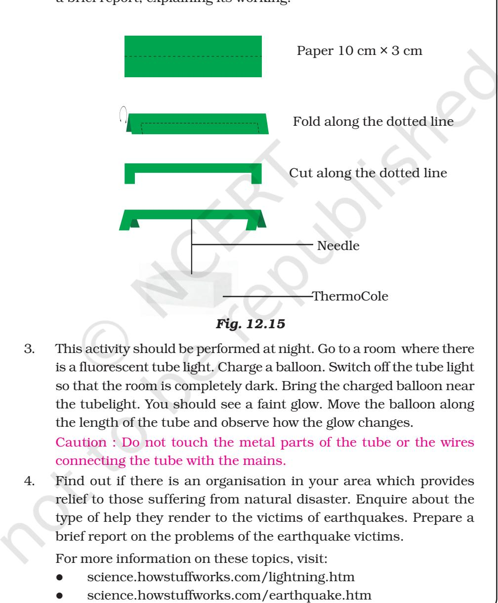

In this chapter we shall discuss two destructive natural phenomena. These are lightning and earthquakes. We shall also discuss what steps we can take to minimise destruction caused by these phenomena.

# **12.1Lightning**

You might have seen sparks on a electric pole when wires become loose. This phenomenon is quite common when wind is blowing and shaking the wires. You might also have seen sparks when a plug is loose in its socket. Lightning is also an electric spark, but on a huge scale.

In ancient times, people did not understand the cause of these sparks. They were, therefore, afraid of lightning and thought that the wrath of gods was visiting them. Now, of course, we understand that lightning is caused by the accumulation of charges in the clouds. We need not be afraid of lightning, but we have to take precautions to protect ourselves from the deadly sparks.

### **The Sparks that the Greeks Knew About**

The ancient Greeks knew as early as 600 B.C. that when amber (amber is a kind of resin) was rubbed with fur, it attracted light objects such as hair. You might have seen that when you take off woollen or polyester clothes, your hair stands on end. If you take off these clothes in the dark, you even see a spark and hear a crackling sound. In 1752 Benjamin Franklin, an American scientist, showed that lightning and the spark from your clothes are essentially the same phenomena. However, it took 2000 years for this realisation to occur.

> I wonder why they took so many years to realise the similarity.

Scientific discoveries are a result of hardwork by many people. It can sometimes take a long time.

We shall now study some properties of electric charges. We shall also see how they are related to the lightning in the sky.

Let us perform some activities to understand the nature of electric charges. But recall first what you might have played as a game. When you rub a plastic scale on your dry hair, the scale can attract very small pieces of paper.

# **12.2 Charging by Rubbing**

## **Activity 12.1**

Take a used ballpen refill and rub it vigorously with a piece of polythene. Bring it close to small pieces of paper. Take care not to touch the rubbed end of the refill with your hand or with a metallic object. Repeat the activity with small pieces of dry leaf, husk and mustard seeds. Record your observations.

When a plastic refill is rubbed with polythene, it acquires a small electric charge. Similarly, when a plastic comb is rubbed with dry hair, it acquires a small charge. These objects are called **charged objects**. In the process of charging the refill and the plastic comb, polythene and hair also get charged.

Let's try to charge some other objects that are familiar to you.

# **Activity 12.2**

Collect the objects and the materials listed in Table 12.1. Try to charge each by rubbing with the materials mentioned in the Table. Record your findings. You can add more items to the Table.

| Objects Rubbed | Materials Used for Rubbing | Attracts/does not Attract Pieces | Charged/ Not Charged |
| --- | --- | --- | --- |
|  |  | of Paper |  |
| Refill | Polythene, woollen cloth |  |  |
| Balloon | Polythene, woollen |  |  |
| Eraser | Wool |  |  |
|  | cloth, dry hair |  |  |
| Steel spoon | Polythene, |  |  |
|  | woollen cloth |  |  |

**Table 12.1**

**SOME NATURAL PHENOMENA 151**

# 12.3 Types of Charges and Their Interaction

We will select some objects from Table 12.1 for the next activity.

# Activity 12.3

(a) Inflate two balloons. Hang them in such a way that they do not touch each other (Fig. 15.1). Rub both the balloons with a woollen cloth and release them. What do you observe?

Now let us repeat this activity with the used pen refills. Rub one refill with polythene. Place it carefully in a glass tumbler using the tumbler as a stand (Fig. 12.2).

*Fig. 12.2 : Interaction between like charges*

Rub the other refill also with polythene. Bring it close to the charged refill. Be careful not to touch the charged end with your hand. Is there any effect on the refill in the tumbler? Do the two attract each other, or repel each other?

In this activity we have brought close together the charged objects that were made of the same material. What happens if two charged objects made of different materials are brought close to each other? Let's find out.

(b) Rub a refill and place it gently in a glass tumbler as before (Fig. 12.3). Bring an inflated charged balloon near the refill and observe.

*Fig. 12.3 : Unlike charges attract each other*

Let's summarise the observations:

- l A charged balloon repelled a charged balloon.
- l A charged refill repelled a charged refill.
- l But a charged balloon attracted a charged refill.

Does it indicate that the charge on the balloon is of a different kind from the charge on the refill? Can we say then, that there are two kinds of

charges? Can we also say that the charges of the same kind repel each other, while charges of different kind attract each other?

It is a convention to call the charge acquired by a glass rod when it is rubbed with silk as positive. The other kind of charge is said to be negative.

It is observed that when a charged glass rod is brought near a charged plastic straw rubbed with polythene there is attraction between the two.

What do you think would be the kind of charge on the plastic straw? Your guess, that the plastic straw would carry a negative charge is correct.

The electrical charges generated by rubbing are static. They do not move by themselves. When charges move, they constitute an electric current. You have been reading about electric current since Class VI. The current in a circuit which makes a bulb glow, or the current that makes a wire hot, is nothing but a motion of charges.

## 12.4 Transfer of Charge

## Activity 12.4

Take an empty jam bottle. Take a piece of cardboard slightly bigger in size than the mouth of the bottle. Pierce a hole in it so that a metal paper clip can be inserted. Open out the paper clip as shown in Fig. 12.4. Cut two strips of aluminium foil about 4 cm × 1 cm each. Hang them on the paper clip as shown. Insert the paper clip in the cardboard lid so that it is perpendicular to it (Fig. 12.4). Charge a refill and touch it with the end of the paper clip. Observe what happens. Is there any effect on the foil strips? Do they repel each other or attract each other? Now, touch other charged bodies with the end of the paper clip. Do foil strips behave in the same way in all cases? Can this apparatus be used to detect whether a body is charged or not? Can you explain why the foil strips repel each other?

The aluminium foil strips receive the same charge from the charged refill through the paper clip (remember that metals are good conductors of electricity). The strips carrying similar charges repel each other and they become wide open. Such a device can be used to test whether an object is carrying charge or not. This device is known as electroscope.

Thus, we find that electrical charge can be transferred from a charged object to another through a metal conductor.

Touch the end of the paper clip gently with hand and you will find a change in

SOME NATURAL PHENOMENA 153

the foil strips. They come back to their original state. Repeat charging of foil strips and touching the paper clip. Every time you will find that the foil strips collapse as soon as you touch the paperclip with hand. Why does it happen? The reason is that the foil strips lose charge to the earth through your body. We say that the foil strips are discharged. The process of transferring of charge from a charged object to the earth is called earthing.

> Earthing is provided in buildings to protect us from electrical shocks due to any leakage of electrical current.

# 12.5 The Story of Lightning

It is now possible to explain lightning in terms of the charges produced by rubbing.

During the development of a thunderstorm, the air currents move upward while the water droplets move downward. These vigorous movements cause separation of charges. By a process, not yet completely understood, the positive charges collect near the upper edges of the clouds and the negative charges accumulate near the lower edges. There is accumulation of positive charges near the ground also. When the magnitude of the accumulated charges becomes very large, the air which is normally a poor conductor of electricity, is no longer able to resist their flow. Negative and positive charges meet, producing streaks of bright light and sound. We see streaks as lightning (Fig. 12.5). The process is called an electric discharge.

*Fig. 12.5 : Accumulation of charges leading to lightning.*

The process of electric discharge can occur between two or more clouds, or between clouds and the earth. Today we need not get frightened by lightning like our ancestors did. Now we understand the basic phenomenon. Scientists are trying hard to improve this understanding. However, lightning strike could destroy life and property. It is, therefore, necessary to take measures to protect ourselves.

### 12.6 Lightning Safety

During lightning and thunderstorm no open place is safe.

- l Hearing thunder is an alert to rush to a safer place.
- l After hearing the last thunder, wait for some time before coming out of the safe place.

### Finding a Safe Place

A house or a building is a safe place.

If you are travelling by car or by bus, you are safe inside with windows and doors of the vehicle shut.

### Do's and Don'ts during a Thunderstorm

### Outside

Open vehicles, like motorbikes, tractors, construction machinery, open cars are not safe. Open fields, tall trees, shelters in parks, elevated places do not protect us from lightning strokes.

Carrying an umbrella is not at all a good idea during thunderstorms.

If in a forest, take shelter under shorter trees.

If no shelter is available and you are in an open field, stay far away from all trees. Stay away from poles or other

SOME NATURAL PHENOMENA 155

metal objects. Do not lie on the ground. Instead, squat low on the ground. Place your hands on your knees with your head between the hands (Fig. 12.6). This position will make you the smallest target to be struck.

*Fig. 12.6 : Safe position during lightning*

### Inside the house

Lightning can strike telephone cords, electrical wires and metal pipes (Do you remember, lightning is an electrical discharge?). During a thunderstorm contact with these should be avoided. It is safer to use mobile phones and cordless phones. However, it is not wise to call up a person who is receiving your phone through a wired phone.

Bathing should be avoided during thunderstorms to avoid contact with running water.

Electrical appliances like computers, TVs, etc., should be unplugged. Electrical lights can remain on. They do not cause any harm.

### Lightning Conductors

Lightning Conductor is a device used to protect buildings from the effect of lightning. A metallic rod, taller than the building, is installed in the walls of the building during its construction. One end of the rod is kept out in the air and the other is buried deep in the ground (Fig. 12.7). The rod provides easy route for the transfer of electric charge to the ground.

The metal columns used during construction, electrical wires and water pipes in the buildings also protect us to an extent. But do not touch them during a thunderstorm.

## 12.7 Earthquakes

You just learnt about thunderstorm and lightning. These natural phenomena can cause large scale destruction of human life and property. Fortunately, these phenomena can be predicted to some extent. The weather department can warn about a thunderstorm developing in some area.

If a thunderstorm occurs there is always a possibility of lightning and cyclones accompanying it. So, we get time to take measures to protect ourselves from the damage caused by these phenomena.

*Fig. 12.7 : Lightning conductor*

There is, however, one natural phenomenon which we are not yet able to predict accurately. It is an earthquake. It can cause damage to human life and property on a huge scale.

A major earthquake occurred in India on 8 October 2005 in Uri and Tangdhar towns of North Kashmir (Fig. 12.8). Before that a major earthquake occurred on 26 January 2001 in Bhuj district of Gujarat.

### Activity 12.5

Ask your parents about the huge damage to life and property caused by these earthquakes. Collect a few pictures showing the damage caused by these earthquakes from newspapers and magazines of those days. Prepare a short report on the suffering of the people during and after the earthquakes.

What is an earthquake? What happens when it occurs? What can we do to minimise its effects? These are some of the questions which we shall discuss below.

#### What is an Earthquake?

An earthquake is a sudden shaking or trembling of the earth which lasts for a very short time. It is caused by a disturbance deep inside the earth's

*Fig. 12.8 : Kashmir earthquake*

SOME NATURAL PHENOMENA 157

crust. Earthquakes occur all the time, all over the earth. They are not even noticed. Major earthquakes are much less frequent. They can cause immense damage to buildings, bridges, dams and people. There can be a great loss to life and property. Earthquakes can cause floods, landslides and tsunamis. A major tsunami occurred in the Indian Ocean on 26 December 2004. All the coastal areas around the ocean suffered huge losses.

# Activity 12.6

Take an outline map of the world. Locate the eastern coast and Andaman and Nicobar Islands in India. Mark other countries around the Indian Ocean which could have suffered damage. Collect accounts of the devastation caused by the tsunami in India from your parents, or other elders in the family or in the neighbourhood.

### What Causes an Earthquake?

My grandmother told me that the earth is balanced on the horn of a bull and when the bull shifts it to the other horn, an earthquake takes place. How could it be true?

In ancient times, people did not know the true cause of earthquakes. Their ideas were, therefore, expressed in mythical stories such as the one told by Boojho's grandmother. Similar myths were prevalent in other parts of the world.

Now we know that the tremors are caused by the disturbance deep down inside the uppermost layer of the earth called the crust (Fig. 12.9).

*Fig. 12.9 : Structure of the earth*

The outermost layer of the earth is not in one piece. It is fragmented. Each fragment is called a plate (Fig. 12.10). These plates are in continual motion. When they brush past one another,

*Fig. 12.10 : Earth plates*

or a plate goes under another due to collision (Fig. 12.11), they cause disturbance in the earth's crust. It is this disturbance that shows up as an earthquake on the surface of the earth.

*Fig. 12.11 : Movements of earth's plates*

Although, we know for sure what causes an earthquake, it is not yet possible to predict when and where the next earthquake might occur.

Tremors on the earth can also be caused when a volcano erupts, or a meteor hits the earth, or an underground nuclear explosion is

SOME NATURAL PHENOMENA 159

carried out. However, most earthquakes are caused by the movement of earth's plates.

Since earthquakes are caused by the movement of plates, the boundaries of the plates are the weak zones where earthquakes are more likely to occur. The weak zones are also known as seismic or fault zones. In India, the areas most threatened are Kashmir, Western and Central Himalayas, the whole of North-East, Rann of Kutch, Rajasthan and the Indo–Gangetic Plane. Some areas of South India also fall in the danger zone (Fig. 12.12).

*Fig. 12.12 : Movements of Indian earth's plate*

The power of an earthquake is expressed in terms of a magnitude on a scale called the Richter scale. Really destructive earthquakes have magnitudes higher than 7 on the Richter scale. Both Bhuj and Kashmir earthquakes had magnitudes greater than 7.5.

The tremors produce waves on the surface of the earth. These are called seismic waves. The waves are recorded by an instrument called the seismograph (Fig. 12.13). The instrument is simply a vibrating rod, or a pendulum, which starts vibrating when tremors occur. A pen is attached to the vibrating system. The pen records the seismic waves on a paper which moves under it. By studying these waves, scientists can construct a complete map of the earthquake, as shown in Fig. 12.14. They can also estimate its power to cause destruction.

Like many other scales in science (decibel is another example), Richter scale is not linear. This means that an earthquake of magnitude 6 does not have one and half times the destructive energy of an earthquake of magnitude 4. In fact, an increase of 2 in magnitude means 1000 times more destructive energy. Therefore, an earthquake of magnitude 6 has thousand times more destructive energy than an earthquake of magnitude 4.

### Protection against Earthquakes

We know from the earlier pages that earthquakes cannot be predicted. We have also seen that they can be highly destructive. It is, therefore, important that we take necessary precautions to protect ourselves all the time. People living in seismic zones, where the earthquakes are more likely to occur, have to be specially prepared. First of all, the buildings in these zones should be so designed that they can withstand major tremors. Modern building technology can make it possible.

It is advisable to make the structure simple so that it is 'Quake Safe'.

- l Consult qualified architects and structural engineers.
- l In highly seismic areas, the use of mud or timber is better than using heavy construction material. Keep roofs as light as possible. In case the structure falls, the damage will not be heavy.
- l It is better if the cupboards and shelves are fixed to the walls, so that they do not fall easily.
- l Be careful where you hang wall clocks, photo-frames, water heaters etc., so that in the event of an earthquake, they do not fall on people.
- l Since some buildings may catch fire due to an earthquake, it is necessary that all buildings, especially tall buildings, have fire fighting equipment in working order.

The Central Building Research Institute, Roorkee, has developed knowhow to make quake-resistant houses.

In the event that an earthquake does strike, take the following steps to protect yourself.

### 1. If you are at home

- l Take shelter under a table and stay there till the shaking stops.
- l Stay away from tall and heavy objects that may fall on you.
- l If you are in bed, do not get up. Protect your head with a pillow.

#### 2. If you are outdoors

- l Find a clear spot, away from buildings, trees and overhead power lines. Drop to the ground.
- l If you are in a car or a bus, do not come out. Ask the driver to drive slowly to a clear spot. Do not come out till the tremors stop.

### KEYWORDS

CRUST

DISCHARGE

EARTH'S PLATES

EARTHQUAKE

ELECTROSCOPE

LIGHTNING

LIGHTNING CONDUCTOR

NEGATIVE CHARGE

POSITIVE CHARGE

RICHTER SCALE

SEISMOGRAPH

THUNDER

THUNDERSTORM

TRANSFER OF

CHARGE

TSUNAMI

TREMOR

### WHAT YOU HAVE LEARNT

- ‹ Some objects can be charged by rubbing with other objects.
- ‹ There are two kinds of charges positive charge and negative charge
- ‹ Like charges repel and unlike charges attract each other.
- ‹ The electrical charges produced by rubbing are called static charges.
- ‹ When charges move, they constitute an electric current.
- ‹ An electroscope may be used to detect whether a body is charged or not.
- ‹ The process of transfer of charge from a charged object to the earth is called earthing.
- ‹ The process of electric discharge between clouds and the earth or between different clouds causes lightning.
- ‹ Lightning strike could destroy life and property.
- ‹ Lightning conductors can protect buildings from the effects of lightning.
- ‹ An earthquake is a sudden shaking or trembling of the earth.
- ‹ Earthquake is caused by a disturbance deep inside the earth's crust.
- ‹ It is not possible to predict the occurrence of an earthquake.
- ‹ Earthquakes tend to occur at the boundaries of earth's plates. These boundaries are known as fault zones.
- ‹ Destructive energy of an earthquake is measured on the Richter scale. The earthquake measuring 7 or more on Richter scale can cause severe damage to life and property.
- ‹ We should take necessary precautions to protect ourselves from earthquakes.

## Exercises

|  | Select the correct option in Questions 1 and 2. |
| --- | --- |
| 1. | Which of the following cannot be charged easily by friction? |
|  | (a) A plastic scale |
|  | (b) A copper rod |
|  | (c) An inflated balloon |
|  | (d) A woollen cloth. |
| 2. | When a glass rod is rubbed with a piece of silk cloth the rod |
|  | (a) and the cloth both acquire positive charge. |
|  | (b) becomes positively charged while the cloth has a negative charge. |
|  | (c) and the cloth both acquire negative charge. |
|  | (d) becomes negatively charged while the cloth has a positive charge. |
| 3. | Write T against true and F against false in the following statements. |
|  | (a) Like charges attract each other (T/F) |
|  | (b) A charged glass rod attract a charged plastic straw (T/F) |
|  | (c) Lightning conductor cannot protect a building from lightning (T/F) |
|  | (d) Earthquakes can be predicted in advance (T/F) |
| 4. | Sometimes, a crackling sound is heard while taking off a sweater during winters. Explain. |
| 5. | Explain why a charged body loses its charge if we touch it with our hand. |
| 6. | Name the scale on which the destructive energy of an earthquake is measured. An earthquake measures 3 on this scale. Would it be recorded |
|  | by a seismograph? Is it likely to cause much damage? |
| 7. | Suggest three measures to protect ourselves from lightning. |
| 8. | Explain why a charged balloon is repelled by another charged balloon |
|  | whereas an uncharged balloon is attracted by another charged balloon? |
| 9. | Describe with the help of a diagram an instrument which can be used to |
|  | detect a charged body. |
| 10. | List three states in India where earthquakes are more likely to strike. |
| 11. | Suppose you are outside your home and an earthquake strikes. What |
|  | precaution would you take to protect yourself? |
| 12. | The weather department has predicted that a thunderstorm is likely to |
|  | occur on a certain day. Suppose you have to go out on that day. Would you |
|  | carry an umbrella? Explain. |

## Extended Learning — Activities and Projects

- 1. Open a water tap. Adjust the flow so that it forms a thin stream. Charge a refill. Bring it near the water stream. Observe what happens. Write a short report on the activity.
- 2. Make your own charge detector. Take a paper strip roughly 10 cm × 3 cm. Give it a shape as shown in Fig. 12.15. Balance it on a needle. Bring a charged body near it. Observe what happens. Write a brief report, explaining its working.

