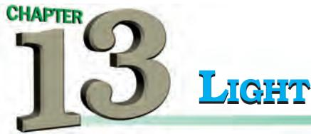

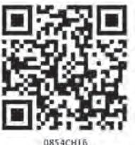

T he world is largely known through the senses. The sense of sight is one of the most important senses. Through it we see mountains, rivers, trees, plants, chairs, people and so many other things around us. We also see clouds, rainbows and birds flying in the sky. At night we see the moon and the stars. You are able to see the words and sentences printed on this page. How is seeing made possible?

## 13.1 What makes Things Visible

Have you ever thought how we see various objects? You may say that eyes see the objects. But, can you see an object in the dark? It means that eyes alone cannot see any object. It is only when light from an object enters our eyes that we see the object. The light may have been emitted by the object, or may have been reflected by it.

You learnt in Class VII that a polished or a shiny surface can act as a mirror. A mirror changes the direction of light that falls on it. Can you tell in which direction the light falling on a surface will be reflected? Let us find out.

## 13.2 Laws of Reflection

## Activity 13.1

Fix a white sheet of paper on a drawing board or a table. Take a comb and close all its openings except one in the middle. You can use a strip of black paper for this purpose. Hold the comb perpendicular to the sheet of paper. Throw light from a torch through the opening of the comb from one side (Fig. 13.1). With slight adjustment of the torch and the comb you will see a ray of light along the paper on the other side of the comb. Keep the comb and the torch steady. Place a strip of plane mirror in the path of the light ray (Fig. 13.1). What do you observe?

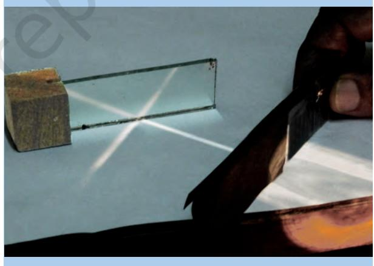

*Fig. 13.1 : Arrangement for showing reflection*

After striking the mirror, the ray of light is reflected in another direction. The light ray, which strikes any surface, is called the incident ray. The ray that comes back from the surface after reflection is known as the reflected ray. A ray of light is an idealisation. In reality, we have a narrow beam of light which is made up of several rays. For simplicity, we use the term ray for a narrow beam of light.

Draw lines showing the position of the plane mirror, the incident ray and the reflected ray on the paper with the help of your friends. Remove the mirror and the comb. Draw a line making an angle of 90º to the line representing the mirror at the point where the incident ray strikes the mirror. This line is known as the normal to the reflecting surface at that point (Fig. 13.2). The angle

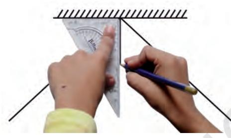

*Fig. 13.2 : Drawing the normal*

between the normal and incident ray is called the angle of incidence (∠*i*). The angle between the normal and the reflected ray is known as the angle of reflection (∠*r*) (Fig. 13.3). Measure the angle of incidence and the angle of reflection. Repeat the activity several times by changing the angle of incidence. Enter the data in Table 13.1.

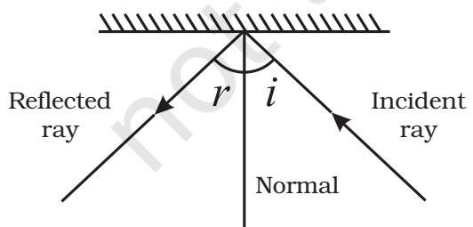

*Fig. 13.3 : Angle of incidence and angle of reflection*

|
|  |

| S. | Angle of | Angle of |
| --- | --- | --- |
| No. | Incidence (∠i) | Reflection (∠r) |
| 1. |  |  |
| 2. |  |  |
| 3. |  |  |
| 4. |  |  |
| 5. |  |  |

Do you see any relation between the angle of incidence and the angle of reflection. Are they approximately equal? If the experiment is carried out carefully, it is seen that the angle of incidence is always equal to the angle of reflection. This is one of the laws of reflection. Let us perform another activity on reflection.

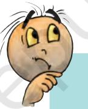

What would happen if I threw the light on the mirror along the normal.

## Activity 13.2

Perform Activity 13.1 again. This time use a sheet of stiff paper or a chart paper. Let the sheet project a little beyond the edge of the Table (Fig. 13.4). Cut the projecting portion of the sheet in the middle. Look at the reflected ray. Make sure that the reflected ray extends to the projected portion of the paper. Bend that part of the projected portion on which the reflected ray falls. Can you still see the reflected ray? Bring the paper back to the original

position. Can you see the reflected ray again? What do you infer?

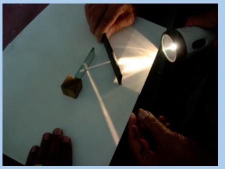

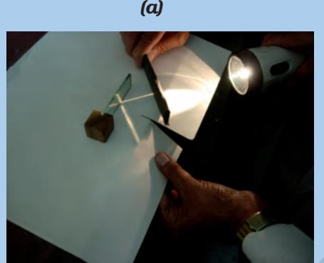

*(b) Fig. 13.4 (a), (b) : Incident ray, reflected ray and the normal at the point of incidence lie in the same plane*

When the whole sheet of paper is spread on the table, it represents one plane. The incident ray, the normal at the point of incidence and the reflected ray are all in this plane. When you bend the paper you create a plane different from the plane in which the incident ray and the normal lie. Then you do not see the reflected ray. What does it indicate? It indicates that the incident ray, the normal at the point of incidence and the reflected ray all lie in the same plane. This is another law of reflection.

Paheli and Boojho performed the above activities outside the classroom with the Sun as the source of light instead of a torch. You, too, can use the Sun as the source of light.

> These activities can also be performed by making use of the Ray Streak Apparatus (available in the kit prepared by NCERT).

Boojho remembered that in Class VII, he had studied some features of the image of an object formed by a plane mirror. Paheli asked him to recall those features:

- (i) Was the image erect or upside down?
- (ii) Was it of the same size as the object?
- (iii) Did the image appear at the same distance behind the mirror as the object was in front of it?
- (iv) Could it be obtained on a screen?

Let us understand a little more about the formation of an image by a plane mirror in the following way:

# Activity 13.3

A source of light O is placed in front of a plane mirror PQ. Two rays OA and OC are incident on it (Fig. 13.5). Can you find out the direction of the reflected rays?

Draw normals to the surface of the mirror PQ, at the points A and C. Then draw the reflected rays at the points A and C. How would you draw these rays? Call the reflected rays AB and CD, respectively. Extend them further. Do they meet? Extend them backwards. Do they meet now? If they meet, mark this point as I. For a viewer's eye at E (Fig. 13 .5), do the reflected rays

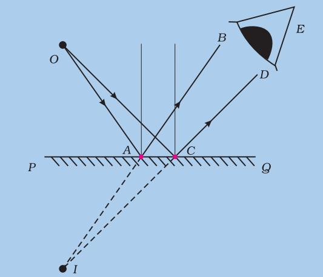

*Fig. 13.5 : Image formation in a plane mirror*

appear to come from the point I. Since the reflected rays do not actually meet at I, but only appear to do so, we say that a virtual image of the point O is formed at I. As you have learnt already in Class VII, such an image cannot be obtained on a screen.

You may recall that in an image formed by a mirror the left of the object appears on the right and the right appears on the left. This is known as lateral inversion.

## 13.3 Regular and Diffused Reflection

## Activity 13.4

Imagine that parallel rays are incident on an irregular surface as shown in Fig. 13.6. Remember that the laws of reflection are valid at each point of the surface. Use these laws to construct reflected rays at various points. Are they parallel to one another? You will find that these rays are reflected in different directions. (Fig. 13.7)

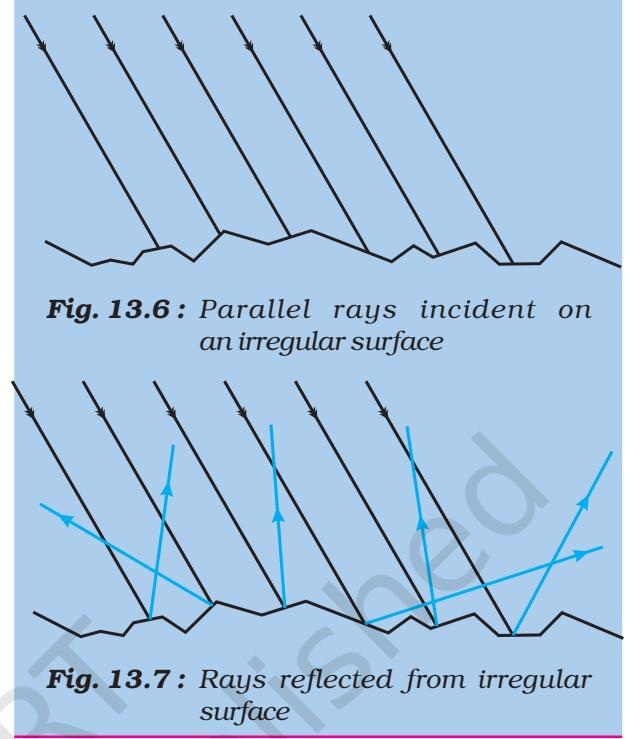

When all the parallel rays reflected from a rough or irregular surface are not parallel, the reflection is known as diffused or irregular reflection. Remember that the diffused reflection is not due to the failure of the laws of reflection. It is caused by the irregularities in the reflecting surface, like that of a cardboard.

On the other hand, reflection from a smooth sur face like that of a mirror is called regular reflection (Fig. 13.8). Images are formed by regular reflection.

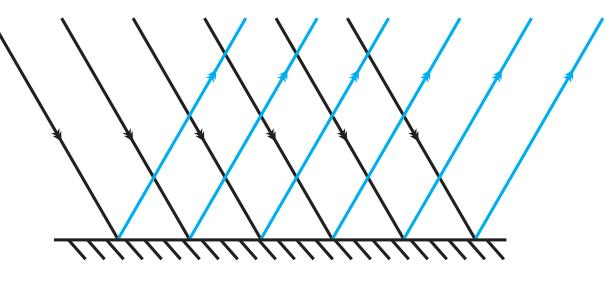

*Fig. 13.8 : Regular reflection*

### Do We See all Objects due to Reflected Light?

Nearly everything you see around is seen due to reflected light. Moon, for example, receives light from the Sun and reflects it. That's how we see the moon. The objects which shine in the light of other objects are called illuminated objects. Can you name some other such objects?

There are other objects, which give their own light, such as the Sun, fire, flame of a candle and an electric lamp. Their light falls on our eyes. That is how we see them. The objects which emit their own light are known as luminous objects.

I have a question. Can the reflected rays be further reflected if incident on another mirror?

Let us find out.

# 13.4 Reflected Light Can be Reflected Again

Recall the last time you visited a hair dresser. She/he makes you sit in front of a mirror. After your hair cut is complete, she/he holds a mirror behind you to show you how the hair has been cut (Fig. 13.9). Do you know how you could see the hair at the back of your head?

Paheli recalls having constructed a periscope as an Extended Activity in Class VI. The periscope makes use of two plane mirrors. Can you explain how reflection from the two mirrors enables you to see objects which are not visible directly? Periscopes are used in submarines, tanks and also by soldiers in bunkers to see things outside.

## 13.5 Multiple Images

You are aware that a plane mirror forms only a single image of an object. What happens if two plane mirrors are used in combination? Let us see.

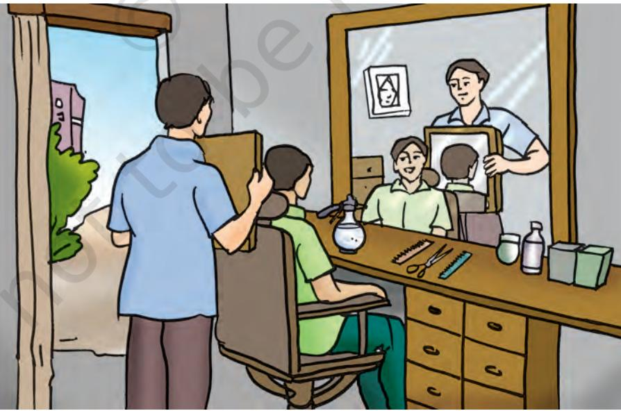

*Fig. 13.9 : Mirror at the hair dresser shop*

## Activity 13.5

Take two plane mirrors. Set them at right angles to each other with their edges touching (Fig. 13.10). To hinge them you can use adhesive tape. Place a coin in between the mirrors. How many images of the coin do you see (Fig. 13.10)?

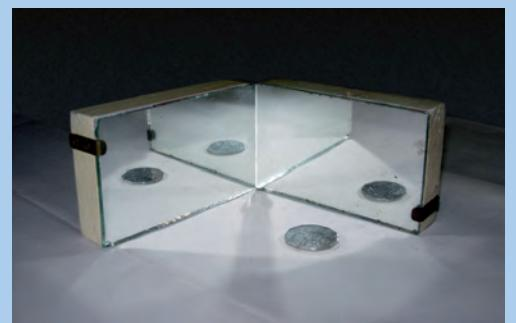

*Fig. 13.10 : Images in plane mirror at right angle to each other*

Now hinge the mirrors using the adhesive tape at different angles, say 45°, 60°, 120°, 180° etc. Place some object (say a candle) in between them. Note down the number of images of the object in each case.

Finally, set the two mirrors parallel to each other. Find out how many images of a candle placed between them are formed (Fig. 13.11).

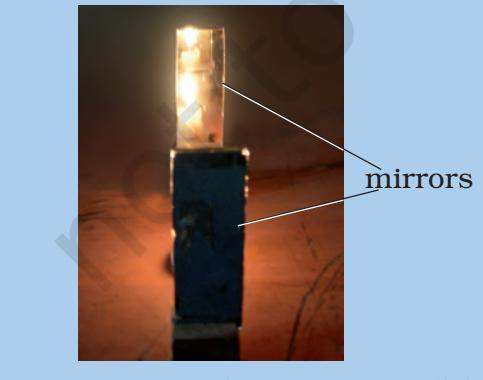

*Fig. 13.11 : Image in plane mirror parallel to each other*

Can you now explain how you can see the back of your head at the hair dresser's shop?

This idea of number of images formed by mirrors placed at an angle to one another is used in a kaleidoscope to make numerous beautiful patterns. You can also make a kaleidoscope yourself.

### Kaleidoscope

## Activity 13.6

To make a kaleidoscope, get three rectangular mirror strips each about 15 cm long and 4 cm wide. Join them together to form a prism as shown in Fig. 13.12(a). Fix this arrangement of mirrors in a circular cardboard tube or tube of a thick chart paper. Make sure that the tube is slightly longer than the mirror strips. Close one end of the tube by a cardboard disc having a hole in the centre, through which you can see [Fig. 13.12(b)]. To make the disc durable, paste a piece of transparent plastic sheet under the cardboard

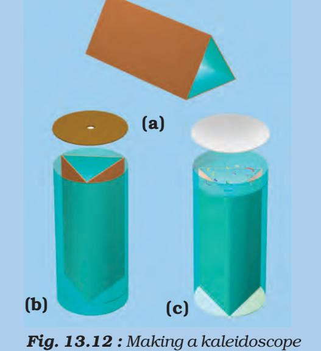

disc. At the other end, touching the mirrors, fix a circular plane glass plate [Fig. 13.12(c)]. Place on this glass plate several small pieces of coloured glass (broken pieces of coloured bangles). Close this end of the tube by a ground glass plate. Allow enough space for the colour pieces to move around.

Your kaleidoscope is ready. When you peep through the hole, you will be able to see a variety of patterns in the tube. An interesting feature of a kaleidoscope is that you will never see the same pattern again. Designers of wallpapers and fabrics and artists often use kaleidoscopes to get ideas for new patterns. To make your toy attractive, you can wrap the kaleidoscope in a coloured paper.

## 13.6 Sunlight — White or Coloured

In Class VII, you learnt that the sunlight is referred to as white light. You also learnt that it consists of seven colours. Here is another activity (Activity 13.7) showing that sunlight consists of several colours.

# 13.7 What is inside Our Eyes?

We see things only when light coming from them enters our eyes. Eye is one of our most important sense organs. It is, therefore, important to understand its structure and working.

The eye has a roughly spherical shape. The outer coat of the eye is white. It is tough so that it can protect the interior of the eye from accidents. Its transparent front part is called

# Activity 13.7

Get a plane mirror of a suitable size. Place it in a bowl (katori) as shown in Fig. 13.13. Fill the bowl with water. Put this arrangement near a window in such a way that direct sunlight falls on the mirror. Adjust

the position of the bowl so that the reflected light from the mirror falls on a wall. If the wall is not white, fix a sheet of white paper on it. Reflected light will be seen to have many colours. How can you explain this? The mirror and water form a prism. As you learnt in Class VII, this breaks up the light into its colours, Splitting of light into its colours is known as dispersion of light. Rainbow is a natural phenomenon showing dispersion.

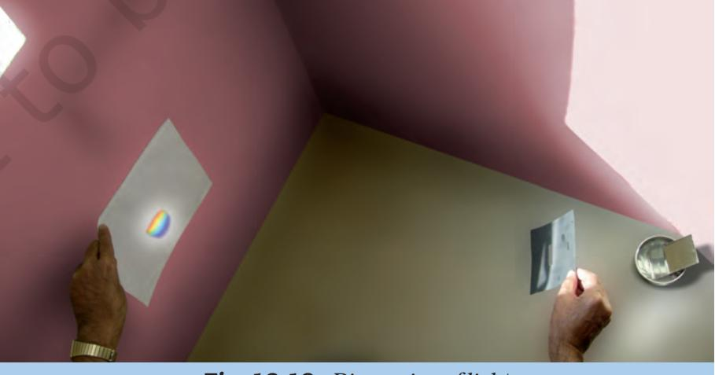

*Fig. 13.13 : Dispersion of light*

cornea (Fig. 13.14). Behind the cornea, we find a dark muscular structure called iris. In the iris, there is a small opening called the pupil. The size of the pupil is controlled by the iris. The iris is that part of eye which gives it its distinctive colour. When we say that a person has green eyes, we refer actually to the colour of the iris. The iris controls the amount of light entering into the eye. Let us see how.

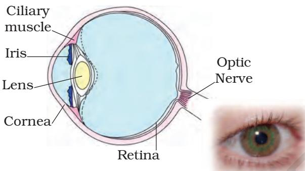

*Fig. 13.14 : Human eye*

Caution : For this activity, never use a laser torch.

# Activity 13.8

Look into your friend's eye. Observe the size of the pupil. Throw light on her eye with a torch. Observe the pupil now. Switch off the torch, and observe her pupil once again. Do you notice any change in the size of the pupil? In which case was the pupil larger? Why do you think it was so?

In which case do you need to allow more light in the eye, when the light is dim or bright?

Behind the pupil of the eye is a lens which is thicker in the centre. What kind of lens is thicker at the centre? Recall what you learnt about lenses in Class VII. The lens focuses light on the back of the eye, on a layer called retina (Fig. 13.14). The retina contains several nerve cells. Sensations felt by the nerve cells are then transmitted to the brain through the optic nerve. There are two kinds of cells–

- (i) cones, which are sensitive to bright light and
- (ii) rods, which are sensitive to dim light.

Cones sense colour. At the junction of the optic nerve and the retina, there are no sensory cells, so no vision is possible at that spot. This is called the blind spot. Its existence can be demonstrated as follows:

# Activity 13.9

Make a round mark and a cross on a sheet of paper with the spot to the right of the cross (Fig. 13.15). The distance between two marks may be 6-8 cm. Hold the sheet of paper at an arm's length from the eye. Close your left eye. Look continuously at the cross. Move the sheet slowly towards you, keeping your eye on the cross. What do you find? Does the round mark disappear at some point? Now close your right eye. Look at the round mark now and repeat the activity. Does the cross disappear? The disappearance of the cross or the round mark shows that there is a point on the retina which cannot send messages to the brain when light falls on it.

*Fig. 13.15 : Demonstration of blind spot*

The impression of an image does not vanish immediately from the retina. It persists there for about 1/16th of a second. So, if still images of a moving object are flashed on the eye at a rate faster than 16 per second, then the eye perceives this object as moving.

## Activity 13.10

Get a square piece of cardboard of size 6-8 cm. Make two holes as shown in Fig. 13.16. Thread a string through the two holes. Draw/ paste a cage on one side of the cardboard and a bird on the other side. Twist the string and make the card twirl rapidly. Do you see the bird in the cage?

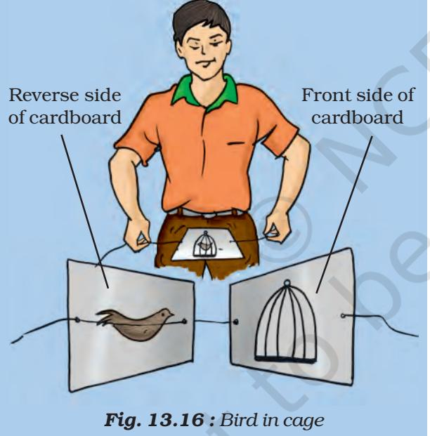

The movies that we see are actually a number of separate pictures in proper sequence. They are made to move across the eye usually at the rate of 24 pictures per second (faster than 16 per second). So, we see a moving picture.

Nature has provided eyes with eyelids to prevent any object from entering the eye. Eyelids also shut out light when not required.

Eye is such a wonderful instrument that it (normal) can clearly see distant objects as well as objects nearby. The minimum distance at which the eye can see objects distinctly varies with age. The most comfortable distance at which one can read with a normal eye is about 25 cm.

Some persons can see objects close to them clearly but cannot see distant objects so clearly. On the other hand, some persons cannot see objects nearby clearly but they can see distant objects quite well. With suitable corrective lenses, these defects of the eye can be corrected.

Sometimes, particularly in old age, eyesight becomes foggy. It is due to the eye lens becoming cloudy. When it happens, persons are said to have cataract. There is a loss of vision, sometimes extremely severe. It is possible to treat this defect. The opaque lens is removed and a new artificial lens is inserted. Modern technology has made this procedure simpler and safer.

## 13.8 Care of the Eyes

It is necessary that you take proper care of your eyes. If there is any problem you should go to an eye specialist. Have a regular checkup—

- l If advised, use suitable spectacles.
- l Too little or too much light is bad for eyes. Insufficient light causes eyestrain and headaches. Too much light, like that of the Sun, a powerful

#### Did you know?

Animals have eyes shaped in different ways. Eyes of a crab are quite small but they enable the crab to look all around. So, the crab can sense even if the enemy approaches from behind. Butterflies have large eyes that seem to be made up

of thousands of little eyes (Fig. 13.17). They can see not only in the front and the sides but the back as well.

A night bird (owl) can see very well in the night but not during the day. On the other hand, day light birds (kite, eagle) can see well during the day but not in the night. The owl has a large cornea and a large pupil to allow more light in its eye. Also, it has on its retina a large number of rods and only a few cones. The day birds on the other hand, have more cones and fewer rods.

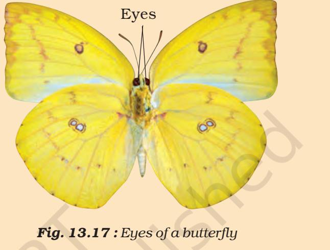

lamp or a laser torch can injure the retina.

- l Do not look at the Sun or a powerful light directly.
- l Never rub your eyes. If particles of dust go into your eyes, wash your eyes with clean water. If there is no improvement go to a doctor.
- l Always read at the normal distance for vision. Do not read by bringing the book too close to your eyes or keeping it too far.

You learnt about balanced diet in Class VI. If food is deficient in some components, eyes may also suffer. Lack of vitamin A in foodstuff is responsible for many eye troubles. Most common amongst them is night blindness.

One should, therefore, include in the diet components which have vitamin A. Raw carrots, broccoli and green vegetables (such as spinach) and cod liver oil are rich in vitamin A. Eggs, milk, curd, cheese, butter and fruits such as papaya and mango are also rich in vitamin A.

## 13.9 Visually Impaired Persons Can Read and Write

Some persons, including children, can be visually impaired. They have very limited vision to see things. Some persons cannot see at all since birth. Some persons may lose their eyesight because of a disease or an injury. Such persons try to identify things by touching and listening to voices more carefully. They develop their other senses more sharply. However, additional resources can enable them to develop their capabilities further.

### Non-optical and optical aids for visually impaired

Non-optical aids include visual aids, tactual aids (using the sense of touch), auditory aids (using the sense of hearing) and electronic aids. Visual aids, can magnify words, can provide suitable intensity of light and material at proper distances. Tactual aids, including Braille writer slate and stylus, help the visually challenged persons in taking notes, reading and writing. Auditory aids include cassettes, tape recorders, talking books and other such devices. Electronic aids, such as talking calculators and computers, are also available for performing many computational tasks. Closed circuit television, also an electronic aid, enlarges printed material with suitable contrast and illumination. Nowadays, use of audio CDs and voice boxes with computers are also very helpful for listening to and writing the desired text.

Optical aids include bifocal lenses, contact lenses, tinted lenses, magnifiers and telescopic aids. While the lens combinations are used to rectify visual limitations, telescopic aids are available to view chalkboard and class demonstrations.

# 13.10 What is the Braille System?

The most popular resource for visually challenged persons is Braille.

> Louis Braille, himself a visually challenged person, developed a system for visually challenged persons and published it in 1821.

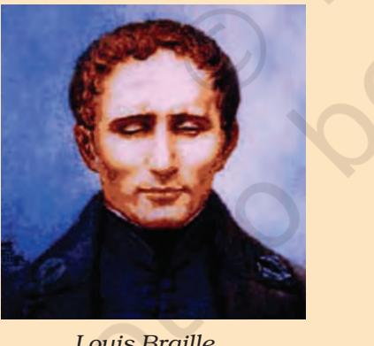

*Louis Braille*

The present system was adopted in 1932. There is Braille code for common languages, mathematics and scientific notation. Many Indian languages can be read using the Braille system.

Braille system has 63 dot patterns or characters. Each character represents a letter, a combination of letters, a common word or a grammatical sign. Dots are arranged in cells of two vertical rows of three dots each.

Patterns of dots to represent some English letters and some common words are shown below.

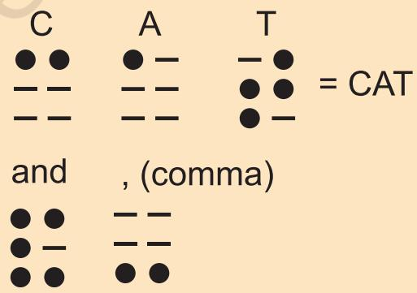

*Fig. 13.18 : Example of dot patterns used in Braille System*

These patterns when embossed on Braille sheets help visually challenged persons to recognise words by touching. To make them easier to touch, the dots are raised slightly.

Visually impaired people learn the Braille system by beginning with letters, then special characters and letter combinations. Methods depend upon recognition by touching. Each character has to be memorised. Braille texts can be produced by hand or by machine. Typewriter-like devices and printing machines have now been developed.

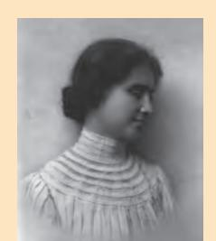

*Helen A. Keller*

Some visually impaired Indians have great achievements to their credit. Diwakar, a child prodigy has given amazing performances as a singer.

Ravindra Jain, born completely visually impaired, obtained his Sangeet Prabhakar degree from Allahabad. He had shown his excellence as a lyricist, singer and music composer.

Lal Advani, himself visually impaired, established an Association for special education and rehabilitation of disabled in India. Besides this, he represented India on Braille problems in UNESCO.

Helen A. Keller, an American author and lecturer, is perhaps the most wellknown and inspiring visually challenged person. She lost her sight when she was only 18 months old. But because of her resolve and courage she could complete her graduation from a university. She wrote a number of books including *The Story of my Life* (1903).

#### KEYWORDS

ANGLE OF

INCIDENCE ANGLE OF

REFLECTION

BLIND SPOT

BRAILLE

CONES

CORNEA

DIFFUSED OR

IRREGULAR

REFLECTION

INCIDENT RAYS

IRIS

KALEIDOSCOPE

LATERAL INVERSION

LAWS OF

REFLECTION

PUPIL

REFLECTED RAYS

REFLECTION

REGULAR REFLECTION

RETINA

RODS

### WHAT YOU HAVE LEARNT

- ‹ Light is reflected from all surfaces.
- ‹ Regular reflection takes place when light is incident on smooth, polished and regular surfaces.
- ‹ Diffused or irregular reflection takes place from rough surfaces.
- ‹ Two laws of reflection are
	- (i) The angle of incidence is equal to the angle of reflection.
	- (ii) Incident ray, reflected ray and the normal drawn at the point of incidence to the reflecting surface, lie in the same plane.
- ‹ Image formed in a plane mirror undergoes lateral inversion.
- ‹ Two mirrors inclined to each other give multiple images.
- ‹ Beautiful patterns are formed in a kaleidoscope because of multiple reflections.
- ‹ Sunlight, called white light, consists of seven colours.
- ‹ Splitting of light into its constituent colours is known as dispersion.
- ‹ Parts of the eye are cornea, iris, pupil, lens, retina and optic nerve.
- ‹ A normal eye can see nearby and distant objects clearly.
- ‹ Visually impaired persons can read and write using the Braille system.
- ‹ Visually impaired persons develop their other senses more sharply to improve their interaction with their environment.

## Exercises

- 1. Suppose you are in a dark room. Can you see objects in the room? Can you see objects outside the room. Explain.
- 2. Differentiate between regular and diffused reflection. Does diffused reflection mean the failure of the laws of reflection?
- 3. Mention against each of the following whether regular or diffused reflection will take place when a beam of light strikes. Justify your answer in each case.
	- (a) Polished wooden table (b) Chalk powder
	-
- 
- (c) Cardboard surface (d) Marble floor with water spread over it
- 
- (e) Mirror (f) Piece of paper
- 4. State the laws of reflection.

____________.

- 5. Describe an activity to show that the incident ray, the reflected ray and the normal at the point of incidence lie in the same plane.
- 6. Fill in the blanks in the following.
	- (a) A person 1 m in front of a plane mirror seems to be _______________ m away from his image.
	- (b) If you touch your ____________ ear with right hand in front of a plane mirror it will be seen in the mirror that your right ear is touched with
	- (c) The size of the pupil becomes ____________ when you see in dim light.
	- (d) Night birds have ____________ cones than rods in their eyes.

*Choose the correct option in Questions 7 – 8*

- 7. Angle of incidence is equal to the angle of reflection.

| (a) Always | (b) Sometimes |
| --- | --- |
| (c) Under special conditions | (d) Never |

- 8. Image formed by a plane mirror is
	- (a) virtual, behind the mirror and enlarged.
	- (b) virtual, behind the mirror and of the same size as the object.
	- (c) real at the surface of the mirror and enlarged.

(d) real, behind the mirror and of the same size as the object.

- 9. Describe the construction of a kaleidoscope.
- 10. Draw a labelled sketch of the human eye.
- 11. Gurmit wanted to perform Activity 13.8 using a laser torch. Her teacher advised her not to do so. Can you explain the basis of the teacher's advise?
- 12. Explain how you can take care of your eyes.
- 13. What is the angle of incidence of a ray if the reflected ray is at an angle of 90° to the incident ray?
- 14. How many images of a candle will be formed if it is placed between two parallel plane mirrors separated by 40 cm?
- 15. Two mirrors meet at right angles. A ray of light is incident on one at an angle of 30° as shown in Fig. 13.19. Draw the reflected ray from the second mirror.

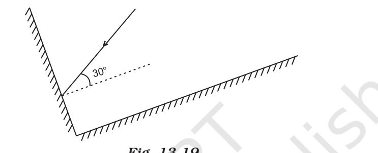

- 16. Boojho stands at A just on the side of a plane mirror as shown in Fig. 13.20. Can he see himself in the mirror? Also can he see the image of objects situated at P, Q and R?
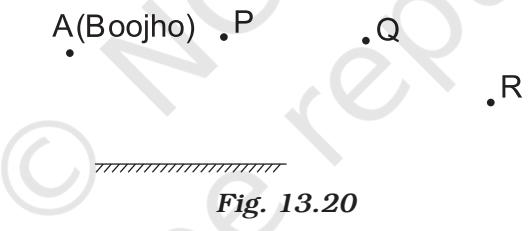

- 17. (a) Find out the position of the image of an object situated at A in the plane mirror (Fig. 13.21).
	- (b) Can Paheli at B see this image?
	- (c) Can Boojho at C see this image?
	- (d) When Paheli moves from B to C, where does the image of A move?

## Extended Learning — Activities and Project

- 1. Make your own mirror. Take a glass strip or glass slab. Clean it and put it on a white sheet of paper. See yourself in the glass. Next put the glass slab on a black sheet of paper. Again look into the glass. In which case do you see yourself better and why?
- 2. Make friends with some visually impaired students. Enquire from them how they read and write. Also find out how they are able to recognise objects, hurdles and currency notes.
- 3. Meet an eye specialist. Get your eye sight checked and discuss how to take care of your eyes.
- 4. Survey your neighbourhood. Find out how many children below the age of 12 years use spectacles. Find out from their parents what, in their view, could be the reason for the weak eyesight of their children.

## Did You Know?

Eyes can be donated by any person as an invaluable gift to visually impaired persons suffering from corneal blindness, The person may be

- (a) a male or female.
- (b) of any age.
- (c) of any social status.
- (d) using spectacles.
- (e) suffering from any normal disease but not AIDS, Hepatitis B or C, rabies, leukemia, lymphoma, tetanus, cholera, encephalitis.

The eyes have to be donated within 4-6 hours after death at any place, home or hospital.

A person who wants to donate the eyes may pledge eyes during his/her lifetime to any registered eye bank. He/she should also inform his/her relatives about this pledge so that they can take necessary action after his/her death.

You can also donate a Braille kit.

