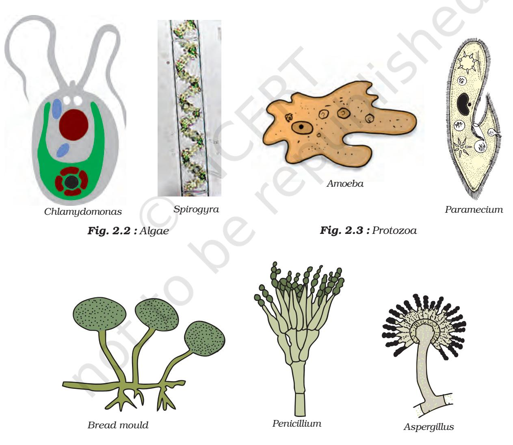
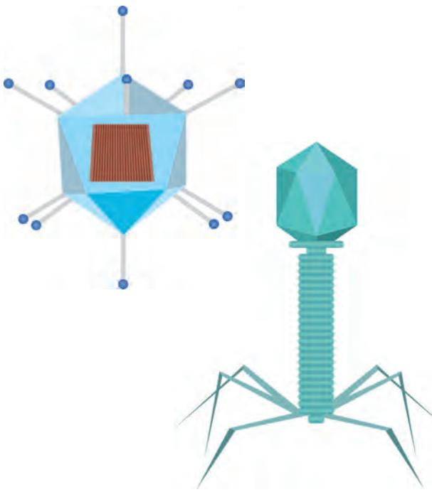
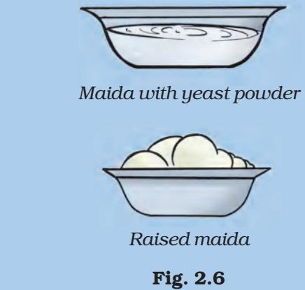
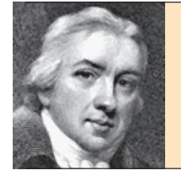
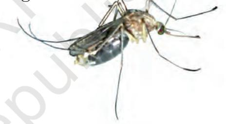
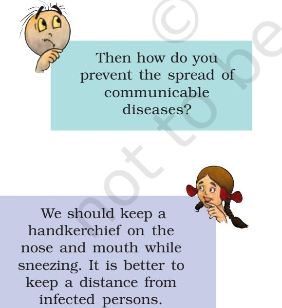
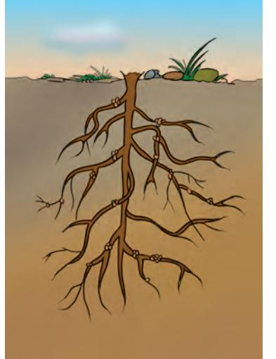
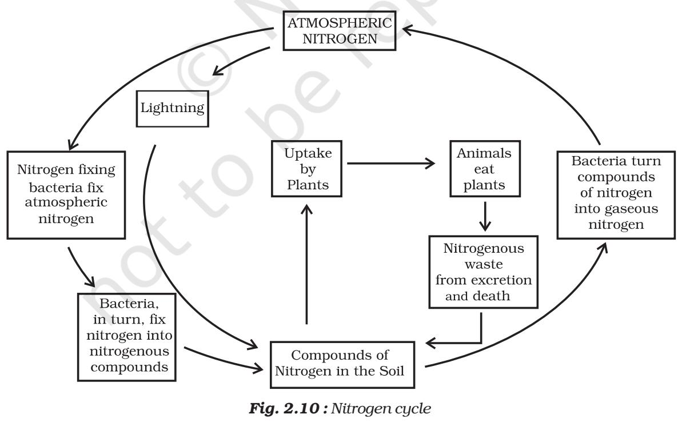
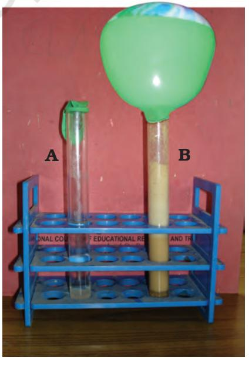

Y ou have seen several kinds of plants and animals. However, there are other living organisms around us which we normally cannot see. These are called microorganisms or microbes. For example, you might have observed that during the rainy season moist bread gets spoilt and its surface gets covered with greyish white patches. Observe these patches through a magnifying glass. You will see tiny, black rounded structures. Do you know what these structures are and where do these come from?

## 2.1 Microorganisms

### Activity 2.1

Collect some moist soil from the field in a beaker and add water to it. After the soil particles have settled down, observe a drop of water from the beaker under a microscope. What do you see ?

## Activity 2.2

Take a few drops of water from a pond. Spread on a glass slide and observe through a microscope.

Do you find tiny organisms moving around?

These observations show that water and soil are full of tiny organisms, though not all of them fall into the category of microbes. These microorganisms or microbes are so small in size that they cannot be seen with the unaided eye. Some of these, such as the fungus that grows on bread, can be seen with a magnifying glass. Others cannot be seen without the help of a microscope. That is why these are called microorganisms or microbes.

Microorganisms are classified into four major groups. These groups are bacteria, fungi, protozoa and some algae. Some of these common microorganisms are shown in Figs. 2.1 - 2.4.

Viruses are also microscopic but are different from other microorganisms. They, however, reproduce only inside the cells of the host organism, which may be a bacterium, plant or animal. Some of the viruses are shown in Fig. 2.5. Common ailments like cold, influenza (flu) and most coughs are caused by viruses. Serious diseases like polio and chicken pox are also caused by viruses.

Diseases like dysentery and malaria are caused by protozoa(protozoans) whereas typhoid and tuberculosis (TB) are bacterial diseases.

You have learnt about some of these microorganisms in Classes VI and VII.

*Fig. 2.1: Bacteria*

*Fig. 2.4 : Fungi*

*Fig. 2.5 : Viruses*

# 2.2 Where do Microorganisms Live?

Microorganisms may be single-celled like bacteria, some algae and protozoa, or multicellular, such as many algae and fungi. They live in all types of environment, ranging from ice cold climate to hot springs; and deserts to marshy lands. They are also found inside the bodies of animals including humans. Some microorganisms grow on other organisms while others exist freely.

## 2.3 Microorganisms and Us

Microorganisms play an important role in our lives. Some of them are beneficial in many ways whereas some others are harmful and cause diseases. Let us study about them in detail.

Friendly Microorganisms

Microorganisms are used for various purposes. They are used in the preparation of curd, bread and cake.

Microorganisms have been used for the production of alcohol since ages.

They are also used in cleaning up of the environment. For example, the organic wastes (vegetable peels, remains of animals, faeces, etc.) are broken down into harmless and usable substances by bacteria. Recall that bacteria are also used in the preparation of medicines. In agriculture they are used to increase soil fertility by fixing nitrogen.

## Making of Curd and Bread

You have learnt in Class VII that milk is turned into curd by bacteria.

Curd contains several microorganisms. Of these, the bacterium*, Lactobacillus* promotes the formation of curd. It multiplies in milk and converts it into curd. Bacteria are also involved in the making of cheese, pickles and many other food items. An important ingredient of *rava* (*sooji* ) *idlis* and *bhaturas* is curd. Can you guess why? Bacteria and yeast are also helpful for fermentation of rice idlis and dosa batter.

MICROORGANISMS : FRIEND AND FOE 19

# Activity 2.3

Take ½ kg flour (*atta* or *maida*), add some sugar and mix with warm water. Add a small amount of yeast powder and knead to make a soft dough. What do you observe after two hours? Did you find the dough rising?

Yeast reproduces rapidly and produces carbon dioxide during respiration. Bubbles of the gas fill the dough and increase its volume (Fig. 2.6). This is the basis of the use of yeast in the baking industry for making breads, pastries and cakes.

### Commercial Use of Microorganisms

Microorganisms are used for the large scale production of alcohol, wine and acetic acid (vinegar). Yeast is used for commercial production of alcohol and wine. For this purpose yeast is grown on natural sugars present in grains like barley, wheat, rice, crushed fruit juices, etc.

# Activity 2.4

Take a 500 mL beaker filled upto ¾ with water. Dissolve 2-3 teaspoons of sugar in it. Add half a spoon of yeast powder to the sugar solution. Keep it covered in a warm place for 4-5 hours. Now smell the solution. Can you get a smell?

This is the smell of alcohol as sugar has been converted into alcohol by yeast. This process of conversion of sugar into alcohol is known as fermentation.

## Medicinal Use of Microorganisms

Whenever you fall ill the doctor may give you some antibiotic tablets, capsules or injections such as of penicillin. The source of these medicines is microorganisms. These medicines kill or stop the growth of the disease-causing microorganisms. Such medicines are called antibiotics. These days a number of antibiotics are being produced from bacteria and fungi. Streptomycin, tetracycline and erythromycin are some of the

In 1929, Alexander Fleming was working on a culture of diseasecausing bacteria. Suddenly he found the

spores of a little green mould in one of his culture plates. He observed that the presence of mould prevented the growth of bacteria. In fact, it also killed many of these bacteria. From this the mould penicillin was prepared.

commonly known antibiotics which are made from fungi and bacteria. The antibiotics are manufactured by growing specific microorganisms and are used to cure a variety of diseases.

Antibiotics are even mixed with the feed of livestock and poultry to check microbial infection in animals. They are also used to control many plant diseases.

> It is important to remember that antibiotics should be taken only on the advice of a qualified doctor. Also you must complete the course prescribed by the doctor. If you take antibiotics when not needed or in wrong doses, it may make the drug less effective when you might need it in future. Also antibiotics taken unnecessarily may kill the beneficial bacteria in the body. Antibiotics, however, are not effective against cold and flu as these are caused by viruses.

#### Vaccine

When a disease-carrying microbe enters our body, the body produces antibodies to fight the invader. The body also remembers how to fight the microbe if it enters again. If dead or weakened microbes are introduced into a healthy body, the body fights and kills the invading bacteria by producing suitable antibodies. The antibodies remain in the body and we are protected

given vaccination?

from the disease-causing microbes for ever. This is how a vaccine works. Several diseases, including cholera, tuberculosis, smallpox and hepatitis can be prevented by vaccination.

Edward Jenner discovered the vaccine for smallpox in 1798.

In your childhood, you must have been given injections to protect yourself against several diseases. Can you prepare a list of these diseases? You may take help from your parents.

It is essential to protect all children against these diseases. Necessary vaccines are available in the nearby hospitals. You might have seen the advertisement on TV and newspapers regarding protection of children against polio under the Pulse Polio Programme. Polio drops given to children are actually a vaccine.

A worldwide campaign against smallpox has finally led to its eradication from most parts of the world.

These days vaccines are made on a large scale from microorganisms to protect humans and other animals from several diseases.

#### Increasing Soil Fertility

Some bacteria (Fig. 2.7) are able to fix nitrogen from the atmosphere to enrich soil with nitrogen and increase its fertility. These microbes are commonly called biological nitrogen fixers.

MICROORGANISMS : FRIEND AND FOE 21

*Fig. 2.7 : The Nitrogen fixing cyanobacteria (blue green algae)*

### Cleaning the Environment

Boojho and Paheli had observed the school gardener making manure. Along with their friends, they collected wastes of plants, vegetables and fruits from nearby houses and gardens. They put them in a pit meant for waste disposal. After some time, it decomposed and got converted to manure. Boojho and Paheli wanted to know how this had happened.

## Activity 2.5

Take two pots and fill each pot half with soil. Mark them A and B. Put plant waste in pot A and things like polythene bags, empty glass bottles and broken plastic toys in pot B. Put the pots aside. Observe them after 3-4 weeks.

Do you find any difference in the contents of the two pots? If so, what is the difference? You will find that plant waste in pot A, has been decomposed. How did this happen? The plant waste has been converted into manure by the action of microbes. The nutrients released in the process can be used by the plants again.

Did you notice that in pot B, the polythene bags, empty glasses, bottles and broken toy parts did not undergo any such change? The microbes could not 'act' on them and convert them into manure.

You often see large amounts of dead organic matter in the form of decaying plants and sometimes dead animals on the ground. You find that they disappear after some time. This is because the microorganisms decompose dead organic waste of plants and animals converting them into simple substances. These substances are again used by other plants and animals. Thus, microorganisms can be used to degrade the harmful and smelly substances and thereby clean up the environment.

## 2.4 Harmful Microorganisms

Microorganisms are harmful in many ways. Some of the microorganisms cause diseases in human beings, plants and animals. Such disease-causing microorganisms are called pathogens. Some microorganisms spoil food, clothing and leather. Let us study more about their harmful activities.

### Disease causing Microorganisms in Humans

Pathogens enter our body through the air we breathe, the water we drink or the food we eat. They can also get transmitted by direct contact with an infected person or carried by an animal. Microbial diseases that can spread from an infected person to a healthy person through air, water, food or physical contact are called communicable diseases. Examples of such diseases include cholera, common cold, chicken pox and tuberculosis.

When a person suffering from common cold sneezes, fine droplets of moisture carrying thousands of viruses are spread in the air. The virus may enter the body of a healthy person while breathing and cause infection.

There are some insects and animals which act as carriers of diseasecausing microbes. Housefly is one such carrier. The flies sit on the garbage and animal excreta. Pathogens stick to their bodies. When these flies sit on uncovered food they may transfer the pathogens. Whoever eats the contaminated food is likely to get sick. So, it is advisable to always keep food covered. Avoid consuming uncovered items of food. Another example of a carrier is the female *Anopheles* mosquito (Fig. 2.8), which carries the parasite of malaria (Plasmodium). Female *Aedes* mosquito acts as carrier of dengue virus. How can we control the spread of malaria or dengue?

*Fig. 2.8 : Female Anopheles mosquito*

MICROORGANISMS : FRIEND AND FOE 23

Why does the teacher keep telling us not to let water collect anywhere in the neighbourhood?

All mosquitoes breed in water. Hence, one should not let water collect anywhere, in coolers, tyres, flower pot, etc. By keeping the surroundings clean and dry we can prevent mosquitoes from breeding. Try to make a list of measures which help to avoid the spread of malaria.

| Human Disease | Causative | Mode of | Preventive Measures |
| --- | --- | --- | --- |
|  | Microorganism | Transmission | (General) |
| Tuberculosis | Bacteria | Air | Keep the patient in complete |
| Measles | Virus | Air | isolation. Keep the personal |
|  |  |  | belongings of the patient away |
| Chicken Pox | Virus | Air/Contact | from those of the others. |
|  |  |  | Vaccination to be given at |
| Polio | Virus | Air/Water | suitable age. |
| Cholera | Bacteria | Water/Food | Maintain personal hygiene |
|  |  |  | and good sanitary habits. |
| Typhoid | Bacteria | Water | Consume properly cooked food and boiled drinking water. |
|  |  |  | Vaccination. |
| Hepatitis A | Virus | Water | Drink boiled drinking water. |
|  |  |  | Vaccination. |
| Malaria | Protozoa | Mosquito | Use mosquito net and |
|  |  |  | repellents. Spray insecticides |
|  |  |  | and control breeding of |
|  |  |  | mosquitoes by not allowing |
|  |  |  | water to collect in the |
|  |  |  | surroundings. |

Table 2.1: Some Common Human Diseases caused by Microorganisms

Some of the common diseases affecting humans, their mode of transmission and few general methods of prevention are shown in Table 2.1.

### Disease causing Microorganisms in Animals

Several microorganisms not only cause diseases in humans and plants, but also

Robert Köch (1876) discovered the bacterium (*Bacillus anthracis*) which causes anthrax disease.

in other animals. For example, anthrax is a dangerous human and cattle disease caused by a bacterium. Foot and mouth disease of cattle is caused by a virus.

### Disease causing Microorganisms in Plants

Several microorganisms cause diseases in plants like wheat, rice, potato, sugarcane, orange, apple and others. The diseases reduce the yield of crops. See Table 2.2 for some such plant diseases. They can be controlled by the

| Plant | Micro- | Mode of |
| --- | --- | --- |
| Diseases | organism | Transmission |
| Citrus | Bacteria | Air |
| canker |  |  |
| Rust of | Fungi | Air, |
| wheat |  | seeds |
| Yellow vein | Virus | Insect |
| mosaic of |  |  |
| bhindi (Okra) |  |  |

Table 2.2: Some Common Plant Diseases caused by Microorganisms

use of certain chemicals which kill the microbes.

### Food Poisoning

Boojho was invited by his friend to a party and he ate a variety of foodstuff. On reaching home he started vomiting and had to be taken to a hospital. The doctor said that this condition could be due to food poisoning.

Food poisoning could be due to the consumption of food spoilt by some microorganisms. Microorganisms that grow on our food sometimes produce toxic substances. These make the food poisonous causing serious illness and even death. So, it is very important that we preserve food to prevent it from being spoilt.

## 2.5 Food Preservation

In Chapter 1, we have learnt about the methods used to preserve and store food grains. How do we preserve cooked food at home? You know that bread left unused under moist conditions is attacked by fungus. Microorganisms spoil our food. Spoiled food emits bad smell and has a bad taste and changed colour. Is spoiling of food a chemical reaction?

Paheli bought some mangoes but she could not eat them for a few days. Later she found that they were spoilt and rotten. But she knows that the mango pickle her grandmother makes does not spoil for a long time. She is confused.

MICROORGANISMS : FRIEND AND FOE 25

Let us study the common methods of preserving food in our homes. We have to save it from the attack of microorganisms.

## Chemical Method

Salts and edible oils are the common chemicals generally used to check the growth of microorganisms. Therefore they are called preservatives. We add salt or acid preservatives to pickles to prevent the attack of microbes. Sodium benzoate and sodium metabisulphite are common preservatives. These are also used in jams and squashes to check their spoilage.

### Preservation by Common Salt

Common salt has been used to preserve meat and fish for ages. Meat and fish are covered with dry salt to check the growth of bacteria. Salting is also used to preserve *amla*, raw mangoes, tamarind, etc.

### Preservation by Sugar

Jams, jellies and squashes are preserved by sugar. Sugar reduces the moisture content which inhibits the growth of bacteria which spoil food.

## Preservation by Oil and Vinegar

Use of oil and vinegar prevents spoilage of pickles because bacteria cannot live in such an environment. Vegetables, fruits, fish and meat are often preserved by this method.

### Heat and Cold Treatments

You must have observed your mother boiling milk before it is stored or used. Boiling kills many microorganisms. Similarly, we keep our food in the refrigerator. Low temperature inhibits the growth of microbes.

Why does the milk that comes in packets not spoil? My mother told me that the milk is 'pasteurised'. What is pasteurisation?

Pasteurised milk can be consumed without boiling as it is free from harmful microbes. The milk is heated to about 700C for 15 to 30 seconds and then suddenly chilled and stored. By doing so, it prevents the growth of microbes. This process was discovered by Louis Pasteur. It is called pasteurisation.

## Storage and Packing

These days dry fruits and even vegetables are sold in sealed air tight packets to prevent the attack of microbes.

## 2.6 Nitrogen Fixation

You have learnt about the bacterium *Rhizobium* in Classes VI and VII. It is involved in the fixation of nitrogen in leguminous plants (pulses). Recall that *Rhizobium* lives in the root nodules of leguminous plants (Fig. 2.9), such as beans and peas, with which it has a symbiotic relationship. Sometimes nitrogen gets fixed through the action of lightning. But you know that the amount of nitrogen in the atmosphere remains constant. You may wonder how? Let us understand this in the next section.

26 SCIENCE

*Fig. 2.9 : Roots of a leguminous plant with root nodules*

## 2.7 Nitrogen cycle

Our atmosphere has 78% nitrogen gas. Nitrogen is one of the essential constituents of all living organisms as part of proteins, chlorophyll, nucleic acids and vitamins. The atmospheric nitrogen cannot be taken directly by plants and animals. Certain bacteria and blue green algae present in the soil fix nitrogen from the atmosphere and convert it into compounds of nitrogen. Once nitrogen is converted into these usable compounds, it can be utilised by plants from the soil through their root system. Nitrogen is then used for the synthesis of plant proteins and other compounds. Animals feeding on plants get these proteins and other nitrogen compounds (Fig. 2.10).

When plants and animals die, bacteria and fungi present in the soil convert the nitrogenous wastes into nitrogenous compounds to be used by plants again. Certain other bacteria convert some part of them to nitrogen gas which goes back into the atmosphere. As a result, the percentage of nitrogen in the atmosphere remains more or less constant.

MICROORGANISMS : FRIEND AND FOE 27

#### KEYWORDS

ALGAE

ANTIBIOTICS

ANTIBODIES

BACTERIA

CARRIER

COMMUNICABLE DISEASES

FERMENTATION

FUNGI

*LACTOBACILLUS*

MICROORGANISM

NITROGEN CYCLE

NITROGEN FIXATION PASTEURISATION

PATHOGEN

PRESERVATION

PROTOZOA

*RHIZOBIUM*

VACCINE

VIRUS

YEAST

#### WHAT YOU HAVE LEARNT

- Ü Microorganisms are too small and are not visible to the unaided eye.
- Ü They can live in all kinds of environment, ranging from ice cold climate to hot springs and deserts to marshy lands.
- Ü Microorganisms are found in air, water and in the bodies of plants and animals.
- Ü They may be unicellular or multicellular.
- Ü Microorganisms include bacteria, fungi, protozoa and some algae. Viruses, though different from the above mentioned living organisms, are considered microbes.
- Ü Viruses are quite different from other microorganisms. They reproduce only inside the host organism: bacterium, plant or animal cell.
- Ü Some microorganisms are useful for commercial production of medicines and alcohol.
- Ü Some microorganisms decompose the organic waste and dead plants and animals into simple substances and clean up the environment.
- Ü Protozoans cause serious diseases like dysentery and malaria.
- Ü Some of the microorganisms grow on our food and cause food poisoning.
- Ü Some microorganisms reside in the root nodules of leguminous plants. They can fix nitrogen from air into soil and increase the soil fertility.
- Ü Some bacteria present in the soil fix nitrogen from the atmosphere and convert into nitrogenous compounds.
- Ü Certain bacteria convert compounds of nitrogen present in the soil into nitrogen gas which is released to the atmosphere.

## Exercises

| 1. | Fill in the blanks. |
| --- | --- |
| (a) | Microorganisms can be seen with the help of a ____________. |
| (b) | Blue green algae fix __________ directly from air and enhance fertility of soil. |
| (c) | Alcohol is produced with the help of __________. |
| (d) | Cholera is caused by __________. |
| 2. | Tick the correct answer. |
| (a) | Yeast is used in the production of |
|  | (i) sugar (ii) alcohol (iii) hydrochloric acid (iv) oxygen |
| (b) | The following is an antibiotic |
|  | (i) Sodium bicarbonate (ii) Streptomycin (iii) Alcohol (iv) Yeast |
| (c) | Carrier of malaria-causing protozoan is |
|  | (i) female Anopheles mosquito (ii) cockroach |
|  | (iii) housefly (iv) butterfly |
| (d) | The most common carrier of communicable diseases is |
|  | (i) ant (ii) housefly (iii) dragonfly (iv) spider |
| (e) | The bread or idli dough rises because of |
|  | (i) heat (ii) grinding (iii) growth of yeast cells (iv) kneading |
| (f) | The process of conversion of sugar into alcohol is called |
|  | (i) nitrogen fixation (ii) moulding (iii) fermentation (iv) infection |
| 3. | Match the organisms in Column A with their action in |
|  | Column B. |
|  | A B |
|  | (i) Bacteria (a) Fixing nitrogen |
|  | (ii) Rhizobium (b) Setting of curd |
|  | (iii) Lactobacillus (c) Baking of bread |
|  | (iv) Yeast (d) Causing malaria |
|  | (v) A protozoan (e) Causing cholera |
|  | (vi) A virus (f) Causing AIDS |
|  | (g) Producing antibodies |
| 4. | Can microorganisms be seen with the naked eye? If not, how can they be |

MICROORGANISMS : FRIEND AND FOE 29

seen?

- 5. What are the major groups of microorganisms?
- 6. Name the microorganisms which can fix atmospheric nitrogen in the soil.
- 7. Write 10 lines on the usefulness of microorganisms in our lives.
- 8. Write a short paragraph on the harmful effects of microorganisms.
- 9. What are antibiotics? What precautions must be taken while taking antibiotics?

### Extended Learning — Activities and Projects

- 1. Pull out a gram or bean plant from the field. Observe its roots. You will find round structures called root nodules on the roots. Draw a diagram of the root and show the root nodules.
- 2. Collect the labels from the bottles of jams and jellies. Write down the list of contents printed on the labels.
- 3. Visit a doctor. Find out why antibiotics should not be overused. Prepare a short report.
- 4. Project : Requirements 2 test tubes, marker pen, sugar, yeast powder, 2 balloons and lime water.

Take two test tubes and mark them A and B. Clamp these tubes in a stand and fill them with water leaving some space at the top. Put

two spoonfuls of sugar in each of the test tubes. Add a spoonful of yeast in test tube B. Inflate the two balloons incompletely. Now tie the balloons on the mouths of each test tube. Keep them in a warm place, away from sunlight. Watch the setup every day for next 3-4 days. Record your observations and think of an explanation.

 Now take another test tube filled 1/4 with lime water. Remove the balloon from test tube B in such a manner that gas inside the balloon does not escape. Fit the balloon on the test tube and shake well. Observe and explain.

E X E R C I S E S

## Did You Know?

Bacteria have lived on the earth for much longer than human beings. They are such hardy organisms that they can live under extreme conditions. They have been found living in boiling mudpots and extremly cold icy waters. They have been found in lakes of caustic soda and in pools of concentrated sulphuric acid. They can survive at depths of several kilometres. They probably can survive in space, too. A kind of bacterium was recovered from a camera which stood on the moon for two years.There is probably no environment in which bacteria cannot survive.

