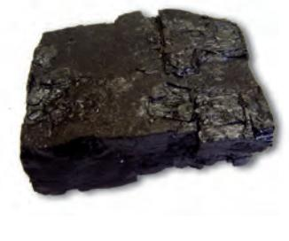
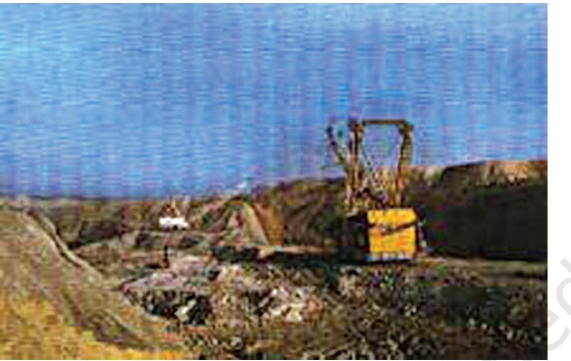
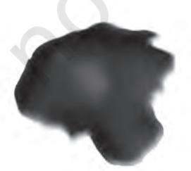
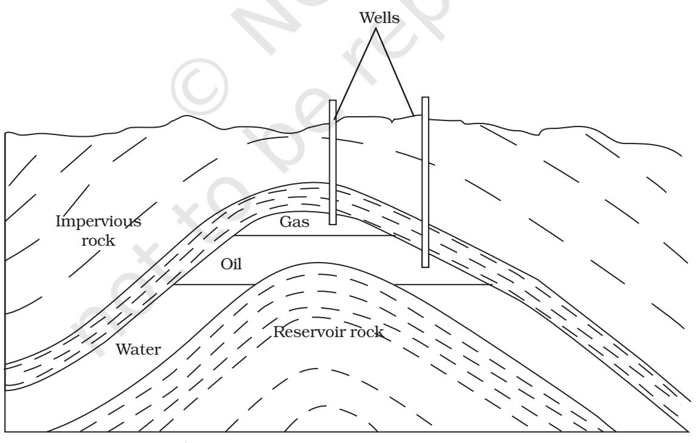
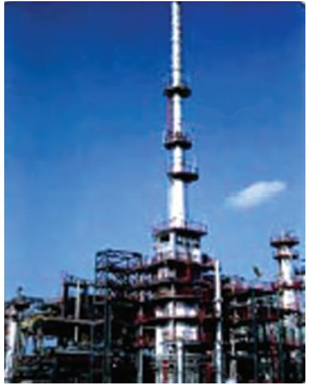
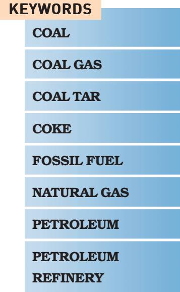

W e use various materials for our basic needs. Some of them are found in nature and some have been made by human efforts.

# Activity 3.1

Make a list of various materials used by us in daily life and classify them as natural and man-made.

|
|  |

Does this list include air, water, soil and minerals? Since all these are obtained from nature, they are called natural resources.

> Can we use all our natural resources forever ?

Can air, water and soil be exhausted by human activities? You have already studied about water in Class VII. Is water a limitless resource?

In the light of the availability of various resources in nature, natural resources can be broadly classified into two kinds:

(i) Inexhaustible Natural Resources: These resources are present in unlimited quantity in nature and are not likely to be exhausted by human activities. Examples are: sunlight, air.

(ii) Exhaustible Natural Resources: The amount of these resources in nature is limited. They can be exhausted by human activities. Examples of these resources are forests, wildlife, minerals, coal, petroleum, natural gas etc.

# Activity 3.2

### *(It is a group activity)*

Take some containers. Fill them with popcorn/peanuts/roasted gram/toffees. Divide students into groups of seven each. Further divide each group into three subgroups containing 1, 2 and 4 students. Label them as first, second and third generation respectively. These sub-groups represent the consumers. As population is growing, second and third generations have larger number of consumers.

Put one full container for each group on a table. Ask consumers of the first generation from each group to consume eatables from the container of their group. Now, ask the second generation consumers from each group to do the same. Ask students to observe carefully the availability of eatables in each container. If some thing is left in the containers, ask third generation from each group to consume it. Now, finally observe whether all the consumers of the third generation got the eatables or not. Also observe if anything is still left in any of the containers.

Assume that the eatables in the container represent the total availability of an exhausible natural resource like coal, petroleum or natural gas. Each group may have a different consumption pattern. Are the earlier generations of any group too greedy? It may be that the earlier generations in some groups were concerned about the coming generation(s) and left something for them.

In this chapter we will learn about some exhaustible natural resources like coal, petroleum and natural gas. These were formed from the dead remains of living organisms (fossils). So, these are all known as fossil fuels.

## 3.1 Coal

You may have seen coal or heard about it (Fig. 3.1). It is as hard as stone and is black in colour.

*Fig. 3.1: Coal*

Coal is one of the fuels used to cook food. Earlier, it was used in railway engines to produce steam to run the engine. It is also used in thermal power plants to produce electricity. Coal is also used as a fuel in various industries.

### Story of Coal

Where do we get coal from and how is it formed?

About 300 million years ago the earth had dense forests in low lying wetland areas. Due to natural processes, like flooding, these forests got buried under the soil. As more soil deposited over them, they were compressed. The temperature also rose as they sank deeper and deeper. Under high pressure and high temperature, dead plants got slowly converted to coal. As coal contains mainly carbon, the slow process of conversion of dead vegetation into coal is called carbonisation. Since it was formed from the remains of vegetation, coal is also called a fossil fuel. A coal mine is shown in Fig. 3.2.

*Fig. 3.2: A coal mine*

When heated in air, coal burns and produces mainly carbon dioxide gas.

Coal is processed in industry to get some useful products such as coke, coal tar and coal gas.

#### Coke

It is a tough, porous and black substance. It is an almost pure form of carbon. Coke is used in the manufacture of steel and in the extraction of many metals.

#### Coal Tar

It is a black, thick liquid (Fig. 3.3) with an unpleasant smell. It is a mixture of

*Fig. 3.3: Coal tar*

about 200 substances. Products obtained from coal tar are used as starting materials for manufacturing various substances used in everyday life and in industry, like synthetic dyes, drugs, explosives, perfumes, plastics, paints, photographic materials, roofing materials, etc. Interestingly, naphthalene balls used to repel moths and other insects are also obtained from coal tar.

> These days, bitumen, a petroleum product, is used in place of coal-tar for metalling the roads.

#### Coal Gas

Coal gas is obtained during the processing of coal to get coke. It is used

Coal gas was used for street lighting for the first time in London in 1810 and in New York around 1820. Now a days, it is used as a source of heat rather than light.

as a fuel in many industries situated near the coal processing plants.

## 3.2 Petroleum

You know that petrol is used as a fuel in light automobiles such as motor cycles/ scooters and cars. Heavy motor vehicles like trucks and tractors run on diesel. Petrol and diesel are obtained from a natural resource called petroleum. The word petroleum is derived from petra (rock) and oleum (oil) as it is mined from between the rocks under Earth as shown in Fig. 3.4.

Do you know how petroleum is formed?

Petroleum was formed from organisms living in the sea. As these organisms died, their bodies settled at the bottom of the sea and got covered with layers of sand and clay. Over millions of years, absence of air, high temperature and high pressure transformed the dead organisms into petroleum and natural gas.

Look at Fig. 3.4. It shows the deposits of petroleum and natural gas. You see that the layer containing petroleum oil and gas is above that of water. Why is it so? Recall that oil and gas are lighter than water and do not mix with it.

The world's first oil well was drilled in Pennsylvania, USA, in 1859. Eight years later, in 1867, oil was struck at Makum in Assam. In India, oil is found in Assam, Gujarat, Mumbai High and in the river basins of Godavari and Krishna.

### Refining of Petroleum

Petroleum is a dark oily liquid. It has an unpleasant odour. It is a mixture of various constituents such as petroleum gas, petrol, diesel, lubricating oil, paraffin wax, etc. The process of

COAL AND PETROLEUM 35

*Fig. 3.5: A petroleum refinery*

separating the various constituents/ fractions of petroleum is known as refining. It is carried out in a petroleum refinery (Fig. 3.5).

Various constituents of petroleum and their uses are given in Table 3.1.

> Many useful substances are obtained from petroleum and natural gas. These are termed as 'Petrochemicals'. These are used in the manufacture of detergents, fibres (polyester, nylon, acrylic etc.), polythene and other man-made plastics. Hydrogen gas obtained from natural gas, is used in the production of fertilisers (urea). Due to its great commercial importance, petroleum is also called 'black gold'.

# 3.3 Natural Gas

Natural gas is a very important fossil fuel because it is easy to transport through pipes. Natural gas is stored under high pressure as compressed natural gas (CNG). CNG is used for power generation. It is now being used

| S.No. | Constituents of Petroleum | Uses |
| --- | --- | --- |
| 1. | Petroleum Gas in Liquid form | Fuel for home and industry |
|  | (LPG) |  |
| 2. | Petrol | Motor fuel, aviation fuel, solvent for |
|  |  | dry cleaning |
| 3. | Kerosene | Fuel for stoves, lamps and for jet aircrafts |
| 4. | Diesel | Fuel for heavy motor vehicles, electric |
|  |  | generators |
| 5. | Lubricating oil | Lubrication |
| 6. | Paraffin wax | Ointments, candles, vaseline etc. |
| 7. | Bitumen | Paints, road surfacing |

| Table 3.1 Various Constituents of Petroleum and their Uses |
| --- |

as a fuel for transport vehicles because it is less polluting. It is a cleaner fuel.

The great advantage of CNG is that it can be used directly for burning in homes and factories where it can be supplied through pipes. Such a network of pipelines exists in Vadodara (Gujarat), some parts of Delhi and other places.

Natural gas is also used as a starting material for the manufacture of a number of chemicals and fertilisers. India has vast reserves of natural gas. In our country, natural gas has been found in Tripura, Rajasthan, Maharashtra and in the Krishna Godavari delta.

> Can coal, petroleum and natural gas be prepared in the laboratory from dead organisms?

No. Their formation is a very slow process and conditions for their formation cannot be created in the laboratory.

## 3.4 Some Natural Resources are Limited

You have studied in the beginning of the chapter that some natural resources are exhaustible like fossil fuels, forests, minerals etc.

You know that coal and petroleum are fossil fuels. It required the dead organisms millions of years to get converted into these fuels. On the other hand, the known reserves of these will last only a few hundred years. Moreover, burning of these fuels is a major cause of air pollution. Their use is also linked to global warming. It is therefore necessary that we use these fuels only when absolutely necessary. This will result in better environment, smaller risk of global warming and their availability for a longer period of time.

In India, the Petroleum Conservation Research Association (PCRA) advises people how to save petrol/diesel while driving. Their tips are

- l drive at a constant and moderate speed as far as possible,
- l switch off the engine at traffic lights or at a place where you have to wait,
- l ensure correct tyre pressure.
- l ensure regular maintenance of the vehicle.

#### WHAT YOU HAVE LEARNT

- ‹ Coal, petroleum and natural gas are fossil fuels.
- ‹ Fossil fuels were formed from the dead remains of living organisms millions of years ago.
- ‹ Fossil fuels are exhaustible resources.
- ‹ Coke, coal tar and coal gas are the products of coal.
- ‹ Petroleum gas, petrol, diesel, kerosene, paraffin wax, lubricating oil are obtained by refining petroleum.
- ‹ Coal and petroleum resources are limited. We should use them judiciously.

## Exercises

- 1. What are the advantages of using CNG and LPG as fuels?
- 2. Name the petroleum product used for surfacing of roads.
- 3. Describe how coal is formed from dead vegetation. What is this process called?
- 4. Fill in the blanks.
	- (a) Fossil fuels are , and .
	- (b) Process of separation of different constituents from petroleum is called .
	- (c) Least polluting fuel for vehicle is .
- 5. Tick True/False against the following statements.
	- (a) Fossil fuels can be made in the laboratory. (T/F)
	- (b) CNG is more polluting fuel than petrol. (T/F)
	- (c) Coke is almost pure form of carbon. (T/F)
	- (d) Coal tar is a mixture of various substances. (T/F)
	- (e) Kerosene is not a fossil fuel. (T/F)
- 6. Explain why fossil fuels are exhaustible natural resources.
- 7. Describe characteristics and uses of coke.
- 8. Explain the process of formation of petroleum.
- 9. The following Table shows the total power shortage in India from 1991–1997. Show the data in the form of a graph. Plot shortage percentage for the years on the Y-axis and the year on the X-axis.

| S. No. | Year | Shortage (%) |
| --- | --- | --- |
| 1 | 1991 | 7.9 |
| 2 | 1992 | 7.8 |
| 3 | 1993 | 8.3 |
| 4 | 1994 | 7.4 |
| 5 | 1995 | 7.1 |
| 6 | 1996 | 9.2 |
| 7 | 1997 | 11.5 |

### Extended Learning — Activities and Projects

- 1. Get an outline map of India. Mark the places in the map where coal, petroleum and natural gas are found. Show the places where petroleum refineries are situated.
- 2. Choose any five families of your neighbourhood. Enquire whether their energy consumption (coal, gas, electricity, petrol, kerosene) has increased or decreased in the last five years. Enquire also about the measures they adopt to conserve energy.
- 3. Find out the location of major thermal power plants in India. What could be the reasons for their being located at those places?

For more information, visit:

- l www.energyarchive.ca.gov
- l web.ccsd.k12.wy.us
- l web.pcra.org

E X E R C I S E S

