COMBUSTION OMBUSTION AND AND FLAME LAME

W e use different kinds of fuel for various purposes at home, in industry and for running automobiles. Can you name a few fuels used in our homes? Name a few fuels used in trade and industry. What fuels are used for running automobiles? Your list will contain fuels like cowdung, wood, coal, charcoal, petrol, diesel, compressed natural gas (CNG), etc.

You are familiar with the burning of a candle. What is the difference between the burning of a candle and the burning of a fuel like coal? May be you were able to guess right: candle burns with a flame whereas coal does not. Similarly, you will find many other materials burning without a flame. Let us study the chemical process of burning and the types of flame produced during this process.

## 4.1 What is Combustion?

Recall the activity of burning of magnesium ribbon performed in Class VII. We learnt that magnesium burns to form magnesium oxide and produces heat and light (Fig. 4.1).

We can perform a similar activity with a piece of charcoal. Hold the piece with a pair of tongs and bring it near the flame of a candle or a Bunsen burner. What do you observe?

We find that charcoal burns in air. We know that coal, too, burns in air producing carbon dioxide, heat and light.

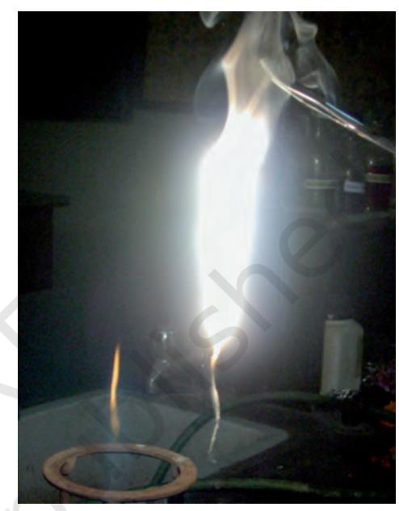

*Fig. 4.1 : Burning of magnesium*

A chemical process in which a substance reacts with oxygen to give off heat is called combustion. The substance that undergoes combustion is said to be combustible. It is also called a fuel. The fuel may be solid, liquid or gas. Sometimes, light is also given off during combustion, either as a flame or as a glow.

In the reactions mentioned above magnesium and charcoal are combustible substances.

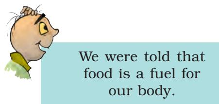

Rightly so. In our body food is broken down by reaction with oxygen and heat is produced. We learnt that in Class VII.

## Activity 4.1

Collect some materials like straw, matchsticks, kerosene oil, paper, iron nails, stone pieces, glass etc. Under the supervision of your teacher try to burn each of these materials one by one. If combustion takes place mark the material combustible, otherwise mark it non-combustible (Table 4.1).

Table 4.1 : Combustible and Noncombustible Substances

| Material | Combustible | Non combustible |
| --- | --- | --- |
| Wood |  |  |
| Paper |  |  |
| Iron nails |  |  |
| Kerosene oil |  |  |
| Stone piece |  |  |
| Straw |  |  |
| Charcoal |  |  |
| Matchsticks |  |  |
| Glass |  |  |

Can you name some more substances which are combustible? You can add those to Table 4.1.

Let us investigate conditions under which combustion takes place.

#### COMBUSTION AND FLAME 41

## Activity 4.2

*(Caution : Be careful while handling burning candle).*

Fix a lighted candle on a table. Put a glass chimney over the candle and rest it on a few wooden blocks in such a way that air can enter the

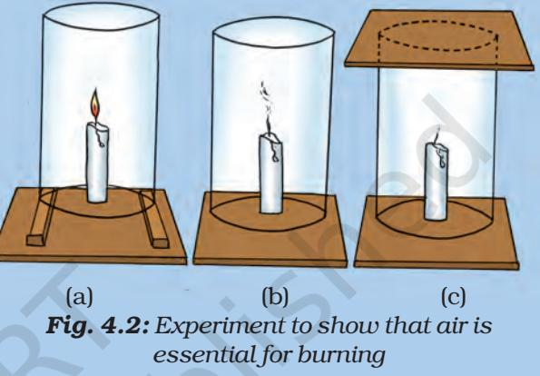

chimney [Fig. 4.2(a)]. Observe what happens to the flame. Now remove the blocks and let the chimney rest on the table [Fig. 4.2(b)]. Again observe the flame. Finally, put a glass plate over the chimney [Fig. 4.2(c)]. Watch the flame again. What happens in the three cases? Does the flame flicker off? Does it flicker and give smoke? Does it burn unaffected? Can you infer anything at all about the role played by air in the process of burning?

We find that for combustion, air is necessary. The candle burns freely in case (a) when air can enter the chimney from below. In case (b), when air does not enter the chimney from below, the flame flickers and produces smoke. In case (c), the flame finally goes off because the air is not available.

We have read that the sun produces its own heat and light. Is it also some kind of combustion?

In the sun, heat and light are produced by nuclear reactions. You will learn about this process in higher classes.

## Activity 4.3

Place a piece of burning wood or charcoal on an iron plate or *Tawa*. Cover it with a glass jar or a tumbler, or a transparent plastic jar. Observe what happens. Does charcoal stop burning after sometime? Can you think of the reason why it stops burning?

You might have heard that when the clothes of a person catch fire, the person is covered with a blanket to extinguish fire (Fig. 4.3). Can you guess why?

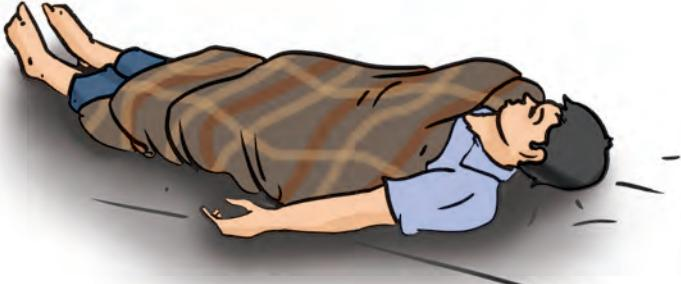

*Fig. 4.3 : Blanket wrapped around a person whose clothes caught fire*

Now recall some of your experiences.

Does a matchstick burn by itself? How does it burn?

You must have had an experience of burning a piece of paper. Does it burn when a burning matchstick is brought near it?

Can you burn a piece of wood by bringing a lighted matchstick near it?

Why do you have to use paper or kerosene oil to start fire in wood or coal? Have you heard of forest fires?

During extreme heat of summer, at some places dry grass catches fire. From the grass, it spreads to trees, and very soon the whole forest is on fire (Fig. 4.4). It is very difficult to control such fires.

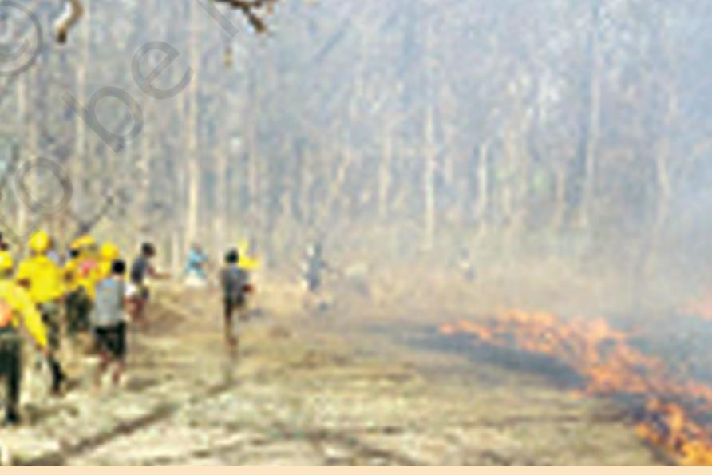

*Fig. 4.4 : Forest fire*

42 SCIENCE

Do these experiences tell you that different substances catch fire at different temperatures?

The lowest temperature at which a substance catches fire is called its ignition temperature.

Can you tell now why a matchstick does not catch fire on its own at room temperature? Why does the matchstick start burning on rubbing it on the side of the matchbox?

The history of the matchstick is very old. More than five thousand years ago small pieces of pinewood dipped in sulphur were used as matches in ancient Egypt. The modern safety match was developed only about two hundred years ago.

A mixture of antimony trisulphide, potassium chlorate and white phosphorus with some glue and starch was applied on the head of a match made of suitable wood. When struck against a rough surface, white phosphorus got ignited due to the heat of friction. This started the combustion of the match. However, white phosphorus proved to be dangerous both for the workers involved in the manufacturing of matches and for the users.

These days the head of the safety match contains only antimony trisulphide and potassium chlorate. The rubbing surface has powdered glass and a little red phosphorus (which is much less dangerous). When the match is struck against the rubbing surface, some red phosphorus gets converted into white phosphorus. This immediately reacts with potassium chlorate in the matchstick head to produce enough heat to ignite antimony trisulphide and start the combustion.

We find that a combustible substance cannot catch fire or burn as long as its temperature is lower than its ignition temperature. Have you ever seen cooking oil catching fire when a frying pan is kept for long on a burning stove? Kerosene oil and wood do not catch fire on their own at room temperature. But, if kerosene oil is heated a little, it will catch fire. But if wood is heated a little, it would still not catch fire. Does it mean that ignition temperature of kerosene oil is lower than that of wood? Does it mean that we need to take special care in storing kerosene oil? The following activity shows that it is essential for a substance to reach ignition temperature to burn.

### Activity 4.4

#### *(Caution : Be careful while handling burning candle).*

Make two paper cups by folding a sheet of paper. Pour about 50 mL of water in one of the cups. Heat both the cups separately with a candle (Fig. 4.5). What do you observe?

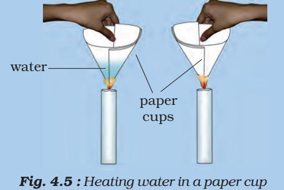

What happens to the empty paper cup? What happens to the paper cup with water? Does water in this cup become hot?

COMBUSTION AND FLAME 43

If we continue heating the cup, we can even boil water in the paper cup.

Can you think of an explanation for this phenomenon?

The heat supplied to the paper cup is transferred to water by conduction. So, in the presence of water, the ignition temperature of paper is not reached. Hence, it does not burn.

The substances which have very low ignition temperature and can easily catch fire with a flame are called

inflammable substances. Examples of inflammable substances are petrol, alcohol, Liquified Petroleum Gas (LPG) etc. Can you list some more inflammable substances?

## 4.2 How Do We Control Fire?

You must have seen or heard of fire breaking out in homes, shops and factories. If you have seen such an accident, write a short description in your note book. Also, share the experience with your classmates.

Find out the telephone number of the fire service in your area. If a fire breaks out in your house or in your neighbourhood, the first thing to do is to call the fire service.

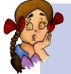

It is important that all of us know the telephone numbers of the fire service.

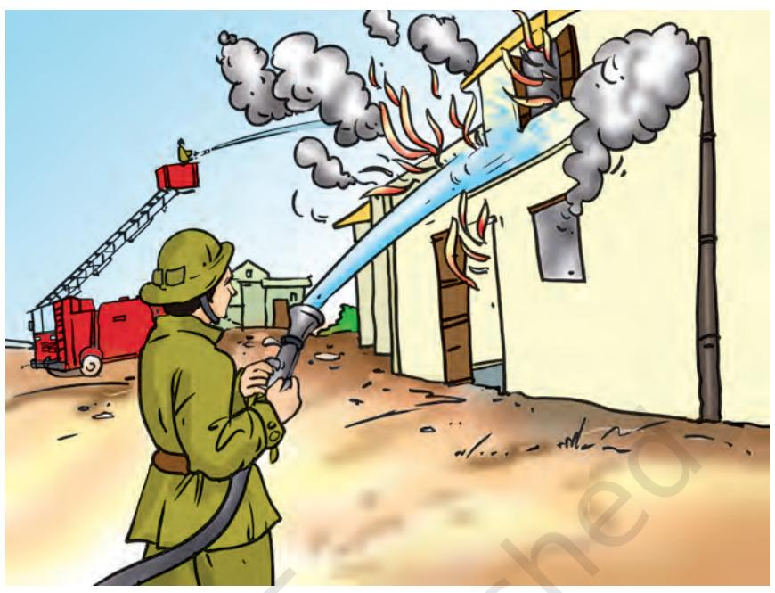

*Fig. 4.6: Firemen extinguish the fire by throwing water under pressure*

Does your city/town have a fire brigade station?

When a fire brigade arrives, what does it do? It pours water on the fire (Fig. 4.6). Water cools the combustible material so that its temperature is brought below its ignition temperature. This prevents the fire from spreading. Water vapours also surround the combustible material, helping in cutting off the supply of air. So, the fire is extinguished.

You have learnt that there are three essential requirements for producing fire. Can you list these requirements?

These are: fuel, air (to supply oxygen) and heat (to raise the temperature of the fuel beyond the ignition temperature). Fire can be controlled by removing one or more of these requirements. The job of a fire extinguisher is to cut off the supply of air, or to bring down the temperature of the fuel, or both. Notice that the fuel

The most common fire extinguisher is water. But water works only when things like wood and paper are on fire. If electrical equipment is on fire, water may conduct electricity and harm those trying to douse the fire. Water is also not suitable for fires involving oil and petrol. Do you recall that water is heavier than oil? So, it sinks below the oil, and oil keeps burning on the top.

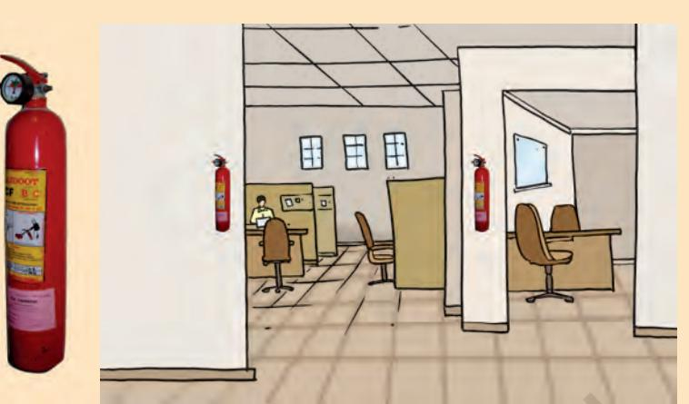

*Fig. 4.7 : Fire extinguisher*

For fires involving electrical equipment and inflammable materials like petrol, carbon dioxide (CO2 ) is the best extinguisher. CO2 , being heavier than oxygen, covers the fire like a blanket. Since the contact between the fuel and oxygen is cut off, the fire is controlled. The added advantage of CO2 is that in most cases it does not harm the electrical equipment.

How do we get the supply of carbon dioxide? It can be stored at high pressure as a liquid in cylinders. In what form is the LPG stored in cylinders? When released from the cylinder, CO2 expands enormously in volume and cools down. So, it not only forms a blanket around the fire, it also brings down the temperature of the fuel. That is why it is an excellent fire extinguisher. Another way to get CO2 is to release a lot of dry powder of chemicals like sodium bicarbonate (baking soda) or potassium bicarbonate. Near the fire, these chemicals give off CO2 .

in most cases cannot be eliminated. If, for instance, a building catches fire, the whole building is the fuel.

#### 4.3 Types of Combustion

Bring a burning matchstick or a gas lighter near a gas stove in the kitchen. Turn on the knob of the gas stove. What do you observe?

> *CAUTION : Do not handle the gas stove yourself. Ask your parents to help.*

We find that the gas burns rapidly and produces heat and light. Such combustion is known as rapid combustion.

There are substances like phosphorus which burn in air at room temperature.

The type of combustion in which a material suddenly bursts into flames, without the application of any apparent cause is called spontaneous combustion.

COMBUSTION AND FLAME 45

Spontaneous combustion of coal dust has resulted in many disastrous fires in coal mines. Spontaneous forest fires are sometimes due to the heat of the sun or due to lightning strike. However, most forest fires are due to the carelessness of human beings. It is important to remember that the campfires must be completely extinguished before leaving a forest after a picnic, or a visit.

We generally have fireworks on festival days. When a cracker is ignited, a sudden reaction takes place with the evolution of heat, light and sound. A large amount of gas formed in the reaction is liberated. Such a reaction is called explosion. Explosion can also take place if pressure is applied on the cracker.

### 4.4 Flame

Observe an LPG flame. Can you tell the colour of the flame. What is the colour of a candle flame?

Recall your experience of burning a magnesium ribbon in Class VII. If you do not have experience of burning the remaining items in Table 4.2 you can do that now.

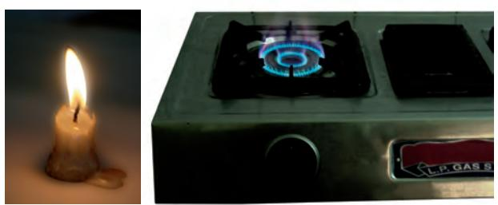

*Fig. 4.8: Colours of a candle flame and the flame of a kitchen stove*

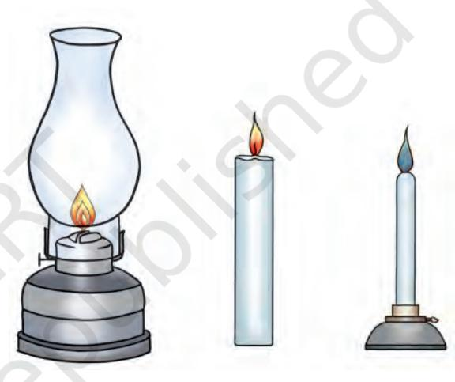

*Fig. 4.9 : Flames of kerosene lamp, candle and Bunsen burner*

 Record your observations and mention whether on burning the material forms a flame or not.

| S.No. | Material | Forms flame | Does not form flame |
| --- | --- | --- | --- |
| 1. | Candle |  |  |
| 2. | Magnesium |  |  |
| 3. | Camphor |  |  |
| 4. | Kerosene Stove |  |  |
| 5. | Charcoal |  |  |

Table 4.2 Materials forming Flame on Burning

### 4.5 Structure of a Flame

#### Activity 4.5

Light a candle *(Caution : Be careful).* Hold a 4-5 cm long thin glass tube with a pair of tongs and introduce its one end in the dark zone of a non-flickering candle flame (Fig. 4.10). Bring a lighted matchstick near the other end of the glass tube. Do you see a flame caught at this end of the glass tube after a while? If so, what is it that produces a flame? Notice that the wax near the heated wick melts quickly.

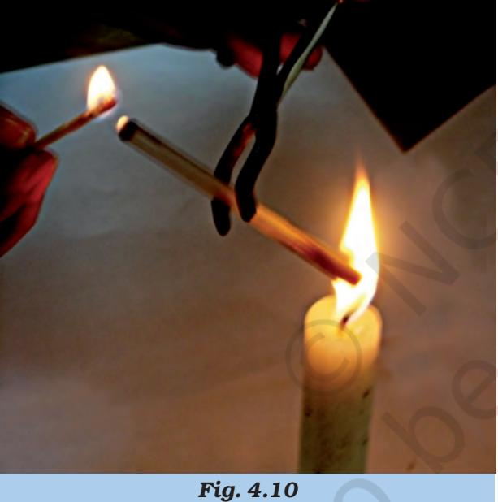

The substances which vapourise during burning, give flames. For example, kerosene oil and molten wax rise through the wick and are vapourised during burning and form flames. Charcoal, on the other hand, does not vapourise and so does not produce a flame. In Activity 4.5, could the vapours of wax coming out of the glass tube be the cause of the flame produced?

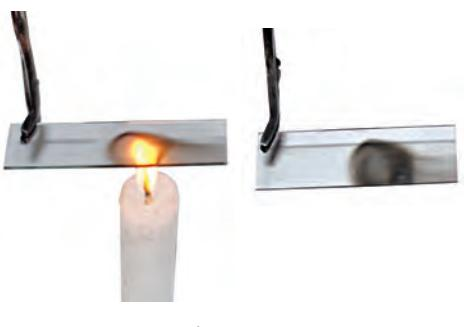

When the candle flame is steady, introduce a clean glass plate/slide into the luminous zone of the flame (Fig. 4.11). Hold it there with a pair of tongs for about 10 seconds. Then remove it. What do you observe?

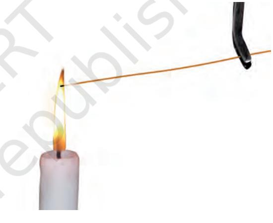

*Fig. 4.12*

A circular blackish ring is formed on the glass plate/slide. It indicates the deposition of unburnt carbon particles present in the luminous zone of the flame.

Hold a thin long copper wire just inside the non-luminous zone of flame for about 30 seconds (Fig. 4.12).

Notice that the portion of the copper wire just outside the flame gets red hot. Does it indicate that the non-luminous zone of the flame has a high

COMBUSTION AND FLAME 47

temperature? In fact, this part of the flame is the hottest part (Fig. 4.13).

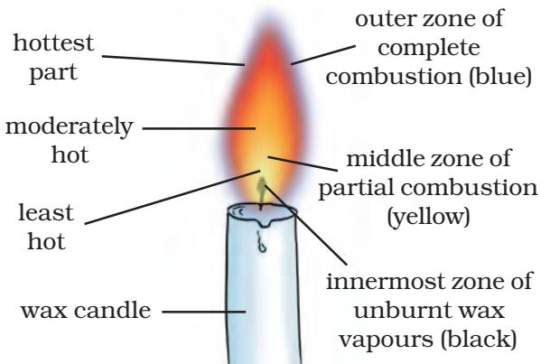

*Fig. 4.13 : Different zones of candle flame*

Goldsmiths blow the outermost zone of a flame with a metallic blow-pipe for melting gold and silver (Fig. 4.14). Why do they use the outermost zone of the flame?

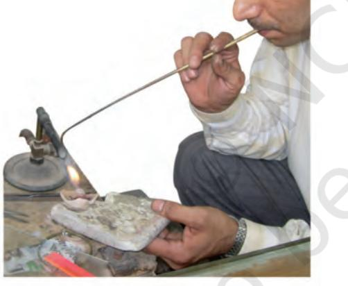

*Fig. 4.14 : Goldsmith blowing through a metallic pipe*

# 4.6 What is a Fuel?

Recall that the sources of heat energy for domestic and industrial purposes are mainly wood, charcoal, petrol, kerosene etc. These substances are called fuels. A good fuel is one which is readily available. It is cheap. It burns easily in air at a moderate rate. It produces a large amount of heat. It does not leave behind any undersirable substances.

There is probably no fuel that could be considered as an ideal fuel. We should look for a fuel which fulfils most of the requirements for a particular use.

Fuels differ in their cost. Some fuels are cheaper than others.

Make a list of fuels familiar to you. Group them as solid, liquid and gaseous fuels as in Table 4.3.

## 4.7 Fuel Efficiency

Suppose you were asked to boil a given quantity of water using cow dung, coal and LPG as fuel. Which fuel would you prefer? Give your reason. You may take the help of your parents. Do these three fuels produce the same amount of heat? The amount of heat energy produced on complete combustion of 1 kg of a fuel is called its calorific value. The calorific value of a fuel is expressed in a unit

#### Table 4.3 : Types of Fuels

| S. No. | Solid Fuels | Liquid Fuels | Gaseous Fuels |
| --- | --- | --- | --- |
| 1. | Coal | Kerosene oil | Natural gas |
| 2. |  |  |  |
| 3. |  |  |  |

48 SCIENCE

called kilojoule per kg (kJ/kg). Calorific values of some fuels are given in Table 4.4.

| Fuel | Calorific Value |
| --- | --- |
|  | (kJ/kg) |
| Cow dung cake | 6000-8000 |
| Wood | 17000-22000 |
| Coal | 25000-33000 |
| Petrol | 45000 |
| Kerosene | 45000 |
| Diesel | 45000 |
| Methane | 50000 |
| CNG | 50000 |
| LPG | 55000 |
| Biogas | 35000-40000 |
| Hydrogen | 150000 |

Table 4.4 : Calorific Values of different Fuels

#### Burning of Fuels Leads to Harmful Products

The increasing fuel consumption has harmful effects on the environment.

1. Carbon fuels like wood, coal, petroleum release unburnt carbon

> For centuries, wood was used as domestic and industrial fuel. But now it has been replaced by coal and other fuels like LPG. In many rural parts of our country, people still use wood as a fuel because of its easy availability and low cost. However, burning of wood gives a lot of smoke which is very harmful for human beings. It causes respiratory problem. Also, trees provide us with useful substances which are lost when wood is used as fuel. Moreover cutting of trees leads to deforestation which is quite harmful to the environment, as you learnt in Class VII.

particles. These fine particles are dangerous pollutants causing respiratory diseases, such as asthma.

2. Incomplete combustion of these fuels gives carbon monoxide gas. It is a very poisonous gas. It is dangerous to burn coal in a closed room. The carbon monoxide gas produced can kill persons sleeping in that room.

> Oh! So, that is why we are advised never to sleep in a room with burning or smouldering coal fire in it.

3. Combustion of most fuels releases carbon dioxide in the environment. Increased concentration of carbon dioxide in the air is believed to cause global warming.

Global warming is the rise in temperature of the atmosphere of the earth. This results, among other things, in the melting of polar glaciers, which leads to a rise in the sea level, causing floods in the coastal areas. Low lying coastal areas may even be permanently submerged under water.

4. Burning of coal and diesel releases sulphur dioxide gas. It is an extremely suffocating and corrosive gas. Moreover, petrol engines give off gaseous oxides of nitrogen. Oxides of sulphur and nitrogen dissolve in rain water and form acids. Such rain is called acid rain. It is very harmful for crops, buildings and soil.

The use of diesel and petrol as fuels in automobiles is being replaced by CNG (Compressed Natural Gas), because CNG produces the harmful products in very small amounts. CNG is a cleaner fuel.

COMBUSTION AND FLAME 49

#### KEYWORDS

ACID RAIN

CALORIFIC VALUE

COMBUSTION

DEFORESTATION

EXPLOSION

FLAME

FIRE EXTINGUISHER

FUEL

FUEL EFFICIENCY

GLOBAL WARMING

IDEAL FUEL

IGNITION TEMPERATURE

INFLAMMABLE SUBSTANCES

#### WHAT YOU HAVE LEARNT

- ‹ The substances which burn in air are called combustible.
- ‹ Oxygen (in air) is essential for combustion.
- ‹ During the process of combustion, heat and light are given out.
- ‹ Ignition temperature is the lowest temperature at which a combustible substance catches fire.
- ‹ Inflammable substances have very low ignition temperature.
- ‹ Fire can be controlled by removing one or more requirements essential for producing fire.
- ‹ Water is commonly used to control fires.
- ‹ Water cannot be used to control fires involving electrical equipment or oils.
- ‹ There are various types of combustions such as rapid combustion, spontaneous combustion, explosion, etc.
- ‹ There are three different zones of a flame dark zone, luminous zone and non-luminous zone.
- ‹ An ideal fuel is cheap, readily available, readily combustible and easy to transport. It has high calorific value. It does not produce gases or residues that pollute the environment.
- ‹ Fuels differ in their efficiency and cost.
- ‹ Fuel efficiency is expressed in terms of its calorific value which is expressed in units of kilojoule per kg.
- ‹ Unburnt carbon particles in air are dangerous pollutants causing respiratory problems.
- ‹ Incomplete combustion of a fuel gives poisonous carbon monoxide gas.
- ‹ Increased percentage of carbon dioxide in air has been linked to global warming.
- ‹ Oxides of sulphur and nitrogen produced by the burning of coal, diesel and petrol cause acid rain which is harmful for crops, buildings and soil.

## Exercises

- 1. List conditions under which combustion can take place.
- 2. Fill in the blanks.
	- (a) Burning of wood and coal causes of air.
	- (b) A liquid fuel, used in homes is .
	- (c) Fuel must be heated to its before it starts burning.
	- (d) Fire produced by oil cannot be controlled by .
- 3. Explain how the use of CNG in automobiles has reduced pollution in our cities.
- 4. Compare LPG and wood as fuels.
- 5. Give reasons.
	- (a) Water is not used to control fires involving electrical equipment.
	- (b) LPG is a better domestic fuel than wood.
	- (c) Paper by itself catches fire easily whereas a piece of paper wrapped around an aluminium pipe does not.
- 6. Make a labelled diagram of a candle flame.
- 7. Name the unit in which the calorific value of a fuel is expressed.
- 8. Explain how CO2 is able to control fires.
- 9. It is difficult to burn a heap of green leaves but dry leaves catch fire easily. Explain.
- 10. Which zone of a flame does a goldsmith use for melting gold and silver and why?
- 11. In an experiment 4.5 kg of a fuel was completely burnt. The heat produced was measured to be 180,000 kJ. Calculate the calorific value of the fuel.
- 12. Can the process of rusting be called combustion? Discuss.
- 13. Abida and Ramesh were doing an experiment in which water was to be heated in a beaker. Abida kept the beaker near the wick in the yellow part of the candle flame. Ramesh kept the beaker in the outermost part of the flame. Whose water will get heated in a shorter time?

## Extended Learning — Activities and Projects

- 1. Survey the availability of various fuels in your locality. Find out their cost per kg and prepare a tabular chart showing how many kJ of various fuels you can get for every rupee.
- 2. Find out the number, type and location of fire extinguishers available in your school, nearby shops and factories. Write a brief report about the preparedness of these establishments to fight fire.
- 3. Survey 100 houses in your area. Find the percentage of households using LPG, kerosene, wood and cattle dung as fuel.
- 4. Talk to people who use LPG at home. Find out what precautions they take in using LPG.
- 5. Make a model of a fire extinguisher. Place a short candle and a slightly taller candle in a small dish filled with baking soda. Place the dish at the bottom of a large bowl. Light both the candles. Then pour vinegar into the dish of baking soda. Take care. Do not pour vinegar on the candles. Observe the foaming reaction. What happens to the candles? Why? In what order?

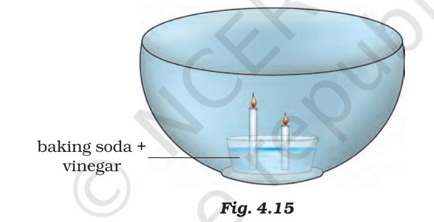

For more information, visit:

- l www.newton.dep.anl.gov/askasci/chem03/chem03767.htm
- l http://en.wikipedia.org/wiki/combustion

