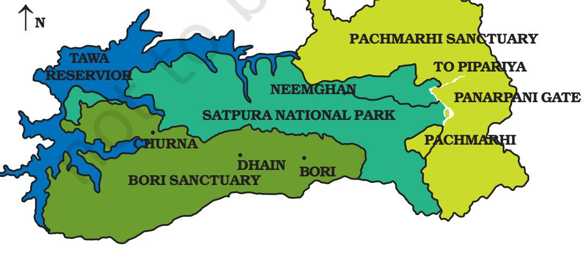
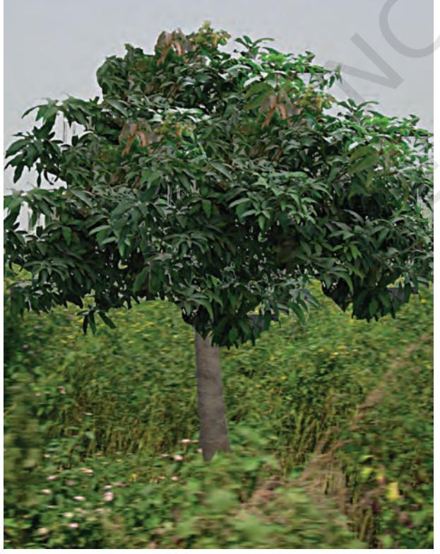
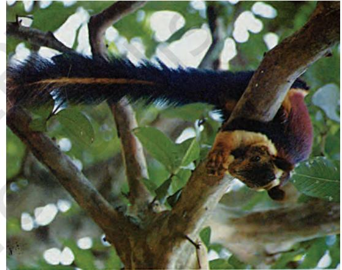
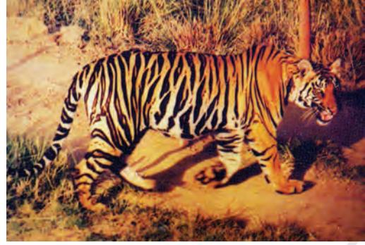
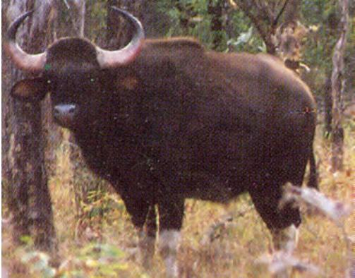
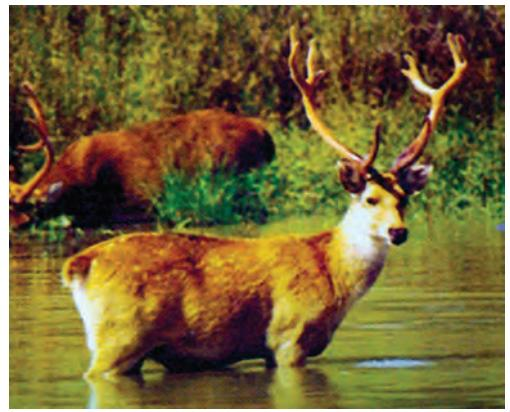

W e saw in Class VII that Paheli and Boojho had visited the forest along with Professor Ahmad and Tibu. They were eager to share their experiences with their classmates. Other children in the class were also eager to share their experiences as some of them had visited Bharatpur Sanctuary. Some others had heard about Kaziranga National Park, Lockchao Wildlife Sanctuary, Great Nicobar Biosphere Reserve and Tiger Reserve, etc.

What is the purpose of making national parks, wildlife sanctuaries and biosphere reserves?

#### 5.1 Deforestation and Its Causes

A great variety of plants and animals exist on earth. They are essential for the well-being and survival of mankind. Today, a major threat to survival of these organisms is deforestation. We know that deforestation means clearing of forests and using that land for other purposes. Trees in the forest are cut for some of the purposes mentioned below:

- l Procuring land for cultivation.
- l Building houses and factories.
- l Making furniture or using wood as fuel.

Some natural causes of deforestation are forest fires and severe droughts.

## Activity 5.1

Add more causes of deforestation to your list and classify them into natural and man-made.

# 5.2 Consequences of Deforestation

Paheli and Boojho recalled the consequences of deforestation. They remembered that deforestation increases the temperature and pollution level on the earth. It increases the level of carbon dioxide in the atmosphere. Ground water level also gets lowered. They know that deforestation disturbs the balance in nature. They were told by Professor Ahmad that if cutting of trees continues, rainfall and the fertility of the soil will

How does deforestation reduce rainfall on the one hand and lead to floods on the other?

decrease. Moreover, there will be increased chances of natural calamities such as floods and droughts.

Recall that plants need carbon dioxide for photosynthesis. Fewer trees would mean that less carbon dioxide will be used up resulting in its increased amount in the atmosphere. This will lead to global warming as carbon dioxide traps the heat rays reflected by the earth. The increase in temperature on the earth disturbs the water cycle and may reduce rainfall. This could cause droughts.

Deforestation is a major cause which leads to the change in soil properties. Physical properties of the soil get affected by plantation and vegetation. Fewer trees result in more soil erosion. Removal of the top layer of the soil exposes the lower, hard and rocky layers. This soil has less humus and is less fertile. Gradually the fertile land gets converted into deserts. It is called desertification.

Deforestation also leads to a decrease in the water holding capacity of the soil. The movement of water from the soil surface into the ground (infiltration rate) is reduced. So, there are floods. The other properties of the soil like nutrient content, texture etc., also change because of deforestation.

We have studied in Class VII that we get many products from forests. List these products. Will we face shortage of these products if we continue cutting trees?

#### Activity 5.2

Animal life is also affected by deforestation. How? List the points and discuss them in your class.

## 5.3 Conservation of Forest and Wildlife

Having become aware of the effects of deforestation, Paheli and Boojho are worried. They go to Professor Ahmad and ask him how forests and wildlife can be saved.

Biosphere is that part of the earth in which living organisms exist or which supports life. Biological diversity or biodiversity, refers to the variety of organisms existing on the earth, their interrelationships and their relationship with the environment.

Professor Ahmad organises a visit to a biosphere reserve for Paheli, Boojho and their classmates. He selects a place named Pachmarhi Biosphere Reserve. He knows that the plants and animals found here are similar to those of the upper Himalayan peaks and to those belonging to the lower western ghats. Professor Ahmad believes that the biodiversity found here is unique. He requests Madhavji, a forest employee, to guide the children inside the biosphere reserve. He explains that preserving areas of such biological importance make them a part of our national heritage.

Madhavji explains to the children that apart from our personal efforts and efforts of the society, government

To protect our flora and fauna and their habitats, protected areas called wildlife sanctuaries, national parks and biosphere reserves have been earmarked. Plantation, cultivation, grazing, felling trees, hunting and poaching are prohibited there.

Wildlife Sanctuary : Areas where animals are protected from any disturbance to them and their habitat. National Park : Areas reserved for wild life where they can freely use the habitats and natural resources.

Biosphere Reserve : Large areas of protected land for conservation of wild life, plant and animal resources and traditional life of the tribals living in the area.

agencies also take care of the forests and animals. The government lays down rules, methods and policies to protect and conserve them. Wildlife sanctuaries, national parks, biosphere reserves etc., are protected areas for conservation of plants and animals present in that area.

## Activity 5.3

Find out the number of national parks, wildlife sanctuaries and biosphere reserves in your district, state and country. Record in Table 5.1. Show these areas in an outline map of your state and India.

## 5.4 Biosphere Reserve

Children along with Professor Ahmad and Madhavji enter the biosphere reserve area. Madhavji explains that biosphere reserves are the areas meant for conservation of biodiversity. As you are aware that biodiversity is the variety of plants, animals and microorganisms generally found in an area. The biosphere reserves help to maintain the biodiversity and culture of that area. A biosphere reserve may also contain other protected areas in it. The Pachmarhi Biosphere Reserve consists of one national park named Satpura and two wildlife sanctuaries named Bori and Pachmarhi (Fig. 5.1).

| Protected Areas — | National Park | Wildlife Sanctuary | Biosphere Reserve |
| --- | --- | --- | --- |
| In my district |  |  |  |
| In my state |  |  |  |
| In my country |  |  |  |
| ↑ |  |  |  |
|  |  | PACHMARHI SANCTUARY |  |
| TAWA |  | TO PIPARIYA |  |
| N |  |  |  |
| RESERVIOR |  |  |  |

Table 5.1 : Protected Areas for Conservation

*Fig. 5.1 : Pachmarhi Biosphere Reserve*

CONSERVATION OF PLANTS AND ANIMALS 55

# Activity 5.4

List the factors disturbing the biodiversity of your area. Some of these factors and human activities may disturb the biodiversity unknowingly. List these human activities. How can these be checked? Discuss in your class and write a brief report in your notebook.

## 5.5 Flora and Fauna

As the children walk around the biosphere reserve they appreciate the green wealth of the forest. They are very happy to see tall teak trees and animals inside the forest. Suddenly, Paheli finds a rabbit and wants to catch it. She starts running after it. Professor Ahmad stops her. He explains that animals are comfortable and happy in their own habitat. We should not disturb them. Madhavji explains that some animals and plants typically belong to a particular area. The plants and animals found in a particular area are termed flora and fauna respectively of that area.

*(d) (e) (f) Fig. 5.2 : (a) Wild dog (b) Cheetal (c) Wolf (d) Leopard (e) Fern (f) Jamun tree Sal*, teak, mango, *jamun*, silver ferns, *arjun,* etc., are the flora and *chinkara*, bluebull, barking deer, *cheetal*, leopard, wild dog, wolf, etc. are examples of the fauna of the Pachmarhi Biosphere Reserve (Fig. 5.2). *(a) (b) (c)*

# Activity 5.5

Try to identify the flora and fauna of your area and list them.

# 5.6 Endemic Species

Soon the group quietly enters the deep forest. Children are surprised to see a very big squirrel. This squirrel has a big fluffy tail. They are very curious to know about it. Madhavji tells them that this is known as the giant squirrel and is endemic to this area.

Endemic species are those species of plants and animals which are found exclusively in a particular area. They are not naturally found anywhere else. A particular type of animal or plant may be endemic to a zone, a state or a country.

Madhavji shows *sal* and wild mango (Fig. 5.3 (a)] as two examples of the

CONSERVATION OF PLANTS AND ANIMALS 57 *Fig. 5.3 (a) : Wild Mango*

endemic flora of the Pachmarhi Biosphere Reserve. Bison, Indian giant squirrel [Fig. 5.3 (b)] and flying squirrel are endemic fauna of this area. Professor Ahmad explains that the destruction of their habitat, increasing population and introduction of new species may affect the natural habitat of endemic species and endanger their existence.

*Fig. 5.3 (b) : Giant squirrel*

Species is a group of population which are capable of interbreeding. This means that the members of a species can reproduce fertile offspring only with the members of their own species and not with members of other species. Members of a species have common characteristics.

# Activity 5.6

Find out the endemic plants and animals of the region where you live.

#### 5.7 Wildlife Sanctuary

Soon Paheli sees a board with 'Pachmarhi Wildlife Sanctuary' written on it.

Professor Ahmad explains that killing (poaching) or capturing animals in general is strictly prohibited and punishable by law in all such places. Wildlife Sanctuaries like reserve forests provide protection and suitable living conditions to wild animals. He also tells them that people living in wildlife sanctuaries are allowed to do certain activities such as grazing by their livestock, collecting medicinal plants, firewood, etc.

Some of the threatened wild animals like black buck, white eyed buck, elephant, golden cat, pink headed duck, *gharial,* marsh crocodile, python, rhinoceros, etc., are protected and preserved in our wild life sanctuaries. Indian sanctuaries have unique landscapes—broad level forests, mountain forests and bush lands in deltas of big rivers.

It is a pity that even protected forests are not safe because people living in the neighbourhood encroach upon them and destroy them.

Children are reminded of their visit to the zoo. They recall that zoos are also places where animals receive protection.

What is the difference between a zoo and a wildlife sanctuary?

#### Activity 5.7

Visit a nearby zoo. Observe the conditions provided to the animals. Were they suitable for the animals? Can animals live in artificial setting instead of their natural habitat? In your opinion, will the animals be comfortable in a zoo or in their natural habitat?

## 5.8 National Park

On the roadside there was another board on which was written 'Satpura National Park'.

Children are now eager to go there. Madhavji tells them that these reserves are large and diverse enough to protect whole sets of ecosystems. They preserve flora, fauna, landscape and historic objects of an area. Satpura National Park is the first Reserve Forest of India. The finest Indian teak is found in this forest. There are more than one hundred National Parks in India.

> Rock shelters are also found inside the Satpura National Park. These are evidences of prehistoric human life in these jungles. These give us an idea of the life of primitive people.

> Rock paintings are found in these shelters. A total of 55 rock shelters have been identified in Pachmarhi Biosphere Reserve.

> Figures of animals and men fighting, hunting, dancing and playing musical instruments are depicted in these paintings. Many tribals still live in the area.

As children move ahead, they see a board with 'Satpura Tiger Reserve' written on it. Madhavji explains that Project Tiger was launched by the government to protect the tigers in the country. The objective of this project was to ensure the survival and maintenance of the tiger population in the country.

Are tigers still found in this forest? I hope I can see a tiger!

Tiger (Fig. 5.4) is one of the many species which are slowly disappearing from our forests. But, the Satpura Tiger Reserve is unique in the sense that a significant increase in the population of tigers has been seen here. Once upon a time, animals like lions, elephants, wild

*Fig. 5.4 : Tiger*

buffaloes (Fig. 5.5) and barasingha (Fig. 5.6) were also found in the Satpura National Park. Animals whose numbers are diminishing to a level that they might face extinction are known as the endangered animals. Boojho is reminded of the dinosaurs which became extinct a long time ago. Survival of some

*Fig. 5.5 : Wild buffalo*

CONSERVATION OF PLANTS AND ANIMALS 59

*Fig. 5.6 : Barasingha*

animals has become difficult because of disturbances in their natural habitat. Professor Ahmad tells them that in order to protect plants and animals strict rules are imposed in all National Parks. Human activities such as grazing, poaching, hunting, capturing of animals

or collection of firewood, mdicinal plants, etc. are not allowed

> Are only big animals facing extinction?

Madhavji tells Paheli that small animals are much more in danger of becoming extinct than the bigger animals. At times, we kill snakes, frogs, lizards, bats and owls ruthlessly without realising their importance in the ecosystem. By killing them we are harming ourselves. They might be small in size but their role in the ecosystem cannot be ignored. They form part of food chains and food webs.

An ecosystem is made of all the plants, animals and microorganisms in an area along with non-living components such as climate, soil, river deltas etc.

I wonder if there is any record of all endangered species!

# 5.9 Red Data Book

Professor Ahmad explains about Red Data Book to the children. He tells them that Red Data Book is the source book which keeps a record of all the endangered animals and plants. Red Data Book is maintained internationally by an organisation. India also maintains Red Data Book for plants and animals found in India.

## 5.10 Migration

The excursion party then enters deeper into the forest under the guidance of Madhavji. They sit near the Tawa

What would happen if we had no wood? Is there any alternative available to wood? I know that paper is one of the important products we get from forests. I wonder whether there are any alternatives available for paper!

Reservoir to relax for some time. Paheli observes some of the birds near the river. Madhavji tells the children that these are migratory birds. These birds have flown here from other parts of the world.

Migratory birds fly to far away areas every year during a particular time because of climatic changes. They fly for laying eggs as the weather in their natural habitat becomes very cold and inhospitable. Birds who cover long distances to reach another land are known as migratory birds.

# 5.11 Recycling of Paper

Professor Ahmad draws attention of the children to another cause of deforestation. He tells them that it takes 17 full grown trees to make one tonne of paper. Therefore, we should save paper. Professor Ahmad also tells that paper can be recycled five to seven times for use. If each student saves at least one sheet of paper in a day, we can save many trees in a year. We should save, reuse used paper and recycle it. By this we not only save trees but also save energy and water needed for manufacturing paper. Moreover, the amount of harmful chemicals used in paper making will also be reduced.

> Is there any permanent solution to the problem of deforestation?

## 5.12 Reforestation

Professor Ahmad suggests that the answer to deforestation is reforestation. Reforestation is restocking of the destroyed forests by planting new trees. The planted trees should generally be of the same species which were found in that forest. We should plant at least as many trees as we cut. Reforestation can take place naturally also. If the deforested area is left undisturbed, it reestablishes itself. In natural reforestation there is no role of human beings. We have already caused tremendous damage to our forests. If we have to retain our green wealth for future generations, plantation of more trees is the only option.

Professor Ahmad told them that in India we have the Forest (Conservation) Act. This act is aimed at preservation and conservation of natural forests and meeting the basic needs of the people living in or near the forests.

After some rest Madhavji asks the children to start heading back because it is not advisable to stay in the jungle after sunset. On getting back, Professor Ahmad and the children thank Madhavji for guiding them through this exciting experience.

# KEYWORDS BIODIVERSITY BIOSPHERE RESERVE DEFORESTATION DESERTIFICATION ECOSYSTEM ENDANGERED SPECIES ENDEMIC SPECIES EXTINCT FAUNA FLORA MIGRATORY BIRDS NATIONAL PARK RED DATA BOOK REFORESTATION

#### WHAT YOU HAVE LEARNT

- ‹ Wildlife sanctuary, national park and biosphere reserve are names given to the areas meant for conservation and preservation of forest and wild animals.
- ‹ Biodiversity refers to the variety of living organisms in a specific area.
- ‹ Plants and animals of a particular area are known as the flora and fauna of that area.
- ‹ Endemic species are found only in a particular area.
- ‹ Endangered species are those which are facing the danger of extinction.
- ‹ Red Data Book contains a record of endangered species.
- ‹ Migration is the phenomenon of movement of a species from its own habitat to some other habitat for a particular time period every year for a specific purpose like breeding.
- ‹ We should save, reuse and recycle paper to save trees, energy and water.
- ‹ Reforestation is the restocking of destroyed forests by planting new trees.

#### Exercises

SANCTUARY

- 1. Fill in the blanks.
	- (a) A place where animals are protected in their natural habitat is called .
	- (b) Species found only in a particular area is known as .
	- (c) Migratory birds fly to far away places because of changes.
- 2. Differentiate between the following.
	- (a) Wildlife sanctuary and biosphere reserve
	- (b) Zoo and wildlife sanctuary
	- (c) Endangered and extinct species
	- (d) Flora and fauna
- 3. Discuss the effects of deforestation on the following.
	- (a) Wild animals
	- (b) Environment
	- (c) Villages (Rural areas)
	- (d) Cities (Urban areas)
	- (e) Earth
	- (f) The next generation
	- 4. What will happen if.
		- (a) we go on cutting trees.
		- (b) the habitat of an animal is disturbed.
		- (c) the top layer of soil is exposed.
	- 5. Answer in brief.
		- (a) Why should we conserve biodiversity?
		- (b) Protected forests are also not completely safe for wild animals. Why?
		- (c) Some tribals depend on the jungle. How?
		- (d) What are the causes and consequences of deforestation?
		- (e) What is Red Data Book?
		- (f) What do you understand by the term migration?
	- 6. In order to meet the ever-increasing demand in factories and for shelter, trees are being continually cut. Is it justified to cut trees for such projects? Discuss and prepare a brief report.
	- 7. How can you contribute to the maintenance of green wealth of your locality? Make a list of actions to be taken by you.
	- 8. Explain how deforestation leads to reduced rainfall.
	- 9. Find out about national parks in your state. Identify and show their location on the outline map of India.
	- 10. Why should paper be saved? Prepare a list of ways by which you can save paper.

- 11. Complete the word puzzle.
#### Down

E X E R C I S E S

- 1. Species on the verge of extinction.
- 2. A book carrying information about endangered species.
- 5. Consequence of deforestation.

#### Across

- 1. Species which have vanished.
- 3. Species found only in a particular habitat.
- 4. Variety of plants, animals and microorganisms found in an area.

# Extended Learning - Activities and Projects

- 1. Plant at least five different plants in your locality during this academic year and ensure their maintenance till they grow.
- 2. Promise yourself that this year you will gift at least 5 plants to your friends and relatives on their achievements, or on occasions like birthdays. Ask your friends to take proper care of these plants and encourage them to gift plants to their friends on such occasions. At the end of the year count the plants that have been gifted through this chain.

64 SCIENCE

- 3. Is it justified to prevent tribals from staying in the core area of the forest? Discuss the matter in your class and note down the points for and against the motion in your notebook.
- 4. Study the biodiversity of a park nearby. Prepare a detailed report with photographs and sketches of the flora and fauna.
- 5. Make a list of the new information you have gathered from this chapter. Which information did you find the most interesting and why?
- 6. Make a list of various uses of papers. Observe currency notes carefully. Do you find any difference between a currency paper and paper of your notebook? Find out where currency paper is made.
- 7. Karnataka Government had launched 'Project Elephant' to save Asian elephants in the state. Find out about this and other such campaigns launched to protect threatened species.

## Did You Know?

- 1. India has more than half of the world's wild tigers, 65% of the Asian elephants, 85% of the great one-horned rhinoceros and 100% of the Asian lions.
- 2. India is sixth on a list of 12 mega-biodiversity countries in the world. It contains two of the 34 biodiversity hotspots of the world – Eastern Himalayas and the Western Ghats. These areas are very rich in biodiversity.
- 3. One of the most important factors that threatens wildlife today is habitat destruction due to encroachment.
- 4. India contains 172 species of animals considered globally threatened or 2.9% of the world's total number of threatened species. Eastern Himalayas hotspot has merely 163 globally threatened species including several animal and plant species. India contains globally important population of some of Asia's rarest animals such as the *Bengal fox*, *Marbled cat*, Asiatic lion, Indian elephant, Asiatic wild ass, Indian rhinoceros, *gaur*, Wild asiatic water buffalo, etc.

For knowing more, you may contact:

- l Ministry of Environment, Forest and Climate Change, Govt. of India Environment, Forest and Wildlife Department
- Indira Paryavaran Bhavan, Jor Bagh Road, New Delhi -110003 Website: http://envfor.nic.in

