D o you recall the processes of digestion, circulation and respiration which you have studied in your previous classes? These processes are essential for the survival of every individual. You have also learnt about the process of reproduction in plants. Reproduction is essential for the continuation of a species. Imagine what would have happened if organisms had not reproduced. You will realise that reproduction is very important as it ensures the continuation of similar kinds of individuals, generation after generation.

You have already learnt in your previous class about reproduction in plants. In this chapter, we shall learn how reproduction takes place in animals.

# 6.1 Modes of Reproduction

Have you seen the young ones of different animals? Try to name some of the young ones by completing Table 6.1 shown in examples at S. No. 1 and 5.

You must have seen the young ones of various animals being born. Can you tell how chicks and caterpillars are born? How are kittens and puppies born? Do you think that these young ones looked the same before they were born as they do now? Let us find out.

Table 6.1

| S. No. | Animal | Young one |
| --- | --- | --- |
| 1. | Human | Baby |
| 2. | Cat |  |
| 3. | Dog |  |
| 4. | Butterfly |  |
| 5. | Hen | Chick |
| 6. | Cow |  |
| 7. | Frog |  |

Just as in plants, there are two modes by which animals reproduce. These are: (i) Sexual reproduction, and (ii) Asexual reproduction.

## 6.2 Sexual Reproduction

Try to recall reproduction in plants which you studied in Class VII. You will remember that plants that reproduce sexually have male and female reproductive parts. Can you name these parts? In animals also, males and females have different reproductive parts or organs. Like plants, the reproductive parts in animals also produce gametes that fuse to form a zygote. It is the zygote which develops into a new individual. This type of reproduction beginning from the fusion of male and female gametes is called sexual reproduction. Let us find out the reproductive parts in humans and study the process of reproduction in them.

### Male Reproductive Organs

The male reproductive organs include a pair of testes (singular, testis), two sperm ducts and a penis (Fig. 6.1). The testes produce the male gametes called sperms. Millions of sperms are produced by the testes. Look at Fig. 6.2 which shows the picture of a sperm. Though sperms are very small in size, each has a head, a middle piece and a tail. Does it appear to be a single cell? Indeed, each

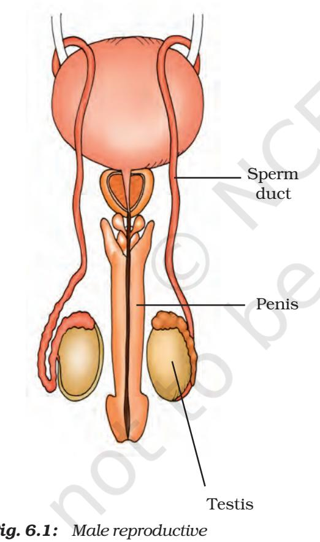

*Fig. 6.1: Male reproductive organs in humans* sperm is a single cell with all the usual cell components.

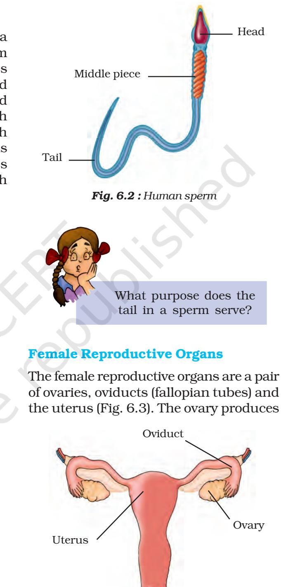

*Fig. 6.3 : Female reproductive organs in humans*

female gametes called ova (eggs) (Fig. 6.4). In human beings, a single matured egg is released into the oviduct by one of the ovaries every month. Uterus is the part where development of the baby takes place. Like the sperm, an egg is also a single cell.

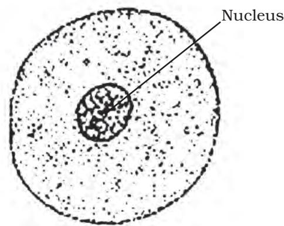

*Fig. 6.4 : Human Ovum*

Boojho recalls that the size of eggs in animals varies. The egg may be very small as in humans, much larger as in hens. Ostrich egg is the largest!

### Fertilisation

The first step in the process of reproduction is the fusion of a sperm and an ovum. When sperms come in contact with an egg, one of the sperms may fuse with the egg. Such fusion of the egg and the sperm is called fertilisation (Fig. 6.5). During fertilisation, the nuclei of the sperm and the egg fuse to form a single nucleus. This results in the formation of a fertilised egg or zygote (Fig. 6.6). Did

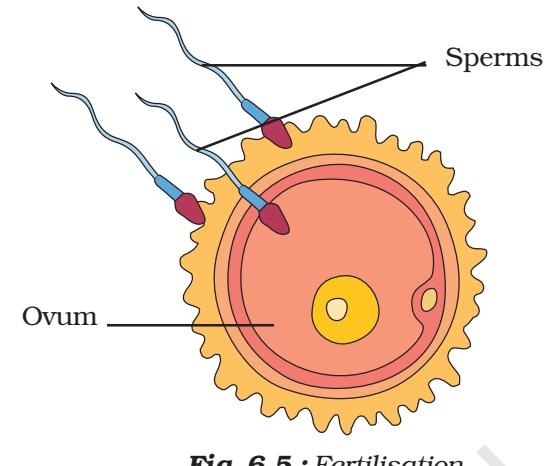

*Fig. 6.5 : Fertilisation*

you know that the zygote is the beginning of a new individual?

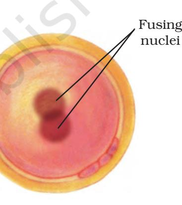

*Fig. 6.6 : Zygote*

The process of fertilisation is the meeting of an egg cell from the mother and a sperm cell from the father. So, the new individual inherits some characteristics from the mother and some from the father. Look at your brother or sister. See if you can recognise some characters in them similar to those of your mother or your father.

Fertilisation which takes place inside the female body is called internal fertilisation. Internal fertilisation occurs in many animals including humans, cows, dogs and hens.

#### Have you heard of test tube babies?

Boojho and Paheli's teacher once told them in the class that in some women oviducts are blocked. These women are unable to bear babies because sperms cannot reach the egg for fertilisation. In such cases, doctors collect freshly released egg and sperms and keep them together for a few hours for *IVF* or *in vitro fertilisation* (fertilisation outside the body). In case fertilisation occurs, the zygote is allowed to develop for about a week and then it is placed in the mother's uterus. Complete development takes place in the uterus and the baby is born like any other baby. Babies born through this technique are called test-tube babies. This term is actually misleading because babies cannot grow in test tubes.

You will be surprised to know that in many animals fertilisation takes place outside the body of the female. In these animals, fertilisation takes place in water. Let us find out how this happens.

## Activity 6.1

Visit some ponds or slow-flowing streams during spring or rainy season. Look out for clusters of frog's eggs floating in water. Write down the colour and size of the eggs.

During spring or rainy season, frogs and toads move to ponds and slowflowing streams. When the male and female come together in water, the

REPRODUCTION IN ANIMALS 69

female lays hundreds of eggs. Unlike hen's egg, frog's egg is not covered by a shell and it is comparatively very delicate. A layer of jelly holds the eggs together and provides protection to the eggs (Fig. 6.7).

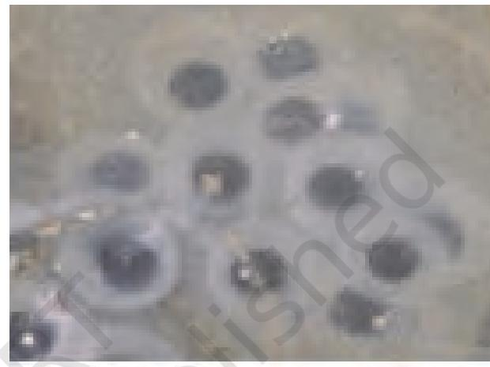

*Fig. 6.7 : Eggs of frog*

As the eggs are laid, the male deposits sperms over them. Each sperm swims randomly in water with the help of its long tail. The sperms come in contact with the eggs. This results in fertilisation. This type of fertilisation in which the fusion of a male and a female gamete takes place outside the body of the female is called external fertilisation. It is very common in aquatic animals such as fish, starfish, etc.

> Why do fish and frogs lay eggs in hundreds whereas a hen lays only one egg at a time?

Though these animals lay hundreds of eggs and release millions of sperms, all the eggs do not get fertilised and develop into new individuals. This is because the eggs and sperms get exposed to water movement, wind and rainfall. Also, there are other animals in the pond which may feed on eggs. Thus, production of large number of eggs and sperms is necessary to ensure fertilisation of at least a few of them.

How could a single cell

### Development of Embryo

become such a big individual?

Fertilisation results in the formation of zygote which begins to develop into an embryo [Fig. 6.8(a)]. The zygote divides repeatedly to give rise to a ball of cells [Fig. 6.8(b)]. The cells then begin to form groups that develop into different tissues and organs of the body. This developing structure is termed an embryo. The embryo gets embedded in the wall of the uterus for further development [Fig. 6.8(c)].

The embryo continues to develop in the uterus. It gradually develops body

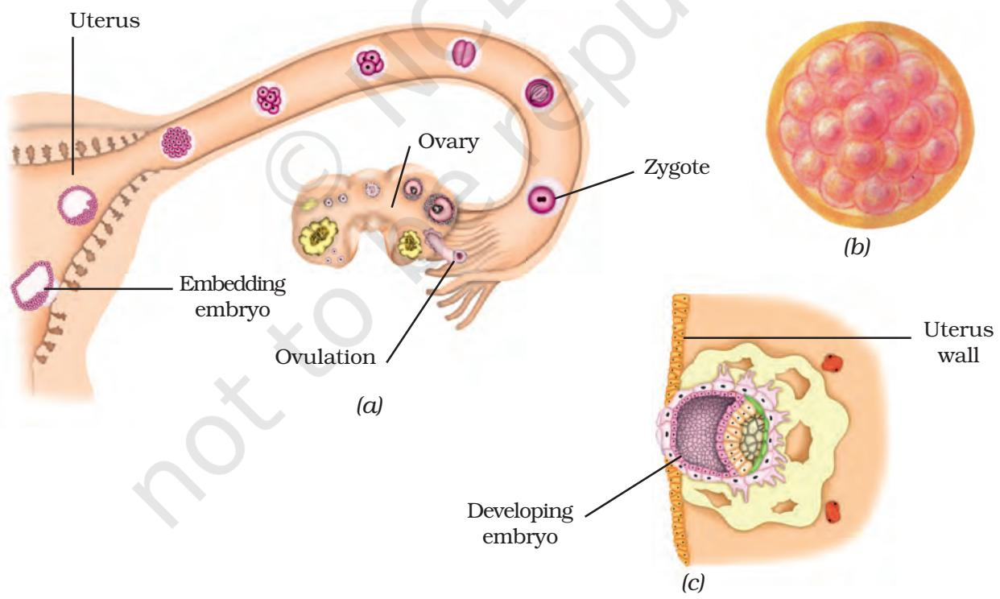

*Fig. 6.8 : (a) Zygote formation and development of an embryo from the zygote; (b) Ball of cells (enlarged); (c) Embedding of the embryo in the uterus (enlarged)*

70 SCIENCE

parts such as hands, legs, head, eyes, ears etc. The stage of the embryo in which all the body parts can be identified is called a foetus (Fig. 6.9). When the development of the foetus is complete, the mother gives birth to the baby.

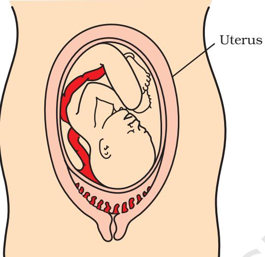

*Fig. 6.9 : Foetus in the uterus*

Internal fertilisation takes place in hens also. But, do hens give birth to babies like human beings and cows? You know that they do not. Then, how are chicks born? Let us find out.

Soon after fertilisation, the zygote divides repeatedly and travels down the oviduct. As it travels down, many protective layers are formed around it. The hard shell that you see in a hen's egg is one such protective layer.

After the hard shell is formed around the developing embryo, the hen finally lays the egg. The embryo takes about 3 weeks to develop into a chick. You must have seen the hen sitting on the eggs to provide sufficient warmth. Did you know that development of the chick takes place inside the egg shell during this period? After the chick is completely developed it bursts open the egg shell.

In animals which undergo external fertilisation, development of the embryo takes place outside the female body. The embryos continue to grow within their egg coverings. After the embryos develop, the eggs hatch. You must have seen numerous tadpoles swimming in ponds and streams.

### Viviparous and Oviparous Animals

We have learnt that some animals give birth to young ones while some animals lay eggs which later develop into young ones. The animals which give birth to young ones are called viviparous animals. Those animals which lay eggs are called oviparous animals. The following activity will help you understand better and differentiate between viviparous and oviparous animals.

### Activity 6.2

Try to observe eggs of the following organisms – frog, lizard, butterfly or moth, hen and crow or any other bird. Were you able to observe eggs of all of them? Make drawings of the eggs that you have observed.

The eggs of a few animals are easy to observe because their mothers lay them outside their bodies. These are examples of oviparous animals. But you would not be able to collect the eggs of a dog, cow or cat. This is because they do not lay eggs. The mother gives birth to the young ones. These are examples of viviparous animals.

REPRODUCTION IN ANIMALS 71

Can you now give some more examples of viviparous and oviparous animals?

### **Young Ones to Adults**

The new individuals which are born or hatched from the eggs continue to grow till they become adults. In some animals, the young ones may look very different from the adults. The life cycle of frog is shown in Fig. 6.10.

Observe the different stages of frog starting from the egg to the adult stage. We find that there are three distinct stages, that is, egg → tadpole (larva) → adult. Don't the tadpoles look so different from the adults? Can you imagine that these tadpoles would some day become frogs?

The tadpoles transform into adults capable of jumping and swimming. The transformation of the larva into an adult through drastic changes is called **metamorphosis**. What about the changes that we observe in our body as we grow? Do you think we too undergo metamorphosis? In human beings, body parts similar to those present in the adults are present from the time of birth.

# **6.3 Asexual Reproduction**

So far, we have learnt about reproduction in some familiar animals. But what about very small animals like hydra and microscopic organisms like amoeba? Do you know how they reproduce? Let us find out.

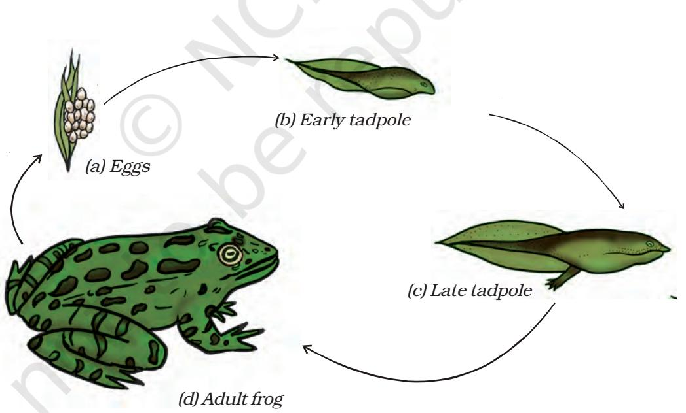

**Fig. 6.10 :** *Life cycle of frog*

### Activity 6.3

Get permanent slides of hydra. Observe them using hand lens or a microscope. Look out for any bulges from the parent body. Count the number of bulges that you see in different slides. Also, note the size of the bulges. Draw the diagram of hydra, as you see it. Compare it with

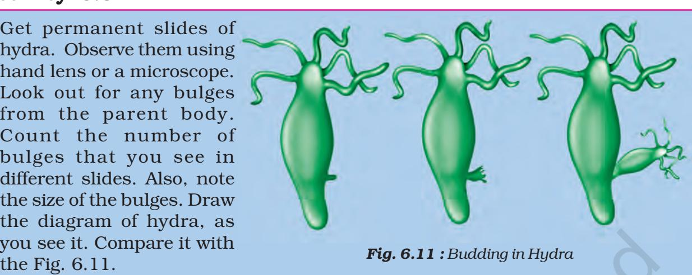

In each hydra, there may be one or more bulges. These bulges are the developing new individuals and they are called buds. Recall the presence of buds in yeast. In hydra too the new individuals develop as outgrowths from a single parent. This type of reproduction in which only a single parent is involved is called asexual reproduction. Since new individuals develop from the buds in hydra, this type of asexual reproduction is called budding.

Another method of asexual reproduction is observed in the microscopic organism, amoeba. Let us see how this happens.

You have already learnt about the structure of amoeba. You will recall that amoeba is a single-celled organism [Fig. 6.12(a)]. It begins the process of reproduction by the division of its nucleus into two nuclei [Fig. 6.12(b)]. This is followed by division of its body into two, each part receiving a nucleus [Fig. 6.12(c)]. Finally, two amoebae are produced from one parent amoeba [Fig. 6.12(d)]. This type of asexual

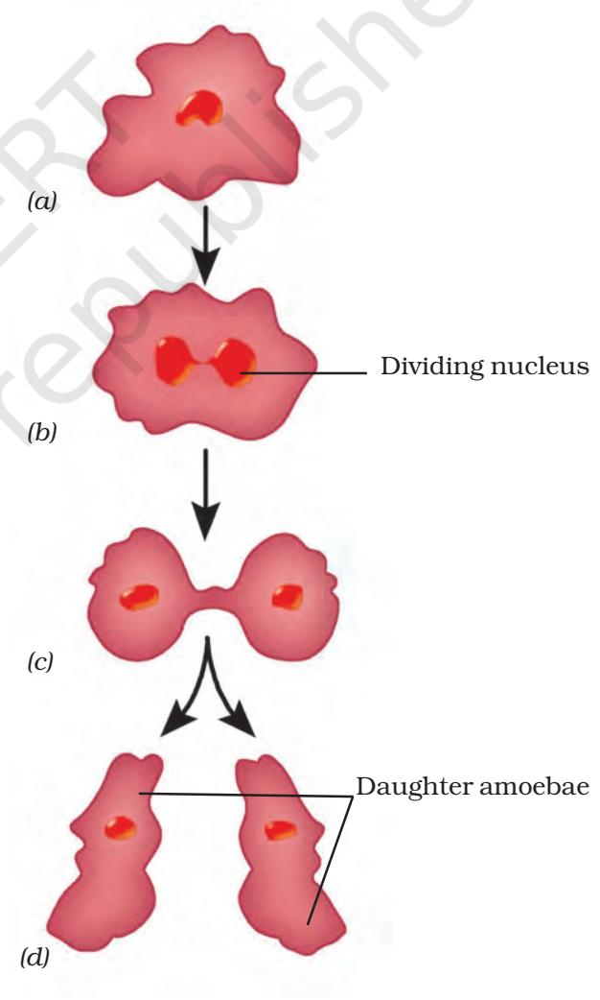

REPRODUCTION IN ANIMALS 73

reproduction in which an animal reproduces by dividing into two individuals is called binary fission. Apart from budding and binary fission, there are other methods by which a single parent reproduces young ones. You will study about these in your higher classes.

#### Story of Dolly, the Clone

Cloning is the production of an exact copy of a cell, any other living part, or a complete organism. Cloning of an animal was successfully performed for the first time by Ian Wilmut and his colleagues at the Roslin Institute in Edinburgh, Scotland. They successfully cloned a sheep named Dolly [Fig. 6.13 (c)]. Dolly was born on 5th July 1996 and was the first mammal to be cloned.

*(a) Finn Dorsett sheep (b) Scottish blackface ewe (c) Dolly*

#### *Fig. 6.13*

During the process of cloning Dolly, a cell was collected from the mammary gland of a female Finn Dorsett sheep [Fig. 6.13 (a)]. Simultaneously, an egg was obtained from a Scottish blackface ewe [Fig. 6.13 (b)]. The nucleus was removed from the egg. Then, the nucleus of the mammary gland cell from the Finn Dorsett sheep was inserted into the egg of the Scottish blackface ewe whose nucleus had been removed. The egg thus produced was implanted into the Scottish blackface ewe. Development of this egg followed normally and finally Dolly was born. Though Dolly was given birth by the Scottish blackface ewe, it was found to be absolutely identical to the Finn Dorsett sheep from which the nucleus was taken. Since the nucleus from the egg of the Scottish blackface ewe was removed, Dolly did not show any character of the Scottish blackface ewe. Dolly was a healthy clone of the Finn Dorsett sheep and produced several offspring of her own through normal sexual means. Unfortunately, Dolly died on 14th February 2003 due to a certain lung disease.

Since Dolly, several attempts have been made to produce cloned mammals. However, many die before birth or die soon after birth. The cloned animals are many-a-times found to be born with severe abnormalities.

#### KEYWORDS

ASEXUAL

REPRODUCTION

BINARY FISSION

BUDDING

EGGS

EMBRYO

EXTERNAL

FERTILISATION

FERTILISATION

FOETUS

INTERNAL

FERTILISATION

METAMORPHOSIS

OVIPAROUS ANIMALS

SEXUAL

REPRODUCTION

SPERMS

VIVIPAROUS ANIMALS

ZYGOTE

#### WHAT YOU HAVE LEARNT

- ‹ There are two modes by which animals reproduce. These are: (i) Sexual reproduction, and (ii) Asexual reproduction.
- ‹ Reproduction resulting from the fusion of male and female gametes is called sexual reproduction.
- ‹ The reproductive organs in the female include ovaries, oviducts and uterus.
- ‹ The reproductive organs in male include testes, sperm ducts and penis.
- ‹ The ovary produces female gametes called ova and the testes produce male gametes called sperms.
- ‹ The fusion of ovum and sperm is called fertilisation. The fertilised egg is called a zygote.
- ‹ Fertilisation that takes place inside the female body is called internal fertilisation. This is observed in human beings and other animals such as hens, cows and dogs.
- ‹ Fertilisation that takes place outside the female body is called external fertilisation. This is observed in frogs, fish, starfish, etc.
- ‹ The zygote divides repeatedly to give rise to an embryo.
- ‹ The embryo gets embedded in the wall of the uterus for further development.
- ‹ The stage of the embryo in which all the body parts are identifiable is called foetus.
- ‹ Animals such as human beings, cows and dogs which give birth to young ones are called viviparous animals.
- ‹ Animals such as hen, frog, lizard and butterfly which lay eggs are called oviparous animals.
- ‹ The transformation of the larva into adult through drastic changes is called metamorphosis.
- ‹ The type of reproduction in which only a single parent is involved is called asexual reproduction.
- ‹ In hydra, new individuals develop from buds. This method of asexual reproduction is called budding.
- ‹ *Amoeba* reproduces by dividing itself into two. This type of asexual reproduction is called binary fission.

## Exercises

| 1. | Explain the importance of reproduction in organisms. |  |
| --- | --- | --- |
| 2. | Describe the process of fertilisation in human beings. |  |
| 3. | Choose the most appropriate answer. |  |
|  | (a) Internal fertilisation occurs |  |
|  | (i) in female body. |  |
|  | (ii) outside female body. |  |
|  | (iii) in male body. |  |
|  | (iv) outside male body. |  |
|  | (b) A tadpole develops into an adult frog by the process of |  |
|  | (i) fertilisation (ii) metamorphosis (iii) embedding (iv) budding |  |
|  | (c) The number of nuclei present in a zygote is |  |
|  | (i) none (ii) one (iii) two (iv) four |  |
| 4. | Indicate whether the following statements are True (T) or False (F). |  |
|  | (a) Oviparous animals give birth to young ones. ( | ) |
|  | (b) Each sperm is a single cell. ( | ) |
|  | (c) External fertilisation takes place in frog. ( | ) |
|  | (d) A new human individual develops from a cell called gamete. ( | ) |
|  | (e) Egg laid after fertilisation is made up of a single cell. ( | ) |
|  | (f) Amoeba reproduces by budding. ( | ) |
|  | (g) Fertilisation is necessary even in asexual reproduction. ( | ) |
|  | (h) Binary fission is a method of asexual reproduction. ( | ) |
|  | (i) A zygote is formed as a result of fertilisation. ( | ) |
|  | (j) An embryo is made up of a single cell. ( | ) |
| 5. | Give two differences between a zygote and a foetus. |  |
| 6. | Define asexual reproduction. Describe two methods of asexual reproduction in animals. |  |
| 7. | In which female reproductive organ does the embryo get embedded? |  |
| 8. | What is metamorphosis? Give examples. |  |
| 9. | Differentiate between internal fertilisation and external fertilisation. |  |

10. Complete the crossword puzzle using the hints given below.

#### Across

- 1. The process of the fusion of the gametes.
- 6. The type of fertilisation in hen.
- 7. The term used for bulges observed on the sides of the body of hydra.
- 8. Eggs are produced here.

#### Down

- 2. Sperms are produced in these male reproductive organs.
- 3. Another term for in vitro fertilisation.
- 4. These animals lay eggs.
- 5. A type of fission in amoeba.

# Extended Learning — Activities and Projects

- 1. Visit a poultry farm. Talk to the manager of the farm and try to find out the answers to the following.
	- (a) What are layers and broilers in a poultry farm?
	- (b) Do hens lay unfertilised eggs?
	- (c) How can you obtain fertilised and unfertilised eggs?
	- (d) Are the eggs that we get in the stores fertilised or unfertilised?
	- (e) Can you consume fertilised eggs?
	- (f) Is there any difference in the nutritional value of fertilised and unfertilised eggs?

- 2. Observe live hydra yourself and learn how they reproduce by doing the following activity:
During the summer months collect water weeds from ponds or ditches along with the pond water and put them in a glass jar. After a day or so you may see several hydra clinging to the sides of the jar.

Hydra is transparent, jelly-like and with tentacles. It clings to the jar with the base of its body. If the jar is shaken, the hydra will contract instantly into a small blob, at the same time drawing its tentacles in.

Now take out few hydras from the jar and put them on a watch glass. Using a hand lens or a binocular or dissection microscope, observe the changes that are taking place in their body. Note down your observations.

- 3. The eggs we get from the market are generally the unfertilised ones. In case you wish to observe a developing chick embryo, get a fertilised egg from the poultry or hatchery which has been incubated for 36 hours or more. You may then be able to see a whitedisc-like structure on the yolk. This is the developing embryo. Sometimes if the heart and blood vessels have developed you may even see a red spot.
- 4. Talk to a doctor. Find out how twinning occurs. Look for any twins in your neighbourhood, or among your friends. Find out if the twins are identical or non-identical. Also find out why identical twins are always of the same sex? If you know of any story about twins, write it in your own words.

For more information on animal reproduction, you can visit :

- l www.saburchill.com
- l www.teenshealth.org/teen/sexual-health

### Did You Know?

An interesting organisation is observed in a honey bee hive, a colony of several thousand bees. Only one bee in the colony lays eggs. This bee is called the queen bee. All other female bees are worker bees. Their main job is to build the hive, look after the young and feed the queen bee adequately to keep her healthy so that she can lay eggs. A queen bee lays thousands of eggs. The fertilised eggs hatch into females, while the unfertilised eggs give rise to males, called drones. It is the job of the worker bees to maintain the temperature of the hive at around 35°C to incubate the eggs.

