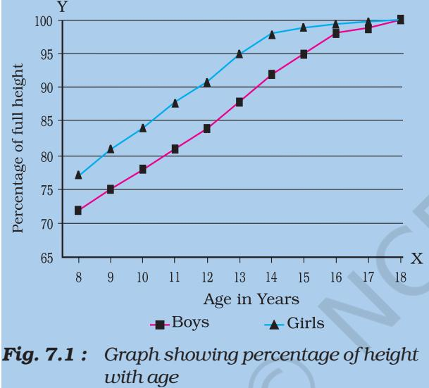
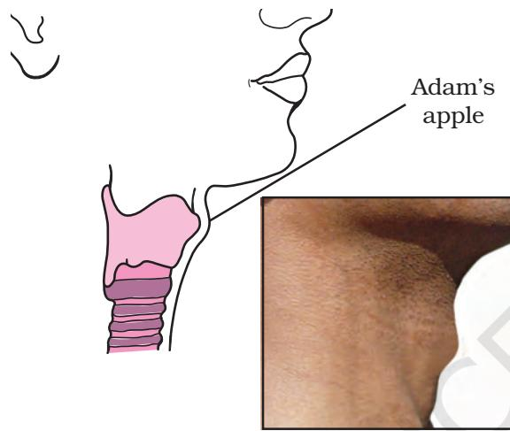
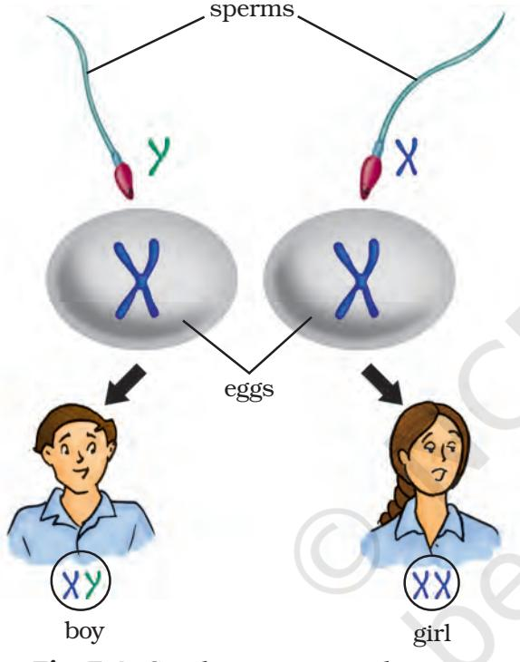
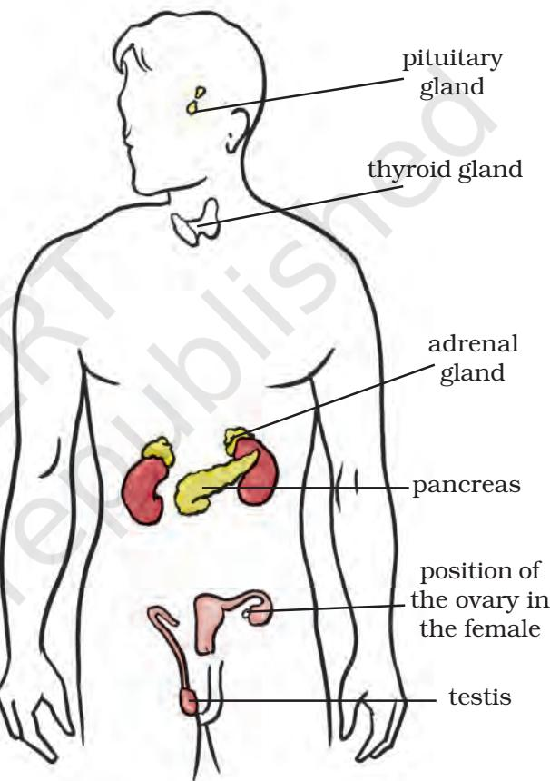
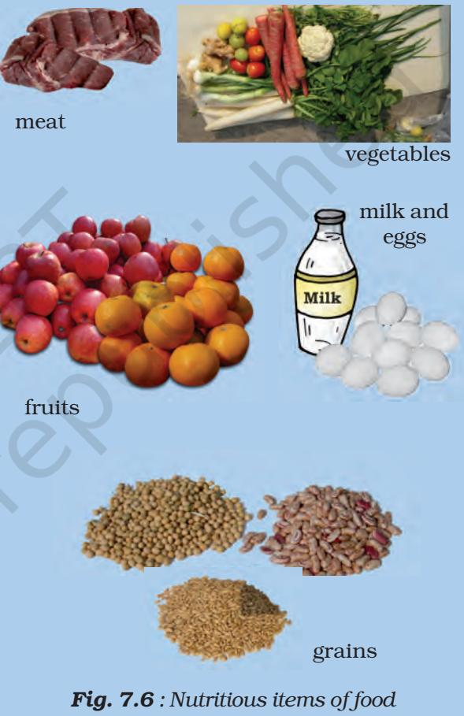

I n the previous chapter, you have learnt how animals reproduce. It is only after 'growing up' to a certain age that human beings and many other animals can reproduce. Why can humans reproduce only after a certain age?

In this chapter, you will learn about changes that take place in the human body after which a person becomes capable of reproduction.

In Chapter 6, you have learnt about human reproductive organs. Here, we shall discuss the role that hormones play in bringing about changes that make a child grow into an adult.

# 7.1 Adolescence and Puberty

Boojho was celebrating his 12th birthday. After his friends left, Boojho and Paheli began chatting with their parents. Paheli studies in an all-girls school. She started laughing. She remarked that many of Boojho's school friends, whom she met after a year, had suddenly shot up in height. Some of them were looking very funny with a hairy line above their lips. Her mother explained that the boys had grown up.

Growth begins from the day one is born. But upon crossing the age of 10 or 11, there is a sudden spurt in growth which becomes noticeable. The changes taking place in the body are part of growing up. They indicate that you are no longer a child but are on the way to becoming an adult.

> I wonder how long this period marked by changes in the body will last!

> > It is a strange period of life when you are neither a child nor an adult. I wonder whether this period between childhood and adulthood had a special name!

Growing up is a natural process. The period of life, when the body undergoes changes, leading to reproductive maturity, is called adolescence. Adolescence begins around the age of 11 and lasts upto 18 or 19 years of age. Since this period covers the 'teens' (13 to 18 or 19 years of age), adolescents are also called 'teenagers'. In girls, adolescence may begin a year or two earlier than in boys. Also, the period of adolescencevariesfrom person to person.

The human body undergoes several changes during adolescence. These changes mark the onset of puberty. The most important change which marks puberty is that boys and girls become capable of reproduction. Puberty ends when an adolescent reaches reproductive maturity.

Paheli and Boojho realised that sudden increase in height and hairy line above the lips in boys were signs of adolescence. They wanted to know more about other changes at puberty.

# 7.2 Changes at Puberty

## Increase in Height

The most conspicuous change during puberty is the sudden increase in height. At this time the long bones, that is, the bones of the arms and the legs elongate and make a person tall.

## Activity 7.1

The following chart gives the average rate of growth in height of boys and girls with age. The figures in columns 2 and 3, give the percentage of the height a person has reached at the age given in column 1. For example, by the age 11, a boy has reached 81% of his probable full height, while a girl has reached 88% of her full height. These figures are only representative and there may be individual variations.

Use the Table for your friends and work out how tall they are likely to be. Find out who is likely to be the tallest and who might be the shortest in your class.

| Age in | % of full height |  |
| --- | --- | --- |
| Years | Boys | Girls |
| 8 | 72% | 77% |
| 9 | 75% | 81% |
| 10 | 78% | 84% |
| 11 | 81% | 88% |
| 12 | 84% | 91% |
| 13 | 88% | 95% |
| 14 | 92% | 98% |
| 15 | 95% | 99% |
| 16 | 98% | 99.5% |
| 17 | 99% | 100% |
| 18 | 100% | 100% |

## Calculation for full height (cm)

( ) 100 *Present height cm % of full height at this age* × (as given in the chart)

## Example:

A boy is 9 years old and 120 cm tall. At the end of the growth period he is likely to be

× 120 100 75 cm = 160 cm tall

## Activity 7.2

Use the data given in Activity 7.1 to draw a graph. Take age on the X-axis and per cent growth in height on the Y-axis. Highlight the point representing your age on the graph. Find out the percentage of height you have already reached. Calculate the height you might eventually reach. Tally your graph with the one given here (Fig. 7.1).

Initially, girls grow faster than boys but by about 18 years of age, both reach their maximum height. The rate of growth in height varies in different individuals. Some may grow suddenly at puberty and then slow down, while others may grow gradually.

> I am worried. Though I have become taller, my face looks much smaller compared to my body.

REACHING THE AGE OF ADOLESCENCE 81

There is no need for Paheli to worry. All parts of the body do not grow at the same rate. Sometimes the arms and legs or hands and feet of adolescents look oversized and out of proportion with the body. But soon the other parts catch up and result in a proportionate body.

You must have noticed that height of an individual is more or less similar to that of some family member. This is because height depends on the genes inherited from parents. It is, however, very important to eat the right kind of food during these growing years. This helps the bones, muscles and other parts of the body get adequate nourishment for growth. You will find nutritional needs of adolescents discussed later in the lesson.

### Change in Body Shape

Have you noticed that boys in your class have broader shoulders and wider chests than boys in junior classes? This is because they have entered the age of puberty when shoulders generally broaden as a result of growth. In girls, the region below the waist becomes wider.

In boys, the muscles of the body grow more prominently than in the girls. Thus, changes occurring in adolescent boys and girls are different.

### Voice Change

Did you notice that sometimes the voice of some of the boys in your class cracks? At puberty, the voice box or the larynx begins to grow. Boys develop larger voice boxes. The growing voice box in boys can be seen as a protruding part of the throat called Adam's apple (Fig. 7.2). In girls, the larynx is hardly visible from the outside because of its small size. Generally, girls have a high pitched voice, whereas boys have a deep voice. In adolescent boys, sometimes, the muscles of the growing voice box go out of control and the voice becomes hoarse. This state may remain for a few days or weeks after which the voice becomes normal.

*Fig. 7.2 : Adam's apple in a grown up boy*

### Increased Activity of Sweat and Sebaceous Glands

During puberty the secretion of sweat glands and sebaceous glands (oil glands) increases. Many young people get acne

> A few glands such as sweat glands, oil glands and salivary glands release their secretions through ducts. Endocrine glands release hormones directly into the bloodstream. So, they are also termed ductless glands.

and pimples on the face at this time because of the increased activity of these glands in the skin.

### Development of Sex Organs

Look up Fig. 6.1 and 6.3 of the previous lesson which show sex organs of humans. At puberty, male sex organs like the testes and penis develop completely. The testes also begin to produce sperms. In girls, the ovaries enlarge and eggs begin to mature. Also ovaries start releasing mature eggs.

## Reaching Mental, Intellectual and Emotional Maturity

Adolescence is also a period of change in a person's way of thinking. Adolescents are more independent than before and are also self conscious. Intellectual development takes place and they tend to spend considerable time thinking. In fact, it is often the time in one's life when the brain has the greatest capacity for learning. Sometimes, however, an adolescent may feel insecure while trying to adjust to the changes in the body and mind. But as adolescent learners, you should know that there is no reason to feel insecure. These changes are a natural part of growing up.

# 7.3 Secondary Sexual Characters

You have learnt in Chapter 6, that testes and ovaries are the reproductive organs. They produce the gametes, that is, sperms and ova. In girls, breasts begin to develop at puberty and boys begin to grow facial hair, that is, moustaches and beard. As these features help to distinguish the male from the female they are called secondary sexual characters. Boys also develop hair on their chest. In both, boys and girls, hair grows under the arms and in the region above the thighs or the pubic region.

> Both Boojho and Paheli wish to know what initiates changes at puberty.

The changes which occur at adolescence are controlled by hormones. Hormones are chemical substances. These are secretions from endocrine glands, or endocrine system. The male hormone or testosterone begins to be released by the testes at the onset of puberty. This causes changes in boys about which you have just learnt, for example, the growth of facial hair. Once puberty is reached in girls, ovaries begin to produce the female hormone or estrogen which makes the breasts develop. Milk secreting glands or mammary glands develop inside the breasts. The production of these hormones is under the control of another hormone secreted from an endocrine gland called pituitary gland.

# 7.4 Role of Hormones in Initiating Reproductive Function

Endocrine glands release hormones into the bloodstream to reach a particular body part called target site. The target site responds to the hormone. There are many endocrine glands or ductless glands in the body.

REACHING THE AGE OF ADOLESCENCE 83

The testes and ovaries secrete sex hormones. You have just learnt that these hormones are responsible for the male and female secondary sexual characters. Further, the sex hormones are under the control of hormones from the pituitary gland (Fig. 7.3). The pituitary secretes many hormones, one of which makes ova mature in the ovaries and sperms form in the testes.

*Fig. 7.3 : The onset of puberty is controlled by hormones*

Paheli and Boojho have now understood that puberty marks the beginning of the reproductive period when one becomes capable of reproduction. But they want to know if reproductive life, once begun, continues, or it ends some time.

# 7.5 Reproductive Phase of Life in Humans

Adolescents become capable of reproduction when their testes and ovaries begin to produce gametes. The capacity for maturation and production of gametes lasts for a much longer time in males than in females.

In females, the reproductive phase of life begins at puberty (10 to 12 years of age) and generally lasts till the age of approximately 45 to 50 years. The ova begin to mature with the onset of puberty. One ovum matures and is released by one of the ovaries once in about 28 to 30 days. During this period, the wall of the uterus becomes thick so as to receive the egg, in case it is fertilised and begins to develop. This results in pregnancy. If fertilisation does not occur, the released egg, and the thickened lining of the uterus along with its blood vessels are shed off. This causes bleeding in women which is called menstruation. Menstruation occurs once in about 28 to 30 days. The first menstrual flow begins at puberty and is termed menarche. At 45 to 50 years of age, the menstrual cycle stops. Stoppage of menstruation is termed menopause. Initially, menstrual cycle may be irregular. It take some time to become regular.

> Paheli says that the reproductive life of a woman lasts from menarche to menopause. Is she right?

Menstrual cycle is controlled by hormones. The cycle includes the maturation of the egg, its release, thickening of uterine wall and its breakdown if pregnancy does not occur. In case the egg is fertilised it begins to divide and then gets embedded in the uterus for further development as you have learnt in Chapter 6 (Fig. 6.8).

# 7.6 How is the Sex of the Baby Determined?

## Boy or Girl?

Inside the fertilised egg or zygote is the instruction for determining the sex of the baby. This instruction is present in the thread-like structures, called chromosomes in the fertilised egg. Chromosomes are present inside the nucleus of every cell. All human beings have 23 pairs of chromosomes in the nuclei of their cells. Two chromosomes out of these are the sex chromosomes, named X and Y. A female has two X chromosomes, while a male has one X and one Y chromosome. The gametes (egg and sperm) have only one set of chromosomes. The unfertilised egg always has one X chromosome. But sperms are of two kinds. One kind has an X chromosome, and the other kind has a Y chromosome.

See Fig. 7.4. When a sperm containing X chromosome fertilises the egg, the zygote would have two X chromosomes and develop into a female child. If the sperm contributes a Y chromosome to the egg (ovum) at fertilisation, the zygote would develop into a male child.

*Fig. 7.4 : Sex determination in humans*

Now you know that the sex chromosomes of the father determine the sex of an unborn baby. The belief that the mother is responsible for the sex of her baby is completely wrong and to blame her for this is totally unjustified.

## 7.7 Hormones other than Sex Hormones

Look at Fig. 7.3 again. The hormones secreted by the pituitary stimulate testes

REACHING THE AGE OF ADOLESCENCE 85

and ovaries to produce their hormones. You have already learnt that the pituitary gland is an endocrine gland. It is attached to the brain.

Apart from the pituitary, the testes and the ovaries, there are other endocrine glands in the body such as thyroid, pancreas and adrenals (Fig. 7.5).

*Fig. 7.5 : Position of endocrine glands in the human body*

Boojho and Paheli had once visited their aunt who was a doctor and remembered that a boy named Kaka had a very big and bulging throat. Their aunt had told them that Kaka was suffering from 'goitre', a disease of the thyroid gland. Kaka's thyroid gland was not producing the hormone thyroxine. Their aunt also told them that their uncle was suffering from 'diabetes' because his pancreas was not producing the hormone insulin in sufficient quantities. Boojho and Paheli then asked their aunt about the adrenal glands, which are also shown in the chart hung on the wall of her clinic. The aunt told them that adrenal glands secrete hormones which maintain the correct salt balance in the blood. Adrenals also produce the hormone adrenalin. It helps the body to adjust to stress when one is very angry, embarrassed or worried.

Thyroid and adrenals secrete their hormones when they receive orders from the pituitary through its hormones. Pituitary also secretes growth hormone which is necessary for the normal growth of a person.

Are there hormones in other animals also? Have they any role to play in reproduction?

# 7.8 Role of Hormones in Completing the Life History of Insects and Frogs

You have already learnt about the life cycle of the frog. The tadpole passes through certain stages to become a frog (Chapter 6). This change from larva to adult is called metamorphosis (Fig. 6.10). Metamorphosis in insects is controlled by insect hormones. In a frog, it is controlled by thyroxine, the hormone produced by thyroid. Thyroxine production requires the presence of iodine in water. If the water in which the tadpoles are growing does not contain sufficient iodine, the tadpoles cannot become adults.

If people do not have enough iodine in their diet, will they get goitre caused by lack of thyroxine?

# Activity 7.3

Collect information from magazines or from doctors and prepare a note on the importance of consuming iodised salt. You can also look for this information on the internet.

# 7.9 Reproductive Health

The physical and mental well being of an individual is regarded as an individual's health. To keep the body healthy, every human being, at any age, needs to have a balanced diet. The person must also observe personal hygiene and undertake adequate physical exercise.

During adolescence, however, these become even more essential as the body is growing.

## Nutritional Needs of the Adolescents

Adolescence is a stage of rapid growth and development. Hence the diet for an adolescent has to be carefully planned. You have already learnt what a balanced diet is. Recall that a balanced diet means that the meals include proteins, carbohydrates, fats and vitamins in requisite proportions. Our Indian meal of *roti*/rice, *dal* (pulses) and vegetables is a balanced meal. Milk is a balanced food in itself. Fruits also provide nourishment. For infants, mother's milk provides all the nourishment that they need.

Iron builds blood and iron-rich food such as leafy vegetables, jaggery, meat, citrus, Indian gooseberry *(amla)* are good for adolescents.

Check items for lunch and dinner in your meal. Is the meal balanced and nutritious? Does it include cereals which give energy and milk, meat, nuts and pulses which provide proteins for growth? Also, does it include fats and sugar that give energy? What about fruits and vegetables which are protective foods? Chips and packed or tinned snacks, though very tasty should never replace regular meals as they do not have adequate nutritional value.

## Activity 7.4

Make a group with your friends. Write down the items of food in your breakfast, lunch and dinner you had on the previous day. Identify the items responsible for proper growth. Also identified the junk food that you consumed the previous day.

REACHING THE AGE OF ADOLESCENCE 87

# Activity 7.5

Get ideas from the pictures given in Fig.7.6. Prepare charts or posters and paste them in the class so that you are aware of the diet for adolescents. You may use your creative ideas and present it like an advertisement. You may even organise a competition on this topic.

### Personal Hygiene

Everyone should have a bath at least once everyday. It is more necessary for teenagers because the increased activity of sweat glands sometimes makes the body smelly. All parts of the body should be washed and cleaned everyday. If cleanliness is not maintained there are chances of catching bacterial infection. Girls should take special care of cleanliness during the time of menstrual flow. They should keep track of their menstrual cycle and be prepared for the onset of menstruation. Use sanitary napkin or clean homemade pads. Change pads after every 4–5 hours as per the requirement.

## Physical exercise

Walking and playing in fresh air keeps the body fit and healthy. All young boys and girls should take walks, exercise and play outdoor games.

### Myths, Taboos, Do's and Don'ts

You have learnt here and from Chapter 6 the scientific facts related to human reproduction. There are many wrong notions which you should now be able to discard as informed adolescents. For example, there are myths and taboos regarding bodily changes that adolescents experience. Some of these are given below and you can now argue why these are myths and not facts.

- 1. A girl becomes pregnant if she looks at boys during menstruation.
- 2. The mother is responsible for the sex of her child.
- 3. A girl should not be allowed to work in the kitchen during menstruation.

You may come across many other myths and taboos. Discard them.

# Activity 7.6

Collect data on the number of children in your class who exercise regularly and who do not exercise regularly. Did you notice any difference in their fitness and health? Prepare a report on the benefits of regular exercise.

## Say "NO" to Drugs

Adolescence is a period of much activity in the body and mind which is a normal part of growing up. So do not feel confused or insecure. If anybody suggests that you will get relief if you take some drugs, just say 'No' unless prescribed by the doctor. Drugs are addictive. If you take them once, you feel like taking them again and again. They harm the body in the long run. They ruin health and happiness.

You must have heard about AIDS which is caused by a dangerous virus, HIV. This virus can pass on to a normal person from an infected person by sharing the syringes used for injecting drugs. It can also be transmitted to an infant from the infected mother through her milk. The virus can also be transmitted through sexual contact with a person infected with HIV.

### Adolescent Pregnancy

You might be knowing that in our country, the legal age for marriage is 18 years for girls and 21 years for boys. This is because teenage mothers are not prepared mentally or physically for motherhood. Early marriage and motherhood cause health problems in the mother and the child. It also curtails employment opportunities for the young woman and may cause mental agony as she is not ready for responsibilities of motherhood.

#### KEYWORDS

ADAM'S APPLE

ADOLESCENCE

ADRENALIN

BALANCED DIET

ENDOCRINE GLANDS

ESTROGEN

HORMONES

INSULIN

LARYNX

PITUITARY GLAND

PUBERTY

REPRODUCTIVE HEALTH

SECONDARY SEXUAL CHARACTERS

SEX CHROMOSOMES

TARGET SITE

TESTOSTERONE

THYROXINE

VOICE BOX

#### WHAT YOU HAVE LEARNT

- ‹ Humans become capable of reproduction after puberty sets in. Children between the ages of 11 and 19 years are called adolescents.
- ‹ The onset of puberty brings about growth of the reproductive organs. Hair grow at various places on the body. Breasts develop in girls and facial hair (moustache and beard) appear in boys. Voice of boys becomes hoarse as voice box enlarges during adolescence.
- ‹ Children gain height during adolescence.
- ‹ The onset of puberty and maturity of reproductive parts are controlled by hormones.
- ‹ Hormones are secretions of endocrine glands which pour them directly into the blood stream.
- ‹ Pituitary gland secretes hormones which include growth hormone and hormones that make other glands such as the testes, ovaries, thyroids and adrenals, secrete hormones. Pancreas secretes insulin, thyroid produces thyroxine and adrenals produce adrenalin.
- ‹ Testosterone is the male hormone and estrogen, the female hormone. The uterine wall in females prepares itself to receive the developing fertilised egg. In case there is no fertilisation, the thickened lining of the uterine wall breaks down and goes out of the body along with blood. This is called menstruation. ‹ Sex of the unborn child depends on whether the zygote has XX or XY chromosomes.
- ‹ It is important to eat balanced food and maintain personal hygiene during adolescence.

# Exercises

- 1. What is the term used for chemical secretions of endocrine glands responsible for changes taking place in the body?
- 2. Define adolescence.
- 3. What is menstruation? Explain.
- 4. List changes in the body that take place at puberty.
- 5. Prepare a Table having two columns depicting names of endocrine glands and hormones secreted by them.
- 6. What are sex hormones? Why are they named so? State their function.
- 7. Choose the correct option.

(a) Adolescents should be careful about what they eat, because

- (i) proper diet develops their brains.
- (ii) proper diet is needed for the rapid growth taking place in their body.
- (iii) adolescents feel hungry all the time.
- (iv) taste buds are well developed in teenagers.
- (b) Reproductive age in women starts when their
	- (i) menstruation starts.
	- (ii) breasts start developing.
	- (iii) body weight increases.
	- (iv) height increases.
- (c) The right meal for adolescents consists of
	- (i) chips, noodles, coke.
	- (ii) *chapati*, *dal*, vegetables.
	- (iii) rice, noodles and burger.
	- (iv) vegetable cutlets, chips and lemon drink.

#### 8. Write notes on—

- (a) Adam's apple.
- (b) Secondary sexual characters.
- (c) Sex determination in the unborn baby.

- 9. Word game : Use the clues to work out the words.
#### Across

- 3. Protruding voice box in boys
- 4. Glands without ducts
- 7. Endocrine gland attached to brain
- 8. Secretion of endocrine glands
- 9. Pancreatic hormone
- 10. Female hormone

#### Down

- 1. Male hormone
- 2. Secretes thyroxine
- 3. Another term for teenage
- 5. Hormone reaches here through blood stream
- 6. Voice box
- 7. Term for changes at adolescence

- 10. The table below shows the data on likely heights of boys and girls as they grow in age. Draw graphs showing height and age for both boys and girls on the same graph paper. What conclusions can be drawn from these graphs?

| Age (Years) | Height (cm) |  |
| --- | --- | --- |
|  | Boys | Girls |
| 0 | 53 | 53 |
| 4 | 96 | 92 |
| 8 | 114 | 110 |
| 12 | 129 | 133 |
| 16 | 150 | 150 |
| 20 | 173 | 165 |

## Extended Learning — Activities and Projects

- 1. Find out from your elder relatives about their awareness of the legal status of early marriage. You yourself may get information on it from your teacher, parents, a doctor or the internet. Write a twominute speech explaining why early marriage is not good for the couple.
- 2. Collect newspaper cuttings and information in magazines about HIV/ AIDS. Write a one page article of 15 to 20 sentences on HIV/AIDS.
- 3. In our country, according to 2011 census, there are 940 adolescent females for every 1000 males. Find out.
	- (a) the concerns of the community regarding this low ratio. Remember that the chance of having a boy or a girl is equal.
	- (b) what amniocentesis is and how useful this technique is. Why is its use for identification of sex of the unborn child banned in India?
- 4. Put your ideas together and write a short note on the importance of knowing facts about reproduction.
	- For more information visit :
		- l www.teenshealth.org/teen/sexual_health/
	- l www.adolescenthealth.com

