I n Class VII, you have learnt how objects move. Do you recall how we can decide whether an object is moving faster than the other? What does the distance moved by an object in unit time indicate? You also know that a moving object like a ball rolling on the ground slows down. Sometimes it may change its direction of motion. It is also possible that the ball may slow down and also change its direction. Have you ever wondered what makes an object slow down or go faster, or change its direction of motion?

Let us recall some of our everyday experiences. What do you do to make a football move? What do you do to make a moving ball move faster? How does a goalkeeper stop a ball? A hockey player changes the direction of the moving ball with a flick of the stick. How do fielders stop a ball hit by a batsman? (Fig. 8.1). In all these situations the ball is either made to move faster or slower or its direction of motion is changed.

We often say that a force has been applied on a ball when it is kicked, pushed, thrown or flicked. What is a force? What can it do to bodies on which it is applied? We shall seek answers to such questions in this chapter.

## 8.1 Force – A Push or a Pull

Actions like picking, opening, shutting, kicking, hitting, lifting, flicking, pushing, pulling are often used to describe certain tasks. Each of these actions usually results in some kind of change in the state of motion of an object. Can these terms be replaced with one or more terms? Let us find out.

*Fig. 8.1 : (a) A goal keeper saving a goal, (b) A hockey player flicking a ball, and (c) A fielder stopping a ball*

*(a) (b) (c)*

# Activity 8.1

Table 8.1 gives some examples of familiar situations involving motion of objects. You can add more such situations or replace those given here. Try to identify action involved in each case as a push and/or a pull and record your observations. One example has been given to help you. 

| S. | Description of | Action : (pushing/ pulling/picking/ |  |  |  | Action can be |  |
| --- | --- | --- | --- | --- | --- | --- | --- |
| No. | the situation | hitting/lifting/ lowering/flying/ kicking/ throwing/shutting/ |  |  |  | grouped as a |  |
|  |  | flicking) |  |  |  | Push Pull |  |
| 1. | Moving a book | Pushing | Pulling | Lifting | — | Yes | Yes |
|  | placed on a table |  |  |  |  |  |  |
| 2. | Opening or |  |  |  |  |  |  |
|  | shutting a door |  |  |  |  |  |  |
| 3. | Drawing a bucket of water from a |  |  |  |  |  |  |
|  | well |  |  |  |  |  |  |
| 4. | A football player |  |  |  |  |  |  |
|  | taking a penalty |  |  |  |  |  |  |
|  | kick |  |  |  |  |  |  |
| 5. | A cricket ball hit |  |  |  |  |  |  |
|  | by a batsman |  |  |  |  |  |  |
| 6. | Moving a loaded |  |  |  |  |  |  |
|  | cart |  |  |  |  |  |  |
| 7. | Opening a |  |  |  |  |  |  |
|  | drawer |  |  |  |  |  |  |

| Table 8.1 : Identifying Actions as Push or Pull |
| --- |

Do you notice that each of the actions can be grouped as a pull or a push or both? Can we infer from this, that to move an object, it has to be pushed or pulled?

In science, a push or a pull on an object is called a force. Thus, we can say that the motion imparted to objects was due to the action of a force. When does a force come into play? Let us find out.

I learnt in Class VI that a magnet attracts a piece of iron towards it. Is attraction also a pull? What about repulsion between similar poles of two magnets? Is it a pull or a push?

## 8.2 Forces are due to an Interaction

Suppose a man is standing behind a stationary car [Fig.8.2(a)]. Will the car move due to his presence? Suppose the man now begins to push the car [Fig.8.2(b)], that is, he applies a force on it. The car may begin to move in the

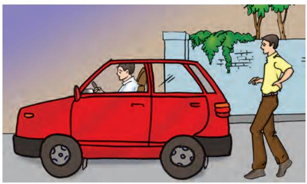

*Fig. 8.2(a): A man standing behind a stationary car*

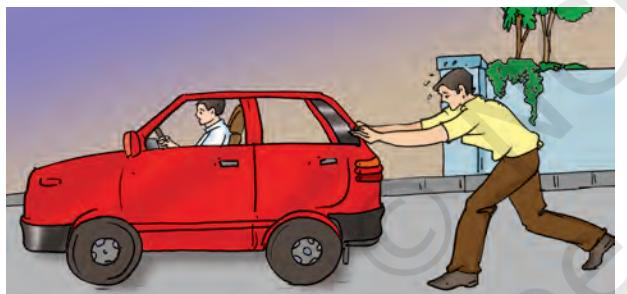

*Fig. 8.2 (b) : A car being pushed by a man*

direction of the applied force. Note that the man has to push the car to make it move.

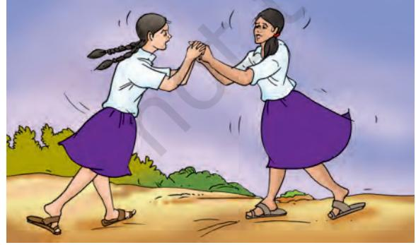

FORCE AND PRESSURE 95

Fig. 8.3 shows three situations that may be familiar to you. Can you decide who is pulling and who is pushing in these cases? In Fig. 8.3 (a), both the girls appear to push each other while

*Fig. 8.3 (b) : Who is pulling whom* ?

the pair of girls in Fig. 8.3 (b) are trying to pull each other. Similarly, the cow and the man in Fig. 8.3 (c) appear to

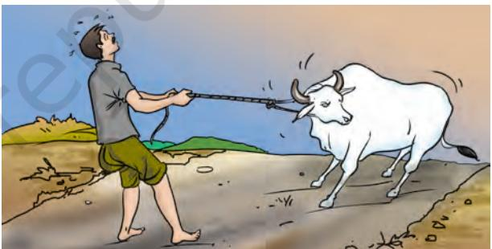

*Fig. 8.3 (c) : Who is pulling whom*?

pull each other. The girls in the two situations shown here are applying force on each other. Is it also true for the man and the cow?

From these examples, we can infer that at least two objects must interact for a force to come into play. Thus, an interaction of one object with another object results in a force between the two objects.

# 8.3 Exploring Forces

Let us try to learn more about forces.

## Activity 8.2

Choose a heavy object like a table or a box, which you can move only by pushing hard. Try to push it all by yourself. Can you move it? Now ask one of your friends to help you in pushing it in the same direction [Fig. 8.4(a)]. Is it easier to move it now? Can you explain why?

Now push the same object, but ask your friend to push it from the opposite side [Fig. 8.4 (b)]. Does the object move? If it does, note the direction in which it moves. Can you guess which one of you is applying a larger force?

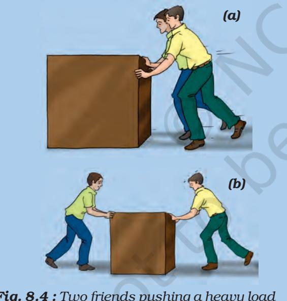

*Fig. 8.4 : Two friends pushing a heavy load (a) in the same direction, (b) in opposite direction*

Have you ever seen a game of tug-of war? In this game two teams pull at a rope in opposite directions (Fig. 8.5). Members of both the teams try to pull the

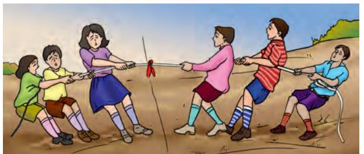

*Fig. 8.5 : The rope may not move if the two teams pull at it with equal force*

rope in their direction. Sometimes the rope simply does not move. Is it not similar to the situation shown in Fig. 8.3 (b)? The team that pulls harder, that is, applies a larger force, finally wins the game.

What do these examples suggest about the nature of force?

Forces applied on an object in the same direction add to one another. Now recall what happened when you and your friend pushed the heavy box in the same direction in Activity 8.2.

If the two forces act in the opposite directions on an object, the net force acting on it is the difference between the two forces. What did you observe in Activity 8.2 when both of you were pushing the heavy box from opposite directions?

Recall that in the tug-of-war when two teams pull equally hard, the rope does not move in any direction.

So, we learn that a force could be larger or smaller than the other or equal to each other. The strength of a force is usually expressed by its magnitude. We have also to specify the direction in which a force acts. Also, if the direction or the magnitude of the applied force changes, its effect also changes.

In general, more than one force may be acting on an object. However, the effect on the object is due to the net force acting on it.

## 8.4 A Force can Change the State of Motion

Let us now find out what happens when a force acts on an object.

## Activity 8.3

Take a rubber ball and place it on a level surface such as a table top or a concrete floor. Now, gently push the ball along the level surface (Fig. 8.6). Does the ball begin to move? Push the ball again while it is still moving. Is there any change in its speed? Does it increase or decrease?

Next, place your palm in front of the moving ball. Remove your palm as soon as the moving ball touches it. Does your palm apply a force on the ball? What happens to the speed of the ball now? Does it increase or decrease? What would happen if you let your palm hold the moving ball?

*Fig. 8.6 : A ball at rest begins to move when a force is applied on it*

You might recall similar situations. For example, while taking a penalty kick in football, the player applies a force on the ball. Before being hit, the ball was at rest and so its speed was zero. The applied force makes the ball move towards the goal. Suppose, the goalkeeper dives or jumps up to save the goal. By his action the goalkeeper tries to apply a force on the moving ball. The force applied by him can stop or deflect the ball, saving a goal being scored. If the goalkeeper succeeds in stopping the ball, its speed decreases to zero.

These observations suggest that a force applied on an object may change its speed. If the force applied on the object is in the direction of its motion, the speed of the object increases. If the force is applied in the direction opposite to the direction of motion, then it results in a decrease in the speed of the object.

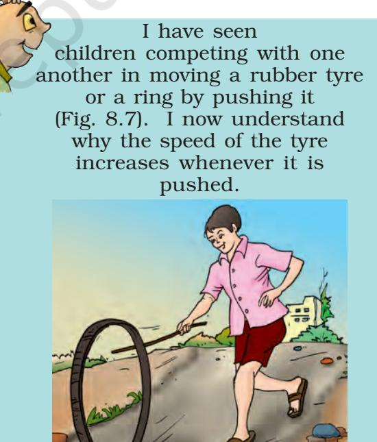

*Fig. 8.7 : To move a tyre faster it has to be pushed repeatedly*

FORCE AND PRESSURE 97

Paheli is curious to know whether application of a force can only change the speed of an object. Let us find out.

## Activity 8.4

Take a ball and place it on a level surface as you did in Activity 8.3. Make the ball move by giving it a push [Fig. 8.8(a)]. Now place a ruler in its path as shown in Fig. 8.8(b). In doing so, you would apply a force on the moving ball. Does the ball continue to move in the same direction after it strikes the ruler? Repeat the activity and try to obstruct the moving ball by placing the ruler in such a way that it makes different angles to its path. In each case note your observations about the direction of motion of the ball after it strikes the ruler.

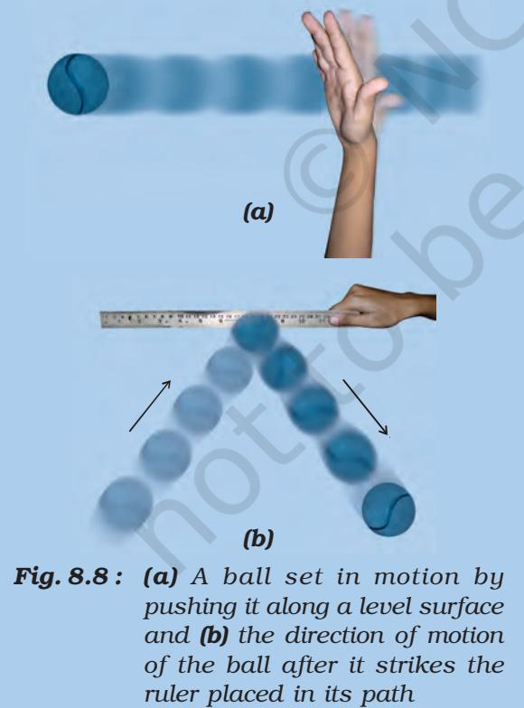

Let us consider some more examples. In a game of volleyball, players often push the moving ball to their team mates to make a winning move. Sometimes the ball is returned to the other side of the court by pushing or smashing it. In cricket, a batsman plays his or her shot by applying a force on the ball with the bat. Is there any change in the direction of motion of the ball in these cases? In all these examples the speed and the direction of the moving ball change due to the application of a force. Can you give a few more examples of this kind?

A change in either the speed of an object, or its direction of motion, or both, is described as a change in its state of motion. Thus, a force may bring a change in the state of motion of an object.

#### State of Motion

The state of motion of an object is described by its speed and the direction of motion. The state of rest is considered to be the state of zero speed. An object may be at rest or in motion; both are its states of motion.

Does it mean that the application of a force would always result in a change in the state of motion of the object? Let us find out.

It is common experience that many a time application of force does not result in a change in the state of motion. For example, a heavy box may not move at all even if you apply the maximum force that you can exert. Again, no effect of force is observed when you try to push a wall.

## 8.5 Force can Change the Shape of an Object

## Activity 8.5

Some situations have been given in Column 1 of Table 8.2 in which objects are not free to move. Column 2 of the Table suggests the manner in which a force can be applied on each object while Column 3 shows a diagram of the action. Try to observe the effect of force in as many situations as possible. You can also add similar situations using available material from your environment. Note your observations in Columns 4 and 5 of the Table.

| Description of | How to Apply | Diagram | Action of Force |  |  |  |  |
| --- | --- | --- | --- | --- | --- | --- | --- |
| Situation | Force |  |  | Change in |  | Change in |  |
|  |  |  | State of |  |  | Shape |  |
|  |  |  |  | Motion |  |  |  |
|  |  |  |  | Yes | No | Yes | No |
| A lump of dough on a | Pressing it down with your hands. |  |  |  |  |  |  |
| plate. |  |  |  |  |  |  |  |
| Spring fixed to | By sitting on the |  |  |  |  |  |  |
| the seat of a | seat. |  |  |  |  |  |  |
| bicycle. |  |  |  |  |  |  |  |
| A rubber band | By hanging a |  |  |  |  |  |  |
| suspended from | weight or by |  |  |  |  |  |  |
| a hook/nail fixed on a wall. | pulling its free end. |  |  |  |  |  |  |
| A plastic or | By putting a weight |  |  |  |  |  |  |
| metal scale | at the centre of the |  |  |  |  |  |  |
| placed between | scale. |  |  |  |  |  |  |
| two bricks. |  |  |  |  |  |  |  |

#### Table 8.2 : Studying the Effect of Force on Objects

What do you conclude from the observations noted in Table 8.2? What happens when you apply a force on an inflated balloon by pressing it between your palms? What happens to the shape of a ball of dough when it is rolled to make a *chapati*? What happens when you press a rubber ball placed on a table? In all these examples you saw that the application of force on an object may change its shape.

Having performed all the above activities, you would have realised that a force

- l may make an object move from rest.
- l may change the speed of an object if it is moving.
- l may change the direction of motion of an object.
- l may bring about a change in the shape of an object.
- l may cause some or all of these effects.

While a force may cause one or more of these effects, it is important to remember that none of these actions can take place without the action of a force. Thus, an object cannot move by itself, it cannot change speed by itself, it cannot change direction by itself and its shape cannot change by itself.

## 8.6 Contact Forces

#### Muscular Force

Can you push or lift a book lying on a table without touching it? Can you lift a bucket of water without holding it? Generally, to apply a force on an object, your body has to be in contact with the object. The contact may also be with the help of a stick or a piece of rope. When we push an object like a school bag or lift a bucket of water, where does the force come from? This force is caused by the action of muscles in our body. The force resulting due to the action of muscles is known as the muscular force.

> It is the muscular force that enables us to perform all activities involving movement or bending of our body. In Class VII you have learnt that in the process of digestion the food gets pushed through the alimentary canal. Could it be a muscular force that does it? You also know that lungs expand and contract while we inhale and exhale air during breathing. Where are these muscles located which make breathing possible? Can you list a few more examples of the force exerted by the muscles in our body?

Animals also make use of muscular force to carry out their physical activities and other tasks. Animals like bullocks, horses, donkeys and camels are used to perform various tasks for us. In per forming these tasks they use muscular force (Fig. 8.9).

*Fig. 8.9 : Muscular force of animals is used to carry out many difficult tasks*

100 SCIENCE

Since muscular force can be applied only when it is in contact with an object, it is also called a contact force. Are there other types of contact forces? Let us find out.

#### Friction

Recall some of your experiences. A ball rolling along the ground gradually slows down and finally comes to rest. When we stop pedalling a bicycle, it gradually slows down and finally comes to a stop. A car or a scooter also comes to rest once its engine is switched off. Similarly, a boat comes to rest if we stop rowing it. Can you add some more such experiences?

In all these situations no force appears to be acting on the objects, yet their speed gradually decreases and they come to rest after some time. What causes a change in their state of motion? Could some force be acting on them! Can you guess the direction in which the force must be acting in each case?

The force responsible for changing the state of motion of objects in all these examples is the force of friction. It is the force of friction between the surface of the ball and the ground that brings the moving ball to rest. Similarly, friction between water and the boat brings it to a stop once you stop rowing.

The force of friction always acts on all the moving objects and its direction is always opposite to the direction of motion. Since the force of friction arises due to contact between surfaces, it is also an example of a contact force. You will learn more about this force in Chapter 9.

You may be wondering whether it is essential for the agent applying a force on an object to be always in contact with it. Let us find out.

# 8.7 Non-contact Forces Magnetic Force

#### Activity 8.6

Take a pair of bar magnets. Place the longer side of one of the magnets over three round shaped pencils or wooden rollers as shown in Fig. 8.10. Now bring one end of the other magnet near the end of the magnet placed on the rollers. Make sure that the two magnets do not touch each other. Observe what happens. Next, bring the other end of the magnet near the same end of the magnet placed on the rollers (Fig.8.10). Note what happens to the magnet placed on the rollers every time another magnet is brought near it.

*Fig. 8.10 : Observing attraction and repulsion between two magnets*

Does the magnet on the rollers begin to move when the other magnet is brought near it? Does it always move in the direction of the approaching magnet? What do these observations suggest? Does it mean that some force must be acting between the two magnets?

You have learnt in Class VI that like poles of two magnets repel each other and unlike poles attract each other. Attraction or repulsion between objects can also be seen as another form of pull or push. Do you have to bring the magnets in contact for observing the force between them? A magnet can exert a force on another magnet without being in contact with it. The force exerted by a magnet is an example of a non-contact force.

Similarly, the force exerted by a magnet on a piece of iron is also a non-contact force.

#### Electrostatic Force

### Activity 8.7

Take a plastic straw and cut it into nearly two equal pieces. Suspend one of the pieces from the edge of a table with the help of a piece of thread (Fig. 8.11). Now hold the other piece of straw in your hand and rub its free end with a sheet of paper. Bring the rubbed end of the straw near the suspended straw. Make sure that the two pieces do not touch each other. What do you observe?

Next, rub the free end of the suspended piece of straw with a sheet of paper. Again, bring the piece of straw that was rubbed earlier with paper near the free end of the suspended straw. What do you observe now?

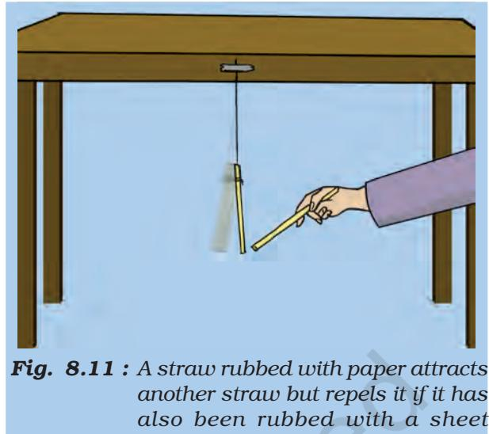

A straw is said to have acquired electrostatic charge after it has been rubbed with a sheet of paper. Such a straw is an example of a charged body.

*of paper*

The force exerted by a charged body on another charged or uncharged body is known as electrostatic force. This force comes into play even when the bodies are not in contact. The electrostatic force, therefore, is another example of a non-contact force. You will learn more about electric charges in Chapter 12.

#### Gravitational Force

You know that a coin or a pen falls to the ground when it slips off your hand. Leaves and fruits also fall to the ground when they get detached from the plant. Have you ever wondered why it is so?

When the coin is held in your hand it is at rest. As soon as it is released, it begins to move downwards. It is clear that the state of motion of the coin undergoes a change. Can this happen without a force acting on it? Which is this force?

Objects or things fall towards the earth because it pulls them. This force is called the force of gravity, or just gravity. This is an attractive force. The force of gravity acts on all objects. The force of gravity acts on all of us all the time without our being aware of it. Water begins to flow towards the ground as soon as we open a tap. Water in rivers flows downward due to the force of gravity.

> Gravity is not a property of the earth alone. In fact, every object in the universe, whether small or large, exerts a force on every other object. This force is known as the gravitational force.

#### 8.8 Pressure

Is there any relation between pressure and force? Let us find out.

Try to push a nail into a wooden plank by its head. Did you succeed? Try now to push the nail by the pointed end (Fig. 8.12). Could you do it this time?

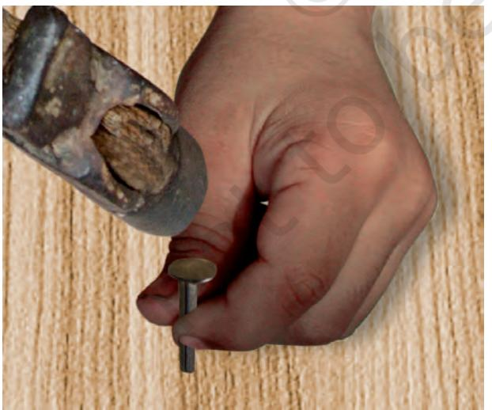

*Fig. 8.13 : A porter carrying a heavy load Fig. 8.12 : Pushing a nail into a wooden plank*

Try cutting vegetables with a blunt knife and then with a sharp knife. Which is easier?

Do you get the feeling that the area over which the force is applied (for example, the pointed end of the nail) plays a role in making these tasks easier?

The force acting on a unit area of a surface is called pressure.

pressure = force / area on which it acts

At this stage we consider only those forces which act perpendicular to the surface on which the pressure is to be computed.

> I now understand why porters place a round piece of cloth on their heads, when they have to carry heavy loads (Fig. 8.13). By doing this they increase the area of contact of the load with their head. So, the pressure on their head is reduced and they find it easier to carry the load.

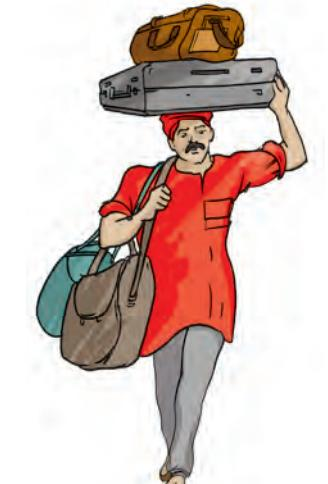

FORCE AND PRESSURE 103

Note that the area is in the denominator in the above expression. So, the smaller the area, larger the pressure on a surface for the same force. The area of the pointed end of the nail is much smaller than that of its head. The same force, therefore, produces a pressure sufficient to push the pointed end of the nail into the wooden plank.

Can you explain now why shoulder bags are provided with broad straps and not thin strap? And, why the tools meant for cutting and piercing always have sharp edges?

Do liquids and gases also exert pressure? Does it also depend on the area on which the force acts? Let us find out.

## 8.9 Pressure Exerted by Liquids and Gases

## Activity 8.8

Take a transparent glass tube or a plastic pipe. The length of the pipe/ tube should be about 25 cm and its diameter should be 5-7.5 cm. Also take a piece of thin sheet of a good quality rubber, say, a rubber balloon. Stretch the rubber sheet tightly over one end of the pipe. Hold the pipe at the middle, keeping it in a vertical position (Fig. 8.14). Ask one of your friends to pour some water in the pipe. Does the rubber sheet bulge out? Note also the height of the water column in the pipe. Pour some more water. Observe again the bulge in the rubber sheet and the height of the water column in the pipe. Repeat this process a few more times. Can you see any relation between the amount of the bulge in the rubber sheet and the height of the water column in the pipe?

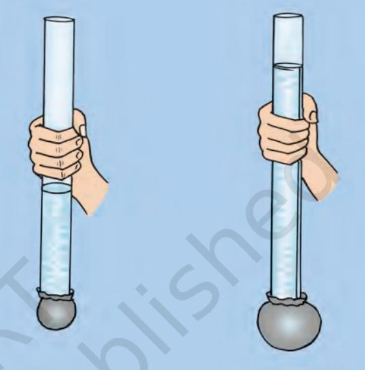

*Fig. 8.14 : Pressure exerted by water at the bottom of the container depends on the height of its column*

# Activity 8.9

Take a plastic bottle. You can take a discarded water or soft drink bottle. Fix a cylindrical glass tube, a few cm long near its bottom as shown in Fig. 8.15. You can do so by slightly heating one end of the glass tube and then quickly inserting it near the bottom of the bottle. Make sure that the water does not leak from the joint. If there is any leakage, seal it with molten wax. Cover the mouth of the glass tube with a thin rubber sheet as you did in Activity 8.8. Now fill the bottle upto half with water. What do you observe? Why does the rubber sheet fixed to the glass tube bulge this time? Pour some more water in the bottle. Is there any change in the bulge of the rubber sheet?

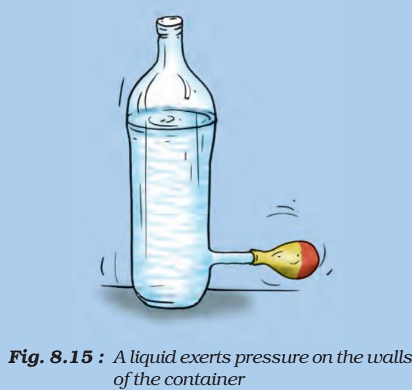

Note that the rubber sheet has been fixed on the side of the container and not at the bottom. Does the bulging of the rubber sheet in this case indicate that water exerts pressure on the sides of the container as well? Let us investigate further.

## Activity 8.10

Take an empty plastic bottle or a cylindrical container. You can take a used tin can or a used plastic bottle. Drill four holes all around near the bottom of the bottle. Make sure that the holes are at the same height from the bottom (Fig. 8.16). Now fill the bottle with water. What do you observe?

Do the different streams of water coming out of the holes fall at the same distance from the bottle? What does this indicate?

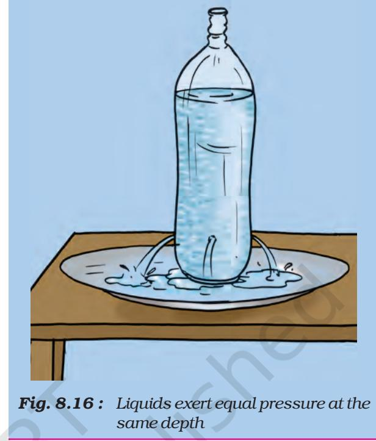

#### Can you now say that liquids exert pressure on the walls of the container?

Do gases also exert pressure? Do they also exert pressure on the walls of their containers? Let us find out.

> I have seen fountains of water coming out of the leaking joints or holes in pipes supplying water. Is it not due to the pressure exerted by water on the walls of the pipes?

When you inflate a balloon, why do you have to close its mouth? What happens when you open the mouth of an inflated balloon? Suppose you have a balloon which has holes. Would you

FORCE AND PRESSURE 105

be able to inflate it? If not, why? Can we say that air exerts pressure in all directions?

Do you recall what happens to the air in the bicycle tube when it has a puncture? Do these observations suggest that air exerts pressure on the inner walls of an inflated balloon or a tube? So, we find that gases, too, exert pressure on the walls of their container.

## 8.10 Atmospheric Pressure

You know that there is air all around us. This envelop of air is known as the atmosphere. The atmospheric air extends up to many kilometres above the surface of the earth. The pressure exerted by this air is known as atmospheric pressure. We know that pressure is force per unit area. If we imagine a unit area and a very long cylinder standing on it filled with air, then the force of gravity on the air in this cylinder is the atmospheric pressure (Fig. 8.17).

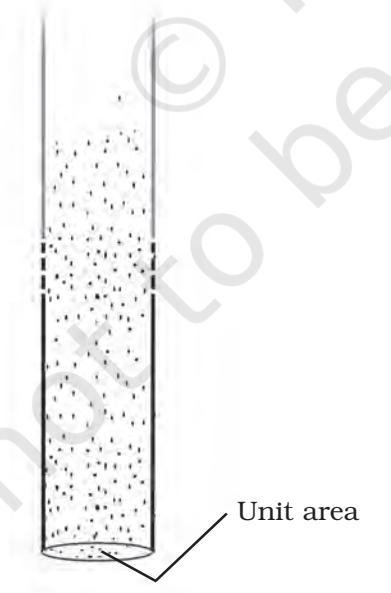

But, how large or small is the atmospheric pressure? Let us get an idea about its magnitude.

## Activity 8.11

Take a good quality rubber sucker. It looks like a small rubber cup (Fig. 8.18). Press it hard on a smooth plane surface. Does it stick to the surface? Now try to pull it off the surface. Can you do it?

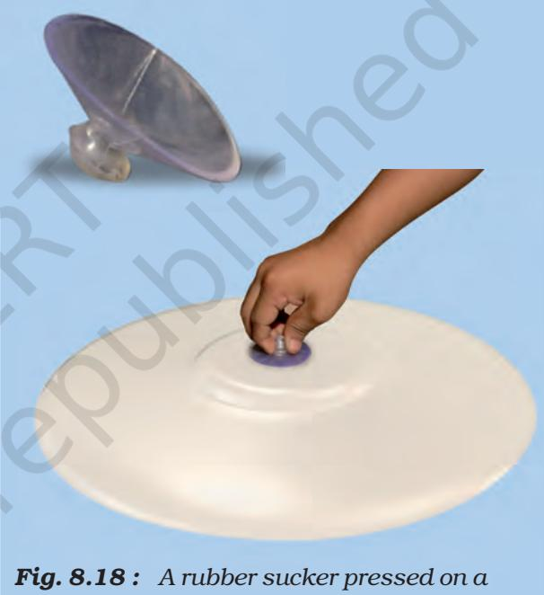

*surface*

When you press the sucker, most of the air between its cup and the surface escapes out. The sucker sticks to the sur face because the pressure of atmosphere acts on it. To pull the sucker off the surface, the applied force should be large enough to overcome the atmospheric pressure. This activity might give you an idea about the magnitude of atmospheric pressure. In fact, it would not be possible for any human being to pull the sucker off the surface if there were no air at all between the sucker and the surface. Does it give you an idea how large the atmospheric pressure is?

If the area of my head were 15 cm × 15 cm, how much force air will exert on my head?

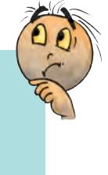

The force due to air in a column of the height of the atmosphere and area 15 cm × 15 cm (Fig. 8.19) is nearly equal to the force of gravity on an object of mass 225 kg (2250N). The reason we are not crushed under this force of gravity is that the pressure inside our bodies is also equal to the atmospheric pressure and balances the pressure from outside.

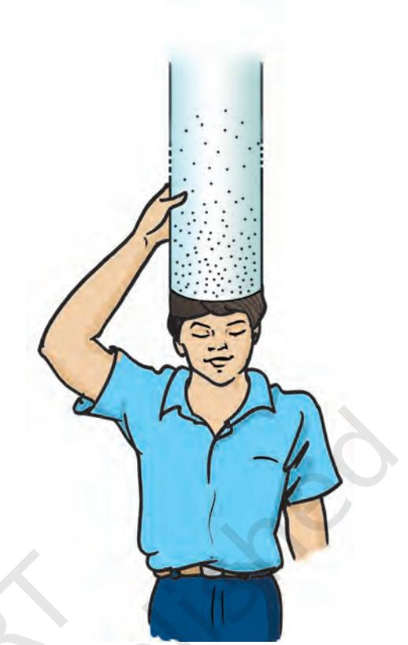

*Fig. 8.19 : Pressure of atmosphere on your head*

#### Did you know?

Otto von Guericke, a German scientist of the 17th century, invented a pump to extract air out of a vessel. With the help of this pump, he demonstrated dramatically the force of the air pressure. He joined two hollow metallic hemispheres of 51 cm diameter each and pumped air out of them. Then he employed eight horses on each hemisphere to pull them apart (Fig. 8.20). So great is the force of air pressure that the hemispheres could not be pulled apart.

FORCE AND PRESSURE 107

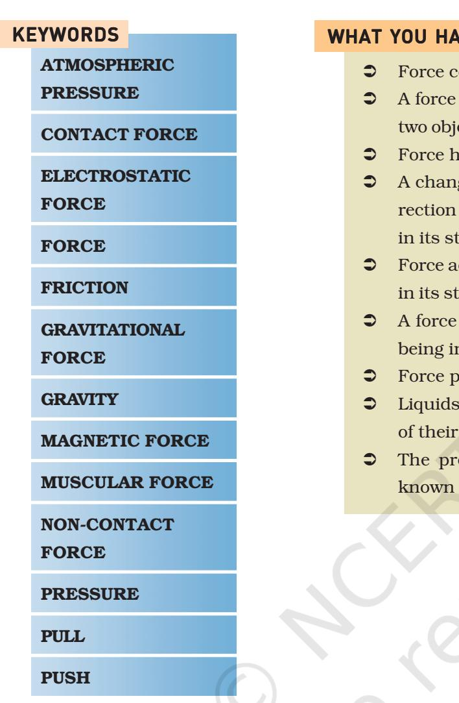

#### WHAT YOU HAVE LEARNT

- ‹ Force could be a push or a pull.
- ‹ A force arises due to the interaction between two objects.
- ‹ Force has magnitude as well as direction.
- ‹ A change in the speed of an object or the direction of its motion or both implies a change in its state of motion.
- ‹ Force acting on an object may cause a change in its state of motion or a change in its shape.
- ‹ A force can act on an object with or without being in contact with it.
- ‹ Force per unit area is called pressure.
- ‹ Liquids and gases exert pressure on the walls of their containers.
- ‹ The pressure exerted by air around us is known as atmospheric pressure.

#### Exercises

- 1. Give two examples each of situations in which you push or pull to change the state of motion of objects.
- 2. Give two examples of situations in which applied force causes a change in the shape of an object.
- 3. Fill in the blanks in the following statements.
	- (a) To draw water from a well we have to __________ at the rope.
	- (b) A charged body __________ an uncharged body towards it.
	- (c) To move a loaded trolley we have to __________ it.
	- (d) The north pole of a magnet __________the north pole of another magnet.

- 4. An archer stretches her bow while taking aim at the target. She then releases the arrow, which begins to move towards the target. Based on this information fill up the gaps in the following statements using the following terms.
muscular, contact, non-contact, gravity, friction, shape, attraction

- (a) To stretch the bow, the archer applies a force that causes a change in its __________.
- (b) The force applied by the archer to stretch the bow is an example of __________ force.
- (c) The type of force responsible for a change in the state of motion of the arrow is an example of a __________ force.
- (d) While the arrow moves towards its target, the forces acting on it are due to __________ and that due to __________ of air.
- 5. In the following situations identify the agent exerting the force and the object on which it acts. State the effect of the force in each case.
	- (a) Squeezing a piece of lemon between the fingers to extract its juice.
	- (b) Taking out paste from a toothpaste tube.
	- (c) A load suspended from a spring while its other end is on a hook fixed to a wall.
	- (d) An athlete making a high jump to clear the bar at a certain height.
- 6. A blacksmith hammers a hot piece of iron while making a tool. How does the force due to hammering affect the piece of iron?
- 7. An inflated balloon was pressed against a wall after it has been rubbed with a piece of synthetic cloth. It was found that the balloon sticks to the wall. What force might be responsible for the attraction between the balloon and the wall?
- 8. Name the forces acting on a plastic bucket containing water held above ground level in your hand. Discuss why the forces acting on the bucket do not bring a change in its state of motion.
- 9. A rocket has been fired upwards to launch a satellite in its orbit. Name the two forces acting on the rocket immediately after leaving the launching pad.
- 10. When we press the bulb of a dropper with its nozzle kept in water, air in the dropper is seen to escape in the form of bubbles. Once we release the pressure on the bulb, water gets filled in the dropper. The rise of water in the dropper is due to
	- (a) pressure of water.
	- (b) gravity of the earth.
	- (c) shape of rubber bulb.
	- (d) atmospheric pressure.

## **Extended Learning — Activities and Projects**

- 1. Make a 50 cm × 50 cm bed of dry sand about 10 cm in thickness. Make sure that its top surface is levelled. Take a wooden or a plastic stool. Cut two strips of graph paper each with a width of 1 cm. Paste them vertically on any leg of the stool - one at the bottom and the other from the top. Now gently put the stool on the sand bed with its legs resting on the sand. Increase the size of sand bed if required. Now put a load, say a school bag full of books, on the seat of the stool. Mark the level of sand on the graph strip. This would give you the depth, if any, to which the legs of stool sink in sand. Next, turn the stool upside down so that now it rests on its seat on the sand bed. Note the depth to which the stool sinks now. Next, put the same load on the stool and note the depth to which it sinks in the sand. Compare the pressure exerted by the stool in the two situations.
- 2. Take a tumbler and fill it with water. Cover the mouth of the tumbler with a thick card similar to that of a postcard. Hold the tumbler with one hand while keeping the card pressed to its mouth with your other hand. Turn the tumbler upside down while keeping the card pressed to its mouth. Make sure that the tumbler is held vertical. Gently remove the hand pressing the card. What do you observe? Does the card get detached allowing the water to spill? With a little practice you will find that the card continues to hold water in the tumbler even after it is not supported by your hand. Also try this activity by using a piece of cloth to hold the tumbler in an upside down position (Fig. 8.21).

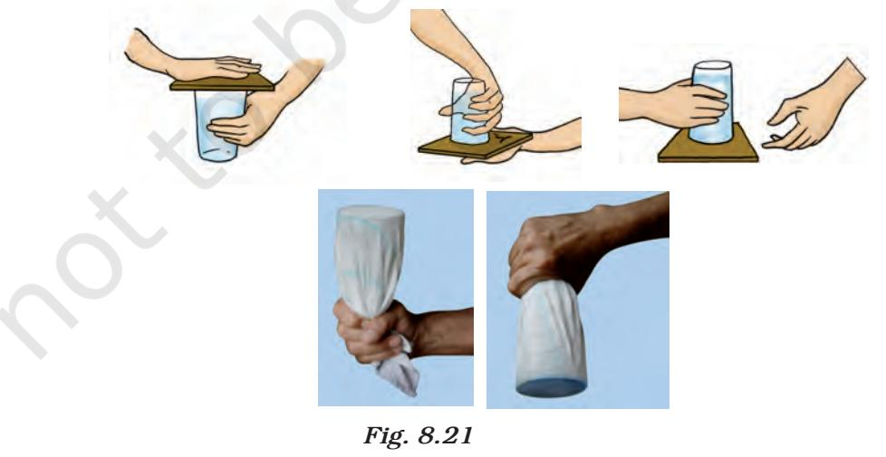

- 3. Take 4-5 plastic bottles of different shapes and sizes. Join them together with small pieces of glass or rubber tube as shown in Fig. 8.22. Keep this arrangement on a level surface. Now pour water in any one of the bottles. Note whether the bottle in which water is poured gets filled first or all the bottles get filled up simultaneously. Note the level of water in all the bottles from time to time. Try to explain your observations.
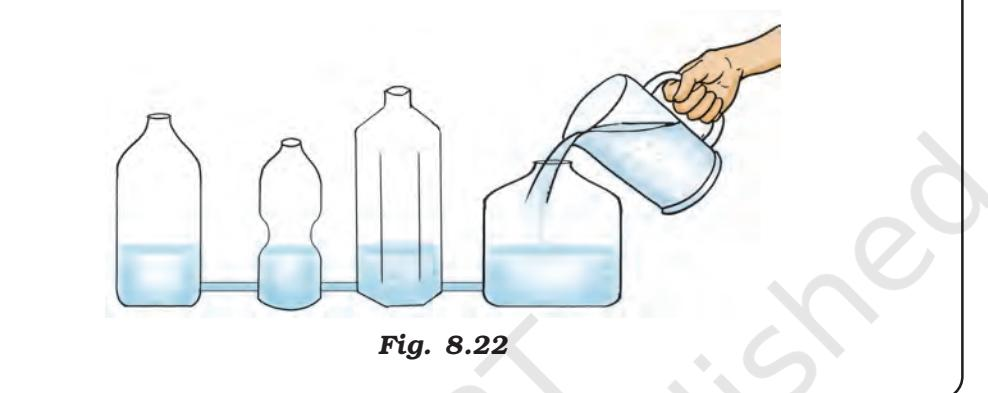

