# **11** Chapter

Everyday we hear sounds from various sources like humans, birds, bells, machines, vehicles, televisions, radios etc. Sound is a form of energy which produces a sensation of hearing in our ears. There are also other forms of energy like mechanical energy, light energy, etc. We have talked about mechanical energy in the previous chapters. You have been taught about conservation of energy, which states that we can neither create nor destroy energy. We can just change it from one form to another. When you clap, a sound is produced. Can you produce sound without utilising your energy? Which form of energy did you use to produce sound? In this chapter we are going to learn how sound is produced and how it is transmitted through a medium and received by our ears.

### **11.1 Production of Sound**

*Activity _____________11.1*

- Take a tuning fork and set it vibrating by striking its prong on a rubber pad. Bring it near your ear.
- Do you hear any sound?
- Touch one of the prongs of the vibrating tuning fork with your finger and share your experience with your friends.
- Now, suspend a table tennis ball or a small plastic ball by a thread from a support [Take a big needle and a thread, put a knot at one end of the thread, and then with the help of the needle pass the thread through the ball]. Touch the ball gently with the prong of a vibrating tuning fork (Fig. 11.1).
- Observe what happens and discuss with your friends.

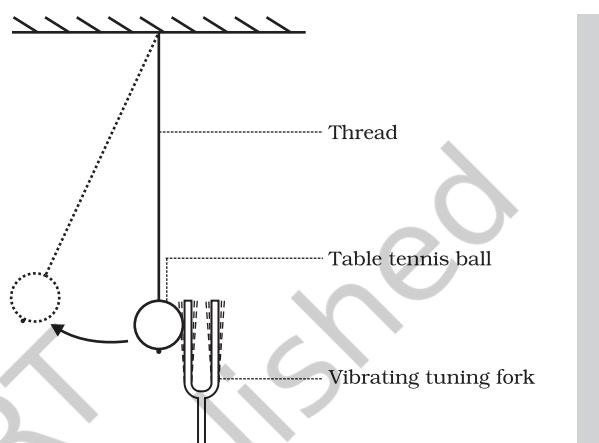

- *Fig. 11.1: Vibrating tuning fork just touching the suspended table tennis ball.*
### *Activity _____________11.2*

• Fill water in a beaker or a glass up to the brim. Gently touch the water surface with one of the prongs of the vibrating tuning fork, as shown in Fig. 11.2.

• Next dip the prongs of the vibrating tuning fork in water, as shown in Fig. 11.3.

- Observe what happens in both the cases.
- Discuss with your friends why this happens.

*Fig. 11.2: One of the prongs of the vibrating tuning fork touching the water surface.*

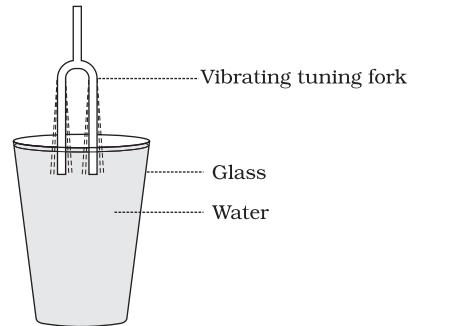

*Fig. 11.3: Both the prongs of the vibrating tuning fork dipped in water*

From the above activities what do you conclude? Can you produce sound without a vibrating object?

In the above activities we have produced sound by striking the tuning fork. We can also produce sound by plucking, scratching, rubbing, blowing or shaking different objects. As per the above activities what do we do to the objects? We set the objects vibrating and produce sound. Vibration means a kind of rapid to and fro motion of an object. The sound of the human voice is produced due to vibrations in the vocal cords. When a bird flaps its wings, do you hear any sound? Think how the buzzing sound accompanying a bee is produced. A stretched rubber band when plucked vibrates and produces sound. If you have never done this, then do it and observe the vibration of the stretched rubber band.

### *Activity _____________11.3*

- Make a list of different types of musical instruments and discuss with your friends which part of the instrument vibrates to produce sound.
### **11.2 Propagation of Sound**

Sound is produced by vibrating objects. The matter or substance through which sound is transmitted is called a medium. It can be solid, liquid or gas. Sound moves through a medium from the point of generation to the listener. When an object vibrates, it sets the particles of the medium around it vibrating. The particles do not travel all the way from the vibrating object to the ear. A particle of the medium in contact with the vibrating object is first displaced from its equilibrium position. It then exerts a force on the adjacent particle. As a result of which the adjacent particle gets displaced from its position of rest. After displacing the adjacent particle the first particle comes back to its original position. This process continues in the medium till the sound reaches your ear. The disturbance created by a source of sound in the medium travels through the medium and not the particles of the medium.

A wave is a disturbance that moves through a medium when the particles of the medium set neighbouring particles into motion. They in turn produce similar motion in others. The particles of the medium do not move forward themselves, but the disturbance is carried forward. This is what happens during propagation of sound in a medium, hence sound can be visualised as a wave. Sound waves are characterised by the motion of particles in the medium and are called mechanical waves.

Air is the most common medium through which sound travels. When a vibrating object moves forward, it pushes and compresses the air in front of it creating a region of high pressure. This region is called a compression (C), as shown in Fig. 11.4. This compression starts to move away from the vibrating object. When the vibrating object moves backwards, it creates a region of low pressure called rarefaction (R), as shown in Fig. 11.4. As the object moves back and forth rapidly, a series of compressions and rarefactions is created in the air. These make the sound wave that

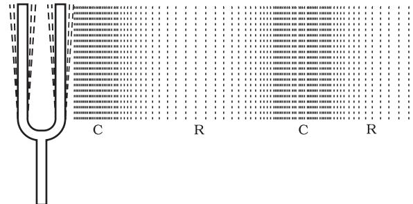

*Fig. 11.4: A vibrating object creating a series of compressions (C) and rarefactions (R) in the medium.*

propagates through the medium. Compression is the region of high pressure and rarefaction is the region of low pressure. Pressure is related to the number of particles of a medium in a given volume. More density of the particles in the medium gives more pressure and vice versa. Thus, propagation of sound can be visualised as propagation of density variations or pressure variations in the medium.

## uestion

- *1. How does the sound produced by a vibrating object in a medium reach your ear?* Q
	- *2. Explain how sound is produced by your school bell.*
	- *3. Why are sound waves called mechanical waves?*
	- *4. Suppose you and your friend are on the moon. Will you be able to hear any sound produced by your friend?*

#### **11.2.1 SOUND WAVES ARE LONGITUDINAL**

**WAVES**

#### *Activity _____________11.4*

- Take a slinky. Ask your friend to hold one end. You hold the other end. Now stretch the slinky as shown in Fig. 11.5(a). Then give it a sharp push towards your friend.
- What do you notice? If you move your hand pushing and pulling the slinky alternatively, what will you observe?
- If you mark a dot on the slinky, you will observe that the dot on the slinky will move back and forth parallel to the direction of the propagation of the disturbance.

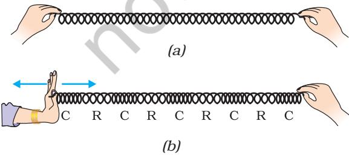

*Fig. 11.5: Longitudinal wave in a slinky.*

The regions where the coils become closer are called compressions (C) and the regions where the coils are further apart are called rarefactions (R). As we already know, sound propagates in the medium as a series of compressions and rarefactions. Now, we can compare the propagation of disturbance in a slinky with the sound propagation in the medium. These waves are called longitudinal waves. In these waves the individual particles of the medium move in a direction parallel to the direction of propagation of the disturbance. The particles do not move from one place to another but they simply oscillate back and forth about their position of rest. This is exactly how a sound wave propagates, hence sound waves are longitudinal waves.

There is also another type of wave, called a transverse wave. In a transverse wave particles do not oscillate along the direction of wave propagation but oscillate up and down about their mean position as the wave travels. Thus, a transverse wave is the one in which the individual particles of the medium move about their mean positions in a direction perpendicular to the direction of wave propagation. When we drop a pebble in a pond, the waves you see on the water surface is an example of transverse wave. Light is a transverse wave but for light, the oscillations are not of the medium particles or their pressure or density— it is not a mechanical wave. You will come to know more about transverse waves in higher classes.

#### **11.2.2 CHARACTERISTICS OF A SOUND WAVE**

We can describe a sound wave by its

- frequency
- amplitude and
- speed.

A sound wave in graphic form is shown in Fig. 11.6(c), which represents how density and pressure change when the sound wave moves in the medium. The density as well as the pressure of the medium at a given time varies with distance, above and below the average value of density and pressure. Fig. 11.6(a) and Fig. 11.6(b) represent the density and pressure variations, respectively, as a sound wave propagates in the medium.

Compressions are the regions where particles are crowded together and represented by the upper portion of the curve in Fig. 11.6(c). The peak represents the region of maximum compression. Thus, compressions are regions where density as well as pressure is high. Rarefactions are the regions of low pressure where particles are spread apart and are represented by the valley, that is, the lower portion of the curve in Fig. 11.6(c). A peak is called the crest and a valley is called the trough of a wave.

The distance between two consecutive compressions (C) or two consecutive rarefactions (R) is called the wavelength, as shown in Fig. 11.6(c), The wavelength is usually represented by λ (Greek letter lambda). Its SI unit is metre (m).

Heinrich Rudolph Hertz was born on 22 February 1857 in Hamburg, Germany and educated at the University of Berlin. He confirmed J.C. Maxwell's electromagnetic theory by his experiments. He laid the

foundation for future development of radio, telephone, telegraph and even television. He also discovered the photoelectric effect which was later explained by Albert Einstein. The SI unit of frequency was named as hertz in his honour. *H. R. Hertz*

Frequency tells us how frequently an event occurs. Suppose you are beating a drum. How many times you are beating the drum in unit time is called the frequency of your beating the drum. We know that when sound is propagated through a medium, the

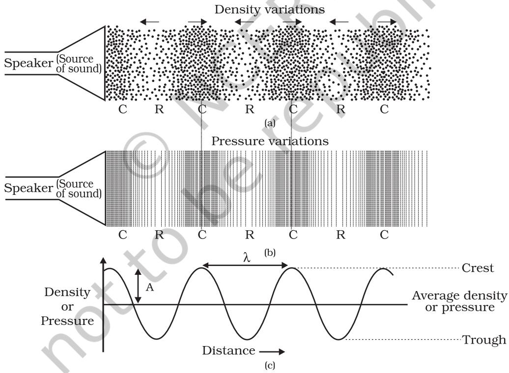

*Fig. 11.6: Sound propagates as density or pressure variations as shown in (a) and (b), (c) represents graphically the density and pressure variations.*

density of the medium oscillates between a maximum value and a minimum value. The change in density from the maximum value to the minimum value, then again to the maximum value, makes one complete oscillation. The number of such oscillations per unit time is the frequency of the sound wave. If we can count the number of the compressions or rarefactions that cross us per unit time, we will get the frequency of the sound wave. It is usually represented by ν (Greek letter, nu). Its SI unit is hertz (symbol, Hz).

The time taken by two consecutive compressions or rarefactions to cross a fixed point is called the time period of the wave. In other words, we can say that the time taken for one complete oscillation is called the time period of the sound wave. It is represented by the symbol *T*. Its SI unit is second (s). Frequency and time period are related as follows:

$$v={\frac{1}{T}}$$

 A violin and a flute may both be played at the same time in an orchestra. Both sounds travel through the same medium, that is, air and arrive at our ear at the same time. Both sounds travel at the same speed irrespective of the source. But the sounds we receive are

different. This is due to the different characteristics associated with the sound. Pitch is one of the characteristics.

How the brain interprets the frequency of an emitted sound is called its pitch. The faster the vibration of the source, the higher is the frequency and the higher is the pitch, as shown in Fig. 11.7. Thus, a high pitch sound corresponds to more number of compressions and rarefactions passing a fixed point per unit time.

Objects of different sizes and conditions vibrate at different frequencies to produce sounds of different pitch.

The magnitude of the maximum disturbance in the medium on either side of the mean value is called the amplitude of the wave. It is usually represented by the letter A,

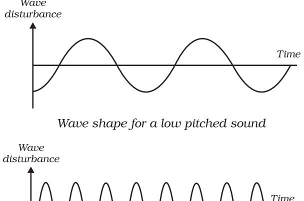

#### *Fig. 11.7: Low pitch sound has low frequency and high pitch of sound has high frequency.*

as shown in Fig. 11.6(c). For sound its unit will be that of density or pressure.

The loudness or softness of a sound is determined basically by its amplitude. The amplitude of the sound wave depends upon the force with which an object is made to vibrate. If we strike a table lightly, we hear a soft sound because we produce a sound wave

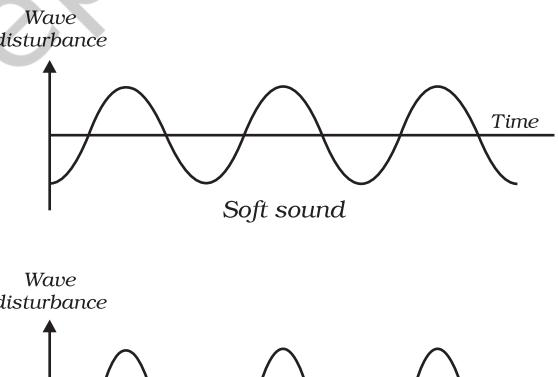

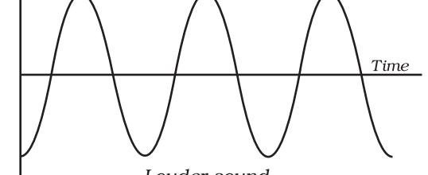

*Fig. 11.8: Soft sound has small amplitude and louder sound has large amplitude.*

*SOUND* **131**

of less energy (amplitude). If we hit the table hard we hear a louder sound. Can you tell why? A sound wave spreads out from its source. As it moves away from the source its amplitude as well as its loudness decreases. Louder sound can travel a larger distance as it is associated with higher energy. Fig. 11.8 shows the wave shapes of a loud and a soft sound of the same frequency.

The quality or timber of sound is that characteristic which enables us to distinguish one sound from another having the same pitch and loudness. The sound which is more pleasant is said to be of a rich quality. A sound of single frequency is called a tone. The sound which is produced due to a mixture of several frequencies is called a note and is pleasant to listen to. Noise is unpleasant to the ear! Music is pleasant to hear and is of rich quality.

uestions

- Q Q *1. Which wave property determines (a) loudness, (b) pitch? 2. Guess which sound has a higher pitch: guitar or car horn?*
The speed of sound is defined as the distance which a point on a wave, such as a compression or a rarefaction, travels per unit time.

We know,

speed, *v* = distance / time

= λ*T*

Here λ is the wavelength of the sound wave. It is the distance travelled by the sound wave in one time period (*T*) of the wave. Thus,

* [16] M. C.  
  

or *v* = λ ν

That is, speed = wavelength × frequency. The speed of sound remains almost the same for all frequencies in a given medium under the same physical conditions.

- **Example 11.1** A sound wave has a frequency of 2 kHz and wave length 35 cm. How long will it take to travel 1.5 km?
#### **Solution:**

- Given, Frequency, ν = 2 kHz = 2000 Hz Wavelength, λ = 35 cm = 0.35 m We know that speed, *v* of the wave = wavelength × frequency *v* = λ ν = 0.35 m 2000 Hz = 700 m/s The time taken by the wave to travel a distance, *d* of 1.5 km is
- 

Thus sound will take 2.1 s to travel a distance of 1.5 km.

### uestions

- *1. What are wavelength, frequency, time period and amplitude of a sound wave?*
- *2. How are the wavelength and frequency of a sound wave related to its speed?*
- *3. Calculate the wavelength of a sound wave whose frequency is 220* Hz *and speed is 440* m/s *in a given medium.*
- *4. A person is listening to a tone of 500* Hz *sitting at a distance of 450* m *from the source of the sound. What is the time interval between successive compressions from the source?*

The amount of sound energy passing each second through unit area is called the intensity of sound. We sometimes use the terms "loudness" and "intensity" interchangeably, but they are not the same. Loudness is a measure of the response of the ear to the sound. Even when two sounds are of equal intensity, we may hear one as louder than the other simply because our ear detects it better.

# uestion Q

#### *1. Distinguish between loudness and intensity of sound.*

#### **11.2.3 SPEED OF SOUND IN DIFFERENT MEDIA**

Sound propagates through a medium at a finite speed. The sound of a thunder is heard a little later than the flash of light is seen. So, we can make out that sound travels with a speed which is much less than the speed of light. The speed of sound depends on the properties of the medium through which it travels. You will learn about this dependence in higher classes. The speed of sound in a medium depends on temperature of the medium. The speed of sound decreases when we go from solid to gaseous state. In any medium as we increase the temperature, the speed of sound increases. For example, the speed of sound in air is 331 m s–1 at 0ºC and 344 m s–1 at 22 ºC. The speeds of sound at a particular temperature in various media are listed in Table 11.1. You need not memorise the values.

|  | Table 11.1: Speed of sound in |  | as shown. |  |
| --- | --- | --- | --- | --- |
|  |  |  | • | Arrange them on a table near a wall. |
|  | different media at 25 ºC |  | • | Keep a clock near the open end of one |
|  |  |  |  | of the pipes and try to hear the sound |
| State | Substance | Speed in m/s |  | of the clock through the other pipe. |
| Solids | Aluminium | 6420 | • | Adjust the position of the pipes so |
|  |  |  |  | that you can best hear the sound of |
|  | Nickel | 6040 |  | the clock. |
|  | Steel | 5960 | • | Now, measure the angles of incidence |
|  |  |  |  | and reflection and see the |
|  | Iron | 5950 |  | relationship between the angles. |
|  | Brass | 4700 | • | Lift the pipe on the right vertically |
|  | Glass (Flint) | 3980 |  | to a small height and observe |
|  |  |  |  | what happens. |
| Liquids | Water (Sea) | 1531 |  | (In place of a clock, a mobile phone |
|  | Water (distilled) | 1498 |  | on vibrating mode may also be used.) |
|  | Ethanol | 1207 |  |  |
|  | Methanol | 1103 |  |  |
| Gases | Hydrogen | 1284 |  |  |
|  | Helium | 965 |  |  |
|  | Air | 346 |  |  |
|  | Oxygen | 316 |  |  |
|  | Sulphur dioxide | 213 |  | Fig. 11.9: Reflection of sound |

*SOUND* **133**

### uestion

Q

*1. In which of the three media, air, water or iron, does sound travel the fastest at a particular temperature?*

### **11.3 Reflection of Sound**

Sound bounces off a solid or a liquid like a rubber ball bounces off a wall. Like light, sound gets reflected at the surface of a solid or liquid and follows the same laws of reflection as you have studied in earlier classes. The directions in which the sound is incident and is reflected make equal angles with the normal to the reflecting surface at the point of incidence, and the three are in the same plane. An obstacle of large size which may be polished or rough is needed for the reflection of sound waves.

#### • Take two identical pipes, as shown in Fig. 11.9. You can make the pipes using chart paper. The length of the pipes should be sufficiently long as shown.

*Activity _____________11.5*

• Arrange them on a table near a wall. • Keep a clock near the open end of one of the pipes and try to hear the sound of the clock through the other pipe.

• Adjust the position of the pipes so that you can best hear the sound of the clock.

• Now, measure the angles of incidence and reflection and see the relationship between the angles.

• Lift the pipe on the right vertically to a small height and observe what happens.

(In place of a clock, a mobile phone on vibrating mode may also be used.)

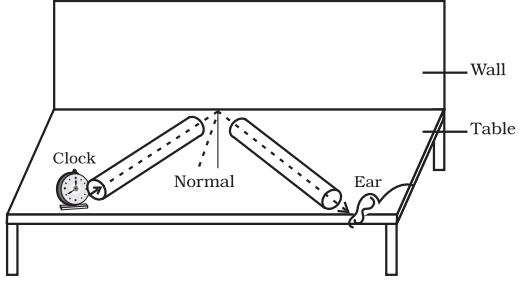

### **11.3.1 ECHO**

If we shout or clap near a suitable reflecting object such as a tall building or a mountain,we will hear the same sound again a little later. This sound which we hear is called an echo. The sensation of sound persists in our brain for about 0.1 s. To hear a distinct echo the time interval between the original sound and the reflected one must be at least 0.1s. If we take the speed of sound to be 344 m/s at a given temperature, say at 22 ºC in air, the sound must go to the obstacle and reach back the ear of the listener on reflection after 0.1s. Hence, the total distance covered by the sound from the point of generation to the reflecting surface and back should be at least (344 m/s) × 0.1 s = 34.4 m. Thus, for hearing distinct echoes, the minimum distance of the obstacle from the source of sound must be half of this distance, that is, 17.2 m. This distance will change with the temperature of air. Echoes may be heard more than once due to successive or multiple reflections. The rolling of thunder is due to the successive reflections of the sound from a number of reflecting surfaces, such as the clouds and the land.

#### **11.3.2 REVERBERATION**

A sound created in a big hall will persist by repeated reflection from the walls until it is reduced to a value where it is no longer audible. The repeated reflection that results in this persistence of sound is called reverberation. In an auditorium or big hall excessive reverberation is highly undesirable. To reduce reverberation, the roof and walls of the auditorium are generally covered with sound-absorbent materials like compressed fibreboard, rough plaster or draperies. The seat materials are also selected on the basis of their sound absorbing properties.

**Example 11.2** A person clapped his hands near a cliff and heard the echo after 2 s. What is the distance of the cliff from the person if the speed of the sound, *v* is taken as 346 m s–1?

#### **Solution:**

- Given,
Speed of sound, *v* = 346 m s–1 Time taken for hearing the echo,

*t* = 2 s

Distance travelled by the sound

= *v* × *t* = 346 m s–1 × 2 s = 692 m In 2 s sound has to travel twice the distance between the cliff and the person. Hence, the distance between the cliff and the person

= 692 m/2 = 346 m.

## uestion

Q

*1. An echo is heard in 3* s*. What is the distance of the reflecting surface from the source, given that the speed of sound is 342* m s–1*?*

#### **11.3.3 USES OF MULTIPLE REFLECTION OF SOUND**

1. Megaphones or loudhailers, horns, musical instruments such as trumpets and *shehanais*, are all designed to send sound in a particular direction without spreading it in all directions, as shown in Fig 11.10.

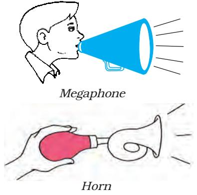

*Fig 11.10: A megaphone and a horn.*

In these instruments, a tube followed by a conical opening reflects sound successively to guide most of the sound waves from the source in the forward direction towards the audience.

- 2. Stethoscope is a medical instrument used for listening to sounds produced within the body, mainly in the heart or lungs. In stethoscopes the sound of the patient's heartbeat reaches the doctor's ears by multiple reflection of sound, as shown in Fig.11.11.
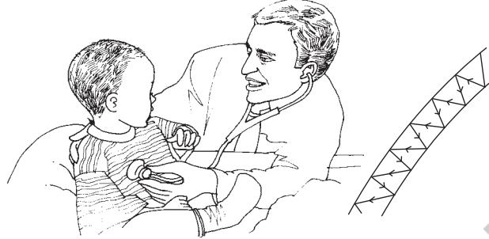

*Fig.11.11: Stethoscope*

- 3. Generally the ceilings of concert halls, conference halls and cinema halls are curved so that sound after reflection reaches all corners of the hall, as shown in Fig 11.12. Sometimes a curved soundboard may be placed behind the stage so that the sound, after reflecting from the sound board, spreads evenly across the width of the hall (Fig 11.13).
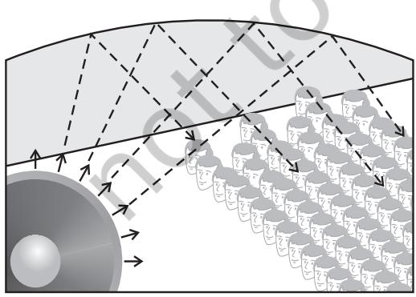

*Fig. 11.12: Curved ceiling of a conference hall.*

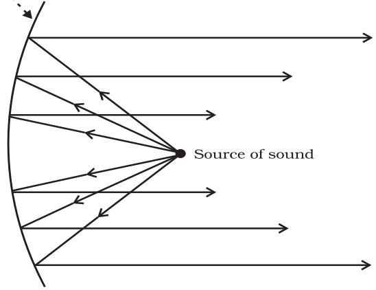

### uestion

- *1. Why are the ceilings of concert halls curved?* Q
### **11.4 Range of Hearing**

The audible range of sound for human beings extends from about 20 Hz to 20000 Hz (one Hz = one cycle/s). Children under the age of five and some animals, such as dogs can hear up to 25 kHz (1 kHz = 1000 Hz). As people grow older their ears become less sensitive to higher frequencies. Sounds of frequencies below 20 Hz are called infrasonic sound or infrasound. If we could hear infrasound we would hear the vibrations of a pendulum just as we hear the vibrations of the wings of a bee. Rhinoceroses communicate using infrasound of frequency as low as 5 Hz. Whales and elephants produce sound in the infrasound range. It is observed that some animals get disturbed before earthquakes. Earthquakes produce low-frequency infrasound before the main shock waves begin which possibly alert the animals. Frequencies higher than 20 kHz are called ultrasonic sound or ultrasound. Ultrasound is produced by animals such as dolphins, bats and porpoises. Moths of certain families have very sensitive hearing equipment. These moths can hear the high frequency squeaks of the bat and know when a bat is flying nearby, and are able to escape capture. Rats also play games by producing ultrasound.

**Hearing Aid:** People with hearing loss may need a hearing aid. A hearing aid is an electronic, battery operated device. The hearing aid receives sound through a microphone. The microphone converts the sound waves to electrical signals. These electrical signals are amplified by an amplifier. The amplified electrical signals are given to a speaker of the hearing aid. The speaker converts the amplified electrical signal to sound and sends to the ear for clear hearing.

# uestions

- *1. What is the audible range of the average human ear?*
- Q *2. What is the range of frequencies associated with*
	- *(a) Infrasound?*
	- *(b) Ultrasound?*

### **11.5 Applications of Ultrasound**

Ultrasounds are high frequency waves. Ultrasounds are able to travel along welldefined paths even in the presence of obstacles. Ultrasounds are used extensively in industries and for medical purposes.

- Ultrasound is generally used to clean parts located in hard-to-reach places, for example, spiral tube, odd shaped parts, electronic components, etc. Objects to be cleaned are placed in a cleaning solution and ultrasonic waves are sent into the solution. Due to the high frequency, the particles of dust, grease and dirt get detached and drop out. The objects thus get thoroughly cleaned.
- Ultrasounds can be used to detect cracks and flaws in metal blocks.

in construction of big structures like buildings, bridges, machines and also scientific equipment. The cracks or holes inside the metal blocks, which are invisible from outside reduces the strength of the structure. Ultrasonic waves are allowed to pass through the metal block and detectors are used to detect the transmitted waves. If there is even a small defect, the ultrasound gets reflected back indicating the presence of the flaw or defect, as shown in Fig. 11.14.

*Fig 11.14: Ultrasound is reflected back from the defective locations inside a metal block.*

Ordinary sound of longer wavelengths cannot be used for such purpose as it will bend around the corners of the defective location and enter the detector.

- Ultrasonic waves are made to reflect from various parts of the heart and form the image of the heart. This technique is called 'echocardiography'.
- Ultrasound scanner is an instrument which uses ultrasonic waves for getting images of internal organs of the human body. A doctor may image the patient's organs, such as the liver, gall bladder, uterus, kidney, etc. It helps the doctor to detect abnormalities, such as stones in the gall bladder and kidney or tumours in different organs. In this technique the ultrasonic waves travel through the tissues of the body and get reflected from a region where there is a change of tissue density.

squeaks of the bat and know when a bat is flying nearby, and are able to escape capture. Rats also play games by producing ultrasound.

**Hearing Aid:** People with hearing loss may need a hearing aid. A hearing aid is an electronic, battery operated device. The hearing aid receives sound through a microphone. The microphone converts the sound waves to electrical signals. These electrical signals are amplified by an amplifier. The amplified electrical signals are given to a speaker of the hearing aid. The speaker converts the amplified electrical signal to sound and sends to the ear for clear hearing.

# uestions

- *1. What is the audible range of the average human ear?*
- Q *2. What is the range of frequencies associated with*
	- *(a) Infrasound?*
	- *(b) Ultrasound?*

### **11.5 Applications of Ultrasound**

Ultrasounds are high frequency waves. Ultrasounds are able to travel along welldefined paths even in the presence of obstacles. Ultrasounds are used extensively in industries and for medical purposes.

- Ultrasound is generally used to clean parts located in hard-to-reach places, for example, spiral tube, odd shaped parts, electronic components, etc. Objects to be cleaned are placed in a cleaning solution and ultrasonic waves are sent into the solution. Due to the high frequency, the particles of dust, grease and dirt get detached and drop out. The objects thus get thoroughly cleaned.
- Ultrasounds can be used to detect cracks and flaws in metal blocks.

in construction of big structures like buildings, bridges, machines and also scientific equipment. The cracks or holes inside the metal blocks, which are invisible from outside reduces the strength of the structure. Ultrasonic waves are allowed to pass through the metal block and detectors are used to detect the transmitted waves. If there is even a small defect, the ultrasound gets reflected back indicating the presence of the flaw or defect, as shown in Fig. 11.14.

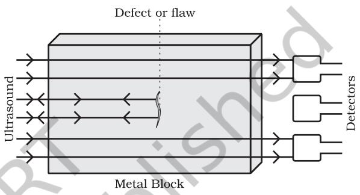

*Fig 11.14: Ultrasound is reflected back from the defective locations inside a metal block.*

Ordinary sound of longer wavelengths cannot be used for such purpose as it will bend around the corners of the defective location and enter the detector.

- Ultrasonic waves are made to reflect from various parts of the heart and form the image of the heart. This technique is called 'echocardiography'.
- Ultrasound scanner is an instrument which uses ultrasonic waves for getting images of internal organs of the human body. A doctor may image the patient's organs, such as the liver, gall bladder, uterus, kidney, etc. It helps the doctor to detect abnormalities, such as stones in the gall bladder and kidney or tumours in different organs. In this technique the ultrasonic waves travel through the tissues of the body and get reflected from a region where there is a change of tissue density.

These waves are then converted into electrical signals that are used to generate images of the organ. These images are then displayed on a monitor or printed on a film. This technique is called 'ultrasonography'. Ultrasonography is also used for examination of the foetus during pregnancy to detect congenial defects and growth abnormalities.

- Ultrasound may be employed to break small 'stones' formed in the kidneys into fine grains. These grains later get flushed out with urine.

## **What you have learnt**

- Sound is produced due to vibration of different objects.
- Sound travels as a longitudinal wave through a material medium.
- Sound travels as successive compressions and rarefactions in the medium.
- In sound propagation, it is the energy of the sound that travels and not the particles of the medium.
- The change in density from one maximum value to the minimum value and again to the maximum value makes one complete oscillation.
- The distance between two consecutive compressions or two consecutive rarefactions is called the wavelength, λ.
- The time taken by the wave for one complete oscillation of the density or pressure of the medium is called the time period, *T*.
- The number of complete oscillations per unit time is called

$$\stackrel{\mathrm{\Large~\ddots~}}{\mathrm{\Large~\Gamma~}}\mathrm{\Large~\Gamma~}$$

- The speed *v*, frequency ν, and wavelength λ, of sound are related by the equation, *v* = λν.
- The speed of sound depends primarily on the nature and the temperature of the transmitting medium.
- The law of reflection of sound states that the directions in which the sound is incident and reflected make equal angles with the normal to the reflecting surface at the point of incidence and the three lie in the same plane.
- For hearing a distinct sound, the time interval between the original sound and the reflected one must be at least 0.1 s.
- The persistence of sound in an auditorium is the result of repeated reflections of sound and is called reverberation.

- Sound properties such as pitch, loudness and quality are determined by the corresponding wave properties.
- Loudness is a physiological response of the ear to the intensity of sound.
- The amount of sound energy passing each second through unit area is called the intensity of sound.
- The audible range of hearing for average human beings is in the frequency range of 20 Hz – 20 kHz.
- Sound waves with frequencies below the audible range are termed "infrasonic" and those above the audible range are termed "ultrasonic".
- Ultrasound has many medical and industrial applications.

## **Exercises**

- 1. What is sound and how is it produced?
- 2. Describe with the help of a diagram, how compressions and rarefactions are produced in air near a source of sound.
- 3. Why is sound wave called a longitudinal wave?
- 4. Which characteristic of the sound helps you to identify your friend by his voice while sitting with others in a dark room?
- 5. Flash and thunder are produced simultaneously. But thunder is heard a few seconds after the flash is seen, why?
- 6. A person has a hearing range from 20 Hz to 20 kHz. What are the typical wavelengths of sound waves in air corresponding to these two frequencies? Take the speed of sound in air as 344 m s–1 .
- 7. Two children are at opposite ends of an aluminium rod. One strikes the end of the rod with a stone. Find the ratio of times taken by the sound wave in air and in aluminium to reach the second child.
- 8. The frequency of a source of sound is 100 Hz. How many times does it vibrate in a minute?
- 9. Does sound follow the same laws of reflection as light does? Explain.
- 10. When a sound is reflected from a distant object, an echo is produced. Let the distance between the reflecting surface and the source of sound production remains the same. Do you hear echo sound on a hotter day?
- 11. Give two practical applications of reflection of sound waves.
- 12. A stone is dropped from the top of a tower 500 m high into a pond of water at the base of the tower. When is the splash heard at the top? Given, *g* = 10 m s–2 and speed of sound = 340 m s–1 .

- 13. A sound wave travels at a speed of 339 m s–1. If its wavelength is 1.5 cm, what is the frequency of the wave? Will it be audible?
- 14. What is reverberation? How can it be reduced?
- 15. What is loudness of sound? What factors does it depend on?
- 16. How is ultrasound used for cleaning?
- 17. Explain how defects in a metal block can be detected using ultrasound.

