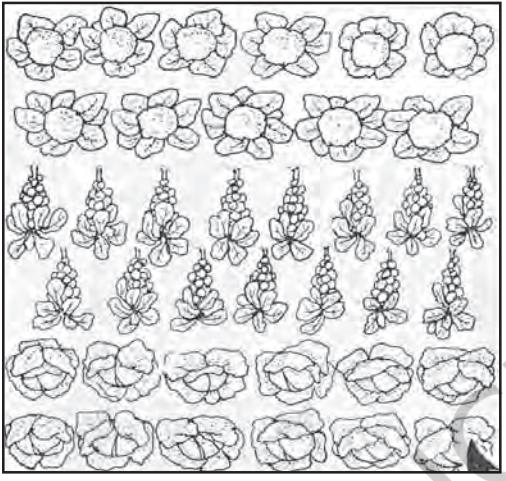
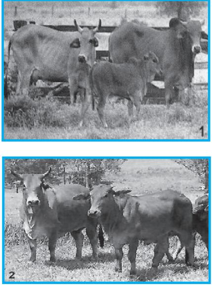
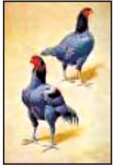
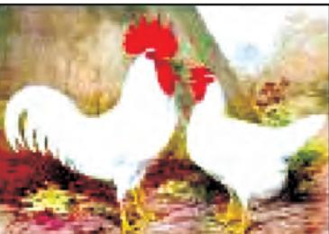
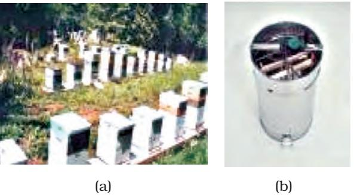

# **IMPROVEMENT IN FOOD RESOURCES**

We know that all living organisms need food. Food supplies proteins, carbohydrates, fats, vitamins and minerals, all of which we require for body development, growth and health. Both plants and animals are major sources of food for us. We obtain most of this food from agriculture and animal husbandry.

We read in newspapers that efforts are always being made to improve production from agriculture and animal husbandry. Why is this necessary? Why we cannot make do with the current levels of production?

India is a very populous country. Our population is more than one billion people, and it is still growing. As food for this growing population, we will soon need more than a quarter of a billion tonnes of grain every year. This can be done by farming on more land. But India is already intensively cultivated. As a result, we do not have any major scope for increasing the area of land under cultivation. Therefore, it is necessary to increase our production efficiency for both crops and livestock.

Efforts to meet the food demand by increasing food production have led to some successes so far. We have had the green revolution, which contributed to increased food-grain production. We have also had the white revolution, which has led to better and more efficient use as well as availability of milk.

However, these revolutions mean that our natural resources are getting used more intensively. As a result, there are more chances of causing damage to our natural resources to the point of destroying their balance completely. Therefore, it is important that we should increase food production without degrading our environment and disturbing the balances maintaining it. Hence, there is a need for sustainable practices in agriculture and animal husbandry.

Also, simply increasing grain production for storage in warehouses cannot solve the problem of malnutrition and hunger. People should have money to purchase food. Food security depends on both availability of food and access to it. The majority of our population depends on agriculture for their livelihood. Increasing the incomes of people working in agriculture is therefore necessary to combat the problem of hunger. Scientific management practices should be undertaken to obtain high yields from farms. For sustained livelihood, one should undertake mixed farming, intercropping, and integrated farming practices, for example, combine agriculture with livestock/poultry/fisheries/ bee-keeping.

The question thus becomes – how do we increase the yields of crops and livestock?

### **12.1 Improvement in Crop Yields**

Cereals such as wheat, rice, maize, millets and sorghum provide us carbohydrate for energy requirement. Pulses like gram (*chana*), pea (*matar*), black gram (*urad*), green gram (*moong*), pigeon pea (*arhar*), lentil (*masoor*), provide us with protein. And oil seeds including soyabean, ground nut, sesame, castor, mustard, linseed and sunflower provide us with necessary fats (Fig. 12.1). Vegetables, spices and fruits provide a range of vitamins and minerals in addition to small amounts of proteins, carbohydrates and fats. In addition to these food crops, fodder crops like *berseem*, *oats* or *sudan grass* are raised as food for the livestock.

**140** *SCIENCE*

Different crops require different climatic conditions, temperature and photoperiods for their growth and completion of their life cycle. Photoperiods are related to the duration of sunlight. Growth of plants and flowering are dependent on sunlight. As we all know, plants manufacture their food in sunlight by the process of photosynthesis. There are some crops, which are grown in rainy season, called the *kharif* season from the month of June to October, and some of the crops are grown in the winter season, called the *rabi* season from November to April. Paddy, soyabean, pigeon pea, maize, cotton, green gram and black gram are *kharif* crops, whereas wheat, gram, peas, mustard, linseed are *rabi* crops.

In India there has been a four times increase in the production of food grains from 1952 to 2010 with only 25% increase in the cultivable land area. How has this increase in production been achieved? If we think of the practices involved in farming, we can see that we can divide it into three stages. The first is the choice of seeds for planting. The second is the nurturing of the crop plants. The third is the protection of the growing and harvested crops from loss. Thus, the major groups of activities for improving crop yields can be classified as:

- Crop variety improvement
- Crop production improvement
- Crop protection management.

#### **12.1.1 CROP VARIETY IMPROVEMENT**

This approach depends on finding a crop variety that can give a good yield. Varieties or strains of crops can be selected by breeding for various useful characteristics such as disease resistance, response to fertilisers, product quality and high yields. One way of incorporating desirable characters into crop varieties is by hybridisation. Hybridisation refers to crossing between genetically dissimilar plants. This crossing may be intervarietal (between different varieties), interspecific (between two different species of the same genus) or intergeneric (between different genera). Another way of improving the crop is by introducing a gene that would provide the desired characteristic. This results in genetically modified crops.

For new varieties of crops to be accepted, it is necessary that the variety produces high yields under different conditions that are found in different areas. Farmers would need to be provided with good quality seeds of a particular variety, that is, the seeds should all be of the same variety and germinate under the same conditions.

Cultivation practices and crop yield are related to weather, soil quality and availability of water. Since weather conditions such as drought and flood situations are unpredictable, varieties that can be grown in diverse climatic conditions are useful. Similarly, varieties tolerant to high soil salinity have been developed. Some of the factors for which variety improvement is done are:

- Higher yield: To increase the productivity of the crop per acre.
- Improved quality: Quality considerations of crop products vary from crop to crop. Baking quality is important in wheat, protein quality in pulses, oil quality in oilseeds and preserving quality in fruits and vegetables.
- Biotic and abiotic resistance: Crops production can go down due to biotic (diseases, insects and nematodes) and abiotic (drought, salinity, water logging, heat, cold and frost) stresses under different situations. Varieties resistant to these stresses can improve crop production.
- Change in maturity duration: The shorter the duration of the crop from sowing to harvesting, the more economical is the variety. Such short durations allow farmers to grow multiple rounds of crops in a year. Short duration also reduces the cost of crop production. Uniform maturity makes the harvesting process easy and reduces losses during harvesting.
- Wider adaptability: Developing varieties for wider adaptability will help in stabilising the crop production under different environmental conditions. One variety can then be grown under different climatic conditions in different areas.
- Desirable agronomic characteristics: Tallness and profuse branching are desirable characters for fodder crops. Dwarfness is desired in cereals, so that

less nutrients are consumed by these crops. Thus developing varieties of desired agronomic characters help give higher productivity.

### uestions

- *1. How do biotic and abiotic factors affect crop production?*
- *2. What are the desirable agronomic characteristics for crop improvements?* Q

#### **12.1.2 CROP PRODUCTION MANAGEMENT**

In India, as in many other agriculture-based countries, farming ranges from small to very large farms. Different farmers thus have more or less land, money and access to information and technologies. In short, it is the money or financial conditions that allow farmers to take up different farming practices and agricultural technologies. There is a correlation between higher inputs and yields. Thus, the farmer's purchasing capacity for inputs decides cropping system and production practices. Therefore, production practices can be at different levels. They include 'no cost' production, 'low cost' production and 'high cost' production practices.

### **12.1.2 (i)****NUTRIENT MANAGEMENT**

Just as we need food for development, growth and well-being, plants also require nutrients for growth. Nutrients are supplied to plants by air, water and soil. There are several nutrients which are essential for plants. Air supplies carbon and oxygen, hydrogen comes from water, and soil supplies the other thirteen nutrients to plants. Amongst these, some are required in large quantities and are therefore called macro-nutrients. The other nutrients are used by plants in small quantities and are therefore called micro-nutrients (Table 12.1).

### **Table 12.1: Nutrients supplied by air, water and soil**

| Source | Nutrients |
| --- | --- |
| Air | carbon, oxygen |
| Water | hydrogen, oxygen |
| Soil | (i) Macronutrients: |
|  | nitrogen, phosphorus, |
|  | potassium, calcium, |
|  | magnesium, sulphur |
|  | (ii) Micronutrients: |
|  | iron, manganese, boron, |
|  | zinc, copper, |
|  | molybdenum, chlorine |

Deficiency of these nutrients affects physiological processes in plants including reproduction, growth and susceptibility to diseases. To increase the yield, the soil can be enriched by supplying these nutrients in the form of manure and fertilizers.

### uestions

- *1. What are macro-nutrients and why are they called macronutrients?* Q
	- *2. How do plants get nutrients?*

#### *MANURE*

Manure contains large quantities of organic matter and also supplies small quantities of nutrients to the soil. Manure is prepared by the decomposition of animal excreta and plant waste. Manure helps in enriching soil with nutrients and organic matter and increasing soil fertility. The bulk of organic matter in manure helps in improving the soil structure. This involves increasing the water holding capacity in sandy soils. In clayey soils, the large quantities of organic matter help in drainage and in avoiding water logging.

In using manure we use biological waste material, which is advantageous in protecting our environment from excessive use of fertilizers. Using biological waste material is also a way of recycling farm waste. Based on the kind of biological material used, manure can be classified as:

- (i) Compost and vermi-compost: The process in which farm waste material like livestock excreta (cow dung, etc.), vegetable waste, animal refuse, domestic waste, sewage waste, straw, eradicated weeds etc. is decomposed in pits is known as composting. The compost is rich in organic matter and nutrients. Compost is also prepared by using earthworms to hasten the process of decomposition of plant and animal refuse. This is called vermi-compost.
- (ii) Green manure: Prior to the sowing of the crop seeds, some plants like sun hemp or guar are grown and then mulched by ploughing them into the soil. These green plants thus turn into green manure which helps in enriching the soil in nitrogen and phosphorus.

#### *FERTILIZERS*

Fertilizers are commercially produced plant nutrients. Fertilizers supply nitrogen, phosphorus and potassium. They are used to ensure good vegetative growth (leaves, branches and flowers), giving rise to healthy plants. Fertilizers are a factor in the higher yields of high-cost farming.

Fertilizers should be applied carefully in terms of proper dose, time, and observing preand post-application precautions for their complete utilisation. For example, sometimes fertilizers get washed away due to excessive irrigation and are not fully absorbed by the plants. This excess fertilizer then leads to water pollution.

Also, as we have seen in the previous chapter, continuous use of fertilizers in an area can destroy soil fertility because the organic matter in the soil is not replenished and micro-organisms in the soil are harmed by the fertilizers used. Short-term benefits of using fertilizers and long-term benefits of using manure for maintaining soil fertility have to be considered while aiming for optimum yields in crop production.

## uestion

Q

*1. Compare the use of manure and fertilizers in maintaining soil fertility.*

Organic farming is a farming system with minimal or no use of chemicals as fertilizers, herbicides, pesticides, etc., and with a maximum input of organic manures, recycled farm-wastes (straw and livestock excreta), use of bio-agents such as culture of blue green algae in preparation of biofertilizers, *neem* leaves or turmeric specifically in grain storage as bio-pesticides, with healthy cropping systems [mixed cropping, inter-cropping and crop rotation as discussed below in 12.1.2.(iii)]. These cropping systems are beneficial in insect, pest and wheat control besides providing nutrients.

#### **12.1.2 (ii) IRRIGATION**

Most agriculture in India is rain-fed, that is, the success of crops in most areas is dependent on timely monsoons and sufficient rainfall spread through most of the growing season. Hence, poor monsoons cause crop failure. Ensuring that the crops get water at the right stages during their growing season can increase the expected yields of any crop. Therefore, many measures are used to bring more and more agricultural land under irrigation.

**More to know**

 Droughts occur because of scarcity or irregular distribution of rains. Drought poses a threat to rain-fed farming areas, where farmers do not use irrigation for crop production and depend only on rain. Light soils have less water retention capacity. In areas with light soils, crops get adversely affected by drought conditions. Scientists have developed some crop varieties which can tolerate drought conditions.

India has a wide variety of water resources and a highly varied climate. Under such conditions, several different kinds of irrigation systems are adopted to supply water to agricultural lands depending on the kinds of water resources available. These include wells, canals, rivers and tanks.

- Wells:There are two types of wells, namely dug wells and tube wells. In a dug well, water is collected from water bearing strata. Tube wells can tap water from the deeper strata. From these wells, water is lifted by pumps for irrigation.
- Canals: This is usually an elaborate and extensive irrigation system. In this system canals receive water from one or more reservoirs or from rivers. The main canal is divided into branch canals having further distributaries to irrigate fields.
- River Lift Systems**:** In areas where canal flow is insufficient or irregular due to inadequate reservoir release, the lift system is more rational. Water is directly drawn from the rivers for supplementing irrigation in areas close to rivers.
- Tanks: These are small storage reservoirs, which intercept and store the run-off of smaller catchment areas.

Fresh initiatives for increasing the water available for agriculture include rainwater harvesting and watershed management. This involves building small check-dams which lead to an increase in ground water levels. The check-dams stop the rainwater from flowing away and also reduce soil erosion.

### **12.1.2 (iii)****CROPPING PATTERNS**

Different ways of growing crops can be used to give maximum benefit.

Mixed cropping is growing two or more crops simultaneously on the same piece of land, for example, wheat + gram, or wheat + mustard, or groundnut + sunflower. This reduces risk and gives some insurance against failure of one of the crops.

Inter-cropping is growing two or more crops simultaneously on the same field in a definite pattern (Fig.12.2). A few rows of one crop alternate with a few rows of a second crop, for example, soyabean + maize, or finger millet (*bajra*) + cowpea (*lobia*). The crops are selected such that their nutrient requirements are different. This ensures maximum utilisation of the nutrients supplied, and also prevents pests and diseases from spreading to all the plants belonging to one crop in a field. This way, both crops can give better returns.

*Fig. 12.2 : Intercropping*

The growing of different crops on a piece of land in a pre-planned succession is known as crop rotation. Depending upon the duration, crop rotation is done for different crop combinations. The availability of moisture and irrigation facilities decide the choice of the crop to be cultivated after one harvest. If crop rotation is done properly then two or three crops can be grown in a year with good harvests.

#### **12.1.3 CROP PROTECTION MANAGEMENT**

Field crops are infested by a large number of weeds, insect pests and diseases. If weeds and pests are not controlled at the appropriate time then they can damage the crops so much that most of the crop is lost.

Weeds are unwanted plants in the cultivated field, for example, Xanthium (*gokhroo*), Parthenium (*gajar ghas*), Cyperinus rotundus (*motha*). They compete for food, space and light. Weeds take up nutrients and reduce the growth of the crop. Therefore, removal of weeds from cultivated fields during the early stages of crop growth is essential for a good harvest.

Generally insect pests attack the plants in three ways: (i) they cut the root, stem and leaf, (ii) they suck the cell sap from various parts of the plant, and (iii) they bore into stem and fruits. They thus affect the health of the crop and reduce yields.

Diseases in plants are caused by pathogens such as bacteria, fungi and viruses. These pathogens can be present in and transmitted through the soil, water and air.

Weeds, insects and diseases can be controlled by various methods. One of the most commonly used methods is the use of pesticides, which include herbicides, insecticides and fungicides. These chemicals are sprayed on crop plants or used for treating seeds and soil. However, excessive use of these chemicals creates problems, since they can be poisonous to many plant and animal species and cause environmental pollution.

Weed control methods also include mechanical removal. Preventive methods such as proper seed bed preparation, timely sowing of crops, intercropping and crop rotation also help in weed control. Some other preventive measures against pests are the use of resistant varieties, and summer ploughing, in which fields are ploughed deep in summers to destroy weeds and pests.

### uestion

- *1. Which of the following conditions will give the most benefits? Why?* Q
	- *(a) Farmers use high-quality seeds, do not adopt irrigation or use fertilizers.*
	- *(b) Farmers use ordinary seeds, adopt irrigation and use fertilizer.*
	- *(c) Farmers use quality seeds, adopt irrigation, use fertilizer and use crop protection measures.*

|  |  |  | Table 12.2: Nutritional values of animal products |  |  |  |
| --- | --- | --- | --- | --- | --- | --- |
| Animal Products |  |  |  | Per cent (%) Nutrients |  |  |
|  | Fat | Protein | Sugar | Minerals | Water | Vitamins |
| Milk (Cow) | 3.60 | 4.00 | 4.50 | 0.70 | 87.20 | B1, B2, B12, D, E |
| Egg | 12.00 | 13.00 | * | 1.00 | 74.00 | B2, D |
| Meat | 3.60 | 21.10 | * | 1.10 | 74.20 | B2, B12 |
| Fish | 2.50 | 19.00 | * | 1.30 | 77.20 | Niacin, D, A |

*Present in very small amounts

#### *Activity _____________12.1*

- Visit a nearby garden/agricultural field and make a list of the weeds and the flowers/crops found in the area. Also, make a list of insect pests, if any, infesting the flowers/crops.
#### **STORAGE OF GRAINS**

Storage losses in agricultural produce can be very high. Factors responsible for such losses are biotic— insects, rodents, fungi, mites and bacteria, and abiotic— inappropriate moisture and temperatures in the place of storage. These factors cause degradation in quality, loss in weight, poor germinability, discolouration of produce, all leading to poor marketability. These factors can be controlled by proper treatment and by systematic management of warehouses.

Preventive and control measures are used before grains are stored for future use. They include strict cleaning of the produce before storage, proper drying of the produce first in sunlight and then in shade, and fumigation using chemicals that can kill pests.

## uestions

- *1. Why should preventive measures and biological control methods be preferred for protecting crops?*
- *2. What factors may be responsible for losses of grains during storage?*

*Activity _____________12.2*

• *Collect grains/seeds of cereals, pulses and oil seeds and gather information about the seasons in which they are sown and harvested.*

### **12.2 Animal Husbandry**

Animal husbandry is the scientific management of animal livestock. It includes various aspects such as feeding, breeding and disease control. Animal-based farming includes cattle, goat, sheep, poultry and fish farming. As the population increases and as living standards increase, the demand for milk, eggs and meat is also going up. Also, the growing awareness of the need for humane treatment of livestock has brought in new limitations in livestock farming. Thus, livestock production also needs to be improved.

#### **12.2.1 CATTLE FARMING**

Cattle husbandry is done for two purposes milk and draught labour for agricultural work such as tilling, irrigation and carting. Indian cattle belong to two different species, *Bos indicus*, cows, and *Bos bubalis*, buffaloes. Milk-producing females are called milch animals (dairy animals), while the ones used for farm labour are called draught animals.

Milk production depends, to some extent, on the duration of the lactation period, Q meaning the period of milk production after

*Fig. 12.3: Indigenous milch breed of cattle*

the birth of a calf. So, milk production can be increased by increasing the lactation period. Exotic or foreign breeds (for example, Jersey, Brown Swiss) are selected for long lactation periods, while local breeds (for example, Red Sindhi, Sahiwal) show excellent resistance to diseases. The two can be cross-bred to get animals with both the desired qualities.

uestion

- *1. Which method is commonly used for improving cattle breeds and why?* Q
#### *Activity _____________12.3*

- Visit a livestock farm. Note the following:
	- (1) Number of cattle and number of different breeds.
	- (2) The amount of daily milk production from the different breeds.

Proper cleaning and shelter facilities for cows and buffaloes are required for humane farming, for the health of the animals and for production of clean milk as well. Animals require regular brushing to remove dirt and loose hair. They should be sheltered under well-ventilated roofed sheds that protect them from rain, heat and cold. The floor of the cattle shed needs to be sloping so as to stay dry and to facilitate cleaning.

The food requirements of dairy animals are of two types: (a) maintenance requirement, which is the food required to support the animal to live a healthy life, and (b) milk producing requirement, which is the type of food required during the lactation period. Animal feed includes: (a) roughage, which is largely fibre, and (b) concentrates, which are low in fibre and contain relatively high levels of proteins and other nutrients. Cattle need balanced rations containing all nutrients in proportionate amounts. Besides such nutritious food material, certain feed additives containing micronutrients promote the health and milk output of dairy animals.

Cattle suffer from a number of diseases. The diseases, besides causing death, reduce milk production. A healthy animal feeds regularly and has a normal posture. The parasites of cattle may be both external parasites and internal parasites. The external parasites live on the skin and mainly cause skin diseases. The internal parasites like worms, affect stomach and intestine while flukes damage the liver. Infectious diseases are also caused by bacteria and viruses. Vaccinations are given to farm animals against many major viral and bacterial diseases.

#### **12.2.2 POULTRY FARMING**

Poultry farming is undertaken to raise domestic fowl for egg production and chicken meat. Therefore, improved poultry breeds are developed and farmed to produce layers for eggs and broilers for meat.

The cross-breeding programmes between Indian (indigenous, for example, *Aseel*) and foreign (exotic, for example, Leghorn) breeds for variety improvement are focused on to develop new varieties for the following desirable traits—

(i) number and quality of chicks;

*IMPROVEMENT IN FOOD RESOURCES* **147**

- (ii) dwarf broiler parent for commercial chick production;
- (iii) summer adaptation capacity/ tolerance to high temperature;
- (iv) low maintenance requirements;
- (v) reduction in the size of the egg-laying bird with ability to utilise more fibrous cheaper diets formulated using agricultural by-products.

*Aseel Leghorn*

*Fig. 12.4*

## uestion

*1. Discuss the implications of the following statement: "It is interesting to note that poultry is India's most efficient converter of low fibre food stuff (which is unfit for human consumption) into highly nutritious animal protein food."* Q

#### **EGG AND BROILER PRODUCTION**

Broiler chickens are fed with vitamin-rich supplementary feed for good growth rate and better feed efficiency. Care is taken to avoid mortality and to maintain feathering and carcass quality. They are produced as broilers and sent to market for meat purposes.

For good production of poultry birds, good management practices are important. These include maintenance of temperature and hygienic conditions in housing and poultry feed, as well as prevention and control of diseases and pests.

The housing, nutritional and environmental requirements of broilers are somewhat different from those of egg layers. The ration (daily food requirement) for broilers is protein rich with adequate fat. The level of vitamins A and K is kept high in the poultry feeds.

Poultry fowl suffer from a number of diseases caused by virus, bacteria, fungi, parasites, as well as from nutritional deficiencies. These necessitate proper cleaning, sanitation, and spraying of disinfectants at regular intervals. Appropriate vaccination can prevent the occurrence of infectious diseases and reduce loss of poultry during an outbreak of disease.

### uestions

- *1. What management practices are common in dairy and poultry farming?* Q
	- *2. What are the differences between broilers and layers and in their management?*

*Activity _____________12.4*

• Visit a local poultry farm. Observe types of breeds and note the type of ration, housing and lighting facilities given to them. Identify the growers, layers and broilers.

#### **12.2.3 FISH PRODUCTION**

Fish is a cheap source of animal protein for our food. Fish production includes the finned true fish as well as shellfish such as prawns and molluscs. There are two ways of obtaining fish. One is from natural resources, which is called capture fishing. The other way is by fish farming, which is called culture fishery.

The water source of the fish can be either seawater or fresh water, such as in rivers and ponds. Fishing can thus be done both by capture and culture of fish in marine and freshwater ecosystems.

#### **12.2.3 (i) MARINE FISHERIES**

India's marine fishery resources include 7500 km of coastline and the deep seas beyond it. Popular marine fish varieties include pomphret, mackerel, tuna, sardines, and Bombay duck. Marine fish are caught using many kinds of fishing nets from fishing boats. Yields are increased by locating large schools of fish in the open sea using satellites and echo-sounders.

Some marine fish of high economic value are also farmed in seawater. This includes finned fishes like mullets, *bhetki*, and pearl spots, shellfish such as prawns (Fig. 12.5), mussels and oysters as well as seaweed. Oysters are also cultivated for the pearls they make.

- *Macrobrachium rosenbergii (fresh water)*
*Peneaus monodon (marine)*

- *Fig. 12.5 : Fresh water and marine prawns*
As marine fish stocks get further depleted, the demand for more fish can only be met by such culture fisheries, a practice called mariculture.

#### **12.2.3 (ii) INLAND FISHERIES**

Fresh water resources include canals, ponds, reservoirs and rivers. Brackish water resources, where seawater and fresh water mix together, such as estuaries and lagoons are also important fish reservoirs. While capture fishing is also done in such inland water bodies, the yield is not high. Most fish production from these resources is through aquaculture.

Fish culture is sometimes done in combination with a rice crop, so that fish are grown in the water in the paddy field. More intensive fish farming can be done in composite fish culture systems. Both local and imported fish species are used in such systems.

In such a system, a combination of five or six fish species is used in a single fishpond. These species are selected so that they do not compete for food among them having different types of food habits. As a result, the food available in all the parts of the pond is used. As Catlas are surface feeders, Rohus feed in the middle-zone of the pond, Mrigals and Common Carps are bottom feeders, and Grass Carps feed on the weeds, together these species (Fig. 12.6) can use all the food in the pond without competing with each other. This increases the fish yield from the pond.

*Fig. 12.6: (a) Catla (b) Silver carp (c) Rohu (d) Grass Carp (e) Mrigal (f) Common Carp*

One problem with such composite fish culture is that many of these fish breed only during monsoon. Even if fish seed is collected from the wild, it can be mixed with that of other species as well. So, a major problem in fish farming is the lack of availability of goodquality seed. To overcome this problem, ways have now been worked out to breed these fish in ponds using hormonal stimulation. This has ensured the supply of pure fish seed in desired quantities.

*IMPROVEMENT IN FOOD RESOURCES* **149**

### uestions

- *1. How are fish obtained?*
- *2. What are the advantages of composite fish culture?*

### *Activity _____________12.5*

Q

- Visit a fish farm in fish breeding season and note the following:
	- (1) Varieties of fish in fish farm
	- (2) Types of ponds
	- (3) Feed ingredients used

(4) Production capacity of the farm If there are no fish farms close to your locality, gather the above information from Internet, by referring books or talking to people who are engaged in fishery.

#### **12.2.4 BEE-KEEPING**

Honey is widely used and therefore beekeeping for making honey has become an agricultural enterprise. Since bee-keeping needs low investments, farmers use it as an additional income generating activity. In addition to honey, the beehives are a source of wax which is used in various medicinal preparations.

The local varieties of bees used for commercial honey production are *Apis cerana indica*, commonly known as the Indian bee, *A. dorsata,* the rock bee and *A. florae,* the little bee. An Italian bee variety, *A. mellifera*, has also been brought in to increase yield of honey.

*Fig. 12.7: (a) Arrangement of beehive in an apiary (b) honey extractor*

This is the variety commonly used for commercial honey production.

The Italian bees have high honey collection capacity. They sting somewhat less. They stay in a given beehive for long periods, and breed very well. For commercial honey production, bee farms or apiaries are established.

The value or quality of honey depends upon the pasturage, or the flowers available to the bees for nectar and pollen collection. In addition to adequate quantity of pasturage, the kind of flowers available will determine the taste of the honey.

### uestions

Q

*1. What are the desirable characters of bee varieties suitable for honey production? 2. What is pasturage and how is it related to honey production?*

### **What you have learnt**

• There are several nutrients essential for crops. Of these, some are required in large quantities and are known as macro-nutrients whereas rest of the nutrients are required in small quantities and are known as micro-nutrients.

- Manure and fertilizers are the main sources of nutrient supply to crops.
- Organic farming is a farming system with minimal or no use of chemicals as fertilizers, herbicides, pesticides etc. and

with a maximum input of organic manures, recyled farm wastes, and bio-agents, with healthy cropping systems.

- Mixed farming is a system of farming on a particular farm which includes crop production, raising of livestock etc.
- Mixed cropping is growing of two or more crops simultaneously on the same piece of land.
- Growing two or more crops in definite row patterns is known as intercropping.
- The growing of different crops on a piece of land in pre-planned succession is called crop rotation.
- Varietal improvement is required for higher yield, good quality, biotic and abiotic resistance, shortening the maturity duration, wider adaptability and desirable agronomic characteristics.
- Farm animals require proper care and management such as shelter, feeding, breeding and disease control. This is called animal husbandry.
- Poultry farming is done to raise domestic fowls. Poultry production includes egg production and broiler production for poultry meat.
- To enhance poultry production, cross breeding is done between Indian and exotic breeds for variety improvement.
- Fish may be obtained from marine resources as well as inland resources.
- To increase production of fish, they can be cultured in marine and inland ecosystems.
- Marine fish capture is done by fishing nets guided by echo-sounders and satellites.
- Composite fish culture system is commonly used for fish farming.
- Bee-keeping is done to get honey and wax.

## **Exercises**

- 1. Explain any one method of crop production which ensures high yield.
- 2. Why are manure and fertilizers used in fields?
- 3. What are the advantages of inter-cropping and crop rotation?
- 4. What is genetic manipulation? How is it useful in agricultural practices?
- 5. How do storage grain losses occur?
- 6. How do good animal husbandry practices benefit farmers?
- 7. What are the benefits of cattle farming?
- 8. For increasing production, what is common in poultry, fisheries and bee-keeping?
- 9. How do you differentiate between capture fishing, mariculture and aquaculture?

