# **ATOMS AND MOLECULES**

Ancient Indian and Greek philosophers have always wondered about the unknown and unseen form of matter. The idea of divisibility of matter was considered long back in India, around 500 BC. An Indian philosopher Maharishi Kanad, postulated that if we go on dividing matter (*padarth*), we shall get smaller and smaller particles. Ultimately, a stage will come when we shall come across the smallest particles beyond which further division will not be possible. He named these particles *Parmanu*. Another Indian philosopher, Pakudha Katyayama, elaborated this doctrine and said that these particles normally exist in a combined form which gives us various forms of matter.

Around the same era, ancient Greek philosophers – Democritus and Leucippus suggested that if we go on dividing matter, a stage will come when particles obtained cannot be divided further. Democritus called these indivisible particles atoms (meaning indivisible). All this was based on philosophical considerations and not much experimental work to validate these ideas could be done till the eighteenth century.

By the end of the eighteenth century, scientists recognised the difference between elements and compounds and naturally became interested in finding out how and why elements combine and what happens when they combine.

Antoine L. Lavoisier laid the foundation of chemical sciences by establishing two important laws of chemical combination.

## **3.1 Laws of Chemical Combination**

The following two laws of chemical combination were established after much experimentations by Lavoisier and Joseph L. Proust.

#### **3.1.1 LAW OF CONSERVATION OF MASS**

Is there a change in mass when a chemical change (chemical reaction) takes place?

# *Activity ______________ 3.1*

- Take one of the following sets, X and Y of chemicals—
	- *X Y* (i) copper sulphate sodium carbonate

(ii) barium chloride sodium sulphate

- (iii) lead nitrate sodium chloride
• Prepare separately a 5% solution of any one pair of substances listed under X and Y each in 10 mL in water. • Take a little amount of solution of Y in a conical flask and some solution of X in an ignition tube.

• Hang the ignition tube in the flask carefully; see that the solutions do not get mixed. Put a cork on the flask (see Fig. 3.1).

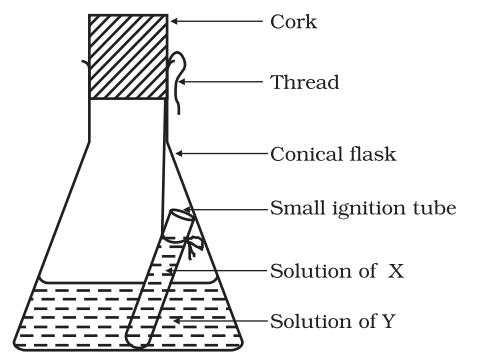

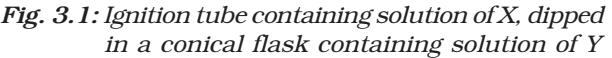

- Weigh the flask with its contents carefully.
- Now tilt and swirl the flask, so that the solutions X and Y get mixed.
- Weigh again.
- What happens in the reaction flask?
- Do you think that a chemical reaction has taken place?
- Why should we put a cork on the mouth of the flask?
- Does the mass of the flask and its contents change?

Law of conservation of mass states that mass can neither be created nor destroyed in a chemical reaction.

#### **3.1.2 LAW OF CONSTANT PROPORTIONS**

Lavoisier, along with other scientists, noted that many compounds were composed of two or more elements and each such compound had the same elements in the same proportions, irrespective of where the compound came from or who prepared it.

In a compound such as water, the ratio of the mass of hydrogen to the mass of oxygen is always 1:8, whatever the source of water. Thus, if 9 g of water is decomposed, 1 g of hydrogen and 8 g of oxygen are always obtained. Similarly in ammonia, nitrogen and hydrogen are always present in the ratio 14:3 by mass, whatever the method or the source from which it is obtained.

This led to the law of constant proportions which is also known as the law of definite proportions. This law was stated by Proust as "*In a chemical substance the elements are always present in definite proportions by mass*".

The next problem faced by scientists was to give appropriate explanations of these laws. British chemist John Dalton provided the basic theory about the nature of matter. Dalton picked up the idea of divisibility of matter, which was till then just a philosophy. He took the name 'atoms' as given by the Greeks and said that the smallest particles of matter are atoms. His theory was based on the laws of chemical combination. Dalton's atomic theory provided an explanation for the law of conservation of mass and the law of definite proportions.

John Dalton was born in a poor weaver's family in 1766 in England. He began his career as a teacher at the age of twelve. Seven years later he became a school principal. In 1793, Dalton left for Manchester to teach mathematics, physics and chemistry in

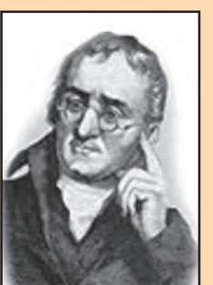

*John Dalton*

a college. He spent most of his life there teaching and researching. In 1808, he presented his atomic theory which was a turning point in the study of matter.

According to Dalton's atomic theory, all matter, whether an element, a compound or a mixture is composed of small particles called atoms. The postulates of this theory may be stated as follows:

- (i) All matter is made of very tiny particles called atoms, which participate in chemical reactions.
- (ii) Atoms are indivisible particles, which cannot be created or destroyed in a chemical reaction.
- (iii) Atoms of a given element are identical in mass and chemical properties.
- (iv) Atoms of different elements have different masses and chemical properties.
- (v) Atoms combine in the ratio of small whole numbers to form compounds.
- (vi) The relative number and kinds of atoms are constant in a given compound.

You will study in the next chapter that all atoms are made up of still smaller particles.

# uestions

- *1. In a reaction, 5.3 g of sodium carbonate reacted with 6 g of acetic acid. The products were 2.2 g of carbon dioxide, 0.9 g water and 8.2 g of sodium* Q *acetate. Show that these*
*observations are in agreement with the law of conservation of mass.*

*sodium carbonate + acetic acid* → *sodium acetate + carbon dioxide + water*

- *2. Hydrogen and oxygen combine in the ratio of 1:8 by mass to form water. What mass of oxygen gas would be required to react completely with 3 g of hydrogen gas?*
- *3. Which postulate of Dalton's atomic theory is the result of the law of conservation of mass?*
- *4. Which postulate of Dalton's atomic theory can explain the law of definite proportions?*

## **3.2 What is an Atom?**

Have you ever observed a mason building walls, from these walls a room and then a collection of rooms to form a building? What is the building block of the huge building? What about the building block of an ant-hill? It is a small grain of sand. Similarly, the building blocks of all matter are atoms.

#### **How big are atoms?**

Atoms are very small, they are smaller than anything that we can imagine or compare with. More than millions of atoms when stacked would make a layer barely as thick as this sheet of paper.

| Atomic radius is measured in nanometres. |
| --- |
| 1/10 9 m = 1 nm |
| 1 m = 109 nm |

| Relative Sizes |  |
| --- | --- |
| Radii (in m) | Example |
| 10–10 | Atom of hydrogen |
| 10–9 | Molecule of water |
| 10–8 | Molecule of haemoglobin |
| 10–4 | Grain of sand |
| 10–3 | Ant |
| 10–1 | Apple |

We might think that if atoms are so insignificant in size, why should we care about them? This is because our entire world is made up of atoms. We may not be able to see them, but they are there, and constantly affecting whatever we do. Through modern techniques, we can now produce magnified images of surfaces of elements showing atoms.

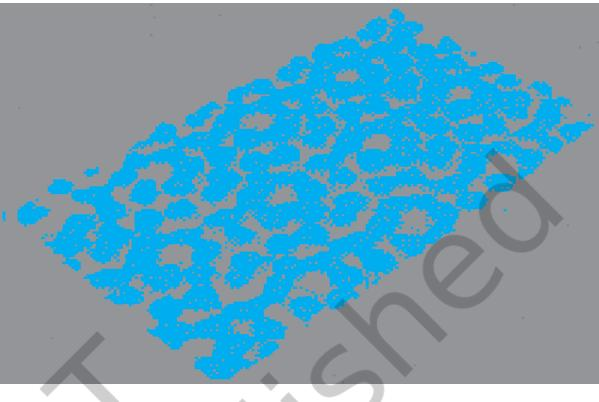

*Fig. 3.2: An image of the surface of silicon*

### **3.2.1 WHAT ARE THE MODERN DAY SYMBOLS OF ATOMS OF DIFFERENT ELEMENTS?**

Dalton was the first scientist to use the symbols for elements in a very specific sense. When he used a symbol for an element he also meant a definite quantity of that element, that is, one atom of that element. Berzilius suggested that the symbols of elements be made from one or two letters of the name of the element.

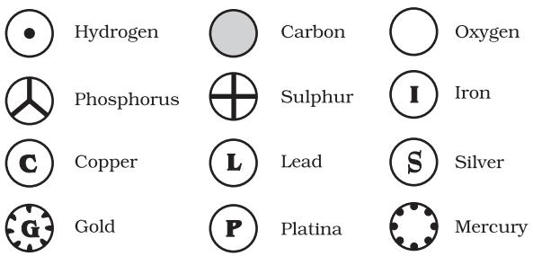

*Fig. 3.3: Symbols for some elements as proposed by Dalton*

In the beginning, the names of elements were derived from the name of the place where they were found for the first time. For example, the name copper was taken from Cyprus. Some names were taken from specific colours. For example, gold was taken from the English word meaning yellow. Now-a-days, IUPAC (International Union of Pure and Applied Chemistry) is an international scientific organisation which approves names of elements, symbols and units. Many of the symbols are the first one or two letters of the element's name in English. The first letter of a symbol is always written as a capital letter (uppercase) and the second letter as a small letter (lowercase).

#### **For example**

- (i) hydrogen, H
- (ii) aluminium, Al and not AL
- (iii) cobalt, Co and not CO.

Symbols of some elements are formed from the first letter of the name and a letter, appearing later in the name. Examples are: (i) chlorine, Cl, (ii) zinc, Zn etc.

Other symbols have been taken from the names of elements in Latin, German or Greek. For example, the symbol of iron is Fe from its Latin name ferrum, sodium is Na from natrium, potassium is K from kalium. Therefore, each element has a name and a unique chemical symbol.

passage of time and repeated usage you will automatically be able to reproduce the symbols).

#### **3.2.2 ATOMIC MASS**

The most remarkable concept that Dalton's atomic theory proposed was that of the atomic mass. According to him, each element had a characteristic atomic mass. The theory could explain the law of constant proportions so well that scientists were prompted to measure the atomic mass of an atom. Since determining the mass of an individual atom was a relatively difficult task, relative atomic masses were determined using the laws of chemical combinations and the compounds formed.

Let us take the example of a compound, carbon monoxide (CO) formed by carbon and oxygen. It was observed experimentally that 3 g of carbon combines with 4 g of oxygen to form CO. In other words, carbon combines with 4/3 times its mass of oxygen. Suppose we define the atomic mass unit (earlier abbreviated as 'amu', but according to the latest IUPAC recommendations, it is now written as 'u' – unified mass) as equal to the mass of one carbon atom, then we would

| Element | Symbol | Element | Symbol | Element | Symbol |
| --- | --- | --- | --- | --- | --- |
| Aluminium | Al | Copper | Cu | Nitrogen | N |
| Argon | Ar | Fluorine | F | Oxygen | O |
| Barium | Ba | Gold | Au | Potassium | K |
| Boron | B | Hydrogen | H | Silicon | Si |
| Bromine | Br | Iodine | I | Silver | Ag |
| Calcium | Ca | Iron | Fe | Sodium | Na |
| Carbon | C | Lead | Pb | Sulphur | S |
| Chlorine | Cl | Magnesium | Mg | Uranium | U |
| Cobalt | Co | Neon | Ne | Zinc | Zn |

#### **Table 3.1: Symbols for some elements**

(The above table is given for you to refer to whenever you study about elements. Do not bother to memorise all in one go. With the

assign carbon an atomic mass of 1.0 u and oxygen an atomic mass of 1.33 u. However, it is more convenient to have these numbers as

*ATOMS AND MOLECULES* **29**

whole numbers or as near to a whole numbers as possible. While searching for various atomic mass units, scientists initially took 1/ 16 of the mass of an atom of naturally occurring oxygen as the unit. This was considered relevant due to two reasons:

- oxygen reacted with a large number of elements and formed compounds.
- this atomic mass unit gave masses of most of the elements as whole numbers.

However, in 1961 for a universally accepted atomic mass unit, carbon-12 isotope was chosen as the standard reference for measuring atomic masses. One atomic mass unit is a mass unit equal to exactly one-twelfth (1/12th) the mass of one atom of carbon-12. The relative atomic masses of all elements have been found with respect to an atom of carbon-12.

Imagine a fruit seller selling fruits without any standard weight with him. He takes a watermelon and says, "this has a mass equal to 12 units" (12 watermelon units or 12 fruit mass units). He makes twelve equal pieces of the watermelon and finds the mass of each fruit he is selling, relative to the mass of one piece of the watermelon. Now he sells his fruits by relative fruit mass unit (fmu), as in Fig. 3.4.

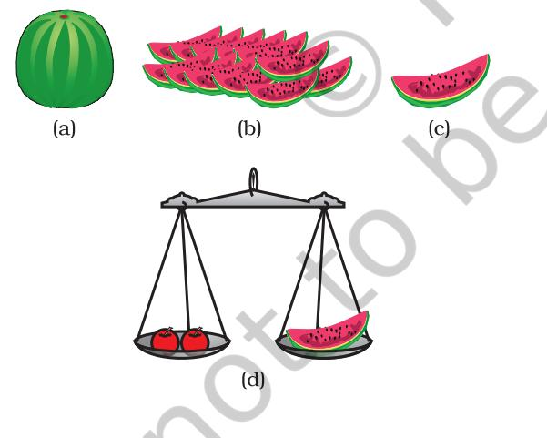

*Fig. 3.4 : (a) Watermelon, (b) 12 pieces, (c) 1/12 of watermelon, (d) how the fruit seller can weigh the fruits using pieces of watermelon*

Similarly, the relative atomic mass of the atom of an element is defined as the average mass of the atom, as compared to 1/12th the mass of one carbon-12 atom.

| Table 3.2: Atomic masses of |  |
| --- | --- |
|  | a few elements |
| Element | Atomic Mass (u) |
| Hydrogen | 1 |
| Carbon | 12 |
| Nitrogen | 14 |
| Oxygen | 16 |
| Sodium | 23 |
| Magnesium | 24 |
| Sulphur | 32 |
| Chlorine | 35.5 |
| Calcium | 40 |

### **3.2.3 HOW DO ATOMS EXIST?**

Atoms of most elements are not able to exist independently. Atoms form molecules and ions. These molecules or ions aggregate in large numbers to form the matter that we can see, feel or touch.

# uestions

- *1. Define the atomic mass unit.* Q
	- *2. Why is it not possible to see an atom with naked eyes?*

# **3.3 What is a Molecule?**

A molecule is in general a group of two or more atoms that are chemically bonded together, that is, tightly held together by attractive forces. A molecule can be defined as the smallest particle of an element or a compound that is capable of an independent existence and shows all the properties of that substance. Atoms of the same element or of different elements can join together to form molecules.

#### **3.3.1 MOLECULES OF ELEMENTS**

The molecules of an element are constituted by the same type of atoms. Molecules of many elements, such as argon (Ar), helium (He) etc. are made up of only one atom of that element. But this is not the case with most of the nonmetals. For example, a molecule of oxygen consists of two atoms of oxygen and hence it is known as a diatomic molecule, O2 . If 3 atoms of oxygen unite into a molecule, instead of the usual 2, we get ozone, O3 . The number of atoms constituting a molecule is known as its atomicity.

Metals and some other elements, such as carbon, do not have a simple structure but consist of a very large and indefinite number of atoms bonded together.

| Table 3.3 : | Atomicity of some elements |  |
| --- | --- | --- |
| Type of Element | Name | Atomicity |
| Non-Metal | Argon | Monoatomic |
|  | Helium | Monoatomic |
|  | Oxygen | Diatomic |
|  | Hydrogen | Diatomic |
|  | Nitrogen | Diatomic |
|  | Chlorine | Diatomic |
|  | Phosphorus | Tetra-atomic |
|  | Sulphur | Poly-atomic |

#### Let us look at the atomicity of some non-metals.

#### **3.3.2 MOLECULES OF COMPOUNDS**

Atoms of different elements join together in definite proportions to form molecules of compounds. Few examples are given in Table 3.4.

*ATOMS AND MOLECULES* **31**

| Table 3.4 : | Molecules of some |  |
| --- | --- | --- |
|  | compounds |  |
| Compound | Combining | Ratio |
|  | Elements | by |
|  |  | Mass |
| Water (H2O) | Hydrogen, Oxygen | 1:8 |
| ) Ammonia (NH3 | Nitrogen, Hydrogen | 14:3 |
| Carbon |  |  |
| dioxide (CO2 ) | Carbon, Oxygen | 3:8 |

### *Activity ______________ 3.2*

- Refer to Table 3.4 for ratio by mass of atoms present in molecules and Table 3.2 for atomic masses of elements. Find the ratio by number of the atoms of elements in the molecules of compounds given in Table 3.4.
• The ratio by number of atoms for a water molecule can be found as follows:

| Element | Ratio | Atomic | Mass | Simplest |
| --- | --- | --- | --- | --- |
|  | by | mass | ratio/ | ratio |
|  | mass | (u) | atomic mass |  |
|  |  |  | 1 |  |
| H | 1 | 1 | =1 1 | 2 |
|  |  |  | 8 1 |  |
| O | 8 | 16 | = | 1 |
|  |  |  | 16 2 |  |

• Thus, the ratio by number of atoms for water is H:O = 2:1.

### **3.3.3 WHAT IS AN ION?**

Compounds composed of metals and nonmetals contain charged species. The charged species are known as *ions*. Ions may consist of a single charged atom or a group of atoms that have a net charge on them. An ion can be negatively or positively charged. A negatively charged ion is called an 'anion' and the positively charged ion, a 'cation'. Take, for example, sodium chloride (NaCl). Its constituent particles are positively charged sodium ions (Na+ ) and negatively charged chloride ions (Cl– ). A group of atoms carrying a charge is known as a polyatomic ion (Table 3.6). We shall learn more about the formation of ions in Chapter 4.

| Table 3.5: Some ionic compounds |  |  |
| --- | --- | --- |
| Ionic Compound | Constituting Elements | Ratio |
|  |  | by |
|  |  | Mass |
| Calcium oxide | Calcium and |  |
|  | oxygen | 5:2 |
| Magnesium | Magnesium |  |
| sulphide | and sulphur | 3:4 |
| Sodium | Sodium |  |
| chloride | and chlorine | 23:35.5 |

## **3.4 Writing Chemical Formulae**

The chemical formula of a compound is a symbolic representation of its composition. The chemical formulae of different compounds can be written easily. For this exercise, we need to learn the symbols and combining capacity of the elements.

The combining power (or capacity) of an element is known as its valency. Valency can be used to find out how the atoms of an element will combine with the atom(s) of another element to form a chemical compound. The valency of the atom of an element can be thought of as hands or arms of that atom.

Human beings have two arms and an octopus has eight. If one octopus has to catch hold of a few people in such a manner that all the eight arms of the octopus and both arms of all the humans are locked, how many humans do you think the octopus can hold? Represent the octopus with O and humans with H. Can you write a formula for this combination? Do you get OH4 as the formula? The subscript 4 indicates the number of humans held by the octopus.

The valencies of some common ions are given in Table 3.6. We will learn more about valency in the next chapter.

|  | Table 3.6: |  | Names and symbols of some ions |  |  |  |
| --- | --- | --- | --- | --- | --- | --- |
| Vale- | Name of | Symbol | Non- | Symbol | Polyatomic | Symbol |
| ncy | ion |  | metallic element |  | ions |  |
| 1. | Sodium | Na+ | Hydrogen | H+ | Ammonium | + NH4 |
|  | Potassium | K+ | Hydride | H- | Hydroxide | OH– |
|  | Silver | Ag+ | Chloride | Cl- | Nitrate | – NO3 |
|  | Copper (I)* | Cu+ | Bromide | Br- | Hydrogen |  |
|  |  |  | Iodide | – I | carbonate | – HCO3 |
| 2. | Magnesium | Mg2+ | Oxide | O2- | Carbonate | 2– CO3 |
|  | Calcium | Ca2+ | Sulphide | 2- S | Sulphite | 2– SO3 |
|  | Zinc | Zn2+ |  |  | Sulphate | 2– SO4 |
|  | Iron (II)* | Fe2+ |  |  |  |  |
|  | Copper (II)* | Cu2+ |  |  |  |  |
| 3. | Aluminium | Al3+ | Nitride | N3- | Phosphate | 3– PO4 |
|  | Iron (III)* | Fe3+ |  |  |  |  |

** Some elements show more than one valency. A Roman numeral shows their valency in a bracket.*

The rules that you have to follow while writing a chemical formula are as follows:

- the valencies or charges on the ion must balance.
- when a compound consists of a metal and a non-metal, the name or symbol of the metal is written first. For example: calcium oxide (CaO), sodium chloride (NaCl), iron sulphide (FeS), copper oxide (CuO), etc., where oxygen, chlorine, sulphur are nonmetals and are written on the right, whereas calcium, sodium, iron and copper are metals, and are written on the left.
- in compounds formed with polyatomic ions, the number of ions present in the compound is indicated by enclosing the formula of ion in a bracket and writing the number of ions outside the bracket. For example, Mg (OH)2 . In case the number of polyatomic ion is one, the bracket is not required. For example, NaOH.

#### **3.4.1 FORMULAE OF SIMPLE COMPOUNDS**

The simplest compounds, which are made up of two different elements are called binary compounds. Valencies of some ions are given in Table 3.6. You can use these to write formulae for compounds.

While writing the chemical formulae for compounds, we write the constituent elements and their valencies as shown below. Then we must crossover the valencies of the combining atoms.

#### **Examples**

1. Formula of hydrogen chloride

Formula of the compound would be HCl.

2. Formula of hydrogen sulphide

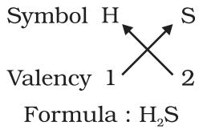

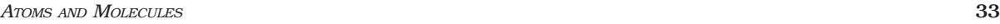

- 3. Formula of carbon tetrachloride
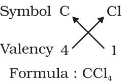

For magnesium chloride, we write the symbol of cation (Mg2+) first followed by the symbol of anion (Cl- ). Then their charges are criss-crossed to get the formula.

- 4. Formula of magnesium chloride
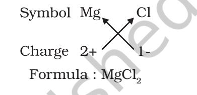

Thus, in magnesium chloride, there are two chloride ions (Cl- ) for each magnesium ion (Mg2+). The positive and negative charges must balance each other and the overall structure must be neutral. Note that in the formula, the charges on the ions are not indicated.

**Some more examples**

- (a) Formula for aluminium oxide:
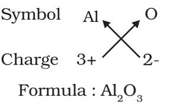

- (b) Formula for calcium oxide:
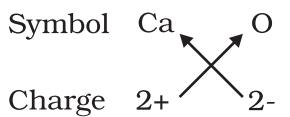

Here, the valencies of the two elements are the same. You may arrive at the formula Ca2O2 . But we simplify the formula as CaO. (c) Formula of sodium nitrate:

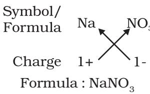

(d) Formula of calcium hydroxide:

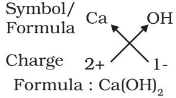

Note that the formula of calcium hydroxide is Ca(OH)2 and not CaOH2 . We use brackets when we have two or more of the same ions in the formula. Here, the bracket around OH with a subscript 2 indicates that there are two hydroxyl (OH) groups joined to one calcium atom. In other words, there are two atoms each of oxygen and hydrogen in calcium hydroxide.

- (e) Formula of sodium carbonate:
Formula : Na2CO3

In the above example, brackets are not needed if there is only one ion present.

- (f) Formula of ammonium sulphate:
Formula : (NH4 ) 2 SO4

# uestions

- Q *1. Write down the formulae of (i) sodium oxide*
	- *(ii) aluminium chloride*
	- *(iii) sodium sulphide*
	- *(iv) magnesium hydroxide*
	- *2. Write down the names of compounds represented by the*

*following formulae:*

*3*

*.*

- *(i) Al2 (SO4 )*
- *(ii) CaCl2*
- *(iii) K2SO4*
- *(iv) KNO3*
- *(v) CaCO3*
- *3. What is meant by the term chemical formula?*
- *4. How many atoms are present in a (i) H2S molecule and*

*(ii) PO4 3– ion?*

# **3.5 Molecular Mass**

### **3.5.1 MOLECULAR MASS**

In section 3.2.2 we discussed the concept of atomic mass. This concept can be extended to calculate molecular masses. The molecular mass of a substance is the sum of the atomic masses of all the atoms in a molecule of the substance. It is therefore the relative mass of a molecule expressed in *atomic mass units (u).*

Example 3.1 (a) Calculate the relative molecular mass of water (H2O). (b) Calculate the molecular mass of HNO3 .

#### Solution:

- (a) Atomic mass of hydrogen = 1u, oxygen = 16 u
	- So the molecular mass of water, which contains two atoms of hydrogen and one atom of oxygen is = 2 × 1+ 1×16 = 18 u
- (b) The molecular mass of HNO3 = the atomic mass of H + the atomic mass of N+ 3 × the atomic mass of O

= 1 + 14 + 48 = 63 u

### **3.5.2 FORMULA UNIT MASS**

The formula unit mass of a substance is a sum of the atomic masses of all atoms in a formula unit of a compound. Formula unit mass is calculated in the same manner as we calculate the molecular mass. The only difference is that

we use the word formula unit for those substances whose constituent particles are ions. For example, sodium chloride as discussed above, has a formula unit NaCl. Its formula unit mass can be calculated as–

1 × 23 + 1 × 35.5 = 58.5 u

**Example 3.2** Calculate the formula unit mass of CaCl2 .

#### **Solution:**

Atomic mass of Ca + (2 × atomic mass of Cl) = 40 + 2 × 35.5 = 40 + 71 = 111 u

# uestions

- *1. Calculate the molecular masses of H2 , O2 , Cl2 , CO2 , CH4 , C2H6 , C2H4 , NH3 , CH3OH.*
- Q *2. Calculate the formula unit masses of ZnO, Na2O, K2CO3 , given atomic masses of Zn = 65 u, Na = 23 u, K = 39 u, C = 12 u, and O = 16 u.*

# **What you have**

# **learnt**

- During a chemical reaction, the sum of the masses of the reactants and products remains unchanged. This is known as the Law of Conservation of Mass.
- In a pure chemical compound, elements are always present in a definite proportion by mass. This is known as the Law of Definite Proportions.
- An atom is the smallest particle of the element that cannot usually exist independently and retain all its chemical properties.
- A molecule is the smallest particle of an element or a compound capable of independent existence under ordinary conditions. It shows all the properties of the substance.
- A chemical formula of a compound shows its constituent elements and the number of atoms of each combining element.
- Clusters of atoms that act as an ion are called polyatomic ions. They carry a fixed charge on them.
- The chemical formula of a molecular compound is determined by the valency of each element.
- In ionic compounds, the charge on each ion is used to determine the chemical formula of the compound.

# **Exercises**

- 1. A 0.24 g sample of compound of oxygen and boron was found by analysis to contain 0.096 g of boron and 0.144 g of oxygen. Calculate the percentage composition of the compound by weight.
- 2. When 3.0 g of carbon is burnt in 8.00 g oxygen, 11.00 g of carbon dioxide is produced. What mass of carbon dioxide will be formed when 3.00 g of carbon is burnt in 50.00 g of oxygen? Which law of chemical combination will govern your answer?
- 3. What are polyatomic ions? Give examples.
- 4. Write the chemical formulae of the following.
	- (a) Magnesium chloride
	- (b) Calcium oxide
	- (c) Copper nitrate
	- (d) Aluminium chloride
	- (e) Calcium carbonate.
- 5. Give the names of the elements present in the following compounds.
	- (a) Quick lime
	- (b) Hydrogen bromide
	- (c) Baking powder
	- (d) Potassium sulphate.
- 6. Calculate the molar mass of the following substances.
	- (a) Ethyne, C2H2
	- (b) Sulphur molecule, S8
	- (c) Phosphorus molecule, P4 (Atomic mass of phosphorus = 31)
	- (d) Hydrochloric acid, HCl
	- (e) Nitric acid, HNO3

# **Group Activity**

Play a game for writing formulae.

- **Example1 :** Make placards with symbols and valencies of the elements separately. Each student should hold two placards, one with the symbol in the right hand and the other with the valency in the left hand. Keeping the symbols in place, students should criss-cross their valencies to form the formula of a compound.
- **Example 2 :** A low cost model for writing formulae: Take empty blister packs of medicines. Cut them in groups, according to the valency of the element, as shown in the figure. Now, you can make formulae by fixing one type of ion into other.
**For example:**

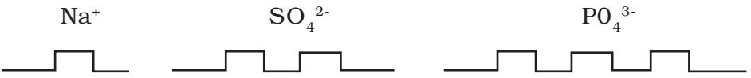

Formula for sodium sulphate:

2 sodium ions can be fixed on one sulphate ion.

Hence, the formula will be: Na2SO4

Do it yourself :

Now, write the formula of sodium phosphate.

*ATOMS AND MOLECULES* **37**

