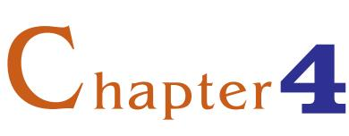
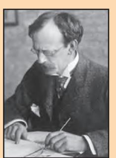
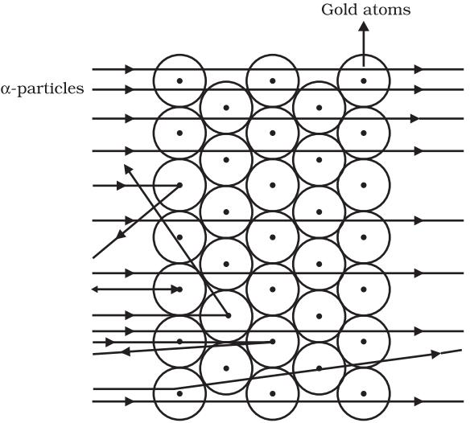
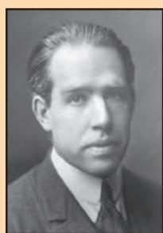
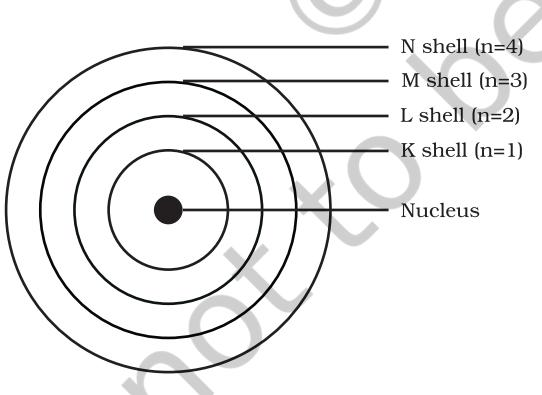
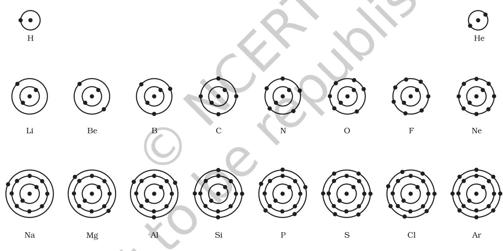
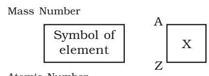

# **STRUCTURE OF THE ATOM**

In Chapter 3, we have learnt that atoms and molecules are the fundamental building blocks of matter. The existence of different kinds of matter is due to different atoms constituting them. Now the questions arise: (i) What makes the atom of one element different from the atom of another element? and (ii) Are atoms really indivisible, as proposed by Dalton, or are there smaller constituents inside the atom? We shall find out the answers to these questions in this chapter. We will learn about sub-atomic particles and the various models that have been proposed to explain how these particles are arranged within the atom.

A major challenge before the scientists at the end of the 19th century was to reveal the structure of the atom as well as to explain its important properties. The elucidation of the structure of atoms is based on a series of experiments.

One of the first indications that atoms are not indivisible, comes from studying static electricity and the condition under which electricity is conducted by different substances.

# **4.1 Charged Particles in Matter**

For understanding the nature of charged particles in matter, let us carry out the following activities:

### *Activity ______________ 4.1*

- A. Comb dry hair. Does the comb then attract small pieces of paper?
- B. Rub a glass rod with a silk cloth and bring the rod near an inflated balloon. Observe what happens.

From these activities, can we conclude that on rubbing two objects together, they become electrically charged? Where does this charge come from? This question can be answered by knowing that an atom is divisible and consists of charged particles.

Many scientists contributed in revealing the presence of charged particles in an atom.

It was known by 1900 that the atom was indivisible particle but contained at least one sub-atomic particle – the electron identified by J.J. Thomson. Even before the electron was identified, E. Goldstein in 1886 discovered the presence of new radiations in a gas discharge and called them canal rays. These rays were positively charged radiations which ultimately led to the discovery of another sub-atomic particle. This sub-atomic particle had a charge, equal in magnitude but opposite in sign to that of the electron. Its mass was approximately 2000 times as that of the electron. It was given the name of proton. In general, an electron is represented as 'e– ' and a proton as 'p+ '. The mass of a proton is taken as one unit and its charge as plus one. The mass of an electron is considered to be negligible and its charge is minus one.

It seemed that an atom was composed of protons and electrons, mutually balancing their charges. It also appeared that the protons were in the interior of the atom, for whereas electrons could easily be removed off but not protons. Now the big question was: what sort of structure did these particles of the atom form? We will find the answer to this question below.

# uestions

- *1. What are canal rays?*
- *2. If an atom contains one electron and one proton, will it carry any charge or not?* Q

# **4.2 The Structure of an Atom**

We have learnt Dalton's atomic theory in Chapter 3, which suggested that the atom was indivisible and indestructible. But the discovery of two fundamental particles (electrons and protons) inside the atom, led to the failure of this aspect of Dalton's atomic theory. It was then considered necessary to know how electrons and protons are arranged within an atom. For explaining this, many scientists proposed various atomic models. J.J. Thomson was the first one to propose a model for the structure of an atom.

### **4.2.1 THOMSON'S MODEL OF AN ATOM**

Thomson proposed the model of an atom to be similar to that of a Christmas pudding. The electrons, in a sphere of positive charge, were like currants (dry fruits) in a spherical Christmas pudding. We can also think of a watermelon, the positive charge in the atom is spread all over like the red edible part of the watermelon, while the electrons are studded in the positively charged sphere, like the seeds in the watermelon (Fig. 4.1).

*Fig.4.1: Thomson's model of an atom*

*STRUCTURE OF THE ATOM* **39**

J.J. Thomson (1856– 1940), a British physicist, was born in Cheetham Hill, a suburb of Manchester, on 18 December 1856. He was awarded the Nobel prize in Physics in 1906 for his work on the discovery of electrons. He

directed the Cavendish Laboratory at Cambridge for 35 years and seven of his research assistants subsequently won Nobel prizes.

Thomson proposed that:

- (i) An atom consists of a positively charged sphere and the electrons are embedded in it.
- (ii) The negative and positive charges are equal in magnitude. So, the atom as a whole is electrically neutral.

Although Thomson's model explained that atoms are electrically neutral, the results of experiments carried out by other scientists could not be explained by this model, as we will see below.

### **4.2.2 RUTHERFORD'S MODEL OF AN ATOM**

Ernest Rutherford was interested in knowing how the electrons are arranged within an atom. Rutherford designed an experiment for this. In this experiment, fast moving alpha (α)-particles were made to fall on a thin gold foil.

- He selected a gold foil because he wanted as thin a layer as possible. This gold foil was about 1000 atoms thick.
- α-particles are doubly-charged helium ions. Since they have a mass of 4 u, the fast-moving α-particles have a considerable amount of energy.
- It was expected that α-particles would be deflected by the sub-atomic particles in the gold atoms. Since the α-particles were much heavier than the protons, he did not expect to see large deflections.

*Fig. 4.2: Scattering of* α*-particles by a gold foil*

But, the α-particle scattering experiment gave totally unexpected results (Fig. 4.2). The following observations were made:

- (i) Most of the fast moving α-particles passed straight through the gold foil.
- (ii) Some of the α-particles were deflected by the foil by small angles.
- (iii) Surprisingly one out of every 12000 particles appeared to rebound.

In the words of Rutherford, "*This result was almost as incredible as if you fire a 15-inch shell at a piece of tissue paper and it comes back and hits you*".

E. Rutherford (1871–1937) was born at Spring Grove on 30 August 1871. He was known as the 'Father' of nuclear physics. He is famous for his work on radioactivity and the

discovery of the nucleus of an atom with the gold foil experiment. He got the Nobel prize in chemistry in 1908.

Let us think of an activity in an open field to understand the implications of this experiment. Let a child stand in front of a wall with his eyes closed. Let him throw stones at the wall from a distance. He will hear a sound when each stone strikes the wall. If he repeats this ten times, he will hear the sound ten times. But if a blind-folded child were to throw stones at a barbed-wire fence, most of the stones would not hit the fencing and no sound would be heard. This is because there are lots of gaps in the fence which allow the stone to pass through them.

Following a similar reasoning, Rutherford concluded from the α-particle scattering experiment that—

- (i) Most of the space inside the atom is empty because most of the α-particles passed through the gold foil without getting deflected.
- (ii) Very few particles were deflected from their path, indicating that the positive charge of the atom occupies very little space.
- (iii) A very small fraction of α-particles were deflected by 1800 ,indicating that all the positive charge and mass of the gold atom were concentrated in a very small volume within the atom.

From the data he also calculated that the radius of the nucleus is about 105 times less than the radius of the atom.

On the basis of his experiment, Rutherford put forward the nuclear model of an atom, which had the following features:

- (i) There is a positively charged centre in an atom called the nucleus. Nearly all the mass of an atom resides in the nucleus.
- (ii) The electrons revolve around the nucleus in circular paths.
- (iii) The size of the nucleus is very small as compared to the size of the atom.

#### **Drawbacks of Rutherford's model of the atom**

The revolution of the electron in a circular orbit is not expected to be stable. Any particle in a circular orbit would undergo acceleration. During acceleration, charged particles would radiate energy. Thus, the revolving electron would lose energy and finally fall into the nucleus. If this were so, the atom should be highly unstable and hence matter would not exist in the form that we know. We know that atoms are quite stable.

### **4.2.3 BOHR'S MODEL OF ATOM**

In order to overcome the objections raised against Rutherford's model of the atom, Neils Bohr put forward the following postulates about the model of an atom:

- (i) Only certain special orbits known as discrete orbits of electrons, are allowed inside the atom.
- (ii) While revolving in discrete orbits the electrons do not radiate energy.

Neils Bohr (1885–1962) was born in Copenhagen on 7 October 1885. He was appointed professor of physics at Copenhagen University in 1916. He got the Nobel prize for his work on the structure of atom in 1922. Among Professor

Bohr's numerous writings, three appearing as books are:

(i) The Theory of Spectra and Atomic Constitution, (ii) Atomic Theory and, (iii) The Description of Nature.

These orbits or shells are called energy levels. Energy levels in an atom are shown in Fig. 4.3.

*Fig. 4.3: A few energy levels in an atom*

These orbits or shells are represented by the letters K,L,M,N,… or the numbers, n=1,2,3,4,….

#### *STRUCTURE OF THE ATOM* **41**

# uestions

- *1. On the basis of Thomson's model of an atom, explain how the atom is neutral as a whole.*
- *2. On the basis of Rutherford's model of an atom, which subatomic particle is present in the nucleus of an atom?* Q
	- *3. Draw a sketch of Bohr's model of an atom with three shells.*
	- *4. What do you think would be the observation if the* α*-particle scattering experiment is carried out using a foil of a metal other than gold?*

#### **4.2.4 NEUTRONS**

In 1932, J. Chadwick discovered another subatomic particle which had no charge and a mass nearly equal to that of a proton. It was eventually named as neutron. Neutrons are present in the nucleus of all atoms, except hydrogen. In general, a neutron is represented as 'n'. The mass of an atom is therefore given by the sum of the masses of protons and neutrons present in the nucleus.

# uestions

- *1. Name the three sub-atomic particles of an atom.*
- *2. Helium atom has an atomic mass of 4 u and two protons in its nucleus. How many neutrons does it have?* Q

# **4.3 How are Electrons Distributed in Different Orbits (Shells)?**

The distribution of electrons into different orbits of an atom was suggested by Bohr and Bury.

The following rules are followed for writing the number of electrons in different energy levels or shells:

- (i) The maximum number of electrons present in a shell is given by the
formula 2n2 , where 'n' is the orbit number or energy level index, 1,2,3,…. Hence the maximum number of electrons in different shells are as follows:

first orbit or K-shell will be = 2 × 12 = 2, second orbit or L-shell will be = 2 × 22 = 8, third orbit or M-shell will be = 2 × 32 = 18, fourth orbit or N-shell will be = 2 × 42 = 32, and so on.

- (ii) The maximum number of electrons that can be accommodated in the outermost orbit is 8.
- (iii) Electrons are not accommodated in a given shell, unless the inner shells are filled. That is, the shells are filled in a step-wise manner.

Atomic structure of the first eighteen elements is shown schematically in Fig. 4.4.

• The composition of atoms of the first eighteen elements is given in Table 4.1.

# uestions

- *1. Write the distribution of electrons in carbon and sodium atoms.*
- *2. If K and L shells of an atom are full, then what would be the total number of electrons in the atom?* Q

### **4.4 Valency**

We have learnt how the electrons in an atom are arranged in different shells/orbits. The electrons present in the outermost shell of an atom are known as the valence electrons.

From the Bohr-Bury scheme, we also know that the outermost shell of an atom can

*Fig.4.4: Schematic atomic structure of the first eighteen elements*

### *Activity ______________ 4.2*

- Make a static atomic model displaying electronic configuration of the first eighteen elements.
accommodate a maximum of 8 electrons. It was observed that the atoms of elements, completely filled with 8 electrons in the outermost shell show little chemical activity. In other words, their combining capacity or valency is zero. Of these inert elements, the

|  |  |  | Table 4.1: Composition of Atoms of the First Eighteen Elements |  |  |  |  |  |  |  |
| --- | --- | --- | --- | --- | --- | --- | --- | --- | --- | --- |
|  |  |  | with Electron Distribution in Various Shells |  |  |  |  |  |  |  |
| Name of Element | Symbol | Atomic Number | Number of | Number of | Number of |  | Distribution of Electrons |  |  | Vale ncy |
|  |  |  | Protons |  | Neutrons Electrons | K | L | M | N |  |
| Hydrogen | H | 1 | 1 | - | 1 | 1 | - | - | - | 1 |
| Helium | He | 2 | 2 | 2 | 2 | 2 | - | - | - | 0 |
| Lithium | Li | 3 | 3 | 4 | 3 | 2 | 1 | - | - | 1 |
| Beryllium | Be | 4 | 4 | 5 | 4 | 2 | 2 | - | - | 2 |
| Boron | B | 5 | 5 | 6 | 5 | 2 | 3 | - | - | 3 |
| Carbon | C | 6 | 6 | 6 | 6 | 2 | 4 | - | - | 4 |
| Nitrogen | N | 7 | 7 | 7 | 7 | 2 | 5 | - | - | 3 |
| Oxygen | O | 8 | 8 | 8 | 8 | 2 | 6 | - | - | 2 |
| Fluorine | F | 9 | 9 | 10 | 9 | 2 | 7 | - | - | 1 |
| Neon | Ne | 10 | 10 | 10 | 10 | 2 | 8 | - | - | 0 |
| Sodium | Na | 11 | 11 | 12 | 11 | 2 | 8 | 1 | - | 1 |
| Magnesium | Mg | 12 | 12 | 12 | 12 | 2 | 8 | 2 | - | 2 |
| Aluminium | Al | 13 | 13 | 14 | 13 | 2 | 8 | 3 | - | 3 |
| Silicon | Si | 14 | 14 | 14 | 14 | 2 | 8 | 4 | - | 4 |
| Phosphorus | P | 15 | 15 | 16 | 15 | 2 | 8 | 5 | - | 3,5 |
| Sulphur | S | 16 | 16 | 16 | 16 | 2 | 8 | 6 | - | 2 |
| Chlorine | Cl | 17 | 17 | 18 | 17 | 2 | 8 | 7 | - | 1 |
| Argon | Ar | 18 | 18 | 22 | 18 | 2 | 8 | 8 |  | 0 |

helium atom has two electrons in its outermost shell and all other elements have atoms with eight electrons in the outermost shell.

The combining capacity of the atoms of elements, that is, their tendency to react and form molecules with atoms of the same or different elements, was thus explained as an attempt to attain a fully-filled outermost shell. An outermost-shell, which had eight electrons was said to possess an octet. Atoms would thus react, so as to achieve an octet in the outermost shell. This was done by sharing, gaining or losing electrons. The number of electrons gained, lost or shared so as to make the octet of electrons in the outermost shell, gives us directly the combining capacity of the element, that is, the valency discussed in the previous chapter. For example, hydrogen/ lithium/sodium atoms contain one electron each in their outermost shell, therefore each one of them can lose one electron. So, they are said to have valency of one. Can you tell, what is valency of magnesium and aluminium? It is two and three, respectively, because magnesium has two electrons in its outermost shell and aluminium has three electrons in its outermost shell.

If the number of electrons in the outermost shell of an atom is close to its full capacity, then valency is determined in a different way. For example, the fluorine atom has 7 electrons in the outermost shell, and its valency could be 7. But it is easier for fluorine to gain one electron instead of losing seven electrons. Hence, its valency is determined by subtracting seven electrons from the octet and this gives you a valency of one for fluorine. Valency can be calculated in a similar manner for oxygen. What is the valency of oxygen that you get from this calculation?

Therefore, an atom of each element has a definite combining capacity, called its valency. Valency of the first eighteen elements is given in the last column of Table 4.1.

- uestion
*1. How will you find the valency of chlorine, sulphur and magnesium?* Q

# **4.5 Atomic Number and Mass Number**

### **4.5.1 ATOMIC NUMBER**

We know that protons are present in the nucleus of an atom. It is the number of protons of an atom, which determines its atomic number. It is denoted by 'Z'. All atoms of an element have the same atomic number, Z. In fact, elements are defined by the number of protons they possess. For hydrogen, Z = 1, because in hydrogen atom, only one proton is present in the nucleus. Similarly, for carbon, Z = 6. Therefore, the atomic number is defined as the total number of protons present in the nucleus of an atom.

### **4.5.2 MASS NUMBER**

After studying the properties of the subatomic particles of an atom, we can conclude that mass of an atom is practically due to protons and neutrons alone. These are present in the nucleus of an atom. Hence protons and neutrons are also called nucleons. Therefore, the mass of an atom resides in its nucleus. For example, mass of carbon is 12 u because it has 6 protons and 6 neutrons, 6 u + 6 u = 12 u. Similarly, the mass of aluminium is 27 u (13 protons+14 neutrons). The mass number is defined as the sum of the total number of protons and neutrons present in the nucleus of an atom. It is denoted by 'A'. In the notation for an atom, the atomic number, mass number and symbol of the element are to be written as:

Atomic Number

For example, nitrogen is written as 14 7 N .

# uestions

- *1. If number of electrons in an atom is 8 and number of protons is also 8, then (i) what is the atomic number of the atom? and (ii) what is the charge on the atom?* Q
	- *2. With the help of Table 4.1, find out the mass number of oxygen and sulphur atom.*

# **4.6 Isotopes**

In nature, a number of atoms of some elements have been identified, which have the same atomic number but different mass numbers. For example, take the case of hydrogen atom, it has three atomic species, namely protium (1 1 H), deuterium ( 2 1 H or D) and tritium ( 3 1H or T). The atomic number of each one is 1, but the mass number is 1, 2 and 3, respectively. Other such examples are (i) carbon, 12 6 C and 14 6 C, (ii) chlorine, 35 17 Cl

#### and 37 17 Cl, etc.

On the basis of these examples, isotopes are defined as the atoms of the same element, having the same atomic number but different mass numbers. Therefore, we can say that there are three isotopes of hydrogen atom, namely protium, deuterium and tritium.

Many elements consist of a mixture of isotopes. Each isotope of an element is a pure substance. The chemical properties of isotopes are similar but their physical properties are different.

Chlorine occurs in nature in two isotopic forms, with masses 35 u and 37 u in the ratio of 3:1. Obviously, the question arises: what should we take as the mass of chlorine atom? Let us find out.

The average atomic mass of chlorine atom, on the basis of above data, will be

$$\left[\left(35\times{\frac{75}{100}}+37\times{\frac{25}{100}}\right)\right.$$
  
  

$$=\left({\frac{105}{4}}+{\frac{37}{4}}\right)={\frac{142}{4}}=35.5\,\mathrm{u}\right]$$

The mass of an atom of any natural element is taken as the average mass of all the naturally occuring atoms of that element. If an element has no isotopes, then the mass of its atom would be the same as the sum of protons and neutrons in it. But if an element occurs in isotopic forms, then we have to know the percentage of each isotopic form and then the average mass is calculated.

This does not mean that any one atom of chlorine has a fractional mass of 35.5 u. It means that if you take a certain amount of chlorine, it will contain both isotopes of chlorine and the average mass is 35.5 u.

#### **Applications**

Since the chemical properties of all the isotopes of an element are the same, normally we are not concerned about taking a mixture. But some isotopes have special properties which find them useful in various fields. Some of them are :

- (i) An isotope of uranium is used as a fuel in nuclear reactors.
- (ii) An isotope of cobalt is used in the treatment of cancer.
- (iii) An isotope of iodine is used in the treatment of goitre.

### **4.6.1 ISOBARS**

Let us consider two elements — calcium, atomic number 20, and argon, atomic number 18. The number of protons in these atoms is different, but the mass number of both these elements is 40. That is, the total number of nucleons is the same in the atoms of this pair of elements. Atoms of different elements with different atomic numbers, which have the same mass number, are known as isobars.

# uestions

- Q *1. For the symbol H,D and T tabulate three sub-atomic particles found in each of them.*
	- *2. Write the electronic configuration of any one pair of isotopes and isobars.*

- Credit for the discovery of electron and proton goes to J.J. Thomson and E.Goldstein, respectively.
- J.J. Thomson proposed that electrons are embedded in a positive sphere.

*STRUCTURE OF THE ATOM* **45**

- Rutherford's alpha-particle scattering experiment led to the discovery of the atomic nucleus.
- Rutherford's model of the atom proposed that a very tiny nucleus is present inside the atom and electrons revolve around this nucleus. The stability of the atom could not be explained by this model.
- Neils Bohr's model of the atom was more successful. He proposed that electrons are distributed in different shells with discrete energy around the nucleus. If the atomic shells are complete, then the atom will be stable and less reactive.
- J. Chadwick discovered presence of neutrons in the nucleus of an atom. So, the three sub-atomic particles of an atom are: (i) electrons, (ii) protons and (iii) neutrons. Electrons are negatively charged, protons are positively charged and neutrons

have no charges. The mass of an electron is about 1 2000 times the mass of an hydrogen atom. The mass of a proton and a

- Shells of an atom are designated as K,L,M,N,….
- Valency is the combining capacity of an atom.

neutron is taken as one unit each.

- The atomic number of an element is the same as the number of protons in the nucleus of its atom.
- The mass number of an atom is equal to the number of nucleons in its nucleus.
- Isotopes are atoms of the same element, which have different mass numbers.
- Isobars are atoms having the same mass number but different atomic numbers.
- Elements are defined by the number of protons they possess.

# **Exercises**

- 1. Compare the properties of electrons, protons and neutrons.
- 2. What are the limitations of J.J. Thomson's model of the atom?
- 3. What are the limitations of Rutherford's model of the atom?
- 4. Describe Bohr's model of the atom.
- 5. Compare all the proposed models of an atom given in this chapter.
- 6. Summarise the rules for writing of distribution of electrons in various shells for the first eighteen elements.
- 7. Define valency by taking examples of silicon and oxygen.
- 8. Explain with examples (i) Atomic number, (ii) Mass number, (iii) Isotopes and iv) Isobars. Give any two uses of isotopes.
- 9. Na+ has completely filled K and L shells. Explain.
- 10. If bromine atom is available in the form of, say, two isotopes 79 35 Br (49.7%) and 81 35 Br (50.3%), calculate the average atomic mass of bromine atom.
- 11. The average atomic mass of a sample of an element X is 16.2 u. What are the percentages of isotopes 16 8 X and 18 8 X in the sample?
- 12. If Z = 3, what would be the valency of the element? Also, name the element.
- 13. Composition of the nuclei of two atomic species X and Y are given as under

**X Y** Protons = 6 6 Neutrons = 6 8

Give the mass numbers of X and Y. What is the relation between the two species?

- 14. For the following statements, write T for True and F for False.
	- (a) J.J. Thomson proposed that the nucleus of an atom contains only nucleons.
	- (b) A neutron is formed by an electron and a proton combining together. Therefore, it is neutral.
	- (c) The mass of an electron is about 1 2000 times that of proton.
	- (d) An isotope of iodine is used for making tincture iodine, which is used as a medicine.

Put tick (¸) against correct choice and cross (×) against wrong choice in questions 15, 16 and 17

- 15. Rutherford's alpha-particle scattering experiment was responsible for the discovery of
	- (a) Atomic Nucleus (b) Electron
	- (c) Proton (d) Neutron
- 16. Isotopes of an element have
	- (a) the same physical properties
	- (b) different chemical properties
	- (c) different number of neutrons
	- (d) different atomic numbers.
- 17. Number of valence electrons in Cl– ion are:
	- (a) 16 (b) 8 (c) 17 (d) 18

- 18. Which one of the following is a correct electronic configuration of sodium?

|
|  |

19. Complete the following table.

| Atomic | Mass | Number | Number | Number | Name of |
| --- | --- | --- | --- | --- | --- |
| Number | Number | of | of | of | the Atomic |
|  |  | Neutrons | Protons | Electrons | Species |
| 9 | - | 10 | - | - | - |
| 16 | 32 | - | - | - | Sulphur |
| - | 24 | - | 12 | - | - |
| - | 2 | - | 1 | - | - |
| - | 1 | 0 | 1 | 0 | - |

