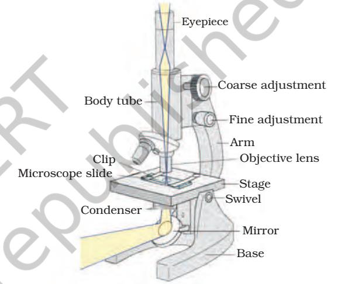
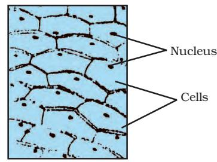
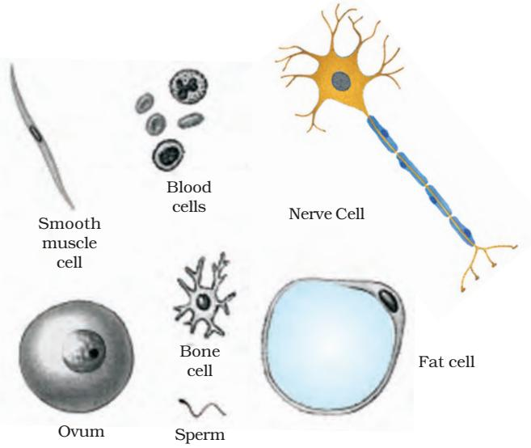
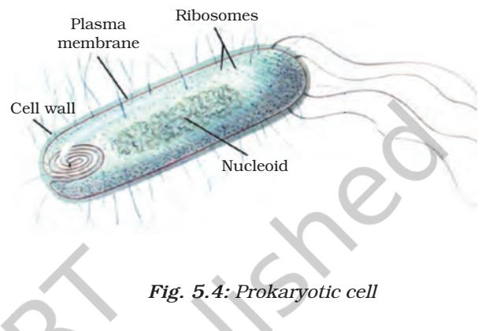
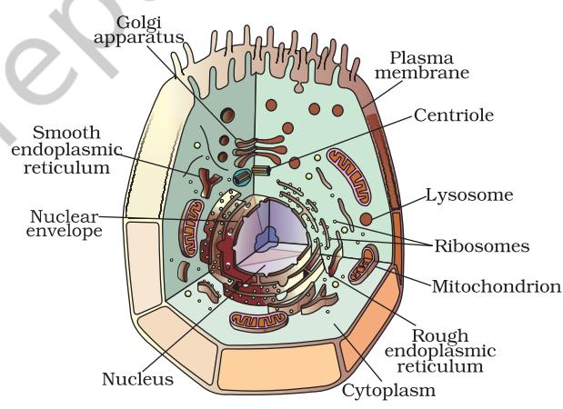
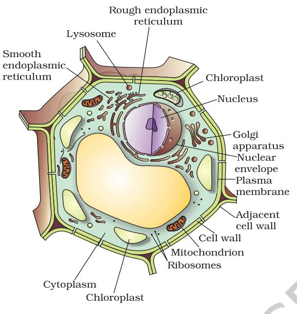
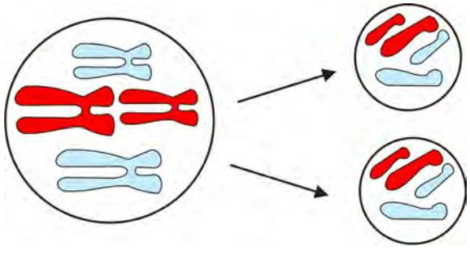

# **THE FUNDAMENTAL UNIT OF LIFE**

While examining a thin slice of cork, Robert Hooke saw that the cork resembled the structure of a honeycomb consisting of many little compartments. Cork is a substance which comes from the bark of a tree. This was in the year 1665 when Hooke made this chance observation through a self-designed microscope. Robert Hooke called these boxes cells. Cell is a Latin word for 'a little room'.

This may seem to be a very small and insignificant incident but it is very important in the history of science. This was the very first time that someone had observed that living things appear to consist of separate units. The use of the word 'cell' to describe these units is being used till this day in biology.

Let us find out about cells.

### **5.1 What are Living Organisms Made Up of?**

#### *Activity ______________ 5.1*

- Let us take a small piece from an onion bulb. With the help of a pair of forceps, we can peel off the skin (called epidermis) from the concave side (inner layer) of the onion. This layer can be put immediately in a watch-glass containing water. This will prevent the peel from getting folded or getting dry. What do we do with this peel?
- Let us take a glass slide, put a drop of water on it and transfer a small piece of the peel from the watch glass to the slide. Make sure that the peel is perfectly flat on the slide. A thin camel hair paintbrush might be necessary to help transfer the peel. Now we put a drop of safranin solution on this piece followed by a cover slip. Take care to

avoid air bubbles while putting the cover slip with the help of a mounting needle. Ask your teacher for help. We have prepared a temporary mount of onion peel. We can observe this slide under low power followed by high powers of a compound microscope.

*Fig. 5.1: Compound microscope*

What do we observe as we look through the lens? Can we draw the structures that we are able to see through the microscope, on an observation sheet? Does it look like Fig. 5.2?

*Fig. 5.2: Cells of an onion peel*

We can try preparing temporary mounts of peels of onions of different sizes. What do we observe? Do we see similar structures or different structures?

#### **What are these structures?**

These structures look similar to each other. Together they form a big structure like an onion bulb! We find from this activity that onion bulbs of different sizes have similar small structures visible under a microscope. The cells of the onion peel will all look the same, regardless of the size of the onion they came from.

These small structures that we see are the basic building units of the onion bulb. These structures are called cells. Not only onions, but all organisms that we observe around are made up of cells. However, there are also single cells that live on their own.

> Cells were first discovered by Robert Hooke in 1665. He observed the cells in a cork slice with the help of a primitive microscope. Leeuwenhoek (1674), with the improved microscope, discovered the free living cells in pond water for the first time. It was Robert Brown in 1831 who discovered the nucleus in the cell. Purkinje in 1839 coined the term 'protoplasm' for the fluid substance of the cell. The cell theory, that all the plants and animals are composed of cells and that the cell is the basic unit of life, was presented by two biologists, Schleiden (1838) and Schwann (1839). The cell theory was further expanded by Virchow (1855) by suggesting that all cells arise from pre-existing cells. With the discovery of the electron microscope in 1940, it was possible to observe and understand the complex structure of the cell and its various organelles.

The invention of magnifying lenses led to the discovery of the microscopic world. It is now known that a single cell may constitute a whole organism as in *Amoeba*, *Chlamydomonas*, *Paramoecium* and bacteria. These organisms are called unicellular organisms (uni = single). On the other hand, many cells group together in a single body and assume different functions in it to form various body parts in multicellular organisms (multi = many) such as some fungi, plants and animals. Can we find out names of some more unicellular organisms?

Every multi-cellular organism has come from a single cell. How? Cells divide to produce cells of their own kind. All cells thus come from pre-existing cells.

#### *Activity ______________ 5.2*

- We can try preparing temporary mounts of leaf peels, tip of roots of onion or even peels of onions of different sizes.
- After performing the above activity, let us see what the answers to the following questions would be:
	- (a) Do all cells look alike in terms of shape and size?
	- (b) Do all cells look alike in structure?
	- (c) Could we find differences among cells from different parts of a plant body?
	- (d) What similarities could we find?

Some organisms can also have cells of different kinds. Look at the following picture. It depicts some cells from the human body.

*Fig. 5.3: Various cells from the human body*

**More to know**

The shape and size of cells are related to the specific function they perform. Some cells like *Amoeba* have changing shapes. In some cases the cell shape could be more or less fixed and peculiar for a particular type of cell; for example, nerve cells have a typical shape.

Each living cell has the capacity to perform certain basic functions that are characteristic of all living forms. How does a living cell perform these basic functions? We know that there is a division of labour in multicellular organisms such as human beings. This means that different parts of the human body perform different functions. The human body has a heart to pump blood, a stomach to digest food and so on. Similarly, division of labour is also seen within a single cell. In fact, each such cell has got certain specific components within it known as cell organelles. Each kind of cell organelle performs a special function, such as making new material in the cell, clearing up the waste material from the cell and so on. A cell is able to live and perform all its functions because of these organelles. These organelles together constitute the basic unit called the cell. It is interesting that all cells are found to have the same organelles, no matter what their function is or what organism they are found in.

uestions

*1. Who discovered cells, and how? 2. Why is the cell called the structural and functional unit of life?* Q

## **5.2 What is a Cell Made Up of? What is the Structural Organisation of a Cell?**

We saw above that the cell has special components called organelles. How is a cell organised?

If we study a cell under a microscope, we would come across three features in almost every cell; plasma membrane, nucleus and cytoplasm. All activities inside the cell and interactions of the cell with its environment are possible due to these features. Let us see how.

#### **5.2.1 PLASMA MEMBRANE OR CELL MEMBRANE**

This is the outermost covering of the cell that separates the contents of the cell from its external environment. The plasma membrane allows or permits the entry and exit of some materials in and out of the cell. It also prevents movement of some other materials. The cell membrane, therefore, is called a selectively permeable membrane.

How does the movement of substances take place into the cell? How do substances move out of the cell?

Some substances like carbon dioxide or oxygen can move across the cell membrane by a process called diffusion. We have studied the process of diffusion in earlier chapters. We saw that there is spontaneous movement of a substance from a region of high concentration to a region where its concentration is low.

Something similar to this happens in cells when, for example, some substance like CO2 (which is cellular waste and requires to be excreted out by the cell) accumulates in high concentrations inside the cell. In the cell's external environment, the concentration of CO2 is low as compared to that inside the cell. As soon as there is a difference of concentration of CO2 inside and outside a cell, CO2 moves out of the cell, from a region of high concentration, to a region of low concentration outside the cell by the process of diffusion. Similarly, O2 enters the cell by the process of diffusion when the level or concentration of O2 inside the cell decreases. Thus, diffusion plays an important role in gaseous exchange between the cells as well as the cell and its external environment.

Water also obeys the law of diffusion. The movement of water molecules through such a selectively permeable membrane is called osmosis. The movement of water across the plasma membrane is also affected by the amount of substance dissolved in water. Thus, osmosis is the net diffusion of water across a selectively permeable membrane toward a higher solute concentration.

What will happen if we put an animal cell or a plant cell into a solution of sugar or salt in water?

One of the following three things could happen:

- 1. If the medium surrounding the cell has a higher water concentration than the cell, meaning that the outside solution is very dilute, the cell will gain water by osmosis. Such a solution is known as a hypotonic solution.
Water molecules are free to pass across the cell membrane in both directions, but more water will come into the cell than will leave. The net (overall) result is that water enters the cell. The cell is likely to swell up.

- 2. If the medium has exactly the same water concentration as the cell, there will be no net movement of water across the cell membrane. Such a solution is known as an isotonic solution.
Water crosses the cell membrane in both directions, but the amount going in is the same as the amount going out, so there is no overall movement of water. The cell will stay the same size.

- 3. If the medium has a lower concentration of water than the cell, meaning that it is a very concentrated solution, the cell will lose water by osmosis. Such a solution is known as a hypertonic solution.
Again, water crosses the cell membrane in both directions, but this time more water leaves the cell than enters it. Therefore the cell will shrink.

Thus, osmosis is a special case of diffusion through a selectively permeable membrane. Now let us try out the following activity:

#### *Activity ______________ 5.3*

Osmosis with an egg

- (a) Remove the shell of an egg by dissolving it in dilute hydrochloric acid. The shell is mostly calcium carbonate. A thin outer skin now encloses the egg. Put the egg in pure water and observe after 5 minutes. What do we observe? The egg swells because water passes into it by osmosis.
- (b) Place a similar de-shelled egg in a concentrated salt solution and observe for 5 minutes. The egg shrinks. Why? Water passes out of the egg solution into the salt solution because the salt solution is more concentrated.

We can also try a similar activity with dried raisins or apricots.

*Activity ______________ 5.4*

• Put dried raisins or apricots in plain water and leave them for some time. Then place them into a concentrated solution of sugar or salt. You will observe the following:

- (a) Each gains water and swells when placed in water.
- (b) However, when placed in the concentrated solution it loses water, and consequently shrinks.

Unicellular freshwater organisms and most plant cells tend to gain water through osmosis. Absorption of water by plant roots is also an example of osmosis.

Thus, diffusion is important in exhange of gases and water in the life of a cell. In additions to this, the cell also obtains nutrition from its environment. Different molecules move in and out of the cell through a type of transport requiring use of energy.

The plasma membrane is flexible and is made up of organic molecules called lipids and proteins. However, we can observe the structure of the plasma membrane only through an electron microscope.

The flexibility of the cell membrane also enables the cell to engulf in food and other material from its external environment. Such processes are known as endocytosis. *Amoeba* acquires its food through such processes.

#### *Activity ______________ 5.5*

- Find out about electron microscopes from resources in the school library or through the internet. Discuss it with your teacher.
# uestions

- *1. How do substances like CO2 and water move in and out of the cell? Discuss.* Q
	- *2. Why is the plasma membrane called a selectively permeable membrane?*

#### **5.2.2 CELL WALL**

Plant cells, in addition to the plasma membrane, have another rigid outer covering called the cell wall. The cell wall lies outside the plasma membrane. The plant cell wall is mainly composed of cellulose. Cellulose is a complex substance and provides structural strength to plants.

When a living plant cell loses water through osmosis there is shrinkage or contraction of the contents of the cell away from the cell wall. This phenomenon is known as plasmolysis. We can observe this phenomenon by performing the following activity:

#### *Activity ______________ 5.6*

• Mount the peel of a Rhoeo leaf in water on a slide and examine cells under the high power of a microscope. Note the small green granules, called chloroplasts. They contain a green substance called chlorophyll. Put a strong solution of sugar or salt on the mounted leaf on the slide. Wait for a minute and observe under a microscope. What do we see?

- Now place some Rhoeo leaves in boiling water for a few minutes. This kills the cells. Then mount one leaf on a slide and observe it under a microscope. Put a strong solution of sugar or salt on the mounted leaf on the slide. Wait for a minute and observe it again. What do we find? Did plasmolysis occur now?
What do we infer from this activity? It appears that only living cells, and not dead cells, are able to absorb water by osmosis.

Cell walls permit the cells of plants, fungi and bacteria to withstand very dilute (hypotonic) external media without bursting. In such media the cells tend to take up water by osmosis. The cell swells, building up pressure against the cell wall. The wall exerts an equal pressure against the swollen cell. Because of their walls, such cells can withstand much greater changes in the surrounding medium than animal cells.

#### **5.2.3 NUCLEUS**

Remember the temporary mount of onion peel we prepared? We had put iodine solution on the peel. Why? What would we see if we tried observing the peel without putting the iodine solution? Try it and see what the difference is. Further, when we put iodine solution on the peel, did each cell get evenly coloured?

According to their chemical composition different regions of cells get coloured differentially. Some regions appear darker than other regions. Apart from iodine solution we could also use safranin solution or methylene blue solution to stain the cells.

We have observed cells from an onion; let us now observe cells from our own body.

#### *Activity ______________ 5.7*

- Let us take a glass slide with a drop of water on it. Using an ice-cream spoon gently scrape the inside surface of the cheek. Does any material get stuck on the spoon? With the help of a needle we can transfer this material and spread it evenly on the glass slide kept ready for this. To colour the material we can put a drop of methylene blue solution on it. Now the material is ready for observation under microscope. Do not forget to put a cover-slip on it! • What do we observe? What is the shape of the cells we see? Draw it on the observation sheet.
- Was there a darkly coloured, spherical or oval, dot-like structure near the centre of each cell? This structure is called nucleus. Were there similar structures in onion peel cells?
The nucleus has a double layered covering called nuclear membrane. The nuclear membrane has pores which allow the transfer of material from inside the nucleus to its outside, that is, to the cytoplasm (which we will talk about in section 5.2.4).

The nucleus contains chromosomes, which are visible as rod-shaped structures only when the cell is about to divide. Chromosomes contain information for inheritance of characters from parents to next generation in the form of DNA (Deoxyribo Nucleic Acid) molecules. Chromosomes are composed of DNA and protein. DNA molecules contain the information necessary for constructing and organising cells. Functional segments of DNA are called genes. In a cell which is not dividing, this DNA is present as part of chromatin material. Chromatin material is visible as entangled mass of thread like structures. Whenever the cell is about to divide, the chromatin material gets organised into chromosomes.

The nucleus plays a central role in cellular reproduction, the process by which a single cell divides and forms two new cells. It also plays a crucial part, along with the environment, in determining the way the cell will develop and what form it will exhibit at maturity, by directing the chemical activities of the cell.

In some organisms like bacteria, the nuclear region of the cell may be poorly defined due to the absence of a nuclear membrane. Such an undefined nuclear region containing only nucleic acids is called a nucleoid. Such organisms, whose cells lack a nuclear membrane, are called prokaryotes (Pro = primitive or primary; karyote ≈ karyon = nucleus). Organisms with cells having a nuclear membrane are called eukaryotes.

Prokaryotic cells (see Fig. 5.4) also lack most of the other cytoplasmic organelles present in eukaryotic cells. Many of the functions of such organelles are also performed by poorly organised parts of the cytoplasm (see section 5.2.4). The chlorophyll in photosynthetic prokaryotic bacteria is associated with membranous vesicles (bag like structures) but not with plastids as in eukaryotic cells (see section 5.2.5).

#### **5.2.4 CYTOPLASM**

When we look at the temporary mounts of onion peel as well as human cheek cells, we can see a large region of each cell enclosed by the cell membrane. This region takes up very little stain. It is called the cytoplasm. The cytoplasm is the fluid content inside the plasma membrane. It also contains many specialised cell organelles. Each of these organelles performs a specific function for the cell.

Cell organelles are enclosed by membranes. In prokaryotes, beside the absence of a defined nuclear region, the membrane-bound cell organelles are also absent. On the other hand, the eukaryotic cells have nuclear membrane as well as membrane-enclosed organelles.

The significance of membranes can be illustrated with the example of viruses. Viruses lack any membranes and hence do not show characteristics of life until they enter a living body and use its cell machinery to multiply.

uestion

Q

*1. Fill in the gaps in the following table illustrating differences between prokaryotic and eukaryotic cells.*

| Prokaryotic Cell | Eukaryotic Cell |
| --- | --- |
| 1. Size : generally | 1. Size: generally |
| small ( 1-10 µm) | large ( 5-100 µm) |
| 1 µm = 10–6 m |  |
| 2. Nuclear region: | 2. Nuclear region: |
| _______________ | well defined and |
| _______________ | surrounded by a |
| and known as__ | nuclear membrane |
| 3. Chromosome: | 3. More than one |
| single | chromosome |
| 4. Membrane-bound 4. _______________ |  |
| cell organelles | _______________ |
| absent | _______________ |

#### **5.2.5 CELL ORGANELLES**

Every cell has a membrane around it to keep its own contents separate from the external environment. Large and complex cells, including cells from multicellular organisms, need a lot of chemical activities to support their complicated structure and function. To keep these activities of different kinds separate from each other, these cells use membrane-bound little structures (or 'organelles') within themselves. This is one of the features of the eukaryotic cells that distinguish them from prokaryotic cells. Some of these organelles are visible only with an electron microscope.

We have talked about the nucleus in a previous section. Some important examples of cell organelles which we will discuss now are: endoplasmic reticulum, Golgi apparatus, lysosomes, mitochondria and plastids. They are important because they carry out some very crucial functions in cells.

#### **5.2.5 (i)** *ENDOPLASMIC RETICULUM (ER)*

The endoplasmic reticulum (ER) is a large network of membrane-bound tubes and sheets. It looks like long tubules or round or oblong bags (vesicles). The ER membrane is similar in structure to the plasma membrane. There are two types of ER– rough endoplasmic reticulum (RER) and smooth endoplasmic reticulum (SER). RER looks rough under a microscope because it has particles called ribosomes attached to its surface. The ribosomes, which are present in all active cells, are the sites of protein manufacture. The manufactured proteins are then sent to various places in the cell depending on need, using the ER. The SER helps in the manufacture of fat molecules, or lipids, important for cell function. Some of these proteins and lipids help in building the cell membrane. This process is known as membrane biogenesis. Some other proteins and lipids function as enzymes and hormones. Although the ER varies greatly in appearance in different cells, it always forms a network system.

*Fig. 5.5: Animal cell*

Thus, one function of the ER is to serve as channels for the transport of materials (especially proteins) between various regions of the cytoplasm or between the cytoplasm and the nucleus. The ER also functions as a cytoplasmic framework providing a surface for some of the biochemical activities of the cell. In the liver cells of the group of animals called vertebrates (see Chapter 7), SER plays a crucial role in detoxifying many poisons and drugs.

*Fig. 5.6: Plant cell*

#### **5.2.5 (ii)** *GOLGI APPARATUS*

The Golgi apparatus, first described by Camillo Golgi, consists of a system of membrane-bound vesicles (flattened sacs) arranged approximately parallel to each other in stacks called cisterns. These membranes often have connections with the membranes of ER and therefore constitute another portion of a complex cellular membrane system.

The material synthesised near the ER is packaged and dispatched to various targets inside and outside the cell through the Golgi apparatus. Its functions include the storage, modification and packaging of products in vesicles. In some cases, complex sugars may be made from simple sugars in the Golgi apparatus. The Golgi apparatus is also involved in the formation of lysosomes [see 5.2.5 (iii)].

Camillo Golgi was born at Corteno near Brescia in 1843. He studied medicine at the University of Pavia. After graduating in 1865, he continued to work in Pavia at the Hospital of St. Matteo. At that time most of his investigations were

concerned with the nervous system, In 1872 he accepted the post of Chief Medical Officer at the Hospital for the Chronically Sick at Abbiategrasso. He first started his investigations into the nervous system in a little kitchen of this hospital, which he had converted into a laboratory. However, the work of greatest importance, which Golgi carried out was a revolutionary method of staining individual nerve and cell structures. This method is referred to as the 'black reaction'. This method uses a weak solution of silver nitrate and is particularly valuable in tracing the processes and most delicate ramifications of cells. All through his life, he continued to work on these lines, modifying and improving this technique. Golgi received the highest honours and awards in recognition of his work. He shared the Nobel prize in 1906 with Santiago Ramony Cajal for their work on the structure of the nervous system.

#### **5.2.5 (iii)** *LYSOSOMES*

Structurally, lysosomes are membrane-bound sacs filled with digestive enzymes. These enzymes are made by RER. Lysosomes are a kind of waste disposal system of the cell. These help to keep the cell clean by digesting any foreign material as well as worn-out cell organelles. Foreign materials entering the cell, such as bacteria or food, as well as old organelles end up in the lysosomes, which break complex substances into simpler substances. Lysosomes are able to do this because they contain powerful digestive enzymes capable of breaking down all organic material. During the disturbance in cellular metabolism, for example, when the cell gets damaged, lysosomes may burst and the enzymes digest their own cell. Therefore, lysosomes are also known as the 'suicide bags' of a cell.

#### **5.2.5 (iv)** *MITOCHONDRIA*

Mitochondria are known as the powerhouses of the cell. Mitochondria have two membrane coverings. The outer membrane is porous while the inner membrane is deeply folded. These folds increase surface area for ATPgenerating chemical reactions. The energy required for various chemical activities needed for life is released by mitochondria in the form of ATP (Adenosine triphopshate) molecules. ATP is known as the energy currency of the cell. The body uses energy stored in ATP for making new chemical compounds and for mechanical work.

Mitochondria are strange organelles in the sense that they have their own DNA and ribosomes. Therefore, mitochondria are able to make some of their own proteins.

#### **5.2.5 (V)** *PLASTIDS*

Plastids are present only in plant cells. There are two types of plastids – chromoplasts (coloured plastids) and leucoplasts (white or colourless plastids). Chromoplasts containing the pigment chlorophyll are known as chloroplasts. Chloroplasts are important for photosynthesis in plants. Chloroplasts also contain various yellow or orange pigments in addition to chlorophyll. Leucoplasts are primarily organelles in which materials such as starch, oils and protein granules are stored.

The internal organisation of the Chloroplast consists of numerous membrane layers embedded in a material called the stroma. These are similar to mitochondria in external structure. Like the mitochondria, plastids also have their own DNA and ribosomes.

#### **5.2.5 (vi)** *VACUOLES*

Vacuoles are storage sacs for solid or liquid contents. Vacuoles are small sized in animal cells while plant cells have very large vacuoles. The central vacuole of some plant cells may occupy 50-90% of the cell volume.

In plant cells vacuoles are full of cell sap and provide turgidity and rigidity to the cell. Many substances of importance in the life of the plant cell are stored in vacuoles. These include amino acids, sugars, various organic acids and some proteins. In single-celled organisms like *Amoeba*, the food vacuole contains the food items that the *Amoeba* has consumed. In some unicellular organisms, specialised vacuoles also play important roles in expelling excess water and some wastes from the cell.

# uestions

- *1. Can you name the two organelles we have studied that contain their own genetic material?* Q
	- *2. If the organisation of a cell is destroyed due to some physical or chemical influence, what will happen?*
	- *3. Why are lysosomes known as suicide bags?*
	- *4. Where are proteins synthesised inside the cell?*

Each cell thus acquires its structure and ability to function because of the organisation of its membrane and organelles in specific ways. The cell thus has a basic structural organisation. This helps the cells to perform functions like respiration, obtaining nutrition, and clearing of waste material, or forming new proteins.

Thus, the cell is the fundamental structural unit of living organisms. It is also the basic functional unit of life.

#### **Cell Division**

New cells are formed in organisms in order to grow, to replace old, dead and injured cells, and to form gametes required for reproduction. The process by which new cells are made is called cell division. There are two main types of cell division: mitosis and meiosis.

The process of cell division by which most of the cells divide for growth is called mitosis. In this process, each cell called mother cell

*Fig. 5.7: Mitosis Fig. 5.8: Meiosis*

divides to form two identical daughter cells (Fig. 5.7). The daughter cells have the same number of chromosomes as mother cell. It helps in growth and repair of tissues in organisms.

Specific cells of reproductive organs or tissues in animals and plants divide to form gametes, which after fertilisation give rise to offspring. They divide by a different process called meiosis which involves two consecutive divisions. When a cell divides by meiosis it produces four new cells instead of just two (Fig. 5.8). The new cells only have half the number of chromosomes than that of the mother cells. Can you think as to why the chromosome number has reduced to half in daughter cells?

# **What you have learnt**

- The fundamental organisational unit of life is the cell.
- Cells are enclosed by a plasma membrane composed of lipids and proteins.
- The cell membrane is an active part of the cell. It regulates the movement of materials between the ordered interior of the cell and the outer environment.
- In plant cells, a cell wall composed mainly of cellulose is located outside the cell membrane.
- The presence of the cell wall enables the cells of plants, fungi and bacteria to exist in hypotonic media without bursting.

• The nucleus in eukaryotes is separated from the cytoplasm by double-layered membrane and it directs the life processes of the cell.

• The ER functions both as a passageway for intracellular transport and as a manufacturing surface.

• The Golgi apparatus consists of stacks of membrane-bound vesicles that function in the storage, modification and packaging of substances manufactured in the cell.

- Most plant cells have large membranous organelles called plastids, which are of two types—chromoplasts and leucoplasts.
- Chromoplasts that contain chlorophyll are called chloroplasts and they perform photosynthesis.
- The primary function of leucoplasts is storage.
- Most mature plant cells have a large central vacuole that helps to maintain the turgidity of the cell and stores important substances including wastes.
- Prokaryotic cells have no membrane-bound organelles, their chromosomes are composed of only nucleic acid, and they have only very small ribosomes as organelles.
- Cells in organisms divide for growth of body, for repalcing dead cells, and for forming gametes for reproduction.

# **Exercises**

- 1. Make a comparison and write down ways in which plant cells are different from animal cells.
- 2. How is a prokaryotic cell different from a eukaryotic cell?
- 3. What would happen if the plasma membrane ruptures or breaks down?
- 4. What would happen to the life of a cell if there was no Golgi apparatus?
- 5. Which organelle is known as the powerhouse of the cell? Why?
- 6. Where do the lipids and proteins constituting the cell membrane get synthesised?
- 7. How does an *Amoeba* obtain its food?
- 8. What is osmosis?
- 9. Carry out the following osmosis experiment:
	- Take four peeled potato halves and scoos each one out to make potato cups. One of these potato cups should be made from a boiled potato. Put each potato cup in a trough containing water. Now, •
		- (a) Keep cup A empty
		- (b) Put one teaspoon sugar in cup B
		- (c) Put one teaspoon salt in cup C
		- (d) Put one teaspoon sugar in the boiled potato cup D.

Keep these for two hours. Then observe the four potato cups and answer the following:

- (i) Explain why water gathers in the hollowed portion of B and C.
- (ii) Why is potato A necessary for this experiment?
- (iii) Explain why water does not gather in the hollowed out portions of A and D.
- 10. Which type of cell division is required for growth and repair of body and which type is involved in formation of gametes?

