# **6** Chapter

From the last chapter, we recall that all living organisms are made of cells. In unicellular organisms, a single cell performs all basic functions. For example, in *Amoeba*, a single cell carries out movement, intake of food, gaseous exchange and excretion. But in multicellular organisms there are millions of cells. Most of these cells are specialised to carry out specific functions. Each specialised function is taken up by a different group of cells. Since these cells carry out only a particular function, they do it very efficiently. In human beings, muscle cells contract and relax to cause movement, nerve cells carry messages, blood flows to transport oxygen, food, hormones and waste material and so on. In plants, vascular tissues conduct food and water from one part of the plant to other parts. So, multi-cellular organisms show division of labour. Cells specialising in one function are often grouped together in the body. This means that a particular function is carried out by a cluster of cells at a definite place in the body. This cluster of cells, called a tissue, is arranged and designed so as to give the highest possible efficiency of function. Blood, phloem and muscle are all examples of tissues.

A group of cells that are similar in structure and/or work together to achieve a particular function forms a tissue.

### **6.1 Are Plants and Animals Made of Same Types of Tissues?**

Let us compare their structure and functions. Do plants and animals have the same structure? Do they both perform similar functions?

There are noticeable differences between the two. Plants are stationary or fixed – they don't move. Since they have to be upright, they have a large quantity of supportive tissue. The supportive tissue generally has dead cells.

Animals on the other hand move around in search of food, mates and shelter. They consume more energy as compared to plants. Most of the tissues they contain are living.

Another difference between animals and plants is in the pattern of growth. The growth in plants is limited to certain regions, while this is not so in animals. There are some tissues in plants that divide throughout their life. These tissues are localised in certain regions. Based on the dividing capacity of the tissues, various plant tissues can be classified as growing or meristematic tissue and permanent tissue. Cell growth in animals is more uniform. So, there is no such demarcation of dividing and nondividing regions in animals.

The structural organisation of organs and organ systems is far more specialised and localised in complex animals than even in very complex plants. This fundamental difference reflects the different modes of life pursued by these two major groups of organisms, particularly in their different feeding methods. Also, they are differently adapted for a sedentary existence on one hand (plants) and active locomotion on the other (animals), contributing to this difference in organ system design.

It is with reference to these complex animal and plant bodies that we will now talk about the concept of tissues in some detail.

Q

- *1. What is a tissue?*
- *2. What is the utility of tissues in multi-cellular organisms?*

### **6.2 Plant Tissues**

#### **6.2.1 MERISTEMATIC TISSUE**

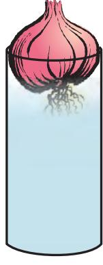

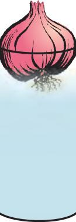

Jar 1 Jar 2

*Fig. 6.1: Growth of roots in onion bulbs*

### *Activity ______________ 6.1*

- Take two glass jars and fill them with water.
- Now, take two onion bulbs and place one on each jar, as shown in Fig. 6.1.
- Observe the growth of roots in both the bulbs for a few days.
- Measure the length of roots on day 1, 2 and 3.
- On day 4, cut the root tips of the onion bulb in jar 2 by about 1 cm. After this, observe the growth of roots in both the jars and measure their lengths each day for five more days and record the observations in tables, like the table below:

| Jar 1 |  |  |  |  |  |
| --- | --- | --- | --- | --- | --- |
| Length Jar 2 | Day 1 | Day 2 | Day 3 | Day 4 | Day 5 |

- From the above observations, answer the following questions:
	- 1. Which of the two onions has longer roots? Why?
	- 2. Do the roots continue growing even after we have removed their tips?
	- 3. Why would the tips stop growing in jar 2 after we cut them?

The growth of plants occurs only in certain specific regions. This is because the dividing tissue, also known as meristematic tissue, is located only at these points. Depending on the region where they are present, meristematic tissues are classified as apical, lateral and intercalary (Fig. 6.2). New cells produced by meristem are initially like those of meristem itself, but as they grow and mature, their characteristics slowly change and they become differentiated as components of other tissues.

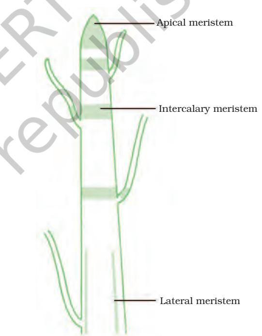

#### *Fig. 6.2: Location of meristematic tissue in plant body*

Apical meristem is present at the growing tips of stems and roots and increases the length of the stem and the root. The girth of the stem or root increases due to lateral meristem (cambium). Intercalary meristem seen in some plants is located near the node.

Cells of meristematic tissue are very active, they have dense cytoplasm, thin cellulose walls and prominent nuclei. They lack vacuoles. Can we think why they would lack vacuoles? (You might want to refer to the functions of vacuoles in the chapter on cells.)

#### **6.2.2 PERMANENT TISSUE**

What happens to the cells formed by meristematic tissue? They take up a specific role and lose the ability to divide. As a result, they form a permanent tissue. This process of taking up a permanent shape, size, and a function is called differentiation. Differentiation leads to the development of various types of permanent tissues.

- 3. Can we think of reasons why there would be so many types of cells? • We can also try to cut sections of plant roots. We can even try cutting sections of root and stem of different plants.
#### **6.2.2 (i)** *SIMPLE PERMANENT TISSUE*

A few layers of cells beneath the epidermis are generally simple permanent tissue. Parenchyma is the most common simple permanent tissue. It consists of relatively unspecialised cells with thin cell walls. They are living cells. They are usually loosely arranged, thus large spaces between cells (intercellular spaces) are found in this tissue (Fig. 6.4a). This tissue generally stores food.

#### *Activity ______________ 6.2*

- Take a plant stem and with the help of your teacher cut into very thin slices or sections.
- Now, stain the slices with safranin. Place one neatly cut section on a slide, and put a drop of glycerine.
- Cover with a cover-slip and observe under a microscope. Observe the various types of cells and their arrangement. Compare it with Fig. 6.3.
- Now, answer the following on the basis of your observation:
	- 1. Are all cells similar in structure?
	- 2. How many types of cells can be seen?

In some situations, it contains chlorophyll and performs photosynthesis, and then it is called chlorenchyma. In aquatic plants, large air cavities are present in parenchyma to help them float. Such a parenchyma type is called aerenchyma.

The flexibility in plants is due to another permanent tissue, collenchyma. It allows bending of various parts of a plant like tendrils and stems of climbers without breaking. It also provides mechanical support. We can find this tissue in leaf stalks below the epidermis. The cells of this tissue are living, elongated and irregularly thickened at the corners. There is very little intercellular space (Fig. 6.4 b).

*Fig. 6.4: Various types of simple tissues: (a) Parenchyma (b) Collenchyma (c) Sclerenchyma (i) transverse section, (ii) longitudinal section.*

Yet another type of permanent tissue is sclerenchyma. It is the tissue which makes the plant hard and stiff. We have seen the husk of a coconut. It is made of sclerenchymatous tissue. The cells of this tissue are dead. They are long and narrow as the walls are thickened due to lignin. Often these walls are so thick that there is no internal space inside the cell (Fig. 6.4 c). This tissue is present in stems, around vascular bundles, in the veins of leaves and in the hard covering of seeds and nuts. It provides strength to the plant parts.

#### *Activity ______________ 6.3*

- Take a freshly plucked leaf of Rhoeo.
- Stretch and break it by applying pressure.
- While breaking it, keep it stretched gently so that some peel or skin projects out from the cut.
- Remove this peel and put it in a petri dish filled with water.
- Add a few drops of safranin.
- Wait for a couple of minutes and then transfer it onto a slide. Gently place a cover slip over it.
- Observe under microscope.

What you observe is the outermost layer of cells, called epidermis. The epidermis is usually made of a single layer of cells. In some plants living in very dry habitats, the epidermis may be thicker since protection against water loss is critical. The entire surface of a plant has an outer covering epidermis. It protects all the parts of the plant. Epidermal cells on the aerial

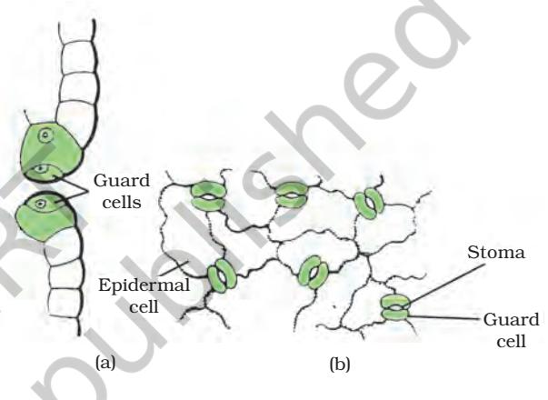

*Fig. 6.5: Guard cells and epidermal cells: (a) lateral view, (b) surface view*

parts of the plant often secrete a waxy, waterresistant layer on their outer surface. This aids in protection against loss of water, mechanical injury and invasion by parasitic fungi. Since it has a protective role to play, cells of epidermal tissue form a continuous layer without intercellular spaces. Most epidermal cells are relatively flat. Often their outer and side walls are thicker than the inner wall.

We can observe small pores here and there in the epidermis of the leaf. These pores are called stomata (Fig. 6.5). Stomata are enclosed by two kidney-shaped cells called guard cells. They are necessary for exchanging gases with the atmosphere. Transpiration (loss of water in the form of water vapour) also takes place through stomata.

*TISSUES* **63**

Recall which gas is required for photosynthesis. Find out the role of transpiration in plants.

Epidermal cells of the roots, whose function is water absorption, commonly bear long hairlike parts that greatly increase the total absorptive surface area.

In some plants like desert plants, epidermis has a thick waxy coating of cutin (chemical substance with waterproof quality) on its outer surface. Can we think of a reason for this?

Is the outer layer of a branch of a tree different from the outer layer of a young stem?

As plants grow older, the outer protective tissue undergoes certain changes. A strip of secondary meristem located in the cortex forms layers of cells which constitute the cork. Cells of cork are dead and compactly arranged without intercellular spaces (Fig. 6.6). They also have a substance called suberin in their walls that makes them impervious to gases and water.

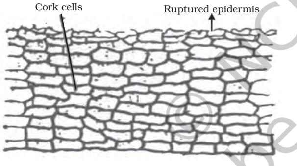

*Fig. 6.6: Protective tissue*

#### **6.2.2 (ii)** *COMPLEX PERMANENT TISSUE*

The different types of tissues we have discussed until now are all made of one type of cells, which look like each other. Such tissues are called simple permanent tissue. Yet another type of permanent tissue is complex tissue. Complex tissues are made of more than one type of cells. All these cells coordinate to perform a common function. Xylem and phloem are examples of such complex tissues. They are both conducting tissues and constitute a vascular bundle. Vascular tissue is a distinctive feature of the complex plants, one that has made possible their survival in the terrestrial environment. In Fig. 6.3 showing a section of stem, can you see different types of cells in the vascular bundle?

Xylem consists of tracheids, vessels, xylem parenchyma (Fig. 6.7 a,b,c) and xylem fibres. Tracheids and vessels have thick walls, and many are dead cells when mature. Tracheids and vessels are tubular structures. This allows them to transport water and minerals vertically. The parenchyma stores food. Xylem fibres are mainly supportive in function.

Phloem is made up of five types of cells: sieve cells, sieve tubes, companion cells, phloem fibres and the phloem parenchyma [Fig. 6.7 (d)]. Sieve tubes are tubular cells with perforated walls. Phloem transports food from leaves to other parts of the plant. Except phloem fibres, other phloem cells are living cells.

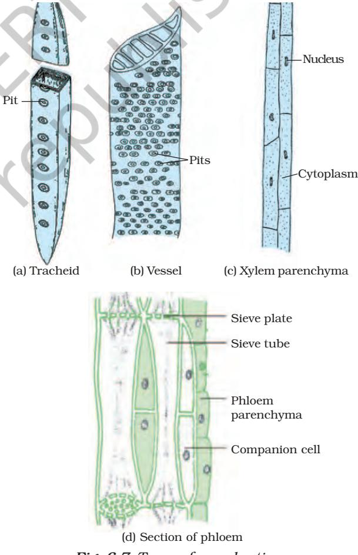

### uestions

- *1. Name types of simple tissues.*
- *2. Where is apical meristem found?*
- *3. Which tissue makes up the husk of coconut?* Q
	- *4. What are the constituents of phloem?*

### **6.3 Animal Tissues**

When we breathe we can actually feel the movement of our chest. How do these body parts move? For this we have specialised cells called muscle cells (Fig. 6.8). The contraction and relaxation of these cells result in movement.

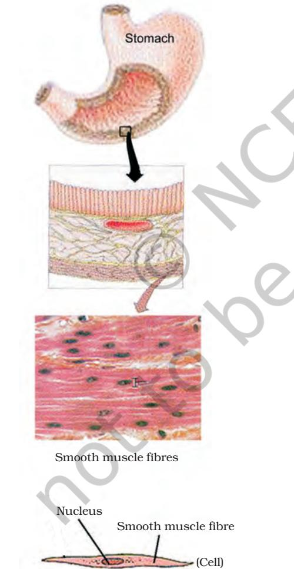

*Fig. 6.8: Location of muscle fibres*

During breathing we inhale oxygen. Where does this oxygen go? It is absorbed in the lungs and then is transported to all the body cells through blood. Why would cells need oxygen? The functions of mitochondria we studied earlier provide a clue to this question. Blood flows and carries various substances from one part of the body to the other. For example, it carries oxygen and food to all cells. It also collects wastes from all parts of the body and carries them to the liver and kidney for disposal.

Blood and muscles are both examples of tissues found in our body. On the basis of the functions they perform we can think of different types of animal tissues, such as epithelial tissue, connective tissue, muscular tissue and nervous tissue. Blood is a type of connective tissue, and muscle forms muscular tissue.

#### **6.3.1 EPITHELIAL TISSUE**

The covering or protective tissues in the animal body are epithelial tissues. Epithelium covers most organs and cavities within the body. It also forms a barrier to keep different body systems separate. The skin, the lining of the mouth, the lining of blood vessels, lung alveoli and kidney tubules are all made of epithelial tissue. Epithelial tissue cells are tightly packed and form a continuous sheet. They have only a small amount of cementing material between them and almost no intercellular spaces. Obviously, anything entering or leaving the body must cross at least one layer of epithelium. As a result, the permeability of the cells of various epithelia play an important role in regulating the exchange of materials between the body and the external environment and also between different parts of the body. Regardless of the type, all epithelium is usually separated from the underlying tissue by an extracellular fibrous basement membrane.

Different epithelia (Fig. 6.9) show differing structures that correlate with their unique functions. For example, in cells lining blood vessels or lung alveoli, where transportation of substances occurs through a selectively permeable surface, there is a simple flat kind of epithelium. This is called the simple squamous epithelium (squama means scale

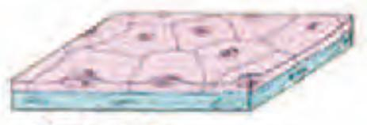

(a) Squamous

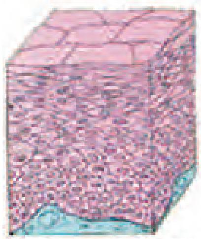

(b) Stratified squamous

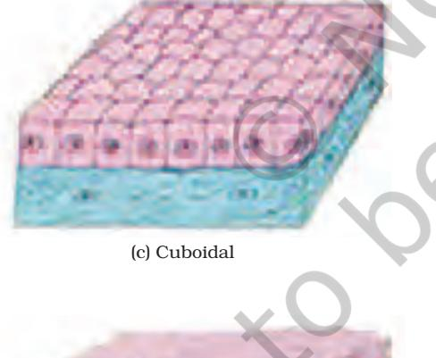

(d) Columnar (Ciliated)

of skin). Simple squamous epithelial cells are extremely thin and flat and form a delicate lining. The oesophagus and the lining of the mouth are also covered with squamous epithelium. The skin, which protects the body, is also made of squamous epithelium. Skin epithelial cells are arranged in many layers to prevent wear and tear. Since they are arranged in a pattern of layers, the epithelium is called stratified squamous epithelium.

Where absorption and secretion occur, as in the inner lining of the intestine, tall epithelial cells are present. This columnar (meaning 'pillar-like') epithelium facilitates movement across the epithelial barrier. In the respiratory tract, the columnar epithelial tissue also has cilia, which are hair-like projections on the outer surfaces of epithelial cells. These cilia can move, and their movement pushes the mucus forward to clear it. This type of epithelium is thus ciliated columnar epithelium.

Cuboidal epithelium (with cube-shaped cells) forms the lining of kidney tubules and ducts of salivary glands, where it provides mechanical support. Epithelial cells often acquire additional specialisation as gland cells, which can secrete substances at the epithelial surface. Sometimes a portion of the epithelial tissue folds inward, and a multicellular gland is formed. This is glandular epithelium.

#### **6.3.2 CONNECTIVE TISSUE**

Blood is a type of connective tissue. Why would it be called 'connective' tissue? A clue is provided in the introduction of this chapter! Now, let us look at this type of tissue in some more detail. The cells of connective tissue are loosely spaced and embedded in an intercellular matrix (Fig. 6.10). The matrix may be jelly like, fluid, dense or rigid. The nature of matrix differs in concordance with the function of the particular connective tissue.

#### *Activity 6.4*

- Take a drop of blood on a slide and observe different cells present in it under a microscope.
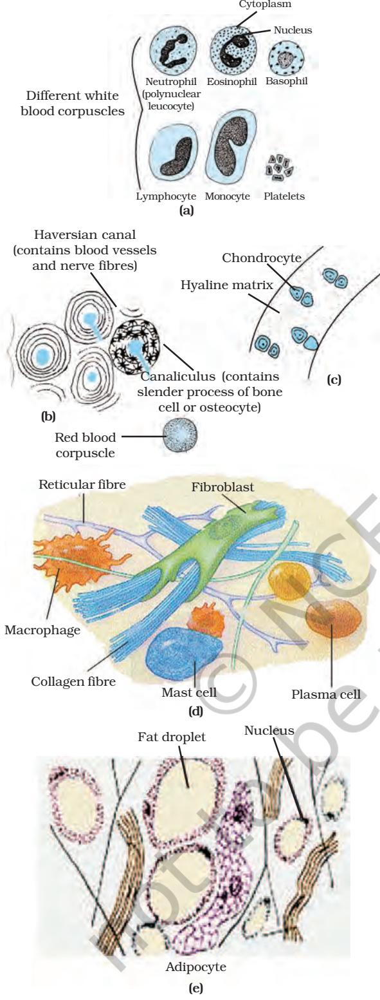

*Fig. 6.10: Types of connective tissues: (a) types of blood cells, (b) compact bone, (c) hyaline cartilage, (d) areolar tissue, (e) adipose tissue*

Blood has a fluid (liquid) matrix called plasma, in which red blood corpuscles (RBCs), white blood corpuscles (WBCs) and platelets are suspended. The plasma contains proteins, salts and hormones. Blood flows and transports gases, digested food, hormones and waste materials to different parts of the body.

Bone is another example of a connective tissue. It forms the framework that supports the body. It also anchors the muscles and supports the main organs of the body. It is a strong and nonflexible tissue (what would be the advantage of these properties for bone functions?). Bone cells are embedded in a hard matrix that is composed of calcium and phosphorus compounds.

Two bones can be connected to each other by another type of connective tissue called the ligament. This tissue is very elastic. It has considerable strength. Ligaments contain very little matrix and connect bones with bones. Tendons connect muscles to bones and are another type of connective tissue. Tendons are fibrous tissue with great strength but limited flexibility.

Another type of connective tissue, cartilage, has widely spaced cells. The solid matrix is composed of proteins and sugars. Cartilage smoothens bone surfaces at joints and is also present in the nose, ear, trachea and larynx. We can fold the cartilage of the ears, but we cannot bend the bones in our arms. Think of how the two tissues are different!

Areolar connective tissue is found between the skin and muscles, around blood vessels and nerves and in the bone marrow. It fills the space inside the organs, supports internal organs and helps in repair of tissues.

Where are fats stored in our body? Fatstoring adipose tissue is found below the skin and between internal organs. The cells of this tissue are filled with fat globules. Storage of fats also lets it act as an insulator.

#### **6.3.3 MUSCULAR TISSUE**

Muscular tissue consists of elongated cells, also called muscle fibres. This tissue is responsible for movement in our body.

*TISSUES* **67**

Muscles contain special proteins called contractile proteins, which contract and relax to cause movement.

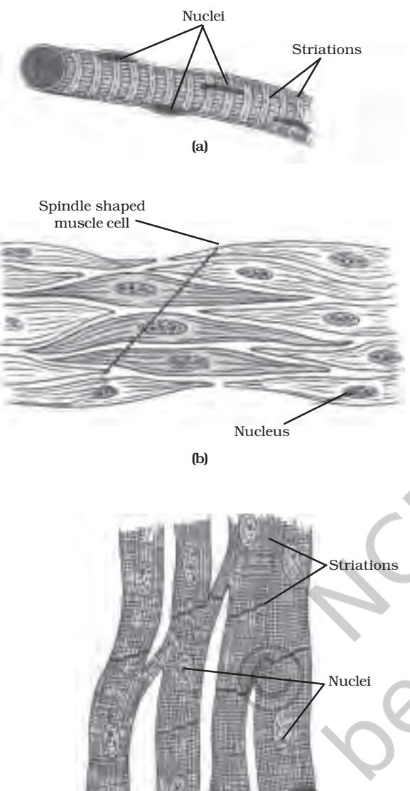

*Fig. 6.11: Types of muscles fibres: (a) striated muscle, (b) smooth muscle, (c) cardiac muscle*

**(c)**

We can move some muscles by conscious will. Muscles present in our limbs move when we want them to, and stop when we so decide. Such muscles are called voluntary muscles [Fig. 6.11(a)]. These muscles are also called skeletal muscles as they are mostly attached to bones and help in body movement. Under the microscope, these muscles show alternate light and dark bands or striations when stained appropriately. As a result, they are also called striated muscles. The cells of this tissue are long, cylindrical, unbranched and multinucleate (having many nuclei).

The movement of food in the alimentary canal or the contraction and relaxation of blood vessels are involuntary movements. We cannot really start them or stop them simply by wanting to do so! Smooth muscles [Fig. 6.11(b)] or involuntary muscles control such movements. They are also found in the iris of the eye, in ureters and in the bronchi of the lungs. The cells are long with pointed ends (spindle-shaped) and uninucleate (having a single nucleus). They are also called unstriated muscles – why would they be called that?

The muscles of the heart show rhythmic contraction and relaxation throughout life. These involuntary muscles are called cardiac muscles [Fig. 6.11(c)]. Heart muscle cells are cylindrical, branched and uninucleate.

### *Activity 6.5*

Compare the structures of different types of muscular tissues. Note down their shape, number of nuclei and position of nuclei within the cell in the Table 6.1.

| Table 6.1: |  |  |  |
| --- | --- | --- | --- |
| Features | Striated | Smooth | Cardiac |
| Shape |  |  |  |
| Number of nuclei |  |  |  |
| Position of nuclei |  |  |  |

#### **6.3.4 NERVOUS TISSUE**

All cells possess the ability to respond to stimuli. However, cells of the nervous tissue are highly specialised for being stimulated and then transmitting the stimulus very rapidly from one place to another within the body. The brain, spinal cord and nerves are all composed of the nervous tissue. The cells of this tissue are called nerve cells or neurons. A neuron consists of a cell body with a nucleus and cytoplasm, from which long thin hair-like parts arise (Fig. 6.12). Usually each neuron has a single long part (process), called the axon, and many short, branched parts

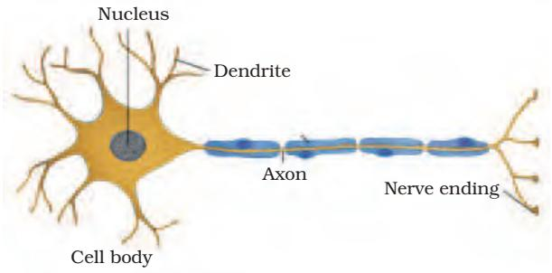

*Fig. 6.12: Neuron-unit of nervous tissue*

## **What**

# **you have**

### **learnt**

- Tissue is a group of cells similar in structure and function. • Plant tissues are of two main types – meristematic and permanent.
- Meristematic tissue is the dividing tissue present in the growing regions of the plant.
- Permanent tissues are derived from meristematic tissue once they lose the ability to divide. They are classified as simple and complex tissues.
- Parenchyma, collenchyma and sclerenchyma are three types of simple tissues. Xylem and phloem are types of complex tissues.
- Animal tissues can be epithelial, connective, muscular and nervous tissue.
- Depending on shape and function, epithelial tissue is classified as squamous, cuboidal, columnar, ciliated and glandular.

The signal that passes along the nerve fibre is called a nerve impulse. Nerve impulses allow us to move our muscles when we want to. The functional combination of nerve and muscle tissue is fundamental to most animals. This combination enables animals to move rapidly in response to stimuli.

## uestions

- *1. Name the tissue responsible for movement in our body.*
- *2. What does a neuron look like?*
- *3. Give three features of cardiac muscles. 4. What are the functions of* Q *areolar tissue?*
	-
- The different types of connective tissues in our body include areolar tissue, adipose tissue, bone, tendon, ligament, cartilage and blood.
- Striated, unstriated and cardiac are three types of muscle tissues.
- Nervous tissue is made of neurons that receive and conduct impulses.

## **Exercises**

- 1. Define the term "tissue".
- 2. How many types of elements together make up the xylem tissue? Name them.
- 3. How are simple tissues different from complex tissues in plants?
- 4. Differentiate between parenchyma, collenchyma and sclerenchyma on the basis of their cell wall.
- 5. What are the functions of the stomata?
- 6. Diagrammatically show the difference between the three types of muscle fibres.
- 7. What is the specific function of the cardiac muscle?
- 8. Differentiate between striated, unstriated and cardiac muscles on the basis of their structure and site/location in the body.
- 9. Draw a labelled diagram of a neuron.
- 10. Name the following.
	- (a) Tissue that forms the inner lining of our mouth.
	- (b) Tissue that connects muscle to bone in humans.
	- (c) Tissue that transports food in plants.
	- (d) Tissue that stores fat in our body.
	- (e) Connective tissue with a fluid matrix.
	- (f) Tissue present in the brain.
- 11. Identify the type of tissue in the following: skin, bark of tree, bone, lining of kidney tubule, vascular bundle.
- 12. Name the regions in which parenchyma tissue is present.
- 13. What is the role of epidermis in plants?
- 14. How does the cork act as a protective tissue?
- 15. Complete the following chart:

