# **7** Chapter

In everyday life, we see some objects at rest and others in motion. Birds fly, fish swim, blood flows through veins and arteries, and cars move. Atoms, molecules, planets, stars and galaxies are all in motion. We often perceive an object to be in motion when its position changes with time. However, there are situations where the motion is inferred through indirect evidences. For example, we infer the motion of air by observing the movement of dust and the movement of leaves and branches of trees. What causes the phenomena of sunrise, sunset and changing of seasons? Is it due to the motion of the earth? If it is true, why don't we directly perceive the motion of the earth?

An object may appear to be moving for one person and stationary for some other. For the passengers in a moving bus, the roadside trees appear to be moving backwards. A person standing on the road–side perceives the bus alongwith the passengers as moving. However, a passenger inside the bus sees his fellow passengers to be at rest. What do these observations indicate?

Most motions are complex. Some objects may move in a straight line, others may take a circular path. Some may rotate and a few others may vibrate. There may be situations involving a combination of these. In this chapter, we shall first learn to describe the motion of objects along a straight line. We shall also learn to express such motions through simple equations and graphs. Later, we shall discuss ways of describing circular motion.

## *Activity ______________ 7.1*

- Discuss whether the walls of your classroom are at rest or in motion.
## *Activity ______________ 7.2*

- Have you ever experienced that the train in which you are sitting appears
- to move while it is at rest? • Discuss and share your experience.

# Think and Act

*We sometimes are endangered by the motion of objects around us, especially if that motion is erratic and uncontrolled as observed in a flooded river, a hurricane or a tsunami. On the other hand, controlled motion can be a service to human beings such as in the generation of hydro-electric power. Do you feel the necessity to study the erratic motion of some objects and learn to control them?*

## **7.1 Describing Motion**

We describe the location of an object by specifying a reference point. Let us understand this by an example. Let us assume that a school in a village is 2 km north of the railway station. We have specified the position of the school with respect to the railway station. In this example, the railway station is the reference point. We could have also chosen other reference points according to our convenience. Therefore, to describe the position of an object we need to specify a reference point called the origin.

### **7.1.1 MOTION ALONG A STRAIGHT LINE**

The simplest type of motion is the motion along a straight line. We shall first learn to describe this by an example. Consider the motion of an object moving along a straight path. The object starts its journey from O which is treated as its reference point (Fig. 7.1). Let A, B and C represent the position of the object at different instants. At first, the object moves through C and B and reaches A. Then it moves back along the same path and reaches C through B.

= 60 km + 25 km = 85 km while the magnitude of displacement = 35 km. Thus, the magnitude of displacement (35 km) is not equal to the path length (85 km). Further, we will notice that the magnitude of the displacement for a course of motion may be zero but the corresponding distance covered is not zero. If we consider the object to travel back to O, the final position concides with the initial position, and therefore, the displacement is zero. However, the distance covered in this journey is OA + AO = 60 km + 60 km = 120 km. Thus, two different physical quantities—the distance and the displacement,

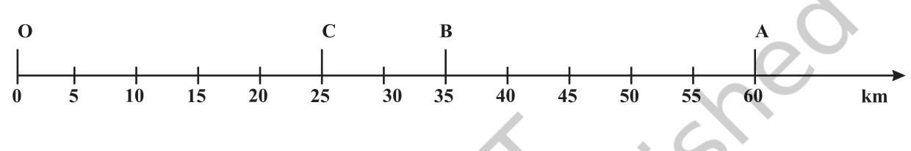

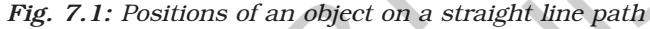

The total path length covered by the object is OA + AC, that is 60 km + 35 km = 95 km. This is the distance covered by the object. To describe distance we need to specify only the numerical value and not the direction of motion. There are certain quantities which are described by specifying only their numerical values. The numerical value of a physical quantity is its magnitude. From this example, can you find out the distance of the final position C of the object from the initial position O? This difference will give you the numerical value of the displacement of the object from O to C through A. The shortest distance measured from the initial to the final position of an object is known as the displacement.

Can the magnitude of the displacement be equal to the distance travelled by an object? Consider the example given in (Fig. 7.1). For motion of the object from O to A, the distance covered is 60 km and the magnitude of displacement is also 60 km. During its motion from O to A and back to B, the distance covered are used to describe the overall motion of an object and to locate its final position with reference to its initial position at a given time.

## *Activity ______________ 7.3*

- Take a metre scale and a long rope. • Walk from one corner of a basket-ball court to its oppposite corner along its sides.
- Measure the distance covered by you and magnitude of the displacement.
- What difference would you notice
- between the two in this case?

## *Activity ______________ 7.4*

- Automobiles are fitted with a device that shows the distance travelled. Such a device is known as an odometer. A car is driven from Bhubaneshwar to New Delhi. The difference between the final reading and the initial reading of the odometer is 1850 km.
- Find the magnitude of the displacement between Bhubaneshwar and New Delhi by using the Road Map of India.

# uestions

- *1. An object has moved through a distance. Can it have zero displacement? If yes, support your answer with an example.* Q
	- *2. A farmer moves along the boundary of a square field of side 10* m *in 40* s*. What will be the magnitude of displacement of the farmer at the end of 2 minutes 20 seconds from his initial position?*
	- *3. Which of the following is true for displacement?*
		- *(a) It cannot be zero.*
		- *(b) Its magnitude is greater than the distance travelled by the object.*

### **7.1.2 UNIFORM MOTION AND NON-UNIFORM MOTION**

Consider an object moving along a straight line. Let it travel 5 m in the first second, 5 m more in the next second, 5 m in the third second and 5 m in the fourth second. In this case, the object covers 5 m in each second. As the object covers equal distances in equal intervals of time, it is said to be in uniform motion. The time interval in this motion should be small. In our day-to-day life, we come across motions where objects cover unequal distances in equal intervals of time, for example, when a car is moving on a crowded street or a person is jogging in a park. These are some instances of non-uniform motion.

- *Activity ______________ 7.5*
- The data regarding the motion of two different objects A and B are given in Table 7.1.
- Examine them carefully and state whether the motion of the objects is uniform or non-uniform.

## **Table 7.1 Time Distance Distance travelled by travelled by object A in m object B in m** 9:30 am 10 12 9:45 am 20 19 10:00 am 30 23 10:15 am 40 35 10:30 am 50 37 10:45 am 60 41 11:00 am 70 44

## **7.2 Measuring the Rate of Motion**

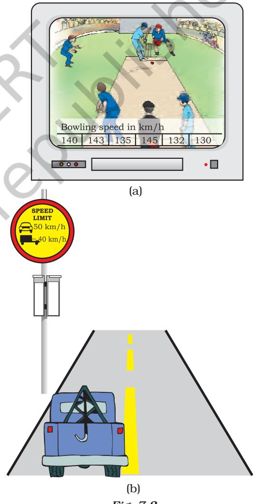

Look at the situations given in Fig. 7.2. If the bowling speed is 143 km h–1 in Fig. 7.2(a) what does it mean? What do you understand from the signboard in Fig. 7.2(b)?

Different objects may take different amounts of time to cover a given distance. Some of them move fast and some move slowly. The rate at which objects move can be different. Also, different objects can move at the same rate. One of the ways of measuring the rate of motion of an object is to find out the distance travelled by the object in unit time. This quantity is referred to as speed. The SI unit of speed is metre per second. This is represented by the symbol m s–1 or m/s.The other units of speed include centimetre per second (cm s–1) and kilometre per hour (km h–1). To specify the speed of an object, we require only its magnitude. The speed of an object need not be constant. In most cases, objects will be in non-uniform motion. Therefore, we describe the rate of motion of such objects in terms of their average speed. The average speed of an object is obtained by dividing the total distance travelled by the total time taken. That is,

average speed = $\dfrac{\text{Total distance travelled}}{\text{Total time taken}}$

If an object travels a distance *s* in time *t* then its speed *v* is,

$\upsilon=\frac{\mathbf{S}}{t}$\(\mathbf{

Let us understand this by an example. A car travels a distance of 100 km in 2 h. Its average speed is 50 km h–1. The car might not have travelled at 50 km h–1 all the time. Sometimes it might have travelled faster and sometimes slower than this.

**Example 7.1** An object travels 16 m in 4 s and then another 16 m in 2 s. What is the average speed of the object?

#### **Solution:**

Total distance travelled by the object = 16 m + 16 m = 32 m Total time taken = 4 s + 2 s = 6 s

  
Average speed = $\dfrac{\text{Totaldistancetravelled}}{\text{Totaltimetaken}}$  
  

$$=\dfrac{\text{32m}}{\text{6s}}=5.33\text{m s}^{\normalsize-1}$$
  
  
Therefore, the average speed of the object.  

Therefore, the average speed of the object is 5.33 m s–1 .

### **7.2.1 SPEED WITH DIRECTION**

The rate of motion of an object can be more comprehensive if we specify its direction of motion along with its speed. The quantity that specifies both these aspects is called velocity. Velocity is the speed of an object moving in a definite direction. The velocity of an object can be uniform or variable. It can be changed by changing the object's speed, direction of motion or both. When an object is moving along a straight line at a variable speed, we can express the magnitude of its rate of motion in terms of average velocity. It is calculated in the same way as we calculate average speed.

In case the velocity of the object is changing at a uniform rate, then average velocity is given by the arithmetic mean of initial velocity and final velocity for a given period of time. That is,

$$\psi$$
 is  
  
$\mathrm{average\:velocity=\dfrac{initial\:velocity+final\:velocity}{2}}$

*u + v 2*

Mathematically, *v av* =

(7.2)

where *vav* is the average velocity, *u* is the initial velocity and *v* is the final velocity of the object.

Speed and velocity have the same units, that is, m s–1 or m/s.

## *Activity ______________ 7.6*

- Measure the time it takes you to walk from your house to your bus stop or the school. If you consider that your average walking speed is 4 km h–1 , estimate the distance of the bus stop or school from your house.
#### Activity ActivityActivity

#### 7.7

- At a time when it is cloudy, there may be frequent thunder and lightning. The sound of thunder takes some time to reach you after you see the lightning.
- Can you answer why this happens?
- Measure this time interval using a digital wrist watch or a stop watch.
- Calculate the distance of the nearest point of lightning. (Speed of sound in air = 346 m s-1.)

# uestions

- *1. Distinguish between speed and velocity.*
- *2. Under what condition(s) is the magnitude of average velocity of an object equal to its average speed?* Q
	- *3. What does the odometer of an automobile measure?*
	- *4. What does the path of an object look like when it is in uniform motion?*
	- *5. During an experiment, a signal from a spaceship reached the ground station in five minutes. What was the distance of the spaceship from the ground station? The signal travels at the speed of light, that is, 3* × *108* m s–1 *.*
	- Example 7.2 The odometer of a car reads 2000 km at the start of a trip and 2400 km at the end of the trip. If the trip took 8 h, calculate the average speed of the car in km h–1 and m s–1 .

#### Solution:

Distance covered by the car, *s* = 2400 km – 2000 km = 400 km Time elapsed, *t =* 8 h Average speed of the car is,

$$\begin{array}{r l}{U_{\mathrm{av}}=}&{{}{\frac{\mathbf{\nabla}{\mathbf{s}}}{t}}={\frac{400{\mathrm{~km}}}{8{\mathrm{~h}}}}}\\ {\ }&{{}=50{\mathrm{~km}}{\mathrm{~h}}^{-1}}\end{array}$$

$$=\,50\,{\frac{\mathrm{km}}{\mathrm{h}}}\times{\frac{1000\,\mathrm{m}}{1\,\mathrm{km}}}\times{\frac{1\,\mathrm{h}}{3600\,\mathrm{s}}}$$

$$=13.9\ \mathrm{m}\ \mathrm{s}^{-1}$$

The average speed of the car is 50 km h–1 or 13.9 m s–1 .

Example 7.3 Usha swims in a 90 m long pool. She covers 180 m in one minute by swimming from one end to the other and back along the same straight path. Find the average speed and average velocity of Usha.

#### Solution: Solution:Solution:

Total distance covered by Usha in 1 min is 180 m.

Displacement of Usha in 1 min = 0 m

- Average speed = Total distance covered Totaltimetaken
	- = 180m 180 m 1 min = × 1min 1min 60s = 3 m s-1

Average velocity = Displacement Totaltimetaken

$$={\frac{0\,\mathrm{m}}{60\,\mathrm{s}}}$$

= 0 m s–1

The average speed of Usha is 3 m s–1 and her average velocity is 0 m s–1 .

## **7.3 Rate of Change of Velocity**

During uniform motion of an object along a straight line, the velocity remains constant with time. In this case, the change in velocity of the object for any time interval is zero. However, in non-uniform motion, velocity varies with time. It has different values at different instants and at different points of the path. Thus, the change in velocity of the object during any time interval is not zero. Can we now express the change in velocity of an object?

To answer such a question, we have to introduce another physical quantity called acceleration, which is a measure of the change in the velocity of an object per unit time. That is,

> acceleration = change in velocity time taken

If the velocity of an object changes from an initial value *u* to the final value *v* in time *t*, the acceleration *a* is,

$a=\frac{\partial-u}{t}$ (7.3)

This kind of motion is known as accelerated motion. The acceleration is taken to be positive if it is in the direction of velocity and negative when it is opposite to the direction of velocity. The SI unit of acceleration is m s–2 .

If an object travels in a straight line and its velocity increases or decreases by equal amounts in equal intervals of time, then the acceleration of the object is said to be uniform. The motion of a freely falling body is an example of uniformly accelerated motion. On the other hand, an object can travel with non-uniform acceleration if its velocity changes at a non-uniform rate. For example, if a car travelling along a straight road increases its speed by unequal amounts in equal intervals of time, then the car is said to be moving with non-uniform acceleration.

#### Activity ActivityActivity

- In your everyday life you come across a range of motions in which
	- (a) acceleration is in the direction of motion,
	- (b) acceleration is against the direction of motion,
	- (c) acceleration is uniform,
	- (d) acceleration is non-uniform.
- Can you identify one example each for the above type of motion?

Example **7.4** Starting from a stationary position, Rahul paddles his bicycle to attain a velocity of 6 m s–1 in 30 s. Then he applies brakes such that the velocity of the bicycle comes down to 4 m s-1 in the next 5 s. Calculate the acceleration of the bicycle in both the cases.

#### Solution:

In the first case: initial velocity, *u* = 0 ; final velocity, *v* = 6 m s–1 ; time, *t* = 30 s . From Eq. (8.3), we have

$$a={\frac{v-u}{t}}$$

Substituting the given values of *u*,*v* and *t* in the above equation, we get

( ) –1 –1 6m s – 0m s = 30 s *a*

= 0.2 m s–2 In the second case: initial velocity*, u* = 6 m s–1; final velocity*, v =* 4 m s–1; time, *t =* 5 s.

Then, $a=\frac{\left(4\,\mathrm{m}\,\mathrm{s}^{-1}-6\,\mathrm{m}\,\mathrm{s}^{-1}\right)}{\left(\,\mathrm{s}^{-1}-6\,\mathrm{m}\,\mathrm{s}^{-1}\right)}$

= –0.4 m s–2 .

The acceleration of the bicycle in the first case is 0.2 m s–2 and in the second case, it is –0.4 m s–2 .

# uestions

- *1. When will you say a body is in (i) uniform acceleration? (ii) nonuniform acceleration?*
- *2. A bus decreases its speed from 80* km h–1 *to 60* km h–1 *in 5* s*. Find the acceleration of the bus.* Q
	- *3. A train starting from a railway station and moving with uniform acceleration attains a speed 40* km h–1 *in 10 minutes. Find its acceleration.*

*MOTION* 77

7.8

## **7.4 Graphical Representation of Motion**

Graphs provide a convenient method to present basic information about a variety of events. For example, in the telecast of a one-day cricket match, vertical bar graphs show the run rate of a team in each over. As you have studied in mathematics, a straight line graph helps in solving a linear equation having two variables.

To describe the motion of an object, we can use line graphs. In this case, line graphs show dependence of one physical quantity, such as distance or velocity, on another quantity, such as time.

### **7.4.1 DISTANCE–TIME GRAPHS**

The change in the position of an object with time can be represented on the distance-time graph adopting a convenient scale of choice. In this graph, time is taken along the *x*–axis and distance is taken along the *y*-axis. Distance-time graphs can be employed under various conditions where objects move with uniform speed, non-uniform speed, remain at rest etc.

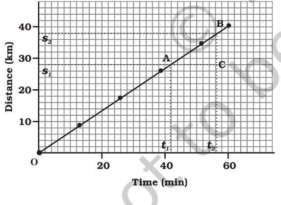

*Fig. 7.3: Fig. 7.3:Fig. 7.3: Distance-time graph of an object moving with uniform speed*

We know that when an object travels equal distances in equal intervals of time, it moves with uniform speed. This shows that the distance travelled by the object is directly proportional to time taken. Thus, for uniform speed, a graph of distance travelled against time is a straight line, as shown in Fig. 7.3. The portion OB of the graph shows that the distance is increasing at a uniform rate. Note that, you can also use the term uniform velocity in place of uniform speed if you take the magnitude of displacement equal to the distance travelled by the object along the *y*-axis.

We can use the distance-time graph to determine the speed of an object. To do so, consider a small part AB of the distance-time graph shown in Fig 7.3. Draw a line parallel to the *x-*axis from point A and another line parallel to the *y*-axis from point B. These two lines meet each other at point C to form a triangle ABC. Now, on the graph, AC denotes the time interval (*t 2 – t1* ) while BC corresponds to the distance (*s2 – s1* ). We can see from the graph that as the object moves from the point A to B, it covers a distance (*s2 – s1* ) in time (*t 2 – t1* ). The speed, *v* of the object, therefore can be represented as

$\nu=\frac{\nu_{2}-\nu_{1}}{\nu_{2}-\nu_{1}}$ (7.4)

We can also plot the distance-time graph for accelerated motion. Table 7.2 shows the distance travelled by a car in a time interval of two seconds.

| Table 7.2: Distance travelled by a |  |
| --- | --- |
| car at regular time intervals |  |
| Time in seconds Distance in metres |  |
| 0 | 0 |
| 2 | 1 |
| 4 | 4 |
| 6 | 9 |
| 8 | 16 |
| 10 | 25 |
| 12 | 36 |

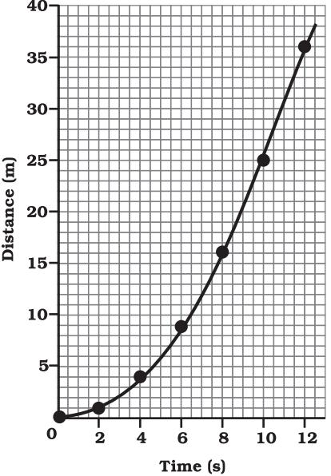

*Fig. 7.4: Distance-time graph for a car moving with non-uniform speed*

The distance-time graph for the motion of the car is shown in Fig. 7.4. Note that the shape of this graph is different from the earlier distance-time graph (Fig. 7.3) for uniform motion. The nature of this graph shows nonlinear variation of the distance travelled by the car with time. Thus, the graph shown in Fig 7.4 represents motion with non-uniform speed.

### **7.4.2 VELOCITY-TIME GRAPHS**

The variation in velocity with time for an object moving in a straight line can be represented by a velocity-time graph. In this graph, time is represented along the *x-*axis and the velocity

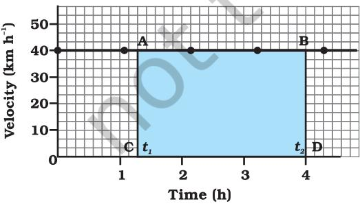

*Fig. 7.5: Velocity-time graph for uniform motion of a car*

is represented along the *y*-axis. If the object moves at uniform velocity, the height of its velocity-time graph will not change with time (Fig. 7.5). It will be a straight line parallel to the *x-*axis. Fig. 7.5 shows the velocity-time graph for a car moving with uniform velocity of 40 km h–1 .

We know that the product of velocity and time give displacement of an object moving with uniform velocity. The area enclosed by velocity-time graph and the time axis will be equal to the magnitude of the displacement.

To know the distance moved by the car between time *t1* and *t 2* using Fig. 7.5, draw perpendiculars from the points corresponding to the time *t 1* and *t2* on the graph. The velocity of 40 km h–1 is represented by the height AC or BD and the time (*t 2 – t1* ) is represented by the length AB.

So, the distance *s* moved by the car in time (*t 2 – t1* ) can be expressed as

- *s* = AC × CD
	- = [(40 km h–1) × (*t 2 – t1* ) h]
	- = 40 (*t 2 – t1* ) km
	- = area of the rectangle ABDC (shaded in Fig. 7.5).

We can also study about uniformly accelerated motion by plotting its velocity– time graph. Consider a car being driven along a straight road for testing its engine. Suppose a person sitting next to the driver records its velocity after every 5 seconds by noting the reading of the speedometer of the car. The velocity of the car, in km h–1 as well as in m s–1 , at different instants of time is shown in table 7.3.

|  | Table 7.3: Velocity of a car at |  |
| --- | --- | --- |
|  | regular instants of time |  |
| Time | Velocity of the car |  |
| (s) | (m s–1) | (km h–1) |
| 0 | 0 | 0 |
| 5 | 2.5 | 9 |
| 10 | 5.0 | 18 |
| 15 | 7.5 | 27 |
| 20 | 10.0 | 36 |
| 25 | 12.5 | 45 |
| 30 | 15.0 | 54 |

In this case, the velocity-time graph for the motion of the car is shown in Fig. 7.6. The nature of the graph shows that velocity changes by equal amounts in equal intervals of time. Thus, for all uniformly accelerated motion, the velocity-time graph is a straight line.

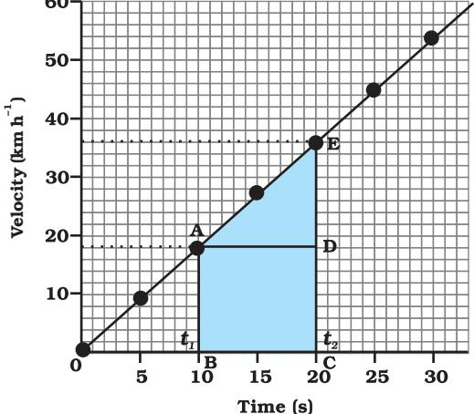

*Fig. 7.6: Velocity-time graph for a car moving with uniform accelerations.*

You can also determine the distance moved by the car from its velocity-time graph. The area under the velocity-time graph gives the distance (magnitude of displacement) moved by the car in a given interval of time. If the car would have been moving with uniform velocity, the distance travelled by it would be represented by the area ABCD under the graph (Fig. 7.6). Since the magnitude of the velocity of the car is changing due to acceleration, the distance *s* travelled by the car will be given by the area ABCDE under the velocity-time graph (Fig. 7.6).

That is,

- *s* = area ABCDE
	- = area of the rectangle ABCD + area of the triangle ADE

$$={\mathrm{\ADB}}\times{\mathrm{\BC}}+{\frac{1}{2}}\left({\mathrm{AD}}\times{\mathrm{DE}}\right)$$

In the case of non-uniformly accelerated motion, velocity-time graphs can have any shape.

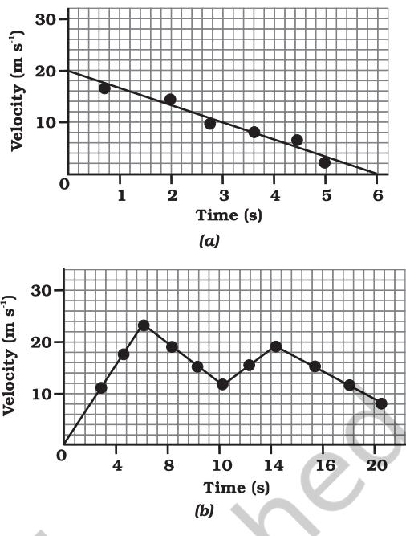

*Fig. 7.7: Velocity-time graphs of an object in nonuniformly accelerated motion.*

Fig. 7.7(a) shows a velocity-time graph that represents the motion of an object whose velocity is decreasing with time while Fig. 7.7 (b) shows the velocity-time graph representing the non-uniform variation of velocity of the object with time. Try to interpret these graphs.

> Activity ActivityActivity 7.9• The times of arrival and departure of a train at three stations A, B and C and the distance of stations B and C

> > from station A are given in Table 7.4.

Table 7.4: Distances of stations B and C from A and times of arrival and departure of the train

| Station | Distance | Time of | Time of |
| --- | --- | --- | --- |
|  | from A | arrival | departure |
|  | (km) | (hours) | (hours) |
| A | 0 | 08:00 | 08:15 |
| B | 120 | 11:15 | 11:30 |
| C | 180 | 13:00 | 13:15 |

• Plot and interpret the distance-time graph for the train assuming that its motion between any two stations is uniform.

80 *SCIENCE*

#### Activity ActivityActivity

7.10

- Feroz and his sister Sania go to school on their bicycles. Both of them start at the same time from their home but take different times to reach the school although they follow the same route. Table 7.5 shows the distance travelled by them in different times
### Table 7.5: Distance covered by Feroz and Sania at different times on their bicycles

| Time | Distance | Distance |
| --- | --- | --- |
|  | travelled | travelled |
|  | by Feroz | by Sania |
|  | (km) | (km) |
| 8:00 am | 0 | 0 |
| 8:05 am | 1.0 | 0.8 |
| 8:10 am | 1.9 | 1.6 |
| 8:15 am | 2.8 | 2.3 |
| 8:20 am | 3.6 | 3.0 |
| 8:25 am | – | 3.6 |

• Plot the distance-time graph for their motions on the same scale and interpret.

# uestions

- Q *1. What is the nature of the distance-time graphs for uniform and non-uniform motion of an object?*
	- *2. What can you say about the motion of an object whose distance-time graph is a straight line parallel to the time axis?*
	- *3. What can you say about the motion of an object if its speedtime graph is a straight line parallel to the time axis?*

- *4. What is the quantity which is measured by the area occupied below the velocity-time graph?*
## **7.5 Equations of Motion**

When an object moves along a straight line with uniform acceleration, it is possible to relate its velocity, acceleration during motion and the distance covered by it in a certain time interval by a set of equations known as the equations of motion. For convenience, a set of three such equations are given below:

$\omega=\omega+\omega$ (7.5)

* [15] M. C. Gonzalez-Garcia, M. C. Gonzalez-Garcia, M.  
  

*2 as = v2 – u2* (7.7) where *u* is the initial velocity of the object which moves with uniform acceleration *a* for time *t, v* is the final velocity, and *s* is the distance travelled by the object in time *t*. Eq. (7.5) describes the velocity-time relation and Eq. (7.6) represents the position-time relation. Eq. (7.7), which represents the relation between the position and the velocity, can be obtained from Eqs. (7.5) and (7.6) by eliminating *t*. These three equations can be derived by graphical method.

Example 7.5 A train starting from rest attains a velocity of 72 km h–1 in 5 minutes. Assuming that the acceleration is uniform, find (i) the acceleration and (ii) the distance travelled by the train for attaining this velocity.

#### Solution:

We have been given *u* = 0 ; *v* = 72 km h–1 = 20 m s-1 and *t =* 5 minutes = 300 s. (i) From Eq. (7.5) we know that

$$\cdot{\frac{\mathbf{\nabla}\left(\mathbf{v}-\mathbf{u}\right)}{t}}$$
  

$$\cdot{\frac{\mathbf{\nabla}\left(\mathbf{\nabla}\mathbf{u}\right)}{\mathbf{\nabla}\left(\mathbf{u}\right)}}$$
  

$$={\frac{\mathbf{20}\ \mathbf{m}\ \mathbf{s}^{-1}\ -\ \mathbf{0}\mathbf{m}\ \mathbf{s}^{-1}}{\mathbf{300}\mathbf{s}}}$$
  

$$={\frac{\mathbf{1}}{\mathbf{15}}}\ \mathbf{m}\ \mathbf{s}^{-2}$$

*MOTION* 81

(ii) From Eq. (7.7) we have  
  
$2\;as=\upsilon^{2}-u^{2}=\upsilon^{2}-0$  
  
Thus,  
  
$s=\frac{\upsilon^{2}}{2a}$  
  
=$\frac{\left(20\mathrm{~m}\,\mathrm{s}^{-1}\right)^{2}}{2\times\left(1/15\right)\mathrm{m}\,\mathrm{s}^{-2}}$  
  
= 3000 m  
  
= 3 km  
  
The acceleration of the train is .  

The acceleration of the train is 1 15 m s*– 2* and the distance travelled is 3 km.

- Example 7.6 A car accelerates uniformly from 18 km h–1 to 36 km h–1 in 5 s. Calculate (i) the acceleration and (ii) the distance covered by the car in that time.
#### Solution:

We are given that

$$\begin{array}{r c l}{{u}}&{{=}}&{{18\mathrm{~km}\mathrm{~h}^{-1}=5\mathrm{~m}\mathrm{~s}^{-1}}}\\ {{v}}&{{=}}&{{36\mathrm{~km}\mathrm{~h}^{-1}=10\mathrm{~m}\mathrm{~s}^{-1}\,\mathrm{and}}}\\ {{t}}&{{=}}&{{5\mathrm{~s}\,.}}\end{array}$$

- (i) From Eq. (7.5) we have

$$a={\frac{v-u}{t}}$$
  

$$\therefore{\frac{10\mathrm{~m}\mathrm{~s}^{\text{-1}}-5\mathrm{~m}\mathrm{~s}^{\text{-1}}}{5\mathrm{~s}}}$$

= 1 m s–2

- (ii) From Eq. (7.6) we have
5s

$${\bf s}=u\,t+\,\frac{1}{2}a\,t^{\,2}$$

$$={\bf5~m~s^{-1}}\times{\bf5~s^{+}}\overbrace{{\bf2}}^{\bf5}\times{\bf1~m~s^{-2}}\times({\bf5~s})^{2}$$

* [16] A. A. K.  
  

= 37.5 m

The acceleration of the car is 1 m s–2 and the distance covered is 37.5 m.

Example 7.7 The brakes applied to a car produce an acceleration of 6 m s-2 in the opposite direction to the motion. If the car takes 2 s to stop after the application of brakes, calculate the distance it travels during this time.

#### Solution:

We have been given *a* = – 6 m s–2 ; *t* = 2 s and *v* = 0 m s–1 . From Eq. (7.5) we know that *v = u + at* 0 *= u +* (– 6 m s–2) × 2 s or *u =* 12 m s–1 . From Eq. (7.6) we get *s* = *u t* + 1 2  *a t 2* = (12 m s–1 ) × (2 s) + 1 2 (–6 m s–2 ) (2 s)2

$$=24\ {\mathrm{m}}-12\ {\mathrm{m}}$$

= 12 m

Thus, the car will move 12 m before it stops after the application of brakes. Can you now appreciate why drivers are cautioned to maintain some distance between vehicles while travelling on the road?

# uestions

- *1. A bus starting from rest moves with a uniform acceleration of 0.1* m s-2 *for 2 minutes. Find (a) the speed acquired, (b) the distance travelled.* Q
	- *2. A train is travelling at a speed of 90* km h–1 . *Brakes are applied so as to produce a uniform acceleration of – 0.5* m s-2*. Find how far the train will go before it is brought to rest.*
	- *3. A trolley, while going down an inclined plane, has an acceleration of 2* cm s-2*. What will be its velocity 3* s *after the start?*
- *4. A racing car has a uniform acceleration of 4* m s-2*. What distance will it cover in 10* s *after start?*
- *5. A stone is thrown in a vertically upward direction with a velocity of 5* m s-1*. If the acceleration of the stone during its motion is 10* m s–2 *in the downward direction, what will be the height attained by the stone and how much time will it take to reach there?*

## **7.6 Uniform Circular Motion**

When the velocity of an object changes, we say that the object is accelerating. The change in the velocity could be due to change in its magnitude or the direction of the motion or both. Can you think of an example when an object does not change its magnitude of velocity but only its direction of motion?

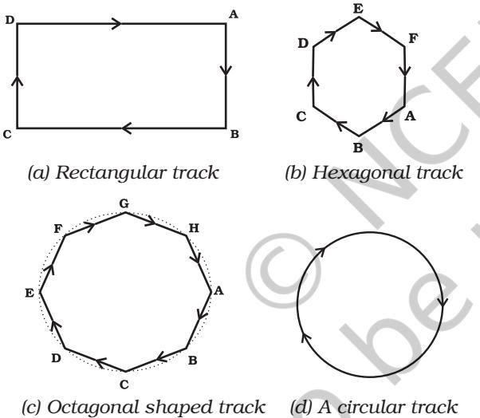

*Fig. 7.8: The motion of an athlete along closed tracks of different shapes.*

Let us consider an example of the motion of a body along a closed path. Fig 8.9 (a) shows the path of an athlete along a rectangular track ABCD. Let us assume that the athlete runs at a uniform speed on the straight parts AB, BC, CD and DA of the track. In order to keep himself on track, he quickly changes his speed at the corners. How many times will the athlete have to change his direction of motion, while he completes one round? It is clear that to move in a rectangular track once, he has to change his direction of motion four times.

Now, suppose instead of a rectangular track, the athlete is running along a hexagonal shaped path ABCDEF, as shown in Fig. 7.8(b). In this situation, the athlete will have to change his direction six times while he completes one round. What if the track was not a hexagon but a regular octagon, with eight equal sides as shown by ABCDEFGH in Fig. 7.8(c)? It is observed that as the number of sides of the track increases the athelete has to take turns more and more often. What would happen to the shape of the track as we go on increasing the number of sides indefinitely? If you do this you will notice that the shape of the track approaches the shape of a circle and the length of each of the sides will decrease to a point. If the athlete moves with a velocity of constant magnitude along the circular path, the only change in his velocity is due to the change in the direction of motion. The motion of the athlete moving along a circular path is, therefore, an example of an accelerated motion.

We know that the circumference of a circle of radius *r* is given by *2 r* π . If the athlete takes *t* seconds to go once around the circular path of radius *r,* the speed *v* is given by

$\omega=\frac{2\pi r}{t}$  
  
(7.8)

When an object moves in a circular path with uniform speed, its motion is called uniform circular motion.

#### Activity ActivityActivity

- Take a piece of thread and tie a small piece of stone at one of its ends. Move the stone to describe a circular path with constant speed by holding the thread at the other end, as shown in Fig. 7.9.
7.11

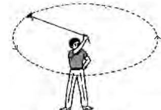

- *Fig. 7.9: A stone describing a circular path with a velocity of constant magnitude.*
- Now, let the stone go by releasing the thread.
- Can you tell the direction in which the stone moves after it is released?
- By repeating the activity for a few times and releasing the stone at different positions of the circular path, check whether the direction in which the stone moves remains the same or not.

If you carefully note, on being released the stone moves along a straight line tangential to the circular path. This is because once the stone is released, it continues to move along the direction it has been moving at that instant. This shows that the direction of motion changed at every point when the stone was moving along the circular path.

When an athlete throws a hammer or a discus in a sports meet, he/she holds the hammer or the discus in his/her hand and gives it a circular motion by rotating his/ her own body. Once released in the desired direction, the hammer or discus moves in the direction in which it was moving at the time it was released, just like the piece of stone in the activity described above. There are many more familiar examples of objects moving under uniform circular motion, such as the motion of the moon and the earth, a satellite in a circular orbit around the earth, a cyclist on a circular track at constant speed and so on.

# **What you have**

- **learnt** • Motion is a change of position; it can be described in terms of the distance moved or the displacement.
- The motion of an object could be uniform or non-uniform depending on whether its velocity is constant or changing.
- The speed of an object is the distance covered per unit time, and velocity is the displacement per unit time.
- The acceleration of an object is the change in velocity per unit time.

• Uniform and non-uniform motions of objects can be shown through graphs.

- The motion of an object moving at uniform acceleration can be described with the help of the following equations, namely
*v* = *u* + *at s = ut +* ½ *at2* 2*as = v*2 – u2

where *u* is initial velocity of the object, which moves with uniform acceleration *a* for time *t*, *v* is its final velocity and *s* is the distance it travelled in time *t*.

- If an object moves in a circular path with uniform speed, its motion is called uniform circular motion.
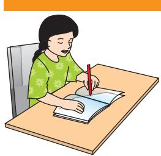

## **Exercises**

- 1. An athlete completes one round of a circular track of diameter 200 m in 40 *s*. What will be the distance covered and the displacement at the end of 2 minutes 20 s?
- 2. Joseph jogs from one end A to the other end B of a straight 300 m road in 2 minutes 30 seconds and then turns around and jogs 100 m back to point C in another 1 minute. What are Joseph's average speeds and velocities in jogging (a) from A to B and (b) from A to C?
- 3. Abdul, while driving to school, computes the average speed for his trip to be 20 km h–1. On his return trip along the same route, there is less traffic and the average speed is 30 km h–1. What is the average speed for Abdul's trip?
- 4. A motorboat starting from rest on a lake accelerates in a straight line at a constant rate of 3.0 m s–2 for 8.0 s. How far does the boat travel during this time?
- 5. A driver of a car travelling at 52 km h–1 applies the brakes Shade the area on the graph that represents the distance travelled by the car during the period.
	- (b) Which part of the graph represents uniform motion of the car?
- 6. Fig 7.10 shows the distance-time graph of three objects A,B and C. Study the graph and answer the following questions:

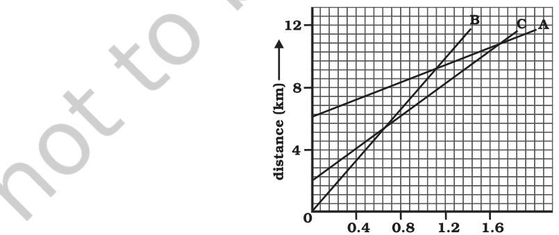

*Fig. 7.10 Fig. 7.10Fig. 7.10*

- (a) Which of the three is travelling the fastest?
- (b) Are all three ever at the same point on the road?
- (c) How far has C travelled when B passes A?
- (d) How far has B travelled by the time it passes C?
- 7. A ball is gently dropped from a height of 20 m. If its velocity increases uniformly at the rate of 10 m s-2, with what velocity will it strike the ground? After what time will it strike the ground?
- 8. The speed-time graph for a car is shown is Fig. 7.11.

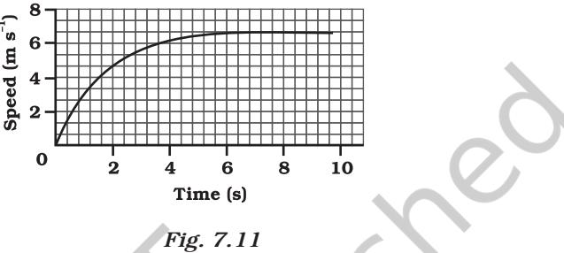

- (a) Find how far does the car travel in the first 4 seconds. Shade the area on the graph that represents the distance travelled by the car during the period.
- (b) Which part of the graph represents uniform motion of the car?
- 9. State which of the following situations are possible and give an example for each of these:
	- (a) an object with a constant acceleration but with zero velocity
	- (b) an object moving with an acceleration but with uniform speed.
	- (c) an object moving in a certain direction with an acceleration in the perpendicular direction.
- 10. An artificial satellite is moving in a circular orbit of radius 42250 km. Calculate its speed if it takes 24 hours to revolve around the earth.

