# **FORCE AND LAWS OF MOTION**

In the previous chapter, we described the motion of an object along a straight line in terms of its position, velocity and acceleration. We saw that such a motion can be uniform or non-uniform. We have not yet discovered what causes the motion. Why does the speed of an object change with time? Do all motions require a cause? If so, what is the nature of this cause? In this chapter we shall make an attempt to quench all such curiosities.

For many centuries, the problem of motion and its causes had puzzled scientists and philosophers. A ball on the ground, when given a small hit, does not move forever. Such observations suggest that rest is the "natural state" of an object. This remained the belief until Galileo Galilei and Isaac Newton developed an entirely different approach to understand motion.

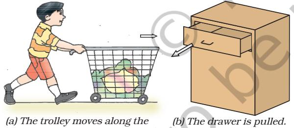

*direction we push it.*

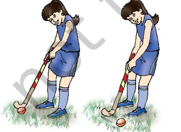

*(c) The hockey stick hits the ball forward Fig. 8.1: Pushing, pulling, or hitting objects change their state of motion.*

In our everyday life we observe that some effort is required to put a stationary object into motion or to stop a moving object. We ordinarily experience this as a muscular effort and say that we must push or hit or pull on an object to change its state of motion. The concept of force is based on this push, hit or pull. Let us now ponder about a 'force'. What is it? In fact, no one has seen, tasted or felt a force. However, we always see or feel the effect of a force. It can only be explained by describing what happens when a force is applied to an object. Pushing, hitting and pulling of objects are all ways of bringing objects in motion (Fig. 8.1). They move because we make a force act on them.

From your studies in earlier classes, you are also familiar with the fact that a force can be used to change the magnitude of velocity of an object (that is, to make the object move faster or slower) or to change its direction of motion. We also know that a force can change the shape and size of objects (Fig. 8.2).

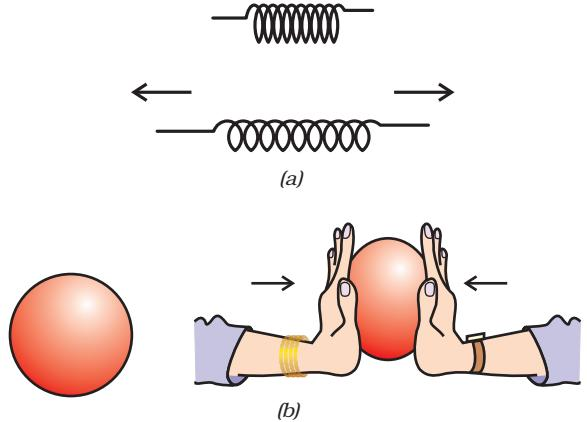

*Fig. 8.2:* (a) *A spring expands on application of force; (b) A spherical rubber ball becomes oblong as we apply force on it.*

# **8.1 Balanced and Unbalanced Forces**

Fig. 8.3 shows a wooden block on a horizontal table. Two strings X and Y are tied to the two opposite faces of the block as shown. If we apply a force by pulling the string X, the block begins to move to the right. Similarly, if we pull the string Y, the block moves to the left. But, if the block is pulled from both the sides with equal forces, the block will not move. Such forces are called balanced forces and do not change the state of rest or of motion of an object. Now, let us consider a situation in which two opposite forces of different magnitudes pull the block. In this case, the block would begin to move in the direction of the greater force. Thus, the two forces are not balanced and the unbalanced force acts in the direction the block moves. This suggests that an unbalanced force acting on an object brings it in motion.

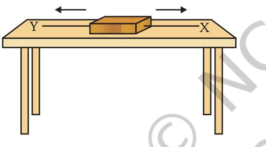

*Fig. 8.3: Two forces acting on a wooden block*

What happens when some children try to push a box on a rough floor? If they push the box with a small force, the box does not move because of friction acting in a direction opposite to the push [Fig. 8.4(a)]. This friction force arises between two surfaces in contact; in this case*,* between the bottom of the box and floor's rough surface. It balances the pushing force and therefore the box does not move. In Fig. 8.4(b), the children push the box harder but the box still does not move. This is because the friction force still balances the pushing force. If the children push the box harder still, the pushing force becomes bigger than the friction force [Fig. 8.4(c)]. There is an unbalanced force. So the box starts moving.

What happens when we ride a bicycle? When we stop pedalling, the bicycle begins to slow down. This is again because of the friction forces acting opposite to the direction of motion. In order to keep the bicycle moving, we have to start pedalling again. It thus appears that an object maintains its motion under the continuous application of an unbalanced force. However, it is quite incorrect. An object moves with a uniform velocity when the forces (pushing force and frictional force) acting on the object are balanced and there is no net external force on it. If an unbalanced force is applied on the object, there will be a change either in its speed or in the direction of its motion. Thus, to accelerate the motion of an object, an unbalanced force is required. And the change in its speed (or in the direction of motion) would continue as long as this unbalanced force is applied. However, if this force is

*Fig. 8.4*

removed completely, the object would continue to move with the velocity it has acquired till then.

# **8.2 First Law of Motion**

By observing the motion of objects on an inclined plane Galileo deduced that objects move with a constant speed when no force acts on them. He observed that when a marble rolls down an inclined plane, its velocity increases [Fig. 8.5(a)]. In the next chapter, you will learn that the marble falls under the unbalanced force of gravity as it rolls down and attains a definite velocity by the time it reaches the bottom. Its velocity decreases when it climbs up as shown in Fig. 8.5(b). Fig. 8.5(c) shows a marble resting on an ideal frictionless plane inclined on both sides. Galileo argued that when the marble is released from left, it would roll down the slope and go up on the opposite side to the same height from which it was released. If the inclinations of the planes on both sides are equal then the marble will climb the same distance that it covered while rolling down. If the angle of inclination of the right-side plane were gradually decreased, then the marble would travel further distances till it reaches the original height. If the right-side plane were ultimately made horizontal (that is, the slope is reduced to zero), the marble would continue to travel forever trying to reach the same height that it was released from. The unbalanced forces on the marble in this case are zero. It thus suggests that an unbalanced (external) force is required to change the motion of the marble but no net force is needed to sustain the uniform motion of the marble. In practical situations it is difficult to achieve a zero unbalanced force. This is because of the presence of the frictional force acting opposite to the direction of motion. Thus, in practice the marble stops after travelling some distance. The effect of the frictional force may be minimised by using a smooth marble and a smooth plane and providing a lubricant on top of the planes.

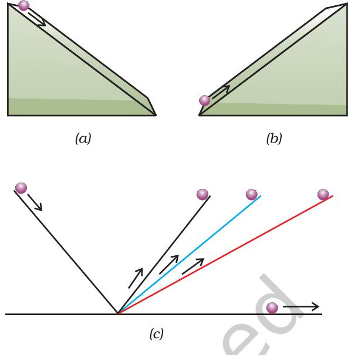

*Fig. 8.5: (a) the downward motion; (b) the upward motion of a marble on an inclined plane; and (c) on a double inclined plane.*

Newton further studied Galileo's ideas on force and motion and presented three fundamental laws that govern the motion of objects. These three laws are known as Newton's laws of motion. The first law of motion is stated as:

An object remains in a state of rest or of uniform motion in a straight line unless compelled to change that state by an applied force.

In other words, all objects resist a change in their *state of motion*. In a qualitative way, the tendency of undisturbed objects to stay at rest or to keep moving with the same velocity is called inertia. This is why, the first law of motion is also known as the law of inertia.

Certain experiences that we come across while travelling in a motorcar can be explained on the basis of the law of inertia. We tend to remain at rest with respect to the seat until the driver applies a braking force to stop the motorcar. With the application of brakes, the car slows down but our body tends to continue in the same state of motion because of its inertia. A sudden application of brakes may thus cause injury to us by impact Galileo Galilei was born on 15 February 1564 in Pisa, Italy. Galileo, right from his childhood, had interest in mathematics and natural philosophy. But his father Vincenzo Galilei wanted him to become a medical doctor. Accordingly, Galileo enrolled himself for a medical degree at the

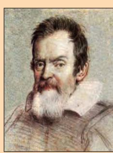

*Galileo Galilei (1564 – 1642)*

University of Pisa in 1581 which he never completed because of his real interest in mathematics. In 1586, he wrote his first scientific book *'The Little Balance* [*La Balancitta*]', in which he described Archimedes' method of finding the relative densities (or specific gravities) of substances using a balance. In 1589, in his series of essays – *De Motu*, he presented his theories about falling objects using an inclined plane to slow down the rate of descent.

In 1592, he was appointed professor of mathematics at the University of Padua in the Republic of Venice. Here he continued his observations on the theory of motion and through his study of inclined planes and the pendulum, formulated the correct law for uniformly accelerated objects that the distance the object moves is proportional to the square of the time taken.

Galileo was also a remarkable craftsman. He developed a series of telescopes whose optical performance was much better than that of other telescopes available during those days. Around 1640, he designed the first pendulum clock. In his book *'Starry Messenger'* on his astronomical discoveries, Galileo claimed to have seen mountains on the moon, the milky way made up of tiny stars, and four small bodies orbiting Jupiter. In his books *'Discourse on Floating Bodies'* and *'Letters on the Sunspots'*, he disclosed his observations of sunspots.

Using his own telescopes and through his observations on Saturn and Venus, Galileo argued that all the planets must orbit the Sun and not the earth, contrary to what was believed at that time.

or collision with the panels in front. Safety belts are worn to prevent such accidents. Safety belts exert a force on our body to make the forward motion slower. An opposite experience is encountered when we are standing in a bus and the bus begins to move suddenly. Now we tend to fall backwards. This is because the sudden start of the bus brings motion to the bus as well as to our feet in contact with the floor of the bus. But the rest of our body opposes this motion because of its inertia.

When a motorcar makes a sharp turn at a high speed, we tend to get thrown to one side. This can again be explained on the basis of the law of inertia. We tend to continue in our straight-line motion. When an unbalanced force is applied by the engine to change the direction of motion of the motorcar, we slip to one side of the seat due to the inertia of our body.

The fact that a body will remain at rest unless acted upon by an unbalanced force can be illustrated through the following activities:

### *Activity ______________ 8.1*

• Make a pile of similar carom coins on a table, as shown in Fig. 8.6.

• Attempt a sharp horizontal hit at the bottom of the pile using another carom coin or the striker. If the hit is strong enough, the bottom coin moves out quickly. Once the lowest coin is removed, the inertia of the other coins makes them 'fall' vertically on the table.

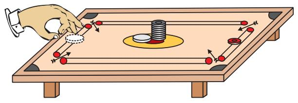

*Fig. 8.6: Only the carom coin at the bottom of a pile is removed when a fast moving carom coin (or striker) hits it.*

### *Activity ______________ 8.2*

- Set a five-rupee coin on a stiff card covering an empty glass tumbler standing on a table as shown in Fig. 8.7.
- Give the card a sharp horizontal flick with a finger. If we do it fast then the card shoots away, allowing the coin to fall vertically into the glass tumbler due to its inertia.
- The inertia of the coin tries to maintain its state of rest even when the card flows off.

- *Fig. 8.7: When the card is flicked with the finger the coin placed over it falls in the tumbler.*
### *Activity ______________ 8.3*

- Place a water-filled tumbler on a tray.
- Hold the tray and turn around as fast as you can.
- We observe that the water spills. Why?

Observe that a groove is provided in a saucer for placing the tea cup. It prevents the cup from toppling over in case of sudden jerks.

# **8.3 Inertia and Mass**

All the examples and activities given so far illustrate that there is a resistance offered by an object to change its state of motion. If it is at rest it tends to remain at rest; if it is moving it tends to keep moving. This property of an object is called its inertia. Do all bodies have the same inertia? We know that it is easier to push an empty box than a box full of books. Similarly, if we kick a football it flies away. But if we kick a stone of the same size with equal force, it hardly moves. We may, in fact, get an injury in our foot while doing so! Similarly, in activity 8.2, instead of a five-rupees coin if we use a one-rupee coin, we find that a lesser force is required to perform the activity. A force that is just enough to cause a small cart to pick up a large velocity will produce a negligible change in the motion of a train. This is because, in comparison to the cart the train has a much lesser tendency to change its state of motion. Accordingly, we say that the train has more inertia than the cart. Clearly, heavier or more massive objects offer larger inertia. Quantitatively, the inertia of an object is measured by its mass. We may thus relate inertia and mass as follows:

Inertia is the natural tendency of an object to resist a change in its state of motion or of rest. The mass of an object is a measure of its inertia.

# uestions

- *1. Which of the following has more inertia: (a) a rubber ball and a stone of the same size? (b) a bicycle and a train? (c) a fiverupees coin and a one-rupee coin? 2. In the following example, try to identify the number of times the velocity of the ball changes:* Q
*"A football player kicks a football to another player of his team who kicks the football towards the goal. The goalkeeper of the opposite team collects the football and kicks it towards a player of his own team".*

*Also identify the agent supplying the force in each case.*

- *3. Explain why some of the leaves may get detached from a tree if we vigorously shake its branch.*
- *4. Why do you fall in the forward direction when a moving bus brakes to a stop and fall backwards when it accelerates from rest?*

# **8.4 Second Law of Motion**

The first law of motion indicates that when an unbalanced external force acts on an object, its velocity changes, that is, the object gets an acceleration. We would now like to study how the acceleration of an object depends on the force applied to it and how we measure a force. Let us recount some observations from our everyday life. During the game of table tennis if the ball hits a player it does not hurt him. On the other hand, when a fast moving cricket ball hits a spectator, it may hurt him. A truck at rest does not require any attention when parked along a roadside. But a moving truck, even at speeds as low as 5 m s–1, may kill a person standing in its path. A small mass, such as a bullet may kill a person when fired from a gun. These observations suggest that the impact produced by the objects depends on their mass and velocity. Similarly, if an object is to be accelerated, we know that a greater force is required to give a greater velocity. In other words, there appears to exist some quantity of importance that combines the object's mass and its velocity. One such property called momentum was introduced by Newton. The momentum, *p* of an object is defined as the product of its mass, *m* and velocity, *v*. That is,

$p=m$  
  
$\bullet$ (8.1)

Momentum has both direction and magnitude. Its direction is the same as that of velocity, *v*. The SI unit of momentum is kilogram-metre per second (kg m s-1). Since the application of an unbalanced force brings a change in the velocity of the object, it is therefore clear that a force also produces a change of momentum.

Let us consider a situation in which a car with a dead battery is to be pushed along a straight road to give it a speed of 1 m s-1, which is sufficient to start its engine. If one or two persons give a sudden push (unbalanced force) to it, it hardly starts. But a continuous push over some time results in a gradual acceleration of the car to this speed. It means that the change of momentum of the car is not only determined by the magnitude of the force but also by the time during which the force is exerted. It may then also be concluded that the force necessary to change the momentum of an object depends on the time rate at which the momentum is changed.

The second law of motion states that the rate of change of momentum of an object is proportional to the applied unbalanced force in the direction of force.

### **8.4.1 MATHEMATICAL FORMULATION OF SECOND LAW OF MOTION**

Suppose an object of mass, *m* is moving along a straight line with an initial velocity, *u*. It is uniformly accelerated to velocity, *v* in time, *t* by the application of a constant force*, F* throughout the time, *t*. The initial and final momentum of the object will be, *p1 = mu* and *p2 = mv* respectively.

The change in momentum ∝ *p2 – p1*

∝ *mv – mu* ∝ *m* × (*v – u*).

The rate of change of momentum ∝ *m v u* × − ( ) *t*

Or, the applied force,

$\begin{array}{c}\includegraphics[height=36.135pt]{Fig1}\end{array}$

* [15] M. C.  
  

Here *a* [ = (*v – u*)/*t* ] is the acceleration, which is the rate of change of velocity. The quantity, *k* is a constant of proportionality. The SI units of mass and acceleration are kg and m s-2 respectively. The unit of force is so chosen that the value of the constant, *k* becomes one. For this, one unit of force is defined as the amount that produces an acceleration of 1 m s-2 in an object of 1 kg mass. That is,

1 unit of force = *k* × (1 kg) × (1 m s-2).

Thus, the value of *k* becomes 1. From Eq. (8.3)

$F=ma$ (8.4)

The unit of force is kg m s-2 or newton, which has the symbol N. The second law of motion gives us a method to measure the force acting on an object as a product of its mass and acceleration.

The second law of motion is often seen in action in our everyday life. Have you noticed that while catching a fast moving cricket ball, a fielder in the ground gradually pulls his hands backwards with the moving ball? In doing so, the fielder increases the time during which the high velocity of the moving ball decreases to zero. Thus, the acceleration of the ball is decreased and therefore the impact of catching the fast moving ball (Fig. 8.8) is also reduced. If the ball is stopped suddenly then its high velocity decreases to zero in a very short interval of time. Thus, the rate of change of momentum of the ball will be large. Therefore, a large force would have to be applied for holding the catch that may hurt the palm of the fielder. In a high jump athletic event, the athletes are made to fall either on a cushioned bed or on a sand bed. This is to increase the time of the athlete's fall to stop after making the jump. This decreases the rate of change of momentum and hence the force. Try to ponder how a karate player breaks a slab of ice with a single blow.

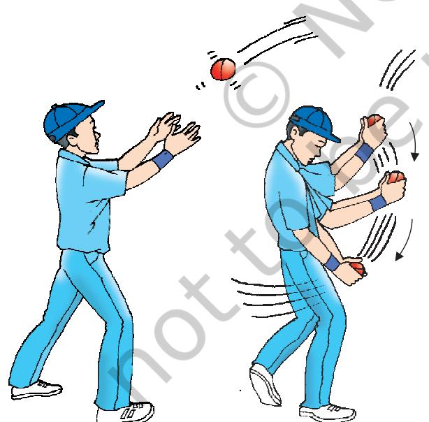

*v =* 13 m s-1 *Fig. 8.8: Fig. 8.8:Fig. 8.8: A fielder pulls his hands gradually with the* . *moving ball while holding a catch.*

*FORCE AND LAWS OF MOTION* 93

The first law of motion can be mathematically stated from the mathematical expression for the second law of motion. Eq. (8.4) is

$F=ma$  
  
or $F=\frac{m(v-u)}{t}$ (8.5)  
  
or $Ft=mv-mu$

That is, when *F* = 0, *v = u* for whatever time, *t* is taken. This means that the object will continue moving with uniform velocity, *u* throughout the time, *t*. If *u* is zero then *v* will also be zero. That is, the object will remain at rest.

Example 8.1 A constant force acts on an object of mass 5 kg for a duration of 2 s. It increases the object's velocity from 3 m s–1 to 7 m s-1. Find the magnitude of the applied force. Now, if the force was applied for a duration of 5 s, what would be the final velocity of the object?

#### Solution: Solution:Solution:

We have been given that *u* = 3 m s–1 and *v* = 7 m s-1 , *t* = 2 s and *m* = 5 kg. From Eq. (8.5) we have,

$$F={\frac{m\left(v-u\right)}{t}}$$

Substitution of values in this relation gives

*F* = 5 kg (7 m s-1 – 3 m s-1)/2 s = 10 N.

Now, if this force is applied for a duration of 5 s (*t* = 5 s), then the final velocity can be calculated by rewriting Eq. (8.5) as

$$v=u+{\frac{F t}{m}}$$

On substituting the values of *u, F, m* and *t,* we get the final velocity,

- Example 8.2 Which would require a greater force –– accelerating a 2 kg mass at 5 m s–2 or a 4 kg mass at 2 m s-2 ?
#### Solution:

From Eq. (8.4), we have *F = ma.* Here we have *m1 =* 2 kg; *a1* = 5 m s-2 and *m2 =* 4 kg; *a2* = 2 m s-2 . Thus, *F1* = *m1 a1 =* 2 kg × 5 m s-2 = 10 N; and *F2* = *m2 a2 =* 4 kg × 2 m s-2 = 8 N. ⇒ *F1* > *F2 .* Thus, accelerating a 2 kg mass at

- 5 m s-2 would require a greater force.
- Example 8.3 A motorcar is moving with a velocity of 108 km/h and it takes 4 s to stop after the brakes are applied. Calculate the force exerted by the brakes on the motorcar if its mass along with the passengers is 1000 kg.

#### Solution:

The initial velocity of the motorcar

*u* = 108 km/h

= 108 × 1000 m/(60 × 60 s)

= 30 m s-1

and the final velocity of the motorcar *v* = 0 m s-1 .

The total mass of the motorcar along with its passengers = 1000 kg and the time taken to stop the motorcar, *t* = 4 s. From Eq. (8.5) we have the magnitude of the force *(F) a*pplied by the brakes as *m(v – u)/t*.

On substituting the values, we get *F* = 1000 kg × (0 – 30) m s-1/4 s

= *–* 7500 kg m s-2 or *–* 7500 N. The negative sign tells us that the force exerted by the brakes is opposite to the direction of motion of the motorcar.

Example 8.4 A force of 5 N gives a mass *m1 ,* an acceleration of 10 m s–2 and a mass *m*2 *,* an acceleration of 20 m s-2 . What acceleration would it give if both the masses were tied together?

#### Solution:

From Eq. (8.4) we have *m1 = F/a1 ;* and *m2 = F/a2 .* Here, *a1 =* 10 m s-2; *a*2 = 20 m s-2 and *F* = 5 N. Thus, *m1 =* 5 N/10 m s-2 = 0.50 kg; and *m2 =* 5 N/20 m s-2 = 0.25 kg. If the two masses were tied together, the total mass, *m* would be *m =* 0.50 kg + 0.25 kg = 0.75 kg. The acceleration, *a* produced in the combined mass by the 5 N force would be, *a = F/m =* 5 N/0.75 kg = 6.67 m s-2 .

Example 8.5 The velocity-time graph of a ball of mass 20 g moving along a straight line on a long table is given in Fig. 8.9.

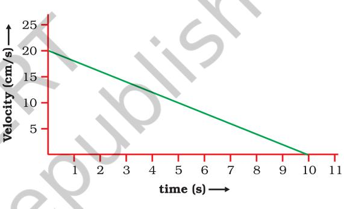

*Fig. 8.9*

How much force does the table exert on the ball to bring it to rest?

#### Solution:

The initial velocity of the ball is 20 cm s-1 . Due to the frictional force exerted by the table, the velocity of the ball decreases down to zero in 10 s. Thus, *u* = 20 cm s–1; *v* = 0 cm s-1 and *t =* 10 s. Since the velocity-time graph is a straight line, it is clear that the ball moves with a constant acceleration. The acceleration *a* is

$$\begin{array}{l}{{a=\frac{v-u}{t}}}\\ {{\mathrm{~=(0~cm~s^{\text{-1}}-20~cm~s^{\text{-1}})/10~s^{\text{-1}}}}}\\ {{\mathrm{~=-2~cm~s^{\text{-2}}=-0.02~m~s^{\text{-2}}.}}}\end{array}$$

.

The force exerted on the ball *F* is,

*F* = *ma* = (20/1000) kg × (– 0.02 m s-2) = – 0.0004 N.

The negative sign implies that the frictional force exerted by the table is opposite to the direction of motion of the ball.

## **8.5 Third Law of Motion**

The first two laws of motion tell us how an applied force changes the motion and provide us with a method of determining the force. The third law of motion states that when one object exerts a force on another object, the second object instantaneously exerts a force back on the first. These two forces are always equal in magnitude but opposite in direction. These forces act on different objects and never on the same object. In the game of football sometimes we, while looking at the football and trying to kick it with a greater force, collide with a player of the opposite team. Both feel hurt because each applies a force to the other. In other words, there is a pair of forces and not just one force. The two opposing forces are also known as action and reaction forces.

Let us consider two spring balances connected together as shown in Fig. 8.10. The fixed end of balance B is attached with a rigid support, like a wall. When a force is applied through the free end of spring balance A, it is observed that both the spring balances show the same readings on their scales. It means that the force exerted by spring balance A on balance B is equal but opposite in direction to the force exerted by the balance B on balance A. Any of these two forces can be called as *action* and the other as *reaction*. This gives us an alternative statement of the third law of motion i.e., to every action there is an equal and opposite reaction. However, it must be remembered that the action and reaction always act on two different objects, simultaneously.

*Fig. 8.10: Action and reaction forces are equal and opposite.*

Suppose you are standing at rest and intend to start walking on a road. You must accelerate, and this requires a force in accordance with the second law of motion. Which is this force? Is it the muscular effort you exert on the road? Is it in the direction we intend to move? No, you push the road below backwards. The road exerts an equal and opposite force on your feet to make you move forward.

It is important to note that even though the action and reaction forces are always equal in magnitude, these forces may not produce accelerations of equal magnitudes. This is because each force acts on a different object that may have a different mass.

When a gun is fired, it exerts a forward force on the bullet. The bullet exerts an equal and opposite force on the gun. This results in the recoil of the gun (Fig. 8.11). Since the gun has a much greater mass than the bullet, the acceleration of the gun is much less than the acceleration of the bullet. The third law of motion can also be illustrated when a sailor jumps out of a rowing boat. As the sailor jumps forward, the force on the boat moves it backwards (Fig. 8.12).

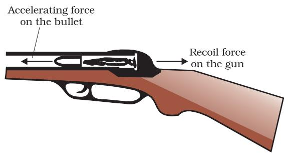

*Fig. 8.11: A forward force on the bullet and recoil of the gun.*

*Fig. 8.12: As the sailor jumps in forward direction, the boat moves backwards.*

# *Activity ______________ 8.4*

- Request two children to stand on two separate carts as shown in Fig. 8.13.
- Give them a bag full of sand or some other heavy object. Ask them to play a game of catch with the bag.
- Does each of them experience an instantaneous force as a result of throwing the sand bag?
- You can paint a white line on cartwheels to observe the motion of the two carts when the children throw the bag towards each other.

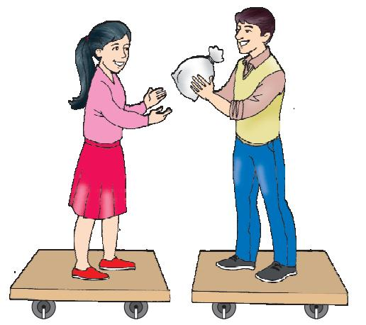

#### *Fig. 8.13*

Now, place two children on one cart and one on another cart. The second law of motion can be seen, as this arrangement would show different accelerations for the same force.

The cart shown in this activity can be constructed by using a 12 mm or 18 mm thick plywood board of about 50 cm × 100 cm with two pairs of hard ball-bearing wheels (skate wheels are good to use). Skateboards are not as effective because it is difficult to maintain straight-line motion.

# **What you have learnt**

- First law of motion: An object continues to be in a state of rest or of uniform motion along a straight line unless acted upon by an unbalanced force.
• The natural tendency of objects to resist a change in their state of rest or of uniform motion is called inertia.

• The mass of an object is a measure of its inertia. Its SI unit is kilogram (kg).

- Force of friction always opposes motion of objects.
- Second law of motion: The rate of change of momentum of an object is proportional to the applied unbalanced force in the direction of the force.
- The SI unit of force is kg m s–2. This is also known as newton and represented by the symbol N. A force of one newton produces an acceleration of 1 m s–2 on an object of mass 1 kg.
- The momentum of an object is the product of its mass and velocity and has the same direction as that of the velocity. Its SI unit is kg m s–1 .
- Third law of motion: To every action, there is an equal and opposite reaction and they act on two different bodies.

# **Exercises**

- 1. An object experiences a net zero external unbalanced force. Is it possible for the object to be travelling with a non-zero velocity? If yes, state the conditions that must be placed on
- 2. When a carpet is beaten with a stick, dust comes out of it, Explain.
- 3. Why is it advised to tie any luggage kept on the roof of a bus with a rope?
- 4. A batsman hits a cricket ball which then rolls on a level ground. After covering a short distance, the ball comes to rest. The ball slows to a stop because
	- (a) the batsman did not hit the ball hard enough.
	- (b) velocity is proportional to the force exerted on the ball.
	- (c) there is a force on the ball opposing the motion.
	- (d) there is no unbalanced force on the ball, so the ball would want to come to rest.
- 5. A truck starts from rest and rolls down a hill with a constant acceleration. It travels a distance of 400 m in 20 s. Find its acceleration. Find the force acting on it if its mass is 7 tonnes (*Hint*: 1 tonne = 1000 kg.)
- 6. A stone of 1 kg is thrown with a velocity of 20 m s–1 across the frozen surface of a lake and comes to rest after travelling a distance of 50 m. What is the force of friction between the stone and the ice?
- 7. A 8000 kg engine pulls a train of 5 wagons, each of 2000 kg, along a horizontal track. If the engine exerts a force of 40000 N and the track offers a friction force of 5000 N, then calculate:
	- (a) the net accelerating force and
	- (b) the acceleration of the train.
- 8. An automobile vehicle has a mass of 1500 kg. What must be the force between the vehicle and road if the vehicle is to be

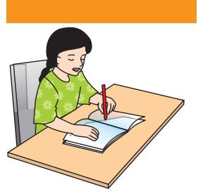

stopped with a negative acceleration of 1.7 m s–2?

- 9. What is the momentum of an object of mass *m,* moving with a velocity *v*?
(a) (*mv*) 2 (b) *mv*2 (c) ½ *mv*2 (d) *mv*

- 10. Using a horizontal force of 200 N, we intend to move a wooden cabinet across a floor at a constant velocity. What is the friction force that will be exerted on the cabinet?
- 11. According to the third law of motion when we push on an object, the object pushes back on us with an equal and opposite force. If the object is a massive truck parked along the roadside, it will probably not move. A student justifies this by answering that the two opposite and equal forces cancel each other. Comment on this logic and explain why the truck does not move.
- 12. A hockey ball of mass 200 g travelling at 10 m s–1 is struck by a hockey stick so as to return it along its original path with a velocity at 5 m s–1. Calculate the magnitude of change of momentum occurred in the motion of the hockey ball by the force applied by the hockey stick.
- 13. A bullet of mass 10 g travelling horizontally with a velocity of 150 m s–1 strikes a stationary wooden block and comes to rest in 0.03 s. Calculate the distance of penetration of the bullet into the block. Also calculate the magnitude of the force exerted by the wooden block on the bullet.
- 14. An object of mass 1 kg travelling in a straight line with a velocity of 10 m s–1 collides with, and sticks to, a stationary wooden block of mass 5 kg. Then they both move off together in the same straight line. Calculate the total momentum just before the impact and just after the impact. Also, calculate the velocity of the combined object.
- 15. An object of mass 100 kg is accelerated uniformly from a velocity of 5 m s–1 to 8 m s–1 in 6 s. Calculate the initial and final momentum of the object. Also, find the magnitude of the force exerted on the object.
- 16. Akhtar, Kiran and Rahul were riding in a motorcar that was moving with a high velocity on an expressway when an insect hit the windshield and got stuck on the windscreen. Akhtar and Kiran started pondering over the situation. Kiran suggested that the insect suffered a greater change in momentum as compared to the change in momentum of the motorcar (because the change in the velocity of the insect was much more than that of the motorcar). Akhtar said that since the motorcar was moving with a larger velocity, it exerted a larger force on the insect. And as a result the insect died. Rahul while putting an entirely new explanation

said that both the motorcar and the insect experienced the same force and a change in their momentum. Comment on these suggestions.

- 17. How much momentum will a dumb-bell of mass 10 kg transfer to the floor if it falls from a height of 80 cm? Take its downward acceleration to be 10 m s–2 .
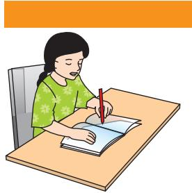

# **Additional Exercises**

- A1. The following is the distance-time table of an object in motion:

| Time in seconds | Distance in metres |
| --- | --- |
| 0 | 0 |
| 1 | 1 |
| 2 | 8 |
| 3 | 27 |
| 4 | 64 |
| 5 | 125 |
| 6 | 216 |
| 7 | 343 |

- (a) What conclusion can you draw about the acceleration? Is it constant, increasing, decreasing, or zero?
- (b) What do you infer about the forces acting on the object?
- A2. Two persons manage to push a motorcar of mass 1200 kg at a uniform velocity along a level road. The same motorcar can be pushed by three persons to produce an acceleration of 0.2 m s-2. With what force does each person push the motorcar? (Assume that all persons push the motorcar with the same muscular effort.)
- A3. A hammer of mass 500 g, moving at 50 m s-1, strikes a nail. The nail stops the hammer in a very short time of 0.01 s. What is the force of the nail on the hammer?
- A4. A motorcar of mass 1200 kg is moving along a straight line with a uniform velocity of 90 km/h. Its velocity is slowed down to 18 km/h in 4 s by an unbalanced external force. Calculate the acceleration and change in momentum. Also calculate the magnitude of the force required.

*FORCE AND LAWS OF MOTION* **99**

