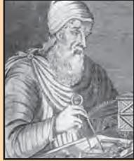

# **9** Chapter

We have learnt about the motion of objects and force as the cause of motion. We have learnt that a force is needed to change the speed or the direction of motion of an object. We always observe that an object dropped from a height falls towards the earth. We know that all the planets go around the Sun. The moon goes around the earth. In all these cases, there must be some force acting on the objects, the planets and on the moon. Isaac Newton could grasp that the same force is responsible for all these. This force is called the gravitational force.

In this chapter we shall learn about gravitation and the universal law of gravitation. We shall discuss the motion of objects under the influence of gravitational force on the earth. We shall study how the weight of a body varies from place to place. We shall also discuss the conditions for objects to float in liquids.

## **9.1 Gravitation**

We know that the moon goes around the earth. An object when thrown upwards, reaches a certain height and then falls downwards. It is said that when Newton was sitting under a tree, an apple fell on him. The fall of the apple made Newton start thinking. He thought that: if the earth can attract an apple, can it not attract the moon? Is the force the same in both cases? He conjectured that the same type of force is responsible in both the cases. He argued that at each point of its orbit, the moon falls towards the earth, instead of going off in a straight line. So, it must be attracted by the earth. But we do not really see the moon falling towards the earth.

Let us try to understand the motion of the moon by recalling activity 7.11.

### *Activity ______________ 9.1*

- Take a piece of thread.
- Tie a small stone at one end. Hold the other end of the thread and whirl it round, as shown in Fig. 9.1.
- Note the motion of the stone.
- Release the thread.
- Again, note the direction of motion of the stone.

*Fig. 9.1: A stone describing a circular path with a velocity of constant magnitude.*

Before the thread is released, the stone moves in a circular path with a certain speed and changes direction at every point. The change in direction involves change in velocity or acceleration. The force that causes this acceleration and keeps the body moving along the circular path is acting towards the centre. This force is called the centripetal (meaning 'centre-seeking') force.

**100** *SCIENCE*

In the absence of this force, the stone flies off along a straight line. This straight line will be a tangent to the circular path.

The motion of the moon around the earth is due to the centripetal force. The centripetal force is provided by the force of attraction of the earth. If there were no such force, the moon would pursue a uniform straight line motion.

It is seen that a falling apple is attracted towards the earth. Does the apple attract the earth? If so, we do not see the earth moving towards an apple. Why?

According to the third law of motion, the apple does attract the earth. But according to the second law of motion, for a given force, acceleration is inversely proportional to the mass of an object [Eq. (8.4)]. The mass of an apple is negligibly small compared to that of the earth. So, we do not see the earth moving towards the apple. Extend the same argument for why the earth does not move towards the moon.

In our solar system, all the planets go around the Sun. By arguing the same way, we can say that there exists a force between the Sun and the planets. From the above facts Newton concluded that not only does the earth attract an apple and the moon, but all objects in the universe attract each other. This force of attraction between objects is called the gravitational force.

### **9.1.1 UNIVERSAL LAW OF GRAVITATION**

Every object in the universe attracts every other object with a force which is proportional to the product of their masses and inversely proportional to the square of the distance between them. The force is along the line joining the centres of two objects.

Let two objects A and B of masses *M* and *m* lie at a distance *d* from each other as shown in Fig. 9.2. Let the force of attraction between two objects be *F.* According to the universal law of gravitation, the force between two objects is directly proportional to the product of their masses. That is,

$F\propto M\times m$ (9.1)

And the force between two objects is inversely proportional to the square of the distance between them, that is,

$F\propto\frac{1}{d^{2}}$ (9.2)

Combining Eqs. (10.1) and (10.2), we get

$F\propto\frac{M\times m}{d^{2}}$ (9.3)

$$or, F=G\frac{M\times m}{d^{\,2}} (9.4)$$

where G is the constant of proportionality and is called the universal gravitation constant. By multiplying crosswise, Eq. (9.4) gives

 *F* × *d 2 =* G *M* × *m*

*GRAVITATION* **101**

or $\mathbf{G}=\frac{F\,d^{\,2}}{M\times m}$ (9.5)

The SI unit of G can be obtained by substituting the units of force, distance and mass in Eq. (9.5) as N m2 kg–2 .

The value of G was found out by Henry Cavendish (1731 – 1810) by using a sensitive balance. The accepted value of G is 6.673 × 10–11 N m2 kg–2 .

We know that there exists a force of attraction between any two objects. Compute the value of this force between you and your friend sitting closeby. Conclude how you do not experience this force!

> The law is universal in the sense that it is applicable to all bodies, whether the bodies are big or small, whether they are celestial or terrestrial.

#### Inverse-square

Saying that *F* is inversely proportional to the square of *d* means, for example, that if *d* gets bigger by a factor of 6, *F* becomes

1 36 times smaller.

- Example 9.1 The mass of the earth is 6 × 1024 kg and that of the moon is 7.4 × 1022 kg. If the distance between the earth and the moon is 3.84×105 km, calculate the force exerted by the earth on the moon. (Take G = 6.7 × 10–11 N m2 kg-2)
#### Solution:

**More to know**

The mass of the earth, *M* = 6 × 1024 kg The mass of the moon,

*m* = 7.4 × 1022 kg

The distance between the earth and the moon,

- *d* = 3.84 × 105 km = 3.84 × 105 × 1000 m = 3.84 × 108 m G = 6.7 × 10–11 N m2 kg–2
From Eq. (9.4), the force exerted by the earth on the moon is

$$F=\mathrm{G}\ {\frac{M\times m}{d^{2}}}$$

$$={\frac{6.7\times10^{-11}\mathrm{\,N\,m^{2}\,kg^{\cdot2}}\times6\times10^{24}\mathrm{\,kg\times7.4\times10^{22}\,kg}}{\left(3.84\times10^{8}\mathrm{\,m}\right)^{2}}}$$

= 2.02 × 1020 N.

Thus, the force exerted by the earth on the moon is 2.02 × 1020 N.

# uestions

- *1. State the universal law of gravitation.*
- *2. Write the formula to find the magnitude of the gravitational force between the earth and an object on the surface of the earth.* Q

### **9.1.2 IMPORTANCE OF THE UNIVERSAL LAW OF GRAVITATION**

The universal law of gravitation successfully explained several phenomena which were believed to be unconnected:

- (i) the force that binds us to the earth;
- (ii) the motion of the moon around the earth;
- (iii) the motion of planets around the Sun; and
- (iv) the tides due to the moon and the Sun.

## **9.2 Free Fall**

Let us try to understand the meaning of free fall by performing this activity.

#### Activity ActivityActivity 9.2

- Take a stone.
- Throw it upwards.
- It reaches a certain height and then it starts falling down.

We have learnt that the earth attracts objects towards it. This is due to the gravitational force. Whenever objects fall towards the earth under this force alone, we say that the objects are in free fall. Is there any change in the velocity of falling objects? While falling, there is no change in the direction of motion of the objects. But due to the earth's attraction, there will be a change in the magnitude of the velocity. Any change in velocity involves acceleration. Whenever an object falls towards the earth, an acceleration is involved. This acceleration is due to the earth's gravitational force. Therefore, this acceleration is called the acceleration due to the gravitational force of the earth (or acceleration due to gravity). It is denoted by *g*. The unit of *g* is the same as that of acceleration, that is, m s–2 .

We know from the second law of motion that force is the product of mass and acceleration. Let the mass of the stone in activity 9.2 be *m*. We already know that there is acceleration involved in falling objects due to the gravitational force and is denoted by *g*. Therefore the magnitude of the gravitational force *F* will be equal to the product of mass and acceleration due to the gravitational force, that is,

*F = m g* (9.6)

From Eqs. (9.4) and (9.6) we have

$m\,g=\,$G$\frac{M\times m}{d^{2}}$  
  
or $g=\,$G$\frac{M}{d^{2}}$

where *M* is the mass of the earth, and *d* is the distance between the object and the earth.

Let an object be on or near the surface of the earth. The distance *d* in Eq. (9.7) will be equal to *R*, the radius of the earth. Thus, for objects on or near the surface of the earth,

$mg=$G$\frac{M\times m}{R^{2}}$ (9.8)

$g=$G (9.9)

The earth is not a perfect sphere. As the radius of the earth increases from the poles to the equator, the value of *g* becomes greater at the poles than at the equator. For most

*GRAVITATION* 103

calculations, we can take *g* to be more or less constant on or near the earth. But for objects far from the earth, the acceleration due to gravitational force of earth is given by Eq. (9.7).

### **9.2.1 TO CALCULATE THE VALUE OF** *g*

To calculate the value of *g*, we should put the values of G, *M* and *R* in Eq. (9.9), namely, universal gravitational constant, G = 6.7 ×10–11 N m2 kg-2 , mass of the earth, *M* = 6 × 1024 kg, and radius of the earth, *R* = 6.4 × 106 m.

$$\begin{array}{c}{{g=\mathrm{G~}\frac{M}{R^{2}}}}\\ {{\cdot}}\\ {{=\frac{6.7\times10^{\cdot11}\mathrm{~N}\,\mathrm{m}^{2}\,\mathrm{kg}^{\cdot2}\times6\times10^{24}\,\mathrm{kg}}{(6.4\times10^{6}\,\mathrm{m})^{2}}}}\\ {{\cdot}}\\ {{\neq9.8\mathrm{~m}\mathrm{~s}^{\cdot2}.}}\end{array}$$

Thus, the value of acceleration due to gravity of the earth, *g* = 9.8 m s–2 .

### **9.2.2 MOTION OF OBJECTS UNDER THE INFLUENCE OF GRAVITATIONAL FORCE OF THE EARTH**

Let us do an activity to understand whether all objects hollow or solid, big or small, will fall from a height at the same rate.

#### Activity 9.3

- Take a sheet of paper and a stone. Drop them simultaneously from the first floor of a building. Observe whether both of them reach the ground simultaneously.
- We see that paper reaches the ground little later than the stone. This happens because of air resistance. The air offers resistance due to friction to the motion of the falling objects. The resistance offered by air to the paper is more than the resistance offered to the stone. If we do the experiment in a glass jar from which air has been sucked out, the paper and the stone would fall at the same rate.

We know that an object experiences acceleration during free fall. From Eq. (9.9), this acceleration experienced by an object is independent of its mass. This means that all objects hollow or solid, big or small, should fall at the same rate. According to a story, Galileo dropped different objects from the top of the Leaning Tower of Pisa in Italy to prove the same.

As *g* is constant near the earth, all the equations for the uniformly accelerated motion of objects become valid with acceleration *a* replaced by *g*. The equations are:

$\omega=u+at$ (9.10)

$\mathbf{s}=ut+\frac{1}{2}\;at^{2}$ (9.11)

$\omega^{2}=\omega^{2}+2as$ (9.12)

where *u* and *v* are the initial and final velocities and *s* is the distance covered in time, *t*.

In applying these equations, we will take acceleration, *a* to be positive when it is in the direction of the velocity, that is, in the direction of motion. The acceleration, *a* will be taken as negative when it opposes the motion.

Example 9.2 A car falls off a ledge and drops to the ground in 0.5 s. Let

*g* = 10 m s–2 (for simplifying the calculations).

- (i) What is its speed on striking the ground?
- (ii) What is its average speed during the 0.5 s?
- (iii) How high is the ledge from the ground?

#### Solution:

 Time, *t* = ½ second Initial velocity, *u* = 0 m s–1 Acceleration due to gravity, *g* = 10 m s–2 Acceleration of the car, *a* = + 10 m s–2 (downward)

  
  
**(i) speed $\upsilon$ = $a\,t$ $\upsilon$ = 10 m s${}^{-2}\times0.5$ s${}^{-1}$ = 5 m s${}^{-1}$**

  
(ii) average speed=$\dfrac{u+v}{2}$  
  
(iii) distance travelled, s = 1⁄2 $a\;{t}^{2}$  
  
(iv) = 1⁄2 × 10 m s$^{\text{-2}}\times\text{(0.5s)}^{2}$  
  
(v) = 1⁄2 × 10 m s$^{\text{-2}}\times\text{0.25s}^{\text{2}}$  
  
Thus,  
  
(v) = 0 m s$^{\text{-1}}$+ 5 m s$^{\text{-1}}$)/2  
  
(viii) distance travelled, s = 1⁄2 $a\;{t}^{2}$  
  
(v) = 1⁄2 × 10 m s$^{\text{-2}}\times\text{(0.5s)}^{2}$  
  
(v) = 1⁄2 × 10 m s$^{\text{-2}}\times\text{0.25s}^{\text{2}}$  
  
Thus,  
  
(viii) 2. 

- (i) its speed on striking the ground = 5 m s–1
- (ii) its average speed during the 0.5 s = 2.5 m s–1
- (iii) height of the ledge from the ground = 1.25 m.

Example 9.3 An object is thrown vertically upwards and rises to a height of 10 m. Calculate (i) the velocity with which the object was thrown upwards and (ii) the time taken by the object to reach the highest point.

#### Solution:

Distance travelled, *s* = 10 m Final velocity, *v* = 0 m s–1 Acceleration due to gravity, *g* = 9.8 m s–2 Acceleration of the object, *a* = –9.8 m s–2

(upward motion)  
  
(i) $\upsilon^{\,2}=u^{2}+2a$ s  
  
0 = u ${}^{\,2}+2\times$ (-9.8 m s${}^{-2}$)$\times$ 10 m  
  
-u ${}^{\,2}=-2\times$ 9.8 $\times$ 10 m${}^{2}$ s${}^{-2}$

$$u={\begin{array}{r l}{{\sqrt{196}}\ {\mathrm{m\s^{\cdot1}}}}\end{array}}$$

$$u=14{\mathrm{~m~s^{\cdot1}}}$$

- (ii) *v* = *u* + *a t* 0 = 14 m s–1 – 9.8 m s–2 × *t t* = 1.43 s.
Thus,

- (i) Initial velocity, *u* = 14 m s–1, and
- (ii) Time taken, *t* = 1.43 s.

# uestions

- *1. What do you mean by free fall?*
- *2. What do you mean by acceleration* Q *due to gravity?*

### **9.3 Mass**

We have learnt in the previous chapter that the mass of an object is the measure of its inertia . We have also learnt that greater the mass, the greater is the inertia. It remains the same whether the object is on the earth, the moon or even in outer space. Thus, the mass of an object is constant and does not change from place to place.

### **9.4 Weight**

We know that the earth attracts every object with a certain force and this force depends on the mass (*m*) of the object and the acceleration due to the gravity (*g*). The weight of an object is the force with which it is attracted towards the earth.

We know that

| F = m | × a, | (9.13) |
| --- | --- | --- |
| that is, |  |  |
| F = m | × g. | (9.14) |

The force of attraction of the earth on an object is known as the weight of the object. It is denoted by *W*. Substituting the same in Eq. (9.14), we have

| W = m |  |  |
| --- | --- | --- |
|  | × g | (9.15) |

As the weight of an object is the force with which it is attracted towards the earth, the SI unit of weight is the same as that of force, that is, newton (N). The weight is a force acting vertically downwards; it has both magnitude and direction.

We have learnt that the value of *g* is constant at a given place. Therefore at a given place, the weight of an object is directly proportional to the mass, say *m*, of the object, that is, *W* ∝ *m*. It is due to this reason that at a given place, we can use the weight of an object as a measure of its mass. The mass of an object remains the same everywhere, that is, on the earth and on any planet whereas its weight depends on its location because *g* depends on location.

### **9.4.1 WEIGHT OF AN OBJECT ON THE MOON**

We have learnt that the weight of an object on the earth is the force with which the earth

*GRAVITATION* **105**

attracts the object. In the same way, the weight of an object on the moon is the force with which the moon attracts that object. The mass of the moon is less than that of the earth. Due to this the moon exerts lesser force of attraction on objects.

Let the mass of an object be *m*. Let its weight on the moon be *Wm* . Let the mass of the moon be *Mm* and its radius be *Rm* .

By applying the universal law of gravitation, the weight of the object on the moon will be

$W_{m}=$G$\frac{M_{m}\times m}{R_{m}^{2}}$ (9.16)

Let the weight of the same object on the earth be *We* . The mass of the earth is *M* and its radius is *R.*

| Table 9.1 |  |  |
| --- | --- | --- |
| Celestial | Mass (kg) | Radius (m) |
| body |  |  |
| Earth | 5.98 × 1024 | 6.37 ××106 |
| Moon | 7.36 ××1022 | 1.74 ××106 |

From Eqs. (9.9) and (9.15) we have,

$\left(\begin{array}{c}\includegraphics[height=36.135pt]{fig1.eps}\end{array}\right)$

Substituting the values from Table 10.1 in Eqs. (9.16) and (9.17), we get

$$W_{m}=\mathbf{G}\frac{7.36\times10^{22}\,\mathrm{kg}\times m}{\left(1.74\times10^{6}\,\mathrm{m}\right)^{2}}W_{m}=2.431\times10^{10}\,\mathrm{G}\times m (9.18a)$$

and $W_{e}=1.474\times10^{11}$G $\times$ $m$ (9.18b)

Dividing Eq. (9.18a) by Eq. (9.18b), we get

$$\frac{W_{m}}{W_{e}}=\frac{2.431\times10^{10}}{1.474\times10^{11}}$$
  
  
or $\frac{W_{m}}{W_{e}}=0.165\approx\frac{1}{6}$ (9.19)

Weight of the object on the moon  
  
Weight of the object on the earth = $\frac{1}{\alpha}$

Weight of theobject on theearth 6 Weight of the object on the moon

= (1/6) × its weight on the earth.

**Example 9.4** Mass of an object is 10 kg. What is its weight on the earth?

#### **Solution:**

Mass, *m* = 10 kg Acceleration due to gravity, *g* = 9.8 m s–2 *W = m* × *g W* = 10 kg × 9.8 m s-2 = 98 N Thus, the weight of the object is 98 N.

**Example 9.5** An object weighs 10 N when measured on the surface of the earth. What would be its weight when measured on the surface of the moon?

#### **Solution:**

We know,

Weight of object on the moon = (1/6) × its weight on the earth.

That is,

10 6 6 *e m W W = =* N. = 1.67 N.

Thus, the weight of object on the surface of the moon would be 1.67 N.

# uestions

- *1. What are the differences between the mass of an object and its weight?* Q
	- *2. Why is the weight of an object on*

*the moon*  1 6 *th its weight on the earth?*

### **9.5 Thrust and Pressure**

Have you ever wondered why a camel can run in a desert easily? Why an army tank weighing more than a thousand tonne rests upon a continuous chain? Why a truck or a motorbus has much wider tyres? Why cutting tools have sharp edges? In order to address these questions and understand the phenomena involved, it helps to introduce the concepts of the net force in a particular direction (thrust) and the force per unit area (pressure) acting on the object concerned.

Let us try to understand the meanings of thrust and pressure by considering the following situations:

**Situation 1:** You wish to fix a poster on a bulletin board, as shown in Fig 9.3. To do this task you will have to press drawing pins with your thumb. You apply a force on the surface area of the head of the pin. This force is directed perpendicular to the surface area of the board. This force acts on a smaller area at the tip of the pin.

*Fig. 9.3: To fix a poster, drawing pins are pressed with the thumb perpendicular to the board.*

**Situation 2:** You stand on loose sand. Your feet go deep into the sand. Now, lie down on the sand. You will find that your body will not go that deep in the sand. In both cases the force exerted on the sand is the weight of your body.

You have learnt that weight is the force acting vertically downwards. Here the force is acting perpendicular to the surface of the sand. The force acting on an object perpendicular to the surface is called thrust.

When you stand on loose sand, the force, that is, the weight of your body is acting on an area equal to area of your feet. When you lie down, the same force acts on an area equal to the contact area of your whole body, which is larger than the area of your feet. Thus, the effects of forces of the same magnitude on different areas are different. In the above cases, thrust is the same. But effects are different. Therefore the effect of thrust depends on the area on which it acts.

The effect of thrust on sand is larger while standing than while lying. The thrust on unit area is called pressure. Thus,

Pressure = $\frac{\text{thrust}}{\text{area}}$ (9.20)

Substituting the SI unit of thrust and area in Eq. (9.20), we get the SI unit of pressure as N/ m2 or N m–2 .

In honour of scientist Blaise Pascal, the SI unit of pressure is called pascal, denoted as Pa.

Let us consider a numerical example to understand the effects of thrust acting on different areas.

**Example 9.6** A block of wood is kept on a tabletop. The mass of wooden block is 5 kg and its dimensions are 40 cm × 20 cm × 10 cm. Find the pressure exerted

by the wooden block on the table top if it is made to lie on the table top with its sides of dimensions (a) 20 cm × 10 cm and (b) 40 cm × 20 cm.

#### **Solution:**

The mass of the wooden block = 5 kg The dimensions

= 40 cm × 20 cm × 10 cm Here, the weight of the wooden block applies a thrust on the table top.

That is, Thrust = *F = m* × *g* = 5 kg × 9.8 m s–2 = 49 N Area of a side = length × breadth = 20 cm × 10 cm = 200 cm2 = 0.02 m2

From Eq. (9.20),

$\frac{49\mathrm{N}}{2}$

Pressure = 0.02 m2

= 2450 N m-2 .

When the block lies on its side of dimensions 40 cm × 20 cm, it exerts the same thrust.

$$\begin{array}{r l}{{\mathrm{Area}}={\mathrm{length}}\times{\mathrm{breadth}}}\\ {=}\ \ \ 40\ {\mathrm{cm}}\times20\ {\mathrm{cm}}\end{array}$$

$$\begin{array}{r l}{p}&{{}={}}&{{}800{\mathrm{~cm}}^{2}=0.08{\mathrm{~m}}^{2}}\end{array}$$

From Eq. (9.20),

  
Pressure = $\mathbf{\dfrac{49\,N}{0.08\,m^2}}$  
  
= 612.5 N m–2  
  
The pressure exerted by the side 20 cm × 10 cm is 2450 N m–2 and by the side.  

× 10 cm is 2450 N m–2 and by the side 40 cm × 20 cm is 612.5 N m–2 .

Thus, the same force acting on a smaller area exerts a larger pressure, and a smaller pressure on a larger area. This is the reason why a nail has a pointed tip, knives have sharp edges and buildings have wide foundations.

### **9.5.1 PRESSURE IN FLUIDS**

All liquids and gases are fluids. A solid exerts pressure on a surface due to its weight. *Fig. 9.4* Similarly, fluids have weight, and they also

*GRAVITATION* **107**

exert pressure on the base and walls of the container in which they are enclosed. Pressure exerted in any confined mass of fluid is transmitted undiminished in all directions.

### **9.5.2 BUOYANCY**

Have you ever had a swim in a pool and felt lighter? Have you ever drawn water from a well and felt that the bucket of water is heavier when it is out of the water? Have you ever wondered why a ship made of iron and steel does not sink in sea water, but while the same amount of iron and steel in the form of a sheet would sink? These questions can be answered by taking buoyancy in consideration. Let us understand the meaning of buoyancy by doing an activity.

### *Activity ______________ 9.4*

- Take an empty plastic bottle. Close the mouth of the bottle with an airtight stopper. Put it in a bucket filled with water. You see that the bottle floats.
- Push the bottle into the water. You feel an upward push. Try to push it further down. You will find it difficult to push deeper and deeper. This indicates that water exerts a force on the bottle in the upward direction. The upward force exerted by the water goes on increasing as the bottle is pushed deeper till it is completely immersed.
- Now, release the bottle. It bounces back to the surface.
- Does the force due to the gravitational attraction of the earth act on this bottle? If so, why doesn't the bottle stay immersed in water after it is released? How can you immerse the bottle in water?

The force due to the gravitational attraction of the earth acts on the bottle in the downward direction. So the bottle is pulled downwards. But the water exerts an upward force on the bottle. Thus, the bottle is pushed upwards. We have learnt that weight of an object is the force due to gravitational attraction of the earth. When the bottle is immersed, the upward force exerted by the water on the bottle is greater than its weight. Therefore it rises up when released.

To keep the bottle completely immersed, the upward force on the bottle due to water must be balanced. This can be achieved by an externally applied force acting downwards. This force must at least be equal to the difference between the upward force and the weight of the bottle.

The upward force exerted by the water on the bottle is known as upthrust or buoyant force. In fact, all objects experience a force of buoyancy when they are immersed in a fluid. The magnitude of this buoyant force depends on the density of the fluid.

### **9.5.3 WHY OBJECTS FLOAT OR SINK WHEN PLACED ON THE SURFACE OF WATER?**

Let us do the following activities to arrive at an answer for the above question.

### *Activity ______________ 9.5*

- Take a beaker filled with water.
- Take an iron nail and place it on the
	- surface of the water.
- Observe what happens.

The nail sinks. The force due to the gravitational attraction of the earth on the iron nail pulls it downwards. There is an upthrust of water on the nail, which pushes it upwards. But the downward force acting on the nail is greater than the upthrust of water on the nail. So it sinks (Fig. 9.5).

*Fig. 9.5: An iron nail sinks and a cork floats when placed on the surface of water.*

### *Activity ______________ 9.6*

- Take a beaker filled with water.
- Take a piece of cork and an iron nail of equal mass.
- Place them on the surface of water.
- Observe what happens.

The cork floats while the nail sinks. This happens because of the difference in their densities. The density of a substance is defined as the mass per unit volume. The density of cork is less than the density of water. This means that the upthrust of water on the cork is greater than the weight of the cork. So it floats (Fig. 9.5).

The density of an iron nail is more than the density of water. This means that the upthrust of water on the iron nail is less than the weight of the nail. So it sinks.

Therefore objects of density less than that of a liquid float on the liquid. The objects of density greater than that of a liquid sink in the liquid.

# uestions

- *1. Why is it difficult to hold a school bag having a strap made of a thin and strong string?* Q
	- *2. What do you mean by buoyancy?*
	- *3. Why does an object float or sink when placed on the surface of water?*

### **9.6 Archimedes' Principle**

### *Activity ______________ 9.7*

- Take a piece of stone and tie it to one end of a rubber string or a spring balance.
- Suspend the stone by holding the balance or the string as shown in Fig. 9.6 (a).
- Note the elongation of the string or the reading on the spring balance due to the weight of the stone.
- Now, slowly dip the stone in the water in a container as shown in Fig. 9.6 (b).

- *Fig. 9.6: (a) Observe the elongation of the rubber string due to the weight of a piece of stone suspended from it in air. (b) The elongation decreases as the stone is immersed in water.*
	- Observe what happens to elongation of the string or the reading on the balance.

You will find that the elongation of the string or the reading of the balance decreases as the stone is gradually lowered in the water. However, no further change is observed once the stone gets fully immersed in the water. What do you infer from the decrease in the extension of the string or the reading of the spring balance?

We know that the elongation produced in the string or the spring balance is due to the weight of the stone. Since the extension decreases once the stone is lowered in water, it means that some force acts on the stone in upward direction. As a result, the net force on the string decreases and hence the elongation also decreases. As discussed earlier, this upward force exerted by water is known as the force of buoyancy.

What is the magnitude of the buoyant force experienced by a body? Is it the same in all fluids for a given body? Do all bodies in a given fluid experience the same buoyant force? The answer to these questions is contained in Archimedes' principle, stated as follows:

*When a body is immersed fully or partially in a fluid, it experiences an upward force that is equal to the weight of the fluid displaced by it.*

Now, can you explain why a further decrease in the elongation of the string was not observed in activity 9.7, as the stone was fully immersed in water?

Archimedes was a Greek scientist. He discovered the principle, subsequently named

after him, after noticing that the water in a bathtub overflowed when he stepped into it. He ran through the streets shouting "Eureka!", which means "I have got it". This knowledge helped him to determine the purity of the gold in the crown made for

*Archimedes*

the king.

His work in the field of Geometry and Mechanics made him famous. His understanding of levers, pulleys, wheelsand-axle helped the Greek army in its war with Roman army.

Archimedes' principle has many applications. It is used in designing ships and submarines. Lactometers, which are used to determine the purity of a sample of milk and hydrometers used for determining density of liquids, are based on this principle.

# uestions

- *1. You find your mass to be 42* kg *on a weighing machine. Is your mass more or less than 42* kg*?*
- Q *2. You have a bag of cotton and an iron bar, each indicating a mass of 100* kg *when measured on a weighing machine. In reality, one is heavier than other. Can you say which one is heavier and why?*

# **What**

**you have learnt**

- The law of gravitation states that the force of attraction between any two objects is proportional to the product of their masses and inversely proportional to the square of the distance between them. The law applies to objects anywhere in the universe. Such a law is said to be universal.
- Gravitation is a weak force unless large masses are involved.
- The force of gravity decreases with altitude. It also varies on the surface of the earth, decreasing from poles to the equator.
- The weight of a body is the force with which the earth attracts it.
- The weight is equal to the product of mass and acceleration due to gravity.
- The weight may vary from place to place but the mass stays constant.
- All objects experience a force of buoyancy when they are immersed in a fluid.
- Objects having density less than that of the liquid in which they are immersed, float on the surface of the liquid. If the density of the object is more than the density of the liquid in which it is immersed then it sinks in the liquid.

# **Exercises**

- 1. How does the force of gravitation between two objects change when the distance between them is reduced to half ?
- 2. Gravitational force acts on all objects in proportion to their masses. Why then, a heavy object does not fall faster than a light object?
- 3. What is the magnitude of the gravitational force between the earth and a 1 kg object on its surface? (Mass of the earth is 6 × 1024 kg and radius of the earth is 6.4 × 106 m.)
- 4. The earth and the moon are attracted to each other by gravitational force. Does the earth attract the moon with a force that is greater or smaller or the same as the force with which the moon attracts the earth? Why?
- 5. If the moon attracts the earth, why does the earth not move towards the moon?
- 6. What happens to the force between two objects, if
	- (i) the mass of one object is doubled?
	- (ii) the distance between the objects is doubled and tripled?
	- (iii) the masses of both objects are doubled?
- 7. What is the importance of universal law of gravitation?
- 8. What is the acceleration of free fall?
- 9. What do we call the gravitational force between the earth and an object?
- 10. Amit buys few grams of gold at the poles as per the instruction of one of his friends. He hands over the same when he meets him at the equator. Will the friend agree with the weight of gold bought? If not, why? [*Hint*: The value of *g* is greater at the poles than at the equator.]
- 11. Why will a sheet of paper fall slower than one that is crumpled into a ball?
- 12. Gravitational force on the surface of the moon is only 1 6 as

strong as gravitational force on the earth. What is the weight in newtons of a 10 kg object on the moon and on the earth?

- 13. A ball is thrown vertically upwards with a velocity of 49 m/s. Calculate
	- (i) the maximum height to which it rises,
	- (ii) the total time it takes to return to the surface of the earth.
- 14. A stone is released from the top of a tower of height 19.6 m. Calculate its final velocity just before touching the ground.
- 15. A stone is thrown vertically upward with an initial velocity of 40 m/s. Taking *g* = 10 m/s2 , find the maximum height reached by the stone. What is the net displacement and the total distance covered by the stone?
- 16. Calculate the force of gravitation between the earth and the Sun, given that the mass of the earth = 6 × 1024 kg and of the Sun = 2 × 1030 kg. The average distance between the two is 1.5 × 1011 m.
- 17. A stone is allowed to fall from the top of a tower 100 m high and at the same time another stone is projected vertically upwards from the ground with a velocity of 25 m/s. Calculate when and where the two stones will meet.
- 18. A ball thrown up vertically returns to the thrower after 6 s. Find
	- (a) the velocity with which it was thrown up,
	- (b) the maximum height it reaches, and
	- (c) its position after 4 s.
- 19. In what direction does the buoyant force on an object immersed in a liquid act?
- 20. Why does a block of plastic released under water come up to the surface of water?
- 21. The volume of 50 g of a substance is 20 cm3 . If the density of water is 1 g cm–3, will the substance float or sink?
- 22. The volume of a 500 g sealed packet is 350 cm3 . Will the packet float or sink in water if the density of water is 1 g cm–3? What will be the mass of the water displaced by this packet?

