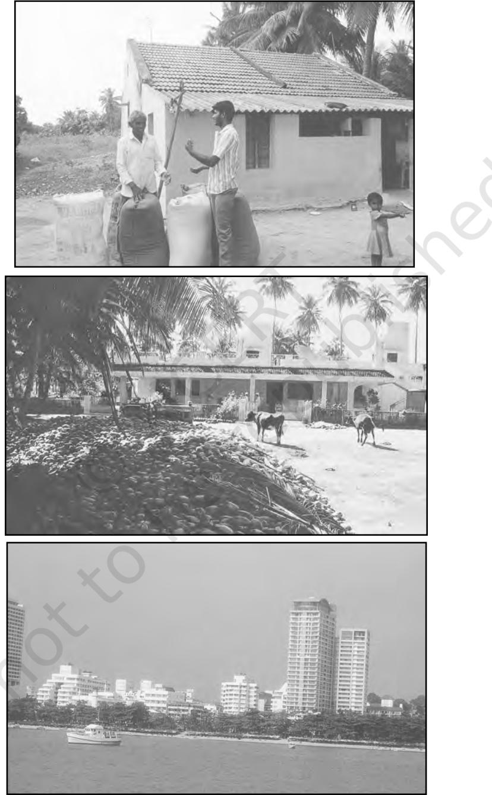
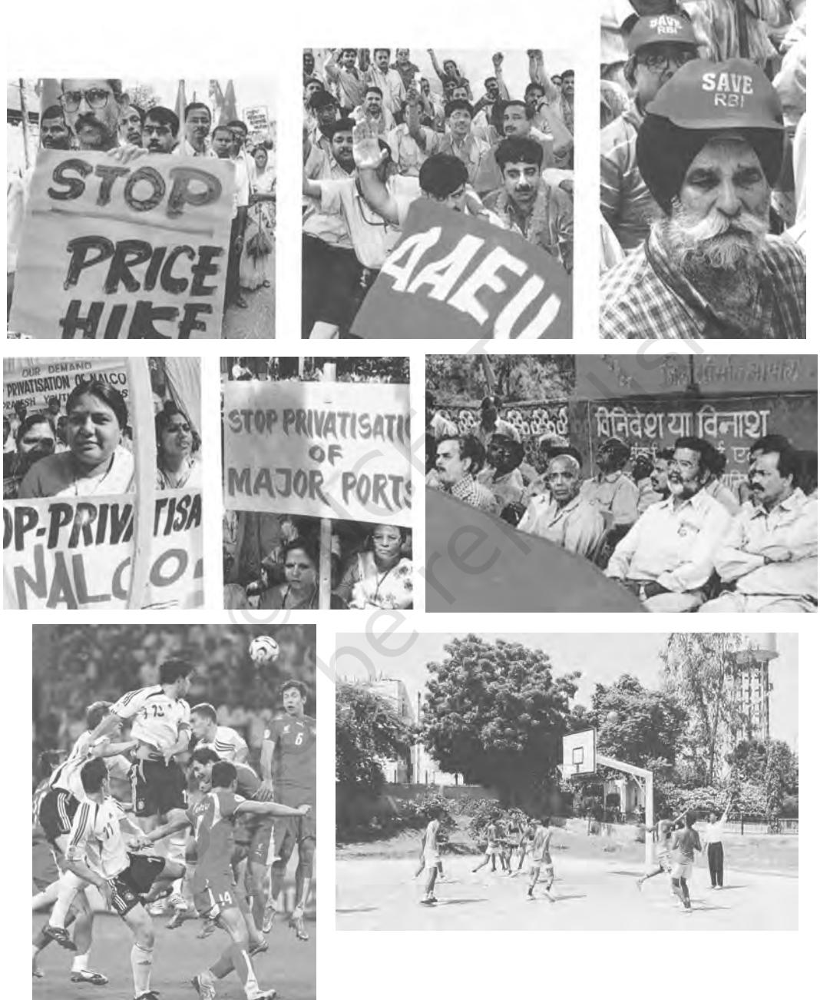
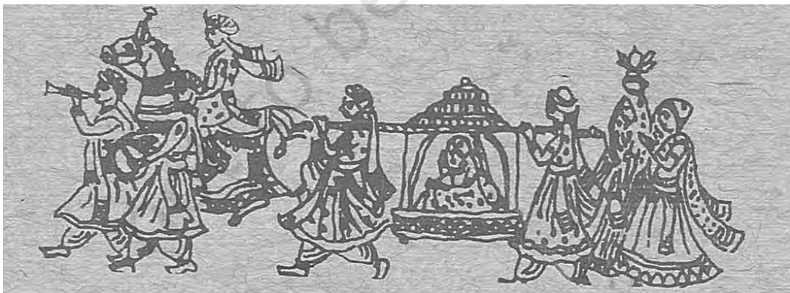

# CHAPTER 1

# SOCIAL STRUCTURE, STRATIFICATION AND SOCIAL PROCESSES IN SOCIETY

# INTRODUCTION

You will recall that the earlier book Introducing Sociology, Class XI had begun with a discussion on the relationship between personal problems and social issues. We also saw how individuals are located within collectivities such as groups, classes, gender, castes and tribes. Indeed each of you, is a member of not just one kind of collectivity, but many overlapping ones. For instance, you are a member of your own peer group, your family and kin, your class and gender, your country and region. Each individual thus has a specific location in the social structure and social stratification system (see pages 28-35 in Introducing Sociology). This also implies that they have different levels and types of access to social resources. In other words the choices an individual has in life in terms of the school s/he goes to — or if s/he goes to school at all — would depend on the social stratum that s/he belongs to. Likewise with the clothes s/he gets to wear, the food s/he consumes, the leisure opportunities s/he avails, the health access s/he has, i.e. her/his lifestyle in general. As in the case of social structure, social stratification constrains individual action.

One of the central concerns of the sociological perspective has been to understand the dialectical relationship between the individual and society. You will recall C.Wright Mill's elaboration of the sociological imagination that seeks to unfold the interplay between an individual's biography and society's history. It is towards understanding this dialectical relationship between the society and individual that we need to discuss the three central concepts of structure, stratification and social processes in this chapter. In the next few chapters we then move on to how social structure in rural and urban societies are different, to broader relationships between environment and society. In the last two chapters we look at western social thinkers and Indian sociologists and their writings that would help us further understand the ideas of social structure, stratification as well as social processes.

The central question that this chapter seeks to discuss is to what extent the individual constrained by, and to what extent s/he is free of, the social structure? To what extent does one's position in society or location in the stratification system govern individual choice? Do social structure and social stratification influence the manner people act? Do they shape the way individuals cooperate, compete and conflict with each other?

In this chapter we deal briefly with the terms 'social structure' and 'social stratification'. You have already discussed social stratification in some detail in Chapter 2 of the earlier book Introducing Sociology, Class XI (NCERT, 2006). We then move on to focus on three social processes namely; cooperation, competition and conflict. In dealing with each of these processes we shall try and see how social structure and stratification impinge themselves on the social processes. In other words how individuals and groups cooperate, compete and conflict depending upon their position within the social structure and stratification system.

# SOCIAL STRUCTURE AND STRATIFICATION

The term social structure points to the fact that society is structured — i.e., organised or arranged — in particular ways. The social environments in which we exist do not just consist of random assortments of events or actions. There are underlying regularities, or patterns, in how people behave and in the relationships they have with one another. It is to these regularities that the concept of social structure refers. Upto a point, it is helpful to think of the structural characteristics of societies as resembling the structure of a building. A building has walls, a floor and a roof, which together give it a particular 'shape' or form (Giddens 2004: 667).

But the metaphor can be a very misleading one if applied too strictly. Social structures are made up of human actions and relationships. What gives these their patterning is their repetition across periods of time and distances of space. Thus, the ideas of social reproduction and social structure are very closely related to one another in sociological analysis. For example, consider a school and a family structure. In a school certain ways of behaving are repeated over the years and become institutions. For instance admission procedures, codes of conduct, annual functions, daily assemblies and in some cases even school anthems. Likewise in families certain ways of behaving, marriage practices, notions of relationships, duties and expectations are set. Even as old members of the family or school may pass away and new members enter, the institution goes on. Yet we also know that changes do take place within the family and in schools.

The above discussion and activity should help us understand human societies as buildings that are at every moment being reconstructed by the very bricks that compose them. For as we saw for ourselves human beings in schools or families do bring changes

# Different types of buildings in rural and urban areas

#### Activity 1

Discuss with your grandparents and others of that generation to find out about the ways in which families/schools have changed and the ways in which they have remained the same.

Compare descriptions of families in old films/television serials/novels with contemporary depictions.

Can you observe patterns and regularities of social behaviour in your family? In other words, can you describe the structure of your family?

Discuss with your teachers how they understand the school as a structure. Do students, teachers and the staff have to act in certain ways to maintain or reproduce the structure? Can you think of any changes in either your school or family? Were these changes resisted? Who resisted them and why?

to reproduce the structure even while introducing changes. They cooperate at various levels in their everyday lives towards this reproduction. No less true is the fact that they also compete with each other, often viciously and ruthlessly. The fact remains that along with cooperative behaviour we also witness serious conflict. And as we shall find later in this chapter, cooperation can be enforced and thereby serve to conceal conflict.

A major theme pursued by Emile Durkheim (and by many other sociologists since) is that the societies exert social constraint over the actions of their members. Durkheim argued that society has primacy over the individual person. Society is far more than the sum of individual acts; it has a 'firmness' or 'solidity' comparable to structures in the material environment.

Think of a person standing in a room with several doors. The structure of the room constrains the range of his or her possible activities. The placing of the walls and doors, for example defines the routes of exit and entry. Social structure, according to Durkheim, constrains our activities in a parallel way, setting limits to what we can do as individuals. It is 'external' to us just as the walls of the room are.

Other social thinkers like Karl Marx would emphasise the constraints of social structure but would at the same time stress human creativity or agency to both reproduce and change social structure. Marx argued that human beings make history, but not as they wish to or in conditions of their choice, but within the constraints and possibilities of the historical and structural situation that they are in.

To recall the concept of social strati-fication in Chapter 2 of Introducing Sociology, Class XI, Social stratification refers to the existence of structured inequalities between groups in society, in terms of their access to material or symbolic This point of view is expressed by Durkheim in his famous statement: When I perform my duties as a brother, a husband or a citizen and carry out the commitments I have entered into, I fulfil my obligations which are defined in law and custom and which are external to myself and my actions…Similarly, the believer has discovered from birth, ready fashioned, the beliefs and practices of his religious life; if they existed before he did, it follows that they exist outside him. The systems of signs that I employ to express my thoughts, the monetary system I use to pay my debts, the credit instruments I utilise in my commercial relationships, the practices I follow in my profession, etc. all function independently of the use I make of them. Considering in turn each member of society, the following remarks could be made for every single one of them.

Source: Durkheim, Emile,1933,The Division of Labour in Society, pp.50-1, A Free Press Paperback, The MacMillan Company, New York.

## Activity 2

Think of examples that reveal both how human beings are constrained by social structure and also of examples where individuals defy social structure and transform it. Recall our discussion on socialisation in Introducing Sociology (pages 78-79).

rewards. While all societies involve some forms of social stratification, modern societies are often marked by wide differences in wealth and power. While the most evident forms of stratification in modern societies involve class divisions, others like race and caste, region and community, tribe and gender also continue to matter as bases of social stratification.

You will recall that social structure implied a certain patterning of social behaviour. Social stratification as part of the broader social structure is

likewise characterised by a certain pattern of inequality. Inequality is not something which is randomly distributed between individuals in society. It is systematically linked to membership in different kinds of social groups. Members of a given group will have features in common, and if they are in a superior position they will usually see to it that their privileged position is passed on to their children. The concept of stratification, then, refers to the idea that society is divided into a patterned structure of unequal groups, and usually implies that this structure tends to persist across generations (Jayaram 1987:22).

It is necessary to distinguish between different advantages which can be distributed unequally. There are three basic forms of advantage which privileged groups may enjoy:

- (i) Life Chances: All those material advantages which improve the quality of life of the recipient — this
may include not only economic advantages of wealth and income, but also benefits such as health, job security and recreation.

- (ii) Social Status: Prestige or high standing in the eyes of other members of the society.
- (iii) Political Influence: The ability of one group to dominate others, or to have preponderant influence over decision-making, or to benefit advantageously from decisions.

The above discussion on the three social processes will repeatedly draw attention to the manner that different bases of social stratification like gender or class constrain social processes. The opportunities and resources available to individuals and groups to engage in competition, cooperation or conflict are shaped by social structure and social stratification. At the same time, humans do act to modify the structure and system of stratification that exists.

# TWO WAYS OF UNDERSTANDING SOCIAL PROCESSES IN SOCIOLOGY

In the earlier book Introducing Sociology, Class XI you have seen the limitations of common sense knowledge. The problem is not that commonsense knowledge is necessarily false, but that it is unexamined and taken for granted. By contrast, the sociological perspective questions everything and accepts nothing as a given. It would therefore not rest content with an explanation which suggests that humans compete or cooperate or conflict as the case may be because it is human nature to do so. The assumption behind such explanations is that there is something intrinsic and universal in human nature that accounts for these processes. However, as we have seen earlier, sociology is not satisfied with either psychological or naturalist explanations (see pages 7-8 of Introducing Sociology). Sociology seeks to explain these processes of cooperation, competition and conflict in terms of the actual social structure of society.

# Activity 3

Think of examples of cooperation, competition and conflict in your everyday life

In Introducing Sociology we discussed how there are differences and plural understandings of society (pages 24-25, 36). We saw how functionalist and conflict perspectives varied in their understanding of different institutions, be it the family, the economy or social stratification and social control. Not surprisingly therefore, these two perspectives seek to understand these processes a bit differently. But both Karl Marx (usually associated with a conflict perspective) and Emile Durkheim (usually identified with a functionalist perspective) presume that human beings

have to cooperate to meet their basic needs, and to produce and reproduce themselves and their world.

The conflict perspective emphasises how these forms of cooperation changed from one historical society to another. For instance, it would recognise that in simple societies where no surplus was produced, there was cooperation between individuals and groups who were not divided on class or caste or race lines. But in societies where surplus is produced whether feudal or capitalist — the dominant class appropriates the surplus and cooperation would necessarily involve potential conflict and competition. The conflict view thus emphasises that groups and individuals are placed differentially and unequally within the system of production relations. Thus, the factory owner and the factory worker do cooperate in their everyday work. But a certain conflict of interests would define their relationship.

The understanding that informs the conflict perspective is that in societies divided by caste, or class or patriarchy, some groups are disadvantaged and discriminated against. Furthermore the dominant groups sustain this unequal order by a series of cultural norms, and often coercion or even violence. As you will see in the next paragraphs, it is not that the functionalist perspective fails to appreciate the role of such norms or sanctions. But it understands their function in terms of the society as a whole, and not in terms of the dominant sections who control society.

The functionalist perspective is mainly concerned with the 'system requirements' of society — certain functional imperatives, functional requisites and prerequisites. These refer to the fulfilment of the broadest conditions which are necessary for a system's existence (and which therefore keep it alive and prevent its destruction) such as:

- (i) The socialisation of new members;
- (ii) A shared system of communication;
- (iii) Methods of assigning individuals to roles.

You are well aware how the functionalist perspective rests upon the assumption that different parts or organs of society have a function or role to play for the broader maintenance and functioning of the whole society. Seen from this perspective, cooperation, competition and conflict can be seen as universal features of all societies, explained as the result of the inevitable interactions among humans living in society and pursuing their ends. Since the focus is on system sustenance, competition and conflict is looked at with the understanding that in most cases they tend to get resolved without too much distress, and that they may even help society in various ways.

#### **Activity 4**

Discuss whether women are cooperating, or refusing to engage in conflict or competition because of a range of normative compulsions. Are they cooperating with the given norm of male inheritance because of the fear of losing the affection of their brothers if they behave otherwise?

Sociological studies have also shown how norms and patterns of socialisation often ensure that a particular social order persists, even though it is skewed in the interests of one section. In other words, *the relationship between cooperation, competition and conflict is often complex and not easily separable.*

In order to understand how cooperation may entail conflict, and the difference between 'enforced' and 'voluntary' cooperation, let us look at the very contentious issue of women's right to property in their natal family. A study was conducted among different sections of society to understand the attitude towards taking natal property (see pages 41-46 of *Introducing Sociology*). A significant number of women (41.7 per cent) evoked the theme of a daughter's love and love for a daughter when speaking about their rights to property. But they emphasised apprehension rather than affection by saying they would not claim full or any share of natal property because they were afraid this would sour relations with their brothers or cause their brothers' wives to hate them, and that as a result they would

**Bride leaving for groom's house in a 'Doli'**

no longer be welcome in their natal homes. This attitude represents one of the dominant metaphors mediating women's refusal of property… A woman demanding her share is the greedy shrew or 'hak lene wali'. There was also a close connection between these feelings and the apparently obverse ones of the desire to continue to be part of the natal family by actively contributing to its prosperity or being available to deal with its crises.

Activity 2 would enable you to appreciate how apparently cooperative behaviour can also be seen as a product of deep conflicts in society. But when these conflicts are not expressed openly or challenged, the impression remains that there is no conflict, but only cooperation. A functionalist view often uses the term accommodation to explain situations such as the one described above, where women would prefer not to claim property rights in their natal home. It would be seen as an effort to compromise and co-exist despite conflict.

#### Activity 5

Think of other kinds of social behaviour which may appear as cooperative but may conceal deeper conflicts of society.

# COOPERATION AND DIVISION OF LABOUR

The idea of cooperation rests on certain assumptions about human behaviour. It is argued that without human cooperation it would be difficult for human life to survive. Further it is argued that even in the animal world we witness cooperation, whether they be ants or bees or mammals. Comparison with the animal world should however be done carefully. We look at two very different theoretical traditions in sociology to illustrate the point, those represented by Emile Durkheim and Karl Marx.

Sociology for the most part did not agree with the assumption that human nature is necessarily nasty and brutish. Emile Durkheim argues against a vision of "primitive humanity whose hunger and thirst, always badly satisfied, were their only passions". Instead he argued:

> They overlook the essential element of moral life, that is, the moderating influence that society exercises over its members, which tempers and neutralises the brutal action of the struggle for existence and selection. Wherever there are societies, there is altruism, because there is solidarity. Thus, we find altruism from the beginning of humanity and even in truly intemperate form. (Durkheim 1933)

For Durkheim solidarity, the moral force of society, is fundamental for our understanding of cooperation and thereby the functioning of society. The role of division of labour — which implies cooperation — is precisely to fulfill certain needs of society. The division of labour is at the same time a law of nature and also a moral rule of human conduct.

Durkheim distinguished between mechanical and organic solidarity that characterised pre-industrial and complex industrial societies respectively. Both are forms of cooperation in society. Mechanical solidarity is the form of cohesion that is based fundamentally on sameness. Most of the members of such societies live very similar lives, with little specialisation or division of labour beyond that associated with age and sex. Members feel bonded together essentially by their shared beliefs and sentiments, their common conscience and consciousness. Organic solidarity is that form of social cohesion that is based on division of labour and the resulting interdependence of members of society. As people become more specialised, they also become more dependent upon each other. A family engaged in subsistence farming may survive with little or no help from similar homesteaders. But specialised workers in a garment or a car manufacturing factory cannot survive without a host of other specialised workers supplying their basic needs.

Karl Marx too distinguishes human life from animal life. While Durkheim emphasised altruism and solidarity as distinctive of the human world, Marx emphasised consciousness. He writes:

> Men can be distinguished from animals by consciousness, by religion or anything else you like. They themselves begin to distinguish themselves from animals as soon as they begin to produce their means of subsistence, a step which is conditioned by their physical organisation. By producing their

means of subsistence men are indirectly producing their material life (Marx 1972:37).

The above quote from Marx may appear difficult but will help us understand how cooperation in human life is different from cooperation in animal life. For humans not only adjust and accommodate to cooperate but also alter society in that process. For example, men and women over the ages had to adjust to natural constraints. Various technological innovations over time not only transformed human life but in some sense nature too. Humans in cooperating thus do not passively adjust and accommodate but also change the natural or social world to which they adjust. We had discussed in the Chapter on Culture and Socialisation in earlier book, Introducing Sociology how Indians had to adjust and accommodate and cooperate with the English language because of our experience with British Colonialism. But also how in that process Hinglish has emerged as a living social entity (page 72).

While both Durkheim from a functionalist view and Marx from a conflict perspective emphasise cooperation, they also differ. For Marx cooperation is not voluntary in a society where class exists. He argues, "The social power, i.e., the multiplied productive force, which arises through the cooperation of different individuals as it is caused by the division of labour, appears to these individuals, since their cooperation is not voluntary but has come about naturally, not as their own united power, but as an alien force existing outside them…" (Marx 1972: 53). Marx used the term alienation to refer to the loss of control on the part of workers over the concrete content of labour, and over the products of their labour. In other words, workers lose control over how to organise their own work; and they lose control over the fruits of their labour. Contrast, for example, the feeling of fulfillment and creativity of a weaver or potter or ironsmith with that of a worker involved in a factory whose sole task may be to pull a lever or press a button throughout the day. Cooperation in such a situation would be enforced.

## COMPETITION AS AN IDEA AND PRACTICE

As in the case of cooperation, discussions on the concept of competition often proceed with the idea that competition is universal and natural. But going back to our discussion on how sociological explanation is different from naturalistic ones, it is important to understand competition as a social entity that emerges and becomes dominant in society at a particular historical point of time. In the contemporary period it is a predominant idea and often we find it difficult to think that there can be any society where competition is not a guiding force.

An anecdote of a school teacher who recounted her experience with children in a remote area in Africa draws attention to the fact that competition itself has to be explained sociologically and not as a natural phenomena. The anecdote refers to the teacher's assumption that the children will naturally rejoice at the idea of a competitive race where the winner would get a chocolate as a prize. To her surprise, her suggestion not only did not evoke any enthusiasm but instead seemed to cause considerable anxiety and distress. On probing further they express their distaste for a game where there would be 'winners' and 'losers'. This went against their idea of fun, which meant for them a necessarily cooperative and collective experience, and not a competitive one where the rewards necessarily exclude some and reward one or few.

In the contemporary world however competition is the dominant norm and practice. Classical sociological thinkers such as Emile Durkheim and Karl Marx have noted the growth of individualism and competition respectively in modern societies. Both developments are intrinsic to the way modern capitalist society functions. The stress is on greater efficiency and greater profit maximisation. The underlying assumptions of capitalism are:

- (i) expansion of trade;
- (ii) division of labour;
- (iii) specialisation; and
- (iv) hence rising productivity.

And these processes of selfsustaining growth are fuelled by the central theme of capitalism: rational individuals in free competition in the marketplace, each striving to maximise profits.

The ideology of competition is the dominant ideology in capitalism. The logic of this ideology is that the market operates in a manner that ensures greatest efficiency. For example competition ensures that the most efficient firm survives. Competition ensures that the students with higher marks or best students get admission into prestigious colleges. And then get the best jobs. In all cases the "best" refers to that which ensures the greatest material rewards.

#### Activity 6

India has recently witnessed intense debates on the government's decision to ensure 27 per cent reservation for OBCs and 10 per cent reservation for economically weaker sections among the upper castes. Collect the different arguments for and against these decisions in newspapers, magazines and television programmes.

 Collect information about the drop-out rate in schools, and primary schools in particular (see pages 57-59 in the earlier book)

Given that mostly lower caste students drop-out of school, and most higher educational institutions are dominated by the upper castes, discuss the concepts of cooperation, competition and conflict in the above context.

Views that humans naturally like to compete has to be understood Liberals like J.S. Mill felt that the effects of competition were generally harmful. However, he felt that though modern competition 'is described as the fight of all against all, but at the same time it is the fight for all'; this in the sense that economic competition is directed toward maximum output at minimum cost. Furthermore, 'given the breadth and individualism of society, many kinds of interest, which eventually hold the group together throughout its members, seem to come alive and stay alive only when the urgency and requirements of the competitive struggle force them upon the individual.'

critically like all other naturalist explanations (see page 8 of earlier book). Competition as a desirable value flourished with the onset of capitalism. Read the extracts in the box and discuss.

Competition, and the whole laissezfaire economy of 19th century capitalism, may have been important in promoting economic growth. The exceptionally rapid development of the American economy may be attributable to the greater scope of competition in the United States. But still we cannot produce any exact correlations between the extent of competition, or the intensity of the competitive spirit, and the rate of economic growth in different societies. And on the other hand, there are grounds for supposing that competition has other less welcome effects (Bottomore 1975: 174-5).

## Activity 7

Organise a debate for and against the idea that competition is a necessary good in society and is a must for development. Draw upon school experience to write an essay on the manner that competition impacts on different students.

This ideology assumes that individuals compete on an equal basis, i.e. that all individuals are positioned equally in the competition for education, jobs, or resources. But as the earlier discussions on stratification or inequality showed, individuals are placed differentially in society. If the greater number of children in India do not go to school or drop-out sooner rather than later, then they remain out of the competition entirely.

#### Activity 8

Identify different occasions when individuals have to compete in our society. Begin with admission to school onwards through the different stages of life.

# CONFLICT AND COOPERATION

The term conflict implies clash of interests. We have already seen how conflict theorists believe that scarcity of resources in society produces conflict as groups struggle to gain access to and control over those resources. The bases of conflict vary. It could be class or caste, tribe or gender, ethnicity or religious community. As young students you

are well aware of the range of conflicts that exist in society. The scale and nature of different conflicts that occur are however different.

### Activity 9

Think of the different kinds of conflicts that exist in the world today. At the widest level there are conflicts between nations and blocs of nations. Many kinds of conflicts also exist within nations. Make a list of them and then discuss in what ways they are similar and in what ways different.

A widely held commonsense perception is that conflicts in society are new. Sociologists have drawn attention to the fact that conflicts change in nature and form at different stages of social development. But conflicts have always been part of any society. Social change and greater assertion of democratic rights by disadvantaged and discriminated groups make the conflict more visible. But this does not mean that the causes for conflict did not exist earlier. The quote in the box emphasises this.

> Developing countries are today arenas for conflict between the old and the new. The old order is no longer able to meet the new forces, nor the new wants and aspirations of the people, but neither is it moribund — in fact, it is still very much alive. The conflict produces much unseemly argument, discord, confusion, and on occasion, even

bloodshed. Under the circumstances, it is tempting for the sociologist to look to the good old peaceful days in sheer nostalgia. But a moment's reflection should convince him that the old order was not conflict-free and that it perpetrated inhuman cruelties on vast sections of the population. A theoretical approach that regards conflict as abnormal, or that invests equilibrium with a special value in the name of science, can be a handicap in studying developing societies.

Source: Srinivas, M.N., 1972, Social Change in Modern India, pp.159-160, Orient Longman, New Delhi.

It is also important to understand that conflict appears as a discord or overt clash only when it is openly expressed. For example, the existence of a peasant movement is an overt expression of a deep rooted conflict over land resources. But the absence of a movement does not imply the absence of a conflict. Hence, this chapter has emphasised the relationship between conflict, involuntary cooperation and also resistance.

Let us examine some of the conflicts that exist in society, and also the close relationship that exists between competition, cooperation and conflict. We just take two instances here. The first is the family and household. The second is that of land based conflict.

Traditionally the family and household were often seen as harmonious units where cooperation was the dominant process and altruism the driving principle of human behaviour. The last three decades have seen a great deal of questioning of this assumption by feminist analysis. Scholars such as Amartya Sen have noted the possibility of enforced cooperation.

> Not only do the different parties have much to gain from cooperation; their individual activities have to take the form of being overtly cooperative, even when substantial conflicts exist… Although serious conflicts of interests may be involved in the choice of 'social technology', the nature of the family organisation requires that these conflicts be moulded in a general format of cooperation, with conflicts treated as aberrations or deviant behaviour (Sen 1990:147).

Since conflict is often not overtly expressed, it has been found that subaltern or subordinate sections, whether women in households or peasants in agrarian societies, develop different strategies to cope with conflict and ensure cooperation. Findings of many sociological studies seem to suggest that covert conflict and overt cooperation is common. The extract below draws from many studies on women's behaviour and interaction within households.

> Material pressures and incentives to cooperate extend to distribution and there is little evidence of overt conflict over distributional processes. Instead there is a hierarchy of decision-making, needs and priorities (associated with age, gender and lifecycle), a hierarchy to which both men and women appear to subscribe.

Thus, women appear to acquiesce to — and indeed actively perpetuate — discriminatory practices in intrahousehold distribution in order to assure their own longer -term security. Denied access to extrahousehold relationships and resources, it is in their material interests to subscribe to the general son-preference which characterises this culture, and they invest in a great deal of 'selfless' devotion in order to win their sons as allies and insurance against an uncertain future. 'Maternal altruism' in the northern Indian plain is likely to be biased towards sons and can be seen as women's response to patriarchal risk. Women are not entirely powerless, of course, but their subversion of male decisionmaking power tends to be covert. The use of trusted allies (relatives or neighbours) to conduct small businesses on their behalf, the secret lending and borrowing of money, and negotiations around the meaning of gender ideologies of purdah and motherhood, are some of the strategies by which women have resisted male power (Abdullah and Zeidenstein, 1982; White, 1992). That their resistance takes this clandestine form reflects their lack of options outside household cooperation and the concomitant high risks associated with open conflict (Kabeer 1996:129).

In keeping with the sociological tradition of questioning taken for granted commonsense assumptions, this chapter has critically examined the processes of cooperation, competition and conflict. The sociological approach does not see these processes as 'natural'. It further relates them to other social developments. In the following paragraphs you will read from a sociological study done on land relations and the Bhoodan-Gramdan movement in India. Read box and see how cooperation in society can be sociologically related to technology and the economic arrangements of production.

# Land Conflicts

Harbaksh, a Rajput had borrowed Rs100 from Nathu Ahir (Patel) in the year 1956, by mortgaging (informally) 2 acres of land. In the same year Harbaksh died and Ganpat, his successor, claimed the land back in 1958 and he offered Rs 200. Nathu refused to return the land to Ganpat. Ganpat could not take to legal proceedings as this exchange was not codified in the revenue records. Under the circumstances Ganpat had resorted to violence and forcefully cultivated the land in 1959 (one year after Gramdan). Ganpat, being a police constable, could influence the police officials. When the Patel went to Phulera (the police thana headquarters) he was taken to the police station and was forced to agree that he will give the land back to Ganpat. Later a meeting of the villagers was convened when the money was given to Patel and Ganpat received the land back.

Source: Oommen, T.K., 1972: Charisma, Stability and Change; An Analysis of Bhoodan-Gramdan Movement in India, p.84. Thompson Press, New Delhi.

The advent of technology had also reduced the necessity for cooperation. For instance, for the operation of a Charas, an indigenous device of well irrigation, one requires 2 pairs of bullocks and four men. An ordinary peasant cannot afford the cost of four bullocks or an average household may not have the required manpower. In such situations they resort to borrowing bullocks and men from other households (kin, neighbours, friends, etc.) assuring similar services in return. But if a Charas is replaced by a Rehat (persian wheel) for irrigation which calls for a heavier capital investment, one needs only one pair of bullocks and one person for its operation. The necessity of cooperation in the context of irrigation is reduced by a heavier capital investment and an efficient technology. Thus, the level of technology in a system may determine the need for cooperation between men and groups.

Source: Oommen, T.K., 1972, Charisma, Stability and Change; An Analysis of Bhoodan-Gramdan Movement in India, p.88. Thompson Press, New Delhi.

#### Activity 10

Read the following account of land conflict. Identify the different social groups within it and notice the role of power and access to resources.

# Conclusion

The effort in this chapter is to understand the relationship between structure and stratification on the one hand and the social processes of cooperation, competition and conflict on the other. You would have noticed that the three social processes are different, yet they often co-exist, overlap and sometimes exist in a concealed fashion, as evident in the above discussion about forced cooperation.

# GLOSSARY

Altruism: The principle of acting to benefit others without any selfishness or self-interest.

Alienation: Marx used the term to refer to the loss of control on the part of workers over the nature of the labour task, and over the products of their labour.

Anomie: For Durkheim, a social condition where the norms guiding conduct break down, leaving individuals without social restraint or guidance. A situation of normlessness.

Capitalism: An economic system in which the means of production are privately owned and organised to accumulate profits within a market framework, in which labour is provided by waged workers.

Division of Labour: The specialisation of work tasks, by means of which different occupations are combined within a production system. All societies have at least some rudimentary form of division of labour especially between the tasks allocated to men and those performed by women. With the development of industrialism, however, the division of labour became more complex than in any prior type of production system. In the modern world, the division of labour is international in scope.

Dominant Ideology: Shared ideas or beliefs which serve to justify the interests of dominant groups. Such ideologies are found in all societies in which they are systematic and engrained inequalities between groups. The concept of ideology connects closely with that of power, since ideological systems serve to legitimise the differential power which groups hold.

Individualism: Doctrines or ways of thinking that focus on the autonomous individual, rather than on the group.

Laissez-faire Liberalism: A political and economic approach based on the general principle of non-interference in the economy by government and freedom for markets and property owners.

Mechanical Solidarity: According to Durkheim, traditional cultures with a low division of labour are characterised by mechanical solidarity. Because most members of the society are involved in similar occupations, they are bound together by common experience and shared beliefs.

Modernity: A term designed to encapsulate the distinctiveness, complexity and dynamism of social processes unleashed during the 18th and 19th centuries which mark a distinct break from traditional ways of living.

Organic Solidarity: According to Durkheim, societies characterised by organic solidarity are held together by people's economic interdependence and a recognition of the importance of others' contributions. As the division of labour becomes more complex, people become more and more dependent on one another, because each person needs goods and services that those in other occupations supply. Relationships of economic reciprocity and mutual dependency come to replace shared beliefs in creating social consensus.

Social Constraint: A term referring to the fact that the groups and societies of which we are a part exert a conditioning influence on our behaviour. Social constraint was regarded by Durkheim as one of the distinctive properties of 'social facts'.

Structures: Refers generally to constructed frameworks and patterns of organisation, which in some way constrain or direct human behaviour.

## EXERCISES

- 1. Discuss the different tasks that demand cooperation with reference to agricultural or industrial operations.
- 2. Is cooperation always voluntary or is it enforced? If enforced, is it sanctions or is the strength of norms that ensure cooperation? Discuss with examples.
- 3. Can you find illustrative examples of conflict drawn from Indian society? Discuss the causes that led to conflict in each instance.
- 4. Write an essay based on examples to show how conflicts get resolved.
- 5. Imagine a society where there is no competition. Is it possible? If not, why not?
- 6. Talk to your parents and elders, grandparents and their contemporaries and discuss whether modern society is really more competitive or conflict ridden than it used to be before. And if you think it is, how would you explain this sociologically?

# REFERENCES

- ABDULLAH, T. and S. ZEIDENSTEIN. 1982. Village Men of Bangladesh: Prospects for Change. Pergamon Press, Oxford.
- BASU SRIMATI. 2001. She Comes to Take Her Rights: Indian Women, Property and Propriety. Kali for Women, New Delhi.
- BOTTOMORE, T.B. 1975. Sociology as Social Criticism. George Allen and Unwin Ltd., London
- DURKHEIM EMILE. 1933. The Division of Labour in Society. A Free Press (Paperback), The MacMillan Company, New York.
- JAYARAM, N. 1987. Introductory Sociology. MacMillan India Ltd, Delhi.
- HALE SYLVIA, M. 1990. Controversies in Sociology: A Canadian Introduction. Longman Groups, London.
- MARX KARL and FREDERICK ENGELS. 1974. The German Ideology. Selected Works, Vol. 1. Peoples Publishing House, Moscow.
- SEN AMARTYA. 1990. "Gender and Cooperative Conflicts" in Persistent Inequalities (ed) II.Tinker, pp.123-49. Oxford University Press, Oxford.
- SINGH YOGENDRA. 1973. Modernization of Indian Tradition. Thomson Press, Delhi.
- SRINIVAS, M.N. 1972. Social Change in Modern India. Orient Longman, New Delhi.
- OOMMEN, T.K. 1972. Charisma, Stability and Change; An Analysis of Bhoodan-Gramdan Movement in India. Thomson Press, New Delhi.
- WHITE, S.C. 1992. Arguing With the Crocodile, Gender and Class in Bangladesh, Zed Books, London.

