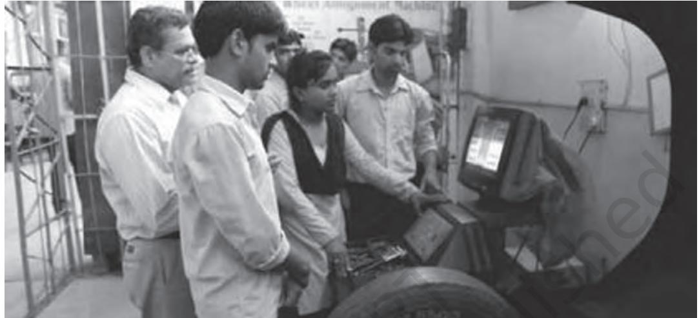
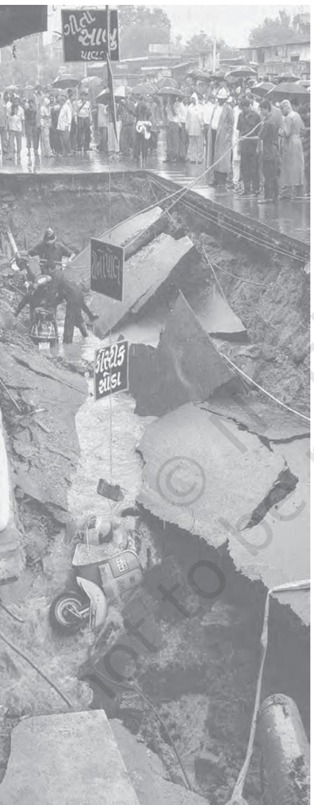

CHAPTER 2

SOCIAL CHANGE AND SOCIAL ORDER IN RURAL AND URBAN SOCIETY 21

It is often said that change is the only unchanging aspect of society. Anyone living in modern society does not need to be reminded that constant change is among the most permanent features of our society. In fact, the discipline of sociology itself emerged as an effort to make sense of the rapid changes that Western European society had experienced between the seventeenth and nineteenth centuries.

But though social change seems such a common and obvious fact about modern life, it is – comparatively speaking – a very new and recent fact. It is estimated that human beings have existed on planet earth for approximately 500,000 (five lakh) years, but they have had a civilised existence for only about 6,000 years. Of these civilised years, it is only in the last 400 years that we have seen constant and rapid change; even within these years of change, the pace has accelerated only in the last 100 years. Because the speed with which change happens has been increasing steadily, it is probably true that in the last hundred years, change has been faster in the last fifty years than in the first fifty. And within the last fifty years, the world may have changed more in the last twenty years than in the first thirty…

#### The Clock of Human History

Human beings have existed on earth for about half a million years. Agriculture, the necessary basis of fixed settlements, is only about twelve thousand years old. Civilisations date back no more than six thousand years or so. If we were to think of the entire span of human existence thus far as a day (stretching from midnight to midnight), agriculture would have come into existence at 11:56 pm and civilisations at 11:57. The development of modern societies would get underway only at 11:59 and 30 seconds! Yet perhaps as much change has taken place in the last thirty seconds of this human day as in all the time leading up to it. From: Anthony Giddens,2004 Sociology, 4th edition, p.40.

#### Activity 1

 Talk to your elders and make a list of the things in your life that: (a) did not exist when your parents were your age; and (b) did not exist when your grandparents were your age.

Eg: Black & white/colour TV; milk in plastic bags, zip fasteners on clothes; plastic buckets; etc. – did it exist in your parents'/ grandparents' childhood?

Can you also make a list of things that existed in your parents'/ grandparents', time but don't exist in your time?

#### SOCIAL CHANGE

'Social change' is such a general term that it can be, and often is, used to refer to almost any kind of change not qualified by some other term, such as economic or political change. Sociologists have had to work hard to limit this broad meaning in order to make the term more specific and hence useful for social theory. At the most basic level, social change refers to changes that are significant – that is, changes which alter the 'underlying structure of an object or situation over a period of time' (Giddens 2005:42). Thus social change does not include any and all changes, but only big ones, changes which transform things fundamentally. The 'bigness' of change is measured not only by how much change it brings about, but also by the scale of the change, that is, by how large a section of society it affects. In other words, changes have to be both intensive and extensive – have a big impact spread over a large sector of society – in order to qualify as social change.

Even after this kind of specification, social change still remains a very broad term. Attempts to further qualify it usually try to classify it by its sources or causes; by its nature, or the kind of impact it has on society; and by its pace or speed.

For example, evolution is the name given to a kind of change that takes place slowly over a long period of time. This term was made famous by the natural scientist Charles Darwin, who proposed a theory of how living organisms evolve – or change slowly over several centuries or even millenia, by adapting themselves to natural circumstances. Darwin's theory emphasized the idea of 'the survival of the fittest' – only those life forms manage to survive who are best adapted to their environment; those that are unable to adapt or are too slow to do so die out in the long run. Darwin suggested that human beings evolved from sea-borne life forms (or varieties of fish) to land-based mammals, passing through various stages the highest of which were the various varieties of monkeys and chimpanzees until finally the homo sapiens or human form was evolved. Although Darwin's theory referred to natural processes, it was soon adapted to the social world and was termed 'social Darwinism', a theory that emphasised the importance of adaptive change. In contrast to evolutionary change, change that occurs comparatively

quickly, even suddenly, is sometimes called 'revolutionary change'. It is used mainly in the political context, when the power structure of society changes very rapidly through the overthrow of a former ruling class or group by its challengers. Examples include the French revolution (1789-93) and the Soviet or Russian revolution of 1917. But the term has also been used more generally to refer to sharp, sudden and total transformations of other kinds as well, such as in the phrase 'industrial revolution' or 'telecommunications revolution', and so on.

#### Activity 2

Refer to the discussions about the French Revolution and the Industrial Revolution which you have come across before in your textbooks. What were the major kinds of change that each brought about? Would these changes qualify to be called 'social change'? Were these changes fast enough and far reaching enough to qualify as 'revolutionary change'? What other kinds of social change have you come across in your books which might not qualify as revolutionary change? Why would they not qualify?

Types of change that are identified by their nature or impact include structural change and changes in ideas, values and beliefs. Structural change refers to transformations in the structure of society, to its institutions or the rules by which these institutions are run. (Recall the discussion of social structure from the previous chapter.) For example, the emergence of paper money as currency marked a major change in the organisation of financial markets and transactions. Until this change came about, most forms of currency involved precious metals like gold and silver. The value of the coin was directly linked to the value of the gold or silver it contained. By contrast, the value of a paper currency note has no relationship to the value of the paper it is printed on, or the cost of its printing. The idea behind paper money was that a medium or means for facilitating the exchange of goods and services need not itself be intrinsically valuable. As long as it represents values convincingly — i.e., as long as it inspires trust — almost anything can function as money. This idea was the foundation for the credit market and helped change the structure of banking and finance. These changes in turn produced further changes in the organisation of economic life.

Changes in values and beliefs can also lead to social change. For example, changes in the ideas and beliefs about children and childhood have brought about very important kinds of social change, there was a time when children were simply considered small adults — there was no special concept of childhood as such, with its associated notions of what was right or wrong for children to do. As late as the 19th century for example, it was considered good and proper that children start to work as soon as they were able to. Children were often helping their families at work from the age of five or six; the early factory system depended on the labour of children. It was during the 19th and early 20th centuries that ideas about childhood as a special stage of life gained influence. It then became unthinkable for small children to be at work, and many countries passed laws banning child labour. At the same time, there emerged ideas about compulsory education, and children were supposed to be in school rather than at work, and many laws were passed for this as well. Although there are

some industries in our country that even today depend on child labour at least partially (such as carpet weaving, small tea shops or restaurants, matchstick making, and so on), child labour is illegal and employers can be punished as criminals.

But by far the most common way of classifying social change is by its causes or sources. Sometimes the causes are pre-classified into internal (or endogenous) and external (or exogenous) causes. There are five broad types of sources or causes of social change: environmental, technological, economic, political and cultural.

#### Students in a classroom

Students in a Vocational Training Lab

Source: https//www.msde.gov.in/sites/default/files/2019-09/National%20Skill%20Development %20Mission.pdf

## Environment

Nature, ecology and the physical environment have always had a significant influence on the structure and shape of society. This was particularly true in the past when human beings were unable to control or overcome the effects of nature. For example, people living in a desert environment were unable to practise settled agriculture of the sort that was possible in the plains, near rivers and so on. So the kind of food they ate or the clothes they wore, the way they earned their livelihood, and their patterns of social interaction were all determined to a large extent by the physical and climatic conditions of their environment. The same was true for people living in very cold climates, or in port towns, along major trade routes or mountain passes, or in fertile river valleys. But the extent to which the environment influences society has been decreasing over time with the increase in technological resources. Technology allows us to overcome or adapt to the problems posed by nature, thus reducing the differences between societies living in different sorts of environments. On the other hand, technology also alters nature and our relationship to it in new ways (see the chapter on environment in this book). So it is perhaps more accurate to say that the effect of

The earth caves in after heavy floods

nature on society is changing rather than simply declining.

But how, you might ask, does this affect social change? The environment may have shaped societies, but how did it play any role in social change? The easiest and most powerful answer to this question can be found in natural disasters. Sudden and catastrophic events such as earthquakes, volcanic eruptions, floods, or tidal waves (like the tsunami that hit Indonesia, Sri Lanka, the Andaman Islands and parts of Tamil Nadu in December 2004) can change societies quite drastically. These changes are often irreversible, that is, they are permanent and don't allow a return to the way things were. For example, it is quite possible that many of those whose livelihoods were destroyed by the tsunami will never be able to return to them again, and that many of the coastal villages will have their social structure completely altered. There are numerous instances of natural disasters leading to a total transformation and sometimes total destruction of societies in history. Environmental or ecological factors need not only be destructive to cause change, they can be constructive as well. A good example is the discovery of oil in the desert regions of West Asia (also called the Middle East). Like the discovery of gold in California in the 19th century, oil reserves in the Middle East have completely transformed the societies in which they were found. Countries like Saudi Arabia, Kuwait or the United Arab Emirates would be very different today without their oil wealth.

## Technology and Economy

The combination of technological and economic change has been responsible for immense social changes, specially in the modern period. Technology affects society in a wide variety of ways. As seen above, it can help us to resist, control, adapt to or harness nature in different ways. In combination with the very powerful institution of the market, technological change can be as impressive in its social impact as natural factors like a tsunami or the discovery of oil. The most famous instance of massive and immediately visible social change brought about by technological change is the Industrial Revolution itself, which you have already read about.

You will surely have heard of the massive social impact made by the steam engine. The discovery of steam power allowed emerging forms of large scale industry to use of a source of energy that was not only far stronger than animals or human beings, but was also capable of continuous operation without the need for rest. When harnessed to modes of transport like the steam ship and the railway, it transformed the economy and social geography of the world. The railroad enabled the westward expansion of industry and trade on the American continent and in Asia. In India too, the railways have played a very important role in shaping the economy, specially in the first century after their introduction in 1853. Steamships made ocean voyages much faster and much more reliable, thereby changing the dynamics of international trade and migration. Both these developments created gigantic ripples of change which affected not only the economy but also the social, cultural and demographic dimensions of world society.

The importance and impact of steam power became visible relatively quickly; however, sometimes, the social impact of technological changes becomes visible only retrospectively. A technological invention or discovery may produce limited immediate effects, as though it were lying dormant. Some later change in the economic context may suddenly change the social significance of the same invention and give it recognition as a historic event. Examples of this are the discovery of gunpowder and writing paper in China, which had only limited impact for centuries until they were inserted into the context of modernising Western Europe. From that vantage point, given the advantage of enabling circumstances, gunpowder helped to transform the technology of warfare and the paperprint revolution changed society forever. Another example closer to home is the case of technological innovations in the textile industry in Britain. In combination with market forces and imperial power, the new spinning and weaving machines destroyed the handloom industry of the Indian subcontinent which was, until then, the largest and most advanced in the world.

## Activity 3

Have you noticed other such technological changes which have social consequences in your own life? Think of the photo-copying machine and its impact. Have you ever thought of what things were like before photo-copying became so cheap and freely available? Another example could be the STD telephone booths. Try to find out how people communicated before these telephone booths had appeared and very few homes had telephone connections. Make a list of other such examples.

Sometimes changes in economic organisation that are not directly technological can also change society. In a well-known historical example, plantation agriculture — that is, the growing of single cash crops like sugarcane, tea or cotton on a large scale — created a heavy demand for labour. This demand helped to establish the institution of slavery and the slave trade between Africa, Europe and the Americas between the 17th and 19th centuries. In India, too, the tea plantations of Assam involved the forced migration of labour from Eastern India (specially the Adivasi areas of Jharkhand and Chhattisgarh). Today, in many parts of the world, changes in customs duties or tariffs brought about by international agreements and institutions like the World Trade Organisation, can lead to entire industries and occupations being wiped out or (less often) sudden booms or periods of prosperity for other industries or occupations.

#### Politics

In the old ways of writing and recounting history, the actions of kings and queens seemed to be the most important forces of social change. But as we know now, kings and queens were the representatives of larger political, social and economic trends. Individuals may indeed have had roles to play, but they were part of a larger context. In this sense, political forces have surely been among the most important causes of social change. The clearest examples are found in the history of warfare. When one society waged war on another and conquered or was conquered, social change was usually an immediate consequence. Sometimes, conquerors brought the seeds of change and planted them wherever they went. At other times, the conquered were actually successful in planting seeds of change among the conquerors and transformed their societies. Although there are many such examples in history, it is interesting to consider a modern instance — that of the United States and Japan.

The United States won a famous victory over Japan in the Second World War, partly through the use of a weapon of mass destruction never seen before in human history, the nuclear bomb. After the Japanese surrender, the United States occupied and ruled over Japan for several years, bringing about lots of changes, including land reform in Japan. Japanese industry, at that time, was trying very hard to copy American industry and learn from it. By the 1970s, however, Japanese industrial techniques, specially in fields like car manufacturing, had gone far ahead of the Americans. Between the 1970s and 1990s, Japanese industry dominated the world and forced changes in the industrial organisation of Europe and specially the United States. The industrial landscape of the United States in particular was decisively altered by the impact of Japanese industrial technology and production organisation. Large, traditionally dominant industries like steel, automobiles and heavy engineering suffered major setbacks and had to restructure themselves according to Japanese technological and management principles. Emerging fields like electronics were also pioneered by the Japanese. In short, within the space of four decades, Japan had turned the tables on the United States, but through economic and technological means rather than warfare.

Political changes need not only be international — they can have enormous social impact even at home. Although you may not have thought of it this way, the Indian independence movement did not only bring about political change in the form of the end of British rule, it also decisively changed Indian society. A more recent instance is to be found in the Nepali people's rejection of monarchy in 2006. More generally, political changes bring about social change through the redistribution of power across different social groups and classes.

Considered from this viewpoint, universal adult franchise — or the 'one person, one vote' principle — is probably the single biggest political change in history. Until modern democracies formally empowered the people with the vote, and until elections became mandatory for exercising legitimate power, society was structured very differently. Kings and queens claimed to rule by divine right, and they were not really answerable to the common people. Even when democratic principles of voting were first introduced, they did not include the whole population in fact only a small minority could vote, or had any say in the formation of the government. In the beginning, the vote was restricted to those who were born into high status social groups of a particular race or ethnicity, or to wealthy men who owned property. All women, men of lower classes or subordinated ethnicities, and the poor and working people in general were not allowed to vote.

It is only through long struggles that universal adult franchise came to be established as a norm. Of course, this did not abolish all the inequalities of previous eras. Even today, not all countries follow democratic forms of rule; even where elections are held, they can be manipulated; and people can continue to be powerless to influence the decisions of their government. But despite all this, it cannot be denied that universal adult franchise serves as a powerful norm that exerts pressure on every society and every government. Governments must now at least appear to seek the approval of the people in order to be considered legitimate. This has brought massive social changes in its wake.

# Culture

Culture is used here as a short label for a very wide field of ideas, values, beliefs, that are important to people and help shape their lives. Changes in such ideas and beliefs lead naturally to changes in social life. The commonest example of a sociocultural institution that has had enormous social impact is religion. Religious beliefs and norms have helped organise society and it is hardly surprising that changes in these beliefs have helped transform society. So important has religion been, that some scholars have tended to define civilisations in religious terms and to see history as the process of interaction between religions. However, as with other important factors of social change, religion too is contextual — it is able to produce effects in some contexts but not in others. Max Weber's study 'The Protestant Ethic and the Spirit of Capitalism' showed how the religious beliefs of some Christian Protestant sects helped to establish the capitalist social system. It remains one of the most famous examples of the impact of cultural values on economic and social change. In India too we find many examples of religion bringing about social change. Among the best known are the impact of Buddhism on social and political life in ancient India, and the widespread influence of the Bhakti Movement on medieval social structure including the caste system.

A different example of cultural change leading to social change can be seen in the evolution of ideas about the place of women in society. In the modern era, as women have struggled for equality, they have helped change society in many ways. Women's struggles have also been helped or hindered by other historical circumstances. For example, during the Second World War, women in western countries started to work in factories doing jobs that they had never done before, jobs which had always been done by men. The fact that women were able to build ships, operate heavy machinery, manufacture armaments and so on, helped establish their claims to equality. But it is equally true that, had it not been for the war, they would have had to struggle for much longer. A very different instance of change produced by the position of women can be seen in consumer advertising. In most urban societies, it is women who take most of the everyday decisions about what to buy for their households. This has made advertisers very sensitive to the views and perspectives of women as consumers. Significant proportions of advertising expenditure are now directed at women, and this in turn has effects on the media. In short, the economic role of women starts a chain of changes which can have a larger social impact. For example, advertisements may tend to show women as decision-makers and as important people in ways that would not have been considered or encouraged before. More generally, most advertisements used to be addressed to men; now they are addressed as much to women, or, in some sectors like household appliances and consumer goods, mainly to women. So it is now economically important for advertisers and manufacturers to pay attention to what women think and feel.

Yet another instance of cultural change bringing about social change can be found in the history of sports. Games and sports have always been expressions of popular culture that sometimes acquire a lot of importance. The game of cricket began as a British aristocratic pastime, spread to the middle and working classes of Britain, and from there to British colonies across the world. As the game acquired roots outside Britain, it often turned into a symbol of national or racial pride. The very different history of intense rivalry in cricket shows the social importance of sport in a very telling manner. The England-Australia rivalry expressed the resentment of the socially subordinated colony (Australia) against the dominant upper class centre of authority (England). Similarly, the complete world dominance of the West Indies cricket team during the 1970s and 1980s, was also an expression of racial pride on the part of a colonised people. In India, too, beating England at cricket was always seen as something special, particularly before independence. At another level, the immense popularity of cricket in the Indian sub-continent has altered the commercial profile of the game which is now driven by the interests of South Asian fans, specially Indians.

As will be clear from the above discussion, no single factor or theory can account for social change. The causes of social change may be internal or external, the result of deliberate actions or accidental events. Moreover, the causes of social change are often interrelated. Economic and technological causes may also have a cultural component, politics may be influenced by environment. It is important to be aware of the many dimensions of social change and its varied forms. Change is an important subject for us because the pace of change in modern and specially contemporary times is much faster than what it used to be before. Although social change is better understood retrospectively — after it has already occurred — we also need to be aware of it as it happens, and to prepare for it in whatever ways we can.

2024-25

# SOCIAL ORDER

The meaning of social events or processes often becomes clear through contrasts, just as the letters on the page that you are reading become legible because they contrast against the background. In the same way, social change as a process acquires meaning against the backdrop of continuity or lack of change. It may sound odd, but change makes sense as a concept only if there are also some things that are not changing, so that they offer the possibility of comparison or contrast. In other words, social change has to be understood together with social order, which is the tendency within established social systems that resists and regulates change.

Another way of looking at the relationship between social change and social order is to think about the possible reasons why society needs to prevent, discourage, or at least control change. In order to establish itself as a strong and viable social system, every society must be able to reproduce itself over time and maintain its stability. Stability requires that things continue more or less as they are — that people continue to follow the same rules, that similar actions produce similar results, and more generally, that individuals and institutions behave in a fairly predictable manner.

## Activity 4

We are used to thinking of sameness as boring and change as exciting; this is also true, of course — change can be fun and lack of change can be really dull. But think of what life would be like if you were forced to change all the time… What if you never, ever got the same food for lunch — every day something different, and never the same thing twice, regardless of whether you liked it or not? Here is a scarier thought — what if every time you came back from school there were different people at home, different parents, different brothers and sisters…? What if whenever you played your favourite game football, cricket, volleyball, hockey and so on — the rules were different each time? Think of other areas of your life where you would like things to not change too quickly. Are there areas of your life where you want things to change quickly? Try to think about the reasons why you want or don't want change in particular instances.

The above argument was an abstract and general one about the possible reasons why societies may need to resist change. But there are usually more concrete and specific reasons why societies do in fact resist change. Remember what you read about social structure and social stratification in Chapter 1. Most societies most of the time are stratified in unequal ways, that is, the different strata are differently positioned with respect to command over economic resources, social status and political power. It is not surprising that those who are favourably placed wish for things to continue as they are, while those who are suffering disadvantages are anxious for change. So the ruling or dominant groups in society generally resist any social changes that may alter their status, because they have a vested interest in stability. On the other hand, the subordinated or oppressed groups have a vested interest in change. 'Normal' conditions usually favour the rich and powerful, and they are able to resist change. This is another broad reason why societies are generally stable.

However, the notion of social order is not restricted to the idea of resistance to change, it also has a more positive meaning. It refers to the active maintenance and reproduction of particular pattern of social relations and of values and norms. Broadly speaking, social order can be achieved in one of two ways — when people spontaneously wish to abide by a set of rules and norms; or when people are compelled in various ways to obey such norms. Every society employs a combination of these methods to sustain social order.

Spontaneous consent to social order derives ultimately from shared values and norms which are internalised by people through the process of socialisation. (Revisit the discussion of socialisation in Introducing Sociology). Socialisation

may be more or less efficient in different contexts, but however efficient it is, it can never completely erase the will of the individual. In other words, socialisation cannot turn people into programmed robots — it cannot produce complete and permanent consent for all norms at all times. You may have experienced this in your own lives: rules or beliefs which seem very natural and right at one point of time, don't seem so obviously correct at other times. We question things we believed in the past, and change our minds about what we regard as right or wrong. Sometimes, we may even return to beliefs we once held and then abandoned, only to rediscover them afresh at some later stage of life or in different circumstances. So, while socialisation does take on much of the burden of producing social order, it is never enough by itself.

Thus, most modern societies must also depend on some form of power or coercion to ensure that institutions and individuals conform to established social norms. Power is usually defined as the ability to make others do what you want regardless of what they themselves want. When a relationship of power is stable and settled, and the parties involved have become accustomed to their relative positions, we have a situation of domination. If a social entity (a person, institution or group) is routinely or habitually in a position of power, it is said to be dominant. In normal times, dominant institutions, groups or individuals exercise a decisive influence on society. It is not as though they are never challenged, but this happens only in abnormal or extraordinary times. Even though it implies that people are being forced to do things they don't necessarily want to do, domination in normal times can be quite 'smooth', in the sense of appearing to be without friction or tension. (Revisit the discussion of 'forced cooperation' from Chapter 1. Why, for example, did women not want to claim their rights in their families of birth? Why did they 'consent' to the patriarchal norm?)

## Domination, Authority and Law

How is it that domination can be nonconfrontational even when it clearly involves unequal relationships where costs and benefits are unevenly distributed? Part of the answer we have already got from the discussion of the previous chapter — dominant groups extract cooperation in unequal relationships because of their power. But why does this power work? Does it work purely because of the threat of the use of force? This is where we come to an important concept in sociology, that of legitimation.

In social terms, legitimacy refers to the degree of acceptance that is involved in power relations. Something that is legitimate is accepted as proper, just and fitting. In the broadest sense, it is acknowledged to be part of the social contract that is currently prevailing. In short, legitimacy implies conformity to existing norms of right, propriety and justice. We have already seen how power is defined in society; power in itself is simply a fact — it can be either legitimate or not. Authority is defined by Max Weber as legitimate power — that is, power considered to be justified or proper. For example, a police officer, a judge, or a school teacher all exercise different kinds of authority as part of their jobs. This authority is explicitly provided to them by their official job description — there are written documents specifying their authority, and what they may and may not do.

The fact that they have authority automatically implies that other members of society — who have agreed to abide by its rules and regulations — must obey this authority within its proper domain. The domain of the judge is the court room, and when citizens are in the court, they are supposed to obey the judge or defer to her/his authority. Outside the courtroom, the judge is supposed to be like any other citizen. So, on the street, S/he must obey the lawful authority of the police officer. When on duty, the policeman or woman has authority over the public actions of all citizens except her/his superior officers. But police officers do not have jurisdiction over the private activities of citizens as long as they are not suspected of being unlawful. In different way — different because the nature of the authority involved is less strictly or explicitly defined — the teacher has authority over her/his pupils in the classroom. The authority of the teacher does not extend into the home of the pupil where parents or guardians have primary responsibility and authority over their children.

There may be other forms of authority that are not so strictly defined, but are nevertheless effective in eliciting consent and cooperation. A good example is the authority wielded by a religious leader. Although some institutionalised religions may have partly formalised this authority, but the leader of a sect or other lessinstitutionalised minor religious group may wield enormous authority without it being formalised. Similarly reputed scholars, artists, writers and other intellectuals may wield a lot of authority in their respective fields without it being formalised. The same is true of a criminal gang leader — he or she may exercise absolute authority but without any formal specifications.

The difference between explicitly codified and more informal authority is relevant to the notion of the law. A law is an explicitly codified norm or rule. It is usually written down, and there are laws that specify how laws are to be made or changed, or what is to be done if someone violates them. A modern democratic society has a given body of laws created through its legislature, which consist of elected representatives. The laws of the land are enacted in the name of the people of that land by the people's representatives. This law forms the formal body of rules according to which society will be governed. Laws apply to all citizens. Whether or not I as an individual agree with a particular law, it has binding force on me as a citizen, and on all other citizens similarly regardless of their beliefs.

So, domination works through power, but much of this power is actually legitimate power or authority, a large part of which is codified in law. Consent and cooperation are obtained on a regular and reliable basis because of the backing of this structure of legitimation and formal institutional support. This does not exhaust the domain of power or domination there are many kinds of power that are effective in society even though they are illegitimate, or if legitimate are not codified in law. It is the mix of legitimate, lawful authority and other kinds of power that determines the nature of a social system and also its dynamics.

## Contestation, Crime and Violence

The existence of domination, power, legitimate authority and law does not imply that they always meet with obedience and conformity. You have already read about the presence of conflict and competition in society. In a similar way, we need to recognise more general forms of contestation in society. Contestation is used here as simply a word for broad forms of insistent disagreement. Competition and conflict are more specific than this, and leave out other forms of dissent that may not be well described by such terms.

One example is that of 'counter cultures' among youth or 'youth rebellion'. These are protests against or refusal to conform to prevalent social norms. The content of these protests may involve anything from hairstyles and clothing fashions to language or lifestyle. More standard or conventional forms of contestation include elections — which are a form of political competition. Contestations also include dissent or protest against laws or lawful authorities. Open and democratic societies allow this kind of dissent to different degrees. There are both explicit and implicit boundaries defined for such dissent; crossing these boundaries invites some form of reaction from society, usually from the law enforcement authorities.

As you know very well, being united as Indians does not prevent us from disagreeing with each other. Different political parties may have very different agendas even though they may respect the same Constitution. Belief in or knowledge of the same set of traffic rules does not prevent heated arguments on the road. In other words, social order need not mean sameness or unanimity. On the other hand, how much difference or dissent is tolerated in society is an important question. The answer to this question depends on social and historical circumstances but it always marks an important boundary in society, the boundary between the legitimate and the illegitimate, the legal and the illegal, and the acceptable and the unacceptable.

Although it generally carries a strong moral charge, the notion of crime is strictly derived from the law. A crime is an act that violates an existing law, nothing more, nothing less. The moral worth of the act is not determined solely by the fact that it violates existing law. If the existing law is believed to be unjust, for example, a person may claim to be breaking it for the highest moral reasons. This is exactly what the leaders of the Freedom Movement in India were doing as part of their 'Civil Disobedience' campaign. When Mahatma Gandhi broke the salt law of the British government at Dandi, he was committing a crime, and he was arrested for it. But he committed this crime deliberately and proudly, and the Indian people were also proud of him and what he stood for. Of course, these are not the only kinds of crime that are committed! There are many other kinds of crime that cannot claim any great moral virtue. But the important point is that a crime is the breaking of the law — going beyond the boundary of legitimate dissent as defined by the law.

The question of violence relates at the broadest level to the basic definition of the state. One of the defining features of the modern state is that it is supposed to have a monopoly over the use of legitimate violence within its jurisdiction. In other words, only the state (through its authorised functionaries) may lawfully use violence — all other instances of violence are by definition illegal. (There are exceptions like self defense meant for extraordinary and rare situations). Thus, technically, every act of violence is seen as being directed against the state. Even if I assault or murder some other individual, it is the state that prosecutes me for violating its monopoly over the legitimate use of violence.

It is obvious that violence is the enemy of social order, and an extreme form of contestation that transgresses not only the law, but important social norms. Violence in society is the product of social tensions and indicates the presence of serious problems. It is also a challenge to the authority of the state. In this sense it also marks the failure of the regime of legitimation and consent and the open outbreak of conflicts.

## SOCIAL ORDER AND CHANGE IN VILLAGE, TOWN AND CITY

Most societies can be divided into rural and urban sectors. The conditions of life and therefore the forms of social organisation in these sectors are very different from each other. So also, therefore, are the forms of social order that prevail in these sectors, and the kinds of social change that are most significant in each.

We all think we know what is meant by a village and by a town or city. But how exactly do we differentiate between them? (see also the discussion in Chapter 5 on Village Studies in the section on M.N. Srinivas). From a sociological point of view, villages emerged as part of the major changes in social structure brought about by the transition from nomadic ways of life based on hunting, gathering food and transient agriculture to a more settled form of life. With the development of sedentary forms of agriculture — or forms that did not involve moving from place to place — social structure also changed. Investment in land and technological innovations in agriculture created the possibility of producing a surplus – something over and above what was needed for survival. Thus, settled agriculture meant that wealth could be accumulated and this also brought with it social differences. The more advanced division of labour also created the need for occupational specialisation. All of these changes together shaped the emergence of the village as a population settlement based on a particular form of social organisation.

In economic and administrative terms, the distinction between rural and urban settlements is usually made on the basis of two major factors: population density and the proportion of agriculture related economic activities. (Contrary to appearances, size is not always decisive; it becomes difficult to separate large villages and small towns on the basis of population size alone.) Thus, cities and towns have a much higher density of population — or the number of persons per unit area, such as a square km than villages. Although they are smaller in terms of absolute numbers of people, villages are spread out over a relatively larger area. Villages are also distinguished from towns and cities by the larger share of agricultural activities in their economic profile. In other words, villages will have a significant proportion of its population engaged in agriculture linked occupations, much of what is produced there will be agricultural products, and most of its income will be from agriculture.

The distinction between a town and city is much more a matter of administrative definition. A town and city are basically the same sort of settlement, differentiated by size. An 'urban agglomeration' (a term used in Censuses and official reports) refers to a city along with its surrounding suburban areas and satellite settlements. A 'metropolitan area' includes more than one city, or a continuous urban settlement many times the size of a single city.

Given the directions in which modern societies have developed, the process of urbanisation has been experienced in most countries. This is the process by which a progressively larger and larger proportion of the country's population lives in urban rather than rural areas. Most developed countries are now overwhelmingly urban. Urbanisation is also the trend in developing countries; it can be faster or slower, but unless there are special reasons blocking it, the process does seem to occur in most contexts. According to United Nations report (2014), 54 per cent of the world's population lives in urban areas, a proportion that is expected to increase to 66 per cent by 2050 (United Nations, Department of Economc and Social Affairs, Population Division, 2014, World Population prospects). Indian society is also experiencing urbanisation: the percentage of the population living in urban areas has increased from a little less than 11 per cent in 1901 to a little more than17 per cent in 1951, soon after independence. The 2001 Census shows that almost 28 per cent of the population lives in urban areas. According to 2011 Census report, 37.7 per cent population of India lives in urban areas.

## Social Order and Social Change in Rural Areas

Because of the objective conditions in villages being different, we can expect the nature of social order and social change to be different as well. Villages are small in size so they usually permit more personalised relationships; it is not unusual for members of a village to know all or most other members by sight. Moreover, the social structure in villages tends to follow a more traditional pattern: institutions like caste, religion, and other forms of customary or traditional social practice are stronger here. For these reasons, unless there are special circumstances that make for an exception, change is slower to arrive in villages than in towns.

There are also other reasons for this. A variety of factors ensure that the subordinate sections of society have much less scope for expressing themselves in rural areas than their counterparts in cities. The lack of anonymity and distance in the village makes it difficult for people to dissent because they can be easily identified and 'taught a lesson' by the dominant sections. Moreover, the relative power of the dominant sections is much more because they control most avenues of employment, and most resources of all kinds. So the poor have to depend on the dominant sections since there are no alternative sources of employment or support. Given the small population, it is also very difficult to gather large numbers, particularly since efforts towards this cannot be hidden from the powerful and are very quickly suppressed. So, in short, if there is a strong power structure already in place in a village, it is very difficult to dislodge it. Change in the sense of shifts in power are thus slow and late to arrive in rural areas because the social order is stronger and more resilient.

Change of other sorts is also slow to come because villages are scattered and not as well connected to the rest of the world as cities and towns are. Of course, new modes of communication, particularly the telephone and the television have changed this. So the cultural 'lag' between villages and towns is now much shorter or nonexistent. Communication links of other sorts (road, rail) have also generally improved over time so that few villages can really claim to be 'isolated' or 'remote', words often unthinkingly attached to villages in the past. This has also accelerated the pace of change somewhat.

For obvious reasons changes associated with agriculture or with agrarian social relations have a very major impact on rural societies. Thus, measures like land reform which alter the structure of land ownership have an immediate impact. In India, the first phase of land reforms after independence took away proprietary rights from absentee landlords and gave them to the groups that were actually managing the land and its cultivation in the village. Most of these groups belonged to intermediate castes, and though they were often not themselves the cultivators, they acquired rights over land. In combination with their number, this factor increased their social status and political power, because their votes mattered for winning elections. M.N. Srinivas has named these groups as the 'dominant castes'. In many regional contexts, the dominant castes became very powerful in economic terms and dominated the countryside and hence also electoral politics. In more recent times, these dominant castes are themselves facing opposition from the assertive uprisings of castes further below them, the lowest and the most backward castes. This has led to major social upheavals in many states like Andhra Pradesh, Bihar, Uttar Pradesh and Tamil Nadu.

 In the same way, changes in the technological organisation of agriculture also has a large and immediate impact on rural society. The introduction of new labour saving machinery or new cropping patterns may alter the demand for labour and thus change the relative bargaining strength of different social groups like landlords and labourers. Even if they don't directly affect labour demand, technological or economic changes can change the economic power of different groups and thus set in motion a chain of changes. Sudden fluctuations in agricultural prices, droughts or floods can cause havoc in rural society. The recent spate of farmer suicides in India is an example of this. On the other hand, large scale development programmes aimed at the rural poor can also have an enormous impact. A good example of this is the Mahatma Gandhi National Rural Employment Guarantee Act of 2005 (MGNREGA).

### Activity 5

Find out more about the Mahatma Gandhi National Rural Employment Guarantee Act (MGNREGA). What does it aim to do? Why is it considered such an important development programme? What problems does it face? What would be the likely consequences if it succeeds?

## Social Order and Social Change in Urban Areas

It is well known that though the city itself is very old — even ancient societies had them — urbanism as a way of life for large segments of the population is a modern phenomenon. Before the modern era, trade, religion and warfare were some of the major factors that decided the location and importance of cities. Cities that were located on major trade routes, or had suitable harbours and ports had a

natural advantage. So did cities that were well located from the point of view of military strategy. Finally, religious places attracted large numbers of pilgrims and thus supported an urban economy. In India too we have examples of such old cities, including the well known medieval trading towns of Tezpur on the Brahmaputra river in Assam or Kozhikode (formerly known as Calicut) on the Arabian Sea in northern Kerala. We also have many examples of temple towns and places of religious pilgrimage, such as Ajmer in Rajasthan, Varanasi (also known as Benaras or Kashi) in Uttar Pradesh, or Madurai in Tamil Nadu.

As sociologists have pointed out, city life and modernity go very well together; in fact, each may be considered an intimate expression of the other. Though it houses large and very dense populations, and though it has been known throughout history as the site for mass politics, the city is also the domain of the modern individual. In its combination of anonymity and the amenities and institutions that only large numbers can support, the city offers the individual boundless possibilities for fulfillment. Unlike the village, which discourages individuality and cannot offer much, the city nurtures the individual.

But while the many artists, writers, and scholars who have celebrated the city as the haven of the individual are not wrong, it is also true that freedom and opportunity are available only to some individuals. More accurately, only a socially and economically privileged minority can have the luxury of a predominantly free and fulfilling life. Most people who live in cities have only limited and relative freedoms within larger constraints. These are the familiar economic and social constraints imposed by membership in social groups of various kinds, already known to you from the previous chapter. The city, too, fosters the development of group identities — based on factors like race, religion, ethnicity, caste, region, and of course class — which are all well represented in urban life. In fact, the concentration of large numbers in a relatively small space intensifies identities and makes them integral to strategies of survival, resistance and assertion.

Most of the important issues and problems of social order in towns and cities are related to the question of space. High population density places a great premium on space and creates very complex problems of logistics. It is the primary task of the urban social order to ensure the spatial viability of the city. This means the organisation and management of things like: housing and residential patterns; mass transit systems for transporting large numbers of workers to and fro for work; arranging for the coexistence of residential, public and industrial landuse zones; and finally all the public health, sanitation, policing, public safety and monitoring needs of urban governance. Each of these functions

#### A doctor checking a patient

is a huge undertaking in itself and presents formidable challenges of planning, implementation and maintenance. What adds to the complexity is that all of these tasks have to be performed in a context where the divisions and tensions of class, ethnicity, religion, caste and so on are also present and active.

For example, the question of urban housing brings with it a whole host of problems. Shortage of housing for the poor leads to homelessness, and the phenomenon of 'street people' — those who live and survive on the streets and footpaths, under bridges and flyovers, abandoned buildings and other empty spaces. It is also the leading cause for the emergence of slums. Though official definitions vary, a slum is a congested, overcrowded neighbourhood with no proper civic facilities (sanitation, water supply, electricity and so on) and homes made of all kinds of building materials ranging from plastic sheets and cardboard to multi-storeyed concrete structures. Because of the absence of 'settled' property rights of the kind seen elsewhere, slums are the natural breeding ground for 'dadas' and strongmen who impose their authority on the people who live there. Control over slum territory becomes the natural stepping stone to other kinds of extra-legal activities, including criminal and real estate-related gangs.

A girl child looking after the sibling

A commercial centre in a city

Women at work in cotton field

The worldwide phenomenon of 'gated communities' is also found in Indian cities. This refers to the creation of affluent neighbourhoods that are separated from their surroundings by walls and gates, with controlled entry and exit. Most such communities also have their own parallel civic facilities, such as water and electricity supply, policing and security.

#### Activity 6

Have you come across such 'gated communities' in your town or city, or in one you have visited? Find out from your elders about such a community. When did the gates and fences come up? Was there any opposition, and if so by whom? What reasons might people have for wanting to live in such places? What effects do you think it has on urban society and on the neighbourhoods surrounding it?

#### Various kinds of transport in an urban area

Shopping in a city

Finally, housing patterns are linked to the economy of the city in crucial ways. The urban transport system is directly and severely affected by the location of residential areas relative to industrial and commercial workplaces. If these are far apart, as is often the case, an elaborate mass transit system must be created and maintained. Commuting becomes a way of life and an ever present source of possible disruption. The transport system has a direct impact on the 'quality of life' of working people in the city. Reliance on road transport and specially on private rather than public modes (i.e., cars rather than buses) creates problems of traffic congestion and vehicular pollution. As will be clear to you from the above discussion, the apparently simple issue of distribution of living space is actually a very complex and multi-dimensional aspect of urban society.

> Daily long distance commuters can become an influential political constituency and sometimes develop elaborate sub-cultures. For example, the sub-urban trains of Mumbai popularly known as 'locals' — have many informal associations of commuters. Collective on-train activities include singing bhajans, celebrating festivals, chopping vegetables, playing card and board games (including tournaments), or just general socialising.

The form and content of social change in urban areas is also best understood in relation to the central question of space. One very visible element of change is the ups and downs experienced by particular neighbourhoods and localities. Across the world, the city centre – or the core area of the original city – has had many changes of fortune. After being the power centre of the city in the 19th and early 20th century, the city centre went through a period of decline in the latter half of the 20th century. This was also the period of the growth of suburbs as the affluent classes deserted the inner city for the suburbs for a variety of reasons. City centres are experiencing a revival now in many major western cities as attempts to regenerate community life and the arts bear fruit. A related phenomenon is 'gentrification', which refers to the conversion of a previously lower class neighbourhood into a middle and upper class one. As real estate prices rise, it becomes more and more profitable for developers to try and effect such a conversion. At some point, the campaign becomes selffulfilling as rental values increase and the locality acquires a critical minimum of prosperous businesses and residents. But sometimes the effort may fail and the neighbourhood goes back down the class scale and returns to its previous status.

#### Activity 7

Have you noticed any 'gentrification' or 'up-scaling' taking place in your neighbourhood? Do you know of such instances? Find out what the locality was like before this happened. In what ways has it changed? How have these changes affected different social groups and classes? Who benefits and who loses? Who decides about changes of this sort — is there voting, or some form of public discussion?

Changes in modes of mass transport may also bring about significant social change in cities. Affordable, efficient and safe public transport makes a huge difference to city life and can shape the social character of a city apart from influencing its economic fortunes. Many scholars have written on the difference between cities based on public transport like London or New York and cities that depend mainly on individualised car -based transport like Los Angeles. It remains to be seen, for example, whether the new Metro Rail in Delhi will significantly change social life in that city. But the main issue regarding social change in cities, specially in rapidly urbanising countries like India, is how the city will cope with constant increase in population as migrants keep streaming in to add to its natural growth.

# GLOSSARY

Customs Duties, Tariffs: Taxes imposed on goods entering or leaving a country, which increase its price and make it less competitive relative to domestically produced goods.

Dominant Castes: Term attributed to M.N. Srinivas; refers to landowning intermediate castes that are numerically large and therefore enjoy political dominance in a given region.

Gated Communities: Urban localities (usually upper class or affluent) sealed off from its surroundings by fences, walls and gates, with controlled entry and exit.

Gentrification: The term used to describe the conversion of a low class (urban) neighbourhood into a middle or upper class neighbourhood.

Ghetto, Ghettoisation: Originally from the term used for the locality where Jews lived in medieval European cities, today refers to any neighbourhood with a concentration of people of a particular religion, ethnicity, caste or other common identity. Ghettoisation is the process of creation of ghettoes through the conversion of mixed composition neighbourhoods into single community neighbourhoods.

Legitimation: The process of making legitimate, or the grounds on which something is considered legitimate, i.e., proper, just, right etc.

Mass Transit: Modes of fast city transport for large number of people.

# EXERCISES

- 1. Would you agree with the statement that rapid social change is a comparatively new phenomenon in human history? Give reasons for your answer.
- 2. How is social change to be distinguished from other kinds of change?
- 3. What do you understand by 'structural change'? Explain with examples other than those in the text.
- 4. Describe some kinds of environment-related social change.
- 5. What are some kinds of changes brought about by technology and the economy?
- 6. What is meant by social order and how is it maintained?
- 7. What is authority and how is it related to domination and the law?
- 8. How are a village, town and city distinguished from each other?
- 9. What are some features of social order in rural areas?
- 10. What are some of the challenges to social order in urban areas?

## REFERENCES

GIDDENS, Antony. Sociology. 4th edition.

GERTH, HANS and C. WRIGHT MILLS. (eds) from Max Weber.

KHILNANI, SUNIL. 2002. The Idea of India, Penguin Books, New Delhi.

- Patel, Sujata and Kushal Deb (eds). 2006. Urban Sociology, Readings in Sociology and Social Anthropology series). Oxford University Press, New Delhi.
SRINIVAS, M.N. Social Change in Modern India.

