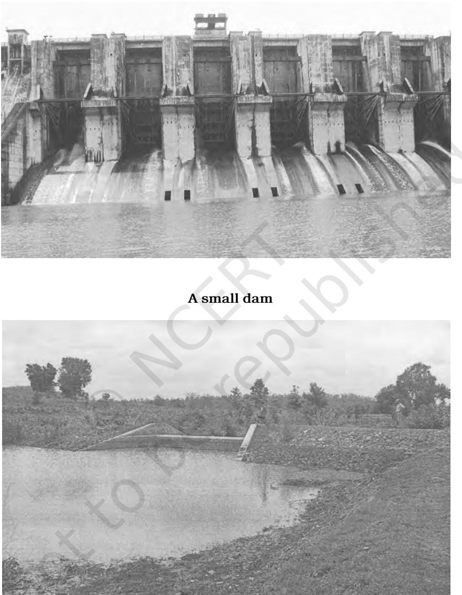
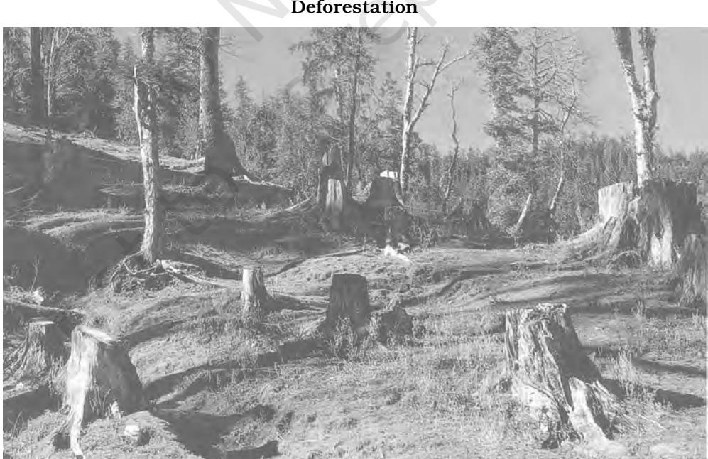
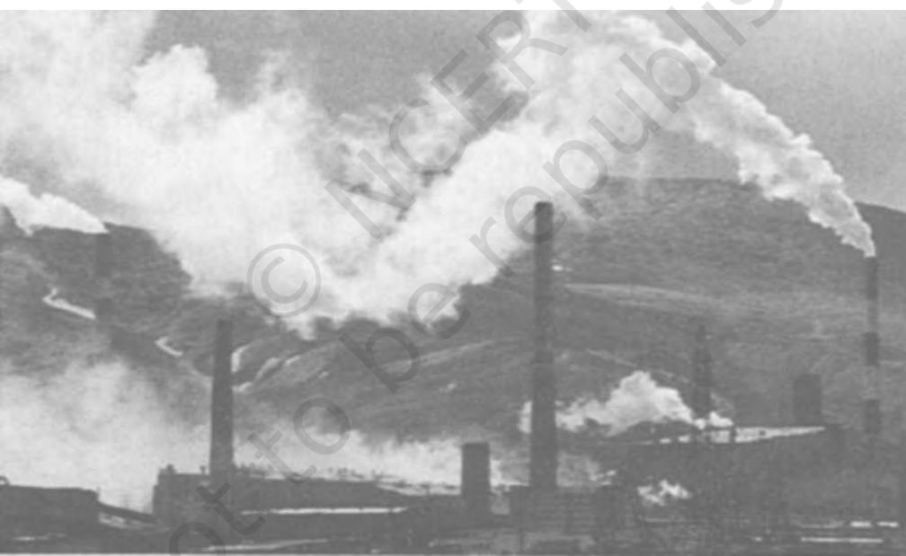
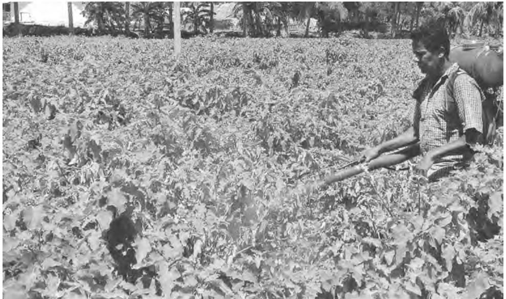

# CHAPTER 3

50 UNDERSTANDING SOCIETY

# ENVIRONMENT AND SOCIETY

Look around you. What do you see? If you are in a classroom, you may see students in uniform, sitting on chairs with books open on their desk. There are school bags with lunch and pencil boxes. Ceiling fans might be whirring overhead. Have you ever thought about where these things — school clothes, furniture, bags, electricity, come from? If you trace their origins, you will find that the source of each material object lies in nature. Every day, we use objects whose production draws upon natural resources from around the world. The chair in your classroom may be made from wood with iron nails, glue and varnish. Its journey from a tree in a forest or plantation to you depends on electricity, diesel, facilities for trade, and telecommunications. Along the way, it has passed through the hands of loggers, carpenters, supervisors and managers, transporters, traders and those in charge of buying school furniture. These producers and distributors, and the inputs that they provide into chair manufacturing, in turn use a variety of goods and services derived from nature. Try and map these resource flows and you will soon see how complex such relationships are!

In this chapter, we will study social relationships with the environment as they have changed over time and as they vary from place to place. It is important to analyse and interpret such variations in a systematic way. There are many urgent environmental problems that demand our attention. To address these crises effectively, we need a sociological framework for understanding why they occur and how they might be prevented or resolved.

All societies have an ecological basis. The term ecology denotes the web of physical and biological systems and processes of which humans are one element. Mountains and rivers, plains and oceans, and the flora and fauna that they support, are a part of ecology. The ecology of a place is also affected by the interaction between its geography and hydrology. For example, the plant and animal life unique to a desert is adapted to its scarce rainfall, rocky or sandy soils, and extreme temperatures. Similar ecological factors limit and shape how human beings can live in any particular place.

Over time, however, ecology has been modified by human action. What appears to be a natural feature of the environment — aridity or floodproneness, for example, is often produced by human intervention. Deforestation in the upper catchment of a river may make the river more flood-prone. Climate change brought about by global warming is another instance of the widespread impact of human activity on nature. Over time, it is often difficult to separate and distinguish between the natural and human factors in ecological change.

#### Activity 1

Did you know that the Ridge forest in Delhi is not the natural vegetation of this region but was planted by the British around 1915? Its dominant tree species is Prosopis juliflora (vilayati kikar or vilayati babul) which was introduced into India from South America and which has become naturalised all over north India.

Did you know that the chaurs, the wide grassy meadows of Corbett National Park in Uttarakhand which offer excellent views of wildlife, were once agricultural fields? Villages in the area were relocated in order to create what now appears to be a pristine wilderness.

Can you think of other examples where what seems to be 'natural' is actually modified by cultural interventions?

Alongside biophysical properties and processes that may have been transformed by human action — for example, the flow of a river and the species composition of a forest, there are other ecological elements around us that are more obviously humanmade. An agricultural farm with its soil and water conservation works, its cultivated plants and domesticated animals, its inputs of synthetic fertilisers and pesticides, is clearly a human transformation of nature. The built environment of a city, made from concrete, cement, brick, stone, glass and tar, uses natural resources but is very much a human artefact.

Social environments emerge from the interaction between biophysical ecology and human interventions. This is a two-way process. Just as nature shapes society, society shapes nature. For instance, the fertile soil of the Indo-Gangetic floodplain enables intensive agriculture. Its high productivity allows dense population settlements and generates enough surpluses to support other, nonagricultural activities, giving rise to complex hierarchical societies and states. In contrast, the desert of Rajasthan can only support pastoralists who move from place to place in order to keep their livestock supplied with fodder. These are instances of ecology shaping the forms of human life and culture. On the other hand, the social organisation of capitalism has shaped nature across the world. The private automobile is one instance of a capitalist commodity

that has transformed lives and landscapes. Air pollution and congestion in cities, regional conflicts and wars over oil, and global warming are just a few of the environmental effects of cars. Human interventions increasingly have the power to alter environments, often permanently.

The ecological effects of the Industrial Revolution in Britain were felt all over the world. Large areas of southern North America and the Caribbean were converted to plantations to meet the demand for cotton in the mills of Lancashire. Young West Africans were forcibly transported to America to work as slave labour on the plantations. The depopulation of West Africa caused its agricultural economy to decline, with fields reverting to fallow wastelands. In Britain, smoke from the coal-burning mills fouled the air. Displaced farmers and labourers from the countryside came to the cities for work and lived in wretched conditions. The ecological footprints of the cotton industry could be found all over urban and rural environments.

The interaction between environment and society is shaped by social organisation. Property relations determine how and by whom natural resources can be used. For instance, if forests are owned by the government, it will have the power to decide whether it should lease them to timber companies or allow villagers to collect forest produce. Private ownership of land and water sources will affect whether others can have access to these resources and on what terms and conditions. Ownership and control over resources is also related to the division of labour in the production process. Landless labourers and women will have a different relationship with natural resources than men. In rural India, women are likely to experience resource scarcity more acutely because gathering fuel and fetching water are generally women's tasks but they do not control these resources. Social organisation influences how different social groups relate to their environment.

Different relationships between environment and society also reflect different social values and norms, as well as knowledge systems. The values underlying capitalism have supported the commodification of nature, turning it into objects that can be bought and sold for profit. For instance, the multiple cultural meanings of a river — its ecological, utilitarian, spiritual, and aesthetic significance, are stripped down to a single set of calculations about profit and loss from the sale of water for an entrepreneur. Socialist values of equality and justice have led to the seizure of lands from large landlords and their redistribution among landless peasants in a number of countries. Religious values have led some social groups to protect and conserve sacred groves and species and others to believe that they have divine sanction to change the environment to suit their needs.

There are many different perspectives on the environment and its relationship to society. These differences include the 'naturenurture' debate and whether individual characteristics are innate or are influenced by environmental factors. For instance, are people poor because they are innately less talented or hard-working or because they are born into a situation of disadvantage and lack of opportunity? Theories and data about environment and society are influenced by the social conditions under which they emerge. Thus the notions that women are intrinsically less able than men, and Blacks naturally less able than Whites, were challenged as ideas of equality became more widespread during the 18th century's social and political revolutions. Colonialism generated a great deal of knowledge about environment and society, often systematically compiling it in order to make resources available to the imperial powers. Geology, geography, botany, zoology, forestry and hydraulic engineering were among the many disciplines that were created and institutionalised to facilitate the management of natural resources for colonial purposes.

Environmental management is, however, a very difficult task. Not enough is known about biophysical processes to predict and control them. In addition, human relations with the environment have become increasingly complex. With the spread of industrialisation, resource extraction has expanded and accelerated, affecting ecosystems in unprecedented ways. Complex industrial technologies and modes of organisation require sophisticated management systems which are often fragile and vulnerable to error. We live in risk societies using technologies and products that we do not fully grasp. The occurrence of nuclear disasters like Chernobyl, industrial accidents like Bhopal, and Mad Cow disease in Europe shows the dangers inherent in industrial environments.

#### Bhopal Industrial Disaster: Who was to Blame?

On the night of 3 December 1984, a deadly gas spread through Bhopal, killing about 4,000 people and leaving another 200,000 permanently disabled. The gas was later identified as methyl isocyanate (MIC), accidentally released by a Union Carbide pesticide factory in the city. In its State of India's Environment: The Second Citizens' Report, the Centre for Science and Environment analysed the reasons behind the disaster:

'Union Carbide's coming to Bhopal in 1977 was welcomed by all, because it meant jobs and money for Bhopal, and saving in foreign exchange for the country, with the rising demand for pesticides after the Green Revolution. The MIC plant was troublesome from the start and there were several leakages, including one that caused the death of a plant operator, until the big disaster. However, the government steadfastly ignored warnings, notably from the head of the Bhopal Municipal Corporation who issued notice to Union Carbide to move out of Bhopal in the late 1970s. The officer was transferred and the company donated Rs 25,000 to the Corporation for a park.

The warnings kept coming. In May 1982, three experts from the Union Carbide Corporation, USA, surveyed safety measures and pointed out alarming lapses. These fears were reported in a local weekly Rapat, in what was to be a series of prophetic articles in 1982. At the same time, the factory's employees union also wrote to Central ministers and the chief minister warning them of the situation. The state Labour Minister reassured legislators at several times that the factory was safe. Only a few weeks before the gas leak, the factory had been granted an environmental clearance certificate by the state pollution control board. The Central government rivalled its state counterpart in casualness. It ignored the plant's safety record in granting it permission and ignored Department of Environment guidelines on the siting of hazardous plants.

Why the guidelines and warnings were ignored is clear. The company employs the relatives of powerful politicians and bureaucrats. Its legal adviser is an important political leader and its public relations officer is the nephew of a former minister. The company's posh guesthouse was always at the disposal of politicians. The chief minister's wife had reportedly received lavish hospitality from the company during visits to the USA, and the company had donated Rs 1.5 lakh to a welfare organisation in the chief minister's home town.

Union Carbide Corporation also played its full part in the run-up to the tragedy. The Bhopal plant was under-designed and lacked several safety features. It did not have a computerised early warning system, a standard device in the company's factories in the US. The company had not worked out emergency evacuation procedures with the local community. The plant was not being maintained and operated at the requisite level of efficiency. Morale was low because sales were dropping and the plant was running at a third of its capacity. Staff strength had been reduced and many engineers and operators had left, making it impossible for the existing staff to monitor all the tasks. Many instruments were out of order. Discussion: Which social institutions and organisations play a role in industrial accidents like the Bhopal disaster? What steps can be taken to prevent such disasters?

#### MAJOR ENVIRONMENTAL PROBLEMS AND RISKS

Although the relative importance or urgency of different environmental hazards may vary from country to country and context to context, the following are globally recognized as the main ones:

#### A. Resource Depletion

Using up non-renewable natural resources is one of the most serious environmental problems. While fossil fuels and specially petroleum hog the headlines, the depletion and destruction of water and land is probably even more rapid. The rapid decline in groundwater levels is an acute problem all over India, especially in the states of Punjab, Haryana and Uttar Pradesh. Aquifers which have accumulated water over hundreds and thousands of years are being emptied in matter of a few decades to meet the growing demands of intensive agriculture, industry and urban centres. Rivers have also been dammed and diverted, causing irreversible damage to the ecology of water basins. Many water bodies in urban areas have been filled up and built upon, destroying the natural drainage of the landscape. Like groundwater, topsoil too is created over thousands of years. This agricultural resource, too, is being destroyed due to poor environmental management leading to erosion, water-logging and salinisation. The production of bricks for building houses is another reason for the loss of topsoil.

Biodiversity habitats such as forests, grasslands and wetlands are the other major resource facing rapid depletion, largely due to the expansion of areas under agriculture. Though various parts of the globe, including some parts of India, appear to have seen some re-forestation or increase in vegetative cover in recent decades, the overall trend is towards the loss of biodiversity. The shrinking of these habitats has endangered many species, several of them unique to India. You may have read of the recent crisis when it was discovered that the tiger population had fallen sharply despite strict laws and large sanctuaries.

#### B. Pollution

Air pollution is considered to be a major environmental problem in urban and rural areas, causing respiratory and

other problems which result in serious illness and death. The sources of air pollution include emissions from industries and vehicles, as well as the burning of wood and coal for domestic use. We have all heard of pollution from vehicles and factories, and seen pictures of smoking chimneys and exhaust pipes in cars. But we often don't realise that indoor pollution from cooking fires is also a serious source of risk. This is particularly true of rural homes where wood fires using green or poorly burning wood, badly designed a result of air pollution exposure. This finding more than doubles previous estimates and confirms that air pollution is now the world's largest single environmental health risk. Reducing air pollution could save millions of lives. This has enabled scientists to make a more detailed analysis of health risks from a wider demographic spread that now includes rural as well as urban areas. In 2012, total 3.3 million deaths linked to indoor air pollution and 2.6 million deaths related to outdoor air pollution.*

Industrial Pollution

fireplaces (chulhas), and poor ventilation combine to put village women at serious risk because they do the cooking. WHO reports that in 2012 around 7 million people died one in eight of total global deaths — as

Water pollution is also a very serious issue affecting surface as well as groundwater. Major sources include not only domestic sewage and factory effluents but also the runoff from farms where large amounts of synthetic

* Weblink: www.who.int/mediacentre/news/releases/2014/air-pollution/en/

Spraying pesticide in a brinjal field

fertilisers and pesticides are used. The pollution of rivers and waterbodies is a particularly important problem.

Cities also suffer from noise pollution, which has been the subject of court orders in many cities. Sources include amplified loudspeakers used at religious and cultural events, political campaigns, vehicle horns and traffic, and construction work.

#### C. Global Warming

The release of particular gases (carbon dioxide, methane and others) creates a 'greenhouse' effect by trapping the sun's heat and not allowing it to dissipate. This has caused a small but significant rise in global temperatures. The resulting climate change is projected to melt polar ice-fields and raise the sea level, thus submerging low-lying coastal areas, and more important, affecting the ecological balance. Global warming is also likely to result in greater fluctuations and uncertainty in climates across the world. China and India are increasingly significant contributors to world carbon and greenhouse gas emissions.

# D. Genetically Modified Organisms

New techniques of gene-splicing allow scientists to import genes from one species into another, introducing new characteristics. For instance, genes from Bacillus thuringiensis have been introduced into cotton species, making it resistant to the bollworm, a major pest. Genetic modification may also be done to shorten growing time, increase size and the shelf-life of crops. However, little is known about the long term effects of genetic modification on those who eat these foods or on ecological systems. Agricultural companies can also use genetic modification to create sterile seeds, preventing farmers from re-using them, and guaranteeing that seeds remain their profit-yielding property, forcing farmers to be dependent on them.

# E. Natural and Man-madeEnvironmental Disasters

This is a self-explanatory category. The Bhopal disaster of 1984 killed about 4,000 people when a toxic gas leaked from the Union Carbide factory, and the tsunami of 2004 killed thousands of people are the most recent examples of man-made and natural environmental disasters.

# WHY ENVIRONMENTAL PROBLEMS ARE ALSO SOCIAL PROBLEMS

How environmental problems affect different groups is a function of social inequality. Social status and power determine the extent to which people can insulate themselves from environmental crises or overcome it. In some cases, their 'solutions' may actually worsen environmental disparities. In Kutch, Gujarat, where water is scarce, richer farmers have invested in deep bore tubewells to tap groundwater to irrigate their fields and grow cash crops. When the rains fail, the earthen wells of the poorer villagers run dry and they do not even have water to drink. At such times, the moist green fields of the rich farmers seem to mock them. Certain environmental concerns sometimes appear to be universal concerns, not particular to specific social groups. For instance, reducing air pollution or protecting biodiversity seem to be in the public interest. A sociological analysis shows, however, that how public priorities are set and how they are pursued may not be universally beneficial. Securing the public interest may actually serve the interests of particular politically and economically powerful groups, or hurt the interests of the poor and politically weak. As the debates over large dams and around protected areas show, the environment as a public interest is a hotly contested arena.

The school of social ecology points out that social relations, in particular the organisation of property and production, shape environmental perceptions and practices. Different social groups stand in different relationships to the environment and approach it differently. A Forest Department geared to maximising revenues from supplying large volumes of bamboo to the paper industry will view and use a forest very differently from an artisan who harvests bamboo to make baskets. Their varied interests and ideologies generate environmental conflicts. In this sense, environmental crises have their roots in social inequality. Addressing environmental problems requires changing environmentsociety relations, and this in turn requires efforts to change relations between different social groups — men and women, urban and rural people, landlords and labourers. Changed social relations will give rise to different knowledge systems and modes of managing the environment.

> What literally defines social ecology as "social" is its recognition of the often overlooked fact that nearly all our present ecological problems arise from deep-seated social problems. Conversely, present ecological problems cannot be clearly understood, much less resolved, without resolutely dealing with problems within society. To make this point more concrete: economic, ethnic, cultural, and gender conflicts, among many others, lie at the core of the most serious ecological dislocations we face today — apart, to be sure, from those that are produced by natural catastrophes. – Murray Bookchin, political philosopher and founder of the Institute for Social Ecology

Two examples of environmentsociety conflicts are given below:

# Sustainable Development

The relation between ecology and economy has been a complex one. But one thing is certain that, unless there is a balance between the two, the future of humanity will remain bleak. Since the last 300 years, the way economic development has been going on, with its emphasis on controlling the nature and exploiting it ruthlessly for the benefit of a section of population, has led to extinction of thousands of species of flora and fauna. The emphasis on nonrenewable energy and introduction of large number of new species ostensibly to meet growing demand of industrial world has played havoc with ecology. There is growing concern worldwide that if the present pace of depletion of natural resource and extinction of biodiversity continues for some more time, the future generation will have to pay the price for it.

"Sustainable development is development that meets the needs of the present without compromising the ability of future generations to meet their own needs. It contains within it two key concepts: the concept of needs, in particular the essential needs of the world's poor, to which overriding priority should be given; and the idea of limitations imposed by the state of technology and social organization on the environment's ability to meet present and future needs." (Brundtland Report, October 1987).*

Today the basis of capitalist development is consumption. Old things must be destroyed just for the introduction of new things so that people continue to consume new industrial products. "There is growing inequality in the world. No amount of

* Presentation of the report, Our Common Future, by Brundtland at a press conference organised by the World Commission on Environment and Development in London, England on 27 April 1987.

growth and economic prosperity is enough anymore, because aspiration is the new God. This means that anybody who is poor is marginalised simply because they have just not made the grade. There is no longer space for such failure in our brave, newer world. It is about the survival of the fittest, in a way that would have made Darwin insane." (Why shouldn't I be intolerant?, Sunita Narain in Down to Earth, 25 January 2016)

We are living in an unequal world where we want to control resources and opportunities. The already existing system of social stratification makes it only too easy for some sections of people to control most of the available resources and opportunities. We have to make the world worth living not only for ourselves but for generations to come. We cannot be ignorant to the needs of the present nor can we be oblivious of the needs of the future. We need to build a society where people are at par; where there is equitable distribution of resources; where the aim is development but one that is inclusive and not exclusive. This is what will make us sustainable.

In this light, spearheaded by the 193 member states of United Nations as well as the global civil society has, through a deliberative process, arrived at the 17 "Global Goals" of sustainable development with 169 targets. These goals to a large extent derive from the sentiment expressed often by former United Nations Secretary-General Ban Ki Moon in his quote, "there can be no Plan B, because there is no Planet B".

> 'God forbid that India should ever take to industrialism in the manner of the West. The economic imperialism of a single tiny island kingdom (England) is today keeping the world in chains. If an entire nation of 300 million took to similar economic exploitation, it would strip the world bare like locusts.'

### — Mahatma Gandhi

Over the last six years, reports indicate that thousands of farmers in Andhra Pradesh, Karnataka and Maharashtra have killed themselves, often by drinking pesticide. What drives farmers, people who stoically deal with the uncertainties inherent in agriculture, to this extreme step? The investigation of journalist P. Sainath shows that farmers' recent distress is due to a fusion of environmental and economic factors. Agrarian conditions have become more volatile as farmers are exposed to the fluctuations of the world market and as government support for small farmers declines due to liberalisation policies. Cotton farmers grow a high-risk, high-return crop. Cotton needs some irrigation. It is also very susceptible to pest infestation. Cotton growers thus need capital to invest in irrigation and pest control. Both of these inputs have become more expensive over the years: high levels of extraction have depleted water reserves so farmers have to drill deeper, and pests have become resistant to many pesticides, requiring farmers to spray new pesticides, more frequently. Farmers in need of credit to purchase these inputs end up approaching private moneylenders and traders who charge them high rates of interest. If the crop fails, the farmer can't repay the money. Not only can they not feed their families, they cannot fulfil family obligations like arranging children's marriages. Faced with financial and social ruin, many farmers have nowhere to turn. Suicide seems to be the only way out to them.

Discussion: Is water scarcity natural or human-made? What social factors shape how water is allocated among different users? How do different patterns of water-use affect different social groups?

How is water depleted through agricultural activity?

#### Activity 2

Find out how much water your household uses in a day. Try and find out how much water is used by comparable households belonging to different income groups. How much time and money do different households spend on getting water? Within the household, whose job is it to collect water? How much water does the government provide to different classes of people?

As cities grow, the conflict over urban space is becoming more acute. While migrants come to the city in search of work, they cannot afford scarce legal housing and are forced to settle on public lands. This land is now in great demand to build infrastructure for affluent residents and visitors malls and multiplexes, hotels and tourist sites. As a result, poor workers and their families are being evicted to the outskirts of the city and their homes demolished. Besides land, air and water have also become highly contested resources in the urban environment.

(Taken from: Amita Baviskar in 'Between Violence and Desire: Space, Power and Identity in the Making of Metropolitan Delhi' in) International Social Science Journal. 175: 89-98. 2003)

Discussion: Why do the urban poor often live in slums? Which social groups control landed property and housing in the city? What social factors affect people's access to water and sanitation?

#### Activity 3

Imagine that you were a fifteen year-old girl or boy living in a slum. What would your family do and how would you live? Write a short essay describing a day in your life.

# GLOSSARY

Hydrology: The science of water and its flows; or the broad structure of water resources in a country or region.

Deforestation: The loss of forest area due to cutting down of trees and/or taking over of the land for other purposes, usually cultivation.

Green House: A covered structure for protecting plants from extremes of climate, usually from excessive cold; a green house (also called a hot house) maintains a warmer temperature inside compared to the outside temperature.

Emissions: Waste gases given off by a human-initiated process, usually in the context of industries or vehicles.

Effluents: Waste materials in fluid form produced from industrial processes.

Aquifers: Natural underground formations in the geology of a region where water gets stored.

Monoculture: When the plant life in a locality or region is reduced to a single variety.

# EXERCISES

- 1. Describe in your own words what you understand by the term 'ecology'.
- 2. Why is ecology not limited only to the forces of nature?
- 3. Describe the two-way process by which 'social environments' emerge.
- 4. Why and how does social organisation shape the relationship between the environment and society?
- 5. Why is environmental management a complex and huge task for society?
- 6. What are some of the important forms of pollution-related environmental hazards?
- 7. What are the major environmental issues associated with resource depletion?
- 8. Explain why environmental problems are simultaneously social problems.
- 9. What is meant by social ecology?
- 10. Describe some environment related conflicts that you know of or have read about. (Other than the examples in the text.)

# REFERENCES

- Centre for Science and Environment. 1982. The State of India's Environment: The Citizens' Report. CSE, New Delhi.
- DAVIS, MIKE. 2004. 'Planet of Slums: Urban Involution and the Informal Proletariat' in New Left Review, 26: 5-34.
- DAVIS, MIKE. 2004. 'The Political Ecology of Famine: The Origins of the Third World' in Richard Peet and Michael Watts (eds) Liberation Ecologies: Environment, Development, Social Movements. Routledge (second edition), London.
- GADGIL, MADHAV and RAMACHANDRA GUHA. 1995. Ecology and Equity: The Use and Abuse of Nature in Contemporary India. Penguin, New Delhi.
- GUHA, RAMACHANDRA. 1997. 'The Environmentalism of the Poor' in Ramachandra Guha and J. Martinez-Alier. Varieties of Environmentalism: Essays North and South. Oxford University Press, Delhi.
- NARAIN, SUNITA. 2016. 'Why shouldn't I be Intolerant'. Down to Earth. Available at: http://www.downtoearth.org.in (accessed on 25 January 2016)
- POLLAN, MICHAEL. 2001. The Botany of Desire: A Plant's-Eye View of the World. Random House, New York.

