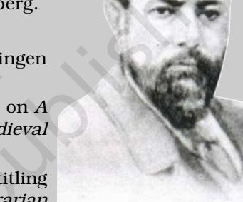

CHAPTER 4

INTRODUCING WESTERN SOCIOLOGISTS 65

# INTRODUCING WESTERN SOCIOLOGISTS

Sociology is sometimes called the child of the 'age of revolution'. This is because it was born in 19th century Western Europe, after revolutionary changes in the preceding three centuries that decisively changed the way people lived. Three revolutions paved the way for the emergence of sociology: the Enlightenment, or the scientific revolution; the French Revolution; and the Industrial Revolution. These processes completely transformed not only European society, but also the rest of the world as it came into contact with Europe.

In this chapter the key ideas of three sociological thinkers: Karl Marx, Emile Durkheim and Max Weber will be discussed. As part of the classical tradition of sociology, they laid the foundation of the subject. Their ideas and insights have remained relevant even in the contemporary period. Of course, these ideas have also been subjected to criticism and have undergone major modifications. But since ideas about society are themselves influenced by social conditions, we begin with a few words about the context in which sociology emerged.

# THE CONTEXT OF SOCIOLOGY

The modern era in Europe and the conditions of modernity that we take for granted today were brought about by three major processes. These were: the Enlightenment or dawning of the 'age of reason'; the quest for political sovereignty embodied in the French Revolution; and the system of mass manufacture inaugurated by the Industrial Revolution. Since these have been discussed at length in Chapter 1 of Introducing Sociology, here we will only mention some of the intellectual consequences of these momentous changes.

## Activity 1

Revisit the discussion of the coming of the modern age in Europe in Chapter 1 of Introducing Sociology. What sorts of changes were these three processes associated with?

## The Enlightenment

During the late 17th and 18th centuries, Western Europe saw the emergence of radically new ways of thinking about the world. Refered to as 'The Enlightenment', these new philosophies established the human being at the centre of the universe, and rational thought as the central feature of the human being. The ability to think rationally and critically transformed the individual human being into both the producer and the user of all knowledge, the 'knowing subject'. On the other hand, only persons who could think and reason could be considered as fully human. Those who could not remained deficient as human beings and were considered as not fully evolved humans, as in the case of the natives of primitive societies or 'savages'. Being the handiwork of humans, society was amenable to rational analysis and thus comprehensible to other humans. For reason to become the defining feature of the human world, it was necessary to displace nature, religion and the divine acts of gods from the central position they had in earlier ways of understanding the world. This means that the Enlightenment was made possible by, and in turn helped to develop, attitudes of mind that we refer to today as secular, scientific and humanistic.

## The French Revolution

The French Revolution (1789) announced the arrival of political sovereignty at the level of individuals as well as nation-states. The Declaration of Human Rights asserted the equality of all citizens and questioned the legitimacy of privileges inherited by birth. It signaled the emancipation of the individual from the oppressive rule of the religious and feudal institutions that dominated France before the Revolution. The peasants, most of whom were serfs (or bonded labourers) tied to landed estates owned by members of the aristocracy, were freed of their bonds. The numerous taxes paid by the peasants to the feudal lords and to the church were cancelled. As free citizens of the republic, sovereign individuals were invested with rights and were equal before the law and other institutions of the state. The state had to respect the privacy of the autonomous individual and its laws could not intrude upon the domestic life of the people. A separation was built between the public realm of the state and a private realm of the household. New ideas about what was appropriate to the public and private spheres developed. For example, religion and the family became more 'private' while education (specially schooling) became more 'public'. Moreover, the nation-state itself was also redefined as a sovereign entity with a centralised government. The ideals of the French Revolution liberty, equality and fraternity became the watchwords of the modern state.

## The Industrial Revolution

The foundations of modern industry were laid by the Industrial Revolution, which began in Britain in the late 18th and early 19th centuries. It had two major aspects. The first was the systematic application of science and technology to industrial production, particularly the invention of new machines and the harnessing of new sources of power. Secondly, the industrial revolution also evolved new ways of organising labour and markets on a scale larger than anything in the past. New machines like the Spinning Jenny (which greatly increased the productivity of the textile industry) and new methods of obtaining power (such as the various versions of the steam engine) facilitated the production process and gave rise to the factory system and mass manufacture of goods. These goods were now produced on a gigantic scale for distant markets across the world. The raw materials used in their production were also obtained from all over the world. Modern large scale industry thus became a world wide phenomenon.

These changes in the production system also resulted in major changes in social life. The factories set up in urban areas were manned by workers who were uprooted from the rural areas and came to the cities in search of work. Low wages at the factory meant that men, women and even children had to work long hours in hazardous circumstances to eke out

a living. Modern industry enabled the urban to dominate over the rural. Cities and towns became the dominant forms of human settlement, housing large and unequal populations in small, densely populated urban areas. The rich and powerful lived in the cities, but so did the working classes who lived in slums amidst poverty and squalor. Modern forms of governance, with the state assuming control of health, sanitation, crime control and general 'development' created the demand for new kinds of knowledge. The social sciences and particularly sociology emerged partly as a response to this need.

From the outset sociological thought was concerned with the scientific analysis of developments in industrial society. This has prompted observers to argue that sociology was the 'science of the new industrial society'. Empirically informed scientific discussion about trends in social behaviour only became possible with the advent of modern industrial society. The scientific information generated by the state to monitor and maintain the health of its social body became the basis for reflection on society. Sociological theory was the result of this selfreflection.

|  | Karl Marx (1818-1883) |
| --- | --- |
|  | Biography |
| Karl Marx was born on 5 May 1818 in Trier, part of |  |
| the Rhineland province of Prussia in Germany. Son |  |
| of a prosperous liberal lawyer. |  |
| 1834-36: | Studied law at the University of Bonn and |
| then at the University of Berlin, where he |  |
| was much influenced by the Young |  |
| Hegelians. |  |
| 1841: | Completed his doctoral thesis in |
| philosophy from the University of Jena. |  |
| 1843: | Married Jenny von Westphalen and moved |
| to Paris. |  |
| 1844: | Met Friedrich Engels in Paris, who became a lifelong friend. |
| 1847: | Invited by the International Working Men's Association to prepare a |
|  | document spelling out its aims and objectives. This was written jointly |
|  | by Marx and Engels and published as the Manifesto of the Communist |
| Party (1948) |  |
| 1849: | Exiled to England and lived there till his death. |
| 1852: | The Eighteenth Brumaire of Louis Bonaparte (published). |
| 1859: | A Contribution to the Critique of Political Economy (published). |
| 1867: Capital, Vol. I, published. |  |
| 1881: | Death of Jenny von Westphalen. |
| 1883: | Marx dies and is buried in London's Highgate Cemetery. |

Karl Marx was from Germany but spent most of his intellectually productive years in exile in Britain. His radical political views led him to be exiled from Germany, France and Austria. Though Marx had studied philosophy he was not a philosopher. He was a social thinker who advocated an end to oppression and exploitation. He believed that scientific socialism would achieve this goal. To that end he engaged in a critical analysis of capitalist society to expose its weaknesses and bring about its downfall. Marx argued that human society had progressed through different stages. These were: primitive communism, slavery, feudalism and capitalism. Capitalism was the latest phase of human advancement, but Marx believed that it would give way to socialism.

Capitalist society was marked by an ever intensifying process of alienation operating at several levels. First, modern capitalist society is one where humans are more alienated from nature than ever before; second, human beings are alienated from each other as capitalism individualises previously collective forms of social organisation, and as relationships get more and more market-mediated. Third, the large mass of working people is alienated from the fruits of its labour because workers do not own the products they produce. Moreover, workers have no control over the work process itself — unlike in the days when skilled craftsmen controlled their own labour, today the content of the factory worker's working day is decided by the management. Finally, as the combined result of all these alienations, human beings are also alienated from themselves and struggle to make their lives meaningful in a system where they are both more free but also more alienated and less in control of their lives than before.

However, even though it was an exploitative and oppressive system, Marx believed that capitalism was nevertheless a necessary and progressive stage of human history because it created the preconditions for an egalitarian future free from both exploitation and poverty. Capitalist society would be transformed by its victims, i.e. the working class, who would unite to collectively bring about a revolution to overthrow it and establish a free and equal socialist society. In order to understand the working of capitalism, Marx undertook an elaborate study of its political, social and specially its economic aspects.

Marx's conception of the economy was based on the notion of a mode of production, which stood for a broad system of production associated with an epoch or historical period. Primitive communism, slavery, feudalism and capitalism were all modes of production. At this general level, the mode of production defines an entire way of life characteristic of an era. At a more specific level, we can think of the mode of production as being something like a building in the sense that it consists of a foundation or base, and a superstructure or something erected on top of the base. The base or economic base — is primarily economic and includes the productive forces and production relations. Productive forces refer to all the means or factors of production such as land, labour, technology, sources of energy (such as electricity, coal, petroleum and so on). Production relations refer to all the economic relationships and forms of labour organisation which are involved in production. Production relations are also property relations, or relationships based on the ownership or control of the means of production.

For example, in the mode of production called primitive communism, the productive forces consisted mostly of nature — forests, land, animals and so on — along with very rudimentary forms of technology like simple stone tools and hunting weapons. Production relations were based on community property (since individual private property did not yet exist) and included tribal forms of hunting or gathering which were the prevalent forms of labour organisation.

The economic base thus consisted of productive forces and relations of production. On this base rested all the social, cultural and political institutions of society. Thus, institutions like religion, art, law, literature or different forms of beliefs and ideas were all part of the 'superstructure' which was built on top of the base. Marx argued that people's ideas and beliefs originated from the economic system of which they were part. How human beings earned their livelihood determined how they thought — material life shaped ideas, ideas did not shape material life. This argument went against the dominant ways of thinking in Marx's time, when it was common to argue that human beings were free to think whatever they wanted and that ideas shaped the world.

Marx placed great emphasis on economic structures and processes because he believed that they formed the foundations of every social system throughout human history. If we understand how the economy works and how it has been changing in the past, he argued, we can learn how to change society in the future. But how can such change be brought about? Marx's answer: through class struggle.

# CLASS STRUGGLE

For Marx, the most important method of classifying people into social groups was with reference to the production process, rather than religion, language, nationality or similar identities. He argued that people who occupy the same position in the social production process will eventually form a class. By virtue of their location in the production process and in property relations, they share the same interests and objectives, even though they may not recognise this immediately. Classes are formed through historical processes, which are in turn shaped by transformations in the conditions and forces of production, and consequent conflicts between already existing classes. As the mode of production — that is, the production technology and the social relations of production — changes, conflicts develop between different classes which result in struggles. For example, the capitalist mode of production creates the working class, which is a new urban, property-less group created by the destruction of the feudal agricultural system. Serfs and small peasants were thrown off their lands and deprived of their earlier sources of livelyhood. They then congregated in cities looking for ways to survive, and the pressure of the laws and police forced them to work in the newly built factories. Thus, a large new social group was created consisting of property-less people who were forced to work for their living. This shared location within the production process makes workers into a class.

Marx was a proponent of class struggle. He believed that class struggle was the major driving force of change in society. In The Communist Manifesto (which was also a programme of action), Marx and Engels presented their views in a clear and concise manner. Its opening lines declare, 'The history of all hitherto existing societies is the history of class struggle'. They went on to trace the course of human history and described how the nature of the class struggle varied in different historical epochs. As society evolved from the primitive to the modern through distinct phases, each characterised by particular kinds of conflict between the oppressor and oppressed classes. Marx and Engels wrote, 'Freeman and slave, patrician and plebeian, lord and serf, guild master and journeyman, in a word, oppressor and oppressed, stood in constant opposition to one another, carried out an uninterrupted, now hidden, now open fight'. The major opposing classes of each stage were identified from the contradictions of the production process. In capitalism the bourgeoisie (or capitalists) owned all the means of production, (such as investible capital, existing factories and machinery, land and so on). On the other hand, the working class lost all the means of production that it owned (or had access to) in the past. Thus, in the capitalist social system, workers had no choice but to sell their labour for wages in order to survive, because they had nothing else.

Even when two classes are objectively opposed to each other, they do not automatically engage in conflict. For conflict to occur it is necessary for them to become subjectively conscious of their class interests and identities, and therefore also of their rivals' interests and identities. It is only after this kind of

## Activity 2

Although it is also called a 'class', does the group formed by you and your classmates form a class in the Marxian sense? What arguments can you give in favour and against this view? Do factory workers and agricultural workers belong to the same class? What about workers and managers working in the same factory — do they both belong to the same class? Does a rich industrialist or factory owner who lives in the city and owns no agricultural land belong to the same class as a poor agricultural labourer who lives in the village and owns no land? What about a landlord who owns a lot of land and a small peasant who owns a small piece of land — do they belong to the same class if they live in the same village and are both landowners?

Think carefully about the reasons for your responses to these examples. [Suggestion: Try to imagine what interests the people mentioned in these examples may have in common; think of the position they occupy in the larger social system, particularly in relation to the production process.]

'class consciousness' is developed through political mobilisation that class conflicts occur. Such conflicts can lead to the overthrow of a dominant or ruling class (or coalition of classes) by the previously dominated or subordinated classes — this is called a revolution. In Marx's theory, economic processes created contradictions which in turn generated class conflict. But economic processes did not automatically lead to revolution social and political processes were also needed to bring about a total transformation of society.

The presence of ideology is one reason why the relationship between economic and socio-political processes becomes complicated. In every epoch, the ruling classes promote a dominant ideology. This dominant ideology, or way of seeing the world, tends to justify the domination of the ruling class and the existing social order. For example, dominant ideologies may encourage poor people to believe that they are poor not because they are exploited by the rich but because of 'fate', or because of bad deeds in a previous life, and so on. However, dominant ideologies are not always successful, and they can also be challenged by alternative worldviews or rival ideologies. As consciousness spreads unevenly among classes, how a class will act in a particular historical situation cannot be pre-determined. Hence, according to Marx, economic processes generally tend to generate class conflicts, though this also depends on political and social conditions. Given favourable conditions, class conflicts culminate in revolutions.

## Emile Durkheim (1858-1917)

Emile Durkheim was born on April 15, 1858 in Epinal in the Lorraine region of France on the German border. He was from an orthodox Jewish family; his father, grandfather and great grandfather were all rabbis or Jewish priests. Emile too was initially sent to a school for training rabbis.

- 1876: Enters the Ecole Normale Superieure in Paris to study philosophy.
- 1887: Appointed lecturer in social sciences and education at the University of Bordeaux.
- 1893: Publishes Division of Labour in Society, his doctoral dissertation.
- 1895: Publishes Rules of Sociological Method.
- 1897: Founds Anee Sociologique,the first social science journal in France; and publishes his famous study, Suicide.
- 1902: Joins the University of Paris as the Chair of Education. Later in 1913 the Chair was renamed Education and Sociology.
- 1912: Publishes The Elementary Forms of the Religious Life.
- 1917: Dies at the age of 59, heartbroken by the death of his son, Andre in World War I.

Emile Durkheim may be considered as the founder of sociology as a formal discipline as he was the first to become a Professor of Sociology in Paris in 1913. Born into an orthodox Jewish family, Durkheim was sent to a rabbinical school (a Jewish religious school) for his early education. By the time he entered the Ecole Normale Superieure in 1876 he broke with his religious orientation and declared himself an agnostic. However, his moral upbringing had an enduring influence on his sociological thinking. The moral codes were the key characteristics of a society that determined the behaviour patterns of individuals. Coming from a religious family, Durkheim cherished the idea of developing a secular understanding of religion. It was in his last book, The Elementary Forms of Religious Life that he was finally able to fulfil this wish.

Society was for Durkheim a social fact which existed as a moral community over and above the individual. The ties that bound people in groups were crucial to the existence of society. These ties or social solidarities exerted pressure on individuals to conform to the norms and expectations of the group. This constrained the individual's behaviour pattern, limiting variation within a small range. Constriction of choice in social action meant that behaviour could now be predicted as it followed a pattern. So by observing behaviour patterns it was possible to identify the norms, codes and social solidarities which governed them. Thus, the existence of otherwise 'invisible' things like ideas, norms, values and so on could be empirically verified by studying the patterns of social behaviour of people as they related to each other in a society.

For Durkheim the social was to be found in the codes of conduct imposed on individuals by collective agreement. It was evident in the practices of everyday life. The scientific understanding of society that Durkheim sought to develop was based on the recognition of moral facts. He wrote, 'Moral facts are phenomena like others; they consist of rules of action recognizable by certain distinctive characteristics, it must then be possible to observe them, describe them, classify them and look for certain laws explaining them' (Durkheim 1964: 32). Moral codes were manifestations of particular social conditions. Hence the morality appropriate for one society was inappropriate for another. So for Durkheim, the prevailing social conditions could be deduced from the moral codes. This made sociology akin to the natural sciences and was in keeping with his larger objective of establishing sociology as a rigorous scientific discipline.

# DURKHEIM'S VISION OF SOCIOLOGY

Durkheim's vision of sociology as a new scientific discipline was characterised by two defining features. First, the subject matter of sociology — the study of social facts — was different from the other sciences. Sociology concerned itself exclusively with what he called the 'emergent' level, that is, the level of complex collective life where social phenomena can emerge. These phenomena — for example, social institutions like religion or the family, or social values like friendship or patriotism etc. — were only possible in a complex whole that was larger than (and different from) its constituent parts. Although it is composed entirely of individuals, a collective social entity like a football or cricket team becomes something other than and much more than just a collection of eleven persons. Social entities like teams, political parties, street gangs, religious communities, nations and so on belong to a different level of reality than the level of individuals. It is this 'emergent' level that sociology studies.

The second defining feature of Durkheim's vision of sociology was that, like most of the natural sciences, it was to be an empirical discipline. This was actually a difficult claim to make because social phenomena are by their very nature abstract. We cannot 'see' a collective entity like the Jain community, or the Bengali (or Malayalam or Marathi) speaking community, or the Nepalese or Egyptian national communities. At least, we cannot see them in the same straightforward way that we can see a tree or a boy or a cloud. Even when the social phenomenon is small — like a family or a theatre group — we can directly see only the individuals who make up the collectivity; we cannot see the collectivity itself. One of Durkheim's most significant achievements is his demonstration that sociology, a discipline that dealt with abstract entities like social facts, could nevertheless be a science founded on observable, empirically verifiable evidence. Although not directly observable, social facts were indirectly observable through patterns of behaviour. The most famous example of his use of a new kind of empirical data is in his study of Suicide. Although each individual case of suicide was specific to the individual and his/her circumstances, the average rate of suicide aggregated across hundreds of thousands of individuals in a community was a social fact. Thus, social facts could be observed via social behaviour, and specially aggregated patterns of social behaviour.

So what are 'social facts'? Social facts are like things. They are external to the individual but constrain their behaviour. Institutions like law, education and religion constitute social facts. Social facts are collective representations which emerge from the association of people. They are not particular to a person but of a general nature, independent of the individual. Attributes like beliefs, feelings or collective practices are examples.

## Division of Labour in Society

In his first book, Division of Labour in Society, Durkheim demonstrated his method of analysis to explain the evolution of society from the primitive to the modern. He classified a society by the nature of social solidarity which existed in that society. He argued that while a primitive society was organised according to 'mechanical' solidarity, modern society was based on 'organic' solidarity. Mechanical solidarity is founded on the similarity of its individual members and is found in societies with small populations. It typically involves a collection of different self-sufficient groups where each person within a particular group is engaged in similar activities or functions. As the solidarity or ties between people are based on similarity and personal relationships, such societies are not very tolerant of differences and any violation of the norms of the community attracts harsh punishment. In other words, mechanical solidarity based societies have repressive laws designed to prevent deviation from community norms. This was because the individual and the community were so tightly integrated that it was feared that any violation of codes of conduct could result in the disintegration of the community.

Organic solidarity characterises modern society and is based on the heterogeneity of its members. It is found in societies with large populations, where most social relationships necessarily have to be impersonal. Such a society is based on institutions, and each of its constituent groups or units is not selfsufficient but dependent on other units/groups for their survival. Interdependence is the essence of organic solidarity. It celebrates individuals and allows for their need to be different from each other, and recognises their multiple roles and organic ties. The laws of modern society are 'restitutive' in nature rather than 'repressive'. This means that in modern societies, the law aims to repair or correct the wrong that is done by a criminal act. By contrast, in primitive societies the law sought to punish wrong doers and enforced a sort of collective revenge for their acts. In modern society the individual was given some autonomy, whereas in primitive societies the individual was totally submerged in the collectivity.

A characteristic feature of modern societies is that individuals with similar goals come together voluntarily to form groups and associations. As these are groups oriented towards specific goals, they remain distinct from each other and do not seek to take over the entire life of its members. Thus, individuals have many different identities in different contexts. This enables individuals to emerge from the shadow of the community and establish their distinct identity in terms of the functions they perform and the roles they play. Since all individuals have to depend on others for the fulfilment of their basic needs like food, clothing, shelter and education, their intensity of interaction with others increases. Impersonal rules and regulations are required to govern social relations in such societies because personalised relations can no longer be maintained in a large population.

The Division of Labour in Society provides a good preview of Durkheim's enduring concerns. His effort to create a new scientific discipline with a distinct subject which can be empirically validated is clearly manifested in the way he discusses the different types of social solidarity as social facts. His objective and secular analysis of the social ties which underlie different types of society laid the foundation of sociology as the new science of society.

## Max Weber (1864-1920)

Max Weber was born on 21 April, 1864 in Erfurt, Germany into a Prussian family. His father was a magistrate and a politician who was an ardent monarchist and follower of Bismarck. His mother was from a distinguished liberal family from Heidelberg.

- 1882: Went to Heidelberg to study law. 1884-84: Studied at the universities of Gottingen and Berlin.
- 1889: Submitted his doctoral dissertation on A Contribution to the History of Medieval Business Organisations.
- 1891: Submitted his habilitation thesis (entitling him to be a teacher) on Roman Agrarian History and the Significance for Public and Private Law.

- 1893: Married Marianne Schnitger.
- 1894-96: Appointed Professor of Economics first at Freiburg, and then Heidelberg.
- 1897-1901: Has a nervous breakdown and falls ill; unable to work, travels to Rome.
- 1901: Weber resumes scholarly work.
- 1903: Became the Associate Editor of the journal Archives for Social Science and Social Welfare.
- 1904: Travels to the USA. Publishes The Protestant Ethic and the Spirit of Capitalism.
- 1918: Takes up a specially created chair in Sociology at Vienna.
- 1919: Appointed Professor of Economics at the University of Munich.
- 1920: Weber dies.

Almost all of his major works which made him famous were translated and published in book form only after his death. These include: The Protestant Ethic and the Spirit of Capitalism (1930), From Max Weber: Essays in Sociology (1946), Max Weber on the Methodology of the Social Sciences (1949), The Religion of India (1958) and Economy and Society (3 vols, 1968).

#### Activity 3

Try to compare what Durkheim and Marx say about the social division of labour. They both agree that as society evolves, the social organisation of production grows more complex, the division of labour becomes more detailed, and this creates unavoidable interdependencies among different social groups. But where Durkheim emphasises solidarity, Marx emphasises conflict. What do you think about this?

Can you think of reasons why Marx may be wrong about modern society? For example, can you think of situations or examples where people are joining together to form groups or collectivities despite being from different class backgrounds and having conflicting interests? What counter arguments could you give to persuade someone that Marx may still have a point?

Can you think of reasons why Durkheim may be wrong about modern society giving more freedom to the individual? For example, isn't it true that the spread of mass communication (specially through television) has tended to standardise popular fashion in things like clothes or music? Today, young people in different social groups, different countries, states or regions are now more likely to be listening to the same music, or wearing the same kind of clothes than ever before. Does this make Durkheim wrong? What could be the arguments for and against in this context?

Remember, sociology is not like mathematics where there is usually only one right answer. In anything to do with society and human beings, it is possible that there are many right answers, or that an answer is right in one context but wrong in another, or that it is partly right and partly wrong, and so on. In other words, the social world is very complex, and it changes from time to time and from place to place. This makes it all the more important to learn how to think carefully about the reasons why a particular answer may be right or wrong in a particular context.

Max Weber was one of the leading German social thinkers of his time. Despite long periods of physical and mental ill health, he has left a rich legacy of sociological writing. He wrote extensively on many subjects but focused on developing an interpretive sociology of social action and of power and domination. Another major concern of Weber was the process of rationalisation in modern society and the relationship of the various religions of the world with this process.

#### Max Weber and Interpretive Sociology

Weber argued that the overall objective of the social sciences was to develop an 'interpretive understanding of social action'. These sciences were thus very different from the natural sciences, which aimed to discover the objective 'laws of nature' governing the physical world. Since the central concern of the social sciences was with social action and since human actions necessarily involved subjective meanings, the methods of enquiry of social science also had to be different from the methods of natural science. For Weber, 'social action' included all human behaviour that was meaningful, that is, action to which actors attached a meaning. In studying social action the sociologist's task was to recover the meanings attributed by the actor. To accomplish this task the sociologist had to put themselves in the actor's place, and imagine what these meanings were or could have been. Sociology was thus a systematic form of 'empathetic understanding', that is, an understanding based not on 'feeling for' (sympathy) but 'feeling with' (empathy). The empathic (or empathetic) understanding which sociologists derive from this exercise enables them to access the subjective meanings and motivations of social actors.

Weber was among the first to discuss the special and complex kind of 'objectivity' that the social sciences had to cultivate. The social world was founded on subjective human meanings, values, feelings, prejudices, ideals and so on. In studying this world, the social sciences inevitably had to deal with these subjective meanings. In order to capture these meanings and describe them accurately, social scientists had to constantly practise 'empathetic understanding' by putting themselves (imaginatively) in the place of the people whose actions they were studying. But this investigation had to be done objectively even though it was concerned with subjective matters. Thus, 'empathetic understanding' required the sociologist to faithfully record the subjective meanings and motivations of social actors without allowing his/her own personal beliefs and opinions to influence this process in any way. In other words, sociologists were meant to describe, not judge, the subjective feelings of others. Weber called this kind of objectivity 'value neutrality'. The sociologist must neutrally record subjective values without being affected by her/his own feelings/opinions about these values. Weber recognised that this was very difficult to do because social scientists were also members of society and always had their own subjective beliefs and prejudices. However, they had to practise great self-discipline exercise an 'iron will' as he puts it in order to remain 'value neutral' when describing the values and worldviews of others.

Apart from empathetic under standing, Weber also suggested another methodological tool for doing sociology — the 'ideal type'. An ideal type is a logically consistent model of a social phenomenon that highlights its most significant characteristics. Being a conceptual tool designed to help analysis, it is not meant to be an exact reproduction of reality. Ideal types may exaggerate some features of phenomenon that are considered to be analytically important, and ignore or downplay others. Obviously an ideal type should correspond to reality in a broad sense, but its main job is to assist analysis by bringing out important features and connections of the social phenomenon being studied. An ideal type is to be judged by how helpful it is for analysis and understanding, not by how accurate or detailed a description it provides.

The ideal type was used by Weber to analyse the relationship between the ethics of 'world religions' and the rationalisation of the social world in different civilisations. It was in this context that Weber suggested that ethics of certain Protestant sects within Christianity had a deep influence on the development of capitalism in Europe.

Weber again used the ideal type to illustrate the three types of authority that he defined as traditional, charismatic and rational-legal. While the source of traditional authority was custom and precedence, charismatic authority derived from divine sources or the 'gift of grace', and rational-legal authority was based on legal demarcation of authority. Rationallegal authority which prevailed in modern times was epitomised in the bureaucracy.

## Bureaucracy

It was a mode of organisation which was premised on the separation of the public from the domestic world. This meant that behaviour in the public domain was regulated by explicit rules and regulations. Moreover, as a public institution, bureaucracy restricted the power of the officials in regard to their responsibilities and did not provide absolute power to them.

Bureaucratic authority is characterised by these features:

- (i) Functioning of Officials;
- (ii) Hierarchical Ordering of Positions;
- (iii) Reliance on Written Document
- (iv) Office Management; and
- (v) Conduct in Office.
- (i) Functioning of Officials: Within the bureaucracy officials have fixed areas of 'official jurisdiction' governed by rules, laws and administrative regulations. The regular activities of the bureaucratic organisation are distributed in a fixed way as official duties. Moreover, commands are issued by higher authorities for implementation by subordinates in a stable way, but the responsibilities of officials are strictly delimited by the authority available to them. As duties are to be fulfilled on a regular basis, only those who have the requisite qualifications to perform them are employed. Official positions in a bureaucracy are independent of the incumbent as they continue beyond the tenure of any occupant.
- (ii) Hierarchical Ordering of Positions: Authority and office are placed on a graded hierarchy where the higher officials supervise the lower ones. This allows scope of appeal to a higher official in case of dissatisfaction with the decisions of lower officials.
- (iii) Reliance on Written Document: The management of a bureaucratic organisation is carried out on the basis of written documents

(the files) which are preserved as records. There is cumulation in the decision making of the 'bureau' or office. It is also a part of the public domain which is separate from the private life of the officials.

- (iv) Office Management: As office management is a specialised and modern activity it requires trained and skilled personnel to conduct operations.
- (v) Conduct in Office: As official activity demands the full time attention of officials irrespective of her/his delimited hours in office, hence an official's conduct in office is governed by exhaustive rules and regulations. These separate her/ his public conduct from her/his behaviour in the private domain. Also since these rules and regulations have legal recognition, officials can be held accountable.

Weber's characterisation of bureaucracy as a modern form of political authority demonstrated how an individual actor was both recognised for her/his skills and training and given responsibilities with the requisite authority to implement them. The legal delimitation of tasks and authority constrained unbridled power and made officials accountable to their clients as the work was carried out in the public domain.

#### Activity 4

To what extent do you think the following groups or activities involve the exercise of bureacratic authority in Weber's sense?

(a) your class; (b) your school; (c) a football team; (d) a panchayat samiti in a village; (e) a fan association for a popular film star; (f) a group of regular commuters on a train or bus route; (g) a joint family; (h) a village community; (i) the crew of a ship; (j) a criminal gang; (k) the followers of a religious leader; and (l) an audience watching a film in a cinema hall.

Based on your discussions, which of these groups would you be willing to characterise as 'bureaucratic'? Remember, you must discuss reasons both for as well as against, and listen to people who disagree with!

# GLOSSARY

Alienation: A process in capitalist society by which human beings are separated and distanced from (or made strangers to) nature, other human beings, their work and its product, and their own nature or self.

Enlightenment: A period in 18th century Europe when philosophers rejected the supremacy of religious doctrines, established reason as the means to truth, and the human being as the sole bearer of reason.

Social Fact: Aspects of social reality that are related to collective patterns of behaviour and beliefs, which are not created by individuals but exert pressure on them and influence their behaviour.

Mode of Production: It is a system of material production which persists over a long period of time. Each mode of production is distinguished by its means of production (eg: technology and forms of production organisation) and the relations of production (eg: slavery, serfdom, wage labour).

Office: In the context of bureaucracy a public post or position of impersonal and formal authority with specified powers and responsibilities; the office has a separate existence independent of the person appointed to it. (This is different from another meaning of the same word which refers to an actual bureaucratic institution or to its physical location: eg. post office, panchayat office, Prime Minister's office, my mother's or father's office, etc.)

# EXERCISES

- 1. Why is the Enlightenment important for the development of sociology?
- 2. How was the Industrial Revolution responsible for giving rise to sociology?
- 3. What are the various components of a mode of production?
- 4. Why do classes come into conflict, according to Marx?
- 5. What are social facts? How do we recognise them?
- 6. What is the difference between 'mechanical' and 'organic' solidarity?
- 7. Show, with examples, how moral codes are indicators of social solidarity.
- 8. What are the basic features of bureaucracy?
- 9. What is special or different about the kind of objectivity needed in social science?
- 10. Can you identify any ideas or theories which have led to the formation of social movements in India in recent times?
- 11. Try to find out what Marx and Weber wrote about India.
- 12. Can you think of reasons why we should study the work of thinkers who died long ago? What could be some reasons to not study them?

# REFERENCES

- BENDIX, REINHARD. 1960. Max Weber: An Intellectual Portrait, Anchor Books, New York.
- DURKHEIM, EMILE. 1964. The Division of Labour in Society, (trans. By George Simpson), Macmillan, New York.
- IGNOU. 2004. ESO 13-1: Early Sociology, IGNOU, New Delhi.

