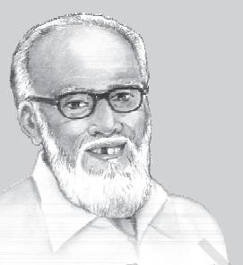
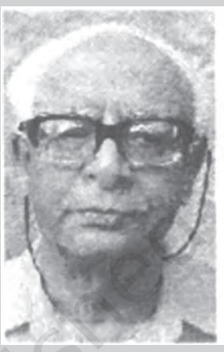

CHAPTER 5

82 UNDERSTANDING SOCIETY

# INDIAN SOCIOLOGISTS

As you saw in the opening chapter of your first book, Introducing Sociology, the discipline is a relatively young one even in the European context, having been established only about a century ago. In India, interest in sociological ways of thinking is a little more than a century old, but formal university teaching of sociology only began in 1919 at the University of Bombay. In the 1920s, two other universities those at Calcutta and Lucknow — also began programmes of teaching and research in sociology and anthropology. Today, every major university has a department of sociology, social anthropology or anthropology, and often more than one of these disciplines is represented.

Now-a-days sociology tends to be taken for granted in India, like most established things. But this was not always so. In the early days, it was not clear at all what an Indian sociology would look like, and indeed, whether India really needed something like sociology. In the first quarter of the 20th century, those who became interested in the discipline had to decide for themselves what role it could play in India. In this chapter, you are going to be introduced to some of the founding figures of Indian sociology. These scholars have helped to shape the discipline and adapt it to our historical and social context.

The specificity of the Indian context raised many questions. First of all, if western sociology emerged as an attempt to make sense of modernity, what would its role be in a country like India? India, too, was of course experiencing the changes brought about by modernity but with an important difference — it was a colony. The first experience of modernity in India was closely intertwined with the experience of colonial subjugation. Secondly, if social anthropology in the west arose out of the curiosity felt by European society about primitive cultures, what role could it have in India, which was an ancient and advanced civilisation, but which also had 'primitive' societies within it? Finally, what useful role could sociology have in a sovereign, independent India, a nation about to begin its adventure with planned development and democracy?

The pioneers of Indian sociology not only had to find their own answers to questions like these, they also had to formulate new questions for themselves. It was only through the experience of 'doing' sociology in an Indian context that the questions took shape — they were not available 'readymade'. As is often the case, in the beginning Indians became sociologists and anthropologists mostly by accident. For example, one of the earliest and best known pioneers of social anthropology in India, L.K. Ananthakrishna Iyer (1861-1937), began his career as a clerk, moved on to become a school teacher and later a college teacher in Cochin state in present day Kerala. In 1902, he was asked by the Dewan of Cochin to assist with an ethnographic survey of the state. The British government wanted similar surveys done in all the princely states as well as the presidency areas directly under its control. Ananthakrishna Iyer did this work on a purely voluntary basis, working as a college teacher in the Maharajah's College at Ernakulam during the week, and functioning as the unpaid Superintendent of Ethnography in the weekends. His work was much appreciated by British anthropologists and administrators of the time, and later he was also invited to help with a similar ethnographic survey in Mysore state.

Ananthakrishna Iyer was probably the first self-taught anthropologist to receive national and international recognition as a scholar and an

academician. He was invited to lecture at the University of Madras, and was appointed as Reader at the University of Calcutta, where he helped set up the first post-graduate anthropology department in India. He remained at the University of Calcutta from 1917 to 1932. Though he had no formal qualifications in anthropology, he was elected President of the Ethnology section of the Indian Science Congress. He was awarded an honorary doctorate by a German university during his lecture tour of European universities. He was also conferred the titles of Rao Bahadur and Dewan Bahadur by Cochin state.

The lawyer Sarat Chandra Roy (1871-1942) was another 'accidental anthropologist' and pioneer of the discipline in India. Before taking his law degree in Calcutta's Ripon College, Roy had done graduate and postgraduate degrees in English. Soon after he had begun practising law, he decided to go to Ranchi in 1898 to take up a job as an English teacher at a Christian missionary school. This decision was to change his life, for he remained in Ranchi for the next fortyfour years and became the leading authority on the culture and society of the tribal peoples of the Chhotanagpur region (present day Jharkhand). Roy's interest in anthropological matters began when he gave up his school job and began practising law at the Ranchi courts, eventually being appointed as official interpreter in the court.

Roy became deeply interested in tribal society as a byproduct of his professional need to interpret tribal customs and laws to the court. He travelled extensively among tribal communities and did intensive fieldwork among them. All of this was done on an 'amateur' basis, but Roy's diligence and keen eye for detail resulted in valuable monographs and research articles. During his entire career, Roy published more than one hundred articles in leading Indian and British academic journals in addition to his famous monographs on the Oraon, the Mundas and the Kharias. Roy soon became very well known amongst anthropologists in India and Britain and was recognised as an authority on Chhotanagpur. He founded the journal Man in India in 1922, the earliest journal of its kind in India that is still published.

Both Ananthakrishna Iyer and Sarat Chandra Roy were true pioneers. In the early 1900s, they began practising a discipline that did not yet exist in India, and which had no institutions to promote it. Both Iyer and Roy were born, lived and died in an India that was ruled by the British. The four Indian sociologists you are going to be introduced in this chapter were born one generation later than Iyer and Roy. They came of age in the colonial era, but their careers continued into the era of independence, and they helped to shape the first formal institutions that established Indian sociology. G.S. Ghurye and D.P. Mukerji were born in the 1890s while A.R. Desai and M.N. Srinivas were about fifteen years younger, having been born in the second decade of the 20th century. Although they were all deeply influenced by western traditions of sociology, they were also able to offer some initial answers to the question that the pioneers could only begin to ask : what shape should a specifically Indian sociology take?

G.S. Ghurye can be considered the founder of institutionalised sociology in India. He headed India's very first post-graduate teaching department of Sociology at Bombay University for thirty-five years. He guided a large number of research scholars, many of whom went on to occupy prominent positions in the discipline. He also founded the Indian Sociological Society as well as its journal Sociological Bulletin. His academic writings were not only prolific, but very wide-ranging in the subjects they covered. At a time when financial and institutional support for university research was very limited, Ghurye managed to nurture sociology as an increasingly Indian discipline. Ghurye's Bombay University department was the first to successfully implement two of the features which were later enthusiastically endorsed by his successors in the discipline. These were the active combining of teaching and research within the same institution, and the merger of social anthropology and sociology into a composite discipline.

Best known, perhaps, for his writings on caste and race, Ghurye also wrote on a broad range of other themes including tribes; kinship, family and

## Govind Sadashiv Ghurye (1893-1983)

G. S. Ghurye was born on 12 December 1893 in Malvan, a town in the Konkan coastal region of western India. His family owned a trading business which had once been prosperous, but was in decline.

- 1913: Joined Elphinstone College in Bombay with Sanskrit Honours for the B.A. degree which he completed in 1916. Received the M.A. degree in Sanskrit and English from the same college in 1918.

- 1919: Selected for a scholarship by the University of Bombay for training abroad in sociology. Initially went to the London School of Economics to study with L.T. Hobhouse, a prominent sociologist of the time. Later went to Cambridge to study with W.H.R. Rivers, and was deeply influenced by his diffusionist perspective.
- 1923: Ph.D. submitted under A.C. Haddon after River's sudden death in 1922. Returned to Bombay in May. Caste and Race in India, the manuscript based on the doctoral dissertation, was accepted for publication in a major book series at Cambridge.
- 1924: After brief stay in Calcutta, was appointed Reader and Head of the Department of Sociology at Bombay University in June. He remained as Head of the Department at Bombay University for the next 35 years.
- 1936: Ph.D. Programme was launched at the Bombay Department; the first Ph.D. in Sociology at an Indian university was awarded to G.R. Pradhan under Ghurye's supervision. The M.A. course was revised and made a full-fledged 8-course programme in 1945.
- 1951: Ghurye established the Indian Sociological Society and became its founding President. The journal of the Indian Sociological Society, Sociological Bulletin was launched in 1952.
- 1959: Ghurye retired from the University, but continued to be active in academic life, particularly in terms of publication — 17 of his 30 books were written after retirement.

G.S. Ghurye died in 1983, at the age of 90.

marriage; culture, civilisation and the historic role of cities; religion; and the sociology of conflict and integration. Among the intellectual and contextual concerns which influenced Ghurye, the most prominent are perhaps diffusionism, Orientalist scholarship on Hindu religion and thought, nationalism, and the cultural aspects of Hindu identity.

One of the major themes that Ghurye worked on was that of 'tribal' or 'aboriginal' cultures. In fact, it was his writings on this subject, and specially his debate with Verrier Elwin which first made him known outside sociology and the academic world. In the 1930s and 1940s there was much debate on the place of tribal societies within India and how the state should respond to them. Many British administrator -anthropologists were specially interested in the tribes of India and believed them to be primitive peoples with a distinctive culture far from mainstream Hinduism. They also believed that the innocent and simple tribals would suffer exploitation and cultural degradation through contact with Hindu culture and society. For this reason, they felt that the state had a duty to protect the tribes and to help them sustain their way of life and culture, which were facing constant pressure to assimilate with mainstream Hindu culture. However, nationalist Indians were equally passionate about their belief in the unity of India and the need for modernising Indian society and culture. They believed that attempts to preserve tribal culture were misguided and resulted in maintaining tribals in a backward state as 'museums' of primitive culture. As with many features of Hinduism itself which they felt to be backward and in need of reform, they felt that tribes, too, needed to develop. Ghurye became the best-known exponent of the nationalist view and insisted on characterising the tribes of India as 'backward Hindus' rather than distinct cultural groups. He cited detailed evidence from a wide variety of tribal cultures to show that they had been involved in constant interactions with Hinduism over a long period. They were thus simply further behind in the same process of assimilation that all Indian communities had gone through. This particular argument namely, that Indian tribals were hardly ever isolated primitive communities of the type that was written about in the classical anthropological texts — was not really disputed. The differences were in how the impact of mainstream culture was evaluated. The 'protectionists' believed that assimilation would result in the severe exploitation and cultural extinction of the tribals. Ghurye and the nationalists, on the other hand, argued that these ill-effects were not specific to tribal cultures, but were common to all the backward and downtrodden sections of Indian society. These were the inevitable difficulties on the road to development.

#### Activity 1

Today we still seem to be involved in similar debates. Discuss the different sides to the question from a contemporary perspective. For example, many tribal movements assert their distinctive cultural and political identity — in fact, the states of Jharkhand and Chhattisgarh were formed in response to such movements. There is also a major controversy around the disproportionate burden that tribal communities have been forced to bear for the sake of developmental projects like big dams, mines and factories. How many such conflicts do you know about? Find out what the issues are in these conflicts. What do you and your classmates feel should be done about these problems?

## Ghurye on Caste and Race

G.S. Ghurye's academic reputation was built on the basis of his doctoral dissertation at Cambridge, which was later published as Caste and Race in India (1932). Ghurye's work attracted attention because it addressed the major concerns of Indian anthropology at the time. In this book, Ghurye provides a detailed critique of the then dominant theories about the relationship between race and caste. Herbert Risley, a British colonial official who was deeply interested in anthropological matters, was the main proponent of the dominant view. This view held that human beings can be divided into distinct and separate races on the basis of their physical characteristics such as the circumference of the skull, the length of the nose, or the volume (size) of the cranium or the part of the skull where the brain is located.

Risley and others believed that India was a unique 'laboratory' for studying the evolution of racial types because caste strictly prohibits intermarriage among different groups, and had done so for centuries. Risley's main argument was that caste must have originated in race because different caste groups seemed to belong to distinct racial types. In general, the higher castes approximated Indo-Aryan racial traits, while the lower castes seemed to belong to non-Aryan aboriginal, Mongoloid or other racial groups. On the basis of differences between groups in terms of average measurements for length of nose, size of cranium etc., Risley and others suggested that the lower castes were the original aboriginal inhabitants of India. They had been subjugated by an Aryan people who had come from elsewhere and settled in India.

Ghurye did not disagree with the basic argument put forward by Risley but believed it to be only partially correct. He pointed out the problem with using averages alone without considering the variation in the distribution of a particular measurement for a given community. Ghurye believed that Risley's thesis of the upper castes being Aryan and the lower castes being non-Aryan was broadly true only for northern India. In other parts of India, the inter -group differences in the anthropometric measurements were not very large or systematic. This suggested that, in most of India except the Indo-Gangetic plain, different racial groups had been mixing with each other for a very long time. Thus, 'racial purity' had been preserved due to the prohibition on inter-marriage only in 'Hindustan proper' (north India). In the rest of the country, the practice of endogamy (marrying only within a particular caste group) may have been introduced into groups that were already racially varied.

Today, the racial theory of caste is no longer believed, but in the first half of the 20th century it was still considered to be true. There are conflicting opinions among historians about the Aryans and their arrival in the subcontinent. However, at the time that Ghurye was writing these were among the concerns of the discipline, which is why his writings attracted attention.

Ghurye is also known for offering a comprehensive definition of caste. His definition emphasises six features.

- (i) Caste is an institution based on segmental division. This means that caste is divided into a number of closed, mutually exclusive segments or compartments. Each caste is one such compartment. It is closed because caste is decided by birth — the children born to parents of a particular caste will always belong to that caste. On the other hand, there is no way other than birth of acquiring caste membership. In short, a person's caste is decided by birth at birth; it can neither be avoided nor changed.
- (ii) Caste is based on hierarchical division. Each caste is strictly unequal to every other caste, that is, every caste is either higher or lower than every other one. In theory (though not in practice), no two castes are ever equal.
- (iii) The institution of caste necessarily involves restrictions on social interaction, specially the sharing of food. There are elaborate rules prescribing what kind of food may be shared between which groups. These rules are governed by ideas of purity and pollution. The same also applies to social interaction, most dramatically in the institution of untouchability, where even the touch of people of particular castes is thought to be polluting.
- (iv) Following from the principles of hierarchy and restricted social interaction, caste also involves differential rights and duties for different castes. These rights and duties pertain not only to religious practices but extend to the secular world. As ethnographic accounts of everyday life in caste society have shown, interactions between people of different castes are governed by these rules.
- (v) Caste restricts the choice of occupation, which, like caste itself, is decided by birth and is hereditary. At the level of society, caste functions as a rigid form of the division of labour with specific occupations being allocated to specific castes.
- (vi) Caste involves strict restrictions on marriage. Caste 'endogamy', or marriage only within the caste, is often accompanied by rules about 'exogamy', or whom one may not marry. This combination

of rules about eligible and noneligible groups helps reproduce the caste system.

Ghurye's definition helped to make the study of caste more systematic. His conceptual definition was based on what the classical texts prescribed. In actual practice, many of these features of caste were changing, though all of them continue to exist in some form. Ethnographic fieldwork over the next several decades helped to provide valuable accounts of what was happening to caste in independent India.

Between the 1920s and the 1950s, sociology in India was equated with the two major departments at Bombay and Lucknow. Both began as combined departments of sociology and economics. While the Bombay department in this period was led by G.S. Ghurye, the Lucknow department had three major figures, the famous 'trinity' of Radhakamal Mukerjee (the founder), D.P. Mukerji, and D.N. Majumdar. Although all three were well known and widely respected, D.P. Mukerji was perhaps the most popular. In fact, D.P. Mukerji — or D.P. as he was generally known — was among the most influential scholars of his generation not only in sociology but in intellectual and public life beyond the academy. His influence and popularity came not so much from

#### Dhurjati Prasad Mukerji (1894-1961)

D.P. Mukerji was born on 5 October 1894 in a middle class Bengali brahmin family with a long tradition of involvement in higher education. Undergraduate degree in science and postgraduate degrees in History and Economics from Calcutta University.

- 1924: Appointed Lecturer in the Department of Economics and Sociology at Lucknow University
- 1938-41 Served as Director of Information under the first Congress-led government of the United Provinces of British India (present day Uttar Pradesh).

- 1949: Appointed Professor (by special order of the Vice Chancellor) at Lucknow University.
- 1953: Appointed Professor of Economics at Aligarh Muslim University
- 1955: Presidential Address to the newly formed Indian Sociological Society
- 1956: Underwent major surgery for throat cancer in Switzerland Died on 5 December 1961.

his scholarly writings as from his teaching, his speaking at academic events, and his work in the media, including newspaper articles and radio programmes. D.P. came to sociology via history and economics, and retained an active interest in a wide variety of subjects ranging across literature, music, film, western and Indian philosophy, Marxism, political economy, and development planning. He was strongly influenced by Marxism, though he had more faith in it as a method of social analysis than as a political programme for action. D.P. wrote many books in English and Bengali. His Introduction to Indian Music is a pioneering work, considered a classic in its genre.

## D.P. Mukerji on Tradition and Change

It was through his dissatisfaction with Indian history and economics that D.P. turned to sociology. He felt very strongly that the crucial distinctive feature of India was its social system, and that, therefore, it was important for each social science to be rooted in this context. The decisive aspect of the Indian context was the social aspect: history, politics and economics in India were less developed in comparison with the west; however, the social dimensions were 'over-developed'. As D.P. wrote , "… my conviction grew that India had had society, and very little else. In fact, she had too much of it. Her history, her economics, and even her philosophy, I realised, had always centred in social groups, and at best, in socialised persons." (Mukherji 1955:2)

Given the centrality of society in India, it became the first duty of an Indian sociologist to study and to know the social traditions of India. For D.P. this study of tradition was not oriented only towards the past, but also included sensitivity to change. Thus, tradition was a living tradition, maintaining its links with the past, but also adapting to the present and thus evolving over time. As he wrote, "...it is not enough for the Indian sociologist to be a sociologist. He must be an Indian first, that is, he is to share in the folk-ways, mores, customs and traditions, for the purpose of understanding his social system and what lies beneath it and beyond it." In keeping with this view, he believed that sociologists should learn and be familiar with both 'high' and 'low' languages and cultures — not only Sanskrit, Persian or Arabic, but also local dialects.

D.P. argued that Indian culture and society are not individualistic in the western sense. The average Indian individual's pattern of desires is more or less rigidly fixed by his sociocultural group pattern and he hardly deviates from it. Thus, the Indian social system is basically oriented towards group, sect, or caste-action, not 'voluntaristic' individual action. Although 'voluntarism' was beginning to influence the urban middle classes, its appearance ought to be itself an interesting subject of study for the Indian sociologist. D.P. pointed out that the root meaning of the word tradition is to transmit. Its Sanskrit equivalents are either parampara, that is, succession; or aitihya, which comes from the same root as itihas or history. Traditions are thus strongly rooted in the past that is kept alive through the repeated recalling and retelling of stories and myths. However, this link with the past does not rule out change, but indicates a process of adaptation to it. Internal and external sources of change are always present in every society. The most commonly cited internal source of change in western societies is the economy, but this source has not been as effective in India. Class conflict, D.P. believed, had been "smoothed and covered by caste traditions" in the Indian context, where new class relations had not yet emerged very sharply. Based on this understanding, he concluded that one of the first tasks for a dynamic Indian sociology would be to provide an account of the internal, non-economic causes of change.

D.P. believed that there were three principles of change recognised in Indian traditions, namely; shruti, smriti and anubhava. Of these, the last anubhava or personal experience — is the revolutionary principle. However, in the Indian context personal experience soon flowered into collective experience. This meant that the most important principle of change in Indian society was generalised anubhava, or the collective experience of groups. The high traditions were centred in smriti and sruti, but they were periodically challenged by the collective experience of groups and sects, as for example in the bhakti movement. D.P. emphasised that this was true not only of Hindu but also of Muslim culture in India. In Indian Islam, the Sufis have stressed love and experience rather than holy texts, and have been important in bringing about change. Thus, for D.P., the Indian context is not one where discursive reason (buddhi-vichar) is the dominant force for change; anubhava and prem (experience and love) have been historically superior as agents of change.

Conflict and rebellion in the Indian context have tended to work through collective experiences. But the resilience of tradition ensures that the pressure of conflict produces change in the tradition without breaking it. So we have repeated cycles of dominant orthodoxy being challenged by popular revolts which succeed in transforming orthodoxy, but are eventually reabsorbed into this transformed tradition. This process of change — of rebellion contained within the limits of an overarching tradition — is typical of a caste society, where the formation of classes and class consciousness has been inhibited. D.P.'s views on tradition and change led him to criticise all instances of unthinking borrowing from western intellectual traditions, including in such contexts as development planning. Tradition was neither to be worshipped nor ignored, just as modernity was needed but not to be blindly adopted. D.P. was simultaneously a proud but critical inheritor of tradition, as well as an admiring critic of the modernity that he acknowledged as having shaped his own intellectual perspective.

#### Activity 2

Discuss what is meant by a 'living tradition'. According to D.P. Mukerji, this is a tradition which maintains links with the past by retaining something from it, and at the same time incorporates new things. A living tradition thus includes some old elements but also some new ones. You can get a better and more concrete sense of what this means if you try to find out from different generations of people in your neighbourhood or family about what is changed and what is unchanged about specific practices. Here is a list of subjects you can try; you could also try other subjects of your own choice.

Games played by children of your age group (boys/girls)

Ways in which a popular festival is celebrated

Typical dress/clothing worn by women and men

… Plus other such subjects of your choice …

For each of these, you need to find out: What aspects have remained unchanged since as far back as you know or can find out? What aspects have changed? What was different and same about the practice/event (i) 10 years ago; (ii) 20 years ago; (iii) 40 years ago; (iv) 60 or more years ago

Discuss your findings with the whole class.

A.R. Desai is one of the rare Indian sociologists who was directly involved in politics as a formal member of political parties. Desai was a life-long Marxist and became involved in Marxist politics during his undergraduate days at Baroda, though he later resigned his membership of the Communist Party of India. For most of his career he was associated with various kinds of nonmainstream Marxist political groups. Desai's father was a middle level civil servant in the Baroda state, but was also a well-known novelist, with sympathy for both socialism and Indian nationalism of the Gandhian variety. Having lost his mother early in life, Desai was brought up by his father and lived a migratory life because of the frequent transfers of his father to different posts in the Baroda state.

After his undergraduate studies in Baroda, Desai eventually joined the Bombay department of sociology to study under Ghurye. He wrote his doctoral dissertation on the social aspects of Indian nationalism and was awarded the degree in 1946. His thesis was published in 1948 as The Social Background of Indian Nationalism, which is probably his best known work. In this book, Desai offered a Marxist analysis of Indian nationalism, which gave prominence to economic processes and divisions, while taking account of the specific conditions of British colonialism. Although it had its critics, this book proved to be very popular and went through numerous reprints. Among

|  | Akshay Ramanlal Desai (1915-1994) |
| --- | --- |
|  | A. R. Desai was born in 1915. Early education in Baroda, then in Surat and Bombay. |
| 1934-39: | Member of Communist Party of India; involved with Trotskyite groups. |
| 1946: | Ph.D. submitted at Bombay under the supervision of G.S. Ghurye. |
| 1948: | Desai's Ph.D. dissertation is published as the book: Social Background of Indian Nationalism. |
| 1951: | Joins the faculty of the Department of Sociology at Bombay University |
| 1953-1981: | Member of Revolutionary Socialist Party. |
| 1961: | Rural Transition in India is published. |
| 1967: | Appointed Professor and Head of Department. |
| 1975: | State and Society in India: Essays in Dissent is published. |
| 1976: | Retired from Department of Sociology. |
| 1979: | Peasant Struggles in India is published. |
| 1986: | Agrarian Struggles in India after Independence is published. Died on 12 November 1994. |

the other themes that Desai worked on were peasant movements and rural sociology, modernisation, urban issues, political sociology, forms of the state and human rights. Because Marxism was not very prominent or influential within Indian sociology, A.R. Desai was perhaps better known outside the discipline than within it. Although he received many honours and was elected President of the Indian Sociological Society, Desai remained a somewhat unusual figure in Indian sociology.

## A.R. Desai on the State

The modern capitalist state was one of the significant themes that interested A.R. Desai. As always, his approach to this issue was from a Marxist perspective. In an essay called "The myth of the welfare state", Desai provides a detailed critique of this notion and points to it many shortcomings. After considering the prominent definitions available in the sociological literature, Desai identifies the following unique features of the welfare state:

- (i) A welfare state is a positive state. This means that, unlike the 'laissez faire' of classical liberal political theory, the welfare state does not seek to do only the minimum necessary to maintain law and order. The welfare state is an
interventionist state and actively uses its considerable powers to design and implement social policies for the betterment of society.

- (ii) The welfare state is a democratic state. Democracy was considered an essential condition for the emergence of the welfare state. Formal democratic institutions, specially multi-party elections, were thought to be a defining feature of the welfare state. This is why liberal thinkers excluded socialist and communist states from this definition.
- (iii) A welfare state involves a mixed economy. A 'mixed economy' means an economy where both private capitalist enterprises and state or publicly owned enterprises co-exist. A welfare state does not seek to eliminate the capitalist market, nor does it prevent public investment in industry and other fields. By and large, the state sector concentrates on basic goods and social infrastructure, while private industry dominates the consumer goods sector.

Desai then goes on to suggest some test criteria against which the performance of the welfare state can be measured. These are:

- (i) Does the welfare state ensure freedom from poverty, social discrimination and security for all its citizens?
- (ii) Does the welfare state remove inequalities of income through measures to redistribute income

from the rich to the poor, and by preventing the concentration of wealth?

- (iii) Does the welfare state transform the economy in such a way that the capitalist profit motive is made subservient to the real needs of the community?
- (iv) Does the welfare state ensure stable development free from the cycle of economic booms and depressions?
- (v) Does it provide employment for all?

Using these criteria, Desai examines the performance of those states that are most often described as welfare states, such as Britain, the USA and much of Europe, and finds their claims to be greatly exaggerated. Thus, most modern capitalist states, even in the most developed countries, fail to provide minimum levels of economic and social security to all their citizens. They are unable to reduce economic inequality and often seem to encourage it. The so-called welfare states have also been unsuccessful at enabling stable development free from market fluctuations. The presence of excess economic capacity and high levels of unemployment are yet another failure. Based on these arguments, Desai concludes that the notion of the welfare state is something of a myth.

A.R. Desai also wrote on the Marxist theory of the state. In these writings we can see that Desai does not take a one-sided view but openly criticises the shortcomings of Communist states. He cites many Marxist thinkers to emphasise the importance of democracy even under communism, arguing strongly that political liberties and the rule of law must be upheld in all genuinely socialist states.

#### Activity 3

A.R. Desai criticises the welfare state from a Marxist and socialist point of view — that is he would like the state to do more for its citizens than is being done by western capitalist welfare states. There are also very strong opposing viewpoints today which say that the state should do less — it should leave most things to the free market. Discuss these viewpoints in class. Be sure to give a fair hearing to both sides.

Make a list of all the things that are done by the state or government in your neighbourhood, starting with your school. Ask: people to find out if this list has grown longer or shorter in recent years — is the state doing more things now than before, or less? What do you feel would happen if the state were to stop doing these things? Would you and your neighbourhood/ school be worse off, better off, or remain unaffected? Would rich, middle class, and poor people have the same opinion, or be affected in the same way, if the state were to stop some of its activities?

Make a list of state-provided services and facilities in your neighbourhood, and see how opinions might differ across class groups on whether these should continue or be stopped. (For example: roads, water supply, electricity supply, street lights, schools, sanitation, police services, hospitals, bus, train and air transport… Think of others that are relevant in your context.)

Probably the best known Indian sociologist of the post-independence era, M.N. Srinivas earned two doctoral degrees, one from Bombay University and one from Oxford. Srinivas was a student of Ghurye at Bombay. Srinivas' intellectual orientation was transformed during the years he spent at the department of social anthropology in Oxford. British social anthropology was at that time the dominant force in western anthropology, and Srinivas also shared in the excitement of being at the 'centre' of the discipline. Srinivas' doctoral dissertation was published as Religion and Society among the Coorgs of South India. This book established Srinivas' international reputation with its detailed ethnographic application of the structural – functional perspective dominant in British social anthropology. Srinivas was appointed to a newly created lectureship in Indian sociology at Oxford, but resigned in 1951 to return to India as the head of a newly created department of sociology at the Maharaja Sayajirao University at Baroda. In 1959, he moved to Delhi to set up another department at the Delhi School of Economics, which soon became known as one of the leading centres of sociology in India.

Srinivas often complained that most of his energies were taken up in institution building, leaving him with

## Mysore Narasimhachar Srinivas (1916-1999)

M.N. Srinivas was born on 16 November 1916 in an Iyengar brahmin family in Mysore. His father was a landowner and worked for the Mysore power and light department. His early education was at Mysore University, and he later went to Bombay to do an MA under G.S. Ghurye.

- 1942: M.A. thesis on Marriage and Family Among the Coorgs published as book.
- 1944: Ph.D. thesis (in 2 volumes) submitted to Bombay University under the supervision of G.S. Ghurye.
- 1945: Leaves for Oxford; studies first under Radcliffe-Brown and then under Evans-Pritchard.
- 1947: Awarded D.Phil. degree in Social Anthropology from Oxford; returns to India.

- 1948: Appointed Lecturer in Indian Sociology at Oxford; fieldwork in Rampura.
- 1951: Resigns from Oxford to take up Professorship at Maharaja Sayaji Rao University in Baroda to found its sociology department.
- 1959: Takes up Professorship at the Delhi School of Economics to set up the sociology department there.
- 1971: Leaves Delhi University to co-found the Institute of Social and Economic Change at Bangalore.

Died on 30 November 1999.

little time for his own research. Despite these difficulties, Srinivas produced a significant body of work on themes such as caste, modernisation and other processes of social change, village society, and many other issues. Srinivas helped to establish Indian sociology on the world map through his international contacts and associations. He had strong connections in British social anthropology as well as American anthropology, particularly at the University of Chicago, which was then a powerful centre in world anthropology. Like G.S. Ghurye and the Lucknow scholars, Srinivas succeeded in training a new generation of sociologists who were to become leaders of the discipline in the following decades.

#### M.N. Srinivas on the Village

The Indian village and village society remained a life-long focus of interest for Srinivas. Although he had made short visits to villages to conduct surveys and interviews, it was not until he did fieldwork for a year at a village near Mysore that he really acquired first-hand knowledge of village society. The experience of fieldwork proved to be decisive for his career and his intellectual path. Srinivas helped encourage and coordinate a major collective effort at producing detailed ethnographic accounts of village society during the 1950s and 1960s. Along with other scholars like S.C. Dube and D.N. Majumdar, Srinivas was instrumental in making village studies the dominant field in Indian sociology during this time.

Srinivas' writings on the village were of two broad types. There was first of all ethnographic accounts of fieldwork done in villages or discussions of such accounts. A second kind of writing included historical and conceptual discussions about the Indian village as a unit of social analysis. In the latter kind of writing, Srinivas was involved in a debate about the usefulness of the village as a concept. Arguing against village studies, some social anthropologists like Louis Dumont thought that social institutions like caste were more important than something like a village, which was after all only a collection of people living in a particular place. Villages may live or die, and people may move from one village to another, but their social institutions, like caste or religion, follow them and go with them wherever they go. For this reason, Dumont believed that it would be misleading to give much importance to the village as a category. As against this view, Srinivas believed that the village was a relevant social entity. Historical evidence showed that villages had served as a unifying identity and that village unity was quite significant in rural social life. Srinivas also criticised the British administrator anthropologists who had put forward a picture of the Indian village as unchanging, self-sufficient, "little republics". Using historical and sociological evidence, Srinivas showed that the village had, in fact, experienced considerable change. Moreover, villages were never self-sufficient, and had been involved in various kinds of economic, social and political relationships at the regional level.

The village as a site of research offered many advantages to Indian sociology. It provided an opportunity to illustrate the importance of ethnographic research methods. It offered eye-witness accounts of the rapid social change that was taking place in the Indian countryside as the newly independent nation began a programme of planned development. These vivid descriptions of village India were greatly appreciated at the time as urban Indians as well as policy makers were able to form impressions of what was going on in the heartland of India. Village studies thus provided a new role for a discipline like sociology in the context of an independent nation. Rather than being restricted to the study of 'primitive' peoples, it could also be made relevant to a modernising society.

## Activity 4

Suppose you had friends from another planet or civilisation who were visiting the Earth for the first time and had never heard of something called a 'village'. What are the five clues you would give them to identify a village if they ever came across one?

Do this in small groups and then compare the five clues given by different groups. Which features appear most often? Do the most common features help you to make a sort of definition of a village? (To check whether your definition is a good one, ask yourself the question: Could there be a village where all or most features mentioned in your definition are absent?)

#### Activity 5

In the 1950s, there was great interest among urban Indians in the village studies that sociologists began doing at that time. Do you feel urban people are interested in the village today? How often are villages mentioned in the T.V., in newspapers and films? If you live in a city, does your family still have contacts with relatives in the village? Did it have such contacts in your parents' generation or your grandparents' generation? Do you know of anybody from a city who has moved to a village? Do you know of people who would like to go back? If you do, what reasons do these people give for wanting to leave the city and live in the village? If you don't know of any such people, why do you think people don't want to live in a village? If you know of people living in a village who would like to live in a town or city, what reasons do they give for wanting to leave the village?

## Conclusion

These four Indian sociologists helped to give a distinctive character to the discipline in the context of a newly independent modernising country. They are offered here as examples of the diverse ways in which sociology was 'Indianised'. Thus, Ghurye began with the questions defined by western anthropologists, but brought to them his intimate knowledge of classical texts and his sense of educated Indian opinion. Coming from a very different background, a thoroughly westernised modern intellectual like D.P. Mukerji rediscovered the importance of Indian tradition without being blind to its shortcomings. Like Mukerji, A.R. Desai was also strongly influenced by Marxism and offered a critical view of the Indian state at a time when such criticism was rare. Trained in the dominant centres of western social anthropology, M.N. Srinivas adapted his training to the Indian context and helped design a new agenda for sociology in the late 20th century.

It is a sign of the health and strength of a discipline when succeeding generations learn from and eventually go beyond their predecessors. This has also been happening in Indian sociology. Succeeding generations have subjected the work of these pioneers to constructive criticism in order to take the discipline further. The signs of this process of learning and critique are visible not only in this book but all over Indian sociology.

# GLOSSARY

Administrator–anthropologists: The term refers to British administrative officials who were part of the British Indian government in the 19th and early 20th centuries, and who took great interest in conducting anthropological research, specially surveys and censuses. Some of them became well known anthropologists after retirement. Prominent names include: Edgar Thurston, William Crooke, Herbert Risley and J.H. Hutton.

Anthropometry: The branch of anthropology that studied human racial types by measuring the human body, particularly the volume of the cranium (skull), the circumference of the head, and the length of the nose.

Assimilation: A process by which one culture (usually the larger or more dominant one) gradually absorbs another; the assimilated culture merges into the assimilating culture, so that it is no longer alive or visible at the end of the process.

Endogamy: A social institution that defines the boundary of a social or kin group within which marriage relations are permissible; marriage outside these defined groups are prohibited. The most common example is caste endogamy, where marriage may only take place with a member of the same caste.

Exogamy: A social institution that defines the boundary of a social or kin group with which or within which marriage relations are prohibited; marriages must be contracted outside these prohibited groups. Common examples include prohibition of marriage with blood relatives (sapind exogamy), members of the same lineage (sagotra exogamy), or residents of the same village or region (village/region exogamy).

Laissez-faire: A French phrase (literally 'let be' or 'leave alone') that stands for a political and economic doctrine that advocates minimum state intervention in the economy and economic relations; usually associated with belief in the regulative powers and efficiency of the free market.

## EXERCISES

- 1. How did Ananthakrishna Iyer and Sarat Chandra Roy come to practice social anthropology?
- 2. What were the main arguments on either side of the debate about how to relate to tribal communities?
- 3. Outline the positions of Herbert Risley and G.S. Ghurye on the relationship between race and caste in India.
- 4. Summarise the social anthropological definition of caste.
- 5. What does D.P. Mukerji mean by a 'living tradition'? Why did he insist that Indian sociologists be rooted in this tradition?
- 6. What are the specificities of Indian culture and society, and how do they affect the pattern of change?
- 7. What is a welfare state? Why is A.R. Desai critical of the claims made on its behalf?
- 8. What arguments were given for and against the village as a subject of sociological research by M.N. Srinivas and Louis Dumont?
- 9. What is the significance of village studies in the history of Indian sociology? What role did M.N. Srinivas play in promoting village studies?

# REFERENCES

- DESAI, A.R. 1975. State and Society in India: Essays in Dissent. Popular Prakashan, Bombay.
- DESHPANDE, SATISH. 2007. 'Fashioning a Postcolonial Discipline: M.N. Srinivas and Indian Sociology' in Uberoi, Sundar and Deshpande (eds) (in press).
- GHURYE, G.S. 1969. Caste and Race in India, Fifth Edition, Popular Prakashan, Bombay.
- PRAMANICK, S.K. 1994. Sociology of G.S. Ghurye, Rawat Publications, Jaipur, and New Delhi.
- MUKERJI, D.P. 1946. Views and Counterviews. The Universal Publishers, Lucknow.
- MUKERJI, D.P. 1955. 'Indian Tradition and Social Change', Presidential Address to the All India Sociological Conference at Dehradun,

Reproduced in T.K. Oommen and Partha N. Mukherji (eds) 1986. Indian Sociology: Reflections and Introspections, Popular Prakashan, Bombay.

- MADAN, T.N. 1994. Pathways: Approaches to the Study of Society in India. Oxford University Press, New Delhi.
- PATEL, SUJATA. 'Towards a Praxiological Understanding of Indian Society: The Sociology of A.R. Desai', in Uberoi, Sundar and Deshpande (eds) (in press).
- SRINIVAS, M.N. 1955. India's Villages. Development Department, Government of West Bengal. West Bengal Government Press, Calcutta.
- SRINIVAS, M.N. 1987. 'The Indian Village: Myth and Reality' in the Dominant Caste and other Essays. Oxford University Press, New Delhi.
- UBEROI, PATRICIA, NANDINI SUNDAR AND SATISH DESHPANDE (eds) (2007). Disciplinary Biographies: Essays in the History of Indian Sociology and Social Anthropology. Permanent Black, New Delhi.
- UPADHYA, CAROL. 'The Idea of Indian Society: G.S. Ghurye and the Making of Indian Sociology', in Uberoi, Sundar and Deshpande (eds) (2007).

