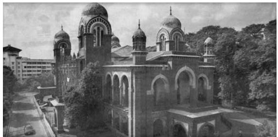

Chapter 1.indd 1 14 September 2022 12:02:26

*U*nderstanding the present usually involves some grasp of its past. This holds true probably as much for an individual or social group as for an entire country such as India. India has a long and rich history. While knowing about its past in ancient and medieval times is very important, its colonial experience is particularly significant for comprehending modern India. This is not just because many modern ideas and institutions reached India through colonialism. It is also because such an exposure to modern ideas was contradictory or paradoxical. For example, Indians in the colonial period read about western liberalism and freedom. Yet they lived under a western, colonial rule that denied Indians liberty and freedom. It is contradictions of this kind that shaped many of the structural and cultural changes that Chapters 1 and 2 look at.

As the next few chapters shall show, our social reform and nationalist movements, our laws, our political life and our Constitution, our industry and agriculture, our cities and our villages have been shaped by our paradoxical experience with colonialism. This has had lasting implications for our specific experience with modernity. The following are just some of the many instances we face in our daily life.

We have a parliamentary and a legal system, a police and educational system built very much on the British model. We drive on the left side of the road like the British. We have 'bread-omlette' and 'cutlets' as menu offered in many roadside eateries and canteens. A very popular manufacturer of biscuits, is actually named after Britain. Many school uniforms include neck-ties. We often admire the west and as often resent it. These are just some of the many and complex ways that British colonialism lives on in contemporary India.

*Different dimensions of modernity*

Chapter 1.indd 2 14 September 2022 12:02:27

Let us take the example of the English language to show how its impact has been many sided and paradoxical in India. This is not a matter about wrong spellings alone. English is not only widely used in India but we now have an impressive body of literary writings by Indians in English. This

knowledge of English has given Indians an edge in the global market. But English continues to be a mark of

privilege. Not knowing English is a disadvantage that tells in the job market. At the same time for those who were traditionally deprived of access to formal education such as the Dalits, knowledge of English may open doors of opportunities that were formerly closed.

In this chapter we focus on structural changes that *colonialism* brought in. We, therefore, need to shift from this broad impressionistic view to a clearer understanding of colonialism as a structure and system. Colonialism brought into being new political, economic and social structural changes. In this **Virtually English**  Housewives and college students who know English take up plum assignments as online scorers in BPOs, writes K. Jeshi

It is a familiar classroom scene. The only unfamiliar thing is the setting. Computer screens turn blackboards and housewives take over as teachers to evaluate English essays written by non-English speaking students in Asia. All, at the click of the mouse. The encouraging comments given by the evaluators here motivate students in Japan, Korea and China to learn English.

Online education, the new wave in the BPO segment, is bringing cheer to those who want to earn a fast buck. All you need is a flair for English, creative skills, basic computer knowledge, the drive to go that extra mile and willingness to learn.

*Source: The HINDU, Thursday, May 04, 2006*

chapter we look at only two of these structural changes namely *industrialisation* and *urbanisation*. While the focus is on specific colonial context, we also briefly touch on developments after independence.

All these structural changes were accompanied by cultural changes which, we look at in the next chapter. However any strict separation of the two is difficult. As you will see the structural changes are difficult to discuss without some mention of the cultural changes too.

Chapter 1.indd 3 14 September 2022 12:02:27

# 1.1 Understanding Colonialism

At one level, colonialism simply means the establishment of rule by one country over another. In the modern period western colonialism has had the greatest impact. India's past has been marked by the entry of numerous groups of people at different times who have established their rule over different parts of what constitutes modern India today. The impact of colonial rule is distinguishable from all other earlier rules because the changes it brought in were far-reaching and deep. History is full of examples of the annexation of foreign territory and

the domination of weaker by stronger powers. Nevertheless, *there is a vital difference between the empire building of pre-capitalist times and that of capitalist times.* Apart from outright pillage, the pre-capitalist conquerors benefited from their domination by exacting a continuous flow of tribute. On the whole they did not interfere with the economic base. They simply took the tribute that was skimmed off the economic surplus that was produced traditionally in the subjugated areas. (Alavi and Shanin, 1982)

In contrast British colonialism which was based on a capitalist system directly interfered to ensure greatest profit and benefit to British capitalism. Every policy was geared towards the strengthening and expansion of British capitalism. For instance it changed the very laws of the land. It changed not just land ownership laws but decided even what crops ought to be grown and what ought not to be. It meddled with the manufacturing sector. It altered the way production and distribution of goods took place. It entered into the forests. It cleared trees and started tea plantations. It brought in Forest Acts that changed the lives of pastoralists. They were prevented from entering many forests that had earlier provided valuable forage for their cattle.

Chapter 1.indd 4 14 September 2022 12:02:27

Colonialism also led to considerable movement of people. It led to movement of people from one part to another within India. For instance people from present day Jharkhand moved to Assam to work on the tea plantations. A newly emerging middle class particularly from the British Presidency regions of Bengal and Madras moved as government employees and professionals like doctors and lawyers moved to different parts of the country. People were carted in ships from India to work on other colonised lands in distant Asia, Africa and Americas. Many died on their way. Most could never return. Today many of their descendents are known as people of Indian origin.

To facilitate the smooth functioning of its rule, colonialism introduced a wide array of changes in every sphere, be it legal or cultural or architectural. Colonialism was a story apart in the very scale and intensity of the changes that it brought about. Some of these changes were deliberate while some took place in an unintended fashion. For example, we saw how western education was introduced to create Indians who would manage British colonialism. Instead it led to the growth of a nationalist and anti-colonial consciousness.

After 1834 till 1920, ships left from the ports of India on regular basis carrying people of various religions, gender, classes and castes destined to work for a minimum of five years on one of the plantations in Mauritius. For many decades, the recruiting ground was centred in Bihar, in particular, in districts, such as Patna, Gaya, Arrah, Saran, Tirhoot, Champaran, Munger (Monghyr), Bhagalpur and Purnea. *(Pineo 1984)* **Box 1.1**

This magnitude and depth of the structural changes that colonialism unleashed can be better grasped if we try and understand some basic features of capitalism. Capitalism is an economic system in which the means of production are privately owned and organised to accumulate profits within a market system. (We have already discussed the capitalist market in the first book – *Indian Society*.) Capitalism in the west emerged out of a complex process of European exploration of the rest of the world, its plunder of wealth and resources, an unprecedented growth of science and technology, its harnessing to industries and agriculture. What marked capitalism from the very beginning was its dynamism, its potential to grow, expand, innovate, use technology and labour in a way best assured to ensure greatest profit. What marked it too was its global nature. Western colonialism was inextricably connected to the growth of western capitalism. This had a lasting impact on the way capitalism developed in a colonised country like India. In the next section on industrialisation and urbanisation, we see how colonialism led to very distinct patterns.

If capitalism became the dominant economic system, nation states became the dominant political form. That we all live in nation states and that we all have a nationality or a national citizenship may appear natural to us today. Before the First World War passports were not widely used for international travel, and in most areas few people had one. Societies were, however, not always organised on these lines. Nation state pertains to a particular type of state, characteristic of the modern world. A government has sovereign power

Chapter 1.indd 5 14 September 2022 12:02:27

within a defined territorial area, and the people are citizens of a single nation. Nation states are closely associated with the rise of nationalism. The principle of nationalism assumes that any set of people have a right to be free and exercise sovereign power. It is an important part of the rise of democratic ideas. You will be reading more about this in Chapter 3. It must have struck you that the practice of colonialism and the principle of nationalism and democratic rights are contradictory. For colonial rule implied foreign rule such as British rule over India. Nationalism implied that the people of India or of any colonised society have an equal right to be sovereign. Indian nationalist leaders were quick to grasp this irony. They declared that freedom or *swaraj* was their birthright and fought for both political and economic freedom.

# 1.2 Urbanisation and Industrialisation

# **The Colonial Experience**

*Industrialisation* refers to the emergence of machine production, based on the use of inanimate power resources like steam or electricity. In most standard western textbook of sociology, we learn that in even the most advanced of traditional civilizations, most people were engaged in working on the land. The relatively low level of technological development did not permit more than a small minority to be freed from the chores of agricultural production. By contrast, a prime feature of industrial societies today is that a large majority of the employed population work in factories, offices or shops rather than agriculture. Over 90 per cent of people in the west live in towns and cities, where most jobs are to be found and new job opportunities are created. Not surprisingly, therefore, we usually associate urbanisation with industrialisation. They often do occur together but not always so.

For instance in Britain, the first society to undergo industrialisation, was also the earliest to move from being rural to a predominantly urban country.

In 1800, well under 20 per cent of the population lived in towns or cities of more than 10,000 inhabitants. By 1900 this proportion had become 74 per cent. The capital city, London, was home to about 1.1 million people in 1800; it increased in size to a population of over 7 million by the start of the twentieth century. London was then by far the largest city ever seen in the world, a vast

*Jaipur*

**6**

manufacturing, commercial and financial centre at the heart of a still-expanding British empire. *(Giddens 2001: 572)*

Chapter 1.indd 6 14 September 2022 12:02:27

In India the impact of the very same British industrialisation led to *deindustrialisation* in some sectors, and *decline of old urban centres*. Just as manufacturing boomed in Britain, traditional exports of cotton and silk manufactures from India declined in the face of Manchester competition. This period also saw the further decline of cities such as Surat and Masulipatnam while Bombay and Madras grew. When the British took over Indian states, towns like Thanjavur, Dhaka, and Murshidabad lost their courts and, therefore, some of their artisans and court gentry. From the end of the 19th century, with the installation of mechanised factory industries, some towns became much more heavily populated.

> Urban luxury manufactures like the high quality silks and cottons of Dacca or Murshidabad must have been hit first by the almost simultaneous collapse of indigeneous court demand and the external market on which these had largely depended. Village crafts in the interior, and

*Chennai*

*Mumbai*

**Box 1.2**

particularly, in regions other than eastern India where British penetration was earliest and deepest, probably survived much longer, coming to be seriously affected only with the spread of railways. *(Sarkar 1983: 29)*

Unlike Britain where the impact of industrialisation led to more people moving into urban areas, in India the initial impact of the same British industrialisation led to more people moving into agriculture. The Census of India Report shows this clearly.

Sociological writings in India have often discussed both the contradictory and unintended consequences of colonialism. Comparisons have been made between the industrialisation in the west and the growth of a

#### **The Census of India Report, 1911, Vol. 1, p. 408.**

The extensive importation of cheap European piecegoods and utensils, and the establishment in India itself of numerous factories of the Western type, have more or less destroyed many village industries. The high prices of agricultural produce have also led many village artisans to abandon their hereditary craft in favour of agriculture… The extent to which this disintegration of the old village organisation is proceeding varies considerably in different parts. The change is most noticeable in the more advanced provinces.

western middle class with that of the Indian experience. Box 1.3 carries one such observation. It also shows how industrialisation is not just about new machine based production but also a story of the growth of new social groups in society and new social relationships. In other words it is about changes in the Indian social structure.

#### **7**

Chapter 1.indd 7 14 September 2022 12:02:28

*Cities* had a key role in the economic system of empires. Coastal cities such as Mumbai, Kolkata and Chennai were favoured. From here primary commodities could be easily exported and manufactured goods could be cheaply imported. Colonial cities were the prime link between the economic centre or core in Britain and periphery or margins in colonised India. Cities in this sense were the concrete expression of global

# **Activity 1.1**

- Find out more about the beginnings of the three cities.
- Find out also more about the story of the names they were called by leading to the very recent changes from Bombay to Mumbai, Madras to Chennai, Calcutta to Kolkata, Bangalore to Bengaluru.
- Find out about the growth of other colonial urban centres.

In 1690, an English merchant named Job Charnock arranged to lease three villages (named Kolikata, Gobindapur, and Sutanuti) by the river Hugli in order to set up a trading post. In 1698, Fort William was established by the river for defensive purposes, and a large open area was cleared around the fort for military engagements. The fort and the open area (called *Maidan*) formed the core of the city that emerged rather rapidly.

The substitutes offered by the East India Company and subsequently by the British government were land ownership and facilities for education in English. The facts that the first remained unconnected with agricultural productivity and the second with the mainstream of Indian cultural traditions amply show that the alternatives were not sufficient in the sense that they could not create any genuine middle class. We know only too well that the zamindars become parasites in land and the graduates job hunters. *(Mukherjee 1979: 114)* **Box 1.3**

capitalism. In British India for example Bombay was planned and re-developed so that by 1900 over three-quarters of India's raw cotton were shipped through the city. Calcutta exported jute to Dundee while Madras sent coffee, sugar, indigo dyes and cotton to Britain.

Urbanisation in the colonial period saw the decline of some earlier urban centres and the *emergence of new colonial cities*. Kolkata was one of the first of such cities.

**Box 1.4**

#### **A model of the South Asian colonial city**

The European town…had spacious

bungalows, elegant apartment houses, planned streets, trees on both sides of the street,…clubs for afternoon and evening get-togethers…The open space was reserved for…Western recreational facilities, such as race and golf courses, soccer and cricket. When domestic water supply, electric connections, and sewage links were available or technically possible, the European town residents utilised them fully, whereas their use was quite restricted to the native town. *(Dutt 1993: 361)*

**8**

Chapter 1.indd 8 14 September 2022 12:02:28

# **The Tea Plantations**

We have already seen how industrialisation and urbanisation did not happen in India quite the way it did in Britain. More importantly, this is not because we began industrialisation late, but because our early industrialisation and urbanisation in the modern period were governed by colonial interests.

We cannot go into details about different industries here. We simply take the case of the tea industry in India as an example. Official reports show how the colonial government often used unfair means to hire

*Tea garden*

and forcibly keep labourers. And clearly acted on behalf of the British planters. From fictional and other accounts we get a glimpse of what life was for planters in this industry.

*A woman plucking tea leaves*

Significantly the colonial administrators were clear that harsh measures were taken against the labourers to make sure they benefited the planters. They were also fully aware that the laws of a colonised country did not have to stick to the democratic norms that the British back home had to follow in Britain.

You have a sense of the lives of the labourers. Let us see how the planters lived.

#### **How were labourers recruited?**

#### **Box 1.5**

Tea industry began in India in 1851. Most of the tea gardens were situated in Assam. In 1903, the industry employed 4,79,000 permanent and 93,000 temporary employees. Since Assam was sparsely populated and the tea plantations were often located on uninhabited hillsides, bulk of the sorely needed labour had to be imported from other provinces. But to bring thousands of people every year from their far-off homes into strange lands, possessing an unhealthy climate and infected with strange fevers, required the provision of financial and other incentives, which the tea-planters of Assam were unwilling to offer. Instead, they had recourse to fraud and coercion; and they persuaded the government to aid and abet them in this unholy task by passing penal laws. …The recruitment of labourers for tea gardens of Assam was carried on for years mostly by contractors under the provisions of the Transport of Native Labourers Act (No. III) of 1863 of Bengal as amended in 1865, 1870 and 1873.

Chapter 1.indd 9 14 September 2022 12:02:28

#### **How did the planter's live?**

#### **Box 1.6**

Parbatpuri had always been an important offloading and loading point. The doughty British managers and their *mems* always came down from the estates surrounding Parbatpuri when a steamer docked there. In spite of the inaccessibility of the gardens, they had lived lives of luxury. Huge, sprawling bungalows, set on sturdy wooden stilts to protect the inmates from wild animals, were surrounded by velvety lawns and jewel bright flower beds…They had trained a large number of *malis*, *bawarchis* and bearers to serve them to perfection. Their wide verandahed houses gleamed and glistened under the ministrations of this army of liveried servants.

Of course, everything from scouring powder to self-raising flour, from saftey pins to silverware, from delicate Nottingham lace tablecloths to bath salts, had come up the river on the steamers. Indeed, even the large cast-iron bathtubs that were invitingly placed in huge bathrooms, tubs which were filled every morning by busy *bistiwallahs* carrying buckets up from the bungalow's well, had been brought up via steamer.

*(Phukun 2005)*

# **Industrialisation in Independent India**

# **Activity 1.2**

For many of you Amul Butter and other Amul milk products may be familiar names. Find out how this milk industry emerged?

We saw in the earlier section how the colonial state had an important role in the way industrialisation and urbanisation took place in India. Here we very briefly touch upon how the independent Indian state played an active role in promoting industrialisation. And in some sense was responding to the impact that colonialism had on the growth of industry in India. Chapter 5 will deal with Indian industrialisation and its shift from the early years of independence to developments after 1990 with liberalisation.

For Indian nationalists the issue of economic exploitation under colonial rule was a central issue. Images of pre-colonial fabled riches of India contrasted with the poverty of British India. The Swadeshi movement strengthened the loyalty to the national economy. Modern ideas made people realise that poverty was preventable. Indian nationalists saw rapid industrialisation of the economy as the path towards both growth and social equity. Development of heavy and machine-making industries, expansion of the public sector and holding of a large cooperative sector were considered very important.

Many new industrial towns emerged in India in the years after Independence. May be some of you live in such towns.

- Find out more about towns, like Bokaro, Bhilai, Rourkela and Durgapur. Find out whether such industrial towns exist in your region.
- Do you know of townships built around fertiliser plants and oil wells?
- If no such town exists in your region, find out the reasons for their absence.

Chapter 1.indd 10 14 September 2022 12:02:28

# **Urbanisation in Independent India**

You would be more than aware of increasing urbanisation in India. Recent years of globalisation have led to enormous expansion and change of cities. In the 21st century, India will be witnessing fast pace of urbanisation with the ambitious scheme of 'Smart City' initiated by the Government of India. We shall be dealing with that later in Chapter 6. Here, we draw from a sociological account of the different kinds of urbanisation in India.

 Writing on the different kinds of urbanisation witnesses in the first two decades after independence sociologist M.S.A. Rao argued that in India many villages all over India are becoming increasingly subject to the impact of urban influences. But the nature of urban impact varies according to the kind of relations a village has with a city or town. He describes three different situations of urban impact as mentioned in the box.

*A view of an urban village*

**Box 1.7**

Firstly, there are villages in which a sizeable number of people have sought employment in far-off cities. They live there leaving behind the members of their families in their natal villages. In Madhopur, a village in north central India, 77 out of 298 households have migrants, and a little less than half of all the migrants work in two cities of Bombay and Calcutta. About 75 percent of the total migrants send money regularly, and 83 per cent visit the village from four to five times a year to once in two years... A considerable number of emigrants reside not only in Indian cities but also in overseas towns. For instance, there are many overseas migrants from Gujarat villages living in African and British towns. They have built fashionable houses in their natal villages, invested money on land and industry, and have donated literally to the establishment of educational institutions and trusts...

The second kind of urban impact is to be seen in villages which are situated near an industrial town...When an industrial town like Bhilai comes up in the midst of villages, some villages are totally uprooted while the lands of others are partially acquired. The latter are found to receive an influx of immigrant workers, which not only stimulates a demand for houses and a market inside the village but creates problems of ordering relationships between the native residents and the immigrants...

...The growth of metropolitan cities accounts for the third type of urban impact on the surrounding villages...While a few villages are totally absorbed in the process of expansion, only the land of many others, excluding the inhabited area, is used for urban development...

*(Rao 1974: 486–490)*

Chapter 1.indd 11 14 September 2022 12:02:28

#### **POPULATION OF SELECTED METROPOLITAN CITIES (URBAN AGGLOMERATIONS)**

**DECADAL GROWTH RATE POPULATION OF SELECTED METROPOLITAN CITIES IN PERCENTAGE**

**12**

The above chart indicates that the urban population and the number of UA/ Towns in India are increasing. The chart below indicates that the per cent share of the urban population is increasing but decennial growth rate of the urban population shows a decreasing trend.

Chapter 1.indd 12 14 September 2022 12:02:28

In 1951, 17.29% of India's population i.e., 62.44 million people, were living in 2,843 towns. In 2011, 31.16% of India's population i.e., 377.10 million people, were living in 7,935 towns. This shows a steady increase in terms of absolute numbers, number of UA/towns and the per cent share of the urban population. However, the decennial growth rate of the urban population showed a declining trend during 1981–2001, reversed the trend and showed marginal increase in 2011. The decennial growth rate of the urban population in 1951 was 41.42% and in 2011, it was 31.80%.

For the first time since Independence, the absolute increase in population is more in urban areas than in rural areas. This is due to a sharp decline in the growth rate in rural areas, while the growth rate in urban areas remains almost the same.

# Conclusion

It will be obvious to you that colonialism is not just a topic in history but something which lives on in complex ways in our lives even today. It is also evident from the above account that industrialisation and urbanisation imply changes not just in production systems, technological innovations, density of settlements but also 'a way of life' (Wirth, 1938). You shall be reading more about industrialisation and urbanisation in independent India in Chapter 5 and 6.

- 1. How has colonialism impacted our lives? You can either focus on one aspect, like culture or politics, or treat them together.
- 2. Industrialisation and urbanisation are linked processes. Discuss.
- 3. Identify any town or city with which you are familiar. Find out both the history of its growth and its contemporary status.
- 4. You may be living in a very small town, may be in a very big city, a semi-urban settlement or a village.
	- Describe the place where you live.
	- What are the features, which make you think it is a town and not a city, a village and not a town, or a city and not a village?
	- Is there any factory where you live?
	- Is agriculture the main job that people do?
	- Is it the occupational nature that has a determining influence?
		- Is it the buildings?
		- Is it the availability of educational opportunities?
		- Is it the way people live and behave?
		- Is it the way people talk and dress?

Chapter 1.indd 13 14 September 2022 12:02:28

#### **REFERENCES**

Alavi, Hamza and Teodor Shanin Ed. 1982. *Introduction to the Sociology of Developing Societies*. The Macmillan Press. London.

Chandra, Bipan. 1977. *The Rise and Growth of Economic Nationalism*. People's Publishing House. New Delhi.

Dutt, A.K. 1993. "From Colonial City to Global City: The Far from Complete Spatial Transformation of Calcutta" in Brunn S.D.and Williams J.F. Ed. *Cities of the World.*  pp. 351-388. Harper Collins, New York.

Giddens, Anthony. 2001. *Sociology* (Fourth edition). Cambridge. Polity.

Mukherjee, D.P. 1979. *Sociology of Indian Culture*. Rawat. Jaipur.

Nehru, Jawaharlal. 1980. *An Anthology*. Ed. by S. Gopal. Oxford University Press. New Delhi.

Nongbri, Tiplut. 2003. *Development, Ethnicity and Gender: Select Essays on Tribes in India.* Rawat. Jaipur/Delhi.

Mitra and Phukan. 2005. *The Collector's Wife*. Penguin Books. New Delhi.

Pineo, H.I.T.F. 1984. *Land way: The Life History of Indian Cane Workers in Mauritius*. Moka: Mahatma Gandhi Institute.

Rao, M.S.A. Ed. 1974. *Urban Sociology in India: Reader and Source Book*. Orient Longman. Delhi.

Sarkar, Sumit. 1983. *Modern India 1885-1947*. Macmillan. Madras.

Wirth, Louis. 1938. 'Urbanism as a way of life'. *American Journal of Sociology*. 44.

Chapter 1.indd 14 14 September 2022 12:02:28

