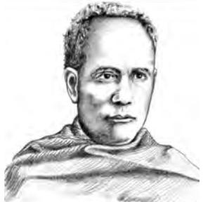

Chapter 2.indd 15 14 September 2022 12:03:07

*W*e saw in the last chapter how colonialism brought in changes that altered the structure of Indian society. Industrialisation and urbanisation transformed the lives of people. Factories replaced fields as places of work for some. Cities replaced villages as places to live for many. Living and working arrangements or structures changed. Changes also took place in culture, ways of life, norms, values, fashions and even body language. Sociologists understand social structure as a 'continuing arrangement of persons in relationships defined or controlled by institutions' and 'culture' as 'socially established norms or patterns of behaviour'. You have already studied about the structural changes that colonialism brought about in Chapter 1. You will observe how important those structural changes are for understanding the cultural changes that this chapter seeks to understand.

This chapter looks at two related developments, both a complex product of the impact of colonial rule. The *first* deals with the deliberate and conscious efforts made by the 19th century social reformers and early 20th century nationalists to bring in changes in social practices that discriminated against women and 'lower' castes. The *second* with the less deliberate yet decisive changes in cultural practices that can broadly be understood as the four processes of sanskritisation, modernisation, secularisation and westernisation. Sanskritisation pre-dates the coming of colonial rule. The other three processes can be understood better as complex responses of the people of India to the changes that colonialism brought about.

# 2.1 Social reform movements in the 19th and early 20th century

You have already seen the farreaching impact of colonialism on our lives. The social reform movements which emerged in India in the 19th century arose to the challenges that colonial Indian society faced. You probably are familiar with what were termed social evils that plagued Indian society. The well-known issues are that of *sati*, child marriage, ban on widow remarriage and

*Raja Ram Mohun Roy Pandita Ramabai Sir Syed Ahmed Khan*

caste discrimination. It is not that attempts were not made to fight social discrimination in pre-colonial India. They were central to Buddhism, *Bhakti* and *Sufi* movements. What marked these 19th century social reform attempts was the modern context and mix of ideas. It was a creative combination of modern ideas of western liberalism and a new look on traditional literature.

Chapter 2.indd 16 14 September 2022 12:03:08

#### **The mix of ideas**

- Raja Ram Mohun Roy attacked the practice of *sati* on the basis of both appeals to humanitarian and natural rights doctrines as well as Hindu *shastras*.
- Ranade's writings entitled *The Texts of the Hindu Law* on *the Lawfulness of the Remarriage of Widows* and *Vedic Authorities for Widow Marriage* elaborated the *shastric* sanction for remarriage of widows.
- The content of new education was modernising and liberal. The literary content of the courses in the humanities and social sciences was drawn from the literature of the European Renaissance, Reformation and Enlightenment. Its themes were humanistic, secular and liberal.
- Sir Syed Ahmed Khan's interpretation of Islam emphasised the validity of free enquiry (*ijtihad*) and the alleged similarities between Koranic revelations and the laws of nature discovered by modern science.
- Kandukiri Viresalingam's *The Sources of Knowledge* reflected his familiarity with *navyanyaya* logic. At the same time he translated the works of Julius Huxley, an eminent biologist.

Sociologist Satish Saberwal elaborates upon the modern context by sketching three aspects to the modern framework of change in colonial India:

- modes of communication
- forms of organisation, and
- the nature of ideas

*New technologies speeded up various forms of communication*. The printing press, telegraph, and later the microphone, movement of people and goods through steamship and railways helped quick movement of new ideas. Within India, social reformers from Punjab and Bengal exchanged ideas with reformers from Madras and Maharashtra. Keshav Chandra Sen of Bengal visited Madras in 1864. Pandita Ramabai travelled to different corners of the country. Some of them went to other countries. Christian missionaries reached remote corners of present day Nagaland, Mizoram and Meghalaya.

*Modern social organisations* like the Brahmo Samaj in Bengal and Arya Samaj in Punjab were set up. The All-India Muslim Ladies Conference (*Anjuman-E-Khawatn-E-Islam*) was founded in 1914. Indian reformers debated not just in public meetings but through public media like newspapers and journals. Translations of writings of social reformers from one Indian language to another took place. For instance, Vishnu Shastri published a Marathi translation of Vidyasagar's book in *Indu Prakash* in 1868.

*New ideas* of liberalism and freedom, new ideas of homemaking and marriage, new roles for mothers and daughters, new ideas of self-conscious pride in culture and tradition emerged. The value of education became very important. It was seen as very crucial for a nation to become modern but also

Chapter 2.indd 17 14 September 2022 12:03:08

*Viresalingam*

*Vidyasagar*

*Jotiba Phule*

**18**

retain its ancient heritage. The idea of female education was debated intensely. Significantly, it was the social reformer Jotiba Phule who opened the first school for women in Pune. Reformers argued that for a society to progress women have to be educated. Some of them believed that in pre-modern India, women were educated. Others contested this on the grounds that this was so only of a privileged few. Thus attempts to justify female education were made by recourse to both modern and traditional ideas. They actively debated the meanings of tradition and modernity. Jotiba Phule thus recalled the glory of pre-Aryan age while others like Bal Gangadhar Tilak emphasised the glory of the Aryan period. In other words, 19th century reform initiated a period of

questioning, reinterpretations and both intellectual and social growth.

The varied social reform movements did have common themes. Yet there were also significant differences. For some the concerns were confined to the problems that the upper caste, middle class women and men faced. For others the injustices suffered by the discriminated castes were central questions. For some social evils had emerged because of a decline of the true spirit of Hinduism. For others caste and gender oppression was intrinsic to the religion.

# **Activity 2.1**

Find out about some of the social reformers mentioned below? What issues did they fight for? How did they conduct their campaign? Was there any opposition?

- ¾ Viresalingam
- ¾ Pandita Ramabai
- ¾ Vidyasagar
- ¾ Dayanand Saraswati
- ¾ Jyotiba Phule
- ¾ Sri Narayan Guru
- ¾ Sir Syed Ahmed Khan
- ¾ Any other

Chapter 2.indd 18 14 September 2022 12:03:08

Likewise Muslim social reformers actively debated the meaning of polygamy and purdah. For example, a resolution against the evils of polygamy was proposed by Jahanara Shah Nawas at the All India Muslim Ladies Conference. She argued:

> …the kind of polygamy which is practiced by certain sections of the Muslims is against the true spirit of the Quran…and it is the duty of the educated women to exercise their influence among the relations to put an end to this practice.

The resolution condemning polygamy caused considerable debate in the Muslim press. *Tahsib-e-Niswan*, the leading journal for women in the Punjab, came out in favour of the resolve, but others disapproved. (Chaudhuri 1993: 111). Debates within communities were common during this period. For instance, *sati* was opposed by the Brahmo Samaj. Orthodox members of the Hindu community in Bengal formed an organisation called Dharma Sabha and petitioned the British arguing that reformers had no right to interpret sacred texts.

# 2.2 Different Kinds of Social Change

In this chapter each of the four concepts, namely sanskritisation, modernisation, secularisation and westernisation, are dealt with in different sections. But as

the discussion unfolds, it will become obvious to you that in many ways they overlap and in many situations they co-exist. In many situations they operate very differently. It is not surprising to find the same person being modern in some ways and traditional in another. This co-existence is often seen as natural to India and many other non-western countries.

But you know that sociology does not rest content with naturalist explanation. (Recall the discussion in Chapter 1, Class XI book - *Introducing Sociology*. As the last chapter has shown colonial modernity had its own paradoxes. Take the example of western education. Colonialism led to the growth of an English educated Indian middle class. They read the thinkers of western enlightenment, philosophers of liberal democracy and dreamt of ushering in a liberal and progressive India. And yet, humiliated by colonial rule they asserted their pride in traditional learning and scholarship. You have already seen this trend in the 19th century reform movements.

# **Activity 2.2**

While you read the way the four processes are used in sociology, it may be interesting to discuss in class what you think the terms mean.

- ¾ What kind of behaviour would you define as: Western Modern Secular Sanskritised
- ¾ Why?
- ¾ Return to Activity 2.2 after you finish the chapter.
- ¾ Did you find any difference between common sense usage of the terms and their sociological meaning?

As this chapter will show, modernity spelled not merely new ideas but also rethinking and reinterpretation of tradition. Both culture and tradition are living

Chapter 2.indd 19 14 September 2022 12:03:08

entities. People learn them and in turn modify them. Take the everyday example of how the *sari* or *jain sem* or *sarong* is worn in India today. Traditionally the sari, a loose unstitched piece of cloth was differently worn in different regions. The standard way that the modern middle class woman wears it was a novel combination of the traditional sari with the western 'petticoat' and 'blouse'.

India's structural and cultural diversity is self-evident. This diversity shapes the different ways that modernisation or westernisation, sanskritisation or secularisation effects or does not effect different groups of people. The following pages seek to capture these differences. The constraint of space prevents a further detailing out. It is up to you to explore and identify the complex ways modernisation impacts people in different parts of the country or impacts different classes and castes in the same region. And even women and men from the same class or community.

**Activity 2.3**

¾ Think of other instances of the mix and match both from everyday life and from the wider level.

My father's clothes represented his inner life very well. He was a south Indian Brahmin gentleman. He wore neat white turbans, a Sri Vaisnava caste mark ..yet wore Tootal ties, Kromentz buttons and collar studs, and donned English serge jackets over his muslin *dhotis* which he wore draped in traditional Brahmin style.

*Source: A.K. Ramanujan in Marriot ed. 1990: 42*

# 2.3 Different Kinds of Social Change

## **Sanskritisation**

The term sanskritisation was coined by M.N. Srinivas. It may be briefly defined as the process by which a 'low' caste or tribe or other group takes over the customs, ritual, beliefs, ideology and style of life of a high and, in particular, a 'twice-born (*dwija*) caste'.

*and match traditional* 

Chapter 2.indd 20 14 September 2022 12:03:09

The impact of Sanskritisation is many-sided. Its influence can be seen in language, literature, ideology, music, dance, drama, style of life and ritual.

It is primarily a process that takes place within the Hindu space though Srinivas argued that it was visible even in sects and religious groups outside Hinduism. Studies of different areas, however, show that it operated differently in different parts of the country. In those areas where a highly Sanskritised caste was dominant, the culture of the entire region underwent a certain amount of Sanskritisation. In regions where the non-Sanskritic castes were dominant, it was their influence that was stronger. This can be termed the process of 'de-Sanskritisation'. There were other regional variations too. In Punjab culturally Sanskritic influence was never very strong. For many centuries until the third quarter of the 19th century, the Persian influence was the dominant one.

Srinivas argued that, "the Sanskritisation of a group has usually the effect of improving its position in the local caste hierarchy. It normally presupposes either an improvement in the economic or political position of the group concerned or a higher group self-consciousness resulting from its contact with a source of the 'Great Tradition' of Hinduism such as a pilgrim centre or a monastery or a proselytising sect." But in a highly unequal society such as India there were and still are obstacles to any easy taking over of the customs of the higher castes by the lower. Indeed, traditionally, the dominant caste punished those low castes, which were audacious enough to attempt it. The story below captures the problem.

Kumudtai's journey into Sanskrit began with great interest and eagerness with Gokhale Guruji, her teacher at school… At the University, the Head of the Department was a well-known scholar and he took great pleasure in taunting Kumudtai…Despite the adverse comments she successfully completed her Masters in Sanskrit….

*Source: Kumud Pawade (1938)*

Kumud Pawade in her autobiography recounts how a Dalit woman became a Sanskrit teacher. As a student she is drawn towards the study of Sanskrit, perhaps because it is the means through which she can break into a field that was not possible for her to enter on grounds of gender and caste. Perhaps she was drawn towards it because it would enable her to read in the original what the texts have to say about women and the Dalits. As she proceeds with her studies, she meets with varied reactions ranging from surprise to hostility, from guarded acceptance to brutal rejection. As she says:

> The result is that although I try to forget my caste, it is impossible to forget. And then I remember an expression I heard somewhere: "What comes by birth, but can't be cast off by dying - that is caste."

Sanskritisation suggests a process whereby people want to improve their status through adoption of names and customs of culturally high-placed groups. The 'reference model' is usually financially better of. In both, the aspiration or desire to be like the higher placed group occurs only when people become wealthier.

Chapter 2.indd 21 14 September 2022 12:03:09

Sanskritisation as a concept has been criticised at different levels. *One*, it has been criticised for exaggerating social mobility or the scope of 'lower castes' to move up the social ladder. For it leads to no structural change but only positional change of some individuals. In other words inequality continues to persist though some individuals may be able to improve their positions within the unequal structure. *Two*, it has been pointed out that the ideology of sanskritisation accepts the ways of the 'upper caste' as superior and that of the 'lower caste' as inferior. Therefore, the desire to imitate the 'upper caste' is seen as natural and desirable.

*Third*, 'sanskritisation' seems to justify a model that rests on inequality and exclusion. It appears to suggest that to believe in pollution and purity of groups of people is justifiable or all right.

## **Activity 2.4**

Read the section on Sanskritisation very carefully. Do you think that this process is gendered, i.e., it affects women differently from men. Do you think that even if it does lead to positional change among men, the reverse may be true about women?

*Fourth*, since sanskritisation results in the adoption of upper caste rites and rituals it leads to practices of secluding girls and women, adopting dowry practices instead of bride-price and practising caste discrimination against other groups, etc.

*Fifth*, the effect of such a trend is that the key characteristics of *dalit* culture and society are eroded. For example the very worth of labour which 'lower castes' do is degraded and rendered 'shameful'. Identities based on the basis of work, crafts and artisanal abilities, knowledge forms of medicine, ecology, agriculture, animal husbandry, etc., are regarded useless in the industrial era.

With the growth of the anti-Brahminical movement and the development of regional self-consciousness in the twentieth century there was an attempt in several Indian languages to drop Sanskrit words and phrases. A crucial result of the Backward Classes Movement was to emphasise the role of secular factors in the upward mobility of caste groups and individuals. In the case of the dominant castes, there was no longer any desire to pass for the Vaisyas, Kshatriyas and Brahmins. On the other hand, it was prestigious to be a member of the dominant caste. Recent years have seen likewise assertions of Dalits who now pride their identity as Dalits.

## **Westernisation**

You have already read about our western colonial past. You have seen how it often brought about changes that were paradoxical and strange. M.N. Srinivas defines westernisation as "the changes brought about in Indian society and culture as a result of over 150 years of British rule, the term subsuming changes occurring at different levels…technology, institutions, ideology and values".

Chapter 2.indd 22 14 September 2022 12:03:09

There were different kinds of westernisation. *One* kind refers to the emergence of a westernised sub-cultural pattern through a minority section of Indians who first came in contact with Western culture. This included the sub culture of Indian intellectuals who not only adopted many cognitive patterns, or ways of thinking, and styles of life, but supported its expansion. Many of the early 19th century reformers were of this kind. The boxes show the different kinds of westernisation.

There were, therefore, small sections of people who adopted western life styles or were affected by western ways of thinking. Apart from this there has been also the general spread of Western cultural traits, such as the use of new technology, dress, food, and changes in the habits and styles of people in general. Across the country a very wide section of middle class homes have a television set, a fridge, some kind of sofa set, a dining table and chair in the living room.

Westernisation does involve the imitation of external forms of culture. It does not necessarily mean that people adopt modern values of democracy and equality.

## **Activity 2.5**

- ¾ Can you think of Indians who are very western in their clothes and appearances but who do not have democratic and egalitarian values that are part of modern attitudes. We are giving two examples below. Can you think of other instances from both real and reel life?
We may find people who are western educated but holding very prejudiced views about particular ethnic or religious communities. A family can adopt external forms of western culture like the way the interiors of houses are done up but may have very conservative ideas about women's role in society. The practice of female foeticide combines discriminatory attitude towards women and the use of very modern technology.

- ¾ You should also discuss that whether this contradiction is only true for the Indians or nonwestern societies. Or is it not equally true that racist and discriminatory attitudes exist in western societies.
Apart from ways of life and thinking, the west influenced Indian art and literature. Artists like Ravi Varma, Abanindranath Tagore, Chandu Menon and Bankimchandra Chattopadhya were all grappling with the colonial encounter. The box below captures the many ways that style, technique and the very theme of an artist like Ravi Varma were shaped by western and indigeneous traditions. It discusses the portrait of a family in a matrilineal community of Kerala but one that significantly resembles the very typical patrilineal nuclear family of the modern west consisting of the father, mother and children.

Chapter 2.indd 23 14 September 2022 12:03:09

*Raja Ravi Varma*

You can see the many diverse levels that cultural change, resulting from our colonial encounter with the west, took place. In the contemporary context often conflicts between generations are seen as cultural conflicts resulting from westernisation. Have you seen this or faced this? Is Westernisation the only reason for generational conflicts? Are conflicts necessarily bad?

Srinivas suggested that while 'lower castes' sought to be Sanskritised, 'upper castes' sought to be Westernised. In a diverse country such as India this generalisation is difficult to maintain. For instance, studies of Thiyyas (by no means considered 'upper caste') in Kerala show conscious efforts to westernise. Elite Thiyyas appropriated British culture as a move towards a more cosmopolitan life that critiqued caste. Likewise, Western education often implied opening up to new opportunities for different groups of people in the North- East. Read the account given in Box 2.4.

In 1870 Ravi Varma received his first paid commission to paint the portrait of Kizhakke Palat Krishna Menon's family. …This is a transitional work which blends elements of a flatter, two-dimensional style popular within earlier water-colours with **Box 2.2**

the newer techniques of perspective and illusionism, made possible by the use of a medium like oil.

…Another feature is the technique of spatial organisations of the seated and figures in deference to age and hierarchy, which is once again r e m i n i s c e n t o f nineteenth century European portraits of the bourgeois family. …How strange then

this portrait was painted in matrilineal Kerala at a time when most of the Nayars, Krishna, Menon's caste, would have been unused to living in patrilocal nuclear families… *Source: G . Arunima "Face value: Ravi Varma's portraiture and the project of colonial modernity". The Indian Economic and Social History Review 40, 1 (2003) pp. 57–80.*

Chapter 2.indd 24 14 September 2022 12:03:09

…And though they are of my own flesh and blood, they sometimes seem like total strangers to me. I no longer have anything in common with them…neither with their ways of thinking, nor with the way they dress up, talk or behave. They are the new generation. And my mental makeup is such that any sort of mutuality between them and me becomes impossible. Yet I love them with all my heart. I give them whatever they desire, for their happiness is all I want. Rabindranth's words set my heart in a tremulous feeling: "This is your time; for now is the beginning of my end." I have nothing in common with my children Pallav, Kallol and Kingkini. Pallav lives in a different country, in a different culture altogether. We, for instance, had worn the mekela-chadar from the age of twelve. But now my daughter Kingkini, a student of Business Management at Gauhati University wears pant and buggy shirts. And Kallol likes to sport a mass of unruly hair on his head. When I feel listening to a Meera-Bhajan, Kallol and Kingkini choose to play their favourite pop numbers by Whitney Houston. At times, when I feel like singing a few lines of Bargeet, Kinkin likes to play western tunes on her guitar.

*Source: Anima Dutta 1999 "As Days Roll On" in* Women: A Collection of Assamese Short Stories, *Diamond Jubilee Volume, (Guwahati, Spectrum Publications)*

Chapter 2.indd 25 14 September 2022 12:03:09

### My grandfather, like most Nagas who had come into close contact with Europeans, was convinced that **Box 2.4**

education was the only way to get ahead in life. He aspired for his children the kind of life he had seen being lived by the British administration and missionaries. He sent my mother away to school first in neighbouring Assam, then as far away as Shimla. My mother was encouraged by one of the more educated men in her village who told her that with an education in these new times, she could even become like the Indian lady who spoke before the world- Vijaylakshmi Pandit, sister of Nehru, who represented India at the UN. My father by dint of his own intelligence and hard work, put himself through the local mission school and college in Shillong. All Nagas of my parents' generation who were able to, chose to get educated in English. For them it was more than a gateway to upward mobility. In a region where tribes that live no more than 20 kms apart speak completely different languages, it was a medium through which they could communicate amongst themselves and with the world. They became the voice of their people and made English the official state language. *(Ao 2005: 111)* 

#### **What kind of modernity?**

They (upper caste founders of various oganisations and conferences) pretend to be modernists as long as they are in the service of the British government. The moment they retire and claim their pensions, they get into their brahmanical 'touch-me-not attire'…

*Jotiba Phule's letter to the Conference of Marathi Authors* 

## **Modernisation and Secularisation**

The term *modernisation* has a long history. From the 19th and more so the 20th century, the term began to be associated with positive and desirable values. People and societies wanted to be modern. In the early years, modernisation referred to improvement in technology and production processes. Increasingly, however, the term had a wider usage. It referred to the path of development that much of west Europe or North America has taken. And suggested that other societies both have to and ought to follow the same path of development.

In India the beginnings of capitalism, as we saw in Chapter 1, took place within the colonial context. The story of our modernisation and secularisation is, therefore, quite distinct from their growth in the west. This is evident when

we discussed westernisation and the efforts of the 19th century social movements earlier in this chapter. Here we look into the two processes of modernisation and secularisation together for they are linked. They are both part of a set of modern ideas. Sociologists have tried to define what exactly constitutes the modernisation process.

> '[M]odernity' assumes that local ties and parochial perspectives give way to universal commitments and cosmopolitan attitudes; that the truths of utility, calculation, and science take precedence over those of the emotions, the sacred, and the non-rational; that the individual rather than the group be the primary unit of society and politics; that the associations in which men live and work be based on choice not birth; that mastery rather than fatalism orient their attitude toward the material and human environment; that identity be chosen and achieved, not ascribed and affirmed; that work be separated from family, residence, and community in bureaucratic organisation….*(Rudolph and Rudolph, 1967)*

Chapter 2.indd 26 14 September 2022 12:03:09

In other words it means that people are influenced not just by local but universal contexts. How you behave, what you think is no longer decided by your family or tribe or caste or community. What job you wish to do is decided not by the job your parent does, but by what you wish to do. Work gets based on choice, not birth. On whom you are depend on what you achieve, not by who you are. A scientific attitude gains ground.

In the modern west, *secularisation* has usually meant a process of decline in the influence of religion. It has been an assumption of all theorists of modernisation that modern societies become increasingly secular. Indicators of secularisation have referred to levels of involvement with religious organisations, the social and material influence of religious organisations, and the

degree to which people hold religious beliefs. Recent years have, however, seen an unprecedented growth of religious consciousness and conflict world over.

However even in the past, a view that assumed that modern ways would necessarily lead to decline in religious ways has not been entirely true. You will recall how western and modern forms of communication, organisation and ideas led to the emergence of new kinds of religious reform organisations. Furthermore, a considerable part of ritual in India has direct reference to the pursuit of secular ends.

> Rituals have also secular dimensions as distinct from secular goals. They provide men and women with occasions for socialising with their peers and superiors, and for showing off the family's wealth, clothing and jewellery. During the last few decades in particular, the economic, political and status dimensions of ritual have become increasingly conspicuous, and the number of cars lined up outside a wedding house and the VIPs who attended the wedding, provide the index to the household's standing in the local community.

There has also been considerable debate about what is seen by some as secularisation of caste. What does this mean? In traditional India caste system operated within a religious framework. Belief systems of purity and pollution were central to its practice. Today it often functions as political pressure groups. Contemporary

India has seen such formation of caste associations and caste based political parties. They seek to press upon the state their demands. Such a changed role of caste has been described as secularisation of caste. The box below illustrates this process.

# **Activity 2.6**

Take any matrimonial column from any newspaper or websites like *shaadi.com* and try and see the pattern. How often is caste or community mentioned? If it is mentioned many times does it mean that caste continues to play the same kind of role as it did traditionally? Or has the role of caste changed? Discuss.

## **Activity 2.7**

Observe advertisements during traditional festivals such as Diwali, Durga Puja, Ganesh Puja, Dusserah, Karwa Chauth, Id, Christmas. Collect different advertisements from the print media. Watch the electronic media also. Note what the messages of these advertisements are about.

Chapter 2.indd 27 14 September 2022 12:03:09

#### Everyone recognises that the traditional social system in India was organised around caste structures and caste identities. In dealing with the relationship between caste and politics, however the doctrinaire moderniser suffers from a serious xenophobia. He begins with the questions: is caste disappearing? Now, surely no social system disappears like that. A more useful point of departure would be: *what form is caste taking under the impact of modern politics, and what form is politics taking in a caste-oriented society*? **Box 2.5**

Those in India who complain of 'casteism in politics' are really looking for a sort of politics, which has no basis in society. …Politics is a competitive enterprise, its purpose is the acquisition of power for the realisation of certain goals, and its process is one of identifying and manipulating existing and emerging allegiances in order to mobilise and consolidate positions. The important thing is organisation and articulation of support, and where politics is mass-based, the point is to articulate support through the organisations in which the masses are to be found. It follows that *where the caste structure provides one of the principal organisational clusters along which the bulk of the population is found to live, politics must strive to organise through such a structure*.

*Politicians mobilise caste groupings and identities in order to organise their power. …Where there are other types of groups and other bases of association, politicians approach them as well. And as they everywhere change the form of such organisations, they change the form of caste as well*.

*(Kothari 1977: 57–70)* 

# Conclusion

This chapter has sought to show the distinct ways that social change has taken place in India. The colonial experience had lasting consequences. Many of these were unintended and paradoxical. Western ideas of modernity shaped the imagination of Indian nationalists. It also prompted a fresh look at traditional texts by some. It also led to a rejection of these by others. Western cultural forms found their place in spheres ranging from how families lived to what codes of conduct should men, women and children have to follow as artistic expressions. The ideas of equality and democracy made a huge impact as evident in both the reform movements and the nationalist movement. This led not just to adoption of western ideas, but also an active questioning and reinterpretation of tradition.

Chapter 2.indd 28 14 September 2022 12:03:09

- 1. Write a critical essay on sanskritisation.
- 2. Westernisation is often just about adoption of western attire and lifestyle. Are there other aspects to being westernised? Or is that about modernisation? Discuss.
- 3. Write short notes on:
	- Rites and secularisation
	- Caste and secularisation
	- Gender and sanskritisation

#### **REFERENCES**

Ramanujan, A.K. 1990. 'Is There an Indian Way of Thinking: An Informal essay' in Marriot McKim *India Through Hindu Categories*. Sage. New Delhi.

Abraham, Janaki. 2006. 'The Stain of White: Liasons, memories and White Men as Relatives' *Men and Masculinities*. Vol 9. No. 2. pp 131–151.

Ao, Ayinla Shilu. 2005. 'Where the Past Meets the Future' in Ed. Geeti Sen *Where the Sun Rises When Shadows Fall*. IIC Quarterly Monsoon Winter 32, 2&3. pp. 109–112.

Chakravarti, Uma. 1998. *Rewriting History: The Life and Times of Pandita Ramabai*. Kali for Women. New Delhi.

Chaudhuri, Maitrayee. 1993. *The Indian Women's Movement: Reform and Revival*. Radiant. New Delhi.

Dutt, A.K. 1993. 'From Colonial City to Global City: The Far from Complete Spatial Transformation of Calcutta' in Brunn S.D. and Williams J.F. Ed. *Cities of the World*. pp. 351–388. Harper Collins. New York.

Khare, R.S. 1998. *Cultural Diversity and Social Discontent: Anthropological Studies on Contemporary India*. Sage. New Delhi.

Kothari, Rajni. 1997. 'Caste and Modern Politics' in Sudipta Kaviraj Ed. *Politics in India*. pp. 57–70. Oxford University Press. Delhi.

Pandian, M.S.S. 2000. 'Dalit Assertion in Tamil Nadu: An Exploratory Note'. *Journal of Political Economy*. Vol XII. Nos. 3 and 4.

Raman, Vasanthi. 2003. 'The Diverse Life-Worlds of Indian Childhood' in Margrit Pernau, Imtiaz Ahmad, Helmult Reifeld (Eds), *Family and Gender: Changing values in Germany and India*. Sage. New Delhi.

Riba, Moji. 2005. "Rites, in passing …" IIC Quarterly *Monsoon-Winter* 32, 2&3. pp.113–121.

Rudolph and Rudolph. 1967. *The Modernity of Tradition: Political Development in India*. University of Chicago Press. Chicago.

Saberwal, Satish. 2001. 'Framework in Change: Colonial Indian Society' in Ed. Susan Visvanathan *Structure and Transformation: Theory and Society in India*. pp.33–57. Oxford. Delhi.

Questions

Chapter 2.indd 29 11 November 2022 11:54:42

Chapter 2.indd 30 14 September 2022 12:03:09

