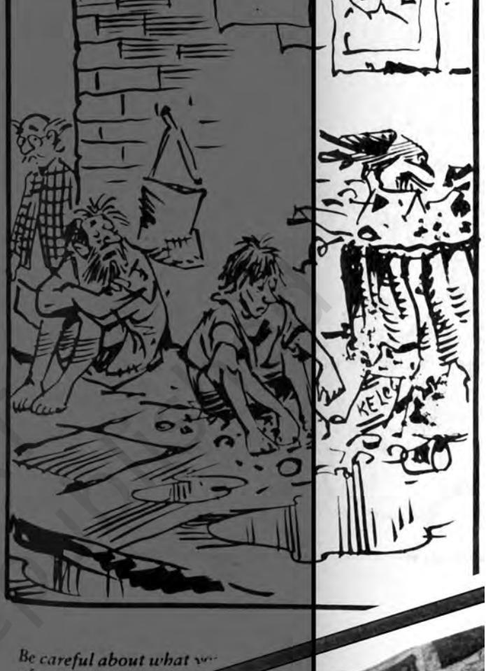

Chapter 3.indd 31 14 September 2022 12:03:32

*Y*ou will realise that the Constitution has the capacity to help people because it is based on the basic norms of social justice. For instance, the Directive Principle on Village Panchayats was moved as an amendment in the Constituent Assembly by K. Santhanam. After forty odd years, it became a Constitutional imperative after the 73rd Amendment in 1992.

The Constitution is not just a ready referencer of do's and don'ts for social justice. It has the potential to extend the meaning of social justice. Social movements have also aided the courts and authorities to interpret the contents of rights and principles in keeping with the contemporary understanding on social justice.

# **Constitutional Norms and Social Justice: Interpretation to Aid Social Justice**

It is useful to understand that there is a difference between law and justice. The essence of law is its force. Law is law because it carries the means to coerce or force obedience. The power of the state is behind it. The essence of justice is fairness. Any system of law functions through a hierarchy of authorities. Constitution is the basis of all rules and authorities. It is the document that constitutes a nation's tenets. The Indian Constitution is India's basic norm. All other laws are made as per the procedures prescribed by the Constitution. These laws are made and implemented by the authorities specified by the Constitution. A hierarchy of courts (which too are authorities created by the Constitution) inerpret the laws when there is a dispute. The Supreme Court is the highest court and the ultimate interpreter of the Constitution.

The Supreme Court has enhanced the substance of Fundamental Rights in the Constitution in many important ways. The Box below illustrates a few instances.

- A Fundamental Right includes all that is incidental to it. The terse words of Article 21 recognising *the right to life and liberty* have been interpreted as including all that goes into a life of quality, including livelihood, health, shelter, education and dignity. In various pronouncements, different attributes of 'life' have been expanded and 'life' has been explained to mean more than mere animal existence. These interpretations have been used to provide relief to prisoners subjected to torture and deprivation, release and rehabilitation of bonded labourers, against environmentally degrading activities, to provide primary healthcare and primary education. In 1993 the Supreme Court held that Right to Information is a part of and incidental to the Right to Freedom of Speech and Expression under Article 19(1) (a). **Box 3.1**
- The Supreme Court read the Directive Principle of Equal Pay for Equal Work into the Fundamental Rights to Equality under Article 14 and has provided relief to many plantation and agricultural labourers and to others.

Chapter 3.indd 32 10 November 2022 03:14:52

# 3.1 The Panchayati Raj and the Challenges of Rural Social Transformation

## **Ideals of Panchayati Raj**

Panchayati Raj translates literally to 'Governance by five individuals'. The idea is to ensure at the village or grass root level a functioning and vibrant democracy. While the idea of grassroot democracy is not an alien import to our country, in a society where there are sharp inequalities, democratic participation is hindered on grounds of gender, caste and class. Furthermore, as you shall see in the newspaper reports later in the chapter, traditionally there have been caste panchayats in villages. But they have usually represented dominant groups. Furthermore, they often held conservative views and often have, and continue to take decisions that go against both democratic norms and procedures.

When the constitution was being drafted, panchayats did not find a mention in it. At this juncture, a number of members expressed their sorrow, anger and disappointment over this issue. At the same time, drawing on his own rural experience, Dr. Ambedkar argued that local elites and upper castes were so well entrenched in society that local selfgovernment only meant a continuing exploitation of the downtrodden masses of Indian society. The upper castes would no doubt silence this segment of the population further. The concept of local government was dear to Gandhiji too. He envisaged each village as a self-sufficient unit conducting its own affairs and saw *gram-swarajya* to be an ideal model to be continued after independence.

It was, however, only in 1992 that grassroot democracy or decentralised governance was ushered in by the 73rd Constitutional Amendment. This act **The three-tier system of Panchayati Raj Institution**

**Box 3.2**

- The structure is like a pyramid. At the base of the structure stands the unit of democracy or Gram Sabha. This consists of the entire body of citizens in a village or grama. It is this general body that elects the local government and charges it with specific responsibilities. The Gram Sabhas ideally ought to provide an open forum for discussions and village-level development activities and play a crucial role in ensuring inclusion of the weaker sections in the decision-making processes.
- The 73rd Amendment provided a three-tier system of Panchayati Raj for all states having a population of over twenty lakhs.
- It became mandatory that election to these bodies be conducted every five years.
- It provided reservation of seats for the Scheduled Castes, Scheduled Tribes and thirty three percent seats for women.
- It constituted District Planning Committee to prepare drafts and develop plans for the district as a whole.

provided constitutional status to the Panchayati Raj Institutions (PRIs). It is compulsory now for local self-government bodies in rural and municipal areas to be elected every five years. More importantly, control of local resources is given to the elected local bodies.

### **33 33**

Chapter 3.indd 33 14 September 2022 12:03:33

*A woman Panch with her reward*

**34**

The 73rd and 74th amendments to the Constitution ensured the reservation of one third of the total seats for women in all elected offices of local bodies in both the rural and urban areas. Out of this, 17 per cent seats are reserved for women belonging to the scheduled castes and tribes. This amendment is significant as for the first time it brought women into elected bodies which also bestowed on them decision making powers. One third of the seats in local bodies, gram panchayats, village panchayats, municipalities, city corporations and district boards are reserved for women. The 1993–94 elections, soon after the 73rd amendment brought in 800,000 women into the political processes in a single election. That was a big step indeed in enfranchising women. A constitutional amendment prescribed a threetier system of local self-governance (read Box 3.7 on the last page) for the entire country, effective since 1992–93.

# **Powers and Responsibilities of Panchayats**

According to the Constitution, Panchayats should be given powers and authority to function as institutions of self-government. It, thus, requires all state governments to revitalise local representative institutions.

The following powers and responsibility were delegated to the Panchayats:

- ¾ to prepare plans and schemes for economic development
- ¾ to promote schemes that will enhance social justice
- ¾ to levy, collect and appropriate taxes, duties, tolls and fees
- ¾ help in the devolution of governmental responsibilities, especially that of finances to local authorities

Social welfare responsibilities of the Panchayats include the maintenance of burning and burial grounds, recording statistics of births and deaths, establishment of child welfare and maternity centres, control of cattle pounds, propagation of family planning and promotion of agricultural activities. The development activities include the construction of roads, public buildings, wells, tanks and schools. They also promote small cottage industries and take care of minor irrigation works. Many

Chapter 3.indd 34 14 September 2022 12:03:33

government schemes like the Integrated Rural Development Programme (IRDP) and Integrated Child Development Scheme (ICDS) are monitored by members of the panchayat.

The main income of the Panchayats is from tax levied on property, profession, animals, vehicles, cess on land revenue and rentals. The resources are further increased by the grants received through the Zilla Panchayat. It is also considered compulsory for Panchayat offices to put up boards outside their offices, listing the break up of funds received, and utilisation of the financial aid received. This exercise was taken up to ensure that people at the grassroot level should have the 'right to information' – opening all functioning to the public eye. People had the right to scrutinise allocation of money. And ask reasons for decisions that were taken for the welfare and development activities of the village.

*Nyaya Panchayats* have been constituted in some states. They possess the authority to hear some petty, civil and criminal cases. They can impose fines but cannot award a sentence. These village courts have often been successful in bringing about an agreement amongst contending parties. They have been particularly effective in punishing men who harass women for dowry and perpetrate violence against them.

# **Panchayati Raj in Tribal Areas**

Kalavati, a Dalit by caste was apprehensive about standing for elections. She is a Panchayat member and realises that her confidence and self-esteem has grown ever since she became a member of the panchayat. Most importantly 'she has a name'. Before she became a member of the panchayat she was only called as 'Ramu's mother' or 'Hiralal's wife'. If she lost the election for the post of the Pradhan she felt *'sakhiyan ki nak kat jaye*' (her friends would lose face). **Box 3.3**

*Source: This was recorded by Mahila Samakhya, an NGO working towards Rural Women's Empowerment.*

Chapter 3.indd 35 14 September 2022 12:03:33

## *Van* **Panchayats**

In Uttarakhand, women do most of the work since men are often posted far away in defence services. Most of the villagers are still dependent on firewood for cooking. As you may know, deforestation is a big problem in the mountainous regions. Women sometimes walk many miles to collect firewood and fodder for their animals. To overcome this problem, women have set up *van*-panchayats. Members of the *van*-panchayats develop nurseries and nurture tree saplings for planting on the hill slopes. Members also police nearby forests to keep an eye on illegal felling of trees. The Chipko movement, where women hugged trees to prevent them from being cut, had its beginnings in this area.

### **Panchayati Raj training for illiterate women**

## **Box 3.5**

**Box 3.4**

*Innovative modes of communicating the strength of the Panchyat Raj system* The story of two villages, Sukhipur and Dhukipur are unravelled through a cloth '*phad*' or a scroll (a traditional folk medium of story telling). Village Dhukipur (sad village) has a corrupt Pradhan (Bimla), who has spent the money received from the panchayat for building a school, on constructing a house for herself and her family. The rest of the villagers are sad and poor. On the other hand, Sukhipur (happy village) has a content populace as the

Pradhan (Najma) has invested rural reconstruction money in developing good infrastructure for her village. Here the primary health centre is functioning, it has a 'pucca' building and also has a good road so that buses can reach the village.

Pictorial pictures on the '*phad*', accompanied with folk music were useful tools to convey the message for able governance and

participation. This innovative method of story telling was very effective in bringing awareness to unlettered women. Most importantly the campaign conveyed the message, that it was not enough to merely vote, or to stand for election, or to win. But important to know why is one voting for a particular person, what are the traits to look for, and what does he or she stand for .The value for integrity is also emphasised through the story and song media of the '*phad*'.

*This training programme was conducted by Mahila Samakhya, an NGO working towards Rural Women's Empowerment.*

Chapter 3.indd 36 14 September 2022 12:03:33

Many tribal areas have had a rich tradition of grassroot democratic functioning. We give an illustrative example from Meghalaya. All the three major ethnic tribal groups, namely, the Khasis, Jaintias and the Garos have their own traditional political institutions that have existed for hundreds of years. These political institutions were fairly well-developed and functioned at various tiers, such as the village level, clan level and state level. For instance, in the traditional political system of the Khasis, each clan had its own council known as the 'Durbar Kur', which was presided over by the clan headman. Though there is a long tradition of grassroot political institutions in Meghalaya, a large chunk of tribal areas lie outside the provisions of the 73rd Amendment. This may be because the concerned policymakers did not wish to interfere with the traditional tribal institutions.

However, as sociologist Tiplut Nongbri remarks that tribal institutions in themselves need not necessarily be democratic in its structure and functioning. Commenting on the Bhuria Committee Report that went into this issue, Nongbri remarks that while the Committee's concern for the traditional tribal institutions is appreciable, it fails to take stock of the complexity of the situation. For notwithstanding the strong egalitarian ethos that characterised tribal societies, the element of stratification is not altogether absent. Tribal political institutions are not only marked by open intolerance to women but the process of social change has also introduced sharp distortions in the system, making it difficult to identify which is traditional and which is not (Nongbri 2003: 220). This again brings you back to the changing nature of tradition that we discussed in Chapters 1 and 2.

## **Democratisation and Inequality**

It will be clear to you that democratisation is not easy in a society that has had a long history of inequality based on caste, community and gender. You have dealt with the different kinds of inequality in the earlier book. In Chapter 4 you will get a fuller sense of rural Indian structure. Given this unequal and undemocratic social structure, it is not surprising that in many cases, certain members belonging to particular groups, communities, castes of the village are not included or informed about meetings and activities of the village. The Gram Sabha members are often controlled by a small coterie of rich landlords usually hailing from the upper castes or landed peasantry. They make decisions on development activities, allocate funds, leaving the silent majority as mere onlookers.

Chapter 3.indd 37 14 September 2022 12:03:33

# 3.2 Political Parties, Pressure and Interest Groups in Democratic Politics

A look at the newspaper every morning will show you many instances where different groups seek to make their voices heard. And draw the attention of the government to their grievances.

Industrialists form associations such as Federation of Indian Chambers and Commerce (FICCI) and Association of Chambers of Commerce (ASSOCHAM).

# **Activity 3.1**

- ¾ Follow any one newspaper or magazine for a week. Note down the many instances where there is a clash of interests.
- ¾ Identify the issue over which the dispute occurs.
- ¾ Identify the way the groups concerned take up their cause.
- ¾ Is it a formal delegation of a political party to meet the Prime Minister or any other functionary?
- ¾ Is it a protest on the streets?
- ¾ Is it through writing or providing information in newspapers?
- ¾ Is it through public meetings?
- ¾ Identify the instances whether a political party, a professional association, a non governmental organisation or any other body takes up an issue.

Workers form trade unions such as the Indian Trade Union Congress (INTUC) or the Centre for Indian Trade Unions (CITU). Farmers form agricultural unions such as Shetkari Sangathan. Agricultural labourers have their own unions. You will read about other kinds of organisations and social movements like tribal and environmental movements in the last chapter.

In a democratic form of government political parties are key actors. A political party may be defined as an organisation oriented towards achieving legitimate control of government through an electoral process. Political Party is an organisation established with the aim of achieving governmental power and using that power to pursue a specific programme. Political parties are based on certain understanding of society and how it ought to be. In a democratic system the interests of different groups are also represented by political parties, who take up their case. Different interest groups will work towards influencing political parties. When certain groups feel that their interests are not being taken up, they may move to form an alternative party. Or they form pressure groups who lobby with the government. Interest Groups are organised to pursue specific interests in the political arena, operating primarily by lobbying the members of legislative bodies. In some situations, there may be political organisations

which seek to achieve power but are denied the opportunity to do so through standard means. These organisations are best regarded as movements until they achieve recognition.

Chapter 3.indd 38 10 November 2022 03:15:40

Every year in February the Finance Minister of the Government of India presents the Budget to the Parliament. Prior to this there are reports every day in the newspaper of the meetings that the various confederation of Indian industrialists, of trade unions, farmers, and more recently womens' groups had with the Ministry of Finance.

It is obvious that all groups will not have the same access or the same ability to pressurise the government. Some, therefore, argue that the concept of pressure groups underestimate the power that dominant social groups such as class, caste or gender have in society. They feel that it would be more accurate to suggest that dominant class or classes control the state. This does not negate the fact that social movements and pressure groups also continue to play a very important role in a democracy. Chapter 8 shows this.

## **Max Weber on Parties**

Whereas the genuine place of classes is within the economic order, the place of status groups is within the social order…But parties live in a house of power… Party actions are always directed towards a goal which is striven for in a planned manner. The goal may be a 'cause' (the party may aim at realising a program for ideal or material purposes), or the goal may be 'personal' (sinecures, power, and from these, honour for the leader and followers of the party). **Box 3.7**

*(Weber 1948: 194)*

- 1. Have you heard of Bal Panchayats and Mazdoor Kissan Sanghathan? If not, find out and write a note about them in about 200 words.
- 2. The 73rd amendment has been monumental in bringing a voice to the people in the villages. Discuss.
- 3. Write an essay on the ways that the Indian Constitution touches peoples' everyday life, drawing upon different examples.
- 4. What is the significance of political parties in a democracy?
- 5. How are pressure groups formed?
- 6. What is the role of interest groups in a democratic system?

# Questions

**39**

**Box 3.6**

Chapter 3.indd 39 14 September 2022 12:03:34

### **REFERENCES**

Anand, Nikhil. 2006. 'Disconnecting Experience: Making World Class Roads in Mumbai'. *Economic and Political Weekly* (August 5th). pp. 3422–3429.

Ambedkar, Babasaheb. 1992. 'The Buddha and His Dharma' in V. Moon (Ed.) *Dr. Babasaheb Ambedkar: Writings and Speeches*. Vol. 11. Bombay Educational Department. Government of Maharashtra.

Sen, Amartya. 2004. *The Argumentative Indian: Writings on Indian History, Culture and Identity*. Allen Lane. Penguin Group. London.

Weber, Max. 1948. *Essays in Sociology* Ed. with an introduction by H.H. Gerth and C. Wright Mills. Routledge and Kegan Paul. London.

**40**

Chapter 3.indd 40 14 September 2022 12:03:34

