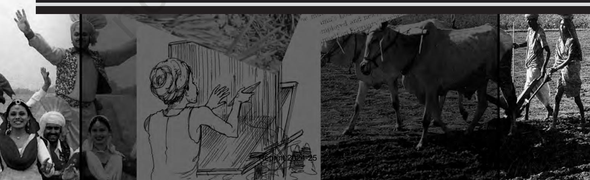

Chapter 4.indd 41 14 September 2022 12:03:53

*I*ndian society is primarily a rural society though urbanisation is growing. The majority of India's people live in rural areas (69 per cent, according to the 2011 Census). They make their living from agriculture or related occupations. This means that agricultural land is the most important productive resource for a great many Indians. Land is also the most important form of property. But land is not just a 'means of production' nor just a 'form of property'. Nor is agriculture just a form of livelihood. It is also a way of life. Many of our cultural practices and patterns can be traced to our agrarian backgrounds. You will recall from the earlier chapters how closely interrelated structural and cultural changes are. For example, most of the New Year festivals in different regions of India – such as Pongal in Tamil Nadu, Bihu in Assam, Baisakhi in Punjab and Ugadi in Karnataka to name just a few – actually celebrate the main harvest season and herald the beginning of a new agricultural season. Find out about other harvest festivals.

*Different means of agriculture and related festivals.*

There is a close connection between agriculture and culture. The nature and practice of agriculture varies greatly across the different regions of the country. These variations are reflected in the different regional cultures. One can say that both the culture and social structure in rural India are closely bound up with agricultural and the agrarian way of life.

Agriculture is the single most important source of livelihood for the majority of the rural population. But the rural is not just agriculture. Many activities that support agriculture and village life are also sources of livelihood for people in rural India. For example, a large number of artisans such as potters, carpenters, weavers, ironsmiths, and goldsmiths are found in rural areas. They were once part and parcel of the village economy. Their numbers have been steadily lessening since the colonial period. You have already read in Chapter 1 how the influx of manufactured goods replaced hand-made products.

Rural life also supported many other specialists and craftspersons as story-tellers, astrologers, priests, water-distributors and oil-pressers. The

Chapter 4.indd 42 14 September 2022 12:03:53

diversity of occupations in rural India was reflected in the caste system, which in most regions included specialist and 'service' castes such as Dry Cleaners, Potters and Goldsmiths. Some of these traditional occupations have declined. But increasing interconnection of the rural and urban economies have led to many diverse occupations. Many people living in rural areas are employed in, or have livelihoods based on rural nonfarm activities. For instance, there are rural residents employed in government services such as the Postal and Education Departments, factory workers, or in the army, who earn their living through nonagricultural activities.

### **Activity 4.1**

- ¾ Think of an important festival that is celebrated in your region that has its roots in agrarian society. What is the significance of the various practices or rituals that are associated with that festival, and how are they linked to agriculture?
- ¾ Most towns and cities in India have grown and encompassed surrounding villages. Can you identify an area of the city or town where you live that used to be a village, or areas that were once agricultural land? How do you think this growth takes place, and what happens to the people who used to make a living from that land?

*The Diversity of Occupations*

Chapter 4.indd 43 14 September 2022 12:03:53

### 4.1 Agrarian Structure: Caste and Class in Rural India

Agricultural land is the single most important resource and form of property in rural society. But it is not equally distributed among people living in a particular village or region. Nor does everyone have access to land. In fact, the distribution of landholdings in most regions is highly unequal among households. In some parts of India, the majority of rural households own at least some land – usually very small plots. In other areas as much as 40 to 50 per cent of families do not own any land at all. This means that they are dependent on agricultural labour or other kinds of work for their livelihoods. This of course means that a few families are well-to-do. The majority live just above or below the poverty line.

In most regions of India, women are usually excluded from ownership of land, because of the prevailing patrilineal kinship system and mode of inheritance. By law women are supposed to have an equal share of family property. In reality, they only have limited rights and some access to land only as part of a household headed by a man.

The term agrarian structure is often used to refer to the structure or distribution of landholding. Because agricultural land is the most important productive resource in rural areas, access to land shapes the rural class structure. Access to land largely determines what role one plays in the process of agricultural production. *Medium and large landowners* are usually able to earn sufficient or even large incomes from cultivation (although this depends on agricultural prices, which can fluctuate greatly, as well as other factors such as the monsoon). But *agricultural labourers* are more often than not paid below the statutory minimum wage and earn very little. Their incomes are low. Their employment is insecure. Most agricultural labourers are daily-wage workers. And do not have work for many days of the year. This is known as underemployment. Similarly, *tenants* (cultivators who lease their land from landowners) have lower incomes than owner-cultivators. Because they have to pay a substantial rent to the landowner – often as much as 50 to 75 per cent of the income from the crop.

Agrarian society, therefore, can be understood in terms of its class structure. But we must also remember the structure is itself through the caste system. In rural areas, there is a complex relationship between caste and class. This relationship is not always straightforward. We might expect that the higher castes have more land and higher incomes. And that there is a correspondence between caste and class as one moves down the hierarchy. In many areas this is broadly true but not exactly. For instance, in most areas the highest caste, the Brahmins, are not major landowners, and so they fall outside the agrarian structure although they are a part of rural society. In most regions of India, the major landowning groups belong to the upper castes. In each region, there are usually just one or two major landowning castes, who are also numerically

Chapter 4.indd 44 14 September 2022 12:03:53

very important. Such groups were termed by the sociologist M.N. Srinivas as dominant castes. In each region, the dominant caste is the most powerful group, economically and politically, and dominates local society. Examples of dominant landowning groups are the Jats and Rajputs of U.P., the Vokkaligas and Lingayats in Karnataka, Kammas and Reddis in Andhra Pradesh, and Jat Sikhs in Punjab.

While dominant landowning groups are usually middle or high ranked castes, most of the marginal farmers and landless belong to lower caste groups. In official classification they belong to the Scheduled Castes or Tribes (SC/STs) or Other Backward Classes (OBCs). In many regions of India, the former 'Untouchable' or *dalit* castes were not allowed to own land and they provided most of the agricultural labour for the dominant landowning groups. This also created a labour force that allowed the landowners to cultivate the land intensively and get higher returns.

There is a direct correspondence between agricultural productivity and the agrarian structure. In areas of assured irrigation, those with plentiful rainfall or artificial irrigation works (such as rice-growing regions in river deltas, for instance the Kaveri basin in Tamil Nadu) more labour was needed for intensive cultivation. Here the most unequal agrarian structures developed. The agrarian structure of these regions was characterised by a large proportion of landless labourers, who were often 'bonded' workers belonging to the lowest castes. (Kumar 1998).

The rough correspondence between caste and class means that typically the upper and middle castes also had the best access to land and resources, and hence to power and privilege. This had important implications for the rural economy and society. In most regions of the country, a 'proprietary caste' group owns most of the resources and can command labour to work for them. Until recently, practices such as *begar* or free labour were prevalent in many parts of northern India. Members of low ranked caste groups had to provide labour for a fixed number of days per year to the village *zamindar* or landlord. Many of the working poor were tied to landowners in 'hereditary' labour relationships. Although such practices have been abolished legally, they continue to exist in many areas.

### 4.2 The Impact of Land Reforms

### **The Colonial Period**

There are historical reasons why each region of India came to be dominated by just one or two major groups. But it is important to realise that this agrarian structure has changed enormously over time, from the pre-colonial to the

### **Activity 4.2**

- ¾ Think about what you have learned about the caste system. Outline the various linkages between the agrarian or rural class structure and caste. Discuss in terms of different access to resources, labour and occupation.
Chapter 4.indd 45 14 September 2022 12:03:53

### **Box 4.1**

colonial and after independence. While the same dominant castes were probably also cultivating castes in the pre-colonial period, they were not the direct owners of land. Instead, ruling groups such as the local kings or zamindars (landlords who were also politically powerful in their areas, and usually belonged to Kshatriya or other high castes) controlled the land. The peasants or cultivators who worked the land had to handover a substantial portion of the produce to them. When the British colonised India, in many areas they ruled through these local zamindars. They also granted property rights to the zamindars. Under the British, the zamindars were given more control over land than they had before. Since the colonisers also imposed heavy land revenue (taxes) on agriculture, the zamindars extracted as much produce or money as they could out of the cultivators. One result of this zamindari system was that agricultural production stagnated or declined during much of the period of British rule. For peasants fled from oppressive landlords and frequent famines and wars decimated the population.

Many districts of colonial India were administered through the zamindari system. In other areas that were under direct British rule had what was called the *raiyatwari* system of land settlement (*raiyat* means cultivator in Telugu). In this system, the 'actual cultivators' (who were themselves often landlords and not cultivators) rather than the zamindars were responsible for paying the tax. Because the colonial government dealt directly with the farmers or landlords, rather than through the overlords, the burden of taxation was less and cultivators had more incentive to invest in agriculture. As a result, these areas became relatively more productive and prosperous.

This background about land revenue administration in colonial India – much of which you have learned in your history books – is important to keep in mind when studying the agrarian structure of present-day India. This is because it is through a series of changes starting in this period that the current structure evolved.

### **Independent India**

After India became independent, Nehru and his policy advisors embarked on a programme of planned development that focused on agrarian reform as well as industrialisation. The policymakers were responding to the dismal agricultural situation in India at that time. This was marked by low productivity, dependence on imported food grains, and the intense poverty of a large section of the rural population. They felt that a major reform in the agrarian structure, and especially in the landholding system and the distribution of land, was necessary if agriculture were to progress. From the 1950s to the 1970s, a series of land reform laws were passed – at the national level as well as in the states – that were intended to bring about these changes.

The first important legislation was the abolition of the zamindari system, which removed the layer of intermediaries who stood between the cultivators and the state. Of all the land reform laws that were passed, this was probably

Chapter 4.indd 46 14 September 2022 12:03:53

the most effective, for in most areas it succeeded in taking away the superior rights of the zamindars over the land and weakening their economic and political power. This did not happen without a struggle, of course, but ultimately the effect was to strengthen the position of the actual landholders and cultivators at the local level.

Among the other major land reform laws that were introduced were the tenancy abolition and regulation acts. They attempted either to outlaw tenancy altogether or to regulate rents to give some security to the tenants. In most of the states, these laws were never implemented very effectively. In West Bengal and Kerala, there was a radical restructuring of the agrarian structure that gave land rights to the tenants.

The third major category of land reform laws were the *Land Ceiling Acts*. These laws imposed an upper limit on the amount of land that can be owned by a particular family. The ceiling varies from region to region, depending on the kind of land, its productivity, and other such factors. Very productive land has a low ceiling while unproductive dry land has a higher ceiling limit. According to these acts, the state is supposed to identify and take possession of surplus land (above the ceiling limit) held by each household, and redistribute it to landless families and households in other specified categories, such as SCs and STs. But in most of the states these acts proved to be toothless. There were many loopholes and other strategies through which most landowners were able to escape from having their surplus land taken over by the state. In some places, some rich farmers actually divorced their wives (but continued to live with them) in order to avoid the provisions of the Land Ceiling Act, which allowed a separate share for unmarried women but not for wives. These were also called '*benami* transfers'.

The agrarian structure varies greatly across India, and the progress of land reforms has also been uneven across the states. On the whole, however, it can be said that the agrarian structure, although it has changed substantially from colonial times to the present, remains highly unequal. This structure puts constraints on agricultural productivity. Land reforms are necessary not only to boost agricultural growth but also to eradicate poverty in rural areas and bring about social justice.

### 4.3 The Green Revolution and its Social Consequences

We saw that land reforms have had only a limited impact on rural society and the agrarian structure in most regions. In contrast the Green Revolution of the 1960s and 1970s brought about significant changes in the areas where it took place. The Green Revolution, as you know, was a government programme

Chapter 4.indd 47 14 September 2022 12:03:53

of agricultural modernisation. It was largely funded by international agencies that was based on providing high-yielding variety(HYV) or hybrid seeds along with pesticides, fertilisers, and other inputs, to farmers. Green Revolution programmes were introduced only in areas that had assured irrigation, because sufficient water was necessary for the new seeds and methods of cultivation. It was also targeted mainly at the wheat and rice-growing areas. As a result, only certain regions such as the Punjab, western U.P., coastal Andhra Pradesh, and parts of Tamil Nadu, received the first wave of the Green Revolution package. The rapid social and economic transformations that were seen in these areas stimulated a spate of studies by social scientists, and vigorous debates about the impact of the Green Revolution.

Agricultural productivity increased sharply because of the new technology. India was able to become self-sufficient in foodgrain production for the first time in decades. The Green Revolution has been considered a major achievement of the government and of the scientists who contributed to the effort. However, there were certain negative social effects that were pointed out by sociologists who studied the Green Revolution areas, as well as adverse environmental impacts.

In most of the Green Revolution areas, *it was primarily the medium and large farmers who were able to benefit from the new technology*. This was because inputs were expensive, and small and marginal farmers could not afford to spend as much as large farmers to purchase these inputs. When agriculturists produce primarily for themselves and are unable to produce for the market, it is known as 'subsistence agriculture' and they are usually termed 'peasants'. Agriculturists or farmers are those who are able to produce surplus, over and above the needs of the family, and so are linked to the market. It was *the farmers who were able to produce a surplus for the market who were able to reap the most benefits* from the Green Revolution and from the commercialisation of agriculture that followed.

Thus, in the first phase of the Green Revolution, in the 1960s and 1970s, the introduction of new technology seemed to be *increasing inequalities in rural society*. Green Revolution crops were highly profitable, mainly because they yielded more produce. Well-to-do farmers who had access to land, capital, technology, and know-how, and those who could invest in the new seeds and fertilisers, could increase their production and earn more money. However, in many cases it led to the displacement of tenant-cultivators. For landowners began to take back land from their tenants and cultivate it directly because cultivation was becoming more profitable. This made the rich farmers better off, and worsened the condition of the landless and marginal holders.

In addition, the introduction of machinery such as tillers, tractors, threshers, and harvesters (in areas such as Punjab and parts of Madhya Pradesh) led to *the displacement of the service caste groups* who used to carry out these agriculture-related activities. This process of displacement also increased the pace of rural-urban migration.

Chapter 4.indd 48 14 September 2022 12:03:53

The ultimate outcome of the Green Revolution was a process of 'differentiation', in which the rich grew richer and many of the poor stagnated or grew poorer. It should be noted *that employment and wages for agricultural workers did increase in many areas, because the demand for labour increased*. Moreover, rising prices and a shift in the mode of payment of agricultural workers from payment in kind (grain) to cash, actually worsened the economic condition of most rural workers.

The second phase of the Green Revolution which began in 1980s, farmers living in the dry and semi-arid regions of India began following Green Revolution cultivation practices. In these areas there has been a significant shift from dry to wet (irrigated) cultivation, along with changes in the cropping pattern and type of crops grown. Increasing commercialisation and dependence on the market in these areas (for instance, where cotton cultivation has been promoted) has increased rather than reduced livelihood insecurity, as farmers who once grew food for consumption now depend on the market for the incomes. *In marketoriented cultivation, especially where a single crop is grown, a fall in prices or a bad crop can spell financial ruin for farmers*. In most of the Green Revolution areas, farmers have switched from a multi-crop system, which allowed them to spread risks, to a mono-crop regime, which means that there is nothing to fall back on in case of crop failure.

Another negative outcome of the Green Revolution strategy was *the worsening of regional inequalities*. The areas that underwent this technological transformation became more developed while other areas stagnated. For instance, the Green Revolution was promoted more in the western and southern

parts of the country, and in Punjab, Haryana, and western U.P., than in the eastern parts of the country (Das, 1999). There are regions that continue to have an entrenched 'feudal' agrarian structure, in which the landed castes and landlords maintain power over the lower castes, landless workers and small cultivators. The sharp caste and class inequalities, together with exploitative labour relations, in these regions has *given rise to various kinds of violence* (including inter-caste violence) in recent years.

Often it is thought that imparting knowledge of 'scientific' farming methods will improve the conditions of Indian farmers. We should remember that Indian farmers have been cultivating the land for centuries, much before Local commentary increasingly contrasts the *sampurna* (wholeness) of the organic produce with that of the hybrid produce. An elderly woman, Bhargawa Hugar, in the village of Madbhavi, said: What…they used to grow some wheat, red sorghum…plant a few tubers, chilli plants… cotton. Now there's only *hibrad* (hybrid)…where's the *javari* (organic/local)? Hybrid seeds…hybrid crops…even the children are hybrid. Hybrid seeds are sown on the earth…the children born are also hybrid. *(Vasavi 1994: 295–96)* **Box 4.2**

the advent of the Green Revolution. They have very deep and extensive traditional knowledge about the land they till and the crops they sow. Much of this knowledge, like the many traditional varieties of seeds that were developed over the centuries by farmers, is being lost as hybrid, high-yielding, and genetically

Chapter 4.indd 49 14 September 2022 12:03:53

modified varieties of seeds are being promoted as more productive and 'scientific' (Gupta 1998; Vasavi 1999b). In view of the negative environmental and social impact of modern methods of cultivation that have been observed, a number of scientists as well as farmers' movements now suggest a return to traditional, more organic seeds and methods of cultivation. Many rural people themselves believe that hybrid varieties are less healthy than the traditional ones.

### 4.4 Transformations in Rural Society after Independence

Several profound transformations in the nature of social relations in rural areas took place in the post-Independence period, especially in those regions that underwent the Green Revolution. These included:

- an increase in the use of agricultural labour as cultivation became more intensive;
- a shift from payment in kind (grain) to payment in cash;
- a loosening of traditional bonds or hereditary relationships between farmers or landowners and agricultural workers (known as bonded labour) and
- the rise of a class of 'free' wage labourers.

The change in the nature of the relationship between landlords (who usually belonged to the dominant castes) and agricultural workers (usually low caste), was described by the sociologist Jan Breman as a shift from 'patronage to exploitation' (Breman, 1974). Such changes took place in many areas where agriculture was becoming more commercialised, that is, where crops were being grown primarily for sale in the market. The transformation in labour relations is regarded by some scholars as indicative of a transition to capitalist agriculture. Because the capitalist mode of production is based on the separation of the workers from the means of production (in this case, land), and the use of 'free' wage labour. In general, it is true that farmers in the more developed regions were becoming more oriented to the market. As cultivation became more commercialised, these rural areas were also becoming integrated to the wider

*Cultivation in different parts of the country*

**50**

Chapter 4.indd 50 14 September 2022 12:03:54

economy. This process increased the flow of money into villages and expanding opportunities for business and employment. But we should remember that this process of transformation in the rural economy, in fact, began during the Colonial period. In many regions in the 19th century, large tracts of land in Maharashtra were given over to cotton cultivation, and cotton farmers became directly linked to the world market. However, the pace and spread of change rapidly increased after Independence, as the government promoted modern methods of cultivation and attempted to modernise the rural economy through other strategies. The state invested in the development of rural infrastructure, such as irrigation facilities, roads and electricity, and on the provision of agricultural inputs, including credit through banks and cooperatives. For regular agricultural growth, uninterupted power supply to rural India is one of the necessities. The 'Deen Dayal Upadhyaya Gram Jyoti Yojna' launched in 2014 is a laudable effort of the government of India in this direction. The overall outcome of these efforts at 'rural development' was not only to transform the rural economy and agriculture, but also the agrarian structure and the rural society itself.

One way in which rural social structure was altered by agricultural development since the 1960s was through the enrichment of the medium and large farmers who adopted the new technologies, discussed in the previous section. In several agriculturally rich regions, such as coastal Andhra Pradesh, western Uttar Pradesh, and central Gujarat, well-to-do farmers belonging to the dominant castes began to invest their profits from agriculture in other types of business ventures. This process of diversification

gave rise to new entrepreneurial groups that moved out of rural areas and into the growing towns of these developing regions, giving rise to new regional elites that became economically as well as politically dominant (Rutten 1995). Along with this change in the class structure, the spread of higher education, especially private professional colleges, in rural and semi-urban areas, allowed the new rural elites to educate their children – many of whom then joined professional or white collar occupations or started businesses, feeding into the expansion of the urban middle classes.

*Changing technologies in agriculture*

Chapter 4.indd 51 20/03/2024 09:47:07

Thus, in areas of rapid agricultural development there has been a consolidation of the old landed or cultivating groups, who have transformed themselves into a dynamic entrepreneurial, rural-urban dominant class. But in other regions such as eastern U.P. and Bihar, the lack of effective land reforms, political mobilisation, and redistributive measures has meant that there have been relatively few changes in the agrarian structure and hence in the life conditions of most people. In contrast, states such as Kerala have undergone a different process of development, in which political mobilisation, redistributive measures, and linkages to an external economy (primarily the Gulf countries) have brought about a substantial transformation of the rural countryside. Far from the rural being primarily agrarian, the rural in Kerala is a mixed economy that integrates some agriculture with a wide network of retail sales and services, and where a large number of families are dependent on remittances from abroad.

*Look at this house 'Sukrutham' in a village in Kerala. It is located in Yakkar Village, 3 kilometres from Palakkad district town*

### 4.5 Circulation of Labour

Another significant change in rural society that is linked to the commercialisation of agriculture has been the growth of migrant agricultural labour. As 'traditional' bonds of patronage between labourers or tenants and landlords broke down, and as the seasonal demand for agricultural labour increased in prosperous Green Revolution regions such as the Punjab, a pattern of seasonal migration emerged in which thousands of workers circulate between their home villages and more prosperous areas where there is more demand for labour and higher wages. Labourers migrate also due to the increasing inequalities in rural areas from the mid-1990s, which have forced many households to combine multiple occupations to sustain themselves. As a livelihood strategy, men migrate out periodically in search of work and better wages, while women and children are often left behind in their villages with elderly grandparents. Migrant workers come mainly from drought-prone and less productive regions, and they go to work for part of the year on farms in Punjab and Haryana, or on brick kilns

Chapter 4.indd 52 14 September 2022 12:03:54

in U.P., or construction sites in cities such as New Delhi or Bangalore. These migrant workers have been termed 'footloose labour' by Jan Breman, but this does not imply freedom. Breman's (1985) study shows, to the contrary, that landless workers do not have many rights, for instance, they are usually not paid the minimum wage. It should be noted here that wealthy farmers often prefer to employ migrant workers for harvesting and other such intensive operations, rather than the local working class, because migrants are more easily exploited and can be paid lower wages. This preference has produced a peculiar pattern in some areas where the local landless labourers move out of the home villages in search of work during the peak agricultural seasons, while migrant workers are brought in from other areas to work on the local farms. This pattern is found especially in sugarcane growing areas. Migration and lack of job security have created very poor working and living conditions for these workers.

The large scale circulation of labour has had several significant effects on rural society, in both the receiving and the supplying regions. For instance, in poor areas where male family members spend much of the year working outside of their villages, cultivation has become primarily a female task. Women are also emerging as the main source of agricultural labour, leading to the 'feminisation of agricultural labour force.' The insecurity of women is greater because they earn lower wages than men for similar work. Until recently, women were hardly visible in official statistics as earners and workers. While women toil on the land as landless labourers and as cultivators, the prevailing patrilineal kinship system, and other cultural practices that privilege male rights, largely exclude women from land ownership.

## 4.6 Globalisation, Liberalisation, and Rural Society

The policy of liberalisation that India has been following since the late 1980s have had a very significant impact on agriculture and rural society. The policy entails participation in the World Trade Organization (WTO), which aims to bring about a more free international trading system and requires the opening up of Indian markets to imports. After decades of state support and protected markets, Indian farmers have been exposed to competition from the global market. For instance, we have all seen imported fruits and other food items on the shelves of our local stores – items that were not available a few years ago because of import substitution policies. Recently, India has also decided to import wheat, a controversial decision that reverses the earlier policy of self-reliance on food grains. And bring back bitter memories of dependency on American food grains in the early years after Independence.

These are indicators of the process of globalisation of agriculture, or the incorporation of agriculture into the larger global market – a process that has

Chapter 4.indd 53 11 November 2022 11:55:20

*Retail in rural areas*

#### *Social Change and Development in India*

had direct effects on farmers and rural society. For instance, in some regions such as Punjab and Karnataka, farmers enter into contracts with multinational companies (such as PepsiCo) to grow certain crops (such as tomatoes and potatoes), which the companies then buy from them for processing or export. In such 'contract farming' systems, the company identifies the crop to be grown, provides the seeds and other inputs, as well as the know-how and often also the working capital. In return, the farmer is assured of a market because the company guarantees that it will purchase the produce at a predetermined fixed price. Contract farming is very common now in the production of specialised items such as cut flowers, fruits such as grapes, figs and pomegranates, cotton and oilseeds. While contract farming appears to provide financial security to farmers, it can also lead to greater insecurity as farmers become dependent on these companies for their livelihoods. Contract farming of export-oriented products such as flowers and gherkins also means that agricultural land is diverted away from food grain production. Contract farming has sociological significance in that it disengages many people from the production process and makes their own indigenous knowledge of agriculture irrelevant. In addition, contract farming caters primarily to the production of elite items, and because it usually requires high doses of fertilisers and pesticides, it is often not ecologically sustainable.

**54**

*Farming of flowers*

Chapter 4.indd 54 14 September 2022 12:03:54

#### **Farmers' suicides**

**Box 4.3**

The spate of farmers' suicides that has been occurring in different parts of the country since

1997–98 can be linked to the 'agrarian distress' caused by structural changes in agriculture and changes in economic and agricultural policies. These include: the changed pattern of landholdings; changing cropping patterns, especially due to shift to cash crops; liberalisation policies that have exposed Indian agriculture to the forces of globalisation; heavy dependence on high-cost inputs; withdrawal of the State from agricultural extension activities to be replaced by multinational seed and fertiliser companies; decline in state support for agriculture; and individualisation of agricultural operations. According to official statistics, there have been 8,900 suicides by farmers between 2001 and 2006 in Andhra Pradesh, Karnataka, Kerala and Maharashtra *(Suri 2006:1523)*.

Another, and more widespread aspect of the globalisation of agriculture is the entry of multinationals into this sector as sellers of agricultural inputs such as seeds, pesticides and fertilisers. Over the last decade or so, the government has scaled down its agricultural development programmes, and 'agricultural extension' agents have been replaced in the villages by agents of seed, fertiliser and pesticide companies. These agents are often the sole source of information for farmers about new seeds or cultivation practices, and of course they have an interest in selling their products. This has led to the increased dependence of farmers on expensive fertilisers and pesticides, which has reduced their profits, put many farmers into debt, and also created an ecological crisis in rural areas.

Many farmers, who have committed suicide were marginal farmers, who were attempting to increase their productivity, primarily by practising Green Revolution methods. However, undertaking such production meant facing several risks: the cost of production has increased tremendously due to a decrease in agricultural subsidies, the markets are not stable, and many farmers borrow heavily in order to invest in expensive inputs and improve their production.

Suicides of farmers is basically associated with debt, as well as, natural disasters, resulting in the failure of agricutural produce. *Pradhan Mantri Fasal Bima Yojana*, *Gram Uday se Bharat Uday Abhiyan, National Urban Mission, National Mission for Sustainable Agriculture and Kisan Credit Card,* etc., are some of the schemes of the Government of India, which may provide unified help to farmers all over the country. These schemes are also helpful in providing quality life to rural India.

Read the newspaper carefully. Listen to the television or radio news. How often are rural areas covered? What kind of issues are usually reported?

Chapter 4.indd 55 10 November 2022 03:18:53

- 1. Read the passage given and answer the questions:
*The harsh working conditions suffered by labourers in Aghanbigha were an outcome of the combined effect of the economic power of the maliks as a class and their overwhelming power as members of a dominant caste. A significant aspect of the social power of the maliks was their ability to secure the intervention of various arms of the state to advance their interests. Thus, political factors decisively contributed to widening the gulf between the dominant class and the underclass.* 

- i. Why do you think the *maliks* were able to use the power of the state to advance their own interests?
- ii. Why did labourers have harsh working conditions?
- 2. What measures do you think the government has taken, or should take, to protect the rights of landless agricultural labourers and migrant workers?
- 3. There are direct linkages between the situation of agricultural workers and their lack of upward socio-economic mobility. Name some of them.
- 4. What are the different factors that have enabled certain groups to transform themselves into new wealthy, entrepreneurial, dominant classes? Can you think of an example of this transformation in your state?
- 5. Hindi and regional language films were often set in rural areas. Think of a film set in rural India and describe the agrarian society and culture that is shown in it. How realistic do you think the portrayal is? Have you seen any recent film set in rural areas? If not how would you explain it?
- 6. Visit a construction site in your neighbourhood, a brickyard, or other such place where you are likely to find migrant workers. Find out where the workers come from. How are they recruited from their home villages, who is the '*mukadam*'? If they are from rural areas, find out about their lives in their villages and why they have to migrate to find work.
- 7. Visit your local fruit-seller, and ask her/him about the fruits she/he sells, where they come from, and their prices. Find out what has happened to the prices of local products after fruits began to be imported from outside of India (such as apples from Australia). Are there any imported fruits cheaper than Indian fruits?
- 8. Collect information and write a report on the environmental situation in rural India. Examples of topics: pesticides; declining water table; impact of prawn farming in coastal areas; salination of soil and waterlogging in canal irrigated areas; loss of biodiversity. Possible source: *State of India's Environment* Reports, Reports from Centre for Science and Development and the magazine *Down to Earth*.

Chapter 4.indd 56 14 September 2022 12:03:55

#### **REFERENCES**

Agarwal, Bina. 1994. *A Field of One's Own; Gender and Land Rights in South Asia.* Cambridge University Press. New Delhi.

Breman, Jan. 1974. *Patronage and Exploitation; Changing Agrarian Relations in South Gujarat*. University of California Press. Berkeley.

 Breman, Jan. 1985. *Of Peasants, Migrants and Paupers; Rural labour Circulation and Capitalist Production in West India*. Oxford University Press. Delhi.

Breman, Jan and Sudipto Mundle (Eds.). 1991. *Rural Transformation in Asia*. Oxford University Press. Delhi.

Das, Raju J. 1999. 'Geographical unevenness of India's Green Revolution', *Journal of Contemporary Asia*. 29 (2).

Gupta, Akhil. 1998. *Postcolonial Developments: Agriculture in the Making of Modern India*. Oxford University Press. Delhi.

Kumar, Dharma. 1998. *Colonialism, Property and the State*. Oxford University Press. Delhi.

Rutten, Mario. 1995. *Farms and Factories; Social Profile of Large Farmers and Rural Industrialists in West India*. Oxford University Press. Delhi.

Srinivas, M.N. 1987. *The Dominant Caste and Other Essays*. Oxford University Press. Delhi.

Suri, K.C. 2006. 'Political economy of agrarian distress'. *Economic and Political Weekly*. 41:1523–29.

Thorner, Alice. 1982. 'Semi-feudalism or capitalism? Contemporary debate on classes and modes of production in India'. *Economic and Political Weekly*. 17:1961–68, 1993–99, 2061–66.

Thorner, Daniel. 1991. Agrarian structure. In Dipankar Gupta (Ed.), *Social Stratification*. Oxford University Press. Delhi.

Vasavi, A.R. 1994. Hybrid Times, Hybrid People: Culture and Agriculture in South India, Man, *Journal of the Royal Anthropological Society*. (29) 2.

Vasavi, A.R. 1999a. 'Agrarian distress in Bidar: State, Market and Suicides'. *Economic and Political Weekly*. 34:2263–68.

Vasavi, A.R. 1999b. *Harbingers of Rain: Land and Life in south India*. Oxford University Press. Delhi.

Chapter 4.indd 57 10 November 2022 03:19:30

Chapter 4.indd 58 14 September 2022 12:03:55

